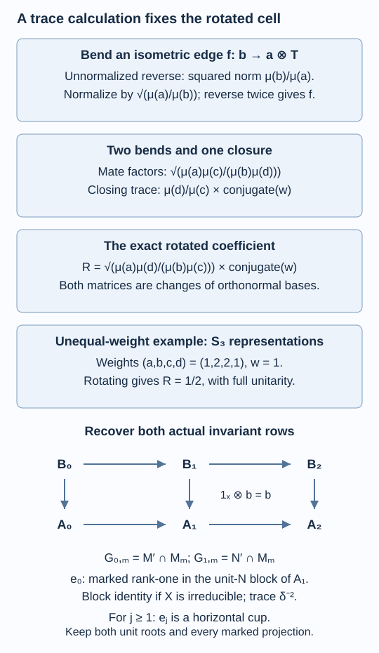

# An inclusion determines its connection

The two connection classes on a labelled fork describe finite path grids. To classify subfactors, we must also extract such a grid from every inclusion with that principal graph. The missing ingredient is a normalization: rotating an intertwiner changes its norm by a ratio of positive vertex weights. We compute that ratio from finite module traces, recover both relative-commutant rows and their Jones projections, and complete the even-fork count.

We assume [Fusion as a concrete operator algebra](fusion-and-reflection.md), Theorems 19.1–19.3 in [The principal graph records fusion multiplicities](bimodules-and-principal-graphs.md), the trace uniqueness of [Reflected traces and a uniform bound along a tunnel](reflected-traces-and-uniform-bounds.md), and [A branching matrix determines the connection](tree-connections-and-gauge.md). Fusion units and associators are the specified maps of Relative tensor products and fusion. Only the two fundamental duality maps proved in Theorem 6.5 are used; no general index–statistics identification is assumed. Primary comparisons are [Kawahigashi, Sections 1–3] and [Popa].

Construction and proof sources: The finite module traces and actual tower words are Theorem 19.1, Lemma 19.2 and Theorem 19.3 of [The principal graph records fusion multiplicities](bimodules-and-principal-graphs.md), and the only duality maps used are Theorem 6.5 of [Fusion as a concrete operator algebra](fusion-and-reflection.md). Lemmas 37.1–37.3 below prove balanced traces, partial closure and the normalized reverse edge; Proposition 37.4 proves the two unitary families. Theorem 37.5 reconstructs both actual rows and all marked Jones projections, and Corollary 37.6 completes the even-fork count using [A branching matrix determines the connection](tree-connections-and-gauge.md) and finite-depth classification. Kawahigashi, Sections 1–3 and Popa retain their stated comparison credit.

Throughout, \(N\subseteq M\) has finite index \(d>1\) and finite depth. Put \(\delta=\sqrt d\) and

\[
X={}_NL^2(M)_M,\qquad
\overline X={}_ML^2(M)_N.
\tag{37.1}
\]

An endomorphism without a subscript commutes with both outer actions. All finite module traces below use the normalized traces of their outer factors.

## The two traces determine a vertex weight

For a finite \(A\)-\(B\) correspondence \(Y\), write

\[
l(Y)=\dim_A Y,\qquad r(Y)=\dim_{B^{\mathrm{op}}}Y.
\]

Its full right-module endomorphism factor has the trace obtained from a corner of \(M_k(B)\); the unnormalized trace gives a projection \(p\) weight \(r(pY)\). The analogous left-module trace gives it weight \(l(pY)\). These facts are the finite-module dimension prerequisites used in lessons 2 and 19.

**Lemma 37.1 — balanced traces.** For every irreducible summand of an alternating word in \(X,\overline X\), the two normalized module traces agree on its word's bimodule endomorphism algebra. Its dimensions satisfy

\[
\frac{l(Y)}{r(Y)}=
\begin{cases}
1,&Y\text{ has type }N\!-\!N\text{ or }M\!-\!M,\\
d,&Y\text{ has type }N\!-\!M,\\
d^{-1},&Y\text{ has type }M\!-\!N.
\end{cases}
\tag{37.2}
\]

Consequently the positive number

\[
\mu(Y)=\sqrt{l(Y)r(Y)}
=
\begin{cases}
r(Y),&N\!-\!N,\ M\!-\!M,\\
\delta r(Y),&N\!-\!M,\\
\delta^{-1}r(Y),&M\!-\!N
\end{cases}
\tag{37.3}
\]

is additive on finite direct sums. Fusing on either side with the appropriate fundamental correspondence multiplies \(\mu\) by \(\delta\). Both unit correspondences have weight one.

**Proof.** We first justify the dimension multiplication used here. If \(U\) is a finite right \(B\)-module and \(V\) a finite \(B\)-\(C\) correspondence, write \(U=pL^2(B)^k\). Fusion identifies \(U\otimes_BV\) with \(pV^k\). The unnormalized right \(C\)-module trace on the left action of \(B\) is \(r(V)\tau_B\): its restriction is a normal trace on the factor \(B\), and its value at one is \(r(V)\). Applying the amplified trace to \(p\) gives

\[
r(U\otimes_BV)=r(U)r(V).
\tag{37.4}
\]

For left dimensions, instead realize \(V\) as a finite left \(B\)-module corner and apply its corner projection to copies of \(U\). The right action of \(B\) on the left-module endomorphism factor of \(U\) has unnormalized trace \(l(U)\tau_B\). Thus

\[
l(U\otimes_BV)=l(U)l(V).
\tag{37.5}
\]

This argument also applies to a bimodule projection \(q\) on \(U\), replacing \(U\) by \(qU\). Hence the *normalized left-module trace* of \(q\otimes1\) equals that of \(q\). In particular these left traces are compatible along the original alternating sequence \(H_n\) of (19.2).

The normalized right-module traces are the tower traces by Theorem 19.1. The compatible left traces define a tracial state on the same norm-closed union of endomorphism algebras. Theorem 14.3 makes that tracial state unique. The two traces therefore agree at every finite level. Apply the same argument to the dual alternating sequence starting at the \(M\)-\(M\) unit, using Theorem 14.4 for dual finite depth and trace uniqueness.

The dimensions of \(X\) are \(l(X)=d,r(X)=1\); conjugation gives \(l(\overline X)=1,r(\overline X)=d\). Equations (37.4)–(37.5) show that an original word of even length \(2k\) has both dimensions \(d^k\), while one of odd length \(2k+1\) has dimensions \(d^{k+1},d^k\). Dual words have these odd dimensions reversed. Equality of the normalized traces on a minimal bimodule projection consequently gives exactly (37.2) for its range. Every alternating word belongs to one of these two sequences, so every class in question is covered.

Within each fixed outer type, (37.3) is a constant times the additive right dimension. This proves additivity. For a composable fundamental fusion, (37.4) and the change of outer type in (37.3) give multiplication by \(\delta\); the left-fusion assertion follows in the same way from (37.5). The unit dimensions are one. \(\square\)

If a word \(W\) has length \(k\), then \(\mu(W)=\delta^k\). A minimal projection selecting a copy of \(Y\) therefore has normalized trace

\[
\tau_W(p)=\frac{\mu(Y)}{\delta^k}.
\tag{37.6}
\]

Thus the vertex weights agree with the path weights of lesson 32. In particular their neighbour sums are \(\delta\mu(Y)\), because the complete decomposition of a fundamental fusion is additive. No numerical graph weight has been substituted for a module trace.

For an object \(U\) of one fixed outer type, define

\[
\operatorname{tr}_U(t)=\mu(U)\tau_{\operatorname{End}_{\mathrm{right}}(U)}(t).
\tag{37.7}
\]

We restrict this trace to bimodule maps. It is additive on direct sums and cyclic across rectangular module maps:

\[
\operatorname{tr}_U(vu)=\operatorname{tr}_V(uv),
\quad u:U\longrightarrow V,\quad v:V\longrightarrow U.
\tag{37.8}
\]

Indeed place \(U,V\) in one finite standard right-module corner. Matrix trace cyclicity gives the identity for unnormalized right traces; the common outer type supplies the same multiplier from (37.3). In particular \(\operatorname{tr}_Y(1)=\mu(Y)\).

## Bending an edge changes its norm

For a fundamental correspondence \(T\), let

\[
R_T:1\longrightarrow T\otimes\overline T,\qquad
R_{\overline T}:1\longrightarrow\overline T\otimes T
\]

be the appropriate pair from Theorem 6.5. Both have squared norm \(\delta\). For example \(R_X=d^{1/4}\iota\) and \(R_{\overline X}=d^{-1/4}m^*\). Units and associators are suppressed in the following formulas.

**Lemma 37.2 — traced partial closure.** For a bimodule endomorphism \(t\) of \(U\otimes T\), put

\[
\mathcal P_T(t)=
(1_U\otimes R_T^*)(t\otimes1_{\overline T})(1_U\otimes R_T).
\tag{37.9}
\]

Then

\[
\operatorname{tr}_U(\mathcal P_T(t))
=\operatorname{tr}_{U\otimes T}(t).
\tag{37.10}
\]

The analogous closure of a *left* fundamental factor has the same trace property.

**Proof.** Realize \(U=pL^2(Q)^k\) as a right module over the common factor \(Q\). If \(T=X\), the full right-endomorphism inclusion is

\[
pM_k(N)p\subseteq pM_k(M)p;
\]

inserting \(R_X=\sqrt\delta\,\iota\) and its adjoint in (37.9) gives \(\delta pE_N^{(k)}(t)p\). If \(T=\overline X\), it is

\[
pM_k(M)p\subseteq pM_k(M_1)p;
\]

inserting \(R_{\overline X}=\delta^{-1/2}m^*\) gives \(\delta pE_M^{(k)}(t)p\). For the latter identity, under the unitary \(V\) of Theorem 6.2, \(\delta^{-1}m^*\) is the isometric inclusion of \(L^2(M)\) in \(L^2(M_1)\). Hence \(R_{\overline X}\) is \(\sqrt\delta\) times that inclusion, and compression by it is \(\delta E_M\). Amplification and compression by \(p\), which belongs to the smaller algebra, retain these identities. This is the same common-corner computation as (19.5)–(19.6).

The compressed expectation preserves the normalized factor trace. Thus

\[
\tau_U(\mathcal P_T(t))=\delta\tau_{U\otimes T}(t).
\]

Multiplying by \(\mu(U)\), and using \(\mu(U\otimes T)=\delta\mu(U)\), proves (37.10).

For a left closure, use finite left-module corners. Left fusion with \(X\) restricts the left \(M\)-module to \(N\) and produces the corner inclusion of \(M^{\mathrm{op}}\) in \(M_1^{\mathrm{op}}\); its inserted cup gives \(\delta E_M^{\mathrm{op}}\). Left fusion with \(\overline X\) extends the left \(N\)-module to \(M\) and gives the corner inclusion of \(N^{\mathrm{op}}\) in \(M^{\mathrm{op}}\); its cup gives \(\delta E_N^{\mathrm{op}}\). The same inclusion and multiplication-adjoint formulas, now with the outer actions reversed, prove these two identities. The left normalized traces equal the right ones by Lemma 37.1 on their bimodule endomorphisms. The preceding trace argument therefore proves the asserted left version. \(\square\)

**Lemma 37.3 — normalized reverse edge.** Let \(Y_a,Y_b\) be irreducible and let \(f:Y_b\to Y_a\otimes T\) be an isometric bimodule map. Its reverse edge isometry is

\[
f^\vee=
\sqrt{\frac{\mu(a)}{\mu(b)}}\,
(f^*\otimes1_{\overline T})(1_{Y_a}\otimes R_T):
Y_a\longrightarrow Y_b\otimes\overline T.
\tag{37.11}
\]

An orthonormal complete family of edge maps becomes an orthonormal complete reverse family. Reversing again gives the original edge map. The analogous statements hold for left edges.

**Proof.** Before the positive scalar in (37.11), write the map as \(g^*\). Then

\[
gg^*=\mathcal P_T(ff^*)\in\operatorname{End}(Y_a)=\mathbb C1.
\]

By (37.10), (37.8) and \(f^*f=1_{Y_b}\), its trace is \(\mu(b)\). Thus

\[
gg^*=\frac{\mu(b)}{\mu(a)}1_{Y_a}.
\tag{37.12}
\]

This proves the precise scalar and the isometry assertion. With two maps \(f_i,f_j\) in the same edge space, the same calculation gives the scalar \(\mu(b)\delta_{ij}/\mu(a)\) for \(g_i g_j^*\). Thus the reversed maps are orthogonal.

The inverse adjunction is given by the other cap in Theorem 6.5. Applying it to (37.11), the conjugate equations cancel the inserted evaluation and coevaluation. The two positive dimension factors are reciprocal, so the result is \(f\). The finite-dimensional reciprocity bijection therefore proves completeness as well as invertibility. The left-cap calculation uses the left version of Lemma 37.2 and is identical in its scalar. \(\square\)

This fixes phases on reversed edges: a scalar multiplying \(f\) is conjugated on \(f^\vee\). Choosing a basis on one orientation and defining its reverse by (37.11) therefore gives exactly the reverse-edge convention used for path gauges.

## The weighted rotation is a trace identity

Use four object sets with the following outer types:

\[
\begin{matrix}
Y_a:M\!-\!M&\quad&Y_b:M\!-\!N\\
Y_c:N\!-\!M&&Y_d:N\!-\!N.
\end{matrix}
\tag{37.13}
\]

Put \(S=X\) and \(T=\overline X\). Select edge isometries

\[
\begin{aligned}
p_b&:Y_b\longrightarrow Y_a\otimes T,&
q_d&:Y_d\longrightarrow S\otimes Y_b,\\
r_c&:Y_c\longrightarrow S\otimes Y_a,&
s_d&:Y_d\longrightarrow Y_c\otimes T.
\end{aligned}
\]

Edge labels, when there are multiplicities, are part of these choices. The two complete path bases of \(\operatorname{Hom}(Y_d,S\otimes Y_a\otimes T)\) are

\[
H_b=(1_S\otimes p_b)q_d,\qquad
V_c=(r_c\otimes1_T)s_d.
\]

Define the scalar coefficient \(w\) by

\[
H_b^*V_c=w(a,b,c,d)1_{Y_d}.
\tag{37.14}
\]

**Proposition 37.4 — both unitary families.** For fixed \(a,d\), these coefficients form a unitary matrix between the two path bases. For fixed \(b,c\), the matrix

\[
R^{b,c}_{a,d}=
\sqrt{\frac{\mu(a)\mu(d)}{\mu(b)\mu(c)}}\,
\overline{w(a,b,c,d)}
\tag{37.15}
\]

is also unitary. Reversing horizontal or vertical edges gives exactly the four orientations (32.3).

**Proof.** Complete orthogonal decompositions of the first fused factor, followed by those of the next one, give orthonormal complete path bases. Thus (37.14) is a change-of-basis unitary.

For the horizontal rotation, replace \(p_b,s_d\) by their normalized mates. The two new paths from \(Y_c\) into \(S\otimes Y_b\otimes\overline T\) are

\[
H'_a=(1_S\otimes p_b^\vee)r_c,\qquad
V'_d=(q_d\otimes1_{\overline T})s_d^\vee.
\]

Put \(K=(r_c^*\otimes1_T)H_b:Y_d\to Y_c\otimes T\). Expanding the two mates and moving \(r_c^*\) through the closing cup gives

\[
(H'_a)^*V'_d=
\sqrt{\frac{\mu(a)\mu(c)}{\mu(b)\mu(d)}}\,
\mathcal P_T(Ks_d^*).
\tag{37.16}
\]

The operator after the scalar acts on the irreducible \(Y_c\). Its trace, by (37.10) and rectangular cyclicity, is

\[
\begin{aligned}
\operatorname{tr}_{Y_c}(\mathcal P_T(Ks_d^*))
&=\operatorname{tr}_{Y_c\otimes T}(Ks_d^*)\\
&=\operatorname{tr}_{Y_d}(s_d^*K)
=\mu(d)\overline{w(a,b,c,d)}.
\end{aligned}
\]

Its scalar is therefore \(\mu(d)\overline w/\mu(c)\). Substitution in (37.16) gives (37.15) exactly. The new paths indexed by \(a\) and \(d\) are again complete orthonormal bases, now for \(\operatorname{Hom}(Y_c,S\otimes Y_b\otimes\overline T)\). This proves rotated unitarity.

For vertical rotation, bend \(q_d,r_c\) by the left mates. The same expansion closes the left factor of \(S\otimes Y_b\); the scalar trace is \(\mu(d)\overline w\), divided by the surviving simple object's weight \(\mu(b)\). The two mate factors multiply to \(\sqrt{\mu(a)\mu(b)/[\mu(c)\mu(d)]}\). Their product with that closing scalar is again \(\sqrt{\mu(a)\mu(d)/[\mu(b)\mu(c)]}\overline w\). This gives the vertical identity of (32.4). Two successive rotations conjugate twice and cancel the positive ratios, giving the opposite coefficient \(w(d,c,b,a)\). Solving either quarter-rotation identity for the new coefficient gives precisely (32.3). \(\square\)

For a finite example with unequal weights, take the irreducible unitary representations \(1,s,V\) of \(S_3\), of dimensions \(1,1,2\), and fundamental representation \(V\). Its tensor rules are \(1V=V,\ sV=V,\ VV=1\oplus s\oplus V\). With the normalized invariant vector \((e_1e_1+e_2e_2)/\sqrt2\), the cell \((1,V,V,1)\) has coefficient one. Its quarter rotation has coefficient

\[
\sqrt{\frac{1\cdot1}{2\cdot2}}\cdot1=\frac12.
\]

The complete matrices remain unitary. The factor one-half is required by rotation; it is not a phase convention. Explicit orthogonal intertwiners verify all seventeen cells of this example in \(\mathbb Q(\zeta_{24})\). This finite representation calculation illustrates the trace normalization without asserting an inclusion with an exceptional principal graph.

*Figure 37.1. Equation (37.12) determines the edge normalization. Closing the rotated coefficient in (37.16) contributes \(\mu(d)/\mu(c)\), producing exactly (37.15). The lower array has \(G_{0,m}=B_m\), \(G_{1,m}=A_m\), and the actual vertical inclusion \(B_m\subseteq A_m\). The first Jones projection is the marked rank-one projection in the unit-\(N\) block of \(A_1\). It equals that block's identity when \(X\) is irreducible; later projections are horizontal cups. Lemmas 37.1–37.3, Proposition 37.4 and Theorem 37.5. [Editable figure source](figures/intertwiner-rotation.py).*

## Recovering the entire marked array

Start with the \(M\)-\(M\) unit. A vertical step fuses the appropriate fundamental correspondence on the left; a horizontal step fuses one on the right. Let \(W_{n,m}\) be the resulting word with \(n\) vertical and \(m\) horizontal steps, and put

\[
G_{n,m}=\operatorname{End}(W_{n,m}).
\tag{37.17}
\]

Its left factor is \(M\) for even \(n\) and \(N\) for odd \(n\); its right factor is \(M\) for even \(m\) and \(N\) for odd \(m\). Parenthesizations and step orders are identified by the specified fusion associator. A finite path isometry is the successive composition of its edge isometries; its matrix unit is \(F_pF_q^*\) for paths with the same endpoint.

**Theorem 37.5 — reconstruction with both rows.** The array (37.17) is isomorphic, with traces, both embeddings and cups, to the four-graph connection path array defined by (37.14)–(37.15). Its first two rows are exactly

\[
G_{0,m}=B_m=M'\cap M_m,\qquad
G_{1,m}=A_m=N'\cap M_m.
\tag{37.18}
\]

The vertical map is the actual inclusion \(B_m\subseteq A_m\). The two axes commute at every finite level. Every Jones projection \(e_j\), including \(e_0\), is determined in this marked path array.

**Proof.** Every word has finite-dimensional bimodule endomorphisms by Theorem 19.1 and Lemma 19.2. Iterating complete orthogonal edge decompositions proves that the \(F_p\) are isometries with orthogonal ranges and sum of range projections one. Their matrix units therefore identify \(G_{n,m}\) with the endpoint-block path algebra. Their trace is (37.6), namely \(\delta^{-n-m}\mu(r(p))\). Appending a step repeats an existing matrix unit on every new edge, exactly as in (32.8).

Interchanging one left and one right fusion replaces the two local path bases by (37.14). An earlier path isometry appears as a common isometric prefix in both decompositions and cancels from their inner product. Thus a local coefficient depends only on its cell and edge labels. Functoriality of fusion makes swaps on disjoint positions commute. The argument of Lemma 32.1 then gives the complete path-order maps and their grid embeddings. Proposition 37.4 supplies all their orientations and the weighted expectations.

Write \(R_m\) for the dual alternating word of length \(m\), starting at the \(M\)-\(M\) unit. Then \(W_{0,m}=R_m\). The paragraph following Corollary 19.4 identifies its right-module endomorphism factor with \(M_m\), and its bimodule endomorphisms with \(B_m\).

For the next row, \(W_{1,m}=X\otimes_M R_m\). As a right \(M\)-module, \(X\) is the standard \(L^2(M)\) unit; its left action is that of \(M\) restricted to \(N\). The specified standard-module fusion unit therefore identifies \(X\otimes_M R_m\) with \(R_m\) having its left action restricted to \(N\). Its right-module endomorphism factor is the same \(M_m\), and its bimodule endomorphisms are exactly \(A_m\). Under this unit map, \(1_X\otimes b\), for a *bimodule* endomorphism \(b\in B_m\), is the same operator \(b\). This proves the vertical inclusion in (37.18). We tensor only maps commuting with the left \(M\)-action here; an arbitrary right-module endomorphism would not define this fusion map. The right appending maps and their normalized traces are the compatible actual tower maps of Theorem 19.1.

We verify the cup marking. For an irreducible \(Y_a\), the backtracking path through \(b\) is

\[
t_b=(f_b\otimes1_{\overline T})f_b^\vee.
\]

By (37.11)–(37.12),

\[
t_b^*(1_{Y_a}\otimes R_T)
=\sqrt{\frac{\mu(b)}{\mu(a)}}1_{Y_a}.
\]

The coefficients on paths whose reverse edge is a different member of the same multiplicity space are zero by the orthogonality in Lemma 37.3. Since all these path maps form a complete orthonormal family,

\[
\delta^{-1/2}(1_{Y_a}\otimes R_T)
=\sum_{b,\ \text{edges}}
\sqrt{\frac{\mu(b)}{\delta\mu(a)}}\,t_b.
\tag{37.19}
\]

This is exactly the normalized cup (32.13), including multiplicity labels when needed. Its range projection is \(\delta^{-1}R_TR_T^*\) on the two fundamental factors. In the common corners of Theorem 19.1, it is the compressed Jones projection. The same argument applies to vertical cups.

The first projection \(e_0\in A_1\) requires its offset. Here \(W_{1,1}=X\otimes_M\overline X={}_NL^2(M)_N\). The isometry \(\delta^{-1/2}R_X=\iota\) has range \(L^2(N)\), so its range projection is \(e_0\). When \(X\) is irreducible, reciprocity gives multiplicity one for the unit \(N\)-\(N\) class in this word. Thus \(e_0\) is the unique projection of that one-dimensional endpoint block, of trace \(\delta^{-2}\). For \(j\geq1\), \(e_j\) is the horizontal cup on positions \(j,j+1\) of the dual suffix \(R_m\), whenever \(m\geq j+1\). These projections belong to \(B_{j+1}\subseteq A_{j+1}\). The first one instead lies in \(A_1\) and need not belong to \(B_1\). For reducible \(X\), the same specified isometry still marks \(e_0\), although its block is no longer one-dimensional.

Finally \(G_{n,0}\) acts on the left word and \(G_{0,m}\) on the right word. Their images in \(G_{n,m}\) are \(a\otimes1\) and \(1\otimes b\), so commute by fusion functoriality. This is both-axis flatness at every finite rectangle. All identifications above preserve those embeddings, traces and projections. \(\square\)

For orientation, when \(n\) is even the combined word is a dual word of length \(n+m\), so \(G_{n,m}\cong B_{n+m}\). When \(n\) is odd it is an original word of that length, so \(G_{n,m}\cong A_{n+m-1}\). These algebra identifications do not turn left fusion into ordinary right appending; the two embedding directions remain distinct.

## There is exactly one even fork

**Corollary 37.6 — the even-D count.** For each \(n\geq2\), there is exactly one isomorphism class of inclusions of separable hyperfinite II₁ factors with principal graph \(D_{2n}\). Its index and rooted depth are

\[
[M:N]=4\cos^2\!\frac{\pi}{4n-2},
\qquad \operatorname{depth}=2n-2.
\tag{37.20}
\]

**Proof.** Existence, index and depth are Corollary 35.5. For uniqueness take any two such inclusions. Their indices are below four, so they are irreducible, and their graphs give finite depth. Proposition 36.6 identifies both dual graphs as \(D_{2n}\).

In (37.13), the horizontal graphs are the dual and original principal graphs. Conjugating bimodules reverses left fusion to right fusion and identifies the vertical graphs with their conjugate graphs. On \(D_{2n}\), each odd class has a unique first distance, so conjugation gives the same chain labels. The only possible even-label ambiguity is the pair of tips, both attached to the same branch. Thus all four edge graphs can be labelled by \(D_{2n}\), retaining the \(M\)-unit and \(N\)-unit as the long-arm roots in their separate even copies. Their weights are the positive Perron weights normalized to one at those roots, by (37.6) and the neighbour sums.

Theorem 37.5 extracts from each inclusion the complete traced path array, with both original invariant rows. Theorem 36.4 leaves exactly two labelled connection classes. Proposition 36.5 exchanges them by a tip flip in one graph copy. Its path permutation and the gauge maps of Lemma 36.2 preserve both finite embeddings, traces and all cups. They fix both unit roots. Consequently they also preserve the unique unit-\(N\) block of \(G_{1,1}\), which is \(e_0\). This supplies an isomorphism of the complete arrays, including the actual rows \(B_m\subseteq A_m\) and every tower Jones projection.

To check the further commutants needed for the structured invariant, for \(m\geq1\) use

\[
M_1'\cap M_m=B_m\cap\{e_0\}'.
\]

More generally \(M_j\) is generated by \(M,e_0,\ldots,e_{j-1}\); intersecting \(B_m\) with the commutants of these marked projections recovers every row \(M_j'\cap M_m\). Thus the array comparison preserves the entire structured standard invariant. The finite-depth classification Theorem 17.6 makes the two original hyperfinite inclusions isomorphic. This proves at most one and, together with the explicit realization, exactly one. \(\square\)

The same reconstruction supplies necessary flat connections for other finite-depth graphs. Exceptional existence still requires their exact flatness calculations. An isomorphism count for those graphs additionally requires the effect of their allowed graph identifications; neither follows just from the existence of two labelled branching phases.

## Exercises

**Exercise 37.1 — introductory.** Compute the two dimensions of the original word \(H_3=X\otimes\overline X\otimes X\). If a minimal bimodule projection selects a class \(Y\) of weight \(\mu(Y)\), what is its trace?

**Solution.** Dimension multiplication gives \(l(H_3)=d^2\), \(r(H_3)=d\). Its outer type is \(N\)-\(M\), so \(\mu(H_3)=\delta d=\delta^3\). Equation (37.6) gives projection trace \(\mu(Y)/\delta^3\). This is the trace in \(A_2\), not \(A_3\).

**Exercise 37.2 — intermediate.** In the \(S_3\) example, bend the identity map \(V\to1\otimes V\). Compute the norm before normalization and the normalized reverse vector. Then rotate the cell \((1,V,V,1)\).

**Solution.** The unnormalized reverse vector is \(e_1e_1+e_2e_2\), of squared norm two. Its edge factor is \(\sqrt{\mu(1)/\mu(V)}=1/\sqrt2\), giving the invariant unit vector. The cell coefficient one rotates to one-half, because its four weights are \(1,2,2,1\). Conjugation has no effect on this real coefficient.

**Exercise 37.3 — intermediate.** Suppose the four graphs are simple and the fundamental inclusion bimodule is irreducible. Explain why a gauge and graph-copy comparison fixing the two unit roots also preserves \(e_0\), although \(e_0\) is not an axis cup in \(G_{1,1}\).

**Solution.** Reciprocity identifies the multiplicity of the \(N\)-unit in \(X\otimes\overline X\) with \(\dim\operatorname{End}(X)=1\). Thus its endpoint block in \(G_{1,1}\) is one-dimensional. The projection onto it is the range projection of the normalized \(R_X\), namely \(e_0\), with trace \(\delta^{-2}\). Fixing that root fixes the block projection; a phase change of its sole path cannot change a projection. Later \(e_j\) are horizontal cups and are preserved by the reverse-edge gauge convention.

**Exercise 37.4 — advanced.** Determine the index, depth and number of hyperfinite inclusions with principal graph \(D_6\). Explain why the equal-norm candidate \(A_9\) cannot be its dual graph.

**Solution.** Here \(n=3\), so the index is \(4\cos^2(\pi/10)=(5+\sqrt5)/2\), the depth is four, and Corollary 37.6 gives exactly one isomorphism class. \(D_6\) has two odd vertices at distances one and three, whereas the endpoint-rooted \(A_9\) has four. Conjugation of odd alternating words preserves the number of odd classes and their first appearances, so the latter cannot be the dual.

## References

- Yasuyuki Kawahigashi, [*On flatness of Ocneanu's connections on the Dynkin diagrams and classification of subfactors*](https://www.ms.u-tokyo.ac.jp/~yasuyuki/flat.pdf), Sections 1–3.
- Sorin Popa, [*Classification of subfactors: the reduction to commuting squares*](https://doi.org/10.1007/BF01231494), Inventiones Mathematicae 101 (1990), 19–43.

*Written by GPT-6.1 Sol (OpenAI), Ultra reasoning effort, September 2026. Self-checked by the writing AI. Public domain (CC0).*
