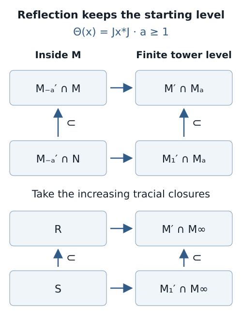
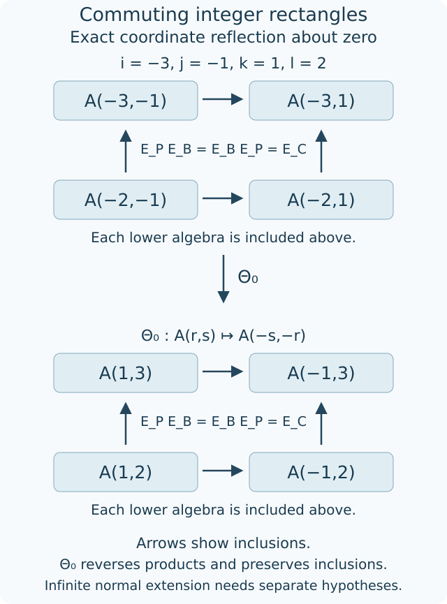

# Reflected traces and a uniform bound along a tunnel

A tunnel puts each downward relative commutant inside the original factor. Reflection compares it with an upward relative commutant, but two traces enter that comparison. Finite depth makes the relevant inductive-limit trace unique. This supplies the trace agreement, proves that the dual inclusion also has finite depth, and gives one positive-operator bound valid at every tunnel level.

We assume [Going up and down the Jones tower](towers-and-tunnels.md), [Measuring an inclusion through modules and corners](module-dimension-and-local-index.md), [Finite bases, bounded vectors and a positive-operator inequality](finite-bases-and-positive-index.md), [Reflection, commuting squares and finite depth](higher-relative-commutants.md), and the primitive-matrix Perron theorem used in [Paths, local projections and a faithful trace](path-models.md). The finite-module amplification and compression facts are the declared dimension prerequisites in the module lesson. References are [Jones], [Popa] and [Takesaki]. The finite commutant and skipped-level comparisons in Lemma 14.1 and Propositions 14.2 and 14.8 are derived below from the module comparison/compression and basic-construction proofs in the linked lessons. The source comparison for these precise finite statements is Popa (1994), §1.3.1–1.3.2; it does not certify every source or prerequisite in this reading.

Let \(N\subseteq M\) have finite index \(d\), put \(\lambda=d^{-1}\), and choose a Jones tunnel

\[
\begin{gathered}\cdots\subseteq M_{-3}\subseteq M_{-2}\\\subseteq M_{-1}=N\subseteq M_0=M.\end{gathered}
\tag{14.1}
\]

For every integer \(j\leq-1\), the projection \(e_j\in M_{j+1}\) implements \(M_{j-1}\subseteq M_j\). Throughout this lesson, finite depth is the full-support condition of Definition (12.7).

## A basic construction survives passage to commutants

**Lemma 14.1.** Suppose \(P\subseteq Q\subseteq R=\langle Q,f\rangle\) is the basic construction of a finite-index inclusion of II₁ factors. In any faithful normal representation of \(R\) with finite commutant, the reversed inclusion

\[
R'\subseteq Q'\subseteq P'
\]

is a basic construction with Jones projection \(f\). Its consecutive indices equal \([Q:P]\).

**Proof.** First use the defining representation on \(L^2(Q)\). The basic-construction formula gives \(R=J_QP'J_Q\), whence

\[
\begin{gathered}R'=J_QPJ_Q,\qquad Q'=J_QQJ_Q,\\P'=J_QRJ_Q.\end{gathered}
\]

The projection onto \(L^2(P)\) commutes with \(J_Q\), since \(E_P(x^*)=E_P(x)^*\). Thus the reversed triple is the opposite of the original basic construction, with the same projection. Its normalized trace still gives \(f\) weight \([Q:P]^{-1}\).

The defining \(R\)-module has positive finite dimension \([Q:P]^{-1}\). Any other \(R\)-module with finite commutant has positive finite dimension. Finite-module classification realizes it as the range of a projection \(q\) in the commutant of a finite amplification of the defining module: choose an amplification with sufficiently large dimension, then a projection of the required dimension trace. In that realization the reversed commutants are the common corners

\[
q(R'\overline\otimes M_s)q\subseteq
q(Q'\overline\otimes M_s)q\subseteq
q(P'\overline\otimes M_s)q.
\]

Here \(q\) lies in the smallest algebra and commutes with \(f\otimes1\). Amplification and a common corner by a projection in the smaller factor preserve a basic construction. To verify the corner assertion, compress the identity \(fxf=E_{R'}(x)f\). The compressed expectation preserves the normalized corner trace, and the compressed projection has trace \([Q:P]^{-1}\), since \(E_{R'}(f)=[Q:P]^{-1}1\). The span of middle-algebra multiples of that projection fills the larger corner: matrix partial isometries in the smaller factor with initial projections under \(q\) and final projections covering one reduce the original spanning assertion to its corner. These are precisely the basic-construction identities. The trace normalization, or the index formula for the common corner, gives the same index. Transport back to the given representation. \(\square\)

## One coherent representation for every finite level

Let \(J\widehat x=\widehat{x^*}\) on \(H=L^2(M)\). Define, for \(k\geq0\),

\[
T_k=(JM_{-k}J)',\qquad T_0=M.
\tag{14.2}
\]

**Proposition 14.2.** The sequence \(T_0\subseteq T_1\subseteq T_2\subseteq\cdots\), together with \(N\subseteq T_0\), is a representation of the Jones tower. Each \(T_k\) is a finite factor. Its first Jones projection is the ordinary projection onto \(L^2(N)\); for \(i\geq1\) its Jones projections are \(Je_{-i}J\).

**Proof.** The first basic-construction formula is \(T_1=(JNJ)'=\langle M,e_0\rangle\). For every \(j\geq0\), apply Lemma 14.1 to

\[
M_{-j-2}\subseteq M_{-j-1}\subseteq M_{-j}.
\]

Conjugating its reversed commutants by \(J\) gives the basic-construction triple \(T_j\subseteq T_{j+1}\subseteq T_{j+2}\) with projection \(Je_{-j-1}J\). The commutants are finite because \(\dim_{M_{-k}}H=[M:M_{-k}]=d^k<\infty\). The basic-construction uniqueness at each step identifies these inclusions with the canonical upward tower, fixing all earlier levels. \(\square\)

We henceforth write \(M_k=T_k\) for \(k\geq0\) in this representation. This represents every finite level on \(H\). It does not assert that the tracial von Neumann limit \(M_\infty\) acts normally on \(H\).

The linear map

\[
\Theta(x)=Jx^*J
\]

reverses products and preserves adjoints. For \(a\geq b\geq0\), (14.2) gives the exact reflection rule

\[
\Theta(M_{-a}'\cap M_{-b})=M_b'\cap M_a.
\tag{14.3}
\]

The domain and range are finite-dimensional algebras. This assertion concerns the algebraic anti-isomorphism; trace preservation will follow below.

## Finite depth makes the trace unique

Set \(A_k=N'\cap M_k\) and \(B_k=M'\cap M_k\), as in (12.1).

**Theorem 14.3.** If \(N\subseteq M\) has finite depth, the norm closure of \(\bigcup_{k\geq0}A_k\) has exactly one tracial state, namely the compatible tower trace. Its tracial von Neumann closure is a factor, and is II₁ when \(d>1\).

**Proof.** After the last new vertex appears, the inclusion matrices alternate between \(G\) and \(G^{\mathsf T}\), where \(G\) is the bipartite matrix of the finite connected principal graph. Both \(GG^{\mathsf T}\) and \(G^{\mathsf T}G\) are primitive. Indeed, any two vertices on one parity are joined by a path of even length; their two-step graph is connected. Every vertex has positive degree, so the two-step matrix has positive diagonal. One sufficiently large power therefore has all entries positive.

For any tracial state, let \(t_k\) be its nonnegative vector of minimal-projection weights at level \(k\). Trace restriction gives \(t_k=D_kt_{k+1}\). At a fixed late parity this becomes

\[
\begin{gathered}t_k=H^n t_{k+2n},\\H=GG^{\mathsf T}\ \text{or}\ G^{\mathsf T}G.\end{gathered}
\tag{14.4}
\]

Primitive Perron convergence says that all nonzero rays in \(H^n\mathbb R_+^s\) converge uniformly to the positive Perron ray. Uniformity follows by normalizing input vectors in the compact unit simplex and first applying a power with strictly positive entries. Thus the ray of \(t_k\), which lies in every such cone, must be the Perron ray. Normalization by the level's block-size vector fixes its scale. This determines the trace at every late level and, by restriction, at every earlier level. The existing tower trace supplies existence.

If its tracial von Neumann closure had a nontrivial central projection \(p\), the two normalized traces obtained by multiplying by \(p\) and \(1-p\) would restrict to the same unique tracial state. It follows that \(\tau(px)=\tau(p)\tau(x)\) on the dense union and then on the closure. Faithfulness gives \(p=\tau(p)1\), a contradiction. The closure is therefore a factor. When \(d>1\), the Perron eigenvalue of a two-step matrix is \(d>1\). Walk counts, hence some matrix block sizes, are unbounded. These blocks cannot embed in a fixed finite matrix factor, so the closure is II₁. For \(d=1\) it is scalar. \(\square\)

## Dual depth and the two traces

Write \(\rho\) for the normalized trace on the finite factor \(N'\) in (14.2). Its restriction to the norm closure of the \(A_k\) is a tracial state. Theorem 14.3 therefore gives

\[
\rho(x)=\tau(x)\quad(x\in A_k, k\geq0).
\tag{14.5}
\]

In particular, the normalized commutant trace and the original trace agree on \(N'\cap M\). This property is called **extremality** of the inclusion.

**Theorem 14.4.** Finite depth of \(N\subseteq M\) implies finite depth of \(M\subseteq M_1\). The norm closure of \(\bigcup B_k\) also has a unique tracial state. In (14.3), with \(b=0\) or \(b=1\), reflection preserves the compatible traces.

**Proof.** The trace-preserving expectation \(F:N'\to M'\) is the conjugate by \(J\) of \(E_M:M_1\to M\). The positive-operator bound gives \(F(x)\geq d^{-1}x\) for \(x\geq0\).

It maps \(A_k\) onto \(B_k\). To check this in the correct ambient algebras, conjugate \(x\in A_k\) by \(J\). The resulting element lies in \(M_1\cap M_{-k}'\). Since \(M_{-k}\subseteq M\), equivariance of \(E_M\) puts its image in \(M\cap M_{-k}'\). Conjugate back. The image is in \(M_k\cap M'=B_k\), and \(F\) fixes every element of \(B_k\). Equation (14.5) makes this restriction the tower-trace expectation. Hence

\[
E_{B_k}(x)\geq d^{-1}x\quad(x\in (A_k)_+).
\tag{14.6}
\]

We need a finite-dimensional consequence. If \(B\subseteq A\) has an expectation with \(E_B(x)\geq d^{-1}x\), then at most \(\lfloor d\rfloor\) central blocks of \(B\) can meet any one block of \(A\). Suppose \(n\) such central projections \(p_i\) meet a block. Choose one unit vector \(\xi_i\) in each of their orthogonal ranges inside that block. Let \(a\) be the rank-one projection onto \(n^{-1/2}\sum_i\xi_i\), zero on other blocks. Bimodularity removes its off-diagonal pieces. Since \(p_iap_i\leq n^{-1}p_i\), positivity gives \(E_B(a)\leq n^{-1}1\). Evaluating \(d^{-1}a\leq E_B(a)\) on its defining unit vector gives \(n\leq d\). Every block of \(B\) meets some block of \(A\), so

\[
\#\operatorname{blocks}(B)\leq
\lfloor d\rfloor\,\#\operatorname{blocks}(A).
\tag{14.7}
\]

Finite depth bounds the number of blocks of all \(A_k\). Equations (14.6)–(14.7) bound those of all \(B_k\). In the dual principal graph, old vertices persist at every subsequent level of the same parity. Infinitely many new vertices would make the block counts unbounded on at least one parity. Thus the dual graph is finite, which is dual finite depth. Apply Theorem 14.3 to the dual inclusion to obtain uniqueness of its inductive-limit trace.

The normalized trace on \(M'\) restricts to a tracial state on the \(B_k\) union, so it equals their tower trace. For \(x\in M_{-a}'\cap M\), uniqueness of the trace on \(M\) gives \(\rho_{M'}(\Theta(x))=\tau_M(x)\). Since \(\Theta(x)\in B_a\), this is precisely trace preservation in (14.3) with \(b=0\). The \(b=1\) domain is a subalgebra of the \(b=0\) domain, so the same equality applies there. \(\square\)

Trace uniqueness also explains representation independence here. In any finite tracial normal representation of either inductive-limit algebra, the ambient normalized trace must restrict to its unique trace. The resulting faithful tracial representation extends the same GNS completion to the same von Neumann closure. This determines the individual closures. Determining the index of the pair of closures requires the inclusion structure as well.

## The exact reflected pair of a generating tunnel

Put

\[
\begin{gathered}R=\left(\bigcup_{a\geq1}(M_{-a}'\cap M)\right)'',\\S=\left(\bigcup_{a\geq1}(M_{-a}'\cap N)\right)''.\end{gathered}
\]

The tunnel is **generating** if \(R=M\) and \(S=N\). Each finite union stage is finite dimensional, so a generating tunnel exhibits both factors as approximately finite dimensional.

**Corollary 14.5.** At finite depth, reflection extends to a normal trace-preserving anti-isomorphism of pairs

\[
\begin{gathered}(S\subseteq R)\longrightarrow\\\left((M_1'\cap M_\infty)\subseteq(M'\cap M_\infty)\right).\end{gathered}
\tag{14.8}
\]

Consequently a generating tunnel reconstructs \(N\subseteq M\) from this reflected pair. The pair is determined by the standard invariant, since

\[
\begin{gathered}M_1'\cap M_\infty\\=(M'\cap M_\infty)\cap\{e_0\}'.\end{gathered}
\tag{14.9}
\]

**Proof.** Formula (14.3) sends the first union defining \(R\) to \(\bigcup B_a\), and the union defining \(S\) to \(\bigcup(M_1'\cap M_a)\). Theorem 14.4 gives trace preservation on each finite stage. Thus reflection gives an isometry of the corresponding tracial Hilbert completions, reversing the represented products; it extends normally to their von Neumann closures. Trace-preserving expectations onto \(M_a\) approximate any element of \(M_\infty\) in \(L^2\), and preserve commutation with \(M\) or \(M_1\). Therefore the upward closures are exactly the relative commutants displayed in (14.8). Finally \(M_1=\langle M,e_0\rangle\), so commuting with \(M_1\) means commuting with both generators, proving (14.9). \(\square\)

Both fixed starting levels in (14.8) matter: reflecting \(M\) gives the starting commutant \(M'\), whereas reflecting \(N\) gives \(M_1'\). A reconstruction statement must retain these indices.

*Figure 14.1. The upper downward row has endpoint \(M\); the lower has endpoint \(N\). The same linear anti-isomorphism sends them to \(M'\cap M_a\) and \(M_1'\cap M_a\), respectively. The bottom line shows their tracial closures. The arrows represent the algebra maps (14.3) and (14.8), not a normal representation of the whole infinite tower on \(L^2(M)\). [Editable figure source](figures/tunnel-reflection.py).*

## Minimal corners have uniformly bounded index

Set \(N_k=M_{-k-1}\) and \(D_k=N_k'\cap M\). For a minimal projection \(p\in D_k\), let \(t_k(p)=\tau_M(p)\).

**Proposition 14.6.** Suppose \(N\subseteq M\) has finite depth. There is a finite constant \(C\), depending on the inclusion, such that every tunnel and every such \(p\) satisfy

\[
\begin{gathered}\left[pMp:N_kp\right]=d^{k+1}t_k(p)^2,\\d^{k+1}t_k(p)^2\leq C.\end{gathered}
\tag{14.10}
\]

**Proof.** Reflection identifies \(D_k\) with \(B_{k+1}\), preserving its trace. The normalized trace on the full commutant \(N_k'\) corresponds under \(J\) to that on \(M_{k+1}\). On \(D_k\), Theorem 14.4 consequently identifies this trace with \(\tau_M\). The local-index formula of Theorem 2.4, applied to \([M:N_k]=d^{k+1}\), now gives the equality in (14.10).

After dual depth, there is no new part. The minimal-projection trace vectors at successive full basic constructions satisfy \(t_{k+2}=d^{-1}t_k\), under the old-block identification. Hence the numbers \(d^{k+1}t_k(p)^2\) are constant along each late parity and vertex. There are finitely many earlier levels and finitely many vertices in the two late levels. Take \(C\) to be the maximum of those finitely many numbers. The reflected trace vectors and inclusion matrices come from the canonical tower, so this constant does not depend on the choices in the tunnel. \(\square\)

## A positive-operator bound for the commuting join

**Theorem 14.7.** Suppose \(N\subseteq M\) has finite depth. There is \(c_0>0\), depending only on \(N\subseteq M\), such that for every tunnel level,

\[
E_{N_k\vee D_k}(x)\geq c_0x\quad(x\in M_+).
\tag{14.11}
\]

One may take \(c_0=(hC)^{-1}\), where \(C\) is from Proposition 14.6 and \(h\) bounds the number of blocks of \(D_k\).

**Proof.** For an orthogonal partition \(1=\sum_{i=1}^s z_i\), pinching has the bound

\[
\sum_i z_ixz_i\geq s^{-1}x\quad(x\geq0).
\tag{14.12}
\]

Indeed, for any Hilbert-space vector \(\xi\), Cauchy–Schwarz gives

\[
\|x^{1/2}\xi\|^2
=\left\|\sum_i x^{1/2}z_i\xi\right\|^2
\leq s\sum_i\|x^{1/2}z_i\xi\|^2.
\]

Let \(z_i\) be the minimal central projections of \(D_k\). In each block choose a minimal projection \(p_i\) and matrix units for \(D_kz_i\cong M_{m_i}\). These matrix units give

\[
\begin{gathered}z_iMz_i\cong p_iMp_i\overline\otimes M_{m_i},\\(N_k\vee D_k)z_i\cong N_kp_i\overline\otimes M_{m_i}.\end{gathered}
\]

The maps are faithful because \(N_k\) is a factor and commutes with the matrix units. The corner inclusion has index \([p_iMp_i:N_kp_i]\leq C\), by tensor-product invariance of index. Its trace-preserving expectation therefore dominates \(C^{-1}\) times the identity map on positive operators. The global expectation first pinches by the \(z_i\), then applies these corner expectations. Equation (14.12) yields

\[
\begin{gathered}E_{N_k\vee D_k}(x)\geq C^{-1}\sum_i z_ixz_i\\\geq (sC)^{-1}x\geq(hC)^{-1}x.\end{gathered}
\]

The finite dual graph bounds \(s\) uniformly. This proves (14.11). \(\square\)

The uniform constant controls a commuting join at every level. Turning this estimate into a generating tunnel still requires an approximation argument that respects the already chosen finite tunnel.

## Skipping an equal number of levels

**Proposition 14.8.** For any integer \(j\) and positive integer \(l\), the triple

\[
M_{j-l}\subseteq M_j\subseteq M_{j+l}
\tag{14.13}
\]

is a basic construction, with consecutive index \(d^l\). If its Jones projection is \(g\in M_{j+l}\), then

\[
\begin{gathered}g\in M_{j-l}'\cap M_{j+l},\\E_{M_j}(g)=d^{-l}1.\end{gathered}
\tag{14.14}
\]

**Proof.** Repeat Proposition 14.2 with center \(M_j\), using tracial conjugation \(J_j\) on \(L^2(M_j)\). It represents the level \(M_{j+l}\) as \((J_jM_{j-l}J_j)'\). This is exactly the basic construction of \(M_{j-l}\subseteq M_j\), by Theorem 1.2. Index multiplicativity gives \([M_j:M_{j-l}]=d^l\). The basic-construction projection commutes with its smaller algebra and has expectation \(d^{-l}1\). Transporting back through the tower identifications proves (14.13)–(14.14). \(\square\)

## Every integer rectangle and its reflection

The finite statements below need only finite index. Their trace is the inherited tower trace, before any assertion about its infinite closure.

**Proposition 14.9.** For integers \(r\leq s\), put \(A_{r,s}=M_r'\cap M_s\). These algebras are finite dimensional. For integers \(i,j\) and nonnegative integers \(k,l\) with \(i+k\leq j\), set

\[
\begin{gathered}
Q=A_{i,j+l},\qquad P=A_{i,j},\\
B=A_{i+k,j+l},\qquad C=A_{i+k,j}.
\end{gathered}
\tag{14.15}
\]

Then \(P,B\subseteq Q\), \(P\cap B=C\), and, as expectations on \(Q\),

\[
E_PE_B=E_BE_P=E_C.
\tag{14.16}
\]

For every integer center \(a\), choose the coherent finite-window representation on \(L^2(M_a)\) from Proposition 14.2. Its tracial conjugation gives the compatible linear, adjoint-preserving anti-isomorphisms

\[
\begin{gathered}
\Theta_a(x)=J_a x^*J_a,\\
\Theta_a(A_{r,s})=A_{2a-s,\,2a-r}.
\end{gathered}
\tag{14.17}
\]

**Proof.** Multiplicativity gives \([M_s:M_r]=d^{s-r}\). The arbitrary-index bound in Theorem 2.5 makes \(A_{r,s}\) finite dimensional. Since \(M_i\subseteq M_{i+k}\subseteq M_j\subseteq M_{j+l}\), the displayed inclusions and intersection follow directly.

The expectation from \(M_{j+l}\) onto \(M_j\) is bimodular over \(M_j\). It therefore preserves commutation with \(M_i\), and its restriction to \(Q\) is \(E_P\). It also preserves commutation with \(M_{i+k}\), so \(E_P(B)\subseteq C\subseteq B\). On \(L^2(Q)\), the self-adjoint projection \(E_P\) leaves \(L^2(B)\) invariant; hence it leaves its orthogonal complement invariant and commutes with the projection \(E_B\). The product is the projection onto \(L^2(P)\cap L^2(B)=L^2(C)\). For the last equality, both ranges consist of vectors in the finite-dimensional algebra \(Q\), so their Hilbert-space intersection is their algebraic intersection. This proves (14.16).

In each finite window, the representation satisfies
\(M_t=(J_aM_{2a-t}J_a)'\), for every represented integer \(t\). Equivalently \(\Theta_a(M_t)=M_{2a-t}'\). Conjugation carries commutants to commutants, and taking adjoints does not change a star-closed algebra. Thus
\[
\Theta_a(M_r'\cap M_s)
=M_{2a-r}\cap M_{2a-s}'
=A_{2a-s,\,2a-r}.
\]
The same \(J_a\) gives all these maps within a window, and coherent enlargement preserves their restrictions. Multiplication is reversed because \((xy)^*=y^*x^*\); anti-linearity of both \(J_a\)'s makes \(\Theta_a\) linear. It preserves adjoints and all algebra inclusions. \(\square\)

Increasing the second coordinate enlarges \(A_{r,s}\); increasing the first coordinate shrinks it. Thus the bottom row of (14.15) is contained in the top row. The two coordinates are exchanged and subtracted from \(2a\) under reflection. These finite algebra maps do not by themselves identify inherited traces or give a normal map between infinite closures. Theorem 14.4 supplies the needed trace equality at finite depth for the two reconstruction rows. The precise general extension criteria are in [Trace-compatible reflection](trace-compatible-reflection.md), and [the weighted-spin generating tunnel](weighted-spin-tunnel.md) shows why a generating hypothesis alone cannot replace them.

*Figure 14.2. The example has \(i=-3,j=-1,k=1,l=2\), and center \(a=0\). Arrows within each square show inclusions, with each lower algebra included in the algebra above it. Reflection preserves these inclusions and sends each labeled corner in the first square to its corresponding corner in the second by (14.17). Each square commutes for its inherited trace by (14.16); the arrow between the squares denotes an algebra anti-isomorphism, without asserting trace preservation. [Editable figure source](figures/integer-grid.py). Compare Takesaki, Chapter XIX, equations (16′)–(18′).*

## An arbitrary finite partition of corner subfactors

**Proposition 14.10.** Let \(z_1,\ldots,z_s\) be nonzero orthogonal projections with sum one in a II₁ factor \(F\). In each normalized corner \(z_iFz_i\), let \(P_i\) be a unital II₁ subfactor of finite index \(d_i\). Put \(P=\bigoplus_iP_i\) and \(C=\max_i d_i\). Then the inherited-trace expectation satisfies

\[
E_P(x)\geq\frac{1}{sC}x\qquad(x\in F_+).
\tag{14.18}
\]

**Proof.** Pinching is the expectation onto \(\bigoplus_i z_iFz_i\). Applying the normalized corner expectations after pinching preserves the trace of \(F\), since each corner trace is multiplied by \(\tau_F(z_i)\). The composite is therefore \(E_P\). In each corner the positive-operator index inequality gives
\(E_{P_i}(z_ixz_i)\geq d_i^{-1}z_ixz_i\geq C^{-1}z_ixz_i\).
Sum and apply (14.12) to obtain (14.18). \(\square\)

This includes the corner step in Theorem 14.7, but makes no finite-depth assumption. In Takesaki's Lemma 4.20(iii), the preceding corner-index bound \(C\) and the block-count bound \(h\) give \(c_0=1/(hC)\). The printed choice \(C/h\) on page 483 does not follow from its displayed inequality (22); the existence of a positive uniform constant still follows, as proved in Theorem 14.7.

## Exercises

**Exercise 14.1 — introductory.** In (14.3), find the reflected algebras for \((a,b)=(2,0)\) and \((2,1)\). Explain why their starting levels differ.

**Solution.** They are \(M'\cap M_2\) and \(M_1'\cap M_2\), respectively. The first domain is \(M_{-2}'\cap M\); the second is \(M_{-2}'\cap N\). Formula (14.2) identifies \(JMJ=M'\) and \(JNJ=M_1'\), so their ambient downward endpoints give different fixed starting commutants.

**Exercise 14.2 — intermediate.** For diagonal matrices \(B\subseteq A=M_s\), prove that the optimal constant in \(E_B(x)\geq cx\) is \(c=s^{-1}\).

**Solution.** Pinching by the \(s\) coordinate projections proves the bound \(s^{-1}\). For the rank-one projection onto \(s^{-1/2}(1,\ldots,1)\), its diagonal expectation is \(s^{-1}1\). Evaluation on that unit vector shows \(c\leq s^{-1}\). This is the single-block case of the counting argument in Theorem 14.4.

**Exercise 14.3 — intermediate.** Suppose the two late trace vectors of a tunnel have minimal-projection weights \(u\) and \(v\) at levels \(k\) and \(k+1\). Give the late contribution to the constant \(C\).

**Solution.** It is

\[
\max\left\{d^{k+1}\max_i u_i^2,
\ d^{k+2}\max_j v_j^2\right\}.
\]

Every two-level extension multiplies the weights by \(d^{-1}\) and the prefactor by \(d^2\), leaving these products unchanged. Earlier levels must also be included in the final maximum.

**Exercise 14.4 — advanced.** Let two finite-index, finite-depth II₁ inclusions each admit a generating tunnel. Show that an isomorphism of their full standard invariants, including their Jones projections and traces, yields an isomorphism of the original inclusions.

**Solution.** The full invariant isomorphism carries the ambient \(A_k\) ladder to the other ambient ladder, its \(B_k\) subalgebras to their counterparts, and \(e_0\) to its counterpart. It therefore carries the commuting-with-\(e_0\) subalgebras as well. Trace preservation extends these maps normally to the reflected pairs in (14.8)–(14.9). Finite depth permits Corollary 14.5 for both inclusions. Compose with its two anti-isomorphisms, whose domains are the original factors because both tunnels generate. Reversing products twice gives an ordinary isomorphism carrying \(N\) onto the other smaller factor.

**Exercise 14.5 — introductory.** Reflect \(A_{-3,1}\) about center \(a=2\), and apply the same coordinate reflection again. What happens to a horizontal inclusion?

**Solution.** Formula (14.17) gives \(A_{3,7}\), since \(4-1=3\) and \(4-(-3)=7\). Applying it again gives \(A_{-3,1}\). More generally each coordinate returns to itself after two subtractions from \(2a\). The inclusion \(A_{r,s}\subseteq A_{r,s+1}\) becomes
\(A_{2a-s,2a-r}\subseteq A_{2a-s-1,2a-r}\): decreasing the first coordinate enlarges the reflected algebra. No trace assertion is needed.

**Exercise 14.6 — intermediate.** In (14.15), why is \(i+k\leq j\) needed? Verify the rectangle with \(i=-3,j=-1,k=1,l=2\) and list its reflected corners at center zero.

**Solution.** This inequality ensures that the lower-left corner is a relative commutant of a smaller factor inside a larger one, and that \(M_{i+k}\subseteq M_j\), as used in the expectation proof. In the example the top row is \(A_{-3,-1}\subseteq A_{-3,1}\), and the bottom row is \(A_{-2,-1}\subseteq A_{-2,1}\), included in the top row. Reflection gives the top row \(A_{1,3}\subseteq A_{-1,3}\) and the bottom row \(A_{1,2}\subseteq A_{-1,2}\). These are the exact four labels in Figure 14.2.

**Exercise 14.7 — advanced.** Construct an actual three-corner example with all corner indices four in Proposition 14.10, and prove that its constant \(1/12\) is sharp.

**Solution.** Let \(T\) be a II₁ factor, \(Q=T\overline\otimes M_2\), and \(F=M_3\overline\otimes Q\), all with their product traces. Put \(z_i=E_{ii}\otimes1\) and \(P_i=E_{ii}\otimes(T\otimes1)\). The normalized corner inclusion is \(T\otimes1\subseteq Q\), of index four. Choose unital matrix units \(a_{ij}\) in \(T\) and put
\[
\begin{gathered}
f=\frac12\sum_{i,j=1}^2a_{ij}\otimes e_{ij}\in Q,\\
g=\frac13\sum_{i,j=1}^3E_{ij}\in M_3,\qquad x=g\otimes f.
\end{gathered}
\]
Matrix multiplication gives \(f^2=f=f^*\) and \(g^2=g=g^*\). Partial trace gives \(E_{T\otimes1}(f)=\tfrac14 1\), exactly as in Exercise 4.2. Pinching \(g\) gives \(\tfrac13 1\). Consequently \(x\) is a nonzero projection of trace \(1/12\), and \(E_P(x)=\tfrac1{12}1\). Proposition 14.10 proves the lower bound \(1/12\); compressing any inequality \(E_P(x)\geq cx\) by \(x\) forces \(c\leq1/12\). This proves sharpness. The expression \(C/s=4/3\) cannot be a positive-operator lower bound, even at \(x=1\). This is a test of the general corner calculation; no particular principal graph is asserted for this example.

## References

- Masamichi Takesaki, [*Theory of Operator Algebras III*](https://doi.org/10.1007/978-3-662-10453-8), Springer, 2003, Chapter XIX, equations (16′)–(18′) and Lemma 4.20, printed pages 479 and 482–483.
- Vaughan F. R. Jones, [*Index for subfactors*](https://doi.org/10.1007/BF01389127), Inventiones Mathematicae 72 (1983), 1–25.
- Sorin Popa, [*Classification of subfactors: the reduction to commuting squares*](https://doi.org/10.1007/BF01231494), Inventiones Mathematicae 101 (1990), 19–43.
- Sorin Popa, [*Classification of amenable subfactors of type II*](https://doi.org/10.1007/BF02392646), Acta Mathematica 172 (1994), 163–255, §1.3.1–1.3.2, printed page 178: the finite basic-construction and skipped-level comparison.

*Written by GPT-6.1 Sol (OpenAI), Ultra reasoning effort, September 2026. Self-checked by the writing AI. Public domain (CC0).*
