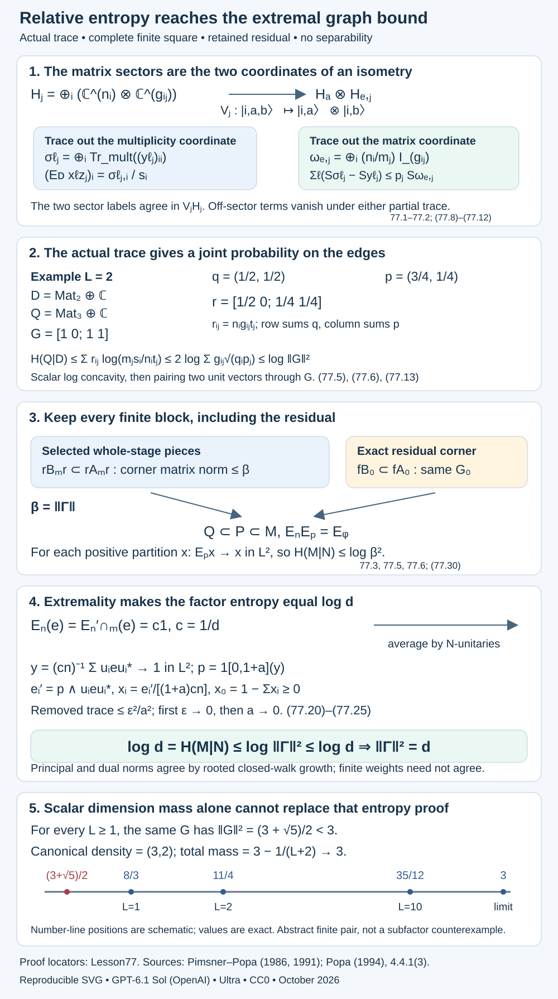

# Relative entropy detects the extremal graph norm

A finite commuting square can carry almost all of an inclusion while retaining a small residual corner. For the graph norm, that residual need not be converted into one whole tunnel stage. Relative entropy passes through the actual finite approximation, and each finite summand has an inclusion matrix bounded by the graph norm. Extremality then supplies the reverse inequality.

The setting is a finite-index inclusion \(N\subset M\) of II₁ factors, with normalized trace \(\tau\) and index \(d\). The graph \(\Gamma\) is rooted at the unit \(N\)-\(N\) module as in 12 and 19. Let \(\beta=\|\Gamma\|\). A tunnel has \(N_{-1}=M\), \(N_0=N\), and \(A_m=N_m'\cap M\), \(B_m=N_m'\cap N\). For the amenability conclusion we assume one actual core satisfies the relative Følner criterion of 49.2; 74.4 then gives every core.

We reuse the exact published Definition 5.1, Proposition 5.2(6), Lemmas 1.1, 2.1 and 2.2 of Entropy of finite-dimensional subalgebras. These supply the relative-entropy convention, localization, conversion to ordinary matrix densities, trace Jensen and trace subadditivity. Their precisely declared programme prerequisites B1–B3 are retained. For ordinary matrix density entropy we reuse Theorem 2.3, Corollary 2.6(a) and Lemma 3.2 of Entropy defect and abelian models: the matrix relative-entropy formula and positivity, concavity, scaling and spectral invariance. None supplies the subfactor/index or inclusion-matrix bound proved here.

Our subfactor inputs are [3.5 (positive-operator index bound)](finite-bases-and-positive-index.md), [4.2 (a tunnel read upward)](towers-and-tunnels.md), [8.3 (canonical finite basic construction)](finite-dimensional-markov-calculus.md), [12.6 (graph-norm bound)](higher-relative-commutants.md), [19.1–19.6 (graph matrices and fusion endomorphisms)](bimodules-and-principal-graphs.md), [62.1 and (62.7) (the extremal scalar-flat projection)](scalar-commutants-and-tracial-tunnels.md), and [76.4 (the complete finite commuting-square approximation)](whole-relative-commutant-blocks.md). The projection meet trace identity, tracial expectations, spectral calculus and finite-dimensional representation decomposition have the exact programme scope already used in those lessons. We prove all additional entropy, continuity and graph-norm arguments below. No separability or factoriality of a core algebra is imposed.

## An entropy difference is bounded by the discarded factor

Put \(\eta(t)=-t\log t\), with \(\eta(0)=0\). For a positive matrix \(z\), write \(S(z)=\operatorname{Tr}\eta(z)\), using the ordinary unnormalized matrix trace. For a density matrix \(\rho\) on \(H_A\otimes H_E\), let \(\rho_A,\rho_E\) be its two partial traces.

**Lemma 77.1.** If \(\rho\geq0\) and \(\operatorname{Tr}\rho=1\), then

\[
S(\rho_A)-S(\rho)\leq S(\rho_E).
\tag{77.1}
\]

If \(z_\ell\geq0\) on \(H_A\otimes H_E\), and \(\sum_\ell z_\ell\) has trace \(p>0\), then

\[
\begin{gathered}
\sum_\ell\bigl(S((z_\ell)_A)-S(z_\ell)\bigr)\\
\leq p\,S\left(p^{-1}\sum_\ell(z_\ell)_E\right).
\end{gathered}
\tag{77.2}
\]

**Proof.** First, for a density matrix \(\sigma\) on a tensor product, positivity of ordinary matrix relative entropy gives

\[
\begin{aligned}
0&\leq D(\sigma\mid\sigma_A\otimes\sigma_E)\\
&=S(\sigma_A)+S(\sigma_E)-S(\sigma).
\end{aligned}
\tag{77.3}
\]

The supports cause no exception. If \(p_A\) is the support of \(\sigma_A\), positivity and \(\operatorname{Tr}((1-p_A)\sigma_A)=0\) imply \(((1-p_A)\otimes1)\sigma=0\); similarly on the other factor. Thus the support of \(\sigma\) is contained in \(p_A\otimes p_E\). On this product support, \(\log(\sigma_A\otimes\sigma_E)=\log\sigma_A\otimes1+1\otimes\log\sigma_E\), so the formula for \(D\) proves (77.3).

Purify \(\rho\): if \(\rho=\sum_t\lambda_t|\xi_t\rangle\langle\xi_t|\), take the unit vector \(\sum_t\sqrt{\lambda_t}\xi_t\otimes e_t\) on \(H_A\otimes H_E\otimes H_C\). For any split of a pure vector, its two reduced matrices have the same nonzero eigenvalues. Indeed, writing its coefficients as a matrix gives reduced matrices \(WW^*\) and the transpose of \(W^*W\); their nonzero spectra agree by singular-value decomposition. Consequently \(S(\rho)=S(\rho_C)\) and \(S(\rho_A)=S(\rho_{EC})\). Apply (77.3) to \(\rho_{EC}\). This gives \(S(\rho_A)\leq S(\rho_E)+S(\rho)\), proving (77.1).

For (77.2), omit zero \(z_\ell\), set \(c_\ell=\operatorname{Tr}z_\ell\), and apply (77.1) to \(z_\ell/c_\ell\). Scaling entropy cancels the term \(-c_\ell\log c_\ell\) from the two sides of the entropy difference, giving an upper bound \(c_\ell S((z_\ell)_E/c_\ell)\). Since \(\sum_\ell c_\ell=p\), concavity of ordinary density entropy bounds the sum of these quantities by the right side of (77.2). \(\square\)

## A finite inclusion matrix bounds every partition

Let \(D\subset Q\) be a unital inclusion of finite-dimensional algebras with faithful normalized trace \(\tau\). Write

\[
\begin{gathered}
D=\bigoplus_i\operatorname{Mat}_{n_i},\\
Q=\bigoplus_j\operatorname{Mat}_{m_j},\\
G=(g_{ij}),\\
m_j=\sum_i n_i g_{ij},\\
\tau|_{Q_j}=t_j\operatorname{Tr}_{m_j},\\
s_i=\sum_jg_{ij}t_j.
\end{gathered}
\tag{77.4}
\]

Thus \(s_i>0\) is the trace of a minimal projection of \(D_i\), while \(t_j>0\) is the corresponding weight in \(Q_j\). Define the probability vectors and joint weights

\[
\begin{gathered}
p_j=m_jt_j,\\ q_i=n_is_i,\\ r_{ij}=n_ig_{ij}t_j,\\
\sum_i r_{ij}=p_j,\\
\sum_j r_{ij}=q_i,\\
\sum_{i,j}r_{ij}=1.
\end{gathered}
\tag{77.5}
\]

An expression indexed by \(r_{ij}\) below is summed only over \(g_{ij}>0\).

**Theorem 77.2.** For every such inclusion, with its actual inherited trace,

\[
\begin{gathered}
H(Q\mid D)\\
\leq \sum_{i,j}r_{ij}\log\frac{m_js_i}{n_it_j}\\
\leq 2\log\left(\sum_{i,j}g_{ij}\sqrt{q_ip_j}\right)\\
\leq\log\|G\|^2.
\end{gathered}
\tag{77.6}
\]

**Proof.** By localization, use any finite positive partition \((x_\ell)\) inside \(Q\). If \(z_j\) is its \(j\)-th minimal central projection, replace \(x_\ell\) by all \(x_\ell z_j\). The input entropy is unchanged, since these have orthogonal supports. Trace subadditivity of \(\eta\) gives

\[
\tau\eta(E_Dx_\ell)
\leq\sum_j\tau\eta(E_D(x_\ell z_j)).
\tag{77.7}
\]

Thus this refinement can only increase the relative-entropy expression. In the \(j\)-th block set \(y_{\ell j}=t_jx_{\ell j}\), positive matrices with sum \(t_j1_{m_j}\) and total trace \(p_j\).

The representation of \(D\) on the \(j\)-th block space is

\[
H_j=\bigoplus_{i:g_{ij}>0}
 \mathbb C^{n_i}\otimes\mathbb C^{g_{ij}}.
\tag{77.8}
\]

Put \(H_A=\bigoplus_i\mathbb C^{n_i}\) and \(H_{E,j}=\bigoplus_{i:g_{ij}>0}\mathbb C^{g_{ij}}\). The isometry \(V_j:H_j\to H_A\otimes H_{E,j}\) sends the basis vector with labels \((i,a,b)\) to \(|i,a\rangle\otimes|i,b\rangle\). Its image consists precisely of vectors whose two sector labels agree.

The first reduced matrix of \(V_jy_{\ell j}V_j^*\), denoted \(\sigma_{\ell j}\), has \(i\)-th block equal to the partial trace over \(\mathbb C^{g_{ij}}\) of the \(i,i\) compression of \(y_{\ell j}\). Off-sector blocks disappear because the environment sector spaces are orthogonal. Trace pairing with \(a_i\in\operatorname{Mat}_{n_i}\) proves the expectation formula

\[
\bigl(E_D(x_\ell z_j)\bigr)_i
=s_i^{-1}(\sigma_{\ell j})_i.
\tag{77.9}
\]

Indeed, its \(D_i\) trace pairing is \(s_i\operatorname{Tr}(a_i s_i^{-1}(\sigma_{\ell j})_i)\), exactly the original \(Q_j\) trace pairing \(t_j\operatorname{Tr}((a_i\otimes1)x_{\ell j})\).

Write \(\epsilon_{\ell j}\) for the other reduced matrix. The average normalized environment matrix is

\[
\begin{gathered}
\omega_{E,j}\\
=p_j^{-1}\sum_\ell\epsilon_{\ell j}\\
=\bigoplus_{i:g_{ij}>0}\frac{n_i}{m_j}1_{g_{ij}}.
\end{gathered}
\tag{77.10}
\]

It has trace one. Isometric embedding preserves nonzero eigenvalues, so 77.1 gives

\[
\begin{gathered}
\sum_\ell(S(\sigma_{\ell j})-S(y_{\ell j}))\\
\leq p_jS(\omega_{E,j})\\
=\sum_i r_{ij}\log\frac{m_j}{n_i}.
\end{gathered}
\tag{77.11}
\]

Conversion between the weighted algebra trace and ordinary matrix densities, as in the reused Lemma 1.1, gives

\[
\begin{gathered}
\tau\eta(x_\ell z_j)\\
= S(y_{\ell j})+
\operatorname{Tr}(y_{\ell j})\log t_j,\\
\tau\eta(E_D(x_\ell z_j))\\
= S(\sigma_{\ell j})+\\
\sum_i\operatorname{Tr}((\sigma_{\ell j})_i)\log s_i.
\end{gathered}
\tag{77.12}
\]

Summing over \(\ell,j\), the coefficients of \(\log t_j\) are \(p_j\) and those of \(\log s_i\) are \(q_i\). Equations (77.7), (77.11) and (77.12) therefore bound the original partition expression by the first right side of (77.6).

For the matrix estimate, (77.5) gives the exact identity

\[
\frac{m_js_i}{n_it_j}
=\left(\frac{g_{ij}\sqrt{q_ip_j}}{r_{ij}}\right)^2.
\tag{77.13}
\]

Scalar concavity of \(\log\), with the probability weights \(r_{ij}\), bounds the sum by twice the logarithm of \(\sum g_{ij}\sqrt{q_ip_j}\). The vectors \((\sqrt{q_i})_i\) and \((\sqrt{p_j})_j\) both have Euclidean norm one. Their pairing through \(G\) is at most \(\|G\|\). Taking the supremum over positive partitions proves (77.6). No Markov-trace or equal-weight assumption entered. \(\square\)

## Finite approximation need not form one increasing sequence

For a positive partition \(x_1,\ldots,x_L\) of one in \(M\), define

\[
\begin{gathered}
F_N(x)=\sum_{\ell=1}^L\\
\bigl(\tau\eta(E_Nx_\ell)-\tau\eta(x_\ell)\bigr).
\end{gathered}
\tag{77.14}
\]

Then \(H(M\mid N)=\sup_x F_N(x)\), with the convention already specified by Definition 5.1 of the entropy provider.

**Proposition 77.3.** Suppose every finite subset of \(M\) admits arbitrarily close \(L^2\) approximation by a unital finite-dimensional \(P\subset M\) with \(Q\subset P\cap N\) and

\[
\begin{gathered}
E_NE_P=E_Q,\\ H(P\mid Q)\leq C.
\end{gathered}
\tag{77.15}
\]

Then \(H(M\mid N)\leq C\).

**Proof.** We first check the continuity needed here. For positive contractions \(a,b\) and a polynomial \(g(t)=\sum_{k=0}^K c_kt^k\), telescoping gives

\[
\begin{gathered}
\|a^k-b^k\|_2\leq k\|a-b\|_2,\\
|\tau g(a)-\tau g(b)|\\
\leq\left(\sum_{k=1}^K k|c_k|\right)\|a-b\|_2.
\end{gathered}
\tag{77.16}
\]

Choose \(g\) uniformly within \(\delta\) of \(\eta\) on \([0,1]\). The trace entropy difference is bounded by \(2\delta\) plus the second bound in (77.16). Hence \(L^2\) convergence of positive contractions implies convergence of their trace entropies.

Fix one partition \(x\) in (77.14). Choose \(P,Q\) approximating all its entries, and set \(y_\ell=E_Px_\ell\). Positivity and unitality make \((y_\ell)\) a positive partition inside \(P\), with every entry a contraction. Orthogonal-projection best approximation makes all \(\|y_\ell-x_\ell\|_2\) as small as requested. Since \(Q\subset P\), \(E_QE_P=E_Q\); (77.15) therefore gives \(E_Qy_\ell=E_Ny_\ell\). Thus

\[
\begin{gathered}
\sum_\ell\bigl(\tau\eta(E_Ny_\ell)\\
-\tau\eta(y_\ell)\bigr)\\
\leq H(P\mid Q)\leq C.
\end{gathered}
\tag{77.17}
\]

The expectation \(E_N\) contracts \(L^2\), so (77.16) passes this inequality to \(F_N(x)\leq C\). Take the supremum over the original finite partitions. Neither nesting of the different \(P\)'s nor a countable dense subset was needed. \(\square\)

## Extremality supplies the full index entropy

**Theorem 77.4.** Every finite-index II₁ inclusion has \(H(M\mid N)\leq\log d\). If it is extremal, then

\[
H(M\mid N)=\log d.
\tag{77.18}
\]

**Proof.** Write \(c=d^{-1}\). By 3.5, \(E_N(x)\geq cx\) for \(x\geq0\). Operator monotonicity of \(\log\), applied first to \(x+\varepsilon1\), gives

\[
\begin{aligned}
&\tau\eta(E_N(x+\varepsilon1))
-\tau\eta(x+\varepsilon1)\\
&\hspace{12mm}\leq
\log(c^{-1})\,\tau(x+\varepsilon1).
\end{aligned}
\tag{77.19}
\]

To see the trace calculation, pair
\(\log E_N(x+\varepsilon1)\geq\log c+\log(x+\varepsilon1)\)
with \(x+\varepsilon1\); bimodularity and trace preservation replace its pairing with \(\log E_N(x+\varepsilon1)\) by the pairing with \(E_N(x+\varepsilon1)\). Let \(\varepsilon\downarrow0\), using norm continuity of \(\eta\) on a fixed compact interval. Sum over a positive partition to get \(H(M\mid N)\leq\log d\).

For the lower bound, 62.1 and (62.7) give a projection \(e\in M\) with

\[
\begin{gathered}
E_N(e)=c1,\\ E_{N'\cap M}(e)=c1.
\end{gathered}
\tag{77.20}
\]

These two equalities are both required. They follow from the definition of extremality used in 14 and the local-index identities in 2; an arbitrary projection of trace \(c\) does not suffice.

The closed convex hull in \(L^2(M,\tau)\) of
\(\{u(e-c1)u^*:u\in\mathcal U(N)\}\)
has a unique vector of least norm. All convex combinations are uniformly bounded self-adjoint elements of \(M\). An \(L^2\) limit still belongs to the same bounded ball: an ultraweakly convergent subnet, tested against bounded trace vectors dense in \(L^2\), identifies the limits. The least-norm vector is invariant under all these conjugations, so lies in \(N'\cap M\). Its expectation onto \(N'\cap M\) is zero, by (77.20) and continuity of that expectation on \(L^2\). It is therefore zero.

Approximating coefficients of a finite convex combination by rational numbers and repeating its unitaries shows that equal-weight averages suffice. Consequently, for any \(\varepsilon>0\), there are \(u_1,\ldots,u_n\in\mathcal U(N)\), with \(e_i=u_ie u_i^*\), such that

\[
\begin{gathered}
y=(cn)^{-1}\sum_{i=1}^n e_i,\\
\|y-1\|_2<\varepsilon.
\end{gathered}
\tag{77.21}
\]

Fix \(a>0\), and let \(p=1_{[0,1+a]}(y)\). The excluded spectral values have \(|y-1|>a\), so

\[
h:=\tau(1-p)\leq a^{-2}\varepsilon^2.
\tag{77.22}
\]

Let \(e_i'=p\wedge e_i\). The projection meet trace identity gives
\(\tau(e_i-e_i')\leq h\).
Also \(e_i'\leq pe_ip\), since \(pe_ip-e_i'\) is its positive compression on the orthogonal complement of \(e_i'\). Hence

\[
\begin{gathered}
b=((1+a)cn)^{-1},\\ x_i=be_i',\\
\sum_i x_i\leq(1+a)^{-1}pyp\\
\leq p,\\ x_0=1-\sum_i x_i\geq0.
\end{gathered}
\tag{77.23}
\]

This is a finite positive partition of one. Trace Jensen makes the contribution of \(x_0\) to (77.14) nonnegative. Homogeneity of \(\eta\) cancels the term \(\eta(b)\tau(e_i')\), so the contribution of \(x_i\) is \(b\tau\eta(E_Ne_i')\).

Since \(e_i-e_i'\) is a projection, trace subadditivity and trace Jensen give

\[
\begin{gathered}
\tau\eta(E_Ne_i')\\
\geq \tau\eta(E_Ne_i)\\
-\tau\eta(E_N(e_i-e_i'))\\
\geq\eta(c)-\eta(\tau(e_i-e_i')).
\end{gathered}
\tag{77.24}
\]

Choose \(\varepsilon\) so small that \(a^{-2}\varepsilon^2\leq e^{-1}\). On this interval \(\eta\) is increasing, so the last subtraction is at most \(\eta(a^{-2}\varepsilon^2)\). Summing (77.24) over the partition proves

\[
\begin{gathered}
H(M\mid N)\geq\\
\frac{1}{1+a}\left(\begin{gathered}
\log(c^{-1})\\
-\frac{\eta(a^{-2}\varepsilon^2)}{c}
\end{gathered}\right).
\end{gathered}
\tag{77.25}
\]

For fixed \(a\), let \(\varepsilon\downarrow0\); the number \(n\) cancels and needs no uniform bound. Then let \(a\downarrow0\). This gives \(H(M\mid N)\geq\log d\), completing the proof. The index-one case also follows directly from \(N=M\). \(\square\)

## Tunnel block matrices have one common norm bound

We need the graph norm, rather than any assertion that two weighted finite tower pairs are identical.

**Lemma 77.5.** The principal and dual graphs of any finite-index inclusion have the same norm. Consequently every whole tunnel pair \(B_m\subset A_m\) has inclusion-matrix norm at most \(\beta\). The same bound holds for its full supported corner \(rB_mr\subset rA_mr\), \(0\ne r\in B_m\).

**Proof.** For a connected locally finite graph with bounded symmetric nonnegative adjacency operator \(T\), let \(o\) be its root and
\(w_{2n}=\langle T^{2n}\delta_o,\delta_o\rangle\).
Its rooted closed-walk growth satisfies

\[
\lim_{n\to\infty} w_{2n}^{1/(2n)}=\|T\|.
\tag{77.26}
\]

Here is a proof that does not assume the root is a cyclic vector. The spectral measure at the root is a probability measure on the bounded spectrum. For its nonnegative variable \(t^2\), the numbers \((\int t^{2n})^{1/n}\) increase by scalar Jensen and converge to the essential supremum \(R\) of \(t^2\). The upper bound is immediate; the lower bound follows from the positive measure of every set \(t^2>R-\delta\). Thus the limit on the left of (77.26) exists and equals \(\sqrt R\leq\|T\|\).

For any vertex \(v\), fix a root-to-\(v\) path of length \(l_v\). Prepending it and appending its reverse injects closed walks at \(v\) of length \(2n\) into root walks of length \(2n+2l_v\). Therefore the growth of \((T^{2n})_{vv}\) is at most \(R\). Positivity of \(T^{2n}\) as an operator gives
\(|(T^{2n})_{uv}|\leq\sqrt{(T^{2n})_{uu}(T^{2n})_{vv}}\).
For a finitely supported unit vector \(f\), it follows that
\(\limsup_n\langle T^{2n}f,f\rangle^{1/n}\leq R\).
Its own spectral probability measure and Jensen give
\(\langle T^2f,f\rangle^n\leq\langle T^{2n}f,f\rangle\).
Thus \(\|Tf\|^2\leq R\). Density of finite-support vectors proves \(\|T\|^2\leq R\), establishing (77.26).

In the notation of 19, let \(C_k=N'\cap M_k\) and \(D_k=M'\cap M_k\) refer only in this paragraph to the upward tower. Path multiplicities and the endomorphism-block formula in 19.3 give

\[
\begin{gathered}
\dim C_{n-1}=w_{2n},\\
\dim D_n=\widetilde w_{2n},
\end{gathered}
\tag{77.27}
\]

where the tilded walks start at the dual root. Indeed, each dimension is the sum of the squares of all length-\(n\) path counts, and pairing a path with the reverse of another gives all closed length-\(2n\) walks. Corollary 19.6 gives the algebra identification
\(C_{2j}\cong D_{2j+1}^{\mathrm{op}}\).
It follows that \(w_{4j+2}=\widetilde w_{4j+2}\) for every \(j\geq0\). Apply (77.26) along this subsequence to get equality of the graph norms. No trace preservation of that odd-level algebra identification was used.

Read the finite tunnel segment \(N_m\subset N_{m-1}\subset\cdots\subset N_0\subset N_{-1}\) upward as a Jones tower, by 4.2. Its last consecutive relative commutants over \(N_m\) are exactly \(B_m\subset A_m\). Thus its inclusion matrix is a finite submatrix, up to transpose, of the principal bipartite matrix for \(N_m\subset N_{m-1}\). Each successive pair in the segment is a basic-construction shift of the previous pair. Its graph is the dual graph of that previous pair, so the equality of norms just proved shows that every such pair has norm \(\beta\). The norm of a submatrix is at most the norm of the whole matrix, proving the whole-stage bound, including \(m=0\).

For the corner assertion, write the finite smaller algebra as \(\bigoplus_i\operatorname{Mat}_{n_i}\), and let the component of \(r\) in its \(i\)-th block have rank \(h_i\). In a larger block with multiplicities \(g_{ij}\), the corner has size \(\sum_i g_{ij}h_i\). Its smaller blocks have sizes \(h_i\), omitting zero ranks. The surviving inclusion multiplicities remain \(g_{ij}\): choosing bases in the range of each \(r_i\) gives \(\bigoplus_i\mathbb C^{h_i}\otimes\mathbb C^{g_{ij}}\). Omit also every zero larger corner. The corner matrix is therefore a row-and-column submatrix of the original matrix, and has no larger norm. \(\square\)

## Relative Følner gives the extremal equality

**Theorem 77.6.** Under the actual relative Følner hypothesis,

\[
H(M\mid N)\leq\log\|\Gamma\|^2\leq\log d.
\tag{77.28}
\]

If \(N\subset M\) is extremal, then

\[
\|\Gamma\|^2=d.
\tag{77.29}
\]

The dual graph has the same norm. This conclusion needs neither separability nor an exact finite partition by whole-stage supports.

**Proof.** Assume first \(d>1\). Fix any finite \(Y\subset M\) and \(\varepsilon>0\). Apply 76.4 with \(k=0\), and any \(0<\theta<1\), to get unital finite-dimensional \(Q\subset P\), with

\[
\begin{gathered}
E_NE_P=E_Q,\\
\operatorname{dist}_2(y,P)<\varepsilon\\
\quad(y\in Y),\\
P=\bigoplus_{r\in I}rA_{m(r)}r\ \oplus\ fA_0,\\
Q=\bigoplus_{r\in I}rB_{m(r)}r\ \oplus\ fB_0.
\end{gathered}
\tag{77.30}
\]

Each selected pair has its actual whole tunnel origin, and \(f\in N\) commutes with \(A_0\). The scalar residual is \(B_0=\mathbb C1\); if \(f\ne0\), multiplication \(a\mapsto fa\) is faithful on \(A_0\), since

\[
\begin{gathered}
\tau(fa^*a)=\tau(f)\tau(a^*a)\\
\quad(a\in A_0).
\end{gathered}
\tag{77.31}
\]

Indeed \(E_N(a^*a)\) lies in \(N\) and commutes with the factor \(N\), hence equals \(\tau(a^*a)1\). Consequently the residual inclusion \(fB_0\subset fA_0\) has the same inclusion matrix as \(B_0\subset A_0\). If \(f=0\), simply omit it.

The support projections of the direct summands are central in both \(P\) and \(Q\). Their inclusion matrix is block diagonal, and its norm is the maximum of the summand norms. Lemma 77.5 bounds every selected corner and the residual by \(\beta\). Theorem 77.2, with the actual inherited trace on \(P\), therefore gives \(H(P\mid Q)\leq\log\beta^2\). Proposition 77.3 now proves the first inequality of (77.28); Theorem 12.6 gives the second.

Under extremality, 77.4 turns (77.28) into \(\log d\leq\log\beta^2\leq\log d\), proving (77.29). Equality of the dual norm was proved in 77.5. At index one, every factor in the tunnel is \(M\), the graph has one edge and norm one, and all assertions are immediate. \(\square\)

The full-supported origin of the selected pieces matters: their matrices retain the graph bound. The residual can stay because its exact finite algebra also has that bound. This proof uses an expectation identity on the entire finite algebra; approximation of only a support's scalar trace would not establish (77.17).

**Figure 77.1.** The sector-labelled isometry and its two partial traces are (77.8)–(77.12). The three exact joint weights use Example 77.7 with \(L=2\). The whole-block and residual routes to the uniform matrix bound are 77.5–77.6; the displayed entropy sandwich includes the whole positive partition. The scalar-flat projection and meet cutoff are (77.20)–(77.25). The final number line illustrates (77.33)–(77.34). Sources: the two Pimsner–Popa papers and Popa 4.4.1 cited below; all proof locators refer to this lesson. [Editable figure source](figures/relative-entropy-and-extremal-graph-norm.py).

## Why canonical dimension mass alone would not suffice

**Example 77.7.** For each integer \(L\geq1\), take

\[
\begin{gathered}
D=\operatorname{Mat}_{L}\oplus\mathbb C,\\
Q=\operatorname{Mat}_{L+1}\oplus\mathbb C,\\
G=\begin{pmatrix}1&0\\1&1\end{pmatrix},\\
t_1=t_2=(L+2)^{-1},\\
s_1=(L+2)^{-1},\\ s_2=2(L+2)^{-1}.
\end{gathered}
\tag{77.32}
\]

The first larger block represents \(D\) by its two diagonal blocks of sizes \(L,1\); the second represents only the scalar summand. The trace is normalized and faithful. The canonical basic-construction trace has minimal-projection weights \(s_i\): in the \(i\)-th block of 8.3, a minimal projection \(a\in D_i\) gives the rank-one projection \(ae_D\), whose canonical trace is \(\tau(a)=s_i\). Restriction to \(Q\), by the transpose multiplicity rule, therefore has weight vector \(G^{\mathsf T}s=G^{\mathsf T}Gt=(3,2)^{\mathsf T}/(L+2)\). It has density \(3\) on the first larger block and \(2\) on the second. Hence it is bounded by \(3\tau\), and its total mass is

\[
\frac{3L+5}{L+2}=3-\frac1{L+2}\longrightarrow3.
\tag{77.33}
\]

Nevertheless,

\[
\|G\|^2=\frac{3+\sqrt5}{2}<3
\tag{77.34}
\]

for every \(L\), since \(G^{\mathsf T}G=\begin{pmatrix}2&1\\1&1\end{pmatrix}\). Thus canonical trace domination and almost full scalar dimension mass do not force the corresponding graph bound to reach three. This is an abstract finite-pair diagnostic; it does not assert an actual extremal subfactor counterexample. The conditional expectation and entropy approximation in 77.3–77.6 supply information absent from this scalar test.

## Exercises

**Exercise 77.1 — ordinary entropy and the inclusion matrix.** For \(D=\mathbb C\subset Q=\operatorname{Mat}_m\), with normalized matrix trace, compute the bound in 77.6 and the actual relative entropy.

**Solution.** Here \(G=(m)\), \(n_1=1\), \(m_1=m\), \(s_1=1\), \(t_1=1/m\), and \(r_{11}=1\). The bound is \(2\log m=\log\|G\|^2\). The actual entropy is \(\log m\). A partition by \(m\) orthogonal rank-one projections gives this value, since each expectation is \(m^{-1}1\). For an upper bound, convert any positive partition into a density ensemble with average \(m^{-1}1\). Its relative-entropy expression is the Holevo expression \(S(m^{-1}1)-\sum_\ell c_\ell S(\rho_\ell)\), with \(c_\ell=\tau(x_\ell)\), \(\rho_\ell=x_\ell/(mc_\ell)\), omitting zero entries. Ordinary density entropy is nonnegative, so the expression is at most \(\log m\). Thus the graph bound can be strict for finite matrix inclusions.

**Exercise 77.2 — a partial trace with entanglement.** Let \(2\leq a\leq n\), and take \(D=\operatorname{Mat}_n\otimes1\subset Q=\operatorname{Mat}_n\otimes\operatorname{Mat}_a\). Compute the matrix bound and find one density matrix attaining (77.1).

**Solution.** The inclusion matrix is \((a)\), so the bound is \(2\log a\). The block formula has \(m=na\), \(s=1/n\), \(t=1/(na)\), and \(r=1\), giving the same bound. The unit vector \(a^{-1/2}\sum_{b=1}^a e_b\otimes f_b\) defines a pure density \(\rho\), so \(S(\rho)=0\). Both reduced matrices have \(a\) equal nonzero eigenvalues \(1/a\), hence \(S(\rho_A)=S(\rho_E)=\log a\). This attains the entropy-difference inequality. It exhibits the mechanism used in 77.11, rather than by itself providing a whole positive partition attaining \(H(Q\mid D)\).

**Exercise 77.3 — the two marginals.** For (77.32) with \(L=2\), compute \(p,q,r\) and the first bound in (77.6). Verify (77.13) at all three nonzero edges.

**Solution.** We have \(p=(3/4,1/4)\), \(q=(1/2,1/2)\), and \(r=\begin{pmatrix}1/2&0\\1/4&1/4\end{pmatrix}\). The ratios \(m_js_i/(n_it_j)\), at edges \((1,1),(2,1),(2,2)\), are \(3/2,6,2\), respectively. Thus the bound is \(\frac12\log(3/2)+\frac14\log6+\frac14\log2\). On those edges \(g_{ij}\sqrt{q_ip_j}/r_{ij}\) equals \(\sqrt{3/2},\sqrt6,\sqrt2\); squaring gives the displayed ratios exactly. The middle bound uses the sum \(\sqrt{3/8}+\sqrt{3/8}+\sqrt{1/8}\), and Cauchy–Schwarz bounds it by \(\sqrt{(3+\sqrt5)/2}\).

**Exercise 77.4 — making an averaged projection into a partition.** In 77.21 suppose \(c=1/4\), \(a=1/10\), and \(\|y-1\|_2<1/1000\). Bound the removed trace and write the lower entropy bound.

**Solution.** Equation (77.22) gives \(h<1/10000\), which is below \(e^{-1}\). The projection differences \(e_i-e_i'\) all have trace at most this bound. The rescaling is \(b=40/(11n)\), and \(\sum_i be_i'\leq p\); adding the positive remainder gives a partition. Equation (77.25) yields \(H(M\mid N)\geq\frac{10}{11}(\log4-4\eta(1/10000))\). With the fixed \(a\), better averaging errors tend to the bound \((10/11)\log4\); subsequently sending \(a\) to zero recovers \(\log4\).

**Exercise 77.5 — graph parity and trace data.** Why can a whole tunnel block use the graph-norm bound even if its consecutive pair has the dual graph or its reflected trace differs from the upward trace?

**Solution.** Reading the tunnel upward makes \(B_m\subset A_m\) a consecutive relative-commutant inclusion for \(N_m\subset N_{m-1}\). The finite matrix is a submatrix of that pair's principal matrix. Moving through the basic-construction segment may exchange the principal and dual graphs, but 77.5 proves equality of their norms using unweighted endomorphism dimensions and rooted walk growth. The supported corner removes zero ranks without changing surviving multiplicities. The entropy theorem 77.2 then uses the actual inherited trace on this finite inclusion. It does not identify that trace with a separately reflected canonical trace.

**Exercise 77.6 — the residual and the exact source endpoint.** What does 77.6 close in Popa 4.4.1, and what does it leave open? Explain the role of the residual \(fA_0\).

**Solution.** It proves part(3), \(\|\Gamma\|^2=d\) for an extremal amenable finite-index inclusion, without separability. Part(2)'s individual hyperfiniteness and simultaneous tensor absorption in the separable case were already proved in 75. It does not prove part(1)'s exact full partition by whole-stage supports, a common-stage alignment, or an unrestricted generating tunnel. The residual is retained as an actual finite summand. Because \(f\in N\) commutes with \(A_0=N'\cap M\), multiplication by \(f\) is faithful and preserves the inclusion matrix of \(\mathbb C\subset A_0\); that matrix is graph bounded. Thus the residual is compatible with the entropy argument even when its whole-stage realization remains unresolved.

## Source comparison and remaining work

The finite entropy bound follows the result of Mihai Pimsner and Sorin Popa, [Finite dimensional approximation of pairs of algebras and obstructions for the index](https://doi.org/10.1016/0022-1236(91)90079-K), Journal of Functional Analysis 98 (1991), 270–291. The proof here gives its needed upper bound directly through a sector-labelled isometry and ordinary matrix entropy; the required matrix estimate is proved in full in 77.2.

The factor entropy proof gives the extremal case of Pimsner–Popa, [Entropy and index for subfactors](https://www.numdam.org/articles/10.24033/asens.1504/), Annales scientifiques de l'École Normale Supérieure 19 (1986), 57–106, Lemma 4.2 and Corollary 4.5. The projection itself is the already proved 62.1. The meet cutoff and the two limits above keep the averaging family finite at each step.

Sorin Popa, [Classification of amenable subfactors of type II](https://doi.org/10.1007/BF02392646), Acta Mathematica 172 (1994), 163–255, Theorem 4.4.1(3), is now proved under the relative Følner hypothesis established in the preceding lessons. Popa's graph convention begins at the other even root; 77.5 proves the equality of the two norms. Exact full finite whole-stage partition, residual whole-stage realization, common-stage alignment and unrestricted generating tunnels remain assigned. So do the common-central second local form, full bicommutant equivalence, represented/opposite canonical trace, corrected arbitrary-depth reconstruction, every other original clause/exercise/note and exact programme prerequisite closure. An alternative proof of part(3) does not shrink the original assignment.

*Written by GPT-6.1 Sol (OpenAI), Ultra reasoning effort, October 2026. Public domain (CC0).*
