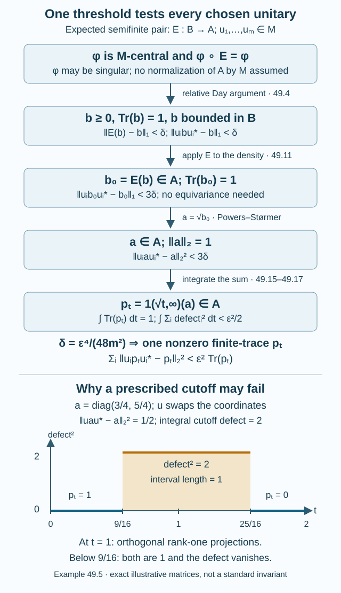

# Relative hypertraces and finite Følner projections

A relative hypertrace is a state on a large algebra that commutes with the smaller factor and respects a prescribed conditional expectation. It can be singular. The finite projections obtained from it lie in the range of that expectation, although the unitaries being tested need not preserve that range. This is the analytic starting point for the strong-amenability theorem discussed in [Generating tunnels can fail at finite index](nongenerating-tunnels-and-boundary.md).

We prove both directions of the relative Følner criterion, including the expectation correction, the choice of one cutoff for a whole finite set, and the normalization of the limiting state. The general trace inequalities are reused from the existing course on injective factors. This criterion is one part of the full strong-amenability argument: central-trace rounding, approximation by bounded relative frames, and the subsequent local and global approximation steps are still needed.

## The expected semifinite pair

Let \(\mathcal B\) be a von Neumann algebra with faithful normal semifinite trace \(\operatorname{Tr}\). Let \(\mathcal A\subseteq\mathcal B\) be a unital von Neumann subalgebra. Assume that the restriction of the trace to \(\mathcal A\) is semifinite and that

\[
\begin{gathered}
E:\mathcal B\longrightarrow\mathcal A\\
\operatorname{Tr}(E(T))=\operatorname{Tr}(T),\\
T\in\mathcal B_+.
\end{gathered}
\tag{49.1}
\]

We require \(E\) to be a normal conditional expectation. Thus it is positive, unital, fixes \(\mathcal A\), and is an \(\mathcal A\)-bimodule map. Let \(M\subseteq\mathcal B\) be a unital II₁ subfactor, with normalized trace \(\tau\). There is no assumption that \(M\subseteq\mathcal A\), that its unitaries normalize \(\mathcal A\), or that \(E\) intertwines their conjugations. No separability assumption is made, and \(\mathcal B\) need not be \(\sigma\)-finite.

For an integrable bounded element \(h\), write

\[
\begin{gathered}
\|h\|_1=\operatorname{Tr}(|h|),\\
\omega_h(T)=\operatorname{Tr}(hT),\\
\|\omega_h\|=\|h\|_1.
\end{gathered}
\tag{49.2}
\]

The trace norm, its dual pairing, and the semifinite trace ideal are the declared trace prerequisites. Their statements and proofs are in Traces on von Neumann algebras and Integration for a trace, Section 1. Finite-trace projections exist below every nonzero projection. Bounded integrable elements form a two-sided ideal, the trace is cyclic on this ideal, and their functionals are normal. The \(2\)-norm is \(\|a\|_2=\operatorname{Tr}(a^*a)^{1/2}\).

**Definition 49.1.** An *\(E\)-compatible \(M\)-hypertrace* is a state \(\varphi\) on \(\mathcal B\) satisfying

\[
\begin{gathered}
\varphi(E(T))=\varphi(T),\\
\varphi(xT)=\varphi(Tx),\\
x\in M,\quad T\in\mathcal B,\\
\varphi|_M=\tau .
\end{gathered}
\tag{49.3}
\]

Normality of \(\varphi\) is not required. In fact its restriction condition follows from centrality when \(M\) is a II₁ factor; we verify this in the reverse implication.

**Theorem 49.2** (The relative Følner criterion). Under (49.1), an \(E\)-compatible \(M\)-hypertrace exists if and only if, for every finite set \(F\subseteq\mathcal U(M)\) and every \(\varepsilon>0\), there is a nonzero projection \(p\in\mathcal A\) such that

\[
\begin{gathered}
0<\operatorname{Tr}(p)<\infty,\\
\|upu^*-p\|_2
<\varepsilon\,\operatorname{Tr}(p)^{1/2},\\
u\in F.
\end{gathered}
\tag{49.4}
\]

Here “finite” always includes the finite-trace requirement in (49.4); Murray–von Neumann finiteness alone would not be sufficient for the normalization.

## From a singular state to a bounded density in the right algebra

**Lemma 49.3** (Trace adjointness of the expectation). For bounded integrable \(h\in\mathcal B\), the element \(E(h)\) is bounded and integrable, and

\[
\begin{gathered}
\operatorname{Tr}(E(h)T)
=\operatorname{Tr}(hE(T)),\\
\omega_h\circ E=\omega_{E(h)}
\qquad(T\in\mathcal B).
\end{gathered}
\tag{49.5}
\]

**Proof.** A bounded positive integrable \(h\) has positive bounded image and the same finite trace, by (49.1). Every bounded integrable element is a linear combination of four such positive elements, so the same ideal is preserved and trace preservation extends linearly to it. For arbitrary \(T\), cyclicity and the bimodule property give

\[
\begin{aligned}
\operatorname{Tr}(E(h)T)
&=\operatorname{Tr}(E(E(h)T))\\
&=\operatorname{Tr}(E(h)E(T))\\
&=\operatorname{Tr}(E(hE(T)))\\
&=\operatorname{Tr}(hE(T)).
\end{aligned}
\tag{49.6}
\]

Every term is in the trace ideal. This proves the claim. \(\square\)

**Lemma 49.4** (Relative Day argument). Suppose that \(\varphi\) satisfies (49.3). Given \(u_1,\ldots,u_m\in\mathcal U(M)\), \(m\geq1\), and \(\delta>0\), there is a bounded positive \(b\in\mathcal B\) with \(\operatorname{Tr}(b)=1\) such that

\[
\begin{aligned}
\|E(b)-b\|_1&<\delta,\\
\|u_i b u_i^*-b\|_1&<\delta\\
&\quad(1\leq i\leq m).
\end{aligned}
\tag{49.7}
\]

Consequently the bounded density \(b_0=E(b)\in\mathcal A_+\) satisfies

\[
\begin{gathered}
\operatorname{Tr}(b_0)=1,\\
\|u_i b_0u_i^*-b_0\|_1<3\delta .
\end{gathered}
\tag{49.8}
\]

**Proof.** The Day argument for a single algebra is Lemma 2.6 of Uniqueness of the injective II₁ factor. We give the relative version, retaining the extra expectation coordinate.

Let \(C\) be the convex set of normal states \(\omega_b\), where \(b\) is bounded, positive and has trace one. This set is weak\(^*\) dense in all states of \(\mathcal B\). To see this directly, take \(T=T^*\in\mathcal B\) and \(\lambda<\max\sigma(T)\). Its nonzero spectral projection \(r=1_{(\lambda,\infty)}(T)\) contains a nonzero finite-trace projection \(q\). Then \(b=q/\operatorname{Tr}(q)\) belongs to \(C\) and

\[
\omega_b(T)>\lambda .
\tag{49.9}
\]

Indeed \(q(T-\lambda)q\) is positive, has finite trace, and is nonzero: \(T-\lambda\) has trivial kernel on \(r\). Faithfulness gives the strict inequality. Thus the supremum of evaluation at \(T\) over \(C\) is \(\max\sigma(T)\), which is also its supremum over all states. If a state were outside the weak\(^*\) closure of \(C\), Hahn–Banach separation would give a self-adjoint \(T\) contradicting these equal suprema. This proves the asserted density without an assumption on normality of \(\varphi\).

Put \(\alpha_i(T)=u_i^*Tu_i\). In the finite product of preduals \((\mathcal B_*)^{m+1}\), equipped with the maximum of the component norms, consider the convex set

\[
\begin{gathered}
d_0(\psi)=\psi\circ E-\psi,\\
d_i(\psi)=\psi\circ\alpha_i-\psi,\\
1\leq i\leq m,\\
\mathcal D=\left\{
(d_j(\psi))_{j=0}^m:\psi\in C\right\}.
\end{gathered}
\tag{49.10}
\]

The coordinates are normal because \(E\) and unitary conjugation are normal. Weak\(^*\) approximation of \(\varphi\) by \(C\) makes these coordinates converge weakly, in the duality with \(\mathcal B^{m+1}\), to zero. For a convex subset of a Banach space its weak and norm closures coincide: a point outside its norm closure is separated by a continuous linear functional, which is also weakly continuous. Hence the norm closure of \(\mathcal D\) contains zero.

Choose \(\psi=\omega_b\) with every component norm less than \(\delta\). Lemma 49.3 identifies the first component with \(\omega_{E(b)-b}\). Cyclicity identifies the \(i\)-th conjugation component with \(\omega_{u_i b u_i^*-b}\). The isometry (49.2) gives (49.7).

Finally, trace preservation and positivity give \(\operatorname{Tr}(b_0)=1\), and

\[
\begin{gathered}
\|u_i b_0u_i^*-b_0\|_1\\
\leq\|u_i(b_0-b)u_i^*\|_1\\
+\|u_i b u_i^*-b\|_1
+\|b-b_0\|_1\\
<3\delta .
\end{gathered}
\tag{49.11}
\]

This step uses the unitary invariance of the trace norm. It does not use equivariance of \(E\) under \(M\). That distinction is essential in a relative inclusion. \(\square\)

## One spectral threshold for the whole finite set

The three imported trace statements needed here are all proved for a faithful normal **semifinite** trace in [Trace inequalities for finite von Neumann algebras](../../injective-factors/trace-inequalities-for-finite-von-neumann-algebras.html):

- Theorem 3.1, the Powers–Størmer inequality: for positive integrable \(h,k\),
  \(\|h^{1/2}-k^{1/2}\|_2^2\leq\|h-k\|_1\).
- Lemma 4.1(c), layer integration: for positive \(a\in L^2\), setting \(p_t=1_{(\sqrt t,\infty)}(a)\), one has
  \(\int_0^\infty\operatorname{Tr}(p_t)\,dt=\|a\|_2^2\).
- Proposition 4.3(b), the integrated spectral-cutoff estimate: for positive \(a,c\in L^2\), write \(p_t(h)=1_{(\sqrt t,\infty)}(h)\). Then

\[
\begin{gathered}
\int_0^\infty
\bigl\|p_t(a)-p_t(c)\bigr\|_2^2\,dt\\
\leq\|a-c\|_2\,\|a+c\|_2 .
\end{gathered}
\tag{49.12}
\]

The provider proves (49.12) by a joint spectral distribution of left and right multiplication on \(L^2\), followed by scalar layer integration and Cauchy–Schwarz. It does not assume that \(a\) and \(c\) commute. Its Example 4.4 shows why directly bounding the left side by \(\|a^2-c^2\|_1\) would be false in general. We use the proved estimate (49.12).

**Proof of Theorem 49.2, forward implication.** Enumerate \(F=\{u_1,\ldots,u_m\}\); for an empty set add the identity. Put

\[
\begin{gathered}
\delta=\frac{\varepsilon^4}{48m^2},\\
b_0=E(b),\quad a=b_0^{1/2}\in\mathcal A_+,\\
\|a\|_2^2=\operatorname{Tr}(b_0)=1 .
\end{gathered}
\tag{49.13}
\]

Lemma 49.4 supplies \(b_0\). The square-root functional calculus commutes with unitary conjugation. Applying Powers–Størmer to \(u_i b_0u_i^*\) and \(b_0\) therefore gives

\[
\|u_i a u_i^*-a\|_2^2<3\delta .
\tag{49.14}
\]

For \(t>0\), the spectral projection \(p_t=1_{(\sqrt t,\infty)}(a)\) belongs to \(\mathcal A\). Since \(a^2\geq t p_t\), it has finite trace at most \(1/t\). Layer integration gives

\[
\int_0^\infty\operatorname{Tr}(p_t)\,dt=1.
\tag{49.15}
\]

Put \(D_i(t)=\|u_i p_tu_i^*-p_t\|_2^2\) and \(D(t)=\sum_{i=1}^mD_i(t)\). Apply (49.12) with \(c=u_i a u_i^*\). The sum norm is at most \(2\|a\|_2=2\), so (49.14) yields

\[
\begin{gathered}
\int_0^\infty D_i(t)\,dt
<2\sqrt{3\delta},\\
\int_0^\infty D(t)\,dt
<2m\sqrt{3\delta}\\
=\frac{\varepsilon^2}{2}.
\end{gathered}
\tag{49.16}
\]

Comparison with (49.15) proves that at some \(t>0\) with \(\operatorname{Tr}(p_t)>0\),

\[
D(t)<\varepsilon^2\operatorname{Tr}(p_t).
\tag{49.17}
\]

Otherwise integrating the reverse inequality would give a lower bound \(\varepsilon^2\), contradicting (49.16). Each summand is nonnegative, so the same nonzero \(p=p_t\) satisfies (49.4) for every \(u_i\). Selecting separate good thresholds for the individual unitaries would not establish the theorem. \(\square\)

*Figure 49.1.* The upper panel gives the quantitative proof for \(m\) unitaries; every arrow names the exact map or inequality. The lower panel gives Example 49.5 with \(\alpha=1/4\), before normalizing \(a_\alpha\). Its horizontal variable is \(t\), so the two cutoffs are the squared eigenvalues \(9/16\) and \(25/16\). The middle interval has squared projection defect \(2\); its integral is \(2\). This illustrates the threshold mechanism, not a subfactor standard invariant. The editable source is [relative-folner.py](figures/relative-folner.py). Proof locators: Lemma 49.4, (49.13)–(49.17), and Example 49.5.

**Example 49.5** (A fixed threshold can fail). In \(M_2(\mathbb C)\) use the unnormalized matrix trace, the diagonal algebra \(\mathcal A\), and the unitary that interchanges the two coordinate vectors:

\[
\begin{gathered}
a_\alpha=\begin{pmatrix}1-\alpha&0\\0&1+\alpha\end{pmatrix},\\
0<\alpha<1,\qquad
u=\begin{pmatrix}0&1\\1&0\end{pmatrix},\\
\|u a_\alpha u^*-a_\alpha\|_2^2=8\alpha^2 .
\end{gathered}
\tag{49.18}
\]

At the fixed threshold \(t=1\), the two spectral projections are orthogonal rank-one projections, and their squared difference norm is \(2\), independently of how small \(\alpha\) is. At every threshold \(0<t<(1-\alpha)^2\) both projections are the identity and the defect is zero. Between the squared eigenvalues the squared defect is \(2\); above both it is zero. Write \(c_\alpha=u a_\alpha u^*\) and \(D(t)=\|u p_tu^*-p_t\|_2^2\) for this example. The integral is twice the interval length \((1+\alpha)^2-(1-\alpha)^2=4\alpha\), so

\[
\begin{gathered}
\int_0^\infty D(t)\,dt=8\alpha,\\
\|c_\alpha-a_\alpha\|_2=2\sqrt2\,\alpha,\\
\|c_\alpha+a_\alpha\|_2=2\sqrt2 .
\end{gathered}
\tag{49.19}
\]

This example even attains equality in the imported integral estimate. It is a finite-dimensional illustration of the cutoff argument; \(M_2(\mathbb C)\) is not a II₁ factor. The theorem uses averaging to find a threshold and makes no claim about a prescribed one.

## From finite projections back to a hypertrace

**Proof of Theorem 49.2, reverse implication.** For a projection \(p\) in (49.4), define the normal state

\[
\begin{gathered}
\omega_p(T)=
\frac{\operatorname{Tr}(pTp)}{\operatorname{Tr}(p)}\\
=\frac{\operatorname{Tr}(pT)}{\operatorname{Tr}(p)}.
\end{gathered}
\tag{49.20}
\]

Lemma 49.3 and \(E(p)=p\) give exact compatibility:

\[
\omega_p(E(T))=\omega_p(T).
\tag{49.21}
\]

For \(u\in F\), put \(q=u^*pu\). Cyclicity gives \(\omega_p(uTu^*)=\operatorname{Tr}(qTq)/\operatorname{Tr}(p)\). Use \(L^2(\mathcal B,\operatorname{Tr})\) as the Hilbert space of the two vectors \(p,q\). Its inner product is linear in the first entry. Left multiplication by \(T\) has norm at most \(\|T\|\). Write \(d=|\omega_p(uTu^*)-\omega_p(T)|\). Then

\[
\begin{gathered}
d=\frac{|\langle Tq,q\rangle_2-\langle Tp,p\rangle_2|}
{\operatorname{Tr}(p)}\\
\leq
\frac{2\|T\|\,\|q-p\|_2}
{\operatorname{Tr}(p)^{1/2}}\\
<2\varepsilon\|T\|.
\end{gathered}
\tag{49.22}
\]

Here \(\|q\|_2=\|p\|_2=\operatorname{Tr}(p)^{1/2}\), and \(\|q-p\|_2=\|upu^*-p\|_2\). The estimate is uniform on the unit ball of \(\mathcal B\).

Index these states by all pairs \((F,n)\), where \(F\) is a finite subset of \(\mathcal U(M)\), \(n\) is a positive integer, and the tolerance is \(1/n\). Order the pairs by inclusion of \(F\) and increasing \(n\). The state space is weak\(^*\) compact, so the resulting net has a convergent subnet, with limit state \(\varphi\). For each fixed unitary \(u\), the net eventually tests \(u\), and (49.22) forces

\[
\begin{gathered}
\varphi(uTu^*)=\varphi(T),\\
\varphi(E(T))=\varphi(T)
\qquad(T\in\mathcal B).
\end{gathered}
\tag{49.23}
\]

The second equality follows from (49.21), without an approximation error. Unitary invariance implies \(\varphi(uT)=\varphi(Tu)\), by applying it to \(Tu\). Every self-adjoint contraction \(x\in M\) is the real part of the unitary \(x+i(1-x^2)^{1/2}\). Splitting an arbitrary element into its real and imaginary parts therefore shows that every element of \(M\) is a linear combination of four unitaries. Thus \(\varphi\) is \(M\)-central.

It remains to check the restriction to \(M\), even if the limit state is singular. Its restriction \(\rho\) is a tracial state. Given a positive integer \(k\), partition \(1\in M\) into \(k\) equivalent projections, each of trace \(1/k\). Traciality assigns value \(1/k\) to each. For an arbitrary projection \(r\in M\), comparison by trace and traciality then give

\[
\frac{\lfloor k\tau(r)\rfloor}{k}
\leq\rho(r)\leq
\frac{\lceil k\tau(r)\rceil}{k}.
\tag{49.24}
\]

For the lower bound, a sum of \(\lfloor k\tau(r)\rfloor\) of the partition projections is subequivalent to \(r\). For the upper bound \(r\) is subequivalent to the corresponding ceiling sum. Traciality preserves the value under equivalence, and positivity preserves inequalities. Letting \(k\) tend to infinity yields \(\rho(r)=\tau(r)\). Bounded self-adjoint elements are norm limits of finite linear combinations of their spectral projections, so \(\rho=\tau\) on all of \(M\). The finite-factor comparison and equal-trace partitions used here are the trace-kernel prerequisite. We have proved all conditions in (49.3). \(\square\)

## The application to a subfactor core

For a nondegenerate commuting square \(Q\subseteq P\) inside \(N\subseteq M\), the relative-hypertrace construction uses the ambient and smaller basic-construction algebras

\[
\begin{gathered}
\mathcal B=\langle M,e_P\rangle,\\
\mathcal A=\langle N,e_P\rangle
\cong\langle N,e_Q\rangle .
\end{gathered}
\tag{49.25}
\]

They carry the canonical faithful normal semifinite trace and the canonical normal trace-preserving expectation \(E:\mathcal B\to\mathcal A\). The nondegenerate commuting-square construction and this expectation are hypotheses of the application. Their general existence belongs to the declared expectation/basic-construction prerequisites, rather than following from a projection estimate. Popa's relative hypertrace is precisely an \(M\)-central, \(E\)-compatible state on \(\mathcal B\).

With these identifications, Theorem 49.2 proves [Popa 1994, Theorem 4.2.1, pp. 211–213](https://doi.org/10.1007/BF02392646): amenability relative to \(Q\subseteq P\) is equivalent to finite-trace almost invariant projections in \(\langle N,e_P\rangle\). The expectation invariance is preserved both when replacing \(b\) by \(E(b)\) and when taking the limit of the projection states. No extremality assumption is used in this analytic criterion.

When \(Q\subseteq P\) is a core, this supplies the initial projection criterion in Theorem 4.2.2 of that source. Its further conclusion requires a change of core and rounding the **center-valued** trace of \(p\) to an integer multiple of a central projection. An arbitrary finite scalar trace does not give this conclusion. The bounded-frame approximation and the Rohlin argument that follow it also have additional content.

The full source theorem, Popa 4.1.2, treats proper finite-index II₁ inclusions without an extremality assumption. Its equivalence between representation amenability with ergodic standard invariant, amenability relative to an ergodic core, and global approximation by higher relative commutants is broader than Theorem 49.2. Separability is added for its generating-tunnel, standard-part isomorphism and tower-bicommutant formulations. The last formulation also requires amenability of \(M\), the larger factor. The complete remaining implications retain these hypotheses and remain part of this course's assigned proof work. The finite-depth result already proved in [A generating tunnel and the classification theorem](generating-tunnels-and-classification.md) is not used to infer them at arbitrary depth.

## Exercises with solutions

**Exercise 49.1.** For two unitaries and tolerance \(\varepsilon=1/2\), compute the density tolerance in (49.13), the square-root bound in (49.14), and the total integrated error bound.

*Solution.* Here \(m=2\), \(\varepsilon^4=1/16\), and

\[
\begin{gathered}
\delta=\frac1{3072},\qquad3\delta=\frac1{1024},\\
\|u_i a u_i^*-a\|_2<\frac1{32},\\
2m\sqrt{3\delta}=\frac18
=\frac{\varepsilon^2}{2}.
\end{gathered}
\tag{49.26}
\]

The total integral is strictly less than \(1/8\), whereas the integral of \(\varepsilon^2\operatorname{Tr}(p_t)\) is \(1/4\). Thus a common nonzero projection with the required individual errors exists.

**Exercise 49.2.** Show why the identity \(E(u b u^*)=uE(b)u^*\) cannot be silently inserted in Lemma 49.4.

*Solution.* Take the diagonal expectation on \(M_2(\mathbb C)\) and the density \(b=e_{11}\). Use the unitary

\[
u=\frac1{\sqrt2}
\begin{pmatrix}1&1\\1&-1\end{pmatrix}.
\tag{49.27}
\]

Then \(E(b)=b\), \(uE(b)u^*\) has every entry equal to \(1/2\), and \(E(u b u^*)=(1/2)1\). They differ. The element \(u\) does not normalize the diagonal algebra. The three-term estimate (49.11) is valid in this example and in the general expected pair, without the false identity.

**Exercise 49.3.** Verify every cutoff value in Example 49.5 for \(\alpha=1/4\), and compute both sides of (49.12).

*Solution.* The eigenvalues of \(a_\alpha\) are \(3/4,5/4\). Thus \(p_t=1\) for \(0<t<9/16\), has rank one for \(9/16<t<25/16\), and is zero for \(t>25/16\). Conjugation by \(u\) interchanges the rank-one projections. Endpoint values do not affect the integral. Its value is \(2(25/16-9/16)=2\). The difference of the two operators is diagonal with entries \(1/2,-1/2\), so its \(2\)-norm is \(1/\sqrt2\); their sum is \(2\,1\), with norm \(2\sqrt2\). Their product is \(2\), proving equality. At \(t=1\), the squared projection defect is still \(2\).

**Exercise 49.4.** For \(\operatorname{Tr}(p)=s>0\) and \(\|upu^*-p\|_2<\eta\sqrt s\), show that the projection state is exactly \(E\)-invariant and that its norm difference from its conjugate state is less than \(2\eta\).

*Solution.* Since \(p\in\mathcal A\), Lemma 49.3 gives
\(\operatorname{Tr}(pE(T))=\operatorname{Tr}(E(p)T)=\operatorname{Tr}(pT)\); division by \(s\) proves invariance. For \(q=u^*pu\), write the difference of the quadratic forms as
\(\langle T(q-p),q\rangle_2+\langle Tp,q-p\rangle_2\).
Each term has absolute value at most \(\|T\|\sqrt s\,\|q-p\|_2\). Divide by \(s\) and take the supremum over \(\|T\|\leq1\). This is (49.22).

**Exercise 49.5.** A cluster state in the reverse implication need not be normal. Why does its restriction to the II₁ factor nevertheless equal the normal trace? What would fail for a finite algebra with nontrivial center?

*Solution.* Centrality makes the restriction tracial. Equal-trace partitions and factor projection comparison give (49.24) for every \(k\). The bounds squeeze the value at each projection to its trace. Spectral norm approximation then fixes every self-adjoint element, and linearity fixes the whole factor. This determines the restriction independently of normality on the larger algebra. In a finite algebra with center, different tracial states can assign different weights to central projections; comparison is center-valued and does not produce (49.24) with one prescribed scalar trace. For example \(\mathbb C\oplus\mathbb C\) has all states \((z,w)\mapsto t z+(1-t)w\), \(0\leq t\leq1\), and every one is tracial.

The criterion therefore gives a normalized relative hypertrace with exactly the required expectation compatibility. Its use in the full strong-amenability theorem continues through the central-trace and approximation arguments specified above.
