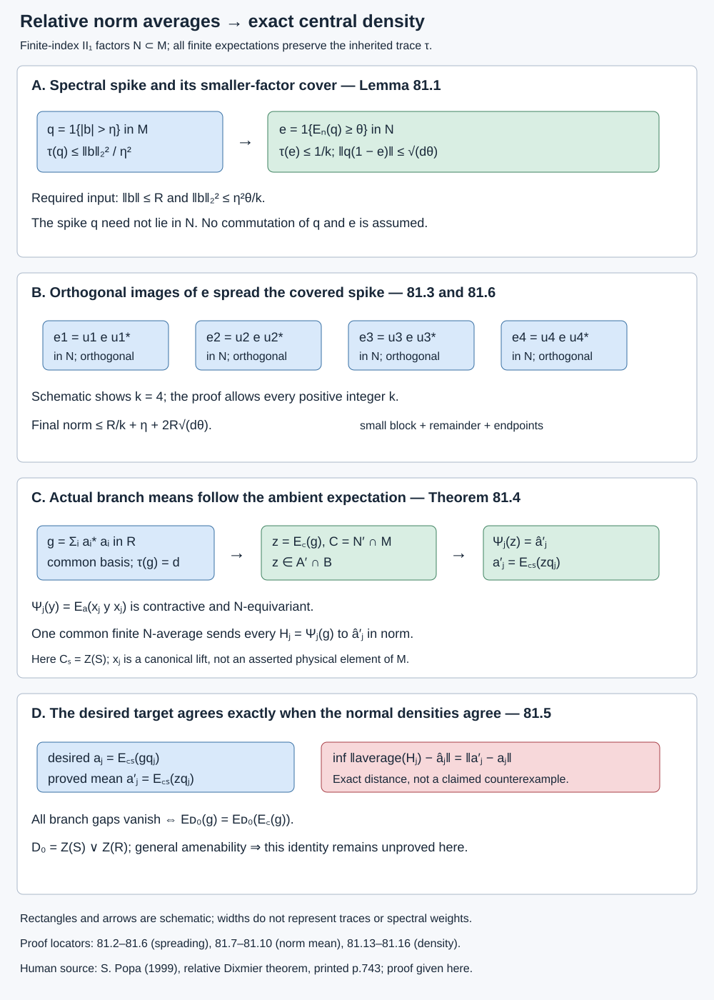

# Relative norm averaging and the remaining central density

A small \(L^2\) error can retain a large operator norm on a tiny projection. Finite index lets us move that projection into a small projection of the smaller factor. Orthogonal copies then reduce its norm. We prove this step explicitly and use it to determine the norm averages of the actual fixed branch operators in Lesson 72.

The resulting mean is an ambient relative-commutant mean. Equality with the desired core mean is equivalent to one precise joint-center density identity. We prove this equivalence and the localization estimate with its exact remaining error; we do not assume that general relative amenability supplies the identity.

We use the [positive-operator bound in 3.5](finite-bases-and-positive-index.md), the least-\(L^2\)-norm averaging argument within the [proof of 15.2](detecting-a-generating-tunnel.md), the actual common basis and full corners in 52.1–52.2, the joint density and commutator estimates in 68, 70 and 72, and their declared tracial expectation and projection comparison prerequisites. The argument from 15.2 is reproduced for arbitrary finite-index II₁ inclusions here; its finite-depth generation conclusions are not used. Every additional estimate is proved below.

The norm-averaging theorem has human-source context in Sorin Popa, [*The relative Dixmier property for inclusions of von Neumann algebras of finite index*](https://numdam.org/item/10.1016/s0012-9593%2800%2987717-4.pdf), *Annales scientifiques de l'École Normale Supérieure* 32 (1999), 743–767, DOI 10.1016/S0012-9593(00)87717-4, theorem on. That paper proves a more general von Neumann algebra result. We give our finite tracial factor proof instead of importing the general theorem.

## Move a small spike into the smaller factor

Let \(N\subset M\) be II₁ factors with normalized trace \(\tau\) and finite index \(d=[M:N]\). All finite expectations preserve \(\tau\). A finite \(N\)-average means a map

\[
\begin{gathered}
\mathcal T(y)=\sum_{\ell=1}^m t_\ell u_\ell y u_\ell^*,\\
u_\ell\in\mathcal U(N),\quad t_\ell\geq0,\\
\sum_\ell t_\ell=1.
\end{gathered}
\tag{81.1}
\]

It is unital, positive, trace preserving and contractive in operator norm and \(L^2\). A composition of two such maps is again a finite \(N\)-average: its unitaries are the products of the two lists, with product weights.

**Lemma 81.1 — spread a spectral spike.** Let \(b=b^*\in M\), let \(\|b\|\leq R\), and choose an integer \(k\geq1\) and numbers \(\eta,\theta>0\). If

\[
\|b\|_2^2\leq\frac{\eta^2\theta}{k},
\tag{81.2}
\]

then there is an equal-weight average of \(k\) unitaries of \(N\) for which

\[
\|\mathcal T(b)\|
\leq\frac Rk+\eta+2R\sqrt{d\theta}.
\tag{81.3}
\]

**Proof.** Put

\[
\begin{gathered}
q=1_{(\eta,\infty)}(|b|),\\
e=1_{[\theta,\infty)}(E_N(q)).
\end{gathered}
\tag{81.4}
\]

Chebyshev's inequality and trace preservation give
\(\tau(q)\leq\|b\|_2^2/\eta^2\) and
\(\tau(e)\leq\tau(q)/\theta\leq1/k\).
The positive-operator inequality \(q\leq dE_N(q)\) from 3.5, compressed by \(1-e\), gives

\[
\begin{gathered}
(1-e)q(1-e)\leq d\theta(1-e),\\
\|q(1-e)\|\leq\sqrt{d\theta}.
\end{gathered}
\tag{81.5}
\]

Strict inequality below the spectral threshold can be replaced by the displayed weak bound.

Let \(w=qbq\). Since \(q\) is a spectral projection of \(b\), the remainder \(b-w=(1-q)b(1-q)\) has norm at most \(\eta\). Also \(\|w\|\leq R\), and
\(w-ewe=(1-e)w+ew(1-e)\).
Each endpoint term has norm at most \(R\sqrt{d\theta}\), by (81.5).

Projection prescription and comparison in the factor \(N\) give \(k\) orthogonal projections \(e_\ell\) of trace \(\tau(e)\). Each is a unitary conjugate \(u_\ell e u_\ell^*\): compare the projections, compare their complements, and add the two partial isometries. If \(e=0\), take all \(u_\ell=1\). The operators \(u_\ell ewe u_\ell^*\) occupy orthogonal corners, so their sum has norm at most \(R\). Consequently

\[
\begin{gathered}
\left\|\frac1k\sum_{\ell=1}^k
u_\ell ewe u_\ell^*\right\|\leq R/k,\\
\|\mathcal T(b)-\mathcal T(ewe)\|\\
\leq\eta+2R\sqrt{d\theta}.
\end{gathered}
\tag{81.6}
\]

Adding these inequalities proves (81.3). No commutation between \(e\) and \(q\) or \(b\) was assumed. \(\square\)

For example, for \(R>0\) and a desired tolerance \(\varepsilon>0\), take
\(k>3R/\varepsilon\), \(\eta=\varepsilon/3\), and
\(\theta=(\varepsilon/(6R\sqrt d))^2\).
The right side of (81.3) is then strictly less than \(\varepsilon\). The needed \(L^2\) bound remains (81.2), with these parameters.

## The relative commutant is the unique norm mean

Put \(C=N'\cap M\). Its trace-preserving expectation is \(E_C\). Write \(\mathcal K_N(x)\) for the operator-norm-closed convex hull of the conjugates \(uxu^*\), \(u\in\mathcal U(N)\).

**Theorem 81.2 — relative norm averaging.** For every \(x\in M\),

\[
\begin{gathered}
E_C(x)\in\mathcal K_N(x),\\
\mathcal K_N(x)\cap C=\{E_C(x)\}.
\end{gathered}
\tag{81.7}
\]

There is no separability, finite-depth, extremality or relative amenability hypothesis.

**Proof of the \(L^2\) step.** In the Hilbert space \(L^2(M,\tau)\), the closed convex hull of the conjugates of \(x\) has a unique vector \(v\) of minimum norm. Existence follows by the parallelogram identity: a minimizing sequence is Cauchy. Uniqueness follows by the same identity. Every conjugation preserves the hull and the norm, so it fixes \(v\).

The convex averages have operator norm at most \(\|x\|\). A uniformly bounded net converging in \(L^2\) represents a bounded element of \(M\): take an ultraweak cluster point in the weak-* compact operator ball and identify its pairings with every bounded element by \(L^2\) convergence and Cauchy–Schwarz. Thus \(v\in M\). Its invariance puts it in \(C\). Every \(a\in C\) has the same trace pairing with each conjugate of \(x\), hence

\[
\tau(a^*v)=\tau(a^*x)=\tau(a^*E_C(x)).
\tag{81.8}
\]

Taking \(a=v-E_C(x)\) proves \(v=E_C(x)\). In particular finite averages of \(x-E_C(x)\) have arbitrarily small \(L^2\) norm.

**Upgrade to norm.** First suppose \(x=x^*\). Set \(b_0=x-E_C(x)\) and \(R=\|b_0\|\). If \(R=0\), the identity map suffices. Otherwise choose \(k,\eta,\theta\) as after Lemma 81.1. The preceding argument gives a finite average \(\mathcal V\) with \(b=\mathcal V(b_0)\) satisfying (81.2). Its norm is still at most \(R\) and it is selfadjoint. Apply Lemma 81.1 to \(b\). The composition \(\mathcal T\mathcal V\) is a finite average and sends \(b_0\) to norm less than \(\varepsilon\). Since \(E_C(x)\) is fixed by every such average, this proves the first assertion for selfadjoint \(x\).

For general \(x\), average the centered real part to norm less than \(\varepsilon/2\), then average the centered imaginary part of the resulting element to norm less than \(\varepsilon/2\). The second map is a norm contraction and retains the first bound. Expectations of both centered parts remain zero throughout. Adding the two bounds proves the assertion.

Finally \(E_C(uxu^*)=E_C(x)\), as follows by pairing with every \(a\in C\) and using trace cyclicity. Continuity of \(E_C\) extends this identity to the norm-closed convex hull. A member \(y\) of that hull lying in \(C\) therefore satisfies \(y=E_C(y)=E_C(x)\). \(\square\)

## Equivariant maps retain the precise mean

The next observation applies even when the target algebra has a semifinite trace. Its norm argument takes place on \(M\) first.

**Proposition 81.3 — a finite family and exact distances.** Let \(A\) be a von Neumann algebra containing this copy of \(N\). For \(1\leq j\leq n\), let \(\Psi_j:M\to A\) be linear norm contractions satisfying

\[
\begin{gathered}
\Psi_j(uyu^*)=u\Psi_j(y)u^*,\\
u\in\mathcal U(N),\quad y\in M.
\end{gathered}
\tag{81.9}
\]

Fix \(x\in M\), put \(H_j=\Psi_j(x)\) and \(m_j=\Psi_j(E_C(x))\), and suppose \(m_j,c_j\) commute with \(N\). One common finite average sends every \(H_j\) arbitrarily close to \(m_j\). Moreover,

\[
\begin{gathered}
\inf_{\mathcal T}\|\mathcal T(H_j)-c_j\|\\
=\|m_j-c_j\|,\\
\inf_{\mathcal T}\max_j
\|\mathcal T(H_j)-c_j\|\\
=\max_j\|m_j-c_j\|.
\end{gathered}
\tag{81.10}
\]

The infima run over finite \(N\)-averages.

**Proof.** Theorem 81.2 gives \(\mathcal T(x)\to E_C(x)\) in norm. Equivariance and contraction give
\(\mathcal T(H_j)=\Psi_j(\mathcal T(x))\to m_j\) simultaneously. This proves both upper bounds.

For any fixed average \(\mathcal V\), one has \(E_C(\mathcal V(x))=E_C(x)\). Apply Theorem 81.2 again to \(\mathcal V(x)\), giving finite averages \(\mathcal T_r\) with
\(\mathcal T_r\mathcal V(H_j)\to m_j\).
Since \(\mathcal T_r(c_j)=c_j\) and \(\mathcal T_r\) is a contraction,
\(\|m_j-c_j\|\leq\|\mathcal V(H_j)-c_j\|\).
Take the maximum and then the infimum as required. \(\square\)

This proof does not assert that the whole algebra \(A\) satisfies a relative norm-averaging theorem over \(N\).

## Determine the actual branch means

Now use the actual general core \(S\subset R\) of \(N\subset M\). It may have nonfactor centers. Put

\[
\begin{gathered}
e=e_R^M,\quad A=\langle N,e\rangle,\\
B=\langle M,e\rangle,\\
D_0=Z(S)\vee Z(R),\\
D=Z(A)\vee Z(B),\\
g=\sum_i a_i^*a_i,\\
d\kappa=E_{D_0}(g).
\end{gathered}
\tag{81.11}
\]

Here \(a_1=1,a_2,\ldots,a_t\) are the common partial basis from 68.1, so \(g\in R\), \(1\leq g\leq b_d1\), and \(\tau(g)=d\). The full corner identifies \(D\) with \(D_0\), and \(Z(A)\) with \(Z(S)\). A hat denotes the latter central lift. Let \(q_j\) be the fixed smaller-center branches of 72.2, and \(x_j\in D\) their projection lifts. In particular \(\sum_jq_j=1\), \(q_jD_0=q_jZ(S)\), and \(x_j\) commutes with \(A\). Define

\[
\begin{gathered}
\Psi_j(y)=E_A(x_j y x_j),\\
H_j=\Psi_j(g),\\
a_j=E_{Z(S)}(gq_j),\\
z=E_C(g),\quad
a'_j=E_{Z(S)}(zq_j).
\end{gathered}
\tag{81.12}
\]

Expectations onto \(Z(S)\) in this formula act on \(R\); \(Q_0=E_{Z(S)}|_{D_0}\) is used only on its own domain. The normal expectation \(E_A:B\to A\) preserves the canonical trace \(\operatorname{Tr}\), with \(\operatorname{Tr}(e)=1\). The operators \(x_j\) are canonical operators; they are not asserted to lie in the physical algebra \(M\). Likewise \(H_j\in A\) is not asserted to belong to \(N\).

**Theorem 81.4 — the actual mean.** Each \(\Psi_j\) is a normal completely positive norm contraction satisfying (81.9), and

\[
\begin{gathered}
z\in C\subset R,\\
[z,N]=[z,e]=0,\\
z\in A'\cap B,\\
E_A(x_jzx_j)=\widehat{a'_j}.
\end{gathered}
\tag{81.13}
\]

Consequently one common finite \(N\)-average brings all \(H_j\) arbitrarily close in norm to \(\widehat{a'_j}\).

**Proof.** The relative commutant \(C=N'\cap M\) is the initial relative-commutant algebra and is contained in the actual core \(R\). Left multiplication by any member of \(R\) commutes with \(e_R^M\), by \(R\)-bimodularity of the trace-preserving expectation. Thus \(z\) commutes with both generators \(N,e\) of \(A\), proving its membership in \(A'\cap B\). It commutes with \(Z(S)\subset N\) and with \(Z(R)\), hence with \(q_j\). As a member of \(A'\cap B\), it also commutes with both \(Z(A)\) and \(Z(B)\), hence with \(x_j\).

Compression by a projection is completely positive and contractive. The same holds for the normal unital expectation \(E_A\). This proves the asserted properties of \(\Psi_j\). Since \(x_j\) commutes with \(N\) and \(E_A\) is \(A\)-bimodular, \(\Psi_j\) is \(N\)-equivariant.

The product \(x_jzx_j\) commutes with \(A\). Bimodularity therefore puts its expectation in \(Z(A)\). Its finite corner, using the compression identity from 72.4, is

\[
\begin{gathered}
eE_A(x_jzx_j)e=E_S(q_jzq_j)e\\
=E_{Z(S)}(zq_j)e=a'_je.
\end{gathered}
\tag{81.14}
\]

For the second equality, \(q_jzq_j=zq_j\) commutes with \(S\); its \(S\)-expectation is central and equals its \(Z(S)\)-expectation. Fullness of the \(e\)-corner uniquely identifies the central element, proving (81.13). Theorem 81.2 applied once to \(g\), followed by all the contractions \(\Psi_j\), proves the simultaneous norm conclusion. \(\square\)

Both coefficient families sum to \(d1\). For the primed family, \(E_N(z)\) is scalar because \(z\) commutes with \(N\), and trace preservation gives \(E_N(z)=d1\). The commuting square has \(E_N|_R=E_S\), so \(E_{Z(S)}(z)=d1\). The unprimed identity is the smaller-center marginal of 68.2. Equality of these sums alone does not identify the branch coefficients.

## One normal density identity is exactly the missing equality

**Theorem 81.5 — sharp criterion for the desired averages.** The averaging hypothesis (72.12) can hold with arbitrarily small errors for every branch if and only if

\[
E_{D_0}(g)=E_{D_0}(E_C(g)).
\tag{81.15}
\]

This criterion is independent of the particular complete branch decomposition. More precisely, put \(v=E_{D_0}(g-z)\). Then

\[
\begin{gathered}
E_{Z(S)}(q_jv)=a_j-a'_j,\\
\|v\|_1=\sum_j\|a_j-a'_j\|_1,\\
\inf_{\mathcal T}
\|\mathcal T(H_j)-\widehat a_j\|\\
=\|a'_j-a_j\|,\\
\inf_{\mathcal T}\max_j
\|\mathcal T(H_j)-\widehat a_j\|\\
=\max_j\|a'_j-a_j\|.
\end{gathered}
\tag{81.16}
\]

The last two norms of finite central coefficients are operator norms.

**Proof.** Expectation adjointness, and \(Z(S)\subset D_0\), give the first line by testing against every bounded \(b\in Z(S)\): the product \(bq_j\) lies in \(D_0\), and replacing \(g-z\) by \(v\) preserves its trace pairing. The full branch norm identity (72.5) gives the second line. Thus all coefficients agree if and only if \(v=0\). Apply Proposition 81.3 to \(x=g\), \(m_j=\widehat{a'_j}\), and \(c_j=\widehat a_j\). The full-corner center identification preserves norms. This proves both distance formulas and the equivalence. \(\square\)

The density in (81.15) is finite, normal and inherited from \(\tau\). It is not a statement about uniqueness of arbitrary norm-continuous traces on a finite-stage union. Nor does the proof derive (81.15) from relative amenability. The conditional localization input of 72 is now reduced to this exact normal density comparison.

## The localization estimate retains the density error

**Corollary 81.6.** Fix \(\delta>0\). There is a common average \(\mathcal T=\sum_\ell t_\ell\operatorname{Ad}(u_\ell)\), chosen before a Følner projection \(p\), such that
\(\|\mathcal T(H_j)-\widehat{a'_j}\|<\delta\) for every \(j\).
Use \(c=\operatorname{Tr}(p)>0\), \(\zeta=C_A(p)\), \(\beta=P_0\zeta\), \(\eta_{j,p}\) and \(\epsilon_p\) from 70 and 72. Set
\(\delta_u=\|[p,u]\|_{2,\operatorname{Tr}}/\sqrt c\).
Then

\[
\begin{gathered}
\|\eta_{j,p}-a_j\zeta\|_1\\
\leq\|(a'_j-a_j)\zeta\|_1
+c\delta+c\Delta_{j,p},\\
\Delta_{j,p}=\sqrt2\|H_j\|
\sum_\ell t_\ell\delta_{u_\ell},
\end{gathered}
\tag{81.17}
\]

and

\[
\begin{gathered}
\frac{\|\zeta-\beta\|_1}{c}\\
\leq\epsilon_p+n\delta+\sum_j\Delta_{j,p}\\
+\frac1c\sum_j\|(a'_j-a_j)\zeta\|_1.
\end{gathered}
\tag{81.18}
\]

**Proof.** Repeat the trace-class commutator calculation (72.15) with the proved target \(\widehat{a'_j}\). Supremizing over the entire unit ball of \(Z(S)\), tracial \(L^1\) duality gives
\(\|\eta_{j,p}-a'_j\zeta\|_1\leq c(\delta+\Delta_{j,p})\).
The triangle inequality gives (81.17). Equation (72.9) sums the left sides into \(\|\gamma_p-d\kappa\zeta\|_1\). Equation (70.3) bounds \(\|\gamma_p-d\kappa\beta\|_1\) by \(c\epsilon_p\). Finally \(d\kappa\geq1\) gives
\(\|\zeta-\beta\|_1\leq\|d\kappa(\zeta-\beta)\|_1\).
These three facts prove (81.18). \(\square\)

If (81.15) is established for the actual core, the last term vanishes and finitely many prior \(N\)-unitary and basis tests give arbitrarily small full joint localization error. Without that identity, (81.18) displays the weighted error explicitly. This neither disproves the general amenable theorem nor closes the remaining common-support basis or unrestricted full-partition obligations.

## A tensor example of the norm theorem

Let \(Q\) be a II₁ factor and take \(N=Q\otimes1\subset M=Q\overline\otimes M_2(\mathbb C)\), of index \(4\). Then \(C=1\otimes M_2(\mathbb C)\). Choose \(p\in Q\) of trace \(1/k\) and \(b=b^*\in M_2(\mathbb C)\). Orthogonal unitary conjugates \(p_\ell=u_\ell p u_\ell^*\) can be chosen to sum to one. For \(x=p\otimes b\),

\[
\begin{gathered}
E_C(x)=1\otimes b/k,\\
\frac1k\sum_{\ell=1}^k
(u_\ell\otimes1)x(u_\ell^*\otimes1)\\
=1\otimes b/k.
\end{gathered}
\tag{81.19}
\]

For \(b=\operatorname{diag}(1,-1)\), the original operator has norm one and \(L^2\) norm \(1/\sqrt k\), while its exact average has norm \(1/k\). The nonzero relative-commutant mean remains. This example concerns the norm theorem; it does not prescribe the common-basis operator \(g\) or produce a density mismatch for an actual core.

*Figure 81.1.* Panel A shows the two spectral cuts and the exact bounds (81.2)–(81.5). Panel B shows orthogonal images of \(e\), rather than assuming the original spike projection belongs to \(N\), and records the three terms in (81.3). Panel C follows the actual operator \(g\) through \(E_C\) and the canonical contractions \(\Psi_j\), with proved norm limit \(\widehat{a'_j}\). Panel D identifies the desired limit and the exact density criterion (81.15)–(81.16). Rectangles and arrows are schematic, not trace-proportional. [Editable figure source](figures/relative-norm-averaging-and-central-density.py).

## Exercises with complete solutions

### Exercise 81.1 — introductory

Prove the two endpoint estimates in Lemma 81.1 without assuming that \(q\) commutes with \(e\).

**Solution.** Since \(w=qwq\), \((1-e)w=(1-e)qw\) and \(ew(1-e)=ewq(1-e)\). The norms of \(w\) and \(ew\) are at most \(R\). Also \(\|(1-e)q\|=\|q(1-e)\|\leq\sqrt{d\theta}\), by taking the square of the latter norm and using the compressed positive-operator inequality. Each endpoint therefore costs at most \(R\sqrt{d\theta}\), and their sum costs at most \(2R\sqrt{d\theta}\). The decomposition \(w-ewe=(1-e)w+ew(1-e)\) holds without any commutation.

### Exercise 81.2 — introductory

For \(d=4\), \(R=1\) and \(\varepsilon=1/10\), give parameters making (81.3) strictly smaller than \(\varepsilon\), and state the required \(L^2\) threshold.

**Solution.** Take \(k=31\), \(\eta=1/30\), and \(\theta=1/14400\). The three terms are \(1/31\), \(1/30\) and \(1/30\). Their sum is \(46/465<1/10\), since \(460<465\). Equation (81.2) requires \(\|b\|_2^2\leq1/(900\cdot14400\cdot31)=1/401760000\). A small \(L^2\) norm by itself supplies no fixed operator norm bound; these parameters specify both the preceding \(L^2\) average and the subsequent spreading average.

### Exercise 81.3 — intermediate

Verify (81.19) for \(k=3\) and \(b=\operatorname{diag}(1,-1)\). Why would a scalar trace mean be wrong?

**Solution.** In \(Q\), take three mutually orthogonal equivalent projections of trace \(1/3\), summing to one, and unitaries carrying \(p\) to them. The sum of the three conjugates of \(p\otimes b\), divided by three, is \(1\otimes b/3\). Its operator norm is \(1/3\); the original \(L^2\) norm is \(1/\sqrt3\). The scalar trace of \(x\) is zero, but \(E_C(x)=1\otimes b/3\ne0\). This expectation is fixed by all \(N\)-conjugations. In fact Theorem 81.2 says every norm-closed convex-hull member in \(C\) equals this nonzero operator.

### Exercise 81.4 — intermediate

Why does Proposition 81.3 give the lower distance bound even when the chosen average \(\mathcal V\) already has many unequal weights?

**Solution.** Expectation invariance gives \(E_C(\mathcal V(x))=E_C(x)\) for every finite weight list. Apply Theorem 81.2 to this particular \(\mathcal V(x)\). The new averages \(\mathcal T_r\) converge to the same expectation. Equivariance then gives \(\mathcal T_r\mathcal V(H_j)\to m_j\). The fixed target satisfies \(\mathcal T_r(c_j)=c_j\), so contraction gives \(\|\mathcal T_r\mathcal V(H_j)-c_j\|\leq\|\mathcal V(H_j)-c_j\|\). Pass to the norm limit. Composition multiplies the weights and the unitaries, so every further map still belongs to the permitted class.

### Exercise 81.5 — advanced

Prove the norm identity in (81.16) directly from branch coordinates, and explain why equality of the sums of the coefficients is insufficient.

**Solution.** Write \(v=\sum_jq_jv_j\) with \(v_j\in s_jZ(S)\), as in (72.4), and let \(w_j=E_{Z(S)}(q_j)\). Then \(E_{Z(S)}(q_jv)=w_jv_j=a_j-a'_j\). Orthogonality gives \(|v|=\sum_jq_j|v_j|\), so \(\|v\|_1=\sum_j\tau(w_j|v_j|)=\sum_j\|a_j-a'_j\|_1\). Faithfulness makes this zero exactly when \(v=0\). By contrast, the sum only says \(\sum_jw_jv_j=0\). For two branches of weights \(1/2,1/2\), coordinates \(v_1=1,v_2=-1\) have zero sum and norm one. This is an abelian diagnostic, not an asserted actual core density.

### Exercise 81.6 — advanced

Let \(h_j=a'_j-a_j\). What precise additional input eliminates the last term of (81.18)? What remains if only \(\|h_j\|\leq r_j\) is known?

**Solution.** The input (81.15) is equivalent to all \(h_j=0\), by Theorem 81.5, and then the last term is exactly zero for every \(p\). If \(\|h_j\|\leq r_j\), positivity of \(\zeta\) and \(\tau(\zeta)=c\) give \(\|h_j\zeta\|_1\leq r_jc\). The remaining term is thus at most \(\sum_jr_j\). The prior finite average lets \(\delta\) be as small as desired, and relative Følner controls its finitely many \(\delta_{u_\ell}\) and the basis tests. It does not, from the argument given here, make the fixed \(r_j\)'s small. A proof of the actual joint-density identity, or another control of its weighted discrepancy, remains required.

*Written by GPT-6.1 Sol (OpenAI), Ultra reasoning effort, October 2026. Public domain (CC0).*
