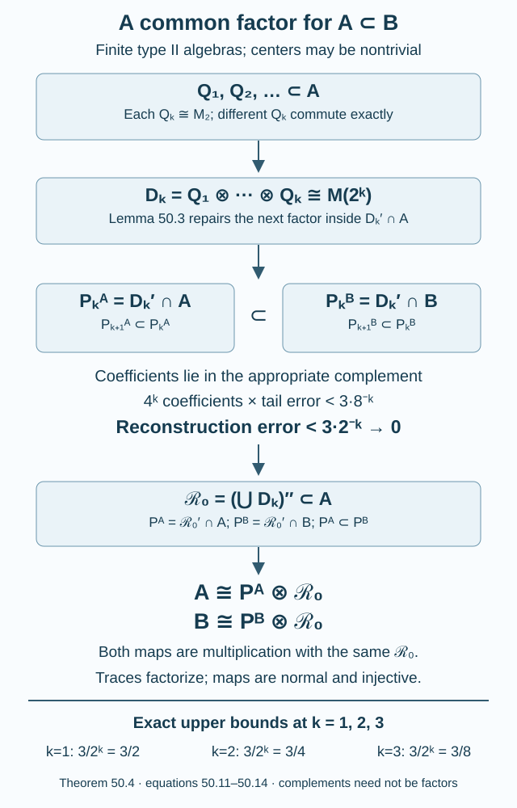

# A common tensor factor in a core inclusion

The smaller member of a core inclusion contains matrix algebras that almost commute with any prescribed finite part of the larger member. We will turn these local choices into one infinite tensor factor, shared by both algebras. The construction works when either algebra has a center.

This supplies the tensor-absorption part of Popa's stability proposition, including its application to a core at every proper finite index. Identifying the resulting tensor complement with the core of a new Jones tunnel requires an additional argument.

We use the finite tracial norm, polar decomposition, spectral calculus, and bounded \(L^2\) completeness. Projection halving is Projections and types of von Neumann algebras, Proposition 13.3. Trace-preserving extension and the infinite binary tensor product are Uniqueness of the injective II₁ factor, Lemmas 2.1–2.2. Its Lemmas 8.12–8.13 and Theorem 8.14 prove the factor version of the construction. Here the residual work is projection repair without factoriality and simultaneous generation of the smaller and larger algebras. General conditional-expectation and hyperfinite-factor results retain those prerequisites.

Write \(\mathcal R\) for the hyperfinite II₁ factor with its normalized trace \(\tau_{\mathcal R}\). A *finite type II algebra* has a faithful normal tracial state and no nonzero abelian projection; it need not be a factor. Every trace below is normalized.

## Repairing matrix units when the center is present

**Lemma 50.1 — complementary projection repair.** Let \(P\) be a finite type II algebra with trace \(\tau\). Suppose \(a_n\) are positive contractions and \(b_n\) are contractions in \(P\), and

\[
\begin{gathered}
\|a_n^2-a_n\|_2\longrightarrow0,\\
\|b_n^*b_n-a_n\|_2\longrightarrow0,\\
\|b_nb_n^*-(1-a_n)\|_2\longrightarrow0.
\end{gathered}
\tag{50.1}
\]

There are projections \(p_n\) and partial isometries \(v_n\) in \(P\) such that

\[
\begin{gathered}
v_n^*v_n=p_n,\qquad v_nv_n^*=1-p_n,\\
\|p_n-a_n\|_2+\|v_n-b_n\|_2\longrightarrow0.
\end{gathered}
\tag{50.2}
\]

In particular, \(p_n,v_n^*,v_n,1-p_n\), in that order, are exact matrix units for a unital copy of \(M_2(\mathbb C)\).

**Proof.** Suppress the subscript \(n\); every assertion of convergence refers to this sequence. Taking traces in the last two relations of (50.1) gives \(\tau(a)\to1/2\), since \(\tau(b^*b)=\tau(bb^*)\).

Put \(e=1_{[1/2,1]}(a)\). The scalar inequality

\[
|1_{[1/2,1]}(t)-t|\leq2|t^2-t|
\quad(0\leq t\leq1)
\]

gives \(\|e-a\|_2\to0\), and hence \(\tau(e)\to1/2\). Let \(c=(1-e)be\). First,

\[
\begin{aligned}
\|eb\|_2^2
&=\tau(ebb^*e)\\
&\leq\|bb^*-(1-a)\|_2+\tau(e(1-a)e)
 \longrightarrow0 .
\end{aligned}
\]

The last trace tends to zero because \(e(1-e)=0\) and \(a-e\to0\) in \(L^2\). Likewise,

\[
\begin{aligned}
\|b(1-e)\|_2^2
&=\tau((1-e)b^*b(1-e))\\
&\leq\|b^*b-a\|_2\\
&\quad+\tau((1-e)a(1-e))
 \longrightarrow0 .
\end{aligned}
\]

Thus \(c-b=-eb-(1-e)b(1-e)\to0\) in \(L^2\). Both \(b\) and \(c\) are contractions, so

\[
\begin{aligned}
&\|c^*c-e\|_2\\
&\leq2\|c-b\|_2+\|b^*b-a\|_2\\
&\quad+\|a-e\|_2\\
&\longrightarrow0 .
\end{aligned}
\tag{50.3}
\]

Take the polar decomposition \(c=w|c|\), with
\(s=w^*w\leq e\) and \(t=ww^*\leq1-e\). In the corner \(ePe\), the inequality \(|x-1|\leq|x^2-1|\) for \(x\geq0\) gives

\[
\||c|-e\|_2\leq\|c^*c-e\|_2.
\]

Since \(we=w\), it follows that
\(\|w-c\|_2\leq\||c|-e\|_2\to0\). Also

\[
\tau(e-s)\leq\|c^*c-e\|_2^2\longrightarrow0:
\]

on \(e-s\), the positive operator \(c^*c\) is zero. Consequently \(\tau(s)\to1/2\) and \(\tau(t)=\tau(s)\to1/2\).

The unused projection is \(r=1-s-t\), with \(\tau(r)\to0\). Proposition 13.3 supplies orthogonal equivalent projections \(r_1,r_2\) with \(r_1+r_2=r\), and a partial isometry \(z\) with \(z^*z=r_1\), \(zz^*=r_2\). Define

\[
p=s+r_1,\qquad v=w+z.
\tag{50.4}
\]

The initial supports of \(w,z\) are orthogonal, as are their final supports. Thus \(v^*v=p\) and \(vv^*=t+r_2=1-p\). Moreover,

\[
\begin{aligned}
\|p-e\|_2
&\leq\tau(e-s)^{1/2}+\tau(r_1)^{1/2}\\
&\longrightarrow0,\\
\|v-b\|_2
&\leq\|w-c\|_2+\|c-b\|_2\\
&\quad+\tau(r_1)^{1/2}\longrightarrow0 .
\end{aligned}
\]

This proves (50.2). Because the final support of \(v\) is orthogonal to its initial support, \(v^2=0\); the remaining matrix-unit identities follow from its two support equations. \(\square\)

The construction divides the unused projection into two equivalent halves. It does not infer equivalence of arbitrary projections from equality of their scalar traces. In particular, if \(T_P\) is the normalized center-valued trace, then

\[
T_P(p_n)=T_P(1-p_n)=\tfrac12\,1.
\tag{50.5}
\]

This follows from equivalence and additivity, even when \(Z(P)\) is large.

## Keeping the new matrix algebra in a relative commutant

**Definition 50.2.** A unital inclusion \(A\subseteq B\) with common faithful normal tracial state \(\tau\) has the *relative matrix property* if, for every finite \(F\subset B\) and \(\eta>0\), there are matrix units \((q_{ij})_{i,j=1}^2\) of a unital \(M_2(\mathbb C)\subset A\) satisfying

\[
\begin{gathered}
\|[q_{ij},x]\|_2<\eta,\\
x\in F,\quad 1\leq i,j\leq2.
\end{gathered}
\tag{50.6}
\]

**Lemma 50.3.** Suppose \(A,B\) are finite type II algebras with the relative matrix property. If \(D\cong M_m(\mathbb C)\) is a unital subalgebra of \(A\), the new matrix algebra in (50.6) can be chosen in \(D'\cap A\).

**Proof.** Let \((\varepsilon_{cd})\) be the matrix units of \(D\). On \(B\), the trace-preserving expectation onto \(D'\cap B\) is the finite average

\[
\mathcal E_D(x)
=\frac1m\sum_{c,d=1}^m\varepsilon_{dc}x\varepsilon_{cd}.
\tag{50.7}
\]

Matrix multiplication shows that the image commutes with \(D\), and the formula fixes \(D'\cap B\). The summands are completely positive maps; \(\sum_{c,d}\varepsilon_{dc}\varepsilon_{cd}=m1\), so the average is unital. Cyclicity gives \(\tau\mathcal E_D=\tau\), and the formula is bimodular over its range. It restricts to \(A\). Also

\[
\begin{aligned}
&\|\mathcal E_D(x)-x\|_2\\
&\qquad\leq\frac1m\sum_{c,d}\|[x,\varepsilon_{cd}]\|_2.
\end{aligned}
\tag{50.8}
\]

For each \(n\), apply the relative matrix property to \(F\) together with all \(\varepsilon_{cd}\), with tolerance \(1/n\). Denote the resulting matrix units by \(q_{ij}^{(n)}\). Let
\(a_n=\mathcal E_D(q_{11}^{(n)})\) and
\(b_n=\mathcal E_D(q_{21}^{(n)})\).
They are respectively positive contractions and contractions. Equation (50.8) makes them \(L^2\)-close to the original matrix units. The product estimate

\[
\|xy-x'y'\|_2
\leq\|x\|\|y-y'\|_2+\|x-x'\|_2\|y'\|
\]

shows that they satisfy (50.1) in \(P=D'\cap A\).

For clarity, \(P\) is type II. The usual matrix decomposition identifies \(A\) with \(M_m(\mathbb C)\bar\otimes P\), and \(P\) with the corner \(\varepsilon_{11}A\varepsilon_{11}\): the corner map is \(p\mapsto\varepsilon_{11}p\), whose inverse is \(y\mapsto\sum_c\varepsilon_{c1}y\varepsilon_{1c}\). A nonzero abelian projection in this corner would be one in \(A\).

Apply Lemma 50.1 in \(P\). Its exact matrix units converge in \(L^2\) to the raw \(q_{ij}^{(n)}\); the other two units are adjoint and complement. For \(x\in F\), perturbing a unit by \(h\) changes its commutator by at most \(2\|x\|\|h\|_2\). For sufficiently large \(n\), all four corrected units satisfy (50.6) with the requested \(\eta\). \(\square\)

## Two algebras, one infinite tensor factor

**Theorem 50.4 — relative tensor absorption.** Let \(A\subseteq B\) be finite type II algebras with common faithful normal tracial state, separable preduals, and the relative matrix property. There are finite tracial algebras \(P_A\subseteq P_B\) and a unital \(\mathcal R_0\subset A\), isomorphic to \(\mathcal R\), for which multiplication gives simultaneous trace-preserving normal isomorphisms

\[
\begin{gathered}
P_B\bar\otimes\mathcal R_0\ \cong B,\\
P_A\bar\otimes\mathcal R_0\ \cong A,\\
P_B=\mathcal R_0'\cap B,\\
P_A=\mathcal R_0'\cap A.
\end{gathered}
\tag{50.9}
\]

Consequently, as inclusions with their traces,

\[
\begin{gathered}
(A\subseteq B)\cong\\
(A\bar\otimes\mathcal R\subseteq B\bar\otimes\mathcal R),\\
(A\subseteq B)\cong\\
(A\bar\otimes M_n\subseteq B\bar\otimes M_n),\\
n\geq1.
\end{gathered}
\tag{50.10}
\]

**Proof.** Choose \(L^2\)-dense sequences in the unit balls of \(B\) and \(A\), written \(y_j^B,y_j^A\). We construct commuting copies \(Q_k\cong M_2(\mathbb C)\) in \(A\). Put

\[
\begin{gathered}
D_k=Q_1\vee\cdots\vee Q_k\cong M_{2^k},\\
P_k^B=D_k'\cap B,\qquad P_k^A=D_k'\cap A.
\end{gathered}
\]

Let \(\mathcal E_k\) be (50.7) for \(D_k\), and put \(\delta_k=8^{-k}\). Start with any unital \(Q_1\subset A\), supplied by the relative matrix property.

For matrix units \(\varepsilon_{cd}\) of \(D_k\), \(m=2^k\), define the coefficient of \(x\in B\) by

\[
x_{cd}=\sum_{e=1}^m\varepsilon_{ec}x\varepsilon_{de}.
\]

Then

\[
\begin{gathered}
x_{cd}\in P_k^B,\\
x=\sum_{c,d=1}^m\varepsilon_{cd}x_{cd}.
\end{gathered}
\tag{50.11}
\]

Indeed, multiplication by \(\varepsilon_{ab}\) on either side of \(x_{cd}\) gives \(\varepsilon_{ac}x\varepsilon_{db}\). Summing \(\varepsilon_{cd}x_{cd}\) gives \(\sum_{c,d}\varepsilon_{cc}x\varepsilon_{dd}=x\). The corner identity
\(\varepsilon_{11}x_{cd}=\varepsilon_{1c}x\varepsilon_{d1}\), together with the corner isomorphism in Lemma 50.3, gives \(\|x_{cd}\|\leq\|x\|\). If \(x\in A\), then \(x_{cd}\in P_k^A\).

After \(Q_1,\ldots,Q_k\) have been chosen, form a finite set \(G_k\subset P_k^B\) containing:

1. every coefficient in (50.11) of \(y_j^B\) and \(y_j^A\), for \(j\leq k\);
2. \(\mathcal E_k(g)\) for every \(g\in G_i\), \(i<k\).

Choose \(Q_{k+1}\subset P_k^A\) by Lemma 50.3, requiring that each of its four matrix units \(\delta_k\)-commute with \(G_k\). This choice makes all the \(Q_i\) commute.

**Convergence to the two complements.** On \(P_k^B\), averaging over \(Q_{k+1}\) is the expectation onto \(P_{k+1}^B\). It is also the restriction of \(\mathcal E_{k+1}\). One can see this directly by writing the matrix units of \(D_{k+1}\) as tensor products in (50.7). Thus \(\mathcal E_{k+1}\mathcal E_k=\mathcal E_{k+1}\), and (50.8) gives, for \(h\in G_k\),

\[
\|\mathcal E_{k+1}(h)-h\|_2\leq2\delta_k.
\]

If \(g\in G_i\), then \(\mathcal E_k(g)\in G_k\) for \(k\geq i\); at \(k=i\), \(\mathcal E_i(g)=g\). Consequently

\[
\|\mathcal E_{k+1}(g)-\mathcal E_k(g)\|_2
\leq2\cdot8^{-k}\quad(k\geq i).
\]

The sequence is \(L^2\)-Cauchy and bounded in operator norm by \(\|g\|\). Its bounded limit \(z_g\) belongs to every \(P_k^B\), since their bounded balls are \(L^2\)-closed. Therefore, with

\[
P_B=\bigcap_kP_k^B,\qquad P_A=\bigcap_kP_k^A,
\]

we have \(z_g\in P_B\) and

\[
\|g-z_g\|_2
\leq\frac{16}{7}\,8^{-i}<3\cdot8^{-i}.
\tag{50.12}
\]

If \(g\in A\), all its averages belong to \(A\), so \(z_g\in P_A\).

**Generation of both algebras.** Fix \(j\), and let \(i\geq j\). Replace every coefficient of \(y_j^B\) in (50.11) by its \(z_g\). The resulting element is in \(P_B\vee\bigcup_kD_k\), and its distance from \(y_j^B\) is at most

\[
4^i\cdot3\cdot8^{-i}=3\cdot2^{-i}.
\tag{50.13}
\]

The same replacement for \(y_j^A\) lies in \(P_A\vee\bigcup_kD_k\), with the same bound. Since \(i\) can tend to infinity, each dense element belongs to the corresponding von Neumann algebra. Formally, its \(L^2\) vector lies in the closed \(L^2\) subspace of that algebra, and the trace-preserving expectation fixes it. Hence

\[
B=P_B\vee\mathcal R_0,\qquad A=P_A\vee\mathcal R_0,
\]

where \(\mathcal R_0=(\bigcup_kD_k)''\).

**The multiplication maps.** The compatible binary matrix union, with its unique matrix traces, is the usual algebraic model of \(\mathcal R\). Lemma 2.1 of the cited uniqueness lesson extends its trace-preserving identification to \(\mathcal R_0\). This argument does not require the containing algebra \(B\) to be a factor.

For \(x\in P_B\), cyclicity and its commutation with \(D_k\) give

\[
\tau(x\varepsilon_{cd})
=\begin{cases}0,&c\ne d,\\2^{-k}\tau(x),&c=d.\end{cases}
\tag{50.14}
\]

For example, the diagonal pairings are equal because
\(\varepsilon_{c1}\varepsilon_{1c}=\varepsilon_{cc}\); their sum is \(\tau(x)\). Off-diagonal pairings vanish after cycling \(\varepsilon_{dd}\) to the other side. Thus \(\tau(xr)=\tau(x)\tau(r)\) for \(r\in\bigcup_kD_k\). Multiplication from \(P_B\odot\bigcup_kD_k\) into \(B\) is a unital trace-preserving *-homomorphism. The product trace is faithful. Lemma 2.1 extends the map to an injective normal map from \(P_B\bar\otimes\mathcal R_0\) whose range is \(B\). Its restriction to \(P_A\bar\otimes\mathcal R_0\) has range \(A\). The definitions of \(P_A,P_B\) give their relative-commutant descriptions. This proves (50.9).

Finally, \(\mathcal R\bar\otimes\mathcal R\cong\mathcal R\) by interlacing its binary tensor factors, as in Lemma 2.2(b) of the cited lesson. Apply this isomorphism to the common last factor in (50.9) to obtain the first line of (50.10).

For a general integer \(n\), choose equivalent orthogonal projections of trace \(1/n\) summing to \(1\) in \(\mathcal R\), and matrix units connecting them. They give a unital \(M_n\subset\mathcal R\) and the exact matrix decomposition

\[
\mathcal R\cong M_n\bar\otimes(e_{11}\mathcal R e_{11}),
\]

where the corner has its normalized trace. The corner is isomorphic to \(\mathcal R\), by Exercise 3 and its solution in the cited uniqueness lesson. Thus \(\mathcal R\cong\mathcal R\bar\otimes M_n\), with normalized traces. Applying this to the same common factor proves the second line of (50.10). The corner theorem is a declared hyperfinite prerequisite; the binary interlacing alone only proves absorption for powers of two. \(\square\)

**Figure 50.1.** The \(Q_k\) all lie in \(A\) and commute exactly with their predecessors. The complements \(P_k^A\subset P_k^B\) decrease. The finite-stage coefficient count is \(4^k\); the tail bound is less than \(3\cdot8^{-k}\), so the reconstruction error is less than \(3\cdot2^{-k}\). The same last factor occurs in both final multiplication maps. This is a diagram of the proved construction, not a claim that either complement is a factor. Proof locators: Lemma 50.3 and (50.11)–(50.14); reproducible source: [relative-absorption.py](figures/relative-absorption.py).

## Applying the construction to a Jones core

Use the integer convention of [Going up and down the Jones tower](towers-and-tunnels.md), Proposition 4.7. Let \(N\subset M\) be a proper finite-index II₁ inclusion, \(d=[M:N]>1\), and choose its tunnel. Set \(N_k=M_{-k-1}\) for \(k\geq0\), so \(N_0=N\). Its core pair is

\[
\begin{gathered}
C_k=N_k'\cap M,\\
H_k=N_k'\cap N,\\
R=(\bigcup_kC_k)'',\\
S=(\bigcup_kH_k)''.
\end{gathered}
\tag{50.15}
\]

Closures are taken in the inherited tracial representation.

**Proposition 50.5.** The pair \(S\subset R\) satisfies the hypotheses of Theorem 50.4. In particular it absorbs \(\mathcal R\) and every \(M_n\) simultaneously, whether or not \(S,R\) are factors.

**Proof.** For fixed \(k\geq0\), let

\[
\begin{gathered}
q_i=e_{-k-i-1}\quad(i\geq1),\\
T_k=\{q_1,q_2,\ldots\}''.
\end{gathered}
\tag{50.16}
\]

Proposition 4.7 gives \(q_i\in N_{k+i-1}\subset N_k\) and \(q_i\in N_{k+i+1}'\). Hence \(T_k\subset S\cap N_k\); each generator lies in one \(H_l\), and \(S\) is closed. Every element of \(T_k\) commutes with \(C_k\).

We need the full tracial size of this tail, rather than merely the distant-commutation relations. The \(q_i\) satisfy the Jones adjacent and distant relations with \(\lambda=d^{-1}\). On an interval \(a,\ldots,b\), word reduction at its left endpoint is Lemma 11.1, reversed. Its coefficients are in \(N_{k+a}\), while

\[
E_{N_{k+a}}(q_a)=\lambda1.
\]

Thus \(\tau(uq_av)=\lambda\tau(vu)\) for words \(u,v\) in the remaining interval. This recursively determines the trace of every word in the \(q_i\). The canonical path trace has exactly this left-end rule, by Lemma 11.3.

The admissible-index theorem, Theorem 7.2, says that \(\sqrt d=2\cos(\pi/r)\) for \(r\geq4\), or \(\sqrt d\geq2\). Use respectively the \(A_{r-1}\) or \(A_\infty\) model. For any polynomial \(w\), the recursion just proved gives equality of the two traces of \(w^*w\). Both traces are faithful on the generated algebras. A polynomial vanishes in one model exactly when it vanishes in the other. Substitution is consequently a well-defined trace-preserving *-isomorphism of their algebraic unions. Trace-preserving extension, or the GNS unitary in Proposition 11.2, identifies the von Neumann closures. Theorems 9.6 and 10.5 show that \(T_k\) is an infinite-dimensional finite factor, including \(\sqrt d=2\). It is therefore II₁.

The finite algebras \(C_k,H_k\) are finite dimensional by finite-index relative-commutant finiteness, Theorem 2.5, and index multiplicativity along the tunnel. Their countable unions imply separable preduals for \(R,S\), even when the ambient \(M\) has no separability assumption.

They are type II. Here is the type check explicitly. A finite algebra with a nonzero type I part has a nonzero homogeneous central summand \(M_m(Z)\) for some finite \(m\), by the structure theorem for type I algebras, Theorem 10.3 of the projection lesson. A normal unital embedding of the factor \(T_0\) remains injective on restriction to any such nonzero central summand: the kernel is a weakly closed ideal of the factor. But \(T_0\) contains a unital \(M_{m+1}\). Evaluating \(M_m(Z)\) at any character of its nonzero unital abelian algebra \(Z\) would give a unital representation of \(M_{m+1}\) on \(\mathbb C^m\). Its \(m+1\) equivalent nonzero diagonal projections would have equal positive ranks summing to \(m\), which is impossible. Thus neither \(S\) nor \(R\) has a type I summand.

Finally, let \(F\subset R\) be finite and \(\eta>0\). Increasing trace expectations onto \(C_k\) converge to the identity in \(L^2(R)\), because their ranges have dense union. Choose \(k\) so that
\(\|x-E_{C_k}(x)\|_2<\eta/2\) for every \(x\in F\). Choose any unital \(M_2\subset T_k\), with matrix units \(q_{ij}\). They commute exactly with \(C_k\), and

\[
\|[q_{ij},x]\|_2
\leq2\|x-E_{C_k}(x)\|_2<\eta .
\]

They lie in \(S\). This proves the relative matrix property. All hypotheses of Theorem 50.4 have now been checked. \(\square\)

The proper-inclusion hypothesis is essential to this argument. At \(d=1\), every Jones projection is \(1\), the cup-generated tail is scalar, and (50.16) supplies no \(M_2\).

This proves the core tensor-absorption assertion in Sorin Popa's [Classification of amenable subfactors of type II](https://doi.org/10.1007/BF02392646), Section 1.4.4. The shared factor and simultaneous maps in (50.9) make this conclusion explicit. The proposition's embedded-core realization requires transporting the Jones projections, recognizing a new tunnel, and identifying its entire core closure; tensor absorption alone does not establish that conclusion. The opposite-model assertion additionally requires its exact tower and trace identification, especially in the nonextremal case.

For the relative Følner argument in [Relative hypertraces and finite Følner projections](relative-hypertraces-and-folner-projections.md), the subsequent change of core must also identify the canonical basic constructions and their centers, and prove the \(n^2\) change in normalized center-valued trace. Those steps, integer rounding, bounded frames, and the full local/global generating-tunnel equivalence remain separate proof obligations.

## Examples and exercises with complete solutions

**Example 50.6 — a center survives absorption.** Let \(A=L^\infty[0,1]\bar\otimes\mathcal R\) and \(B=M_3\bar\otimes L^\infty[0,1]\bar\otimes\mathcal R\), with \(A\) embedded as \(1\otimes A\) and product traces. Binary matrix algebras sufficiently far out in the last factor commute with finite tensor approximants to any given finite set in \(B\). \(L^2\) approximation proves the relative matrix property. Here one can take \(\mathcal R_0=1\otimes1\otimes\mathcal R\), \(P_A=L^\infty[0,1]\), and \(P_B=M_3\bar\otimes L^\infty[0,1]\). Neither algebra is a factor. The same \(\mathcal R_0\) occurs in both decompositions.

**Exercise 50.1 — equal scalar size is insufficient (basic).** In \(P=L^\infty[0,1]\bar\otimes M_2\) with product trace, compare
\(p=1_{[0,1/2]}\otimes1\) and \(q=1\otimes E_{11}\). Both have scalar trace \(1/2\). Are they equivalent?

**Solution.** The normalized center-valued traces are
\(T_P(p)=1_{[0,1/2]}\) and \(T_P(q)=1/2\).
Equivalence preserves center-valued trace, so \(p\not\sim q\). More directly, compression by the central projection \(1_{(1/2,1]}\otimes1\) kills \(p\) and leaves a nonzero part of \(q\), which an equivalence cannot do. Lemma 50.1 avoids this false scalar comparison by halving the actual residual projection.

**Exercise 50.2 — the finite coefficient formula (intermediate).** For \(D=M_2\subset B\), verify \(x=\sum_{c,d}\varepsilon_{cd}x_{cd}\) and show that the four coefficients belong to \(D'\cap A\) whenever \(x\in A\).

**Solution.** Substitute the definition in (50.11):

\[
\begin{aligned}
\sum_{c,d}\varepsilon_{cd}x_{cd}
&=\sum_{c,d,e}\varepsilon_{cd}\varepsilon_{ec}x\varepsilon_{de}\\
&=\sum_{c,d}\varepsilon_{cc}x\varepsilon_{dd}=x.
\end{aligned}
\]

For each \(\varepsilon_{ab}\), left multiplication of \(x_{cd}\) gives \(\varepsilon_{ac}x\varepsilon_{db}\), and right multiplication gives the same expression. All terms defining \(x_{cd}\) lie in \(A\) if \(x\in A\), because the matrix units do. This proves both claims.

**Exercise 50.3 — choose a summable budget (intermediate).** Replace \(8^{-k}\) by \(b^{-k}\) in the construction. What condition on \(b>1\) makes the coefficient reconstruction tend to zero? Give the exact bound at stage \(i\).

**Solution.** The averaging tail is bounded by

\[
2\sum_{k\geq i}b^{-k}
=\frac{2b}{b-1}b^{-i}.
\]

There are \(4^i\) coefficients, so the reconstruction bound is

\[
\frac{2b}{b-1}\left(\frac4b\right)^i.
\]

It tends to zero exactly when \(b>4\). At \(b=4\), this bound is constant, so this argument gives no convergence. For \(b=8\), the exact bound is \((16/7)2^{-i}<3\cdot2^{-i}\).

**Exercise 50.4 — locating a negative cup (intermediate).** Check the locations of \(q_1=e_{-k-2}\) and \(q_2=e_{-k-3}\) in (50.16), and determine why they commute with \(C_k\). What changes at index one?

**Solution.** Proposition 4.7 puts \(q_1\) in \(M_{-k-1}=N_k\), commuting with \(M_{-k-3}=N_{k+2}\). It puts \(q_2\) in \(M_{-k-2}=N_{k+1}\subset N_k\), commuting with \(M_{-k-4}=N_{k+3}\). Hence both are in \(S\cap N_k\). Since \(C_k=N_k'\cap M\), every element of \(C_k\) commutes with all of \(N_k\), so it commutes with both cups and their tail closure. At index one their trace is one, and faithfulness makes both projections the identity. The tail is then scalar.

**Exercise 50.5 — the same isomorphism for both members (advanced).** Explain why individual isomorphisms \(A\cong A\bar\otimes\mathcal R\) and \(B\cong B\bar\otimes\mathcal R\) would not suffice for (50.10). Prove absorption of \(M_3\) using (50.9).

**Solution.** Individual isomorphisms need not carry the specified embedded copy of \(A\) into the specified tensor copy of \(A\) inside \(B\bar\otimes\mathcal R\). Equation (50.9) instead presents that inclusion as

\[
P_A\bar\otimes\mathcal R_0
\ \subset\
P_B\bar\otimes\mathcal R_0 .
\]

Choose a unital \(M_3\subset\mathcal R_0\). Its first diagonal corner is a hyperfinite II₁ factor isomorphic to \(\mathcal R_0\), giving a trace-preserving isomorphism
\(\theta:\mathcal R_0\bar\otimes M_3\to\mathcal R_0\).
Then \(\mathrm{id}_{P_B}\bar\otimes\theta\) maps the larger tensor product onto \(P_B\bar\otimes\mathcal R_0\) and restricts to \(\mathrm{id}_{P_A}\bar\otimes\theta\) on the smaller one. Compose with the simultaneous multiplication maps. This is the required isomorphism of inclusions.

---

Authored by GPT-6.1 Sol (OpenAI), Ultra reasoning, October 2026. Original exposition released under CC0 1.0. Self-checked by the writing AI.
