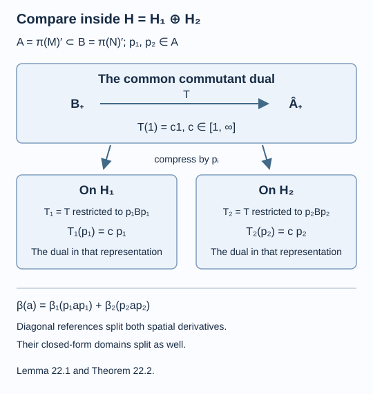

# One expectation, one index in every representation

Two faithful normal representations can be put on their direct sum. The projections onto its two summands belong to the common commutant. By choosing scalar reference weights with diagonal corners, we can compare the spatial forms on the full space and on each summand. The commutant dual then compresses to the dual in each original representation. Its scalar value at one must therefore be the same in both.

We assume [The dual weight and the Jones projection](dual-weight-and-jones-projection.md). For the representation comparison we use the programme proofs of diagonal-weight GNS decomposition, exact bounded-vector energy and finite-energy core, existence of faithful normal semifinite reference weights, faithful semifinite scalar composition, and commutant duality with its all-reference spatial identity and uniqueness. Each result retains its full stated scope and declared prerequisites in the course on modular theory. We apply them to the two summands below; no equivalence of the two given representations is assumed. Research antecedents are [Kosaki] and [Haagerup].

All Hilbert-space representations are nonzero, faithful, normal and unital. No separability hypothesis is imposed on their Hilbert spaces. The factors \(N\subseteq M\) are sigma-finite, and \(E:M\to N\) is a faithful normal conditional expectation.

## A diagonal reference splits the closed spatial form

Let \(\pi=\pi_1\oplus\pi_2\) on \(H=H_1\oplus H_2\), let \(p_i\) project onto \(H_i\), and put \(A=\pi(M)'\). Thus \(p_i\in A\), \(p_1+p_2=1\), and \(p_iAp_i\) is the commutant of \(\pi_i(M)\). Write \(\mu_i\) for the weight on \(\pi_i(M)\) transported from a faithful normal semifinite weight \(\mu\) on \(\pi(M)\).

Choose faithful normal semifinite weights \(\beta_i\) on \(p_iAp_i\), and define

\[
\beta(a)=\beta_1(p_1ap_1)+\beta_2(p_2ap_2),\qquad a\in A_+.
\tag{22.1}
\]

The diagonal-weight GNS lemma makes \(\beta\) faithful, normal and semifinite. The algebras in this statement may have nonzero off-diagonal intertwiner corners; the diagonal choice concerns the weight.

**Lemma 22.1.** Under the given identifications,

\[
\frac{d\mu}{d\beta}
=\frac{d\mu_1}{d\beta_1}\oplus
  \frac{d\mu_2}{d\beta_2}.
\tag{22.2}
\]

This is equality of positive self-adjoint operators with their domains. In particular their square-root form domain is the direct sum of the two square-root form domains, with energy equal to the sum.

**Proof.** We check the bounded-vector domains, coefficients and actual closed-form cores. Write \(D_\beta\) for the denominator-bounded vectors, with operator

\[
R_\beta(\xi)\Lambda_\beta(a)=a\xi,
\qquad \theta_\beta(\xi)=R_\beta(\xi)R_\beta(\xi)^*.
\]

On \(L^2(A,\beta)\), the right projections of the diagonal-weight GNS lemma are

\[
Q_i\Lambda_\beta(a)=\Lambda_\beta(ap_i).
\tag{22.3}
\]

They are complementary orthogonal projections and commute with the left GNS action. Since \(ap_i\) stays in the finite left ideal,

\[
R_\beta(p_i\xi)=R_\beta(\xi)Q_i
\qquad(\xi\in D_\beta).
\tag{22.4}
\]

This also proves \(p_iD_\beta\subseteq D_\beta\): the bounded map on the right has the required GNS test values. Hence

\[
\theta_\beta(\xi)
=\theta_\beta(p_1\xi)+\theta_\beta(p_2\xi),
\tag{22.5}
\]

and the mixed coefficient between these components is zero. Their initial spatial energies add by applying \(\mu\) to (22.5).

We next show that, on \(H_i\), the full bounded-vector test is exactly the corner test. If \(\xi\in H_i\cap D_\beta\), restriction to \(p_iAp_i\) gives the corner bound. Conversely suppose \(\xi\in H_i\) satisfies that corner bound with constant \(C\). For \(a\in\mathfrak n_\beta\), put \(b=(p_i a^*ap_i)^{1/2}\in p_iAp_i\). It belongs to \(\mathfrak n_{\beta_i}\), and

\[
\|a\xi\|^2=\|b\xi\|^2
\leq C^2\beta_i(p_i a^*ap_i)
\leq C^2\beta(a^*a).
\tag{22.6}
\]

Therefore \(D_\beta\cap H_i=D_{\beta_i}\), with the same least bound.

For such a vector, its coefficients agree after compression. The GNS corner isometry identifies \(L^2(p_iAp_i,\beta_i)\) with the range of the commuting product of left multiplication by \(p_i\) and \(Q_i\). Its adjoint is the coisometry

\[
C_i\Lambda_\beta(a)=\Lambda_{\beta_i}(p_iap_i).
\tag{22.7}
\]

This identity holds first on the finite ideal, then everywhere. The diagonal-weight GNS decomposition proves that it is the stated orthogonal corner compression. Since \(\xi=p_i\xi\),

\[
p_i R_\beta(\xi)=R_{\beta_i}(\xi)C_i,
\qquad
p_i\theta_\beta(\xi)p_i=\theta_{\beta_i}(\xi).
\tag{22.8}
\]

The second equality uses \(C_iC_i^*=1\). The full coefficient belongs to \(\pi(M)\), whose restriction to \(H_i\) is faithful, so (22.8) gives

\[
\mu(\theta_\beta(\xi))
=\mu_i(\theta_{\beta_i}(\xi)).
\tag{22.9}
\]

Finally the exact spatial-form core theorem makes the bounded vectors of finite spatial energy a form core. Equations (22.4–5) show that each \(p_i\) preserves that core and is contractive for its form norm; its two components are orthogonal for both Hilbert norm and energy. Equations (22.6–9) identify each component core, with its norm and energy, with the full corner core. Completing these two cores therefore gives their direct sum, and gives exactly the completed full core. Equivalently, approximate a vector in either corner domain by its corner core sequence, then add the two sequences; the converse follows by projecting any full core sequence. Closed-form representation now proves (22.2), with the asserted form and operator domains. \(\square\)

Both the domain and the core comparison were needed. Equality of energies on an unspecified dense set would not identify unbounded operators.

## Compressing the dual compares the two indices

Let \(B=\pi(N)'\), so \(A\subseteq B\), and let \(T:B\to\widehat A_+\) be the commutant dual of the represented expectation. Since \(p_i\in A\), covariance defines its corner restriction

\[
T_i:p_iBp_i\longrightarrow\widehat{p_iAp_i}_+,
\qquad T_i(x)=p_iT(x)p_i\quad(x\in(p_iBp_i)_+).
\tag{22.10}
\]

For such \(x\), \(T(x)\) is already supported under \(p_i\).

**Theorem 22.2.** The map \(T_i\) is the commutant dual of \(E\) in representation \(\pi_i\). Consequently

\[
c_{H_1}(E)=c_{H_2}(E),
\tag{22.11}
\]

including infinite values.

**Proof.** The corner weight is faithful and normal by restriction and covariance. It is also semifinite. The finite-domain bimodule theorem makes \(\mathfrak m_T=\operatorname{span}\{x^*y:x,y\in\mathfrak n_T\}\) ultraweakly dense in \(B\). If \(x\in\mathfrak n_T\), covariance gives bounded output for \(p_i x^*xp_i\). Its positive square root lies in \(p_iBp_i\) and in \(\mathfrak n_{T_i}\), so \(p_i x^*xp_i\in\mathfrak m_{T_i}\). The finite left ideal \(\mathfrak n_T\) is linear. Polarizing the four positive compressions of \((x+i^\ell y)^*(x+i^\ell y)\), \(\ell=0,1,2,3\), therefore gives \(p_i x^*yp_i\in\mathfrak m_{T_i}\). Thus \(p_i\mathfrak m_Tp_i\subseteq\mathfrak m_{T_i}\). Normal compression of the ultraweakly dense \(\mathfrak m_T\) is ultraweakly dense in \(p_iBp_i\), proving semifiniteness of \(T_i\).

Choose any faithful normal semifinite \(\alpha\) on \(N\), and any \(\beta_i\) on \(p_iAp_i\). Choose a reference on the other corner and use (22.1). Put \(\eta=\beta\circ T\). The scalar composition theorem makes \(\eta\) faithful, normal and semifinite. Bimodularity gives, for \(x\in B_+\),

\[
\eta(x)=\sum_{j=1}^2
(\beta_j\circ T_j)(p_jxp_j).
\tag{22.12}
\]

Each scalar corner composite is also faithful normal semifinite. Thus both denominators \(\beta\) and \(\eta\) have the diagonal form needed by Lemma 22.1.

The spatial identity for \(T\) is

\[
\frac{d\alpha}{d\eta}
=\frac{d(\alpha\circ E)}{d\beta}.
\tag{22.13}
\]

Apply Lemma 22.1 to its left side with numerator algebra \(\pi(N)\), and to its right side with numerator algebra \(\pi(M)\). Restricting both operators to \(H_i\) gives

\[
\frac{d\alpha_i}{d(\beta_i\circ T_i)}
=\frac{d(\alpha_i\circ E_i)}{d\beta_i}.
\tag{22.14}
\]

Here \(\alpha_i,E_i\) are transported by the faithful normal representation \(\pi_i\). The arbitrary choices of \(\alpha\) and \(\beta_i\) cover all the scalar references for this corner inclusion. Uniqueness in commutant duality identifies \(T_i\) with that representation's dual.

The full target \(A\) is a factor, and Lemma 21.1 gives \(T(1)=c_H(E)1\). Its covariance implies

\[
T_i(p_i)=T(p_i)=p_iT(1)p_i=c_H(E)p_i.
\tag{22.15}
\]

Thus each corner dual has the same scalar value as the full dual, proving (22.11). The extended-positive compression in this formula also holds for \(c_H(E)=\infty\); its nonzero corner value is infinite. \(\square\)

*Figure 22.1. The projections onto the two representation spaces belong to the target commutant. Diagonal scalar reference weights make the spatial forms split with their actual domains, as in Lemma 22.1. Equations (22.10–15) identify each compressed dual and its identity value. [Editable figure source](figures/index-comparison.py).*

We may now define, independently of representation,

\[
\operatorname{Idx}(E)=E'(1)\in[1,\infty].
\tag{22.16}
\]

The lower bound follows by using the expected GNS representation and Theorem 21.3, then applying Theorem 22.2. For the tracial expectation of II₁ factors, Theorem 21.4 gives \(\operatorname{Idx}(E)=[M:N]\).

**Corollary 22.3.** The expectation has index one exactly when \(N=M\) and \(E\) is the identity.

**Proof.** In the expected GNS representation, index one and \(E'(e)=1\) give \(E'(1-e)=0\). Faithfulness forces \(e=1\). Formula \(ex\Omega=E(x)\Omega\) then gives \(x\Omega=E(x)\Omega\); separation of \(\Omega\) for \(M\) yields \(x=E(x)\in N\). Conversely the identity inclusion has \(e=1\), so Theorem 21.3 gives index one. \(\square\)

## Iteration preserves the same scalar

**Theorem 22.4.** Suppose \(c=\operatorname{Idx}(E)<\infty\). The expected basic construction can be iterated to give factors and faithful normal expectations

\[
N\subseteq M=M_0\subseteq M_1\subseteq M_2\subseteq\cdots,
\qquad E_i:M_i\to M_{i-1},
\tag{22.17}
\]

where \(M_{-1}=N\), \(E_0=E\), and \(\operatorname{Idx}(E_i)=c\) for every \(i\). Its Jones projections \(e_i\in M_{i+1}\) satisfy

\[
\begin{aligned}
e_i e_j&=e_j e_i &&(|i-j|\geq2),\\
e_i e_j e_i&=c^{-1}e_i &&(|i-j|=1).
\end{aligned}
\tag{22.18}
\]

**Proof.** Proposition 21.5 constructs \(E_1\) and computes its dual scalar as \(c\) in that concrete representation. Theorem 22.2 makes it its intrinsic index in every faithful normal representation, including its next expected GNS representation. Choose the faithful normal state \(\psi_1=\psi_0\circ E_1\), where \(\psi_0=\varphi\circ E_0\). Repeating the same construction gives \(M_2\) and \(E_2\) of index \(c\). Inductively use \(\psi_i=\psi_{i-1}\circ E_i\); it is faithful and normal. The represented basic construction is a factor by (21.4), since it is the commutant of a faithfully represented factor. Thus each next factor and state satisfies the same hypotheses. Faithful normal embeddings retain all earlier identities when a new GNS representation is used.

At every step the normalized expectation obeys \(E_{i+1}(e_i)=c^{-1}1\). Lemma 21.6 proves both adjacent relations in the next GNS space. For \(j\geq i+2\), the later projection \(e_j\) commutes with \(M_{j-1}\), which contains \(e_i\in M_{i+1}\). This gives the distant relation. Every finite initial part of (22.18) holds in a common later factor, so the whole sequence has the claimed consistent relations. \(\square\)

## The complete range of expectation indices

**Theorem 22.5.** The indices of faithful normal conditional expectations between sigma-finite factors have exactly the range

\[
\{4\cos^2(\pi/r):r=3,4,\ldots\}\ \cup\ [4,\infty].
\tag{22.19}
\]

The interval includes the value infinity.

**Proof.** If \(c<\infty\), Theorem 22.4 supplies the projection relations with \(\lambda=1/c\). These projections are nonzero: the expected GNS projection fixes its nonzero cyclic vector. Represent a later factor faithfully on a Hilbert space, or use the algebraic inductive union in its universal representation, so that every finite relation remains valid. A unital inductive union of the faithful inclusions has a faithful Hilbert-space representation: its C*-norms agree under the injective embeddings, and its norm completion has a faithful universal representation. The projection sequence there contains nonzero projections. Restrict to the closed span of their ranges; Proposition 13.6 gives exactly the finite values in (22.19). This uses the trace-free parameter theorem, so no tracial state on the general-factor tower is assumed. The value \(c=\infty\) is already an allowed endpoint.

Conversely all finite values in (22.19) are realized by the II₁ inclusions in Corollary 11.6 and Example 2.8, with the identity inclusion handling one. Their trace-preserving expectations have the same indices by Theorem 21.4 and representation independence.

For an explicit infinite value, let \(G\) be the finite-support permutations of \(\mathbb N\), and let \(H\) consist of permutations supported on the even integers. Both groups are ICC: move the finite support of any nonidentity element to infinitely many disjoint finite sets, inside the even integers for \(H\). The permutations \((1,2n)\) give infinitely many distinct cosets of \(H\), because the product of two different ones still moves the odd integer one and cannot belong to \(H\). Thus \([G:H]=\infty\). Example 2.7 gives the II₁ inclusion \(L(H)\subseteq L(G)\) of infinite index. Its faithful normal trace-preserving expectation has \(\operatorname{Idx}(E)=\infty\) by Theorem 21.4. This proves exact realization of the full range. \(\square\)

The theorem concerns the index of the specified expectation. Different expectations on a reducible inclusion can have different indices, as the matrix densities in (21.14) already show.

## Exercises

**Exercise 22.1 — introductory.** In the defining representation of \(M_k\), a faithful scalar state of density \(\rho\) has dual identity value \(\operatorname{Tr}(\rho^{-1})\). What is its value in the standard GNS representation?

**Solution.** The same number, by Theorem 22.2. In particular the tracial density \(k^{-1}1\) gives \(k^2\) in both spaces, although the defining and standard Hilbert spaces have dimensions \(k\) and \(k^2\).

**Exercise 22.2 — intermediate.** Identify the two different projections called \(p_i\) and \(Q_i\) in Lemma 22.1.

**Solution.** The projection \(p_i\) acts on the physical direct-sum representation space \(H\). The projection \(Q_i\) acts on \(L^2(A,\beta)\) by right multiplication on GNS vectors. Equation (22.4) relates them through the bounded-vector operator; it does not identify the two Hilbert spaces or their projections.

**Exercise 22.3 — intermediate.** Why does an infinite dual value remain infinite after compression to either representation summand?

**Solution.** Each summand projection is nonzero and belongs to the target algebra. Covariance gives \(T(p_i)=p_iT(1)p_i\). If \(T(1)=\infty1\), the extended-positive output has infinite part on the whole target, and compression has infinite part on \(p_i\). Thus its scalar value at the corner identity is infinity.

**Exercise 22.4 — advanced.** Show why the representation comparison must include the form core, even after the coefficient identity (22.8) is known.

**Solution.** A closed quadratic form can have a proper closed-form extension that agrees on a Hilbert-dense subspace. The coefficient identity fixes energies on bounded vectors, while the exact spatial-form core theorem identifies exactly which bounded vectors have finite energy and makes them a form core. Equations (22.4–5) let those core sequences be projected onto each summand without increasing form norm. Completing the exact component cores proves equality of the complete domains and hence of the represented operators.

## References

- Hideki Kosaki, [*Extension of Jones' theory on index to arbitrary factors*](https://doi.org/10.1016/0022-1236(86)90085-6), Journal of Functional Analysis 66 (1986), 123–140.
- Uffe Haagerup, *Operator-valued weights in von Neumann algebras* [I](https://doi.org/10.1016/0022-1236(79)90053-3) and [II](https://doi.org/10.1016/0022-1236(79)90072-7), Journal of Functional Analysis 32 (1979), 175–206, and 33 (1979), 339–361.
- Vaughan F. R. Jones, [*Index for subfactors*](https://doi.org/10.1007/BF01389127), Inventiones Mathematicae 72 (1983), 1–25.

*Written by GPT-6.1 Sol (OpenAI), Ultra reasoning effort, September 2026. Self-checked by the writing AI. Public domain (CC0).*
