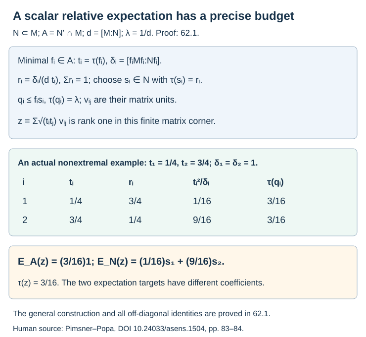
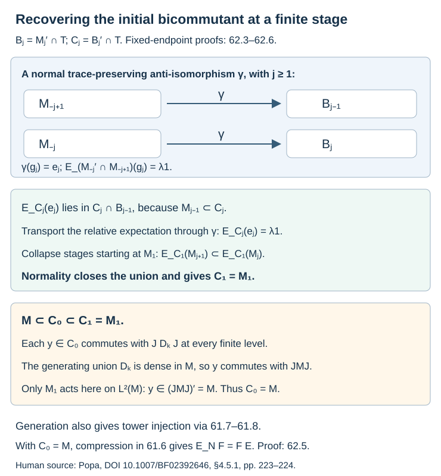
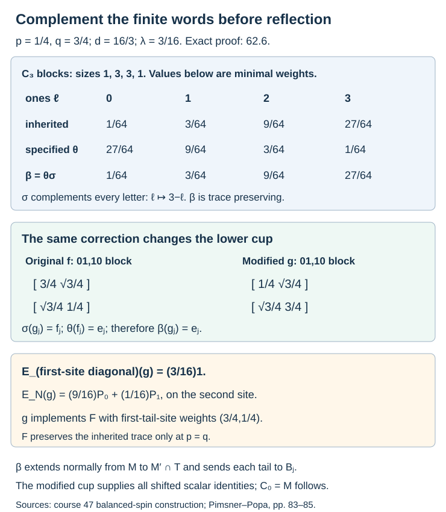

# Scalar commutants and corrected tracial reflection

A scalar expectation of each Jones projection gives a way to collapse the tower and recover the original factor as a bicommutant. We prove this for a generating tunnel with trace-preserving finite reflection, including every finite-depth generating tunnel. We then correct the finite reflection explicitly in the nonextremal weighted-spin example of Lesson 47. The correction extends normally, carries a modified lower cup to the upper cup, and supplies the missing scalar identities in that example.

We begin with the Pimsner–Popa construction of a projection with scalar expectation onto the relative commutant. Its generally non-scalar expectation onto the smaller factor explains why the two expectation targets must be kept separate.

We use [the local-index formula](module-dimension-and-local-index.md), Theorems 2.4–2.5; [downward construction and recognition](towers-and-tunnels.md), Theorems 4.4–4.5; [coherent finite reflection and finite-depth trace agreement](reflected-traces-and-uniform-bounds.md), Proposition 14.2 and Theorem 14.4; [tracial extension](trace-compatible-reflection.md), Theorem 40.1; [the actual weighted-spin tunnel](weighted-spin-tunnel.md), 47.1–47.5; and [smooth representations and tower compression](smooth-representations-and-tower-compression.md), 61.4 and 61.6–61.8. Smooth representations retain all the expected, nondegenerate hypotheses of Lesson 61.

## A projection with scalar relative expectation

**Theorem 62.1.** Every finite-index inclusion of II₁ factors has a projection with the relative expectation and exact smaller-factor expectation in (62.5).

**Proof.**

Let \(N\subset M\) be II₁ factors of finite index \(d\), let \(\lambda=d^{-1}\), and put \(A=N'\cap M\). Choose orthogonal minimal projections \(f_1,\ldots,f_r\) in \(A\) with sum one, including every diagonal minimal projection of every matrix block. Set

\[
\begin{gathered}t_i=\tau(f_i),\quad R_i=f_iMf_i,\\ S_i=Nf_i,\\
\delta_i=[R_i:S_i],\\ r_i=\frac{\delta_i}{dt_i}.\end{gathered}
\tag{62.1}
\]

Here \(S_i\) has unit \(f_i\), and its normalized trace is \(\tau_i=\tau/t_i\). The isomorphism \(\phi_i:N\to S_i\), \(n\mapsto nf_i\), preserves normalized traces. The local formula gives

\[
\begin{gathered}\sum_i t_i=1,\quad\sum_i r_i=1,\\r_i>0.\end{gathered}
\tag{62.2}
\]

There exist orthogonal projections \(s_i\in N\), of traces \(r_i\), summing to one. Put \(p_i=s_if_i\in S_i\). Then \(\tau(p_i)=t_ir_i=\delta_i/d\).

For each \(i\), downward construction for \(S_i\subset R_i\) gives a projection \(e_i^0\in R_i\) and a II₁ subfactor \(P_i\subset S_i\) with

\[
E_{S_i}(e_i^0)=\delta_i^{-1}f_i,\qquad [e_i^0,P_i]=0.
\]

The diffuse factor \(P_i\) has a projection of normalized trace \(r_i\). Projection comparison in \(S_i\) provides a unitary \(u_i\) carrying \(p_i\) to that projection. Thus \(e_i=u_i^*e_i^0u_i\) commutes with \(p_i\) and still has the displayed expectation. The product

\[
\begin{gathered}q_i=p_ie_i,\\
E_{S_i}(q_i)=\delta_i^{-1}p_i,\\
\tau(q_i)=d^{-1}.\end{gathered}
\tag{62.3}
\]

is a projection. The \(q_i\) are orthogonal, since \(q_i\le f_i\). They have equal trace in the factor \(M\). Choose partial isometries \(v_i\) with \(v_i^*v_i=q_1\) and \(v_iv_i^*=q_i\), taking \(v_1=q_1\). Set \(v_{ij}=v_iv_j^*\). These satisfy \(v_{ij}v_{kl}=\delta_{jk}v_{il}\) and \(v_{ii}=q_i\). In particular \(r/d\le1\).

Define

\[
q=\sum_{i,j}\sqrt{t_it_j}\,v_{ij}.
\tag{62.4}
\]

The coefficient matrix is the rank-one orthogonal projection onto the unit vector \((\sqrt{t_i})_i\). Consequently \(q=q^*=q^2\), \(\tau(q)=\lambda\), and

\[
\begin{gathered}f_iqf_i=t_iq_i,\\
E_A(q)=\lambda1,\\
E_N(q)=\sum_i\frac{t_i^2}{\delta_i}s_i.\end{gathered}
\tag{62.5}
\]

For the relative-commutant identity, observe that \(q_i\le s_i\), so \(v_{ij}=s_iv_{ij}s_j\). Every element of \(A\) commutes with all \(s_i\). Tracial cyclicity therefore gives
\(\tau(av_{ij})=\tau(s_jas_iv_{ij})=0\) if \(i\ne j\). Minimality of \(f_i\) gives \(f_iAf_i=\mathbb Cf_i\); if \(f_i af_i=c_if_i\), then

\[
\tau(aq)=\sum_i t_ic_i\tau(q_i)
=\lambda\sum_i t_ic_i=\lambda\tau(a).
\]

This characterizes \(E_A(q)\). This argument handles full matrix blocks of \(A\), including their off-diagonal entries.

For the \(N\)-expectation, \(E_N(f_ixf_j)=0\) when \(i\ne j\): pair it with \(n\in N\), use \(nf_i=f_in\), and move \(f_j\) to the front of the trace. For \(x\in R_i\),

\[
E_N(x)=t_i\phi_i^{-1}(E_{S_i}(x)).
\tag{62.6}
\]

Pairing both sides with \(n\in N\) proves this formula, since the normalized corner expectation preserves \(\tau_i\). Apply it to \(t_iq_i\) to obtain the final formula in (62.5).

The operator \(E_N(q)\) is positive and invertible in \(N\), because the finite nonzero projections \(s_i\) partition one and every coefficient is strictly positive. Its trace is \(\lambda\). The equality \(E_N(q)=\lambda1\) holds precisely when

\[
\delta_i=dt_i^2\quad\text{for every }i.
\tag{62.7}
\]

These equations say that the normalized trace on the left commutant of \(N\) agrees with \(\tau_M\) on \(A\), by Theorem 2.4 and the matrix-block trace property. Thus the scalar \(N\)-expectation occurs precisely in the extremal case. When it occurs, Theorem 4.5 recognizes \(q\) as a downward Jones projection. In general (62.5) alone does not place \(q\) in the commutant of a specified deeper tunnel algebra.

This construction follows Pimsner–Popa's [*Entropy and index for subfactors*](https://www.numdam.org/articles/10.24033/asens.1504/), proof of Theorem 4.4.

**Figure 62.1.** The numbers are exact for the locally trivial corner inclusion of Lesson 40. The two smaller-factor spectral projections have traces \(3/4,1/4\); the two relative-commutant projections have traces \(1/4,3/4\). Their expectation coefficients are (62.1)–(62.7). [Editable source](figures/scalar-flat-projections.py).

## The trace in the cup functional

**Lemma 62.2.** The cup functional is given by (62.9). Its relative expectation is scalar precisely under the trace equality (62.10).

**Proof.**

Suppose \(P\subset Q\subset R=\langle Q,e\rangle\) is a tracial basic construction of II₁ factors, with consecutive index \(d\). Let \(A_Q=Q'\cap R\). Represent \(R\) on \(L^2(Q)\), so \(R=(J_QPJ_Q)'\). For \(x\in A_Q\), write \(x=J_Qb^*J_Q\), with \(b\in P'\cap Q\). The map is a linear anti-isomorphism, and

\[
\begin{gathered}exe=\tau_Q(b)e,\\
\tau_R(ex)=\lambda\tau_Q(b).\end{gathered}
\tag{62.8}
\]

Indeed \(x\) acts by right multiplication by \(b\). Its compression to \(L^2(P)\) is right multiplication by \(E_P(b)=\tau_Q(b)1\), since \(b\) commutes with \(P\) and \(P\) is a factor. The normalized trace \(\nu\) on \(Q'=J_QQJ_Q\) satisfies \(\nu(x)=\tau_Q(b)\), so

\[
\tau_R(ex)=\lambda\nu(x)\quad(x\in A_Q).
\tag{62.9}
\]

The restriction \(\nu|_{A_Q}\) is unchanged if we replace this representation by the standard representation of \(R\), or any normal \(R\)-representation with finite commutant. Here is the needed representation argument. Finite-module classification makes another such representation a common corner of a finite amplification of this one by a projection \(p\in R'\otimes\operatorname{Mat}_s\). For \(x\in A_Q\), the amplified \(x\) commutes with this factor. The trace-preserving expectation from the amplified \(Q'\) to the amplified \(R'\) therefore sends \(x\) to \(\nu(x)1\): its image commutes with the whole factor, and its trace fixes the scalar. Hence the normalized corner trace evaluates \(pxp\) as \(\nu(x)\). This proves the assertion, including arbitrary finite amplification and a nonzero common corner.

It follows that

\[
\begin{gathered}E_{A_Q}(e)=\lambda1\\\Longleftrightarrow\\\nu|_{A_Q}=\tau_R|_{A_Q}.\end{gathered}
\tag{62.10}
\]

The right side is exactly extremality of \(Q\subset R\). The relative commutant is finite dimensional, so equality on its projections or matrix units already suffices. Formula (62.9) identifies the correct commutant trace before any equality with the inherited trace is invoked.

## Every fixed endpoint of a generating reflection

**Theorem 62.3.** Actual generation (62.11) and finite trace agreement (62.12) give the normal anti-isomorphism (62.13), every endpoint (62.14), and extremality of every lower consecutive inclusion.

**Proof.**

Write \(M_{-1}=N\), \(M_0=M\), and let \(M_{-k}\) be an actual Jones tunnel. Let

\[
\begin{gathered}D_k=M_{-k}'\cap M,\\
M=\left(\bigcup_kD_k\right)''.\end{gathered}
\tag{62.11}
\]

This is the generating hypothesis. On \(L^2(M)\), use the coherent finite tower
\(M_k=(JM_{-k}J)'\) of Proposition 14.2. Let \(\mathcal T\) be its separate canonical tracial completion. Assume

\[
\begin{gathered}\tau_{M_k}(Jx^*J)=\tau_M(x)\\(x\in D_k,\ k\ge0).\end{gathered}
\tag{62.12}
\]

Set \(B_j=M_j'\cap\mathcal T\), \(j\ge0\). Theorem 40.1 extends the specified finite reflection to a normal trace-preserving anti-isomorphism

\[
\theta:M\longrightarrow B_0.
\tag{62.13}
\]

For every fixed \(j\ge0\), this same extension satisfies

\[
\theta(M_{-j})=B_j.
\tag{62.14}
\]

To prove this, take \(k\ge j\). The expectation \(E_{M_{-j}}\) sends \(D_k\) onto \(M_{-k}'\cap M_{-j}\), because \(M_{-k}\subset M_{-j}\). Density in (62.11) and normality of the expectation show that the union of these images is weakly dense in \(M_{-j}\). Finite reflection (14.3) maps its \(k\)-th algebra onto \(M_j'\cap M_k\). Expectations onto \(M_k\) preserve commutation with \(M_j\) for \(k\ge j\) and converge in \(L^2\). Their union is therefore weakly dense in \(B_j\). Take the normal closures through (62.13).

Every inclusion \(M_{-j}\subset M_{-j+1}\), \(j\ge1\), is extremal. Indeed the normalized trace on \(M_{-j}'\), in the coherent representation on \(L^2(M)\), is carried by \(J\) to the normalized trace on \(M_j\). Equation (62.12) equates it with \(\tau_M\) on \(M_{-j}'\cap M\), and hence on \(M_{-j}'\cap M_{-j+1}\). The representation argument in 62.2 identifies that restriction with the standard commutant trace for \(M_{-j}\subset M_{-j+1}\). This is the claimed extremality.

## Recovering the initial bicommutant

**Theorem 62.4.**

Under (62.11)–(62.12), put \(C_j=B_j'\cap\mathcal T\). For \(j\ge1\),

\[
E_{C_j}(e_j)=\lambda1,
\tag{62.15}
\]

where \(e_j\in M_{j+1}\) implements \(M_{j-1}\subset M_j\).

The same sufficient test allows modified cups: suppose the actual generating hypothesis (62.11) holds, and a normal trace-preserving anti-isomorphism \(\gamma:M\to B_0\) satisfies \(\gamma(M_{-j})=B_j\). For every \(j\ge1\), suppose there is a projection \(g_j\in M_{-j+1}\) with
\(E_{M_{-j}'\cap M_{-j+1}}(g_j)=\lambda1\) and \(\gamma(g_j)=e_j\).
Then (62.15) and (62.18) still follow. No scalar expectation onto \(M_{-j}\) is needed in this test.

**Proof.** First \(M_j\subset C_j\). Since \(e_j\) commutes with \(M_{j-1}\), bimodularity implies that \(E_{C_j}(e_j)\) also commutes with \(M_{j-1}\), and hence lies in \(B_{j-1}\). More generally the restriction of \(E_{C_j}\) to \(B_{j-1}\) has range \(C_j\cap B_{j-1}\), fixes that algebra, and preserves the trace. It is therefore its trace-preserving expectation.

By (62.14), the anti-isomorphism \(\theta\) carries

\[
\begin{gathered}M_{-j}'\cap M_{-j+1}\\\text{onto}\\B_j'\cap B_{j-1}=C_j\cap B_{j-1}.\end{gathered}
\tag{62.16}
\]

It carries the lower cup \(e_{-j}\in M_{-j+1}\) to \(e_j\), by Proposition 14.2. The lower inclusion is extremal by 62.3, so (62.10) gives
\(E_{M_{-j}'\cap M_{-j+1}}(e_{-j})=\lambda1\).
Trace-preserving anti-isomorphisms intertwine trace-preserving expectations, as follows by pairing with every element of their range and using tracial cyclicity. Apply this to (62.16). The restriction observation above proves (62.15).

For the modified test, replace \(\theta\) in (62.16) by the stated \(\gamma\). Its fixed endpoints give exactly the same domain and range in that formula. The stated relative expectation of \(g_j\), transported through \(\gamma(g_j)=e_j\), gives (62.15) by the same restriction argument. The rest of the proof uses only (62.15) and the actual generating union.

Now apply Lemma 61.4 to the tower starting at \(M_1\), with \(B=B_1\) and the cup conditions (62.15). The intersection \(B_1\cap M_j'\) equals \(B_j\) for \(j\ge1\). The stage-collapse proof therefore gives

\[
C_1=M_1.
\tag{62.17}
\]

Since \(B_1\subset B_0\), we have \(M\subset C_0\subset C_1=M_1\). Let \(y\in C_0\). In each finite \(M_k\), \(k\ge1\), it commutes with the reflected algebra \(J D_kJ\). Represent this finite relation on \(L^2(M)\). By (62.11), the union of the \(D_k\) has weak closure \(M\), so the reflected union has weak closure \(JMJ=M'\). Commutation is weakly closed for the fixed bounded \(y\). Thus \(y\) commutes with \(M'\), and \(y\in M\). We conclude

\[
(M'\cap\mathcal T)'\cap\mathcal T=M.
\tag{62.18}
\]

This last argument uses only the faithful normal representation of the finite algebra \(M_1\). It does not extend the whole tracial tower normally to \(L^2(M)\). Once (62.18) is known, the remaining initial scalar identity is \(E_{C_0}(e_0)=E_M(e_0)=\lambda1\).

## The compatible hypertrace

**Corollary 62.5.** An actual generating tunnel and the bicommutant identity (62.18) give the compatible projection (62.19) in every smooth expected representation. In particular this holds for every finite-depth generating tunnel.

**Proof.**

Hypothesis (62.11) supplies increasing finite-dimensional algebras generating \(M\). Their expectations onto \(N\), or directly the tunnel relative commutants in \(N\), generate \(N\): \(E_N(D_k)=M_{-k}'\cap N\) for \(k\ge1\). Both algebras are factors. The explicit projection construction of Theorem 61.8 therefore applies to \(N\) and \(M\), and its finite matrix corners give projections for every \(M_j\). Lemma 61.7 gives the canonical projection
\(B(L^2(\mathcal T))\to\mathcal T\).

Combine this projection with (62.18) and Theorem 61.6. Every nondegenerate smooth expected representation \(N\subset M\subset (U\subset_E V)\), in the precise sense of Lesson 61, has a UCP projection \(F:V\to M\) fixing \(M\), satisfying

\[
F(U)\subset N,\qquad E_NF=FE.
\tag{62.19}
\]

The state \(\tau_MF\) has \(M\) in its centralizer and is \(E\)-invariant. This proves the smooth-hypertrace direction under the actual generating and trace-consistent tunnel hypotheses.

At finite depth, Theorem 14.4 supplies (62.12). Thus every actual generating Jones tunnel of a finite-depth inclusion gives (62.18) and (62.19), with no additional injectivity hypothesis. The finite-depth result does not supply an actual generating tunnel when one has not yet been constructed.

For a general nonextremal generating tunnel, Theorem 47.5 shows that (62.12) can fail. Theorem 62.1 constructs a scalar relative expectation, but its prescribed deeper commutation and a general trace-preserving shifted comparison still require proof. The modified-cup criterion in Theorem 62.4 states the exact input needed.

**Figure 62.2.** The arrows are normal trace-preserving anti-isomorphisms with the stated endpoints. Equations (62.15)–(62.18) first collapse the tower above \(M_1\), then recover \(M\) using the actual generating union in its finite representation. Corollary 62.5 supplies the compatible hypertrace. Diagram positions are schematic. [Editable source](figures/scalar-commutant-collapse.py).

## Correcting reflection in the weighted-spin tunnel

**Theorem 62.6.** For every \(p,q>0\) with \(p+q=1\), the finite corrected maps (62.23) extend to the normal trace-preserving anti-isomorphism (62.24). The modified cups (62.25) implement (62.28) and satisfy (62.26)–(62.27). This inclusion has the bicommutant identity (62.18) and compatible smooth hypertraces.

**Proof.**

Use the actual weighted spin inclusion of Lesson 47. Its parameters are \(0<p<1\), \(q=1-p\), \(d=(pq)^{-1}\), \(\lambda=pq\). Its finite balanced-word algebras use spin weights \((p,q)\). Number the sites from zero. Write \(M^{[j]}\) for their shifted tracial closure on sites \(j,j+1,\ldots\). The tunnel is \(M_{-j}=M^{[j]}\), and its finite relative commutant

\[
\begin{gathered}C_k=(M^{[k]})'\cap M^{[0]}\\=\bigoplus_{\ell=0}^k\operatorname{Mat}_{\binom{k}{\ell}}.\end{gathered}
\tag{62.20}
\]

Its matrix units \(E_{\alpha,\gamma}\) are indexed by binary words of length \(k\) with equal numbers of ones. A minimal word projection \(P_\alpha\), with \(\ell\) ones, has inherited trace \(p^{k-\ell}q^\ell\).

For every such \(P_\alpha\),
\[
P_\alpha M P_\alpha=M^{[k]}P_\alpha.
\tag{62.21}
\]
To check this on a dense finite algebra, multiply a balanced word matrix unit on both sides by \(P_\alpha\). Its first \(k\) letters on both sides must be \(\alpha\). The remaining two words have equal charge and give a matrix unit of \(M^{[k]}\). Take normal closures. The local corner index is thus one. Theorem 2.4, with \([M:M^{[k]}]=d^k\), gives for the normalized trace \(\rho_k\) of the left commutant of \(M^{[k]}\)

\[
\begin{gathered}\rho_k(P_\alpha)=\frac{1}{d^k\tau(P_\alpha)}\\=p^\ell q^{k-\ell}.\end{gathered}
\tag{62.22}
\]

Let \(\sigma_k(E_{\alpha,\gamma})=E_{\bar\alpha,\bar\gamma}\), where a bar complements every letter. This is a unital *-automorphism of \(C_k\). It is compatible with the embeddings \(C_k\subset C_{k+1}\), and preserves the position of every tensor site. Finite reflection \(\theta_k(x)=Jx^*J\) pulls the upward tower trace back to \(\rho_k\). Consequently

\[
\begin{gathered}\beta_k=\theta_k\sigma_k,\\\beta_k:C_k\longrightarrow M'\cap M_k.\end{gathered}
\tag{62.23}
\]

is a compatible trace-preserving anti-isomorphism. Indeed (62.22) evaluates \(\rho_k(\sigma_k(P_\alpha))\) as \(p^{k-\ell}q^\ell\), and normalized traces on every finite matrix block are determined by their values on minimal projections. On the dense finite unions, \(\widehat x\mapsto\widehat{\beta_k(x)}\) is therefore a well-defined \(L^2\) isometry onto a dense subspace. Its unitary extension carries right multiplication by \(x\) to left multiplication by \(\beta_k(x)\). Conjugating the weak closures gives a normal anti-isomorphism from \(M\) onto \(B_0\), exactly as in the tracial-extension proof of 40.1. Thus

\[
\begin{gathered}\beta:M\longrightarrow M'\cap\mathcal T,\\
\beta(M^{[j]})=M_j'\cap\mathcal T.\end{gathered}
\tag{62.24}
\]

For the second equality, \(\sigma_k\) preserves the subalgebra supported on sites \(j,\ldots,k-1\); repeat the fixed-endpoint density proof of 62.3. The extension in (62.24) is the composite of the finite maps before completion. It does not require a normal extension of \(\sigma\) or of the specified \(\theta\) separately. When \(p\ne q\), \(\beta(P_0)=\theta(P_1)\) already differs from \(\theta(P_0)\).

The original lower Jones projection \(f_j=e_{-j}\) lies at sites \(j-1,j\), with its nonzero \(01,10\) block

\[
f_j=
\begin{pmatrix}q&\sqrt{pq}\\ \sqrt{pq}&p\end{pmatrix}.
\]

Define the modified projection on the same two sites by

\[
\begin{gathered}g_j=\begin{pmatrix}p&\sqrt{pq}\\ \sqrt{pq}&q\end{pmatrix},\\g_j^2=g_j,\quad\tau(g_j)=pq.\end{gathered}
\tag{62.25}
\]

All other word blocks are zero. It belongs to
\((M^{[j+1]})'\cap M^{[j-1]}\). The local relative commutant
\((M^{[j]})'\cap M^{[j-1]}\) is the diagonal algebra at site \(j-1\). The inherited trace-preserving expectation onto it averages the site \(j\), whose weights are \((p,q)\). Its two diagonal values at \(g_j\) are \(qp=pq\) and \(pq=pq\). Thus

\[
E_{(M^{[j]})'\cap M^{[j-1]}}(g_j)=\lambda1.
\tag{62.26}
\]

Complementing both sites gives \(\sigma(g_j)=f_j\), and finite tower reflection gives \(\theta(f_j)=e_j\). Hence

\[
\beta(g_j)=e_j\quad(j\ge1).
\tag{62.27}
\]

For completeness, \(g_j\) implements a faithful normal expectation \(F_j:M^{[j]}\to M^{[j+1]}\), whose state on the first site \(j\) has the reversed weights \((q,p)\). With \(P_a^{[j]}\) the two diagonal projections at that site, put

\[
\begin{gathered}k_j=(q/p)P_0^{[j]}+(p/q)P_1^{[j]},\\
F_j(x)=E_{M^{[j+1]}}(k_j^{1/2}xk_j^{1/2}).\end{gathered}
\]

The positive invertible \(k_j\) commutes with \(M^{[j+1]}\), and its inherited tracial expectation onto that factor is one. This formula therefore defines a faithful normal UCP conditional expectation. On finite words it is exactly partial state with weights \((q,p)\). Rank-one compression on the \(01,10\) block gives

\[
\begin{gathered}g_jxg_j=F_j(x)g_j\\(x\in M^{[j]}).\end{gathered}
\tag{62.28}
\]

For a finite tensor, this is the reduced state of the vector
\(\sqrt p\,|01\rangle+\sqrt q\,|10\rangle\) on its second site; its second-site probabilities are \((q,p)\) and its off-diagonal expectations vanish. Linear extension and normality give (62.28). The positive invertible element

\[
h_j=\sqrt{p/q}\,P_0^{[j]}+\sqrt{q/p}\,P_1^{[j]}
\]

satisfies \(h_jg_jh_j=f_j\). Its inverse gives \(g_j=h_j^{-1}f_jh_j^{-1}\). Thus \(M^{[j]}\) together with \(g_j\) generates the same upper factor \(M^{[j-1]}\). The expectation \(F_j\) preserves the inherited trace only when \(p=q\).

The modified-cup test of 62.4 now applies with \(\gamma=\beta\): (62.24) gives its fixed endpoints, (62.26) gives its relative scalar condition, and (62.27) gives the cup images. It follows that \(E_{C_j}(e_j)=\lambda1\) for \(j\ge1\), \(C_1=M_1\), and \(C_0=M\). The injection argument of 62.5 uses the actual generating tunnel, so every smooth expected representation of this explicit weighted-spin inclusion has the compatible hypertrace (62.19).

In particular (62.24) gives a normal trace-preserving anti-isomorphism of its downward and upward pairs at this infinite depth, with the modified finite maps (62.23). It is consistent with Theorem 47.5, which refutes extension of the different specified maps \(\theta_k\). No construction for all nonextremal standard invariants is inferred from this example.

**Figure 62.3.** All displayed weights and coefficients use \(p=1/4,q=3/4\). The table gives minimal-projection weights, whose block multiplicities are \(1,3,3,1\). Complementation exchanges the charge blocks and corrects their reflected traces. The two cup matrices and their expectations are (62.25)–(62.28). The fixed-endpoint extension is (62.24). [Editable source](figures/modified-spin-reflection.py).

## Exercises with complete solutions

### Exercise 62.1 — local budgets (basic)

Take the locally trivial corner inclusion of Lesson 40, with \(t_1=1/4,t_2=3/4\) and \(\delta_1=\delta_2=1\). Compute \(d,r_1,r_2\), the common trace of the \(q_i\), and both expectations of the projection in Theorem 62.1.

**Solution.** The local formula gives \(d=4+4/3=16/3\), so \(\lambda=3/16\). Then \(r_1=3/4,r_2=1/4\). Both \(q_i\) have trace \(3/16\). The resulting projection has \(E_A(q)=(3/16)1\) and \(E_N(q)=(1/16)s_1+(9/16)s_2\), with \(\tau(s_1)=3/4,\tau(s_2)=1/4\). Its trace is \(3/64+9/64=3/16\). The smaller-factor expectation is invertible but is not scalar.

### Exercise 62.2 — a full matrix relative commutant (intermediate)

Let \(P\) be a II₁ factor, \(M=\operatorname{Mat}_n\otimes\operatorname{Mat}_n\overline\otimes P\), and \(N=1_n\otimes\operatorname{Mat}_n\overline\otimes P\), with normalized matrix traces. Put \(z=n^{-1}\sum_{i,j}E_{ij}\otimes E_{ij}\otimes1\). Compute \(z^2\), its trace, and its expectations onto \(N\) and \(N'\cap M\).

**Solution.** The first two legs of \(z\) are the rank-one projection onto \(n^{-1/2}\sum_i|ii\rangle\). Multiplying its matrix units gives \(z^2=z\), since the middle sum has \(n\) equal contributions with coefficient \(n^{-2}\). The normalized trace is \(n^{-2}\). Partial normalized trace on either matrix leg gives \(n^{-2}\) times the identity on the other. Since \(N'\cap M=\operatorname{Mat}_n\otimes1\otimes1\), both requested expectations are \(n^{-2}1\). The index is \(n^2\), by the tensor and module formula. Theorem 4.5 therefore recognizes \(z\) as a downward Jones projection. At \(n=3\), each expectation is \(1/9\).

### Exercise 62.3 — the trace in the original cup (intermediate)

For \(p=1/4,q=3/4\), let \(P_0\) be the first-site zero projection and \(f\) the original lower cup of Lesson 47. Compute \(\tau(fP_0)\) using Lemma 62.2 and the normalized commutant trace. Compare it with \(\lambda\tau(P_0)\).

**Solution.** Here \(\lambda=3/16\), \(\tau(P_0)=1/4\), and the normalized commutant trace is \(\nu(P_0)=3/4\). Thus \(\tau(fP_0)=\lambda\nu(P_0)=9/64\), while \(\lambda\tau(P_0)=3/64\). The relative expectation of \(f\) has coefficient \(9/16\) on \(P_0\) and \(1/16\) on \(P_1\). Averaging it with the inherited first-site weights gives \(9/64+3/64=3/16=\tau(f)\).

### Exercise 62.4 — a corrected word trace (intermediate)

For \(p=1/4,q=3/4\), use the word \(\alpha=001\) in \(C_3\). Find its inherited minimal trace, the trace of its specified reflected image, and the trace of its corrected reflected image. State the corrected image of the first-site \(P_0\).

**Solution.** The inherited trace is \(p^2q=3/64\). Equation (62.22) gives the specified reflected trace \(pq^2=9/64\). Complementation sends \(001\) to \(110\); its reflected trace is \(p^2q=3/64\), which gives the corrected equality. At the first site, \(\beta(P_0)=\theta(P_1)\), whose tower trace is \(1/4\). The different image \(\theta(P_0)\) has tower trace \(3/4\). Thus the normal corrected map does not extend the specified map refuted by Theorem 47.5.

### Exercise 62.5 — the modified expectation (advanced)

For \(p=1/4,q=3/4\), compute the block of \(g\), \(E_N(g)\), and its expectation onto the first-site diagonal. Determine \(F(P_0^{[1]})\) and the positive second-site operator \(h\) with \(hgh=f\).

**Solution.** In the basis \(01,10\),

\[
g=\begin{pmatrix}1/4&\sqrt3/4\\\sqrt3/4&3/4\end{pmatrix}.
\]

The inherited expectation onto \(N\) is \((9/16)P_0^{[1]}+(1/16)P_1^{[1]}\). Expectation onto the first-site diagonal instead gives \((3/16)1\). The implemented expectation has weights \((3/4,1/4)\), so \(F(P_0^{[1]})=(3/4)1\). The inherited trace expectation sends the same projection to \((1/4)1\). Finally \(h=(1/\sqrt3)P_0^{[1]}+\sqrt3 P_1^{[1]}\). Its action on the \(01,10\) basis multiplies the two coordinates by \(\sqrt3,1/\sqrt3\), producing the original cup with diagonal \(3/4,1/4\) and the same off-diagonal coefficients.

### Exercise 62.6 — recovering the initial stage (advanced)

Explain why the shifted scalar conditions for \(j\ge1\) suffice in Theorem 62.4. Identify the normal representation used at the final step, and state what remains needed to apply the modified-cup test to a general nonextremal tunnel.

**Solution.** Stage collapse beginning at \(M_1\) gives \(C_1=M_1\). Then \(M\subset C_0\subset M_1\). An element of \(C_0\) commutes with every reflected finite relative commutant. The actual generating union is weakly dense in \(M\), so its reflected union is weakly dense in \(JMJ\). The faithful normal representation of the finite algebra \(M_1\) on \(L^2(M)\) therefore places that element in \((JMJ)'=M\). The initial cup condition follows afterward from \(C_0=M\) and \(E_M(e_0)=\lambda1\). For the general modified test, one still needs the normal trace-preserving anti-isomorphism with every fixed endpoint, and actual modified projections in the prescribed lower factors with scalar relative expectations and the required cup images. Theorem 62.1 alone does not supply those placements or images.

## References and exact scope

- Mihai Pimsner and Sorin Popa, [*Entropy and index for subfactors*](https://www.numdam.org/articles/10.24033/asens.1504/), Theorem 4.4 proof, printed pp. 83–84: 62.1.
- Same paper, Corollary 4.5, printed p. 85: comparison with the cup/extremality criterion 62.2. The proof here uses the explicit cup functional rather than entropy.
- Sorin Popa, [*Classification of amenable subfactors of type II*](https://doi.org/10.1007/BF02392646), Section 4.5.1, printed pp. 223–224: the extremal scalar-expectation and stage-collapse mechanism. 62.3–62.4 give all endpoints and recover the initial stage explicitly.
- Course 61.4, 61.6–61.8: exact sufficient commutant lemma and the conditional smooth hypertrace prerequisites.
- Course 47.1–47.5: the actual spin factors, their tower and generating tunnel used in 62.6. The corrected finite maps and modified projections are displayed and proved here.

The results above retain their displayed hypotheses. They close the scalar and smooth-hypertrace argument for every trace-consistent generating tunnel, and give a complete corrected nonextremal reflection for the weighted-spin family. General nonfactor localization, the unrestricted modified-cup and shifted-trace comparison, and arbitrary-depth reconstruction still require proof.
