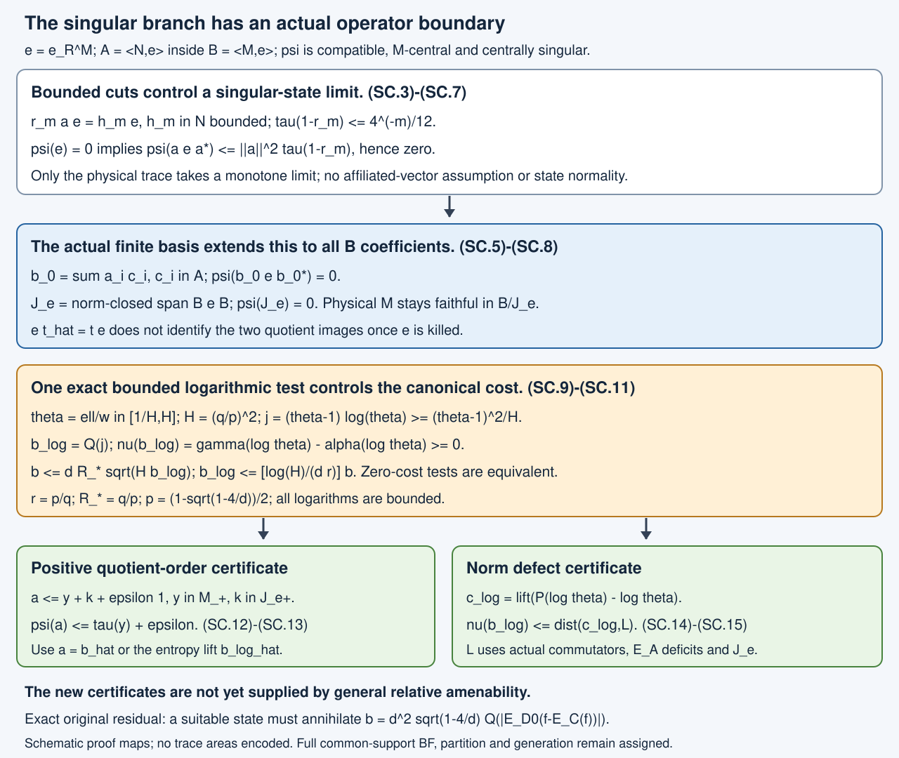

# Singular hypertraces, the Jones ideal and bounded entropy

A compatible hypertrace with purely singular represented-center restrictions annihilates the entire norm-closed Jones corner ideal. We prove this with bounded left cuts, then derive bounded entropy estimates and two actual operator certificates for controlling the canonical positive cost. The general amenability-to-zero-cost implication remains open.

## Actual state and providers

Use the actual \(N\subset M\), core \(S\subset R\), \(A=\langle N,e\rangle\subset B=\langle M,e\rangle\), \(e=e_R^M\), normal \(E_A:B\to A\), and common basis of 52.1 and 68.1. The integrated [normal-component proof](hypertraces-and-normal-central-components.md), JC.1–JC.14, supplies the centrally normal component and the exact singular balance. Its declared upstream prerequisites remain in force. The bounded polar construction used below is proved in the current finite-trace supporting reading, M10. No general affiliated-operator construction is an additional assumption.

At \(d=4\) the actual density and cost are already zero. For \(d>4\), use the actual \(f\in K\subset R\) and parameters
\[
\begin{gathered}
p=\frac{1-\sqrt{1-4/d}}2,\quad q=1-p,\quad
k_F=(q/p)f+(p/q)(1-f),\\
C=N'\cap M,\quad D_0=Z(S)\vee Z(R),\\
U=Z(S),\quad V=Z(R),\quad Q=E_U,\quad P=E_V,\\
w=E_{D_0}(k_F),\quad \ell=E_{D_0}(E_C(k_F)),\\
r=p/q,\quad R_*=q/p,\quad H=R_*/r=(q/p)^2>1,\\
r1\leq w,\ell\leq R_*1,\qquad Q(w)=P(w)=Q(\ell)=1,\\
b=dQ(|w-\ell|)
=d^2\sqrt{1-4/d}\,Q(|E_{D_0}(f-E_C(f))|).
\end{gathered}
\tag{SC.1}
\]
The exact T.1–T.10 computation and JC.1 prove these assertions. No primed larger marginal \(P(\ell)=1\) is added.

If any compatible hypertrace has a nonzero central normal component, the completed JC proof already supplies an annihilating state. In the remaining branch, normalize a nonzero purely singular component to a state \(\psi\). Thus
\[
\begin{gathered}
\psi E_A=\psi,\qquad \psi(xT)=\psi(Tx)\quad(x\in M),\\
\psi|_M=\tau,\qquad \nu(s)=\psi(\widehat s)\quad(s\in U),\\
\alpha(t)=\nu(Q(t)),\quad \gamma(t)=\alpha(P(t)),\\
\gamma(wt)=\alpha(\ell t)\quad(t\in D_0).
\end{gathered}
\tag{SC.2}
\]
Here hats denote actual represented-center lifts. The normal restriction to the physical factor is part of 49.1. Both represented-center restrictions of \(\psi\) are purely singular by JC.3. No \(L^1(U,\tau)\) density for \(\nu\) is asserted.

## Bounded left cuts of a tracial vector

**Lemma SC.1 — bounded localization of one vector.** Let \(T\) be a finite von Neumann algebra with faithful normal probability trace, and \(\xi\in L^2(T)\). There are increasing projections \(r_m\in T\), tending strongly to one, and bounded \(h_m\in T\), such that
\[
r_m\xi=h_m\Omega,\qquad
\tau(1-r_m)\leq4^{-m}/12\quad(m\geq1).
\tag{SC.3}
\]
Only a sequence approximating this one vector is used; \(L^2(T)\) need not be separable.

**Proof.** Choose \(n_j\in T\) with
\(\|n_j\Omega-\xi\|_2<2^{-2j-3}\), \(j\geq1\).
For \(d_j=n_{j+1}-n_j\), this gives
\(\|d_j\|_2<2^{-2j-2}\).
Let
\[
\begin{gathered}
q_j=1_{[0,2^{-j}]}(|d_j^*|),\qquad
r_m=\bigwedge_{j\geq m}q_j,\\
\|q_jd_j\|\leq2^{-j},\qquad
\tau(1-q_j)<2^{-2j-4}.
\end{gathered}
\tag{SC.4}
\]
The norm inequality follows from bounded polar decomposition \(d_j=|d_j^*|v_j\). Trace Chebyshev gives the last inequality since
\(\tau(|d_j^*|^2)=\|d_j\|_2^2\).

For completeness, the trace union bound for projections uses no commuting assumption. The bounded polar decomposition of \((1-a)c\), for projections \(a,c\), equates its left support \((a\vee c)-a\) and right support \(c-(a\wedge c)\). Hence
\(\tau(a\vee c)+\tau(a\wedge c)=\tau(a)+\tau(c)\), and
\(\tau(a\vee c)\leq\tau(a)+\tau(c)\).
Induction and normality give the countable union bound. Apply it to \(1-q_j\):
\[
\tau(1-r_m)\leq\sum_{j\geq m}2^{-2j-4}
=4^{-m}/12.
\]
The projections \(r_m\) increase; faithfulness of the trace forces their supremum to be one.

For \(j\geq m\), \(r_m\leq q_j\), so
\(\|r_md_j\|\leq2^{-j}\).
Thus \(r_mn_j\) is norm Cauchy and has a bounded limit \(h_m\in T\), with
\(\|h_m\|\leq\|n_m\|+2^{1-m}\).
The same sequence converges in \(L^2\) to \(r_m\xi\), proving (SC.3). \(\square\)

## The entire Jones corner ideal is invisible to the singular state

**Lemma SC.2 — the singular component kills the corner.** One has \(\psi(e)=0\).

**Proof.** For \(s\in U_+\), the actual full-corner relation is
\(e\widehat s=se\).
The functional \(s\mapsto\psi(e\widehat s)\) is positive, bounded by \(\nu\), and bounded by \(\tau\): \(e\) commutes with physical \(R\), so \(0\leq se\leq s\), and \(e\) also commutes with \(\widehat s\). This is exactly the normal minorant in JC.5. Pure singularity of \(\nu\) forces that minorant to be zero. Its mass is \(\psi(e)\). \(\square\)

**Theorem SC.3 — actual ideal annihilation.** Put
\[
J_e=\overline{\operatorname{span}(BeB)}^{\|\cdot\|}.
\tag{SC.5}
\]
Then \(\psi(J_e)=0\). This is the norm-closed ideal with arbitrary coefficients from the actual \(B\).

**Proof on \(A\).** The subspace \(L^2(N)\subset L^2(M)\) reduces both generators \(N,e\): \(E_R(N)=E_S(N)\subset N\), and the expectation projection \(e\) is selfadjoint. Therefore \(a\Omega\in L^2(N)\) for \(a\in A\). Apply SC.1 to \(\xi=a\Omega\), obtaining \(r_m\in N\), \(h_m\in N\).

Both \(a\) and \(e\) commute with right multiplication by \(R\). Indeed physical \(M\) commutes with every right multiplication, and \(L^2(R)\) reduces right multiplication by each \(t\in R\), so its projection \(e\) commutes with that action. Commutation persists in the generated algebra \(B\), hence in \(A\). On \(R\Omega\), dense in \(eL^2(M)\),
\[
r_mae(t\Omega)=r_m(a\Omega)t=h_mt\Omega.
\]
Both bounded operators vanish on \((1-e)L^2(M)\), so
\[
r_mae=h_me.
\tag{SC.6}
\]
This uses only bounded operators and the continuous right action on \(L^2\).

Put \(T_a=aea^*\geq0\). Since \(h_m\in N\subset M\),
\(\psi(r_mT_ar_m)=\psi(h_meh_m^*)=\psi(eh_m^*h_m)=0\).
The last equality is Cauchy–Schwarz and \(\psi(e)=0\). Cauchy–Schwarz for the positive form defined by \(T_a\) now kills both cross terms in its \(r_m,(1-r_m)\) expansion. Hence
\[
\begin{gathered}
\psi(T_a)=\psi((1-r_m)T_a(1-r_m))\\
\leq\|a\|^2\tau(1-r_m)
\leq\|a\|^2\,4^{-m}/12\longrightarrow0.
\end{gathered}
\tag{SC.7}
\]
The scalar limit uses normality of the physical trace, not normality of \(\psi\) on \(A\) or \(B\).

**The actual finite \(B/A\) expansion.** The first part of 58.1, also used in 68.2, gives
\(b_0=\sum_i a_iE_A(a_i^*b_0)\) for \(b_0\in B\). Its proof does not use factoriality of \(R\). Here is that argument at the needed general scope. The normal map
\(T(b_0)=\sum_i a_iE_A(a_i^*b_0)\)
fixes \(\sum_i a_iA\) by common-basis orthogonality and \(E_A|_M=E_N\). This module contains one and is stable under left multiplication by \(M\), using the \(M/N\) expansion, and by \(e\), using \(ea_i=a_ie\). It contains every generator word in \(M,e\). Normality and ultraweak density give \(T=\mathrm{id}_B\).

Write \(c_i=E_A(a_i^*b_0)\), \(T_i=c_ie c_i^*\). The result on \(A\) gives \(\psi(T_i)=0\). Centrality gives
\(\psi(a_iT_i a_i^*)=\psi(T_i a_i^*a_i)=0\);
Cauchy–Schwarz applies since
\(\psi(T_i^2)\leq\|T_i\|\psi(T_i)=0\).
If the basis has \(t\) entries, the finite operator inequality
\[
b_0eb_0^*\leq t\sum_i a_iT_i a_i^*
\tag{SC.8}
\]
proves \(\psi(b_0eb_0^*)=0\). Finally
\[
|\psi(b_0ec_0)|^2
\leq\psi(b_0eb_0^*)\psi(c_0^*ec_0)=0.
\]
Linear extension and norm continuity prove (SC.5)'s assertion. \(\square\)

The proof in fact needs only \(M\)-centrality, \(\psi|_M=\tau\), and \(\psi(e)=0\), once the actual algebra and common basis are fixed.

**Corollary SC.4 — the physical cup remains faithful in the quotient.** Let \(\pi_e:B\to B/J_e\) be the \(C^*\)-quotient. Its restriction to physical \(M\) is faithful and isometric. The state \(\psi\) factors through this quotient, and its restriction to \(\pi_e(M)\) is precisely \(\tau\). In particular, \(f\) and every physical finite-cup function retain their actual operator norms in the quotient.

**Proof.** If \(x\in M\cap J_e\), then
\(\tau(x^*x)=\psi(x^*x)=0\), so \(x=0\).
A faithful \(C^*\)-homomorphism is isometric. Since \(\psi(J_e)=0\), its quotient functional is a positive state, with the asserted restriction. The quotient image of \(C^*(M,e)\) is exactly \(\pi_e(M)\), since \(\pi_e(e)=0\) and \(\pi_e(M)\) is a closed \(C^*\)-subalgebra. \(\square\)

This is an actual operator consequence, not a numerical countermodel. It explains a precise limitation of the corner-density route: the corner relation \(e\widehat t=te\) supplies no equality between \(\pi_e(\widehat t)\) and \(\pi_e(t)\) after the corner is killed. Normality of the state on physical finite-cup operators therefore does not identify its values on their represented-center lifts. The quotient of the whole \(B\) is not identified with \(M\).

## Bounded entropy works for singular states

Define bounded joint elements and a positive smaller-center entropy cost by
\[
\begin{gathered}
\theta=\ell/w,\qquad H^{-1}1\leq\theta\leq H1,\\
j=(\theta-1)\log\theta\geq0,\qquad b_{\log}=Q(j)\in U_+,\\
b=dQ(w|\theta-1|).
\end{gathered}
\tag{SC.9}
\]
All logarithms are bounded continuous functional calculus on \([H^{-1},H]\).

**Theorem SC.5 — exact singular entropy balance and bounds.** One has
\[
\begin{gathered}
\gamma(t)=\alpha(\theta t),\qquad \alpha(\theta)=1,\\
\nu(b_{\log})=\alpha(j)
=\gamma(\log\theta)-\alpha(\log\theta)\geq0,\\
b\leq dR_*\sqrt{H b_{\log}},\\
b_{\log}\leq\frac{\log H}{dr}\,b,\\
\nu(b)\leq dR_*\sqrt{H\,\nu(b_{\log})}.
\end{gathered}
\tag{SC.10}
\]
Thus \(\nu(b)=0\) if and only if \(\nu(b_{\log})=0\), even for a purely singular state.

**Proof.** Replace the bounded test \(t\) in (SC.2) by \(t/w\), obtaining \(\gamma(t)=\alpha(\theta t)\). Evaluate at one. The entropy equality is now an exact bounded functional equality, with no trace density. Positivity follows pointwise since \((s-1)\log s\geq0\).

The scalar mean-value bound for \(\log\) on \([H^{-1},H]\) gives
\[
(s-1)\log s\geq (s-1)^2/H,\qquad
|(s-1)\log s|\leq(\log H)|s-1|.
\]
Apply these inequalities by functional calculus. Conditional Cauchy–Schwarz gives
\[
Q(|\theta-1|)\leq\sqrt{Q((\theta-1)^2)}
\leq\sqrt{H b_{\log}}.
\]
Since \(w\leq R_*1\), this proves the bound for \(b\). Since \(w\geq r1\), the second scalar estimate gives
\(b_{\log}\leq(\log H)Q(|\theta-1|)\leq(\log H)b/(dr)\).
Finally scalar Cauchy–Schwarz for the positive state \(\nu\) gives
\(\nu(\sqrt{H b_{\log}})\leq\sqrt{H\nu(b_{\log})}\).
This proves every inequality and both zero implications. \(\square\)

Jensen is valid here without normality: for example,
\(\alpha(-\log\theta)\geq-\log\alpha(\theta)=0\), and
\(\alpha(\theta\log\theta)\geq\alpha(\theta)\log\alpha(\theta)=0\).
These follow from the tangent inequalities for the two bounded convex functions and the positive state. They establish nonnegative entropy production; they do not establish its vanishing.

The exact bounded signed operator whose state value is that production is
\[
c_{\log}=\widehat{P(\log\theta)-\log\theta}\in D_{\mathrm{sa}},
\qquad
\psi(c_{\log})=\nu(b_{\log}).
\tag{SC.11}
\]
The full joint lift in \(D=Z(A)\vee Z(B)\) is legitimate by 68.2. Compatibility gives \(\psi(\widehat t)=\alpha(t)\), while the larger-center restriction gives \(\psi(\widehat{P(t)})=\gamma(t)\). This proves (SC.11); \(c_{\log}\) itself need not be positive.

## Concrete actual operator certificates

**Theorem SC.6 — quotient-order certificate.** For \(a\in B_+\), set
\[
\mathfrak C_e(a)=
\inf_{y\in M_+}
\left\{\tau(y)+\|(\pi_e(a-y))_+\|\right\}.
\tag{SC.12}
\]
Every state satisfying SC.2 and \(\psi(e)=0\) obeys
\(\psi(a)\leq\mathfrak C_e(a)\).
For the actual entropy cost,
\[
\psi(\widehat b)
\leq dR_*\sqrt{H\,\mathfrak C_e(\widehat{b_{\log}})}.
\tag{SC.13}
\]
Alternatively \(\psi(\widehat b)\leq\mathfrak C_e(\widehat b)\).

**Proof.** The quotient state and its physical trace restriction give
\(\psi(a)=\tau(y)+\overline\psi(\pi_e(a-y))\).
A state value of a selfadjoint element is bounded above by the norm of its positive part. Take the infimum to obtain (SC.12)'s assertion, then use (SC.10).

This certificate has a directly checkable positive-order form. If
\(\delta=\|(\pi_e(a-y))_+\|\), then
\[
k=(a-y-\delta1)_+\in(J_e)_+,\qquad
a\leq y+k+\delta1.
\]
Membership follows by applying the quotient's continuous functional calculus. Conversely any actual inequality
\(a\leq y+k+\varepsilon1\), \(y\in M_+\), \(k\in(J_e)_+\), implies
\(\psi(a)\leq\tau(y)+\varepsilon\).
Thus small physical trace plus small quotient-order remainder is a quantified actual certificate. \(\square\)

**Theorem SC.7 — bounded commutator/expectation certificate.** Let \(\mathcal L\subset B_{\mathrm{sa}}\) be the norm-closed real linear span of
\[
\begin{gathered}
uxu^*-x,\quad x-E_A(x)
\qquad(x\in B_{\mathrm{sa}},\ u\in\mathcal U(M)),\\
(J_e)_{\mathrm{sa}},\qquad
\{y\in M_{\mathrm{sa}}:\tau(y)=0\}.
\end{gathered}
\tag{SC.14}
\]
Then
\[
0\leq\nu(b_{\log})
\leq\operatorname{dist}(c_{\log},\mathcal L),\qquad
\psi(\widehat b)
\leq dR_*\sqrt{H\,\operatorname{dist}(c_{\log},\mathcal L)}.
\tag{SC.15}
\]
In particular, a norm approximation of this single actual bounded signed logarithmic defect by the displayed operators supplies zero cost.

**Proof.** Centrality, compatibility, Theorem SC.3, and \(\psi|_M=\tau\) make \(\psi\) vanish on every listed generator, hence on \(\mathcal L\). Its norm is one. Apply this to (SC.11), and then (SC.10). \(\square\)

For an unnormalized singular component of mass \(\beta\), every state bound above is multiplied by \(\beta\); the displayed square-root bounds are stated for its normalized state.

## Exact remaining step

This reading proves the actual corner-ideal annihilation step and gives bounded entropy production, an equivalent entropy annihilation test, and quantified operator certificates. The singular balance alone has not proved
\(\gamma(\log\theta)=\alpha(\log\theta)\).
General relative amenability has not supplied zero distance in (SC.15), a zero quotient-order certificate, or another argument establishing zero cost for a suitable actual state.

The certificates are sufficient routes. The original outcome only needs one compatible annihilating state; neither a universal zero-cost assertion nor either new certificate is imposed as a necessary intermediate requirement. A bounded logarithm is not a normal inherited-trace density. Strong density of the corner ideal cannot be paired with the singular state to substitute for the norm or positive-order controls just stated.

No finite-capacity, admitted cut, special-factor, normal-component or index-four proof is reopened. Full common-support BF, near-one support, unrestricted exact full finite partition, common-stage alignment and generation, every original finite-pair/bicommutant comparison, represented/opposite canonical trace, arbitrary-depth reconstruction, source clause, exercise, note and prerequisite remain assigned.

Human-source context remains Sorin Popa, *Classification of amenable subfactors of type II*, Acta Mathematica172(1994), [DOI10.1007/BF02392646](https://doi.org/10.1007/BF02392646), Definitions3.1.1–3.1.2, Proposition3.2.2 and Theorem4.2.2. The exact approved edition was compared for the preceding normal-component proof; the present arguments use the precise programme providers above. All new bounded-cut, ideal and entropy arguments are independently written.

## Solved learner checks

**Exercise SC.1.** For \(d=25/4\), compute \(p,q,r,R_*,H\) and the coefficient of the actual projection cost. Give a sufficient entropy tolerance for \(\nu(b)<1/100\).

**Solution.** Here \(p=1/5\), \(q=4/5\), \(r=1/4\), \(R_*=4\), \(H=16\). The projection coefficient is
\(d^2\sqrt{1-4/d}=(625/16)(3/5)=375/16\).
The state estimate is
\(\nu(b)\leq(25/4)\cdot4\sqrt{16\nu(b_{\log})}=100\sqrt{\nu(b_{\log})}\).
Thus \(\nu(b_{\log})<10^{-8}\) suffices. These are exact parameters for an actual index value; no numerical array is being asserted to realize a Jones core.

**Exercise SC.2.** In SC.3, why does the increasing cut limit not assume normality of \(\psi\)? If \(\|a\|\leq2\), give the explicit bound at \(m=3\), and explain why strong density of \(BeB\) cannot finish the cost argument.

**Solution.** The cross terms vanish because their positive quadratic factor \(\psi(r_mT_ar_m)\) is already zero. The remaining term is bounded by the physical projection's value \(\tau(1-r_m)\), whose convergence is normality of the inherited trace on \(N\). At \(m=3\), (SC.7) gives
\(\psi(T_a)\leq4\cdot4^{-3}/12=1/192\); letting \(m\to\infty\) proves \(\psi(T_a)=0\). A singular state can vanish on the norm-closed ideal while remaining one at the identity. Strong approximation therefore does not supply a state-value limit. The cost requires the explicit norm or positive-order certificate, or another valid actual argument.

Figure SC.1. The top panels show the actual bounded-cut mechanism and its finite-basis extension to the whole corner ideal. The middle panel records every entropy constant and the exact state equality. The bottom panels give two reviewable sufficient operator certificates and retain their unproved amenability input. [Editable figure source](figures/singular-hypertrace-ideal-and-entropy-v3.py); proof locators are SC.1–SC.15. Physical operators, represented lifts and quotient images are distinguished. Positions and widths are schematic and encode no trace or geometric measurement.

Independently written programme text and original SVG: public domain, CC0 1.0.
