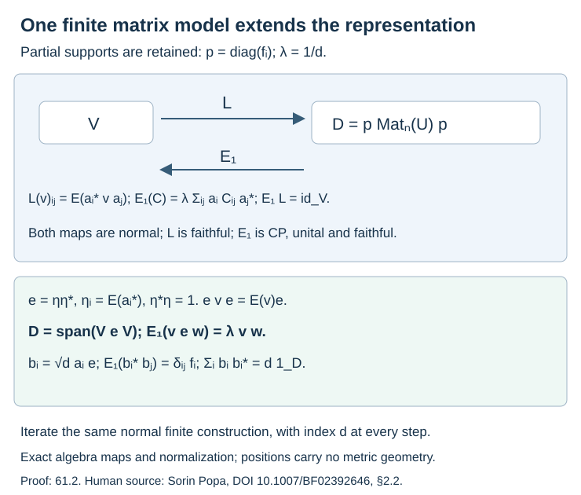
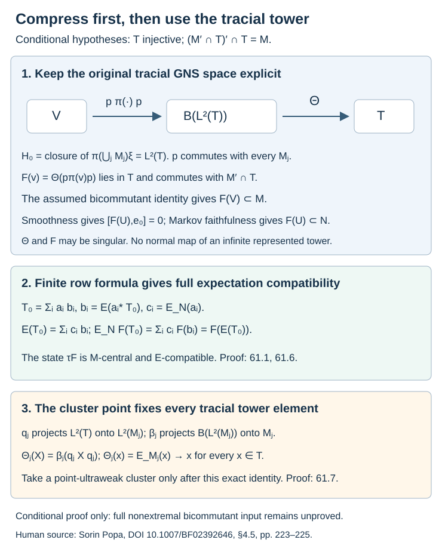
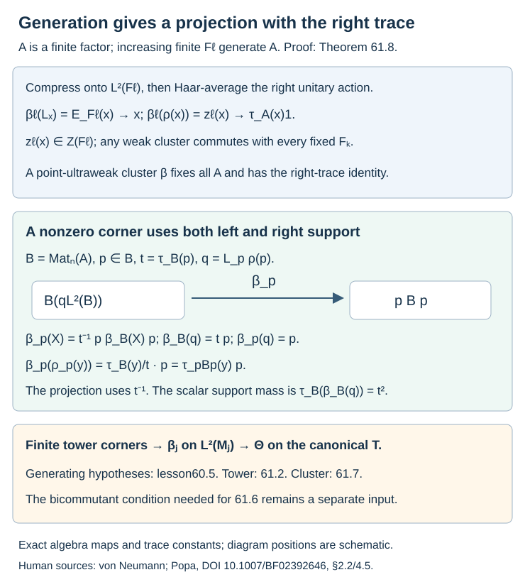

# Smooth representations and compression onto the tracial tower

A representation can enlarge both algebras in a subfactor inclusion. A finite common basis still controls its basic construction, even when the larger algebras are neither finite nor factors. We construct that expected tower explicitly. We then show how the canonical tracial tower can produce a compatible hypertrace on a smooth representation. The latter argument has two precise hypotheses: an injective projection onto the tracial tower and its bicommutant identity. Generation supplies the first hypothesis; the second remains a separate mathematical condition.

The finite partial basis is [Theorem 3.2](finite-bases-and-positive-index.md), and the ordinary trace and cup identities are [Theorems 4.1–4.2 and Proposition 4.3](towers-and-tunnels.md). The generating inclusion used below is [Theorem 60.5](preserved-prefix-and-generating-tunnels.md). Normal tracial expectations, standard left/right commutation, matrix positivity and the bimodularity of a unital positive projection onto a C*-subalgebra are the operator-algebra prerequisites already used in lessons 3, 49 and 60. For normal state extension we use the exact existing-course [Theorem 10.1 of *The double commutant theorem*](../../foundations-of-von-neumann-algebras/the-double-commutant-theorem.html#oa-fnd-bi-14): every positive normal functional on a concrete von Neumann algebra is a sum of square-summable vector functionals. Its complete proof applies to arbitrary Hilbert spaces.

The human source is Sorin Popa, [*Classification of amenable subfactors of type II*](https://doi.org/10.1007/BF02392646), Sections 2.1–2.3 and 4.5, printed pp. 191–197 and 223–225. We give the finite matrix construction and keep the GNS compression explicit. The injective projection constructed from finite-dimensional generation below also preserves the right trace, which permits an exact corner normalization.

Let \(N\subset M\) be II₁ factors of finite index \(d\), with \(\lambda=d^{-1}\). A **nondegenerate expected representation** is a square

\[
\begin{matrix}
U&\subset_E&V\\
\cup&&\cup\\
N&\subset&M
\end{matrix}
\qquad E|_M=E_N,
\tag{61.1}
\]

where \(E:V\to U\) is normal and faithful, and the ultraweak linear span of \(MU\) is \(V\). The algebras \(U,V\) can be arbitrary von Neumann algebras. We denote the original tower by \(M_{-1}=N,M_0=M,M_1,\ldots\); our cup \(e_j\in M_{j+1}\) implements \(M_{j-1}\subset M_j\). The represented tower is \(V_{-1}=U,V_0=V,V_1,\ldots\), containing the original tower and the same cups. Its construction is proved in Theorem 61.2.

The representation is **smooth** when

\[
N'\cap M_j\ \subset\ U'\cap V_j
\quad(j\geq0).
\tag{61.2}
\]

Commutants in this formula are taken in the indicated represented finite stages. Write

\[
\mathcal T=\left(\bigcup_{j\geq0}M_j\right)''
\tag{61.3}
\]

for the canonical completion in the compatible normalized tower trace. This is distinct from any completion of the represented tower.

## A finite row gives full compatibility

**Lemma 61.1.** Let \(a_1,\ldots,a_n\in M\) be a partial right \(N\)-basis with supports \(f_i\in N\), so that

\[
\begin{gathered}
E_N(a_i^*a_j)=\delta_{ij}f_i,\\
a_if_i=a_i,\\
x=\sum_i a_iE_N(a_i^*x),\\
\sum_i a_i a_i^*=d1.
\end{gathered}
\tag{61.4}
\]

Then the same row formula holds for every \(v\in V\). If \(F:V\to M\) is an \(M\)-bimodule conditional expectation with \(F(U)\subset N\), it satisfies

\[
E_NF=FE.
\tag{61.5}
\]

Neither \(F\) nor the state \(\tau F\) is required to be normal.

**Proof.** The bounded normal map \(Q(v)=\sum_i a_iE(a_i^*v)\) fixes \(xb\), \(x\in M,b\in U\), by the original basis identity and right \(U\)-bimodularity of \(E\). It therefore fixes their ultraweak span, which is all \(V\). Put \(b_i=E(a_i^*v)\) and \(c_i=E_N(a_i)\). The finite row gives

\[
\begin{aligned}
E(v)&=\sum_i c_i b_i,\\
E_NF(v)&=\sum_i c_iF(b_i)\\
&=F(E(v)).
\end{aligned}
\tag{61.6}
\]

Here \(F(b_i)\in N\), and only finite sums are used. Thus \(\tau F\) is \(M\)-central, restricts to \(\tau\), and satisfies \(\tau FE=\tau F\). \(\square\)

## Constructing the expected tower without a trace on the representation

**Theorem 61.2.** The square (61.1) extends to normal faithful expected tower squares with the original cups, a common partial basis and scalar index normalization \(d\) at every step.

**Proof.** Put \(p=\operatorname{diag}(f_i)\in\operatorname{Mat}_n(U)\) and

\[
\begin{gathered}
\mathcal D=p\operatorname{Mat}_n(U)p,\\
L(v)_{ij}=E(a_i^*va_j),\\
\eta_i=E(a_i^*),\quad e=\eta\eta^*.
\end{gathered}
\tag{61.7}
\]

The entries lie in \(f_iUf_j\), and \(\eta\in pU^n\). The row for \(1\), followed by \(E\), gives \(\eta^*\eta=1\). The row for \(wa_j\) gives \(L(vw)=L(v)L(w)\). Adjoint preservation gives \(L(v^*)=L(v)^*\), and (61.4) gives \(L(1)=p\). Thus \(L\) is a unital normal *-homomorphism. It is faithful because \(L(v)\eta\) is the coefficient column \(E(a_i^*v)\), which recovers \(v\).

For \(u\in U\), \(L(u)\eta=\eta u\). Also \(\eta^*L(v)\eta=E(v)\). Consequently \(e\) is a projection commuting with \(L(U)\), and

\[
eL(v)e=L(E(v))e.
\tag{61.8}
\]

The vector \(L(a_i)\eta\) has entry \(f_i\) in position \(i\) and zero elsewhere. Hence \(L(a_i)eL(u)L(a_j^*)\) is the matrix with entry \(f_iuf_j\) in position \((i,j)\). Such matrices span all of \(\mathcal D\). Therefore

\[
\mathcal D=\operatorname{span}(VeV).
\tag{61.9}
\]

We identify \(V\) with its image under \(L\). Define the dual map by

\[
E_1(C)=\lambda\sum_{i,j}a_iC_{ij}a_j^*.
\tag{61.10}
\]

This finite row formula is normal and completely positive, and \(E_1(p)=1\). The row identity gives \(\sum_i a_iL(v)_{ij}=va_j\), whence \(E_1(L(v))=v\). The same identity and its adjoint prove \(V\)-bimodularity.

To prove faithfulness, write \(C=Y^*Y\). Set \(z_k=\sum_jY_{kj}a_j^*\). Then \(E_1(C)=\lambda\sum_kz_k^*z_k\). If this is zero, every \(z_k=0\). Taking adjoints and extracting its \(i\)-th coefficient by \(E(a_i^*\,\cdot)\) gives \(Y_{ki}^*=0\); its left support is \(f_i\). Thus \(Y=C=0\). The row for \(1\) also gives

\[
E_1(vew)=\lambda vw.
\tag{61.11}
\]

The next common basis is \(b_i=\sqrt d\,a_i e\). Directly from (61.8) and (61.11),

\[
\begin{gathered}
E_1(b_i^*b_j)=\delta_{ij}f_i,\\
\sum_i b_i b_i^*=d1_{\mathcal D},\\
C=\sum_i b_iE_1(b_i^*C).
\end{gathered}
\tag{61.12}
\]

For the last equality, the right side at \(C=vew\) is \(\sum_i a_iE(a_i^*v)ew=vew\), and these words span \(\mathcal D\). The middle equality is the sum of the coordinate projections \(L(a_i)eL(a_i^*)\), multiplied by \(d\). This basis permits iteration of exactly the same construction. The original finite Jones tower is the identical model on the common basis with \(N\) in place of \(U\); its embeddings and restricted expectations are therefore the original ones. At each step the new row spans the represented stage over the preceding stage, proving nondegeneracy of each expected square.

The index bound is also explicit. For \(y=\sum_i a_i c_i\), \(c_i=E(a_i^*y)\), Parseval gives \(E(y^*y)=\sum_i c_i^*c_i\). The operator row \(a=(a_i)\) has norm squared \(d\), so

\[
y^*y\leq dE(y^*y).
\tag{61.13}
\]

For the dual bound take \(C=Y^*Y\), \(z_k\) as above and any supported column \(\xi\in pU^n\). Set \(v=\sum_i a_i\xi_i\). Schwarz for \(E\) gives

\[
\begin{gathered}
\xi^*L\!\left(\sum_kz_k^*z_k\right)\xi
\\
=\sum_kE((z_kv)^*z_kv)\\
\geq\sum_kE(z_kv)^*E(z_kv)\\
=\xi^*C\xi.
\end{gathered}
\tag{61.14}
\]

The last equality uses \(E(z_kv)=\sum_jY_{kj}\xi_j\). Matrix positivity proves \(E_1(C)\geq\lambda C\), with \(V\) viewed through \(L\). Since \(E_1(e)=\lambda1\), compression by the nonzero \(e\) shows that \(\lambda\) is optimal. For \(E\) the original downward cup \(g\in M\), with \(E(g)=\lambda1\), gives the same optimality. Thus the actual normalization stays \(d\) at every step. \(\square\)

**Figure 61.1.** The exact maps in Theorem 61.2 retain every partial support. Positions are schematic; the formulas give the maps, normalization and finite spanning relation.

**Corollary 61.3.** Smoothness propagates: for \(i\geq0\), \(i\leq j\),

\[
M_i'\cap M_j\ \subset\ V_i'\cap V_j.
\tag{61.15}
\]

**Proof.** Such an element commutes with \(U\) by initial smoothness, and with \(M\subset M_i\). Nondegeneracy gives commutation with \(V\). It also commutes with \(e_0,\ldots,e_{i-1}\in M_i\). These cups and \(V\) generate \(V_i\). Bounded multiplication is ultraweakly continuous, so it commutes with all of \(V_i\). \(\square\)

## A sufficient bicommutant test

**Lemma 61.4.** Let \(B\subset M'\cap\mathcal T\) be a von Neumann algebra. Set \(B_j=B\cap M_j'\) and \(C_j=B_j'\cap\mathcal T\). If

\[
E_{C_j}(e_j)=\lambda1\qquad(j\geq0),
\tag{61.16}
\]

then \(B'\cap\mathcal T=M\).

**Proof.** Put \(D=B'\cap\mathcal T\). Since \(B_j\subset B\), \(D\subset C_j\), so \(E_DE_{C_j}=E_D\). Also \(M_j\subset C_j\). Each \(x\in M_{j+1}\) is a finite sum \(\sum_l u_l e_jv_l\), \(u_l,v_l\in M_j\), by the finite basic construction. Therefore

\[
\begin{aligned}
E_D(x)&=E_DE_{C_j}(x)\\
&=E_D\!\left(\lambda\sum_lu_lv_l\right).
\end{aligned}
\tag{61.17}
\]

Hence \(E_D(M_{j+1})\subset E_D(M_j)\). Since \(M\subset D\), induction gives \(E_D(M_j)\subset M\). Normality and density give \(E_D(\mathcal T)\subset M\), so its range \(D\) equals \(M\). \(\square\)

Taking \(B=M'\cap\mathcal T\) gives the bicommutant identity when (61.16) has been proved. The source additionally states commuting-square conditions; the sufficient proof above needs only (61.16). We do not assert that those scalar expectations or commuting squares hold for an arbitrary \(B\).

## Normal state extension and compression before projection

**Lemma 61.5.** Every normal state on \(N\) extends to a normal state on \(U\), with no separability or sigma-finiteness assumption on \(U\).

**Proof.** Represent \(U\) faithfully and normally on \(H\). The exact existing-course Theorem 10.1 stated in the introduction writes the given state as \(\sum_n\langle x\xi_n,\xi_n\rangle\) on \(N\), with \(\sum_n\|\xi_n\|^2=1\). Use the same formula on \(U\). The positive vector functionals have summable norms and converge in the predual norm, so their sum is normal and positive, has value \(1\) at \(1\), and restricts to the given state. This does not assert that the extension is faithful on \(U\). \(\square\)

**Theorem 61.6.** Suppose there is a UCP projection

\[
\Theta:B(L^2(\mathcal T))\to\mathcal T
\tag{61.18}
\]

onto the standard left action, and suppose

\[
(M'\cap\mathcal T)'\cap\mathcal T=M.
\tag{61.19}
\]

Every smooth nondegenerate expected representation has a conditional expectation \(F:V\to M\) with \(F(U)\subset N\), \(E_NF=FE\), and the compatible \(M\)-hypertrace \(\tau F\).

**Proof.** Extend \(\tau_N\) to a normal state \(\psi\) on \(U\) by Lemma 61.5. Compose it with the normal tower expectations from \(V_j\) to \(U\). Their states \(\omega_j\) agree on overlaps and restrict to the original tower traces, because the expected squares restrict to the original ones. They define a state on the norm closure of \(\bigcup_jV_j\). Let \((\pi,H,\xi)\) be its GNS representation.

Each finite restriction \(\pi|_{V_j}\) is normal. For \(y\in V_l\), \(l\geq j\), its coefficient at \(\pi(y)\xi\) is \(x\mapsto\omega_l(y^*xy)\), a normal functional on \(V_j\). Polarization and approximation by these dense vectors show that all coefficients are normal. No normality of an entire represented infinite tower is being assumed.

The subspace \(H_0=\overline{\pi(\bigcup_jM_j)\xi}\) is the original tracial GNS space \(L^2(\mathcal T)\). Its projection \(p\) commutes with every original \(M_j\), since this subspace reduces their *-algebra. Compression

\[
\begin{gathered}
K(v)=p\pi(v)p|_{H_0},\\
F(v)=\Theta(K(v)).
\end{gathered}
\tag{61.20}
\]

is UCP, fixes \(M\), and is \(M\)-bimodular. Initially \(F(v)\in\mathcal T\). For \(c\in M'\cap M_j\), Corollary 61.3 gives \([c,v]=0\). Since \(p\) commutes with \(c\), so does \(K(v)\); the \(\mathcal T\)-bimodularity of \(\Theta\) gives \([c,F(v)]=0\).

The tracial expectations \(E_{M_j}\) preserve commutation with \(M\). For \(c\in M'\cap\mathcal T\), \(E_{M_j}(c)\to c\) in \(L^2\), with uniform norm bound. Thus the union of the finite \(M'\cap M_j\) is ultraweakly dense in \(M'\cap\mathcal T\). The bounded element \(F(v)\) commutes with this whole algebra. Hypothesis (61.19) puts it in \(M\).

For \(b\in U\), smoothness gives \([b,e_0]=0\), since \(e_0\in N'\cap M_1\). The same compression argument gives \([F(b),e_0]=0\). If \(x\in M\) commutes with \(e_0\), then \(xe_0=e_0xe_0=E_N(x)e_0\). For \(y=x-E_N(x)\),

\[
\|ye_0\|_2^2=\lambda\|y\|_2^2.
\tag{61.21}
\]

This follows from the canonical Markov trace. Thus \(ye_0=0\) implies \(y=0\), proving \(M\cap\{e_0\}'=N\) and \(F(U)\subset N\). The left algebra element \(e_0\) on \(L^2(\mathcal T)\) has not been identified with the expectation operator on \(L^2(M)\).

The UCP map \(F\) fixes \(M\) and has range in \(M\), so it is a conditional expectation. Lemma 61.1 gives its full expectation compatibility and the hypertrace. \(\square\)

**Figure 61.2.** The two hypotheses of Theorem 61.6 are drawn explicitly. The projection \(p\) commutes with the original tower. It need not commute with the represented tower. The maps \(\Theta,F\) can be nonnormal.

## Generation supplies the injective projection

**Lemma 61.7.** If each \(M_j\) has a UCP projection \(\beta_j:B(L^2(M_j))\to M_j\), then \(\mathcal T\) has the projection (61.18).

**Proof.** Let \(q_j\) project \(L^2(\mathcal T)\) onto \(L^2(M_j)\), and define \(\Theta_j(X)=\beta_j(q_jXq_j|_{L^2(M_j)})\), with output in \(\mathcal T\). For every \(x\in\mathcal T\) and \(b\in M_j\),

\[
q_jxq_j\widehat b=\widehat{E_{M_j}(x)b}.
\tag{61.22}
\]

Consequently \(\Theta_j(x)=E_{M_j}(x)\to x\) ultraweakly for every \(x\in\mathcal T\). The UCP maps have a point-ultraweak cluster by compactness of the output unit balls; positivity at every matrix size and linearity pass to this cluster. Its range lies in the closed algebra \(\mathcal T\), and the equality just proved shows that it fixes all of \(\mathcal T\). It is the desired projection. Fixing only the algebraic union would be insufficient for a possibly singular cluster; (61.22) covers every \(x\) before taking the limit. \(\square\)

**Theorem 61.8.** In the separable generating case of Theorem 60.5, (61.18) holds. The construction of each finite-stage projection can preserve the right trace as well.

**Proof.** Let a finite factor \(A\) be generated by increasing unital finite-dimensional \(F_l\). On \(L^2(F_l)\), Haar-average conjugation by the right unitary group \(U(F_l)\). This UCP projection \(P_l\) has range the commutant of right \(F_l\), namely left \(F_l\). This statement includes direct sums of matrix blocks. If \(q_l:L^2(A)\to L^2(F_l)\) is the orthogonal projection, put

\[
\beta_l(X)=P_l(q_lXq_l|_{L^2(F_l)}).
\tag{61.23}
\]

For left \(x\in A\), compression is left \(E_{F_l}(x)\), so \(\beta_l(x)=E_{F_l}(x)\to x\). For right multiplication \(\rho_A(x)\), compression is right \(E_{F_l}(x)\). Averaging its unitary conjugates gives

\[
\begin{gathered}
\beta_l(\rho_A(x))=z_l(x),\\
z_l(x)=E_{Z(F_l)}E_{F_l}(x).
\end{gathered}
\tag{61.24}
\]

Here the central expectation is inside \(F_l\). The elements \(z_l(x)\) have norm at most \(\|x\|\), trace \(\tau_A(x)\), and commute with every fixed \(F_k\) once \(l\geq k\). Any ultraweak cluster is therefore central in the generating factor \(A\), and has trace \(\tau_A(x)\). Thus the entire net tends ultraweakly to \(\tau_A(x)1\). A point-ultraweak cluster of \(\beta_l\) gives a UCP projection \(\beta_A\) satisfying, for every \(x\in A\),

\[
\begin{gathered}
\beta_A(x)=x,\\
\beta_A(\rho_A(x))=\tau_A(x)1.
\end{gathered}
\tag{61.25}
\]

This extra right-trace identity is proved for this projection; it is not assumed for an arbitrary injective projection.

For \(B=\operatorname{Mat}_n(A)\), order its standard space as \(\mathbb C^n\otimes L^2(A)\otimes\mathbb C^n\), with the last index the right matrix leg. Apply normalized trace on that last leg and \(\beta_A\) to each operator entry on \(L^2(A)\). The resulting UCP projection \(\beta_B\) fixes left \(B\), and (61.25) gives \(\beta_B(\rho_B(b))=\tau_B(b)1\). All matrix sums are finite.

Now take a nonzero \(p\in B\), let \(t=\tau_B(p)>0\), and \(q=L_p\rho_B(p)\). The space \(qL^2(B)\) is the standard corner space: the normalized-trace unitary sends \(\widehat a\in L^2(pBp)\) to \(t^{-1/2}\widehat a\in qL^2(B)\). Extend an operator on this space by zero, and set

\[
\beta_p(X)=t^{-1}p\beta_B(X)p.
\tag{61.26}
\]

Bimodularity and the right-trace identity give \(\beta_B(q)=tp\), so \(\beta_p(q)=p\). The map is UCP and unital with corner identity \(p\). For \(a\in pBp\), its left corner action is \(aq\), and \(\beta_p(aq)=a\). Its range is the corner, so it is a conditional expectation. The right corner action of \(y\in pBp\) is \(q\rho_B(y)q=p\rho_B(y)\), and

\[
\begin{aligned}
\beta_p(q\rho_B(y)q)
&=\frac{\tau_B(y)}t\,p\\
&=\tau_{pBp}(y)p.
\end{aligned}
\tag{61.27}
\]

Thus the right-trace identity survives every nonzero corner. The operator normalizer is \(t^{-1}\); the scalar support mass \(\tau_B(\beta_B(q))=t^2\) is a different quantity.

Both \(N,M\) in Theorem 60.5 have increasing finite-dimensional generating algebras. They therefore have these projections. Theorem 61.2 realizes \(M_1\) as a finite matrix corner over \(N\), \(M_2\) as one over \(M\), and each further stage as one over the stage two steps earlier. Finite matrix amplification and corner compression supply all \(\beta_j\). The identifications preserve the unique normalized factor traces and hence their standard spaces. Lemma 61.7 gives (61.18). \(\square\)

**Figure 61.3.** The left and right support define the standard corner space. The displayed maps and constants are exact; positions are schematic. Generation gives tower injectivity here, while the bicommutant condition needed for Theorem 61.6 is separate.

The source's nonextremal argument in Section 4.5 first passes to a two-step inclusion, replaces downward cups by canonical projections that can implement non-trace-preserving expectations, and invokes a trace-preserving comparison carrying them to shifted upward cups. That comparison is not the unmodified specified reflection refuted in [lesson 47](trace-compatible-reflection.md). We have not supplied its full construction here. Thus this lesson proves the representation construction, the conditional hypertrace implication, and the generating-case injectivity input; it does not claim the full bicommutant or Section 4.5 equivalence.

## Worked example: a matrix tower with a spectator factor

Let \(P\) be a II₁ factor, \(N=P\subset M=\operatorname{Mat}_2(P)\) diagonally, \(U=\operatorname{Mat}_s(P)\), and \(V=\operatorname{Mat}_2(U)\). The expectation takes normalized trace on the first matrix leg; the square is nondegenerate and \([M:N]=4\). A common basis is \(a_{ab}=\sqrt2\,e_{ab}\otimes1\), \(a,b=1,2\). The next stage is

\[
\begin{gathered}
\mathcal D=\operatorname{Mat}_2\otimes
\operatorname{Mat}_2\otimes U,\\
\lambda=\tfrac14.
\end{gathered}
\tag{61.28}
\]

Its cup is the rank-one Bell projection in the two scalar matrix legs, tensored with \(1_U\). The dual expectation is normalized partial trace on the second leg, and sends this cup to \(\tfrac141\). The next basis is \(2a_{ab}e\). These are explicit II₁ models when the spectator is finite; the general theorem allows arbitrary \(U,V\).

## Exercises with complete solutions

### Exercise 61.1 — range is enough for full compatibility

Suppose \(F\) has the range condition of Lemma 61.1. Compute both sides of (61.5) at \(v\) without claiming \(F\) is normal.

**Solution.** Write \(v=\sum_i a_ib_i\), \(b_i=E(a_i^*v)\in U\), and \(c_i=E_N(a_i)\). Bimodularity gives \(F(v)=\sum_i a_iF(b_i)\), where \(F(b_i)\in N\). Thus \(E_NF(v)=\sum_i c_iF(b_i)\). Also \(E(v)=\sum_i c_ib_i\), so \(FE(v)=\sum_i c_iF(b_i)\). The row is finite. Its validity on all \(V\) came from the normal map \(Q\), not from a continuity assertion about \(F\).

### Exercise 61.2 — locate the dual basis and its normalization

In the worked example, verify \(E_1(e)=\tfrac141\), \(E_1(b_{ab}^*b_{cd})=\delta_{ac}\delta_{bd}1\), and \(\sum_{a,b}b_{ab}b_{ab}^*=4\,1\).

**Solution.** The Bell projection is \(e=\tfrac12\sum_{i,j=1}^2e_{ij}\otimes e_{ij}\otimes1\). Partial trace on its second leg gives \(\tfrac14\sum_i e_{ii}\otimes1=\tfrac141\). The original Gram identity is \(E(a_{ab}^*a_{cd})=\delta_{ac}\delta_{bd}1\). Since \(b_{ab}=2a_{ab}e\), \(b_{ab}^*b_{cd}=4E(a_{ab}^*a_{cd})e\); applying \(E_1\) gives the stated Gram matrix. The operators \(a_{ab}ea_{ab}^*\) are the four coordinate projections in the basis matrix model, and sum to \(1\). Multiplication by \(4\) proves the last identity.

### Exercise 61.3 — the cup is an algebra element

For \(x\in M\), put \(y=x-E_N(x)\). Prove (61.21), and compute \(\|[x,e_0]\|_2^2\).

**Solution.** Since \(e_0y e_0=E_N(y)e_0=0\), the Markov formula gives \(\|ye_0\|_2^2=\tau(e_0y^*ye_0)=\lambda\tau(y^*y)\). Taking adjoints gives \(\|e_0y\|_2^2=\lambda\|y\|_2^2\). The cross inner product of \(ye_0\) and \(e_0y\) is zero, using \(e_0y^*e_0=0\). Hence \(\|[x,e_0]\|_2^2=2\lambda\|x-E_N(x)\|_2^2\). In particular commutation forces \(x\in N\). This calculation takes place in the tracial tower and does not identify left \(e_0\) with an expectation operator on \(L^2(M)\).

### Exercise 61.4 — averaging a nonfactor finite algebra

Inside \(\operatorname{Mat}_5\), take \(F=\operatorname{Mat}_2\oplus\operatorname{Mat}_3\). For the diagonal matrix unit \(x=e_{11}\) in the first block, compute \(z=E_{Z(F)}E_F(x)\) and its normalized ambient trace.

**Solution.** The first block's normalized trace of \(x\) is \(1/2\), so \(z=\tfrac12(1_2\oplus0_3)\). Its normalized ambient trace is \(\tfrac12\cdot\tfrac25=\tfrac15=\tau_5(x)\). It is central in \(F\), not scalar in the full matrix factor. Theorem 61.8 uses increasing generation to make any limiting \(z_l(x)\) central in all of \(A\); only then does factoriality make it scalar.

### Exercise 61.5 — distinguish the two corner constants

On standard \(L^2(\operatorname{Mat}_3)\), let \(p=\operatorname{diag}(1,1,0)\), \(t=2/3\), and \(q=L_p\rho(p)\). The standard projection onto left matrices is normalized partial trace on the right leg. Compute \(\beta(q)\), \(\beta_p(q)\), the scalar support mass, and \(\beta_p(\rho_p(e_{11}))\).

**Solution.** Partial trace gives \(\beta(q)=\tfrac23p\). Thus \(\beta_p(q)=\tfrac32\,p\beta(q)p=p\). The scalar support mass is \(\tau_3(\beta(q))=\tfrac23\tau_3(p)=4/9\). The corner right trace is \(\tau_3(e_{11})/t=(1/3)/(2/3)=1/2\), so \(\beta_p(\rho_p(e_{11}))=\tfrac12p\). Dividing the operator map by the scalar mass \(4/9\) would give \(\tfrac32p\) at its identity \(q\), so that normalization would fail unitality.

### Exercise 61.6 — identify what is needed to obtain a hypertrace

Suppose Theorem 60.5 applies and a smooth representation is given. Which additional identity makes Theorem 61.6 apply? Explain why an injective projection alone does not finish its proof, and what Lemma 61.4 would suffice to check.

**Solution.** Theorem 61.8 supplies (61.18), and Lemma 61.5 supplies the normal starting state. The additional condition is (61.19). Compression and projection yield \(F(v)\in\mathcal T\) commuting with \(M'\cap\mathcal T\); only (61.19) puts this value in \(M\). To prove that condition by Lemma 61.4, take \(B=M'\cap\mathcal T\) and verify every scalar expectation \(E_{(B\cap M_j')'\cap\mathcal T}(e_j)=\lambda1\). The lemma then collapses successive expected tower stages to \(M\). Neither these scalar identities nor the nonextremal modified-cup trace comparison follows merely from the existence of the injective projection.
