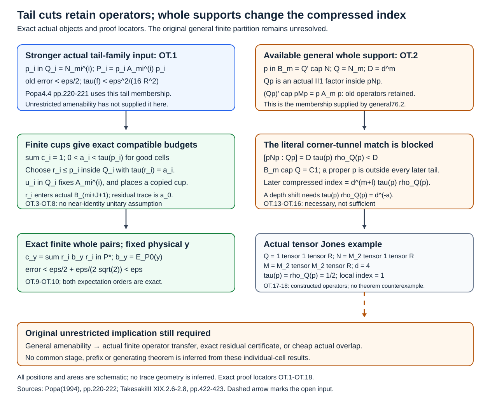

# Tail supports, fixed operators and compressed tunnel depth

We continue the original unrestricted finite-partition problem, using the proved [finite budget and operator-transfer criteria](finite-budgets-and-whole-tunnel-transfer.md), UFP.2–UFP.5, and [finite residual-cell criteria](finite-residual-cells-and-canonical-overlap.md), FP.1–FP.5. Two new bounded results are proved here: an exact finite whole-cell conversion **from an actual tail-supported near-cover**, retaining the fixed physical target candidates, and the precise algebraic/index obstruction to applying that conversion to the whole-stage supports supplied by76.2. The unrestricted amenability implication is not proved.

## The original endpoint and the source mechanism

The original statement is Popa4.4.1(1), printed p.222: for an amenable proper finite-index inclusion \(N\subsetneq M\) of II₁ factors and every finite \(Y\subset M\), \(\varepsilon>0\), find unital finite-dimensional \(Q\subset P\subset M\), \(Q\subset N\), with

\[
 E_PE_N=E_NE_P=E_Q,\qquad
 \|y-E_P(y)\|_2<\varepsilon\quad(y\in Y),
 \tag{OT.0}
\]

and a **finite** orthogonal partition \(\sum_i r_i=1\), each cell having its own actual finite whole-inclusion tunnel and

\[
\begin{gathered}
 r_i\in (N_{k_i}^{(i)})'\cap N,\\
 P=\bigoplus_i r_i((N_{k_i}^{(i)})'\cap M)r_i,\\
 Q=\bigoplus_i r_i((N_{k_i}^{(i)})'\cap N)r_i.
\end{gathered}
\tag{OT.1}
\]

No finite depth, separability, extremality, ergodic core or unique norm trace is inserted. A common stage, preservation of an arbitrary ordinary prefix and generation remain separate endpoints.

Popa’s source argument on printed pages 220–222 uses two support memberships that must be distinguished. In4.4 the finite selected supports satisfy \(p_i\in N_{m_i}^{(i)}\), a tail **factor** membership. Compressed tunnels can consequently be matched by corner-tunnel uniqueness. Whole-stage76.2 supports instead satisfy \(p_i\in (N_{m_i}^{(i)})'\cap N\). These two memberships have different corner indices, as proved below.

Takesaki, Chapter XIX.2.6–2.8 gives the local-index formula with two distinct traces. The [module dimension and local-index reading](module-dimension-and-local-index.md), Theorem 2.4, supplies the complete independently written proof used here. The finite-depth classification in Chapter XIX.§4 supplies no unrestricted amenability-to-operator transfer in this argument.

## Exact conversion when the available supports really are in tail factors

Write \(A_m^{(i)}=(N_m^{(i)})'\cap M\), \(B_m^{(i)}=(N_m^{(i)})'\cap N\). All norms use the inherited normalized trace \(\tau\).

**Theorem OT.1 — finite tail-supported conversion with fixed operators.** Let \(Y\subset M\) be finite, \(R=\max(\{1\}\cup\{\|y\|:y\in Y\})\), and \(\varepsilon>0\). Suppose \(q\ge1\) and a finite orthogonal family of nonzero projections \(p_1,\ldots,p_q\) has individual actual whole tunnels with

\[
\begin{gathered}
 p_i\in Q_i:=N_{m_i}^{(i)},\qquad f=1-\sum_i p_i,\\
 P_0=\bigoplus_i p_iA_{m_i}^{(i)}p_i\ \oplus\ fA_0,
 \qquad A_0=N'\cap M,\\
 \|y-E_{P_0}(y)\|_2<\varepsilon/2,\\
 \tau(f)<\varepsilon^2/(16R^2).
\end{gathered}
\tag{OT.2}
\]

Then(OT.0)–(OT.1) hold with finitely many actual whole cells. In the construction, each good support is cut to \(r_i\le p_i\), its old finite algebra is retained after compression, and the residual is one new whole cell. The physical \(y\) are never conjugated. No near-identity placement unitary is assumed. This theorem assumes the actual tail-supported input(OT.2); it does **not** assert that unrestricted amenability supplies it.

**Proof.** Choose

\[
 0<\eta<\min\left\{\min_i\tau(p_i)/4,
                         \varepsilon^2/(32qR^2)\right\}.
 \tag{OT.3}
\]

In one faithful Markov cup factor, prescribe the probability vector

\[
 \lambda_i=\tau(p_i)-\eta\ (1\le i\le q),
 \qquad \lambda_0=\tau(f)+q\eta.
 \tag{OT.4}
\]

Apply the **proved finite partition approximation argument** of UFP.2 to the increasing finite cup algebras themselves. Its proof needs only a unital diffuse tracial closure and converging finite expectations, so it applies to this actual cup factor. It gives one finite cup stage, projections \(c_0,\ldots,c_q\) summing to one, and traces \(a_i=\tau(c_i)\), with

\[
 \sum_{i=0}^q|a_i-\lambda_i|<\eta.
 \tag{OT.5}
\]

The finite check is precisely \(C_{q+1}^2\delta_J^2<\eta\), with the unchanged explicit constant of UFP.3. Thus, for every good cell,

\[
 0<\tau(p_i)-2\eta<a_i<\tau(p_i),\qquad
 \tau(f'):=1-\sum_{i=1}^q a_i<\varepsilon^2/(8R^2).
 \tag{OT.6}
\]

The last bound follows from \(\tau(f')=\tau(f)+\sum_i(\tau(p_i)-a_i)\), (OT.2), and \(\sum_i(\tau(p_i)-a_i)<2q\eta<\varepsilon^2/(16R^2)\). The scalar residual trace is exactly \(a_0\), the trace of the finite cup projection \(c_0\).

Every \(Q_i\) is a II₁ factor. Prescribe \(r_i\le p_i\) **inside \(Q_i\)** with trace \(a_i\). These cuts remain physically orthogonal. Continue each actual tunnel, and copy the same finite cup projection \(c_i\) into its future cup tail. In the exact convention51.1, \(L_{m_i+1}=Q_i\) and \(g_j\in L_j\). A polynomial in the first \(J\) tail cups

\[
 g_{m_i+1},\ldots,g_{m_i+J}
 \tag{OT.7}
\]

lies in \(Q_i\) and commutes with \(N_{m_i+J+1}^{(i)}=L_{m_i+J+2}\), by51.2. The generator-by-generator faithful Markov identification50.5/51.2 gives an actual projection \(c_i^{(i)}\) there with the exact trace \(a_i\). This is a copy of a specified finite operator, not a scalar-array realization assumption.

Choose \(u_i\in\mathcal U(Q_i)\) with \(u_ic_i^{(i)}u_i^*=r_i\), and rotate only that continuation. Because \(u_i\in Q_i\), it fixes every element of \(A_{m_i}^{(i)}\) and \(B_{m_i}^{(i)}\). The new full supported late pair therefore contains

\[
 r_iA_{m_i}^{(i)}r_i,
 \qquad r_iB_{m_i}^{(i)}r_i,
 \tag{OT.8}
\]

and its unit \(r_i\) belongs exactly to the new finite smaller relative commutant. The support is not asserted to remain in the **late** tail factor. Earlier ordinary levels through \(m_i\) are retained separately on this good cell.

Put \(f'=1-\sum_i r_i\). Its trace \(a_0\) is the finite whole-stage trace certificate given by \(c_0\); the canonical copy using \(g_1,\ldots,g_J\) lies in \(B_{J+1}\). Apply78.2 in \(N\) to place \(f'\) in a separate actual whole finite smaller commutant. Take \(P_*,Q_*\) to be the direct sum of the full supported late pairs on all \(r_i\), and that full pair on \(f'\). They have unit one and satisfy both expectation orders, by53.1 and trace pairing. Every summand contains its supported \(A_0\), so \(A_0\subset P_*\).

For fixed \(y\), let \(b_y=E_{P_0}(y)\). It has norm at most \(R\). Each \(r_i\in Q_i\), \(r_i\le p_i\), commutes with \(p_iA_{m_i}^{(i)}p_i\); cross-cell products vanish. Thus every \(r_i\) commutes with \(b_y\). The candidate

\[
 c_y=\sum_{i=1}^q r_i b_y r_i\in P_*
 \tag{OT.9}
\]

retains those actual operators exactly. Its missing part is \(b_y-c_y=f'b_yf'\), whence

\[
\begin{aligned}
 \|y-E_{P_*}(y)\|_2
 &\le\|y-c_y\|_2\\
 &<\varepsilon/2+R\sqrt{\tau(f')}\\
 &<\varepsilon/2+\varepsilon/(2\sqrt2)
 <\varepsilon.
\end{aligned}
\tag{OT.10}
\]

This proves the strict target bound and the exact full finite structure. Only the **controlled discarded physical mass** remains in the error. No old matrix unit is retained on that discarded mass, and no target is moved by the placement unitaries. \(\square\)

This completes the finite whole-membership recovery from the actual tail-family part of Popa4.4. It supplies a concrete operator transfer without needing a general small-\(K\) theorem **at that stronger input**. It is not a replacement for the original unrestricted hypothesis. Programme59.7 provides such tail families with a factorial larger core. Programme76.2 does not provide them in the unrestricted case.

## What changes when the support belongs to a whole relative commutant

**Theorem OT.2 — the actual compressed factor and its depth obstruction.** Fix any actual ordinary tunnel, let \(m\ge1\), \(Q=N_m\), and \(D=[N:Q]=d^m\). Let \(0<p<1\) be a projection in \(B_m=Q'\cap N\). On \(H=L^2(N)\), set \(\mathcal C_Q=\{L_x:x\in Q\}^\prime\subset B(H)\), the commutant of the actual left-\(Q\) action. The intrinsic dimension trace \(T_Q:\mathcal C_Q\to\mathbb C\) is a faithful finite normal trace with \(T_Q(1)=D\); its normalized trace is \(\rho_Q=T_Q/D:\mathcal C_Q\to\mathbb C\). A physical projection \(p\in Q^\prime\cap N\) denotes its left action \(L_p\in\mathcal C_Q\) when evaluated by either of these traces. Then the map

\[
 Q\longrightarrow Qp\subset pNp,\qquad x\longmapsto xp
 \tag{OT.11}
\]

is a faithful normal unital *-isomorphism onto a II₁ factor (with unit \(p\)). It retains the exact old supported finite pair:

\[
\begin{gathered}
 (Qp)'\cap pMp=p(Q'\cap M)p=pA_mp,\\
 (Qp)'\cap pNp=p(Q'\cap N)p=pB_mp.
\end{gathered}
\tag{OT.12}
\]

But its actual index in the physical smaller corner is

\[
 [pNp:Qp]=d^m\tau(p)\rho_Q(p)<d^m.
 \tag{OT.13}
\]

For every actual continuation \(N_{m+l}\subset Q\),

\[
\begin{gathered}
 \rho_{N_{m+l}}(p)=\rho_Q(p),\\
 [pNp:N_{m+l}p]=d^{m+l}\tau(p)\rho_Q(p).
\end{gathered}
\tag{OT.14}
\]

Consequently none of these compressed factors is a terminal factor of an actual corner tunnel of the **same** length \(m+l\). If one wants to reinterpret it as a terminal factor at some other finite length \(k\ge0\), a necessary numerical condition is

\[
 \tau(p)\rho_Q(p)=d^{-a},
 \qquad a=m+l-k\in\mathbb Z_{>0}.
 \tag{OT.15}
\]

This condition is not asserted sufficient; the actual Jones projections, expectations and generation relations would also have to be constructed. No extremality or equality of the two traces is assumed.

**Proof.** Since \(p\) commutes with \(Q\), (OT.11) is a normal *-homomorphism. Its kernel is a weakly closed ideal of the factor \(Q\), and it is nonzero on the unit; it is therefore faithful. The functional \(x\mapsto\tau(px)\) is normal tracial on \(Q\), so equals \(\tau(p)\tau|_Q\). Hence the inherited normalized corner trace agrees with the original factor trace under(OT.11). For \(z=pzp\), commuting with all \(xp\) is exactly commuting with all \(x\in Q\), proving both identities(OT.12).

The complete local-index formula2.4, applied to \(Q\subset N\) and its relative-commutant projection \(p\), gives(OT.13). Faithfulness of \(\tau\) and \(\rho_Q\) gives \(0<\tau(p),\rho_Q(p)<1\). The index is at least one; the strict upper bound is consequently a genuine finite index obstruction, not a hypothetical scalar assignment.

The \(Q\)-module \(pH\) is invariant. Restriction of scalars2.1 for \(N_{m+l}\subset Q\) gives

\[
 T_{N_{m+l}}(p)
 =d^l T_Q(p).
\]

The same identity at1 gives total mass \(d^{m+l}\), hence normalized traces agree on \(p\). Apply2.4 again to obtain(OT.14). Every length-\(k\) tunnel of the original physical corner inclusion \(pNp\subset pMp\) has terminal smaller index \(d^k\): that inclusion has index \(d\), by algebra compression, and each actual predecessor step has index \(d\). Equality with(OT.14) forces(OT.15). \(\square\)

There is an even simpler exact membership obstruction. Since \(Q\) is a factor,

\[
 B_m\cap Q=Z(Q)=\mathbb C1.
 \tag{OT.16}
\]

Thus this proper \(p\in B_m\) cannot belong to \(Q\), or to any later tail factor \(N_{m+l}\subset Q\), while that finite prefix is preserved. It cannot be turned into the support class required by OT.1 through a future-only rotation. This does not invalidate76.2’s retained-corner lift: that proof first retains its available physical residual in a tail factor, and constructs a whole-stage projection afterwards. The obstruction concerns reclassifying its final whole-stage support as a tail support while retaining that old prefix.

For comparison, if \(0<p\in Q\) is an actual **tail** support, then \(pQp\subset pNp\) has index \(d^m\). To check the normalization, right compression of \(H=L^2(N)\) by \(p\) has left-\(N\) dimension \(t=\tau(p)\). Its left-\(Q\) dimension is \(Dt\) by2.1. Algebra compression by the same \(p\in Q\) divides by \(t\), giving dimension \(D\) on \(L^2(pNp)\). This is precisely why the tail-supported corner-tunnel matching in the.4 argument is valid. Replacing \(pQp\) by the different factor \(Qp\) in(OT.11) changes the depth calculation.

## An actual Jones example of the depth shift

Take any II₁ factor \(\mathcal R\), let \(n\ge2\), and set

\[
\begin{gathered}
 M=M_n\bar\otimes M_n\bar\otimes\mathcal R,\\
 N=M_n\bar\otimes1\bar\otimes\mathcal R,\\
 Q=1\bar\otimes1\bar\otimes\mathcal R,\\
 e=\frac1n\sum_{a,b=1}^n E_{ab}\otimes E_{ab}\otimes1.
\end{gathered}
\tag{OT.17}
\]

This is an **actual** basic-construction triple \(Q\subset N\subset M\). The projection \(e\) is the maximally entangled rank-one projection on the two matrix factors. Direct multiplication gives \(exe=E_Q^N(x)e\) for \(x\in N\), \(E_N^M(e)=n^{-2}1\), and

\[
 n(E_{ua}\otimes1)e(E_{bv}\otimes1)=E_{uv}\otimes E_{ab}.
\]

Thus the linear span \(NeN\) is all of \(M\). More explicitly, the unitary \(U:L^2(M_n,\operatorname{tr}_n)\to\mathbb C^n\otimes\mathbb C^n\), defined by \(U(\sqrt nE_{uv})=e_u\otimes e_v\), intertwines left matrices with the first matrix action. It sends the trace vector \(1\) to \(n^{-1/2}\sum_a e_a\otimes e_a\). Tensoring with the identity on \(L^2(\mathcal R)\) therefore fixes the specified left \(N\) action and sends the actual Jones projection onto \(L^2(Q)\) to the specified \(e\). Generation identifies its actual basic construction with this physical \(M\). Both adjacent indices are \(d=n^2\). Equivalently, each standard restriction is \(n^2\) copies of the smaller standard module, so the dimension formula proves both indices directly. This explicitly constructs the Jones object; no scalar array is being called a Jones example.

Let \(p=E_{11}\otimes1\otimes1\in Q'\cap N\). On \(L^2(N)\), the commutant of left \(Q\) is \(B(L^2(M_n))\bar\otimes\mathcal R^{\rm op}\). Left \(p\) has rank \(n\) in the \(n^2\)-dimensional matrix Hilbert factor. Therefore \(\tau(p)=\rho_Q(p)=1/n\), while

\[
 pNp=Qp\cong\mathcal R,\qquad
 [pNp:Qp]=1=d\tau(p)\rho_Q(p).
 \tag{OT.18}
\]

The visible compressed old stage has become **depth zero**, rather than depth one, in the physical corner. Here \(\tau(p)\rho_Q(p)=d^{-1}\), so the necessary depth-shift resonance is exactly met. At \(n=2\), \(d=4\), both projection weights are \(1/2\) and the compressed index is1. This example only illustrates the compression mechanism. It is not a counterexample to amenable finite partition, and no general amenability claim is inferred from its matrix coordinates.

## Precise remaining implication

OT.1 proves actual finite whole-membership recovery and fixed-operator transfer from a finite near-cover whose supports belong to their tail factors. OT.2 proves both the factor construction and exact old relative-commutant retention for a whole-stage support, but also shows that its compressed factor has the wrong depth for the literal tail-corner amalgamation. Choosing a smaller-factor core, or silently applying corner-tunnel uniqueness at the old length, does not repair that difference.

General76.2 supplies whole-stage supports, not the tail-family input(OT.2). No unrestricted amenability-derived small actual \(K\), positive residual certificate, or sufficiently cheap actual overlap is obtained here. The original(OT.0)–(OT.1) remains open in this branch. The tail-family condition is a sufficient **stronger input**, not a necessary reformulation or a substituted theorem. Common-stage/prefix/generation and the separate singular-state/canonical-density branch remain outside this deliverable.

The [editable figure and finite-check source](figures/tail-support-operator-transfer-v3.py) reproduces the schematic and the exact rational operator checks. The complete arguments above establish the factor and index statements.

Human sources: S. Popa, *Classification of amenable subfactors of type II*, Acta Mathematica 172 (1994), 163–255, printed pp.220–222, [DOI](https://doi.org/10.1007/BF02392646); M. Takesaki, *Theory of Operator Algebras III*, XIX.2.6–2.8, printed pp.422–423, Springer, 2003. The finite-index formula is used with larger factor \(N\), smaller factor \(Q\), standard Hilbert space \(L^2(N)\), inherited trace \(\tau\), and commutant trace \(\rho_Q\). Immediate local proofs are [2.1–2.4/2.9](module-dimension-and-local-index.md), [4.1/4.5](towers-and-tunnels.md), [11.5](tail-inclusions.md), [50.5](relative-tensor-absorption.md), [51.1–51.2](transporting-a-core-through-a-tensor-factor.md), 53.1, [59.5–59.8](corner-heredity-and-global-patching.md) at their actual factorial larger-core scope, [76.2/76.4](whole-relative-commutant-blocks.md), [78.2](trace-certificates-and-exact-finite-partitions.md), and [UFP.2–UFP.4](finite-budgets-and-whole-tunnel-transfer.md). Their existing prerequisite obligations remain explicit.

## Solved learner checks

**Exercise OT.1 — retain the physical targets with a strict numerical margin.** Suppose the actual tail-supported input (OT.2) is available with two good cells, \(R=2\), \(\varepsilon=1/5\), \(\tau(p_1)=1/2\), \(\tau(p_2)=4999/10000\), and \(\tau(f)=1/10000\). Set \(\eta=1/12800\). Verify its admissibility, bound the discarded mass after finite cup approximation, and prove the strict target estimate. Explain which physical operators are retained and which hypothesis is still needed for the unrestricted theorem.

**Solution.** Both good traces exceed \(4\eta\), and

\[
 \eta=\frac1{12800}<\frac{\varepsilon^2}{32qR^2}
 =\frac1{6400},\qquad
 \tau(f)=\frac1{10000}<\frac{\varepsilon^2}{16R^2}
 =\frac1{1600}.
\]

The positive probability vector \((\lambda_0,\lambda_1,\lambda_2)\) of (OT.4) sums exactly to one. The actual diffuse cup factor and its finite expectations provide a finite projection partition with total budget error less than \(\eta\), by UFP.2. Therefore each physical cut satisfies \(r_i\le p_i\) inside its actual \(Q_i\), with \(\tau(p_i)-2\eta<\tau(r_i)<\tau(p_i)\). Its full supported late algebra contains the exact compressed old algebra in (OT.8). The new residual has the exact finite certificate \(a_0=\tau(c_0)\), and

\[
 \tau(f')<\frac1{10000}+4\eta
 =\frac{33}{80000}<\frac1{800}
 =\frac{\varepsilon^2}{8R^2}.
\]

For each original physical \(y\), use \(b_y=E_{P_0}(y)\) and \(c_y=\sum_i r_i b_y r_i\). They satisfy \(\|b_y\|\le2\), \(c_y\in P_*\), and \(b_y-c_y=f'b_yf'\). Hence

\[
 \|y-E_{P_*}(y)\|_2
 <\frac1{10}+2\sqrt{\frac{33}{80000}}<\frac15.
\]

For the last strict inequality, square the positive comparison \(2\sqrt{33/80000}<1/10\): its left square is \(33/20000<1/100\). The old compressed candidates are retained exactly on the good cells; the controlled residual is discarded from those candidates and replaced by a full whole cell. The targets themselves are never conjugated. This computation is conditional on the actual tail-factor near-cover, including its old approximation bound. These scalar numbers alone do not construct that near-cover from general amenability.

**Exercise OT.2 — a retained compressed factor with no possible finite tunnel depth.** In the actual tensor Jones triple (OT.17), take \(n=3\) and \(p=(E_{11}+E_{22})\otimes1\otimes1\). Compute both projection traces, the two physical corner indices, and the index after \(l\ge0\) actual continuation steps beyond \(Q=N_1\). Can the retained compressed factor be the endpoint of any finite ordinary tunnel of the physical corner inclusion?

**Solution.** The actual standard-space unitary and matrix generation above establish the same Jones triple before compression. The inherited matrix trace gives \(\tau(p)=2/3\). Left \(p\) has rank \(2n=6\) on the nine-dimensional \(L^2(M_3)\), so the normalized trace on the actual left-\(Q\) commutant gives \(\rho_Q(p)=6/9=2/3\). These two traces agree in this explicit model; that equality is not assumed in OT.2. The physical corners and embedded smaller factor are

\[
 Qp=p\otimes1\otimes\mathcal R\cong\mathcal R,\quad
 pNp\cong M_2\bar\otimes\mathcal R,\quad
 pMp\cong M_2\bar\otimes M_3\bar\otimes\mathcal R.
\]

The corner expectations are the normalized matrix partial traces. Module restriction, or the exact two-trace formula, gives

\[
 [pNp:Qp]=9\left(\frac23\right)^2=4,
 \qquad [pMp:pNp]=9,
 \qquad [pNp:N_{1+l}p]=4\cdot9^l.
\]

A length-\(k\) ordinary tunnel of this fixed physical corner inclusion has terminal smaller index \(9^k\). Equality would require \(4=9^{k-l}\). Every integer power of \(9\), including negative powers, has zero 2-adic valuation, while \(4\) has valuation two. Thus equality fails for all nonnegative integers \(k,l\), including \(k=0\). None of these retained compressed factors can be such an endpoint. This is a different compression of the same actual Jones realization used in (OT.18), illustrating an obstruction to this proposed transfer. It does not refute the unrestricted amenable finite-partition theorem or rule out another full-cell construction.

## The transfer and the two corner normalizations

Figure OT.1. Actual tail cuts preserve fixed operators and permit exact full whole-cell conversion. The visible compressed factor for a whole-stage support retains the old pair but has a smaller corner index, blocking literal same-depth tail alignment. This does not contradict the original unrestricted theorem. No areas or positions denote traces. [Editable source and exact finite checks](figures/tail-support-operator-transfer-v3.py). Human source context: Popa (1994), pages 220–222, and Takesaki (2003), XIX.2.6–2.8.

Original independently written exposition and figure: public domain, CC0 1.0.
