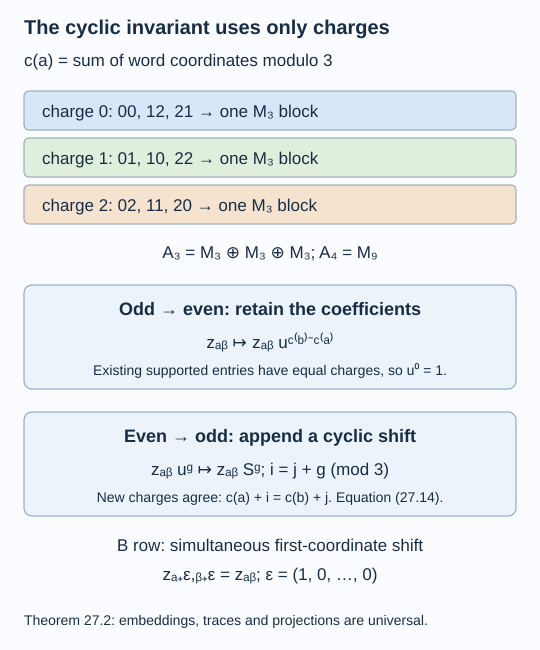

# Charges modulo three determine the whole invariant

The cyclic normal form of a \(D_4\) inclusion determines more than its graph. We can write its entire tower in matrices, including both rows of relative commutants, their embeddings, their traces and every Jones projection. All these finite data depend only on addition modulo three. Finite-depth classification then gives exactly one hyperfinite \(D_4\) pair.

We assume [A cyclic symmetry realizes the three-armed graph](cyclic-symmetry-and-d4.md), [Finite bases, bounded vectors and a positive-operator inequality](finite-bases-and-positive-index.md), and [A generating tunnel and the classification theorem](generating-tunnels-and-classification.md). The general basic-construction and matrix-amplification facts were proved in lessons 1, 4 and 14. References are [Jones] and [Popa].

Construction and proof sources: The actual cyclic normal form is Theorem 26.4 of [A cyclic symmetry realizes the three-armed graph](cyclic-symmetry-and-d4.md). Lemma 27.1 and Theorem 27.2 below construct the complete charge-word matrix tower and both relative-commutant rows, preserving every embedding, normalized trace and Jones projection. Corollary 27.3 compares those whole marked invariants and then applies Theorem 17.6 of [A generating tunnel and the classification theorem](generating-tunnels-and-classification.md). The analytic recognition and amplification inputs are the declared [basic-construction](projection-and-basic-construction.md), [tower](towers-and-tunnels.md) and [finite-basis](finite-bases-and-positive-index.md) proofs.

Throughout, \(N\) is a II₁ factor, \(\gamma\) is an outer cyclic action of order three, and

\[
M=N\rtimes_\gamma\mathbb Z/3\mathbb Z,
\qquad u^3=1,\qquad unu^*=\gamma(n).
\tag{27.1}
\]

All group indices and charges below are in \(\mathbb Z/3\mathbb Z\). Powers of \(u\) therefore have no scalar phase when their exponents wrap around. Its three group powers form an orthonormal right \(N\)-basis.

## The first two matrix constructions

Write \(E=E_N:M\to N\). Left multiplication on the right basis gives the normal inclusion

\[
\Phi(x)_{ij}=E(u^{-i}xu^j),\qquad 0\leq i,j\leq2.
\tag{27.2}
\]

In particular, with \(S_{ij}=1\) when \(i=j+1\) and zero otherwise,

\[
\Phi(n)=\operatorname{diag}(n,\gamma^{-1}(n),\gamma^{-2}(n)),
\qquad \Phi(u)=S.
\tag{27.3}
\]

**Lemma 27.1.** The first two basic constructions are

\[
M_1=M_3(N),\qquad M_2=M_3(M).
\tag{27.4}
\]

The inclusion \(M\to M_1\) is \(\Phi\), and \(M_1\to M_2\) is the entrywise coefficient inclusion. In these models

\[
e_0=E_{00},\qquad
e_1=f=\frac13[u^{j-i}]_{i,j=0}^2.
\tag{27.5}
\]

**Proof.** The right-module unitary \(L^2(M)_N\cong L^2(N)_N^{\oplus3}\) identifies its right-action commutant with \(M_3(N)\). Theorem 1.2 identifies this commutant with the basic construction. Formula (27.2) is exactly its left action, and the orthogonal projection onto the basis summand \(L^2(N)\) is \(E_{00}\).

Use normalized matrix trace on \(M_3(N)\) and \(M_3(M)\). For \(a=[a_{ij}]\in M_3(N)\), the trace-preserving expectation from \(M_1\) to \(M\), with the latter identified through \(\Phi\), has coefficient value

\[
F(a)=\frac13\sum_{i,j=0}^2u^i a_{ij}u^{-j}.
\tag{27.6}
\]

Indeed, pairing (27.2) with \(a\) in normalized matrix trace gives \(\tau_{M_1}(\Phi(x)a)=\tau_M(xF(a))\) for every \(x\in M\). The defining trace-pairing property of the expectation proves the formula.

Let \(v\) be the column with entries \(v_i=u^{-i}\). It satisfies \(v^*v=3\), so \(f=vv^*/3\) is a projection. The left-basis expansion of an element of \(M\) gives \(\Phi(x)v=vx\), and its adjoint gives \(v^*\Phi(x)=xv^*\). Hence

\[
faf=\Phi(F(a))f.
\tag{27.7}
\]

The expectation from \(M_3(M)\) onto \(M_3(N)\) acts entrywise by \(E\). In (27.5) it kills each off-diagonal coefficient and gives \(E_{M_1}(f)=\tfrac13 1\). Thus the normalized trace of \(f\) is \(1/3\).

Finally the span \(M_1fM_1\) fills \(M_3(M)\). Multiplying \(f\) by scalar matrix units gives

\[
E_{ai}fE_{jb}=\frac13E_{ab}u^{j-i}.
\]

Multiplying also by coefficients in \(N\) gives every Fourier term in every entry. Finite Fourier expansion gives all of \(M_3(M)\). Equations (27.7), the expectation normalization and this spanning identity are the basic-construction identities. They identify this factor with the second basic construction: the map from the span of formal \(a e_1 b\) to \(a f b\) preserves multiplication and the canonical trace after scaling normalized trace by three, so its faithful tracial completion is an isomorphism. It fixes \(M_1\). This proves (27.4)–(27.5). \(\square\)

Matrix amplification now iterates the two triples. For \(t\geq1\),

\[
M_{2t-1}=M_{3^t}(N),\qquad
M_{2t}=M_{3^t}(M).
\tag{27.8}
\]

The odd-to-even inclusion includes each coefficient \(N\to M\). The even-to-odd inclusion applies \(\Phi\) to every entry, appending one matrix coordinate. For \(s\geq0\) the Jones projections are

\[
e_{2s}=1_{3^s}\otimes E_{00},\qquad
e_{2s+1}=1_{3^s}\otimes f.
\tag{27.9}
\]

To justify all levels, amplify the first triple \(N\subseteq M\subseteq M_3(N)\) and the second triple \(M\subseteq M_3(N)\subseteq M_3(M)\) alternately. Common matrix amplification preserves their basic-construction identities and normalized expectations. Uniqueness at each step then identifies them with the canonical tower, fixing earlier levels and projections. Their normalized traces are ordinary normalized matrix traces composed with the coefficient-factor trace.

## The two rows in charge coordinates

Index the matrices of size \(3^t\) by words \(a=(a_1,\ldots,a_t)\). Put

\[
c(a)=a_1+\cdots+a_t\pmod3.
\tag{27.10}
\]

Repeated use of (27.3) shows that the original \(n\in N\) is diagonal at either level in (27.8), with entry \(\gamma^{-c(a)}(n)\). The original \(u\) is \(S\otimes1_{3^{t-1}}\): its first application of \(\Phi\) is \(S\), and every further application expands its scalar entries by the identity.

**Theorem 27.2.** Put \(A_k=N'\cap M_k\) and \(B_k=M'\cap M_k\). At \(t\geq1\), the first row consists of

\[
\begin{aligned}
A_{2t-1}&=\{[z_{ab}]:z_{ab}\in\mathbb C,
\ z_{ab}=0\text{ if }c(a)\ne c(b)\},\\
A_{2t}&=\{[z_{ab}u^{c(b)-c(a)}]:z_{ab}\in\mathbb C\}.
\end{aligned}
\tag{27.11}
\]

In particular these algebras are respectively \(M_{3^{t-1}}^{\oplus3}\) and \(M_{3^t}\). The second row consists of the corresponding elements with

\[
z_{a+\varepsilon,b+\varepsilon}=z_{ab},
\qquad \varepsilon=(1,0,\ldots,0).
\tag{27.12}
\]

Thus \(B_{2t-1}\cong M_{3^{t-1}}\) and \(B_{2t}\cong M_{3^{t-1}}^{\oplus3}\). These models, their inclusions, normalized traces and projections (27.9) are independent of the particular outer action.

**Proof.** At an odd level an entry \(x_{ab}\in N\) commutes with the original \(N\) exactly when

\[
\gamma^{-c(a)}(n)x_{ab}
=x_{ab}\gamma^{-c(b)}(n)\quad(n\in N).
\tag{27.13}
\]

If the charges agree, the entry is scalar because \(N\) is a factor. If they differ, a nonzero intertwiner would have both absolute squares scalar and therefore be a scalar multiple of a unitary, as in Lemma 18.2. That unitary would implement a nonidentity power of \(\gamma\), contradicting outerness. This proves the first line of (27.11). For each charge there are \(3^{t-1}\) words, giving its three blocks.

At an even level expand the entry in \(M\) as \(\sum_{g=0}^2x_g u^g\). Equation (27.13) and Fourier uniqueness force each coefficient to intertwine \(\gamma^{-c(a)}\) with \(\gamma^{g-c(b)}\). The same outer-intertwiner test kills it unless \(g=c(b)-c(a)\); in that case its coefficient is scalar. This proves the second line. Its parametrization by \([z_{ab}]\) is a *-isomorphism from \(M_{3^t}(\mathbb C)\): it is the map \(Z\mapsto D^*ZD\), where \(D=\operatorname{diag}(u^{c(a)})\), or can be checked by adding the exponents in a matrix product.

To commute with all of \(M\), it remains to commute with the original generator \(u\). Its matrix \(S\otimes1\) gives exactly (27.12). At odd levels, simultaneous shift of the first coordinate cyclically permutes the three charge blocks, keeping the suffix \((a_2,\ldots,a_t)\) fixed. Equation (27.12) makes all three block matrices equal under this explicit identification, leaving one \(M_{3^{t-1}}\). At even levels it says that the scalar matrix \([z_{ab}]\) commutes with \(S\otimes1\). The three distinct eigenvalues of \(S\) give three blocks of size \(3^{t-1}\). This proves the second-row descriptions.

We must also check the structure maps. Odd-to-even inclusion leaves the entries unchanged. On its supported entries the exponent \(c(b)-c(a)\) is zero, so the same scalar matrix is used in both lines of (27.11). Even-to-odd inclusion replaces each scalar multiple of \(u^g\) by the same multiple of \(S^g\). Explicitly, with appended coordinates \(i,j\),

\[
z'_{(a,i),(b,j)}
=z_{ab}\,\mathbf1_{\{i=j+c(b)-c(a)\}}.
\tag{27.14}
\]

The nonzero condition is exactly equality of the new charges \(c(a)+i=c(b)+j\). These formulas use only the cyclic group and preserve (27.12). The horizontal inclusion \(B_k\subseteq A_k\) is the same coefficient inclusion in every model.

At both parities the normalized trace is

\[
3^{-t}\sum_a z_{aa}.
\tag{27.15}
\]

At an even level the diagonal Fourier exponent is zero, so no coefficient-factor trace remains in this formula. At an odd level all diagonal entries are already scalar. Finally (27.9) has universal coefficients: \(E_{00}\) is scalar, and every entry of \(f\) is exactly \(u^{j-i}/3\). Replacing one cyclic implementer by another in (27.11) therefore preserves every Jones projection, at every later level as well. Inclusion and trace preservation also preserve all trace expectations and hence the commuting squares. The old basic blocks are spanned by products with the relevant Jones projection, so their canonical reflection maps are preserved too. \(\square\)

At the bottom \(A_0=B_0=\mathbb C\); the theorem starts at \(A_1=\mathbb C^3\) and \(B_1=\mathbb C\). In particular \(e_0\in A_1\) must be retained in the first row when reconstructing the pair. It is not an element of \(B_1\).

*Figure 27.1. At words of length two, the three equal-charge blocks give \(A_3=M_3^{\oplus3}\); arbitrary scalar coefficients with the indicated powers of \(u\) give \(A_4=M_9\). The two embedding rules are the unchanged coefficients and (27.14). The simultaneous shift condition is (27.12), with projections fixed by (27.9). Proof locator: Theorem 27.2. [Editable figure source](figures/cyclic-invariant.py).*

## Exactly one hyperfinite three-armed pair

**Corollary 27.3.** There is exactly one conjugacy class of separable hyperfinite II₁ inclusions with endpoint-rooted principal graph \(D_4\). Its dual graph is also \(D_4\), its index is three, and its depth is two.

**Proof.** Corollary 26.3 gives an actual pair, so existence is established. Theorem 26.4 puts every pair with this graph into form (27.1). For any two such pairs, the coefficient identifications (27.11) give isomorphisms of every \(A_k\); (27.12) carries each \(B_k\) onto its counterpart. Theorem 27.2 proves compatibility with all inclusions, traces and Jones projections. Thus their full structured standard invariants are isomorphic, not merely their block dimensions or graphs.

Both pairs have finite depth because their graph is finite. Theorem 17.6 now gives an isomorphism of the original hyperfinite inclusions. Identifying their large factors with a fixed hyperfinite II₁ factor turns this into conjugacy. The graph, index and depth assertions were established in lesson 26. \(\square\)

The proof uses the cyclic matrix formulas to compare the invariants directly. It requires no classification of outer automorphisms of the hyperfinite factor. It addresses \(D_4\); larger even three-armed graphs require additional constructions and invariant comparisons.

## Exercises

**Exercise 27.1 — introductory.** At word length \(t=2\), list the words of each charge and verify the sizes of \(A_3\) and \(B_3\).

**Solution.** Charge zero has \(00,12,21\); charge one has \(01,10,22\); charge two has \(02,11,20\). Thus \(A_3=M_3^{\oplus3}\). Simultaneously shifting the first coordinate identifies these charge classes while retaining the second coordinate as the label within each block, so (27.12) leaves one common \(M_3\), giving \(B_3=M_3\).

**Exercise 27.2 — intermediate.** Track a scalar coefficient from \(A_2=M_3\), labelled by \(a=0,b=1\), through \(A_2\to A_3\).

**Solution.** The represented entry is \(z_{01}u\). Applying \(\Phi\) gives \(z_{01}S\), so its three nonzero new entries have \(i=j+1\). The new row and column charges are \(i\) and \(1+j\), and therefore agree. This is precisely (27.14); it lands inside the equal-charge blocks of \(A_3\).

**Exercise 27.3 — intermediate.** Verify that \(f\) in (27.5) is a projection and that its expectation onto \(M_3(N)\) is \(\tfrac13 1\).

**Solution.** Its \((i,k)\) square entry is \(\tfrac19\sum_j u^{j-i}u^{k-j}=\tfrac13u^{k-i}\), its original entry. Adjoints also agree. Entrywise \(E_N\) keeps only the entries with \(k=i\), and those diagonal entries are \(1/3\). Hence the expectation is \(\tfrac13 1\), as required by index three.

**Exercise 27.4 — advanced.** Why would the block descriptions in (27.11) alone be insufficient for Corollary 27.3?

**Solution.** They identify individual finite algebras but leave their embeddings and marked projections unspecified. The classification theorem requires the structured ladder. Rules (27.14), the horizontal restriction (27.12), trace formula (27.15) and projection formulas (27.9) provide exactly that missing compatibility. Their coefficients are independent of the action, so the resulting maps intertwine all levels at once.

## References

- Vaughan F. R. Jones, [*Index for subfactors*](https://doi.org/10.1007/BF01389127), Inventiones Mathematicae 72 (1983), 1–25.
- Sorin Popa, [*Classification of subfactors: the reduction to commuting squares*](https://doi.org/10.1007/BF01231494), Inventiones Mathematicae 101 (1990), 19–43.

*Written by GPT-6.1 Sol (OpenAI), Ultra reasoning effort, September 2026. Self-checked by the writing AI. Public domain (CC0).*
