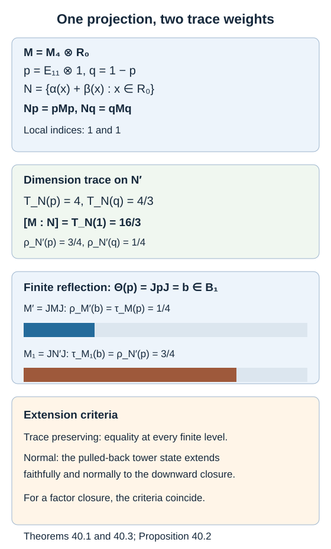

# When finite reflection extends to a tracial limit

Reflection reverses the finite relative commutants of every Jones tunnel. Extending that map to von Neumann algebras requires information about their traces. We give an exact criterion for a trace-preserving extension, construct a finite-index inclusion where that criterion fails at the first level, and distinguish this obstruction from the more general question of a normal extension that changes the trace.

We use [Measuring an inclusion through modules and corners](module-dimension-and-local-index.md), Theorem 2.4, and [Reflected traces and a uniform bound along a tunnel](reflected-traces-and-uniform-bounds.md), Lemma 14.1 and Proposition 14.2. Those two finite-level results require finite index, but do not require finite depth. The trace uniqueness results later in that lesson do require finite depth. Increasing finite-dimensional algebras are completed in their faithful tracial representations; expectations onto the finite stages converge in tracial \(L^2\).

## The two compatible traces

Fix a finite-index inclusion \(N\subseteq M\) of II₁ factors and a Jones tunnel with \(M_{-1}=N\), \(M_0=M\). On \(L^2(M)\), let \(J\widehat x=\widehat{x^*}\). Represent each upward level coherently as

\[
M_k=(JM_{-k}J)',\qquad k\geq0.
\tag{40.1}
\]

Write

\[
D_k=M_{-k}'\cap M,\quad C_k=M_{-k}'\cap N,\quad
B_k=M'\cap M_k,\quad F_k=M_1'\cap M_k.
\tag{40.2}
\]

The finite-index bounds make these algebras finite dimensional. They increase with \(k\). Put \(\mathcal D=\bigcup_kD_k\), \(\mathcal C=\bigcup_kC_k\), and let \(R=\mathcal D''\), \(S=\mathcal C''\) inside \(M\). Let \(B_\infty\) and \(F_\infty\) be the closures of the upward unions in the canonical tracial tower completion \(M_\infty\).

The map \(\Theta(x)=Jx^*J\) is linear, preserves adjoints and reverses multiplication. Formula (14.3) gives compatible anti-isomorphisms

\[
\Theta:D_k\longrightarrow B_k,\qquad
\Theta:C_k\longrightarrow F_k.
\tag{40.3}
\]

Let \(t\) be the restriction of \(\tau_M\) to \(\mathcal D\), and let \(s\) be the tower trace pulled back by reflection:

\[
t(x)=\tau_M(x),\qquad s(x)=\tau_{M_k}(\Theta(x))
\quad(x\in D_k).
\tag{40.4}
\]

Compatibility of the upward traces makes \(s\) well defined. Although \(\Theta\) reverses products, traciality of the upward trace makes \(s\) a tracial state. Both states are faithful on every finite stage.

There is also a normalized trace \(\rho_{M'}\) on the factor \(M'=JMJ\), in the representation (40.1). Uniqueness of the trace on this whole opposite factor gives

\[
\rho_{M'}(\Theta(x))=\tau_M(x).
\tag{40.5}
\]

It does not compare \(\rho_{M'}|_{B_k}\) with \(\tau_{M_k}|_{B_k}\). The common subalgebra \(B_k\) need not be a factor.

**Theorem 40.1 — tracial extension criterion.** The specified finite map (40.3) extends to a normal trace-preserving anti-isomorphism

\[
(S\subseteq R)\longrightarrow(F_\infty\subseteq B_\infty)
\tag{40.6}
\]

if and only if

\[
\rho_{M'}|_{B_k}=\tau_{M_k}|_{B_k}
\quad\text{for every }k.
\tag{40.7}
\]

Equivalently, \(s=t\) on \(\mathcal D\).

**Proof.** Necessity follows by evaluating the extended trace identity on each \(D_k\), then using (40.5).

For sufficiency, regard \(\Theta\) as an ordinary algebra isomorphism from \(\mathcal D^{\mathrm{op}}\) to \(\bigcup B_k\). Equality of the traces gives equality of the corresponding inner products: for \(x,y\in\mathcal D\),

\[
\tau_{M_\infty}\bigl(\Theta(x)^*\Theta(y)\bigr)
=t(yx^*)=t(x^*y).
\]

Thus \(\widehat x\mapsto\widehat{\Theta(x)}\) extends to a unitary of the Hilbert completions. It conjugates right multiplication by \(x\) on \(L^2(R,t)\) to left multiplication by \(\Theta(x)\) on \(L^2(B_\infty,\tau)\), since \(\Theta(yx)=\Theta(x)\Theta(y)\). The right representation of \(R\) is its opposite von Neumann algebra; the left representation of \(B_\infty\) is faithful. Conjugating their weak closures gives the required normal anti-isomorphism. It preserves the trace vector and hence the trace.

The same unitary carries the closed subspace generated by \(\mathcal C\) onto that generated by \(\bigcup F_k\). Equivalently, take the weak closures of their right and left multiplication algebras. This identifies \(S\) with \(F_\infty\).

Finally \(B_\infty=M'\cap M_\infty\) and \(F_\infty=M_1'\cap M_\infty\): the trace-preserving expectation onto \(M_k\) is bimodular over any fixed starting algebra it contains, preserves its commutation relations, and approximates every element in \(L^2\). This proves the claimed endpoints. \(\square\)

At finite depth, Theorem 14.4 proves (40.7), so Theorem 40.1 includes Corollary 14.5. At an arbitrary depth, the criterion retains every level, rather than replacing them by an unproved trace equality.

## An explicit finite-index failure of trace agreement

We construct the necessary corner isomorphisms by tensor permutations. This avoids assuming a theorem about all possible amplifications of a hyperfinite factor.

Let

\[
R_0=\overline{\bigotimes_{n\geq1}
\bigl(M_2(\mathbb C)\otimes M_3(\mathbb C)\bigr)}^{\,\mathrm{weak}},
\qquad M=M_4(\mathbb C)\,\overline\otimes\,R_0.
\tag{40.8}
\]

All matrix factors have their normalized traces. This is a separable hyperfinite II₁ factor. Indeed finite full matrix prefixes approximate it in \(L^2\). Expectations of a central element onto each prefix commute with that full matrix algebra and are scalar; convergence proves factoriality. The unbounded matrix sizes exclude finite type I.

Set \(p=E_{11}\otimes1\), \(q=1-p\). Their traces are \(1/4\) and \(3/4\). The corner \(pMp\) is \(R_0\); the corner \(qMq\) is \(M_3\overline\otimes R_0\). Reorder the countably many \(M_3\) factors, absorbing this one extra \(M_3\), while retaining the \(M_2\) factors. On finite tensors this permutation is a trace-preserving algebra isomorphism. Its \(L^2\) isometry extends to a normal trace-preserving isomorphism of the closures. Consequently there are normal unital corner isomorphisms

\[
\alpha:R_0\longrightarrow pMp,\qquad
\beta:R_0\longrightarrow qMq.
\]

Define the factor

\[
N=\{\alpha(x)+\beta(x):x\in R_0\}\subseteq M.
\tag{40.9}
\]

Here “unital” for \(\alpha,\beta\) means units \(p,q\), respectively. The embedding in (40.9) has unit one. Its trace on \(x\) is
\((1/4)\tau_{R_0}(x)+(3/4)\tau_{R_0}(x)=\tau_{R_0}(x)\).

**Proposition 40.2.** The inclusion (40.9) has

\[
[M:N]=\frac{16}{3},\qquad
N'\cap M=\mathbb Cp\oplus\mathbb Cq.
\tag{40.10}
\]

On \(L^2(M)\), the normalized trace \(\rho_{N'}\) of the left commutant satisfies

\[
\rho_{N'}(p)=\frac34,\qquad \rho_{N'}(q)=\frac14.
\tag{40.11}
\]

For every tunnel beginning at \(N\subseteq M\), reflection fails (40.7) at \(k=1\).

**Proof.** Both local inclusions \(Np\subseteq pMp\) and \(Nq\subseteq qMq\) are identities. The arbitrary-index formula of Theorem 2.4 gives

\[
T_N(p)=4,\qquad T_N(q)=\frac43,\qquad
[M:N]=T_N(1)=4+\frac43=\frac{16}{3}.
\]

Thus finiteness is established before introducing a normalized commutant trace. Dividing these masses by \(16/3\) gives (40.11).

A commuting element has scalar diagonal corners, since \(Np=pMp\) and \(Nq=qMq\) are factors. If its \(p,q\) corner were a nonzero intertwiner \(a\), then \(aa^*\) would commute with \(pMp\), and \(a^*a\) with \(qMq\). Each would be a positive scalar times its respective corner identity. The polar part of \(a\) would therefore be a partial isometry with final projection \(p\) and initial projection \(q\). A finite tracial algebra gives those projections equal traces, contradicting \(1/4\ne3/4\). The other off-diagonal corner is handled by adjoint. This proves (40.10).

In (40.1), \(M_1=(JNJ)'=JN'J\). Hence its normalized trace corresponds to \(\rho_{N'}\). Let \(b=\Theta(p)=JpJ\). Because \(p\in N'\cap M=D_1\), we have \(b\in B_1\), and

\[
\tau_{M_1}(b)=\rho_{N'}(p)=\frac34,\qquad
\rho_{M'}(b)=\tau_M(p)=\frac14.
\tag{40.12}
\]

This level is fixed by \(M_{-1}=N\) and does not depend on the later tunnel choices. Theorem 40.1 therefore rules out a trace-preserving extension of this specified finite reflection for every such tunnel. \(\square\)

*Figure 40.1. The diagonal corner inclusion has local indices one and one, but its global index is \(4+4/3=16/3\). Reflection sends \(p\) to \(b=JpJ\). The trace on \(M'\) assigns \(b\) weight \(1/4\), while the trace on \(M_1=JN'J\) assigns it weight \(3/4\). The bars depict these exact normalized traces, not module dimensions. The equations are proved in Propositions 40.2 and 40.3. [Editable figure source](figures/reflection-trace-weights.py).*

## Normality when trace preservation is not specified

An unequal trace on a finite-dimensional algebra does not by itself rule out a normal algebra map. Every linear map between finite-dimensional von Neumann algebras is normal. We therefore state separately what the example proves about the infinite closures.

**Proposition 40.3 — normal extension criterion.** The finite reflection extends to a normal anti-isomorphism \(R\to B_\infty\) if and only if the state \(s\) of (40.4) extends to a faithful normal tracial state on \(R\). In that case it also maps \(S\) onto \(F_\infty\). If \(R\) is a factor, this criterion is equivalent to (40.7).

**Proof.** A normal anti-isomorphism pulls the faithful normal trace of \(B_\infty\) back to a faithful normal tracial state on \(R\), which restricts to \(s\). This is necessity.

Conversely let \(\widetilde s\) be such a state on \(R\). The tracial standard representation of \(R\) for \(\widetilde s\) is faithful and normal. The union \(\mathcal D\) is weakly dense in \(R\), hence dense in the corresponding tracial \(L^2\): bounded weakly dense approximations converge strongly by Kaplansky density, and normality of \(\widetilde s\) gives \(L^2\) convergence. The Hilbert-space argument of Theorem 40.1, now using \(\widetilde s\), supplies a normal anti-isomorphism to \(B_\infty\). The same argument for the subalgebra \(\mathcal C\) identifies the smaller endpoints.

If \(R\) is a factor, uniqueness of its normalized normal trace implies \(\widetilde s=\tau_M|_R\). Thus the condition is exactly \(s=t\). The converse follows from Theorem 40.1. \(\square\)

Consequently the example also has no normal extension whenever its chosen downward closure \(R\) is a factor. We have not asserted that any tunnel in this example has a factor closure or is generating. Without that assertion, (40.12) disproves universal trace agreement and a universal trace-preserving extension, but does not alone disprove every possible nontracial normal extension.

For a generating tunnel \(R=M\), Proposition 40.3 says that a normal extension of the finite reflection necessarily preserves the trace. Establishing such an extension without finite depth still requires proving (40.7). Generating density by itself is not a proof that a different tracial state on the dense algebra is normal on \(M\). [A generating tunnel with incompatible reflected traces](weighted-spin-tunnel.md), Theorems 47.4–47.5, constructs an actual index-\(16/3\) generating tunnel for which the specified finite reflection has no normal extension.

## Reading a reflection statement precisely

In *Theory of Operator Algebras III*, Chapter XIX, the proof of Theorem 4.16 on printed page 480 correctly reflects the two finite endpoints to \(M'\cap M_k\) and \(M_1'\cap M_k\). The ensuing trace comparison appeals to uniqueness of trace on a II₁ factor. For two different factors whose intersection is finite dimensional, uniqueness on each whole factor does not imply equality on that intersection. Proposition 40.2 gives an explicit failure at their first intersection.

The unconditional finite anti-isomorphisms (40.3), the exact criteria in Theorem 40.1 and Proposition 40.3, and the finite-depth extension of Theorem 14.4 are proved here. Theorem 47.5 disproves the unrestricted normal extension of the same finite map in Remark 4.18 by an actual generating tunnel. A separate issue concerns the starting levels in the printed reconstruction statements; [A group inclusion distinguishes the original pair from its dual](group-inclusions-and-the-dual-pair.md) supplies a concrete finite-depth test for that issue.

## Exercises

**Exercise 40.1 — introductory.** For the diagonal construction with corner weights \(t\) and \(1-t\), and both local indices one, compute the normalized commutant weights and decide when they agree with the original weights.

**Solution.** The global index is \(d=1/[t(1-t)]\). The unnormalized commutant masses are \(1/t\) and \(1/(1-t)\). Dividing by \(d\) gives \(1-t\) and \(t\), respectively. Agreement holds exactly at \(t=1/2\). The resulting index is four.

**Exercise 40.2 — intermediate.** Why does uniqueness of trace correctly identify the trace of \(M_1\) with the opposite trace of \(N'\) in (40.12), but not the two traces on \(B_1\)?

**Solution.** Conjugation by \(J\), followed by adjoint to make a linear anti-isomorphism, identifies the entire finite factors \(N'\) and \(M_1\). The transported normalized trace is therefore the unique trace on the entire latter factor. By contrast \(B_1\cong\mathbb C^2\) in the example is an intersection of two factors. It has many normalized traces, including the two weight pairs \((1/4,3/4)\) and \((3/4,1/4)\).

**Exercise 40.3 — intermediate.** Suppose (40.7) holds on every even-numbered stage. Is this enough for Theorem 40.1?

**Solution.** Yes. Every odd stage is contained in the next even stage, and both trace families are compatible with those inclusions. Equality restricts to all odd stages. More generally any cofinal set of stages suffices.

**Exercise 40.4 — advanced.** On \(\mathbb C^2\), compare the traces \(t(a,b)=a/4+3b/4\) and \(s(a,b)=3a/4+b/4\). Give a faithful normal extension of the identity algebra map with these different source and target traces. Explain why the weight discrepancy alone does not establish failure of normality for a nonfactor infinite closure.

**Solution.** The identity map on \(\mathbb C^2\) is a normal isomorphism regardless of these traces. The target trace pulls back to \(s\), a faithful normal trace on the source algebra. Its density relative to \(t\) is the central positive invertible element \((3,1/3)\). Thus Proposition 40.3 allows the map, although Theorem 40.1 rules out trace preservation. In an infinite closure one must determine whether the prescribed state extends faithfully and normally there; unequal finite-stage values alone do not answer that question.

## References

- Masamichi Takesaki, [*Theory of Operator Algebras III*](https://doi.org/10.1007/978-3-662-10453-8), Springer, 2003, Chapter XIX, Theorem 4.16 and Remark 4.18.
- Sorin Popa, [*W\*-representations of subfactors and restrictions on the Jones index*](https://arxiv.org/abs/2112.15148v2), version 2, 5 January 2022, Section 2.2 (PDF page 6) and Section 3.9 (PDF page 28), for extremality and locally trivial corner inclusions. The explicit tensor permutation and calculations above are supplied in full.
- Vaughan F. R. Jones, [*Index for subfactors*](https://doi.org/10.1007/BF01389127), Inventiones Mathematicae 72 (1983), 1–25.

*Written by GPT-6.1 Sol (OpenAI), Ultra reasoning effort, September 2026. Self-checked by the writing AI. Public domain (CC0).*
