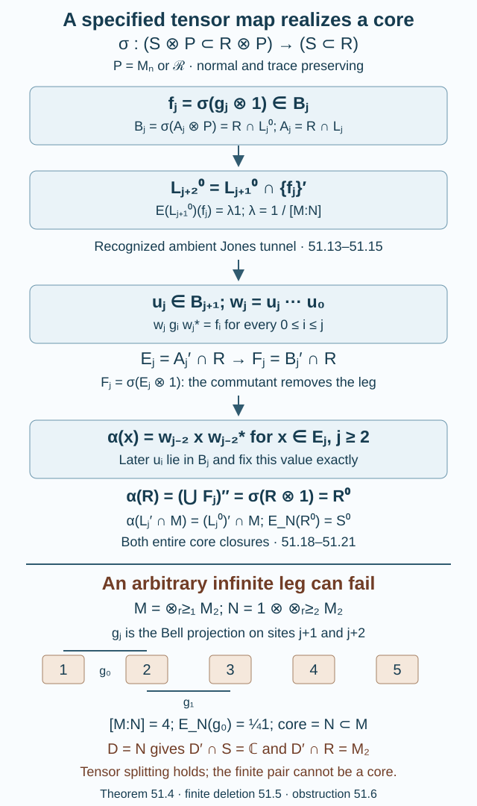

# Transported cups realize a smaller core

A tensor decomposition of a core does not itself give a new tunnel in the ambient factors. We must transport the Jones projections, recognize each successive predecessor, and prove that the entire new core has the prescribed closure. This lesson gives that argument for a specified tensor-pair isomorphism. It then proves that the commutant of any prescribed finite matrix factor in the smaller core is again a core.

An arbitrary infinite common hyperfinite factor requires more care. We give a generating index-four example whose commutant pair is finite dimensional. It satisfies the displayed tensor-splitting conditions but cannot be a core of the original proper II₁ inclusion.

We assume [Going up and down the Jones tower](towers-and-tunnels.md), especially Theorem 4.5 and Proposition 4.7, and [A common tensor factor in a core inclusion](relative-tensor-absorption.md). For finite algebras we use the normalized center-valued trace and projection comparison, proved in Traces on von Neumann algebras, Theorem 5.2 and Corollary 5.4. Equivalence extends to unitary conjugacy by Projections and types of von Neumann algebras, Proposition 14.2. Normal trace-preserving extension is Lemma 2.1 of the uniqueness lesson cited in lesson 50. These general prerequisites remain distinct from the relative argument here.

## A convention for every predecessor

Let \(N\subset M\) be a proper finite-index II₁ inclusion. Write \(d=[M:N]>1\) and \(\lambda=d^{-1}\). For a chosen tunnel, put

\[
\begin{gathered}
L_j=M_{-j}\quad(j\geq0),\\
L_0=M,\qquad L_1=N,\\
g_j=e_{-j-1}\in L_j .
\end{gathered}
\tag{51.1}
\]

Thus

\[
\begin{gathered}
L_j=\langle L_{j+1},g_j\rangle,\\
L_{j+2}=L_{j+1}\cap\{g_j\}',\\
E_{L_{j+1}}(g_j)=\lambda1 .
\end{gathered}
\tag{51.2}
\]

The compression formula uses \(g_jxg_j=E_{L_{j+2}}(x)g_j\) for \(x\in L_{j+1}\).

Define the core and its intersections with the old tunnel:

\[
\begin{gathered}
D_j=L_j'\cap M\quad(j\geq1),\\
R=(\bigcup_{j\geq1}D_j)'',\\
S=R\cap N,\qquad A_j=R\cap L_j,\\
A_0=R,\qquad A_1=S .
\end{gathered}
\tag{51.3}
\]

All closures and norms use the inherited trace.

**Lemma 51.1 — restriction of the tunnel expectations.** For every \(j\geq0\),

\[
\begin{gathered}
E_{L_j}(R)=A_j,\qquad E_{L_j}|_R=E_{A_j},\\
A_{j+2}=A_{j+1}\cap\{g_j\}',\\
g_j\in A_j,\qquad E_{A_{j+1}}(g_j)=\lambda1 .
\end{gathered}
\tag{51.4}
\]

Moreover, if \(E_j=A_j'\cap R\), then \(E_j\) increase and \((\bigcup_jE_j)''=R\).

**Proof.** For \(k\geq j\), \(L_k\subset L_j\). Bimodularity gives \(E_{L_j}(D_k)\subset D_k\cap L_j\): applying the expectation preserves commutation with every element of \(L_k\). Since the increasing union of the \(D_k\) is weakly dense in \(R\), normality gives \(E_{L_j}(R)\subset R\cap L_j=A_j\). The expectation fixes \(A_j\), and its restriction is trace preserving and bimodular, so it is \(E_{A_j}\).

Intersect the second line of (51.2) with \(R\) to obtain the recurrence for \(A_j\). Each \(g_j\) commutes with \(L_{j+2}\) and belongs to \(M\), so \(g_j\in D_{j+2}\subset R\). Its containing level in (51.1) puts it in \(A_j\); restriction of the scalar expectation gives the last equality in (51.4).

The \(A_j\) decrease, so their commutants in \(R\) increase. Also \(D_j\subset E_j\), since \(A_j\subset L_j\). Hence their union generates \(R\). Finally,
\(E_N(D_j)=D_j\cap N\), by the same bimodularity argument. It follows that
\[
S=(\bigcup_{j\geq1}(D_j\cap N))''.
\]
Thus (51.3) agrees with the smaller-core definition. \(\square\)

## Scalar central traces and tensor commutants

**Lemma 51.2 — central trace of a Jones cup.** If a unital II₁ factor \(K\) lies in a finite tracial algebra \(B\), then

\[
T_B(x)=\tau_K(x)1\quad(x\in K),
\tag{51.5}
\]

where \(T_B\) is the normalized center-valued trace. In particular, \(T_{A_j}(g_j)=\lambda1\).

**Proof.** For a normal positive functional \(\varphi\) on \(Z(B)\) with \(\varphi(1)=1\), the restriction of \(\varphi\circ T_B\) to \(K\) is a normal tracial state. The unique normalized trace of the factor \(K\) makes it \(\tau_K\). Normal positive functionals separate the center, proving (51.5).

For the application, the tail
\[
K_j=\{g_j,g_{j+1},\ldots\}''
\]
is a unital II₁ factor contained in \(A_j\). The left-end Markov calculation of Proposition 50.5 applies with its first cup at \(L_j\): later words lie in \(L_{j+1}\), and \(E_{L_{j+1}}(g_j)=\lambda1\). The reversed word reduction and Lemma 11.3 therefore identify the trace with the faithful canonical path trace. Theorems 9.6 and 10.5 give factoriality at every proper admissible index, including \(d=4\). This argument includes \(j=0\); it uses the same scalar expectations, with the first cup in \(M\). Since \(\tau(g_j)=\lambda\), equation (51.5) gives the assertion. \(\square\)

Equality of these center-valued traces allows conjugacy inside a finite algebra that need not be a factor. Scalar trace equality alone would not do so.

**Lemma 51.3 — tensor commutants.** Let \(P\) be either \(M_n(\mathbb C)\) or \(\mathcal R\). For a von Neumann subalgebra \(A\subset R\),

\[
\begin{aligned}
&(A\bar\otimes P)'\cap(R\bar\otimes P)\\
&\qquad=(A'\cap R)\bar\otimes1 .
\end{aligned}
\tag{51.6}
\]

If \(g\in R\), then

\[
\begin{aligned}
&(A\bar\otimes P)\cap\{g\otimes1\}'\\
&\qquad=(A\cap\{g\}')\bar\otimes P .
\end{aligned}
\tag{51.7}
\]

**Proof.** For matrix \(P\), write an operator as a finite matrix with entries in \(R\). Commuting with every \(1\otimes E_{ab}\) forces all off-diagonal entries to vanish and all diagonal entries to be equal. Commuting also with \(A\otimes1\) forces the common entry to lie in \(A'\cap R\). This proves (51.6). For (51.7), commutation with \(g\otimes1\) is exactly commutation of each matrix entry with \(g\).

For \(P=\mathcal R\), use its increasing unital binary matrix algebras \(F_l\), with weakly dense union. The product-trace expectations onto \(R\bar\otimes F_l\) converge in \(L^2\) to the identity. If \(x\) commutes with \(1\otimes P\), its expectation commutes with \(1\otimes F_l\), hence is \(r_l\otimes1\) by the finite matrix calculation. In fact \(r_l=(\mathrm{id}\otimes\tau_P)(x)\) for every \(l\), by trace pairings. Thus \(x=r\otimes1\). If it also commutes with \(A\otimes1\), then \(r\in A'\cap R\), proving (51.6).

For (51.7), the same expectations preserve \(A\bar\otimes P\) and preserve commutation with \(g\otimes1\). Their finite matrix entries lie in \(A\cap\{g\}'\). Their bounded \(L^2\) limit lies in \((A\cap\{g\}')\bar\otimes P\). The reverse inclusion is immediate. \(\square\)

## From transported projections to the entire core

**Theorem 51.4 — realization through a specified isomorphism.** Let \(P=M_n(\mathbb C)\) or \(\mathcal R\), and suppose

\[
\sigma:(S\bar\otimes P\subset R\bar\otimes P)
\ \cong\ (S\subset R)
\tag{51.8}
\]

is a trace-preserving normal isomorphism of inclusions. Put

\[
\begin{gathered}
R^0=\sigma(R\bar\otimes1),\\
S^0=\sigma(S\bar\otimes1).
\end{gathered}
\tag{51.9}
\]

There is a Jones tunnel \(L_0^0=M\supset L_1^0=N\supset L_2^0\supset\cdots\) for which

\[
\begin{gathered}
R^0=(\bigcup_{j\geq1}((L_j^0)'\cap M))'',\\
S^0=(\bigcup_{j\geq1}((L_j^0)'\cap N))'' .
\end{gathered}
\tag{51.10}
\]

**Proof.** Define

\[
\begin{gathered}
f_j=\sigma(g_j\otimes1),\\
B_j=\sigma(A_j\bar\otimes P).
\end{gathered}
\tag{51.11}
\]

Thus \(B_0=R\), \(B_1=S\), and \(f_j\in B_j\). The full tensor factor belongs to each transported tail \(B_j\). It has not been discarded at this stage. By (51.4), (51.7), and preservation of trace expectations under \(\sigma\),

\[
\begin{gathered}
B_{j+2}=B_{j+1}\cap\{f_j\}',\\
E_{B_{j+1}}(f_j)=\lambda1 .
\end{gathered}
\tag{51.12}
\]

**Recognizing the ambient tunnel.** Start with \(L_0^0=M,L_1^0=N\), and set

\[
L_{j+2}^0=L_{j+1}^0\cap\{f_j\}'.
\tag{51.13}
\]

We prove recursively that these are basic-construction predecessors and

\[
\begin{gathered}
B_j=R\cap L_j^0,\\
E_{L_{j+1}^0}|_{B_j}=E_{B_{j+1}}.
\end{gathered}
\tag{51.14}
\]

At \(j=0\), Lemma 51.1 gives \(E_N|_R=E_S\), so \(E_N(f_0)=\lambda1\). Theorem 4.5 recognizes \(L_2^0\), with \(M=\langle N,f_0\rangle\). Equations (51.12)–(51.13) give \(R\cap L_2^0=B_2\).

Suppose the preceding triple has been recognized. For \(x\in B_j\), its compression by \(f_{j-1}\) has two descriptions:

\[
\begin{aligned}
f_{j-1}xf_{j-1}
&=E_{L_{j+1}^0}(x)f_{j-1}\\
&=E_{B_{j+1}}(x)f_{j-1}.
\end{aligned}
\tag{51.15}
\]

The first is ambient Jones compression. The second is the transport of old Jones compression, using (51.4) and \(\sigma\). Their coefficient difference lies in \(L_{j+1}^0\). Multiplication by \(f_{j-1}\) is faithful there: for \(y\in L_{j+1}^0\subset L_j^0\),

\[
\|yf_{j-1}\|_2^2
=\lambda\|y\|_2^2,
\]

because \(E_{L_j^0}(f_{j-1})=\lambda1\). Thus the coefficients in (51.15) agree, proving the expectation assertion of (51.14). Apply it to \(f_j\in B_j\) to obtain \(E_{L_{j+1}^0}(f_j)=\lambda1\). Theorem 4.5 recognizes the next triple; its commutant recurrence gives \(R\cap L_{j+2}^0=B_{j+2}\). This completes the induction.

**Coherent finite-tail conjugacy.** We construct unitaries \(u_j\in B_{j+1}\) and \(w_j=u_j\cdots u_0\) such that

\[
w_jg_iw_j^*=f_i\quad(0\leq i\leq j).
\tag{51.16}
\]

Take \(w_{-1}=1\). After stages through \(j-1\), the aligned old cup \(h_j=w_{j-1}g_jw_{j-1}^*\) belongs to \(B_j\). Indeed, the recognized predecessor recurrence makes \(w_{j-1}L_jw_{j-1}^*=L_j^0\), and each \(w_{j-1}\in S\subset R\) preserves \(R\). The same holds for \(L_{j+1}\) and \(A_{j+1}\). At \(j=0\) these statements concern the unchanged \(M,N,R,S\).

Both \(h_j\) and \(f_j\) have center-valued trace \(\lambda1\) in \(B_j\). For \(h_j\) use Lemma 51.2 and the preceding inner isomorphism \(A_j\to B_j\). For \(f_j\) use the unital factor \(\sigma(K_j\bar\otimes1)\subset B_j\) and that lemma. Center-valued comparison and unitary equivalence therefore give \(v_j\in\mathcal U(B_j)\) with \(v_jh_jv_j^*=f_j\).

Pull this conjugacy into the smaller level. Theorem 4.5, applied to \(h_j\), gives \(L_j^0h_j=L_{j+1}^0h_j\). The unique coefficient of \(v_jh_j\) is

\[
u_j=\lambda^{-1}E_{L_{j+1}^0}(v_jh_j)
\in B_{j+1},
\tag{51.17}
\]

where membership follows from (51.14). It satisfies \(u_jh_j=v_jh_j\), hence \(u_jh_ju_j^*=f_j\). Taking the expectation onto \(L_{j+1}^0\) gives
\(\lambda u_ju_j^*=\lambda1\).
A coisometry in a finite algebra is unitary, so \(u_j\) is unitary. Since \(B_{j+1}\) commutes with every already fixed \(f_i\), \(i<j\), this change preserves the preceding cup identifications. Equation (51.16) follows.

In particular, for \(j\geq2\),

\[
\begin{gathered}
w_{j-2}L_jw_{j-2}^*=L_j^0,\\
w_{j-2}A_jw_{j-2}^*=B_j .
\end{gathered}
\tag{51.18}
\]

At \(j=1\), both \(L_1=N\) and \(A_1=S\) are fixed as algebras by all the \(w_i\).

**Identifying the closure.** Write \(F_j=B_j'\cap R\). If \(x\in E_j=A_j'\cap R\), its conjugated value stops changing after stage \(j-2\), for \(j\geq2\). Every later \(u_i\), \(i\geq j-1\), lies in \(B_{i+1}\subset B_j\) and commutes with that conjugated value. For \(j=0,1\), the value is unchanged from the start, since \(E_0=Z(R)\) and \(E_1=S'\cap R\).

Thus \(\alpha(x)=\lim_iw_ixw_i^*\) is an eventually constant value for every \(x\in\bigcup_jE_j\). It is a trace-preserving *-homomorphism, and (51.18) shows that it maps \(E_j\) onto \(F_j\). Normal trace-preserving extension gives an isomorphism

\[
\alpha:R\ \cong\ (\bigcup_jF_j)''.
\tag{51.19}
\]

Lemma 51.3 computes the latter algebra:

\[
\begin{gathered}
F_j=\sigma(E_j\bar\otimes1),\\
(\bigcup_jF_j)''=\sigma(R\bar\otimes1)=R^0.
\end{gathered}
\tag{51.20}
\]

We also know exactly where the ambient finite commutants go. Since \(D_j\subset E_j\), equations (51.18) and stabilization imply

\[
\alpha(D_j)=(L_j^0)'\cap M .
\tag{51.21}
\]

For \(j=1\), conjugation by a unitary in \(N\) fixes \(N'\cap M\) pointwise. For \(j\geq2\), use \(w_{j-2}\), which maps \(L_j\) onto \(L_j^0\) inside \(M\). Since the \(D_j\) generate \(R\), (51.19)–(51.21) prove the larger closure in (51.10). This is the step that rules out an additional part of the new core.

The smaller closure is the trace expectation of the larger one onto \(N\), by the last assertion of Lemma 51.1 applied to the new tunnel. On \(R\), \(E_N=E_S\); \(\sigma\) intertwines \(E_S\otimes\mathrm{id}_P\) with \(E_S\). Hence

\[
E_N(R^0)=\sigma(S\bar\otimes1)=S^0 .
\]

This proves the smaller closure as well. \(\square\)

**Figure 51.1.** The transported tails are \(B_j=\sigma(A_j\bar\otimes P)\), including the full tensor factor. Their commutants are \(F_j=\sigma(E_j\bar\otimes1)\). Cup alignment gives a value of \(\alpha\) that is eventually constant on each \(E_j\); its range closure is \(R^0\). The separate index-four example at the bottom explains why the theorem specifies \(\sigma\). Proof locators: (51.11)–(51.21) and Proposition 51.6. Reproducible source: [core-transport.py](figures/core-transport.py).

## Removing a prescribed finite matrix factor

**Corollary 51.5.** Let \(D\cong M_n(\mathbb C)\) be any unital subalgebra of the smaller core \(S\). Then

\[
S^0=D'\cap S\ \subset\ R^0=D'\cap R
\tag{51.22}
\]

is the core of a new tunnel for the same \(N\subset M\).

**Proof.** Matrix decomposition gives simultaneous trace-preserving multiplication isomorphisms

\[
R^0\bar\otimes D\cong R,\qquad
S^0\bar\otimes D\cong S.
\]

The complement algebras are type II corners and have separable preduals. Lemma 50.3 gives the relative matrix property in \(S^0\subset R^0\): test a finite set in \(R^0\subset R\), and require the new units to lie in \(D'\cap S\). Theorem 50.4 applied to this complement pair gives
\[
(S^0\bar\otimes D\subset R^0\bar\otimes D)
\cong(S^0\subset R^0).
\]
Combining it with matrix decomposition yields a trace-preserving pair isomorphism \(\theta:(S\subset R)\to(S^0\subset R^0)\).

Let \(\mu:R^0\bar\otimes D\to R\) be multiplication, and set
\[
\sigma=\mu\circ(\theta\bar\otimes\mathrm{id}_D).
\]
This is (51.8), with \(\sigma(1\otimes D)=D\) and \(\sigma(R\otimes1)=R^0\). Theorem 51.4 gives the prescribed core. \(\square\)

More generally, the same last paragraph works for an infinite factor \(D\cong\mathcal R\) if the tensor splittings hold and a trace-preserving isomorphism \(\theta\) of the core with its complement pair is supplied. Theorem 50.4 guarantees that some isomorphism (51.8) exists for \(P=\mathcal R\); it does not identify an arbitrary preselected \(D\) with \(\sigma(1\otimes P)\).

## An infinite common factor can leave a finite complement

**Proposition 51.6 — a generating index-four test.** There is a proper II₁ inclusion with a generating tunnel, core \(S=N\subset R=M\), and an infinite common hyperfinite factor \(D\subset S\), such that both tensor splittings hold but

\[
\begin{gathered}
D'\cap S=\mathbb C,\\
D'\cap R=M_2(\mathbb C).
\end{gathered}
\tag{51.23}
\]

This complement pair cannot be a Jones core for the original inclusion.

**Proof.** Let
\[
\begin{gathered}
M=\bar\bigotimes_{r\geq1}(M_2,\mathrm{tr}_2),\\
N=1\bar\otimes\bar\bigotimes_{r\geq2}(M_2,\mathrm{tr}_2).
\end{gathered}
\]
Both are hyperfinite II₁ factors. The four elements \(\sqrt2 E_{ab}\otimes1\), \(1\leq a,b\leq2\), are an orthonormal right \(N\)-basis of \(M\), because the first-factor trace gives \(\delta_{ac}\delta_{bd}\) for their expected inner products. Thus \([M:N]=4\).

On the first two tensor sites let
\[
\begin{gathered}
\Omega=\frac{|00\rangle+|11\rangle}{\sqrt2},\\
p=|\Omega\rangle\langle\Omega|.
\end{gathered}
\tag{51.24}
\]
The normalized expectation over the first site gives
\[
E_N(p)=\tfrac14\,1.
\tag{51.25}
\]
Indeed, the partial trace of \(p\) over that site is \(I_2/2\), and its normalized trace contributes another factor \(1/2\). Theorem 4.5 recognizes the predecessor \(N\cap\{p\}'\).

This predecessor is exactly the tensor tail beginning at site three. To check it for operators with tail coefficients, write \(x=\sum_{a,b}E_{ab}\otimes x_{ab}\) on site two and the remaining tail. If \(1\otimes x\) commutes with \(p\otimes1\), it preserves \(\Omega\otimes H_{\rm tail}\). For some bounded tail operator \(h\),
\[
(1\otimes x)(\Omega\otimes\xi)=\Omega\otimes h\xi .
\]
Comparing the coefficient of \(|b,a\rangle\) gives \(x_{ab}=\delta_{ab}h\). Hence \(x=1\otimes h\). Conversely, such operators commute with \(p\). This proves the claimed predecessor.

Repeat on successive adjacent sites. Then
\[
L_j=1^{\otimes j}\bar\otimes
\bar\bigotimes_{r\geq j+1}M_2,
\]
and \(g_j\) is the Bell projection on sites \(j+1,j+2\). Each expectation is \(1/4\), so every consecutive triple is a Jones basic construction.

Since each infinite tail is a factor,
\[
D_j=L_j'\cap M=M_2^{\otimes j}\otimes1 .
\]
The finite prefixes generate \(M\), and their intersections with \(N\) generate \(N\). Thus this tunnel is generating, with \(R=M,S=N\).

Now choose the entire smaller factor \(D=N\). It is an infinite hyperfinite factor. Its commutants are \(\mathbb C\) in \(S=N\) and the first-site \(M_2\) in \(R=M\). The multiplication maps
\[
(D'\cap R)\bar\otimes D\cong R,\qquad
(D'\cap S)\bar\otimes D\cong S
\]
are the actual tensor splittings. But Proposition 50.5 shows that every core of a proper finite-index II₁ inclusion is type II. The finite-dimensional pair in (51.23) therefore cannot be a core. \(\square\)

The stability proposition in Sorin Popa's [Classification of amenable subfactors of type II](https://doi.org/10.1007/BF02392646), Section 1.4.4 states its last conclusion for a prescribed hyperfinite factor, finite or infinite dimensional, with the displayed tensor splittings. With only those displayed hypotheses, the unrestricted infinite-dimensional conclusion fails by Proposition 51.6. The proof's specified tensor isomorphism constructs a core complement as in Theorem 51.4; realizing an arbitrary prescribed factor also requires identifying it with the isomorphism's tensor leg. Corollary 51.5 proves that identification for every prescribed finite matrix factor. This distinguishes the exact false unrestricted assertion from the finite case needed for central-trace scaling.

The next analytic step must identify the nested canonical basic constructions for the old and new cores, their center embeddings, and the \(n^2\) trace normalization. It must then prove integer rounding and the subsequent bounded-frame and local/global approximation results. None of these conclusions follows merely from (51.10).

## Exercises with complete solutions

**Exercise 51.1 — which tensor leg remains in a tail? (basic).** Why must \(B_j\) in (51.11) be \(\sigma(A_j\bar\otimes P)\), rather than \(\sigma(A_j\bar\otimes1)\)? Compute its commutant in \(R\).

**Solution.** At \(j=1\), the ambient starting level is \(N\), whose intersection with \(R\) is \(S\). Equation (51.8) gives \(\sigma(S\bar\otimes P)=S\), whereas \(\sigma(S\bar\otimes1)=S^0\) may be smaller. Thus discarding the tensor leg at that point would fail the starting equality \(B_1=R\cap N\). Lemma 51.3 gives \(B_j'\cap R=\sigma((A_j'\cap R)\bar\otimes1)\). It is on passing to the commutant that the factor leg disappears.

**Exercise 51.2 — exact stabilization (intermediate).** If \(x\in E_4\), what is the earliest stage at which the proof guarantees its final value under \(\alpha\)? Why do all later products give that same value?

**Solution.** Equation (51.18) with \(j=4\) makes \(w_2A_4w_2^*=B_4\), so \(w_2xw_2^*\in B_4'\cap R\). For \(i\geq3\), \(u_i\in B_{i+1}\subset B_4\); hence \(u_i\) commutes with that value. Therefore
\[
\alpha(x)=w_2xw_2^*,\qquad
w_ixw_i^*=\alpha(x)\quad(i\geq2).
\]
This is eventual equality, with no limiting error estimate needed on \(E_4\). A particular element, such as \(1\), can already have stabilized at an earlier stage.

**Exercise 51.3 — pulling down a unitary (intermediate).** In the conjugacy step, prove both \(u_j\in B_{j+1}\) and \(u_j^*u_j=1\). Is scalar trace comparison the reason \(v_j\) exists?

**Solution.** The product \(v_jh_j\) is in \(B_j\). Restriction (51.14) puts its expectation in \(B_{j+1}\), so (51.17) does too. The coefficient identity gives \(u_jh_ju_j^*=f_j\). Bimodularity and both scalar expectations give \(u_ju_j^*=1\). Since the containing algebra is finite and has a faithful trace,
\(\tau(1-u_j^*u_j)=\tau(1-u_ju_j^*)=0\);
faithfulness gives \(u_j^*u_j=1\). The existence of \(v_j\) uses equality of center-valued traces in \(B_j\), which can have a center, rather than scalar trace equality.

**Exercise 51.4 — an explicit cup and its three-site relation (intermediate).** In the ordered basis \(00,01,10,11\), write \(p\) from (51.24). Let \(p_{12}=p\otimes I_2\), \(p_{23}=I_2\otimes p\). Verify \(p_{12}p_{23}p_{12}=\tfrac14p_{12}\).

**Solution.** The matrix is
\[
p=\frac12
\begin{pmatrix}
1&0&0&1\\
0&0&0&0\\
0&0&0&0\\
1&0&0&1
\end{pmatrix}.
\]
Its range is \(\mathbb C\Omega\). On a range vector \(\Omega_{12}\otimes e_a\), application of \(p_{23}\) gives \(\tfrac12 e_a\otimes\Omega_{23}\); application of \(p_{12}\) then gives \(\tfrac14\Omega_{12}\otimes e_a\). On the orthogonal complement, the rightmost \(p_{12}\) is zero. This proves the operator identity. Interchanging the roles of the first and third sites gives the reverse adjacent relation. The normalized matrix trace of \(p\) is \(1/4\), consistent with (51.25).

**Exercise 51.5 — a finite deletion in the test inclusion (advanced).** In Proposition 51.6, take \(D\) to be the matrix algebra on site two, rather than the entire \(N\). Compute its complement pair. Why does the theorem now realize it?

**Solution.** The smaller complement is the infinite tail beginning at site three, with identities on sites one and two. The larger complement is the tensor product of the first-site \(M_2\) with that same tail, with identity on site two. Both are II₁ factors, and the complement inclusion still has index four. This prescribed \(D\cong M_2\) is a unital subalgebra of \(S=N\), so Corollary 51.5 supplies a new tunnel whose core is exactly this pair. The original tunnel's core was \(N\subset M\); deleting a finite site is a concrete proper core embedding inside it.

---

Authored by GPT-6.1 Sol (OpenAI), Ultra reasoning, October 2026. Original exposition released under CC0 1.0. Self-checked by the writing AI.
