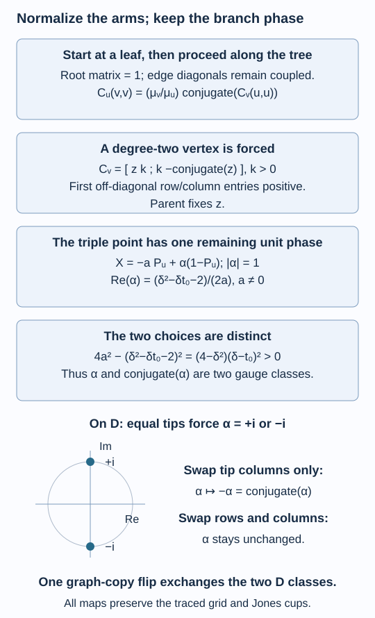

# A branching matrix determines the connection

A tree lets us determine a connection one vertex at a time. After the edge bases have been chosen, every degree-two matrix is forced. At a triple point only one unit-circle phase remains, and its real part is fixed. This gives two conjugate choices on the branching Dynkin graphs. On a fork, interchanging its two tips in one graph copy exchanges the choices.

We prove the gauge calculation explicitly, including its effect on the full path grid. The matrices are the two unitary families of [Two unitary matrices build a path grid](connections-and-path-grids.md). We also use [Graphs below norm two and a corner obstruction](graphs-below-two.md) and [The principal graph records fusion multiplicities](bimodules-and-principal-graphs.md). The primary comparison is [Kawahigashi, Section 3].

Construction and proof sources: The four cell orientations and traced path grid are proved in [Two unitary matrices build a path grid](connections-and-path-grids.md). Lemmas 36.1–36.3 below give the coupled local matrices, actual four-edge gauges and rooted normal form; Theorem 36.4 counts the labelled connection classes. Proposition 36.5 and Corollary 36.7 compare the whole traced grid under the tip flip, while Proposition 36.6 proves the dual root using [The principal graph records fusion multiplicities](bimodules-and-principal-graphs.md). Reconstruction for arbitrary inclusions is Theorem 37.5 of [An inclusion determines its connection](reconstructing-the-connection.md). Kawahigashi, Section 3, Theorem 3.1 remains the branching-matrix comparison; a labelled biunitary class count alone makes no flatness assertion.

## On a tree, the cells are local matrices

Let \(\Gamma\) be a finite connected tree with a positive Perron vector \(\mu\) and value \(1<\delta<2\). Use the four labelled copies of \(\Gamma\) and the coefficients \(w\) of lesson 32. For each even vertex \(v\), define a matrix on its neighbours by

\[
C_v(b,c)=w(v,b,c,v).
\tag{36.1}
\]

For each odd vertex \(v\), use the rotated matrix

\[
C_v(a,d)=\frac{\sqrt{\mu_a\mu_d}}{\mu_v}\,
\overline{w(a,v,v,d)}.
\tag{36.2}
\]

These matrices are unitary by (32.2). The row and column labels come from different graph copies, although their underlying neighbour names agree.

**Lemma 36.1.** A connection on this tree is equivalent to the following local data:

\[
\begin{aligned}
C_v&\text{ is unitary},\\
|C_v(u,t)|&=\frac{\sqrt{\mu_u\mu_t}}{\mu_v}\quad(u\ne t),\\
C_u(v,v)&=\frac{\mu_v}{\mu_u}\,
\overline{C_v(u,u)}\quad(u\sim v).
\end{aligned}
\tag{36.3}
\]

Every diagonal entry is nonzero. If \(t=\mu_u/\mu_v\), then

\[
|C_v(u,u)|^2=1-\delta t+t^2
=\left(t-\frac{\delta}{2}\right)^2+1-\frac{\delta^2}{4}>0.
\tag{36.4}
\]

**Proof.** A permitted four-sided cell in a tree has either its opposite even vertices equal or its opposite odd vertices equal. Otherwise its four distinct vertices would form a cycle. Also two distinct vertices have at most one common neighbour.

For distinct neighbours \(u,t\) of an even \(v\), the opposite rotated matrix has size one. Its unitarity forces the modulus in (36.3). For an odd \(v\), the original endpoint-fixed matrix has size one and forces the same modulus for (36.2). The diagonal coupling in (36.3) is precisely the overlap of (36.1) and (36.2) on a single edge. It also holds with the endpoints interchanged.

Conversely, define every cell using (36.1) if its even opposite corners agree, and solve (36.2) for the cell if its odd opposite corners agree. The edge coupling makes the two definitions coincide when both agree. The larger matrices in (32.2) are the specified \(C_v\). Every other nonempty matrix has size one; the off-diagonal modulus in (36.3) makes that scalar unitary. Thus the complete biunitarity conditions hold.

Finally, the squared off-diagonal moduli in row \(u\) sum to
\[
\frac{\mu_u}{\mu_v^2}
\left(\sum_{t\sim v}\mu_t-\mu_u\right)
=\delta t-t^2.
\]
Subtracting from the unit row norm proves (36.4). The strict final inequality uses \(\delta<2\). \(\square\)

## Four edge bases describe the gauge

For an edge between even \(a\) and odd \(b\), choose four unit phases
\(H_0(a,b),V_0(a,b),V_1(a,b),H_1(a,b)\). They are the basis phases for the top, left, right and bottom graph copies in the initial cell. An edge traversed backwards has the conjugate phase. The transformed coefficient is

\[
w'(a,b,c,d)=
H_0(a,b)V_1(d,b)\,
\overline{V_0(a,c)H_1(d,c)}\,w(a,b,c,d).
\tag{36.5}
\]

This is a change of the input and output path bases. It acts on each local matrix by row and column phases,
\(C'_v=R_vC_vS_v\), where the entries of the diagonal matrices are

\[
\begin{array}{c|cc}
v& R_v(u)&S_v(u)\\ \hline
a\text{ even}&H_0(a,u)V_1(a,u)&
\overline{V_0(a,u)H_1(a,u)}\\
b\text{ odd}&V_0(u,b)\overline{H_0(u,b)}&
H_1(u,b)\overline{V_1(u,b)} .
\end{array}
\tag{36.6}
\]

In particular, on an edge \(e=(u,v)\),

\[
R_u(v)S_u(v)\,R_v(u)S_v(u)=1.
\tag{36.7}
\]

**Lemma 36.2.** Every family of local row and column phases satisfying (36.7) is realized by four edge phases in (36.5). Gauge changes preserve the entire traced path grid, its embeddings, expectations, Jones projections and flatness.

**Proof.** On one edge write the desired even-end phases as \(r_a,s_a\) and the odd-end phases as \(r_b,s_b\). Set
\[
H_0=1,\qquad V_0=r_b,\qquad V_1=r_a,\qquad
H_1=(r_bs_a)^{-1}.
\]
Formula (36.6) gives \(r_a,s_a,r_b\) and
\(s_b=(r_ar_bs_a)^{-1}\), the required value by (36.7). Choices on different edges are independent.

For the grid assertion, give a coloured path \(\alpha\) the product \(\chi(\alpha)\) of its oriented edge phases, and let \(G_\omega\alpha=\chi(\alpha)\alpha\) for each word \(\omega\). Equation (36.5) says exactly that a local swap becomes
\(G_{hv}WG_{vh}^*\), with the earlier prefix and later suffix carried along. It follows for every rectangle by multiplying the swaps. Thus conjugation by \(G_\omega\) gives the algebra isomorphisms between the two path grids.

Appending the same edge to two paths with a common endpoint multiplies both phases by the same number. It cancels in their matrix unit, so these isomorphisms commute with append embeddings. All diagonal path units and their positive trace weights are unchanged. Hence all expectations are carried to their counterparts by trace uniqueness.

In a backtracking cup the two oriented edge phases multiply to one. Each cup vector (32.13), after an earlier prefix, is therefore changed only by that prefix's phase. Its rank-one projection is preserved. These are the marked Jones projections in both directions. Finally the isomorphisms preserve commutation of the two embedded axes, which is precisely flatness. They extend normally to each row's tracial closure. \(\square\)

The inverse phases in (36.7) matter. Independent local row and column changes without this coupling need not come from a connection gauge.

## Normalize from a leaf

Choose a leaf as root and orient the tree away from it. At each nonroot vertex, list its parent neighbour first. Normalize its first off-diagonal row and column entries to positive real numbers.

**Lemma 36.3.** Each gauge class has a unique local-matrix normal form with root matrix \(1\) and these positive first-row and first-column entries.

At a degree-two vertex this normal form is

\[
C_v=\begin{pmatrix}z&k\\k&-\overline z\end{pmatrix},
\qquad
k=\frac{\sqrt{\mu_{\mathrm{parent}}\mu_{\mathrm{child}}}}{\mu_v}>0.
\tag{36.8}
\]

The entry \(z\) is forced by the parent edge coupling. Before the first branching vertex all these diagonal entries are real.

**Proof.** The root matrix is a unit scalar. Multiply it by its inverse, and compensate by the inverse diagonal product at its neighbour, using Lemma 36.2. This makes it \(1\) and fixes the next first diagonal entry through (36.3).

Suppose the matrix at a visited parent has been normalized. Its nonzero edge diagonal determines the child's first diagonal \(z\). At the child, row and column phases on that first index must have product one. Choose those two phases to be one. For each other index \(j\), independently choose the column phase to make \(C_v(0,j)\) positive and the row phase to make \(C_v(j,0)\) positive. All those entries are nonzero by their prescribed moduli.

Each resulting row-column product on an unvisited child edge is compensated at the other end of that edge. Since the graph is a tree, that endpoint is unvisited and no earlier normalization is changed. This inductively constructs the normal form on the entire graph.

For uniqueness, compare two normalized data sets related by row and column phases. The root scalar \(1\) forces their product on its edge to be one, hence also at the next endpoint by (36.7). At a nonroot vertex the nonzero first diagonal again forces \(r_0s_0=1\). Positivity of every first-row and first-column entry then gives
\(r_j=r_0\), \(s_j=s_0\) for every other index. These are a scalar matrix and its inverse, so they change no entry of the local matrix. Their outgoing diagonal products are one. Induction proves equality everywhere. The nonvanishing in (36.4) justifies this argument even after a branch.

For degree two the off-diagonal entries have the same positive modulus \(k\). Orthogonality of the two rows forces the other diagonal to be \(-\overline z\), giving (36.8). Its norm equation is already (36.4). The root-neighbour first diagonal is positive real. Edge coupling and (36.8) then propagate real diagonals, with alternating signs, until a branch is reached. \(\square\)

## A triple point leaves one phase

Assume there is at most one degree-three vertex \(v\), with every other degree at most two. List the parent neighbour first and put

\[
t_j=\frac{\mu_{u_j}}{\mu_v},\quad j=0,1,2,
\qquad
t_0+t_1+t_2=\delta.
\]

The first diagonal \(a\) is a nonzero real number. The normalized matrix has the form

\[
C_v=
\begin{pmatrix}
a&b&c\\
b&x_{11}&x_{12}\\
c&x_{21}&x_{22}
\end{pmatrix},
\qquad X=(x_{ij})_{i,j=1}^2,
\qquad
b=\sqrt{t_0t_1},\quad c=\sqrt{t_0t_2},
\quad a^2=1-\delta t_0+t_0^2.
\tag{36.9}
\]

Here \(X\) denotes the bottom-right \(2\times2\) block. Put
\(u=(b,c)^{\mathsf T}/\sqrt{b^2+c^2}\), and let
\(P_u=uu^*\).

**Theorem 36.4.** The full branching block is determined by one phase:

\[
X=-aP_u+\alpha(1-P_u),\qquad |\alpha|=1,
\tag{36.10}
\]

\[
\operatorname{Re}\alpha
=\frac{\delta^2-\delta t_0-2}{2a}.
\tag{36.11}
\]

There are exactly two conjugate, distinct values of \(\alpha\). The tree consequently has exactly two labelled gauge classes if it has a triple point, and exactly one if it is a path.

**Proof.** The unitary matrix in (36.9) maps the vector consisting of the first basis vector into
\((a,\sqrt{b^2+c^2}\,u)\). Orthogonality of its first row and column gives
\[
Xu=-au,\qquad X^*u=-au.
\]
Thus \(u^\perp\) reduces \(X\). On the span of the first basis vector and \(u\), the full matrix is the real unitary
\[
\begin{pmatrix}a&\sqrt{b^2+c^2}\\
\sqrt{b^2+c^2}&-a\end{pmatrix},
\]
because \(a^2+b^2+c^2=1\). The remaining one-dimensional subspace must carry a unit scalar \(\alpha\). This proves (36.10), including symmetry of \(X\); symmetry was not an extra assumption.

Its off-diagonal entry is
\[
X_{12}=-(a+\alpha)\frac{bc}{b^2+c^2}.
\]
The modulus required by (36.3) is \(\sqrt{t_1t_2}\). Since
\(bc/(b^2+c^2)=\sqrt{t_1t_2}/(t_1+t_2)\), it follows that
\[
|a+\alpha|=t_1+t_2=\delta-t_0.
\]
Squaring, using \(a^2=1-\delta t_0+t_0^2\) and \(|\alpha|=1\), proves (36.11).

There are two distinct unit-circle choices because
\[
4a^2-(\delta^2-\delta t_0-2)^2
=(4-\delta^2)(\delta-t_0)^2>0.
\tag{36.12}
\]
The equality follows by expanding both sides; positivity uses
\(\delta<2\) and \(t_1+t_2>0\). Thus the real part in (36.11) lies strictly between \(-1\) and \(1\).

After the branch each arm has only degree-two vertices followed by a leaf. Its first diagonal is fixed by edge coupling; (36.8) then determines every later matrix. There is no further choice. Hence Lemma 36.3 gives at most two gauge classes.

Existence of a connection for these graphs follows directly from Proposition 32.5, with
\(\epsilon=i\exp[-i\arccos(\delta/2)/2]\).
Its complex conjugate is also a connection. Conjugation commutes with the leaf normalization: the positive row and column entries remain positive and the root remains \(1\). It sends the nonreal branching phase to its conjugate. The two normal forms are distinct, so they give both classes. On a path the same normalization has no branch; all matrices are forced and real, and the explicit connection supplies its one class. \(\square\)

This proves the labelled connection count for \(D_\ell\), \(\ell\geq4\), and \(E_6,E_7,E_8\), and for paths \(A_\ell\), \(\ell\geq3\). The index-one \(A_2\) finite connection is likewise a unique scalar gauge class. A biunitary connection count makes no flatness assertion; in particular \(E_7\)'s two classes cannot be flat at an admissible root, by Theorem 20.7 and Theorem 33.2.

## The fork flip exchanges the choices

Root \(D_{r+2}\), \(r\geq2\), at the endpoint of its long arm. At its branching vertex the other two neighbours are leaves. Their relative weights are

\[
t_1=t_2=\delta^{-1},\qquad t_0=\delta-2\delta^{-1}.
\tag{36.13}
\]

Equation (36.11) therefore gives \(\operatorname{Re}\alpha=0\), so
\(\alpha=+i\) or \(-i\). With \(b=c\), (36.9)–(36.10) become

\[
C_v=
\begin{pmatrix}
a&b&b\\
b&(-a+\alpha)/2&(-a-\alpha)/2\\
b&(-a-\alpha)/2&(-a+\alpha)/2
\end{pmatrix}.
\tag{36.14}
\]

**Proposition 36.5.** Interchanging the two tips in one appropriate graph copy exchanges the two labelled \(D\) gauge classes. It fixes the distinguished roots and induces an isomorphism of the complete path grids, preserving their traces and marked Jones projections.

**Proof.** If the branch is odd, \(C_v\) is the rotated matrix (36.2). Its columns are in the opposite even graph copy. Flip just that copy's two even tips. This swaps the last two columns of (36.14), giving the same normalized matrix with \(\alpha\) replaced by \(-\alpha=\overline\alpha\). All first row and column entries stay positive because \(b=c\).

The long-arm matrices are unchanged. The two leaf scalar matrices are forced by their new edge diagonals, so they become the conjugates of their former values, exactly the other normal form. If the branch is even, use one of the odd graph copies for the column flip of (36.1); the same calculation applies.

These tip exchanges preserve every edge and Perron weight. They fix the root and its distinguished first neighbour. Applying the permutation at that graph-copy position sends each coloured path to a path of the same word and weight. It conjugates swaps, commutes with append embeddings and preserves the normalized cup vectors. Thus it gives the asserted grid isomorphism, just as the basis changes in Lemma 36.2 do. In particular it preserves flatness. \(\square\)

The flip here is in **one graph copy**. Swapping both tip rows and tip columns simultaneously leaves (36.14) unchanged and does not exchange its phase. Keeping the four copies distinct is essential.

*Figure 36.1. Lemmas 36.1–36.3 give the edge-diagonal coupling and the unique leaf normalization. The block \(X=-aP_u+\alpha(1-P_u)\) has the fixed real part (36.11); identity (36.12) proves its two phase choices are distinct. On \(D\), equal tip weights force \(\alpha=\pm i\), and one graph-copy column flip exchanges them. All gauge and flip maps preserve the full traced and marked grid. Theorem 36.4 and Proposition 36.5. [Editable figure source](figures/tree-gauge-branch.py).*

## The dual fork has the same shape

We next verify that an arbitrary inclusion with an even-fork principal graph has that same dual graph. This is a necessary input when applying the connection calculation to standard invariants.

**Proposition 36.6.** If a finite-index II₁ inclusion has endpoint-rooted principal graph \(D_{2n}\), \(n\geq2\), then its dual principal graph is also \(D_{2n}\), with the root at the end of the long arm. Its nonterminal odd labels are the conjugates of the original odd labels at the same distances.

**Proof.** Put \(X={}_NL^2(M)_M\). Conjugating an odd alternating word gives
\[
\overline{(X\otimes_M\overline X)^{\otimes_N j}\otimes_N X}
\cong
(\overline X\otimes_N X)^{\otimes_M j}\otimes_M\overline X.
\tag{36.15}
\]
Associativity and conjugate reversal therefore preserve the number of odd irreducible classes reached at each odd length, and their first occurrence lengths, just as in Lemma 28.1.

Both graphs have finite depth and the same norm, by lessons 12 and 14. Their common Coxeter number is \(h=4n-2\). The graph and root theorem 20.7 leaves \(D_{2n}\) and \(A_{4n-3}\), with the additional possibility \(E_8\) only when \(n=8\). The number \(h\) is never \(12\), so \(E_6\) is absent, and \(E_7\) has already been excluded.

The original fork has \(n-1\) odd vertices: they are the chain vertices at distances \(1,3,\ldots,2n-3\); its two tips have even distance \(2n-2\). The path candidate has \(2n-2\) odd vertices. Those total counts differ for every \(n\geq2\). At \(n=8\), the fork has seven odd vertices, whereas longest-arm-rooted \(E_8=T(1,2,4)\) has four. To count the latter, its branching vertex is at distance four; the long arm contributes two odd vertices, the short arm one, and the medium arm one. Thus the exceptional candidate also fails (36.15).

The dual graph must be the same rooted fork. Each odd distance on its chain has exactly one new class, so (36.15) identifies it with the conjugate original class at that distance. \(\square\)

## What the grid comparison determines

**Corollary 36.7.** All flat four-copy connections on a fixed endpoint-rooted \(D_{2n}\) give isomorphic factor inclusions under the construction of lesson 32. The isomorphism preserves the complete Jones tower and both structured relative-commutant rows.

**Proof.** Theorem 36.4 and Proposition 36.5 relate any two such connections by gauge and root-preserving graph-copy maps. Lemma 36.2 and the path permutation in Proposition 36.5 supply compatible trace-preserving isomorphisms at every finite grid position, with the common Jones projections. They extend normally to all actual factor row closures and towers from Theorem 32.4. Taking relative commutants inside those tower isomorphisms preserves both rows, their traces and marked projections. \(\square\)

To apply this comparison to all inclusions with that principal graph, one also needs the reconstruction statement: their full standard invariant must supply the four-copy connection and be recovered, with both rows, by its path grid. Proposition 36.6 identifies the two graph shapes. The finite gauge calculation alone does not supply that reconstruction. Conversely, a principal-graph count without the marked-grid comparison would not suffice for Theorem 17.6. [An inclusion determines its connection](reconstructing-the-connection.md), Theorem 37.5, proves the reconstruction with its exact trace normalization and Jones projections; Corollary 37.6 then completes the even-D count.

## Exercises

**Exercise 36.1 — introductory.** Why is nonvanishing of the edge diagonal needed for uniqueness of the normal form? Prove it under the stated hypotheses.

**Solution.** At a visited edge a preserved diagonal \(z\) gives
\(r_0zs_0=z\), hence \(r_0s_0=1\) only if \(z\ne0\). Positivity of the first row and column then forces all row phases to equal \(r_0\) and all column phases to equal its inverse. Without that first equality an extra freedom could survive. Formula (36.4) gives
\(|z|^2=(t-\delta/2)^2+1-\delta^2/4>0\), since \(\delta<2\). Thus every edge in the proof has the required nonzero diagonal.

**Exercise 36.2 — intermediate.** Find the eigenvalues of the normalized branching matrix on its three-dimensional space.

**Solution.** Let \(s=\sqrt{b^2+c^2}\). On the span of the first basis vector and \(u\), its matrix is
\(\left(\begin{smallmatrix}a&s\\s&-a\end{smallmatrix}\right)\), whose square is \(I\) because \(a^2+s^2=1\); its eigenvalues are \(+1,-1\). On \(u^\perp\) the matrix acts by \(\alpha\). Thus the eigenvalues are \(1,-1,\alpha\). The two connection choices have the same forced two-dimensional block and conjugate unit scalars on the remaining line.

**Exercise 36.3 — advanced.** For \(D_6\), compute \(a^2,b^2\) in (36.14). Explain which tip permutation conjugates the matrix.

**Solution.** Here \(\delta^2=(5+\sqrt5)/2\) and the branch is three edges from the long-arm root, so its parent diagonal \(a\) is positive. Equations (36.9) and (36.13) give
\[
a^2=4/\delta^2-1=1-2/\sqrt5,\qquad
b^2=1-2/\delta^2=1/\sqrt5.
\]
They satisfy \(a^2+2b^2=1\). The branch phase is \(\alpha=\pm i\). Swapping only the last two columns interchanges \((-a+\alpha)/2\) and \((-a-\alpha)/2\), giving the complex conjugate matrix. Swapping the same two rows as well restores the original matrix. The exchanging permutation belongs to one graph copy, as required by Proposition 36.5.

**Exercise 36.4 — intermediate.** At the norm of \(D_{16}\), why can the dual graph be neither the path candidate nor \(E_8\)?

**Solution.** Its Coxeter number is \(30\). The path candidate is \(A_{29}\), with fourteen odd vertices. The original \(D_{16}\) has seven, while \(E_8\), rooted at its longest-arm endpoint, has four. Conjugation of all odd alternating words preserves the complete number of odd irreducible classes. Neither candidate has the required count, so the dual is \(D_{16}\).

## References

- Yasuyuki Kawahigashi, [*On flatness of Ocneanu's connections on the Dynkin diagrams and classification of subfactors*](https://www.ms.u-tokyo.ac.jp/~yasuyuki/flat.pdf), Section 3, Theorem 3.1 and its branching-matrix proof.

*Written by GPT-6.1 Sol (OpenAI), Ultra reasoning effort, September 2026. Self-checked by the writing AI. Public domain (CC0).*
