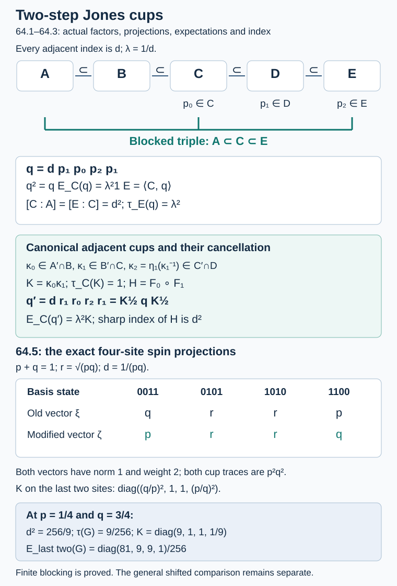

# Two-step cups and composed expectation densities

Taking every second factor of a Jones tower gives another Jones tower. Its cup is a normalized word of four original cups. For canonical modified cups, the same word implements the composition of two expectations, with a product density and sharp index equal to the square of the one-step index. We prove these assertions inside the prescribed factors and calculate the full weighted-spin example.

We use [finite-index multiplicativity](module-dimension-and-local-index.md), [downward recognition](towers-and-tunnels.md), [finite common bases](finite-bases-and-positive-index.md), and [canonical cup rescaling and inverse dual density](canonical-rescaling-of-jones-cups.md), 63.1–63.5. All algebras below are II₁ factors with their compatible normalized traces. The primary reference for blocking is Pimsner and Popa, [*Iterating the basic construction*](https://imar.ro/~increst/1986/37_1986.pdf), Theorem2.6; the linked INCREST37/1986 preprint has its definition and proof on printed pp.6,10–11. Popa's [*Classification of amenable subfactors of type II*](https://doi.org/10.1007/BF02392646), printed p.238, supplies a separate comparison argument.

## Blocking two consecutive steps

Write a consecutive portion of any tracial Jones tower or tunnel as
\[
A\subset B\subset C\subset D\subset E.
\tag{64.1}
\]
Every adjacent index is \(d\), and \(\lambda=d^{-1}\). Let \(p_0\in C\), \(p_1\in D\), \(p_2\in E\) be the Jones projections for \(A\subset B\), \(B\subset C\), \(C\subset D\), respectively. Thus
\[
\begin{gathered}
p_i^2=p_i=p_i^*,\\
p_0p_2=p_2p_0,\\
p_ip_{i+1}p_i=\lambda p_i
\end{gathered}
\tag{64.2}
\]
with the reverse adjacent relations as well.

**Theorem 64.1.** The operator
\[
q=d\,p_1p_0p_2p_1\in A'\cap E
\tag{64.3}
\]
is the Jones projection for the blocked inclusion \(A\subset C\). In particular,
\[
\begin{gathered}
{[C:A]}=[E:C]=d^2,\\
\tau_E(q)=\lambda^2,\quad E_C(q)=\lambda^2 1,\\
qxq=E_A(x)q\quad(x\in C),\\
E=\langle C,q\rangle .
\end{gathered}
\tag{64.4}
\]
Here \(E_A:C\to A\) is the trace-preserving expectation.

**Proof.** Put \(a=p_0\), \(b=p_1\), \(c=p_2\). The two outside projections commute, and
\[
acbac=acbca=\lambda aca=\lambda ac.
\]
Consequently \((bacb)^2=\lambda bacb\); multiplication by \(d^2\) proves \(q^2=q\). It is self-adjoint since \(ac\) is self-adjoint. Each \(p_i\) commutes with \(A\), so \(q\in A'\cap E\).

The tracial expectations onto \(D\) and \(C\) give
\[
\begin{gathered}
E_D(q)=d\,p_1p_0E_D(p_2)p_1\\
=p_1p_0p_1=\lambda p_1,\\
E_C(q)=\lambda E_C(p_1)=\lambda^2 1.
\end{gathered}
\tag{64.5}
\]
Multiplicativity gives both indices in (64.4). Downward recognition4.5, applied to the pair \(C\subset E\) and this \(q\), identifies
\(P=\{q\}'\cap C\), proves \([C:P]=d^2\), and realizes \(E\) as the basic construction of \(P\subset C\) with its actual projection \(q\). Since \(A\subset P\subset C\) and \([C:A]=[C:P]\), multiplicativity gives \([P:A]=1\), hence \(P=A\). All of (64.4), including generation and compression, follows from that recognition. No finite depth or extremality was used. \(\square\)

For the signed convention of Lesson4, a block with smallest algebra \(M_a\) has middle \(M_{a+2}\), upper \(M_{a+4}\), and projection
\[
Q_a=d\,e_{a+2}e_{a+1}e_{a+3}e_{a+2}.
\tag{64.6}
\]
Here \(a\) is any integer. Consecutive blocks have \(a,a+2,a+4,\ldots\), not \(a,a+1,a+2,\ldots\). Theorem 64.1 identifies every consecutive blocked triple as an actual basic construction; therefore Lesson4.2 gives
\[
\begin{gathered}
Q_aQ_{a+2}Q_a=\lambda^2Q_a,\\
Q_{a+2}Q_aQ_{a+2}=\lambda^2Q_{a+2}.
\end{gathered}
\tag{64.7}
\]
Blocked projections with starting indices separated by at least four commute. These assertions concern the actual tower, including its designated projections.

The bare word \(W=p_1p_0p_2p_1\) instead satisfies
\[
\begin{gathered}
W^2=\lambda W,\quad q=dW,\\
\tau_E(W)=\lambda^3.
\end{gathered}
\tag{64.8}
\]
It is a projection exactly at \(d=1\). This distinction matters when comparing a source's unnormalized cup word.

## Three canonical cups give one rescaled blocked cup

Let \(\kappa_0\in Z(A'\cap B)\), \(\kappa_1\in Z(B'\cap C)\), and \(\kappa_2\in Z(C'\cap D)\) be the canonical densities in 63.1 for the three adjacent inclusions. Let
\[
\begin{gathered}
r_i=\kappa_i^{1/2}p_i\kappa_i^{1/2},\\
F_i(x)=E_{\text{lower}_i}(\kappa_i x).
\end{gathered}
\tag{64.9}
\]
Thus \(F_0:B\to A\), \(F_1:C\to B\), \(F_2:D\to C\). The densities are normalized in their own containing factors. Proposition63.4 identifies the dual density of \(B\subset C\) with \(\kappa_2\):
\[
\begin{gathered}
\kappa_2=\eta_1(\kappa_1^{-1}),\\
\eta_1(x)=J_Cx^*J_C\\
(x\in B'\cap C).
\end{gathered}
\tag{64.10}
\]
This formula is transported through the actual finite identification \(D=\langle C,p_1\rangle\); it asserts no normal representation of the entire infinite tower on \(L^2(C)\).

**Theorem 64.2.** Put
\[
\begin{gathered}
K=\kappa_0\kappa_1,\quad H=F_0\circ F_1,\\
q'=d\,r_1r_0r_2r_1.
\end{gathered}
\tag{64.11}
\]
Then \(K\) is positive invertible in \(A'\cap C\), \(\tau_C(K)=1\), and
\[
\begin{gathered}
H(x)=E_A(K^{1/2}xK^{1/2})\\
=E_A(Kx),\\
q'=K^{1/2}qK^{1/2}\in A'\cap E,\\
(q')^2=q',\quad \tau_E(q')=\lambda^2,\\
q'xq'=H(x)q',\\
\langle C,q'\rangle=E.
\end{gathered}
\tag{64.12}
\]
The expectation \(H\) is faithful and normal and has sharp positive index \(d^2\).

**Proof of the density and composition.** Since \(\kappa_1\) commutes with \(B\), it commutes with \(\kappa_0\). Both densities commute with \(A\). Their product is thus positive, invertible and belongs to \(A'\cap C\). The relative commutation gives \(E_B(\kappa_1)=1\), so
\(\tau_C(K)=\tau_B(\kappa_0)=1\).
The \(B\)-bimodularity of \(E_B\) and \(E_AE_B=E_A\) give
\[
F_0F_1(x)
=E_A\!\left(\kappa_0E_B(\kappa_1x)\right)
=E_A(\kappa_0\kappa_1x).
\]
Since \(K\) commutes with \(A\), this equals its symmetric expression in (64.12), by the finite trace pairing as in 63.2. That expression proves complete positivity, normality and faithfulness; normalization proves it fixes \(A\).

**Proof of the operator identity.** Left multiplication by \(x\in B'\cap C\) and right multiplication by \(x\) agree on \(L^2(B)\). Applying this on the range of \(p_1\), and taking adjoints, gives
\[
\eta_1(x)p_1=xp_1,\qquad
p_1\eta_1(x)=p_1x.
\]
The factors \(\kappa_1,\kappa_2\) commute, because \(\kappa_2\in C'\cap D\). Equation(64.10) therefore implies
\[
\begin{gathered}
p_1\kappa_1^{1/2}\kappa_2^{1/2}=p_1,\\
\kappa_2^{1/2}\kappa_1^{1/2}p_1=p_1.
\end{gathered}
\tag{64.13}
\]
Also \(\kappa_0\) commutes with \(p_1,p_2,\kappa_1,\kappa_2\), and \(\kappa_2\) commutes with \(p_0\). Expanding the four modified projections, moving only those commuting factors, and using (64.13), yields
\[
\begin{gathered}
L=\kappa_1^{1/2}\kappa_2^{1/2},\quad
R=\kappa_2^{1/2}\kappa_1^{1/2},\\
r_1r_0r_2r_1\\
=K^{1/2}p_1L\,p_0p_2R\,p_1K^{1/2}\\
=K^{1/2}p_1p_0p_2p_1K^{1/2}.
\end{gathered}
\tag{64.14}
\]
This proves the second line of (64.12). Apply the general rescaling theorem63.2 to the blocked tracial inclusion \(A\subset C\), of index \(d^2\), and the normalized density \(K\). It supplies the actual projection, trace, compression and generation assertions. In particular \(q=K^{-1/2}q'K^{-1/2}\), so generation refers to the same prescribed upper factor. The exact index proof follows next. \(\square\)

## A finite composed basis and an actual sharp witness

Choose tracial common bases \((a_\beta)\subset C\) for \(C/B\) and \((b_\alpha)\subset B\) for \(B/A\), including both reconstruction identities and
\(\sum_\beta a_\beta a_\beta^*=d1\),
\(\sum_\alpha b_\alpha b_\alpha^*=d1\).
The canonical bases of 63.3 are
\[
\begin{gathered}
v_\beta=a_\beta\kappa_1^{-1/2},\\
u_\alpha=b_\alpha\kappa_0^{-1/2}.
\end{gathered}
\tag{64.15}
\]
Their index sums are again \(d1\).

**Proposition 64.3.** The finite family
\[
w_{\beta\alpha}=v_\beta u_\alpha
=a_\beta b_\alpha K^{-1/2}
\tag{64.16}
\]
is a common basis for \(H:C\to A\). It satisfies
\[
\begin{gathered}
x=\sum_{\beta,\alpha}w_{\beta\alpha}H(w_{\beta\alpha}^*x)\\
 =\sum_{\beta,\alpha}H(xw_{\beta\alpha})w_{\beta\alpha}^*,\\
\sum_{\beta,\alpha}w_{\beta\alpha}q'w_{\beta\alpha}^*=1,\\
\sum_{\beta,\alpha}w_{\beta\alpha}w_{\beta\alpha}^*=d^2 1.
\end{gathered}
\tag{64.17}
\]
If \(\rho_{A,C}\) denotes the normalized finite-commutant trace on \(A'\cap C\) used in 63.1, then
\[
\begin{gathered}
\rho_{A,C}(K^{-1})=1,\\
H(x)\ge d^{-2}x\quad(x\in C_+).
\end{gathered}
\tag{64.18}
\]
The coefficient \(d^{-2}\) is optimal.

**Proof.** To prove the first reconstruction, use \(B\)-bimodularity of \(F_1\) to get
\[
\begin{gathered}
y_\beta=F_1(v_\beta^*x),\\
\sum_\alpha u_\alpha F_0(u_\alpha^*y_\beta)=y_\beta,\\
\sum_{\beta,\alpha}v_\beta u_\alpha H(u_\alpha^*v_\beta^*x)\\
=\sum_\beta v_\beta y_\beta=x.
\end{gathered}
\]
Taking adjoints gives the second identity. Since \(\kappa_1\) commutes with \(b_\alpha,\kappa_0\), (64.16) follows in its stated right order. The same composition argument for the trace expectations makes \((a_\beta b_\alpha)\) a tracial common basis of \(C/A\). Hence Theorem 64.1 and the basic-construction basis identity give
\[
\sum_{\beta,\alpha}w_{\beta\alpha}q'w_{\beta\alpha}^*
=\sum_{\beta,\alpha}a_\beta b_\alpha q b_\alpha^*a_\beta^*
=1.
\]
Their index sum also follows directly:
\[
\begin{gathered}
\sum_{\beta,\alpha}v_\beta u_\alpha u_\alpha^*v_\beta^*\\
=d\sum_\beta v_\beta v_\beta^*=d^2 1.
\end{gathered}
\tag{64.19}
\]
Applying the transfer formula63.3 to \(C/A\), with tracial index \(d^2\) and density \(K\), identifies this sum with
\(d^2\rho_{A,C}(K^{-1})1\). This proves the first equation(64.18). The same finite-basis Schwarz inequality in 63.3 proves its positive-operator bound.

For sharpness, downward construction4.4 supplies an actual triple \(S\subset A\subset C\) with downward cup \(t\in C\) for the index-\(d^2\) inclusion \(S\subset A\), and \(E_A(t)=d^{-2}1\). The finite representation-independent cup functional62.2, as used for the witness in63.3, gives
\[
tK^{-1}t=\rho_{A,C}(K^{-1})t=t.
\]
Thus
\[
z=K^{-1/2}tK^{-1/2}
\tag{64.20}
\]
is a nonzero actual projection in \(C\), and
\(H(z)=E_A(t)=d^{-2}1\).
If \(H(x)\ge cx\) for every \(x\ge0\), compression at \(z\) gives
\(d^{-2}z\ge cz\), hence \(c\le d^{-2}\). This proves the optimal coefficient and completes Theorem 64.2's index assertion. \(\square\)

Let \(\kappa_{A,C}\) be the canonical density of the entire blocked inclusion, and let \(\eta_{A,C}:A'\cap C\to C'\cap E\) be its finite reflection. The general rescaling formulas give the exact two expectation targets:
\[
\begin{gathered}
E_C(q')=\lambda^2K,\\
E_{C'\cap E}(q')\\
=\lambda^2\eta_{A,C}(K\kappa_{A,C}^{-1}).
\end{gathered}
\tag{64.21}
\]
The composed expectation is tracial exactly when \(K=1\). The upper relative cup expectation is scalar exactly when \(K=\kappa_{A,C}\). The unchanged index alone does not establish that identification. [Theorem66.3 and Corollary66.4](canonical-density-transitivity.md) prove \(K=\kappa_{A,C}\) for every such inclusion by balancing the concrete duality closures. Hence the upper relative expectation of this composed cup is always scalar.

## The finite comparison must respect normalized words

**Proposition 64.4.** Suppose a specified finite linear *-isomorphism or *-anti-isomorphism \(\gamma\) takes \(r_i\) to tracial Jones projections \(s_i\) with the same parameter \(\lambda\), for \(i=0,1,2\). Then
\[
\begin{gathered}
\gamma(q')=d\,s_1s_2s_0s_1\\
=d\,s_1s_0s_2s_1.
\end{gathered}
\tag{64.22}
\]
The output is the normalized blocked projection, provided the \(s_i\) have the corresponding consecutive tower endpoints. Its two-step index is \(d^2\). If \(\gamma\) also preserves the trace, it carries the trace \(\lambda^2\) of \(q'\) to the same trace on that output.

**Proof.** Linearity fixes the real scalar \(d\). An isomorphism preserves the word order, while an anti-isomorphism reverses it. Distant commutation interchanges \(s_0,s_2\), making the two resulting words equal. Theorem 64.1, with the stated output endpoints, proves the projection and index assertions. Trace preservation gives the final claim. No existence of \(\gamma\) is inferred. \(\square\)

This is a check on any future finite comparison. Popa1994 printed p.238 uses the word \(e_3e_2e_4e_3\) in the two-step argument and calls it the Jones projection for the upper pair \(M_2\subset M_4\). His upward projections start at \(e_1\in M_1\), whereas Lesson4 starts at \(e_0\in M_1\). To keep the notations distinct, call his projections \(\varepsilon_i=e_{i-1}\). With normalized one-step projections and \(d>1\), the actual blocked projection is
\[
\begin{gathered}
d\,\varepsilon_3\varepsilon_2\varepsilon_4\varepsilon_3\\
=d\,e_2e_1e_3e_2=Q_0\in M_4.
\end{gathered}
\tag{64.23}
\]
Its actual basic-construction triple is \(M_0\subset M_2\subset M_4\), by(64.6) with \(a=0\). The upper pair named in the source has these same endpoints. The bare word is \(\lambda\) times that projection. The scalar-expectation argument on that page is unaffected by multiplying the word by \(d\); the original page's word must nevertheless be normalized before calling it a projection. This is a bounded normalization clarification, not an endpoint objection or a proof or refutation of the separate noncanonical comparison cited there.

For Popa's main p.224 comparison one must still construct the actual finite anti-isomorphisms and check their two endpoints, inherited traces and cup images. [Lesson65](finite-shifted-comparisons-without-coherence.md) proves the analytic bicommutant implication without coherence between finite maps or a normal comparison limit. Proposition 64.4 supplies the word calculation when its specified one-step maps exist; the blocked criterion65.14 can instead use the blocked cup images directly.

## An exact two-step weighted-spin calculation

Use the actual weighted-spin tunnel of Lessons47 and62, with \(p,q>0\), \(p+q=1\), \(r=\sqrt{pq}\), \(d=(pq)^{-1}\). On the two-site basis \(00,01,10,11\), the old and modified cups have only the \(01,10\) block nonzero:
\[
\begin{gathered}
f=\begin{pmatrix}q&r\\r&p\end{pmatrix},\\
g=\begin{pmatrix}p&r\\r&q\end{pmatrix}.
\end{gathered}
\tag{64.24}
\]
Here each displayed matrix is its nonzero two-dimensional block. Put \(f_1=f\otimes1_4\), \(f_2=1_2\otimes f\otimes1_2\), \(f_3=1_4\otimes f\) on four sites, and define \(g_1,g_2,g_3\) likewise. The blocked operators are
\[
\begin{gathered}
Q=d\,f_2f_1f_3f_2,\\
G=d\,g_2g_1g_3g_2.
\end{gathered}
\tag{64.25}
\]
They are rank-one projections onto the unit vectors
\[
\begin{aligned}
\xi&=q|0011\rangle+r|0101\rangle\\
   &\quad+r|1010\rangle+p|1100\rangle,\\
\zeta&=p|0011\rangle+r|0101\rangle\\
   &\quad+r|1010\rangle+q|1100\rangle .
\end{aligned}
\tag{64.26}
\]
Their squared norms are \(q^2+2pq+p^2=1\). A direct calculation is short: apply \(f_2\) to
\((\sqrt q|01\rangle+\sqrt p|10\rangle)^{\otimes2}\).
The \(0110,1001\) components vanish; the other two components give \(r\xi\). Thus \(f_2f_1f_3f_2=pq|\xi\rangle\langle\xi|\), proving the first assertion. Reversing \(p,q\) gives the second.

The product density on the last two sites is
\[
\begin{gathered}
K=\operatorname{diag}\\
\bigl((q/p)^2,\,1,\,1,\,(p/q)^2\bigr).
\end{gathered}
\tag{64.27}
\]
It sends \(\xi\) to \(\zeta\) under \(1_4\otimes K^{1/2}\): the last-two-site labels of \(0011\) and \(1100\) are \(11\) and \(00\), respectively. Consequently \(G=(1_4\otimes K^{1/2})Q(1_4\otimes K^{1/2})\), exactly as in 64.2.

Every vector in (64.26) has total weight two. In the actual four-site relative-commutant algebra, the inherited trace on each minimal projection of this weight block is \(p^2q^2\). Hence both blocked cups have inherited trace \(\lambda^2=p^2q^2\). On the last two sites the inherited weights are \(p^2,pq,pq,q^2\), and the normalized opposite weights from62.6 are \(q^2,pq,pq,p^2\). Their ratio is precisely (64.27), so this example also proves \(K=\kappa_{A,C}\).

Weighted partial trace over the first two sites gives
\[
\begin{gathered}
E_{\text{last two}}(G)\\
=\operatorname{diag}(q^4,p^2q^2,p^2q^2,p^4)\\
=\lambda^2K.
\end{gathered}
\tag{64.28}
\]
Weighted partial trace over the last two sites gives \(\lambda^2 1\) on the first two. Compressing the six matrix units of the last-two-site algebra
\(\mathbb C\oplus\operatorname{Mat}_2\oplus\mathbb C\) by \(G\) gives the product expectation with reversed weights \((q,p)^{\otimes2}\). The two-step index is \(d^2=(p^2q^2)^{-1}\).

At \(p=1/4,q=3/4\), the two-step index is \(256/9\), the inherited cup trace is \(9/256\), and \(K=\operatorname{diag}(9,1,1,1/9)\). The middle-factor expectation of \(G\) has coefficients \(81/256,9/256,9/256,1/256\); its upper relative expectation is \((9/256)1\). At \(p=q=1/2\), \(K=1\), \(Q=G\), and the index is \(16\). These explicit calculations do not establish the general comparison.

## Exercises with complete solutions

### Exercise 64.1 — the missing scalar (basic)

If the adjacent index is \(d=3\), determine the bare word's square and trace and the normalized blocked index and cup trace.

**Solution.** Here \(\lambda=1/3\), so \(W^2=W/3\), \(\tau(W)=1/27\). The projection is \(q=3W\), with trace \(1/9\); the blocked index is \(9\).

### Exercise 64.2 — the integer labels (basic)

Which projection implements \(M_{-4}\subset M_{-2}\), and in which factor does it lie? Which blocked projection is next upward?

**Solution.** Formula(64.6) gives \(Q_{-4}=d\,e_{-2}e_{-3}e_{-1}e_{-2}\in M_0\). The next is \(Q_{-2}=d\,e_0e_{-1}e_1e_0\in M_2\). Their adjacent relations have parameter \(d^{-2}\). The middle level names the blocked inclusion's projection only after the full four-step endpoints are specified.

### Exercise 64.3 — the basis order (intermediate)

Explain why the composed basis is \(a_\beta b_\alpha K^{-1/2}\), and compute its index sum.

**Solution.** The two modified bases multiply as
\(a_\beta\kappa_1^{-1/2}b_\alpha\kappa_0^{-1/2}\).
Since \(b_\alpha,\kappa_0\in B\) commute with \(\kappa_1\), this is \(a_\beta b_\alpha K^{-1/2}\). No commutation of \(a_\beta\) with a density is used. Summing the inner \(u_\alpha u_\alpha^*\) gives \(d1\), then summing \(v_\beta v_\beta^*\) gives another \(d1\); the result is \(d^2 1\).

### Exercise 64.4 — an actual optimal-bound test (advanced)

With \(z\) as in(64.20), prove directly that \(z\) is a projection and forces the optimal coefficient.

**Solution.** The already proved identity \(tK^{-1}t=t\) gives
\(z^2=K^{-1/2}tK^{-1}tK^{-1/2}=z\).
It is self-adjoint and nonzero by invertibility of \(K\). Its symmetric expectation is \(H(z)=E_A(t)=d^{-2}1\). Compressing any proposed inequality \(H(z)\ge cz\) by \(z\) gives \(d^{-2}z\ge cz\); thus \(c\le d^{-2}\). 64.3 supplies the inequality at that coefficient.

### Exercise 64.5 — the explicit spin numbers (intermediate)

In the spin model take \(p=1/3,q=2/3\). Compute \(d^2\), the blocked cup trace, \(K\), and its middle-factor expectation.

**Solution.** \(d=9/2\), so \(d^2=81/4\), \(\lambda^2=4/81\), and \(K=\operatorname{diag}(4,1,1,1/4)\). Equation(64.28) gives \(\operatorname{diag}(16/81,4/81,4/81,1/81)\). The upper relative expectation is \((4/81)1\).

### Exercise 64.6 — the remaining comparison obligation (advanced)

Does the existence of \(q'\), with the same upper factor and exact index \(d^2\), construct a trace-preserving comparison to an upward blocked tower?

**Solution.** No. 64.1–64.3 construct the actual lower blocked cup, composed expectation, basis and optimal bound. 64.4 calculates the image only if a specified finite anti-isomorphism already exists with the designated one-step cup images and output endpoints. The general bicommutant criterion65.14 still requires its finite maps, inherited traces and prescribed blocked cup image, or a vanishing \(L^2\) image error. It needs no coherence between the maps or normal comparison limit. [Corollary66.4](canonical-density-transitivity.md) now identifies the general blocked density and makes the second expectation in(64.21) scalar. The unchanged index alone supplies no trace-preserving map.

## Figure and comparison scope

**Figure 64.1.** The factor endpoints and cup containment are exact; the positions are schematic. 64.1 proves the normalized four-cup projection and its index. 64.2–64.3 prove the density product, inverse-dual cancellation, composed basis and sharp bound. The four-site vectors and weights are the exact full-parameter calculation in 64.5. The diagram records these proved mechanisms; it represents no new comparison map. [Reproducible source](figures/two-step-cup-blocking.py).

The two-step basic construction, composed modified expectation and sharp index have now been established inside the actual factors. A general trace-preserving comparison still needs its finite maps, designated endpoints and cup images. [Lesson65](finite-shifted-comparisons-without-coherence.md) proves that the bicommutant implication needs no coherence between these maps or normal comparison limit. The calculations here supply its exact blocked input and normalization.
