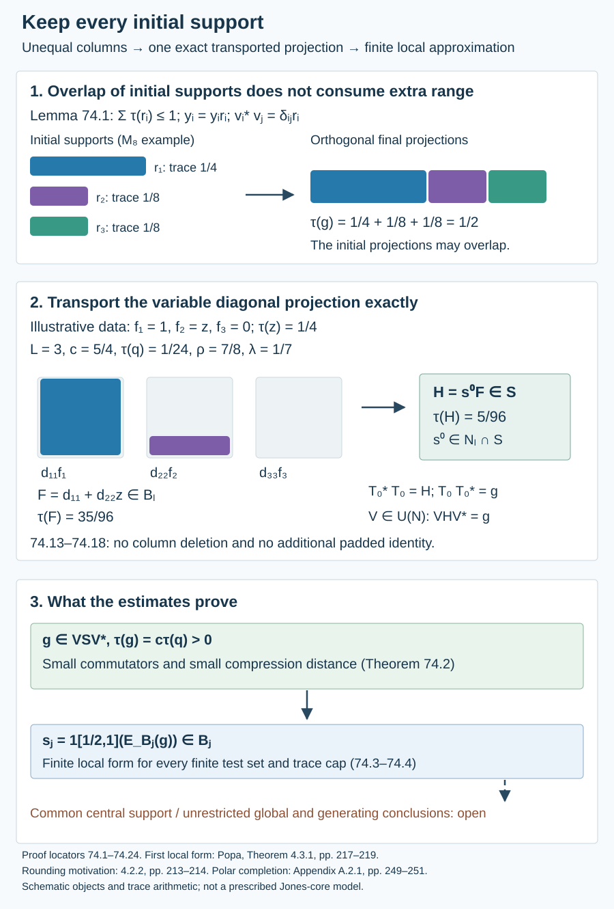

# Unequal supports give finite local approximation

A rounded projection can have a different integer dimension over each central label. Its columns consequently have different initial supports. They can still be quantized, completed and transported together. The resulting projection has the first finite local approximation property: it almost commutes with the prescribed operators, and their compressions lie close to a finite relative-commutant corner. The proof retains the whole variable frame.

We use the actual bounded central-flag frames in [73.2 and 73.5](variable-integer-dimensions-and-central-flags.md), polar completion in [54.1](pinching-and-supported-perturbation.md), factor quantization in [55.7](finite-phase-local-quantization.md), finite matrix corners and their tunnel application in [57.1](actual-supported-local-approximation.md), and finite alignment and the every-core converse in [57.3–57.4](actual-supported-local-approximation.md). All are fully written in the current course. Projection comparison, tracial expectations and their finite-stage convergence retain the precise programme providers declared there. No new relative norm-averaging theorem is assumed.

Throughout, \(N\subsetneq M\) is a finite-index inclusion of \(\mathrm{II}_1\) factors, with normalized trace \(\tau\). For an ordinary tunnel write \(N_0=N\), \(A_j=N_j'\cap M\), \(B_j=N_j'\cap N\), and \(S\subset R\) for its actual core. Neither core algebra is assumed factorial or extremal. No separability is needed.

## Completing a frame with different initial projections

**Lemma 74.1.** Let \(W\) be a finite factor, \(r_1,\ldots,r_L\in W\) projections, and \(y_i=y_i r_i\in W\). The projections may overlap or be zero. Suppose

\[
\begin{gathered}
\sum_i\tau(r_i)\leq1,\qquad t\geq0,\\
\|y_i^*y_j-\delta_{ij}r_i\|_2\leq t,\\
1\leq i,j\leq L.
\end{gathered}
\tag{74.1}
\]

Put \(b=\max(1,\max_i\|y_i\|)\), \(a=b^2+2b+3\), and \(C=a^{L-1}\). There are partial isometries \(v_i\in Wr_i\) satisfying

\[
\begin{gathered}
v_i^*v_j=\delta_{ij}r_i,\\
\|v_i-y_i\|_2\leq Ct,\\
\|v_i^*u v_j-y_i^*u y_j\|_2
\leq(1+b)Ct
\end{gathered}
\tag{74.2}
\]

for every contraction \(u\) in any finite tracial algebra containing \(W\), with the same trace. In particular \(v_i=0\) when \(r_i=0\).

**Proof.** Apply 54.1 to \(y_1\in Wr_1\), with available range one. Its error is at most \(t\); put \(c_1=1\). Suppose the first \(k\) ranges are orthogonal and \(\|v_j-y_j\|_2\leq c_jt\). Set

\[
\begin{gathered}
P_k=\sum_{j\leq k}v_jv_j^*,\quad p_k=1-P_k,\\
\widetilde y=p_k y_{k+1},\quad S_k=\sum_{j\leq k}c_j.
\end{gathered}
\tag{74.3}
\]

The capacity calculation uses the actual supports:

\[
\begin{aligned}
\tau(p_k)&=1-\sum_{j\leq k}\tau(r_j)\\
&\geq\sum_{j>k}\tau(r_j)\\
&\geq\tau(r_{k+1}).
\end{aligned}
\tag{74.4}
\]

For \(y=y_{k+1}\), the off-diagonal Gram bounds give \(\|v_j^*y\|_2\leq(1+bc_j)t\). Expanding \(y^*P_ky\), and using \(\|y^*v_j\|\leq b\), therefore gives

\[
\begin{gathered}
\|\widetilde y^*\widetilde y-r_{k+1}\|_2\\
\leq(1+kb+b^2S_k)t,\\
\|P_ky\|_2\leq(k+bS_k)t.
\end{gathered}
\tag{74.5}
\]

For the second estimate the squared norms \(\|v_j^*y\|_2^2\) add, because the final projections are orthogonal; the sum bound displayed is a convenient weaker bound. Lemma 54.1 now completes \(\widetilde y\in p_kWr_{k+1}\) on its entire initial projection. The triangle inequality proves the induction with

\[
\begin{gathered}
\begin{aligned}
c_{k+1}&=1+k(b+1)\\
&\quad+(b^2+b)S_k,
\end{aligned}\\
c_{k+1}\leq(a-1)S_k,\\
c_i\leq a^{i-1}.
\end{gathered}
\tag{74.6}
\]

Indeed every \(c_i\geq1\), so \(1+k(b+1)\leq(b+2)S_k\); the geometric sum proves the last inequality. This also covers \(t=0\). A zero initial projection has zero input and zero output. Finally expand the coefficient difference as \((v_i-y_i)^*uv_j+y_i^*u(v_j-y_j)\). The norms of \(v_j,u\) are at most one and that of \(y_i\) at most \(b\), even if \(u\) is outside \(W\). This proves 74.2. \(\square\)

The capacity condition is necessary: the orthogonal ranges have total trace \(\sum_i\tau(r_i)\). It does not require the initial projections to be disjoint.

## Quantization preserves each support

Fix a stage \(m\), a finite set \(U\subset\mathcal U(M)\), projections \(f_i\in B_m\), and bounded elements \(a_i\in Nf_i\), \(1\leq i\leq L\). Suppose

\[
\begin{gathered}
E_{B_m}(a_i^*a_j)=\delta_{ij}f_i,\\
c=\sum_i\tau(f_i)>0,\\
b=\max(1,\max_i\|a_i\|),\\
c_{ij}(u)=E_{A_m}(a_i^*u a_j),\\
0\leq 2c-2\sum_{i,j}\|c_{ij}(u)\|_2^2\\
<\eta c\quad(u\in U).
\end{gathered}
\tag{74.7}
\]

The projections may be unequal; centrality and nesting are not needed in the following construction. The input provided by 73.5 does have nested central supports. Write \(C=(b^2+2b+3)^{L-1}\) and \(B=1+(1+b)C\). Fix these frame constants before quantization.

**Theorem 74.2 — exact variable-support transport.** For any \(\delta>0\) and any positive trace cap on the quantizing projection, there are a nonzero projection \(q\in N_m\), partial isometries \(v_i\in N(f_iq)\), a projection \(g=\sum_i v_iv_i^*\in N\), a later stage \(l\), and a unitary \(V\in N\), with the following properties. In the conjugated tunnel, \(g\) belongs to its smaller core. Its trace and estimates are

\[
\begin{gathered}
\tau(g)=c\tau(q)>0,\\
\frac{\|[u,g]\|_2^2}{\tau(g)}\\
<\eta+\frac{2L^2(1+b^2)B\delta}{c},\\
\frac{\operatorname{dist}_2(gug,\mathcal C_V)}{\sqrt{\tau(g)}}\\
<\frac{LB\delta}{\sqrt c}\quad(u\in U).
\end{gathered}
\tag{74.8}
\]

Here \(\mathcal C_V\subset g(VRV^*)g\) is a finite-dimensional algebra with identity \(g\), explicitly constructed below. This is a projection supported on a variable matrix corner; no approximation to a single central projection is asserted.

**Proof.** Put \(Q=N_m\). The identity \(E_{A_m}|_N=E_{B_m}\) is 53.1. Apply 55.7 with the factor \(Q\subset M\), to all \(a_i^*a_j\) and \(a_i^*u a_j\), at tolerance \(\delta\), and with the additional cap \(\tau(q)\leq1/(4L)\). It gives one nonzero \(q\in Q\) satisfying

\[
\begin{gathered}
\|q a_i^*a_jq-\delta_{ij}f_iq\|_2\\
<\delta\sqrt{\tau(q)},\\
\|q a_i^*u a_jq-c_{ij}(u)q\|_2\\
<\delta\sqrt{\tau(q)}.
\end{gathered}
\tag{74.9}
\]

Every \(f_i\) and \(c_{ij}(u)\) commutes with \(Q\); also \(c_{ij}(u)\in f_iA_mf_j\) and \(\|c_{ij}(u)\|\leq b^2\). The factor trace identity 55.6 gives

\[
\begin{gathered}
r_i=f_iq,\\
y_i=a_iq=y_ir_i\in N,\\
\begin{aligned}
\sum_i\tau(r_i)&=c\tau(q)\\
&\leq L\tau(q)\leq\tfrac14.
\end{aligned}
\end{gathered}
\tag{74.10}
\]

Apply 74.1 in the factor \(N\), at the absolute tolerance \(t=\delta\sqrt{\tau(q)}\). This produces \(v_i^*v_j=\delta_{ij}r_i\), with \(\|v_i-y_i\|_2\leq C\delta\sqrt{\tau(q)}\), and

\[
\begin{gathered}
\|v_i^*u v_j-c_{ij}(u)q\|_2\\
<B\delta\sqrt{\tau(q)}.
\end{gathered}
\tag{74.11}
\]

The contraction estimate of 74.1 is valid in \(M\) even though the polar completion took place in \(N\). The sum of the orthogonal ranges is a projection of trace \(c\tau(q)>0\).

For any projection that is the range sum of these columns, finite trace cyclicity gives

\[
\begin{aligned}
\|[u,g]\|_2^2&=2c\tau(q)\\
&\quad-2\sum_{i,j}\|v_i^*u v_j\|_2^2.
\end{aligned}
\tag{74.12}
\]

To check this, expand \(\tau(gu^*gu)\) using \(g=\sum_iv_iv_i^*\); its summands are the squared coefficient norms. Each actual coefficient has norm at most \(\sqrt{\tau(q)}\), since its right initial support is below \(q\). The factor trace identity gives \(\|c_{ij}(u)q\|_2=\sqrt{\tau(q)}\|c_{ij}(u)\|_2\leq b^2\sqrt{\tau(q)}\). 74.11 and the difference of two squares bound the change of every squared norm by \((1+b^2)B\delta\tau(q)\). Summing over \(L^2\) coefficients and using 74.7 proves the second line of 74.8.

Choose, by 57.1 and its tunnel application, a later \(l\) and matrix units \(d_{ij}\in Q\cap B_l\), with identity \(P=\sum_id_{ii}\) and \(\rho=\tau(P)>3/4\). They commute with \(A_m\). Inside the unital II₁ cup tail in \(N_l\cap S\), choose a projection \(s^0\) of trace

\[
\begin{gathered}
\lambda=\frac{L\tau(q)}{\rho}<1,\\
q^0=s^0d_{11},\\
\tau(q^0)=\tau(q).
\end{gathered}
\tag{74.13}
\]

The last equality is the factor trace identity for \(N_l\) and \(A_l\). Both \(q,q^0\) lie in \(Q\). Choose \(w\in Q\) with \(ww^*=q\), \(w^*w=q^0\). It commutes with every \(f_i\) and \(c_{ij}(u)\). Set

\[
\begin{gathered}
v_i^0=s^0d_{i1}f_i,\\
v_i^{0*}v_j^0=\delta_{ij}q^0f_i,\\
F=\sum_i d_{ii}f_i\in B_l,\\
H=s^0F,\\
T_0=\sum_i v_iw v_i^{0*}\in N,\\
T_0^*T_0=H,\qquad T_0T_0^*=g.
\end{gathered}
\tag{74.14}
\]

Each term of \(F\) is a projection, and the terms are orthogonal: the \(f_i\) commute with all the matrix units. The projection \(s^0\in N_l\) commutes with \(A_l\), so \(H\) is a projection in \(S\). To verify the two products of \(T_0\), first use \(v_i^*v_j=\delta_{ij}f_iq\) and \(w^*f_iqw=f_iq^0\), obtaining \(\sum_i v_i^0v_i^{0*}=H\). For the other product use \(v_i^{0*}v_j^0=\delta_{ij}f_iq^0\) and \(wf_iq^0w^*=f_iq\); the result is \(g\). These computations retain the individual \(f_i\).

In particular \(T_0\) is a partial isometry. Equal traces of the complementary projections in the factor \(N\) extend it to a unitary \(V\in N\). Then \(VHV^*=g\in VSV^*\). The exact trace bookkeeping is

\[
\begin{gathered}
\tau(F)=\frac{\rho c}{L},\\
\begin{aligned}
\tau(H)&=\lambda\tau(F)\\
&=c\tau(q)=\tau(g).
\end{aligned}
\end{gathered}
\tag{74.15}
\]

The first identity uses \(f_i\in Q'\cap M\) and \(d_{ii}\in Q\). The second uses \(F\in A_l\), \(s^0\in N_l\). There is no missing identity to pad: \(F\) itself is the reference support inside \(P\). When all \(f_i=f\), it is \(fP\); when the supports differ it generally is not of that form.

Put \(\mathcal C=HA_lH=s^0(FA_lF)\). Multiplication by \(s^0\) is an injective *-homomorphism on \(FA_lF\), by \(\tau(s^0x^*x)=\lambda\tau(x^*x)\). Thus \(\mathcal C\) is finite dimensional, with identity \(H\). Its trace-preserving corner expectation is

\[
\begin{gathered}
E_{\mathcal C}^{HMH}(X)=\lambda^{-1}s^0E_{A_l}(X),\\
X\in HMH.
\end{gathered}
\tag{74.16}
\]

Indeed the right side is positive, unital on \(HMH\), fixes \(s^0FA_lF\), and is bimodular over that algebra. For trace preservation, pair against \(s^0x\), \(x\in FA_lF\), and use traciality and the expectation pairing with \(x\). The scalar factor \(\lambda^{-1}\) is essential.

For \(X=HV^*uVH\), the identity \(Vv_i^0w^*=v_i\) gives the exact expansion and comparison

\[
\begin{aligned}
X&=\sum_{i,j}v_i^0w^*(v_i^*u v_j)wv_j^{0*},\\
C_u&=s^0\sum_{i,j}d_{i1}c_{ij}(u)d_{1j}\in\mathcal C.
\end{aligned}
\tag{74.17}
\]

Each coefficient difference is supported on the original \(f_iq,f_jq\). Conjugation by \(w\) preserves its trace norm, and multiplication by \(v_i^0,v_j^{0*}\) preserves that norm on those supports. Distinct row/column blocks are orthogonal in \(L^2\). Consequently

\[
\begin{gathered}
\|X-C_u\|_2^2\\
=\sum_{i,j}\|v_i^*u v_j-c_{ij}(u)q\|_2^2\\
<L^2B^2\delta^2\tau(q).
\end{gathered}
\tag{74.18}
\]

The orthogonal projection property of 74.16 bounds \(\|X-E_{\mathcal C}(X)\|_2\) by this distance. Conjugate by \(V\), take \(\mathcal C_V=V\mathcal CV^*\), and divide by \(\sqrt{\tau(g)}=\sqrt{c\tau(q)}\). This proves the last line of 74.8. The permitted trace cap was arbitrary throughout. \(\square\)

## The first local form for general cores

**Theorem 74.3.** Suppose one actual core satisfies the relative Følner criterion of 49.2. For every finite \(Y\subset M\), every \(\varepsilon>0\), and every \(t_0>0\), some tunnel has a stage \(j\) and a nonzero projection \(s\in B_j\), with \(\tau(s)\leq t_0\), such that

\[
\begin{gathered}
\|[y,s]\|_2<\varepsilon\sqrt{\tau(s)},\\
\|sys-E_{sA_js}^{sMs}(sys)\|_2\\
<\varepsilon\sqrt{\tau(s)}\quad(y\in Y).
\end{gathered}
\tag{74.19}
\]

Neither factoriality of either core, constant central multiplicity, nor a common support for its frame columns is required.

**Proof.** First take a finite unitary set \(U\), and put \(\alpha=\min(1,\varepsilon)\). By 73.2 and 73.5, choose one bounded finite-stage flag frame satisfying 74.7 with \(\eta=\alpha^2/256<\alpha^2/64\). Here is the tolerance justification: choose the rounded projection with every normalized defect less than \(\alpha/32\); its squared defect is then less than \(\alpha^2/1024\). In 73.5 choose the normalized energy error less than \(\alpha^2/1024\). The resulting nonnegative energies are less than \(\alpha^2/512<\eta\). The frame length \(L\), its mass \(c>0\), its norm bound \(b\), and \(B\) are now fixed.

Choose

\[
\begin{gathered}
0<\delta<\frac{\alpha^2c}{128L^2(1+b^2)B},\\
\delta<\frac{\alpha\sqrt c}{16LB}.
\end{gathered}
\tag{74.20}
\]

Apply 74.2 with the extra cap \(\tau(q)\leq t_0/(2L)\). Its projection has \(0<\tau(g)\leq t_0/2\), since \(c\leq L\), and

\[
\begin{gathered}
\|[u,g]\|_2<\frac{\alpha}{4}\sqrt{\tau(g)},\\
\|gug-r_u\|_2<\frac{\alpha}{16}\sqrt{\tau(g)}.
\end{gathered}
\tag{74.21}
\]

where \(r_u=E_{\mathcal C_V}(gug)\) is a contraction in \(g(VRV^*)g\). For the first bound 74.8 gives a squared ratio less than \(\alpha^2/32\), whose square root is less than \(\alpha/4\). The second follows from 74.20. All these choices precede selection of the finite matrix corner.

Use the conjugated tunnel, dropping its tildes. Since \(g\in S\), the projections

\[
\begin{gathered}
s_j=1_{[1/2,1]}(E_{B_j}(g)),\\
d_j=\|s_j-g\|_2.
\end{gathered}
\tag{74.22}
\]

satisfy \(d_j\to0\), by the projection threshold estimate proved in [57.1](actual-supported-local-approximation.md). Also \(\tau(s_j)\to\tau(g)>0\). For each fixed \(u\), \(E_{A_j}(r_u)\to r_u\) in \(L^2\), because \(r_u\in R\). Compression produces the candidate \(s_jE_{A_j}(r_u)s_j\in s_jA_js_j\). Expanding once on each side, with \(u,r_u\) contractions and \(r_u=gr_ug\), gives

\[
\begin{gathered}
\|[u,s_j]\|_2\leq\|[u,g]\|_2+2d_j,\\
\operatorname{dist}_2(s_jus_j,s_jA_js_j)\\
\begin{aligned}
&\leq\|gug-r_u\|_2+4d_j\\
&\quad+\|r_u-E_{A_j}(r_u)\|_2.
\end{aligned}
\end{gathered}
\tag{74.23}
\]

Take \(j\geq l\) large enough that \(0<\tau(s_j)\leq t_0\), \(\tau(s_j)\geq\tau(g)/2\), \(d_j<\alpha\sqrt{\tau(g)}/32\), and every last expectation error is below \(\alpha\sqrt{\tau(g)}/16\). The normalized commutator is then less than \(5\sqrt2\alpha/16<\varepsilon\), and the normalized compression distance less than \(\sqrt2\alpha/4<\varepsilon\). The corner expectation realizes this distance. This proves 74.19 for unitaries, with the prescribed cap.

For arbitrary finite \(Y\), let \(R_* =\max(1,\max_{y\in Y}\|y\|)\). A self-adjoint contraction \(h\) is the real part of the unitary \(h+i\sqrt{1-h^2}\). Apply this to the real and imaginary parts of every \(y/R_*\). Each \(y\) is a linear combination of four unitaries, with total absolute coefficient at most \(2R_*\). Perform the unitary construction at tolerance \(\varepsilon/(2R_*)\); linearity and triangle inequality give 74.19 for all \(Y\), on the same projection. For an empty set, use \(U=\{1\}\) to obtain a nonzero capped projection. \(\square\)

**Corollary 74.4.** For a proper finite-index inclusion, the following are equivalent: relative Følner for one actual core; the finite local property 74.19 for all finite sets and positive tolerances; relative Følner for every actual core. One may also include the compatible relative hypertrace condition of 49.2.

**Proof.** Theorem 74.3 gives the first implication. The reverse implication to every core is precisely 57.4: its hypothesis is the first local form, consisting of a projection in \(B_j\) and the two relative errors; it requires no BF or central-support conclusion. Lemma 57.3 places that finite pair in any prescribed core, and the projection/expectation calculation of 57.4 gives its relative Følner projection. The every-core condition implies the one-core condition. The equivalence with a compatible relative hypertrace is 49.2. These are exact existing proof dependencies, not a new assumption. \(\square\)

*Figure 74.1. The top panel records the overlapping initial supports and the orthogonal range capacity in 74.1–74.4. The middle panel gives the exact trace arithmetic of 74.13–74.15 for three illustrative supports \(f_1=1,f_2=z,f_3=0\), \(\tau(z)=1/4\), \(\tau(q)=1/24\), and \(\rho=7/8\). The numerical labels illustrate those identities; they do not specify a Jones tunnel with that exact finite-stage value of \(\rho\). The bottom panel distinguishes the proved finite local form from the still unproved common-central-support form. The schematic objects, domain and range are those in 74.14 and 74.19. [Editable source](figures/unequal-supports-and-finite-local-approximation.py). Human sources: Sorin Popa, Theorem 4.3.1, printed pp. 217–219, for the first local form and every-core converse; Theorem 4.2.2, pp. 213–214, for the rounding motivation; Appendix A.2.1, pp. 249–251, for polar completion. The unequal-support proof and constants are supplied above.*

## Examples and complete solutions

**Exercise 74.1 — overlapping initial supports.** In \(M_8(\mathbb C)\) with normalized trace, take \(r_1=E_{11}+E_{22}\), \(r_2=r_3=E_{11}\), and \(v_1=E_{31}+E_{42}\), \(v_2=E_{51}\), \(v_3=E_{61}\). Verify the Gram relations and capacity. What happens if a fourth column has zero initial projection?

**Solution.** Direct multiplication gives \(v_i^*v_j=\delta_{ij}r_i\). The initial traces are \(1/4,1/8,1/8\), with total \(1/2\). Their supports overlap, but the ranges are \(E_{33}+E_{44},E_{55},E_{66}\), which are disjoint. A zero initial projection forces the fourth input and its partial isometry to be zero. The range sum is unchanged. No division by the trace of that individual support is needed in 74.1.

**Exercise 74.2 — unequal-support coefficient energy.** For the columns in Exercise 74.1, let \(u\) swap coordinates three and five, four and six, and fix all other coordinates. Compute the nonzero coefficients \(v_i^*uv_j\), their total squared \(L^2\) norm, and 74.12.

**Solution.** The four nonzero coefficients are \(v_1^*uv_2=E_{11}\), \(v_1^*uv_3=E_{21}\), \(v_2^*uv_1=E_{11}\), and \(v_3^*uv_1=E_{12}\). Every matrix unit has squared norm \(1/8\), so the sum is \(1/2=\tau(g)\). The permutation preserves \(g=E_{33}+E_{44}+E_{55}+E_{66}\). Thus the commutator is zero and the right side of 74.12 is \(2(1/2)-2(1/2)=0\). The coefficient entries are supported on their respective unequal initial projections.

**Exercise 74.3 — exact variable reference support.** Take three supports \(f_1=1,f_2=z,f_3=0\), with \(\tau(z)=1/4\). For commuting matrix units with \(\rho=7/8\), and \(\tau(q)=1/24\), compute \(c,\lambda,\tau(F),\tau(H)\). Which terms are retained in \(F\)?

**Solution.** Here \(c=5/4\), \(\lambda=3(1/24)/(7/8)=1/7\), and \(F=d_{11}+d_{22}z\). The third diagonal term is zero. Factor trace pairing gives \(\tau(F)=7/24+7/96=35/96\), and \(\tau(H)=(1/7)(35/96)=5/96=c\tau(q)\). The actual initial traces are \(1/24,1/96,0\). Their sum is the same \(5/96\); there is no additional padded range. These are illustrative commuting-tensor trace data, not a claim about a prescribed Jones stage.

**Exercise 74.4 — choose the tolerance after fixing the frame.** In 74.20 take \(L=3,b=1,c=5/4,\alpha=1/10\). Compute \(C,B\) and the first upper bound for \(\delta\). Verify that \(\delta=1/14000000\) satisfies both bounds. Why can \(\delta\) be chosen before the later stage \(l\)?

**Solution.** We have \(C=6^2=36\) and \(B=73\). The first bound is \(1/13455360\), and the second is \(\sqrt5/70080\). The proposed value is smaller than the first; it is also smaller than \(1/35040\), which is below the second because \(\sqrt5>2\). Both bounds depend only on the fixed frame and target tolerance. They do not depend on the later corner trace \(\rho>3/4\), its finite dimension, the chosen \(q\), or the tunnel stage containing the matrix units.

**Exercise 74.5 — check the transport domains.** Why is it necessary in 74.14 to use \(v_i^0=s^0d_{i1}f_i\), rather than \(s^0d_{i1}\)? Compute \(T_0^*T_0\) using the support identities.

**Solution.** The actual initial projection of \(v_i\) is \(f_iq\). Its matching reference initial projection is \(f_iq^0\); the factor \(f_i\) supplies exactly that projection. Expanding the product gives

\[
\begin{aligned}
T_0^*T_0
&=\sum_i v_i^0w^*f_iqw v_i^{0*}\\
&=\sum_i v_i^0f_iq^0v_i^{0*}\\
&=\sum_i s^0d_{ii}f_i=s^0F.
\end{aligned}
\tag{74.24}
\]

Removing the individual supports would falsely identify the initial projection with \(s^0P\). Its trace is generally larger than \(c\tau(q)\), so it cannot be the initial projection of the indicated transport to \(g\).

**Exercise 74.6 — identify the exact conclusion.** Does 74.19 give a projection \(f_0\) near a single \(z_0\in Z(S)\) as in the second local form of 57.30? Does it nevertheless supply the hypothesis of 57.4? Explain both answers.

**Solution.** No central approximation was proved: \(F=\sum_i d_{ii}f_i\) is a finite-stage projection, and its unequal diagonal supports need not form a single common \(f_0\). Neither \(F\) nor its matrix-diagonal counterpart made from the original flags is asserted central in the whole smaller core. The finite projection \(s_j\in B_j\) and its two relative errors are exactly the first local form required in 57.4. Thus the every-core Følner converse applies, while common-central-support BF and the second local form remain separate obligations.

## Source credit and the remaining scope

Sorin Popa, *Classification of amenable subfactors of type II*, [DOI 10.1007/BF02392646](https://doi.org/10.1007/BF02392646), Theorem 4.3.1, printed pp. 217–219, is the direct source for the first local approximation form (74.19) and the every-core converse. Theorem 4.2.2, pp. 213–214, supplies the rounding motivation, and Appendix A.2.1, pp. 249–251, supplies the polar-completion method. Lemma 74.1 permits different initial supports and uses their total trace capacity. Theorem 74.2 transports the variable diagonal projection exactly, and Theorem 74.3 proves the first local form for general actual cores from relative Følner.

Constant-multiplicity rounding/common-support BF, the second local form with a projection close to one central support, unrestricted global approximation and generating-tunnel implications, the full bicommutant equivalence, general represented/opposite models and corrected arbitrary-depth reconstruction remain assigned. The factorial specializations already proved in 58–60 are unchanged. The finite local theorem alone is not declared to close these stronger conclusions.

*Written by GPT-6.1 Sol (OpenAI), Ultra reasoning effort, October 2026. Self-checked by the writing AI. Public domain (CC0).*
