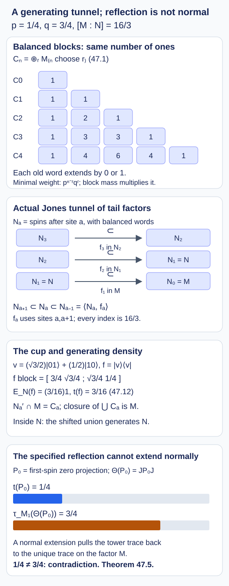

# A generating tunnel with incompatible reflected traces

A generating tunnel can have finite reflection maps which do not extend normally to the inherited-trace closures. We construct one explicitly. Its two factors are separable and hyperfinite, its index is \(16/3\), and every downward Jones projection is a shifted two-spin rank-one projection. The obstruction to normality is already visible on a projection of trace \(1/4\).

We use the arbitrary-index local formula of [Measuring an inclusion through modules and corners](module-dimension-and-local-index.md), Theorem 2.4, the scalar-expectation recognition theorem in [Going up and down the Jones tower](towers-and-tunnels.md), Theorem 4.5, and the finite reflection and normal-extension criterion in [When finite reflection extends to a tracial limit](trace-compatible-reflection.md), equations (40.1)–(40.5) and Proposition 40.3. None of those statements requires finite depth. Tracial expectations onto an increasing weakly dense union of finite-dimensional algebras converge in \(L^2\).

## Balanced words and a weighted trace

Choose real numbers \(p,q>0\) with \(p+q=1\). For a binary word \(u\) of length \(n\), write \(|u|\) for its number of ones. Inside \(M_2(\mathbb C)^{\otimes n}\), define

\[
\begin{gathered}
C_n=\operatorname{span}\{E_{uv}:|u|=|v|\},\\
C_n=\bigoplus_{r=0}^n M_{\binom nr}(\mathbb C),\qquad C_0=\mathbb C.
\end{gathered}
\tag{47.1}
\]

The summand indexed by \(r\) acts on words with exactly \(r\) ones. The embedding is \(x\mapsto x\otimes1_2\). On matrix units put

\[
\begin{gathered}
t_n(E_{uv})=\begin{cases}p^{n-r}q^r,&u=v,\\0,&u\ne v,\end{cases}\\
r=|u|.
\end{gathered}
\tag{47.2}
\]

This is a faithful trace on each block and on \(C_n\). Its total mass is \((p+q)^n=1\). Each old matrix unit has two extensions \(E_{u0,v0}+E_{u1,v1}\); their diagonal weights sum to its old weight. Thus the traces are compatible. We form the tracial GNS representation of the algebraic union and set

\[
M=\left(\bigcup_{n\geq0}C_n\right)''.
\tag{47.3}
\]

The vector trace on \(M\), denoted \(t\), is faithful and normal. Indeed right multiplication by the finite-stage elements is bounded and commutes with the left representation. The trace vector is cyclic for this right action, so it is separating for \(M\); the tracial vector state therefore extends to a faithful normal trace. Every finite-stage representation is faithful, because its trace is faithful. We use the symbols \(C_n\) for their represented images as well.

Let \(D_n\) be the diagonal algebra of length-\(n\) words, and \(D=(\bigcup D_n)''\subset M\). The restriction of \(t\) is the product probability distribution in which zero has probability \(p\) and one probability \(q\). Functions depending on disjoint finite sets of coordinates are independent in this distribution. This follows directly by summing the product weights (47.2).

**Lemma 47.1.** The algebra \(M\) is a separable hyperfinite II₁ factor.

**Proof.** First \(D\) is maximal abelian in \(M\). If \(x\in M\) commutes with \(D\), then \(E_{C_n}(x)\) commutes with \(D_n\), by bimodularity. A matrix in each full block of \(C_n\) commuting with its diagonal is diagonal. Hence \(E_{C_n}(x)\in D_n\). These expectations converge to \(x\) in \(L^2\), so \(x\in D\). The last inference uses that \(L^2(D)\) is a closed subspace and \(L^2(D)\cap M=D\), by the conditional expectation onto \(D\).

Let \(z\in Z(M)\). Then \(z\in D\). Every finite permutation of the spin coordinates is implemented by its permutation matrix in a sufficiently large \(C_n\), since it preserves the number of ones. Consequently \(z\) is invariant under those permutations. Put \(g=E_{D_m}(z)\), with \(m\) large enough that \(\|z-g\|_2<\varepsilon\). Swap the first \(m\) coordinates with the next \(m\), and let \(h\) be the image of \(g\). The invariance of \(z\) gives \(\|z-h\|_2<\varepsilon\). The two cylinder functions \(g,h\) have the same mean \(t(z)\), are independent, and have the same squared norm. Therefore

\[
2\|g-t(z)1\|_2^2=\|g-h\|_2^2\leq4\varepsilon^2.
\tag{47.4}
\]

It follows that \(\|z-t(z)1\|_2\leq(1+\sqrt2)\varepsilon\). Letting \(\varepsilon\) decrease to zero proves factoriality. This argument also applies to complex \(z\): independence evaluates both mixed inner products as \(|t(z)|^2\).

There are countably many finite-dimensional stages, so the tracial Hilbert space is separable, and (47.3) gives hyperfiniteness. The sizes \(\binom nr\) are unbounded; faithful copies of these matrix blocks cannot all lie in a fixed finite matrix factor. A finite infinite-dimensional factor is II₁. \(\square\)

## Removing the first spins

For \(a\geq0\), let

\[
\begin{gathered}
N_a=\left(\bigcup_{n\geq0}1_2^{\otimes a}\otimes C_n\right)'',\\
N_0=M,\qquad N=N_1.
\end{gathered}
\tag{47.5}
\]

These are subalgebras of \(M\), since \(1_2^{\otimes a}\otimes C_n\subset C_{a+n}\). The finite-stage shift preserves the trace. It extends to a normal trace-preserving isomorphism \(M\cong N_a\): the finite-stage \(L^2\) isometry identifies their tracial completions and left multiplication algebras. In particular every \(N_a\) is a II₁ factor and \(N_{a+1}\subset N_a\).

Write \(P_0=E_{0,0}\otimes1\) and \(P_1=E_{1,1}\otimes1\). They commute with \(N\), have traces \(p,q\), and

\[
P_iMP_i=N P_i\quad(i=0,1).
\tag{47.6}
\]

To prove (47.6), compress a finite-stage matrix unit on both sides by \(P_i\). Its first letters must both equal \(i\), and equality of their total charges is then exactly equality of the charges in the remaining word. Thus \(P_iC_{n+1}P_i=E_{i,i}\otimes C_n\). Bounded strong approximation, compressed by \(P_i\), gives the equality of the weak closures. The map \(x\mapsto xP_i\) from \(N\) onto this corner is injective: its kernel is a weakly closed ideal of the factor \(N\), and it is nonzero on the identity.

**Proposition 47.2.** For every \(a\geq0\),

\[
N_a'\cap M=C_a.
\tag{47.7}
\]

Consequently \(N'\cap M=\mathbb CP_0\oplus\mathbb CP_1\), and

\[
\begin{gathered}
\left[M:N\right]=\frac1p+\frac1q=\frac1{pq},\\
\rho_{N'}(P_0)=q,\qquad \rho_{N'}(P_1)=p.
\end{gathered}
\tag{47.8}
\]

Here \(N'\) acts on \(L^2(M)\) as the commutant of the left \(N\)-action, and \(\rho_{N'}\) is its normalized trace.

**Proof.** Clearly \(C_a\subset N_a'\cap M\). For the reverse inclusion, fix \(x\in N_a'\cap M\). Its expectation onto \(C_{a+L}\) commutes with \(1^{\otimes a}\otimes C_L\). Inside the larger full matrix algebra on \(a+L\) spins, the commutant of this tail algebra is

\[
M_{2^a}(\mathbb C)\otimes Z(C_L).
\]

Indeed the tail charge projections first separate its inequivalent blocks, and commutation with all matrix units of each block makes its tail coefficient scalar. Intersecting with \(C_{a+L}\) requires preservation of total charge. Since the tail charge is already fixed in each of these scalar blocks, the first \(a\) spins must preserve their own charge. Thus, exactly,

\[
\begin{gathered}
(1^{\otimes a}\otimes C_L)'\cap C_{a+L}\\
=C_a\otimes Z(C_L).
\end{gathered}
\tag{47.9}
\]

Each \(E_{C_{a+L}}(x)\) therefore lies in \(C_a\vee N_a\). This join is a von Neumann algebra naturally isomorphic to \(C_a\bar\otimes N_a\). To check injectivity as well as surjectivity, the product trace satisfies \(t(bc)=t(b)t(c)\) for \(b\in C_a,c\in N_a\), first on finite words and then by normality. In each of the finitely many matrix blocks of \(C_a\), this is a faithful product trace and gives the usual matrix amplification of \(N_a\). Finite matrix coefficients show the image is weakly closed.

The expectations converge in \(L^2\) to \(x\), so \(x\in C_a\vee N_a\). Commuting with \(N_a\) now forces every tail matrix coefficient into \(Z(N_a)=\mathbb C\). This proves (47.7), including \(a=0\).

By (47.6), both local inclusions \(NP_i\subset P_iMP_i\) have index one. The arbitrary-index formula in Theorem 2.4 gives unnormalized commutant masses \(1/p,1/q\). Their sum is the index, proving finiteness before a normalized commutant trace is used. Dividing those masses by \(1/(pq)\) proves the remaining identities in (47.8). \(\square\)

## The actual Jones projections

On the first two spins take the unit vector

\[
\begin{gathered}
v=\sqrt q\,|01\rangle+\sqrt p\,|10\rangle,\\
f=|v\rangle\langle v|\otimes1.
\end{gathered}
\tag{47.10}
\]

It lies in the charge-one block of \(C_2\). In the ordered basis \(01,10\), its only nonzero block is

\[
f\big|_{\{|01\rangle,|10\rangle\}}
=\begin{pmatrix}q&\sqrt{pq}\\\sqrt{pq}&p\end{pmatrix}.
\tag{47.11}
\]

In particular \(f=f^*=f^2\) and \(t(f)=pq\). The trace weight of each diagonal matrix unit in this block is \(pq\), whereas the matrix trace of the rank-one block is one.

**Lemma 47.3.** The trace-preserving expectation satisfies

\[
\begin{gathered}
E_N(f)=pq\,1,\\
N\cap\{f\}'=N_2.
\end{gathered}
\tag{47.12}
\]

**Proof.** On finite balanced words, expectation onto \(N\) is weighted partial trace over the first spin: its state on \(M_2\) assigns diagonal weights \(p,q\) and vanishes on off-diagonal units. This partial trace carries \(C_{n+1}\) into \(C_n\), since a surviving first diagonal letter leaves equal tail charges. Testing against tail matrix units using (47.2) proves it is the orthogonal tracial expectation, so the formula extends normally. The two diagonal terms of \(f\) give respectively \(pq E_{1,1}\) and \(pq E_{0,0}\) on the second spin; the off-diagonal terms disappear. Their sum is \(pq1\).

For the commutant assertion write an element of \(N\) as \(1\otimes b\). In the first-spin \(00\) and \(11\) corners, its commutation with \(f\) forces \(b\) to commute with both second-spin diagonal projections. The corner identity (47.6), shifted one site, then gives

\[
\begin{gathered}
b=E_{0,0}\otimes b_0+E_{1,1}\otimes b_1,\\
b_0,b_1\in N_2,
\end{gathered}
\]

where the leading matrix units in this expression act on the second spin and the coefficients on the spins after it. The \(01,10\) coefficient of the commutator with \(f\), whose scalar coefficient \(\sqrt{pq}\) is nonzero, gives \(b_0=b_1\). More explicitly the balanced two-site matrix unit \(w=E_{01,10}\otimes1\) commutes with \(N_2\); the equation is \(w(b_0-b_1)=0\). Multiplying by \(w^*\) gives \(E_{10,10}(b_0-b_1)=0\). The product-trace tensor representation of \(C_2\vee N_2\) makes this coefficient faithful, so \(b_0=b_1\). Conversely every element of \(N_2\) commutes with \(f\in C_2\). \(\square\)

**Theorem 47.4.** The decreasing sequence in (47.5) is a generating Jones tunnel for \(N\subset M\). Its index is \(1/(pq)\). For \(a\geq1\), the Jones projection for

\[
N_{a+1}\subset N_a\subset N_{a-1}
\tag{47.13}
\]

is the copy \(f_a\) of (47.10) on sites \(a,a+1\).

**Proof.** Equations (47.8) and (47.12) match the hypotheses of Theorem 4.5 with \(d=1/(pq)\) and \(\lambda=pq\). That theorem identifies \(N_2\subset N\subset M\) as the actual downward basic construction, with projection \(f\). Shifting the entire argument \(a-1\) sites gives every triple (47.13), with the same index and compatible inherited traces. This proves that the tails are a Jones tunnel; mere nestedness of the tail factors would not have sufficed.

By (47.7), the larger relative-commutant union is \(\bigcup C_a\), whose weak closure is \(M\). Inside \(N=N_1\), the identical shifted proof gives

\[
\begin{gathered}
N_a'\cap N_1=1_2\otimes C_{a-1},\\
a\geq1.
\end{gathered}
\tag{47.14}
\]

Its weak closure is \(N_1\). Both endpoints are therefore generated by the required relative commutants. The number of simple blocks of \(C_a\) is \(a+1\), without a uniform bound. Finite reflection identifies these algebras with the upward row \(M'\cap M_a\); finite depth would bound the number of such blocks. Thus this inclusion has infinite depth. \(\square\)

For \(p=1/4,q=3/4\), one has \(d=16/3\), \(t(f_a)=3/16\), and the block in (47.11) is
\(\left(\begin{smallmatrix}3/4&\sqrt3/4\\\sqrt3/4&1/4\end{smallmatrix}\right)\).
The projection \(f_a\) lies in \(N_{a-1}\), commutes with \(N_{a+1}\), and has scalar expectation \(3/16\) onto \(N_a\). In the integer tower convention it is \(e_{-a}\), since \(M_{-a}=N_a\). This fixes the containing factor and the projection's index simultaneously.

*Figure 47.1. The finite block sizes come from (47.1); each inclusion adds a zero or a one. The actual tunnel, the sites supporting \(f_a\), and generating density are proved in Proposition 47.2 and Theorem 47.4. The cup block and expectation are (47.10)–(47.12). The bottom bars display normalized traces of \(P_0\) and its specified reflected image, not dimension traces. Their exact disagreement proves Theorem 47.5. [Editable figure source](figures/weighted-spin-tunnel.py).*

## Failure of the specified normal reflection

Represent the finite upward levels coherently on \(L^2(M)\) by

\[
M_k=(JN_kJ)',\qquad k\geq0,
\]

as in (40.1), and form their canonical tracial tower completion \(M_\infty\). The finite algebra anti-isomorphism is \(\Theta(x)=Jx^*J\). It maps \(N_k'\cap M\) onto \(M'\cap M_k\) and \(N_k'\cap N\) onto \(M_1'\cap M_k\).

**Theorem 47.5.** If \(p\ne q\), this specified finite reflection has no normal extension from \(M\) to \(M'\cap M_\infty\), even though the tunnel is generating. In particular it has no normal anti-isomorphism extension of the corresponding pair.

**Proof.** Since \(M_1=JN'J\), uniqueness of the normalized trace on this whole finite factor and (47.8) give

\[
\begin{gathered}
t(P_0)=p,\\
\tau_{M_1}(\Theta(P_0))=\rho_{N'}(P_0)=q.
\end{gathered}
\tag{47.15}
\]

If a normal unital anti-homomorphism extending \(\Theta\) existed, composition with the faithful normal tower trace would be a normal tracial state on the factor \(M\). Its value at \(1\) would be one. The unique normalized normal trace on \(M\) is \(t\), so its value at \(P_0\) would have to be \(p\), contradicting (47.15). This also follows directly from Proposition 40.3, since the downward closure is the factor \(M\). No hypothesis about factoriality of the upward relative-commutant closure is needed for this contradiction. \(\square\)

With \(p=1/4\), this is a concrete counterexample to unrestricted normal extension of the *same finite reflection* in Takesaki's Chapter XIX, Remark 4.18. The uniqueness-of-trace step immediately before that remark compares traces of two entire factors on a common finite-dimensional subalgebra. Those restrictions need not agree, as (47.15) shows. The finite anti-isomorphisms themselves remain valid, and finite depth supplies trace agreement by Theorem 14.4. The theorem above addresses the specified map; it does not claim that every abstract anti-isomorphism between the two limiting pairs is impossible.

Popa's *Classification of amenable subfactors of type II*, Section 1.3.6, separately tracks the two standard weight vectors in the nonextremal case. Section 1.4.3 explicitly restricts the stated opposite-model trace-preserving anti-isomorphism to extremal inclusions. Here (47.8) displays nonextremality directly. We need no analytic amenability equivalence to obtain the tunnel or the failure of normality.

## Exercises with complete solutions

**Exercise 47.1 — block counts (basic).** Write the first four nontrivial algebras \(C_n\), and compute the trace of a minimal projection in every block of \(C_3\) when \(p=1/4\).

**Solution.** Their block sizes are \(C_1=\mathbb C\oplus\mathbb C\), \(C_2=\mathbb C\oplus M_2\oplus\mathbb C\), \(C_3=\mathbb C\oplus M_3\oplus M_3\oplus\mathbb C\), and \(C_4=\mathbb C\oplus M_4\oplus M_6\oplus M_4\oplus\mathbb C\). In the four \(C_3\) blocks the minimal weights are \(1/64,3/64,9/64,27/64\). The block masses are \(1/64,9/64,27/64,27/64\), which sum to one. The distinction between minimal weight and block mass is essential.

**Exercise 47.2 — the cup's norms (intermediate).** For \(p=1/4,q=3/4\), calculate the squared and nonsquared \(L^2\) ratios of \(E_N(f)\) to \(f\).

**Solution.** Equations (47.11)–(47.12) give \(\|f\|_2=\sqrt{3/16}=\sqrt3/4\) and \(\|E_N(f)\|_2=3/16\). Their squared ratio is \(3/16=d^{-1}\), and their nonsquared ratio is \(\sqrt3/4=d^{-1/2}\). The corresponding sharp finite-index constants are those of Corollary 4.6.

**Exercise 47.3 — adjacent cups (intermediate).** Verify directly that \(f_af_{a+1}f_a=pq f_a\), and give the reversed sandwich and the distant commutation relation.

**Solution.** It suffices to use three sites. A basis for the range of \(f_1=f\otimes1\) is \(v\otimes|0\rangle,v\otimes|1\rangle\). On \(v\otimes|0\rangle=\sqrt q|010\rangle+\sqrt p|100\rangle\), application of \(f_2=1\otimes f\) gives \(\sqrt{pq}\,|0\rangle\otimes v\); applying \(f_1\) gives \(pq\,v\otimes|0\rangle\). On \(v\otimes|1\rangle=\sqrt q|011\rangle+\sqrt p|101\rangle\), the corresponding intermediate vector is \(\sqrt{pq}\,|1\rangle\otimes v\), and the final vector is \(pq\,v\otimes|1\rangle\). Since the rightmost \(f_1\) kills its orthogonal complement, the first identity follows. Interchanging the roles of the first and last sites gives \(f_2f_1f_2=pq f_2\); equivalently run the same two calculations on \(|0\rangle\otimes v,|1\rangle\otimes v\). Shifts give both identities for every adjacent pair. Disjoint supporting site pairs commute, so \(f_af_b=f_bf_a\) when \(|a-b|\geq2\).

**Exercise 47.4 — what generating density proves (advanced).** Explain why generating density does not make the state \(s=\tau\circ\Theta\) on \(\bigcup C_a\) normal on \(M\). What does this example say at \(p=q=1/2\)?

**Solution.** A trace on a weakly dense algebra need not be the restriction of a normal trace on its chosen completion. When \(p\ne q\), equation (47.15) already contradicts the only possible normalized normal trace. Density cannot change that value. At \(p=q=1/2\), the index is four and the first-level trace discrepancy disappears. The present obstruction then gives no conclusion about normal extension; proving it would require trace agreement on every finite stage, as in Theorem 40.1. The tunnel and its generating property still follow from Theorem 47.4.

## References

- Masamichi Takesaki, [*Theory of Operator Algebras III*](https://doi.org/10.1007/978-3-662-10453-8), Springer, 2003, Chapter XIX, Theorem 4.16, equation (18″) and Remark 4.18.
- Sorin Popa, [*Classification of amenable subfactors of type II*](https://doi.org/10.1007/BF02392646), Acta Mathematica 172 (1994), 163–255, Sections 1.3.6 and 1.4.3, for distinct nonextremal weight vectors and the extremal opposite-model comparison.
- Vaughan F. R. Jones, [*Index for subfactors*](https://doi.org/10.1007/BF01389127), Inventiones Mathematicae 72 (1983), 1–25, for the basic construction. The balanced-spin factor, complete tail commutants and generating tunnel used here are constructed and proved above.

*Written by GPT-6.1 Sol (OpenAI), Ultra reasoning effort, October 2026. Self-checked by the writing AI. Public domain (CC0).*
