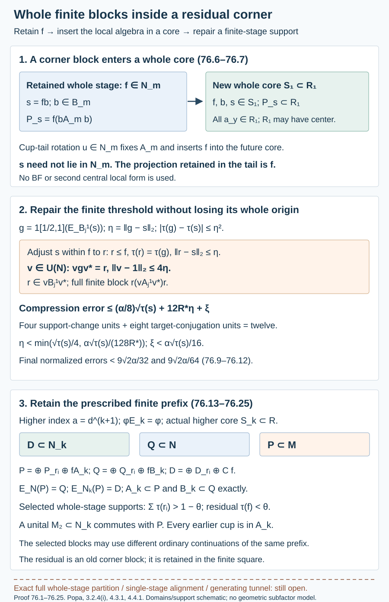

# Whole relative-commutant blocks with a small residual corner

The general corner theorem gives local finite algebras in corner inclusions. A retained projection and a later cup tail put each such algebra inside a whole core. Spectral approximation and a small unitary correction then give a support in an actual whole-inclusion finite relative commutant, lying exactly in the available residual corner. The error is measured against the local support, including every change of projection and every conjugation of the target.

We also prove higher-inclusion heredity for a core with arbitrary center. This lets finite piecewise squares retain every relative commutant and cup of a prescribed ordinary prefix. The selected blocks have the whole-inclusion origin. An arbitrarily small remaining corner is retained explicitly. Removing that corner, or putting all selected blocks in one whole stage, is a separate obligation.

We use [2.9 (compression of dimension)](module-dimension-and-local-index.md), [4.5 (rotation of tunnel triples)](towers-and-tunnels.md), [14.8 (skipped basic constructions)](reflected-traces-and-uniform-bounds.md), [29.1 (finite core comparisons)](finite-index-tunnels-without-finite-depth.md), [49.2 (compatible hypertraces)](relative-hypertraces-and-folner-projections.md), 52.1–52.2 (cup tails and canonical pairs), 53.1 (finite-stage expectations), [57.3 (finite alignment)](actual-supported-local-approximation.md), [59.5–59.6 (corner alignment and orthogonal errors)](corner-heredity-and-global-patching.md), [60.1–60.3 (densities and higher bases)](preserved-prefix-and-generating-tunnels.md), [74.3–74.4 (general first local approximation)](unequal-supports-and-finite-local-approximation.md), and [75.1–75.4 (general corner heredity and finite patching)](general-corners-and-piecewise-commuting-squares.md). The finite comparison and extension arguments below state exactly where an earlier proof survives without core factoriality. No second local central form, common-support BF, relative norm-averaging theorem, separability or infinite-factor deletion is assumed.

Let \(N\subsetneq M\) be finite-index II₁ factors, \(d=[M:N]>1\), and suppose an actual core satisfies relative Følner. The inherited normalized trace is \(\tau\). Every actual core satisfies the criterion by 74.4.

## A unitary moving equal-trace projections

**Lemma 76.1.** If projections \(p,q\in N\) have equal trace, there is a unitary \(v\in N\) with

\[
\begin{gathered}
vpv^*=q,\\
\|v-1\|_2\leq2\|p-q\|_2.
\end{gathered}
\tag{76.1}
\]

**Proof.** Put \(x=qp\). Extend its polar partial isometry across its missing initial and final supports, which have equal trace in the finite factor. The resulting partial isometry \(V\) has \(V^*V=p\), \(VV^*=q\), and \(V^*x=|x|\). Since \(0\leq |x|\leq p\), its square is at most itself. If \(a=\tau(p)-\tau(pq)\), then

\[
\begin{gathered}
\|V-x\|_2^2\\
=\tau(p)+\tau(pq)-2\tau(|x|)\\
\leq a,\\
\|x-p\|_2^2=a,\\
\|V-p\|_2\leq2\sqrt a.
\end{gathered}
\tag{76.2}
\]

Apply the same construction to \((1-q)(1-p)\). Its deficit is also \(a\), by the equal-trace hypothesis. It gives \(W\) with initial \(1-p\), final \(1-q\), and \(\|W-(1-p)\|_2\leq2\sqrt a\). The sum \(v=V+W\) is unitary. The two errors have orthogonal right supports, so

\[
\begin{gathered}
\|v-1\|_2^2\leq8a,\\
\|p-q\|_2^2=2a.
\end{gathered}
\tag{76.3}
\]

This proves the stated bound, including zero or unit projections. \(\square\)

## A whole finite block inside an arbitrary residual projection

**Theorem 76.2.** Let \(0<f\in N\) be a projection, let \(Y\subset M\) be finite, and let \(\delta,c_0>0\). There are a whole tunnel, a finite stage \(h\), and a nonzero projection \(r\) satisfying

\[
\begin{gathered}
r\in B_h=N_h'\cap N,\\
r\leq f,\\
0<\tau(r)<c_0\tau(f),\\
\|[fyf,r]\|_2\\
<\delta\sqrt{\tau(r)},\\
\|ryr-E_{rA_hr}^{rMr}(ryr)\|_2\\
<\delta\sqrt{\tau(r)}\\
\quad(y\in Y),\\
A_h=N_h'\cap M.
\end{gathered}
\tag{76.4}
\]

The finite algebra is the full supported whole-stage algebra \(rA_hr\). Its smaller pair is \(rB_hr\), and \(E_N(rA_hr)=rB_hr\).

**Proof.** The empty-set case is included by adjoining the target \(1\). Put \(\alpha=\min(1,\delta)\) and \(R_*=\max(1,\max_{y\in Y}\|y\|)\). By 75.3 and 74.3, in \(fNf\subset fMf\) choose a finite corner tunnel of length \(m\), a support \(s\), and conditional-expectation candidates \(a_y\) with

\[
\begin{gathered}
0<\tau(s)\leq\\
\min(1/16,c_0/4)\tau(f),\\
s\leq f,\\
\|a_y\|\leq R_*,\\
a_y=s a_y s,\\
\|[fyf,s]\|_2\\
<\frac\alpha8\sqrt{\tau(s)},\\
\|sys-a_y\|_2\\
<\frac\alpha8\sqrt{\tau(s)}.
\end{gathered}
\tag{76.5}
\]

These are ambient norms: multiply the normalized corner estimates by \(\sqrt{\tau(f)}\).

By 75.1 choose a whole tunnel retaining \(f\) through \(m\). Lemma 59.5 aligns its compressed finite tunnel with the chosen corner tunnel, by a corner unitary extended to a unitary in \(N\). This alignment needs neither core factoriality nor a tail-support hypothesis: the latter was needed only for the additional tail conclusion in 59.5. Now \(f\in N_m\), and the full-corner commutant equality 75.11 identifies the corner stage with \(fA_m\) and \(fB_m\).

Multiplication by \(f\) is faithful on \(A_m\). Indeed \(N_m\) is a factor commuting with \(A_m\), so \(\tau(fx^*x)=\tau(f)\tau(x^*x)\). There is consequently a projection \(b\in B_m\) such that

\[
\begin{gathered}
s=fb,\\
P_s=sA_m s=f(bA_mb),\\
a_y\in P_s.
\end{gathered}
\tag{76.6}
\]

This support is generally not a projection in \(N_m\).

Choose an infinite continuation. Its cup tail supplies a unital II₁ factor \(T\subset N_m\) contained in the future smaller core, by 52.1 and 11.5. Prescribe \(p_T\in T\) with \(\tau(p_T)=\tau(f)\). A unitary \(u\in N_m\) carries \(p_T\) to \(f\). Rotate only the continuation beyond \(m\) by \(u\). It fixes \(A_m\) and \(B_m\), and the new core \(S_1\subset R_1\) contains \(f\), \(b\), \(s=fb\) and all of \(P_s\). In particular \(s\in S_1\) and every \(a_y\in R_1\). No claim that \(R_1\) is a factor is used.

Write the increasing finite commutants of this continuation as \(A_j^1,B_j^1\). Their expectations converge in \(L^2\) on \(R_1,S_1\). Therefore

\[
\begin{gathered}
g_j=1_{[1/2,1]}(E_{B_j^1}(s))\\
\in B_j^1,\\
\eta_j=\|g_j-s\|_2\\
\longrightarrow0,\\
\xi_j=\max_{y\in Y}\\
\|a_y-E_{A_j^1}(a_y)\|_2\\
\longrightarrow0.
\end{gathered}
\tag{76.7}
\]

The threshold convergence is the projection estimate already proved in 74.3. Choose one finite \(j\geq m\) with

\[
\begin{gathered}
\eta_j<\min\left(\begin{gathered}
\frac{\sqrt{\tau(s)}}4,\\
\frac{\alpha\sqrt{\tau(s)}}{128R_*}
\end{gathered}
\right),\\
\xi_j<\frac\alpha{16}\\
\sqrt{\tau(s)}.
\end{gathered}
\tag{76.8}
\]

Put \(g=g_j\), \(\eta=\eta_j\), \(\xi=\xi_j\). For any two finite projections, their squared distance dominates their trace difference. Hence

\[
\begin{gathered}
|\tau(g)-\tau(s)|\leq\eta^2,\\
\frac{15}{16}\tau(s)<\tau(g)\\
<\frac{17}{16}\tau(s),\\
\tau(g)<\tau(f),\\
\tau(g)<c_0\tau(f).
\end{gathered}
\tag{76.9}
\]

If \(\tau(g)\leq\tau(s)\), choose \(r\leq s\) of trace \(\tau(g)\). Otherwise add to \(s\) a subprojection of \(f-s\) of the trace difference; the capacity in 76.9 permits this. In either case

\[
\begin{gathered}
r\leq f,\\
\tau(r)=\tau(g),\\
\|r-s\|_2^2\\
=|\tau(g)-\tau(s)|\leq\eta^2,\\
\|r-g\|_2\leq2\eta.
\end{gathered}
\tag{76.10}
\]

Lemma 76.1 gives \(v\in\mathcal U(N)\) with \(vgv^*=r\) and \(\|v-1\|_2\leq4\eta\). Conjugate the chosen whole tunnel by \(v\). Its finite pair becomes \(vA_j^1v^*,vB_j^1v^*\), and \(r\in vB_j^1v^*\) exactly. This conjugation belongs to \(N\), so the smaller ambient factor is still \(N\).

Fix \(y\), and put \(x=fyf\), \(a=a_y\), \(b_j=gE_{A_j^1}(a)g\). The candidate is in \(gA_j^1g\) and has norm at most \(R_*\). Expanding once on each side of the projection gives

\[
\begin{gathered}
\|gxg-b_j\|_2\\
\leq\frac\alpha8\sqrt{\tau(s)}\\
+4R_*\eta+\xi,\\
\|v^*xv-x\|_2\\
\leq2R_*\|v-1\|_2\\
\leq8R_*\eta.
\end{gathered}
\tag{76.11}
\]

For the first line, the two support changes are \(gxg-sxs\) and \(a-gag\), each bounded by \(2R_*\eta\). The remaining terms are 76.5 and the expectation error \(\xi\). For the second line expand the unitary conjugation. Thus

\[
\begin{gathered}
\|rxr-vb_jv^*\|_2\\
\leq\frac\alpha8\sqrt{\tau(s)}\\
+12R_*\eta+\xi\\
<\frac{9\alpha}{32}\sqrt{\tau(s)},\\
\|[x,r]\|_2\\
<\frac\alpha8\sqrt{\tau(s)}+2R_*\eta\\
<\frac{9\alpha}{64}\sqrt{\tau(s)}.
\end{gathered}
\tag{76.12}
\]

Here \(rxr=ryr\), because \(r\leq f\). Using \(\tau(r)>\tau(s)/2\), both errors divided by \(\sqrt{\tau(r)}\) are strictly less than \(\alpha\leq\delta\). The candidate \(vb_jv^*\) is in the full supported finite algebra. Orthogonal expectation does at least as well. Rename its conjugated finite stage as \(h\). Since \(v\in N\), expectation equivariance and 53.1 give \(E_N(rA_hr)=rB_hr\). This proves 76.4. \(\square\)

## Compatible higher inclusions with a centered core

**Theorem 76.3 — general higher heredity.** Fix any ordinary tunnel prefix through \(N_k\). The higher inclusion \(N_k\subset M\), of index \(a=d^{k+1}\), has an actual core satisfying relative Følner. Its larger algebra is the original \(R\), without a factoriality assumption. Every core of the higher inclusion satisfies relative Følner, and all its nonzero smaller corners have 76.2.

**Proof.** Continue the fixed prefix arbitrarily. By 74.4 and 49.2 take a compatible hypertrace \(\varphi\) for its actual core \(S\subset R\). Put \(e=e_R\), \(\mathcal B=\langle M,e\rangle\), \(S_k=R\cap N_k\), and \(\mathcal A_k=\langle N_k,e\rangle\). The density construction 60.1/75.6 gives a ucp \(M\)-bimodular expectation \(\Phi:\mathcal B\to M\), with

\[
\begin{gathered}
E_N\Phi=\Phi E_{\mathcal A},\\
\tau\Phi=\varphi,
\qquad\mathcal A=\langle N,e\rangle.
\end{gathered}
\tag{76.13}
\]

The construction uses domination by the normal trace, not core factoriality.

We detail the finite higher-pair facts, whose proof 60.2 also uses no core factoriality. Let \(K_l=\{g_l,g_{l+1},\ldots\}''\), with \(N_{-1}=M\). The actual cup-tail identifications 52.1 give \([K_l:K_{l+1}]=d\) and \(E_{N_l}|_{K_l}=E_{K_{l+1}}\). Thus \([K_0:K_{k+1}]=a\), and \(E_{N_k}|_{K_0}=E_{K_{k+1}}\). A bounded finite partial orthonormal basis \((a_i)\subset K_0\subset R\), with supports \(f_i\in K_{k+1}\subset S_k\), satisfies

\[
\begin{gathered}
E_{N_k}(a_i^*a_j)=\delta_{ij}f_i,\\
\sum_i\tau(f_i)=a,\\
\sum_i a_i a_i^*=a1.
\end{gathered}
\tag{76.14}
\]

In \(\langle M,e_{N_k}\rangle\), the mutually orthogonal final projections of \(a_ie_{N_k}\) have total canonical trace \(a=\operatorname{Tr}(1)\). Faithfulness makes their sum one, hence \(M=\sum_i a_iN_k\). Bimodularity of \(E_{N_k}\) over sufficiently late \(N_l\) preserves \(N_l'\cap M\); normality gives \(E_{N_k}(R)=S_k\). The same basis therefore expands \(R=\sum_i a_iS_k\). This is the actual nondegenerate commuting square. Its canonical extension 52.2 supplies the normal trace-preserving \(E_k:\mathcal B\to\mathcal A_k\), restricting to \(E_{N_k}\) on \(M\).

Its finite basis identity on all of \(\mathcal B\) is

\[
\begin{gathered}
T=\sum_i a_i E_k(a_i^*T),\\
T\in\mathcal B.
\end{gathered}
\tag{76.15}
\]

To verify it, let \(Q(T)\) be the right side. Taking adjoints of the \(M/N_k\) basis expansion gives \(a_i^*x=\sum_j E_{N_k}(a_i^*xa_j)a_j^*\). The coefficients are in \(N_k\subset\mathcal A_k\), and expectation bimodularity proves \(Q(xT)=xQ(T)\) for \(x\in M\). Also every \(a_i\in R\) commutes with \(e\), and \(e\in\mathcal A_k\), so \(Q(eT)=eQ(T)\). The left multipliers having this identity form an ultraweakly closed unital algebra containing \(M\) and the self-adjoint \(e\), hence all of \(\mathcal B\). Finally \(Q(1)=1\) by the original basis expansion. This proves 76.15, without a finite-index hypothesis on \(R\subset M\).

Both generators of \(\mathcal A_k\) commute with the earlier cups \(g_0,\ldots,g_{k-1}\). For \(e\), those cups are in \(R\). By 76.13 and \(\mathcal A_k\subset\mathcal A\), \(\Phi(\mathcal A_k)\subset N\). Bimodularity transfers the cup commutation, and the actual tunnel identity gives

\[
\begin{gathered}
\Phi(\mathcal A_k)\subset N\\
\cap\{g_0,\ldots,g_{k-1}\}'\\
=N_k.
\end{gathered}
\tag{76.16}
\]

For fixed \(T\), put \(b_i=E_k(a_i^*T)\), \(c_i=E_{N_k}(a_i)\). 76.15 and bimodularity give \(E_kT=\sum_i c_i b_i\). Since \(\Phi(b_i)\in N_k\), we obtain the full compatibility identity

\[
\begin{gathered}
E_{N_k}\Phi(T)\\
=\sum_i c_i\Phi(b_i)\\
=\Phi(E_kT),\\
\varphi E_k=\tau\Phi E_k\\
=\tau E_{N_k}\Phi=\varphi.
\end{gathered}
\tag{76.17}
\]

All sums are finite; normality of \(\Phi\) was not used.

Put \(h=k+1\). The skipped levels

\[
\begin{gathered}
L_{-1}=M,\\
L_r=N_{h(r+1)-1}\\
\quad(r\geq0)
\end{gathered}
\tag{76.18}
\]

form an actual tunnel for \(L_0=N_k\subset M\), by 14.8. Each consecutive basic triple has index \(d^h=a\), its actual Jones projection and expected value \(a^{-1}1\). Their relative commutants are cofinal in the original increasing union, so their larger core is \(R\). Expectation onto \(N_k\) preserves the finite union and its closure, so the smaller core is \(S_k\). The canonical expected pair is the pair just used. 76.17 and 49.2 give relative Følner. Then 74.4 and 75.3 give every-core and nonzero-corner heredity; apply 76.2 in each such corner. \(\square\)

## Finite squares retaining a prescribed prefix

**Theorem 76.4.** Fix the ordinary prefix through \(N_k\), including all its cups. Let \(A_k=N_k'\cap M\), \(B_k=N_k'\cap N\). For finite \(Y\subset M\) and \(\varepsilon,\theta>0\), there are unital finite-dimensional algebras

\[
\begin{gathered}
D\subset Q\subset P\subset M,\\
D\subset N_k,\\
Q\subset N,\\
A_k\subset P,\\
B_k\subset Q,\\
\|y-E_P(y)\|_2<\varepsilon\\
\quad(y\in Y),\\
E_N(P)=Q,\\
E_{N_k}(P)=D.
\end{gathered}
\tag{76.19}
\]

They give commuting squares for both \(N\subset M\) and \(N_k\subset M\). On a projection of trace greater than \(1-\theta\), their blocks are full supported whole-inclusion relative-commutant pairs, for finite ordinary continuations of the exact prescribed prefix. Their residual corner has trace less than \(\theta\). A unital \(M_2\subset N_k\) commutes with all of \(P\).

**Proof.** By 76.3 apply 76.2 to the higher inclusion \(N_k\subset M\) inside every nonzero residual \(f\in N_k\). This supplies a support \(r\leq f\), and an actual higher level \(U_j\subset N_k\), with the two ambient error bounds at any tolerance \(\gamma\): commutator of \(fyf\), and distance of \(ryr\) to

\[
\begin{gathered}
P_r=r(U_j'\cap M)r,\\
Q_r=r(U_j'\cap N)r,\\
D_r=r(U_j'\cap N_k)r,\\
r\in U_j'\cap N_k.
\end{gathered}
\tag{76.20}
\]

The intermediate row \(Q_r\) is essential: it need not equal \(D_r\). Bimodularity of \(E_N\) over \(U_j\), and of both expectations over \(r\), gives \(E_N(P_r)=Q_r\), \(E_{N_k}(P_r)=D_r\). Both are finite-dimensional, since \(U_j\subset M\) has finite index. Also \(rA_k\subset P_r\), \(rB_k\subset Q_r\), as \(r\in N_k\) commutes with both old finite algebras.

Every such higher level has an actual ordinary realization after the fixed prefix. Extend the prefix arbitrarily through

\[
m=(k+1)(j+1)-1.
\tag{76.21}
\]

Its skipped higher tunnel has the same finite length. The finite alignment 57.3 supplies a unitary in \(N_k\) sending these skipped levels to the chosen \(U_0,\ldots,U_j\). Conjugate that ordinary continuation only. It fixes every original prefix factor as a set and every earlier cup exactly. Its final ordinary level is \(U_j\). The physical targets and the chosen support \(r\) have not been conjugated. Thus 76.20 is a full supported whole-inclusion finite pair, for a continuation of the prescribed ordinary prefix. Different blocks may use different continuations.

The unit-\(r\) factor \(T_r=rU_j\subset rN_kr\) commutes with \(P_r\), and is faithful by the commuting-factor trace argument in 75.4.

Use the orthogonal-family argument 75.4, now with supports in \(N_k\) and local data 76.20. It applies unchanged: bounded candidates, countable orthogonal families, chain limits, and the non-strict full-error bound. A maximal family covers one, and the full error \(F=y-\sum_i b_i(y)\) satisfies \(\|F\|_2^2\leq2\gamma^2\). Choose \(\gamma=\varepsilon/4\), \(R_*\) as before, and a finite subfamily \(I\) with residual

\[
\begin{gathered}
f=1-\sum_{i\in I}r_i\in N_k,\\
\tau(f)<\min\left(\theta,
\frac{\varepsilon^2}{4R_*^2}\right).
\end{gathered}
\tag{76.22}
\]

Retain the actual old finite algebra in the residual corner, and define

\[
\begin{gathered}
P=\bigoplus_{i\in I}P_{r_i}\ \oplus\ fA_k,\\
Q=\bigoplus_{i\in I}Q_{r_i}\ \oplus\ fB_k,\\
D=\bigoplus_{i\in I}D_{r_i}\ \oplus\mathbb Cf.
\end{gathered}
\tag{76.23}
\]

Omit a zero residual block. Since \(f\in N_k\) commutes with \(A_k\), multiplication defines the algebra \(fA_k\) with unit \(f\). Moreover \(E_N(A_k)=B_k\), while \(E_{N_k}(A_k)=\mathbb C1\): the latter expectation commutes with the factor \(N_k\) and preserves its trace. Thus both expectation equalities in 76.19 hold. Summing \(r_i x\) and \(fx\) recovers every \(x\in A_k\), and the same proves \(B_k\subset Q\).

The finite candidate \(b_I(y)\) belongs to \(P\). Exactly as in 75.20, removal of the residual corner gives

\[
\begin{gathered}
y-fyf-b_I(y)\\
=F-fFf,\\
\|y-b_I(y)\|_2^2\\
\leq2\gamma^2+R_*^2\tau(f)\\
<3\varepsilon^2/8.
\end{gathered}
\tag{76.24}
\]

Best approximation proves the distance claim. Trace pairing against the ranges gives

\[
\begin{gathered}
E_NE_P=E_PE_N=E_Q,\\
E_{N_k}E_P=E_PE_{N_k}=E_D,\\
E_{N_k}E_Q=E_QE_{N_k}=E_D.
\end{gathered}
\tag{76.25}
\]

For the last identity use \(E_{N_k}E_N=E_{N_k}\), then take adjoints.

Choose unital \(M_2\) units in each \(T_{r_i}\), and in \(fN_kf\) if \(f\ne0\). They commute with their respective blocks of \(P\), including \(fA_k\). Summing corresponding units gives a unital \(M_2\subset N_k\) commuting with \(P\). Its norm-one units have commutator bound \(2\|y-E_P(y)\|_2\) on the targets. Every earlier cup is already in \(A_k\subset P\), so all its actual algebraic and expectation relations are retained exactly. \(\square\)

The residual \(fA_k\) is a relative-commutant block of the actual corner inclusion \(fN_kf\subset fMf\), by the full-corner lifting proof in 75.11, for the higher smaller factor. We have not shown that \(f\) is a projection of a whole-inclusion finite \(B_m\). Nor does 76.4 put its other supports in one common whole stage. The exact full finite partition and full supported whole-stage decomposition in Popa 4.4.1(1), and the unrestricted generating conclusion, remain open. An arbitrarily small residual is not an exact zero residual.

*Figure 76.1. The first panel shows the actual retained-factor and cup-tail route 76.6–76.7. The second records the exact projection and unitary bounds 76.9–76.12; arrows identify the containing smaller factor and the final supported whole finite algebra. The final panel shows the three finite rows 76.20–76.25 and the residual old corner. Block widths in the final panel are schematic; its explicit trace inequality is the proved bound. The residual is retained, not discarded. [Editable source](figures/whole-relative-commutant-blocks.py). Human source: Sorin Popa, [*Classification of amenable subfactors of type II*](https://doi.org/10.1007/BF02392646), Proposition 3.2.4(i), Theorems 4.3.1 and 4.4.1, printed pp.208,217–219,222.*

## Exercises with complete solutions

**Exercise 76.1 — projection correction.** If \(\tau(p)=\tau(q)=1/3\) and \(\tau(pq)=1/4\), compute \(a\), \(\|p-q\|_2\), and the unitary bound 76.1. Does it require the projections to commute?

**Solution.** The deficit is \(a=1/12\). The squared projection distance is \(2a=1/6\); the unitary distance is at most \(2/\sqrt6\). No commutativity is used. The polar operator \(qp\) and its two missing equal-trace supports provide the correction in the factor.

**Exercise 76.2 — finite threshold need not preserve trace.** Suppose \(s\leq f\), \(\tau(s)=1/32\), \(\tau(f)=1/2\), and a finite threshold \(g\) satisfies \(\|g-s\|_2<1/1024\). Give trace bounds sufficient for constructing \(r\leq f\) of trace \(\tau(g)\). How does the construction change if \(g\) has larger trace?

**Solution.** The trace difference is less than \(1/1048576\), so \(1/32-1/1048576<\tau(g)\) and \(\tau(g)<1/32+1/1048576<1/2\). If the trace decreases, remove a subprojection from \(s\). If it increases, add a subprojection of \(f-s\). The adjustment has squared distance exactly the trace difference, hence norm less than \(1/1024\). Equal trace of \(g,r\) then permits 76.1. Equality of the finite threshold's trace with \(\tau(s)\) was never assumed.

**Exercise 76.3 — all conjugation errors.** Explain the coefficient \(12R_*\eta\) in 76.12 and the normalized final bound. What error would be missed if the target were tacitly conjugated along with the finite tunnel?

**Solution.** The two projection changes contribute \(2R_*\eta\) each, giving four. Conjugating the candidate while keeping the physical target fixed contributes \(\|v^*xv-x\|_2\leq2R_*\|v-1\|_2\leq8R_*\eta\), giving twelve. The total coefficient is \(\alpha/8+12\alpha/128+\alpha/16=9\alpha/32\) times \(\sqrt{\tau(s)}\). Dividing by \(\sqrt{\tau(r)}>\sqrt{\tau(s)/2}\) gives at most \(9\sqrt2\alpha/32<\alpha\). The missing error would be the eight-unitary term; the target \(x=fyf\) remains fixed.

**Exercise 76.4 — a preserved ordinary prefix.** For \(k=2\) and a higher tunnel ending at \(U_2\), compute its index, skipped levels, and final ordinary level. Why are the original cups fixed by the alignment?

**Solution.** The higher index is \(d^3\); its levels correspond to \(N_2,N_5,N_8\), so the final ordinary level is \(m=3(2+1)-1=8\). The aligning unitary lies in \(N_2\), which is contained in each earlier prefix factor and commutes with the earlier defining cups. Conjugation preserves those factors as sets and fixes the actual cups as operators. It changes only the later continuation, and the physical target elements stay fixed.

**Exercise 76.5 — the intermediate finite row.** In 76.20, which row is the expectation image under \(E_N\), and which under \(E_{N_k}\)? Prove the residual formulas without assuming \(f\) is in \(B_k\).

**Solution.** The images are \(Q_r\) and \(D_r\), respectively. Since \(f\in N_k\subset N\), expectation bimodularity gives \(E_N(fA_k)=fE_N(A_k)=fB_k\). The expectation \(E_{N_k}\) of an element of \(A_k\) commutes with \(N_k\) and lies in that factor, so is the scalar \(\tau(x)1\). Hence \(E_{N_k}(fA_k)=\mathbb Cf\). These calculations require \(f\in N_k\), not \(f\in N_k'\cap N\). Confusing \(Q_r\) and \(D_r\) would lose the original intermediate algebra \(N\).

**Exercise 76.6 — exact and approximate coverage.** Does 76.4 prove the complete whole-stage decomposition of Popa 4.4.1(1) or a generating tunnel? List the retained exact data and the remaining approximation.

**Solution.** It retains the entire prescribed ordinary prefix and its cups, the finite algebras \(A_k\subset P\), \(B_k\subset Q\), both commuting-square identities, and each selected support's full whole-inclusion finite-stage algebra. The selected support sum has trace greater than \(1-\theta\). The remaining block is exactly \(fA_k\), with \(\tau(f)<\theta\), and has a proved corner origin. A finite whole-stage projection realization of that residual, an exact full whole-stage partition and a common stage containing the selected pieces have not been supplied. Thus neither the full source decomposition nor an unrestricted generating tunnel is inferred.

## Source comparison and remaining work

Popa 4.4.1(1) requires a finite partition of one by supports in whole-inclusion finite relative commutants and the full supported algebra on each piece. 76.4 proves that origin on a support of trace arbitrarily close to one, with the residual explicitly retained. Part(2)'s separable individual hyperfiniteness and simultaneous tensor absorption are already supplied in 75.5–75.6. Part(3)'s extremal graph-norm conclusion remains assigned with its exact proof.

The proofs above establish higher relative Følner heredity, whole-stage local support repair and the finite approximation retaining a prescribed prefix. Whole-stage realization of the residual, common stage alignment, generating tunnels, the common-central second local form, full bicommutant equivalence, represented/opposite canonical trace and corrected arbitrary-depth reconstruction, every original clause/exercise/note and exact prerequisite closure remain assigned.

*Written by GPT-6.1 Sol (OpenAI), Ultra reasoning effort, October 2026. Author self-check. Public domain (CC0).*
