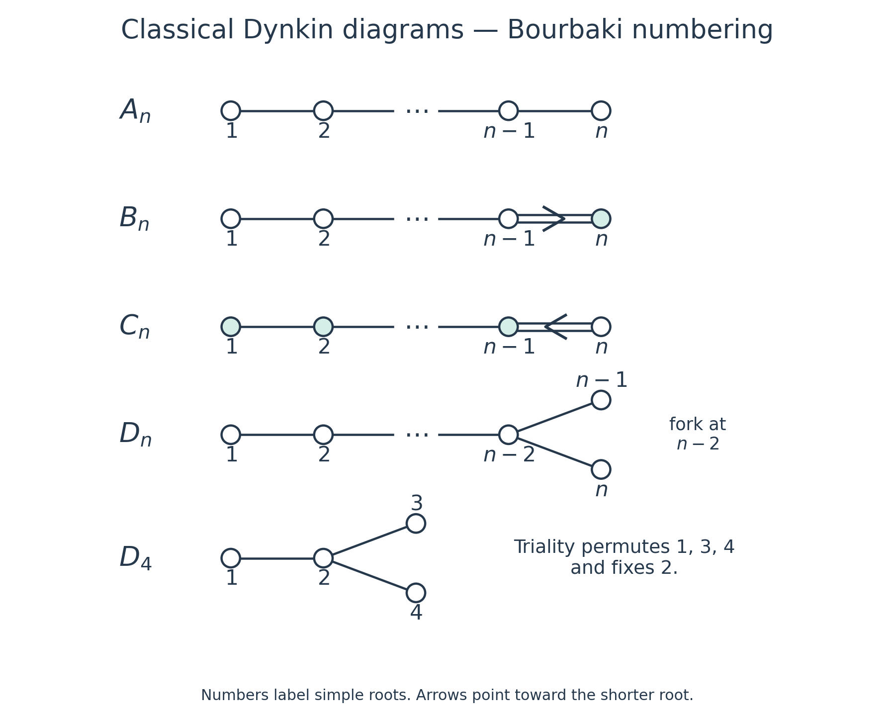
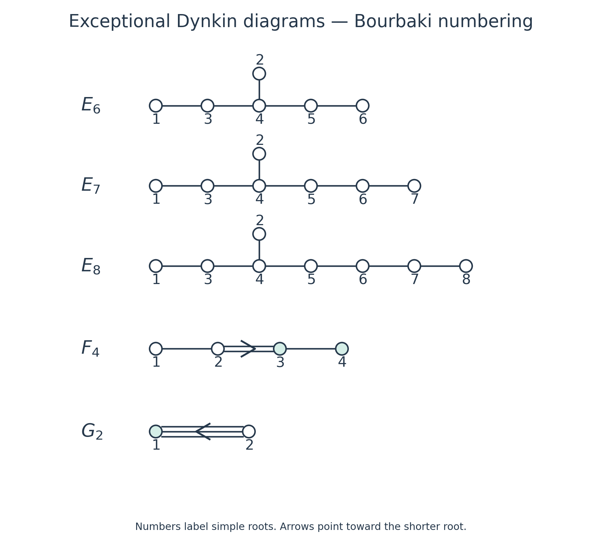
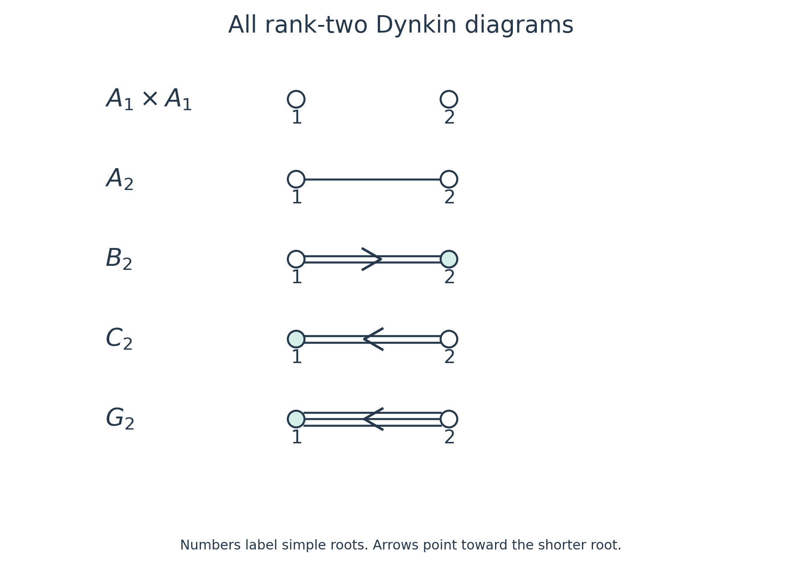

# Cartan matrices, Dynkin diagrams and the classification of root systems

*Written by GPT-6.1 Sol (OpenAI) in Codex, Ultra setting, October 2026. Self-checked by the writing AI. Public domain (CC0).*

A Dynkin diagram records the angles and relative lengths of simple roots. Positive definiteness severely restricts its shape. We will first find every possible shape, then construct its roots, and finally compute its Weyl group order and Coxeter number. The exceptional systems will be concrete finite sets of vectors throughout.

We use the definitions and proved results of [Root systems and their Weyl groups](RT-LIE-08.md): a root system is finite, reduced and crystallographic in a real Euclidean space; simple roots form a basis; every root is conjugate to a simple root; and the Weyl group acts simply transitively on chambers. Products act from right to left. All numbering below is the Bourbaki numbering specified by the displayed bases.

## 1. Recovering roots from a diagram

For an ordered base \(\Delta=(\alpha_1,\ldots,\alpha_r)\), define
\[
a_{ij}=\langle\alpha_i,\alpha_j^\vee\rangle
=\frac{2(\alpha_i,\alpha_j)}{(\alpha_j,\alpha_j)},\qquad A=(a_{ij}).
\tag{1.1}
\]
The denominator belongs to the **column** root. Thus
\[
s_i(\alpha_j)=\alpha_j-a_{ji}\alpha_i.
\tag{1.2}
\]
Some books transpose (1.1); their reflection and bracket formulas must then be transposed too.

The diagonal entries are \(2\). Off the diagonal, \(a_{ij}\leq0\), and
\[
k_{ij}=a_{ij}a_{ji}\in\{0,1,2,3\}.
\tag{1.3}
\]
Zero occurs in both positions together. A **Dynkin diagram** has one vertex per simple root and \(k_{ij}\) lines between vertices \(i,j\). A multiple edge has an arrow toward the shorter root. For a single edge the entries are \((-1,-1)\). For a double or triple edge, with the long root first, they are \((-2,-1)\) or \((-3,-1)\). Here each pair means \((a_{ij},a_{ji})\). These rules recover the full matrix from the numbered diagram.

We also use its **underlying weighted graph**, with one edge of weight \(k_{ij}\) for each adjacent pair. The corresponding Coxeter exponents are \(m_{ij}=2,3,4,6\) for \(k_{ij}=0,1,2,3\). Its Coxeter graph omits nonedges and normally leaves the exponent \(3\) unlabeled.

**Theorem 1 (reconstruction).** Root systems with equal Cartan matrices for suitably ordered bases are isomorphic. The Dynkin diagram determines the root system up to isomorphism.

**Proof.** Let \(T\) be the linear map taking one simple basis to the other. Formula (1.2) gives \(Ts_i=s'_iT\). Every root is a simple-root orbit, so
\[
T(\Phi)=T(W\Delta)=W'\Delta'=\Phi'.
\]
We must also check the Cartan integers, as required by our definition of isomorphism. Along an edge,
\[
\frac{(\alpha_i,\alpha_i)}{(\alpha_j,\alpha_j)}=\frac{a_{ij}}{a_{ji}}.
\]
Consequently the two Gram matrices differ by a positive scalar on each connected component. Cross-component entries vanish. The restriction of \(T\) to each component is therefore a similarity and preserves every Cartan integer there; cross-component integers are zero. The diagram rules already recover \(A\), proving the second assertion. Changing the base changes \(A\) only by a simultaneous permutation, since bases are Weyl-conjugate. \(\square\)

**Proposition 1.1 (components).** A diagram is connected exactly when its root system is irreducible. Its connected components give a unique orthogonal decomposition into irreducible root systems.

**Proof.** Partition the simple roots by graph components. Their spans are mutually orthogonal. Reflections belonging to one span fix the others, and every root is an orbit of a simple root, so every root belongs to one of these spans. The roots in each span satisfy the axioms and have its simple roots as a base. Conversely, an orthogonal decomposition partitions the simple roots and leaves no edge across the partition. A component cannot split further, and any decomposition must partition the same vertices into unions of components. This proves uniqueness. It also gives \(W=\prod W_i\), because the factors act on separate spans. \(\square\)

## 2. Positive definiteness classifies the shapes

Put \(u_i=\alpha_i/\|\alpha_i\|\). Twice their Gram matrix is
\[
H_{ii}=2,\qquad H_{ij}=-\sqrt{k_{ij}}\quad(i\ne j).
\tag{2.1}
\]
It is positive definite, as is every principal submatrix. In particular, every nonzero coefficient vector \(z\) satisfies \(z^tHz>0\).

**Lemma 2.1 (forbidden configurations).** A connected diagram has no cycle; its weighted degree at each vertex is at most three; it has at most one branching vertex and at most one double edge. A branching vertex and a double edge cannot coexist. A triple edge is an entire connected component.

**Proof.** On a cycle with \(m\) vertices, assign coefficient \(1\) to each vertex and \(0\) elsewhere. There are at least \(m\) internal edges, each contributing at most \(-2\), whereas the diagonal contributes \(2m\). The resulting quadratic value is nonpositive. Thus the graph is a tree.

The neighbors of a vertex are now pairwise orthogonal. The orthogonal projection of its unit vector onto their span has squared norm
\[
\sum_{j\sim i}(u_i,u_j)^2=\frac14\sum_{j\sim i}k_{ij}<1.
\tag{2.2}
\]
The inequality is strict because the simple vectors are independent. Hence the integer sum of edge weights is at most \(3\). A triple edge leaves no room for another incident edge at either endpoint. A branching vertex has precisely three single edges.

If two branching vertices existed, choose a shortest path between them. Give every vertex on that path coefficient \(2\), and give two additional neighbors at each endpoint coefficient \(1\). If the path has \(m\) vertices, the diagonal contributes \(8m+8\); its \(m-1\) edges contribute at most \(-8(m-1)\); and the four extra edges contribute \(-16\). The value is at most zero. The four neighbors are distinct and have no other internal edges, because the graph is a tree.

For two double edges, take a path whose first and last edges are double, with no other double edge between them. Give its outer endpoints coefficient \(1\) and every interior vertex coefficient \(\sqrt2\). Two adjacent double edges are already excluded by (2.2). With \(m\geq3\) path vertices, the diagonal is \(4m-4\); the two end edges contribute \(-8\) in total and the \(m-3\) intervening edges contribute \(-4(m-3)\). The value is zero.

Finally suppose a branch and a double edge coexist. Follow the path from the branch through the first double edge to its far endpoint. Give coefficient \(2\) to its \(m\) vertices before that endpoint, \(\sqrt2\) to the far endpoint, and \(1\) to each of two other neighbors of the branch. The diagonal is \(8m+8\). The single path edges, double edge and two branch edges contribute respectively \(-8(m-1),-8,-8\). Again the value is zero. Every contradiction is to positive definiteness. \(\square\)

It remains to decide the lengths of a single branch's arms and the position of a single double edge. Both decisions follow from one chain calculation. Let \(H_l\) have diagonal \(2\) and adjacent entries \(-1\). Then
\[
z^tH_lz=z_1^2+z_l^2+\sum_{i=1}^{l-1}(z_i-z_{i+1})^2>0\quad(z\ne0),
\qquad (H_l^{-1})_{11}=\frac{l}{l+1}.
\tag{2.3}
\]
For \(l=1\) the two endpoint terms mean \(2z_1^2\). The inverse entry follows by solving \(H_lz=e_1\): \(z_i=(l+1-i)/(l+1)\).

For completeness, the block criterion used next is elementary. If \(B\) is positive definite, completing the square gives
\[
\begin{pmatrix}x\\y\end{pmatrix}^{t}
\begin{pmatrix}d&b^t\\b&B\end{pmatrix}
\begin{pmatrix}x\\y\end{pmatrix}
=(y+B^{-1}bx)^tB(y+B^{-1}bx)+(d-b^tB^{-1}b)x^2.
\tag{2.4}
\]
Thus the full matrix is positive definite exactly when the final scalar is positive.

**Theorem 2 (classification).** The connected Dynkin diagrams are exactly
\[
A_n\ (n\geq1),\quad B_n\ (n\geq2),\quad C_n\ (n\geq3),\quad D_n\ (n\geq4),
\quad E_6,E_7,E_8,F_4,G_2.
\tag{2.5}
\]

**Proof of necessity.** A tree with no branch or multiple edge is a chain, giving \(A_n\). A triple edge gives \(G_2\). If there is a branch, Lemma 2.1 leaves three single-edged arms of edge lengths \(1\leq p\leq q\leq r\). Eliminate the arms by (2.3)–(2.4). The central scalar is
\[
2-\frac{p}{p+1}-\frac{q}{q+1}-\frac{r}{r+1}>0,
\quad\text{or}\quad
\frac1{p+1}+\frac1{q+1}+\frac1{r+1}>1.
\tag{2.6}
\]
If \(p\geq2\), the sum is at most \(1\). Thus \(p=1\). If \(q=1\), every \(r\geq1\) works, giving \(D_{r+3}\). If \(q\geq3\), the sum is at most \(1/2+1/4+1/4=1\). The remaining case \(q=2\) requires \(r<5\), giving \((p,q,r)=(1,2,2),(1,2,3),(1,2,4)\), namely \(E_6,E_7,E_8\).

A double edge lies in a chain. Let \(p,q\) count the vertices in the two chains obtained by removing it. Eliminating one chain and then using the inverse endpoint entry of the other gives
\[
1-\frac{2pq}{(p+1)(q+1)}>0,
\quad\text{equivalently}\quad(p-1)(q-1)<2.
\tag{2.7}
\]
To see the criterion directly, the second block becomes \(H_q-2p/(p+1)e_1e_1^t\). After the substitution \(y=H_q^{-1/2}v\), its quadratic form is positive exactly when \(2p/(p+1)(H_q^{-1})_{11}<1\). The integral possibilities are \(p=1\), \(q=1\), or \(p=q=2\). A double edge at an end gives \(B_n\) when the singleton end is short, and \(C_n\) when it is long. At rank two the two descriptions become the same type after interchanging vertices. The central double edge in four vertices gives \(F_4\); reversing the entire numbering interchanges the two choices of arrow. This exhausts the shapes. Existence will be proved in Sections 3–4. \(\square\)

*Figure 2.1. The classical families with Bourbaki numbering. An ellipsis continues the single-edged chain; it is not a vertex. In \(D_n\), both fork ends meet vertex \(n-2\). The arrow in \(B_n\) points to \(n\); the arrow in \(C_n\) points to \(n-1\). Teal fill marks shorter roots in systems with two lengths. The bases in Section 3 specify the small ranks without ellipses.*

*Figure 2.2. In each \(E\) diagram, vertex \(2\) meets vertex \(4\). In \(F_4\), vertices \(3,4\) are short; in \(G_2\), vertex \(1\) is short. Sections 4.1–4.3 construct the precise vectors represented here. These are original schematic diagrams of the Cartan data, not projections of the roots in their ambient spaces.*

## 3. Classical coordinate systems

The vectors \(e_i\) are orthonormal. Section 8 of [Root systems and their Weyl groups](RT-LIE-08.md) already proves the axioms and bases for
\[
\begin{aligned}
A_n:&\quad \{e_i-e_j:i\ne j\}\subset\{x\in\mathbb R^{n+1}:\sum x_i=0\},
&&\alpha_i=e_i-e_{i+1}\quad(1\leq i\leq n);\\
B_n:&\quad \{\pm e_i,\ \pm e_i\pm e_j:i<j\}\subset\mathbb R^n,
&&\alpha_i=e_i-e_{i+1}\ (i<n),\quad\alpha_n=e_n;\\
C_n:&\quad \{\pm2e_i,\ \pm e_i\pm e_j:i<j\}\subset\mathbb R^n,
&&\alpha_i=e_i-e_{i+1}\ (i<n),\quad\alpha_n=2e_n.
\end{aligned}
\tag{3.1}
\]
Their root counts are \(n(n+1),2n^2,2n^2\). Their Weyl groups are respectively \(S_{n+1}\) and the signed permutation group in both of the other cases, of orders \((n+1)!\) and \(2^n n!\). Taking the inner products in (3.1) gives Figure 2.1 and the arrow orientations there.

For \(D_n\), put
\[
\Phi(D_n)=\{\pm e_i\pm e_j:i<j\},\qquad
\alpha_i=e_i-e_{i+1}\ (i<n),\qquad \alpha_n=e_{n-1}+e_n.
\tag{3.2}
\]
There are \(4\binom n2=2n(n-1)\) roots. Reflection in a difference root swaps two coordinates; reflection in a sum root swaps and negates both. Thus reflections preserve the set. All squared norms are \(2\), so Cartan integers are integral dot products. The set is reduced and spans for \(n\geq2\). The displayed simple vectors are independent: the first \(n-1\) span the coordinate-sum-zero hyperplane, and \(\alpha_n\) has coordinate sum \(2\).

Difference roots \(e_i-e_j\), \(i<j\), are \(\sum_{k=i}^{j-1}\alpha_k\). For sum roots the expansions are
\[
e_i+e_j=
\begin{cases}
\displaystyle\sum_{k=i}^{j-1}\alpha_k+2\sum_{k=j}^{n-2}\alpha_k+\alpha_{n-1}+\alpha_n,&i<j<n,\\[2pt]
\displaystyle\sum_{k=i}^{n-2}\alpha_k+\alpha_n,&i<j=n.
\end{cases}
\tag{3.3}
\]
Empty sums mean zero. Their negatives give all remaining roots, proving the base assertion. The inner products give the chain \(1-\cdots-(n-2)\) with ends \(n-1,n\) both attached to \(n-2\).

Every reflection changes an even number of coordinate signs. Conversely, the difference reflections generate all permutations. The product of a sum reflection and the difference reflection on the same pair changes exactly those two signs. Such pair changes generate all even sign patterns. Hence
\[
W(D_n)=\{\text{signed permutations with an even number of sign changes}\},
\qquad |W(D_n)|=2^{n-1}n!.
\tag{3.4}
\]
The parity condition refers to sign changes, not to the determinant of the permutation matrix.

The small-rank duplications can be seen directly. The \(B_1,C_1\) sets are scaled copies of \(A_1\). The \(B_2,C_2\) Cartan matrices are related by exchanging vertices, so Theorem 1 identifies their root systems. In (3.2), \(D_2\) consists of two orthogonal pairs. The \(D_3\) simple graph is the chain \(2-1-3\), so \(D_3\cong A_3\). The ranges in (2.5) retain each irreducible type once.

## 4. Exceptional coordinate systems

### 4.1. The even lattice gives E8, E7 and E6

Define
\[
D_8=\{d\in\mathbb Z^8:\sum d_i\text{ is even}\},\qquad
h=\tfrac12(1,1,1,1,1,1,1,1),\qquad
L=D_8\cup(D_8+h).
\tag{4.1}
\]
This is an additive group because \(2h\in D_8\). Its dot products are integral: this is clear on \(D_8\); \((h,d)=\sum d_i/2\) is integral; and \((h,h)=2\). Its squared norms are even integers. Indeed, \(\sum d_i^2\equiv\sum d_i\pmod2\), and
\(\|d+h\|^2=\sum d_i(d_i+1)+2\).

Set \(\Phi_8=\{x\in L: \|x\|^2=2\}\). The integral elements are exactly \(\pm e_i\pm e_j\), giving \(112\) roots. A half-integral element has all eight absolute coordinates at least \(1/2\). Squared norm \(2\) therefore forces all of them to equal \(1/2\). Membership in \(h+D_8\) says that the number of minus signs is even, giving \(2^7=128\) roots. Thus
\[
\Phi_8=\{\pm e_i\pm e_j:i<j\}\ \cup\
\{\tfrac12(\varepsilon_1,\ldots,\varepsilon_8):\varepsilon_i=\pm1,\ \prod\varepsilon_i=1\},
\qquad |\Phi_8|=240.
\tag{4.2}
\]
For \(\alpha\in\Phi_8\), reflection is \(x\mapsto x-(x,\alpha)\alpha\). It preserves \(L\) and the norm, hence permutes \(\Phi_8\). Cartan integers are integral dot products; reducedness follows from the common norm. The integral roots already span \(\mathbb R^8\). This proves all root-system axioms without using a lattice classification theorem.

Consider the following vectors:
\[
\begin{aligned}
\alpha_1&=\tfrac12(e_1+e_8-e_2-e_3-e_4-e_5-e_6-e_7),&\alpha_2&=e_1+e_2,\\
\alpha_3&=e_2-e_1,&\alpha_4&=e_3-e_2,\\
\alpha_5&=e_4-e_3,&\alpha_6&=e_5-e_4,\\
\alpha_7&=e_6-e_5,&\alpha_8&=e_7-e_6.
\end{aligned}
\tag{4.3}
\]
They belong to (4.2). Solving \(x=\sum n_i\alpha_i\) gives
\[
\begin{aligned}
n_1&=2x_8,& n_8&=x_7+x_8,\\
n_7&=x_6+x_7+2x_8,&n_6&=x_5+x_6+x_7+3x_8,\\
n_5&=x_4+x_5+x_6+x_7+4x_8,&n_4&=x_3+x_4+x_5+x_6+x_7+5x_8,\\
n_2&=(x_1+x_2+n_4)/2,&n_3&=(-x_1+x_2+n_4+2x_8)/2.
\end{aligned}
\tag{4.4}
\]
These formulas also prove independence. Every coefficient is integral on \(L\): if \(S=\sum x_i\), then \(S\) is an even integer, and the numerators of \(n_2,n_3\) are \(S+4x_8\) and \(S-2x_1+6x_8\), respectively, both even. The other formulas have an even total number of half-coordinate contributions.

To prove that (4.3) is a base, choose the sign of a root with \(x_8\ne0\) so that \(x_8>0\). An integral root then has \(x_8=1\) and just one other nonzero coordinate, equal to \(\pm1\); (4.4) is nonnegative. A half root has \(x_8=1/2\). The formulas for \(n_1,n_3,\ldots,n_8\) have lower bounds zero; the lower bound for \(n_2\) is \(-1/2\), and its integrality improves this to zero. If \(x_8=0\), the root is integral on the first seven coordinates. Choose its sign so that its greatest-index nonzero coordinate is positive. Every tail sum in (4.4) is then nonnegative; the formulas for \(n_2,n_3\) give \(0\) or \(1\). Thus all root expansions have one sign. The inner products of (4.3) give exactly the \(E_8\) graph in Figure 2.2.

Let \(U_7\) and \(U_6\) be the spans of the first seven and first six simple roots. Formula (4.4) gives
\[
U_7=\{x:x_7=-x_8\},\qquad
U_6=\{x:x_6=x_7=-x_8\}.
\tag{4.5}
\]
The sets \(\Phi_7=\Phi_8\cap U_7\), \(\Phi_6=\Phi_8\cap U_6\) inherit the axioms: their reflections preserve their subspaces, their simple roots span them, and integrality and reducedness persist. Their bases are the first seven or six roots of (4.3), since the coefficients outside the indicated span vanish. Their graphs are \(E_7,E_6\).

For \(E_7\), the integral roots are the \(60\) roots of \(D_6\) on the first six coordinates and \(\pm(e_7-e_8)\). Half roots have opposite final signs; for either choice, the first six signs have odd minus parity, giving \(32\) choices. Thus \(|\Phi_7|=60+2+64=126\).

For \(E_6\), the integral roots are the \(40\) roots of \(D_5\) on the first five coordinates. The last three signs of a half root are \((-,-,+)\) or \((+,+,-)\). The first five then have even or odd minus parity, respectively, giving \(16\) choices in either case. Thus \(|\Phi_6|=40+32=72\).

### 4.2. The forty-eight roots of F4

In \(\mathbb R^4\), define
\[
\Phi(F_4)=\{\pm e_i\pm e_j:i<j\}\ \cup\ \{\pm e_i\}\ \cup\
\{\tfrac12(\varepsilon_1,\varepsilon_2,\varepsilon_3,\varepsilon_4):\varepsilon_i=\pm1\}.
\tag{4.6}
\]
The three parts have \(24,8,16\) elements. The first has norm squared \(2\); the other two have norm squared \(1\). Spanning and reducedness are immediate.

Signed permutations preserve the set. They include reflections in axial and diagonal roots. It remains to check a half root; all such reflections are signed conjugates of reflection in \(v=(1,1,1,1)/2\), which is
\[
s_v(x)=x-\tfrac12\Bigl(\sum x_i\Bigr)(1,1,1,1).
\tag{4.7}
\]
An axial root becomes a half root. A diagonal root with coordinate sum zero is fixed; one with sum \(2\) or \(-2\) becomes a diagonal root on the complementary two coordinates. For a half root, count its minus signs. Counts \(0,4\) give its negative, counts \(1,3\) give an axial root, and count \(2\) gives a fixed root. Thus (4.7) preserves (4.6).

Cartan integrality can be checked by the type of the coroot. Axial coroots are \(\pm2e_i\), which pair integrally with every displayed root. Diagonal coroots are the same diagonal vectors; two half coordinates add or subtract to an integer. Half coroots are the four-sign vectors \((\varepsilon_i)\); their pairing with a half root is one half of a sum of four signs and is integral. This proves all axioms.

Take
\[
\alpha_1=e_2-e_3,\quad\alpha_2=e_3-e_4,\quad
\alpha_3=e_4,\quad\alpha_4=\tfrac12(e_1-e_2-e_3-e_4).
\tag{4.8}
\]
For \(x=\sum n_i\alpha_i\),
\[
n_4=2x_1,\quad n_1=x_2+x_1,\quad
n_2=x_3+x_2+2x_1,\quad n_3=x_4+x_3+x_2+3x_1.
\tag{4.9}
\]
These are integral for all roots and prove independence. If \(x_1\ne0\), choose \(x_1>0\). For an integral root, \(x_1=1\) and there is at most one other nonzero coordinate; for a half root, \(x_1=1/2\). Both cases make every expression in (4.9) nonnegative. If \(x_1=0\), choose the first nonzero coordinate among \(x_2,x_3,x_4\) positive; its successive partial sums are nonnegative. Hence (4.8) is a base. Its Cartan matrix is
\[
\begin{pmatrix}2&-1&0&0\\-1&2&-2&0\\0&-1&2&-1\\0&0&-1&2\end{pmatrix},
\tag{4.10}
\]
giving \(F_4\) with the arrow from vertex \(2\) to vertex \(3\).

### 4.3. G2 and completion of existence

Use the already verified rank-two model of Section 6 of [Root systems and their Weyl groups](RT-LIE-08.md):
\[
\alpha_1=(1,0),\qquad \alpha_2=(-3/2,\sqrt3/2),
\quad
\Phi^+=\{\alpha_1,\alpha_2,\alpha_1+\alpha_2,2\alpha_1+\alpha_2,
3\alpha_1+\alpha_2,3\alpha_1+2\alpha_2\}.
\tag{4.11}
\]
Together with their negatives these are its \(12\) roots. The Cartan matrix is
\(\bigl(\begin{smallmatrix}2&-1\\-3&2\end{smallmatrix}\bigr)\), so the triple arrow points to vertex \(1\).

**Theorem 3 (existence and root counts).** Every diagram in Theorem 2 occurs. In its order of listing, the root counts are
\[
n(n+1),\quad2n^2,\quad2n^2,\quad2n(n-1),\quad72,126,240,48,12.
\]

**Proof.** The constructions (3.1)–(4.11) verify the axioms, the simple bases, the indicated inner products and all counts. Each constructed graph is connected, so Proposition 1.1 makes the corresponding root system irreducible. This also finishes the sufficiency assertion of Theorem 2. \(\square\)

## 5. Highest roots and Weyl group orders

For roots expressed in our simple basis, write \(\beta\leq\gamma\) if \(\gamma-\beta\) has nonnegative integral coefficients. A **highest root** is a positive root dominating every positive root. The following explicit verification proves its existence and uniqueness in each irreducible system.

**Proposition 5.1 (highest roots).** The highest roots and their coefficient vectors are as follows. The vectors are in the numbered simple bases already specified.

| Type | Highest root \(\theta\) | Coefficients of \(\theta\) |
|---|---|---|
| \(A_n\) | \(e_1-e_{n+1}\) | \((1,\ldots,1)\) |
| \(B_n\) | \(e_1+e_2\) | \((1,2,\ldots,2)\) |
| \(C_n\) | \(2e_1\) | \((2,\ldots,2,1)\) |
| \(D_n\) | \(e_1+e_2\) | \((1,2,\ldots,2,1,1)\) |
| \(E_6\) | \(\tfrac12(e_1+e_2+e_3+e_4+e_5-e_6-e_7+e_8)\) | \((1,2,2,3,2,1)\) |
| \(E_7\) | \(e_8-e_7\) | \((2,2,3,4,3,2,1)\) |
| \(E_8\) | \(e_7+e_8\) | \((2,3,4,6,5,4,3,2)\) |
| \(F_4\) | \(e_1+e_2\) | \((2,3,4,2)\) |
| \(G_2\) | \(3\alpha_1+2\alpha_2\) | \((3,2)\) |

**Proof.** Each displayed vector belongs to its root set; substitution verifies its coefficients. It remains to bound all positive-root coefficients by the indicated ones.

For \(A_n\), each positive root is a consecutive sum of simple roots. For \(B_n\), the expansions of \(e_i\), \(e_i-e_j\), and \(e_i+e_j=(e_i-e_j)+2e_j\) bound the first coefficient by \(1\) and all others by \(2\). For \(C_n\), use
\[
2e_i=2\sum_{k=i}^{n-1}\alpha_k+\alpha_n,\qquad
e_i+e_j=\sum_{k=i}^{j-1}\alpha_k+2\sum_{k=j}^{n-1}\alpha_k+\alpha_n.
\tag{5.1}
\]
Difference roots have only coefficients \(0,1\). Formula (3.3) gives the stated \(D_n\) bounds, including \(1\) at the first and both fork vertices.

For \(E_8\), a positive integral root with \(x_8=1\) has one other coordinate \(\pm1\). In (4.4), the maxima of \(n_1,n_2,n_3,n_4,n_5,n_6,n_7,n_8\) are at most \(2,3,4,6,5,4,3,2\). If \(x_8=0\), each tail sum is at most \(2\), while \(n_2,n_3\leq1\). For a positive half root, substitute \(x_8=1/2\) and bound each other coordinate by \(1/2\). This gives bounds \((1,2,3,4,3,2,1,1)\); for \(n_2\), the initial upper bound \(5/2\) improves to \(2\) by integrality. All are below the displayed \(E_8\) vector.

For \(E_7\), impose \(x_7=-x_8\) in (4.4). The positive integral root with nonzero \(x_8\) is \(e_8-e_7\) itself. Integral roots on the first six coordinates satisfy the smaller tail-sum bounds just used. For half roots the formulas reduce to
\[
n_7=x_6+x_8,\quad n_6=x_5+x_6+2x_8,\quad
n_5=x_4+x_5+x_6+3x_8,\quad n_4=x_3+x_4+x_5+x_6+4x_8.
\]
With \(x_8=1/2\), these are at most \(1,2,3,4\). Also \(n_1=1\), \(n_2\leq\lfloor(1+4)/2\rfloor=2\), and \(n_3\leq(1+4+1)/2=3\).

For \(E_6\), impose \(x_6=x_7=-x_8\). A half root now has \(n_1=1\),
\[
n_6=x_5+x_8\leq1,\quad n_5=x_4+x_5+2x_8\leq2,\quad
n_4=x_3+x_4+x_5+3x_8\leq3.
\]
Then \(n_2\leq2\) and \(n_3\leq\lfloor(1+3+1)/2\rfloor=2\). The integral \(D_5\) roots have \(n_1=0\), tail coefficients at most \(2\), \(n_6\leq1\), and \(n_2,n_3\leq1\).

In \(F_4\), a positive root with \(x_1=1\) has at most one further coordinate \(\pm1\). Formula (4.9) gives bounds \((2,3,4,2)\). With \(x_1=1/2\), all remaining coordinates are \(\pm1/2\), giving the smaller bounds \((1,2,3,1)\). With \(x_1=0\), partial sums have bound \(2\), and \(n_4=0\). Finally the six entries in (4.11) give the \(G_2\) bounds. A dominating positive root is unique because two such roots dominate each other. \(\square\)

To compute the remaining Weyl orders we need a stabilizer statement, including its proof.

**Lemma 5.2 (vector stabilizers).** For \(x\in E\), the subgroup \(W_x\) is generated by the reflections \(s_\alpha\) with \((x,\alpha)=0\). Equivalently, it is the Weyl group of \(\Phi\cap x^\perp\), acting on the span of that subsystem and fixing its orthogonal complement.

**Proof.** Each listed reflection fixes \(x\). For the reverse inclusion, choose a chamber \(C\) whose closure contains \(x\), and let \(w\in W_x\). Take a sufficiently small ball about \(x\) meeting no root hyperplane that does not contain \(x\); there are only finitely many such hyperplanes, all at positive distance from \(x\). The ball meets the interiors of both \(C\) and \(wC\). Join generic points of these interiors by a path in the ball that crosses walls one at a time and avoids intersections of two distinct walls. For example, a small generic perturbation of a polygonal path has these properties: the forbidden choices lie in finitely many proper affine subspaces.

Every crossed wall contains \(x\). Reflection in that wall takes the current chamber to its adjacent chamber. Their product \(v\) therefore fixes \(x\) and takes \(C\) to \(wC\). Simple transitivity on chambers gives \(v=w\). The intersection roots satisfy the axioms in their span, and these same reflections are precisely their Weyl generators. \(\square\)

In an irreducible simply laced system, all roots lie in one Weyl orbit. Root descent takes each root to a simple root. Across a single edge, \(s_i s_j\alpha_i=\alpha_j\). Connectivity then puts all simple roots, and hence all roots, in that orbit.

For \(E_8\), take the root \(\eta=e_7+e_8\). Its orthogonal subsystem is exactly the \(E_7\) set in (4.5). For \(E_7\), take \(e_8-e_7\). Its orthogonal subsystem has \(x_7=x_8=0\), and is exactly \(D_6\) on the first six coordinates. Orbit–stabilizer and (3.4) give
\[
|W(E_7)|=126\cdot2^5\cdot6!=2\,903\,040,
\qquad |W(E_8)|=240\,|W(E_7)|=696\,729\,600.
\tag{5.2}
\]

For \(E_6\), use the root \(e_1-e_2\). Orthogonality means \(x_1=x_2\). Among the integral roots this leaves \(\pm(e_1+e_2)\) and the \(12\) roots on coordinates \(3,4,5\), hence \(14\). Among the half roots, fix either last-three sign pattern from Section 4.1 and require the first two signs equal. There are two choices for those signs and four choices of the required parity on the next three, giving \(8\) per pattern and \(16\) in total. The subsystem has \(30\) roots. It has rank \(5\), since it lies in a codimension-one subspace of \(U_6\) and contains the five independent roots
\[
e_1+e_2,\quad e_3-e_4,\quad e_4-e_5,\quad e_4+e_5,\quad\theta(E_6).
\]
The first four are independent on the first five coordinates; the last has nonzero eighth coordinate. The classification already proved shows that a simply laced irreducible rank-five system is \(A_5\) or \(D_5\), with \(30\) or \(40\) roots. A reducible simply laced rank-five system has at most \(26\) roots: among partitions of five, the largest possibility is \(D_4+A_1\), with \(24+2\); the other possible \(A,D\) components give no larger total. Thus this subsystem is \(A_5\), and
\[
|W(E_6)|=72\cdot6!=51\,840.
\tag{5.3}
\]

In \(F_4\), the short roots form one orbit of size \(24\). Signed permutations connect the axial roots and connect all the half roots; (4.7) connects an axial root to a half root. The subsystem orthogonal to \(e_1\) consists of the axial and diagonal roots on coordinates \(2,3,4\), exactly \(B_3\). Therefore
\[
|W(F_4)|=24\cdot2^3\cdot3!=1152.
\tag{5.4}
\]
The rank-two computation in the preceding lesson gives \(|W(G_2)|=12\). Thus every Weyl group order below has been derived, including the exceptional orders.

## 6. Coxeter elements and Coxeter numbers

A **Coxeter element** is a product containing each simple reflection exactly once. All such products for a connected finite Dynkin diagram are conjugate.

Here is a proof of this assertion. Orient each underlying edge from the generator appearing earlier to the one appearing later in the product. Two total orders giving the same orientation are connected by adjacent swaps of incomparable vertices: move the desired first minimal element to the beginning across incomparable predecessors, then proceed inductively. Incomparable vertices have no edge, so their generators commute. If a vertex is a source, its generator can be moved to the beginning and the product written \(s_iU\). Conjugation by \(s_i\) turns it into \(Us_i\), reversing all edges incident to \(i\); sinks work in reverse.

Any two orientations of a tree are connected by source or sink reversals. Induct after removing a leaf. A legal reversal at its neighbor in the smaller tree can be made legal in the full tree by first reversing the leaf if necessary; a leaf is always a source or a sink. Other reversals lift without adjustment. At the end reverse the leaf if its edge has the wrong orientation. The one-vertex case starts the induction. Lemma 2.1 says our graphs are trees, so the preceding conjugations connect all Coxeter products.

The **Coxeter number** \(h\) is their common order. We now compute it, rather than assume a formula for it.

For \(A_n\), \(s_1\cdots s_n\) acts as the cycle \(e_1\mapsto e_2\mapsto\cdots\mapsto e_{n+1}\mapsto e_1\). Its order on the coordinate-sum-zero hyperplane is exactly \(n+1\): if a power were the identity there, it would fix every difference \(e_i-e_j\), forcing its coordinate permutation to be the identity. For \(B_n,C_n\), the product acts by
\[
e_i\mapsto e_{i+1}\ (i<n),\qquad e_n\mapsto-e_1.
\tag{6.1}
\]
Its \(n\)-th power is \(-1\), and its underlying permutation has order \(n\); its exact order is \(2n\). For \(D_n\), it is the same signed cycle on the first \(n-1\) coordinates and sends \(e_n\) to \(-e_n\), giving order \(2n-2\).

For the exceptional types, one can keep the computation small by using the simple basis. The reflection matrix \(S_i\) is the identity except for row \(i\), whose entries are \(\delta_{ij}-a_{ji}\). For \(E_r\), \(r=6,7,8\), multiplication gives the following entire matrix \(C_r=S_1\cdots S_r\), specified by its action on a coefficient column \(y\):
\[
\begin{aligned}
(C_ry)_1&=y_2-y_r,&(C_ry)_2&=y_3-y_r,\\
(C_ry)_3&=y_1+y_2-y_r,&(C_ry)_4&=y_2+y_3-y_r,\\
(C_ry)_i&=y_{i-1}-y_r&& (5\leq i\leq r).
\end{aligned}
\tag{6.2}
\]
For clarity, the determinant calculation can also be made explicit. Put \(d=t^3-t-1\). The first three rows of \(tI-C_r\) have leading block
\(\bigl(\begin{smallmatrix}t&-1&0\\0&t&-1\\-1&-1&t\end{smallmatrix}\bigr)\), of determinant \(d\). Eliminating them in the homogeneous equations gives
\(ty_4=-(t+1)(t^2+t+1)y_r/d\); the remaining rows give \(ty_i=y_{i-1}-y_r\). Gaussian elimination, with the factors \(d\) and the subsequent \(t\) pivots retained, yields
\[
P_r(t)=\det(tI-C_r)
=d\left(t^{r-3}+\sum_{j=1}^{r-4}t^j\right)+(t+1)(t^2+t+1).
\tag{6.3}
\]
The computation on \(td\ne0\) proves the polynomial identity for every \(t\). It gives
\[
\begin{aligned}
P_6&=(t^2+t+1)(t^4-t^2+1),\\
P_7&=(t+1)(t^6-t^3+1),\\
P_8&=t^8+t^7-t^5-t^4-t^3+t+1.
\end{aligned}
\tag{6.4}
\]
For \(F_4,G_2\), direct multiplication and determinant expansion give
\[
C(F_4)=\begin{pmatrix}0&1&0&-1\\1&1&0&-1\\0&2&0&-1\\0&0&1&-1\end{pmatrix},
\quad P_{F_4}=t^4-t^2+1;
\qquad
C(G_2)=\begin{pmatrix}2&-3\\1&-1\end{pmatrix},
\quad P_{G_2}=t^2-t+1.
\tag{6.5}
\]

Write \(\Phi_m(t)\) for the product of \(t-\zeta\) over primitive \(m\)-th roots of unity. Separating the roots in \(t^m-1\) by their exact orders verifies that the polynomials in (6.4) are \(\Phi_3\Phi_{12},\Phi_2\Phi_{18},\Phi_{30}\), and those in (6.5) are \(\Phi_{12},\Phi_6\). Thus each divides \(t^h-1\) for \(h=12,18,30,12,6\), respectively, and contains a primitive \(h\)-th root as an eigenvalue. Cayley–Hamilton gives \(C^h=I\), and that eigenvalue rules out any smaller positive order. The needed form of Cayley–Hamilton follows by expanding the adjugate identity \((tI-C)\operatorname{adj}(tI-C)=\det(tI-C)I\) in powers of \(t\) and substituting \(C\) using its coefficient equations.

The results, together with the preceding counts and orders, are:

| Type | \(|\Phi|\) | \(|W|\) | \(h\) |
|---|---:|---:|---:|
| \(A_n\) | \(n(n+1)\) | \((n+1)!\) | \(n+1\) |
| \(B_n\) | \(2n^2\) | \(2^n n!\) | \(2n\) |
| \(C_n\) | \(2n^2\) | \(2^n n!\) | \(2n\) |
| \(D_n\) | \(2n(n-1)\) | \(2^{n-1}n!\) | \(2n-2\) |
| \(E_6\) | \(72\) | \(51\,840\) | \(12\) |
| \(E_7\) | \(126\) | \(2\,903\,040\) | \(18\) |
| \(E_8\) | \(240\) | \(696\,729\,600\) | \(30\) |
| \(F_4\) | \(48\) | \(1152\) | \(12\) |
| \(G_2\) | \(12\) | \(12\) | \(6\) |

Adding the coefficients in Proposition 5.1 shows, in every type,
\[
h=1+\operatorname{ht}(\theta).
\tag{6.6}
\]
This equality is a consequence of the computations, not a definition used to bypass the order proof.

## 7. Diagram symmetries, duality and a folding example

A diagram automorphism preserves edge multiplicities and arrows. Theorem 1 extends every such permutation to a root-system automorphism taking the corresponding simple roots to one another. Conversely, an automorphism preserving the base preserves its Cartan matrix and therefore its diagram.

For \(A_n\), \(n\geq2\), the reversal of the chain gives a group of order two; \(A_1\) has trivial group. For \(D_n\), \(n\geq5\), the two short arms can be exchanged, giving order two. For \(D_4\), all three arms have length one, so every permutation of their vertices \(1,3,4\) fixes the central vertex \(2\). The group is \(S_3\); its three-cycles are the diagram **triality**. For \(E_6\), the two length-two arms can be exchanged: \(1\leftrightarrow6\), \(3\leftrightarrow5\), with \(2,4\) fixed. This again gives order two.

There are no further automorphisms. A tree automorphism preserves its branch point and arm lengths. The \(E_7,E_8\) arm lengths are all different, and in \(D_n\), \(n\geq5\), only the two one-edge arms agree. In the multiple-edged chains, any nontrivial chain automorphism would reverse the chain. For \(B_n,C_n\), \(n\geq3\), reversal moves the multiple edge; at rank two it reverses the arrow. For \(F_4,G_2\), reversal also reverses the arrow. These are forbidden. A chain of single edges has just its reversal and identity.

The coroot system has base \(\alpha_i^\vee\) and Cartan matrix \(A^t\), by the duality proof in the preceding lesson. Thus duality reverses arrows. In the coordinates (3.1), \(B_n^\vee=C_n\) and \(C_n^\vee=B_n\). At rank two these are isomorphic; at rank at least three their oriented diagrams differ. The simply laced systems are self-dual after uniform scaling, and classification identifies the duals of \(F_4,G_2\) with their respective types after reversing the numbering.

One elementary calculation explains a folding arrow. In \(D_4\), the three outer simple roots \(\alpha_1,\alpha_3,\alpha_4\) are pairwise orthogonal, have squared norm \(2\), and each pairs with \(\alpha_2\) by \(-1\). Set
\[
\beta_1=(\alpha_1+\alpha_3+\alpha_4)/3,\qquad\beta_2=\alpha_2.
\tag{7.1}
\]
Their squared norms are \(2/3,2\), and their inner product is \(-1\), giving the \(G_2\) Cartan matrix \(\bigl(\begin{smallmatrix}2&-1\\-3&2\end{smallmatrix}\bigr)\). The map from the two simple vectors in (4.11) to \(\beta_1,\beta_2\) is a similarity: their Gram matrices differ by the scalar \(2/3\). It therefore transports that entire root system to this two-dimensional subspace. Replacing the average \(\beta_1\) by the sum \(3\beta_1\) gives the transpose matrix instead. This produces a similar model of the dual \(G_2\) system, not the same arrow with the same root lengths.

An orbit sum and the orbit average in (7.1) differ by the orbit cardinality. Their lengths and Cartan pairings must therefore be computed with the chosen convention. No general folding theorem is needed for our classification.

## 8. Exercises with complete solutions

**Exercise 8.1 (easy).** Write every rank-two Cartan matrix and draw its Dynkin diagram. Explain why the two names \(B_2,C_2\) give one isomorphism type.

**Solution.** With the numbering in (3.1) and (4.11), the matrices are
\[
\begin{array}{c|c}
A_1\times A_1&\begin{pmatrix}2&0\\0&2\end{pmatrix}\\[2pt]
A_2&\begin{pmatrix}2&-1\\-1&2\end{pmatrix}\\[2pt]
B_2&\begin{pmatrix}2&-2\\-1&2\end{pmatrix}\\[2pt]
C_2&\begin{pmatrix}2&-1\\-2&2\end{pmatrix}\\[2pt]
G_2&\begin{pmatrix}2&-1\\-3&2\end{pmatrix}
\end{array}
\tag{8.1}
\]
For \(B_2\), \(\alpha_1=e_1-e_2\) is long and \(\alpha_2=e_2\) is short; for \(C_2\), \(\alpha_1=e_1-e_2\) is short and \(\alpha_2=2e_2\) is long. Formula (1.1) gives every entry. Interchanging rows and columns simultaneously identifies the two matrices. Theorem 1 therefore proves the isomorphism, while preserving which actual vectors are longer. Equation (1.3) restricts every rank-two pair to products \(0,1,2,3\); nonpositive integral factors give exactly the matrices above and their relabelings. Hence the list is complete.

*Figure 8.1. Two circles without an edge represent \(A_1\times A_1\). The remaining edge multiplicities are one, two, two and three. The arrows agree with the column-coroot convention in (8.1) and point toward the shorter simple root. The \(B_2,C_2\) pictures become identical after exchanging labels.*

**Exercise 8.2 (medium).** Prove that the Coxeter graph of a finite root system has no cycle, including a cycle containing a multiple edge.

**Solution.** Suppose a cycle uses vertices \(i_1,\ldots,i_m\). Their normalized simple roots are independent, so their sum is nonzero. Each has norm one. Consecutive vertices have inner product \(-\sqrt{k}/2\leq-1/2\), and every additional inner product among the chosen vectors is nonpositive. Therefore
\[
\left\|\sum_{j=1}^m u_{i_j}\right\|^2
=m+2\sum_{j<l}(u_{i_j},u_{i_l})\leq m-m=0.
\]
This contradicts positive definiteness. A multiple edge makes its contribution still more negative, so it cannot rescue the cycle. The Coxeter graph and weighted Dynkin graph have the same adjacency, which finishes the assertion.

**Exercise 8.3 (medium).** Construct \(E_8\) from the lattice (4.1), verify the reflection axiom and count all its roots.

**Solution.** The union is closed under addition because \(2h=(1,\ldots,1)\) has even coordinate sum, and under negatives because \(-h=h-2h\). The dot products are integral by \((h,d)=\sum d_i/2\) and \(h^2=2\). Hence for every lattice vector \(\alpha\) with \(\|\alpha\|^2=2\) and every \(x\in L\),
\(s_\alpha x=x-(x,\alpha)\alpha\in L\). Orthogonal reflection preserves the norm, so it permutes the set in (4.2). All Cartan integers are these integral dot products. Every root has the same nonzero norm, establishing reducedness; the roots \(e_1-e_2,\ldots,e_7-e_8,e_7+e_8\) are independent, establishing spanning.

An integral vector with squared norm \(2\) has exactly two coordinates \(\pm1\) and the others zero, giving \(\binom82\cdot4=112\). A half-integral vector with the same squared norm has all eight coordinates \(\pm1/2\); subtracting \(h\) shows that membership is equivalent to even minus parity. Choosing the first seven signs freely determines the eighth, giving \(128\). The parts are disjoint, so the total is \(240\). Finally (4.3)–(4.4) give an independent base with the \(E_8\) Gram matrix and integral expansions of one sign, identifying this constructed system as the required type.

**Exercise 8.4 (hard).** Let \(\Gamma\) be a finite connected simple graph. Give its vertices the quadratic form with diagonal \(2\), entry \(-1\) across an edge, and entry zero otherwise. Prove that it is positive definite exactly for the graphs \(A_n,D_n,E_6,E_7,E_8\).

**Solution.** Write the form as \(Q(z)=2\sum z_i^2-2\sum_{\{i,j\}\text{ edge}}z_i z_j\). On a cycle, the vector of ones has \(Q\leq0\), so the graph is a tree. A vertex with four neighbors gives a principal star: put \(2\) at its center and \(1\) at four neighbors. Then \(Q=2(4+4)-2(8)=0\). Thus degrees are at most three. If two vertices have degree three, put \(2\) along their joining path and \(1\) at two extra neighbors at each end. For a path of \(m\) vertices,
\(Q=8m+8-8(m-1)-16=0\). Hence at most one vertex branches.

If there is no branch, the graph is a chain and (2.3) proves positive definiteness. Otherwise its three arms have lengths \(p\leq q\leq r\), counting edges. The arm matrices are positive definite chains. Completing the square as in (2.4) makes the full form positive definite exactly when (2.6) holds. For \(p\geq2\) its reciprocal sum is at most one; for \(p=1,q\geq3\) it is again at most one. With \(p=q=1\), any \(r\geq1\) works, giving \(D_{r+3}\). With \(p=1,q=2\), the inequality is \(1/(r+1)>1/6\), giving \(r=2,3,4\) and \(E_6,E_7,E_8\). These inequalities are strict, so completing the square also proves sufficiency for every listed tree. This proves the exact equivalence, rather than only eliminating some forbidden subgraphs.

## 9. Sources and scope

The arguments above prove the classification and constructions of reduced crystallographic root systems. The later lesson *The isomorphism theorem and Serre's theorem* supplies the reconstruction of Lie algebras from their roots, and *The simple Lie algebras: classical models and the exceptional algebras* constructs the corresponding Lie algebras. General folding theory, affine diagrams and noncrystallographic reflection groups are reading directions, not results imported here. All core numerical tables have been proved.

Killing's *Die Zusammensetzung der stetigen endlichen Transformationsgruppen, Zweiter Theil*, *Mathematische Annalen* **33**, pp.1–48, is the historical precursor: the introduction on p.1 formulates the search for simple structures, §§13–15 study root coefficients, and §18, especially p.48, lists the exceptional dimensions. Its historical list includes two rank-four exceptional candidates; Theorem 2 explains why the modern root classification has a single \(F_4\) type. The manuscript is dated 2 February 1888. The freely readable [archival volume](https://geodesic.mathdoc.fr/item/MAN_1889__33/) provides the historical text.

For comparison and further reading:

- J. S. Milne, *Algebraic Groups: The Theory of Group Schemes of Finite Type over a Field*, Appendix C.g, C.52–C.57, pp.625–630 in the corrected 2021 text: Cartan matrices, rank two and the classification statement. This is the [author's freely accessible corrected text](https://www.jmilne.org/math/Books/AG.pdf) of the 2017 book.
- M. W. Davis, *The Geometry and Topology of Coxeter Groups* (2008), Appendix C, pp.433–438, and Appendix D, pp.439–448: positive-definite Coxeter forms and geometric representations, also in broader settings. [Author's first-edition PDF](https://people.math.osu.edu/davis.12/davisbook.pdf).
- A. Kirillov Jr., *Introduction to Lie Groups and Lie Algebras*, §§7.8 and 7.10, pp.119–123 and 125–127: diagrams and the simply laced classification. The [author's notes](https://www.math.stonybrook.edu/~kirillov/liegroups/liegroups.pdf) use the transpose Cartan convention.

The original diagram source is available as [reproducible Python plotting code](https://github.com/KokunoYumeto/open-math-courses-public-public/blob/main/docs/courses/RT-LIE/figures/rt_lie_09_figures.py). Figures 2.1, 2.2 and 8.1 represent the Cartan data proved in this lesson.

**What this lesson does not prove.** The full folding correspondence, the classification of affine or noncrystallographic systems, and reconstruction of a semisimple Lie algebra from its roots. None is used to prove Theorems 1–3 or the tables in Sections 5–6.
