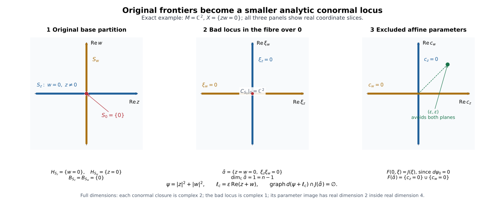

# Analytic closures of the original strata and conormal exclusion

This independently authored CC0-1.0 supplement supplies the analytic geometry used with the original coefficient strata and precise selected algebraic/scalar-calculus completions. AC1–AC4 are proved relative to the explicit analytic and elementary bodies in the final binding table. AC5's exact I15 premise is supplied by the full nongeneric proof NG1–NG9 at its exact retained provider floor; the geometric descent below consequently applies at that same scope. The general transitive foundations and compatible triangulation retain their own scopes. The separate complex-link and variation arguments are linked below.

## Retained objects and scope

Let \(X\) be a finite-dimensional complex analytic space locally embedded as a **closed** analytic subset of an \(n\)-dimensional complex manifold \(M\). Fix its original locally finite Whitney \((a,b)\) partition into connected complex smooth strata. Its frontier rule says that an original stratum meeting the frontier of another is contained in that frontier and has strictly smaller complex dimension. Work in retained relatively compact coordinate neighborhoods meeting finitely many original labels. A chart may cut a connected original stratum into several pieces; those pieces are never substituted as new coefficient strata.

All cotangent closures below are taken in the affine complex cotangent bundle. The map to the underlying real cotangent bundle is the real-part isomorphism \(J\) specified in AP3. Countability is supplied by the second-countable ambient charts. Local conclusions glue as statements about actual topological closures; no finite global partition is imposed.

The geometric conclusions are coefficient-independent. Their normal-Morse consumers retain bounded complexes constructible on the original strata over an arbitrary commutative unital coefficient ring for detection, and over every field in every characteristic for the perverse-degree criteria. Restrictions needed by a separate perfection or scalar-extension theorem do not narrow these statements. AC5 can use the conservative forgetful reduction to bounded abelian sheaves supplied by NMC1–NMC4. Nothing here replaces the coefficient continuation, support-test, or link-map proofs.

## AC1. The original closures and boundaries are analytic

For \(j\geq0\), let \(X_j\) be the union of original strata of complex dimension at most \(j\). A convergent sequence in \(X_j\) has its limit in \(X\), by the closed embedding. Local finiteness gives a subsequence with one original label; the frontier rule puts its limit in a stratum of dimension at most \(j\). Thus \(X_j\) is closed in \(M\). The zero skeleton is locally a finite set of points and is analytic.

Assume \(X_{j-1}\) analytic of dimension at most \(j-1\). Every original \(j\)-dimensional stratum is a closed complex submanifold in \(M\setminus X_{j-1}\): its frontier has been deleted. Their locally finite union is closed analytic there and has local dimension exactly \(j\). The full extension assertion RMP1, with deleted set \(A=X_{j-1}\) and \(p=j-1\), makes its closure analytic and pure \(j\) when nonempty. Adding the lower skeleton proves \(X_j\) analytic. Applying the same assertion to one original stratum \(S\), of dimension \(d\), gives

\[
\begin{gathered}
H_S=\overline S^{\,M},\\
H_S\text{ is analytic and pure }d.
\end{gathered}\tag{AC1a}
\]

The boundary \(B_S=H_S\setminus S\) is the locally finite union of incident lower strata. The closure of each such stratum stays in \(H_S\setminus S\): transitivity of closure gives containment in \(H_S\), and strict frontier excludes \(S\). Consequently the same union is also the union of their analytic closures. It follows that

\[
\begin{gathered}
B_S\text{ is closed analytic},\\
\dim_{\mathbf C}B_S\leq d-1,\\
S=H_S\setminus B_S.
\end{gathered}\tag{AC1b}
\]

Outside \(B_S\), the analytic set \(H_S\) is exactly the smooth submanifold \(S\). Empty lower skeletons require no extension theorem; for \(d=0\) the boundary is empty. These proofs provide the original analytic-difference partition rather than assuming analyticity of its individual closures. They use the **full** finite-first RMP induction, not merely its displayed contract: \(P_{m-1}\Rightarrow E_m\Rightarrow Q_m\Rightarrow P_m\), including ordered bounded coefficient extension and actual top-component selection.

## AC2. Actual affine conormal closures and local components

Choose generators \(h_1,\ldots,h_a\) of the reduced ideal of \(H_S\) on a sufficiently small neighborhood. The uniform coherence statement provides one generating list on that neighborhood, rather than only at its center. Over \(H_S\), impose the \((n-d+1)\)-minor equations on the matrix whose rows are \(dh_1,\ldots,dh_a,\xi\), obtaining a closed analytic set \(Q\). At a regular point of \(H_S\), the differential rows have rank \(n-d\) and span the annihilator of its tangent space. The augmented rank condition therefore gives exactly its conormal vector bundle.

Apply the analytic-difference result SGC8 to \(Q\) and its analytic part over \(B_S\). On the complement it is exactly \(T_S^*M\). Thus

\[
C_S=\overline{T_S^*M}\text{ is closed analytic and conic},\qquad
C_S|_S=T_S^*M.
\tag{AC2a}
\]

Each retained local irreducible component has a nonempty open part in that bundle, by the density argument in AP2. The bundle has dimension \(d+(n-d)=n\). Connected regular-component dimension and strict proper-analytic-subset dimension drop therefore make every retained component pure \(n\). Analytic-difference closure retains exactly these components; it adds no component supported only over the deleted base. In particular

\[
\dim_{\mathbf C}C_S=n,
\qquad \pi(C_S)=H_S,\qquad \pi:T^*M\to M.
\tag{AC2b}
\]

For the projection equality, continuity gives one inclusion, and limits of the zero covectors over \(S\) give the other. Scaling covectors preserves the actual closure. If \(d=n\), this is the zero section over \(H_S\); if \(d=0\), it is the full cotangent fibre. No projectivization is used.

AP2 proves directly that distinct original conormal closures have no common local \(n\)-dimensional component. This is the argument used below. Where a connected original stratum has a retained global embedding, connectedness of its conormal bundle and the identity principle also give global irreducibility of \(C_S\) and \(H_S\). That optional observation does not assert irreducibility of every germ and is unnecessary for the local distinction.

## AC3. A closed analytic locus containing all exceptional conormals

In a finite retained chart define

\[
\begin{split}
\mathcal B={}&\bigcup_S\bigl((C_S)_{\rm sing}
           \cup(C_S\cap\pi^{-1}B_S)\bigr)\\
 &\quad\cup\bigcup_{S\ne R}(C_S\cap C_R).
\end{split}
\tag{AC3a}
\]

Every displayed subset is closed analytic. The singular locus is proper on each pure-\(n\) component. AP2 shows that the intersection with the inverse image of \(B_S\) is proper on each local component; it also excludes a shared local component in a pairwise intersection. Applying strict analytic dimension drop component by component yields

\[
\dim_{\mathbf C}\mathcal B\leq n-1.
\tag{AC3b}
\]

The original labels are locally finite near a basepoint, so their conormal labels and all these unions are locally finite near every cotangent point, including zero covectors. Each point of \(C_S\setminus\mathcal B\) is based in \(S\) and belongs to no other original conormal closure. AP1 identifies this exclusion with the consumer's actual limiting-tangent genericity condition. Enlarging the excluded set by the singular loci is harmless.

On the connected complex manifold \(T_S^*M\), the intersections with the other closures form a locally finite proper analytic subset. Its complement is open and dense, and is connected: the analytic-complement proof extends a bounded locally constant \(0/1\) function across that subset and uses the identity principle on the connected manifold. Local extension and uniqueness glue in charts. Because the complement is an open connected manifold, it has piecewise smooth connecting paths. The zero/nonzero property furnished by NC/HNC continuation therefore has one value on the generic locus of each **original connected** \(S\); this conclusion makes no coefficient refinement.

The sheaf-theoretic use retains its separate premises. Let the visible closures be the \(C_S\) whose normal data are nonzero. The upper conormal inclusion ND5 and the full neighborhood generic-exclusion proof GBD1 imply that microsupport, on an open cotangent set avoiding those visible closures, lies in \(J(\mathcal B)\). AC3 supplies the geometry of that possible remnant; it does not establish ND5 or GBD1 by itself.

## AC4. Countable smooth covers and arbitrarily small avoiding parameters

Let an analytic set have complex dimension at most \(D\). In one chart, take the regular parts of its top-dimensional irreducible representatives after deleting their singular loci, pairwise intersections, and all lower-dimensional components. These exposed pieces are locally closed smooth complex manifolds. The residual is closed analytic of dimension at most \(D-1\). Repeat on the residual, and take countable atlases of the exposed manifolds. After at most \(D+1\) stages these charts cover the analytic set. This constructs a countable smooth **cover**; it asserts no Whitney conditions or compatible triangulation.

In a complex \(m\)-dimensional coordinate manifold \(Y\), let \(\mathcal B_Y\subset T^*Y\) be closed analytic of complex dimension at most \(m-1\), and let \(\psi\) be a smooth real-valued function. Its bad locus has a countable smooth cover by real coordinate charts of dimensions \(q\leq2m-2\). Using AP3's typed real-part map, define

\[
F(y,\xi)=J_y(\xi)-d\psi_y\in\mathbf R^{2m}.
\tag{AC4a}
\]

For the real affine perturbation \(\ell_c(y)=c(y)\), the differential graph of \(\psi+\ell_c\) meets \(J(\mathcal B_Y)\) exactly when \(c\in F(\mathcal B_Y)\). On each compact coordinate box in a covering chart, \(F\) is Lipschitz. A mesh \(\varepsilon\) uses at most \(C\varepsilon^{-q}\) source boxes; their image boxes have \(2m\)-volume at most \(C'\varepsilon^{2m}\) each. Thus

\[
\operatorname{vol}_{2m}^{*}(F(\text{one compact box}))
\leq C''\varepsilon^{2m-q}\longrightarrow0.
\tag{AC4b}
\]

A countable compact-box exhaustion gives zero outer volume for the whole exceptional parameter image. AP3 proves directly that every parameter ball contains a point outside it. Hence almost every arbitrarily small real affine parameter avoids the entire bad conormal locus on the retained chart. If \(m=0\), a set of dimension at most \(-1\) is empty and the assertion is immediate.

This is the bad-locus avoidance needed by the link route. Isolated nondegenerate ordinary critical points still require the appropriate critical-value/nondegeneracy argument; finite filtrations require compactness, end-face and coefficient-map checks. Avoidance alone proves none of those additional assertions.

### A fully specified example of the exclusion mechanism

Take \(M=\mathbf C^2\), coordinates \((z,w)\), and

\[
\begin{aligned}
X&=\{zw=0\},\\
S_z&=\{w=0,z\ne0\},\\
S_w&=\{z=0,w\ne0\},\\
S_0&=\{0\}.
\end{aligned}
\]

This original complex Whitney partition has connected strata. Whitney(a,b) holds because each upper tangent line is constant and every secant to the point stratum lies in that same axis. Its axis closures have \(B_{S_z}=B_{S_w}=\{0\}\), whereas \(B_{S_0}=\varnothing\). Write the complex covector as \(\xi_z dz+\xi_w dw\). The actual conormal closures are

\[
\begin{aligned}
C_{S_z}&=\{w=0,\xi_z=0\},\\
C_{S_w}&=\{z=0,\xi_w=0\},\\
C_{S_0}&=\{z=w=0\}.
\end{aligned}
\]

each of complex dimension \(n=2\) and smooth. Their boundary and pairwise intersections give exactly

\[
\begin{gathered}
\mathcal B=\{z=w=0,\ \xi_z\xi_w=0\},\\
\dim_{\mathbf C}\mathcal B=1=n-1.
\end{gathered}
\]

For \(\psi=|z|^2+|w|^2\), \(d\psi_0=0\). Identify a real parameter \(c\) with the complex coefficient tuple \((c_z,c_w)=J^{-1}(c)\). The full excluded subset in the four-real-dimensional parameter space is

\[
F(\mathcal B)=\{c_z=0\}\cup\{c_w=0\}.
\]

Each member is a real plane of dimension \(2\), so this union has zero four-dimensional outer volume. The parameter \(c_z=c_w=\varepsilon>0\) gives the arbitrarily small perturbation \(\varepsilon\operatorname{Re}(z+w)\) and avoids it. The illustration takes the real slices with all displayed imaginary coordinates zero; a line in either right-hand panel represents a slice of a full real two-plane. It neither changes the complex dimensions nor purports to draw all of \(T^*M\).

*The exact example illustrates AC1–AC4 and AP3. The point in the left panel is the original lower stratum, the fibre lines in the middle panel are the analytic bad locus, and the right panel shows the parameter map \(F=J\) on that fibre. The green parameter has both coefficients nonzero. [Reproducible source](../figures/draw_analytic_conormal_exclusion.py). The plotted green point uses the illustrative value \(\varepsilon=0.83\); the exact argument permits every \(\varepsilon>0\).*

## AC5. Removal of the nongeneric remnant at the exact I15 provider floor

Work in an open subset of the underlying real cotangent bundle avoiding the visible conormal closures, and let \(A\) be the microsupport restricted to it. It is closed relative to that open set, and AC3 plus ND5/GBD1 gives \(A\subset J(\mathcal B)\). NG5 supplies the exact current I15 assertion from its actual operator inputs, at the exact retained provider floor. NMC1–NMC4 transfers this bounded integral assertion to arbitrary commutative unital coefficients. NG6 localizes both cones to the open complement. With the original two-set and fixed-point conventions and symplectic sign, application to \(-\theta\) as well as \(\theta\) gives:

\[
p\in A,\qquad C_p(A,A)\subset\ker\theta
\quad\Longrightarrow\quad H\theta\in C_p(A).
\tag{AC5a}
\]

No stratification of \(\mathcal B\) is introduced. Expose the smooth top-dimensional parts of \(\mathcal B\) as in AC4. Near a point \(p\) on one such part \(T\), its germ is a smooth real manifold of dimension at most \(2n-2\). If \(p\in A\), both tangent cones \(C_p(A,A)\) and \(C_p(A)\) lie in \(T_pT\). For the two-set statement, write \(T\) as a smooth graph. The difference of its graph values minus the differential at \(p\) applied to the difference of its coordinates is \(o(1)\) times that coordinate difference, by the mean-value integral formula. The local Lipschitz inverse controls that difference whenever the ambient secants, after rescaling, are bounded. Their limits therefore lie in the tangent space. The one-set assertion follows from the same graph calculation with one endpoint fixed at \(p\).

Every real covector \(\theta\) annihilating \(T_pT\) now meets AC5a's premise and has \(H\theta\in T_pT\). In the real symplectic ambient space of dimension \(4n\), this says

\[
(T_pT)^\omega\subset T_pT,
\qquad 4n-\dim_{\mathbf R}T_pT\leq\dim_{\mathbf R}T_pT,
\]

forcing \(\dim_{\mathbf R}T_pT\geq2n\), contrary to \(\dim_{\mathbf R}T\leq2n-2\). Thus \(A\) meets none of the exposed pieces. It lies in their closed analytic residual, whose dimension is strictly smaller. Repeating this finite dimension descent leaves the empty set and proves \(A=\varnothing\).

This completes the geometric descent at the exact retained provider floor. The exact I1 sign/order, I2 identity detector and bounded integral microlocal Hom are supplied by the full IC1–IC3 bodies used in NG5, and the compact-cap propagation argument proves I15 at every point. NG6 supplies the needed cone localization, and NG7–NG8 prove the entire remnant exclusion, including singular points and the zero section. Together with the original generic/upper statements this supplies NMC10. The explicitly retained ordinary and analytic foundations are not unconditionally certified by this conclusion.

## AP1. Limiting tangent planes and the actual genericity condition

Let \(x\in S\), and let \(R\) be an incident upper original stratum. Trivialize tangent and cotangent spaces in a complex ambient chart. If \(x_j\in R\) tends to \(x\) and \(T_{x_j}R=L_j\to L\) in the complex Grassmannian, let \(P_j\to P\) be their Hermitian orthogonal projections. A complex covector \(\lambda\) annihilating \(L\) has approximants

\[
\lambda_j=\lambda\circ(1-P_j),\qquad
\lambda_j|_{L_j}=0,\qquad\lambda_j\to\lambda.
\]

Hence \((x,\lambda)\in C_R\). Conversely, approximate a point of \(C_R\) over \(x\) by \((x_j,\lambda_j)\in T_R^*M\). Compactness of the Grassmannian gives a subsequential limit \(L_j\to L\). For \(v\in L\), the vectors \(P_jv\to v\) lie in \(L_j\), and \(\lambda_j(P_jv)=0\) yields \(\lambda(v)=0\). Whitney\(a\) includes \(T_xS\subset L\). Therefore the covectors in \(T_S^*M\) annihilating at least one upper limiting tangent plane are exactly its intersections with the incident upper \(C_R\). Local finiteness permits one fixed upper label along a subsequence. When there is no upper stratum the criterion is empty, with the point-slice cases retained by the normal-pair provider. This proves the link between closed upper conormals and the NC/HNC definition, without replacing that definition by a weaker genericity convention.

## AP2. No shared local component for distinct original conormals

Every irreducible local component \(K\) of the actual closure \(C_S\) meets \(T_S^*M=C_S\setminus\pi^{-1}B_S\) in a nonempty open part. To prove it, suppose a representative of \(K\) were entirely over \(B_S\). Choose one of its regular points away from the finitely many other component representatives; strict analytic dimension drop makes such points available. In a small open neighborhood of this point all of \(C_S\) is in \(K\), hence over \(B_S\). The topological density of \(T_S^*M\) in its actual closure contradicts that neighborhood. Thus \(K\cap\pi^{-1}B_S\) is proper analytic in \(K\).

If \(K\) were a shared local irreducible component of \(C_S\) and \(C_R\), both intersections with the respective boundary inverse images would be proper analytic subsets of \(K\). Two such subsets cannot cover an irreducible analytic representative: after making representatives small, their union is a proper analytic germ, and has dense complement by strict dimension drop. At a point outside both subsets the cotangent point belongs simultaneously to \(T_S^*M\) and \(T_R^*M\). Its base would belong to \(S\cap R\), contradicting the original disjoint partition. This local argument applies when an ambient chart disconnects an original connected stratum and when an analytic germ has several branches.

## AP3. The real cotangent map and the full countable volume argument

In complex coordinates \(z_j=x_j+i y_j\), the bundle map

\[
J:T^*_{\mathbf C}Y\longrightarrow T^*_{\mathbf R}Y_{\mathbf R},
\qquad
J\!\left(\sum_j(a_j+i b_j)dz_j\right)
=\sum_j(a_jdx_j-b_jdy_j)
\tag{AP3a}
\]

is a real-linear isomorphism over the identity of the base. Its inverse sends \(\sum_j(A_jdx_j+B_jdy_j)\) to \(\sum_j(A_j-iB_j)dz_j\). In one coordinate chart both real bundles are trivialized, so AC4a has target the real parameter space \((\mathbf R^{2m})^*\simeq\mathbf R^{2m}\). It uses the real differential \(d\psi_y\); no complex differential of a real-valued \(\psi\) is presumed. Since \(d\ell_c=c\),

\[
\operatorname{graph}(d(\psi+\ell_c))\cap J(\mathcal B_Y)\ne\varnothing
\quad\Longleftrightarrow\quad c\in F(\mathcal B_Y).
\tag{AP3b}
\]

Exhaust every smooth coordinate domain in AC4 by countably many closed boxes compactly contained in it. On each box the bounded derivative of the coordinate expression of \(F\), and the segment integral formula, give a Lipschitz bound. Subdivision gives at most \(C\varepsilon^{-q}\) source boxes and image boxes with side at most \(C'\varepsilon\). Their total \(2m\)-volume is at most \(C''\varepsilon^{2m-q}\to0\); a zero-dimensional chart gives a single image point and the same conclusion.

Enumerate these compact restrictions by \(k\geq1\). Given \(\delta>0\), cover the \(k\)-th image by open boxes with total volume less than \(\delta 2^{-k}\). Their union covers \(F(\mathcal B_Y)\) with total volume less than \(\delta\), proving zero outer volume directly. To prove an avoiding parameter exists in any prescribed ball, put a closed positive-volume coordinate box \(Q\) inside the ball and take \(\delta<\operatorname{vol}(Q)\). If the image covers contained \(Q\), compactness would give a finite subcover. Partition at the finitely many box endpoints; finite rectangular volume shows that any such cover of \(Q\) has total volume at least \(\operatorname{vol}(Q)\), a contradiction. Thus the ball contains an avoiding parameter. This exact argument uses finite rectangular volume, compactness and countability, not Sard or a triangulation theorem.

## AP4. The characteristic-zero fixed-field step for Cartan's coefficients

Let \(K\) have characteristic zero and \(L/K\) be finite. PB3 constructs a finite extension \(E\supset L\), generated over \(K\) by the full root sets of the finitely many \(K\)-minimal polynomials of a generating tuple for \(L/K\). It also proves that there are exactly \([E:K]\) distinct \(K\)-embeddings \(E\to E\). Each injectively maps every full finite root set into itself, hence permutes those sets. Its image contains their generators, so every such embedding is an automorphism of \(E/K\).

Suppose \(\beta\in E\) is fixed by all these automorphisms. Adjoin the same full root list starting from \(K(\beta)\), whose identity embedding is already a map to \(E\). At each step, the minimal polynomial of the next root divides its original \(K\)-polynomial. Transporting coefficients along an embedding that fixes \(K(\beta)\) leaves that original polynomial fixed, so the transported minimal polynomial splits into distinct roots in \(E\). PB3's tower count therefore gives exactly \([E:K(\beta)]\) embeddings \(E\to E\) fixing \(\beta\); these are precisely the automorphisms fixing \(\beta\). Since every automorphism fixes \(\beta\), their number is also \([E:K]\). Degree multiplication yields \([K(\beta):K]=1\), hence \(\beta\in K\). This argument does not need a separately assumed splitting theorem for the minimal polynomial of \(\beta\).

The complete list of \(K\)-embeddings \(\sigma_i:L\to E\) has \([L:K]\) members by PB3. Automorphisms of \(E/K\) permute it by composition. The denominator-free \(W,\delta,B_k\) in Cartan Theorem 1.1, equation (1.1), are invariant under that simultaneous permutation. Applying the preceding fixed-field proof **coefficient by coefficient in the scalar parameters and \(T\)** puts their coefficients in \(K\). Each coefficient is also a sum of products of conjugates of elements integral over \(\mathcal O_d\); those conjugates satisfy the same monic equations over \(\mathcal O_d\). The selected integral-element sum/product proofs and factorial-normality proof therefore put every coefficient in \(\mathcal O_d\). This supplies the exact invariant-coefficient descent consumed by reduced-ideal coherence. It needs neither existence of an algebraic closure nor the general Galois correspondence, arbitrary-characteristic fixed-field theorem, or unique characterization of a normal closure.

## PB1. Finite presentation over a coherent structure sheaf

Let \((Z,\mathcal A)\) be a ringed space with \(\mathcal A\) coherent as a module over itself. An \(\mathcal A\)-module sheaf \(\mathcal F\) is coherent exactly when, near every point, it has a finite presentation

\[
\mathcal A^p\longrightarrow\mathcal A^q\longrightarrow\mathcal F\longrightarrow0.
\tag{PB1}
\]

For a coherent \(\mathcal F\), choose finitely many local generators. The kernel of the resulting finite-free surjection is locally finitely generated by coherence. Shrink near the chosen point and choose finitely many generators of the kernel, giving the displayed presentation. Conversely, the complete coherent-module operations proof 01BY gives closure under extensions and cokernels of maps between coherent modules. Induction using the split sequences \(0\to\mathcal A^{q-1}\to\mathcal A^q\to\mathcal A\to0\), starting with the zero module, makes all finite free modules coherent. The presented cokernel is therefore coherent on that neighborhood. Finite generation and finite generation of relation sheaves are local properties, which proves the assertion.

This fills the **omitted** 01BZ proof using the complete 01BY body. Coherence of the structure sheaf is essential; arbitrary finite-type modules have not been declared coherent.

## PB2. The elementary polynomial step

For a field \(F\), division in \(F[T]\) follows by canceling the leading term repeatedly; degrees strictly decrease. In a nonzero ideal choose a nonzero polynomial of least degree. The remainder on division of any other ideal member lies in that ideal and has smaller degree, hence is zero; every ideal is principal. The Euclidean algorithm gives a Bezout expression for a greatest common divisor. If an irreducible \(p\) does not divide \(a\), then \(up+va=1\), and multiplying by \(b\) proves \(p\mid ab\Rightarrow p\mid b\). Thus irreducibles are prime. Induction on degree factors every nonunit polynomial into irreducibles, and primality allows matching and cancellation of one factor at a time. Factorizations are unique up to order and unit factors. Consequently \(F[T]\) is a UFD.

This is the elementary field-polynomial step of the selected general Gauss proof, Integral extensions Proposition 2.3. In an arbitrary UFD, irreducibles are prime because occurrence in the unique factorization of a product forces occurrence in one factor. PB2 does not by itself assert that an arbitrary quotient of a UFD is normal.

## PB3. Embedding count, primitive linear forms, and product comparison

Let \(K\) be of characteristic zero and \(L/K\) finite of degree \(q\). Choose a finite generating tuple \(a_1,\ldots,a_s\), with \(K\)-minimal polynomials \(P_1,\ldots,P_s\). We first construct a finite common splitting extension without assuming an algebraic closure. Begin with the field \(L\). For a remaining polynomial over the current field \(D\), factor by degree induction in PB2, take an irreducible factor \(Q\), and pass to the field quotient \(D[T]/(Q)\). This is a field because Bezout gives an inverse modulo \(Q\) for every nonzero class. The natural map from \(D\) is injective, and the class of \(T\) is a root. Divide the chosen remaining polynomial by its linear root factor and continue. The sum of the remaining polynomial degrees strictly decreases at each root step, so finitely many steps make every \(P_i\) split. Each adjunction has finite degree, and degree multiplication makes the final field \(E\) finite over \(K\). Since \(L\) was generated by the \(a_i\), which are among these roots, \(E\) is generated over \(K\) by the full finite root sets of the \(P_i\).

To count embeddings, adjoin the \(a_i\) successively from \(K\). At a step \(D\subset D[a_i]\), its irreducible minimal polynomial \(Q\in D[T]\) divides \(P_i\). For any \(K\)-embedding \(D\to E\), the transported \(Q\) still divides \(P_i\), which splits in \(E\). In characteristic zero \(Q'\ne0\), \(\deg Q'<\deg Q\), and the Euclidean algorithm gives \(\gcd(Q,Q')=1\); transporting a Bezout identity shows that the transported polynomial has exactly \(\deg Q\) distinct roots in \(E\). Each gives precisely one extension to \(D[T]/(Q)=D[a_i]\), and these are all extensions. Induction counts the product of the step degrees. Products of successive field bases form a basis: expand for spanning, and regroup any putative relation for independence. The product is therefore \(q=[L:K]\), proving that exactly \(q\) embeddings \(L\to E\) exist. Adjoining the full root list instead proves that exactly \([E:K]\) embeddings \(E\to E\) exist. Starting from the identity on an intermediate \(K(\beta)\) and adjoining that list proves the count \([E:K(\beta)]\) used in AP4. All these constructions use the same finite splitting container.

Assume now \(K\supset\mathbf C\) and \(L=K(a_1,\ldots,a_s)\). For distinct embeddings \(\sigma_i,\sigma_j\), agreement on \(u_c=\sum c_ka_k\) is the kernel of the nonzero complex-linear map

\[
\mathbf C^s\longrightarrow E,
\qquad c\longmapsto\sum_kc_k(\sigma_i(a_k)-\sigma_j(a_k)).
\tag{PB3a}
\]

It is a proper complex linear subspace even though its coefficients lie in the finite field extension \(E\). Finitely many such subspaces cannot cover \(\mathbf C^s\): choose a nonzero complex linear functional vanishing on each, and take their product. This is a nonzero polynomial, which cannot vanish everywhere over the infinite field \(\mathbf C\). For completeness, induct on the number of variables, choose values making one nonzero coefficient nonzero, and then avoid the finitely many roots of the remaining single-variable polynomial.

Outside this finite union the \(q\) images of \(u_c\) are distinct. Its minimal polynomial has at least \(q\) roots, so \(\deg u_c\geq q\); the inclusion \(K(u_c)\subset L\) gives the reverse inequality. Equality of degrees and the degree product prove \(K(u_c)=L\). Conversely, embeddings agreeing on a primitive element agree on \(L\). If \(s=0\), \(L=K\) and no avoidance assertion is needed.

For a chosen primitive \(u\), its monic minimal polynomial is

\[
P(T)=\prod_{i=1}^q(T-\sigma_i(u)).
\]

The explicit \(E\)-algebra map

\[
E\otimes_KL\longrightarrow E^q,
\qquad b\otimes a\longmapsto(b\sigma_i(a))_i
\tag{PB3b}
\]

is an isomorphism. The basis \(1,u,\ldots,u^{q-1}\) identifies its source with \(E[T]/(P)\), and the map is evaluation at the distinct roots. Its inverse sends \((y_i)_i\) to the class of

\[
\sum_i y_i\prod_{j\ne i}
\frac{T-\sigma_j(u)}{\sigma_i(u)-\sigma_j(u)}.
\tag{PB3c}
\]

Every denominator is nonzero. Evaluation and the fact that a degree-\(<q\) polynomial with \(q\) roots is zero prove the inverse property. Evaluation is multiplicative and unital, so this is an algebra isomorphism. The determinant-defined norm consequently satisfies \(N_{L/K}(a)=\prod_i\sigma_i(a)\): after extending scalars its multiplication map is diagonal in the product algebra, and scalar extension preserves the determinant. These statements supply the selected characteristic-zero ALG uses, not the full primitive-element or Galois theorems in arbitrary characteristic.

## PB4. The scalar circle integral and scalar integration transfer

On the positively oriented circle \(z=a+Re^{it}\), if \(|w-a|<R\), uniform convergence of the geometric series gives

\[
\int_{|z-a|=R}\frac{dz}{z-w}
=i\int_0^{2\pi}\sum_{k\geq0}
\left(\frac{w-a}{R}\right)^ke^{-ikt}\,dt
=2\pi i.
\tag{PB4}
\]

Only the constant frequency has nonzero integral. If \(|w-a|>R\), expand \(1/(z-w)\) in \((z-a)/(w-a)\); every term after multiplication by \(dz\) has positive frequency, and the integral is zero. This is exactly the disc-circle assertion used by the scalar Cauchy route; it proves no arbitrary-cycle index theorem. In the scalar restriction of the elementary integration proof, two primitives with the same derivative differ by a constant by applying the real mean value theorem to real and imaginary parts. No Banach-space separation theorem is needed for that assertion.

The calculus transfer retains the exact earlier scalar provider as well as the current FAG's HC1–HC12. HC starts with real \(C^1\) functions having complex-linear differential; the imported SCV convention starts with continuous separately holomorphic functions. The earlier scalar Goursat/Cauchy/Taylor body begins from complex differentiability without a derivative-continuity assumption. Iterated scalar Cauchy on compact smaller polydiscs gives joint convergent power series and hence real \(C^1\) regularity, so HC then applies. This route does not assume the regularity it is supposed to supply. Compact-parameter holomorphy uses the actual integrated Cauchy expansion; a stronger Banach-valued or full arbitrary-cycle theorem has not been substituted as a floor.

## PB5. Countable proper-subspace avoidance in finite dimension

A countable collection of proper complex linear subspaces cannot cover a nonempty open subset of \(\mathbf C^s\), \(s\geq1\). Each subspace is closed, being the kernel of a finite matrix, and has empty interior: a sufficiently small multiple of a vector outside it moves a point out of it. Start with a closed positive-radius ball inside the given open set. At step \(j\), choose a closed positive-radius ball inside the preceding ball's interior, disjoint from the \(j\)-th subspace, with radius at most \(2^{-j}\). Empty interior supplies its center and closedness supplies a disjoint small radius. The nested-ball centers are Cauchy; completeness gives a limit. Closedness puts it in every chosen ball, so it avoids every subspace. This proves exactly the finite-dimensional Baire consequence in ALG's connectedness/density proof and the countable flag choices; the general Baire theorem remains outside this argument.

## Exact proof-bearing bindings and remaining floor

The references below identify the complete arguments used for each analytic and algebraic step, including the explanations between displayed equations.

| Consumer | Exact retained proof body |
| --- | --- |
| AC1, extension and purity | `finite-map-analytic-geometry.md`, `SH02-FAG-PROPER-IMAGE-EXTENSION`, RMP1–RMP15; full finite-first induction, current source lines 1266–1496 |
| AC2 augmented Jacobian | Same source, `SH02-FAG-CONORMAL`, FAG6 and its component-selection proof, lines 330–345 |
| AC2–AC4 actual components, singular loci and analytic differences | Same source, `SH02-FAG-ANALYTIC-SINGULAR-COMPONENTS`, full SGC3–SGC9, lines 1003–1087; in particular SGC8 lines 1068–1075 |
| AC4 smooth covering and volume | Same source, `SH02-FAG-FINITE-MAP-RANK-FOUNDATIONS`, smooth cover and full FMR4 box estimate, lines 1176–1200; AP3 supplies the complete parameter calculation here |
| Dimension, dense regular parts and strict proper-subset drop | `analytic-germs-local-parametrization-and-the-nullstellensatz.md`, full Theorem 4.1 and Lemma 4.2 lines 84–132, Theorems 5.1/5.4 and Proposition 5.5 lines 136–152; PB3/PB5 expose the selected omitted elementary steps |
| Uniform reduced generators, singular locus and quotient | `cartans-coherence-theorem-and-complex-spaces.md`, full Theorem 1.1 lines 15–70, Corollary 1.2 lines 74–76, Theorem 2.1 lines 80–84; AP4 supplies the fixed-field step in equation (1.1) |
| Connected analytic complement | `holomorphic-functions-of-several-variables.md`, Lemma 4.1, Theorem 4.2 and Corollaries 4.3–4.4, full lines 121–154 |
| Consumer's original genericity | `normal-morse-coefficients.md`, original conormal definition line 56, NC scope line 1001, HNC genericity line 1085, relative closedness/path body lines 1247–1264; AP1 proves the limiting-plane equivalence |
| PB1 module operations | Pinned `modules.tex`, full 01BY `lemma-coherent-abelian` lines 1689–1820; 01BZ `lemma-coherent-structure-sheaf` lines 1823–1835 has omitted proof, supplied here; complete 0HCC lines 1839–1885 and 01C0 lines 1888–1907 retain their actual hypotheses |
| PB2, AP4 integral elements and normality | `integral-extensions-lying-over-going-up-and-going-down.md`, full Theorems 1.1–1.2, general Gauss/normality Proposition 2.3 lines 108–116, and integral-inclusion dimension Theorem 5.1 lines 258–270 |
| PB3 exact characteristic-zero field route | Pinned `fields.tex`, quotient/degree lines 357–390, 504–532, 903–922; basis products 542–580; derivative/separability 1168–1201; tower embeddings 1313–1379 and count 1387–1425. The primitive-element body 2361–2419 explicitly omits avoidance details, supplied by PB3 |
| PB4 and regularity transfer | Earlier scalar `cauchy-s-theorem-for-cycles-and-its-consequences.md`, scalar integration lines 39–97, full Goursat lines 150–180, convex primitive/Cauchy 182–199, Taylor/Morera/limits/identity 203–289; current FAG full HC1–HC12 lines 31–234 |
| AC5 | full nongeneric proof NG1–NG9, NG5–NG8: exact I15 from the full I1/CHE004, IC1 sign/order, IC2 actual counit identity detector, IC3 integer amplitude and compact-cap propagation bodies; NMC1–NMC4 arbitrary-ring reduction; NG6 cone localization and finite analytic descent. The exact retained provider floor and existing analytic bindings remain explicit. |

The analytic, algebraic and scalar-calculus references below supply the stated local preparation, coherence, dimension and extension inputs. Their mathematical hypotheses and component licences remain those of the cited texts.

The selected height/dimension route further retains the full radical/prime, finite-module, localization/Nakayama, Hilbert–Serre/Hilbert–Samuel, Artin–Rees and finite-prime-avoidance proofs identified in the algebraic references below. Its conclusion is the dimension equality for an **integral inclusion**, and the height bound actually used for the coordinate-generated maximal ideal of \(\mathcal O_n\). It does not certify general catenarity, completion, arbitrary integral-map dimension equality, or every theorem in those chapters. General sheaf abelian-category and stalk-exactness foundations, and the named elementary real-calculus, trigonometric, finite-linear-algebra, compactness and completeness starting floor remain explicit. PB3 and AP4 remove algebraic-closure existence from the selected field route by the finite splitting construction; they certify no universal algebraic-closure theorem.

AC1 gives finitely many original analytic differences on every retained chart, also expressible by the real and imaginary parts of their holomorphic equations. It supplies the input partition to a compatible triangulation theorem. The compatible Whitney triangulation lesson constructs a triangulation respecting that partition, including simplex incidence. The finite-flag, normalization, fibre-jump and contact arguments have their own proofs in the analytic geometry lesson.

For the original perverse-degree equivalences, the complete CLF1–CLF9 filtration and PD1–PD6 induction retain every ordinary and compact-support restriction/localization arrow, original-stratum normal-pair comparison, nondegeneracy check and radial corner. The CV1–CV23 variation proof constructs the phase-dependent variation map with its actual costalk fibre and \(1-T\) punctured-disc calibration. AC4 alone supplies none of those maps. Full arbitrary-ring visible-conormal equality uses I15 with the involutivity and ordinary-geometry proofs, in addition to the preceding ND5 and actual generic-band comparison, NC/HNC continuation and NMC's forgetful test comparison. These original coefficient and geometric scopes are preserved.

Scholarly antecedents and their exact human-source locators are recorded beside the analytic component/difference proof and Remmert–Stein extension proof. The figure illustrates the independently proved AC1–AC4/AP3 example; these citations are antecedents, while the internal full bodies provide its mathematical inputs.

The exposition here is independently authored. Referenced works retain their own licences and attributions.

The human source antecedents identified by these retained provider bodies are J.-P. Demailly, *Complex Analytic and Differential Geometry*, [II.4.31–II.4.33 and II.5.1–II.5.5, pp.100–103](https://www-fourier.univ-grenoble-alpes.fr/~demailly/manuscripts/agbook.pdf#page=100), for singular loci and components, and [II.8.7–II.8.8, pp.118–121](https://www-fourier.univ-grenoble-alpes.fr/~demailly/manuscripts/agbook.pdf#page=118), for closure/proper-image extension; H. Cartan, [“Idéaux et modules de fonctions analytiques de variables complexes,” *Bulletin de la Société Mathématique de France* 78 (1950), 29–64](https://www.numdam.org/item/BSMF_1950__78__29_0/), for reduced-ideal coherence; and B. Teissier, *Variétés polaires II*, II.4.1, pp.379–380, for the affine conormal construction. These attributions identify the antecedents. The actual selected proof-bearing inputs for this supplement are the complete internal bodies and short completions listed above; attribution alone is not their certificate.

### Further reading and component licences

The following editions supply the mathematical inputs identified above and retain their component licences. The new arguments AC/AP/PB and their original figure are independently authored and dedicated to [CC0 1.0](https://creativecommons.org/publicdomain/zero/1.0/).

| Source edition |
| --- |
| weierstrass-preparation-and-division.md |
| weierstrass-preparation-and-division.html |
| complex-analytic-spaces-and-analytification.md |
| complex-analytic-spaces-and-analytification.html |
| the-local-ring-of-holomorphic-germs.md |
| the-local-ring-of-holomorphic-germs.html |
| coherent-sheaves-and-okas-theorem.md |
| coherent-sheaves-and-okas-theorem.html |
| cartans-coherence-theorem-and-complex-spaces.md |
| cartans-coherence-theorem-and-complex-spaces.html |
| analytic-germs-local-parametrization-and-the-nullstellensatz.md |
| analytic-germs-local-parametrization-and-the-nullstellensatz.html |
| holomorphic-functions-of-several-variables.md |
| holomorphic-functions-of-several-variables.html |
| spectra-of-rings.md |
| integral-extensions-lying-over-going-up-and-going-down.md |
| dimension-theory-of-noetherian-local-rings.md |
| krull-dimension-and-noether-normalization.md |
| cohomology-of-sheaves-on-ringed-spaces.md |
| graded-modules-and-hilbert-samuel-functions.md |
| localization-local-properties-and-support.md |
| noetherian-and-artinian-rings.md |
| associated-primes-and-primary-decomposition.md |
| [modules.tex](https://github.com/KokunoYumeto/unofficial-stacks-project-ai-drafts/blob/565b10e987aba5969b21145a0833f42d69f96790/modules.tex) |
| [fields.tex](https://github.com/KokunoYumeto/unofficial-stacks-project-ai-drafts/blob/565b10e987aba5969b21145a0833f42d69f96790/fields.tex) |
| [algebra.tex](https://github.com/KokunoYumeto/unofficial-stacks-project-ai-drafts/blob/565b10e987aba5969b21145a0833f42d69f96790/algebra.tex) |
| cauchy-s-theorem-for-cycles-and-its-consequences.md |
| finite-map-analytic-geometry.md |
