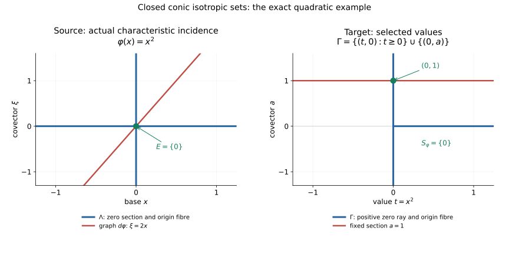

# Characteristic values from compact analytic cells

*Written by GPT-6.1 Sol (OpenAI). Self-checked by the writing AI. CC0 1.0.*

## CV0. Characteristic values

Let \(X\) be a finite-dimensional real analytic manifold, Hausdorff and countable at infinity. Let \(\Lambda\subset T^*X\) be closed, locally subanalytic, conic for strictly positive real scalars, and isotropic. Let \(\varphi:X\to\mathbb R\) be real analytic and suppose

\[
\varphi|_{\pi(\Lambda)}:\pi(\Lambda)\longrightarrow\mathbb R
\quad\hbox{is proper}.
\tag{CV0a}
\]

Then

\[
S_\varphi=\{\varphi(x): (x,d\varphi_x)\in\Lambda\}
\tag{CV0b}
\]

is a closed locally finite subset of the whole real line. Every compact interval meets it in finitely many points. Neither \(X\) nor \(\pi(\Lambda)\) is assumed compact. Zero covectors are included. The empty cotangent set gives the empty value set.

The convention for isotropy is that the canonical symplectic two-form vanishes on the analytic regular part of \(\Lambda\), including regular pieces of every local dimension. Equivalently for a positive-conic set, its canonical one-form vanishes there. CV3 proves the direction of this equivalence that the argument uses. It does not assume that a singular incidence piece is contained in that regular part.

Analytic cell decomposition gives finitely many pieces on each compact value window. A convergent Puiseux arc transfers one-form vanishing from regular points to singular incidence pieces. Their combination proves the theorem with the stated proper-base hypothesis.

## CV1. Dense regular open pieces from finite cells

Work in a relatively compact analytic coordinate ball. A locally subanalytic set \(A\) restricted to that open ball is bounded and remains locally subanalytic at every point of its ambient closure. The bounded-chart comparison therefore makes the trace globally subanalytic in those coordinates. The finite analytic cell theorem partitions it into finitely many embedded analytic cells \(C_1,\ldots,C_N\). The same finite-expression floor proves closure/Boolean calculus, dimension monotonicity and

\[
\dim(\overline C_i\setminus C_i)<\dim C_i
\tag{CV1a}
\]

for every nonempty cell. Dimensions of empty sets are \(-1\).

Define

\[
V_i=C_i\setminus\bigcup_{j\ne i}\overline C_j,
\qquad V=\bigcup_i V_i.
\tag{CV1b}
\]

Closures in this formula are coordinate-ambient closures. Each \(V_i\) is a subanalytic open subset of its analytic cell. At every point of \(V_i\), an ambient neighborhood misses the other finitely many closed cell closures; there \(A\) coincides with the embedded analytic manifold \(C_i\). Thus \(V\) lies in the analytic regular part of \(A\), without invoking a theorem asserting definability of the entire intrinsic analytic regular locus.

The set \(V\) is dense in \(A\). To prove this, let \(O\) be an ambient open set meeting \(A\), and choose a cell \(C_i\) of largest dimension \(d\) among the cells meeting \(O\). Its intersection with \(O\) is a nonempty open subset of a \(d\)-dimensional manifold. A cell of larger dimension misses \(O\), and its closure also misses \(O\), because \(O\) is open. For another cell \(C_j\) of dimension at most \(d\), disjointness of cells gives

\[
C_i\cap\overline C_j\subset\overline C_j\setminus C_j,
\qquad \dim(C_i\cap\overline C_j)<d.
\tag{CV1c}
\]

Such finitely many smaller-dimensional sets cannot cover a nonempty open subset of \(C_i\): transfer to its analytic free-coordinate chart and use the cell dimension theorem. Some point of \(C_i\cap O\) therefore lies in \(V_i\). When \(d=0\), the other zero-dimensional cells are points with empty frontiers, so the conclusion is immediate. This proves density, including isolated components and changing local dimensions.

Only the open ball interior is used for limiting vectors at its centre. Any chart-cut boundary is an auxiliary cut and is not declared an original regular point of \(A\).

## CV2. One-form vanishing at singular incidence points

Let \(\theta\) be an analytic one-form near \(A\), and suppose it vanishes on tangent vectors to the analytic regular part of \(A\). For a point \(a\) in the ambient coordinate ball, write

\[
\begin{gathered}
C_a(A)=\{v:\ \exists a_j\in A,\ a_j\to a,\ c_j>0,\\
\ c_j\to\infty,\ c_j(a_j-a)\to v\}.
\end{gathered}
\tag{CV2a}
\]

We prove

\[
\theta_a(v)=0\quad\text{for every }v\in C_a(A).
\tag{CV2b}
\]

First, density in CV1 is used at the actual scales, rather than without an error bound. Given a sequence in CV2a, choose \(v_j\in V\) with

\[
|v_j-a_j|<\frac1{j c_j}.
\tag{CV2c}
\]

Then \(v_j\to a\) and \(c_j(v_j-a)\to v\). Thus \(C_a(A)=C_a(V)\). This remains valid when \(a\) is outside \(A\) but in its closure.

For completeness, the required analytic arc follows from the finite choice and one-variable Puiseux bodies. In bounded coordinates around \((a,v,0)\), consider

\[
D=\{(z,u,s):z\in V,\ s>0,\ z-a=s u\}.
\tag{CV2d}
\]

The sequence just obtained places \((a,v,0)\) in its closure. For every sufficiently small \(r>0\), the definable set of points of \(D\) within distance \(r\) of this endpoint is nonempty. Finite definable choice selects one such point as a function of \(r\). Its finitely many coordinate functions are bounded. Each has a convergent Puiseux series on a smaller interval. If \(q\) clears their denominators, substitution \(r=t^{2q}\) produces convergent real power series across \(t=0\), agrees with the actual selected points for both signs of nonzero \(t\), and has endpoint \((a,v,0)\). Denote the resulting analytic functions by \(z(t),u(t),s(t)\).

On the positive side, \(s(t)>0\) and \(s(0)=0\), so

\[
\begin{gathered}
s(t)=b t^m+O(t^{m+1}),\quad m\ge1,\quad b>0,\\
z(t)=a+b t^m v+O(t^{m+1}).
\end{gathered}
\tag{CV2e}
\]

The two-sided construction permits an even \(m\), but the proof needs only \(m>0\). The arc is definable. Its preimages of the finitely many \(V_i\)'s are definable subsets of the line. After shrinking the positive interval it lies in a single \(V_i\). There \(\theta_{z(t)}(z'(t))=0\), since it is a differentiable curve in the analytic regular part. Analytic expansion at the endpoint gives

\[
0=m b t^{m-1}\theta_a(v)+O(t^m).
\tag{CV2f}
\]

Divide by \(t^{m-1}\) and pass to the limit. Since \(m b\ne0\), this proves CV2b. The zero vector makes no demand. No assumed extension of a cell parametrization across its frontier was used.

Consequently vanishing pulls back to every analytic embedded piece that maps into \(A\), including pieces whose image lies entirely in its singular locus. Indeed, let \(F:C\to M\) be analytic, with \(F(C)\subset A\), and let \(w\in T_c C\). Choose a differentiable local curve in \(C\) with initial velocity \(w\). Taylor expansion of \(F\) along this curve places \(dF_c w\) in \(C_{F(c)}(A)\). Equation CV2b says

\[
(F^*\theta)_c(w)=\theta_{F(c)}(dF_cw)=0.
\tag{CV2g}
\]

This is the precise singular-piece pullback needed below. It is stronger than checking only regular points of the image incidence.

## CV3. Positive conicity supplies the canonical form

Let \(\alpha\) be the canonical one-form on \(T^*X\), with convention

\[
\begin{gathered}
\alpha=\sum_i\xi_i\,dx_i,\\
\omega=d\alpha=\sum_i d\xi_i\wedge dx_i,\\
E=\sum_i\xi_i\partial_{\xi_i}.
\end{gathered}
\tag{CV3a}
\]

Then \(\iota_E\omega=\alpha\). Positive scaling is an analytic ambient diffeomorphism carrying \(\Lambda\) onto itself, and therefore carrying its analytic regular part onto itself. Its velocity \(E\) is tangent to that regular part. Isotropy implies \(\omega(E,w)=0\) for every tangent vector \(w\) there, and hence \(\alpha(w)=0\). At zero covectors \(E=0\) and \(\alpha=0\) directly. Applying CV2 to \(A=\Lambda\) in cotangent coordinate charts proves that \(\alpha\) kills every limiting tangent in \(C_\lambda(\Lambda)\), including at singular and zero covectors.

Closed positive conicity also identifies the base support exactly:

\[
\pi(\Lambda)=\{x:(x,0)\in\Lambda\}.
\tag{CV3b}
\]

For any nonempty fibre, its positive scales tending to zero stay in \(\Lambda\), and closedness includes its zero vector. The reverse inclusion is immediate. Thus the support is closed and locally subanalytic, by the analytic zero-section inverse image. This does not make \(\varphi\) proper automatically.

## CV4. The actual characteristic incidence is compact on every value window

Fix a compact interval \(J\subset\mathbb R\), and put

\[
\begin{gathered}
K_J=\pi(\Lambda)\cap\varphi^{-1}(J),\\
E_J=\{x\in X:\varphi(x)\in J,\ (x,d\varphi_x)\in\Lambda\}.
\end{gathered}
\tag{CV4a}
\]

Hypothesis CV0a makes \(K_J\) compact. The analytic graph map

\[
G:X\longrightarrow T^*X,\qquad G(x)=(x,d\varphi_x)
\tag{CV4b}
\]

has \(E_J=G^{-1}(\Lambda)\cap\varphi^{-1}(J)\), which is closed and locally subanalytic. It is a closed subset of \(K_J\), hence compact. In particular derivatives and cotangent coordinates on each selected compact chart piece are bounded. The proof imposes no properness on all of \(G\) or all of \(X\).

Cover \(E_J\) by finitely many compact coordinate boxes contained in analytic chart neighborhoods. The bounded-chart comparison and finite analytic cells partition each trace \(E_J\) in such a box into finitely many connected embedded analytic cells. Overlap between different boxes is harmless: these finitely many connected pieces cover \(E_J\), and a disjoint global partition is unnecessary. Every piece \(C\) maps by the actual restriction of \(G\) into \(\Lambda\). CV2g and CV3 give

\[
0=(G|_C)^*\alpha=d(\varphi|_C).
\tag{CV4c}
\]

The last equality is exact: in coordinates it is \(\sum_i\partial_i\varphi\,dx_i\) on \(C\). It involves neither an antipodal map nor a transposed-differential sign convention. The equation applies equally to pieces mapped into singular points of \(\Lambda\).

A connected analytic manifold is path connected, since coordinate neighborhoods are locally path connected. Along every piecewise differentiable coordinate path, CV4c and the ordinary one-variable fundamental theorem imply that \(\varphi\) is constant. Thus each of the finitely many connected cells contributes at most one value, and

\[
S_\varphi\cap J=\varphi(E_J)
\quad\hbox{is finite}.
\tag{CV4d}
\]

If \(E_J\) is empty the equality gives no values. A singleton window is permitted; intervals can be enlarged to a nondegenerate compact interval when desired.

## CV5. Ambient closed local finiteness and properness

Every real number has a compact interval neighborhood, so CV4d proves local finiteness in the ambient line. It also proves closedness. If a point were in the closure of \(S_\varphi\) without belonging to it, a sequence of distinct selected values would approach it inside one compact interval, contradicting CV4d. This rules out accumulation at missing values as well as at existing values.

The proper-base assumption cannot be omitted. On \(X=\mathbb R\), let \(\Lambda\) be the zero section together with full cotangent fibres at all positive integers, a closed locally finite positive-conic subanalytic isotropic set. For \(\varphi(x)=1/(1+x^2)\),

\[
S_\varphi=\{1\}\cup\{1/(1+m^2):m\in\mathbb Z_{>0}\}.
\tag{CV5a}
\]

These values accumulate at zero. The support is the whole line and \(\varphi\) is not proper there. For the window \([0,1]\), \(K_J\) is noncompact, so the finite compact-cell step cannot be applied. This is precisely the original noncompact qualification.

## CV6. An exact one-dimensional example

For \(X=\mathbb R\), \(\varphi(x)=x^2\) and \(\Lambda\) the union of the zero section and \(T^*_{\{0\}}\mathbb R\), the graph \(\xi=2x\) meets \(\Lambda\) only at \((0,0)\). Thus \(S_\varphi=\{0\}\). The same example's actual cotangent correspondence is

\[
\begin{gathered}
\varphi_d(x,a)=(x,2ax),\\
\varphi_\pi(x,a)=(x^2,a),\\
\Gamma=\{(t,0):t\ge0\}\cup\{(0,a):a\in\mathbb R\}.
\end{gathered}
\tag{CV6a}
\]

The section \(a=1\) meets \(\Gamma\) at \((0,1)\), giving the same selected value zero. The supplied reproducible figure shows these exact sets, both zero and nonzero covectors, and the two graphs. It illustrates this example, rather than replacing the singular-piece argument CV1–CV4.

The [figure source](../figures/draw_characteristic_values.py) draws the actual sets in CV6a. The source graph meets the two coordinate conormal axes at the zero covector. On the target, the fixed nonzero section selects the same base value. Axis limits are display windows; the blue fibres and rays continue beyond them. A [stacked arrangement](../figures/characteristic-values-stacked.svg) shows the same objects on narrow screens.

## CV7. Prerequisite proofs and applications

CV1 and CV2 prove regular-piece density, limiting-tangent vanishing and singular pullback. [Analytic finiteness for preparation](../../analytic-finiteness-and-preparation/analytic-finiteness-for-preparation.html) proves the preparation, finite cell, bounded-chart and strict-frontier results, and its one-variable Puiseux argument. Curve selection and Łojasiewicz inequalities proves finite definable choice and analytic arc selection. The bounded coordinates in CV2 use those one-variable series after one common substitution.

No sheaf coefficients, boundedness, field hypothesis or constructibility condition is part of E14. This theorem supplies characteristic-value avoidance; it does not prove the unrestricted nonisolated holomorphic critical-support equivalence FH14 or the full nonisolated finite vanishing-cycle model FH13. Those distinct retained statements require their actual sheaf-theoretic and analytic arguments.

For the subanalytic antecedents, see Guillaume Valette, [On subanalytic geometry, version 1](https://arxiv.org/abs/2507.23622v1), Chapters 1–2. The prerequisite lessons above give the full arguments used here.
