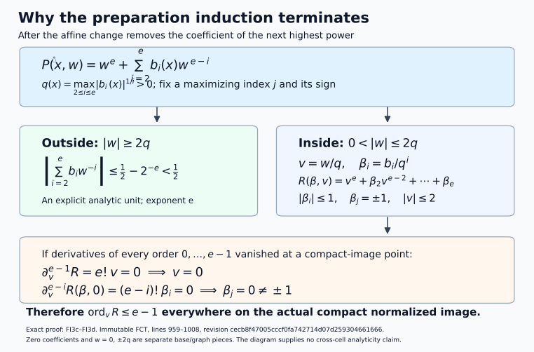
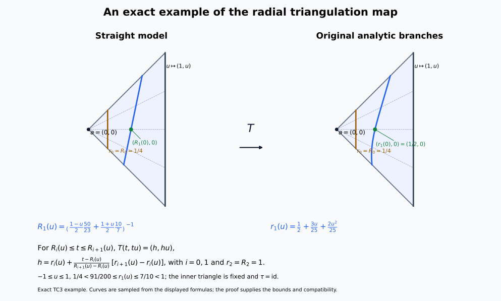

# Compatible triangulation for the original analytic Whitney strata

This independently authored supplement is dedicated to [CC0 1.0](https://creativecommons.org/publicdomain/zero/1.0/). It proves the standalone compatible-triangulation input for the original locally finite complex analytic Whitney range. The exact selected internal proof bodies and the finite starting floor are recorded below; their imported sources retain their own attribution and reuse terms.

## Theorem and retained objects

Let \(X\) be a complex analytic manifold, or a closed analytic subset of a complex manifold \(M\); in the manifold case take \(M=X\). All manifolds have finite dimension, are Hausdorff and are countable at infinity. Retain the original locally finite complex analytic Whitney \((a,b)\) partition into connected smooth strata, with its strict-dimension frontier rule. For the actual normal pair of the original NMC5, retain the complex analytic normal slice \(N\), real analytic squared coordinate radius \(r\), holomorphic function \(g\) and chosen value \(w\), so

\[
\begin{aligned}
K&=X\cap N\cap\{r\le\epsilon\},\\
L&=K\cap\{g=w\}.
\end{aligned}
\tag{CT0}
\]

Both sets are the prescribed closed compact sets. There is a countable locally finite finite-dimensional linear simplicial complex \(Q\), with closed support in a finite Euclidean space, and a locally subanalytic homeomorphism \(h:|Q|\to M\), compatible with every original stratum and with \(X,K,L\). Its restriction to every open simplex is an analytic diffeomorphism onto an analytic embedded submanifold. The inverse images of \(X,K,L\) are subcomplexes, and those of \(K,L\) are finite subcomplexes. Thus the original normal pair has an actual finite compatible triangulation, including its simplex incidences.

The geometric theorem imposes no condition on coefficient modules. A bounded complex of sheaves over any commutative unital ring, with locally constant cohomology on the original strata, retains that property on the simplex images in \(X\). Finite global dimension and perfect stalks enter only the separate original perfection conclusion. The theorem retains the original labels; chart cuts and auxiliary analytic cells are construction pieces.

## Finite starting floor and proof route

The analytic-difference input for the original labels is [AC1 of the analytic geometry lesson](../analytic-conormal-closures.html#AC1). Its complete proof includes the Remmert–Stein finite-first extension induction; PB4 supplies the scalar Cauchy, Goursat and Taylor convention. These inputs retain their stated analytic hypotheses.

The real subanalytic floor is the complete finite-expression preparation proof in the immutable FCT source, followed by its arbitrary-set analytic cell theorem, Boolean/projection calculus, bounded-chart comparison, dimension/frontier proof and finite definable choice. The provider ranges below are full proof bodies, including the paragraphs between numbered equations. Preparation uses the two decreasing inductions on ambient dimension and the integer analytic-order bound; the cell and complement deductions occur afterwards. WP0 supplies finite polynomial splitting in the used Weierstrass proof from its own circle-count lemma and the admitted scalar calculus. No algebraic-closure-existence theorem is an additional floor.

FCT, SH03 and CHOICE are the keys in the exact binding table. WPD denotes the table's WEIERSTRASS source. Their line locators always refer to the pinned Markdown source bytes, rather than rendered-page line numbers.

The remaining named elementary starting floor is finite polynomial/linear/affine algebra; real rational powers on their stated real branches; elementary real differentiation, integration and mean-value calculus; Euclidean topology, finite maxima/minima, compactness, completeness and countability; and box-volume outer measure with countable subadditivity. The analytic inverse, implicit and constant-rank coordinate bodies and the finite homogeneous ODE zero-uniqueness estimate have exact full internal locators below. The finite-module, Hilbert/Rees, Artin–Rees, Krull and convergent-linear replacement proofs are supplied within FCT 14–178. No manifold triangulation, covering-dimension theorem, analytic embedding theorem, uniformization, resolution, intrinsic analytic regular-locus theorem, Sard theorem or Baire theorem is an imported premise of this route.

TC1 verifies the original labels and actual pair. TC2 supplies the exceptional-line assertion by finite analytic jet incidence and box volume. TC3 gives the relative finite-simplex construction at the exact internal proof body. TC4 supplies globalization, including the finite-colour cover, the proper embedding and analytic coordinate recovery. TC5 extracts the finite closed pair and records the unchanged coefficient scope.

### The strict analytic-order decrease used in preparation

This equation diagram records the actual normalized polynomial and the two complementary regions in the complete FCT preparation proof, lines 959–1008 at the pinned revision in the binding table. After the next-highest coefficient is removed, \(q=\max_{2\le i\le e}|b_i|^{1/i}\). The outside region has the explicit unit bound \(1/2-2^{-e}<1/2\); on the inside region \(v=w/q\), \(\beta_i=b_i/q^i\), \(|\beta_i|\le1\), and a maximizing coefficient is \(\beta_j=\pm1\). Vanishing of all derivatives of orders zero through \(e-1\) forces \(v=0\) and every \(\beta_i=0\), a contradiction. Thus the integer order decreases on the actual compact normalized image. Zero coefficients, zero height and joining graphs are separate pieces. This is an exact proof-mechanism diagram. [Reproducible CC0 figure source](../figures/draw_preparation_order_descent.py).

## WP0. Finite polynomial splitting from the used circle-count lemma

WPD 130 invokes factorization of complex polynomials into linear factors. WPD's division proof also writes its monic divisor as a product of roots. The scalar floor already supplies a finite proof of exactly this import.

Let

\[
P(w)=w^s+a_1w^{s-1}+\cdots+a_s,\qquad s\ge1.
\tag{WP0a}
\]

Choose \(\rho>0\) so that \(A=\sum_{k=1}^s|a_k|\rho^{-k}<1\), and for \(t\in[0,1]\) put \(P_t(w)=w^s+t\sum_{k=1}^sa_kw^{s-k}\). On \(|w|=\rho\),

\[
|P_t(w)|\ge(1-A)\rho^s>0.
\tag{WP0b}
\]

WPD Lemma B, whose full proof is 49–70, applies to each entire polynomial \(P_t\). That proof first removes its finitely many *actual* isolated zeros in the disc using Taylor multiplicities and then integrates the remaining zero-free factor's logarithmic derivative by scalar Cauchy. It does not assume polynomial splitting or the existence of any zero. Therefore

\[
N(t)=\frac{1}{2\pi i}\int_{|w|=\rho}\frac{P_t'(w)}{P_t(w)}\,dw
\tag{WP0c}
\]

is the actual nonnegative integer count of those zeros. The integrand is continuous on the compact product of the circle with \([0,1]\), with its denominator uniformly separated from zero by (WP0b). Integration gives continuous \(N(t)\). A continuous integer-valued function on an interval is constant. At \(t=0\), \(P_0=w^s\), so \(N(0)=s\), and hence \(P=P_1\) has exactly \(s\) actual zeros in the disc, counted with multiplicity. Repeated finite polynomial division by \(w-b\) at these zeros gives a monic product of \(s\) linear factors. The remaining monic quotient has degree zero and is \(1\). Thus every specified finite monic complex polynomial splits, by this finite scalar argument. The case \(s=0\) is \(P=1\).

This proof makes WPD 130's import explicit, and supplies the product used in WPD's division calculation. It asserts no general algebraic closure construction. In the preparation uniqueness proof one can use an even smaller argument: its already constructed polynomial \(P\) has \(s\) actual roots by WPD 109–114. After shrinking to the common unit domain and using the small-coefficient bound at WPD 128–130, all those roots lie inside it. The identity \(g=u_1P_1\) with nonzero \(u_1\) gives those same roots and multiplicities to \(P_1\). Finite polynomial division and equal monic degree force \(P_1=P\), without a separate root-existence claim for \(P_1\).

WPD's preparation construction otherwise uses fixed-circle power sums, not holomorphic choices of individual roots. Lemma C 72–94 recovers their symmetric polynomial coefficients. Lemma A 31–47 gives joint parameter holomorphy by scalar Goursat and Morera; the unit construction 120–126 uses its parameter integral. The full divisor contour formula, uniqueness and estimates at 146–190, and germ division/free quotient/Noetherian proof at 194–203, are valid with WP0. The quantitative coefficient cone estimate in Proposition 5 is not consumed by the FCT induction; the preparation and division bodies are. Real preparation/division follow by conjugation and this uniqueness, with real adapted coordinates supplied directly in FCT.

## TC1. The original analytic partition is semianalytic

Let \(X\) be the course's complex manifold, or a closed analytic subset of the ambient complex manifold \(M\). Retain the original locally finite complex analytic Whitney stratification \(\{S\}\), with the strict-dimension frontier rule. Work in a relatively compact ambient chart meeting finitely many original labels. Every assertion is local at ambient points; no global finite number of strata is imposed.

Put \(X_j=\bigcup_{\dim_{\mathbb C}S\le j}S\). Each \(X_j\) is closed locally: the closure of each of the finitely locally occurring labels consists of that label and lower-dimensional frontier labels. The zero-dimensional layer is locally a finite set of points and is analytic. Suppose \(X_{j-1}\) is analytic of dimension at most \(j-1\). In \(M\setminus X_{j-1}\), each original \(j\)-dimensional stratum is a closed analytic submanifold. The locally finite union of those submanifolds is a closed analytic set, all of whose local dimensions are \(j\). Apply the first RMP1 assertion with \(A=X_{j-1}\) and \(p=j-1\). Its closure is analytic and pure \(j\). Adjoining \(X_{j-1}\) proves that \(X_j\) is analytic. The same application to a single original \(S\) proves that its actual closure \(H_S=\overline S\) is analytic and pure \(\dim_{\mathbb C}S\).

The actual boundary \(B_S=H_S\setminus S\) is the locally finite union of the lower original labels in the frontier of \(S\). It is also the union of their analytic closures. Indeed, each such closure stays in \(H_S\) by inclusion of closures, and cannot meet \(S\) by strict dimension in the frontier rule. Hence \(B_S\) is closed analytic locally. The same local argument at every point glues by equality with the actual topological closures. Thus

\[
S=H_S\setminus B_S
\tag{TC1}
\]

is an analytic difference on the original label. This uses AC1/RMP, without replacing the original coefficient strata.

In real analytic ambient coordinates a complex analytic set has finitely many local defining holomorphic equations \(h_\nu=0\). Their real and imaginary parts are real analytic. Its complement has the finite formula \(\sum_\nu |h_\nu|^2>0\); the empty-equation and empty-set cases are interpreted directly. Equation (TC1) is therefore locally semianalytic, including at boundary points outside \(S\). The original label family is locally finite in the ambient manifold: it is locally finite on the closed \(X\), and outside \(X\) a neighborhood misses all labels.

For NMC5 the normal slice \(N\) is complex analytic, \(r\) is real analytic squared coordinate distance, and \(g\) is holomorphic on a neighborhood of the retained ball. Consequently

\[
K=X\cap N\cap\{r\le\epsilon\},\qquad
L=K\cap\{\operatorname{Re}g=\operatorname{Re}w,
                 \operatorname{Im}g=\operatorname{Im}w\}
\tag{TC1a}
\]

are semianalytic in the retained ambient neighborhood; the hypotheses already make them compact and closed. Since \(K,L\) are closed compact sets, each point outside them has a neighborhood where the corresponding set is empty. Their local semianalyticity in the retained coordinate neighborhood therefore gives local subanalyticity everywhere in the ambient manifold. No smooth test is asserted subanalytic merely because it is smooth.

Use the family consisting of the original \(S\)'s and the finitely many sets \(X,K,L\). Equivalently, form a partition using \(M\setminus X\) and the intersections of each \(S\) with the finitely many membership choices for \(K\) and \(L\). This partition is locally finite. The infinitely many complements \(M\setminus S\) must not be treated as a locally finite *family*: that literal family generally is not locally finite. Finite membership refinements per original label give the required partition and preserve every original label.

## TC2. Exceptional lines without uniformization, Sard or Baire

Assume the bounded analytic cell theorem and its Boolean/projection calculus, together with real analytic Noetherianity, analytic inverse/constant-rank coordinates, and uniqueness for finite homogeneous linear ODEs. These are the explicit lower inputs, with immutable full proof locators below.

**Lemma.** For a countable family of locally subanalytic subsets of \(\mathbb R^n\) of dimension less than \(n\), the union of all points on lines containing a nontrivial interval in one of the sets has Lebesgue outer measure zero. The set of their directions has measure zero in each projective-direction coordinate chart. Thus a centre and a direction avoiding all those lines/directions can be chosen in every nonempty open chart. If a compact subanalytic set has no interval on any line through the chosen centre, every such line has finite intersection with the set.

**Proof.** For each original set separately, finite cell decomposition on bounded local boxes gives a countable locally finite analytic partition. These separate partitions have countably many members altogether; simultaneous local finiteness for an arbitrary countable original family is not assumed. A line interval in one original set contains an interval in one of its analytic partition members: restrict to a compact subinterval in one partition neighborhood, use its finite partition, and apply the one-dimensional cell theorem to the intersections with the line. If all intersections were finite, their finite union could not cover the interval. All relevant partition members have dimension less than \(n\).

Cover each analytic submanifold by countably many analytic coordinate neighborhoods on which it is a closed zero set of one nonzero real analytic function \(h\). A sum of squares of local defining functions gives such an \(h\). Choose analytic unit-vector coordinates \(v\) on a direction chart, put \(D_v=v\cdot\partial_x\), and \(h_j=D_v^jh\). Noetherianity at any specified \((x,v)\) gives a finite initial segment generating the ascending jet ideal and an identity, valid on a neighborhood,

\[
h_{q+1}=\sum_{j=0}^{q}a_j(x,v)h_j.
\tag{TC2a}
\]

Along \(x+tv\), the vector of the first \(q+1\) jets obeys a homogeneous linear system. On a smaller parameter box its coefficients are uniformly bounded. The integral estimate \(\|U\|_\infty\le B\eta\|U\|_\infty\), with \(B\eta<1\), proves that zero initial data give the zero solution on a common small interval. Thus the incidence of line germs in this submanifold is precisely the analytic zero set \(h_0=\cdots=h_q=0\) on that neighborhood. Cover these incidence neighborhoods countably and partition their bounded traces into analytic manifolds by the cell theorem. Uniformization is unnecessary.

On each such analytic manifold \(W\), write the analytic incidence maps \(x(w),v(w)\) and consider

\[
F:W\times\mathbb R\longrightarrow\mathbb R^n,
\qquad F(w,s)=x(w)+s\,v(w).
\tag{TC2b}
\]

For \(s\) in a neighborhood of zero, the image lies in the lower-dimensional analytic submanifold defined by \(h=0\), so \(dF\) has rank less than \(n\). Every \(n\)-rowed differential minor at fixed \(w\) is a polynomial in \(s\): its columns are \(dx+s\,dv\) and \(v\). It vanishes on a nonempty interval and therefore for every real \(s\). Thus \(dF\) has rank less than \(n\) everywhere, even after the line leaves the original coordinate neighborhood.

Here is the measure step, without a Sard import. On every relatively compact analytic coordinate box in \(W\times\mathbb R\), the rank loci of \(dF\) are semianalytic. Partition them into analytic cells. The *restriction* ranks of \(F\) are made constant by writing the maps in analytic free coordinates on a cell, expressing derivatives by their difference-quotient formulas in the bounded calculus, and refining by the finitely many minors. This is the explicit restriction-rank proof at SH-03 lines 2790–2829. These ranks remain less than \(n\). The analytic constant-rank theorem then covers each image by countably many embedded manifold patches of dimension less than \(n\). On compact parameter boxes each patch is Lipschitz. A mesh of size \(\delta\) for a \(k\)-dimensional patch gives \(O(\delta^{-k})\) target boxes of volume \(O(\delta^n)\); the total tends to zero when \(k<n\). Countable subadditivity gives outer measure zero for the entire image of (TC2b).

The direction map \(w\mapsto[v(w)]\) also has rank less than \(n-1\). Otherwise a local analytic section over an open direction chart would give \(x=x(v)\). For the resulting map \((v,s)\mapsto x(v)+sv\), the determinant's leading coefficient in \(s\) is

\[
\det(\partial_1v,\ldots,\partial_{n-1}v,v)\ne0.
\tag{TC2c}
\]

The first \(n-1\) columns form a tangent basis to the unit sphere, and the last is its unit normal. This contradicts the rank conclusion for (TC2b). Apply the same constant-restriction-rank partition and compact Lipschitz covering argument in projective coordinate charts; the direction image has measure zero. For \(n=1\), a lower-dimensional analytic member is discrete and admits no line interval, so both assertions are immediate. Countably many original sets, submanifold charts and incidence charts preserve the measure-zero conclusion.

Every nonempty open set contains a coordinate box of positive volume. Its complement of the exceptional set is nonempty; this gives the centre and direction choices without Baire. Finally, intersection of a compact subanalytic set with a fixed line is compact and subanalytic. The one-dimensional cell theorem writes it as a finite union of points and intervals. Absence of intervals makes it finite. This proves the last assertion. \(\square\)

Only the simple zero-solution estimate from LAF9 is used, rather than the full analytic ODE parameter theorem. Neither the intrinsic analytic regular-locus theorem nor the resolution algorithm is used in TC2.

## TC3. The finite relative construction and its exact internal proof

For completeness, these are the whole dependency steps of the geometric proof. The exact immutable internal source contains their full finite proofs at the listed ranges; TC2 replaces its original uniformization/Sard/Baire argument at lines 2853–2886.

Let \(Q\) be a finite-dimensional locally finite linear simplicial complex with closed support in \(\mathbb R^N\), and let \(\{A_i\}\) be a locally finite subanalytic family in the ambient space contained in \(|Q|\). In each old compact simplex there are only finitely many relevant \(A_i\). Successive frontiers \(B_0=A_i,\ B_{j+1}=\overline{B_j}\setminus B_j\) decrease dimension, so membership is a finite Boolean combination of the closed \(\overline{B_j}\)'s. The boundary of a full-dimensional closed set is lower-dimensional. These closed obstacles and the data on the old skeleton suffice, because a connected piece missing every boundary lies wholly in, or wholly outside, each closed set.

Induct on the maximum simplex dimension. Choose a centre in the interior of an old top simplex missing all its lower-dimensional obstacles and their singular lines, by TC2. Every obstacle has finite radial fibres. The projection-open completion proof, SH-03 lines 2888–2915, uses induction in the base dimension. Constant-rank analytic graph pieces of a compact finite-fibre set are its top-dimensional part; their lower-dimensional closed remainder is projected along a nonsingular base direction. Its image has finite fibres in one fewer base coordinate. Completing that image inductively and pulling it back introduces one free base coordinate. The enlarged set still has finite height fibres and has open projection near the selected point. A radial local completion is made compact and projection-open by clipping to a narrow cone and a band avoiding the selected fibre values, then reflecting the direction cap across its boundary. The explicit analytic involution in those lines fixes the cap boundary. Finitely many such neighborhoods cover each compact obstacle.

The finite union of the completed sets is compact and avoids the centre. Choose an inner homothetic simplex *after* this completion, disjoint from the completed union. Clip to the old simplex and adjoin its inner and outer boundary graphs. The completed graph set has finite radial fibres and open projection; a boundary graph at a clipped endpoint supplies the nearby fibres at that endpoint. Partition all graph pieces compatibly with the original obstacles, and project their domains/frontiers to the old skeleton. Properness on their compact closures gives subanalytic projected data. Local finiteness of the old complex preserves local finiteness of this skeleton data. Apply the induction hypothesis there.

Over a connected open simplex in the resulting boundary subdivision, write the ordered analytic radial branches \(\delta=r_0<\cdots<r_s=1\). Each branch has a unique continuous value on every closed face: nested closures of its graph over connected shrinking simplex neighborhoods have a nonempty finite connected cluster set in the finite fibre, hence one point. Along an open face the limiting branch choice is locally constant and thus constant. Open projection makes consecutive branches restrict to consecutive branches or one collapsed branch; an intervening branch on a face would extend to nearby interior values and contradict their consecutiveness. Barycentric subdivision puts an interior-carrier vertex in each new simplex, at which two distinct branches have strictly ordered heights.

For base vertices \(u_j\) and barycentric coordinates \(\lambda_j\), the straight face representing branch \(i\) has radial height

\[
R_i(u)=\left(\sum_j\frac{\lambda_j(u)}{r_i(u_j)}\right)^{-1}.
\tag{TC3a}
\]

This is obtained directly by radial projection of the affine vertex face. Consecutive straight faces are strictly ordered on the open base simplex. Between them use affine interpolation of their target radial heights, with base map \(\tau\):

\[
a+t(u-a)\longmapsto
a+\left(r_i(u)+
\frac{t-R_i(u)}{R_{i+1}(u)-R_i(u)}
(r_{i+1}(u)-r_i(u))\right)(\tau(u)-a).
\tag{TC3b}
\]

Its radial derivative is positive on the open band. The branch functions and \(\tau\) are analytic there. They give an analytic diffeomorphism on each open band cell; on branch cells the same analytic immersion follows from the graph parametrization. Use conical extension on the inner simplex. The maps agree on all faces. When two limiting branches collapse, every intermediate value lies between their common limiting endpoints, proving continuity. At the centre the radial factor gives continuity. The straight faces and intervening linear half-space regions form a finite polyhedral complex, and barycentric subdivision turns it into a finite simplicial subdivision. Every restriction of the constructed map to a new open simplex is an analytic embedding. Its graph is subanalytic by compact endpoint-graph interpolation, not by an uncontrolled nonproper image.

The constructions agree on the old skeleton and preserve every old simplex setwise. Each old compact simplex receives finitely many new simplices, and an ambient compact set meets only finitely many old simplices. The global subdivision and map are therefore locally finite and give a subanalytic homeomorphism \(T:|Q|\to|Q|\) with all required compatibilities. This is precisely the relative theorem at SH-03 lines 2843–2986, using TC2 in place of the previous exceptional-line proof. No isotopy assertion is needed for SH-02.

### An exact two-dimensional radial straightening

The following instance of (TC3a)–(TC3b) shows both the straight face and its curved target. Take centre \(a=(0,0)\), outer base point \((1,u)\), \(-1\le u\le1\), and base map \(\tau=\operatorname{id}\). Set

\[
\begin{aligned}
r_0=R_0&=\frac14,\quad r_2=R_2=1,\\
r_1(u)&=\frac12+\frac{3u}{25}+\frac{2u^2}{25},\\
       &=\frac{91}{200}+\frac{2}{25}\left(u+\frac34\right)^2.
\end{aligned}
\tag{TC-R1}
\]

and use the reciprocal height of the affine endpoint face:

\[
\begin{aligned}
R_1(u)^{-1}&=\frac{1-u}{2}\frac{50}{23}\\
            &\quad+\frac{1+u}{2}\frac{10}{7}.
\end{aligned}
\tag{TC-R2}
\]

Indeed \(r_1(-1)=23/50\) and \(r_1(1)=7/10\). The bounds

\[
\begin{aligned}
\frac14&<\frac{91}{200}\le r_1(u),\\
r_1(u)&\le\frac7{10}<1
\end{aligned}
\tag{TC-R3}
\]

and the reciprocal convex combination give strict ordering of both branch triples. For \(R_i(u)\le t\le R_{i+1}(u)\), \(i=0,1\), define

\[
\begin{aligned}
D_i(u)&=\frac{r_{i+1}(u)-r_i(u)}{R_{i+1}(u)-R_i(u)},\\
h&=r_i(u)+D_i(u)\bigl(t-R_i(u)\bigr),\\
T(t,tu)&=(h,hu).
\end{aligned}
\tag{TC-R4}
\]

The inner triangle is fixed. The slope in each open band is positive, the two definitions agree on the middle face, and the outer and inner faces are fixed. Continuity at the centre follows from the fixed inner triangle. Each ray maps increasingly onto itself; the inverse uses the same formula with the two branch triples exchanged. In ray coordinates the open-band derivative is invertible, so the map is analytic with injective differential there. It carries the straight middle face to the specified curved branch and sends \((R_1(0),0)\) to \((1/2,0)\).

The panels use exactly (TC-R1)–(TC-R4), with the same coloured rays and marked corresponding points. Curves are drawn from 601 samples of these exact formulas; the formulas and inequalities establish the map. The example illustrates the TC3 band map and does not claim analyticity across band joins or model every obstacle in the general proof. [Reproducible CC0 figure source](../figures/draw_triangulation_radial.py).

## TC4. Globalization on the original ambient manifold

Let \(M\) be the finite-dimensional Hausdorff real analytic ambient manifold, and retain any locally finite family \(\mathcal A\) of locally subanalytic subsets of \(M\). The original countable-at-infinity convention implies second countability: finitely many coordinate neighborhoods cover each compact member of a countable compact cover, and their countable union has a countable Euclidean chart basis.

Each compact member of that cover meets only finitely many labels, by a finite subcover of locally finite neighborhoods. The nonempty labels therefore form a countable family. This observation follows from the given local finiteness and does not replace it by a global finite-family hypothesis.

We construct the globalization. The cutoff and colouring arguments below are topological and finite-calculus constructions; they do not presuppose triangulability of \(M\). The proof follows the finite-colour/proper-normalization mechanism described by [Kankaanrinta, *A subanalytic triangulation theorem for real analytic orbifolds*, §§5–6](https://arxiv.org/abs/1105.0209). Its manifold proof is supplied here; no orbifold theorem is an input. The exact internal full bodies are SH03 3574–4338 in the binding table.

### Compact chart supports and finite-regularity cutoffs

First choose a countable cover by relatively compact coordinate balls \(E_i\). Such balls exist by Euclidean chart topology, and a second-countable space has a countable subcover: select one cover member for each basis element contained in a cover member. Inductively cover \(K_{m-1}\cup\overline E_1\cup\cdots\cup\overline E_m\) by finitely many relatively compact chart balls and let \(K_m\) be the union of their compact closures. Then

\[
K_{m-1}\subset\operatorname{int}K_m,\qquad
M=\bigcup_m\operatorname{int}K_m.
\tag{TC4a}
\]

Put \(K_0=K_{-1}=\varnothing\). The compact shells \(K_m\setminus\operatorname{int}K_{m-1}\) cover \(M\) and lie in \(\operatorname{int}K_{m+1}\setminus K_{m-2}\). For any supplied open cover, choose around each shell point an inner coordinate ball and a larger closed coordinate ball inside this latter open set and one supplied cover member. A finite number of the inner balls cover that shell. The resulting countable family of outer compact balls is locally finite: \(\operatorname{int}K_N\) misses every outer ball from shells \(m\ge N+2\), and only finitely many balls occur in the earlier shells. No subanalyticity is required of the supplied cover or the \(K_m\)'s.

For an inner ball of radius \(\rho\) and outer ball of radius \(R>\rho\), put \(a=\rho^2\), \(b=R^2\), \(u(t)=(b-t)_+^2\), \(v(t)=(t-a)_+^2\), and

\[
\vartheta(t)=\frac{u(t)}{u(t)+v(t)}.
\tag{TC4b}
\]

The denominator is positive everywhere. This function equals \(1\) for \(t\le a\), equals \(0\) for \(t\ge b\), and is rational analytic between them. Both joining derivatives vanish, since the numerator of \(1-\vartheta\) at \(a\), and of \(\vartheta\) at \(b\), has a double zero and the denominator stays positive. Thus the radial bump \(\vartheta(|c(x)-c_0|^2)\) is \(C^1\), has a locally semianalytic graph and has support exactly the outer compact ball. Its zero extension is \(C^1\) and locally semianalytic: every point outside that compact ball has a neighborhood where it is zero, including at the chart boundary.

Let \(\beta_i\) be these bumps. The inner balls cover \(M\), so \(S=\sum_i\beta_i\ge1\). Locally only finitely many terms occur. Therefore

\[
\lambda_i=\beta_i/S,\qquad
0\le\lambda_i\le1,\qquad \sum_i\lambda_i=1
\tag{TC4c}
\]

is a \(C^1\) partition with locally finite compact chart supports subordinate to the supplied cover. For local semianalyticity, refine by the finitely many radial branches near a point; on each branch the numerator and denominator are analytic and the latter is positive. Finite sums/products and clearing those positive denominators give finite analytic graph equations. These operations require no global definable atlas.

A locally finite union of closed sets is closed: near a point outside it, discard all but finitely many sets by local finiteness and then avoid the remaining closed sets. This observation also controls grouped supports. Grouping partition terms assigned to an open member \(O\) gives support contained in the closed locally finite union of their compact supports, itself contained in \(O\). If \(\overline O\) is compact, the grouped support is compact.

If a compact \(A\) lies in an open \(W\), choose finitely many such nested balls with outer balls in \(W\) and inner balls covering \(A\). Then

\[
h=1-\prod_{\ell=1}^r(1-\beta_\ell)
\tag{TC4d}
\]

is a \(C^1\), locally semianalytic cutoff with compact support in \(W\), equal to \(1\) on an open neighborhood of \(A\). If \(W\) lies in one chart, all its supports can be chosen there. For a closed noncompact \(A\subset W\), use the partition subordinate to \(\{W,M\setminus A\}\) and sum the terms assigned to \(W\). It equals \(1\) on \(A\), and its support is contained in the closed locally finite union of the assigned supports inside \(W\). This version will be used for a union of coloured chart pieces.

### A finite-colour cover without a triangulation or dimension theorem

We need a countable locally finite open cover with \(n+1\) colours, whose same-colour members are disjoint and whose member closures are compact inside assigned analytic charts. Here \(n=\dim M\).

Use the shell construction with nested chart cubes \(W_i,V_i\) satisfying \(\overline W_i\subset V_i\), compact \(\overline V_i\) inside an assigned chart and original cover member, and inner cubes covering \(M\). The outer family is locally finite. Products of one-dimensional continuous hat functions give \(b_i=1\) on \(\overline W_i\), \(0\le b_i\le1\), and compact support \(Q_i\subset V_i\). The continuous partition \(f_i=b_i/\sum_jb_j\) has support in \(Q_i\).

The nerve \(N\) of the \(V_i\)'s is countable and locally finite. Indeed, the compact \(\overline V_i\) meets only finitely many \(V_j\)'s, so every simplex containing \(i\) has vertices in one fixed finite set. Realize \(N\) as finitely supported nonnegative coordinate vectors of sum one in \(\ell^2\). If \(t_i>0\), the neighborhood where the \(i\)-th coordinate exceeds \(t_i/2\) meets only the finitely many simplices containing \(i\). Thus the realization has its usual locally finite topology and is locally compact. A compact subset lies in a finite subcomplex by a finite subcover of such neighborhoods. The partition map \(f:M\to|N|\) is continuous and its carrier is a simplex. It is proper: the inverse image of a compact subset using a finite vertex set \(J\) is closed inside the compact \(\bigcup_{i\in J}Q_i\).

The following point-avoidance construction allows removal of all nerve simplices of dimension above \(n\). If \(P\) is an open \(n\)-manifold, \(m>n\), \(u:P\to\mathbb R^m\) is continuous, \(a\in\mathbb R^m\), and \(\epsilon:P\to(0,\infty)\) is continuous, there is a continuous \(v:P\to\mathbb R^m\setminus\{a\}\) with \(|v-u|<\epsilon\).

On a closed chart cube, subdivide into a fine finite cubical grid, and divide each little cube into the \(n!\) simplices obtained by ordering coordinate increments. The decompositions agree on common faces. Uniform continuity makes the oscillation of \(u\) on each simplex smaller than half a prescribed error. Choose each new vertex image within the remaining half-error, avoiding the finitely many affine spans of \(a\) together with at most \(n\) previously chosen vertex images. Each such span has dimension at most \(n<m\); a finite union of proper affine subspaces misses a point in every ball, by successively choosing a smaller ball disjoint from each closed empty-interior subspace. The images of \(a\) together with any at most \(n+1\) vertices are affinely independent. Affine interpolation therefore misses \(a\) and has the prescribed error. This only decomposes a Euclidean chart cube.

To globalize this approximation on \(P\), take locally finite closed inner cubes \(H_i\) covering \(P\), larger compact chart cubes \(L_i\), and continuous \(\chi_i\in[0,1]\) equal to \(1\) on \(H_i\) with support inside \(\operatorname{int}L_i\). Starting from \(u_0=u\), choose an error

\[
\delta_i<2^{-i-1}\min_{L_i}\epsilon,\qquad
\delta_i<\tfrac12\min_{H_1\cup\cdots\cup H_{i-1}}|u_{i-1}-a|
\tag{TC4e}
\]

when the second compact set is nonempty. Its minimum is positive by the preceding stages. Approximate \(u_{i-1}|L_i\) by the finite affine construction \(p_i\) missing \(a\), within \(\delta_i\), and set \(u_i=u_{i-1}+\chi_i(p_i-u_{i-1})\) on \(L_i\), unchanged elsewhere. The change extends continuously because \(\chi_i\) vanishes near the boundary. It gives avoidance on \(H_i\) and preserves it on earlier \(H_j\)'s. Local finiteness of the \(L_i\)'s makes the sequence eventually constant on a neighborhood of each point. Its limit \(v\) is continuous, avoids \(a\) everywhere, and satisfies \(|v-u|<\sum_i2^{-i-1}\epsilon<\epsilon\).

Suppose \(\sigma\) is a maximal simplex of the current nerve subcomplex, of dimension \(m>n\), and \(u:M\to|N|\) is the current map. Its interior is open in that subcomplex, so \(P=u^{-1}(\sigma^\circ)\) is an open \(n\)-manifold. Choose \(a\in\sigma^\circ\). On \(P\), apply point avoidance in the affine span with tolerance \(\frac14\min(1,\operatorname{dist}(u,\partial\sigma))\). The new map stays in \(\sigma^\circ\setminus\{a\}\) and glues to the old map on \(M\setminus P\), because the tolerance tends to zero at \(\partial P\). No vertex outside its old carrier is added.

Radially retract \(\sigma\setminus\{a\}\) onto its boundary, fixing that boundary. In vertex coordinates, an explicit formula is

\[
d(q)=\max_{i\in\sigma}(1-q_i/a_i)>0,\qquad
r(q)=a+(q-a)/d(q).
\tag{TC4f}
\]

Here \(0<d(q)\le1\); every resulting coordinate is nonnegative, their sum is one and at least one is zero. On the boundary \(d(q)=1\), so the map is the identity. Extending by the identity outside \(\sigma^\circ\) is continuous. This removes that maximal open simplex and only decreases pointwise carriers.

The nerve need not have bounded global dimension. Enumerate its simplices of dimension above \(n\), and remove the first unremoved simplex whose proper cofaces have all been removed. Every simplex has finitely many cofaces. Inducting on the finite maximum coface-chain length above any specified simplex shows it becomes available and is removed after finitely many steps: once available, only finitely many earlier list entries can precede it. Around any \(x\), the original partition supports use only a finite vertex set \(J\); all later carriers remain inside \(J\). Only finitely many removed simplices have all vertices in \(J\). Thus the successive maps are eventually constant on that entire neighborhood. The limit \(g:M\to|N^{(n)}|\) is continuous and

\[
g_i\ge0,\quad \sum_i g_i=1,\quad
\#\{i:g_i(x)>0\}\le n+1,\quad
g_i(x)>0\Longrightarrow f_i(x)>0.
\tag{TC4g}
\]

For a nonempty finite \(S\) with \(|S|\le n+1\), define

\[
O_S=\{x:\min_{i\in S}g_i(x)>
\max(\{0\}\cup\{g_j(x):j\notin S\})\}.
\tag{TC4h}
\]

Assign colour \(|S|-1\) and omit empty members. Near a point all supports use a finite \(J\), so the displayed strict inequality uses only finitely many continuous coordinates and defines an open set. These sets cover: choose \(S=\{i:g_i(x)>0\}\). Distinct same-size sets \(S,T\) cannot meet, since \(i\in S\setminus T\), \(j\in T\setminus S\) would give both \(g_i>g_j\) and \(g_j>g_i\). For every \(i\in S\), \(O_S\subset\{f_i>0\}\subset Q_i\); hence \(\overline O_S\subset Q_i\subset V_i\), compact inside its assigned chart. Locally only the finitely many \(S\subset J\) occur. The cover and its closures are therefore locally finite. The sets need not be subanalytic; the cutoff construction only uses them as open neighborhoods. This proves the required colouring.

### Chart blocks and the proper embedding

Write the coloured cover as \(O_{j\beta}\), \(1\le j\le k=n+1\), with positive integer labels \(\beta\) within each colour. Its same-colour members are disjoint. Obtain a compact-support partition subordinate to it, and group terms by the assigned member. The grouped supports \(K_{j\beta}\) are compact inside \(O_{j\beta}\) and cover \(M\), by the support argument above. In each assigned chart choose successively larger small neighborhoods of that compact support to obtain open covers \(U,W,Y\) with the same indices and

\[
\overline{U_{j\beta}}\subset W_{j\beta},\qquad
\overline{W_{j\beta}}\subset Y_{j\beta},\qquad
\overline{Y_{j\beta}}\subset O_{j\beta}.
\tag{TC4i}
\]

For example, use three positive distance radii below the distance from the compact chart image to the complement of \(O_{j\beta}\). The families remain locally finite and same-colour disjoint because they lie inside the original members. Write \(U_j,W_j,Y_j,O_j\) for their colour unions. Their member closures are locally finite, so their unions are the closures of the corresponding open unions. The noncompact closed-set cutoff construction supplies \(C^1\) locally subanalytic functions \(h_j,h'_j:M\to[0,1]\) with

\[
h_j=1\text{ on }\overline{U_j},\quad
\operatorname{supp}h_j\subset W_j,\qquad
h'_j=1\text{ on }\overline{W_j},\quad
\operatorname{supp}h'_j\subset Y_j.
\tag{TC4j}
\]

Let \(c_{j\beta}\) be the assigned analytic chart coordinates, restricted to \(O_{j\beta}\), and set \(f_j=(c_{j\beta},\beta)\) on that member. Since the members of one colour are disjoint, \(f_j\) is analytic on the union \(O_j\). Extend \(b_j=h'_jf_j\) by zero outside \(O_j\). This is \(C^1\) and locally subanalytic: supports lie in the locally finite \(\overline{Y_{j\beta}}\)'s inside their chart pieces, so every exterior point has a neighborhood where the extension is zero. Unbounded chart coordinates and integer labels cause no local defect; only finitely many such labelled pieces occur near a point.

With \(q=k(n+2)\), define

\[
F_0=(h_1,\ldots,h_k,b_1,\ldots,b_k):M\longrightarrow\mathbb R^q.
\tag{TC4k}
\]

If \(F_0(x)=F_0(y)\), choose \(x\in U_{j\beta}\). Then \(h_j(y)=1>0\) puts \(y\in W_j\), where \(h'_j=1\). Equality of the integer block coordinate identifies \(y\in W_{j\beta}\), and equality of its chart coordinates gives \(y=x\). If \(F_0(x_m)\to F_0(x)\), eventually \(h_j(x_m)>0\), so the same block is an integer label in \(W_j\). Convergence forces that label eventually to equal \(\beta\); convergence in the chart gives \(x_m\to x\). First countability proves continuity of the inverse. Thus \(F_0\) is a \(C^1\) topological embedding. On a neighborhood of each point some block equals the actual analytic chart coordinates, because \(h_j>0\) there and \(h'_j=1\). In particular \(dF_0\) is injective.

Using any countable locally finite \(C^1\) locally subanalytic partition \((\lambda_i)\) with compact supports, put

\[
\lambda=\sum_{i\ge1}2^{-i}\lambda_i>0,\qquad
F=(F_0,1)/\lambda:M\longrightarrow\mathbb R^{q+1}.
\tag{TC4l}
\]

It is locally a finite sum and quotient by a positive function. Coordinate ratios recover \(F_0\), so \(F\) is a \(C^1\) topological embedding. Outside the first \(N\) compact supports,

\[
\lambda\le2^{-(N+1)}\sum_{i>N}\lambda_i\le2^{-(N+1)}.
\tag{TC4m}
\]

Consequently \(\{\lambda\ge\eta\}\) is compact for every \(\eta>0\). A bounded last coordinate \(1/\lambda\) bounds the source inside one such compact set, and inverse images of closed compact target sets are closed there. Hence \(F\) is proper. If a sequence of its image points converges in Euclidean space, properness places its source sequence in a compact inverse image; a convergent source subsequence gives the image limit. Thus \(Z=F(M)\) is closed. We do not assert that \(F\) is analytic across cutoff joins.

### Bounded proper-image calculus and the closed subcomplex

If \(P:M\to\mathbb R^r\) is continuous, proper and locally subanalytic, and \(A\subset M\) is locally subanalytic, fix a target ball \(B(y,\rho)\). The inverse image of \(\overline B(y,2\rho)\) is compact. Cover it by finitely many closed chart boxes whose interiors cover it and whose closures lie strictly inside chart neighborhoods. On each box \(Q_\ell\), continuity bounds \(P\), and

\[
\{(u,P(u)):u\in Q_\ell\cap A\}
\tag{TC4n}
\]

is locally subanalytic at every point of its compact ambient closure. The bounded-chart comparison in the finite preparation provider makes it globally subanalytic in chart and target coordinates. Its target projection is globally subanalytic. The union of these finitely many projections, intersected with \(B(y,\rho)\), is exactly \(P(A)\cap B(y,\rho)\), since every source point mapping into the ball lies in the compact inverse image. Thus \(P(A)\) is locally subanalytic. Applied to \(F\), this proves that \(Z\) and every \(F(A)\), \(A\in\mathcal A\), are locally subanalytic. Properness also carries local finiteness to ambient target points: a finite neighborhood cover of the compact inverse image meets only finitely many original labels, so only finitely many images meet the smaller target ball, including at points outside \(Z\).

There is a direct locally finite linear triangulation of all \(\mathbb R^d\), \(d=q+1\). For every integer vector \(m\) and coordinate permutation \(\pi\), take the simplex with successive vertices

\[
m,\quad m+e_{\pi(1)},\quad
m+e_{\pi(1)}+e_{\pi(2)},\quad\ldots,\quad
m+e_{\pi(1)}+\cdots+e_{\pi(d)}.
\tag{TC4o}
\]

Ordering fractional coordinates gives nonnegative successive-difference barycentric weights, so these simplices fill each unit cube. On its faces the fixed zero/one coordinates drop out and the same subdivision remains in the other coordinates; adjacent cubes therefore agree. Every compact target set meets finitely many cubes and finitely many simplices. The support is closed and equals \(\mathbb R^d\).

Apply TC3 to this ambient complex and the locally finite family consisting of \(Z\) and all \(F(A)\)'s. Let \(T:\mathbb R^d\to\mathbb R^d\) be the resulting subanalytic homeomorphism, analytic with injective differential on each new open simplex. Include precisely those simplices whose open image lies in \(Z\). Closedness gives \(T(\sigma)=\overline{T(\sigma^\circ)}\subset Z\), so all their faces are included. Compatibility gives exactly \(T(|Q_Z|)=Z\). Thus \(Q_Z\) is a countable locally finite subcomplex with closed support \(T^{-1}(Z)\). Countability follows from a countable exhaustion by compact integer boxes.

The map

\[
h=F^{-1}\circ T:|Q_Z|\longrightarrow M
\tag{TC4p}
\]

is a homeomorphism compatible with every original \(A\). It and its inverse are locally subanalytic: restrict the relevant graphs to compact source and target boxes, intersect along the common bounded \(Z\)-coordinate, and project. Continuity bounds this intermediate coordinate, so the established bounded graph calculus applies in each direction.

### Analyticity and differential rank on each open simplex

Let \(u\in\sigma^\circ\) and write \(v=T(u)\). Its last coordinate \(v_d=1/\lambda(h(u))\) is positive. The coordinates of \(F_0(h(u))\) are analytic ratios \(v_\ell/v_d\). At a specified \(u_0\), choose \(h(u_0)\in U_{j\beta}\). Nearby, \(h_j(h(u))>0\), so \(h(u)\in W_j\) and \(h'_j=1\). The corresponding block's last coordinate is a continuous integer-valued function and locally equals \(\beta\); its first \(n\) coordinates are exactly \(c_{j\beta}(h(u))\). They are the analytic ratios just recovered. The analytic chart inverse proves \(h|_{\sigma^\circ}\) analytic.

The chain rule for \(T=F\circ h\), with \(F\) \(C^1\), gives

\[
\dim\sigma=\operatorname{rank}d(T|_{\sigma^\circ})
\le\operatorname{rank}d(h|_{\sigma^\circ})\le\dim\sigma.
\tag{TC4q}
\]

Thus \(dh\) is injective. The analytic constant-rank theorem supplies local analytic immersion coordinates. The global homeomorphism makes the restriction a homeomorphism onto its image with its subspace topology, so this image is an analytic embedded submanifold and \(h\) an analytic diffeomorphism onto it. Every simplex consequently has dimension at most \(n\).

This proves the manifold compatible-triangulation theorem for an arbitrary locally finite locally subanalytic family at the stated finite cell/analytic coordinate floor. Combining it with TC1 and TC3 gives compatibility with every original analytic Whitney label and the actual compact pair, throughout the original course range.

## TC5. The actual compact pair is finite, and coefficients are untouched

Apply this triangulation compatibly with the original labels and \(K,L\). Since \(K,L\) are closed, their preimages are subcomplexes: the closure of an included open simplex is included, and hence so are all its faces. The preimage of \(K\) is compact. A compact subset of a locally finite complex meets finitely many simplices, by a finite subcover of neighborhoods meeting finitely many simplices. Thus \(K\) is the image of a finite subcomplex, and \(L\) is its subcomplex. This gives an actual finite compact pair.

Every open simplex of the subcomplex representing \(X\), and therefore every open simplex of the subcomplex representing \(K\), maps into an *original* \(S\). Pullback of the original locally constant cohomology remains locally constant there. Its constancy on the contractible simplex uses the usual local-system transport argument, with arbitrary module values. Geometry puts no finite-generation, free-module, perfection, field or characteristic hypothesis on these coefficients. The sheaf-theoretic passage from this locally constant cohomology to a constant derived complex on a simplex is the original NMC consumer's separately retained local-system and hypercohomology calculation. Perfectness uses its separate perfect-stalk hypothesis. Neither that calculation nor finite-link existence replaces the standalone geometry proved here.

## Exact proof-bearing bindings and scope boundary

The geometric construction above and WP0 are independently authored CC0 text. The analytic cell/preparation and manifold mechanism are informed by Guillaume Valette, *On subanalytic geometry*, arXiv:2507.23622v1, and Marja Kankaanrinta, *A subanalytic triangulation theorem for real analytic orbifolds*, arXiv:1105.0209v2; the strict partition-coordinate colouring is Milnor's construction. The actual inputs are the complete internal proof bodies below. The specified ranges include full used arguments, not just statements or selected displayed equations. The referenced texts retain their source attributions and component licences.

| Key | Exact repository source path |
| --- | --- |
| FAG | docs/courses/SH-02/src/finite-map-analytic-geometry.md |
| SH03 | docs/courses/sheaf-proof-readings/src/SH03/subanalytic-sets-and-limiting-tangent-directions.md |
| FCT | docs/courses/analytic-finiteness-and-preparation/src/analytic-finiteness-for-preparation.md |
| CHOICE | docs/courses/analytic-finiteness-and-preparation/src/curve-selection-and-lojasiewicz.md |
| WEIERSTRASS | docs/courses/analytic-finiteness-and-preparation/src/weierstrass-preparation-and-division.md |
| SCALAR | docs/courses/foundations-of-von-neumann-algebras/src/cauchy-s-theorem-for-cycles-and-its-consequences.md |
| AC | docs/courses/SH-02/src/analytic-conormal-closures.md |
| NMC | docs/courses/SH-02/src/normal-morse-coefficients.md |

| Consumer / used mechanism | Complete pinned proof body |
| --- | --- |
| HC1–HC12; analytic coordinate and scalar transfer floor | FAG, lines 31–234 |
| full RMP finite-first analytic extension floor retained by AC1 | FAG, lines 1266–1496 |
| real analytic inverse/implicit/constant-rank coordinates | SH03, lines 46–103 |
| LAF9 finite homogeneous ODE zero uniqueness | SH03, lines 162–173 |
| analytic partitions and own-tangent restriction ranks | SH03, lines 2761–2835 |
| relative theorem setup before its replaced exceptional-line argument | SH03, lines 2837–2852 |
| projection-open completion and entire relative triangulation assembly | SH03, lines 2888–2986 |
| full manifold globalization: cutoffs, colouring, embedding, proper image and analytic recovery | SH03, lines 3568–4338 |
| real division/Noetherianity; finite module/Hilbert/Rees/Artin–Rees/Krull; linear convergence | FCT, lines 14–178 |
| finite Taylor units and uniform signed regularity | FCT, lines 180–267 |
| convergent split, actual compact localization and signed balanced substitution | FCT, lines 290–499 |
| complete unit, endpoint, translation, dominance and power-coordinate bodies | FCT, lines 502–858 |
| ordinary preparation with strict analytic-order descent | FCT, lines 859–1010 |
| complete coordinate/inverse preparation assembly | FCT, lines 1013–1140 |
| bounded analytic composition and simultaneous finite-expression induction | FCT, lines 1141–1191 |
| global operations, full arbitrary-set cell/complement, bounded comparison and uniform finiteness | FCT, lines 1193–1299 |
| dimension, closure, choice and strict frontier proof | FCT, lines 1482–1687 |
| finite definable choice only | CHOICE, lines 13–19 |
| complete used preparation/division/Noetherian bodies, with WP0 splitting completion | WEIERSTRASS, lines 12–203 |
| scalar integration | SCALAR, lines 39–97 |
| Goursat | SCALAR, lines 150–180 |
| convex primitive/Cauchy | SCALAR, lines 182–199 |
| Taylor/Morera/limits/identity | SCALAR, lines 203–289 |
| AC1 full original analytic-difference proof | AC, lines 19–42 |
| PB4 scalar circle and regularity transfer | AC, lines 320–334 |
| exact retained analytic and transitive starting-floor binding | AC, lines 344–366 |
| original scope and arbitrary coefficient category | NMC, lines 5–5 |
| original actual compact NMC5 pair | NMC, lines 54–86 |
| original owned standalone compatible triangulation consumer | NMC, lines 1764–1768 |

SH03's original exceptional-line argument at lines 2853–2886 is replaced by the complete TC2 argument here. Its uniformization, Sard and Baire premises are consequently not imported. The FCT later Puiseux/curve/gradient results and the CHOICE source after line 19 are not consumed. The RMP/analytic floor is the exact integrated AC1 floor, with its full selected transitive scopes; its unrelated statements acquire no new certificate from this triangulation proof.

The selected complete preparation, cell, dimension, choice, relative geometry and globalization provider bodies have been read and checked at the explicit admitted starting floor. This proves the original standalone compatible-triangulation implication at that floor. It does not claim that all sheaf, involutivity, perverse or other course obligations have been closed. The original NMC consumer, its reader and the course's remaining statements retain their own integration and verification scope.

### Preparation mechanism diagram

The diagram records the strict order descent in FCT 959–1008. With the maximizing index and its sign fixed, the whole actual compact normalized image satisfies \(|\beta_i|\le1\), \(\beta_j=\pm1\), \(|v|\le2\). Vanishing of derivatives \(0,\ldots,e-1\) forces \(v=0\) and all \(\beta_i=0\), a contradiction. The outside-scale factor is explicitly analytic and bounded away from zero. Zero coefficients and the graphs \(w=0,\pm2q\) are treated separately. The figure is an equation mechanism, not a numerical sample.

The reproducible native source is figures/draw_preparation_order_descent.py; the SVG and PNG were rendered and visually inspected. These diagrams supplement the complete argument and its exact proof locators.
