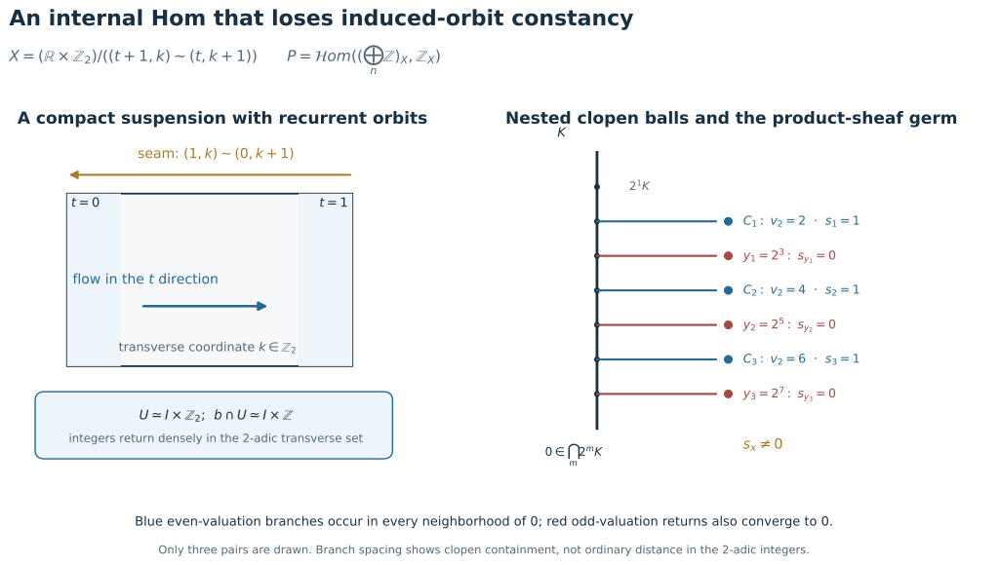
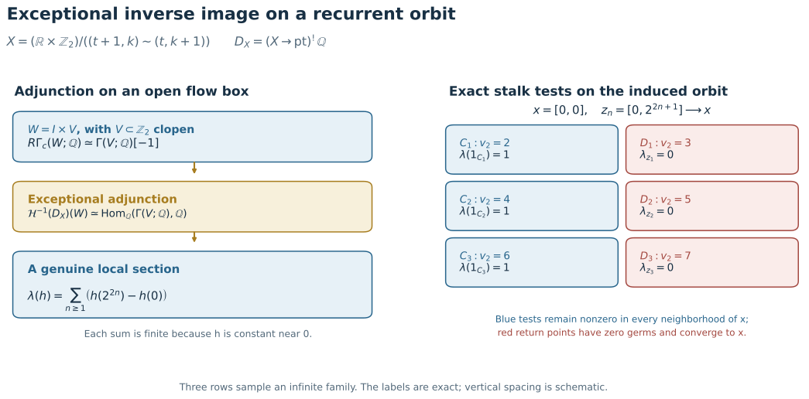
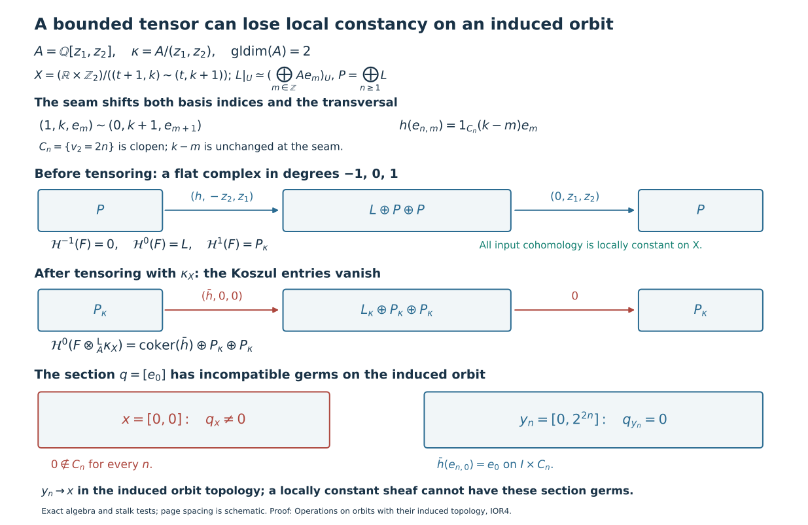

# Operations on orbits with their induced topology

*Written by GPT-6.1 Sol (OpenAI). Self-checked by the writing AI. CC0 1.0.*

A positive-real action has two orbit topologies. The image \(b_x\subset X\) can carry its induced subspace topology, or it can be viewed through the parameter map \(o_x:\mathbb R_{>0}\to X\), \(t\mapsto a(x,t)\). Write \(I(F)\) when every cohomology sheaf of \(F\) restricts to a locally constant sheaf on every induced orbit, and \(P(F)\) when every \(o_x^{-1}\mathcal H^q(F)\) is locally constant. All complexes considered below are globally bounded below; the internal-Hom first argument is also bounded above. The coefficient ring is commutative with finite global dimension, and the spaces and maps used for proper supports are locally compact Hausdorff.

Exact inverse image gives \(I(F)\Rightarrow P(F)\). The converse fails. The full canonical transport theorem, proved in [Transport along a scaling action](../../sheaf-proof-readings/SH02-conic-descent.html), identifies \(P(F)\) with the ordinary and extraordinary action-invariance tests. In that theorem the map

\[
\alpha_F:p^{-1}Rp_*a^{-1}F\longrightarrow a^{-1}F
\]

is the projection counit, while \(\beta_F=p^{-1}u_F\) uses evaluation \(u_F\) at the unit section. The normalized transport is \(\alpha_F\beta_F^{-1}:p^{-1}F\to a^{-1}F\). The five tests apply to \(P(F)\); they do not establish the converse \(P(F)\Rightarrow I(F)\).

For parameter-conic inputs, the actual equivariant-map proofs retain \(f^{-1},f^!,Rf_*,Rf_!\), derived tensor and internal Hom. Exceptional inverse image uses the original finite cohomological-dimension bound on \(f_!\) for all abelian sheaves. Ordinary direct-image transport uses the product-interval cylinder comparison, rather than unrestricted nonproper ordinary base change. The exceptional Hom comparison keeps the first factor bounded. The examples here test the stronger induced predicate at those same original coefficient and boundedness cuts.

| Conic-sheaf statements compared in [Transport along a scaling action](../../sheaf-proof-readings/SH02-conic-descent.html) | Induced-orbit conclusion |
|---|---|
| Definition 3.7.1 and the tests of Proposition 3.7.2 | Induced and parameter predicates differ on recurrent dense orbits. |
| Equivariant inverse image, Proposition 3.7.4(i) | Ordinary inverse image preserves \(I\); exceptional inverse image can fail even with finite map dimension. |
| Direct images, Proposition 3.7.4(ii) | Both ordinary and proper-support image can fail to preserve \(I\). |
| Tensor and internal Hom, Proposition 3.7.4(iii) | Both unrestricted induced conclusions fail; the internal-Hom first input below is degree zero. |
| External product assertion preceding Proposition 3.7.4 | The unrestricted induced-biconic conclusion fails with bounded inputs. |

These are precise comparisons for the literal induced-orbit predicate, not an assertion of a newly verified printed erratum. The corrected action-parameter restriction condition in Corollary 3.7.3 is a separate issue handled in the conic-descent lesson.

The image proofs use the actual proper-support fibre formula and the all-abelian one-dimensional cohomology bound proved in [Manifold duality](../../sheaf-proof-readings/SH02-manifold-duality.html). The exceptional example uses the actual exceptional adjunction of [Exceptional operations](../../sheaf-proof-readings/SH02-exceptional-operations.html), positive interval trace, and proper base change. The zero-dimensional transverse acyclicity is proved directly below. No finite rank or finite generation is imposed on the sheaves.

## IOR1. A recurrent orbit distinguishes the two predicates

For completeness, a closed subgroup of \(\mathbb R\) is \(0\), \(c\mathbb Z\) for \(c>0\), or \(\mathbb R\). If positive subgroup elements have infimum zero, their integer multiples approximate every real number; closedness gives the whole line. Otherwise the positive infimum lies in the subgroup and division with remainder makes it a generator. This proves the classification used in the density argument.

Take \(A=\mathbb Z\), choose an irrational real number \(\lambda\), and put

\[
X=S^1\times S^1,\qquad
j:\mathbb R\longrightarrow X,\qquad
j(u)=(e^{iu},e^{i\lambda u}).
\]

Use the continuous action

\[
a((z_1,z_2),t)=(e^{i\log t}z_1,e^{i\lambda\log t}z_2).
\]

On \(\mathbb R\) use \(a_{\mathbb R}(u,t)=u+\log t\). Then
\(j(a_{\mathbb R}(u,t))=a(j(u),t)\), so \(j\) is equivariant and
\(\mathbb R\) is a single orbit.

The map \(j\) is injective: \(j(u)=j(v)\) would give \(u-v=2\pi m\) and
\(\lambda m\in\mathbb Z\), forcing \(m=0\). Its image \(b\) is one orbit.
It is dense. To see this, the closure of the subgroup
\(\mathbb Z+\lambda\mathbb Z\subset\mathbb R\) contains \(1\) and
\(\lambda\). By the closed-subgroup classification just proved, a proper such
closure would be \(c\mathbb Z\), making \(\lambda\) a ratio of integers.
Thus this subgroup is dense, so the fractional parts of \(m\lambda\) are
dense in the circle. At each fixed first coordinate, adding \(2\pi m\) to
the parameter therefore gives a dense set of second coordinates. This
proves density in \(X\). The nonconstancy argument below only needs the
recurrence that we will also prove explicitly.

Let

\[
F=j_!\mathbb Z_{\mathbb R}.
\]

Here \(j_!\) is the direct image with proper supports for a continuous map
between locally compact Hausdorff spaces. It does not require \(j\) to be a
locally closed embedding. Concretely, \(F(U)\) consists of locally constant
integer-valued sections on \(j^{-1}U\) whose closed support is proper over \(U\).
Proper base change identifies the stalk of \(Rj_!\mathbb Z_{\mathbb R}\) at
\(y\) with compactly supported cohomology of \(j^{-1}(y)\). That fibre is one
point for \(y\in b\) and empty otherwise. Thus \(Rj_!\mathbb Z_{\mathbb R}\)
is concentrated in degree zero, equals \(F\), and has stalk \(\mathbb Z\) on
\(b\) and zero off \(b\). The same fibre calculation for arbitrary sheaves on
\(\mathbb R\) shows that \(j_!\) has cohomological dimension zero.

For \(y\in X\) use the additive orbit parameter
\(r_y(s)=a(y,e^s)\). If \(y=j(u_0)\), the fibre product of \(r_y\) and \(j\) is
the graph \(\{(s,u_0+s):s\in\mathbb R\}\), with its usual graph topology.
Projection to \(s\) is a homeomorphism. If \(y\notin b\), the fibre product is
empty. Proper base change for these squares gives the sheaf isomorphisms

\[
r_y^{-1}F\simeq
\begin{cases}
\mathbb Z_{\mathbb R},&y\in b,\\
0,&y\notin b.
\end{cases}
\]

These are isomorphisms of sheaves, not merely identifications of stalk
groups. Hence \(P(F)\) holds.

We now show that \(F|_b\) is not locally constant when \(b\) carries its topology
as a subset of \(X\). Fix \(x=j(u_0)\) and a section \(s\in F(U)\) over an
ambient open neighbourhood \(U\) of \(x\). Choose a compact neighbourhood
\(K\subset U\) of \(x\). If \(C\subset j^{-1}U\) is the closed support of the
section defining \(s\), properness makes \(C\cap j^{-1}K\) compact in
\(\mathbb R\), hence bounded. Consequently there is \(R\) such that the germ
of \(s\) at every \(j(u)\in K\) with \(|u|>R\) is zero.

There are positive integers \(m_k\to\infty\) such that the distance of
\(m_k\lambda\) to \(\mathbb Z\) tends to zero. Indeed, subdividing \([0,1)\)
into \(N\) equal intervals and comparing the \(N+1\) fractional parts of
\(0,\lambda,\ldots,N\lambda\) gives an integer \(1\le m\le N\) with
distance at most \(1/N\). Such integers cannot stay in a finite set as the
distance tends to zero, since \(\lambda\) is irrational. Passing to an
unbounded subsequence proves the assertion. Therefore

\[
u_k=u_0+2\pi m_k\longrightarrow+\infty,\qquad j(u_k)\longrightarrow x.
\]

For all sufficiently large \(k\), these points lie in the interior of \(K\)
and their germs of \(s\) vanish. Every ambient section with nonzero germ at
\(x\) consequently has zero germs at points of \(b\) arbitrarily near \(x\).

If \(F|_b\) were locally constant near \(x\), a local trivialization and the
nonzero element \(1\in F_x=\mathbb Z\) would provide a section with nonzero
germ everywhere on some relative neighbourhood of \(x\). By the definition
of inverse image to a subspace, that section is represented, after a
further relative shrink around \(x\), by an ambient section of \(F\). The
recurrent zero germs just proved give a contradiction.

Thus conicity along parameter maps, equivalently along homogeneous-space
orbits, does not imply local constancy on an orbit with its induced
subspace topology. Local constancy for the induced topology does imply the
parameter condition, since the parameter map to that subspace is
continuous and inverse image preserves locally constant sheaves. The
implication is therefore strict. The parameter comparison theorem therefore cannot be read as an
equivalence for the induced-subspace topology.
This issue is distinct from the periodic-action failure in
the action-parameter restriction theorem in [conic descent](../../sheaf-proof-readings/SH02-conic-descent.html). \(\square\)

**Ordinary direct image has the same induced-orbit obstruction.** Keep this
equivariant \(j:\mathbb R\to X\), and set \(G=j_*\mathbb Z_{\mathbb R}\).
The input \(\mathbb Z_{\mathbb R}\) is induced-conic because its sole orbit
is all of \(\mathbb R\).
The source's finite-cohomological-dimension premise still holds because
\(j_!\) has dimension zero, as checked above. Even if this premise is read
as a bound on \(j_*\), that bound holds too: for every ambient open \(V\),
\(j^{-1}V\) is an open one-manifold, so its ordinary sheaf cohomology
vanishes above degree one by [the manifold dimension theorem](../../sheaf-proof-readings/SH02-manifold-duality.html#SH02-MD-DIMENSION).
Thus \(R^qj_*=0\) for \(q>1\).
Choose a small ambient product
neighbourhood \(U\) of \(x=j(u_0)\) whose first-circle arc has length less than
\(2\pi\). The connected component \(I\) of \(j^{-1}U\) containing \(u_0\) is a
bounded open interval. Define a locally constant function on \(j^{-1}U\)
to be \(1\) on \(I\) and \(0\) on every other component. Each component of
this open subset of \(\mathbb R\) is open, so the function is continuous.
It gives
\(s\in G(U)=\Gamma(j^{-1}U;\mathbb Z)\) with a nonzero germ at \(x\).

For the return parameters \(u_k\to\infty\) above, \(y_k=j(u_k)\to x\).
Eventually \(u_k\notin\overline I\). Since \(j\) is injective and
\(j(\overline I)\) is compact, each such \(y_k\) has an ambient neighbourhood
disjoint from \(j(\overline I)\). The restriction of \(s\) there is zero, so
\(s_{y_k}=0\). Its restriction to the induced orbit \(b\) is therefore a
section with nonzero germ at \(x\) and zero germs arbitrarily close to \(x\).
That is impossible for a locally constant sheaf. Hence \(G|_b\) is not
locally constant. Since \(G=\mathcal H^0(Rj_*\mathbb Z_{\mathbb R})\),
the literal induced-orbit reading of the ordinary direct-image conclusion
fails as well. This argument leaves the parameter-conic \(Rj_*\) theorem of [conic descent](../../sheaf-proof-readings/SH02-conic-descent.html) intact. \(\square\)

## IOR2. Internal Hom on the adding-machine suspension

For internal Hom there is an ambient example at the exact unrestricted
coefficient cut of Proposition 3.7.4(iii). Let

\[
K=\mathbb Z_2=\varprojlim_m\mathbb Z/2^m\mathbb Z
\]

be the compact group of 2-adic integers. The ordinary integers embed
densely in \(K\): every residue class modulo \(2^m\) has an integer
representative. Form the suspension of translation by \(1\),

\[
X=(\mathbb R\times K)/\bigl((t+1,k)\sim(t,k+1)\bigr).
\]

Equivalently, identify \((1,k)\) with \((0,k+1)\) in \([0,1]\times K\).
This makes \(X\) compact Hausdorff, hence locally compact. Translation
of the real coordinate commutes with the identification and defines
the continuous positive-real action

\[
a([t,k],u)=[t+\log u,k],\qquad u>0.
\]

Let \(x=[0,0]\) and \(b\) be its orbit. The quotient map restricts to a
homeomorphism from \(I\times K\), \(I=(-1/4,1/4)\), onto an open flow box
\(U\subset X\): distinct integer translates of \(I\) do not meet.
Since \([m+t,0]=[t,m]\) for \(m\in\mathbb Z\), this chart identifies
\(b\cap U\) with \(I\times\mathbb Z\), where the second factor has its
subspace topology from \(K\). The return points \([0,m]\) therefore
converge to \(x\) whenever \(m\to0\) 2-adically.

Take coefficient ring \(A=\mathbb Z\), and let

\[
F_1=\left(\bigoplus_{n\ge1}\mathbb Z\right)_X,
\qquad F_2=\mathbb Z_X.
\]

Both are degree-zero constant sheaves. Pullback of a constant sheaf
to any orbit, with either its induced or parameter topology, is
constant. Thus \(F_1,F_2\) satisfy the printed induced-conicity
hypothesis; \(F_1\) is also bounded above. The constant-sheaf functor
preserves coproducts, and internal Hom sends a coproduct in its first
argument to a product. Consequently

\[
\mathcal H^0R\mathcal Hom_X(F_1,F_2)
=\mathcal Hom_X(F_1,F_2)
\simeq\prod_{n\ge1}\mathbb Z_X.
\]

Call this product sheaf \(P\). The product is taken **in sheaves**; its
sections on an open \(V\) are tuples of locally constant integer
sections on \(V\). Its stalk need not equal the product of the
individual stalks, because taking a stalk does not commute with an
infinite product.

For \(k\in K\), let \(v_2(k)\) be its 2-adic valuation, with
\(v_2(0)=\infty\). The valuation levels

\[
C_n=\{k\in K:v_2(k)=2n\}
=2^{2n}K\setminus2^{2n+1}K,\qquad n\ge1,
\]

are disjoint clopen subsets of \(K\). They accumulate at \(0\):
\(2^{2n}\in C_n\) and \(2^{2n}\to0\) in \(K\). On the flow box let
\(s_n\) be the locally constant characteristic section of
\(I\times C_n\). The tuple \(s=(s_n)_{n\ge1}\) is a genuine section
of \(P\) on \(U\).

Its germ \(s_x\) is nonzero. If it were zero, all coordinates would
vanish on one common neighbourhood of \(x\). Every such neighbourhood
contains some \([0,2^{2n}]\) with \(s_n=1\), so no common neighbourhood
exists. Each separate coordinate germ \((s_n)_x\) is nevertheless
zero; that is exactly the infinite-product distinction.

Now put \(y_n=[0,2^{2n+1}]\in b\). These points tend to \(x\) in the
induced orbit topology. The clopen level
\(\{k:v_2(k)=2n+1\}\) contains \(2^{2n+1}\) and misses every \(C_m\).
All coordinates of \(s\) vanish together on its product with \(I\),
so \(s_{y_n}=0\) in the stalk of \(P\). The inverse image \(P|_b\)
has these same stalks. If it were locally constant near \(x\), the
nonzero-germ locus of any section would be open there: in a local
trivialization a section is a locally constant map to a discrete
module. But \(s_x\ne0\) and \(s_{y_n}=0\) with \(y_n\to x\).
Therefore \(P|_b\) is not locally constant.

This refutes the literal induced-orbit internal-Hom conclusion for
arbitrary positive-real actions, even with two constant degree-zero
inputs over \(\mathbb Z\). It does not refute the parameter-conic
transport statement in [conic descent](../../sheaf-proof-readings/SH02-conic-descent.html). The obstruction is the failure of
an infinite sheaf product to commute with stalks on this
non-locally-connected ambient space; finite-rank vector-bundle
orbits remain covered by the separate embedded-ray corollary.

*The left panel shows the exact seam \((1,k)\sim(0,k+1)\) and a local
flow box. The right panel is the rooted tree of clopen 2-adic balls
\(2^mK\); side branches mark the exact valuation levels
\(v_2=2n\) carrying \(s_n=1\) and \(v_2=2n+1\) containing the zero-germ
returns \(y_n\). Only three pairs of levels are drawn; the proof uses
every \(n\). Tree spacing is schematic, not a metric embedding of
\(K\). Original diagram with [Open the full-size diagram](../figures/conic-internal-hom-adding-machine.svg) and [reproducible drawing source](../figures/draw_conic_internal_hom_adding_machine.py), offered under CC0 1.0.*

## IOR3. Exceptional inverse image at finite map dimension

The same compact suspension also tests the literal induced-orbit
exceptional-inverse assertion of Proposition 3.7.4(i). Let
\(f:X\to\mathrm{pt}\) be its equivariant map to the point with the
trivial action, now with coefficient field \(k=\mathbb Q\). The input
\(k_{\mathrm{pt}}\) is induced-conic. Put
\(D_X=f^!k_{\mathrm{pt}}\).

First, \(f_!\) has finite cohomological dimension, as the source
requires. The suspension projection \(\pi:X\to S^1\) is proper with
fibre \(K\). On a compact zero-dimensional Hausdorff space, global
sections of any sheaf are exact: local lifts of a section can be
chosen on a finite disjoint clopen refinement and glued. Thus
\(H^q(K;A)=0\) for \(q>0\) and every sheaf \(A\). Proper base change
gives \(R^q\pi_*A=0\) for \(q>0\); the [dimension-one bound on the
circle](../../sheaf-proof-readings/SH02-manifold-duality.html#SH02-MD-DIMENSION) then
gives \(H^q(X;A)=0\) for \(q>1\). Since \(X\) is compact,
\(Rf_!=R\Gamma(X;-)\), so its cohomological dimension is at most one.

For any open \(W\subset X\), exceptional adjunction applied to the
extension by zero of \(k_W\) gives the natural identity

\[
R\Gamma(W;D_X)
\simeq R\operatorname{Hom}_k(R\Gamma_c(W;k),k).
\]

Use the flow box \(U\simeq I\times K\) above, and let \(V\subset K\)
be clopen. The positive interval trace, followed by exact sections
on compact zero-dimensional \(V\), gives

\[
\begin{gathered}
R\Gamma_c(I\times V;k)\simeq\Gamma(V;k)[-1],\\
R\Gamma(I\times V;D_X)\\
\simeq\operatorname{Hom}_k(\Gamma(V;k),k)[1].
\end{gathered}
\]

The second complex has cohomology only in degree \(-1\) on a basis
of such boxes. Hence \(D_X\) has only \(\mathcal H^{-1}\) locally on
\(U\), and its sections on \(I\times V\) are the linear functionals
on \(\Gamma(V;k)\). Under \(V'\subset V\), restriction is
precomposition with extension by zero
\(\Gamma(V';k)\to\Gamma(V;k)\); shrinking the positively oriented
interval leaves this identification unchanged.

Set \(c_n=2^{2n}\in K\) and \(d_n=2^{2n+1}\in K\). For a locally
constant \(h:K\to k\) define

\[
\lambda(h)=\sum_{n\ge1}\bigl(h(c_n)-h(0)\bigr).
\]

This sum is finite for each \(h\), since \(c_n\to0\) and \(h\) is
constant on a neighbourhood of \(0\). It is therefore a genuine
\(k\)-linear functional and defines a section of
\(\mathcal H^{-1}(D_X)\) on \(U\). Its germ at \(x=[0,0]\) is nonzero.
Indeed, every clopen neighbourhood \(V\) of \(0\) contains the
even-valuation level \(C_n=\{v_2=2n\}\) for all sufficiently large
\(n\), and \(\lambda(1_{C_n})=1\) after extension by zero from \(V\).

On the other hand, the return points \(z_n=[0,d_n]\) belong to
the orbit \(b\) of \(x\) and satisfy \(z_n\to x\) in its induced
topology. The odd-valuation level
\(D_n=\{v_2=2n+1\}\) is a clopen neighbourhood of \(d_n\),
disjoint from \(0\) and every \(c_m\). The restriction of
\(\lambda\) to \(D_n\) is zero, so its germ at \(z_n\) vanishes.
Thus the restriction of \(\mathcal H^{-1}(f^!k_{\mathrm{pt}})\)
to \(b\) is not locally constant: a section of a locally constant
sheaf cannot have a nonzero germ at \(x\) and zero germs at points
converging to \(x\). This refutes the literal induced-orbit
exceptional-inverse conclusion under its finite-dimension
hypothesis. It leaves the parameter-transport theorem and the
embedded-ray vector-bundle corollary intact.

*The left panel records the exact adjunction and interval-trace
calculation of the degree-\(-1\) dualizing section. The right panel
marks three even test bands and odd return bands in the 2-adic
transversal; the proof uses every \(n\). The values shown are stalk
tests, and the branch spacing is schematic. Original diagram with
[Open the full-size diagram](../figures/conic-exceptional-dualizing.svg) and
[reproducible drawing source](../figures/draw_conic_exceptional_dualizing.py), offered under CC0 1.0.*

## IOR4. A bounded ambient tensor and external-product counterexample

The compact adding-machine suspension above also supplies an ambient
counterexample to the unrestricted induced tensor and external-product
claims. Both inputs will be bounded, and every input cohomology sheaf
will be locally constant on \(X\) itself. Thus the defect is not caused
by weakening the input's induced-orbit condition.

Set

\[
A=\mathbb Q[z_1,z_2],\qquad
\kappa=A/(z_1,z_2)=\mathbb Q.
\tag{8.2}
\]

This coefficient ring has global dimension two, including arbitrary
modules. Here is an all-module upper-bound argument. For any \(A\)-module
\(M\), the module \(A\otimes_{\mathbb Q}M\) is free over \(A\). The commuting
operators \(D_i=z_i\otimes1-1\otimes z_i\) on it form a regular sequence:
\(D_1\) is injective by the highest \(z_1\) coefficient, its quotient is
\(M[z_2]\), and \(D_2\) is injective there by the highest \(z_2\) coefficient,
with quotient \(M\). Their Koszul complex therefore gives a free
resolution of \(M\) of length two. Conversely, dualizing the Koszul
resolution of \(\kappa\) gives
\(\operatorname{Ext}_A^2(\kappa,A)=\kappa\ne0\), so the global dimension
is exactly two. The regular-sequence calculation is the elementary
Koszul mechanism of [Stacks, Section 15.31](https://stacks.math.columbia.edu/tag/062D);
the argument here retains the arbitrary-module scope needed for (8.2).

Let \(L\) be the locally constant sheaf of free \(A\)-modules with local
basis \((e_m)_{m\in\mathbb Z}\) whose seam gluing is

\[
(1,k,e_m)\sim(0,k+1,e_{m+1}).
\tag{8.3}
\]

Equivalently, pull back from \(S^1\) the local system with shift monodromy
\(e_m\mapsto e_{m+1}\). Put \(P=\bigoplus_{n\ge1}L\), with local basis
\(e_{n,m}\). On a flow box define

\[
\begin{gathered}
h:P\longrightarrow L,\\
h(e_{n,m})=1_{C_n}(k-m)e_m,\\
C_n=\{k\in\mathbb Z_2:v_2(k)=2n\}.
\end{gathered}
\tag{8.4}
\]

Each coefficient is locally constant because \(C_n+m\) is clopen.
Images of basis sections specify a sheaf morphism from the direct sum;
they do not need to be constant on one common neighborhood for every
\((n,m)\). The rule descends across the seam: replacing \((k,m)\) by
\((k+1,m+1)\) leaves \(k-m\) unchanged and shifts the target basis in the
same way. This is a sheaf morphism on the ambient \(X\), with both \(L\)
and \(P\) locally constant.

Define a flat complex \(F\) in degrees \(-1,0,1\) by

\[
\begin{gathered}
P\xrightarrow{\ d^{-1}\ }L\oplus P\oplus P\xrightarrow{\ d^0\ }P,\\
d^{-1}(w)=(h(w),-z_2w,z_1w),\\
d^0(a,u,v)=z_1u+z_2v.
\end{gathered}
\tag{8.5}
\]

Its differential squares to zero. The stalkwise free Koszul sequence

\[
0\longrightarrow P\xrightarrow{(-z_2,z_1)}P\oplus P
\xrightarrow{(z_1,z_2)}P\longrightarrow P\otimes_A\kappa
\longrightarrow0
\]

is exact as a sequence of sheaves. It gives

\[
\begin{gathered}
\mathcal H^{-1}(F)=0,\\
\mathcal H^0(F)\simeq L,\\
\mathcal H^1(F)\simeq P\otimes_A\kappa.
\end{gathered}
\tag{8.6}
\]

For the middle identification, a degree-zero cycle has
\((u,v)=(-z_2w,z_1w)\); subtracting \(d^{-1}(w)\) leaves
\((a-h(w),0,0)\). The inclusion of \(L\) in that first summand intersects
the boundary image trivially, by injectivity of the first Koszul map.
Thus the isomorphism is induced by this inclusion. All three input
cohomology sheaves are locally constant on \(X\), so \(F\) is
induced-conic. The degree-zero constant sheaf \(T=\kappa_X\) is also
induced-conic.

Because \(F\) is bounded with flat terms, it is K-flat: tensoring with an
acyclic complex stays acyclic by its finite filtration by the flat
terms. Ordinary tensoring of (8.5) therefore computes \(F\otimes_A^LT\).
Modulo \((z_1,z_2)\) the only remaining differential is \((\bar h,0,0)\),
and, with \(P_\kappa=P\otimes_A\kappa\),

\[
\begin{gathered}
\mathcal H^0(F\otimes_A^LT)\\
\simeq\operatorname{coker}(\bar h)\oplus P_\kappa\oplus P_\kappa.
\end{gathered}
\tag{8.7}
\]

On \(U=I\times\mathbb Z_2\), let \(q\) be the section defined by the class
of \(e_0\) in the first summand of (8.7). Its germ at \(x=[0,0]\) is
nonzero. Indeed, \(0\notin C_n\) for every \(n\), so every coefficient of
\(\bar h\) in target coordinate \(m=0\) has zero germ there. A stalk of
\(P_\kappa\) is a direct sum, so each of its elements uses only finitely
many basis coordinates; no image has a nonzero \(e_0\) coordinate at \(x\).

At \(y_n=[0,2^{2n}]\), however, (8.4) is \(\bar h(e_{n,0})=e_0\) on
\(I\times C_n\), so \(q_{y_n}=0\). These points belong to the orbit \(b\) of
\(x\) and converge to \(x\) in its induced topology. A section of a
locally constant sheaf which has nonzero germ at \(x\) remains nonzero
on some neighborhood of \(x\), since a local trivialization represents
it as a locally constant function to a discrete module. The germs of
\(q\) contradict this. Hence
\(\mathcal H^0(F\otimes_A^LT)|_b\) is not locally constant.

For external product, take the second space to be a point with trivial
action and coefficient sheaf \(\kappa\). Under \(X\times\mathrm{pt}\simeq X\),
the object \(F\boxtimes_A^L\kappa\) is the same tensor, and the induced
product orbit \(b\times\mathrm{pt}\) is \(b\). Its cohomology is therefore
not induced-biconic. This refutes both unrestricted source conclusions.
It does not contradict the degree-zero, field, flat-cohomology or finite-type positive cases: \(A\) is not a field,
\(\kappa\) is not flat over \(A\), and the fibers in (8.6) are not finitely
generated. The parameter-action conclusions and embedded-ray
vector-bundle corollary remain valid. \(\square\)

*Equations (8.3)–(8.7) give the seam, ambient sheaf map, differentials,
cohomology and exact germ tests shown here. Page spacing is schematic;
the 2-adic returns use every \(n\ge1\). The figure explains the original
counterexample to the induced tensor and external-product assertions compared in [Transport along a scaling action](../../sheaf-proof-readings/SH02-conic-descent.html). [Editable SVG](../figures/conic-derived-tensor.svg).
[Reproducible drawing source](../figures/draw_conic_derived_tensor.py), offered under CC0 1.0.*

## IOR5. The induced conclusions that remain valid

Ordinary inverse image has its stronger conclusion directly. For an equivariant map \(f:Y\to X\), the restriction \(f|_{b_y}:b_y\to b_{f(y)}\) is continuous for the two subspace topologies. Exact inverse image identifies

\[
\mathcal H^q(f^{-1}F)|_{b_y}
\simeq(f|_{b_y})^{-1}(\mathcal H^q(F)|_{b_{f(y)}}).
\]

The right side is locally constant when \(I(F)\) holds. No exceptional comparison is substituted for this ordinary map.

An induced-biconic object on \(X\times Y\) also remains induced-conic under diagonal scaling: its diagonal orbit is a subspace of \(b_x\times b_y\), and restriction of a locally constant sheaf is locally constant. This does not prove that an arbitrary external product is induced-biconic; IOR4 tests exactly that distinct assertion.

For scalar multiplication on a finite-rank real vector bundle, every nonzero orbit is an embedded open ray and every zero orbit is a point. In a local trivialization, a fibrewise linear functional with value one at a chosen nonzero vector recovers the positive scaling parameter continuously from the ray. Thus induced and parameter conicity coincide on these bundles, and on their independent product orbits. The full parameter-operation proofs therefore give the original vector-bundle conclusions, with arbitrary module coefficients and the stated lower, upper and map-dimension bounds. None of IOR1–IOR4 removes those hypotheses or changes a Fourier–Sato bundle formula.

The stronger tensor conclusions over a field, with one flat-cohomology factor, or with Noetherian finite-type cohomology are additional positive cases. They do not cover the unrestricted ring and infinite-rank inputs in IOR4. In particular finite stalk dimension is not the original hypothesis being tested. The first two follow from the sheaf Künneth comparison: over a field, or when one factor has flat cohomology, the Tor terms of positive degree vanish, and each cohomology sheaf is a finite direct sum in each degree of tensors of input cohomology sheaves. Exact restriction to an orbit preserves this comparison. For a Noetherian ring and finitely generated input cohomology, the finite-global-dimension Tor spectral sequence has locally constant finitely generated terms on the orbit. To see that its differentials and extensions stay locally constant, choose finite presentations near one point: lift finitely many generators and impose finitely many relations on a common neighborhood. For an extension, lift the quotient generators to the middle sheaf and express their relations in the finite kernel generators. This presents the middle sheaf by one fixed finite module; the same finite-presentation argument identifies kernels and cokernels of the resulting morphisms. Thus the finite spectral sequence and its finite filtration remain locally constant. The uniform lower bounds make the relevant degree ranges finite. None of these arguments applies to the infinite-rank nonflat inputs of IOR4.

The scholarly source comparison is developed in [Transport along a scaling action](../../sheaf-proof-readings/SH02-conic-descent.html), with the conic-sheaf results of M. Kashiwara and P. Schapira. The constructions, section and germ computations, and diagrams here are independently expressed. The proper-support, exceptional-adjunction and interval/manifold prerequisites retain their stated scopes.
