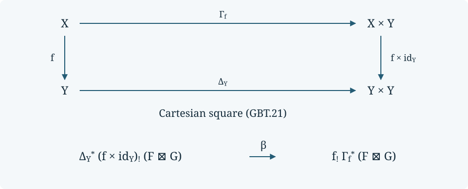

# Modern proper base change and arbitrary stable coefficients

This lesson supplies the general base-change and tensor steps after
[compact supports and covariant Verdier duality](../modern-proper-support-construction.html).
All spaces are locally compact Hausdorff. A stable coefficient category has all
small colimits; wherever actual coefficient-valued sheaves are used, it also
has all small limits. Presentability, constructibility, boundedness, finite
cohomological dimension and a countable exhaustion are not required.

*Written by GPT-6.1 Sol (OpenAI). Self-checked by the writing AI. CC0 1.0.*

The mathematical sources are Jacob Lurie's *Higher Topos Theory*, Sections
7.3.1–7.3.4, and Marco Volpe's published *The six operations in topology*,
Sections 2.2, 5.2–5.3 and Propositions 6.9, 6.13 and 6.14. The argument below
includes the nonabelian proper-map proof and its coefficient extension. The
classical bounded comparison in the preceding lessons remains a separate step.

## SH02-GBT-0 — Models and the maps to be proved {#SH02-GBT-0}

Write \(\mathcal A_T=\operatorname{Shv}(T;\mathrm{Sp})\). These are sheaves
for ordinary covering sieves. No hypercompletion is performed. The elementary
ambient models used here are presheaf infinity-categories, accessible left
exact localization for an infinity-topos, the Yoneda and Kan extension
universal properties, and the tensor of cocomplete stable infinity-categories.
For the last model its defining property is

\[
 \operatorname{Fun}^L(B\otimes C,E)
 \simeq\operatorname{Fun}^{L,L}(B\times C,E).
 \tag{GBT.1}
\]

All colimits here are in a fixed universe. A larger universe accommodates a
coefficient category that is not presentable. Superscript \(L\) means that
all these colimits are preserved. Presheaf localization, cofinality and the
compact-object Ind model are basic categorical models; this lesson does not
claim to rebuild their entire simplicial-set foundations.

For any cocomplete stable \(E\), put
\(\mathscr S_T(E)=\mathcal A_T\otimes E\).
When \(E\) is bicomplete, GBT-4 will identify this with actual
\(E\)-valued sheaves. Defining \(\mathscr S_T(E)\) even when \(E\) is
not complete is necessary: a tensor \(C\otimes D\) of bicomplete categories
need not itself be bicomplete.

Use a Cartesian square with fixed labels

\[
\begin{array}{ccc}
 X'&\xrightarrow{q'}&X\\
 p'\downarrow&&\downarrow p\\
 Y'&\xrightarrow q&Y.
\end{array}
\tag{GBT.2}
\]

For ordinary direct image, the proper base-change map is the mate

\[
\begin{gathered}
q^*p_*F\longrightarrow q^*p_*q'_*q'^*F\\
\simeq q^*q_*p'_*q'^*F\\
\longrightarrow p'_*q'^*F.
\end{gathered}
\tag{GBT.3}
\]

The arrows are the unit for \(q'^*\dashv q'_*\) and the counit for
\(q^*\dashv q_*\). We prove invertibility of this particular map when
\(p\) is proper. For arbitrary \(p\), the proper-support map will be
constructed from these proper mates and the open-extension mates. Arbitrary
choices of equivalences would not establish the required theorem on maps.

## SH02-GBT-1 — Compact models with nonstable coefficients {#SH02-GBT-1}

The compact-presentation argument SH02-SXM-1–2 needs only completeness,
filtered colimits and their commutation with finite limits. Stability enters
later, when support fibres are changed into cofibres. Consequently the compact
argument also applies to spaces and to every infinity-topos \(E\).

Here are its precise formulas, with terminal object \(1\):

\[
\begin{gathered}
H_F(K)=\operatorname*{colim}_{U\supset K}F(U),\\
F_H(U)=\operatorname*{lim}_{K\subset U}H(K).
\end{gathered}
\tag{GBT.4}
\]

The compact functor has \(H(\varnothing)=1\), has the pullback square
\(H(K\cup L)=H(K)\times_{H(K\cap L)}H(L)\), and satisfies
\(H(K)=\operatorname{colim}_{K\Subset L}H(L)\). Neighborhoods are ordered
by shrinking, and \(K\Subset L\) means that the interior of the compact
\(L\) contains \(K\).

For clarity, the proof continues to work without a zero object. A finite open
cover of a compact set admits a finite compact shrinking. For two compacts,
neighborhoods of their union are refined by unions of their neighborhoods;
neighborhoods of their intersection are refined by intersections of such
neighborhoods. For the second assertion, separate the disjoint compact sets
\(K\setminus W\) and \(L\setminus W\), for an open \(W\supset K\cap L\),
and adjoin \(W\) to both separating neighborhoods. Filtered colimits can
therefore be moved through the single finite descent pullback. Induction gives
finite compact descent; a compact subcover gives arbitrary covering descent
for the second formula in (GBT.4).

The inverse maps have explicit cones. A sheaf maps to its limit of compact
restrictions. Conversely that limit maps to \(F(V)\) by projection to
\(H_F(\overline V)\) whenever \(\overline V\subset U\), then restriction
to \(V\); these relatively compact opens cover \(U\), so descent gives the
inverse. For a compact functor, projection gives
\(\operatorname{colim}_{U\supset K}F_H(U)\to H(K)\). Its inverse comes from
\(H(L)\to F_H(\operatorname{Int}L)\) for \(K\Subset L\).
Insertion of a smaller compact neighborhood checks both identities on the
original restriction cones. The refinement posets are filtered and
contractible. This gives coherent maps, not an interchange of an arbitrary
infinite limit with a filtered colimit.

There is a useful combined version. On the poset consisting of the open and
compact subsets of \(T\), let \(\theta F\) have open values \(F(U)\) and
compact values \(H_F(K)\), with their restriction maps. Formula (GBT.4) and
its two inverse cones say simultaneously that \(\theta F\) is the left Kan
extension from opens and the right Kan extension from compacts. An open that
is also compact has the same value in the two descriptions. This combined
model will fix the adjunction in the next proof.

An infinity-topos satisfies the exactness assumption: realize it as an
accessible left exact localization of a space-valued presheaf category.
Filtered colimits of spaces commute with finite limits, presheaf operations
are pointwise, and the localization preserves finite limits. This also shows
why the argument applies before hypercompletion.

## SH02-GBT-2 — Compact global sections and closed subspaces {#SH02-GBT-2}

We first prove properness of \(\Gamma:\operatorname{Shv}(T)\to\mathcal S\)
for compact Hausdorff \(T\). Properness means that after any two successive
base changes of infinity-topoi, the push-pull mate is invertible.

The base-change model is
\(\operatorname{Shv}(T;E)=\operatorname{Shv}(T)\times_{\mathcal S}E\)
for any infinity-topos \(E\). Here is the model's justification. Write
\(E\) as a left exact localization of \(\mathcal P(D)\), with \(D\) a
small category with finite limits. In
\(\mathcal P(\mathcal U(T)\times D)\), impose covering descent in the
\(T\) direction and the localization in the \(D\) direction. Their common
local objects are exactly \(E\)-valued sheaves. To construct the common
localization, choose a regular \(\kappa\) for which both reflector endofunctors preserve
\(\kappa\)-filtered colimits, alternate their reflectors through \(\kappa\) steps, and take
colimits at limit stages. The shifted subsequences are cofinal, so the final
object is local for both reflectors. Left exactness persists at each step,
including the filtered colimits at limit stages. The universal maps into common local
objects show that this is a left exact accessible localization. Geometric morphisms into it are pairs of geometric
morphisms into \(\operatorname{Shv}(T)\) and \(E\): on presheaf generators,
the corresponding inverse-image functor sends a pair to the product of its
two images. It is left exact; products preserve colimits separately in an
infinity-topos, so it descends through both sets of relations. Conversely,
restriction to the two axes recovers this pair, because each paired generator
is the product of the two axis generators. Yoneda extension determines all
objects and transformations. This proves the product universal property,
including its maps. This is the explicit model behind HTT 7.3.3.9.

Let \(a^*:E\rightleftarrows E':a_*\) be a geometric adjunction. In compact
models, postcomposition with \(a^*\) preserves compact sheaves, since it
preserves finite limits and filtered colimits. Its transport to open sheaves
is left adjoint to postcomposition with \(a_*\). To check this last claim
without assuming that \(a_*\) preserves filtered colimits, use the combined
model of GBT-1:

\[
\begin{aligned}
 \operatorname{Map}_{\mathcal U}(F,a_*F')
 &\simeq\operatorname{Map}_{\mathcal K\cup\mathcal U}(\theta F,a_*\theta F')\\
 &\simeq\operatorname{Map}_{\mathcal K\cup\mathcal U}(a^*\theta F,\theta F')\\
 &\simeq\operatorname{Map}_{\mathcal K}(a^*H_F,H_{F'}).
\end{aligned}
\tag{GBT.5}
\]

The first equivalence uses left Kan extension from opens; the last uses right
Kan extension from compacts. The middle equivalence is the pointwise
adjunction. Thus it preserves the actual unit and counit. Since \(T\) is
both compact and open, evaluation at \(T\) commutes with this left adjoint:

\[
 a^*\Gamma F\simeq\Gamma\widetilde a^*F.
 \tag{GBT.6}
\]

By (GBT.5), this equivalence is the push-pull mate, not merely an equivalence
of its two objects. Applying the product model successively to \(E\) and
\(E'\) proves the required universal properness of compact global sections.

Closed inclusions supply the second elementary proper map. For an open
subterminal object \(u\) in an infinity-topos \(B\), the complementary
closed subtopos consists of objects \(Z\) with
\(Z\times u\to u\) an equivalence. Its inverse-image localization forces
\(u\) to become initial. Every left exact inverse image preserves this
condition. Under \(a^*:B\to B'\), the closed subtopos pulls back to the
one complementary to \(a^*u\); the inverse image on closed objects is the
restriction of \(a^*\). Its square with the fully faithful inclusions
therefore commutes, and its mate is an equivalence. The universal property
of localization proves that this is a pullback of infinity-topoi. Repeating
a base change proves properness of a closed inclusion.

For an actual closed \(Z\subset T\) this is \(\operatorname{Shv}(Z)\).
Indeed direct image is \(F(V\cap Z)\) and is terminal off \(Z\).
Conversely, if a sheaf is terminal off \(Z\), its values on two opens with
the same intersection with \(Z\) agree: cover either by their intersection
and its complement of \(Z\). For a covering of an open of \(Z\), choose
ambient open extensions and add the complement of \(Z\). Descent proves
that these values define a sheaf on \(Z\) and recover the original sheaf.
This establishes the topological closed-subspace model used above.

## SH02-GBT-3 — Nonabelian proper base change {#SH02-GBT-3}

We need one further compatibility of models: for a locally compact Hausdorff
\(T\),

\[
 \operatorname{Shv}(T\times W)
 \simeq\operatorname{Shv}(T)\times_{\mathcal S}\operatorname{Shv}(W).
 \tag{GBT.7}
\]

Here is the compactness check in the locale model. The coproduct of the two
open-set locales is generated by formal rectangles \(U\otimes V\).
Send these to \(U\times V\), and send an open \(O\subset T\times W\)
back to the union of all formal rectangles lying in \(O\). To show that
these are inverse, suppose
\(U\times V\subset\bigcup_iU_i\times V_i\). Cover \(U\) by interiors of
compact \(K\subset U\). For each \(v\in V\), finitely many \(U_i\times V_i\)
cover \(K\times\{v\}\); intersect their \(V_i\)'s to obtain an open
\(V_v\) containing \(v\). The relations for finite unions give
\(\operatorname{Int}K\otimes V_v\leq\bigvee_i U_i\otimes V_i\).
Taking unions in \(v\) and then in \(K\) proves the asserted rectangle
relation. Every open is a union of rectangles, so the two locale maps are
inverse. The basic equivalence between locales and 0-localic infinity-topoi
transfers this to (GBT.7). The inclusion of these topoi preserves limits,
as the right adjoint of their localization. This is the full compactness
argument in HTT 7.3.1.11.

Now take a proper \(p:X\to Y\). Embed \(X\) as an open subspace of its
one-point compactification \(\overline X\), using \(X\) itself when it is
compact. The graph
\(e:X\hookrightarrow\overline X\times Y\) is closed. At a boundary point
of \(\overline X\), take a relatively compact neighborhood of the proposed
\(y\); its closed inverse image under \(p\) is compact in \(X\).
A neighborhood of the boundary point disjoint from that compact gives a
product neighborhood disjoint from the graph. At an ordinary point, the
closed-graph argument uses the Hausdorffness of \(Y\). Thus
\(p=\pi_Ye\) with \(e\) closed and \(\overline X\) compact Hausdorff.

By (GBT.7), \((\pi_Y)_*\) is a base change of compact global sections,
which is proper by GBT-2. The closed inclusion is proper by the same lemma.
Proper geometric morphisms are stable under composition and base change:
insert the two defining Cartesian rectangles and compose their invertible
mates; cancellation of each intermediate unit and counit proves the mate
for the composite. Consequently \(p_*\) is proper as a geometric morphism.

For the topological square (GBT.2), the induced square of infinity-topoi is
also Cartesian. Factor it through
\(\overline X\times Y'\to\overline X\times Y\). This intermediate square
is Cartesian by (GBT.7) and the product universal property; its upper
closed-subspace square is Cartesian by GBT-2. Pasting gives the claimed
Cartesian square. Properness now applies to it. We have proved that (GBT.3)
is invertible for **space-valued covering sheaves**, without a truncation or
hypercompleteness assumption. This proves the exact assertion of HTT 7.3.1.18,
including the properness steps on which its short printed proof depends.

## SH02-GBT-4 — The coefficient equivalence, including nonpresentable coefficients {#SH02-GBT-4}

We establish the equivalence

\[
 \eta_T:\mathcal A_T\otimes C\xrightarrow{\sim}\operatorname{Shv}(T;C)
 \tag{GBT.8}
\]

for every stable bicomplete \(C\), with no adjoint functor theorem applied
to \(C\). First let \(D_T\) be spectral functors on compact subsets that
satisfy the empty-value and finite-union descent conditions, without requiring
compact-neighborhood continuity. This is a compactly generated stable category.
Here is a concrete verification rather than an identification with all left
exact functors on a poset. In the spectral presheaf category let \(h_K\) be
the spectral Yoneda generator. Impose the compact relations

\[
 \begin{gathered}
 h_\varnothing=0,\\
 h_K\amalg_{h_{K\cap L}}h_L\longrightarrow h_{K\cup L}.
 \end{gathered}
 \tag{GBT.9}
\]

The cofibres of these arrows are compact. The corresponding exact presheaf
localization has local objects precisely \(D_T\). Its inclusion preserves
filtered colimits, since its conditions are finite limits, and preserves
finite colimits by stability; it thus preserves all colimits. The localized
\(h_K\)'s are compact and generate: mapping out of them is evaluation at
\(K\), so a functor annihilated by all of them is zero. This proves compact
generation using only the stated presheaf-localization model.

There is a colimit-preserving retraction from \(D_T\) onto continuous
compact sheaves:

\[
 (\phi H)(K)=\operatorname*{colim}_{K\Subset L}H(L).
 \tag{GBT.10}
\]

Continuity follows by inserting an intermediate compact neighborhood into
\(K\Subset L\): it can be chosen between \(K\) and the interior of \(L\).
The posets of all such intermediate choices are filtered under shrinking.
Thus the iterated colimit in (GBT.10) is the same colimit. Finite union
descent follows by taking the finite descent squares of \(H\) over
neighborhoods of \(K,L\): their unions and intersections are cofinal
neighborhoods of \(K\cup L,K\cap L\), by GBT-1. Filtered exactness gives
the resulting pullback square. The empty value follows by shrinking to the
empty compact. Formula (GBT.10) is the identity on continuous compact sheaves.
It preserves all colimits: these are pointwise in both compact categories,
since stable colimits preserve finite pullbacks and commute with the
continuity colimits. Hence \(\mathcal A_T\), by (GBT.4), is a retract of
\(D_T\) in cocomplete stable categories.

A compactly generated stable category is dualizable in (GBT.1). Explicitly,
if \(D=\operatorname{Ind}(D^\omega)\), its dual is
\(\operatorname{Ind}((D^\omega)^{\mathrm{op}})\); evaluation on compact
pairs is their mapping spectrum. The coevaluation is the identity bimodule.
The coend Yoneda identity says that evaluation followed by this identity
bimodule recovers each compact object, and then every object, since compacts
generate by colimits. This checks both triangle identities. Here the dual retract can be constructed explicitly. For
\(i:A\to D\), \(r:D\to A\) with \(ri=\operatorname{id}_A\), take
\(B=\operatorname{Fun}^L(A,\mathrm{Sp})\). Precomposition gives
\(r^*:B\to D^\vee\) and \(i^*:D^\vee\to B\), with
\(i^*r^*=\operatorname{id}_B\); these maps preserve pointwise colimits.
Evaluation on \(B\otimes A\) is the restriction of evaluation on
\(D^\vee\otimes D\), since \((Q\circ r)(i a)=Q(a)\).
Apply \(r\otimes i^*\) to the coevaluation for \(D\) to obtain the one
for \(A\). Moving \(i,r\) across evaluation is precisely precomposition;
the two triangle composites reduce to those of \(D\) and to \(ri=1\).
Thus these actual functor categories supply the dual without a separate
existence assumption for an idempotent splitting. In particular
\(\mathcal A_T\) is dualizable.

Its dual is \(\operatorname{CoShv}(T;\mathrm{Sp})\). Indeed a spectral
cosheaf is the same thing as a colimit-preserving functor from
\(\operatorname{Shv}(T)\) to spectra: extend its values on open representables
by Yoneda colimits; the cosheaf condition is exactly the requirement that
covering-sieve arrows are inverted. Stabilization makes this equivalently a
colimit-preserving functor from \(\mathcal A_T\) to spectra. The same
argument with values in any cocomplete stable \(C\) gives

\[
\begin{gathered}
\mathcal A_T^\vee\otimes C\\
\simeq\operatorname{Fun}^L(\mathcal A_T,C)\\
\simeq\operatorname{CoShv}(T;C).
\end{gathered}
\tag{GBT.11}
\]

The first equivalence follows from the duality's two triangle identities:
an element of the tensor gives its evaluated functor, and coevaluation gives
the inverse. This argument uses cocompleteness of \(C\), not presentability.

Finally transport (GBT.11) through the covariant Verdier equivalences
\(\mathbb V_T^{\mathrm{Sp}}\) and \(\mathbb V_T^C\) proved in
SH02-SXM-3–5. This gives (GBT.8) and specifies it on a spectral sheaf \(F\)
and a coefficient \(M\):

\[
 \eta_T(F\otimes M)
 = (\mathbb V_T^C)^{-1}\bigl(M\circ\mathbb V_T^{\mathrm{Sp}}F\bigr),
 \tag{GBT.12}
\]

where \(M:\mathrm{Sp}\to C\) is the colimit-preserving functor with
\(M(\mathbb S)=M\). Colimits of these pure tensors determine the functor
and all its transformations. This proves Volpe 5.15–5.16 at the required
coefficient scope; it does not silently make a nonpresentable \(C\) presentable.

## SH02-GBT-5 — Coefficient compatibility and stable proper base change {#SH02-GBT-5}

For cosheaves, direct image is precomposition with inverse image on opens.
It commutes with postcomposition by \(M:\mathrm{Sp}\to C\).
For proper \(p\), the support-fibre comparison
\(\mathbb V_Yp_*F\simeq p_*^{\mathrm{co}}\mathbb V_XF\) is the actual
support map of SH02-SXM-7. Compact preimages are cofinal supports, so it is
invertible. Combining it with (GBT.12) proves

\[
 \eta_Y(p_*^{\mathrm{Sp}}\otimes C)
 \simeq p_*^C\eta_X.
 \tag{GBT.13}
\]

Proper spectral pushforward is colimit preserving: in compact models it is
\(\phi(K\mapsto H(p^{-1}K))\). To see that this is the open pushforward's
compact model, an open \(W\supset p^{-1}K\) contains \(p^{-1}V\) for
some neighborhood \(V\supset K\): the proper map is closed, so take
\(V=Y\setminus p(X\setminus W)\), then shrink relatively compactly.
All choices have common smaller neighborhoods. Precomposition and \(\phi\)
preserve filtered colimits and finite limits; stability gives all colimits.
The same proof works for every stable bicomplete coefficient category.

The spectral adjunction \(p^*\dashv p_*\) can therefore be tensored with
\(C\), including its unit and counit. Equation (GBT.13) identifies the
right adjoint with actual pushforward; it identifies the left adjoint with
actual pullback, by the mapping-space uniqueness of adjoints.
For an open \(j\), support excision gives
\(\mathbb V j^*\simeq j^*\mathbb V\), so restriction also commutes with
\(\eta\). Its left adjoint \(j_!\) consequently commutes with \(\eta\),
with its unit fixed. Factor any continuous map as an open followed by a
proper map, as in SH02-SXM-7. Composition of the pullback adjunctions and the
proper-support formula \(f_!=p_*j_!\) now give

\[
 f_C^*\simeq f_{\mathrm{Sp}}^*\otimes C,
 \qquad f_!^C\simeq f_!^{\mathrm{Sp}}\otimes C
 \tag{GBT.14}
\]

under \(\eta\). This proves the relevant content of Volpe 5.19, 5.21–5.22
and 6.7, including the maps of the adjunctions.

This also supplies the exceptional adjoint in the nonpresentable case.
Apply the pullback construction to the stable bicomplete category
\(C^{\mathrm{op}}\). On cosheaves, direct image is
\((f_*^{C^{\mathrm{op}}})^{\mathrm{op}}\), left adjoint to
\((f_{C^{\mathrm{op}}}^*)^{\mathrm{op}}\): this is the opposite of the
ordinary pullback/direct-image adjunction. Transport through \(\mathbb V\)
gives

\[
 f^!= (\mathbb V_X^C)^{-1}
       (f_{C^{\mathrm{op}}}^*)^{\mathrm{op}}\mathbb V_Y^C,
 \qquad f_!\dashv f^!.
\]

The actual direct image on cosheaves is colimit preserving. Its transported
left adjoint is exactly the previously defined proper-support operation.
Thus exceptional adjoint existence here follows from the explicit opposite
pullback, and does not appeal to an adjoint functor theorem on \(C\).

For spectra, use the compact spectral model

\[
 \operatorname{Shv}(T;\mathrm{Sp})
 \simeq\operatorname{Fun}^{\mathrm{lex}}
       ((\mathrm{Sp}^\omega)^{\mathrm{op}},\operatorname{Shv}(T)).
 \tag{GBT.15}
\]

This is the compact-object model of spectrum objects in an infinity-topos:
finite spectral colimits become finite limits in the opposite compact
category, and the sphere and its suspensions specify the usual loop-spectrum
data. Ind extension reconstructs the spectrum; applying it on each open
commutes with covering limits. The right adjoint \(h_*\) is postcomposition
with space-sheaf \(h_*\). Space-sheaf \(h^*\) is left exact, so its
postcomposition preserves the finite-limit condition too. Pointwise units
and counits restrict to this full functor category; thus postcomposition is
the actual spectral adjunction. Apply this to every functor and every arrow
in (GBT.3). GBT-3 proves that the resulting spectral mate is invertible.

To transport this particular mate, use the two **proper** adjunctions.
Write \(\delta:p'^*q^*\simeq q'^*p^*\) for the commuting pullback comparison.
The equivalent formula for the spectral mate at \(F\) is

\[
\begin{aligned}
 q^*p_*F
 &\xrightarrow{\eta^{p'}}p'_*p'^*q^*p_*F\\
 &\xrightarrow{p'_*\delta}p'_*q'^*p^*p_*F\\
 &\xrightarrow{p'_*q'^*\epsilon^p}p'_*q'^*F.
\end{aligned}
\tag{GBT.15a}
\]

Here is the map comparison with (GBT.3). The right-adjoint comparison
\(\delta^R:p_*q'_*\simeq q_*p'_*\) is the transpose of \(\delta\).
For an object \(G\), its explicit defining composite inserts the unit of
\(p'^*q^*\dashv q_*p'_*\), applies \(q_*p'_*\delta\), and then applies
the counit of \(q'^*p^*\dashv p_*q'_*\). The composite unit first inserts
\(\eta^q\), then \(q_*\eta^{p'}q^*\); the composite counit first applies
\(q'^*\epsilon^pq'_*\), then \(\epsilon^{q'}\).
Substitute this expression for \(\delta^R\) in (GBT.3), between its
\(q'\)-unit and \(q\)-counit. Naturality moves those two outside structural
maps next to their corresponding inside maps. The \(q\)-unit–counit pair
cancels by the triangle identity; the \(q'\)-unit–counit pair cancels by its
triangle identity. The remaining three maps are precisely (GBT.15a).

All six functors in (GBT.15a) preserve colimits: pullbacks do so, and
\(p,p'\) are proper, so their pushforwards do so by the compact proof above.
Their adjunctions, \(\delta\) and (GBT.15a) can therefore be tensored with
\(C\). Equations (GBT.13)–(GBT.14) identify them with the actual coefficient
pullbacks and proper pushforwards. The same transpose calculation identifies
the transported map with (GBT.3) in coefficient-valued sheaves. This proves
**general stable bicomplete proper base change**, including nonpresentable
coefficients. The argument never tensors an arbitrary \(q_*\) or \(q'_*\).
Tensoring (GBT.15a) with any cocomplete stable \(E\) also gives proper base
change on \(\mathscr S_T(E)\), without asserting the existence of actual
\(E\)-valued sheaves when \(E\) is not complete.

## SH02-GBT-6 — The full proper-support base-change map {#SH02-GBT-6}

For an open Cartesian square, the map
\(j'_!q'^*\to\bar q^*j_!\) is adjoint to the restriction identity
\(j'^*\bar q^*j_!=q'^*j^*j_!\simeq q'^*\).
For space-valued sheaves it is invertible on each open representable: inverse
image takes the open represented by \(V\) to the open represented by its
preimage, and open extension is the same representable considered in the
ambient space. Such representables generate by colimits. Stabilization and
(GBT.14) give the same assertion with arbitrary stable bicomplete coefficients,
and on \(\mathscr S(E)\). This proves the needed open case of Volpe 3.27
without introducing a hypothesis of hypercompleteness.

Now in (GBT.2) let \(p\) be arbitrary and choose
\(p=rj\), with \(j:X\hookrightarrow\overline X\) open and
\(r:\overline X\to Y\) proper. Pull back this factorization. The two
arrows in

\[
 q^*r_*j_!F\longrightarrow r'_*\bar q^*j_!F
 \longleftarrow r'_*j'_!q'^*F
 \tag{GBT.16}
\]

are respectively the proper mate of GBT-5 and the open-extension mate above.
Both are invertible. Define \(\beta_p\) by the first arrow followed by the
inverse of the second:

\[
 \beta_p:q^*p_!\xrightarrow{\sim}p'_!q'^*.
 \tag{GBT.17}
\]

The proper-support composition equivalences of SH02-SXM-6–7 identify the
ends of (GBT.16). A common refinement is concrete: take the closure of the diagonal copy of
\(X\) in \(\overline X_1\times_Y\overline X_2\). The two projections are
proper. Its inverse image of either open copy of \(X\) is exactly that
diagonal copy: on this open it is the closed graph of the other embedding,
so taking the closure adds no points there. Thus it is a compactification
with proper maps to both models. Pull back this diagram as well. Units and
counits compose, their intermediate pairs cancel by the triangle identities,
and the common support construction fixes the composition maps. Naturality
of those units and counits makes the refinement squares commute; consequently
the two zigzags give the same map. The same
calculation proves pasting in successive Cartesian squares. In particular
this is the map of Volpe 6.9, with its normalization compatible with the
existing six-operation pasting lesson. Where the exceptional adjoints are
used, transposition gives
\(p^!q_*\simeq q'_*p'^!\); it is the transpose of (GBT.17).

## SH02-GBT-7 — External products at the full coefficient scope {#SH02-GBT-7}

The rectangle product gives

\[
 \mathcal A_X\otimes\mathcal A_Y\simeq\mathcal A_{X\times Y}.
 \tag{GBT.18}
\]

To verify the model, first use the space-sheaf tensor, which is the
presheaf category on pairs of opens localized at the covering relations in
both variables. The product model of GBT-2 identifies it with the product
of infinity-topoi. GBT-3's rectangle argument identifies that product with
\(\operatorname{Shv}(X\times Y)\). Stabilizing gives (GBT.18), since
\(\mathrm{Sp}\otimes\mathrm{Sp}\simeq\mathrm{Sp}\).
This is Volpe 2.32 with its local compactness check supplied.

For maps \(f:X\to X_1\), \(g:Y\to Y_1\), the pullback comparison
\(f^*\boxtimes g^*\simeq(f\times g)^*\) follows on rectangles from
\((f\times g)^{-1}(U\times V)=f^{-1}U\times g^{-1}V\).
Both sides preserve colimits, so generators determine this comparison and
its maps. Coefficient tensoring gives

\[
\begin{gathered}
\operatorname{Shv}(X;C)\otimes\operatorname{Shv}(Y;D)\\
\simeq\mathscr S_{X\times Y}(C\otimes D).
\end{gathered}
\tag{GBT.19}
\]

For two open maps, \(f_!\boxtimes g_!\) is left adjoint to
\(f^*\boxtimes g^*\); tensor the two units and counits to verify this
adjunction. Uniqueness of this adjoint and the rectangle comparison identify
it with \((f\times g)_!\). For two proper maps use instead the adjunction
\(f^*\boxtimes g^*\dashv f_*\boxtimes g_*\), whose functors are all
colimit preserving by GBT-5. Its right adjoint is \((f\times g)_*\).
For arbitrary maps write \(f=rj\), \(g=sk\). Then
\(f\times g=(r\times s)(j\times k)\), with its first map proper and
second open. The two cases and the proved composition identification give

\[
 f_!\boxtimes g_!\simeq(f\times g)_!
 \quad\text{on }\mathscr S_{X\times Y}(C\otimes D).
 \tag{GBT.20}
\]

All right-hand functors on this tensor model are defined by the spectral
functor tensored with \(C\otimes D\). We have proved the exact broad
assertion of Volpe 6.13, retaining its target even when \(C\otimes D\) is
not bicomplete. No finite rank or perfect tensor factor was used.

## SH02-GBT-8 — Projection and its normalized map {#SH02-GBT-8}

For \(F\in\operatorname{Shv}(X;C)\) and
\(G\in\operatorname{Shv}(Y;D)\), their external product lies in
\(\mathscr S_{X\times Y}(C\otimes D)\). Define the tensor on a single
space by diagonal pullback. Consider the actual graph square

\[
\begin{array}{ccc}
 X&\xrightarrow{\Gamma_f}&X\times Y\\
 f\downarrow&&\downarrow f\times\operatorname{id}_Y\\
 Y&\xrightarrow{\Delta_Y}&Y\times Y.
\end{array}
\tag{GBT.21}
\]

<figure style="margin:1.2em 0">
<picture>
<source media="(max-width: 600px)" srcset="../figures/graph-projection-mobile.svg">

</picture>
<figcaption>The four spaces and maps are exactly those of (GBT.21). The
lower arrow is the particular base-change mate applied in (GBT.22). The
portrait version arranges that same arrow vertically. The drawing is
schematic, with no metric or geometric scale asserted. Proof: SH02-GBT-8;
human mathematical sources: Lurie HTT 7.3.1.18 and Volpe's published
Propositions 6.9, 6.13 and 6.14.</figcaption>
</figure>

The [reproducible figure source](../figures/draw_graph_diagram.py) retains
both arrangements and their map specification.

It is Cartesian: a pair \((x,y)\) over \((y,y)\) has \(f(x)=y\), so it
is precisely the graph. Apply GBT-6 on the coefficient model
\(\mathscr S(C\otimes D)\), and GBT-7 to \(f\times\operatorname{id}\).
This gives the following composite of specified equivalences:

\[
\begin{aligned}
 f_!F\otimes G
 &=\Delta_Y^*(f_!F\boxtimes G)\\
 &\simeq\Delta_Y^*(f\times\operatorname{id})_!(F\boxtimes G)\\
 &\xrightarrow{\ \beta\ }f_!\Gamma_f^*(F\boxtimes G)\\
 &\simeq f_!(F\otimes f^*G).
\end{aligned}
\tag{GBT.22}
\]

The last comparison is the rectangle pullback identity followed by diagonal
pullback. The projection map in the original course has the direction of this
composite:
\(\alpha_f:f_!F\otimes G\to f_!(F\otimes f^*G)\).
For a proper map its transpose under \(f^*\dashv f_*\) is
\(f^*f_*F\otimes f^*G\to F\otimes f^*G\), the counit tensored with the
identity. This follows by transposing the proper mate and the right-adjoint
external-product comparison in (GBT.22); the intermediate unit and counit
cancel. For an open map, take open representables in both variables: both
sides are the representable intersection in the ambient space and the arrow
is its identity. Colimit extension verifies all objects. These are exactly
multiplication of a supported section by the pulled-back coefficient section.
Factoring a general \(f\) as proper after open, the mate cancellation and
composition from GBT-6 give their composite, hence the same supported
multiplication map. Thus (GBT.22) is the normalized map of the original
course's (SB.12), not its opposite. The proof establishes Volpe 6.14 with
arbitrary stable bicomplete \(C,D\), on objects and maps.

If \(C=D\) has a symmetric monoidal tensor preserving colimits separately,
its multiplication \(\mu:C\otimes C\to C\) takes this formula to the
ordinary \(C\)-valued projection formula. The comparison \(\eta\),
pullback and proper support commute with coefficient multiplication, by
(GBT.12)–(GBT.14), so applying \(\mu\) preserves the displayed map.

For a closed coefficient tensor, we first construct the sheafification
used in its adjunction, including when \(C\) is not presentable. For an open
\(U\subset T\), let \(j_U:U\hookrightarrow T\), let \(a_U:U\to *\), and put

\[
\begin{gathered}
Q_U(M)=j_{U!}a_U^*M,\\
\operatorname{Map}(Q_U(M),F)\\
\simeq\operatorname{Map}_C(M,F(U)).
\end{gathered}
\tag{GBT.22a}
\]

The equality is the composite of the actual open and ordinary adjunctions
from GBT-5. Every \(C\)-valued presheaf has its coend Yoneda presentation
by the presheaves \(y_U\otimes M\). Extend
\(y_U\otimes M\mapsto Q_U(M)\) by that presentation to a colimit-preserving
functor \(L_C\) from presheaves to sheaves. Mapping its defining coend
into a sheaf \(F\), and using (GBT.22a), gives exactly the presheaf mapping
space into the underlying presheaf of \(F\). Thus \(L_C\dashv i_C\), where
\(i_C\) is the full inclusion. Its counit is invertible by full faithfulness.
This constructs sheafification without an adjoint functor theorem on \(C\).

The open base-change and rectangle pullback comparisons give
\(Q_U(M)\otimes Q_V(N)\simeq Q_{U\cap V}(M\otimes N)\).
It is the identity on the constant coefficients over the intersection,
extended by zero. Extend this actual comparison by colimits separately in
the two presheaf variables. The Yoneda presentation then gives
\(L_C(P\otimes_{\rm pt}Q)\simeq L_CP\otimes L_CQ\), including its maps.
Here \(\otimes_{\rm pt}\) is pointwise presheaf tensor and the tensor on
sheaves is the diagonal tensor already defined above. In particular the
localization identifies that tensor with sheafified pointwise tensor.

For sheaves \(F,G\), define internal Hom on an open \(U\) by the end of
the coefficient internal Homs of their presheaf restrictions to opens in
\(U\). Completeness supplies the end. A covering of \(U\) can be imposed
in its target entries \(G(V)\); target descent and commutation of limits
make this end satisfy covering descent. It is therefore a sheaf.
The presheaf tensor–Hom adjunction followed by \(L_C\dashv i_C\) and the
preceding tensor comparison proves its actual sheaf tensor–Hom adjunction.
Use the exceptional adjoint \(f^!\) constructed in GBT-5. For a test sheaf
\(A\), adjunction and (GBT.22) give

\[
\begin{gathered}
\operatorname{Map}(A,f_*\underline{\operatorname{Hom}}_X(F,f^!G))\\
\simeq\operatorname{Map}(F\otimes f^*A,f^!G)\\
\simeq\operatorname{Map}(f_!F\otimes A,G)\\
\simeq\operatorname{Map}(A,\underline{\operatorname{Hom}}_Y(f_!F,G)).
\end{gathered}
\tag{GBT.23}
\]

Likewise, testing on \(E\) and moving \(f_!\) through the tensor gives

\[
 f^!\underline{\operatorname{Hom}}_Y(G,H)
 \simeq\underline{\operatorname{Hom}}_X(f^*G,f^!H).
 \tag{GBT.24}
\]

Yoneda makes these identities of the actual transposed maps. The internal
Hom assertions require the stated closed tensor; neither that requirement
nor existence of \(f^!\) is inferred merely from a colimit-preserving
functor on a nonpresentable category.

## SH02-GBT-9 — Reading and specialization {#SH02-GBT-9}

The proof has three independent mechanisms. Compact restriction makes compact
global sections commute with inverse image. The closed graph then proves
nonabelian proper base change. Spectral stabilization and the covariant-Verdier
coefficient equivalence transfer its actual mate to general coefficients.
Finally the graph square (GBT.21) turns external products and base change
into the projection formula.

For the original course, take \(C=D_\infty(k)\). The
[derived module coefficient proof](../derived-module-coefficients.html)
provides the symmetric monoidal comparison with \(Hk\)-modules. The
[bounded section recognition proof](../bounded-section-recognition.html)
identifies the sectionwise uniformly bounded-below image, and the existing
classical proper-support comparison identifies \(f_!\) there. Tensor
formulas restrict to arbitrary \(D^+\) coefficients under the course's
finite global dimension hypothesis on \(k\), which supplies a uniform
lower bound for their derived tensor. The general modern theorem above
does not require that ring hypothesis. No equivalence with all unbounded
classical sheaf complexes is asserted. The separate hypothesis that
\(f_!\) has cohomological dimension at most \(r\) on **all** module
sheaves is retained when restricting the exceptional adjoint to \(D^+\).
Testing on each free open sheaf gives the uniform section lower bound
\(a-r\) for \(f^!B\) when \(B\in D^{\geq a}\); bounded recognition
then gives \(f^!D^{\geq a}\subset D^{\geq a-r}\). General modern adjoint
existence is not substituted for that bounded classical argument.

**Worked check.** For the discrete space \(I=\mathbb N\) and
\(a:I\to *\), compact subsets are precisely finite subsets. For a family
\((M_i)\) in a stable bicomplete coefficient category,

\[
 a_!(M_i)=\bigoplus_iM_i,\qquad a_*(M_i)=\prod_iM_i.
\]

For any coefficient \(G\), (GBT.22) is the colimit-distributivity map
\((\bigoplus_iM_i)\otimes G\to\bigoplus_i(M_i\otimes G)\): its restriction
to the \(i\)-th summand is the identity on \(M_i\otimes G\).
It is invertible because the coefficient tensor preserves colimits separately.
This checks the projection map for a nonproper map and arbitrary coefficients.

The properness step for unrestricted direct image cannot be skipped. For
spectral families \(F_n(i)=\mathbb S\) when \(i\leq n\) and zero otherwise,
\(\operatorname{colim}_n a_*F_n=\bigoplus_i\mathbb S\), whereas
\(a_*\operatorname{colim}_nF_n=\prod_i\mathbb S\). On \(\pi_0\) the
comparison is the proper inclusion \(\bigoplus_i\mathbb Z\to\prod_i\mathbb Z\).
Thus the filtered-colimit assertion used for a proper \(p_*\) is visibly
false for this nonproper \(a_*\), while proper-support projection still holds.

**Human-source locators.** Jacob Lurie, [*Higher Topos Theory*](https://www.math.ias.edu/~lurie/papers/HTT.pdf),
7.3.1.1–7.3.1.6 (the mate and properness), 7.3.1.11 and 7.3.3.9 (product
models), 7.3.2.10–7.3.2.12 (closed subspaces), 7.3.4.9–7.3.4.11 (compact
models and proper global sections), and 7.3.1.16–7.3.1.18 (nonabelian proper
base change). The selected proof bodies occupy PDF pages 768–774, 779–787 and 789–794;
printed page numbers are 18 lower. The author-hosted edition retains the book's 2009 publication identity.

Marco Volpe, [*The six operations in topology*, published version](https://doi.org/10.1112/topo.70050),
*Journal of Topology* **18** (2025), e70050; [institutional published copy](https://epub.uni-regensburg.de/78207/).
Selected proof locators: 2.17–2.25 and 2.32 (coefficient and rectangle models),
3.27–3.28 (open mates and graph projection), 5.13–5.22 (compact regularization,
dualizability and coefficient compatibility), and 6.7, 6.9, 6.13–6.14.
The selected pages are 14–19, 33–35, 45–51 and 54–56. The published article
is CC BY 4.0. These mathematical sources receive scholarly attribution;
this independently written lesson and its figure sources are dedicated to
[CC0 1.0](https://creativecommons.org/publicdomain/zero/1.0/).
