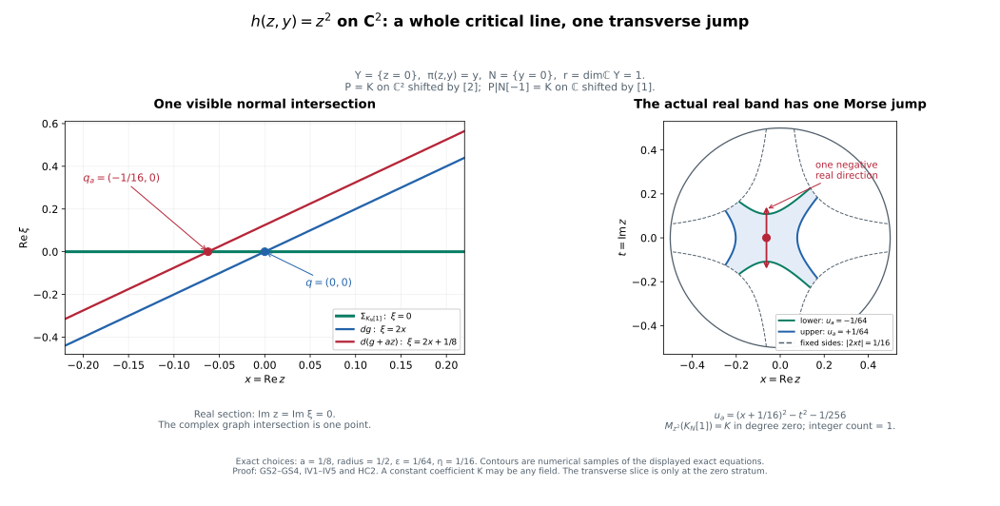

# Holomorphic critical support and graph covectors

[The arbitrary weak-coefficient proof](../weak-coefficients.html#WC5) establishes the same graph-covector and fixed-level closed-support equivalence over every commutative ring, without perfectness or finite generation. It uses [bounded original-ring recollement](../weak-coefficients.html#WC1) and the [actual module filtration](../weak-coefficients.html#WC4). The field and residue-field argument below supplies the earlier perfect-stalk case.

*Written by GPT-6.1 Sol (OpenAI). Self-checked by the writing AI. CC0 1.0.*

The theorem below detects a characteristic covector using the closed support of the actual vanishing-cycle object. It applies to arbitrary holomorphic functions, including singular and positive-dimensional critical loci. The proof first compares the half-plane test with nearby cycles, then prepares a visible normal slice, supplies a uniform radial boundary, and counts the resulting finite Morse filtration over a field. One fixed residue field returns the result to the original coefficient ring.

The prerequisites are [finite nearby-cycle models](../general-nearby-cycle-models.html), normal Morse data and conormal detection, [perverse degrees and normal Morse complexes](../perverse-normal-morse-inputs.html), analytic conormal and finite-map geometry, [relative conormals at the zero fibre](../relative-conormal-zero-fibres.html), [characteristic values](../characteristic-values-from-analytic-cells.html), and [microsupport operations](../../sheaf-proof-readings/SH02-microsupport-operations.html). Their coefficient and ordinary/analytic hypotheses remain in force. The fixed compact-band argument uses the noncharacteristic deformation proof and the sheaf Morse proof.

## HC0. Statement and coefficient class

Let \(k\) be any commutative unital ring of finite global dimension. Let \(M\) be a finite-dimensional complex manifold, let \(A\) be bounded complex constructible on a locally finite complex analytic stratification with perfect stalks, and let \(h\) be any holomorphic function. For every \(z\) in \(M\),

\[
\begin{gathered}
(z,d\operatorname{Re}h_z)\in\operatorname{SS}(A)\\
\Longleftrightarrow\\
z\in\operatorname{Supp}\bigl(\Phi_{h-h(z)}A\bigr).
\end{gathered}
\tag{HC0a}
\]

The support is the closure of the nonzero-stalk locus on the fixed level \(h=h(z)\). Nearby cycles and the unshifted cone are those of FH8; no shift, threshold, original coefficient class or monodromy is changed. The result includes singular supports, nonisolated critical loci, and zero differentials.

## HP0. Exact groups and shifts

Let \(g\) be holomorphic near \(y\) with \(g(y)=0\), let \(A\) have the full HN0 hypotheses, and put \(j_-:\{\operatorname{Re}g<0\}\hookrightarrow M\). The support triangle defines

\[
\begin{gathered}
\mathcal H_g(A)_y\\
=\bigl(R\Gamma_{\{\operatorname{Re}g\ge0\}}A\bigr)_y\\
=\operatorname{Fib}\left(\begin{gathered}A_y\\
\longrightarrow(Rj_{-*}j_-^{-1}A)_y\end{gathered}\right).
\end{gathered}
\tag{HP0a}
\]

With the original unshifted \(\Phi\) convention,

\[
\mathcal H_g(A)_y\simeq (\Phi_gA)_y[-1].
\tag{HP0b}
\]

The comparison identifies the actual two maps out of \(A_y\). A chosen lift of the negative half-disc is retained; changing it conjugates the comparison by the actual deck transport, not by an assertion that monodromy is trivial.

## HP1. Restriction from the whole logarithmic cover

Use the normal family packet of HN5 at the zero-fibre stratum containing \(y\). In the full logarithmic value domain \(u<\log\delta,\ v\in\mathbb R\), choose the lift

\[
u<\log\delta,\qquad \pi/2<v<3\pi/2.
\tag{HP1a}
\]

It maps homeomorphically onto the open negative half-disc \(\{\operatorname{Re}w<0,\ |w|<\delta\}\). The full domain and this single strip are convex. HN3 identifies the proper compact-fibre whole-complex pushforward with a constant derived complex on the entire domain. Its actual section restriction to the chosen strip is therefore an isomorphism: both constant-section/evaluation maps identify it with the same finite fibre complex. The statement is not about the full inverse image of the half-disc, which has infinitely many translated strips.

On the chosen strip the pulled-back coefficient sheaf is exactly the original coefficient sheaf on the negative half-disc tube, since that restricted covering map is a homeomorphism. Thus the unit for the full cover followed by this restriction is the ordinary restriction unit to the negative half-space. This is an identity of adjunction units, and can also be checked by restricting the same representative section. No trace or average over the covering sheets appears.

HN4's actual open-collar restrictions apply to the negative sector as well: the same joint (\(\pi\),\(g\),\(\rho\)) ranks hold, its logarithmic strip is convex, and every collar radial pushforward is proper. Shrinking normal radii or \(\delta\) gives the same stabilized restrictions. Open negative packets form the corresponding part of the genuine cofinal ambient packet neighborhoods. Their section-to-germ comparisons therefore identify

\[
(Rq_*q^{-1}A)_y\xrightarrow{\sim}
(Rj_{-*}j_-^{-1}A)_y
\tag{HP1b}
\]

through this actual strip restriction. The closed-tube source evaluation and specialization square HN6c identify its map from \(A_y\) with the actual support-triangle restriction in HP0a. Taking the fibre gives HP0b.

If \(g\) is identically zero on the local component, both punctured targets are zero. HP0a is \(A_y\), while \(\Phi_gA=A_y[1]\), so HP0b is the identity with the stated shift. The source is not discarded in this case.

All maps are natural and \(k\)-linear. The scalar comparison of HN8 commutes with the strip restriction and the unit; hence HP0b retains the original residue-field comparison. \(A\) rotation of the real half-plane requires rotating this chosen value sector accordingly, rather than adding an antipodal sign without justification.

## HP2. Closed support is contained in the actual characteristic locus

Fix \(g\), and let \(y\) belong to the closed support of \(\Phi_g A\) on \(g=0\). Choose points \(y_j\) on \(g=0\) tending to \(y\) at which its stalk is nonzero; if its stalk at \(y\) is already nonzero the sequence may be constant. HP0b makes the actual supported test at \(y_j\) nonzero. The defining microsupport criterion therefore gives

\[
(y_j,d\operatorname{Re}g_{y_j})\in\operatorname{SS}(A).
\tag{HP2a}
\]

Continuity of \(dg\) and closedness of microsupport give the same membership at \(y\). This includes zero covectors and empty objects. In particular

\[
\begin{gathered}
\operatorname{Supp}(\Phi_gA)\\
\subset\left\{\begin{gathered}y\in g^{-1}(0):\\
(y,d\operatorname{Re}g_y)\in\operatorname{SS}(A)\end{gathered}\right\}.
\end{gathered}
\tag{HP2b}
\]

Conversely stated as a useful vanishing assertion, if the actual covector at \(y\) is outside microsupport, its complement contains an open cotangent neighborhood. The continuous graph of \(d\operatorname{Re}g\) stays in that complement over a smaller base neighborhood. By HP0b and the microsupport criterion all zero-fibre vanishing-cycle stalks there are zero. Hence \(y\) is outside their closed support. This uses one genuine neighborhood; vanishing of the single stalk at \(y\) alone would not give it.

For HC0 at \(z\) apply this to the fixed function \(g=h-h(z)\). Every point used in the closed-support sequence lies on that same level. Functions or threshold values are not changed along the sequence. The remaining direction is actual characteristic membership implying closed-support nonvanishing; HP2 does not claim it.

## HP3. The reverse implication to be proved

Over a field, full conormal detection identifies microsupport with the locally finite union of visible original conormal closures. Its intersection with the graph of \(dg\) is analytic. The rest of the proof shows that every component of that actual intersection is in the closed support of \(\Phi_g A\). HN9 supplies the actual nearby comparison for normal slices at zero-fibre strata. GS0–GS4 and IV0–IV5 supply the visible-conormal slicing and microlocally isolated positive-index statement, with invisible original strata and bounded-complex reductions retained. The unrestricted conclusion is not inferred from HP2 or from a single generic normal-object calculation.

## GS0. Actual characteristic components have the prescribed value

Write \(J\) for the real-part cotangent isomorphism AP3a, and let

\[
\begin{gathered}
\Sigma_A=J^{-1}\operatorname{SS}(A)\\
=\bigcup_{S\text{ visible}} C_S,\\
C_S=\overline{T_S^*M}.
\end{gathered}
\tag{GS0a}
\]

Use the complete NMC10/NG1–NG9 formula, with its original locally finite connected complex analytic Whitney labels. There are only finitely many such sets in a retained relatively compact chart. AC1–AC3 give closed analytic conic pure \(n\)-dimensional closures, their analytic base boundaries, and a proper analytic subset of each component containing its singular, boundary and nongeneric points. AP2 excludes shared \(n\)-dimensional components. On each regular conormal bundle the tautological form \(\alpha\) is zero. The singular pullback proof CV1–CV2 of the characteristic-values increment extends this vanishing to any incident analytic piece.

For a fixed holomorphic \(g\) with \(g(z)=0\), set

\[
C=\{x:(x,dg_x)\in\Sigma_A\}.
\tag{GS0b}
\]

It is analytic, being the inverse image by the analytic graph map. On its smooth pieces, graph pullback of \(\alpha\) is \(dg\); singular pullback therefore makes \(dg\) vanish there. Thus \(g\) is constant on each local irreducible component of \(C\). Choose a small representative at \(z\) containing only its finitely many components through \(z\). Every such component is contained in \(g=0\), because its constant value is its value at \(z\). This includes \(dg_z=0\), a zero-section component, and a positive-dimensional critical locus.

Fix one irreducible component \(Z\) of this actual \(C\). We shall show nonzero vanishing cycles on a dense open subset of \(Z\). Choose a visible original \(C_S\) containing its graph on a dense open subset; a finite union of proper analytic subsets cannot cover \(Z\). Its dimension is \(r\). All further deletions from \(Z\) will be proper analytic sets.

## GS1. Compactified conormals and finite rank preparation

Choose \(Z_reg\) in one analytic chart and initially shrink to a smooth open piece contained in a single original coefficient stratum. Mark \(Z\) and all other components of \(C\) in the HN1 zero-fibre Whitney/\(a_g\) construction. The resulting stratum \(Y\) is a dense open part of \(Z\); later analytic deletions are included in the same descending-dimension construction. In holomorphic coordinates (\(y\),\(\zeta\)), \(Y=\{\zeta=0\}\), \(\pi(y,\zeta)=y\), and a normal slice is \(N_b=\{y=b\}\).

We also prepare \(Y\) for the cotangent sets. The minor equations in AC2 are homogeneous in the covector. In a projective chart of \(P\)(\(T\)^*\(M\)\oplus \(C\)), take the closures of their actual conormal bundles, selecting components by SGC8 as in RC0. They define the projective compactifications \(\widehat C_T\) of all the finitely many original \(C_T\); their affine chart is exactly \(C_T\). Their infinity part has dimension at most \(n-1\). The marked closed analytic sets \(\widehat E_T\) are the projective closures of AC3's proper bad subsets and this infinity part. In particular every affine component of \(E_T\) has dimension at most \(n-1\). Local choices glue because they are closures of the same actual bundles, rather than independently selected extra minor components.

Over the initial smooth \(Y\) restrict all these sets to base \(Y\). Projective projection is proper. Construct a complex analytic Whitney stratification of this finite analytic family, compatible with the sets and their marked subsets, and apply the coherent Jacobian/minor rank construction on each analytic-difference stratum for its projection to \(Y\). Its analytic closure selects exactly the components meeting that stratum (SGC8). A stratum whose projection has rank less than \(r\) has closure with the same strict generic-rank bound. The full RMP theorem makes its proper image analytic; the rank dimension theorem makes that image have dimension less than \(r\). This assertion concerns general proper images, including positive-dimensional projective fibres; it is not the finite-image theorem.

Delete these images. Repeat on the finitely many singular, boundary, and rank-drop analytic pieces, by descending source dimension. This terminates in at most the maximum local complex source dimension plus one stages. Components whose image is already a proper subset of \(Y\) are deleted at the same step. What remains above the smaller \(Y\) has a Whitney partition on which the projection to \(Y\) is submersive on every stratum, including the marked bad subsets. No positive-fibre jump-locus analyticity is used.

The finiteness is a whole-fibre assertion. The fibre in each projective compactification is compact. Cover their finite union by finitely many source neighborhoods meeting finitely many components and strata. The closed source complement misses that fibre; properness lets us shrink the base so the entire inverse image lies in the finite union. Consequently the preceding deletions use finitely many images on a neighborhood of the entire fibre, and retain all its points. This is the RC3/SGC9 compact-fibre mechanism.

Apply Whitney(a) to the total cotangent stratification at every point above the smaller \(Y\). Its incident tangent limits contain the tangent plane of the stratum above \(Y\). The differential of the ambient \(\pi\) is onto on that plane. Kernel continuity makes it onto on every nearby incident stratum as well. Compactness of the projective fibre and the preceding proper shrinking give one neighborhood on which \(\pi\) is stratified submersive simultaneously on every \(\widehat C_T\) and \(\widehat E_T\). The same statement holds in their affine charts. This proves the preparation actually needed below.

## GS2. Dense original generic covectors remain in each prepared slice

For \(b\) in the prepared \(Y\), \(C_T\) intersected with \(\pi=b\) is an analytic set cut out in a pure \(n\)-dimensional set by \(r\) equations. Each of its components has dimension at least \(n-r\). Each stratum of \(E_T\) intersected with \(\pi=b\) has dimension equal to its stratum dimension minus \(r\), by GS1; hence its dimension is at most \(n-r-1\). Thus no component of \(C_T\) intersected with \(\pi=b\) is contained in \(E_T\). The complement, consisting of original regular generic conormals over \(T\), is dense in the full fibre. This proves density on the particular chosen slice, rather than inferring it from ambient density.

Whitney(a) for the coefficient refinement gives, over \(Y\), that every original limiting conormal kills TY. In these coordinates no nonzero such covector is a pure dy covector. Compactness of unit covectors gives, in a smaller base neighborhood, a uniform bound

\[
|\xi_y|\le C|\xi_{zeta}|\quad((x,\xi)\in\Sigma_A).
\tag{GS2a}
\]

If this failed, normalize a contrary sequence and use closedness and conicity to obtain a nonzero pure dy covector over \(Y\). Consequently the cotangent restriction map

\[
\rho_b:(x;\xi_y,\xi_{zeta})\longmapsto(x;\xi_{zeta}),
\quad x\in N_b,
\tag{GS2b}
\]

is proper on the relevant conormal sets over a smaller closed base trap. Its fibres are compact analytic subsets of an affine covector space and are finite by FMR3. We only need its continuity and properness for the following closed-image argument.

At an original regular generic covector over \(T\) intersected with \(N_b\), \(\pi|_T\) is submersive. Cotangent restriction sends \(T_T^*M\) isomorphically onto the conormal to \(T\) intersected with \(N_b\) in \(N_b\): there is a unique dy correction making a prescribed normal covector kill \(T\). Complete \(\pi\) on \(T\) by coordinates t and then by ambient normal coordinates nu. The common slice {\(\pi=b\),t=t(\(x\))} is literally a transverse slice to \(T\) in \(M\) and to \(T\) intersected with \(N_b\) in \(N_b\). Its coefficient object is the same restriction of \(A\) in both descriptions. An original generic normal covector remains generic after restriction: for an original limiting upper plane \(P\), Whitney(a) gives \(T_xT\) contained in \(P\) and kernel continuity gives

\[
\begin{gathered}
P=T_xT+(P\cap\ker d\pi),\\
\xi|P\ne0\ \Longleftrightarrow\\
(\xi|TN_b)|_{P\cap\ker d\pi}\ne0.
\end{gathered}
\tag{GS2c}
\]

Only induced sequences already in \(N_b\) are used. The original and induced normal objects can therefore be computed on that literal common slice with the same holomorphic test, radius, coefficient object and actual restriction fibre. NMC continuation identifies them with the allowed original models. A visible \(T\) consequently gives a nonzero generic normal object on \(T\) intersected with \(N_b\). Full conormal detection on \(N_b\) puts the restricted covector in SS(\(A|_{N_b}\)).

Apply GS2's fibrewise density and then closedness of SS(\(A|_{N_b}\)). Every point of \(\rho_b\)(\(C_T\) intersected with \(\pi=b\)) for a visible \(T\) is in the complex microsupport of \(A|_{N_b}\). In particular

\[
(b,dg_b|TN_b)\in\Sigma_{A|N_b}
\tag{GS2d}
\]

for the chosen visible \(C_S\) and every \(b\) in the prepared dense open part of \(Z\). Zero covectors pass through the same closure argument. The reasoning does not use the generally false equality for arbitrary real noncharacteristic inverse images.

## GS3. The sliced characteristic intersection is isolated

HN2 gives joint full rank of (\(\pi\),\(g\)) on every off-zero incident stratum. Thus \(g|_{N_b}\) is submersive there, and its differential is outside the full induced conormal union.

At a point \(x\) in \(g=0\) of \(N_b\), let \(T\) be its refined zero-fibre stratum. It is incident to \(Y\) after shrinking, so \(\pi|_T\) is onto. MO20, with its actual noncharacteristic hypothesis supplied by GS2a, gives the upper inverse-image inclusion. If \(dg_x|TN_b\) belongs to the sliced microsupport, it lifts to some \(\xi\) in \(\Sigma_A\) at \(x\) with that restriction. Both \(\xi\) and \(dg_x\) annihilate \(T_xT\): the former by the original/refined conormal upper estimate and Whitney(a), the latter because \(g|_T=0\). Their difference kills \(TN_b\) as well. Since \(T_xT+TN_b=T_xM\), the difference is zero. Therefore \(x\) belongs to \(C\).

Near \(b\) the only component of \(C\) is the smooth \(Y\), and \(Y\) intersected with \(N_b\) is {\(b\)}. Together with GS2d this proves

\[
\operatorname{graph}(d(g|N_b))\cap\Sigma_{A|N_b}
=\{(b,d(g|N_b)_b)\}.
\tag{GS3a}
\]

Invisible original strata may still have nonisolated critical loci. GS3a asserts isolation against the actual microsupport and makes no claim that all declared strata have isolated critical points.

## GS4. Perverse normalization of this slice

Let \(P\) be perverse over a field on the original/refined coefficient category. For an induced stratum \(T\) intersected with \(N_b\) of dimension \(d-r\), GS2c's common slice identifies its unnormalized normal object for \(P\)|\(N_b\) with the original \(N_T(P)\). Hence its normalized object for \(P|_{N_b}[-r]\) is

\[
N_T(P)[-r-(d-r)]=N_T(P)[-d].
\tag{GS4a}
\]

PNM5 and its proved all-strata PD1–PD6 converses make \(P|_{N_b}[-r]\) perverse. The same argument for either half gives t-exactness on this transverse local restriction; it uses the common normal object, not an unproved nonproper costalk base-change map.

The original bounded field t-structure and PNM7–PNM9 are supplied by the full PNM recollement and finite-link proof. Thus \(\Sigma_A\) is the finite union of the \(\Sigma_{{}^pH^j A}\). A visible original normal object remains visible for at least one such perverse cohomology object. For that object GS2–GS3 give a visible isolated sliced intersection. HN9 identifies the actual nearby cycles, specialization and unshifted cone at \(b\) on this normal zero-stratum slice with those in the ambient space. The complete IV0–IV5 isolated-visible lemma, with the independent RB0–RB4 boundary proof, returns a nonzero ambient \(\Phi_g A\) stalk.

## GS5. Prerequisites for the slice argument

This proof uses AC1–AC3/AP1–AP2, SGC8–SGC9, the complete RMP and rank-dimension providers, the same analytic Whitney construction and bad-locus dimension descent as RC/HN1, NMC original normal objects and NG detection, the proved PNM normal-degree characterization, the retained MO20 upper inverse-image theorem, and HN2/HN9. It does not use stronger polar/equimultiplicity alternatives, a generic proper-image theorem for subanalytic sets, or arbitrary-slice nearby base change. GS4 uses the separately supplied complete IV0–IV5/RB0–RB4 lemma. The slice lemma is one part of the HC0–HC3 argument.

## RB0. Hypotheses and target

Let \(M\) be a complex coordinate ball \(B_R\) about \(p=0\), of complex dimension \(m\). Let \(B\) be bounded complex constructible on the original locally finite complex analytic Whitney labels, at the original coefficient scope. Write

\[
\Sigma_B=J^{-1}\operatorname{SS}(B)=\bigcup_{S\text{ visible}}C_S.
\tag{RB0a}
\]

Shrink the ball to meet finitely many labels. Suppose \(g\) is holomorphic, \(g(p)=0\), and its graph meets \(\Sigma_B\) only possibly at \((p,dg_p)\). This is isolation against the actual visible microsupport; no regularity of \(g\) on invisible labels is required. We prove that every sufficiently small positive radial sphere has the exact microlocal independence needed for IV1–IV2 over \(g=0\), uniformly in a small complex-value neighborhood and under a small \(C^1\) perturbation.

## RB1. \(A\) closed isotropic cone contains the radial obstruction

For a visible original connected \(S\) on which \(g\) is nonconstant, let

\[
\begin{gathered}
S^*=\{x\in S:g(x)\ne0,\ dg_x|T_xS\ne0\},\\
D_S=\overline{\left\{\begin{gathered}(x,\xi):x\in S^*,\\
\xi|\ker(dg_x|T_xS)=0\end{gathered}\right\}}.
\end{gathered}
\tag{RB1a}
\]

These are exactly the actual relative-conormal closures of RC0. Its coherent minor construction and SGC8 component selection give closed analytic complex-conic sets, not extra components supported on the deleted base. RC1–RC2 prove that

\[
\begin{gathered}
D_S^0=D_S\cap\pi^{-1}\{g=0\}\\
\text{is isotropic, including its singular pieces}\\
\text{and zero covectors}.
\end{gathered}
\tag{RB1b}
\]

The proof allows arbitrary vanishing order of \(g\), poles in its meromorphic multiplier, and singular normalization pullback; no normal-crossing hypothesis on \(g\) is introduced.

Because \(g\) is nonconstant on connected \(S\), \(S^*\) is a dense open subset of \(S\). The zero locus of \(g\) and its analytic rank-drop locus are proper there. The conormal vector bundle over \(S^*\) is therefore dense in \(T_S^*M\) and hence in its actual closure \(C_S\). At \(x\) in \(g=0\) and \(\xi\) in (\(C_S\))_x, approximate (\(x\),\(\xi\)) by \((x_j,\xi_j)\) in that bundle over \(S^*\). For any fixed \(\lambda\in\mathbb C\),

\[
\xi_j+\lambda dg_{x_j}\in(D_S)_{x_j},\qquad
\xi_j+\lambda dg_{x_j}\longrightarrow\xi+\lambda dg_x.
\]

It follows that

\[
(C_S)_x+\mathbf C\,dg_x\subset(D_S^0)_x.
\tag{RB1c}
\]

This argument approximates in the dense off-zero bundle, and does not need density in an arbitrarily fixed level slice.

A visible \(S\) on which \(g\) is identically zero would consist entirely of graph-critical points: \(dg\) kills TS and hence (\(x\),\(dg_x\)) lies in its visible \(C_S\). RB0 therefore permits such a retained label only when it is the point {\(p\)}. Include \(T_p^*M\) for that case. A nonzero constant label cannot meet \(g=0\) or have \(p\) in its closure and is irrelevant after shrinking. Define the finite union

\[
\begin{gathered}
\Lambda_0=\bigcup_{\substack{S\text{ visible}\\g|S\text{ nonconstant}}}D_S^0\ \cup\ T_p^*M\\
\text{if the point label is visible and }\\
g|_{\{p\}}=0.
\end{gathered}
\tag{RB1d}
\]

Its real-part image \(J\) \(\Lambda_0\) is closed, positive-conic, locally subanalytic and isotropic. Its actual base is the finite closed analytic union of \(H_S\) intersected with \(g=0\) and possibly {\(p\)}: zero relative covectors over the dense \(S^*\) approximate every base point, and the opposite inclusion is immediate. Thus the base is closed in \(B_R\). RB1c gives, for every relevant \(x\) in \(g=0\),

\[
(\Sigma_B)_x+\mathbf C\,dg_x\subset(\Lambda_0)_x.
\tag{RB1e}
\]

If \(g\) is identically zero locally, RB0 makes the closed support of \(B\) contained in {\(p\)}, because zero covectors are in microsupport precisely over that support. Then take \(\Lambda_0\)=\(T_p^*M\) and the same inclusion holds. If the support is empty take \(\Lambda_0\) empty. Dimension \(m=0\) is the direct point calculation and needs no radial sphere.

## RB2. Proper radial exhaustion and a whole interval of allowed radii

On \(B_R\) use the real analytic exhaustion

\[
\varphi(x)=\frac{\rho(x)}{R^2-\rho(x)},\qquad \rho(x)=|x|^2.
\tag{RB2a}
\]

It is proper on the actual closed base of \(J\) \(\Lambda_0\). The inverse image of a compact interval is closed in a smaller closed coordinate ball, and hence compact. Its derivative is

\[
d\varphi=\frac{R^2}{(R^2-\rho)^2}\,d\rho,
\tag{RB2b}
\]

with strictly positive multiplier. The full E14/CV0–CV5 theorem applies to this closed positive-conic locally subanalytic isotropic set, including its singular and zero pieces. Its characteristic values are closed and locally finite. Consequently some \(a>0\) has no positive characteristic value in \((0,a]\). For every sufficiently small \(r>0\) with \(r^2/(R^2-r^2)\leq a\), we obtain

\[
J^{-1}(d\rho_x)\notin(\Lambda_0)_x
\qquad(\rho(x)=r^2,\ g(x)=0).
\tag{RB2c}
\]

The positive multiplier is removed by conicity. Thus there is a whole interval of allowed small radii; we do not assume that a singular fibre has a generic regular radius by an unproved Sard theorem. The exhaustion avoids the incorrect assertion that the bounded function \(\rho\) is proper on an open coordinate chart.

## RB3. Exact simultaneous row exclusion, including zero and empty cases

Fix one such sphere and \(x\) on it with \(g\)(\(x\))=0 and nonempty microsupport fibre. Write \(u\)=Re \(g\), \(v=\operatorname{Im}g\). If \(dg_x=0\), the zero covector at this support point gives a graph point of \(\Sigma_B\) outside \(p\), contrary to RB0. Hence \(du\),\(dv\) are independent.

Suppose a real linear combination of a unit \(\xi\) in \(\operatorname{SS}(B)_x\) and the rows \(du\),\(dv\),\(d\rho\) were zero. If the radial coefficient is nonzero, the real-part isomorphism \(J\) and complex conicity of \(\Sigma_B\) would express \(J^{-1}(d\rho_x)\) as an element of \((\Sigma_B)_x+\mathbb C\,dg_x\). RB1e and RB2c exclude it. If that coefficient is zero, a nonzero combination of \(du\),\(dv\) would be a nonzero complex multiple of \(dg_x\) in \(\Sigma_B\), also excluded by RB0. The remaining possibility would make the unit \(\xi\) zero. Thus

\[
\begin{gathered}
\{\xi,du_x,dv_x,d\rho_x\}\\
\text{is linearly independent for every unit }\\
\xi\in\operatorname{SS}(B)_x.
\end{gathered}
\tag{RB3a}
\]

The three rows \(du\),\(dv\),\(d\rho\) themselves are independent on the base support, even when \(\Sigma_B\) has only its zero covector: a radial relation would put \(d\rho\) in \(\mathbb C\,dg\) contained in \(\Lambda_0\) by its zero covector and RB1e; a relation without the radial row would make \(dg\) zero.

The zero-level part of the sphere over the closed support is compact. Its unit microsupport covectors form a compact set. Normalize the row coefficients to unit length. A contrary sequence with least singular value tending to zero has a convergent base, unit covector and normalized coefficient subsequence, giving one of the forbidden exact relations above. This proves a uniform positive independence margin. If the unit-covector set is empty, closedness excludes nearby unit covectors and the three-row calculation gives the margin. If the zero-level sphere meets no support, compactness gives a small value neighborhood with no relevant support points at all.

Continuity of \(dg\) and \(d\rho\) and closedness of microsupport now extend the margin to \(|g|\leq2\eta\) on the fixed sphere, for some \(\eta>0\), and to sufficiently small \(C^1\) perturbations of \(g\). At the fixed sides \(\operatorname{Im}g=\pm\eta\) inside the real band, the same independence of the value row combinations follows from RB0 and compactness, since those sides miss \(p\). Apply the actual signed closed-face estimates on neighborhoods of the active faces. This gives exactly the simultaneous radial/real/imaginary/parameter corner exclusions in IV1–IV2, including the empty original supported test. Nothing has been inferred from whether that test is nonzero.

## RB4. Prerequisites of the radial argument

RB1 uses the complete relative-conormal proof RC0–RC4 and its precise finite-normalization, singular-pullback, analytic component and scalar-holomorphic floor. RB2 uses the complete characteristic-values proof CV0–CV5 and its finite-cell/analytic-arc floor, applied to the explicit proper exhaustion. RB3 uses finite-dimensional compactness, the actual closed-face estimates, conicity and the real-part cotangent isomorphism. This supplies the IV0 boundary assertion directly at the already retained floor. Massey's isolated-support Bertini lemma remains a scholarly antecedent; the radial argument here is the direct proof RB1–RB3.

## IV0. Statement and boundary conditions

Let \(M\) have complex dimension \(m\), let \(K\) be any field, and let \(B\) be bounded complex constructible with finite-dimensional stalks. Let \(g(p)=0\). In a neighborhood suppose

\[
\begin{gathered}
\operatorname{graph}(dg)\cap\Sigma_B\subset\{(p,dg_p)\},\\
\Sigma_B=J^{-1}\operatorname{SS}(B).
\end{gathered}
\tag{IV0a}
\]

The set on the left may be empty. Invisible original strata may have arbitrary critical loci. For every perverse \(P\) whose microsupport is contained in \(\Sigma_B\), the actual supported complex

\[
M_g(P)_p=(R\Gamma_{\{\operatorname{Re}g\ge0\}}P)_p
\tag{IV0b}
\]

is a finite-dimensional vector space in degree zero. It is nonzero if a visible conormal of \(P\) contains \((p,dg_p)\).

The full independent radial proof RB0–RB4 supplies the boundary input at exactly IV0a. Relative-conormal zero-fibre specialization gives a closed isotropic cone containing \(\Sigma_B+\mathbb C\,dg\) over \(g=0\). The complete characteristic-values theorem, applied to the proper exhaustion \(\rho/(R^2-\rho)\), excludes its radial covectors at every sufficiently small positive radius. RB3 then proves simultaneous independence of the radial, real/imaginary value rows and every unit microsupport covector. The compact margin extends to \(|g|\leq2\eta\) on the selected sphere and to sufficiently small \(C^1\) perturbations. The actual signed closed-face estimates give the corresponding bound for the restricted coefficient complex.

This uses only the already proved RC/CV floor. It supplies the empty-support case from the same actual graph exclusion and uses the explicit RB boundary argument without imposing isolation on invisible strata. HP2 separately confirms that vanishing-cycle support is isolated or empty, but RB does not require the reverse characteristic-to-support implication. The other inputs below have their complete internal proof bodies: general finite nearby-cycle models, NMC detection and local normal/tangential comparisons, finite analytic maps, the full the sheaf Morse theorem noncharacteristic deformation theorem and endpoint comparisons, and the classical boundary/proper-image microsupport estimates.

## IV1. One compact real band represents the actual stalk

Write \(u\)=Re \(g\) and \(v=\operatorname{Im}g\). Take \(C\) and \(\eta\) from IV0 and choose 0<\(\epsilon\)<\(\eta\) sufficiently small. Put

\[
X=C\cap\{|v|\le\eta\},\qquad
B_\pm=X\cap\{u\le\pm\epsilon\}.
\tag{IV1a}
\]

Over the compact band -\(\epsilon\)<=\(u\)<=\(\epsilon\), the only possible interior graph point of \(du\) in SS(\(B\)) is \(p\). On the side faces \(v\)=+/-\(\eta\), any cancellation of \(du\) with a multiple of \(dv\) would put a nonzero complex multiple of \(dg\) in the complex conic \(\Sigma_B\). This is excluded by IV0a, since those faces miss \(p\). On the radial face and its side corners, \(|g|\)<=sqrt(\(\epsilon\)^2+\(\eta\)^2)<2 \(\eta\) and IV0 gives the full exclusion, with the actual face signs retained. The same exclusions hold on a slightly larger band. Fixed faces are treated by the closed-face estimate; no submersivity on every invisible stratum is asserted.

The height \(u\) on compact \(X\) is proper. Apply the complete the sheaf Morse theorem theorem to the coefficient restricted to \(X\) and to this band. Its between-level maps are the actual section restrictions. At height zero, the proper height pushforward and the support localization triangle identify the jump with the supported complex restricted to the compact zero-height fibre. Its stalks are zero except at \(p\), by the preceding exclusion and the microsupport definition. Its sections are therefore its one stalk IV0b. The exact compact-neighborhood endpoint comparisons then identify

\[
\operatorname{Fib}\bigl(R\Gamma(B_+;P)\longrightarrow
R\Gamma(B_-;P)\bigr)\simeq M_g(P)_p.
\tag{IV1b}
\]

This is the single-jump portion of the full sheaf Morse proof; the lower part of \(X\) need not have zero cohomology. The formula uses a relative band and its actual restriction map, not an assertion that all of \(C\) retracts onto a sublevel by a stratified flow. The point \(p\) is interior to all artificial faces, so its local supported object is literally the original IV0b.

## IV2. Continuation retains the same pair map

Choose a small constant complex covector a and its linear holomorphic function \(\ell\) centered by \(\ell(p)=0\). Work on an open parameter interval \(I=(-\tau,1+\tau),\ \tau>0\), and put \(g_s=g+s\ell\). Choose a small enough that all the exclusions below hold throughout this slightly enlarged interval; the endpoint comparisons will be at \(s=0\) and \(s=1\). Keep the side height \(v=\operatorname{Im}g\) fixed. Define

\[
\begin{gathered}
E^\pm=\left\{\begin{gathered}(x,s):s\in I, x\in C, |v(x)|\le\eta,\\
\operatorname{Re}g_s(x)\le\pm\epsilon\end{gathered}\right\}.
\end{gathered}
\tag{IV2a}
\]

Both projections to the open smooth parameter interval \(I\) are proper: inverse images of its compact subsets are closed in \(C\) times that compact subset. First form the fixed closed extension \(F_X=i_{X*}(P|_X)\) on \(M\). Its pullback to \(M\times I\) is literally the coefficient extension on the fixed \(X\times I\), and has covectors \((\xi,0)\), by the exact submersion formula. This remains true even if a distant fixed radial face is characteristic. We do not apply a transverse boundary estimate to that distant face.

In a neighborhood of a moving real-height face, \(|g|\) is small by the bound on \(v\) and the small perturbation. On this neighborhood IV1's simultaneous exclusions give the closed-face bound for \(F_X\): its spatial covectors lie in \(\Sigma_P\) plus the active fixed radial/side normal rays. Cutting by \(\operatorname{Re}g_s\leq\pm\epsilon\) adds only its actual signed height normal ray. A nonzero pure parameter covector would then require a cancellation of those spatial covectors with the height row and the other active face rows. These are precisely the uniformly excluded row combinations of IV1. In particular the boundary estimate's no-cancellation hypothesis holds on this entire local base neighborhood; at corners it follows from simultaneous exclusion. Away from the moving face the cut is locally empty or the fixed product, which already has no nonzero parameter covector. The estimate is therefore justified globally without imposing radial transversality outside the band. No artificial parameter endpoint is included in this microsupport calculation.

The proper-image microsupport estimate consequently puts both parameter pushforwards in the zero section of \(T^*I\). The same holds for their actual restriction morphism \(E^+\) to \(E^-\) and its relative fibre. Whole-complex interval descent identifies these bounded complexes with their constant models on \(I\); proper base change supplies the evaluation maps at \(s=0\) and \(s=1\). Thus the endpoint square of the actual pair maps gives an isomorphism of their specified fibres. One may restrict those constant models to [0,1], take sections there, and use the two counit evaluations. These maps are natural and \(K\)-linear, and apply to every \(P\) simultaneously. They do not identify an unperturbed stalk with a perturbed stalk at \(p\).

The relevant boundedness and finite dimensions follow from the finite constructible closed-pair models ([finite normal pairs](../finite-holomorphic-microsupport.html#SH02-FH-FINITE-PAIR) and [compatible triangulation](../compatible-whitney-triangulation.html#SH02-COMPATIBLE-TRIANGULATION)); each face is real analytic and the original labels are analytic differences by AC1. Uniform ambient dimension bounds also give boundedness before finiteness. This continuation invokes the retained boundary and proper estimates with their real hypotheses, not a controlled field pretending that \(g\) is regular on invisible labels.

## IV3. Finite maps produce a nonempty visible Morse cluster

For every local irreducible component \(\Lambda\) of \(\Sigma_B\) through \(q\)=\((p,dg_p)\), consider

\[
H(x,\xi)=\xi-dg_x:\Lambda\longrightarrow\mathbf C^m.
\tag{IV3a}
\]

Its zero fibre is isolated at \(q\). The original finite-map trap argument IHM-POSITIVITY gives a representative proper over a small target ball: the norm of \(H\) has positive minimum on the compact boundary of a sufficiently small source coordinate ball. Fibres are compact analytic subsets of an affine chart, hence finite by FMR3. The source is pure \(m\)-dimensional, so its proper analytic image has dimension \(m\) and is the whole connected target ball. This works at singular \(q\) and at \(dg_p=0\).

Remove \(\Lambda\)'s singular locus, its part over the original stratum boundary, its nongeneric-normal locus AC3, and the closure of the \(\operatorname{rank}<m\) locus of \(H\). Each is proper analytic; finite image makes their images proper analytic in the target. There are finitely many retained \(\Lambda\). Choose an arbitrarily small a outside their finite union of bad images. Components not containing \(q\) have no small-\(H\) points in the compact trap and can be discarded by one compact minimum. Closedness over the compact base ball, and the bound \(\xi=dg_x+a\), ensure that every perturbed visible graph point in that ball lies in these source traps. No unbounded covector can escape.

Then \(H^{-1}(a)\) is finite and lies on smooth original generic conormal bundles, with transverse graph intersections. Its base points are holomorphic stratified Morse points of \(g+\ell\): the differential kills the tangent plane of the original stratum, and graph transversality is the nondegeneracy of its complex tangential Hessian. AC3 gives the actual generic normal condition. Each component through \(q\) has a nonempty fibre, so a visible conormal of \(P\) through \(q\) supplies at least one point with nonzero original normal object of \(P\).

For \(m=0\) source and target are points; the local object is the original stalk and the count is one. If the graph intersection for \(B\) is empty, a compact minimum excludes all nearby perturbed visible graph points. These cases do not require a positive-dimensional sphere.

## IV4. Invisible critical loci contribute zero tests

At \(s=1\) use the proper height \(u_1=\operatorname{Re}(g+\ell)\) on the same fixed \(X\). The exclusions of IV1 persist at every face of the band. Its interior graph intersects the actual microsupport at just the finite visible points from IV3. An invisible original stratum can still contain nonisolated critical points of \(u_1\). At every point not in this finite microsupport graph intersection, its actual local support test is zero by definition. This is exactly the hypothesis of the sheaf Morse theorem; no stratified-regularity condition at those invisible critical points is needed.

At a visible point on an original stratum \(T\) of complex dimension \(d\), the ordinary holomorphic Morse lemma gives one negative and one positive real square in each complex tangential coordinate for Re(\(g+\ell\)). Its index is \(d\). The full original-boundary/normal-tangential E07 comparison identifies its actual jump with

\[
Q_x(P)\simeq N_T(P)[-d].
\tag{IV4a}
\]

PNM5 puts this finite-dimensional object in ordinary degree zero for every perverse \(P\). Its normal object can be zero for a particular \(P\), which causes no extra contribution. Coincident real critical values give finite direct sums; no separation of complex values, absolute-value height, or holomorphic count theorem is required.

Between successive regular heights the actual restrictions are isomorphisms by the sheaf Morse theorem. At each exceptional height its proper support localization gives a triangle whose relative quotient is the direct sum of the IV4a tests. To orient an increasing filtration keep the final upper sublevel fixed and remove the relative sublevels in reverse order, exactly as in IHM6–IHM7. Starting with zero gives the actual final relative fibre in IV1b (transported by IV2), with the \(Q_x\) as successive quotients.

Each quotient lies in degree zero. The resulting long exact sequences are short exact degree-zero sequences. The dimension of the final object is the ordinary integer sum of their dimensions. A visible conormal of \(P\) through \(q\) supplies a positive summand by IV3; therefore \(M_g(P)_p\) is nonzero. All fields are retained, since this is integer vector-space dimension, not a trace reduced modulo the field characteristic. This proves IV0b's assertion at the complete independent RB boundary floor.

## IV5. Bounded complexes and the same exact functor

Use the actual fixed functor \(F(A)=(R\Gamma_{\{u\geq0\}}A)_p\), or its fixed pair fibre IV1b. It is exact on derived triangles. Suppose \(A\) has IV0a, and write \(P_j={}^pH^j A\). PNM9 puts \(\Sigma_{P_j}\) inside \(\Sigma_A\). IV0–IV4 thus put each \(F(P_j)\) in degree zero. The finite perverse truncation triangles show

\[
F({}^p\tau_{\le j}A)\in D^{\le j},\qquad
F({}^p\tau_{\ge j+1}A)\in D^{\ge j+1}.
\tag{IV5a}
\]

Indeed each is built by finitely many extensions of \(F(P_i)[-i]\), with respectively \(i\leq j\) and \(i\geq j+1\). These are the ordinary truncation triangles of \(F(A)\), so their two adjacent cuts give

\[
H^jF(A)\simeq F(P_j).
\tag{IV5b}
\]

This is a degree argument using the bounded t-structure, not an assumed splitting or degeneration without checking the truncation arrows. If \(q\) belongs to \(\Sigma_A\), PNM7–PNM9 provide one \(P_j\) with a visible conormal through \(q\). Its \(F(P_j)\) is nonzero by IV4; hence \(F(A)\) is nonzero. HP0 then gives the same conclusion for the actual unshifted \(\Phi_g A\), with the shift \([-1]\) retained.

## HC1. The actual half-plane comparison supplies one implication

Put \(g=h-h(z)\). HP0–HP2, proved from the full nearby-cycle models, identify the actual supported half-plane object with \(\Phi_g A[-1]\). They compare the actual units by restriction to one chosen negative logarithmic strip, preserve all finite coefficient squares, and retain the unshifted cone. Every nonzero vanishing-cycle stalk therefore gives \((x,d\operatorname{Re}g_x)\) in \(\operatorname{SS}(A)\). Taking closure on the same fixed level, using closedness of microsupport and continuity of \(dg\), proves the right-to-left implication of HC0a. The same proof shows that absence of the graph covector gives one neighborhood with vanishing vanishing-cycle stalks.

## HC2. The reverse implication over every field

First let \(k\)=\(K\) be a field. Full NMC detection makes the complex microsupport \(\Sigma_A\) a finite local union of visible analytic conormal closures. GS0 shows that the actual graph intersection \(C\) is analytic and that every local component through \(z\) has \(g\) identically zero. Work on one such component \(Z\).

GS1 prepares a dense open stratum \(Y\) of \(Z\) simultaneously for the original coefficient strata, the zero-fibre \(a_g\) refinement, and the projectively compactified conormal and exceptional sets. Its whole compact cotangent fibre is retained. GS2 proves fibrewise density of the original regular generic conormals in a normal slice \(N_b\), and uses the literal common normal pair to preserve visibility. This is the lower slicing assertion needed here; an arbitrary real inverse-image equality is not used.

GS3 proves that the graph of \(d\)(\(g|_{N_b}\)) meets the actual sliced microsupport only at (\(b\),\(d\)(\(g|_{N_b}\))_b). It proves this for the visible conormal union even if invisible original strata have nonisolated critical loci. GS4 makes the transverse restriction \([-\dim Y]\) perverse t-exact using the proved all-strata normal-degree characterization and the common normal model.

Apply IV0–IV5 to this sliced coefficient object. The actual supported functor at \(b\) maps its perverse cohomology objects to degree-zero vector spaces. A visible isolated graph intersection supplies at least one nonzero such object: finite analytic maps produce a nonempty generic visible Morse cluster; the actual microsupport deformation theorem gives zero tests at all other, possibly nonisolated invisible, critical points; the independent RB radial exclusion and parameter proper image preserve the actual compact band map. Its finite filtration has the original normalized normal objects as quotients. Integer degree-zero dimensions are additive, so no field-characteristic or derived cancellation can remove the contribution.

The finite perverse truncation triangles then identify the cohomology of the supported functor on the whole bounded complex with these degree-zero contributions, as in IV5. Thus its actual supported object at \(b\) is nonzero. HP0 gives nonzero \(\Phi_{g|N_b}(A|_{N_b})_b\). HN9 compares this exact specialization and cone with the ambient \((\Phi_g A)_b\) on this zero-stratum normal slice. Hence \((\Phi_g A)_b\) is nonzero for every \(b\) in the prepared dense open subset of \(Z\).

The fixed closed support contains this dense subset and therefore all of \(Z\), including \(z\). Repeating for the finitely many local components proves the left-to-right implication over \(K\). Points with nonzero graph covector and points with zero graph covector pass through the same proof. If \(g\) is identically zero on a local component, the direct HN0 case \(\psi_g A=0\) and \(\Phi_g A=A[1]\) also confirms the conclusion there: its closed support is \(\operatorname{Supp}(A)\), exactly the base of the zero covectors in \(\operatorname{SS}(A)\).

## HC3. Return to the original ring by one actual visible normal model

Suppose the original graph covector belongs to \(\operatorname{SS}(A)\). NMC10 gives one visible original conormal \(C_S\) containing it. Its fixed actual normal object \(N_S(A)\) has a finite perfect model by [the finite normal-pair argument](../finite-holomorphic-microsupport.html#SH02-FH-FINITE-PAIR). Derived residue-field detection gives a prime ideal \(q\) of \(k\) with

\[
N_S(A)\otimes_k^L\kappa(q)\ne0.
\tag{HC3a}
\]

No perfection of \(\kappa(q)\) over \(k\) is assumed. The actual finite-pair projection morphism of FH16 identifies HC3a with the same normal object of \(A_q=A\otimes_k^L\kappa(q)\). This one conormal is therefore visible over that fixed residue field, so the graph covector belongs to \(\operatorname{SS}(A_q)\). Original finite global dimension and the original bounded degree range make \(A_q\) bounded with finite-dimensional constructible stalks.

HC2 over this field shows \(z\) lies in \(\operatorname{Supp}(\Phi_g A_q)\). The complete nearby-cycle comparison HN8 identifies

\[
\Phi_g A\otimes_k^L\kappa(q)
\xrightarrow{\sim}\Phi_g A_q,
\tag{HC3b}
\]

using the actual covering projection morphism, specialization unit square and its cone. It was established after finite geometric stabilization, not by tensoring an infinite neighborhood limit. If \(\Phi_g A\) vanished on a neighborhood of \(z\) in \(g=0\), so would its tensor and hence \(\Phi_g A_q\) there, contradicting the field conclusion. Thus \(z\) lies in the original closed support. The same fixed prime works for the chosen conormal; no closure of an infinite union of residue-field supports is needed.

Together with HC1 this proves HC0a at the stated floor. It does not require a perverse t-structure over \(k\), noetherian \(k\), finite free stalk models, an isolated original critical locus, or the stronger polar/equimultiplicity alternatives.

## HC4. The maps used in the proof

The actual sequence of arrows is: original normal-pair projection to the selected residue field; graph restriction to a prepared zero-stratum normal slice; supported half-plane fibre = unshifted nearby cone \([-1]\); the proper parameter-endpoint square of compact-band restriction maps; the finite visible Morse filtration; perverse truncation comparisons for that fixed supported functor; the HN9 actual ambient/slice specialization square; and the HN8 original-ring residue square. Every scalar, slice and pair step retains its unit or restriction morphism. Deck transport is retained in the half-plane model and no global monodromy trivialization is asserted.

The proof uses the nearby-cycle models, the original normal-Morse detection and degree results, analytic conormal and finite-rank/image results, general proper images, classical proper-image and closed-face estimates, the full sheaf Morse deformation and endpoint proof, and the relative-conormal and characteristic-value arguments used by RB0–RB4. RB supplies the simultaneous radial, complex-value and parameter boundary assertion. The polar and equimultiplicity alternatives are not required for this proof.

## A critical line with one visible normal jump

<picture>
<source media="(max-width:600px)" srcset="../figures/visible-morse-mobile.svg">

</picture>

Take \(h(z,y)=z^2\), \(Y=\{z=0\}\), \(\pi(z,y)=y\), and \(N=\{y=0\}\). The ambient critical locus is the whole complex line \(Y\). For the perverse coefficient \(P=K_{\mathbb C^2}[2]\), the normalized slice is \(P|_N[-1]=K_N[1]\). The first panel shows the real section \(\operatorname{Im}z=\operatorname{Im}\xi=0\). The graph \(\xi=2z\) meets the zero section once; adding \(z/8\) moves that point to \(z=-1/16\).

On the normal slice write \(z=x+it\). The actual perturbed real height is

\[
\begin{gathered}
u_a=x^2-t^2+x/8\\
=(x+1/16)^2-t^2-1/256.
\end{gathered}
\tag{HC-FIG1}
\]

Its unique critical point has one negative real direction. The fixed choices are \(|z|\leq1/2\), \(\varepsilon=1/64\), \(\eta=1/16\), and \(|2xt|\leq\eta\). Blue and green contours sample the exact levels \(u_a=\varepsilon\) and \(u_a=-\varepsilon\). The critical value \(-1/256\) lies strictly between them. In this band a radial-face point would satisfy

\[
|z^2|\leq\sqrt{41}/64<1/4,
\qquad |z|=1/2,
\tag{HC-FIG2}
\]

which is impossible. The relative jump is \(M_{z^2}(K_N[1])=K\) in degree zero, of integer dimension one over every field. The unshifted nearby cone is \(\Phi_{z^2}(K_N[1])=K[1]\), while the ambient cone is \(\Phi_hP=K_Y[2]\). The slice normalization is essential. GS2–GS4, IV1–IV5 and HC2 prove the general mechanisms. [Open the full-size diagram](../figures/visible-morse-mobile.svg). The [reproducible drawing source](../figures/draw_visible_morse.py) and [exact figure mathematics](../figures/visible-morse-math.md) retain the equations and proof locators.
