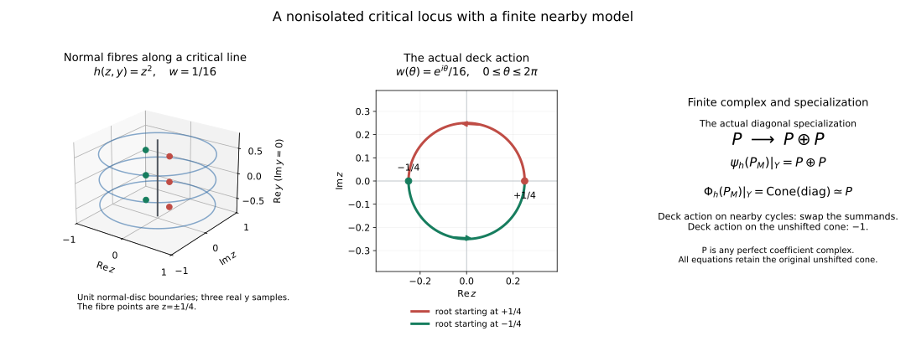

# Finite nearby-cycle models for an arbitrary holomorphic function

*Written by GPT-6.1 Sol (OpenAI). Self-checked by the writing AI. CC0 1.0.*

## HN0. Statement, coefficients and the actual unit

Let \(M\) be a finite-dimensional complex manifold, Hausdorff and countable at infinity, and let \(k\) be a commutative unital ring of finite global dimension. Let \(A\) be a bounded complex of \(k\)-sheaves, locally constant in cohomology on an original locally finite complex analytic stratification, with perfect stalks. Use the supplied compatible Whitney refinement, retaining every original coefficient label. Let \(h\) be any holomorphic function. Put

\[
\begin{gathered}
i:h^{-1}(0)\hookrightarrow M,\\
q:M\times_{\mathbb C}\widetilde{\mathbb C^*}\longrightarrow M,\\
\psi_h A=i^{-1}Rq_*q^{-1}A,\\
\Phi_h A=\operatorname{Cone}(i^{-1}A\xrightarrow{\mathrm{sp}}\psi_hA).
\end{gathered}
\tag{HN0a}
\]

The specialization \(\mathrm{sp}\) is induced by the adjunction unit for \(q\). The cone is unshifted, exactly as in FH8. Both objects are bounded complex-constructible on \(h=0\) and have perfect stalks. They admit actual finite local models computing this unit and its cone. For each retained residue field \(L=\kappa(\mathfrak p)\), the canonical maps are isomorphisms:

\[
\begin{gathered}
(\psi_h A)\otimes_k^L L\longrightarrow\psi_h(A\otimes_k^L L),\\
(\Phi_h A)\otimes_k^L L\longrightarrow\Phi_h(A\otimes_k^L L).
\end{gathered}
\tag{HN0b}
\]

The comparisons are local on the zero fibre, commute with \(\mathrm{sp}\) and with the actual deck transformation, and use the same geometry for all residue fields. No perfectness of \(L\) as a \(k\)-module is assumed. The same argument gives the comparison for any coefficient \(k\)-algebra whose scalar extension stays in this bounded class; finite global dimension of \(k\) ensures boundedness for the degree-zero residue fields in the original contract.

If \(h\) is identically zero on a connected component, the covering source there is empty. Hence \(\psi=0\) and \(\Phi=i^{-1}A[1]\), with the actual zero specialization. Components and supported strata on which \(h\) is constant are retained; the general proof below handles their interaction with other strata without deleting them.

## HN1. The general geometric refinement used in the proof

[Relative conormals at the zero fibre](../relative-conormal-zero-fibres.html) supplies the needed general Thom \(a_h\) ingredient for every original off-zero stratum, at the complete analytic/normalization floor. Its RC0 closure is Q minus the inverse image of the excluded analytic sets, selected by SGC8. Its proper projective images use the general proper-image proof, including positive-dimensional fibres.

There are only finitely many original labels near a chosen point. Their \(h\)-critical loci have analytic closures by the same Jacobian-minor and SGC8 selection. On each selected critical component \(dh\) kills its regular tangent, so \(h\) is constant; that constant extends over its closure by the analytic identity principle. Every component through the chosen zero-fibre point has value zero. Local finite components let us shrink away the other values. Thus \(h\) is submersive on every original off-zero stratum in this local representative.

Refine the zero fibre in descending complex dimension. On each remaining pure analytic component \(H\) mark its singular locus, intersections with other components, every proper intersection with an original closure or boundary, and its exact Whitney bad loci relative to the already chosen higher zero-fibre pieces. For each original off-zero stratum mark either the proper intersection with its closure, or, when \(H\) is contained there, the closed exceptional locus of RC3 over all \(H\). That locus is \(H_{\rm sing}\) together with proper images of the nondominant components of the projectivized relative conormal over \(H\). All these are closed analytic and proper on \(H\). Their finite union has smaller dimension. Choose connected regular pieces of the complement and continue on that union.

Every resulting zero-fibre stratum is inside an original coefficient label. The zero-fibre pieces satisfy Whitney (a,b) by the marked bad loci. An original off-zero upper label and a new lower label either satisfy the old Whitney condition, restricted to the smaller lower tangent and the same secants, or lie in the same smooth old stratum, where tangent continuity and smooth coordinates give the condition. Closure membership is made constant by the marked closure/boundary sets, giving the frontier rule. RC3 gives \(a_h\) from every off-zero stratum to every incident new zero-fibre stratum. Between off-zero strata it follows from Whitney (a) and continuity of \(dh\) at its full lower rank. The construction ends after at most \(\dim M+1\) stages. Connected regular-complement pieces remain locally finite by the supplied analytic regular-complement proof.

The local shrinking that removes nonzero critical values can be done on an open neighborhood of the entire zero fibre: take the union of the neighborhoods just constructed at its points. Every member has no off-zero critical locus, so neither does their union. Stratum closures and boundaries remain analytic relative to that open manifold. The bad loci and relative-conormal closures there are intrinsic and their local analytic descriptions agree on overlaps. The descending construction therefore gives a locally finite complex analytic Whitney \(a_h\) refinement on this neighborhood, without inserting all individual points as zero-dimensional global strata. That is the global refinement needed on \(h=0\). For the local proof fix one of its zero-fibre strata \(Y\) and a point of \(Y\). Further local point cuts, if used, do not change coefficients or this global constructibility conclusion.

## HN2. Normal coordinates and all joint-rank assertions

Take holomorphic coordinates (\(y\),\(z\)) near the chosen point, with \(Y=\{z=0\}\), \(y\in\mathbb C^d\), and let

\[
\pi(y,z)=y,\qquad \rho(y,z)=|z|^2.
\tag{HN2a}
\]

Choose a small coordinate polydisc \(B\) in \(Y\) with compact closure in this chart. Only finitely many incident strata occur near its closure; nonincident closures can be excluded by shrinking the normal neighborhood.

Whitney (a) makes \(\pi\) submersive on every incident stratum near \(Y\). The joint map \((\pi,\rho)\) is submersive on every stratum off \(Y\) at all sufficiently small positive normal radii, uniformly over that compact base. Here is the radial argument with the kernel retained. If a sequence of joint defects approached \(Y\), take a limiting upper tangent \(P\) and normalized normal secants \(e_j=(0,z_j/|z_j|)\). Condition (a) gives \(TY\) contained in \(P\) and makes intersections with \(\ker(d\pi)\) continuous. Condition (b), using the actual lower points \((y_j,0)\), gives a unit limit e in \(P\) intersect \(\ker(d\pi)\). Joint rank failure makes \(e_j\) orthogonal to \(T_{(y_j,z_j)}S\) intersect \(\ker(d\pi)\), so e is orthogonal to that same limiting intersection. This contradicts |e|=1.

Thom \(a_h\) similarly makes \((\pi,h)\) submersive on every off-zero stratum near \(Y\). Otherwise a sequence of \(h\)-fibre tangent kernels would have a limit containing \(TY\) by \(a_h\), while \(d\pi\) failed to be onto there. Since \(d\pi\) is the identity on \(TY\), this is impossible.

Fix a sufficiently small normal radius \(r\). There is \(\delta\)>0 such that \((\pi,h,\rho)\) is submersive on every off-zero stratum on \(\rho=r^2\) for \(0<|h|<\delta\). If not, take a defect sequence with \(h\) tending to zero on that compact normal sphere over the compact base closure. At its zero-fibre limit on a stratum \(T\), \(a_h\) puts \(TT\) inside the limiting \(h\)-fibre tangent kernel. The just-proved full rank of \((\pi,\rho)\) on \(T\) makes that rank full on the limiting kernel as well, contradicting the defects. The same argument gives a common value bound on every compact annulus \(a\leq\rho\leq b\) of sufficiently small positive normal radii. There is no assertion of a single value bound down to \(\rho\)=0.

These arguments also apply to the zero fibre, with its induced Whitney partition and \(\pi\)-normal radii. The exceptional case \(d=\dim M\) is the already treated identically-zero component. Here is the transverse-section Whitney check. If a smooth map f is submersive on every incident lower stratum, a limiting upper plane \(P\) contains the lower tangent by (a), so df is onto on \(P\). Intersections of upper tangents with ker(df) then converge to \(P\) intersect ker(df). \(A\) secant between two points on the same f-level has its limit in ker(df) by the first-order expansion of f; old (b) places it in \(P\). Thus both Whitney conditions survive the transverse level cut. Apply this to \(\pi\)-normal slices and to their transverse spheres. For the cap partition, boundary-boundary pairs are this same cut, interior-boundary pairs of distinct old labels use the old secants and the smaller lower tangent, and a pair from the same old smooth label uses smooth half-space coordinates. These give the closed-cap Whitney partition used below. All coefficients still come from the original labels.

## HN3. Actual products for proper submersions with any finite-dimensional target

Use [compatible Whitney tubes](../../sheaf-proof-readings/SH02-open-prerequisite-proofs.html#SH02-PRP-COMPATIBLE-TUBES) and [controlled field lifts](../../sheaf-proof-readings/SH02-open-prerequisite-proofs.html#SH02-PRP-CONTROLLED-LIFT). Their target \(P\) is an arbitrary smooth manifold. On any closed Whitney-stratified source submersive on every stratum, they construct target-compatible tubes and controlled lifts of every smooth target vector field. Thus the assertions apply to \((\pi,h)\) of real rank 2d+2, and to \((\pi,h,\rho)\) of real rank 2d+3 on the punctured normal annulus. No reduction to a single real coordinate is being assumed.

[The controlled-flow proof](../../sheaf-proof-readings/SH02-open-prerequisite-proofs.html#SH02-PRP-CONTROLLED-FLOW) gives a continuous stratum-preserving flow with open maximal domain. At every finite endpoint it leaves every compact source set. If the original map is proper and the target path stays in a compact target subset, such an endpoint cannot occur. Its lift therefore exists for the whole finite path. Fixed-time maps have the opposite-time maps as their actual inverses.

On a convex rectangular base, lift its coordinate vector fields and compose the flows in a fixed coordinate order, from a fixed fibre. Every intermediate target path stays inside the base; for a complex polydisc centered at the chosen point the real/imaginary coordinate paths from its centre remain inside it. This gives a continuous stratum-preserving product with inverse given by the reverse ordered opposite flows. Commutativity of the lifted fields is unnecessary. Unbounded logarithmic or angular coordinates cause no endpoint problem: every individual finite coordinate path is compact, and flow dependence is local.

The coefficient product is the entire derived complex, not just its cohomology ranks. In the product \(F\times D\), contract each base point to the chosen base point along the convex straight homotopy and pull \(A\) back along the resulting stratum-preserving homotopy. Every vertical interval stays in one original label. Transport of the actual coefficient object applies: proper projection of that compact homotopy interval and its counit give an isomorphism between the coefficient object and \(\operatorname{pr}_F^{-1}(A|_F)\), through actual endpoint restriction arrows. It commutes with restriction to closed fibre subspaces. If \(F\) is compact, projection to \(D\) is proper and its derived pushforward is the constant complex \(R\Gamma\)(\(F\),\(A\)); its stalk comparison is the actual proper-base-change evaluation. Convex-base acyclicity then computes global sections. All these comparisons are natural and \(k\)-linear.

## HN4. The precise open-collar restriction

Let \(D\) be a small convex base polydisc in \(Y\) times a whole logarithmic value domain

\[
\begin{gathered}
\mathcal L_\delta=\{(u,v)\in\mathbb R^2:u<\log\delta\},\\
h=\exp(u+i v).
\end{gathered}
\tag{HN4a}
\]

All angular v are retained. Choose a positive normal annulus on which \((\pi,h,\rho)\) has full stratum rank at these small values. Its closed radial slices are compact over compact subsets of \(D\). The map to \(D\) times the radial interval is proper. HN3 trivializes it stratumwise and identifies its coefficient pushforward with a constant whole complex in the radial and base directions.

For a closed core \(\rho\leq a\) and an outer open ball \(\rho<b\), take the collar \(a\leq\rho<b\). It is closed in that outer open ball. Write j for the positive part \(a<\rho<b\). The sheaf \(j_!A\) on the outer ball is the closed pushforward from this collar of the extension by zero of its positive part. Proper radial/base pushforward on the collar identifies it with the extension by zero at the endpoint a of a constant complex \(H\) on \(D\times(a,b)\). This assertion is an actual proper-base-change/extension map: on positive radii it is the fibre evaluation; at a both stalks are zero. The open-closed localization triangle identifies its arrow into the full collar coefficient object.

For either \(I=[a,b)\) or \(I=[a,b]\), the elementary sequence

\[
0\longrightarrow j!k_{I\setminus\{a\}}
\longrightarrow k_I\longrightarrow k_{\{a\}}\longrightarrow0
\tag{HN4b}
\]

is exact on every stalk. Tensoring a bounded complex \(H\) and taking global sections on the convex \(D\times I\) gives the fibre of \(H\to H\), hence zero. Constant-sheaf convex acyclicity holds for arbitrary modules. Consequently

\[
R\Gamma(\text{outer whole-cover tube},j!A)=0.
\tag{HN4c}
\]

Localization at the closed inner core makes the actual restriction from the outer open tube to that core an isomorphism. The same proof with \(I=[a,b]\) gives the actual closed-outer to closed-inner restriction. One may work on a slightly wider positive annulus before taking the displayed endpoints; HN2 supplies its joint rank. No nonproper radial retraction is called proper, and no ordinary sheaf homotopy invariance is assumed.

All assertions are sheafwise over \(Y\) as well: take any smaller convex base polydisc, use the same proper radial pushforward there, and test the resulting derived direct-image restriction on its stalks. These are the actual restrictions of the same coefficient object.

## HN5. Whole-cover stabilization, including the nonproper base-change map

Put

\[
T=T_{r,\delta}=\{\pi\in B,\ \rho\le r^2,\ |h|<\delta\}.
\tag{HN5a}
\]

It is a closed normal ball relative to the indicated open value/base bounds. Its punctured part, pulled back to the universal cover, is proper over \(B\times\mathcal L_\delta\). All its fibres are compact, including the normal sphere boundary. HN2 and the transverse boundary partition make it a proper stratified submersion there. HN3 gives the whole-complex product and its global-section/evaluation comparison with the compact fibre \(F_{y,w}\)={\(\pi\)=\(y\),\(\rho\leq r^2\),\(h\)=\(w\)}, for any chosen lift of \(w\).

Shrinking \(\delta\) restricts one convex logarithmic-cover domain to another. Their constant derived pushforward restriction is an isomorphism. For any smaller radius \(r\)', first choose \(\delta\)' on the compact intervening annulus by HN2, then use HN4 to get the actual closed-radius restriction isomorphism. An open tube at an intermediate radius restricts isomorphically to a still smaller closed core, by the open-collar version. The closed-outer to open-inner map is then an isomorphism by its composite with that common closed core.

Open packets \(\pi\) in \(B\)', \(\rho<(r')^2\), \(|h|<\delta\)', with \(B\)' shrinking to a chosen \(y\), are genuine cofinal ambient neighborhoods of (\(y\),0). Their whole-cover section restrictions have just been proved stable. Thus the usual stalk formula for Rq_* yields the finite compact-fibre model, through those actual maps. \(A\) fixed nonzero \(w\) is not claimed to lie in every shrinking disc; evaluations in smaller discs are compared by the stated logarithmic-cover transport. No tensor or infinite inverse limit is interchanged with this stalk colimit.

Let \(c:T\to M\) denote the locally closed restriction and \(q_T\) its cartesian pulled-back covering map. The canonical base-change map

\[
c^{-1}Rq_*q^{-1}A\longrightarrow
Rq_{T*}q_T^{-1}c^{-1}A
\tag{HN5b}
\]

is not assumed an isomorphism merely because c is a restriction. At points of \(Y\) its stalk is exactly the whole-cover section restriction above; both cofinal systems reduce to the same compact cores. It is therefore an isomorphism on \(Y\). Its square with the unit for \(q\) and \(q_T\) commutes by the adjunction construction, or directly by restriction of a representative section. This is the nonproper nearby-cycle restriction needed in the model.

Define the family complex on \(B\)

\[
G_T=R(\pi q_T)_*q_T^{-1}(A|T).
\tag{HN5c}
\]

By the proper pushforward to \(B\times\mathcal L_\delta\) and its constant whole-complex product, \(G_T\) is locally constant, with fibre \(R\Gamma\)(\(F_{y,w}\),\(A\)). Its natural restriction to the closed section \(Y\) in \(T\) gives

\[
G_T\longrightarrow(\psi_h^T(A|T))|Y.
\tag{HN5d}
\]

The stalk of this map is restriction to smaller normal/value/base packets. HN4 and the just-proved cofinal stabilization make it an isomorphism. Together with HN5b it identifies \(\psi_h\) \(A\) on each zero-fibre stratum with this locally constant finite family, through actual arrows. Thus complex constructibility, not only pointwise finite cohomology, is established.

The deck transformation \(v\mapsto v+2\pi\) remains the original covering automorphism in every packet. In a chosen fibre identification it is the corresponding stratumwise transport automorphism of \(R\Gamma\)(\(F_{y,w}\),\(A\)); it is not declared the identity by contractibility of \(\mathcal L_\delta\).

## HN6. The source of specialization and its exact square

We need the unit's source as well as its target. First, on the zero fibre inside a closed normal ball, the proper map \((\pi,\rho)\) has a locally constant whole derived pushforward on \(B\) times positive radii, by HN2–HN3, and its zero-radius fibre is \(A|_Y\) by proper base change.

We use a relative interval-star calculation. If \(E\) is a bounded complex on \(B\times[0,b)\) or \(B\times[0,b]\), whose cohomology is locally constant on both \(B\times\{0\}\) and \(B\) times positive radii, localization gives \(j_!j^{-1}E\to E\to i_*i^{-1}E\). The positive part is a constant derived complex locally on a convex \(B\): bounded local-system cohomology and convex acyclicity make its global-section counit an isomorphism on every stalk. HN4b on \(B\) times \(I\) shows that \(R\Gamma(j_!j^{-1}E)=0\). The actual restriction to zero is therefore an isomorphism on each smaller convex \(B\), and hence gives a sheaf isomorphism

\[
R\operatorname{pr}_{B*}E\xrightarrow{\sim}E|_{B\times\{0\}}.
\tag{HN6a}
\]

The projection along the interval need not be proper; this conclusion was proved by localization and convex-section stalks. It makes the ordinary normal-ball restriction on the zero fibre an isomorphism to \(A|_Y\).

Now use the proper map \((\pi,|h|):T\to B\times[0,\delta)\). On positive radii its derived pushforward has locally constant cohomology: the proper \((\pi,h)\) product on the punctured disc transports complete circle fibres, retaining their monodromy. At zero its fibre is the closed normal ball of \(h=0\), whose ordinary restriction to \(A|_Y\) was just proved. HN6a gives the actual map

\[
R\pi_*(A|T)\xrightarrow{\sim}A|Y.
\tag{HN6b}
\]

Boundedness in these proper pushforwards follows either from the standing finite-dimensional sheaf floor or from the compatible finite cellular fibre models. No open-normal-ball comparison across \(h=0\) is required: \(T\) has a closed normal radius, and the open-collar argument HN4 was used only after pulling back to the punctured cover.

Apply \(R\pi_*\) to the actual unit \(A|_T\to Rq_{T*}q_T^{-1}(A|_T)\), then restrict to the closed section \(Y\). Naturality of the restriction yields the commutative square

\[
\begin{array}{ccc}
R\pi_*(A|T)&\longrightarrow&G_T\\
\downarrow\scriptstyle\sim&&\downarrow\scriptstyle\sim\\
A|Y&\xrightarrow{\mathrm{sp}}&(\psi_h^T(A|T))|Y.
\end{array}
\tag{HN6c}
\]

The left map is HN6b, the right map is HN5d, and the bottom map is the actual unit, not a chosen isomorphism between the two objects. HN5b then identifies that bottom arrow with the original ambient specialization in HN0a. This proves the required finite model for the actual specialization and its unshifted cone.

## HN7. Finite cellular models, perfection and global boundedness

The compact fibre \(F_{y,w}\) is semianalytic in the retained analytic chart and is compatible with the original/new analytic coefficient labels. [Compatible Whitney triangulation](../compatible-whitney-triangulation.html#SH02-COMPATIBLE-TRIANGULATION) gives an actual finite triangulation, not merely a finite homotopy type. Each open simplex carries a constant derived perfect complex, by the full bounded local-system argument. [The finite-pair skeletal localization proof](../finite-holomorphic-microsupport.html#SH02-FH-FINITE-PAIR) gives perfect \(R\Gamma\)(\(F_{y,w}\),\(A\)), with its actual coefficient and restriction maps. \(A_y\) is perfect too. Thus the model of the specialization map and its cone are perfect.

\(A\) morphism between these perfect complexes is represented by a chain map between bounded finite-projective representatives: the source is \(K\)-projective and the target can be replaced by its perfect representative. Its cone is again such a finite complex. The finite construction represents the specialization as well as the two objects. Tensoring the same representatives computes the derived coefficient change and retains this map.

If \(M\) has complex dimension n and \(A\) has cohomology in \([a,b]\), the finite fibre has real dimension at most \(2n-2\) on a nonconstant component. Its finite-cell cohomology bound gives \(\psi\) in \([a,b+2n-2]\), and the unshifted cone in \([a-1,b+2n-2]\). These uniform bounds do not depend on the number of local cells or on the point. Identically-zero components have \(\psi=0\) and \(\Phi\)=\(A[1]\). Hence both objects are globally bounded in the original finite-dimensional range. This avoids an inference of global boundedness from pointwise perfection alone.

## HN8. The canonical residue-field comparison, unit, cone and deck action

The canonical projection morphism for \(q\) is defined by adjunction: tensor the counit \(q^{-1}Rq_*E\to E\), use exact inverse image and coefficient pullback, and transpose. Restricting it by i gives the first arrow in HN0b. The triangle identities give its commutative square with the unit:

\[
\begin{array}{ccc}
(i^{-1}A)\otimes_k^L L&\xrightarrow{\mathrm{sp}\otimes1}&(\psi_hA)\otimes_k^L L\\
\downarrow\scriptstyle\sim&&\downarrow\scriptstyle\chi_\psi\\
i^{-1}(A\otimes_k^L L)&\xrightarrow{\mathrm{sp}}&\psi_h(A\otimes_k^L L).
\end{array}
\tag{HN8a}
\]

Choose a \(K\)-flat coefficient resolution, so no flatness or perfectness of \(L\) is silently required. Exact coefficient restriction and compatible flabby resolutions give the same underlying sheaf-derived maps, as in normal Morse data and change of coefficients. All geometric refinements, packets, localization restrictions, proper-base-change evaluations and interval counits above are \(k\)-linear and natural for these coefficient morphisms.

On the finite model HN6c at a point of \(Y\), \(\chi_\psi\) is therefore the canonical comparison

\[
R\Gamma(F_{y,w},A)\otimes_k^L L
\longrightarrow R\Gamma(F_{y,w},A\otimes_k^L L).
\tag{HN8b}
\]

To see that it is this actual arrow, use the restriction to a common closed core in HN4–HN5 and then its proper fibre evaluation. Projection morphisms commute with restriction, composition and their counits by the adjunction identities; the representative section restriction has the same property. These give a commutative comparison with HN8b, rather than an unspecified replacement of the target. The finite-pair proof proves HN8b an isomorphism for that actual finite triangulated fibre, with the same orientation generators and finite localization maps.

Thus \(\chi_\psi\) is an isomorphism on every zero-fibre stalk. HN8a and its actual unshifted cones give \(\chi_\Phi\) as an isomorphism too. The construction commutes with the deck automorphism because \(q\)'s adjunction and every packet restriction are natural for that covering map. In the finite model this is the same monodromy transport operator on both coefficient systems. Finite global dimension of \(k\) gives the uniform bounded residue-field extension of \(A\); its perfect stalks become perfect complexes over \(L\). No infinite nearby-cycle limit is tensor-interchanged.

## HN9. Actual normal-slice comparison

For a normal complex slice \(N_y=\{\pi=y\}\), the natural nearby-cycle base-change map at its intersection with \(Y\) is an isomorphism. Its cofinal normal-radius/value packets and their actual restrictions are the fibres of precisely the parameter packets above. Both stalks reduce to the same compact \(F_{y,w}\), and the unit square HN6c commutes with this slice restriction. Thus the vanishing-cycle comparison at that point is also the actual cone comparison. This does not presume nonproper base change is always an isomorphism.

The preceding argument proves finite local models, complex constructibility, perfection, specialization and residue-field compatibility for arbitrary holomorphic functions, including singular and positive-dimensional critical loci. The comparison above concerns precisely the normal slices of the prepared zero-fibre strata. \(A\) critical-support criterion additionally requires visible conormal components and the bounded-complex/perverse-cohomology reduction.

## HN10. An exact nonisolated example and attribution

For \(M=\mathbb C_z\times\mathbb C_y\), \(h(z,y)=z^2\), \(Y=\{z=0\}\) and the constant perfect complex \(P_M\), the critical locus is the entire complex line \(Y\). \(A\) normal fibre over \(y\) and \(w=1/16\) in the unit normal disc has the two actual points \(z=+1/4\) and \(z=-1/4\). The finite nearby model is \(P\oplus P\), with specialization the diagonal \(P\to P\oplus P\). Its unshifted cone is \(P\). One loop of \(w\) around zero exchanges the two summands; its induced operator on the cone is -1, also in characteristic two where that scalar is 1. The figure shows these exact objects and maps, including the complex \(y\) directions omitted in its displayed real cross-section. It illustrates this example; the unrestricted proof is HN1–HN8.

<picture>
<source media="(max-width:600px)" srcset="../figures/nearby-parameter-stacked.svg">

</picture>

The first panel is the real cross-section with the imaginary parameter direction omitted; the function and coefficient formulas apply to the full complex parameter line. The displayed fibre points are exactly one quarter and minus one quarter. The middle panel follows both roots through one value loop. The last panel gives the actual specialization and its unshifted cone. This illustrates HN10; HN1–HN8 prove the general theorem. The [reproducible figure source](../figures/draw_nearby_parameter.py) retains all coordinates, maps and coefficient conventions.

The analytic normalization, proper-image and Whitney bad-locus antecedents are retained with the complete Demailly/Teissier-derived programme providers and their exact component terms. The controlled tube, lift and flow antecedents are Mather's *Notes on Topological Stability*, Propositions 7.1, 9.1 and 10.1, with the independently written complete bodies CTU, CL and CF used here. The finite analytic cell/preparation/triangulation providers retain their Valette and Shiota credits. The nearby-cycle convention and original critical-support antecedents remain those of the supplied FH lesson. No source prose is copied or relicensed by this new CC0 reconstruction.
