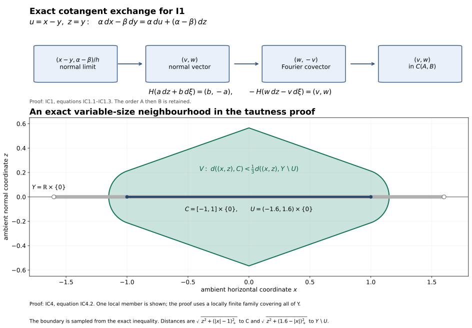

# Required proof completions for the bounded involutivity route

This is independently authored mathematical exposition dedicated to CC0 1.0 Universal. It supplies precisely scoped arguments for the current I1/I2 route. It does not relicense any antecedent, replace the delivered Fourier comparison bodies, or certify unrelated unbounded statements.

All manifolds here are finite dimensional, Hausdorff and countable at infinity. Coefficients in IC1, IC2, IC4–IC7 are a commutative ring of finite global dimension; IC3 specializes to the ring of integers. Complexes are bounded unless explicitly stated bounded below. No constructibility, finite generation, perfectness or field assumption occurs. A cohomological shift satisfies \(H^i(K[r])=H^{i+r}(K)\).

The exact estimate bodies and used ranges are bound below at revision `17e99c7e7fd7f0c92bc256317a57e52a46084d67`. The [ordinary smooth/C1 and angular foundations](../ordinary-involutivity-floor.html#SH02-ORDINARY-FLOOR) give their used local geometry and calculus. The arguments below are full proof bodies at the stated coefficient scope.

## IC1. The sign in I1

Let A=SS(F), B=SS(G) in T*X. Work in coordinates near the diagonal of X×X, with u=x−y and z=y. A covector in \(A×B^a\) is written

\[
\alpha\,dx-\beta\,dy=\alpha\,du+(\alpha-\beta)\,dz.
\]

The diagonal conormal has coordinates \((z,\alpha)\) and is given in these ambient cotangent coordinates by u=0, \(\alpha-\beta=0\). A normal vector at \((z_0,\xi_0)\) is therefore a limit (v,w) of

\[
\begin{gathered}
\frac{x_j-y_j}{h_j}\longrightarrow v,\\
\frac{\alpha_j-\beta_j}{h_j}\longrightarrow w,\\
 h_j\downarrow0,\\
(x_j,\alpha_j),(y_j,\beta_j)\longrightarrow(z_0,\xi_0).
\end{gathered}
\tag{IC1.1}
\]

The normal-cone Fourier identification sends this normal vector to the covector

\[
(z_0,\xi_0;\,w,-v)\in T^*T^*X.
\tag{IC1.2}
\]

With \(H(a\,dz+b\,d\xi)=(b,-a)\), one has \(−H(w\,dz−v\,d\xi)=(v,w)\). The pair cone C(A,B) uses the difference of its two points; (IC1.1) is exactly its defining sequence criterion. Conversely, from any sequence for C(A,B), use \((y_j,\alpha_j)\) as the reference point on the diagonal conormal; the same two quotients give its normal vector. Thus the identification is exact, including zero vectors:

\[
-H\bigl(C_{N^*_\Delta(X\times X)}(A\times B^a)\bigr)=C(A,B).
\tag{IC1.3}
\]

Consequently CHE19 gives precisely

\[
-H\,SS(\mu\mathcal Hom(G,F))\subset C(SS(F),SS(G)).
\]

This proves the sign and the order of the two sets in I1.

The exact coordinate and neighbourhood mechanisms are shown below. The top panel is the IC1 calculation; the lower panel is one exact instance of the variable-neighbourhood construction in IC4.

For the lower panel, take $Y=\mathbb R\times\{0\}$, $C=[-1,1]\times\{0\}$ and $U=(-1.6,1.6)\times\{0\}$. The distances are $\sqrt{z^2+(|x|-1)_+^2}$ and $\sqrt{z^2+(1.6-|x|)_+^2}$; the plotted domain is the strict first-distance-less-than-one-third-second-distance inequality. Its boundary is sampled on a 1101 by 451 grid. This finite example illustrates IC4, whose proof treats the full locally finite family. [Reproducible CC0 source](../figures/involutivity_mechanisms.py).

## IC2. Identity detection without a quotient-category import

Fix \(p=(x,\xi)\). The current MH-GAMMA-STALK formula, after open extension by zero in its first argument, reads

\[
\begin{gathered}
H^0\mu\mathcal Hom(F,F)_p\\
=\mathop{\mathrm{colim}}_{U,\gamma}\operatorname{Hom}_{D^b(k_X)}(Q_{U,\gamma}F,F),\\
Q_{U,\gamma}F=(P_\gamma F_U)_U.
\end{gathered}
\tag{IC2.1}
\]

Here U shrinks to x, \(\gamma\) is closed, proper and convex, and every nonzero v in \(\gamma\) satisfies \(\xi(v)<0\). Transition maps restrict neighbourhoods and enlarge admissible support on a common refinement. \(P_\gamma=\phi_\gamma^{-1}R\phi_{\gamma*}\).

First verify that these are bounded objects. If F has cohomology in [a,b] and the chart has dimension n, ordinary sections on every ordinary open subset have cohomological dimension at most n. Every directional open is such an ordinary open. The stalk formula for \(R\phi_{\gamma*}\), which is a filtered colimit over directional neighbourhoods, therefore bounds its cohomology above by b+n and below by a. Inverse image and open extension are exact. Thus \(Q_{U,\gamma}F\) is in \(D^{[a,b+n]}\). No dimension assertion about the non-Hausdorff directional topology is needed.

There is a canonical arrow \(c_{U,\gamma}:Q_{U,\gamma}F→F\), obtained from the projector counit and the open-extension counits. It represents the image \(e_F\) of the ordinary identity in (IC2.1). Here is the required map check. In the supported-kernel proof of (IC2.1), enlargement of diagonal support from Δ to

\[
Z_\gamma=\{(x,y):y-x\in\gamma\}
\]

uses the restriction map \(k_{Z_\gamma}→k_\Delta\). Moving support into the first Hom argument and applying \(q_{1!}\dashv q_1^!\) turns it into

\[
\begin{gathered}
Rq_{1!}(q_2^{-1}F_U)_{Z_\gamma}\\
\longrightarrow Rq_{1!}(q_2^{-1}F_U)_\Delta=F_U\\
\longrightarrow F.
\end{gathered}
\tag{IC2.2}
\]

For relatively compact U the first projection is proper on the closed support, so the first object is the ordinary kernel projector. The GAM-KERNEL comparison is defined by pullback of sections from \(U+\gamma\) to its incidence set. Restriction along its diagonal section is the ordinary restriction from \(U+\gamma\) to U. It is therefore the actual counit \(P_\gamma\) \(F_U→F_U\). This proves that (IC2.2), with the outer open restriction, is \(c_{U,\gamma}\); no arbitrary normalization of the identity class has been chosen.

The cutoff theorem T26 says that this counit's cone misses p whenever p lies in the interior of the antipodal polar. The strict inequality defining \(\gamma\) implies that condition: the compact unit slice of \(\gamma\) has uniformly negative pairing with \(\xi\); the zero cone has whole dual space as polar. The open-extension arrows have cones vanishing near x. Hence

\[
p\notin SS(\operatorname{Cone}(c_{U,\gamma})).
\tag{IC2.3}
\]

Suppose \((e_F)_p=0\). The zero criterion for a filtered colimit of modules says that at some common refinement its representative is zero. By the compatibility just proved, that representative is the ordinary derived arrow \(c_{U,\gamma}\). The cone of a zero arrow Q→F is isomorphic to F⊕Q[1]. Applying the formal triangle inequality to its direct-summand inclusion gives SS(F)⊂SS(F⊕Q[1]). Equation (IC2.3) consequently excludes p from SS(F).

At \(\xi=0\) the only allowed cone is {0}. The projector is the identity, \(Q=F_U\), and (IC2.1) is

\[
\mathop{\mathrm{colim}}_{U\ni x}
\operatorname{Hom}(F|_U,F|_U).
\]

Its identity class is zero precisely when the identity of \(F|_U\) is zero on some neighbourhood; an additive category then makes \(F|_U\) a zero object. This gives the same exclusion, including the zero section, directly from (IC2.1).

Conversely, MO15 gives supp μHom(F,F)⊂SS(F), so absence from SS(F) makes its stalk, and hence its identity germ, zero. We have proved at every p

\[
\begin{gathered}
(e_F)_p=0\\\Longleftrightarrow\quad
\mu\mathcal Hom(F,F)_p=0\\\Longleftrightarrow\quad
p\notin SS(F).
\end{gathered}
\tag{IC2.4}
\]

The sets of nonzero stalks of μHom and of its identity class equal the closed set SS(F), so their closed supports equal it as well. This supplies I2 for arbitrary bounded coefficients. It does not assert a replacement proof for every morphism-group or representability statement in the microlocal categories unit.

## IC3. The coefficient range and a bound on μHom over the integers

Every subgroup H of an arbitrary free abelian group P is free. To prove this without a finite-rank premise, well order a basis \((e_\alpha)_{\alpha<\kappa}\). Let \(P_\alpha\) be generated by the earlier basis vectors and \(H_\alpha=H∩P_\alpha\). The quotient \(H_{\alpha+1}/H_\alpha\) embeds in \(P_{\alpha+1}/P_\alpha≅ℤ\), so it is either zero or an infinite cyclic group. In the latter case choose a lift of its generator; the extension splits because a map out of ℤ is determined by that lift. At a limit ordinal λ every element of \(P_λ\) has finite support and already belongs to some \(P_\alpha\), α<λ. Hence \(H_λ\) is the union of the earlier \(H_\alpha\). Transfinite induction gives a basis consisting of the chosen lifts. No cardinality bound on P or H enters.

Any abelian group M is the quotient of a free group. Its kernel is free by the preceding argument. Thus M has a projective resolution of length at most one. In particular \(Ext^q_ℤ(M,N)=Tor_q^ℤ(M,N)=0\) for q>1 and arbitrary M,N. The global dimension of ℤ is at most one; this upper bound is all that is used here.

The same argument gives the flat resolutions needed at the bounded sheaf scope. A sheaf of ℤ-modules E has an epimorphism from the direct sum of the open generators \(ℤ_U\), indexed by all its local sections. The source has free stalks, and the kernel has free stalks because it is a subgroup of a free group. Both are flat. For completeness, a bounded complex has a bounded flat model as follows. Start with a representative G having terms only in [a,b], obtained by good truncations. Construct an upper-bounded flat complex Q→G recursively downwards. Once \(Q^{n+1}\) and its differential and augmentation are fixed, choose an epimorphism from a sum of open free generators onto the sheaf

\[
T^n=\{(g,q)\in G^n\oplus Q^{n+1}:
d_Gg=\epsilon q,\ d_Qq=0\}.
\]

Use its two projections for \(ε:Q^n→G^n\) and \(d_Q:Q^n→Q^{n+1}\). The cone of ε is acyclic: a cone cycle (g,q) satisfies \(d_Gg+εq=0\) and \(d_Qq=0\), so locally it is the boundary of a lift in \(Q^n\) of \((g,−q)∈T^n\). Exactness is stalkwise, so these local lifts suffice.

If \(H^i(G)=0\) for i<a, Q is exact below a. Put c=a−1 and \(C^c=coker(Q^{c−1}→Q^c)\). Exactness makes each stalk of \(C^c\) a subgroup of the free stalk of \(Q^{c+1}\); the subgroup argument above makes it free, hence flat. The good truncation of Q at c, with \(C^c\) in its bottom degree, is therefore a finite complex of flat sheaves and is quasi-isomorphic to G. Such a finite flat complex is K-flat: filter it by its finitely many terms, and tensor an acyclic complex; flatness makes each one-term tensor acyclic and the finite cone filtration preserves acyclicity. This supplies bounded tensor models without using an unchecked unbounded resolution construction.

Now let X have real dimension n and let

\[
F\in D^{[a,b]}(\mathbb Z_X),\qquad
G\in D^{[c,d]}(\mathbb Z_X).
\]

The submersion formula gives \(q_1^!F=q_1^{-1}F⊗q_2^{-1}or_X[n]\), with bounds [a−n,b−n]. On X×X, of dimension 2n, the checked MD-HOMOLOGICAL-DIMENSION bound is g+3(2n)+1=6n+2 with g≤1. Therefore

\[
\begin{gathered}
L=R\mathcal Hom(q_2^{-1}G,q_1^!F)\\
\in D^{[a-n-d,\ b-c+5n+2]}.
\end{gathered}
\tag{IC3.1}
\]

The deformation for the diagonal has dimension 2n+1. Its open direct image \(Rj_*\) has amplitude [0,2n+1], since stalks are filtered colimits of ordinary cohomology on open subsets of that manifold. Exact inverse images do not enlarge the bounds. Normal specialization thus adds at most 2n+1 to the upper bound. The Fourier proper image has n-dimensional Euclidean fibres, so compact-fibre comparison and the manifold compact-support bound give amplitude [0,n]. Its pairing-inequality kernel is a constant locally closed sheaf with flat stalks; tensor with it is exact. Consequently

\[
\begin{gathered}
\mu\mathcal Hom(G,F)\\
\in D^{[a-n-d,\ b-c+8n+3]}(\mathbb Z_{T^*X}).
\end{gathered}
\tag{IC3.2}
\]

This is a deliberately nonoptimal sufficient bound. Restriction to any open \(U_A\) is exact and preserves it. It applies to arbitrary bounded sheaves of arbitrary abelian groups. In the self-Hom case take c=a and d=b. The finite dimension of T*X also gives the finite ordinary-section amplitudes required in the cone-vanishing proof.

## IC4. Noncompact tautness at the actual specialization scope

Let Y be a locally closed subset of a finite-dimensional countable-at-infinity manifold M. It is metrizable, paracompact, locally compact and second countable. Let i:Y→M be its inclusion and \(F∈D^+(k_M)\). For every integer r the canonical restriction map is an isomorphism

\[
\begin{gathered}
\mathop{\mathrm{colim}}_{U\supset Y,\ U\ \mathrm{open\ in}\ M}H^r(U;F)\\
\longrightarrow H^r(Y;i^{-1}F).
\end{gathered}
\tag{IC4.1}
\]

The index category consists of all open neighbourhoods, including neighbourhoods of variable size. No fixed-radius subsystem is substituted. If Y is empty both sides are zero and the assertion is immediate.

First prove the assertion in degree zero for an arbitrary sheaf E. Choose an open ambient S⊂M in which Y is closed. The neighbourhoods contained in S are cofinal, so we work in S with a compatible metric. A section on Y has representatives \(s_\lambda\) on ordinary open sets \(O_\lambda⊂S\) covering Y.

Here is an explicit locally finite shrinking. A locally compact second-countable Hausdorff space has a compact exhaustion \(L_m⊂int_Y\) \(L_{m+1}\): choose a countable relatively compact open cover and at each stage cover the previous compact set and the next member by finitely many relatively compact opens. Put \(L_0=L_{−1}=∅\). For the compact annulus \(L_m\int_Y\) \(L_{m−1}\), choose finitely many small relative open balls whose closures lie in assigned \(O_\lambda∩Y\) and in the band \(int_Y\) \(L_{m+1}\setminus\) \(L_{m−2}\). Choose still smaller balls covering that annulus and let \(C_i\) be their closures, with \(U_i\) the earlier larger balls. These compact closed \(C_i⊂U_i\) cover Y. The family \(U_i\) is locally finite on Y: a neighbourhood contained in \(int_Y\) \(L_N\) misses all bands with m−2≥N, and only finitely many balls occur in each earlier band.

Let \(O_i\) be the assigned ambient representing set, so \(U_i⊂O_i∩Y\). Set

\[
\begin{gathered}
V_i=O_i\cap\{x\in S:\\
 \operatorname{dist}(x,C_i)<\tfrac13\\
 \operatorname{dist}(x,Y\setminus U_i)\}.
\end{gathered}
\tag{IC4.2}
\]

If \(Y\setminus\) \(U_i\) is empty, omit its distance condition. These sets are open and contain \(C_i\). They are locally finite near Y. Indeed, near a∈Y choose r>0 so that all but finitely many \(U_i\) miss Y∩B(a,3r). For these indices and x∈B(a,r), distance to \(C_i\) is at least 2r, whereas \(a∈Y\setminus\) \(U_i\) gives distance to that complement less than r. Such \(V_i\) cannot meet B(a,r). The indices with empty complement are among the finite exceptions. Let W be the open locus in S where the family \(V_i\) is locally finite; it contains Y.

Shrink each \(V_i\) within W once more by the same distance formula, now using \(C_i\) and \(W\setminus\) \(V_i\), to an open \(W_i\) containing \(C_i\) with \(closure_W\) \(W_i⊂V_i\). The closure assertion follows directly: at a point outside \(V_i\) its distance to \(W\setminus\) \(V_i\) is zero, so membership in the closure would force distance to \(C_i\) to be zero, contrary to \(C_i⊂V_i\) and closedness of \(C_i\). If the complement is empty use \(W_i=W\). The family \(W_i\) is locally finite in W.

On \(W_i∩W_j\) let \(D_{ij}\) be the locus where the two representing germs disagree. Its closure in W lies in \(V_i∩V_j⊂O_i∩O_j\) and misses Y. To verify the last assertion, at a point of Y in those two domains the two germs both represent the given section on Y, so they are equal in \(E_a\); equality of sheaf germs is open and excludes a neighbourhood from \(D_{ij}\). The family of these pairwise closures is locally finite, so their union D is closed in W and disjoint from Y. On

\[
W'=(W\setminus D)\cap\bigcup_iW_i
\]

the representing sections agree on every overlap and glue. This open set contains Y and gives a representative of the original section. For injectivity, the equality locus of two represented neighbourhood sections whose restrictions agree on Y is itself an open neighbourhood of Y. Restriction to it identifies the two colimit elements. This proves degree-zero tautness with its actual restriction map, and proves explicitly the locally finite ambient extension and gluing used for a noncompact Y.

Take a bounded-below injective resolution F→I on S. Open restriction preserves injectives, so Γ(U;I) computes RΓ(U;F). Its restriction to Y is termwise flabby. Indeed, for any relative open T⊂Y, choose an ambient open O⊂S with T=Y∩O. Then T is closed in O. The degree-zero argument just proved, applied inside O, represents any section of \(I^m|_T\) on an ambient open neighbourhood of T. Flabbiness of \(I^m\) extends it from that neighbourhood to S, hence to Y. Thus sections on every relative open T extend to Y; this is exactly flabbiness on Y. The checked flabby-kernel lifting argument and injective-resolution proof make flabby sheaves acyclic for ordinary sections on arbitrary spaces.

It follows that \(Γ(Y;i^{-1}I)\) computes \(RΓ(Y;i^{-1}F)\). Apply the degree-zero tautness isomorphism term by term:

\[
\mathop{\mathrm{colim}}_{U\supset Y}\Gamma(U;I)
\xrightarrow{\sim}\Gamma(Y;i^{-1}I).
\]

This is an isomorphism of complexes whose map is ordinary restriction in every degree. Filtered colimits of modules are exact, so their cohomology is the colimit of the cohomology of these complexes. This proves (IC4.1) in every integer degree, naturally for F and for restriction of neighbourhood systems. The same argument applies over every open subset of Y.

In SP-SECTIONS the subset V is open in the central normal bundle, which is closed in the deformation manifold. It is therefore locally closed, and this proof applies to it, including its noncompact radial directions. The specialization input is bounded and \(Rj_*\) has finite amplitude, so the bounded-below resolution used above applies to the exact complexes occurring there. It also applies to the closed-submanifold recovery. This proves the actual SH02-IMPORT-TAUTNESS instances. It makes no claim that arbitrary unbounded direct images can be computed by arbitrary termwise-injective complexes.

## IC5. The convex halfspace trace computation

Let \(C⊂ℝ^n\) be nonempty, open and convex, with the induced orientation. The current submersion and internal-adjunction proofs give \(ω_C=k_C[n]\). For every bounded coefficient complex A,

\[
\begin{gathered}
R\operatorname{Hom}_k(R\Gamma_c(C;\omega_C),A)\\
\simeq R\Gamma(C;\\
R\mathcal Hom(\omega_C,\omega_C\otimes A_C))\\
\simeq R\Gamma(C;A_C)\simeq A.
\end{gathered}
\tag{IC5.1}
\]

The second comparison uses the invertible orientation line and its shift; it uses no duality of arbitrary coefficient modules. The last comparison is convex acyclicity. Under (IC5.1), precomposition with the trace \(RΓ_c(C;ω_C)→k\) is exactly the constant-section unit \(A→RΓ(C;A_C)\), by the defining adjunction of trace and the normalized tensor comparison. That unit is an isomorphism. The source of the trace is bounded by the compact-support dimension bound; testing its cone against itself in the bounded derived category, or Yoneda, proves that the actual trace is an isomorphism. Hence \(RΓ_c(C;k)=k[−n]\).

For an inclusion of two such oriented open convex sets the extension map on compact cohomology is the identity under these trace identifications: trace transitivity says that extending and then integrating equals integrating in the smaller open set. This closes the naturality required for the Fourier halfspace comparison.

In one dimension, apply localization to the open ray (−∞,a)⊂ℝ and its complementary closed ray [a,∞). The extension map between the compact cohomologies of the open ray and the whole line is an isomorphism by the preceding calculation; the closed ray consequently has zero compact cohomology. Products with \(ℝ^{n−1}\), using proper-support projection and the ordered orientation generators, give the corresponding closed halfspace result. These are the exact open/closed halfspace computations used in FS4 and in the MO45 stabilization kernel.

## IC6. The proper convex cone computation

Let \(γ⊂ℝ^n\) be a nonzero closed convex cone containing no nonzero line. A linear functional ℓ is strictly positive on \(\gamma\setminus\{0\}\). Here is the finite-dimensional separation detail. The convex hull L of the compact unit slice is compact: an affine dependence reduces any convex combination to at most n+1 points by subtracting a suitable multiple of a dependence until one coefficient becomes zero; L is therefore the image of the compact product of n+1 copies of the slice and the closed coefficient simplex. It excludes zero: a positive combination summing to zero would put both a nonzero slice vector and its negative in γ. Choose a point q of L closest to zero. Differentiating the squared norm along the segment from q to any z∈L gives ⟨q,z⟩≥|q|²>0. Set ℓ=⟨q,−⟩. This is uniformly positive on unit directions of γ. The level set A=γ∩{ℓ=1} is consequently nonempty compact convex, and

\[
\gamma\setminus\{0\}\longrightarrow A\times(0,\infty),
\qquad x\longmapsto(x/\ell(x),\ell(x))
\]

is a homeomorphism.

The ordinary cohomology of the constant complex on A×J, where J is an interval, is the coefficient complex: projection to J is proper with compact convex fibres, proper-fibre comparison is the actual constant-section unit, and both the fibre and interval are acyclic by the checked convex theorem. The restriction maps between smaller nonempty intervals are the identity under this unit.

Consider the vertex costalk of the extended constant sheaf \(k_γ\). Neighbourhoods of the vertex may be taken as γ∩{ℓ<ε} inside γ; compactness of A proves that these are cofinal with the relative Euclidean neighbourhoods. This whole truncated cone is convex and its constant cohomology is k. Its punctured part is A×(0,ε), also with constant cohomology k as above. The restriction map is the identity under constant-section evaluation. The localization triangle therefore makes the vertex costalk zero. Conic proper-support contraction identifies compact cohomology of \(k_γ\) with that costalk, giving

\[
R\Gamma_c(\gamma;k)=0.
\tag{IC6.1}
\]

If γ={0}, its compact cohomology is k in degree zero, so this exceptional case is retained. If a Fourier halfspace cuts a closed pointed cone into a nonzero closed pointed cone the same calculation applies. This is the closed-cone computation used by FS7. For FS8 the input U is itself open and fibrewise convex: on the polar range the negative halfspace contains all of U, so IC5 gives its compact generator with the relative orientation trace. Off that range the halfspace comparison FS3 applies. Thus these two computations do not assume that a slice of a closed cone is open, and require no singular/sheaf cohomology comparison or compactification-homeomorphism assertion.

## IC7. Closed-strip continuity at the manifold cylinder scope

This scoped argument leaves the delivered general closed-exhaustion proof, its countable corrections, its unbounded qualifications and its half-line lim¹ counterexample intact.

Let B be an open subset of a standing manifold and put X=B×ℝ. Choose increasing compact intervals \(J_m⊂int\) \(J_{m+1}\), with union ℝ, and \(K_m=B×J_m\). Let F→I be one bounded-below injective resolution on X. Each \(K_m\) is locally closed, locally compact, second countable and countable at infinity. The restriction of \(I^q\) to it is flabby by IC4's degree-zero neighbourhood argument on its relative opens, hence ordinary-acyclic. Thus \(Γ(K_m;I)\) computes its derived sections.

The maps \(Γ(K_{m+1};I^q)→Γ(K_m;I^q)\) are surjective. Indeed, IC4 degree-zero tautness extends a section on the closed set \(K_m\) to an open neighbourhood in X, and flabbiness extends it to X before restriction to \(K_{m+1}\). Interiors of \(K_m\) cover X, so compatible sections on the \(K_m\) glue uniquely to a section on X. In each degree there is consequently an exact sequence of modules, and hence of complexes,

\[
\begin{gathered}
0\longrightarrow\Gamma(X;I)\longrightarrow\prod_m\Gamma(K_m;I)\\
\xrightarrow{1-\mathrm{shift}}\prod_m\Gamma(K_m;I)\longrightarrow0.
\end{gathered}
\tag{IC7.1}
\]

Surjectivity of the difference map is obtained recursively: choose its first coordinate, and lift at each stage the required difference along the surjective restriction map. Products of modules are exact and this sequence uses the single resolution I, so its long exact cohomology sequence is the Milnor sequence with the actual restriction maps. No interchange of sheaf products with a neighbourhood colimit is used.

For a pulled-back bounded-below complex on B, or a complex whose cohomology is locally constant on each interval fibre, proper projection \(K_m→B\) and the interval evaluation theorem identify the compact-strip comparisons with the canonical unit. Their transition maps are the identity in cohomology. The lim¹ term therefore vanishes and (IC7.1) proves the full cylinder comparison at this scope. This supplies the closed-strip step used in conic descent with all its countable structure, while avoiding an unreviewed general unbounded tower-resolution import.

## IC8. The pointwise I15 implication at every microsupport point

The preceding arguments supply I1's exact sign, I2's full point detector, bounded μHom over ℤ on \(U_A\), the noncompact tautness instance, and the finite halfspace/cone computations. The source bodies read for MO45 and AE-BOUNDARY then furnish the characteristic estimate used in I1; the source bodies for directional cutoff and propagation furnish the cone-vanishing argument. Their used smooth/C1 and angular inputs are proved in [OF1–OF7 and EA1–EA11](../ordinary-involutivity-floor.html#SH02-ORDINARY-FLOOR). Here is the complete pointwise conclusion.

Put S=SS(F). Fix p∈S and \(θ∈T*_p(T*X)\) annihilating \(C_p(S,S)\). Suppose v=Hθ is absent from \(C_p(S)\). The vector is nonzero because that fixed-point cone contains zero. The sequence definition of \(C_p(S)\) implies an empty open cone about v: otherwise choose points of S approaching p with unit directions tending to v/|v|, and rescale by their distance divided by |v| to obtain a sequence witnessing \(v∈C_p(S)\). Choose linear coordinates in a cotangent chart with p=0 and v=(1,0). Shrinking the chart and aperture gives S∩{t>b|y|}=∅ for some b>0. By IC2's support containment, K=μHom(F,F) vanishes on that open cone. By IC3, K is bounded over ℤ on the chart.

For every \(α∈SS(K)∩T*_p(T*X)\), I1 and the annihilation hypothesis give

\[
0=\langle-H\alpha,\theta\rangle
=\langle\alpha,H\theta\rangle=\langle\alpha,v\rangle.
\tag{IC8.1}
\]

Thus all these covectors have τ=0. The full cone-vanishing proof at involutivity.md lines 234–288, using the verified propagation body with C={t≥a|y|} for a>b and its actual compact cap bounds, gives \(K_p=0\). IC2 then excludes p from S, a contradiction. Hence \(Hθ∈C_p(S)\). Apply the same argument to −θ to obtain \(−Hθ∈C_p(S)\), which is precisely I15. The point p was arbitrary; singular points and points of the zero section were never removed. This argument uses no flow-box theorem or Hamiltonian trajectory existence theorem.

This is an actual proof of the requested pointwise detector and its bounded coefficient hypotheses. The ordinary used floor is supplied by [OF1–OF7 and EA1–EA11](../ordinary-involutivity-floor.html#SH02-ORDINARY-FLOOR). This bounded argument supplies no assertion about unrelated unbounded or later microlocal theorems.

## IC9. Bounded derived-foundation reduction

At the requested integer-coefficient bounded scope, the general unbounded K-flat and K-injective existence imports can be removed from the read Hom, tensor and support proof bodies.

The checked module-sheaf body constructs sheafification, stalk exactness, all colimits, inverse image, its adjunction, open extension and skyscrapers from their definitions. The checked injective body then constructs enough injectives and bounded-below injective replacements, proves their full acyclic-source map test, and constructs right derived functors, with their comparison maps. These are the injective models needed here. No resolution of an arbitrary unbounded complex is needed.

For unchanged coefficients and a continuous f:X→Y, exactness of f⁻¹ makes \(f_*\) preserve injectives: \(Hom(−,f_*I)=Hom(f⁻¹−,I)\) is exact. For a bounded-below injective replacement F→I on X, \(f_*I\) is consequently bounded below injective on Y. Chain adjunction, followed by the proved map test and roof localization, gives \(f⁻¹\dashv Rf_*\) on every bounded or bounded-below source and target occurring here, with its actual unit and counit. This proves the used ordinary derived adjunction, including the directional topology whose target need not be Hausdorff, without the general unbounded pullback/pushforward import. A finite cohomology filtration by good truncations gives every finite-amplitude bound used below: applying an exact derived functor with amplitude [0,r] to a complex in [a,b] gives bounds [a,b+r]. In particular the two cohomology sheaves of the one-dimensional fibre image in M2 give the dimension induction by finite triangles; the unreviewed general hypercohomology construction is unnecessary at that occurrence.

IC3 constructs bounded flat models. Its augmentation is an actual chain map after truncation: the original representative G vanishes below a, so the zero map \(Q^{a−1}→G^{a−1}\) factors through its cokernel; the chain equation gives the bottom differential compatibility. If a termwise-surjective model is required, add a finite contractible flat disk complex D. For every degree n of G choose a surjection \(E^n→G^n\) from open free generators; map the disk with \(E^n\) in degrees n,n+1 and identity differential into G by that map in degree n and its differential in degree n+1. The sum over the finitely many degrees is contractible, flat and maps degreewise onto G. Thus P⊕D→G is a surjective bounded flat quasi-isomorphism.

The integral flatness criterion used in EX's universal soft resolution is also elementary here. A torsion-free abelian group M injects into M⊗ℚ: in the fraction construction, an element maps to zero precisely when some nonzero integer kills it. A finitely generated subgroup H of M has finite-dimensional rational span. Choose a basis of that span and clear the denominators in the finitely many generator coordinates; H then embeds into a finite-rank free lattice and is free by IC3's subgroup argument. Thus M is the filtered union of its free finitely generated subgroups. Tensor commutes with this colimit, and filtered colimits of modules are exact, so tensoring with M preserves injections and exact sequences. M is flat. Conversely, flatness applied to ℤ→ℤ, multiplication by any nonzero integer, gives torsion-freeness. Products and filtered colimits of torsion-free groups are torsion-free; a retracted inclusion has a torsion-free cokernel when the ambient group is torsion-free. These facts justify every flatness assertion in EX99–103 without an extra module-theory import.

Apply the tensor lesson's read cone, common-refinement and localization proofs to these bounded flat models. Every intermediate fibre product there is bounded, so IC3 and this disk enlargement resolve it at the same bounded scope. Cone and shift closure, tensor balancing, association and Koszul symmetry are checked at chain level in the read body. Their comparisons on arbitrary derived morphisms follow by the roof localization already proved in the complexes body. Consequently no unbounded K-flat existence theorem is a surviving import for these integer-coefficient instances.

For bounded G and bounded-below F choose F→I bounded-below injective. Open restriction preserves injectives, and the full acyclic-source map test proves that the internal Hom complex from G to I inverts quasi-isomorphisms in G on every open, in every degree. The Hom body's cone signs and comparison argument therefore define R𝓗om(G,F), with its exactness, open restriction and derived morphisms. To compute sections and adjunction, replace G by its bounded flat model P. Each \(𝓗om(P^i,I^j)\) is injective: Hom into it is the composite of the exact functor \(−⊗P^i\) and Hom into \(I^j\). The finite Hom totalization is thus a bounded-below complex of injectives. It computes derived sections. The read chain-currying identity consequently proves the internal and external tensor–Hom adjunctions and the formula \(H^r(U,R𝓗om(G,F))=Hom_D(G|_U,F|_U[r])\). The Hom body's evaluation and identity maps are those same adjunction maps.

The closed-support body uses only these bounded-below injective models at the present scope: closed direct image is exact, its support right adjoint preserves injectives, and the termwise flabby restriction sequence produces localization with its actual connecting arrow. Its locally closed support sequence is proved by extending through flabby terms inside the chosen open ambient space. This closes its used bounded instances without asserting that the general unbounded theorem has been reviewed.

Finally the elementary module diagram lemmas used by the complexes body need no downloaded algebra text at this scope. For two exact rows A→B→C→0 and 0→A'→B'→C', with commuting vertical maps α,β,γ, construct the Snake boundary on c∈ker γ by lifting c to b∈B, writing βb as the image of a'∈A', and taking [a']∈coker α. A changed lift adds α(a), so its class is well defined. Its kernel is the image of ker β: a zero class permits subtracting a lift from A to make βb zero. Its image is the kernel of coker α→coker β: a class whose image is βb has c equal to the image of b and γc=0. Exactness at ker β follows by lifting its zero image from A, and exactness at coker β follows by subtracting a lift of a representative in C. These same lifts prove the end assertions whenever the rows have the corresponding end zeros. The construction respects every commuting row map. The Five Lemma for modules follows from these lift steps: for injectivity at the middle, lift a middle kernel from the preceding term, use its vertical isomorphism and exactness at the preceding term to subtract an earlier lift; for surjectivity, move a middle target's outgoing image back through the next vertical isomorphism, lift its zero outgoing obstruction, and correct the remaining preceding-term difference through that vertical isomorphism. In every application here the four surrounding maps are isomorphisms, so both lifts apply.

For module sheaves, the boundary is the unique morphism obtained by the pullback, kernel and quotient construction displayed in the complexes body; the module lift argument verifies its exactness on stalks, hence as sheaves. Homotopy-category representable sequences are sequences of abelian groups, to which the same argument applies directly. This closes the Snake/Five inputs of the read complexes proof at the actual category scope; it does not make a new assertion about arbitrary abstract abelian categories.

## Exact bounded proof providers

Each row identifies the proof scope and the corresponding source sections. The new IC bodies above retain the independently authored CC0 dedication; antecedents keep their actual terms. The [ordinary-floor table](../ordinary-involutivity-floor.html#OF-BINDINGS) distinguishes the attributed partition component. The existing Fourier MHC1 and proper-image MI comparisons and the MC13a/b statements retain their previously supplied scope; IC2 adds no quotient-category representability premise.

| Source at the pinned revision | Inclusive lines | Used proof scope |
| --- | --- | --- |
| involutivity.md | 1–104, 136–165, 207–307 | I1/I2 contracts; exact secant definitions and I8; Hamiltonian sign; I15 and full compact-cap cone-vanishing proof |
| characteristic-estimates.md | 1–173, 201–267 | CHE001 specialization estimate, CHE003 external-Hom estimate and CHE004/CHE19; no constructibility comparison needed |
| microlocal-categories.md | 1–72, 169–228, 470–514, 560–580 | read original detector and its categorical imports; IC2 bypasses quotient/representability imports for I2; MC13a/b preserved from parent acceptance |
| microlocal-hom.md | 1–41, 84–241 | definition, coefficient bounds, directional support and full MH-GAMMA-STALK with actual kernel maps; parent preserves later MHC1 comparison |
| manifold-duality.md | 1–454, 584–664 | interval induction, c-soft/flabby finite dimensions; orientation, submersion, relative trace and arbitrary-map formula; global/sheaf Hom bound |
| exceptional-operations.md | 9–357, 382–498, 643–680 | finite-dimensional f! construction, tensor comparison, adjunction, projection/composition/base change and rectangle Hom formula |
| asymptotic-estimates.md | 7–568 | weighted limit/cone geometry, open-image neighbourhood limit and full AE-BOUNDARY including proper double blow-up and boundary trace |
| microsupport-operations.md | 9–621, 729–958, 1034–1080 | cone/external Hom and tensor, proper/submersion/embedding/boundary estimates, support containment, relative cutoff; Euler/biconic control, MO43, MO44 and full MO45 |
| specialization.md | 27–382 | deformation definition, exact boundary connecting shift, conicity, support, all directional sections/support comparisons and actual zero-section recovery; IC4 closes missing noncompact tautness body |
| microlocalization.md | 50–141 | definition and directional/open restriction scope; no certification of unread later recovery bodies |
| cone-topology.md | 13–272 | directional topology, convex acyclicity criterion, projector unit/counit and full GAM-KERNEL map compatibility |
| microsupport-tests.md | 16–658 | C1 tests and cone equivalence, T26 full counit accuracy, convex extension and full propagation including compact localization and zero-cone endpoint |
| noncharacteristic-deformation.md | 11–218 | compact-neighbourhood continuity, single-resolution open-union Milnor argument and full moving-front deformation |
| convex-acyclicity.md | 13–310 | arbitrary-sheaf interval dimension, closed Mayer-Vietoris, compact germs, compact/locally-closed convex acyclicity and actual constant-section maps |
| normal-geometry.md | 1–104, 198–328, 372–637 | explicit deformation gluing, coordinate/orientation comparisons, pair-cone sequence geometry and all interval-neighbourhood refinements; differential-topology contracts remain explicit |
| open-prerequisites.md | 1–211 | contracts and their locators only; an import statement is not counted as its proof |
| open-prerequisite-proofs.md | 105–158, 232–403 | compact-germ proof and locally compact restricted-injective/proper-fibre/base-change maps; broad unbounded hypercohomology theorem not needed |
| conic-descent.md | 114–181, 383–958 | cylinder and interval descent; canonical transport/cocycle, radial contraction and conic functors; IC7 supplies bounded closed-strip continuity |
| closed-exhaustion.md | 209–285 | read countable tower body; its general unbounded import is not certified or changed; IC7 removes it at required cylinder scope |
| subset-microsupport.md | 1–180 | strict normal and directional polar geometry used by microlocal support |
| duality-maps-for-constructible-inverse-and-direct-images.md | 49–401, 649–708 | C1-C6 compact support, F1-F6 proper support, D1-D4 actual base-change/composition maps, finite dimension/c-soft locality and B1 countable-at-infinity c-soft ordinary acyclicity; these sections do not impose constructibility |
| injective-modules-and-bounded-below-derived-functors.md | 1–228 | full flabby-kernel lifting, Baer/character-module/skyscraper enough-injectives construction and bounded-below injective map test/derived functors |
| sheaves-of-modules-on-a-ringed-space.md | 12–234 | sheafification/stalk exactness, abelian module sheaves, limits/colimits, exact inverse image, open generators and skyscraper adjunction |
| complexes-cones-and-localization.md | 1–277 | cone/homotopy/cohomology, roof localization, derived triangles and good truncation; IC9 supplies elementary diagram lemmas at module/sheaf scope |
| internal-derived-hom-and-ext-sheaves.md | 12–180, 201–289 | chain Hom signs, actual evaluations/composition and derived adjunction maps; IC9 replaces unbounded existence at bounded integral scope |
| derived-tensor-products-and-tor-sheaves.md | 23–224 | bounded tensor cone/refinement/localization and balancing/symmetry/unit maps; IC3/IC9 supply bounded flat surjective replacements |
| sections-with-support-and-the-localization-triangle.md | 12–159 | support adjunction and closed/locally-closed localization with actual connecting maps; IC9 supplies used bounded injective models |
| LICENCE.md |  | retained source license and provenance; independently written course exposition CC0, cited/adapted Stacks and AI Integrated Stacks material retains GFDL 1.2-or-later terms |
| fourier-sato.md | 7–257 | current pinned bytes bind parent-accepted Fourier provider; independently checked only finite halfspace/cone imports IC5/IC6 and MO45 uses, not a redo of supplied Fourier extensions |

The scholarly antecedent for the pointwise involutivity and cone mechanisms is Kashiwara–Schapira, [Microlocal Study of Sheaves, Astérisque 128 (1985)](https://www.numdam.org/item/AST_1985__128__1_0/), §§3.2, 5.1, 5.5 and 6.4. The source bindings identify the actual internal proof bodies; the citation does not replace them.
