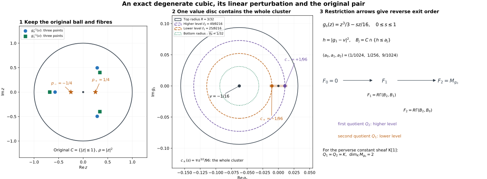

# The original isolated holomorphic pair, its whole cluster and integer count

*Written by GPT-6.1 Sol (OpenAI). Self-checked by the writing AI. CC0 1.0.*

An isolated holomorphic critical point can split into several Morse points. The comparison below keeps the original ball and fibre, follows the entire cluster under perturbation, and counts its contributions with their complex orientations. The count is an integer before a coefficient field is chosen.

## IH0. Original scope and objects

Let \(X\) be closed complex analytic in a complex manifold \(M\), with the original locally finite complex Whitney \((a,b)\) partition into connected smooth strata and its strict dimension frontier rule. The original IHM consumer has \(X=M=Y\). Retain the original holomorphic coordinate chart at \(y=0\), its complex dimension \(n\), and its prescribed squared radius

\[
 \rho(z)=\sum_{j=1}^n|z_j|^2,\qquad C_r=X\cap\{\rho\le r^2\}.
 \tag{IH0a}
\]

Let \(g\) be holomorphic near this chart, \(g(0)=0\), with no stratified critical point other than possibly \(0\) after a shrink. The stratum containing \(0\) may have positive dimension, and \(g\) may be degenerate there. Let \(A\) be any bounded complex of abelian sheaves with locally constant cohomology on the **original** strata. No finite generation, perfectness or geometric perfection is assumed. The actual maps below also work over every commutative unital ring \(k\). Put

\[
\begin{gathered}
M_g(A)_0=(R\Gamma_{\{\operatorname{Re}g\ge0\}}A)_0,\\
R\Gamma(C,D;A)=\operatorname{Fib}\bigl(\\
R\Gamma(C;A)\longrightarrow R\Gamma(D;A)\bigr).
\end{gathered}
\tag{IH0b}
\]

Use \(H^q(B[a])=H^{q+a}(B)\); a module shifted by \([-d]\) is in degree \(d\). All relative arrows are the specified restrictions or continuation zigzags. Work in relatively compact charts meeting finitely many original labels, by local finiteness, without a finite global partition.

For all sufficiently small \(r>0\), choose \(\delta(r)>0\). For every original small regular value \(0<|w|<\delta(r)\), retain

\[
 L_{r,w}=C_r\cap\{g=w\}.
 \tag{IH0c}
\]

After fixing a punctured-value path where needed, we prove the actual-map isomorphism

\[
 M_g(A)_0\simeq R\Gamma(C_r,L_{r,w};A).
 \tag{IH0d}
\]

Then we compare this whole pair with \(g+tL\), construct finitely many generic stratified Morse points with distinct complex critical values, prove that their numbers are the original local complex conormal intersection integers, and produce the original increasing filtration. No step assumes \(M_g(A)_0\ne0\).

## IH1. The original radius is regular off the centre

Refine the stratum through \(0\) by \(0\) and its punctured part **only for auxiliary radial control**. The coefficients and normal objects keep their original labels. This refinement is Whitney near \(0\): for an incident upper label, original Whitney(b) with fixed lower point \(0\) puts every limiting normalized secant \(z/|z|\) in the limiting upper tangent plane. For the punctured part of the stratum through \(0\), its smooth graph and Taylor formula prove this directly. Other pairs keep their original conditions.

If \(d\rho|_{T_zS}=0\) at nonzero points arbitrarily near \(0\), choose a fixed original label along a subsequence, a limiting tangent plane \(P\), and a limiting secant \(e\). The vanishing condition gives \(e\perp P\), while Whitney(b) gives \(e\in P\), contradicting \(|e|=1\). Thus \(\rho\) is submersive on every punctured original label for sufficiently small radii.

On closed positive radial annuli, transverse face refinements are Whitney by the NMG6 argument: their tangent planes are the kernels of jointly onto active rows, stable under limits by Whitney(a). Taylor's formula for each active equality makes limiting secants annihilate its row; original Whitney(b) puts them in the limiting kernel. Simultaneous local lifts give the frontier rule for the finite coordinate-face partition. All radial lift paths stay within original labels.

## IH2. Compact normalized polar incidence controls the zero fibre

Put \(Z_0=X\cap\{g=0\}\). Off \(0\), \(g\) is submersive on every original label. We prove

\[
\begin{gathered}
(d\rho,d\operatorname{Re}g,d\operatorname{Im}g)|_{T_zS}\\
\text{ has rank }3,\\ z\in S\cap Z_0,\quad 0<|z|\ll1 .
\end{gathered}
\tag{IH2a}
\]

This includes absence of such points on strata of too small a real dimension. Use the actual analytic conormal \(C_S=\overline{T_S^*M}\) from AC1–AC3 and AP3's real-part map \(J\). The complex representative of the real row \(d\rho\) is

\[
 \zeta(z)=2\sum_j\overline z_j\,dz_j,\qquad J(\zeta)=d\rho.
 \tag{IH2b}
\]

On a closed coordinate ball consider, for each original label, the compact incidence

\[
\begin{gathered}
(z,\xi)\in C_S,\quad g(z)=0,\quad t\ge0,\\
|\lambda|^2+|\xi|^2+t^2=1,\\
t\zeta(z)=\lambda\,dg_z+\xi.
\end{gathered}
\tag{IH2c}
\]

These equations and inequalities are real analytic, including the actual closed analytic conormal. Mark \(z\in S,\ t>0\), using AC1's semianalytic difference \(S=H_S\setminus B_S\). The **full** TC1–TC5 compatible triangulation applies in this finite-dimensional real analytic ambient manifold. Compactness gives a finite subcomplex for the incidence, compatible with the marks, with analytic open-simplex parametrizations. No Whitney property of the polar incidence is assumed.

On any marked open simplex, differentiation gives \(dg_z(dz)=0\) and \(\xi(dz)=0\), since \(z\) remains in \(S\). Taking real parts of (IH2c) gives \(t\,d\rho(dz)=0\). Thus \(\rho(z)\) is constant on that connected open simplex. There are finitely many such values, including zero-dimensional simplices. Choose a positive squared radius below every positive value in this finite list.

A failure of (IH2a), with \(dg|_{T_zS}\ne0\), says that \(d\rho|_{T_zS}\) is in the real span of the two value rows. Equivalently \(\zeta=\lambda dg+\xi\), \(\xi\in T_S^*M\). Normalization gives a marked point of (IH2c) with \(t>0\), whose positive \(\rho\)-value contradicts the selected radius. This proves (IH2a) for the original labels without the general E14 uniformization route.

## IH3. Joint radial, complex-value and parameter control

On any sufficiently small compact punctured annulus \(0<r_-\le |z|\le r_+\), there is a common value window \(|g|\le\delta\) where the three rows of (IH2a) are jointly independent on every original label. A contrary sequence of dependencies, normalized as in (IH2c), has \(g(z_j)\to0\), one fixed label \(S\), and convergent \(z_j,\xi_j,\lambda_j,t_j\). The base limit lies off \(0\) in an original label \(R\); \(\xi\in C_S\) annihilates \(T_zR\) by Whitney(a)/AP1. If \(t=0\), normalization makes \(\lambda\ne0\), so \(\lambda dg+\xi=0\) makes \(dg|_{T_zR}=0\), a contradiction. If \(t>0\), its limiting equation contradicts IH2a on \(R\cap Z_0\). This checks unbounded multipliers as well as an empty intervening zero fibre.

For \(g_s=g-s\langle\alpha,z\rangle\), uniform convergence of \(g_s,dg_s\) on this compact annulus gives the same contradiction for sufficiently small \(\alpha\), uniformly on an open \(J\supset[0,1]\). In particular on a collar of the **original** radial sphere,

\[
\begin{gathered}
(d\rho,d\operatorname{Re}g_s,d\operatorname{Im}g_s)|_{T_zS}\\
\text{ is onto whenever } |g_s(z)|\le\delta,\\ s\in J.
\end{gathered}
\tag{IH3a}
\]

At a complex-level face \(g_s=w_s\), use its two real equations as one codimension-two marking. The active spatial rows are the two value rows, or all three at the radial corner. Joint surjectivity solves their time equations, including \(\partial_sg_s=-\langle\alpha,z\rangle\) and \(\partial_sw_s\). At a circular value wall \(|g_s-v|^2=b>0\), its row is a nonzero real linear combination of the two value rows; it and \(d\rho\) have rank two. No duplicate opposite inequalities are inserted as extra active rows.

The transverse time-product refinement is Whitney by the kernel/Taylor/frontier proof of NMG6. A family closed in \(C_{r_+}\times J\) is proper over \(J\), since inverse images of compact time intervals are closed in a fixed compact product. CTU/CL/CF and NMG5 apply to these **joint** radial/value/parameter corners; separate wall regularity is insufficient.

## IH4. The half-interval calculation

Use the full SSP-C body with arbitrary weak coefficients. If \(H\in D^+([0,b];\mathbb Z)\) has locally constant cohomology on \((0,b]\), its derived restriction there is identified with a constant derived complex \(E\) by interval evaluation and the bounded-below spectral sequence, without a choice of stalk splitting. With \(i:\{0\}\hookrightarrow[0,b]\) and \(j:(0,b]\hookrightarrow[0,b]\), localization gives

\[
 j_!j^{-1}H\longrightarrow H\longrightarrow i_*H_0\longrightarrow+1.
 \tag{IH4a}
\]

The exact stalkwise sequence \(j_!E\to E_{[0,b]}\to i_*E\) has the derived sections of the latter two objects equal to \(E\), with identity evaluation as their arrow. Hence \(R\Gamma([0,b];j_!E)=0\). IH4a proves that the **actual central restriction** \(R\Gamma([0,b];H)\to H_0\) is invertible. The same proof works for \([0,b)\). Bounded-below truncation and finite interval cohomological dimension justify a direct image not bounded above.

## IH5. The disc-star calculation retains monodromy

If \(D\subset\mathbb C\) is a closed disc with \(0\) in its interior, or its open interior, and \(H\in D^+(D;\mathbb Z)\) has locally constant cohomology on \(D\setminus\{0\}\), then

\[
 R\Gamma(D;H)\longrightarrow H_0
 \tag{IH5a}
\]

is the actual restriction isomorphism. This does not trivialize angular monodromy.

For a centered disc, localization reduces it to \(R\Gamma(D;j_!L)=0\). The proper radial map \(q:D\to[0,b]\), or \([0,b)\), has \(Rq_*j_!L\) with zero central stalk by proper base change. Radial products and coefficient evaluation make its positive cohomology locally constant; its positive stalks are the **original monodromy-bearing** circle cohomology. IH4 proves the required vanishing.

For \(D=D_R(v)\), \(R>|v|\), its boundary meets every ray from \(0\) at one positive distance \(r_{\max}(\theta)\), given by the quadratic formula. The map \(t e^{i\theta}\mapsto t r_{\max}(\theta)e^{i\theta}\) identifies its puncture with \(S^1\times(0,1]\), or \(S^1\times(0,1)\), and extends continuously at \(0\). The same proper radial pushforward proof applies. This normalizes the value disc, not the original ambient radius.

## IH6. Actual central restrictions on the ball and zero fibre

Push \(A|_{C_r}\) forward by its proper radial map. IH1, controlled products on positive annuli and NMG5 make \(R\rho_*A\) weakly locally constant on \((0,r^2]\). Proper base change makes its central stalk \(A_0\). IH4 proves

\[
 R\Gamma(C_r;A)\xrightarrow{\sim}A_0.
 \tag{IH6a}
\]

For \(Z_0\cap C_r\), IH2 gives the corresponding radial regularity on positive annuli. The induced partition \(S\cap\{g=0\}\) is transverse Whitney **off** \(0\): both value rows are onto on every incident original label there. Control is needed only on closed positive annuli; no new Whitney(b) assertion at the vertex of \(Z_0\) is assumed. Its radial zero fibre is the single point \(0\), so proper base change and IH4 give

\[
 R\Gamma(Z_0\cap C_r;A)\xrightarrow{\sim}A_0.
 \tag{IH6b}
\]

These are central restrictions and commute with smaller-ball restrictions.

## IH7. The original Milnor tube and negative half

Choose \(\delta(r)\) from IH3 on a collar of the original sphere. The map

\[
 g:C_r\cap g^{-1}(D_\delta)\longrightarrow D_\delta
 \tag{IH7a}
\]

is proper for either an open or closed value disc, and is submersive over its puncture on every original interior and radial-boundary face. IH3 supplies the full joint face ranks and the Whitney transverse partition. Controlled products over convex value charts and NMG5 make \(H=Rg_*A\) weakly locally constant off \(0\); its central stalk is \(R\Gamma(Z_0\cap C_r;A)\). IH5/IH6b prove

\[
 R\Gamma(C_r\cap\{|g|<\delta\};A)\xrightarrow{\sim}A_0,
 \tag{IH7b}
\]

and its closed-disc version. Its square with restriction from \(C_r\) and central evaluation commutes; IH6a makes the actual ball-to-tube restriction invertible.

On the convex open negative half-disc \(D_\delta^-=\{|w|<\delta,\operatorname{Re}w<0\}\), the proper stratified submersion has a labelled product and its actual NMG5 coefficient object. Evaluation at \(w\in D_\delta^-\) gives

\[
\begin{gathered}
R\Gamma(C_r\cap\{|g|<\delta,\operatorname{Re}g<0\};A)\\
\xrightarrow{\sim}R\Gamma(L_{r,w};A).
\end{gathered}
\tag{IH7c}
\]

This is restriction to the closed fibre. Its square with IH7b is the actual tube-to-fibre restriction square. Contractibility is used after constructing the proper labelled product and its coefficient comparison.

## IH8. Cofinal stabilization computes the supported stalk

For \(0<r'<r\), shrink the value window below the IH3 bound on the entire compact annulus \(r'\le|z|\le r\). The jointly onto map \((\rho,\operatorname{Re}g,\operatorname{Im}g)\) has a controlled radial lift preserving both value coordinates. Stop its inward flow at \(\rho=r'^2\), fix the inner ball, and use compact trapping in a slightly larger open radial collar. CF gives joint continuity at the stopping face. Every path stays in an original label. NMG5 proves that the actual restrictions of whole and negative tubes from radius \(r\) to \(r'\) are invertible in this smaller window.

Shrinking the value window at one fixed radius is already invertible on negative tubes by their common evaluation arrows IH7c, and on whole tubes by their commuting central restrictions IH7b. For any nested good tubes, choose a third value window below the annular bound and both original windows. The commuting restriction square has the two window-shrink arrows and the annular arrow invertible. Two-out-of-three proves invertibility of the **original nested restriction**. These are stabilized arrows of the actual directed system.

Open sets

\[
 U_{r_+,\delta}=X\cap\{\rho<r_+^2,\ |g|<\delta\}
 \tag{IH8a}
\]

are cofinal neighborhoods of \(0\). Choose \(r<r_+\) and a value window below IH3 on a collar from a slightly smaller inner radius through \(r_+\). The same stopped value-preserving radial homotopy retracts this open tube onto its closed \(C_r\)-tube, and the negative part onto the closed negative tube. It is fixed on the inner core, and all paths stay in original labels. NMG5 uses the proper time projection \(T\times[0,1]\to T\) on each locally compact member \(T\). The deleted negative family is not asserted proper over a radial interval reaching zero. Thus these are actual open-to-closed restriction isomorphisms preserving the restriction square.

Taking the stalk of the localization triangle along this cofinal open system gives

\[
\begin{gathered}
M_g(A)_0\simeq\operatorname{Fib}\Bigl(\\
A_0\longrightarrow\\
\underset{U\ni0}{\operatorname{colim}}R\Gamma(U\cap\{\operatorname{Re}g<0\};A)\Bigr).
\end{gathered}
\tag{IH8b}
\]

Exactness of filtered colimits of abelian groups justifies the derived stalk calculation. Stable negative-tube restrictions and IH7c identify its second object with \(R\Gamma(L_{r,w};A)\). Its first object is identified through the actual central restriction from \(C_r\). All arrows come from the same localization/restriction diagrams, so their fibre proves IH0d with no extra shift.

For another prescribed \(w\) in the punctured disc, selected path transport through overlapping proper value charts and NMG5 preserves the ball-to-fibre restriction square. This proves the original complex-fibre comparison with its path convention. In dimension zero the ball is a local point and the fibre is empty, giving \(M_g(A)_0=A_0\). Empty coefficient data and an empty supported test are included throughout.

## IH9. Conservative extension to every commutative unital ring

Construct every restriction, localization triangle, inverse image, proper-base-change map and NMG5 counit/evaluation for \(k\)-sheaves. They are actual \(k\)-linear arrows. NMC1–NMC3 compute their compatible underlying abelian arrows on the same flabby resolutions, preserving restriction maps and adjunction units. Weak constructibility survives forgetting. The abelian proof makes the underlying cone acyclic, and conservativity makes the \(k\)-arrow invertible. No arbitrary abelian isomorphism is lifted to a module isomorphism. IH0d and the following cluster/filtration need no finite global dimension, noetherianity, scalar flatness or perfect stalks. The zero ring gives zero objects.

## IH10. Finite perturbation of the full isolated conormal intersection

Let \(\Sigma=\bigcup_S C_S\) for all original local labels. Whitney(a)/AP1 implies that \(dg_z\in C_S|_z\) annihilates the actual original label through \(z\). Isolation against **all** original strata therefore gives

\[
 \Sigma\cap\operatorname{graph}(dg)\subset\{p=(0,dg_0)\}
 \tag{IH10a}
\]

in a shrunk base chart. The intersection may be empty. For each retained local pure-\(n\) component through \(p\), use

\[
 F(z,\xi)=dg_z-\xi\in\mathbb C^n.
 \tag{IH10b}
\]

Choose a small closed cotangent coordinate ball with no zero of \(F\) on its boundary. The positive minimum of \(|F|\) on its compact analytic boundary part permits a smaller target ball whose full inverse image inside the open source ball is proper. Its fibres are compact analytic in a coordinate domain, hence finite by the complete FMR3 proof. The full finite proper-image proof RMP and finite dimension FMR2/FMR5 make each component's image analytic of dimension \(n\). A proper analytic subset of a connected \(n\)-ball has smaller dimension, so every nonempty retained component dominates that ball. Singular and multibranch source germs are allowed.

This representative captures every small perturbed critical point in \(C_r\). For such a point, \(\xi=dg_z-s\alpha\) is uniformly bounded there. A sequence with \(\alpha\to0\) not approaching \(p\) has a convergent base/covector subsequence and one fixed original label. Its limit contradicts IH10a. Thus all critical points approach \(p\), and, for small parameters, lie in its chosen representative. No original label or radial end has been lost. If the unperturbed intersection is absent, the same compact argument gives no perturbed critical points.

## IH11. Generic points are stratified Morse points

Delete AC3's closed analytic bad locus and the closed analytic maximal-minor rank-drop set of \(F\), including the singular locus. AC2/AP2 make the bad locus proper, of dimension at most \(n-1\), on every retained component. On its regular part the maximum rank of \(F\) is \(n\): otherwise the holomorphic constant-rank theorem gives a positive-dimensional fibre on a maximum-rank open patch, contradicting finiteness. FAG3's reduced-ideal augmented-Jacobian argument defines its rank-drop locus analytically across singularities. The total exceptional source subset is proper on each component. Its finite proper image is a proper analytic subset of dimension at most \(n-1\).

For a small parameter \(\alpha\) outside this image, \(F^{-1}(\alpha)\) is finite, smooth and transverse. Each point lies in the actual conormal over one original \(S\), in no other original conormal closure, and is a critical point of

\[
 g_\alpha(z)=g(z)-\langle\alpha,z\rangle.
 \tag{IH11a}
\]

Use local coordinates \(u\) on \(S\) and fibre coordinates on its conormal bundle. The equation \(F=\alpha\), evaluated on the moving tangent basis, is precisely \(d(g_\alpha|_S)=0\). Its derivative is the tangential complex Hessian; the complementary covector block of \(dF\) is an invertible identity block up to sign and a fixed basis change. Hence \(dF\) is invertible exactly when that Hessian is nonsingular. AC3/AP1 also give the full original limiting-tangent normal genericity at that same point. These are actual stratified Morse points, not merely transverse solutions with unchecked normal directions.

## IH12. Distinct critical values and one generic linear family

Off the exceptional image the finite map is a local holomorphic covering. On a simply connected small parameter chart its branches have basepoints \(z_i(\alpha)\) in fixed original labels. Let

\[
 c_i(\alpha)=g(z_i(\alpha))-\langle\alpha,z_i(\alpha)\rangle.
 \tag{IH12a}
\]

The critical conormal annihilates \(dz_i\), tangent to that label, so

\[
\begin{gathered}
dc_i=-\sum_j(z_i)_j\,d\alpha_j,\\
d(c_i-c_l)=-\sum_j((z_i)_j-(z_l)_j)d\alpha_j.
\end{gathered}
\tag{IH12b}
\]

Distinct cotangent solutions have distinct basepoints, since \(\xi=dg_z-\alpha\). Thus the second differential is nonzero for \(i\ne l\). Equality of their critical values is a proper analytic hypersurface on every non-diagonal branch chart.

To obtain one analytic exceptional germ, form the finite source fibre product over the parameter ball. On its regular covering locus, delete the diagonal and impose equality of the two holomorphic values. SGC8's analytic-difference closure is analytic. Its components meeting this covering locus have dimension at most \(n-1\), by IH12b; components lying over the previous exceptional image are already covered by that image. The finite proper-image theorem consequently gives a proper analytic collision image. The diagonal must be deleted: retaining it would make every parameter exceptional.

Take a nonzero holomorphic germ vanishing on the union of the bad and collision images. Its lowest nonzero homogeneous term is nonzero at some direction \(\lambda\); such directions are dense by the polynomial identity argument. Its restriction to \(t\lambda\) has an isolated zero at \(t=0\). Every sufficiently small nonzero complex \(t\) on this line avoids both images. Choose \(\alpha=t_0\lambda\). The family \(g+sL\), \(L=-\langle\alpha,z\rangle\), \(0\le s\le1\), is the requested linear cluster family; its sufficiently small positive-time members have finite generic Morse points and distinct complex values. IH10 makes all their basepoints and values converge uniformly to \(0\) as \(t_0\to0\). If \(n=0\), the component and target are points, with count one and no direction selection.

## IH13. The original complex analytic intersection integer

The original \(I_p(C_S,\operatorname{graph}(dg))\) is local intersection of the reduced analytic cycle \(C_S\), with coefficient one on each branch, and the graph with its complex orientation. We construct its local intersection pairing independently of any generic-fibre count. No Cohen–Macaulay property of a conormal local ring or naive quotient-length formula is assumed.

IHA1–IHA3 below also prove its equality with parameter-ideal Samuel multiplicity on the actual reduced pure-dimensional local conormal ring. Thus either usual analytic-cycle or parameter-Samuel convention gives the same integer; there is no unresolved convention substitution.

For a pure complex-\(n\) reduced analytic cycle \(V\), TC gives a compatible finite triangulation of a compact local representative, marked by its regular part, singular part, component intersections and outer cut. The singular part and intersections have real dimension at most \(2n-2\). Orient its real \(2n\)-simplices in the regular part by complex orientation. Any interior codimension-one simplex lies in the regular part, since the marked singular subcomplex has dimension at most \(2n-2\). Its two adjacent manifold pieces have opposite boundary orientations, so boundaries cancel. The remaining boundary is on the outer cut. Summing with the analytic cycle's branch coefficients gives its integer relative fundamental cycle \([V]\).

Oriented subdivision preserves this cycle. Independence of triangulation follows by triangulating simultaneously the two finite families of simplex images and refining them; TC supplies the compatible common refinement, and its orientation-preserving simplex subdivision gives the same relative class. Thus this is the fundamental cycle of the **original analytic cycle**, not a new cycle chosen using a perturbation.

The holomorphic ambient coordinate change

\[
 (z,\xi)\longmapsto(z,dg_z-\xi)
 \tag{IH13a}
\]

is a biholomorphism taking the graph to the zero section of its second coordinate. The graph's complex normal orientation fixes the positive generator

\[
 \tau\in H^{2n}(\mathbb C^n,\mathbb C^n\setminus\{0\};\mathbb Z)=\mathbb Z.
 \tag{IH13b}
\]

The local intersection is evaluation of the pullback \(F^*\tau\) on the relative fundamental cycle near the isolated inverse image. This is the usual oriented analytic-cycle intersection construction: it uses the original cycle coefficients and its complex normal Thom class, agrees with oriented transverse intersection on regular points, and is additive on local branches by the actual fundamental-cycle sum. It is not a definition in terms of a generic number of points. The Euclidean orientation body MD/TMC computes IH13b; finite singular cochains give its pullback/evaluation and subdivision naturality.

Choose the proper representative of IH10 and a compact smaller target ball. TC triangulates its compact inverse image compatibly with \(F^{-1}(\partial D)\), singularities and components. The preceding fundamental cycle is relative to this outer face. Excision localizes its Thom evaluation to the isolated inverse image at \(p\), so it computes the original local intersection integer.

## IH14. Conservation proves equality with the full Morse-point count

Make \(\alpha\) small enough that \(|F|>|\alpha|\) on the original outer cut. The homotopy \(F-s\alpha\) does not vanish there. The relative Thom evaluation is unchanged along this homotopy: the singular-chain prism of each source simplex has boundary the two endpoint chains and the outer-face prism. The latter pairs to zero because the homotopy avoids zero there; the ordinary cochain prism identity gives equal endpoint pairings. This proves conservation with its actual boundary.

At the endpoint, every zero is regular and transverse by IH11. Excision separates its disjoint small neighborhoods. Its complex-linear invertible derivative has

\[
 \det_{\mathbb R}(dF)=|\det_{\mathbb C}(dF)|^2>0.
 \tag{IH14a}
\]

The local oriented contribution is \(+1\). Consequently

\[
\begin{gathered}
I_p(C_S,\operatorname{graph}(dg))\\
=\#\left\{\begin{gathered}\text{perturbed stratified}\\
\text{Morse points on the original }S\end{gathered}\right\}.
\end{gathered}
\tag{IH14b}
\]

Sum local branches of one conormal cycle. The generic endpoint avoids their intersections, so no point is counted twice. AP2 rules out a shared top-dimensional component for different original labels, and AC3 avoidance rules out coincident endpoint points between their closures. Every nonempty retained component dominates the parameter ball by IH10, so its integer is strictly positive. An absent component contributes zero. In dimension zero both the fundamental and Thom classes have degree zero and the contribution is one. This is conservation of the original complex intersection integer, proved before any coefficient field is introduced.

## IH15. Continue the entire pair outside the whole critical-value cluster

Fix a small permitted regular value \(v\ne0\), first in the negative value half-disc if desired. IH8 compares it with the originally prescribed \(w\). Choose \(\alpha\) so small that, for **every** \(s\in[0,1]\), all critical points of \(g_s\) are in the inner representative and all their values satisfy \(|c|<\eta<|v|/4\). The compact isolation argument IH10 proves this uniformly, including parameter values at which the endpoint genericity argument is not applied. Original point strata are included, independent of their coefficients.

The family

\[
 \mathcal L=\{(z,s)\in C_r\times J:g_s(z)=v\}
 \tag{IH15a}
\]

is proper over a slightly larger \(J\supset[0,1]\). The interior value rows are onto because \(v\) is outside every critical cluster. The three rows at its radial boundary are jointly onto by IH3. The Whitney face refinement and simultaneous time-tangent solution give a labelled time product by CTU/CL/CF. NMG5 gives actual \(k\)-coefficient endpoint arrows, whose square with the constant \(C_r\times J\) coefficient object commutes. Its fibre gives

\[
 R\Gamma(C_r,L_{r,v}(g);A)
 \simeq R\Gamma(C_r,L_{r,v}(g_\alpha);A).
 \tag{IH15b}
\]

This continues the **whole cluster pair**; it never identifies the old test with the perturbed stalk at the old point \(0\). It also applies when the original supported test is empty.

After choosing the endpoint, move \(v\) within a small open disc of allowed values, still outside the whole cluster, to avoid the finitely many critical points and real perpendicular bisectors. Then \(|c_i-v|^2\) are positive and pairwise distinct. This move is another actual proper value-family continuation. A common value window remains by IH3 and compactness.

## IH16. Top restriction from the original ball

Choose \(R>|v|+\eta\) with \(R+|v|<\delta\), after making \(|v|,\eta\) sufficiently small. The value disc \(D_R(v)\) contains \(0\) and the whole cluster. Put

\[
 T_s=C_r\cap\{|g_s-v|^2\le R^2\}.
 \tag{IH16a}
\]

This closed family in the fixed compact ball is proper over time. In its interior, time on an original \(S\times J\) is submersive even at a spatial critical point. Its circular value face avoids every critical value, so its spatial row is nonzero. At the radial/value corner, IH3 gives simultaneous spatial rank two; the pure radial face uses IH1. NMG9/NMG5 give its labelled time product and commuting restriction square with \(C_r\).

At \(s=0\), the proper \(g\)-map on \(T_0\) has weakly locally constant direct-image cohomology off \(0\), with central stalk \(R\Gamma(Z_0\cap C_r;A)\simeq A_0\). IH5 on \(D_R(v)\) gives the actual restriction \(R\Gamma(T_0;A)\to A_0\) invertible. Together with IH6a and the central restriction square, this makes the actual ball-to-\(T_0\) restriction invertible. The time-family square then proves

\[
 R\Gamma(C_r;A)\xrightarrow{\sim}R\Gamma(T_1;A).
 \tag{IH16b}
\]

The argument does not declare \(T_1=C_r\) or require its value disc to contain every value on the ball.

## IH17. Bottom evaluation at the perturbed original complex fibre

Choose \(a_0>0\) so that \(|u-v|^2\le a_0\) contains no critical value of \(g_\alpha\) and stays in \(|u|<\delta\). The proper \(g_\alpha\)-map over this convex closed disc is submersive on all original interior and radial-boundary faces, with joint corner ranks IH3. NMG4 constructs its product and inverse; NMG5 identifies the actual coefficient object. Thus restriction/evaluation gives

\[
\begin{gathered}
R\Gamma(B_0;A)\xrightarrow{\sim}\\
R\Gamma(L_{r,v}(g_\alpha);A),\\
B_0=C_r\cap\{|g_\alpha-v|^2\le a_0\}.
\end{gathered}
\tag{IH17a}
\]

Its square with the top and ball restrictions commutes. IH8 and IH15–IH17 identify the original supported test with \(R\Gamma(T_1,B_0;A)\) through these actual arrows, without perfection.

## IH18. All critical levels and radial corners

Set \(h=|g_\alpha-v|^2\). Complex linearity gives, whenever \(g_\alpha\ne v\),

\[
\begin{gathered}
dh|_{T_zS}=0\ \Longleftrightarrow\ dg_\alpha|_{T_zS}=0,\\
dh=2\operatorname{Re}(\overline{g_\alpha-v}\,dg_\alpha).
\end{gathered}
\tag{IH18a}
\]

All positive critical points between \(a_0\) and \(R^2\) are therefore the finite Morse points of IH11, with distinct levels \(\ell_i=|c_i-v|^2\). On the original outer radial sphere, IH3 makes \(dh\) submersive on each boundary face throughout this range; there are no boundary critical contributions.

Choose disjoint prescribed small ambient distance balls \(D_i\) around the points. At \(p_i\), the Hessian on its original \(S_i\) is nondegenerate and its normal covector is the nonzero complex multiple in IH18a. AC3's bad set is complex conic, so the multiple stays generic. The full E07 original-radial proof gives a small local height window with **joint** local radius/height ranks on every incident original label. IH3 separately checks the outer global sphere. Refine all realized interfaces by actual equalities; the kernel/Taylor/frontier proof supplies their Whitney face partition.

## IH19. Actual global-to-local jump

On a compact critical-point-free band, CTU/CL construct a lowering controlled field \(dh(V)=-1\), tangent to the original outer radial face. Compact trapping in a slightly larger open band supplies its finite time; stop at the lower level and fix everything below. NMG5 makes the actual sublevel restriction invertible.

For one critical level, use the finite closed cover of the upper sublevel by \(D_i\) and the closed exterior of its open ball; their intersection is the sphere interface. On the exterior and interface bands, the jointly checked local/global ranks give a lowering field tangent to all these faces. Its stopped flow retracts them onto their lower parts with NMG5 coefficient transport, so their relative complexes are zero. The finite closed-cover sequence of restricted sheaves and their closed pushforwards is exact on stalks. Its upper/lower restriction diagram and fibre yield the actual local restriction isomorphism

\[
\begin{gathered}
R\Gamma(B_j,B_{j-1};A)\xrightarrow{\sim}\\
R\Gamma\bigl(D_i\cap\{h\le\ell_i+e\},\\
D_i\cap\{h\le\ell_i-e\};A\bigr).
\end{gathered}
\tag{IH19a}
\]

Regular intervals connecting selected \(B_j\)'s to \(\ell_i\pm e\) are removed by the preceding actual restriction maps. This is the full CLF5 finite closed-cover argument with its hypotheses verified here. Disjoint balls give a direct sum if levels coincide. No cell attachment or homotopy invariance for arbitrary sheaves is invoked.

## IH20. Tangential orientation and degree

Let \(d_i=\dim_{\mathbb C}S_i\), \(c_i=g_\alpha(p_i)\). The tangential real Hessian is

\[
 \operatorname{Hess}_{\mathbb R}(h|_{S_i})
 =2\operatorname{Re}\bigl(\overline{c_i-v}\,
 \operatorname{Hess}_{\mathbb C}(g_\alpha|_{S_i})\bigr).
 \tag{IH20a}
\]

The term \(|g_\alpha-c_i|^2\) begins in order four. TMC1–TMC3's explicit square-splitting and Schur-complement induction, with the local holomorphic unit square root, diagonalize the complex quadratic part after this nonzero scalar multiplication. Each complex coordinate gives one positive and one negative real square. Its real index is exactly \(d_i\).

Choose the negative-coordinate orientation in the order of the local TMC/E07 construction. Its disk/annulus relative generator identifies the tangential factor with \(k[-d_i]\); reversing that chosen orientation multiplies the generator by \(-1\). No canonical global trivialization of this orientation local system is asserted. The full E07 proper pair zigzag, followed by NC/HNC/HB normal comparison, gives

\[
 Q_i=R\Gamma(B_j,B_{j-1};A)\simeq N_{S_i}(A)[-d_i].
 \tag{IH20b}
\]

\(N_{S_i}(A)\) is the **original** object on the original transverse complex slice, original distance ball and regular complex fibre, transported along a selected generic conormal path. The nonzero complex scalar of IH18a lies in its connected generic complex conormal locus, by AC3/HNC. Transport identifies the isomorphism class and actual coefficient arrows, retaining possible monodromy and original labels. Dimension zero has tangential shift zero. The complex cycle orientation of IH13–IH14 is separate from this chosen real negative orientation.

## IH21. Increasing filtration in the original reverse exit order

Choose regular levels

\[
\begin{gathered}
0<a_0<\ell_1<a_1<\cdots<\ell_N<a_N=R^2,\\
B_j=C_r\cap\{h\le a_j\},\quad B_N=T_1.
\end{gathered}
\tag{IH21a}
\]

Keep the final space fixed and define

\[
 F_r=R\Gamma(B_N,B_{N-r};A),\quad0\le r\le N.
 \tag{IH21b}
\]

Then \(F_0=0\), \(F_N\simeq M_g(A)_0\), and the composable actual restrictions from \(B_N\) through \(B_{N-r+1}\) to \(B_{N-r}\) give

\[
 F_{r-1}\longrightarrow F_r\longrightarrow Q_{N-r+1}
 \longrightarrow F_{r-1}[1].
 \tag{IH21c}
\]

For \(C\xrightarrow{u}D\xrightarrow{v}E\), the mapping-cone fibre triangle is \(\operatorname{Fib}(u)\to\operatorname{Fib}(vu)\to\operatorname{Fib}(v)\to+1\). This proves IH21c on the specified restriction arrows. It is the original reverse exit order, not a reversal of the cohomological functor or a duality/splitting argument. If there are no critical points, the terminal regular restriction is invertible and the filtration is the empty zero filtration.

## IH22. The integer conclusion for every field and characteristic

Let \(K\) be any field and \(P\) an original constructible perverse \(K\)-sheaf in the FH finite-rank/perfect-stalk convention. The full original normal-Morse degree theorem PD1–PD6 gives

\[
\begin{gathered}
N_S(P)[-\dim_{\mathbb C}S]\\
\text{ finite-dimensional in degree }0.
\end{gathered}
\tag{IH22a}
\]

IH20/IH21 imply by induction that every \(F_r\) is in degree zero, with the actual short exact sequence

\[
\begin{gathered}
0\longrightarrow H^0F_{r-1}\longrightarrow H^0F_r\\
\longrightarrow H^0Q_{N-r+1}\longrightarrow0.
\end{gathered}
\tag{IH22b}
\]

Ordinary dimensions add without a chosen splitting. Grouping by original conormal label and using the conserved integer IH14 gives

\[
\begin{gathered}
\dim_K H^0M_g(P)_0\\
=\sum_S I_{(0,dg_0)}(C_S,\operatorname{graph}(dg))\,\\
\dim_K(N_S(P)[-\dim S]).
\end{gathered}
\tag{IH22c}
\]

The intersection integers are nonnegative and strictly positive at nonempty isolated intersections. This equality is in \(\mathbb Z\), in every characteristic; it is not a trace reduced in \(K\). A visible isolated intersection has a positive summand, so the actual supported test is nonzero. An empty test gives zero on the same left side and forces every normal contribution to vanish, through the full same geometric construction.

## IH23. Application to the finite-map theorem

IH1–IH9 identify the original ball/fibre pair with the supported test for all bounded weak abelian coefficients and its ring-linear extension. IH10–IH14 give the perturbation and its integer count. IH3 and IH15–IH19 compare the whole cluster through radial, complex-value and parameter boundaries, including an empty test. IH20–IH22 give the orientation, shift and increasing filtration used in [the isolated Morse calculation](../isolated-holomorphic-morse-tests.html#SH02-IHM-FULL-ISOLATED-PROOF) and the finite-map formulas FH30/FH55–FH56.

The prerequisite proofs are listed below. Analytic conormal geometry and compatible triangulation control the marked sets; controlled lifts and flows compare the actual pairs. Localization, proper base change, interval evaluation and the Euclidean orientation generator determine their cohomology maps. The perverse normal-degree theorem is used only in IH22.

The hypothesis here is an isolated stratified critical point. The general singular-form characteristic-value theorem, the nonisolated critical-support theorem and the stronger isolated-vanishing-cycle-support theorem retain their broader statements; the present construction does not establish those different hypotheses.

FH30's original ring of finite global dimension and perfect stalks still uses its original finite perfect pair/scalar model, perverse-cohomology reduction and derived residue-field detection. The present proof supplies its isolated geometric/field step; it neither adds perverse theory over every ring nor replaces those separate scalar/algebraic steps. IH0–IH21 themselves impose no perfection.

Human antecedents are [Massey, *A Little Microlocal Morse Theory*, version 2](https://arxiv.org/abs/math/0006185v2), Theorem 1.1 and its cluster discussion, and [Maxim–Schürmann, *Constructible sheaf complexes in complex geometry and applications*, June 2, 2021](https://people.math.wisc.edu/~lmaxim/handbook.pdf), Theorem 3.12 and Corollary 4.14. These give the isolated-cluster and normal-factor results with which the calculation can be compared.

## IHA1. The actual finite analytic module, with the parameter coordinates fixed

This appendix supplies the non-Cohen–Macaulay algebraic bridge, rather than importing a finite-module assertion merely from properness. Work with one reduced pure-\(n\) local conormal germ \(V\) at \(p\), or its finite branch union, and the proper finite representative of \(F\) in IH10. Its zero fibre is just \(p\). Set

\[
\begin{gathered}
B=\mathbb C\{\alpha_1,\ldots,\alpha_n\},\\
N=\mathcal O_{V,p},\quad \mathfrak m=(\alpha_1,\ldots,\alpha_n).
\end{gathered}
\tag{IHA1a}
\]

The \(B\)-action is the **actual** map \(\alpha_j\mapsto F_j\). We prove \(N\) finite over this prescribed parameter ring; choosing an unrelated generic projection would not suffice.

Over the connected complement of the proper analytic exceptional target set, the finite proper map is a holomorphic covering with a finite constant number \(r_{\rm geo}\) of sheets. Connectedness follows from the bounded analytic-complement proof, and proper local inverse charts give the covering. Take ambient coordinates \(u_1,\ldots,u_m\) at \(p\), all vanishing there. The symmetric polynomial

\[
 P_j(\alpha,T)=\prod_{q\in F^{-1}(\alpha)}(T-u_j(q))
 \tag{IHA1b}
\]

is single-valued and holomorphic off the exceptional set: local inverse branches give holomorphic coefficients and permutation invariance glues them. No individual root is selected globally. Its coefficients are bounded near the exceptional set, because properness traps all roots in one compact source neighborhood. The full bounded manifold-removal proof extends them holomorphically across that set. The scalar negative-Laurent-coefficient estimate \(|a_{-l}|\le M s^l\to0\) supplies its one-variable removal step; its several-variable fixed-circle argument is the selected SCV4.2 body. As \(\alpha\to0\), every source point approaches \(p\), by properness and the isolated zero fibre. Hence

\[
\begin{gathered}
P_j(0,T)=T^{r_{\rm geo}},\\ P_j(F(q),u_j(q))=0\quad\text{on }V.
\end{gathered}
\tag{IHA1c}
\]

The second identity holds first on the dense covering part and then everywhere by continuity of these holomorphic functions on the reduced analytic space.

Realize the actual graph of \(F\) as a reduced analytic germ in the coordinates \((\alpha,u)\), with ideal \(I\). It contains every \(P_j(\alpha,u_j)\). Order the coordinates with the \(\alpha\)'s first. These are Weierstrass polynomials in each \(u_j\), with coefficients in \(B\), and in particular in the preceding coordinates. Successive division, in exactly the order and with the full common-root-gap contour proof of WPD, reduces every convergent germ modulo their ideal to

\[
 \sum_{0\le e_j<r_{\rm geo}} b_e(\alpha)\,u_1^{e_1}\cdots u_m^{e_m},
 \qquad b_e\in B.
 \tag{IHA1d}
\]

This is the actual repeated division proof of local-ring Corollary 4.2, not a formal-series approximation or convergence-free Nakayama argument. Thus \(N\) is a finite \(B\)-module. \(B\to N\) is injective because each retained source component dominates the parameter ball.

Here is also the uniform module meaning needed for a generic fibre. The simultaneous monic equations define a finite analytic container over a small parameter polydisc. Successive division identifies its structure algebra with a finite free module on the bounded-degree monomials of IHA1d. The original source is the quotient by its reduced coherent ideal in that container. Choose a finite generating list near the compact zero fibre and shrink the parameter polydisc using properness. Multiplication by those generators on the finite monomial module and division give a finite matrix presentation over the parameter ring. Noetherianity makes its relation module finite. The same contour division, whose bounds and root-radius gaps hold on a common product, gives this presentation on a neighborhood. At a parameter point its analytic stalk is the direct sum of the local algebras at the finite source fibre: choose disjoint neighborhoods of that fibre, shrink by properness, and apply division on those pieces. Restriction and direct sum of these local presentations agree by uniqueness of remainders. This proves the used finite coherent direct-image algebra for this **finite** container and its quotient; a general coherent proper-direct-image theorem is unnecessary.

Let \(r_{\rm alg}=\dim_{\operatorname{Frac}B}(N\otimes_B\operatorname{Frac}B)\). Choose a fraction-field basis represented by elements of \(N\). Its span gives an injective \(B^{r_{\rm alg}}\to N\) with finite torsion cokernel \(Q\). Clear denominators of a finite generating set of \(Q\): one nonzero \(b\in B\) kills it. The corresponding finite matrix presentation is consequently free of rank \(r_{\rm alg}\) off \(b=0\). At a generic parameter also outside the earlier exceptional image, the finite source is a disjoint union of local biholomorphic inverse sheets. Its fibre algebra is therefore \(\mathbb C^{r_{\rm geo}}\). The proved uniform presentation has fibre dimension \(r_{\rm alg}\) there, so

\[
 r_{\rm alg}=r_{\rm geo}.
 \tag{IHA1e}
\]

No unproved flatness of singular fibres has been asserted.

## IHA2. Artin–Rees proves the parameter multiplicity equals rank

Put \(r=r_{\rm alg}\) and use \(0\to B^r\to N\to Q\to0\), with \(bQ=0\), from IHA1. The exact Hilbert–Samuel quotient sequence has first term \(B^r/(B^r\cap\mathfrak m^sN)\). The **full** Rees-module proof of Artin–Rees supplies \(c\) with

\[
\begin{gathered}
\mathfrak m^sB^r\subset B^r\cap\mathfrak m^sN\\
\subset \mathfrak m^{s-c}B^r\qquad(s\ge c).
\end{gathered}
\tag{IHA2a}
\]

We check the smaller-order torsion term explicitly, so no unrelated dimension theorem is a hidden premise. If \(Q\) has \(l\) generators and \(b\) has lowest nonzero homogeneous term \(b_h\), then \(Q\) is a quotient of \((B/(b))^l\). The power-series initial-product rule gives

\[
 \operatorname{gr}_{\mathfrak m}(B/(b))
 =\mathbb C[X_1,\ldots,X_n]/(b_h).
 \tag{IHA2b}
\]

Indeed every initial form of \(bf\) is \(b_hf_{\rm initial}\), and all such homogeneous products are realized; this computes the graded kernel. Multiplication by nonzero \(b_h\) is injective in the polynomial domain. Counting monomials and summing graded pieces yields

\[
\begin{gathered}
H_{B/(b)}(s)\\
=\binom{s+n-1}{n}-\binom{s-h+n-1}{n}\\
=O(s^{n-1})
\end{gathered}
\tag{IHA2c}
\]

for large \(s\), if \(b\) is a nonunit; a unit gives \(Q=0\). Thus \(H_Q(s)=O(s^{n-1})\). Also \(H_{B^r}(s)=r\binom{s+n-1}{n}\). Length additivity in the actual quotient sequence and IHA2a give

\[
\begin{gathered}
H_Q(s)+r\binom{s-c+n-1}{n}\\
\ \le H_N(s)\le\\
H_Q(s)+r\binom{s+n-1}{n}.
\end{gathered}
\tag{IHA2d}
\]

Consequently \(H_N(s)=r\,s^n/n!+O(s^{n-1})\). The full Hilbert–Serre/Hilbert–Samuel polynomial proof guarantees that this function is eventually polynomial; the leading coefficient just computed is \(r/n!\). Hence \(e_{\mathfrak m}(N)=r\).

The parameter ideal \(q=(F_1,\ldots,F_n)N\) has isolated zero set at \(p\), so the reduced-ideal Nullstellensatz makes it an ideal of definition in the actual Noetherian local ring \(N\). Moreover \(\mathfrak m^sN=q^s\). Finite-length \(B\)-modules and finite-length \(N\)-modules appearing here have residue field \(\mathbb C\), so their lengths equal their complex vector-space dimensions. This identifies their Hilbert–Samuel functions, not merely their leading degrees:

\[
 e_q(\mathcal O_{V,p})=e_{\mathfrak m}(N)=r.
 \tag{IHA2e}
\]

If \(n=0\), \(V\) is a reduced local point, its algebra is \(\mathbb C\), and this assertion is length one.

## IHA3. Both original multiplicity conventions agree

IH14 computes the complex oriented-cycle intersection as \(r_{\rm geo}\). IHA1e and IHA2e compute the parameter-ideal Samuel multiplicity as the same integer:

\[
\begin{gathered}
I_p(V,\operatorname{graph}(dg))\\
= r_{\rm geo}=r_{\rm alg}\\
=e_{(dg-\xi)}(\mathcal O_{V,p}).
\end{gathered}
\tag{IHA3a}
\]

Branch additivity gives the statement for each original \(C_S\). This includes a non-Cohen–Macaulay conormal. Its raw quotient length \(\dim_{\mathbb C}N/qN\) has not been substituted for multiplicity. The finite analytic module, its uniform generic-fibre meaning, and the full induced-filtration estimate have all been supplied at their exact bounded-removal/Weierstrass/coherence/Noetherian/Artin–Rees/Hilbert–Samuel floor.

## An exact cubic illustrates the original pair and reverse exit order

Take \(X=M=\mathbb C\) with its single original open stratum, \(g_s(z)=z^3/3-sz/16\), \(0\le s\le1\), the original ball \(C=\{|z|\le1\}\), and \(v=-1/16\). Its critical points are \(p_\pm(s)=\pm\sqrt{s}/4\), with values \(c_\pm(s)=\mp s^{3/2}/96\). At \(s=1\) the positive \(h=|g_1-v|^2\) levels are \(25/9216\) and \(49/9216\). The regular selected levels \(a_0=1/1024\), \(a_1=1/256\), \(a_2=9/1024\) surround them as in IH21a.

Here \(\eta=1/80<|v|/4\), \(R=3/32>|v|+\eta\), and \(R+|v|=5/32<\delta=1/5\). On the original sphere, \(|g_s|\ge1/3-1/16=13/48>\delta\). Thus every controlled value face misses that sphere for the **whole** parameter interval; this absence is the exact boundary check in this particular example, not a claimed model of every corner in IH3.

The two plotted fibres are roots of their displayed cubics; their positions use numerical root samples. Their exact cardinality is three: the finite scalar polynomial-splitting proof WP0 gives three roots counted with multiplicity, and \(v\) is outside the critical values, so they are distinct. If a root had \(|z|\ge1\), the equation \(z^3/3-sz/16=v\) would imply \(|z|^3/3\le |z|/16+1/16\), impossible there since the difference is positive at \(1\) and has positive derivative thereafter. They all lie in the original ball. The original conormal intersection is \(dg_0=z^2=0\), of integer multiplicity two, realized by the two perturbed Morse points as in IH14/IHA3.

For the perverse constant sheaf \(K[1]\), over any field, both original normal quotients are \(K\) in degree zero; IH22 gives dimension two. The right panel records \(F_1=R\Gamma(B_2,B_1)\), then \(F_2=R\Gamma(B_2,B_0)\), so the higher critical level exits first. The [reproducible CC0 figure source](../figures/draw_isolated_cluster.py) produces this wide figure and a [stacked mobile arrangement](../figures/isolated-cubic-cluster-mobile.svg) from the same exact objects. Numerical root positions are samples; the exact cardinalities and boundary inequalities are proved in this caption. The proof locators are IH3, IH14–IH17 and IH21–IH22; the human antecedents are the isolated-cluster and normal-factor sources identified in IH23.

## Prerequisite proofs

The following lessons prove the prerequisite results used here. The analytic and geometric proofs are coefficient-independent; interval, support and orientation calculations use the coefficient ranges specified in those lessons. IH22 alone uses the field-perverse degree theorem.

| Prerequisite lesson | Results used here |
| --- | --- |
| Analytic geometry for finite maps | Analytic coordinates, reduced components and differences, proper images, compact affine-analytic finiteness, and dimension and rank cuts |
| [Analytic closures of the original strata](../analytic-conormal-closures.html) | Analytic conormal closures and the AP/PB parameter comparisons |
| [Compatible triangulation](../compatible-whitney-triangulation.html#SH02-COMPATIBLE-TRIANGULATION) | Analytic open simplices compatible with the marked compact pair and finite polynomial splitting |
| Supporting verifications for open prerequisites | Localization, proper base change and the section-restriction map; controlled lifts, tubes and flows |
| Normal Morse data and change of coefficients | Ring-linear coefficient restriction, original real and normal-choice pairs, finite closed-cover maps, and field-perverse normal degrees |
| Local orientations, dimension and integration | The integral Euclidean generator, its coordinate-sign action and natural module-coefficient comparison |
| [Weierstrass preparation and division](../../analytic-finiteness-and-preparation/weierstrass-preparation-and-division.html) | Convergent preparation and division, analytic Noetherianity and finite scalar polynomial splitting |
| [Cauchy's theorem for cycles and its consequences](../../foundations-of-von-neumann-algebras/cauchy-s-theorem-for-cycles-and-its-consequences.html) | Scalar integration, Goursat, Cauchy, Taylor, Morera and the identity theorem |
| [Holomorphic functions of several variables](../../complex-analytic-spaces-and-coherent-sheaves/holomorphic-functions-of-several-variables.html) | Bounded removal and the connected analytic complement used in IHA1 |
| [Cartan coherence and complex spaces](../../complex-analytic-spaces-and-coherent-sheaves/cartans-coherence-theorem-and-complex-spaces.html) | Coherent ideals, local quotients and their finite presentations |
| [Analytic germs, local parametrization and the Nullstellensatz](../../complex-analytic-spaces-and-coherent-sheaves/analytic-germs-local-parametrization-and-the-nullstellensatz.html) | Reduced analytic ideals and the analytic Nullstellensatz |
| [Noetherian and Artinian rings](../../AG-CA/noetherian-and-artinian-rings.html) | Finite modules, Hilbert basis, length, Artin–Rees and its induced filtration |
| [Graded modules and Hilbert–Samuel functions](../../AG-CA/graded-modules-and-hilbert-samuel-functions.html) | Hilbert–Serre and Hilbert–Samuel polynomials and their leading coefficients |

The orientation calculation in IH20 uses the natural module-coefficient comparison of the integral Euclidean generator; no finite-global-dimension or flatness assumption is added to IH0–IH21. The [isolated-test lesson](../isolated-holomorphic-morse-tests.html#SH02-IHM-FULL-ISOLATED-PROOF) and the [finite-holomorphic-map lesson](../finite-holomorphic-microsupport.html#SH02-FH-FULL-ISOLATED-PROOF) apply the comparison with their stated scalar and perverse hypotheses.
