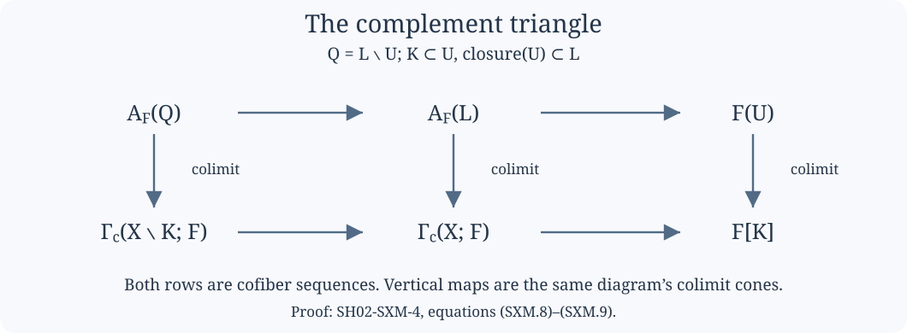

# Compact supports, covariant Verdier duality and modern composition

This lesson explains how proper direct image is constructed before comparing it
with classical derived sheaf operations. The coefficient category
\(\mathcal C\) is stable and has all small limits and colimits. The space is
locally compact Hausdorff. No countable exhaustion, finite dimension,
constructibility, perfection, or hypothesis that \(\mathcal C^{\mathrm{op}}\)
is presentable is required for the construction below.

There are two levels of coefficients in the lesson. The compact-support
construction works in this general \(\mathcal C\). The bounded classical
comparison subsequently specializes to
\(\mathcal C=D_\infty(k)\), for a commutative unital ring \(k\).
The [coefficient comparison](../derived-module-coefficients.html) and [bounded section recognition](../bounded-section-recognition.html) give the separate algebraic and sheaf-theoretic proofs at that second level.

*Written by GPT-6.1 Sol (OpenAI). Self-checked by the writing AI. CC0 1.0.*

The exposition is independently written and dedicated to CC0. Its mathematical
sources are Jacob Lurie's *Higher Topos Theory*, Theorem 7.3.4.9; *Higher
Algebra*, Section 5.5.5; and Marco Volpe's *The six operations in topology*,
published version, Sections 5.1 and 6.1. The proof below orders the construction
around a complement calculation, so that its maps can be followed without
choosing a compactification first.

## SH02-SXM-0 — The categorical floor {#SH02-SXM-0}

Limits, colimits, Kan extensions and their universal properties are taken in
infinity-categories. A sheaf means ordinary covering descent, and a cosheaf
means the corresponding colimit condition. A cosheaf with values in
\(\mathcal C\) is equivalently the opposite of a sheaf with values in
\(\mathcal C^{\mathrm{op}}\).

We will repeatedly use three basic rules. Limits commute with limits; colimits
commute with colimits; and a functor between stable categories that preserves
colimits preserves finite limits. For the last rule, the zero object and finite
coproducts are preserved, finite coproducts equal finite products, and a
pullback square is a pushout square. Consequently filtered colimits are exact
both in \(\mathcal C\) and in its opposite.

Here is the particular cofinality test needed below. In a partially ordered
indexing set, if every required object has an enlargement in a proposed
subposet and any finite collection of such enlargements has a common further
enlargement, the relevant comma poset is nonempty and filtered. Its nerve is
contractible: every map from a finite simplicial set uses finitely many
objects and is coned off by an upper bound. The cofinality theorem then permits
the replacement of the indexing set. For inverse systems, apply the same rule
to the opposite poset. The general infinity-categorical cofinality theorem is
part of this categorical floor; the topological comma-poset checks are given
each time it is used.

## SH02-SXM-1 — Compact neighborhoods and finite refinements {#SH02-SXM-1}

Write \(K\Subset L\) when the compact set \(L\) contains an open
neighborhood of the compact set \(K\). Every compact subset of an open
\(U\) has a compact neighborhood contained in \(U\). Indeed, choose
relatively compact neighborhoods of its points with closures in \(U\), take
a finite subcover, and take the union of the closures.

Several consequences fix all the indexing arguments.

* Compact subsets of an open set form a filtered poset under finite unions.
* Open neighborhoods of a compact set form a filtered poset when ordered by
  reverse inclusion. Relatively compact neighborhoods are cofinal in it.
* The compact neighborhoods of a compact set are also filtered under reverse
  inclusion. Intersect finitely many of their interiors and choose a compact
  neighborhood inside that intersection.
* A compact set covered by open sets has a finite compact cover subordinate to
  that open cover, by the same shrinking construction.

We also need one refinement for intersections. If \(W\) is an open
neighborhood of \(K\cap L\), there are neighborhoods \(U\supset K\)
and \(V\supset L\) with \(U\cap V\subset W\). The disjoint compact
sets \(K\setminus W\) and \(L\setminus W\) have disjoint open
neighborhoods in a Hausdorff space: separate each pair of points and take
finite subcovers twice. Adjoin \(W\) to these two neighborhoods. Their
intersection is contained in \(W\). This uses compactness and Hausdorffness,
not normality of the entire noncompact space.

## SH02-SXM-2 — Recovering a sheaf from compact restrictions {#SH02-SXM-2}

For a sheaf \(F\), define its value on a compact set by

\[
F[K]=\operatorname*{colim}_{U\supset K}F(U),
\tag{SXM.1}
\]

where neighborhoods are ordered by reverse inclusion. The maps are actual
restriction maps. These compact values have the following properties:

\[
\begin{gathered}
F[\varnothing]=0,\\
F[K\cup L]\simeq F[K]\times_{F[K\cap L]}F[L],\\
F[K]\simeq\operatorname*{colim}_{K\Subset L}F[L].
\end{gathered}
\tag{SXM.2}
\]

For the first equality, the empty neighborhood is a final indexing object.
For the second, apply open two-set descent to neighborhoods of \(K\) and
\(L\), then take their filtered colimit. The intersection refinement in
SXM-1 shows that the intersections are cofinal among neighborhoods of
\(K\cap L\); unions are cofinal among neighborhoods of \(K\cup L\).
Filtered exactness permits taking the pullback after this colimit. For the
third equality, between \(K\) and any neighborhood \(U\) insert a compact
neighborhood \(L\subset U\). Choices admit common smaller neighborhoods.
The two neighborhood diagrams therefore have the same colimit.

Conversely, suppose \(H\) is a contravariant functor on compact sets
satisfying (SXM.2). Define

\[
\Psi H(U)=\operatorname*{lim}_{K\subset U}H(K).
\tag{SXM.3}
\]

We explain why this is a sheaf, including the finite-to-arbitrary-cover step.
First fix a compact \(K\) and an open cover \(\mathcal W\) of it. Let
\(\mathcal K_{\mathcal W}(K)\) consist of compact subsets of \(K\)
contained in one member of the cover. Then

\[
H(K)\simeq
\operatorname*{lim}_{J\in\mathcal K_{\mathcal W}(K)^{\mathrm{op}}}H(J).
\tag{SXM.4}
\]

To verify this assertion, first use a two-set cover. Choose a compact
decomposition \(K=K_1\cup K_2\) subordinate to it. On the subposet of
compacts contained in \(K_1\) or \(K_2\), the limit is the pullback of
\(H(K_1)\) and \(H(K_2)\) over \(H(K_1\cap K_2)\). This follows by
restricting to the two downward closed subposets, each with its maximal
object, and their intersection. The pullback is \(H(K)\) by (SXM.2).
Compact decompositions subordinate to the same two-set cover are filtered
under componentwise unions. Any finite collection of subordinate compact
subsets is included in one such decomposition: adjoin those subsets to its
appropriate component. Thus their union accounts for the entire subordinate
poset, and the compatible constant limit cones all have vertex \(H(K)\).
Limits of these compatible cones are still that cone, since the refinement
poset has contractible nerve. This proves the two-set case.

For a finite cover, separate its first member from the union of the remaining
members. Apply the two-set calculation and then induction on the remaining
members and on the intersection with the first. An arbitrary cover reduces
to a finite subcover of \(K\). Extra cover members do not change the limit:
their intersections with that finite cover satisfy the same calculation.
This proves (SXM.4).

Now let \(\mathcal W\) be a covering sieve of an open \(U\). For each
compact \(K\subset U\), the sieve covers \(K\); (SXM.4) reconstructs
its value from compacts subordinate to the sieve. Taking the limit over
\(K\subset U\) gives the same diagram as first taking the compact limits
on each open member of the sieve and then taking the sieve limit. One may
check this through the mixed poset of open members and their compact subsets:
the comma posets of choices of a containing open member are filtered under
finite intersection, and the subordinate compact diagrams are exactly those
in (SXM.4). Transitivity of right Kan extension, equivalently the universal
property of iterated limits, identifies the two limits. Hence (SXM.3)
satisfies covering descent.

The two constructions are inverse, with the following explicit maps. For an original sheaf \(F\), set \(L_U=\lim_{K\subset U}F[K]\). Restriction gives \(F(U)\to L_U\). For every relatively compact open \(V\) whose closure is contained in \(U\), projection to \(F[\overline V]\), followed by restriction of every neighborhood of \(\overline V\) to \(V\), gives \(L_U\to F(V)\). These maps form a restriction-compatible cone. Such opens form a covering sieve of \(U\), so descent gives \(L_U\to F(U)\). Its composite on \(F(U)\) is the usual restriction cone and hence the identity. To check the other composite on a compact \(K\subset U\), choose \(K\subset V\subset\overline V\subset U\). The map \(F[\overline V]\to F[K]\) factors through \(F(V)\), because every neighborhood of \(\overline V\) contains \(V\), a neighborhood of \(K\). The compact-limit cone therefore makes this composite the original projection to \(F[K]\). This proves the other identity, on all compact projections.

For an original compact functor \(H\), put \(B(U)=\lim_{J\subset U}H(J)\). Projection gives \(\operatorname{colim}_{U\supset K}B(U)\to H(K)\). Its inverse uses the continuity \(H(K)=\operatorname{colim}_{K\Subset L}H(L)\): every \(H(L)\) has its restriction cone to \(B(\operatorname{Int}L)\), and \(\operatorname{Int}L\) is a neighborhood of \(K\). The first composite on \(H(L)\) is exactly restriction to \(H(K)\), so is the identity after this compact-neighborhood colimit. For the other composite, start at \(B(U)\) and insert a compact neighborhood \(K\subset\operatorname{Int}L\subset L\subset U\). The map through \(H(L)\) to \(B(\operatorname{Int}L)\) is the restriction of the original compact-limit cone. It is thus the original map from \(B(U)\) in the neighborhood colimit. These choices admit common smaller compact neighborhoods, by SXM-1; their filtered choice posets are contractible. The comparisons are consequently coherent natural maps, and these cone equalities are equalities of the resulting infinity-categorical maps. No arbitrary colimit is interchanged with an infinite limit. We have proved the compact-presentation equivalence

\[
\operatorname{Shv}(X;\mathcal C)
\simeq\operatorname{Shv}_{\mathcal K}(X;\mathcal C).
\tag{SXM.5}
\]

Applying the same proof in \(\mathcal C^{\mathrm{op}}\) gives compact
presentations of cosheaves. A compact cosheaf is covariant, takes the empty
set to zero, takes finite compact unions to pushouts, and satisfies
\(G(K)\simeq\lim_{K\Subset L}G(L)\). Its open value is
\(\operatorname*{colim}_{K\subset U}G(K)\).

## SH02-SXM-3 — Support fibres form a compact cosheaf {#SH02-SXM-3}

For a compact \(K\), put

\[
A_F(K)=\operatorname{fib}\bigl(F(X)\longrightarrow F(X\setminus K)\bigr).
\tag{SXM.6}
\]

If \(K\subset U\) with \(U\) open, descent for
\(X=U\cup(X\setminus K)\) identifies this fibre with
\(\operatorname{fib}(F(U)\to F(U\setminus K))\). This is support
excision, and it fixes the identification on maps.

The empty support gives zero. For two supports \(K,L\), the square with
vertices \(A_F(K\cap L),A_F(K),A_F(L),A_F(K\cup L)\) is a pullback:
take the fibre of the map from the constant \(F(X)\)-square to the descent
square of their complements. Stability makes it a pushout as well.

Finally the complements \(X\setminus L\), for compact neighborhoods
\(K\Subset L\), increase to \(X\setminus K\). They form a covering
family closed under finite intersection after refinement. Descent gives

\[
F(X\setminus K)\simeq\operatorname*{lim}_{K\Subset L}F(X\setminus L).
\]

The same indexing nerve is contractible, so the limit of the constant
\(F(X)\)-diagram is \(F(X)\). Fibres commute with limits. Therefore
\(A_F(K)\simeq\lim_{K\Subset L}A_F(L)\). These are exactly the compact
cosheaf conditions. By (SXM.5),

\[
\mathbb V_XF(U)=\operatorname*{colim}_{K\subset U}A_F(K)
=\Gamma_c(U;F)
\tag{SXM.7}
\]

defines a cosheaf. All arrows arise from restriction and the universal fibre
maps; the construction acts on natural transformations as well as objects.

## SH02-SXM-4 — The complement calculation {#SH02-SXM-4}

The calculation that recovers the original sheaf is

\[
\Gamma_c(X\setminus K;F)\longrightarrow\Gamma_c(X;F)
\longrightarrow F[K].
\tag{SXM.8}
\]

It is a natural cofiber sequence. We give the compact-index argument rather
than interchange an arbitrary infinite limit with a filtered colimit.

<figure style="margin:1.2em 0">
<picture>
<source media="(max-width: 600px)" srcset="../figures/covariant-verdier-support-mobile.svg">

</picture>
<figcaption>The arrows are the actual maps in (SXM.8)–(SXM.9). The wide
diagram has cofiber sequences across each row; the portrait version has
the same sequences down each column. Its remaining arrows are compact
support inclusions and the neighborhood-colimit map. This is a diagram
of morphisms, with no geometric scale asserted. The proof is SH02-SXM-4;
the mathematical references are Lurie, Section 5.5.5, and Volpe,
Theorem 5.10, as credited below.</figcaption>
</figure>

The [reproducible figure source](../figures/draw_support_diagram.py) retains the same maps in both arrangements.

Choose a relatively compact open neighborhood \(U\) of \(K\), and a
compact \(L\supset\overline U\). Set \(Q=L\setminus U\). There is a
cofiber sequence of support fibres

\[
A_F(Q)\longrightarrow A_F(L)\longrightarrow F(U).
\tag{SXM.9}
\]

Indeed, the fibre-of-a-composite triangle identifies its third term with
\(\operatorname{fib}(F(X\setminus Q)\to F(X\setminus L))\).
But \(X\setminus Q=(X\setminus L)\amalg U\), a disjoint union of
open sets. Descent identifies this last fibre with \(F(U)\). This
identification proves (SXM.9), including the restriction map to \(F(U)\).

Order pairs \((U,L)\) by shrinking \(U\) and enlarging \(L\). They
form a filtered poset: intersect the two neighborhoods and then choose a
smaller relatively compact neighborhood of \(K\); enlarge the two compact
sets by their union and the new closure. The support \(L\setminus U\)
then enlarges. Taking this filtered colimit in (SXM.9) is exact.

Its middle term is \(\Gamma_c(X;F)\): every compact set is included in
one of the chosen \(L\)'s, and any finite number of such choices has a common
refinement. Its last term is \(F[K]\): relatively compact neighborhoods
are cofinal among neighborhoods of \(K\), and compact \(L\)'s containing
their closures have contractible choice posets.

Its first term is \(\Gamma_c(X\setminus K;F)\). To check this explicitly,
let \(J\subset X\setminus K\) be compact. Choose \(U\supset K\)
with compact closure disjoint from \(J\), and then let \(L\) contain
\(J\cup\overline U\). Thus \(J\subset L\setminus U\). For finitely
many \(J\)'s, perform this construction with their union. The relevant
comma posets are filtered by the same shrinking/enlarging operation. This is
the required cofinality, and proves (SXM.8). Boundary points of \(U\) cause
no omission: the final indexing set is all compacts outside \(K\), not just
compacts outside one fixed neighborhood closure.

## SH02-SXM-5 — The covariant Verdier equivalence {#SH02-SXM-5}

For a cosheaf \(G\), take the opposite of the support-fibre construction
in \(\mathcal C^{\mathrm{op}}\). On compact sets the resulting sheaf has
value

\[
\mathbb W_XG[K]=\operatorname{cofib}
\bigl(G(X\setminus K)\longrightarrow G(X)\bigr);
\tag{SXM.10}
\]

recover its open values by the compact limit (SXM.3). The argument in SXM-3,
applied in the opposite category, proves that these are compact sheaf values.

Equation (SXM.8) gives a natural equivalence
\(\mathbb W_X\mathbb V_XF[K]\simeq F[K]\). Compact presentation then
gives \(\mathbb W_X\mathbb V_X\simeq\mathrm{id}\) on sheaves. Apply
the same calculation in the opposite category to obtain
\(\mathbb V_X\mathbb W_X\simeq\mathrm{id}\) on cosheaves. Thus

\[
\begin{gathered}
\mathbb V_X:\operatorname{Shv}(X;\mathcal C)\xrightarrow{\sim}\operatorname{CoShv}(X;\mathcal C),\\
\mathbb W_X\simeq\mathbb V_X^{-1}.
\end{gathered}
\tag{SXM.11}
\]

This is covariant Verdier duality. It does not apply an internal Hom to an
individual sheaf, require a dualizable stalk, or assert biduality for an
arbitrary module with respect to a dualizing complex. It converts restriction
fibres to compact-support cosheaves.

## SH02-SXM-6 — The composition maps {#SH02-SXM-6}

For a continuous \(f:X\to Y\), direct image of a cosheaf is

\[
(f_*^{\mathrm{co}}G)(V)=G(f^{-1}V).
\tag{SXM.12}
\]

It is a cosheaf because inverse images carry an open covering and all its
intersections to the corresponding covering and intersections of
\(f^{-1}V\). The two orders of precomposition agree for composable maps.

Define the modern proper direct image by conjugation:

\[
f_!^{\mathcal C}=\mathbb W_Y f_*^{\mathrm{co}}\mathbb V_X.
\tag{SXM.13}
\]

In particular it satisfies the actual compact-support characterization

\[
\Gamma_c(V;f_!^{\mathcal C}F)
\simeq\Gamma_c(f^{-1}V;F).
\tag{SXM.14}
\]

Choose the inverse equivalence data in (SXM.11) with their unit and counit.
For \(X\xrightarrow{g}Y\xrightarrow{f}Z\), the composition map is the
specific map

\[
\begin{aligned}
f_!^{\mathcal C}g_!^{\mathcal C}
&=\mathbb W_Zf_*^{\mathrm{co}}
  \mathbb V_Y\mathbb W_Yg_*^{\mathrm{co}}\mathbb V_X\\
&\longrightarrow
\mathbb W_Z f_*^{\mathrm{co}}g_*^{\mathrm{co}}\mathbb V_X
= (fg)_!^{\mathcal C}.
\end{aligned}
\tag{SXM.15}
\]

The arrow is the counit \(\mathbb V_Y\mathbb W_Y\to\mathrm{id}\)
whiskered by the displayed functors. It is an equivalence. The identity map
is the unit identification \(\mathbb W_X\mathbb V_X\simeq\mathrm{id}\).
For three maps, both associations remove the same two intervening
\(\mathbb V\mathbb W\) pairs. Naturality of the counit identifies the
two removals, and the triangle identities give the identity laws. This gives
the identity and triple-associativity comparisons used after passage to the
classical homotopy categories. In the infinity-categorical functor diagram,
transport along the equivalences supplies their coherent higher extensions;
this last transport is the formal equivalence-of-diagrams operation, not a
theorem about higher correspondences or a new six-functor black box.

## SH02-SXM-7 — Proper maps and open inclusions {#SH02-SXM-7}

There is a natural map \(f_!^{\mathcal C}F\to f_*F\). On compact-support
cosheaves, a support \(K\subset f^{-1}V\) gives a map

\[
\begin{gathered}
\operatorname{fib}(F(X)\to F(X\setminus K))\\
\longrightarrow\operatorname{fib}(F(X)\to F(X\setminus f^{-1}f(K))).
\end{gathered}
\tag{SXM.16}
\]

It is induced by restriction between the complements. The second fibre is
the support fibre of \(f_*F\) at the compact set \(f(K)\subset V\).
Take compact colimits, then apply \(\mathbb W_Y\). This fixes the natural
map to unrestricted direct image.

If \(f\) is proper, compact inverse images exist, and the sets
\(f^{-1}C\), \(C\subset V\) compact, are cofinal among compact
supports in \(f^{-1}V\): every support \(K\) is contained in
\(f^{-1}f(K)\). Finite unions give common refinements. Equation (SXM.16)
therefore induces an equivalence, and

\[
f_!^{\mathcal C}\simeq f_*\quad\text{for proper }f.
\tag{SXM.17}
\]

For an open inclusion \(j:U\hookrightarrow X\), support excision from
SXM-3 gives \(\mathbb V_Uj^*F\simeq j^*\mathbb V_XF\). On cosheaves,
direct image along \(j\) is left adjoint to restriction: this is the
opposite of the ordinary sheaf adjunction between restriction and direct
image. Transporting that adjunction gives

\[
j_!^{\mathcal C}\dashv j^*.
\tag{SXM.18}
\]

This identifies \(j_!^{\mathcal C}\) with open extension by zero, preserving
its unit. Combining (SXM.15), (SXM.17) and (SXM.18), any compactification
\(f=pj\), with \(j\) open and \(p\) proper, gives

\[
f_!^{\mathcal C}\simeq p_*j_!.
\tag{SXM.19}
\]

Its maps are the compact-support construction's maps. A different
compactification changes the model, not the operation defined in (SXM.13).

## SH02-SXM-8 — The bounded comparison {#SH02-SXM-8}

For \(\mathcal C=D_\infty(k)\), a bounded-below injective resolution
\(K\to I^\bullet\) defines the section functor

\[
T_XK(U)=\Gamma(U;I^\bullet)=R\Gamma(U;K).
\tag{SXM.20}
\]

This already specifies morphisms: use chain maps into injective resolutions,
including their homotopies and the mapping-complex enhancement. The following
descent calculation explains why the values define ordinary spectral sheaves.

For an injective module sheaf \(I\), the discrete Eilenberg–Mac Lane
presheaf \(U\mapsto I(U)\) satisfies spectral covering descent. Given an
open covering, form the augmented chain complex of free module sheaves on
its finite intersections. At a point, choose one covering member containing
that point and insert its index into each tuple. The alternating Čech
differential and this insertion satisfy \(dh+hd=1\), so the augmented
complex is stalkwise split exact. Applying \(\operatorname{Hom}(-,I)\)
is exact because \(I\) is injective. Its resulting augmented Čech
cochain complex is therefore exact. The totalization of its discrete
Eilenberg–Mac Lane spectra has precisely this cochain complex's cohomology,
and the descent map is an equivalence.

For a covering sieve, pass to the intersection diagram of its covering
members. At any member of the sieve, the category of choices of a covering
factor is nonempty; its finite strings form the simplex category of a
contractible indiscrete groupoid. This is the cofinality check that reduces
sieve descent to the Čech calculation. Restriction of \(I\) to an open is
injective since its left adjoint, open extension by zero, is exact, so the
same proof applies on every open.

For a bounded-below complex of injectives, totalize this argument degree by
degree. In a fixed total cohomological degree, the complex degree has a fixed
lower bound and the Čech degree is nonnegative, so only finitely many
bidegrees contribute. The augmented exact calculation therefore proves
descent for (SXM.20). Its stalk is the original stalk complex, since filtered
colimits of modules are exact. All section complexes have the same lower
bound as \(I^\bullet\).

[Bounded section recognition from injective mapping complexes](../bounded-section-recognition.html) proves that this functor is fully faithful and identifies its essential image with the objects having one lower section bound on every open. The proof gives bounded stalk detection, spectral Ext into every heart injective, inverse limits of finite injective mapping complexes, and the explicit telescope for its essential image. The categorical floor is the ordinary module-sheaf t-structure, sheafification and the enhanced complex model stated there. Its human antecedent is *Derived Algebraic Geometry VIII*, Proposition 2.1.8. No fixed-stratification constructible realization is used for this all-module statement.

[Derived module coefficients and their spectrum model](../derived-module-coefficients.html) proves the symmetric monoidal coefficient equivalence for every commutative unital ring. Its unit-cell construction and bar evaluation specify the comparison, independently of finite global dimension. Its human antecedent is *Higher Algebra*, Theorem 7.1.2.13. These two proofs concern different categories and supply the respective comparisons used next.

## SH02-SXM-9 — Returning to the actual classical maps {#SH02-SXM-9}

With the preceding bounded-recognition and coefficient comparisons,
\(T_X\) identifies ordinary pullback, unrestricted direct image and open
extension with their classical bounded-below versions. Pushforward is
checked on each open by (SXM.20); pullback and open extension have their
specified stalk maps and retain a uniform lower section bound. Bounded
recognition permits those stalk comparisons; an unrestricted stalkwise
Whitehead theorem for non-hypercomplete sheaves is not used.

The independently proved classical compactification calculation in
[Proper supports and the bounded classical comparison](../../sheaf-proof-readings/SH02-six-operations-import-bridge.html)
gives \(Rf_!=Rp_*j_!\) on \(D^+\). Equation (SXM.19) now gives

\[
T_YRf_!K\simeq f_!^{D_\infty(k)}T_XK.
\tag{SXM.21}
\]

For an injective sheaf \(I\), first use this equation for \(g\) and then
for \(f\). Together with (SXM.15) it identifies
\(Rf_!(g_!I)\) with \((fg)_!I\) in degree zero. Thus \(g_!I\) is
\(f_!\)-acyclic. The normalized classical composition comparison is
therefore the acyclic-resolution comparison, and its section map is the
successive direct image of the same properly supported section. The proof
does not deduce acyclicity from a pasting theorem that assumes it.

[Proper-support composition through a change of base](../six-operation-pasting.html)
then proves the mixed pasting equation for the actual classical derived
maps, preserving the pullback resolution comparisons on the primed side.
That proof remains applicable without any finite dimension or tensor
hypothesis. The present lesson supplies the modern compact-support and
composition construction behind its reference input.

Modern proper base change and the modern external-product/projection
theorems have their own proofs and hypotheses; (SXM.15) does not establish
them. The original bridge's exact Volpe Proposition 6.9 and Propositions
6.13–6.14 imports remain identified. For arbitrary bounded-below tensor
factors the bridge still assumes finite global dimension of \(k\).
Similarly, a classical \(D^+\)-valued exceptional adjoint still requires
the separate finite integral cohomological-dimension condition. Neither
condition is removed by covariant Verdier duality.

## SH02-SXM-10 — Exercises with solutions {#SH02-SXM-10}

**Exercise 1.** For an infinite discrete space \(X\), compute
\(\mathbb V_XF(X)\), and compare the proper and unrestricted direct images
to a point.

**Solution.** A compact subset is finite, and (SXM.6) for a finite set
\(K\) is the finite direct sum of the values at its points. Their filtered
colimit is \(\bigoplus_{x\in X}F_x\). Unrestricted sections are
\(\prod_{x\in X}F_x\). Equation (SXM.16) is the canonical inclusion of
finite-support families; for \(F_x=k\ne0\), the everywhere-one family
belongs only to the product. This checks the support normalization.

**Exercise 2.** Explain exactly where replacing \(\mathcal C^{\mathrm{op}}\)
by a presentable category would restrict the argument unnecessarily.

**Solution.** The compact-presentation argument needs its small limits and
colimits and exact filtered colimits. Stability and bicompleteness provide
all three in the opposite category. No presentable adjoint functor theorem
was used to construct \(\mathbb V\), \(\mathbb W\), or composition.
One must examine the existence of general pullbacks and exceptional right
adjoints separately if they are requested for nonpresentable coefficients.

**Exercise 3.** In (SXM.8), why can one shrink neighborhoods of \(K\)
instead of selecting a sequence of neighborhoods?

**Solution.** Each compact \(J\subset X\setminus K\) is disjoint from
one suitable relatively compact neighborhood of \(K\), and any finite
collection of \(J\)'s is handled by its union. These filtered comma-poset
checks give cofinality. They require neither a countable neighborhood basis
nor a sequential exhaustion, so the proof covers nonmetrizable spaces.

## SH02-SXM-SOURCES — Exact versions and mathematical credits {#SH02-SXM-SOURCES}

* Jacob Lurie, [*Higher Topos Theory*](https://www.math.ias.edu/~lurie/papers/HTT.pdf),
  author-hosted 949-page copy carrying the 2009 publication identity,
  Lemma 7.3.4.8 and Theorem 7.3.4.9, printed pages 770–773
  (PDF pages 788–791): compact restrictions and open descent.
* Jacob Lurie, [*Higher Algebra*](https://www.math.ias.edu/~lurie/papers/HA.pdf),
  September 18, 2017, Lemma 5.5.5.3 and Section 5.5.5, PDF pages
  992–994: the stable bicomplete compact-presentation and covariant-duality
  scope. Section 1.3.3 and Theorem 7.1.2.13 have the separate recognition
  and coefficient roles specified in SXM-8.
* Jacob Lurie, [*Derived Algebraic Geometry VIII*](https://www.math.ias.edu/~lurie/papers/DAG-VIII.pdf),
  November 5, 2011, Proposition 2.1.8 and Lemmas 2.1.9–2.1.10,
  PDF pages 32–35: the bounded all-module recognition theorem and its
  injective descent calculation. The reference to Lemma 2.1.10 inside that
  lemma's slice-exactness argument is read as the preceding Lemma 2.1.9.
* Marco Volpe, [*The six operations in topology*](https://doi.org/10.1112/topo.70050),
  *Journal of Topology* 18(4) (2025), e70050, [published institutional
  edition](https://epub.uni-regensburg.de/78207/), PDF pages 40–45 and 48–56:
  compact-support duality, proper/open comparisons and composition. This
  source's CC BY 4.0 terms apply to the source edition; the new independent
  text above is CC0 and includes no source prose, PDF pages or source diagrams.
