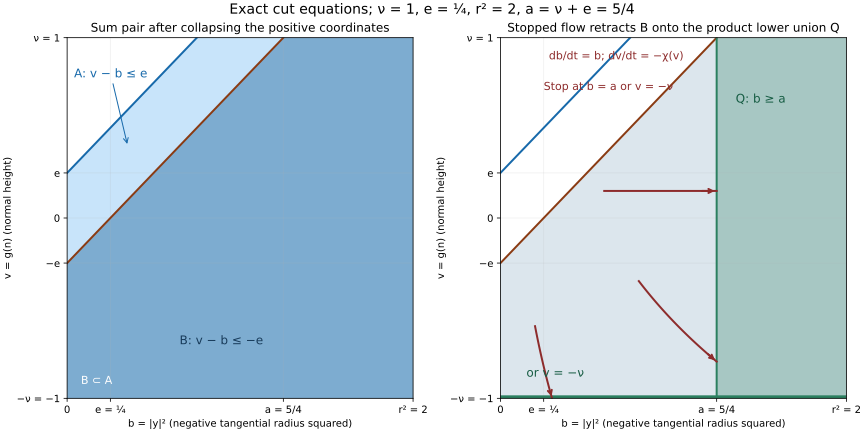
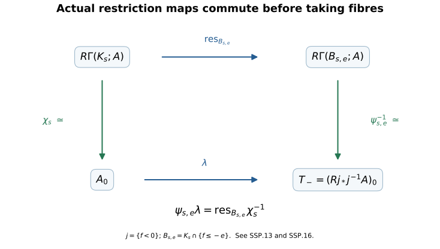
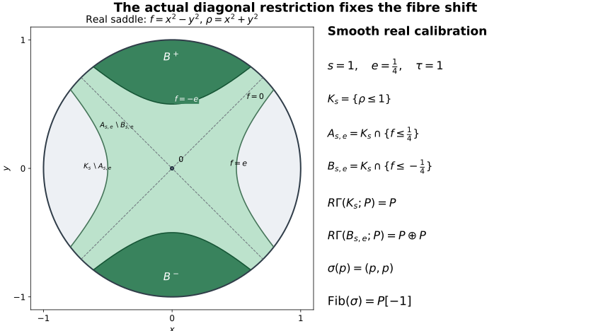
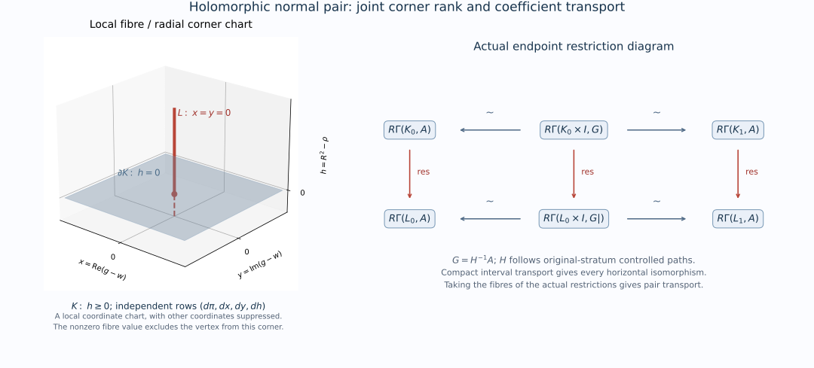
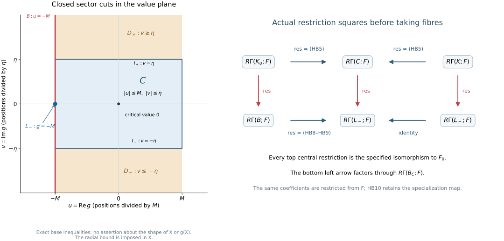
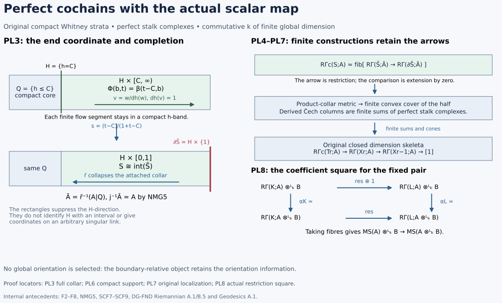
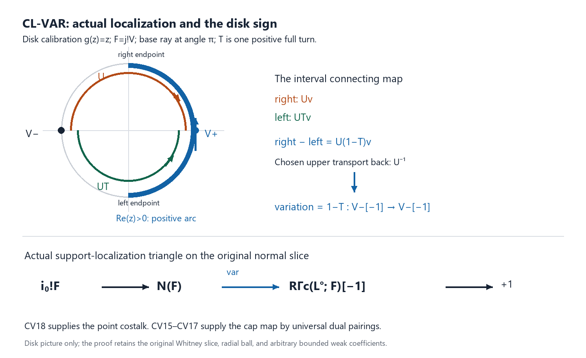
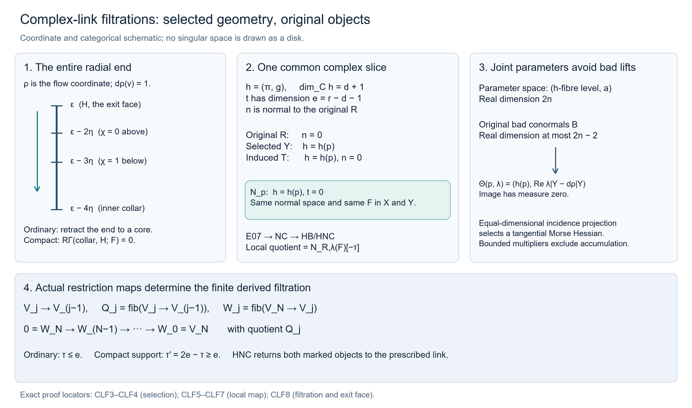
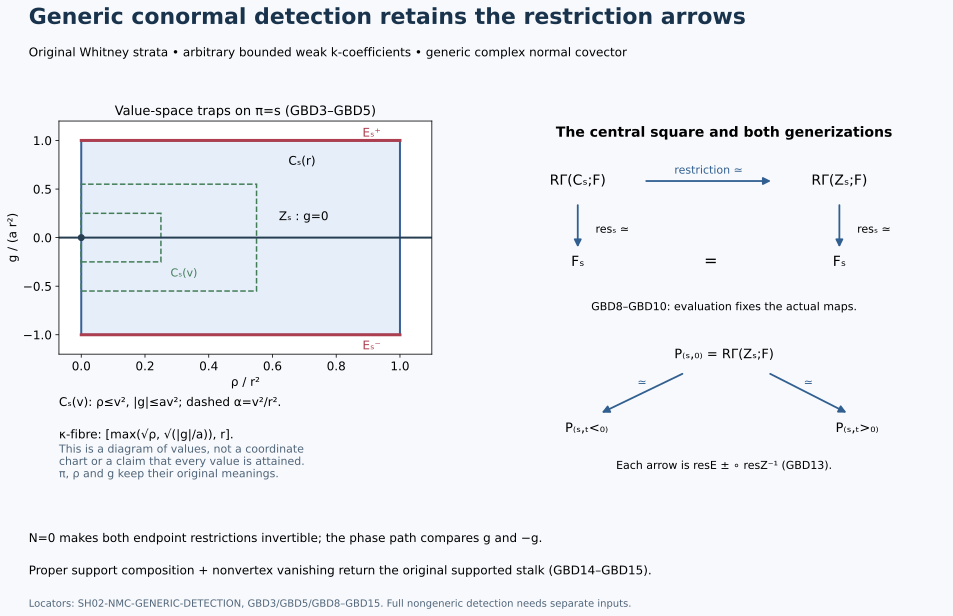

# SH02-NMC-UNIT — Normal Morse data and change of coefficients

Proof draft, independently reviewed at the scope stated here. The coefficient argument below supplies the normal-Morse input used by the [finite holomorphic map proof](../finite-holomorphic-microsupport.html#sh02-fh-normal-morse-input-coefficient-compatible-visible-conormals). The original real-pair, supported-stalk, choice-continuation and holomorphic-pair comparisons are proved internally below. The original complex-link filtrations and normal-Morse degree characterization are proved below at their explicit analytic provider scope. Full nongeneric detection and compatible triangulation retain their separate proof scopes.

Let $X$ be a complex analytic manifold, or a closed analytic subset of a complex manifold $M$, and let $A$ be a bounded complex of sheaves of $k$-modules on $X$. In the manifold case take $M=X$. For a closed analytic embedding $i:X\hookrightarrow M$, every microsupport in the statement means the microsupport of $i_*A$ in $T^*M$. All manifolds have finite dimension, are Hausdorff and are countable at infinity. Fix a locally finite complex analytic Whitney stratification on which every cohomology sheaf of $A$ is locally constant. The coefficient ring $k$ can be any commutative ring with identity for the comparison with underlying abelian sheaves below. For the full statement used in the finite-map lesson, assume that $k$ has finite global dimension and every stalk of $A$ is perfect over $k$. These assumptions are needed only for the subsequent boundedness and perfection conclusions. A perfect complex is represented by a bounded complex of finite projective modules.

## SH02-NMC-FORGET — Exact restriction of scalars

Write $U$ for the functor from sheaves of $k$-modules to sheaves of abelian groups. It is exact and conservative. Exactness can be checked on stalks, where it is exact restriction of scalars along $\mathbb Z\to k$; conservativity follows from the same observation. It commutes with inverse image, stalks, sections, products and restriction maps. Consequently it preserves finite sums, fibres and cones of complexes.

## SH02-NMC-DERIVED — Derived direct images on the same resolutions

Here is a derived justification that does not assume that an injective $k$-module is injective over $\mathbb Z$. Every injective sheaf of $k$-modules is flabby. For open inclusions $V\subset W$, extension of a section follows by applying injectivity to the monomorphism $k_V\to k_W$, with extension by zero interpreted on the ambient space. Flabbiness is a condition on the underlying restriction maps, so forgetting coefficients preserves it. Flabby sheaves are acyclic for sections on every open set, with the precise direct-image acyclicity argument given in the [coefficient bridge](../../sheaf-proof-readings/SH02-open-prerequisite-proofs.html#SH02-PRP-E5). An injective resolution over $k$, after forgetting, is therefore a resolution by sheaves acyclic for the section functors that compute a direct image. A bounded-below resolution suffices because $A$ is bounded.

It follows, with the usual comparison maps, that

$$
 U Rq_* A \simeq Rq_* U A,
 \qquad U R\Gamma(T;A)\simeq R\Gamma(T;UA).
 \tag{NMC1}
$$

For the second identity, $T$ can be any of the spaces used below, after restricting the sheaf to that space. For the first identity, $q$ is a continuous map between the relevant spaces. Each direct-image stalk is obtained from sections on inverse images of open sets, so the same resolution verifies the assertion. These comparisons preserve the adjunction units and restriction maps: all are computed by the original maps on the same underlying resolutions.

## SH02-NMC-SUPPORT — Supported tests and the actual restriction maps

For a closed set $Z$ and its open complement $j$, the local-support object is the fibre of $A\to Rj_*j^{-1}A$. Applying the preceding argument to that triangle gives

$$
 U R\Gamma_Z A\simeq R\Gamma_Z UA.
 \tag{NMC2}
$$

Similarly, a relative cohomology object is the fibre of the restriction from $K$ to $L$, and hence

$$
 U R\Gamma(K,L;A)\simeq R\Gamma(K,L;UA).
 \tag{NMC3}
$$

These are comparisons of the actual morphisms. They are not assertions that an arbitrary isomorphism of underlying abelian complexes lifts to an isomorphism of $k$-complexes. In particular, a $k$-linear comparison constructed by restriction, localization, inverse image, or a chosen geometric continuation is an isomorphism as soon as its underlying comparison is one. For chosen continuations, one retains the original zigzag of restriction and pullback maps and inverts only those maps proved to be isomorphisms. Their inverses remain $k$-linear.

Forgetting coefficients preserves weak constructibility on the fixed stratification: the same local trivializations of the cohomology sheaves are trivializations of the underlying abelian sheaves. It need not preserve finite generation. This distinction is why the weakly constructible versions of the source results are required.

The definition by supported local tests and NMC2 also give the exact equality

$$
 \operatorname{SS}_k(A)=\operatorname{SS}_{\mathbb Z}(UA).
 \tag{NMC4}
$$

Indeed each test object vanishes over $k$ if and only if its underlying abelian object vanishes, with the same neighborhoods, covectors and real test functions.

## SH02-NMC-PAIR — An actual compact normal pair

At a point $x$ of a connected stratum $S$, take a transverse complex normal slice $N$, of complex codimension $\dim S$. Choose a holomorphic germ $g$ with $g(x)=0$ whose differential at $x$ is a nondegenerate conormal for the fixed stratification. Here $dg_x$ annihilates $T_xS$ and does not vanish identically on any generalized tangent space of an incident higher stratum, as in [Maxim–Schürmann, Definition 3.9, p. 27](https://people.math.wisc.edu/~lmaxim/handbook.pdf#page=27). On the normal slice, $x$ is an isolated stratified critical point of $g$. For sufficiently small nested parameters, put

$$
 K=X\cap N\cap\{r\leq\epsilon\},
 \qquad L=K\cap\{g=w\},
 \qquad 0<|w|\ll\epsilon,
 \tag{NMC5}
$$

where $r$ is squared distance in local ambient coordinates. Shrink inside a relatively compact coordinate neighborhood. Both sets are compact, and $L$ is closed in $K$. The direction of $w$ and continuation paths are fixed once; no canonical trivialization of all possible choices is claimed.

The geometric inputs are stated in Maxim–Schürmann, *Constructible sheaf complexes in complex geometry and applications*: [Theorem 3.12, pp. 28–29](https://people.math.wisc.edu/~lmaxim/handbook.pdf#page=28), [Proposition 3.14, pp. 29–30](https://people.math.wisc.edu/~lmaxim/handbook.pdf#page=29), and [Proposition 4.11, Corollary 4.14 and Remark 4.18, pp. 65–66](https://people.math.wisc.edu/~lmaxim/handbook.pdf#page=65). These provide the normal slice, the small regular fibre with boundary, and the geometric comparison with the supported real test. Their [coefficient convention and Definition 2.2, p. 6](https://people.math.wisc.edu/~lmaxim/handbook.pdf#page=6), require a noetherian commutative coefficient ring of finite global dimension. The stated theorems apply to **weakly** constructible complexes, which may have infinitely generated stalk cohomology. Apply them with coefficient ring $\mathbb Z$ to $UA$. Thus no finite-generation condition on the underlying abelian stalks is introduced.

The maps in this local calculation are the restriction maps from the normal ball to its link and the maps from the localization triangle. Boundary regularity gives the geometric continuation between the negative real test region and the chosen regular fibre. Choose that continuation at the level of the fixed Whitney stratification and perform the restriction/pullback zigzag with $k$-sheaves. After applying $U$, it is the same zigzag appearing in the local calculation over $\mathbb Z$; its arrows that are inverted are isomorphisms there. NMC1–NMC3 therefore allow the same inversions over $k$. This gives

$$
 M_S(A):=R\Gamma(K,L;A)
 \simeq
 \bigl(R\Gamma_{\{\operatorname{Re}g\geq0\}}(A|_{X\cap N})\bigr)_x.
 \tag{NMC6}
$$

One can describe the restriction arrow in NMC6 without forgetting its provenance. Restriction from a small normal ball to its centre is an isomorphism; this small-radius stabilization holds after a compact local truncation, which supplies the needed properness. Invert this map in the derived category and then restrict from the ball to $L$. The resulting arrow is $A_x\to R\Gamma(L;A)$. Its fibre is the first normal-Morse triangle of Proposition 3.14, equation (27). This fixes the same shift as the supported-test definition: the normal pair computes the fibre, rather than the unshifted cone of the specialization arrow.

This invocation concerns an isolated critical point on a normal slice. It fixes a concrete local pair and its comparison maps. The stronger nonisolated critical-support theorem discussed in the finite-map lesson is a separate dependency.

## SH02-NMC-STABILITY — Small choices, continuation and the open stratum

The normal-pair geometry and the allowed ranges of radii are selected using the stratification, the normal slice and $g$. They are independent of the coefficients and of scalar extension. The normal-Morse continuation and invariance in Theorem 3.12(2), and the link invariance in Proposition 3.14, use the same kind of geometric maps. Applying the same $k$-linear construction and NMC1–NMC3 proves stability for sufficiently small parameters and invariance up to isomorphism under admissible choices and motion along a connected generic conormal component. No global choice of a trivialization of the Morse local system is needed.

For an open stratum the normal slice is a point, $L$ is empty, and $M_S(A)=A_x$. This also supplies the zero-section component. Empty data and the zero coefficient ring give zero objects throughout.

## The coordinates and the tangential shift

We supply the tangential calculation needed for the normal/tangential comparison. The geometric statement to be proved for a stratified space is [Maxim–Schürmann, Theorem 3.12, pp. 28–29](https://arxiv.org/pdf/2105.13069v2#page=28). Those pages state the comparison and refer to Goresky–MacPherson and Schürmann for its proof. The calculation below does not establish the stratified product theorem, admissible normal-slice continuation or the Milnor-pair comparison. It proves the coordinate and coefficient calculations that such a geometric comparison must use.

The smooth starting facts are Euclidean differentiation and integration, completeness and finite-dimensional real linear algebra. The [smooth contraction and inverse proof](../../sheaf-proof-readings/SH02-open-prerequisite-proofs.html#SH02-PRP-SMOOTH-CONTROL), SCF1–SCF3, supplies the real inverse theorem. The holomorphic coordinate proof, HC8–HC10, supplies its complex version. The sheaf calculations use bounded complexes over the course coefficient ring \(k\), a commutative ring of finite global dimension. Neither the modules nor their cohomology need be finitely generated, free, flat or perfect. In particular the calculations apply to arbitrary bounded complexes of abelian groups. Proper base change, the localization triangle, and the [Euclidean constant-coefficient and orientation calculation](../../sheaf-proof-readings/SH02-manifold-duality.html#SH02-MD-EUCLIDEAN) are the exact sheaf inputs. No constructible stratified homotopy theorem is assumed in the constant-coefficient argument.

### Splitting one nondegenerate coordinate

Let \(f\) be a smooth real function near \(0\in\mathbb R^n\), with \(df(0)=0\) and nonsingular symmetric Hessian \(H\). Subtract \(f(0)\). A nonsingular symmetric bilinear form has a vector \(v\) with \(H(v,v)\ne0\): otherwise polarization makes the whole form zero. A linear change of coordinates therefore arranges \(H_{11}\ne0\). Write the coordinates as \((z_1,z')\).

For completeness the needed implicit graph follows from the inverse theorem already proved. Apply it to
\((z_1,z')\mapsto(\partial_1f(z_1,z'),z')\); its differential at zero has invertible first diagonal entry \(H_{11}\) and an identity block. The inverse preserves the \(z'\) coordinate. On a small product neighbourhood the solutions of \(\partial_1f=0\) are consequently exactly \(z_1=h(z')\), with \(h\) smooth and \(h(0)=0\). For a holomorphic \(f\) use HC10 in precisely the same construction, obtaining a holomorphic \(h\).

Put \(t=z_1-h(z')\) and \(f_0(z')=f(h(z'),z')\). Twice applying the fundamental theorem along the real parameter segment gives

\[
f(h(z')+t,z')=f_0(z')+t^2a(t,z'),
\qquad
a(t,z')=\int_0^1(1-s)\,
\partial_{11}f(h(z')+st,z')\,ds,
\qquad a(0,0)=\tfrac12H_{11}.
\tag{TMC1}
\]

For the real function shrink the neighbourhood so that \(a\) has constant sign \(\sigma=\operatorname{sgn}H_{11}\). Then \(b=\sqrt{\sigma a}\) is positive and smooth. The coordinate \(u_1=t\,b(t,z')\) has nonzero \(t\) derivative at zero. Thus \((t,z')\mapsto(u_1,z')\) is a local smooth diffeomorphism and the first summand is \(\sigma u_1^2\). For the holomorphic function, \(a\) is holomorphic: integration over the fixed compact segment preserves holomorphy by the parameter-integral argument preceding HC5. Select one square root \(b_0\) of \(a(0,0)\ne0\). HC10 applied to \(b^2-a(t,z')=0\) gives the holomorphic root with value \(b_0\). HC8 makes the same coordinate map biholomorphic, and the summand is now \(u_1^2\). Selecting a local root does not assert a root on a punctured global domain.

The remaining critical point is still nondegenerate. Differentiating \(\partial_1f(h(z'),z')=0\) and then \(f_0\) at zero gives

\[
Dh(0)=-H_{11}^{-1}H_{1'},
\qquad
\operatorname{Hess}_0(f_0)
=H_{''}-H_{'1}H_{11}^{-1}H_{1'}.
\tag{TMC2}
\]

Here \(H_{1'}\) is a row and \(H_{'1}\) a column. If the displayed Schur complement killed a vector \(w\), then \((-H_{11}^{-1}H_{1'}w,w)\) would lie in the kernel of \(H\). Hence the complement is nonsingular. Also \(df_0(0)=0\), since both first derivatives of \(f\) vanish at zero.

Induction on \(n\) supplies the remaining coordinates. In the real case the completing-square congruence sends \(H\) to the block diagonal form with blocks \(H_{11}\) and its Schur complement. The maximum dimension of a subspace on which a real symmetric form is negative definite is invariant under an invertible coordinate map. For a diagonal form this dimension is exactly its number of negative entries: its negative-coordinate subspace attains that dimension, and any larger subspace meets the nonnegative-coordinate subspace. Thus the induction has exactly the Morse index \(\tau\) of the original Hessian as its number of negative signs. This proves the two coordinate statements, including their index:

\[
\begin{aligned}
f-f(0)&=|x|^2-|y|^2,
&x&\in\mathbb R^{n-\tau},\quad y\in\mathbb R^\tau,\\
F-F(0)&=\sum_{j=1}^d u_j^2,
&\operatorname{Re}(F-F(0))
&=\sum_{j=1}^d\bigl((\operatorname{Re}u_j)^2
-(\operatorname{Im}u_j)^2\bigr).
\end{aligned}
\tag{TMC3}
\]

The second line assumes a holomorphic germ on \(\mathbb C^d\) with vanishing first derivative and nonsingular complex Hessian. Its real Morse index is \(d\), not \(2d\). Dimension zero is the constant germ on a point, with index zero. These are statements on manifolds; no coordinate chart on a singular analytic space has been introduced.

### The actual supported cohomology map

Let \(P\in D^b(k)\) and let \(P_V\) be its constant complex on \(V=\mathbb R^p\times\mathbb R^\tau\). Write \(q(x,y)=|x|^2-|y|^2\) and choose the orientation of the negative \(y\) coordinates. The localization triangle identifies supported cohomology on an open ball \(B_R\) about zero with the fibre of the actual restriction
\(R\Gamma(B_R;P)\to R\Gamma(B_R\cap\{q<0\};P)\).

The homotopy \((x,y)\mapsto((1-s)x,y)\), \(0\le s\le1\), stays in the ball. If \(q<0\), decreasing \(|x|\) keeps \(q<0\). It is therefore a deformation of this pair onto
\((D_R^\circ,D_R^\circ\setminus\{0\})\) in the negative-coordinate space. When \(\tau=0\) the latter pair is a point and the empty set.

Here the induced maps on derived cohomology really are homotopy invariant. For any of these locally compact spaces \(T\), projection \(T\times[0,1]\to T\) is proper. Proper base change and constant-complex cohomology of the compact interval identify its unit \(P_T\to Rp_*P_{T\times[0,1]}\) with an isomorphism. Both endpoint restriction maps are its inverses. Pulling back along a homotopy therefore gives equal endpoint morphisms. Apply this on both members of the pair; the squares commute with restriction, so their fibres are inverse isomorphisms. This argument concerns constant coefficients on the specified spaces. It does not claim homotopy invariance for an arbitrary sheaf on a stratified space.

Excision and the Euclidean orientation calculation identify the fibre on the negative space with \(P[-\tau]\). The construction commutes with restriction to smaller balls: the same coordinate collapse commutes with those inclusions, and the local orientation generator at zero is the same. Such chart balls form a cofinal neighbourhood basis. Taking the stalk of the localization triangle therefore proves

\[
\bigl(R\Gamma_{\{q\ge0\}}P_V\bigr)_0
\simeq P[-\tau].
\tag{TMC4}
\]

The isomorphism is natural in \(P\). Reversing the selected negative orientation multiplies its generator by \(-1\), as in M6. It is not a canonical trivialization of a Morse orientation local system over an entire stratum.

### A compact pair with the same sign

Fix \(0<\varepsilon<R^2\). In these Morse coordinates take the actual compact sublevel pair

\[
\begin{aligned}
A_T&=\{(x,y): |x|^2+|y|^2\le R^2,\ q(x,y)\le\varepsilon\},\\
B_T&=\{(x,y): |x|^2+|y|^2\le R^2,\ q(x,y)\le-\varepsilon\},\\
R\Gamma(A_T,B_T;P)&=
\operatorname{fib}\bigl(R\Gamma(A_T;P)
\longrightarrow R\Gamma(B_T;P)\bigr)
\simeq P[-\tau].
\end{aligned}
\tag{TMC5}
\]

The same collapse of \(x\) preserves both inequalities: it decreases the total squared norm and \(q\). It gives a deformation of pairs onto the closed \(y\) disk \(D_R\) and its closed annulus
\(C=\{y:\sqrt\varepsilon\le|y|\le R\}\). For \(\tau=0\), \(D_R\) is a point and \(C\) is empty. The proper-interval argument just given applies, including the restriction arrow.

Let \(j:U=D_R\setminus C\hookrightarrow D_R\). The open-closed triangle
\(j_!P_U\to P_{D_R}\to P_C\to\) identifies the resulting fibre with \(R\Gamma(D_R;j_!P_U)\). Since the disk is compact this is \(R\Gamma_c(U;P)\). The open ball \(U\) has dimension \(\tau\), so M6 gives \(P[-\tau]\), using the same negative-coordinate orientation. This proves TMC5 as a statement about the map of complexes, not merely the ranks of their cohomology.

This compact pair is taken in the Morse coordinate chart. The lemma alone does not identify an arbitrary prescribed ambient radial boundary with this chart boundary, nor supply a stratified continuation between them.

### Relative coefficients on a genuine product

We also need the coefficient calculation before any geometric product is asserted. Let \(Y\) be locally compact Hausdorff, \(H\in D^b(k_Y)\), and let \(p_A:A_T\times Y\to Y\) and \(p_B:B_T\times Y\to Y\) be the compact-factor projections. Define
\(T_Y(H)=\operatorname{fib}(Rp_{A*}p_A^{-1}H\to Rp_{B*}p_B^{-1}H)\), using restriction to \(B_T\times Y\). Then the oriented pair gives a natural isomorphism

\[
H[-\tau]\xrightarrow{\sim}T_Y(H).
\tag{TMC6}
\]

Here is a construction and check of this morphism. The adjunction units and multiplication of coefficients give the projection morphisms
\(H\otimes_k^L Rp_{A*}k\to Rp_{A*}p_A^{-1}H\) and the analogous morphism for \(B_T\). They commute with restriction. Taking their fibres gives
\(H\otimes_k^L T_Y(k_Y)\to T_Y(H)\), since derived tensor is exact. Pull the relative orientation generator of TMC5 back from the point to \(Y\); proper base change identifies this with \(k_Y[-\tau]\simeq T_Y(k_Y)\).

Check the resulting morphism at a point \(y\in Y\). Proper base change identifies it with the coefficient morphism from the oriented constant pair to the same pair with value \(H_y\). Every collapse, interval unit and open-closed triangle used for TMC5 is natural in that coefficient complex. For an oriented open interval its compact-support generator comes from the difference map on the two endpoints, and replacing \(k\) by \(H_y\) gives that same map. Iterating the coordinate calculation gives the generator for the oriented open \(\tau\)-ball. Consequently this coefficient morphism is an isomorphism for every bounded \(H_y\), not only for a projective module. Conservativity of stalks proves TMC6. Only proper compact-factor base change was used; no nonproper fibre formula for an arbitrary sheaf was invoked.

Now let \((K,L)\) be a compact locally compact Hausdorff pair with \(L\) closed in \(K\), and let \(H\in D^b(k_K)\). Put \(\pi:A_T\times K\to K\) and use \(\pi^{-1}H\) as coefficients. There is an isomorphism, natural in \(H\) and in its restriction to \(L\),

\[
\begin{aligned}
&R\Gamma\bigl(A_T\times K,\,
(B_T\times K)\cup(A_T\times L);\pi^{-1}H\bigr)\\
&\hspace{3em}\simeq R\Gamma(K,L;H)[-\tau].
\end{aligned}
\tag{TMC7}
\]

To check the union and the arrows, form the square of restrictions from \(A_T\times K\) to \(B_T\times K\) and \(A_T\times L\), and then to \(B_T\times L\). For a union of two closed subsets the augmented sheaf sequence consists of the diagonal map into their direct sum followed by the difference of the restrictions to their intersection. It is exact on stalks: at the intersection it is \(H_x\to H_x\oplus H_x\to H_x\); elsewhere only the member containing the point contributes. Closed pushforward is exact, so this gives the corresponding derived Mayer–Vietoris triangle on their union. The relative complex for that union is therefore the total fibre of the square.

First take the fibre in the tangential direction. Proper base change identifies the square along \(L\hookrightarrow K\) with the restriction of TMC6, and applying derived global sections gives \(R\Gamma(K;H)[-\tau]\to R\Gamma(L;H|_L)[-\tau]\). Its fibre is the right side of TMC7. Taking fibres in this order preserves all restriction arrows. There is no exchange of two orientation factors or unrecorded tensor sign.

TMC7 is the algebraic consequence of a genuine product pair with the stated pulled-back coefficient object. To deduce the full normal/tangential theorem one still needs to construct the stratified local pair comparison and identify its coefficients with this pullback by the actual geometric maps. Whitney regularity, a claimed homeomorphism of underlying spaces, or an equality of Euler characteristics alone does not supply those two steps. Their proofs, and the comparison of the normal pair with a holomorphic Milnor fibre, remain the E07 geometric obligation. The computation above does not change that obligation to a special-case target.

### Solved checks of index, coefficients and degeneracy

For \(q=x^2-y^2\) on \(\mathbb R^2\) and any module \(M\) in degree zero, TMC4 and TMC5 give cohomology \(M\) in degree one and zero in every other degree. For \(q=x^2+y^2\) the index is zero, the negative set is empty and the local object is \(M\) in degree zero. For \(q=-x^2-y^2\) it is \(M[-2]\). Taking \(k=\mathbb Z\) and \(M=\mathbb Z/6\) checks that these assertions do not require free or field coefficients.

For \(F(z,w)=z^2+3zw+2w^2\), set \(u=z+\frac32w\) and \(v=\frac{i}{2}w\). Direct expansion gives \(F=u^2+v^2\), and the coordinate determinant is \(i/2\ne0\). The real part has index two, so its constant local supported object is \(P[-2]\), with the orientation of the two imaginary coordinates selected. The complex dimension here is two; a shift by four would be incorrect.

Nondegeneracy is essential. In a disk about zero, the negative set of \(\operatorname{Re}z^m\), \(m\ge1\), consists of exactly \(m\) sectors: its angular inequality is \(\cos(m\theta)<0\). Each sector is homeomorphic to \((0,R)\times(0,1)\) and hence has constant-complex cohomology \(P\). The disk has cohomology \(P\), and the restriction to these sectors is the diagonal. Ordering the sectors and subtracting the first entry from every other entry computes its fibre:

\[
\bigl(R\Gamma_{\{\operatorname{Re}z^m\ge0\}}P_{\mathbb C}\bigr)_0
\simeq
\operatorname{fib}\bigl(P\longrightarrow P^{\oplus m}\bigr)
\simeq P^{\oplus(m-1)}[-1].
\tag{TMC8}
\]

The sector restrictions commute with shrinking disks, so this computes the stalk, not only one disk's relative cohomology. For \(m=1\) the result is zero, as at a noncritical smooth test. For \(m=2\) it agrees with the holomorphic Morse index one. For \(m=3\) its two copies show why the degenerate Hessian cannot be assigned the nondegenerate Morse answer. Empty pairs, dimension zero and the zero coefficient complex are included throughout.

## The normal family and its coefficients

The product calculation TMC7 requires both a geometric product and its coefficient identification. We construct them for the embedded normal-band family. The construction supplies a necessary part of the local stratified Morse comparison. Its final comparison with the original Morse sublevel pair, and the further comparison with a holomorphic Milnor pair, still require the wall deformations specified at the end.

Work near a point \(0\) of a stratum \(S\) in a closed Whitney $(a,b)$-stratified subset \(Z\) of a smooth ambient manifold. Local finiteness permits a neighborhood meeting only \(S\) and its incident upper strata. Flatten \(S\) in coordinates \((s,w)\in\mathbb R^d\times\mathbb R^c\), set \(\pi(s,w)=s\) and \(\rho(s,w)=|w|^2\), and retain a closed coordinate box inside the ambient chart. The given test \(f\) is smooth, \(f(0)=0\), and \(f|_S=q\) has a nondegenerate critical point at zero. TMC1–TMC3 give coordinates on \(S\) in which \(q\) is its exact signed quadratic form; extending those coordinates normally gives the chart just chosen. Assume that \(df(0)\) is nonzero on every limiting tangent plane of an incident upper stratum at zero. It annihilates \(T_0S\). This is the generic normal-covector hypothesis used below.

For the uniform assertions one may also use a smooth family \(f_\lambda\), with parameter in a compact subset of a finite-dimensional smooth manifold, defined on a common chart, satisfying \(f_\lambda|_S=q\) and the same generic condition for every parameter. Smoothness means extension to a neighborhood of that compact parameter set. Write \(g_\lambda=f_\lambda-q\circ\pi\). No analyticity, triangulation or finite generation of coefficients enters this family construction.

### Stable tangent kernels and a uniform normal collar

We first justify intersections of limiting tangent planes. Give the ambient vector space its Euclidean metric. If fixed-dimensional planes \(L_j\) converge to \(L\), and row maps \(A_j\) converge to \(A\) with \(A|_L\) surjective, then for all sufficiently large \(j\) the orthogonal projector onto their restricted kernel is

\[
\Pi_{L_j\cap\ker A_j}
=\Pi_{L_j}
-\Pi_{L_j}A_j^*
 (A_j\Pi_{L_j}A_j^*)^{-1}A_j\Pi_{L_j}.
\tag{NMG1}
\]

The matrix in parentheses is positive definite: its quadratic form at a nonzero row vector is the squared norm of its pullback to \(L_j\). Surjectivity and continuity make its smallest eigenvalue positive near the limit. The displayed operator kills \(A_j\), is the identity on \(L_j\cap\ker A_j\), is self-adjoint, and kills the orthogonal complement of that kernel in \(L_j\). Thus it is the required projector and converges to the corresponding projector at the limit. The case of no rows gives \(\Pi_{L_j}\). This proves the kernel continuity needed here, rather than assuming that intersections always commute with plane limits.

For every upper limiting plane \(L\) at zero, Whitney $(a)$ gives \(\mathbb R^d\times\{0\}\subset L\). If a linear combination of the rows \(d\pi,df_\lambda\) vanishes on \(L\), restriction to this horizontal subspace makes its \(d\pi\) coefficients zero; the generic normal hypothesis then makes the remaining coefficient zero. These rows therefore have rank \(d+1\). A sequence of rank failures arbitrarily near zero would, after selecting one of the finitely many upper strata and convergent tangent planes and parameters, contradict this rank at the limit. The same compactness argument applied to the smallest singular value gives a positive common rank margin on all upper strata in a smaller box. Row subtraction replaces \(df_\lambda\) with \(dg_\lambda\), preserving rank and a possibly smaller positive margin.

Shrink to a small compact base ball \(C\subset S\) and a normal disk whose closed product is inside this box. Consequently the vertical tangent planes \(V_z=T_zT\cap\ker d\pi\) have constant rank on each upper stratum \(T\). Their limits at lower points are calculated by NMG1. The norm of the projection of \(\nabla g_\lambda\) to \(V_z\) is bounded below by a positive constant. One way to verify this last consequence is to assume the contrary: along a convergent sequence NMG1 would give a limiting restricted kernel on which \(dg_\lambda\) vanishes, contradicting the full rank of \((d\pi,dg_\lambda)\) on that limiting plane.

Let \(z_j=(s_j,w_j)\) approach \((s_\infty,0)\) with \(s_j\in C\) and \(t_j=|w_j|\to0\). The unit secants \(e_j=(0,w_j/t_j)\) have a subsequential limit \(e\). Whitney $(b)$, using the lower points \((s_j,0)\), puts \(e\) in the limiting upper tangent plane. It is vertical, so NMG1 puts it in the limiting vertical plane \(V\). In particular \(\Pi_{V_{z_j}}e_j\to e\) and has norm tending to one. This proves that \(d\rho|_{V_z}\ne0\) for all sufficiently small positive normal radii, uniformly over \(C\).

At a failure of independence of \(d\rho,dg_\lambda\) on \(V_z\), both rows are nonzero. Write \(dg_\lambda|_{V_z}=a\,d\rho|_{V_z}\). On a sequence of such failures tending to the base, this identity and the Taylor formula give

\[
\begin{aligned}
\Pi_{V_{z_j}}\nabla g_{\lambda_j}(z_j)
 &=\kappa_j\Pi_{V_{z_j}}e_j,
 &\kappa_j&=2t_j a_j,\\
\frac{g_{\lambda_j}(s_j,w_j)}{t_j}
 &=d_wg_{\lambda_j}(s_j,0)(w_j/t_j)+O(t_j).
\end{aligned}
\tag{NMG2}
\]

The remainder is uniform on the compact base and parameter sets, since the second derivatives are bounded on the retained box. The projected gradient is bounded and bounded away from zero, whereas the projected secant tends to a unit vector. After another subsequence \(\kappa_j\to\kappa\ne0\), and the limiting gradient identity says \(\Pi_V\nabla g_{\lambda_\infty}(s_\infty,0)=\kappa e\). Taking its inner product with \(e\) makes the second line of NMG2 tend to \(\kappa\). A dependent sequence with \(g_{\lambda_j}(z_j)=0\) is therefore impossible. A dependent sequence with opposite signs of \(a_j\) and \(g_{\lambda_j}(z_j)\) is impossible as well. By contradiction and compactness, for a sufficiently small normal radius all such critical slopes have the sign of \(g_\lambda\), and the rows \((d\pi,d\rho,dg_\lambda)\) are independent on the zero normal level away from \(S\).

For each closed annulus of positive radii in that disk, rank failure is a closed set after adjoining limits between strata. Indeed, a limiting unit relation annihilates the limiting tangent plane; Whitney $(a)$ makes it annihilate the lower tangent plane as well. Independence there contradicts such a relation. The annulus, base and parameter sets are compact. Hence the zero-level independence has a positive width in \(g_\lambda\) on each fixed annulus. A locally finite cover of the positive radius interval by such annuli, with a partition of unity and sufficiently small positive widths on their supports, supplies a continuous function \(\eta(r)>0\). Replacing it by its minimum with \(r\) gives

\[
0<\rho\le\delta_0,\quad |g_\lambda|\le\eta(\rho)
\quad\Longrightarrow\quad
\operatorname{rank}(d\pi,d\rho,dg_\lambda)|_{T_zT}=d+2.
\tag{NMG3}
\]

All points here have base in \(C\) and belong to an upper stratum. To see why the partition does what is claimed, at a given radius every active constant width is valid on that radius's annulus; their weighted average is at most the largest valid width, which is itself valid. Use strictly smaller constants to keep the weak inequality in NMG3 inside the open rank neighborhood. Empty annular portions impose no restriction. There is no claim of one positive value window valid at every radius approaching zero.

When there are no upper strata, the rank assertions on them are empty and the subsequent normal fibre is the single point. If upper strata occur, their dimension is at least \(d+1\) by the generic rank assertion. A stratum of dimension \(d+1\) cannot meet the thin zero-level collar in NMG3, since three indicated blocks of rows would exceed its dimension; the conclusion then asserts precisely that absence.

### A proper product with an explicit inverse

We need the following consequence of the proved [compatible-tube construction](../../sheaf-proof-readings/SH02-open-prerequisite-proofs.html#SH02-PRP-COMPATIBLE-TUBES), [controlled lifts](../../sheaf-proof-readings/SH02-open-prerequisite-proofs.html#SH02-PRP-CONTROLLED-LIFT) and [controlled flow](../../sheaf-proof-readings/SH02-open-prerequisite-proofs.html#SH02-PRP-CONTROLLED-FLOW). Let \(F:E\to B\) be the restriction of a smooth ambient map to a closed, finite-dimensional Whitney-stratified space, where \(B\) is an open convex ball centered at zero. Assume \(F\) is proper and submersive on every stratum, including any refined boundary strata.

The tube construction provides \(F\)-compatible data. Lift each coordinate field on \(B\) to a controlled field \(\xi_j\). Intersect the finitely many control neighborhoods so that their identities hold on common neighborhoods. For \(b=(b_1,\ldots,b_d)\), the field \(\xi_b=\sum b_j\xi_j\) is controlled and has \(dF(\xi_b)=b\). Let \(\alpha_b\) be its maximal flow. A trajectory starting over zero has base \(tb\). Properness traps it over the compact segment from zero to \(b\), with a slightly larger segment still inside \(B\). The finite-endpoint assertion of the controlled-flow theorem therefore guarantees existence for the whole required time interval. A trajectory starting over \(b\) and run backward is trapped by the same argument. The product and its inverse are

\[
\begin{aligned}
\Phi:E_0\times B&\longrightarrow E,
 &\Phi(x,b)&=\alpha_b(1,x),\\
\Phi^{-1}(y)&=
 \bigl(\alpha_{F(y)}(-1,y),F(y)\bigr),
 &E_0&=F^{-1}(0).
\end{aligned}
\tag{NMG4}
\]

These formulas are inverse by the flow group law. They are jointly continuous, not merely continuous for fixed parameter. To check this, on \(E\times B\) take the product tubes and the stratified field \((y,b)\mapsto(\xi_b(y),0)\). It is smooth on each product stratum and controlled for those tubes: its parameter is fixed and each original control identity is linear in the field. The controlled-flow theorem on this closed product space gives joint continuity and an open flow domain. The trapping argument puts every point and time used in NMG4 in that domain. Thus NMG4 is a stratum-preserving homeomorphism, smooth on each stratum. Each refined stratum is carried to its fibre at zero times \(B\); unions of designated boundary strata are preserved. For a zero-dimensional base the formula is the identity. Contractibility of a base alone would not have constructed this inverse.

### Transporting the actual coefficient object

Let \(H:X\times I\to Z\) be a continuous homotopy, where \(I=[0,1]\), such that for each \(x\) its entire path is in one stratum of the original stratification. Let \(A\in D^b(k_Z)\) have locally constant cohomology on each stratum, without a finite-generation or perfectness assumption. Put \(G=H^{-1}A\) and \(p:X\times I\to X\). Inverse image is exact. Thus the cohomology sheaves of \(G\) on every vertical interval are locally constant. A local system on an interval is constant by path continuation; the interval has no higher constant-sheaf cohomology. The bounded cohomology spectral sequence then makes evaluation at any \(t\in I\) an isomorphism from the derived sections of that interval to its stalk. This uses boundedness, rather than a tensor or field argument.

The projection \(p\) is proper. Proper base change identifies the stalk of its counit with exactly that evaluation map. Hence the counit is an isomorphism, and the endpoint evaluation maps give actual natural arrows

\[
p^{-1}Rp_*G\xrightarrow{\sim}G,
\qquad
H_0^{-1}A
\xleftarrow{\sim}Rp_*H^{-1}A
\xrightarrow{\sim}H_1^{-1}A.
\tag{NMG5}
\]

Here the endpoint maps are obtained by restricting \(G\) to the closed endpoint and then applying \(Rp_*\); the endpoint projection is the identity of \(X\). The statement is valid for locally compact Hausdorff \(X\), the scope used below. Proper base change and counits commute with restriction to every closed subspace of \(X\). Consequently these arrows identify the restriction maps of a closed pair, and taking their fibres identifies relative cohomology. They are \(k\)-linear throughout. Ordinary homotopy invariance for arbitrary sheaves has not been assumed.

The same proof works with a compact convex ball \(D\) in place of \(I\): a local system on \(D\) is constant, and its higher cohomology vanishes. For completeness, constancy follows by continuation along paths in a cover by convex neighborhoods; subdivisions and homotopies through convex neighborhoods give independence of the path because \(D\) is simply connected. The usual local resolution of the constant sheaf by singular cochains computes its cohomology as the singular cohomology of this contractible, locally contractible ball. Alternatively the existing convex-cell calculation and the bounded spectral sequence give the same evaluation. This argument concerns the cohomology sheaves on each vertical ball, so it also covers bounded complexes which are not presented as constant complexes at the outset. The stalk test then proves the counit for the whole product.

Apply this to NMG4 on \(E_0\times D\), with the coefficient object \(\Phi^{-1}(A|_E)\). Every vertical path stays in one original stratum, since the flow preserves the refined strata and hence the original ones. Evaluation at zero identifies the pushed-forward object with \(A|_{E_0}\). Thus the coefficients on the product are isomorphic to \(\operatorname{pr}_{E_0}^{-1}(A|_{E_0})\), through the specified counit and evaluation. This proves the coefficient assertion that a bare homeomorphism of spaces would leave missing.

### The compact normal-band family

Now fix one test \(f\). Choose an open base ball \(B\) with closure in the interior of \(C\), a normal bound \(0<\delta<\delta_0\) and \(0<\varepsilon<\eta(\delta)\). Keep the entire closed coordinate box inside the chart. Define

\[
\begin{aligned}
E&=\{z\in Z:\pi(z)\in B,\ \rho(z)\le\delta,\
                    |g(z)|\le\varepsilon\},\\
E_-&=\{z\in E:g(z)=-\varepsilon\},\\
K_N&=E\cap\pi^{-1}(0),&
L_N&=E_-\cap\pi^{-1}(0).
\end{aligned}
\tag{NMG6}
\]

Refine the original strata by whether they lie on the normal side \(\rho=\delta\), the top or bottom \(g=\pm\varepsilon\), or their corners. Every refined stratum is smooth. On interiors the map \(\pi\) is submersive by the generic rank assertion. On top and bottom faces use the rank of \((\pi,g)\). On the side use the tube-radius rank of \((\pi,\rho)\), established by the normal secants above. On corners use NMG3 at the fixed radius \(\delta\). None of these faces meets \(S\), where \(g=\rho=0\). On \(S\) itself \(\pi\) is the identity.

This transverse refinement is Whitney $(a,b)$ as well. Here is the needed check. For a convergent sequence in an upper face, its tangent planes are kernels of the active face rows on the original upper tangent planes. Surjectivity on the lower stratum follows from the same joint-rank assertions. Whitney $(a)$ puts that lower tangent plane inside the original limiting upper plane; NMG1 therefore computes the kernel limit and puts the lower refined tangent plane in it. For Whitney $(b)$, the active equalities of the upper face also hold on its incident lower face. Taylor's formula for each equality makes any limiting secant annihilate its differential. Original Whitney $(b)$ puts that secant in the original limiting plane, and NMG1 puts it in the refined limiting plane. The lower face may have additional active equations, which does not change this argument. Open inequality pieces have the same tangent planes as their equality faces.

The local frontier check is also needed. Near a point on an active face, its active spatial equations are submersive on every incident original stratum after shrinking: Whitney $(a)$ and NMG1 turn a contrary sequence into a rank failure on the stratum through that point. Apply the compatible-tube and lift construction to that active equation map. Compose the finitely many small coordinate flows, each lifting one coordinate direction and preserving the others. The open flow domain gives a local product with a small coordinate cube; reverse the flows in the opposite order to obtain its continuous inverse, just as in CF7. The face partition in this product is the finite coordinate-face partition times the original fibre decomposition. Its incidence relations are locally constant along each lower face, so it has the frontier rule locally. Work with these locally closed face strata; disconnected strata are permitted, as in the control construction. If connected strata are desired, use the corresponding connected local pieces. All subsequent constructions are local near faces and on compact subsets of the family, so the finite face labels and these local products provide the required locally finite control neighborhoods.

The resulting space is closed relative to the ambient chart over \(B\). Its projection to \(B\) is proper: the inverse image of a compact base subset is a closed subset of its product with the closed normal disk, both inside the retained chart. It is submersive on every refined stratum by the preceding rank checks. NMG4 gives a trivialization of this actual family, preserving \(E_-\). Its fibre is the compact pair \((K_N,L_N)\). The map \(\pi\), rather than \(f\), is the stratified submersion used for this construction; \(f\) still has its critical point on \(S\).

Choose a small compact base ball \(D\subset B\) containing the compact tangential pair \((A_T,B_T)\) of TMC5 in its interior. Shrinking the tangential radius and value window ensures this. Apply NMG5 over \(D\) to the given weakly constructible coefficient object. Restricting the resulting isomorphism to \(A_T\), to \(B_T\), and to \(L_N\) gives the same coefficient comparison on all their intersections. The embedded pair

\[
\begin{aligned}
P&=E\cap\pi^{-1}(A_T),\\
Q&=(E_-\cap\pi^{-1}(A_T))
       \cup(E\cap\pi^{-1}(B_T))
\end{aligned}
\tag{NMG7}
\]

is therefore identified with \((A_T\times K_N,\,
(B_T\times K_N)\cup(A_T\times L_N))\), with coefficients pulled back from \(A|_{K_N}\). The factor order here is obtained by explicitly swapping the factors in NMG4. There is only one oriented tangential factor, so no exchange of two orientation generators is involved.

TMC7, with the chosen orientation of the negative tangential coordinates, now gives the coefficient-natural result

\[
R\Gamma(P,Q;A|_P)
\simeq R\Gamma(K_N,L_N;A|_{K_N})[-\tau],
\tag{NMG8}
\]

where \(\tau\) is the real index of \(q\). All maps to \(L_N\) are the actual restrictions through NMG5; the union in \(Q\) is the closed union used in TMC7. The proof covers arbitrary bounded weakly constructible complexes over the course ring, including arbitrary bounded abelian-group coefficients. If the normal fibre is just a point and the bottom is empty, this reduces to TMC5. If the tangential dimension is zero, it reduces to the normal pair itself.

### A usable moving-wall criterion

We also record exactly when a deformation of compact pairs has the required coefficient identification. Let \(c_1,\ldots,c_m\) be smooth real functions on an ambient neighborhood times an open time interval \(J\) containing \([0,1]\). Form the closed relative family

\[
\mathcal E=\{(z,t)\in Z\times J:
                       c_i(z,t)\ge0\ (1\le i\le m)\}.
\tag{NMG9}
\]

Assume its projection to \(J\) is proper. On each original stratum, at every point of every nonempty face require that the spatial rows \(d_zc_i\) for its active equalities are jointly surjective onto their row-coordinate space. Refine by those equalities and strict inequalities, and mark any fixed union of face labels defining a closed subfamily. For an active set \(I_0\) solve \(d_zc_{I_0}(v)=-\partial_t c_{I_0}\): surjectivity produces a tangent vector \((v,1)\) to that face. Thus time is submersive on every refined stratum. The transverse-refinement argument just given proves Whitney regularity on \(Z\times J\). Proper controlled lifting and flow give a product over a slightly shortened open interval containing \([0,1]\), preserving all labels and original strata. The flow paths and NMG5 identify the actual endpoint coefficient objects and all restrictions to the marked subfamilies. Consequently the endpoint relative complexes are isomorphic by these \(k\)-linear arrows.

This criterion also applies to local face equations on a finite cover of a compact family, provided their face labels agree and the joint-rank condition holds on every overlap; the product construction uses the global time map and its compatible tubes. It does not permit checking only one wall at a time. Corners require joint independence, and compactness of each separate fibre does not replace properness of the realized family.

### Scope and solved checks

Take \(Z=\mathbb R^d\times\mathbb R\) with strata \(S=\{w=0\}\) and the two half-spaces, and \(f=q(s)+w\). The normal generic condition holds, \(g=w\), and for \(0<\varepsilon<\sqrt\delta\) the normal pair is \(([-\varepsilon,\varepsilon],\{-\varepsilon\})\). Constant coefficients give a restriction isomorphism, so its relative complex is zero, as at a noncritical ambient test. For coefficients supported on \(S\), restriction to the bottom is zero and the normal complex is the stalk complex \(M\). Formula NMG8 gives \(M[-\tau]\). In particular \(M=\mathbb Z/6\) and \(q=x^2-y^2\) give one copy in degree one, without a field or freeness assumption. For the same example the rows \(dg,d\rho\) are dependent everywhere off the base, but their zero-level collar has no off-base points; this checks why the absence allowed after NMG3 is necessary.

Joint wall rank is indispensable. In the family \(\{x\in\mathbb R:x\ge0,\ t-x\ge0\}\) for \(t\ge0\), both individual wall functions have a nonzero spatial differential. At \(t=0,x=0\) their two rows on the one-dimensional stratum are dependent. The fibre there is a point, whereas the positive-time fibres are intervals. Individual wall checks would incorrectly predict a trivialization. Similarly, a family escaping to infinity can have compact fibres while its time projection is not proper; the compact trapping used in NMG4 then has no justification.

The mathematical antecedents are [Goresky–MacPherson, *Stratified Morse Theory*, Part I, 4.3–4.4, pp.71–73; 6.4–6.5, pp.84–85; and 8.2, pp.100–102](https://www.math.ias.edu/~goresky/pdf/SMT.pdf#page=80). The proof above independently supplies stable tangent kernels, compact-parameter normal estimates, the proper product's inverse, and weakly constructible coefficient transport. The author-hosted book retains its publisher copyright; no permission to adapt its prose or images is asserted, and none is reproduced here.

NMG8 proves the embedded product-pair comparison. The next section proves its comparison with the original radial local Morse pair, including the simultaneous radial and level-wall checks. A real normal band is also not automatically the holomorphic Milnor pair used in NMC5. Those geometric identifications, continuation across choices and the full supported-stalk comparison remain E07 obligations. The compatible triangulation theorem is a separate geometric input. 

## SH02-NMC-ORIGINAL-PAIR — Comparing the original radial Morse pair with the normal band

Let \(Z\) be closed in a smooth ambient manifold, with a locally finite Whitney \((a,b)\) stratification. At \(0\) in its stratum \(S\), a smooth real function \(f\) satisfies \(f(0)=0\) and \(df(0)|_{T_0S}=0\), with a nondegenerate Hessian on \(S\) of real index \(\tau\). Suppose \(df(0)\) does not annihilate any limiting tangent plane of an incident upper stratum at \(0\). Shrink to the finitely many incident strata. Let k be a commutative unital ring and let A be **any bounded complex of k-module sheaves whose cohomology sheaves are locally constant on these strata**. No finite generation, perfectness, field hypothesis or tensor flatness is used here. The geometric maps and the bounded proper-base-change/interval calculation work at this ring scope. The last orientation computation is the explicit disk/annulus constant-coefficient proof in TMC5–TMC7; it uses neither finite global dimension nor finite stalks, even though the preceding provider retained the course's finite-global-dimension convention.

Retain the prescribed original ambient squared-distance function \(h_{\mathrm{original}}\) at \(0\). Choose the TMC coordinates on \(S\) and extend them normally, writing \((s,w)\), \(S=\{w=0\}\), \(\pi(s,w)=s\), \(\rho=|w|^2\), and

\[
 q(s)=|x|^2-|y|^2,\qquad s=(x,y),\quad \dim y=\tau,
 \qquad g=f-q\circ\pi.
\]

If a particular smooth transverse normal slice is fixed, choose the extension with that slice \(\{s=0\}\); otherwise this defines the slice used in this theorem. The prescribed original radial function, expressed in these coordinates, is retained as \(h_{\mathrm{original}}\).

There are r_0>0 and σ>0 such that, for 0<r<r_0 and 0<e<σr², the actual original compact sublevel pair

\[
 A_o=Z\cap\{h_{\mathrm{original}}\le r^2,\ f\le e\},
 \qquad B_o=Z\cap\{h_{\mathrm{original}}\le r^2,\ f\le-e\}
 \tag{E07.1}
\]

has a finite zigzag of proper pair maps and stratum-preserving proper homotopies, with the actual coefficient identifications described below, to the product pair

\[
 \bigl(D_r^\tau\times K_\nu,
 (C_a\times K_\nu)\cup(D_r^\tau\times L_\nu)\bigr),
 \quad C_a=\{y:a\le |y|^2\le r^2\},\quad a=\nu+e,
 \tag{E07.2}
\]

where ν=r²/2, M=2r², e<r²/8, and

\[
 K_u=Z\cap\{\pi=0,\ \rho\le r^2,\ |g|\le u\},
 \qquad L_u=K_u\cap\{g=-u\},\qquad u\in\{\nu,M\}.
 \tag{E07.3}
\]

The coefficients on the product are pulled back from A|K_ν, through actual continuation arrows, not merely asserted equal as abstract modules. The normal pairs (K_ν,L_ν) and (K_M,L_M) themselves have a proper coefficient-preserving pair zigzag. A further explicit tangential homeomorphism and the preceding NMG4 product identify this with the actual embedded NMG7 pair at height M; these final pair maps are spelled out below. In particular, choosing the orientation of the negative y coordinates, TMC7 gives

\[
 R\Gamma(A_o,B_o;A)
 \simeq R\Gamma(K_M,L_M;A|_{K_M})[-\tau].
 \tag{E07.4}
\]

For τ=0 the negative disk is a point and C_a is empty. For a point normal fibre its lower face is empty. All zero/empty cases follow from the same pair maps. The result does not identify K_M with a holomorphic regular fibre pair.

## A quantitative strengthening of the preceding normal estimate

NMG1 and NMG2 give the following useful **uniform** consequence, stronger than selecting arbitrary annular widths. On a fixed smaller compact base C there are c>0 and δ_0>0 such that

\[
 0<\rho\le\delta_0,\quad |g|<c\sqrt\rho
 \quad\Longrightarrow\quad
 \operatorname{rank}(d\pi,d\rho,dg)=d+2
 \tag{E07.5}
\]

on every incident upper stratum. Also (dπ,dg) has rank d+1, (dπ,dρ) has rank d+1 for ρ>0, and they have bounded right inverses where appropriate. These are uniform on that compact base.

Here is the missing quantitative check. Put V=T_zT∩ker dπ and t=√ρ. The preceding generic estimate gives ||Π_V∇g||≥m>0. Normal Whitney(b) and NMG1 give Π_V(w/t)−w/t→0 uniformly as t→0 over C. At a dependence dg|V=b dρ|V, set κ=2tb. Then Π_V∇g=κΠ_V(w/t), so |κ|≥m and κ is uniformly bounded for small t. Taylor's formula gives g(s,w)/t=d_wg(s,0)(w/t)+O(t). Its difference from κ tends uniformly to zero: project w/t onto V in the displayed gradient identity, use the bounded gradient and projector error, and replace dg(s,w) by dg(s,0) with the uniform Taylor error. Thus |g|≥(m/2)t at every such dependence. Taking c<m/2 proves E07.5. The uniformity follows by the same compact subsequence argument as NMG2, not by an assumed uniform window at t=0. Dimension-d+1 upper strata can have an empty collar, as the preceding example illustrates.

Choose r small enough that M=2r²<c r. This verifies the full joint rank on the normal side ρ=r² throughout |g|≤M, including its intersections with both height faces. It is the quantitative condition needed later; individual wall regularity would not suffice. 

## Keeping the original radial boundary

First compare the original radial function with h_0=|s|²+|w|². Let h_t=(1−t)h_original+t h_0. On an open interval containing [0,1], these functions have a common positive-definite quadratic leading part, and h_t≥c_0|(s,w)|² near zero. Thus their small closed sublevel family is proper over time, inside the retained chart.

The following radial critical-value estimate verifies the active corners with f=±e. For any such compact smooth family of positive quadratic radial functions h_t, upper-stratum dependence df=b dh_t implies |f(z)|≥c_1|z| for small nonzero z. Suppose otherwise and take z_j→0, fixed incident upper stratum, limiting tangent plane P, parameters t_j→t, and normalized secants z_j/|z_j|→v. Whitney(b), with lower point 0, puts v∈P. Genericity gives ||Π_P df(0)||>0 with a uniform lower bound over these limiting planes. Write h_t(z)=H_t(z,z)+O(|z|³), with uniformly positive H_t. Then

\[
 dh_{t_j}(z_j)/|z_j|\longrightarrow 2H_t(v,-),
 \quad H_t(v,v)>0.
\]

Projection onto P has norm bounded above and bounded away from zero, because its value on v is 2H_t(v,v). The proportionality therefore makes b_j|z_j| converge along a subsequence to a nonzero finite β. It follows that df(0)(v)=2βH_t(v,v)≠0. But f(z_j)/|z_j|→df(0)(v), the desired contradiction. Compactness makes the estimate uniform.

On S, dq=b dh_t|S instead gives |q(s)|≥c_2|s|². Indeed ||dq||≥c|s| and ||dh_t|S||≤C|s| force |b|≥c/C, while dh_t(s)[s]≥c'|s|². Euler's identity dq(s)[s]=2q(s) proves the lower bound directly. Also h_t|S is comparable with |s|².

Consequently, if σ is small and r is small, the rows (dh_t,df) have rank two wherever h_t=r² and f=±e. The single radial row is nonzero there: Whitney(b) proves this on upper strata by the same positive quadratic calculation, and positivity proves it on S. The levels f=±e are regular on S, since q has only its critical point at value zero, and on upper strata by genericity. NMG9, with both f-level partitions included, supplies a proper labelled pair isotopy from E07.1 to

\[
 (A_b,B_b)=
 (Z\cap\{a_s+b_w\le r^2,f\le e\},
  Z\cap\{a_s+b_w\le r^2,f\le-e\}),
 \quad a_s=|s|^2,\ b_w=\rho.
 \tag{E07.6}
\]

The coefficient comparison is exactly NMG5 for this flow. This is the required return from Morse coordinates to the prescribed original radial boundary.

## From a sphere to the cylinder: every radial corner

Use the continuous piecewise smooth family

\[
 \psi_t(a_s,b_w)=(1-t)(a_s+b_w)+t\max(a_s,b_w),
 \qquad 0\le t\le1.
 \tag{E07.7}
\]

Its endpoints are the sphere and the actual cylinder a_s≤r², b_w≤r². On a_s≥b_w the wall equation is a_s+(1−t)b_w=r²; on b_w≥a_s it is b_w+(1−t)a_s=r². The crease is a_s=b_w. Its boundary is wholly in the fixed annulus r²≤a_s+b_w≤2r². We use the crease only in the outer annulus a_s+b_w≥r²/2, with its fixed inner face further partitioned by the sign of a_s−b_w; the interior core keeps the original stratification. Thus there is no spurious zero-gradient crease stratum at the critical point.

Here is the complete rank check on these pieces. Fix a common constant C≥1 for right inverses of (dπ,dg). There is a vector U with dπ(U)=0, dg(U)=1 and ||U||≤C, and for any s a vector V_s with dπ(V_s)=s, dg(V_s)=0 and ||V_s||≤C|s|. If df is dependent with α da_s+β db_w, restriction to U gives

\[
 1=b\,\beta\,db_w(U),\qquad
 |b|\beta\ge 1/(2C\sqrt{b_w}).
 \tag{E07.8}
\]

On a_s≥b_w the wall has α=1, 0≤β≤1. If √b_w≤√a_s/(2C), evaluation on V_s gives

\[
 |(\alpha da_s+\beta db_w)(V_s)|\ge\alpha a_s,
 \qquad |df(V_s)|=|2q(s)|\le2a_s,
\]

so |b|β≤2, contradicting E07.8 for small r. Otherwise b_w≥(a_s+b_w)/(4C²+1). On the other half b_w≥(a_s+b_w)/2. At a simultaneous f=±e wall, |g|≤e+a_s≤e+2r². In either remaining case E07.5 therefore rules out the dependence, after shrinking r. At β=0 E07.8 itself is impossible. The auxiliary fixed inner annulus boundary a_s+b_w=r²/2 has the same check, with a_s+b_w=r²/2 instead of the displayed range. Use one smaller r for all these finitely many conditions.

On the crease, both a_s and b_w are positive and comparable with r². The rows (da_s,db_w) are independent by (dπ,dρ) rank and s≠0. At the additional f=±e wall, (dπ,dρ,dg) rank from E07.5 implies joint independence of (da_s,db_w,df). The change from (da_s,db_w) to the crease and either radial wall is an invertible two-by-two row change. This checks the actual three-row corners. At t=1 these are the cylinder's two radial faces. There is never an extra third radial equation imposed at that endpoint; the crease records their intersection, rather than adding a redundant active row.

On S the crease misses the radial boundary. The radial equation is a_s=r² and q=±e; these two rows are independent because the only critical values of q on that sphere are ±r². Single radial rows off S are nonzero by (dπ,dρ) rank; pure tangential faces use dπ rank. The auxiliary inner annulus/crease corners have the preceding same joint checks. All ranks persist over a slightly larger time interval.

This gives a locally finite Whitney refinement of the realized pair family: use the transverse smooth partitions on the two outer pieces and their crease, and the transverse fixed inner-annulus partition to join the unrefined core. Kernel continuity NMG1 and the Taylor secant proof in NMG6 establish Whitney(a,b) at these joins; the original core stratum has no additional kernel equations, and an outer equality stratum can close into the core only on the retained inner boundary. The local frontier check is the preceding transverse-face local product argument. For the global frontier rule, refine each lower face by its incidence pattern with closures of the finitely many higher face pieces, proceeding in decreasing face dimension. The local face products make these membership indicators locally constant on that lower face. Thus the split pieces are clopen in it, keep the same tangent spaces and Whitney conditions, and lie wholly inside or outside each higher closure. There are only finitely many pieces and dimension stages. The fixed join at \(a_s+b_w=r^2/2\) never meets the actual radial boundary, since \(\psi_t\le a_s+b_w<r^2\) there. The family is closed and uniformly compact in the chart; hence time is proper. On a smooth face solve all active spatial equations simultaneously for (v,1). At a crease use the jointly independent crease/radial rows just checked. The resulting time map is a stratified submersion. The preceding compatible-tube/lift/flow proof now gives a labelled proper pair isotopy, preserving the original strata, from E07.6 to

\[
 (A_c,B_c)=
 (Z\cap\{a_s\le r^2,\rho\le r^2,f\le e\},
  Z\cap\{a_s\le r^2,\rho\le r^2,f\le-e\}).
 \tag{E07.9}
\]

NMG5 supplies its actual coefficient comparison. This step does not infer corner regularity from the separate walls.

## Removing an irrelevant lower tail by a proper pair inclusion

Because |q|≤r² and M=2r²>r²+e, any g≥M is outside A_c, while every g≤−M in the cylinder is already in B_c. Thus the band pair

\[
 (A_1,B_1)=(A_c\cap\{|g|\le M\},\ B_c\cap\{|g|\le M\})
 \tag{E07.10}
\]

includes into (A_c,B_c) and induces an isomorphism on relative cohomology. To verify the map, cover A_c by its two closed subsets A_1 and the lower tail C={g≤−M}∩A_c. The same cover of B_c has exactly C as its second member; the intersection g=−M is wholly in B_c. The derived closed-union Mayer–Vietoris square consequently has zero relative complex on both the tail and the intersection. Its total fibre identifies the relative restriction to (A_1,B_1) with an isomorphism. This uses the actual inclusion and the stalkwise closed-union sequence of TMC7, not a sheaf excision slogan for an open cover.

## The graph family: an actual comparison without a height-preserving product assumption

This is the crucial new wall construction. Introduce an independent tangential variable u∈R^d and time t, and realize the family inside Z×R^d×J by

\[
 \pi(z)=t u,\quad |u|^2\le r^2,\quad
 \rho(z)\le r^2,\quad |g(z)|\le M,
 \qquad F(z,u)=q(u)+g(z).
 \tag{E07.11}
\]

Choose an open J containing [0,1] so that t u remains in the retained base ball. Mark F≤e as the first member and F≤−e as its closed second member. At t=1, z↦(z,πz,1) identifies this pair with E07.10, since F=f. At t=0 it is the **sum pair** on D_r^d×K_M with coefficients pulled back from A|K_M, since πz=0 and the map back to Z is just (u,z)↦z.

Every ambient equation is smooth. The graph equations have spatial row block dπ−t du of rank d, including on S. The spatial joint ranks on upper strata are as follows:

- In the interior use (dπ,dg) to add the F row. The independent du variables provide a nonzero tangential-radius row when |u|=r.
- On the normal side use (dπ,dρ). If a height or F row is active as well, use (dπ,dρ,dg), valid throughout |g|≤M on ρ=r² by E07.5. Tangential-radius intersections again add the independent du row.
- On a height face g=±M use (dπ,dg), and at its radial corner use (dπ,dρ,dg). An F=±e face cannot meet either height face, since |q(u)|≤r² and M>r²+e. At g=−M the whole slice is marked B; at g=M it is absent from A.

On S, g=ρ=0, the graph is z=(t u,0), and the only extra equations are |u|²=r² and q(u)=±e. They have joint rank two when both occur, since e<r². Thus every nonempty graph/radial/level corner has the required simultaneous spatial rank. There are no unchecked radial corners.

The transverse graph and face refinement is Whitney by the preceding kernel/Taylor/frontier proof. All fibres are uniformly compact in the fixed chart: z has πz=t u in a compact base and ρ≤r²; the graph is closed. This proves properness of the **realized** family. Joint spatial surjectivity solves the time-tangent equations, including the graph derivative πz−t u, whose time derivative is −u. Controlled lifting and flow therefore give a proper pair isotopy between t=1 and t=0. The z-projection of every flow path stays in a single original stratum, so NMG5 identifies the actual coefficients and both restriction arrows. More explicitly, let \(X\) and \(Y\) be the first and second members at time zero, let \(\alpha_t\) be the pair trivialization, and put \(H(x,t)=\operatorname{pr}_Z\alpha_t(x)\). Proper base change and the bounded interval calculation give the actual arrows

\[
 H_0^{-1}A\ \xleftarrow{\sim}\ Rp_*H^{-1}A
 \ \xrightarrow{\sim}\ H_1^{-1}A,
 \qquad p:X\times[0,1]\longrightarrow X.
 \tag{E07.11a}
\]

They commute with restriction to \(Y\), hence identify the specified square of restrictions and its fibre. At time zero the coefficient is literally pulled back from \(K_M\); at time one the endpoint homeomorphism identifies it with the original coefficient on the cylinder-band pair. In particular, no trivialization preserving the interior height of NMG4 has been assumed.

## Sum pair to a product pair: explicit proper zigzags

We now work on the actual product D_r^d×K_M, coefficient pr_K^{-1}(A|K_M), with the sum q(u)+g(n). First contract the positive x coordinates by x↦(1−t)x. This decreases both |u|² and q, preserves both sublevel inequalities, and fixes n. It is a deformation of the sum pair onto

\[
 A_f=\{(y,n):|y|^2\le r^2,\ g(n)-|y|^2\le e\},
 \quad B_f=\{(y,n):|y|^2\le r^2,\ g(n)-|y|^2\le-e\}.
 \tag{E07.12}
\]

Next clip normal height to [−ν,ν]. The height map on the positive and negative compact bands is a proper stratified submersion, including the normal radial side, by (dπ,dg) and E07.5. The preceding controlled lift supplies dg(ξ)=1 on slightly larger positive and negative bands, preserving the radial side. Its flow α moves height by the flow time. For points outside the inner band use

\[
 c_t(n)=\alpha\bigl(t(\operatorname{clip}_{[-\nu,\nu]}g(n)-g(n)),n\bigr),
 \tag{E07.13}
\]

and fix points in the inner band. The formula is continuous at g=±ν because its time tends to zero and the flow domain is open; it never approaches g=0 on a moving path. It stays in the same normal original stratum and preserves ρ≤r². For g>ν it decreases g and preserves A_f,B_f. For g<−ν it increases g but remains ≤−ν<−e, so the entire path is already in B_f. It therefore retracts E07.12 onto the same pair over K_ν, with actual NMG5 coefficient transport.

Write T=D_r^τ×K_ν. There is a deformation retraction of T onto A_f over K_ν: move only positive normal heights g>e+|y|² down to that height, using the same controlled flow. The target height is ≥e>0, so no critical height is crossed. This fixes A_f, hence fixes B_f. Thus the proper pair inclusion

\[
 (A_f,B_f)\longrightarrow(T,B_f)
 \tag{E07.14}
\]

induces an isomorphism of the actual relative complexes, with coefficients identified by its proper stratified homotopy.

Set a=ν+e<r² and Q=(C_a×K_ν)∪(D_r^τ×L_ν). Then Q⊂B_f: on C_a, g−|y|²≤ν−a=−e, and on L_ν it is ≤−ν<−e. The inclusion Q→B_f is a coefficient-preserving deformation equivalence, as the following explicit stopped flow proves.

Choose a smooth scalar χ≥0 which equals 1 for g≤−e/2, is positive for g<−e/4, and vanishes for g≥−e/4. Construct the negative-height lift on an open height collar \((-\nu-\eta,-e/8)\), where \(0<\eta<M-\nu\), including the normal radial side. The rank checks make this height map a proper stratified submersion over the collar. Use its height-compatible tubes and a lift \(dg(\zeta)=1\), multiplied by \(-\chi(g)\). Compatibility \(g=g\circ\pi_R\) preserves the control equations after this multiplication. Set the normal field to zero on \(g>-3e/16\); the two definitions agree on their overlap because \(\chi=0\) there. They give a continuous local flow on a neighborhood of \(K_\nu\), including below its bottom, and on a larger tangential disk. The nonzero height field is not asserted tangent to the bottom face; the flow is stopped before crossing that face. Simultaneously use dy/dt=y/2. Then

\[
 \frac{d}{dt}|y|^2=|y|^2,\qquad
 \frac{d}{dt}g=-\chi(g),\qquad
 \frac{d}{dt}(g-|y|^2)=-\chi(g)-|y|^2\le0.
 \tag{E07.15}
\]

Stop at the first hit of |y|²=a or g=−ν. The hitting time is the minimum of

\[
 T_y=\max(0,\log(a/|y|^2)),\quad T_y=+\infty\text{ if }y=0,
 \qquad T_g=\int_{-\nu}^{g}\frac{dv}{\chi(v)}
 \tag{E07.16}
\]

for g<−e/4, with T_g=+∞ at larger g. At g=−ν it is zero. The extended-valued functions are continuous; choose χ with its usual smooth flat cutoff, so T_g→∞ at −e/4. Their minimum is finite and continuous on B_f: if g≥−e/2 then |y|²≥g+e≥e/2, so T_y is bounded; otherwise T_g≤ν. The explicit uniform bound is

\[
 0\le\min(T_y,T_g)\le
 \max\{\nu,\log(2(\nu+e)/e)\}.
 \tag{E07.16a}
\]

Compact trapping inside the larger open collar proves that the flow exists up to this stopping time: a finite endpoint before either hit would remain in a compact subset of its flow domain, contradicting the controlled-flow theorem. On Q it is zero. Running for t·min(T_y,T_g), 0≤t≤1, stays in B_f, stays inside the disk and the normal band until it hits Q, and fixes Q. Joint flow continuity proves continuity of this retraction, including y=0 and the simultaneous-hit corner. It is stratum-preserving in its normal variable; NMG5 gives coefficient transport on this homotopy and all its restrictions.

Thus the finite proper pair zigzag

\[
 (A_f,B_f)\longrightarrow(T,B_f)
 \longleftarrow(T,Q)
 \tag{E07.17}
\]

consists of inclusions whose induced relative-cohomology arrows are isomorphisms. The second arrow is identity on T and the just-proved inclusion Q→B_f on the second member. This is exactly E07.2. It does not rely on an arbitrary sheaf homotopy-invariance principle.

## The normal-band continuation and final arrows

For completeness, the band of height ν is linked to the originally used height M by actual pairs. Put C_-={g≤−ν}⊂K_M. The negative regular-height flow retracts C_- onto L_M. Hence

\[
 (K_M,L_M)\longrightarrow(K_M,C_-)
 \longleftarrow(K_\nu,L_\nu)
 \tag{E07.18}
\]

has relative isomorphisms. The first map uses L_M⊂C_-. For the second, E07.13 retracts K_M to K_ν and carries C_- into L_ν, preserving C_- at every intermediate time and fixing K_ν. Its coefficient transport is NMG5 for the very same normal flow. These maps are proper, as all the pairs are compact.

Finally TMC7, with the negative-coordinate orientation, computes E07.2 as RΓ(K_ν,L_ν;A)[−τ]. The annulus C_a is the tangential pair for q=−|y|², with a>0; this is TMC5 with zero positive dimension. Combining the actual pair arrows E07.6–E07.18 gives E07.4, including the restriction to the second member at each step. No orientation factors are exchanged; the shift is exactly −τ.

Here are also the geometric maps returning specifically to the preceding embedded product pair P,Q of NMG7, rather than stopping at its numerical shift. Define the increasing homeomorphism θ of [0,r²] by θ(b)=(a/e)b for 0≤b≤e and θ(b)=a+(r²−a)(b−e)/(r²−e) for e≤b≤r². The radial map y↦√(θ(|y|²)/|y|²)y, extended at zero, is an orientation-preserving homeomorphism (D_r,C_e)→(D_r,C_a). It fixes n and hence exactly preserves the pulled-back coefficients. The TMC5 collapse of positive x coordinates is then a proper pair homotopy from the full tangential pair (A_T,B_T), with tangential radius r and cut e, to (D_r,C_e). Taking products with K_ν and retaining the closed union with A_T×L_ν preserves all subpairs and coefficients.

Taking the product-pair construction with the normal zigzag E07.18 gives the proper pair maps

\[
 (A_T\times K_M,(B_T\times K_M)\cup(A_T\times L_M))
 \longrightarrow
 (A_T\times K_M,(B_T\times K_M)\cup(A_T\times C_-))
 \longleftarrow
 (A_T\times K_\nu,(B_T\times K_\nu)\cup(A_T\times L_\nu)).
 \tag{E07.19}
\]

Their relative arrows are isomorphisms: the natural TMC7 total-fibre calculation identifies them with the normal relative arrows E07.18, tensored only with the single oriented tangential factor. Equivalently, the same normal pair deformations and closed-union restriction square give the result directly. All these maps fix the tangential variable, so there is no additional coefficient issue.

Finally apply the preceding NMG4 trivialization, at normal radial bound r² and height M, over a base ball containing A_T. It preserves the height-bottom label, the normal side and the original strata, and NMG5 identifies its coefficient object with the normal pullback. Its restriction gives an actual proper pair homeomorphism from the left product pair of E07.19 to

\[
 P=E_M\cap\pi^{-1}(A_T),\qquad
 Q=(E_{M,-}\cap\pi^{-1}(A_T))\cup(E_M\cap\pi^{-1}(B_T)).
 \tag{E07.20}
\]

This is precisely the previously proved embedded pair NMG7 at the chosen parameters. It is reached from the prescribed original pair by the preceding finite proper zigzag. Preserving the height in the interior of NMG4 was never required: only its already proved preservation of the bottom face is used here.

The diagram shows the exact last-stage inequalities in the parameter plane \(v,b\), with \(v=g(n)\) and \(b=|y|^2\). Its illustrative constants are \(\nu=1\), \(e=1/4\), \(r^2=2\), and \(a=5/4\). These satisfy the last-stage conditions \(e<\nu\) and \(a<r^2\); the diagram does not represent the small-radius estimates used earlier. The boundary equations, lower union and three exact stopped trajectories are those of E07.12–E07.17. The samples lie where \(\chi\) is identically zero or one, so \(b(t)=b(0)\exp(t)\) and \(v(t)=v(0)-\chi t\). This parameter diagram makes no assumption that the normal space is an interval or that its coefficients are constant. [Reproducible figure source](../figures/e07_sum_pair.py).

The original real-pair comparison E07.1–E07.20 is proved under its stated hypotheses. The following NC, HNC, SSP and HB proofs supply the separate choice, supported-stalk and actual holomorphic-pair comparisons.

This proof and diagram are independently authored and dedicated to [CC0 1.0](https://creativecommons.org/publicdomain/zero/1.0/). The differential-topology providers are the [compatible tubes, controlled lifts and smooth control foundations](../../sheaf-proof-readings/SH02-open-prerequisite-proofs.html#SH02-PRP-COMPATIBLE-TUBES), used with their exact Whitney and joint-face hypotheses.

## SH02-NMC-SUPPORTED-REAL-PAIR — Supported stalks and the actual real-pair restriction

Let \(Z\) be closed in a smooth ambient manifold with a locally finite Whitney(a,b) stratification. Let \(0\in S\) be the selected stratum. Let \(f\) be smooth and real valued, with \(f(0)=0\), \(df(0)|_{T_0S}=0\), a nondegenerate Hessian on \(S\), and real Morse index \(\tau\). Assume \(df(0)\) annihilates no limiting tangent plane of an incident upper stratum at \(0\). Retain the prescribed ambient squared-distance function \(\rho\) at \(0\); after the fixed coordinate change it has a positive-definite quadratic leading term. No radial function is silently replaced.

Let \(k\) be any commutative unital ring and \(A\) any bounded complex whose cohomology sheaves are locally constant on the original strata. Neither finite generation, perfection, finite global dimension nor a field is assumed. All maps below are \(k\)-linear and natural in \(A\).

There are \(s_0,\sigma>0\) such that, for \(0<s<s_0\) and \(0<e<\sigma s^2\), put
\[
 K_s=Z\cap\{\rho\le s^2\},\quad
 A_{s,e}=K_s\cap\{f\le e\},\quad
 B_{s,e}=K_s\cap\{f\le-e\}.
 \tag{SSP.3}
\]
Also set
\[
 U_r=Z\cap\{\rho<r^2\},\qquad
 U_r^-=U_r\cap\{f<0\},\qquad
 T_-=(Rj_*j^{-1}A)_0,\quad j:\{f<0\}\hookrightarrow Z.
\]
Write \(\lambda:A_0\to T_-\) for the actual localization unit. Then the following are actual restrictions and are isomorphisms:
\[
 \chi_s:R\Gamma(K_s;A)\longrightarrow A_0,\qquad
 R\Gamma(K_s;A)\longrightarrow R\Gamma(A_{s,e};A).
 \tag{SSP.4}
\]
There is a specified isomorphism
\[
 \psi_{s,e}:T_-\longrightarrow R\Gamma(B_{s,e};A)
\]
for which the square of actual arrows commutes:
\[
 \psi_{s,e}\lambda
   =\operatorname{res}_{B_{s,e}}\,\chi_s^{-1}.
 \tag{SSP.5}
\]
Consequently
\[
 (R\Gamma_{\{f\ge0\}}A)_0
 \simeq R\Gamma(K_s,B_{s,e};A)
 \simeq R\Gamma(A_{s,e},B_{s,e};A).
 \tag{SSP.6}
\]
These are fibres in the derived category. There is no extra shift from replacing a fibre by an unshifted cone. Applying the preceding real original-pair proof gives its actual normal real pair with the tangential shift \([-\tau]\).

The normal-Morse application takes \(Z=X\cap N\) and \(f=\operatorname{Re}g\), with \(N\) the fixed complex transverse slice. Its distinguished stratum is a point and \(\tau=0\). Transverse-slice Whitney refinement and the conormal nondegeneracy are exactly the supplied normal-geometric floor: on a complex limiting tangent plane \(P\), \(dg|_P\ne0\) implies \(\operatorname{Re}dg|_{P_{\mathbb R}}\ne0\), since \(P\) is invariant under multiplication by \(i\). Thus no new ring, stalk, geometry or properness hypothesis is introduced.

### SSP-H: a homotopy proves the actual restriction invertible

We first record the coefficient argument used by every stopped flow below. Let \(i:Y'\hookrightarrow Y\), and suppose a stratum-preserving homotopy \(h:Y\times[0,1]\to Y\) satisfies
\[
 h_0=\mathrm{id}_Y,\qquad h_1=i r,\qquad
 h_t(Y')\subset Y',\quad r:Y\to Y'.
 \tag{SSP.7}
\]
The homotopy need not fix \(Y'\) pointwise. Every trajectory lies in one original stratum. For weak coefficients \(A\), put \(G=h^{-1}A\), and let \(q:Y\times[0,1]\to Y\) be the projection. This projection is proper. On every fibre the cohomology sheaves of \(G\) are locally constant along the interval. Proper base change and interval acyclicity therefore show that the actual counit
\[
 q^{-1}Rq_*G\longrightarrow G
\]
is an isomorphism. In particular each endpoint restriction
\[
 \epsilon_t:R\Gamma(Y\times[0,1];G)
             \longrightarrow R\Gamma(Y;h_t^{-1}A)
\]
is an isomorphism. This calculation uses arbitrary modules; boundedness below gives finite spectral-sequence windows degree by degree.

Pullback of sections along \(h\) is the ordinary derived adjunction map. Its composite with \(\epsilon_0\) is the identity, so that pullback equals \(\epsilon_0^{-1}\). Its endpoint at \(1\) is the actual composite
\[
 R\Gamma(Y;A)\xrightarrow{\operatorname{res}_i}
 R\Gamma(Y';i^{-1}A)\xrightarrow{r^*}
 R\Gamma(Y;r^{-1}i^{-1}A).
\]
Let \(\theta=\epsilon_1\epsilon_0^{-1}\). On \(Y'\), the restricted homotopy joins the identity to \(ri\), and naturality of the same endpoint restrictions implies
\[
 \operatorname{res}_i\,\theta^{-1}r^*=\mathrm{id},\qquad
 \theta^{-1}r^*\operatorname{res}_i=\mathrm{id}.
\]
Thus \(\operatorname{res}_i\), specifically that restriction, is invertible. No proper-fibre formula has been used for \(r\), for \(h\), or for any deleted open family; properness is used only for the interval projection.

### SSP-R: the radial estimate, including its sign

Shrink to the finitely many incident strata. Refining the selected stratum by \(S\setminus\{0\}\) and \(\{0\}\) retains Whitney(b) with lower point \(0\). The positive quadratic leading term and Whitney(b) imply \(d\rho|_T\ne0\) on every sufficiently small nonzero stratum.

The radial estimate in the checked real-pair argument can retain its sign. At a dependence
\[
 df|_{T_zT}=b\,d\rho|_{T_zT},\qquad \rho(z)=s^2,
\]
there is a uniform \(\sigma_0>0\) such that
\[
 \operatorname{sign}f(z)=\operatorname{sign}b,\qquad
 |f(z)|\ge\sigma_0s^2.
 \tag{SSP.8}
\]
Here is the sign check, to avoid a boundary-sign assumption.

On \(S\), use its exact Morse coordinates, \(f|_S=q\), and retain the original \(\rho|_S\). Since \(\|dq\|\ge c|z|\) and \(\|d\rho|_S\|\le C|z|\), the dependence forces \(|b|\ge c/C\). Euler's identity gives
\[
 2q(z)=b\,d\rho|_S(z)[z].
\]
The second factor is positive and bounded below by a positive multiple of \(|z|^2\). This proves the sign and quadratic lower bound.

On an incident upper stratum, take a putative contrary sequence \(z\to0\), with \(T_zT\to P\) and \(z/|z|\to v\). Whitney(b) gives \(v\in P\). Write \(\rho(z)=Q(z,z)+O(|z|^3)\), where \(Q\) is positive definite. Genericity gives a uniform positive lower bound for \(\|df(0)|_P\|\). Projection of \(d\rho(z)/|z|\) tends to \(2Q(v,-)|_P\), whose value on \(v\) is positive. Proportionality therefore forces, after a subsequence, \(b|z|\to\beta\), nonzero and finite, and
\[
 df(0)|_P=2\beta Q(v,-)|_P,\qquad
 f(z)/|z|\longrightarrow2\beta Q(v,v).
\]
Hence \(f(z)\) and \(b\) have the same sign, and \(|f(z)|\ge c|z|\). Compactness of the limiting-plane and unit-direction sets makes the conclusion uniform. This stronger upper-stratum bound implies SSP.8 after shrinking.

Choose \(2\sigma<\sigma_0\). Consequently \((df,d\rho)\) has rank two on the outer face \(\rho=s^2\) whenever \(|f|<2e\), and on \(f=0\) throughout any sufficiently small punctured annulus. Away from \(0\), \(df\) is nonzero on every original stratum. These are joint-rank statements on the actual faces, not separate-wall claims.

### SSP-C: central restriction on the original ball

Choose a larger closed ball \(K_R\) in the retained chart. The radial map
\(\rho:K_R\to[0,R^2]\) is proper. On positive compact radial intervals it is a stratified submersion and the supplied proper-product/coefficient-transport floor applies. Thus for
\[
 C=R\rho_*(A|_{K_R})
\]
all \(H^q(C)\) are locally constant on \((0,R^2)\). Proper base change identifies \(C_0\) with \(A_0\) by the actual fibre restriction.

For \(I=[0,b]\) or \([0,b)\), the natural map
\[
 R\Gamma(I;C)\longrightarrow C_0
\]
is an isomorphism. Indeed let \(j:(0,b]\hookrightarrow[0,b]\), or \(j:(0,b)\hookrightarrow[0,b)\). The localization triangle has first term \(j_!j^{-1}C\). Each of its cohomology sheaves is the extension by zero of a constant module on the positive interval. Such an extension has zero derived global sections: the exact sequence from the constant sheaf on \(I\) to its value at \(0\) has precisely that kernel, and both intervals and the point have the same acyclic constant-coefficient sections. The bounded-below hypercohomology sequence then gives \(R\Gamma(I;j_!j^{-1}C)=0\).

Applying the proper restriction formula to \([0,s^2]\) and \([0,r^2)\) proves the actual isomorphisms
\[
 \chi_s:R\Gamma(K_s;A)\to A_0,\qquad
 \alpha_r^+:R\Gamma(U_r;A)\to A_0.
 \tag{SSP.9}
\]
The latter is the section-to-germ map because the radial neighbourhoods form a cofinal basis, and all their central restrictions agree. The natural restriction \(R\Gamma(U_r;A)\to R\Gamma(K_s;A)\) is therefore invertible for \(s<r\). This proof does not infer a stalk formula from a nonproper radial map on an open ball.

### SSP-N: the negative compact sublevel and the actual stalk target

On a closed punctured annulus, retain the closed face \(f\le0\), and refine it by \(f=0\). By SSP-R and the supplied transverse-face Whitney argument, the radial map on this face is a proper stratified submersion over an open positive interval. The supplied proper product preserves the labelled zero face and the original strata. Deleting that labelled face gives a product on \(f<0\), without asserting that the deleted map is proper.

A stopped radial homotopy, equal to the identity inside a smaller annulus boundary, decreases \(\rho\) into any chosen smaller open ball. It preserves the smaller negative open ball setwise. SSP-H shows that the actual restrictions
\[
 R\Gamma(U_r^-;A)\longrightarrow R\Gamma(U_t^-;A),\qquad
 R\Gamma(U_r^-;A)\longrightarrow R\Gamma(K_s\cap\{f<0\};A)
 \tag{SSP.10}
\]
are isomorphisms for sufficiently small \(t<r\) and \(s<r\). A common inner stopping radius strictly below the target radius ensures continuity at the join; no trajectory reaches \(0\).

For the second step, the map
\[
 f:K_s\cap\{-2e<f<0\}\longrightarrow(-2e,0)
\]
is proper: every compact interval has closed preimage in the compact original ball. It is a stratified submersion, including on the outer face, by SSP-R. A proper product over this fixed open interval preserves the outer face and the original strata. In its height coordinate, move each \(-e<t<0\) linearly to \(-e\), fixing \(t\le-e\). This is a stopped homotopy on \(K_s\cap\{f<0\}\) onto \(B_{s,e}\). It never reaches height \(0\); each individual trajectory lies in a compact negative interval, where completeness is supplied by the proper product. SSP-H proves that the actual restriction to \(B_{s,e}\) is invertible.

Their composite is consequently the actual isomorphism
\[
 \beta_{r;s,e}:R\Gamma(U_r^-;A)
                \xrightarrow{\operatorname{res}_{B_{s,e}}}
                R\Gamma(B_{s,e};A).
 \tag{SSP.11}
\]
The stalk \(T_-\) is computed by the filtered neighbourhood colimit of \(R\Gamma(U_t^-;A)\): a bounded-below injective resolution and exact filtered colimits of modules give this statement and its natural maps. Since all the restrictions in SSP.10 are isomorphisms, the actual section-to-germ map
\[
 \alpha_r^-:R\Gamma(U_r^-;A)\longrightarrow T_-
 \tag{SSP.12}
\]
is an isomorphism. Define, without selecting any abstract cohomology identification,
\[
 \psi_{s,e}=\beta_{r;s,e}(\alpha_r^-)^{-1}.
 \tag{SSP.13}
\]
Naturality under decreasing \(r\) makes this arrow independent of that auxiliary radius. This is a fixed-pair conclusion, not choice continuation of normal slices, holomorphic fibres or paths.

### SSP-P: the positive cutoff, including the closed endpoint

Put \(F=i_{Z*}UA\) on the ambient chart, where \(U\) is restriction to abelian sheaves. This is a bounded complex with arbitrary stalks, so it is in the exact ring and boundedness scope of the supplied microsupport boundary provider. Its compact cutoff is \(F_{K_s}\). We prove for every \(c>0\) and every \(z\) with \(f(z)=c\) that
\[
 (R\Gamma_{\{f\ge c\}}F_{K_s})_z=0.
 \tag{SSP.14}
\]

First establish the elementary conormal inclusion, without using the normal-Morse characterization whose supported-stalk edge is being proved:
\[
 \operatorname{SS}(F)_z\subset (T_zT)^\perp
 \quad\text{when }z\text{ lies in an original stratum }T.
 \tag{SSP.14a}
\]
If \(\xi|_{T_zT}\ne0\), Whitney(a), local finiteness and continuity of the differential give a cotangent neighbourhood \(W\) of \((z,\xi)\) with the following property: any smooth test \(h\) whose differential at its testing point lies in \(W\) is submersive on every incident stratum after shrinking around that point. Indeed a contrary sequence of tangent planes has a limiting plane containing \(T_zT\), on which the limit differential is nonzero. Shrink away strata not incident at \(z\). The supplied compatible-tube/lift/continuous-flow construction for this smooth \(h\) gives a local stratum-preserving \(h\)-product. The negative part of a small product box and the whole box have a common lower-height section. The stopped homotopy to this section preserves both sets and stays in original strata. SSP-H proves that their actual restriction is invertible. Cofinal such boxes make the supported test zero. The neighbourhood \(W\) is selected before \(h\). The exact smooth-versus-\(C^1\) test equivalence in SH02-MST-EQUIVALENCE now gives the full microsupport condition, possibly in a smaller cotangent neighbourhood. This proves SSP.14a without applying a smooth controlled-lift theorem to a merely \(C^1\) function. Adding the ambient complement of \(Z\) as a zero-coefficient stratum causes no difficulty.

At a point of the smooth radial boundary \(\rho=s^2\), the strict normal polar of the closed ball, in the supplied nonnegative-polar convention, is
\[
 N^*(\{\rho\le s^2\})_z
    =\{-t\,d\rho_z:t\ge0\}.
 \tag{SSP.14b}
\]
This sign can be checked directly: its strict inward vectors have \(d\rho(v)<0\), so precisely the nonpositive multiples of \(d\rho\) pair nonnegatively with all of them. By SSP-R, \(d\rho|_{T_zT}\ne0\). Hence SSP.14a gives the transversality assumption
\(\operatorname{SS}(F)\cap\mathbb R_{\ge0}d\rho\subset0\)
near this boundary. The closed-cutoff row of SH02-MO-BOUNDARY therefore yields
\[
 \operatorname{SS}(F_{K_s})_z
 \subset \operatorname{SS}(F)_z+\mathbb R_{\le0}d\rho_z.
 \tag{SSP.14c}
\]
Here the ambient closed ball is used as cutoff; \(F\) already vanishes outside \(Z\). Thus there is no claim that the strict normal cone of a singular intersection is a smooth halfspace.

If \(df_z\) belonged to the right side of SSP.14c, restricting its expression to \(T_zT\) would give \(df|_{T_zT}=-t\,d\rho|_{T_zT}\) with \(t\ge0\). At \(f(z)>0\), SSP-R forces the proportionality coefficient to be positive, a contradiction. In the independent-row case the expression is impossible already. At an interior point of \(K_s\), SSP.14a and \(df|_{T_zT}\ne0\) exclude \(df_z\). Outside \(K_s\), the cutoff sheaf is zero locally. The definition of microsupport now gives SSP.14 at every required point.

This route deliberately does not infer positivity of \(vf\) from continuity of an arbitrary controlled radial field. The supplied controlled-lift statement explicitly allows its field to be discontinuous across strata. Its continuous **flow** supplies SSP.14a, while the exact boundary provider and SSP-R supply the boundary sign.

The supplied NMC1/NMC2 scalar comparisons commute with the actual support and restriction maps, and \(U\) is conservative. Thus SSP.14 proves the same vanishing for \(i_{K_s*}(A|_{K_s})\) over the original arbitrary ring \(k\). No finite generation or perfection is introduced, and no arbitrary abelian-coefficient isomorphism is lifted.

Apply SH02-NCD-SUBLEVELS on \((0,+\infty)\) to that \(k\)-linear compact-cutoff object. Compact support supplies compact support in every closed slab, and SSP.14 supplies all its same-level tests. Hence for every \(c>0\) the actual restriction
\[
 R\Gamma(K_s;A)\longrightarrow R\Gamma(K_s\cap\{f<c\};A)
 \tag{SSP.15}
\]
is invertible. This provider is stated for arbitrary modules in \(D^+\).

To obtain the closed cutoff \(A_{s,e}\), take the open sets \(K_s\cap\{f<e+\delta\}\) as \(\delta\downarrow0\). They are cofinal among neighbourhoods of \(A_{s,e}\) in \(K_s\): the compact complement of any such neighbourhood has a strictly positive minimum of \(f-e\). Compact-neighbourhood continuity through the natural restrictions therefore gives
\[
 R\Gamma(K_s;A)\longrightarrow R\Gamma(A_{s,e};A)
\]
as an isomorphism. The open-sublevel theorem alone has not been used to assert a closed endpoint.

### SSP-MAP: the commuting square before taking fibres

There are two squares of actual restrictions:
\[
\begin{array}{ccc}
 R\Gamma(U_r;A)&\longrightarrow&R\Gamma(U_r^-;A)\\
 \downarrow\alpha_r^+&&\downarrow\alpha_r^-\\
 A_0&\xrightarrow{\lambda}&T_-
\end{array}
\qquad
\begin{array}{ccc}
 R\Gamma(U_r;A)&\longrightarrow&R\Gamma(U_r^-;A)\\
 \downarrow\operatorname{res}_{K_s}&&\downarrow\beta_{r;s,e}\\
 R\Gamma(K_s;A)&\xrightarrow{\operatorname{res}_{B_{s,e}}}&
 R\Gamma(B_{s,e};A).
\end{array}
 \tag{SSP.16}
\]
The first square is the localization unit followed by passage to the stalk; it commutes at the resolution level. The second is transitivity of restriction. Also
\(\alpha_r^+=\chi_s\operatorname{res}_{K_s}\).
All vertical arrows displayed are invertible by SSP-C and SSP-N. Inverting these actual arrows proves precisely SSP.5. Thus the isomorphism of localization triangles is induced by this square, and taking fibres proves the first comparison in SSP.6.

Next use SSP-P in the commutative square
\[
\begin{array}{ccc}
 R\Gamma(K_s;A)&\longrightarrow&R\Gamma(B_{s,e};A)\\
 \downarrow\operatorname{res}_{A_{s,e}}&&\downarrow\mathrm{id}\\
 R\Gamma(A_{s,e};A)&\longrightarrow&R\Gamma(B_{s,e};A).
\end{array}
\]
Taking fibres proves the second comparison. These are functorial derived comparisons for arbitrary bounded weak coefficients, with the actual specialization/restriction maps retained.

The preceding real original-pair proof supplies a finite coefficient-preserving pair zigzag from \((A_{s,e},B_{s,e})\) to its real normal product. Combining that zigzag with SSP.16 proves the supported-stalk-to-real-normal-pair edge. On a smooth tangential saddle with constant complex \(P\), the negative sublevel has two components in index one; the actual arrow is the diagonal \(P\to P\oplus P\), whose fibre is \(P[-1]\). This verifies the sign and the fibre convention in the attached calibration figure.

If the normal fibre is a point and the negative set is empty, \(T_-=0\), \(\psi\) is the unique isomorphism between zero objects, and both sides of SSP.6 are \(A_0\). No exceptional shift or finite-stalk assumption appears.

### The actual restriction square and saddle calibration

The vertical maps are the specified actual isomorphisms, with \(\psi^{-1}\) pointing down. The equation under the square is SSP.5; SSP.16 constructs it through the common open neighbourhood before either arrow is inverted.

This is the smooth real example \(f=x^2-y^2\), \(\rho=x^2+y^2\), \(s=1\), \(e=1/4\), \(\tau=1\). The dark caps are \(B^+=B_{s,e}\cap\{y>0\}\) and \(B^-=B_{s,e}\cap\{y<0\}\). For an arbitrary bounded constant module complex \(P\), both caps are contractible, and the actual restriction is diagonal. The diagram illustrates the real-pair shift, without purporting to illustrate an unproved singular holomorphic-pair comparison. Shading uses a disclosed finite grid; the circle and contour equations are exact.

Reproducible figure source. Mathematical antecedents already named by the supplied control provider are John Mather, Notes on Topological Stability, Lemma7.3 and Proposition10.1; the supplied supported-test provider names Masaki Kashiwara and Pierre Schapira, Microlocal Study of Sheaves, Theorem3.1.1 and Propositions4.3.1–4.3.2. These bibliographic locators identify the independently developed mechanisms; no external body was consulted or adapted for these figures or this draft.

### Exact remaining edge to the supplied NMC6 target

For \(f=\operatorname{Re}g\) on the fixed normal slice, SSP-C proves the invertibility of the central restriction in NMC6. Thus the supplied holomorphic specialization arrow is concretely
\[
 A_x\xrightarrow{\chi_K^{-1}}R\Gamma(K;A)
    \xrightarrow{\operatorname{res}_{L_w}}R\Gamma(L_w;A).
\]
Our result identifies the supported localization unit with the analogous actual restriction to the real negative compact sublevel. To finish the displayed NMC6 theorem one still needs a holomorphic pair/coefficient comparison identifying that real restriction arrow with the restriction to \(L_w\), or an explicit coefficient-preserving pair zigzag giving a morphism of these squares. An arbitrary isomorphism
\(R\Gamma(B_{s,e};A)\simeq R\Gamma(L_w;A)\) is insufficient.

That is the already separated holomorphic-pair obligation. This draft does not use it to close a circular argument. It also makes no claim about continuation when changing slice, ball, height, direction or path. Those require their own comparison of actual arrows.

The full sheaf inputs are the [supported-test definition and smooth/full-C1 test equivalence](../../sheaf-proof-readings/SH02-microsupport-tests.html#sh02-mst-equivalence-three-ways-of-removing-one-covector), the [closed-cutoff boundary estimate](../../sheaf-proof-readings/SH02-microsupport-operations.html#sh02-mo-boundary-four-ways-to-impose-a-boundary), [compact-neighbourhood continuity](../../sheaf-proof-readings/SH02-noncharacteristic-deformation.html#sh02-ncd-compact-continuity-a-sufficient-open-theorem-and-its-derived-form), [the actual sublevel deformation theorem](../../sheaf-proof-readings/SH02-noncharacteristic-deformation.html#sh02-ncd-sublevels-checking-the-theorem-for-a-real-function), and [proper base change and the bounded coefficient spectral sequence](../../sheaf-proof-readings/SH02-open-prerequisite-proofs.html#SH02-PRP-E6). The exact [Whitney controlled-product and flow proofs](../../sheaf-proof-readings/SH02-open-prerequisite-proofs.html#SH02-PRP-COMPATIBLE-TUBES) apply to the smooth local tests used above. The boundary provider uses its directional propagation and cone/cap proof inputs; their proof scopes remain attached to it. This independently authored proof and its diagrams are dedicated to [CC0 1.0](https://creativecommons.org/publicdomain/zero/1.0/).

## SH02-NMC-REAL-CONTINUATION — Real normal-band choice continuation

Let \(Z\) be closed in a smooth ambient manifold and Whitney \((a,b)\) stratified, with locally finitely many strata. Fix a lower stratum \(S\), and a bounded weakly constructible complex \(A\) of arbitrary modules over the same commutative unital ring. The real normal generic locus consists of covectors annihilating \(T_xS\) and not annihilating any limiting tangent plane of an incident upper stratum at \(x\). We prove continuation along a chosen path in that locus, including transverse slice, defining germ, radial metric, radius and nonzero height choices. No canonical transport independent of the path is asserted.

### Compact parameter rank and properness

Work first in one lower-stratum chart, at the fixed point \(0\). Write \((s,w)\), with \(S=\{w=0\}\), and let \(J\) be an open interval containing the compact parameter interval. Let \(\pi_t,\rho_t,g_t\) be a smooth parameter family of normal coordinates and functions, with \(\pi_t|_S=s\), normal squared norm \(\rho_t\), and \(g_t|_S=0\). Suppose each \(dg_t(0)\) is generic as just defined. Uniformity means smoothness on one retained neighborhood, not the selection of unrelated germs at each parameter.

The spatial rows \((d\pi_t,dg_t)\) are jointly surjective on incident upper strata after one shrink, uniformly in \(t\). Otherwise a sequence of rank failures tending to the base has a convergent parameter and tangent-plane subsequence. Whitney(a) puts the lower tangent plane in the limit; the generic normal differential is nonzero on its vertical kernel. This contradicts failure of the limiting row rank, by NMG1 kernel continuity. The bounded gradients and compactness of the parameter interval give a uniformly bounded right inverse. Whitney(b) with the lower points \(\pi_t(z)\) likewise proves spatial rank of \((d\pi_t,d\rho_t)\) away from the base. Apply the quantitative proof E07.5 in these parameter-dependent normal coordinates. Its Taylor remainders, gradient bounds, vertical secant projection errors and generic lower bound are all uniform over a compact base and parameter interval. Hence there are common \(c,r_0>0\) such that

\[
0<\rho_t\le r_0^2,\quad |g_t|<c\sqrt{\rho_t}
\quad\Longrightarrow\quad
\operatorname{rank}(d\pi_t,d\rho_t,dg_t)=d+2.
\tag{NC1}
\]

For positive smooth choices \(r_t<r_0\) and \(a_t<c r_t\), realize the two labelled compact families as

\[
\mathcal K=\{(z,t):\pi_t(z)=0,\ \rho_t(z)\le r_t^2,
                         -a_t\le g_t(z)\le a_t\},
\qquad
\mathcal L=\mathcal K\cap\{g_t=-a_t\}.
\tag{NC2}
\]

Choose the common chart so every closed normal disk over the compact family is contained in its interior. The equations are closed; their bounds give one compact trap over any compact time set. Thus the realized time projection is proper. On upper original strata, the graph rows \(d\pi_t\), either height face, and the normal radial face have exactly the simultaneous ranks checked above. On the lower stratum the zero slice is one point, and no positive radial or nonzero height face meets it. The spatial ranks solve all time-tangent equations, including derivatives of the moving radius and height. The transverse face refinement is Whitney by NMG1 and the Taylor secant proof; its finite incidence refinement gives the global frontier rule. NMG9 therefore yields a proper labelled time product, preserving every original stratum. This checks corners jointly and properness of the whole family, rather than just of individual fibres.

Let \(\alpha_t:K_0\to K_t\) be the resulting pair trivialization and \(H(z,t)=\alpha_t(z)\) its ambient map. NMG5 gives

\[
(A|_{K_0})\ \xleftarrow{\sim}\ Rp_*H^{-1}A
\ \xrightarrow{\sim}\alpha_1^{-1}(A|_{K_1}),
\qquad p:K_0\times[0,1]\to K_0.
\tag{NC3}
\]

These arrows commute with the analogous restrictions to \(L_0\). Applying derived sections and taking the specified restriction fibre therefore gives an actual \(k\)-linear comparison

\[
R\Gamma(K_0,L_0;A)\simeq R\Gamma(K_1,L_1;A).
\tag{NC4}
\]

Each vertical path remains in one original stratum, so its pulled-back cohomology is a local system on a compact interval. The bounded interval calculation and proper base change prove all coefficient arrows; neither finite generation nor perfection is used. The argument does not invoke arbitrary-sheaf homotopy invariance.

### Realizing the stated choices

Two sufficiently small transverse smooth slices at \(0\) are graphs \(s=\beta_i(w)\), with \(\beta_i(0)=0\), after a common coordinate shrink. This follows from the inverse theorem applied to their normal-coordinate projection, whose derivative is an isomorphism by transversality. Interpolate \(\beta_t=(1-t)\beta_0+t\beta_1\). Every graph remains transverse, and \(\pi_t(s,w)=s-\beta_t(w)\) is a smooth normal coordinate projection fixing \(S\). A smooth family of normal metrics gives \(\rho_t\); positive definite quadratic forms form a convex set, so the endpoint metrics can be joined while retaining uniform positivity.

Express the endpoint defining functions in the resulting \((\pi_t,w)\) coordinates. They vanish on \(w=0\). If their normal differentials at \(0\) are \(\lambda_0,\lambda_1\), choose a smooth path \(\lambda_t\) in the same generic component, and set

\[
g_t=(1-t)(g_0-\lambda_0(w))
        +t(g_1-\lambda_1(w))+\lambda_t(w).
\tag{NC5}
\]

The first derivatives of the two remainder terms vanish at \(0\), so \(dg_t(0)=\lambda_t\); all functions still vanish on \(S\). This is one smooth common family with the required endpoints. A generic component is open: the set of limiting planes at the base is compact, and the condition that a covector annihilates one of them is closed by a plane/covector subsequence. An open connected subset of a finite-dimensional vector space is joined by finitely many straight segments in balls; smoothing their junctions within those balls yields the required smooth path. For complex normal covectors the same argument applies in the complex conormal bundle. Nonvanishing of a complex covector on a complex limiting tangent plane implies nonvanishing of its real part on the underlying real plane. Thus NC1–NC4 apply to their real tests.

The admissible radius/height region \(0<r<r_0,\ 0<a<c r\) is convex. Two sufficiently small pairs can therefore be joined by a smooth positive path in that region. If one first chooses different uniform constants for two endpoint constructions, pass through a common smaller radius and height in their overlapping valid ranges. Each such change is NC2–NC4; a finite composition gives the full endpoint comparison. The common smallness condition comes from the exact compact parameter rank proof, not from any coefficient object.

For a path of basepoints in a connected original stratum and covectors in its generic conormal locus, cover its compact image by finitely many lower-stratum charts. In one chart recenter the base coordinate on the smooth basepoint path; the same compact-parameter kernel, secant and proper family proof applies. Original lower-stratum points move within \(S\), and every upper path stays within its original upper stratum. At chart overlaps use the slice, coordinate metric and defining-function comparisons just proved. A finite chain provides actual relative-complex transport along the chosen conormal path. Piecewise smooth paths suffice, since the comparisons compose at finitely many endpoints.

The transport can have monodromy around a loop. NC3 fixes a continuation along the chosen geometric path and proves its compatibility with the actual lower restriction; it does not assert an identity around every loop or a global trivialization. Open-stratum normal slices are points and their lower members are empty; NC3 is then ordinary local-system transport on \(S\). Empty normal data and zero coefficient objects are preserved by the same arrows.

This closes the real normal-band slice/covector/parameter continuation edge. The HB proof below supplies the separate map from that real pair to the actual holomorphic normal ball and regular fibre of NMC5, retaining the specialization restriction.

## SH02-NMC-HOLOMORPHIC-CONTINUATION — The actual holomorphic normal ball and fibre

### HNC1 — Exact scope and coordinates

Let \(Z\) be a closed analytic subset of a complex manifold, with the specified locally finite complex Whitney \((a,b)\) stratification. Let \(S\) be an original stratum of complex dimension \(d\). Work near a point \(x\in S\); only finitely many original strata meet a sufficiently small retained neighborhood. Let \(A\in D^b(k_Z)\) have locally constant cohomology on these original strata, for an arbitrary commutative unital ring \(k\). No finite generation, finite global dimension, or perfection enters this continuation argument.

First fix the point and a compact parameter interval \(I=[0,1]\). Use a smooth parameter family of holomorphic ambient coordinates \((s,u)\), with \(S=\{u=0\}\), a holomorphic projection \(\pi_t\) restricting to a coordinate isomorphism on \(S\), and the slice \(\pi_t=0\). In the coordinates \((\pi_t,u)\) give the ambient vector space a Hermitian Euclidean norm. Consequently

\[
V_{z,t}=T_zT\cap\ker d_z\pi_t
\]

is a complex vector space on every incident original complex stratum \(T\). All representatives, second derivatives, and coordinate inverses are controlled on one retained neighborhood over a slightly larger open interval \(J\supset I\). A collection of unrelated germs indexed by \(t\) would not satisfy this hypothesis.

Choose a holomorphic \(g_t\) vanishing on \(S\), with \(dg_t(x)\) a generic conormal: it annihilates \(T_xS\) and is nonzero on the vertical part of every limiting upper tangent plane at \(x\). This normalization loses no allowed endpoint in NMC5. For an original endpoint germ \(f_i(x)=0\), use

\[
g_i(z)=f_i(z)-f_i\bigl((\pi_i(z),0)\bigr).
\tag{HNC1}
\]

It vanishes on \(S\), agrees with \(f_i\) on its slice \(\pi_i=0\), and has the same differential at \(x\), since the tangential differential of \(f_i\) there is zero. The point and coordinate value are translated to zero in this formula.

Let \(\rho_t\) be the normal squared distance defining the ball. The exact Euclidean case is \(\rho_t=|u|^2\). We also allow the actual squared distance in another holomorphic ambient chart, restricted to the holomorphic slice. Extend this restricted function independently of \(\pi_t\): if \(\Phi_t\) is the slice's holomorphic coordinate embedding, set \(\rho_t(s,u)=|\Phi_t(u)-\Phi_t(0)|^2\). This extension agrees with the actual distance on the slice and vanishes on \(S\). It has a uniformly positive Hermitian quadratic term. After a smooth family of complex linear normalizations, uniformly on the retained neighborhood,

\[
\rho_t(s,u)=|u|^2+O(|u|^3),\qquad
d_u\rho_t=2\,\operatorname{Re}\langle u,du\rangle+O(|u|^2).
\tag{HNC2}
\]

The estimates are in the slice coordinates with \(s=\pi_t\) fixed. A smooth complex normalization follows from Hermitian Cholesky factorization: positive pivots and their positive square roots vary smoothly on the compact positive family. Thus this allowance preserves the actual endpoint coordinate balls. An arbitrary real quadratic form or a merely smooth slice does not give the complex gradient argument below.

### HNC2 — The joint complex-fibre and radial rank

Write \(r=|u|>0\), \(e=(0,u/r)\), and \(P=\Pi_{V_{z,t}}\) for Hermitian orthogonal projection, understood as real orthogonal projection. The following uniform near-vertex assertions are on the selected slice \(\pi_t=0\). Whitney \((a)\), kernel continuity NMG1, and genericity give, after one uniform shrink,

\[
\operatorname{rank}_{\mathbb R}(d\pi_t,d\operatorname{Re}g_t,
 d\operatorname{Im}g_t)=2d+2,\qquad
|G_1|=|G_2|=\eta\ge m>0,\qquad G_1\perp G_2,
\tag{HNC3}
\]

where \(G_1=P\nabla\operatorname{Re}g_t\), \(G_2=P\nabla\operatorname{Im}g_t\). Indeed \(dg_t|_V\) is complex linear; its two real Riesz vectors are related by the complex structure, so are orthogonal and have equal norm. Their common norm is the operator norm of this complex linear functional. A contrary sequence for either rank or the positive lower bound converges to a parameter and a limiting complex tangent plane; its limiting vertical kernel is supplied by NMG1 and contradicts genericity. Compactness of \(I\), finitely many local original strata, and bounded derivatives give common constants \(m\) and an upper bound \(M\) for \(|dg_t|\).

Whitney \((b)\), using the lower point \((0,0)\) on this slice, and NMG1 give \(Pe-e\to0\) uniformly as \(r\to0\). In particular the radial row is nonzero on \(V\). The same argument is uniform for a compact smooth path of lower points, once the coordinates are recentered there.

In the exact Euclidean case, dependence of the radial row on the two complex-fibre rows means

\[
2rPe=\alpha G_1+\beta G_2.
\tag{HNC4}
\]

Orthogonality gives both

\[
\sqrt{\alpha^2+\beta^2}=\frac{2r|Pe|}{\eta}\le\frac{2r}{m},\qquad
|dg_t(Pe)|=\frac{\eta^2\sqrt{\alpha^2+\beta^2}}{2r}
 =\eta|Pe|\ge m|Pe|.
\tag{HNC5}
\]

For the actual squared distances HNC2, replace the left side of HNC4 by \(2rPe+E\), where \(|E|\le C r^2\). Put \(Q=\operatorname{span}_{\mathbb R}(G_1,G_2)\). The dependence says \(2rPe+E\in Q\), whence

\[
|\Pi_Q Pe|\ge |Pe|-Cr,\qquad
|dg_t(Pe)|=\eta|\Pi_Q Pe|\ge m|Pe|-C' r.
\tag{HNC6}
\]

The first inequality follows from \(|(1-\Pi_Q)Pe|\le |E|/(2r)\). The differential kills the orthogonal complement of \(Q\); its restriction to \(Q\) multiplies norms by \(\eta\). All constants are uniform.

Since \(g_t(s,0)=0\), Taylor expansion on the normal radial segment and bounded second derivatives give

\[
\frac{g_t(s,u)}r=dg_t(s,u)(e)+O(r).
\]

Consequently, at radial dependence,

\[
\frac{|g_t(s,u)|}{r}
\ge m|Pe|-M|e-Pe|-C''r\ge \frac m2
\tag{HNC7}
\]

after one more common shrink. This is the missing explicit lower estimate. Since \(\sqrt{\rho_t}/r\to1\) uniformly, choose, for example, \(c=m/8\) and a smaller positive \(r_0\) so that \(\sqrt{\rho_t}/r\le2\). Then

\[
\pi_t=0,\quad 0<\rho_t\le r_0^2,\quad |g_t|<c\sqrt{\rho_t}\quad\Longrightarrow\quad
\operatorname{rank}_{\mathbb R}\bigl(d\pi_t,d\operatorname{Re}g_t,
d\operatorname{Im}g_t,d\rho_t\bigr)=2d+3.
\tag{HNC8}
\]

If an incident stratum has complex normal dimension one, the row count exceeds its real dimension; HNC8 says that the corresponding small-value portion of its positive-radius boundary is empty. It does not assert a possible rank on a space of insufficient dimension.

### HNC3 — The actual closed pair and every corner

Take smooth \(R_t>0\) and \(w_t\in\mathbb C\setminus\{0\}\), with \(R_t<r_0\) and \(|w_t|<cR_t\). These choices, all rank margins, and the retained coordinate trap extend to \(J\). Define

\[
\mathcal K=\{(z,t):z\in Z,\ \pi_t(z)=0,\ \rho_t(z)\le R_t^2\},\qquad
\mathcal L=\{(z,t)\in\mathcal K:g_t(z)=w_t\}.
\tag{HNC9}
\]

For squared-distance \(\rho_t\), this is exactly the NMC5 ball/fibre pair: its squared-distance parameter is \(\epsilon_t=R_t^2\). Auxiliary interpolations with HNC2 have the same proof and will be used to compare actual endpoint distance balls. The inequalities here specify a sufficient meaning of its nested small choices. Both families are closed relative to the retained chart, and their normal bounds lie inside one compact coordinate trap over each compact time set. Their time projections are therefore proper; compactness of separate fibres alone would not suffice.

Refine the original time-product strata by the slice equations, the radial boundary/interior, and the single complex fibre \(g_t=w_t\) versus its complement. The required spatial row blocks are:

| Location on an upper original stratum | Active equations, besides time | Full real row rank |
| --- | --- | --- |
| Ball interior, away from the marked fibre | \(\pi_t=0\) | \(2d\) |
| Fibre in the ball interior | \(\pi_t=0,\ \operatorname{Re}(g_t-w_t)=0,\ \operatorname{Im}(g_t-w_t)=0\) | \(2d+2\), by HNC3 |
| Radial boundary, away from the marked fibre | \(\pi_t=0,\ \rho_t=R_t^2\) | \(2d+1\), by the radial secant argument |
| Fibre on the radial boundary | All preceding fibre and radial equations | \(2d+3\), by HNC8 and \(|w_t|<cR_t\) |

On \(S\) the slice is the moving vertex, and \(\pi_t|_S\) has full spatial rank \(2d\). The positive radial boundary and nonzero fibre do not meet that vertex. Every time-tangent equation, including derivatives of \(\pi_t,R_t,w_t\), is solved by the displayed joint spatial rank. Time is therefore submersive on every refined stratum.

This refinement is Whitney: NMG1 gives the limit of the kernels of the active rows; Whitney \((a)\) puts the lower refined tangent plane in that limit. Taylor expansion of each active equality puts an incident limiting secant in the same kernel, and original Whitney \((b)\) puts it in the original limiting tangent plane. The lower piece may have additional equalities, which does not affect this argument. Near an active face, the same row map remains submersive on all incident original strata by Whitney \((a)\) and kernel continuity. The compatible-tube/controlled-lift local product for that row map identifies the partition with its ordinary coordinate partition: a radial half-space and a codimension-two zero plane with its complement. This verifies the local frontier rule. Local incidence refinements provide locally finite strata, with disconnected strata allowed as in the supplied control proof.

In particular, a value with \(\operatorname{Re}w_t=0\) or \(\operatorname{Im}w_t=0\) causes no extra face at the vertex. The fibre is a single codimension-two marking. One must not partition by the two separate real level hypersurfaces throughout the whole ball, or encode each equality as duplicate opposite inequalities with dependent active rows.

Apply the proper controlled-product construction NMG4 to the time map, using precisely these refined strata and the marked closed union \(\mathcal L\). It gives a homeomorphism of pairs \(\alpha_t:(K_0,L_0)\to(K_t,L_t)\), smooth on refined strata and preserving the original stratum of every trajectory. The inverse is backward controlled flow; properness gives its whole time domain and the product-field proof gives joint continuity. Thus this is a proper Whitney time product of the actual full ball and complex fibre.

### HNC4 — The actual coefficient arrow

Set \(H(z,t)=\alpha_t(z)\) on \(K_0\times I\), \(G=H^{-1}A\), and \(p:K_0\times I\to K_0\). NMG5 gives the specified endpoint zigzag

\[
A|_{K_0}\ \xleftarrow{\sim}\ Rp_*G\ \xrightarrow{\sim}
\alpha_1^{-1}(A|_{K_1}).
\tag{HNC10}
\]

Proper base change and the counit give the same zigzag on the closed subspace \(L_0\). They commute with its restriction. On derived sections this is a diagram of the actual arrows

\[
\begin{array}{ccccc}
R\Gamma(K_0,A)&\xleftarrow{\sim}&R\Gamma(K_0\times I,G)&\xrightarrow{\sim}&R\Gamma(K_1,A)\\
\downarrow\mathrm{res}_0&&\downarrow\mathrm{res}_I&&\downarrow\mathrm{res}_1\\
R\Gamma(L_0,A)&\xleftarrow{\sim}&R\Gamma(L_0\times I,G|_{L_0\times I})&\xrightarrow{\sim}&R\Gamma(L_1,A).
\end{array}
\tag{HNC11}
\]

The notation on the right includes the homeomorphism \(\alpha_1\). Taking the fibres of this fixed restriction diagram supplies a coefficient-natural \(k\)-linear isomorphism

\[
R\Gamma(K_0,L_0;A)\simeq R\Gamma(K_1,L_1;A).
\tag{HNC12}
\]

Each vertical path of \(H\) lies in one original stratum, so the pulled-back cohomology on its compact interval is locally constant. Compact-interval acyclicity, the bounded cohomology spectral sequence, and proper base change prove HNC10. This justifies the actual coefficients, without a homotopy-invariance claim for arbitrary sheaves, a finite-rank argument, or a change of constructibility category. Strict complex models of the restriction diagram retain its fibre maps.

### HNC5 — Slices, germs, coordinate balls, values, and moving basepoints

Two transverse complex slices through \(x\) are holomorphic graphs \(s=\beta_i(u)\) in common holomorphic coordinates, after shrinking. Their normal projection has invertible derivative by transversality and the holomorphic inverse theorem. The holomorphic interpolation \(\beta_t=(1-t)\beta_0+t\beta_1\) remains a transverse graph, with

\[
\pi_t(s,u)=s-\beta_t(u),\qquad
(\pi_t,u)^{-1}(s',u)=(s'+\beta_t(u),u).
\]

Thus its complex vertical space and uniform coordinate inverses are explicit. No arbitrary straight interpolation of invertible matrices is used. The intrinsic conormal \(\lambda\), which kills \(T_xS\), evaluates on the same limiting normal quotient under these graph identifications, so genericity is retained.

Normalize endpoint germs by HNC1. For a chosen smooth path \(\lambda_t\) of generic complex conormals in the same connected generic component, use common graph coordinates to write

\[
g_t=(1-t)(g_0-\lambda_0(u))+t(g_1-\lambda_1(u))+\lambda_t(u).
\tag{HNC13}
\]

The remainder first jets vanish, and every \(g_t\) vanishes on \(S\). The generic locus at the point is open: its limiting complex planes form a compact set, and annihilation by some plane is closed by taking a plane/covector subsequence. Every connected component of this finite-dimensional open set admits a smooth path, obtained from a finite polygonal chain in contained balls and smoothed junctions. This does not assert that all generic covectors are in one component. Along a compact chosen path, HNC3 has one positive lower bound.

The generic locus in the conormal bundle over \(S\) is likewise open, with the original stratification fixed. For lower points \(x_j\to x\) and bad covectors \(\lambda_j\to\lambda\), choose a limiting upper plane at each \(x_j\) annihilated by \(\lambda_j\), and approximate it to accuracy \(1/j\) by an actual upper tangent plane at a point within \(1/j\) of \(x_j\). Locally finitely many original stratum labels and compactness of the Grassmannian give an actual limiting upper plane at \(x\) annihilated by \(\lambda\). Whitney \((a)\) includes \(T_xS\). Thus the bad locus is relatively closed. Components of this open smooth-bundle locus admit piecewise smooth paths by a finite chain of coordinate balls. This supplies the paths used in the moving-basepoint statement, without assuming all components coincide.

Squared distances from holomorphic chart embeddings have positive Hermitian normal quadratic jets. Interpolate the actual endpoint squared distances in the common slice coordinates and extend independently of \(\pi_t\). Their positive jets remain positive, and HNC2 holds after the smooth complex normalization and a common shrink. An intermediate wall need not be the distance in a single old coordinate chart; HNC2–HNC12 prove the auxiliary wall continuation itself. Its endpoints are the actual original distance balls. For constant Hermitian forms it reduces to their positive convex cone. General smooth real norm choices need a separate radial argument if their quadratic jets are not Hermitian.

The fibre-value region is

\[
0<R<r_0,\qquad 0<|w|<cR.
\tag{HNC14}
\]

It is not convex. Put \(\xi=w/R\); the region is the product of a positive radius interval with the punctured complex disk \(0<|\xi|<c\). Join radii positively; join \(\xi\)'s by positive radial segments and an arc of fixed positive modulus, and smooth the finitely many junctions within the open region. This realizes all radius and nonzero-value changes while keeping the strict corner rank. Passing to common smaller valid endpoints and composing finitely many such comparisons handles different initial coordinate/rank neighborhoods. The sufficiently-small qualification is the uniform valid neighborhood of the retained family. The proof does not assert a comparison for arbitrarily large old radii lying outside it.

For a chosen piecewise smooth path of points in \(S\) and generic conormals above it, cover its compact image by finitely many holomorphic stratum charts. On each segment, recenter the lower coordinate at its moving point and represent the germs and slices on one retained neighborhood. The compact-parameter tangent-kernel, secant, Taylor, and proper-trap proofs apply with the lower comparison points recentered. At overlaps use the holomorphic graph, germ, and actual coordinate-ball comparisons above. The finite composite yields transport along the given conormal path. Upper trajectories remain in their original upper strata and the vertex stays in \(S\). No global embedding dimension or finite global stratification is introduced.

The resulting continuation depends on the chosen paths and controlled lift. It may have monodromy around a loop, including a phase loop of \(w\). It proves isomorphism under admissible choices and transport along a connected generic component, without a canonical path-independent identification. If there are no incident upper strata, the sufficiently small normal pair is the point with empty lower member; this reduces to ordinary local-system transport of \(A_x\).

The left panel is the local coordinate chart at a nonzero marked-fibre/radial corner, with other coordinates suppressed. Its independent rows are those checked in HNC8–HNC9; it is not a global embedding of the singular normal pair. The right panel is HNC11's actual restriction diagram. Taking its fibres gives HNC12. [Reproducible figure source](../figures/draw_holomorphic_choice.py).

The real and holomorphic continuation proofs use the preceding [tangent-kernel, proper-family and coefficient proofs NMG1–NMG9](../normal-morse-coefficients.html#SH02-NMC-NORMAL-FAMILY), the [original radial-pair estimate E07.5](../normal-morse-coefficients.html#SH02-NMC-ORIGINAL-PAIR), and the full [Whitney tube, joint-rank, controlled-lift, minorant and flow constructions](../../sheaf-proof-readings/SH02-open-prerequisite-proofs.html#SH02-PRP-COMPATIBLE-TUBES). These independently authored proofs and the diagram are dedicated to [CC0 1.0](https://creativecommons.org/publicdomain/zero/1.0/).

HNC1–HNC14 prove choice continuation of the actual NMC5 holomorphic ball and nonzero complex fibre. NC1–NC5 prove real normal-band continuation. The HB proof below compares their actual pairs and specialization arrows. The normal-Morse degree/detection and compatible-triangulation theorems remain separate.

## SH02-NMC-HOLOMORPHIC-BRIDGE — The actual real-band and holomorphic-fibre restriction

Let \(X\) denote the fixed complex normal slice of NMC5, with its induced original complex Whitney strata and distinguished point \(0\). Let \(F\in D^b(k_X)\) have locally constant cohomology on these strata, where \(k\) is any commutative unital ring. No finite generation, perfection or finite global dimension is used in this comparison. Let \(g\) be the chosen holomorphic germ, with \(g(0)=0\) and generic normal differential. Write \(u=\operatorname{Re}g\), \(v=\operatorname{Im}g\).

We first make the compact comparison in holomorphic slice coordinates with the reference squared norm \(\rho=|z|^2\). At the end we return explicitly to the prescribed squared ambient distance on the original slice. Its positive Hermitian quadratic jet is exactly the radial scope of HNC2. No original ball is identified with the reference ball without that comparison.

### HB1–HB2: the complex collar and the fixed small choices

Shrink to the finitely many incident strata. On each incident upper stratum, \(g\) has real rank two and \(\rho\) has rank one away from zero. By HNC3–HNC8 there are common positive constants \(c,r_0\) such that

\[
0<\rho\le r_0^2,\quad |g|<c\sqrt\rho
\quad\Longrightarrow\quad
\operatorname{rank}(d\rho,du,dv)=3.
\tag{HB1}
\]

The real estimate E07.5 for \(u\) also gives \(c_u>0\) such that \((d\rho,du)\) has rank two when \(|u|<c_u\sqrt\rho\), with no restriction on \(v\). Holomorphic genericity implies real genericity for every phase: a nonzero complex-linear functional cannot have zero real part on its complex domain.

For clarity, the complex estimate can be checked directly. On an upper complex tangent space \(V\), the projected gradients of \(u,v\) are orthogonal with a common norm at least \(m>0\). If
\(d\rho|_V=\alpha\,du|_V+\beta\,dv|_V\), put \(t=|z|\), \(e=z/t\), and let \(P\) be orthogonal projection to \(V\). Then \(\sqrt{\alpha^2+\beta^2}\le2t/m\). Whitney(b) gives \(Pe-e\to0\). Evaluate the dependence on \(Pz=tPe\), which belongs to \(V\). Taylor's formula \(g(z)=dg(z)[z]+O(t^2)\) and the bounded derivative give

\[
\alpha u+\beta v=2t^2|Pe|^2+O(t^3)+O(t^2|e-Pe|)
=2t^2|Pe|^2+o(t^2).
\]

Thus \(|g|\ge(m/2)t\) after shrinking. This proves HB1 with a strict smaller margin. If an upper stratum has complex dimension one, the indicated three-row collar is empty; no impossible rank is asserted there.

Choose fixed \(a,b>0\), and then \(0<r<r_0\) so small that

\[
M=ar^2,\qquad \eta=br^2,\qquad
\sqrt{M^2+\eta^2}<cr/4,\qquad M<c_u r/4.
\tag{HB2}
\]

The same bounds hold for every smaller radius and for a fixed slight enlargement of the constants when an open face collar is used. All closed sets lie in the retained coordinate chart. The E07 choice \(a=2\) is allowed.

### HB3–HB5: the actual central restrictions

Consider the three nested compact neighbourhood families

\[
\begin{aligned}
K(s)&=X\cap\{\rho\le s^2\},\\
K_u(s)&=K(s)\cap\{|u|\le as^2\},\\
C(s)&=K(s)\cap\{|u|\le as^2,\ |v|\le bs^2\}.
\end{aligned}
\tag{HB3}
\]

For any one family \(T(s)\), form the actual compact closed space

\[
E=\{(z,s):0\le s\le s_0,\ z\in T(s)\},\qquad
p:E\to T(s_0),\qquad t:E\to[0,s_0].
\tag{HB4}
\]

The fibre of \(p\) at \(z\) is \([s_{\min}(z),s_0]\), where the three respective continuous lower endpoints are

\[
\sqrt\rho,\qquad
\max\{\sqrt\rho,\sqrt{|u|/a}\},\qquad
\max\{\sqrt\rho,\sqrt{|u|/a},\sqrt{|v|/b}\}.
\]

The coefficient object is literally \(p^{-1}(F|_{T(s_0)})\). Proper base change for \(p\) computes its fibres as constant stalk complexes on compact intervals. The adjunction unit is therefore an isomorphism, and restriction to the section \(s=s_0\) gives its actual inverse on sections.

For positive time the family satisfies NMG9. The single radial and real-value faces use \(d\rho\ne0\) and \(du\ne0\); both complex-value faces use \((du,dv)\). At radial/value corners the real estimate or HB1 gives the corresponding joint rank, since every active value is \(O(s^2)\). The vertex is \(\{0\}\times(0,s_0]\), with time submersive there. The supplied tangent-kernel, transverse-face and finite incidence refinement give Whitney regularity and the frontier rule. Properness holds over every compact positive time interval. NMG4–NMG5 consequently make the cohomology sheaves of
\(G=Rt_*p^{-1}F\) locally constant on \((0,s_0]\). At time zero, proper base change gives \(G_0=F_0\). No product assertion is needed at time zero.

Here is the endpoint calculation. For any bounded-below complex \(G\) on \([0,s_0]\) with locally constant cohomology on the positive interval, let \(j:(0,s_0]\hookrightarrow[0,s_0]\). Each cohomology sheaf of \(j_!j^{-1}G\) is a constant module extended by zero at zero. Its derived global sections vanish: the exact sequence from the constant sheaf on the closed interval to its value at zero has precisely that kernel, and interval-to-point restriction is the identity with no higher constant-coefficient cohomology. The bounded-below hypercohomology sequence therefore gives
\(R\Gamma([0,s_0];j_!j^{-1}G)=0\). Localization gives the actual central restriction isomorphism. Applying it to HB4 proves

\[
\operatorname{res}_0:R\Gamma(T(s_0);F)\xrightarrow{\sim}F_0.
\tag{HB5}
\]

This is the specified map: the restrictions to \((0,0)\) and \((0,s_0)\) agree under constant-interval transport on \(\{0\}\times[0,s_0]\). Thus every inclusion among \(K(r),K_u(r),C(r)\) induces an isomorphism by actual restriction, since their restrictions to \(F_0\) agree. No countable closed exhaustion is used.

### HB6–HB8: excising the two closed imaginary sectors

Write \(K=K(r)\), \(K_u=K_u(r)\), \(C=C(r)\), and put

\[
\begin{aligned}
B&=K_u\cap\{u=-M\},&B_C&=C\cap B,\\
D_\pm&=K_u\cap\{\pm v\ge\eta\},&
I_\pm&=C\cap D_\pm=K_u\cap\{v=\pm\eta\}.
\end{aligned}
\tag{HB6}
\]

These give the finite closed cover \(K_u=C\cup D_+\cup D_-\), with \(D_+\cap D_-=\varnothing\). The sectors and interfaces avoid the vertex. On each, \(u\) is a proper stratified submersion on an open interval slightly larger than \([-M,M]\): retain the radial bound and its indicated imaginary inequality or equality, and impose the real endpoints only by restricting that product.

Every active row is checked jointly. The ordinary interior uses \(du\ne0\). The radial side uses \((du,d\rho)\), valid at every imaginary value since \(|u|<c_u r\). At \(v=\pm\eta\) use \((du,dv)\). At its radial corner use \((du,dv,d\rho)\), because the values there satisfy HB2 even after the small collar enlargement. In particular, full complex/radial rank is not assumed at large imaginary values inside the sectors. The same transverse-face and frontier argument as for HB4 applies. The preimage of any compact interval is closed in the compact radial trap, so the open-base map is proper.

NMG4 gives the actual labelled \(u\)-products, and NMG5 transports their actual coefficients. Restriction to the endpoint \(u=-M\) is an isomorphism of sections on each product over the compact interval. Hence the relative objects of

\[
(D_\pm,D_\pm\cap B),\qquad
(I_\pm,I_\pm\cap B)
\tag{HB7}
\]

vanish. Finite closed-cover Mayer–Vietoris uses the actual restriction maps: its finite closed-pushforward resolution is exact on stalks. Apply it also to the induced cover of \(B\), and take the fibre of the restriction square. HB7 proves that

\[
R\Gamma(K_u,B;F)\xrightarrow{\sim}R\Gamma(C,B_C;F)
\tag{HB8}
\]

is the actual restriction isomorphism. HB5 also identifies the first terms by actual restriction. Their relative triangles consequently prove that \(R\Gamma(B;F)\to R\Gamma(B_C;F)\) is an isomorphism.

### HB9–HB11: the bottom face and the complex fibre

On \(B_C\), \(u=-M\ne0\). The map \(v\) has a proper product over an interval slightly larger than \([-\eta,\eta]\). Interior rank uses \((du,dv)\), and its radial corner uses HB1. Restricting to the closed value interval includes both endpoints with the same verified row blocks. The vertex is absent. NMG4–NMG5 and interval evaluation give the actual restriction

\[
R\Gamma(B_C;F)\xrightarrow{\sim}R\Gamma(L_-;F),
\qquad L_-=K\cap\{g=-M\}.
\tag{HB9}
\]

Thus the proper compact pair inclusions

\[
(K_u,B)\longleftarrow(C,L_-)\longrightarrow(K,L_-)
\tag{HB10}
\]

induce relative-cohomology isomorphisms. On the first members this is HB5; on the bottom members it is HB8–HB9 and the identity, respectively. Every coefficient object is literally restricted from \(F\), so the restriction squares commute. The real band therefore computes

\[
\operatorname{Fib}\left(F_0
\xrightarrow{\operatorname{res}_{L_-}\circ\operatorname{res}_0^{-1}}
R\Gamma(L_-;F)\right).
\tag{HB11}
\]

### HB12: joining the supported test, retaining the vertex map

Apply SSP.6 to \(u\) on this normal slice, whose lower stratum is a point and whose tangential index is zero. Its original real radial sublevel pair is linked by E07.1–E07.20 to \((K_u,B)\) with \(M=2r^2\), so take \(a=2\) above. The original ambient radial function is retained throughout E07's first comparison. The coefficient maps commute with restriction to the vertex: at tangential dimension zero every E07 pair map and stopped homotopy fixes the unique lower point, and every time product preserves that lower stratum. Restricting NMG5's coefficient diagram there is the actual constant-interval endpoint diagram of \(F_0\). The tangential disk is a point and its lower member is empty, so its oriented total-fibre factor has degree zero.

At E07.10's closed-cover step also check the absolute maps. In tangential dimension zero its retained first member is
\(A_1=K\cap\{-M\le u\le e\}\). E07.13 retracts this onto \(A_\nu=K\cap\{-\nu\le u\le e\}\), while E07.14 retracts \(K_\nu\) onto \(A_\nu\). These homotopies fix zero and use the actual NMG5 coefficient arrows. HB5, with the appropriate positive band constant, identifies \(R\Gamma(K_\nu;F)\to F_0\). Hence \(R\Gamma(A_1;F)\to F_0\) is specifically the actual isomorphism. SSP.4 identifies \(A_c=K\cap\{u\le e\}\), the first member just before E07.10, with \(F_0\) by actual restriction. Therefore E07.10's first-member restriction from \(A_c\) to \(A_1\) is an isomorphism: both central restrictions agree. Its relative restriction is E07.10, so its bottom restriction is an isomorphism by the two relative triangles. The preceding E07 maps from \(A_o\) to \(A_c\) are the already verified pair continuations fixing the vertex. This verifies both actual maps at the excision step, in addition to fixing the vertex.

Thus the composite of SSP.16, E07's pair diagrams and HB10 is a diagram of the actual localization unit and actual bottom restrictions with the same central term \(F_0\). Its fibre identifies the supported object with HB11. This verifies the specialization arrow itself; an abstract isomorphism of relative complexes would be insufficient.

### HB13–HB14: the prescribed value and the original distance ball

For any prescribed sufficiently small \(w\ne0\), choose a piecewise smooth path in \(0<|w|<cr/4\) from \(-M\) to \(w\). The graph family \(\rho\le r^2,\ g=\gamma(t)\) is proper. Its interior rows have rank two, and its radial corner has rank three by HB1. It avoids the vertex. Controlled time transport and NMG5 give the actual endpoint restriction zigzag. Pullback from the same \(K\) to the whole graph family has endpoint evaluations equal to the actual restrictions from \(K\). Hence the zigzag commutes with that fixed top term and its central restriction. Equivalently use HNC11 with its marked vertex. The path and possible monodromy are retained.

Finally apply HNC2 and HNC9–HNC11 to the actual prescribed squared ambient distance restricted to the original holomorphic slice. In common coordinates this distance has a positive Hermitian quadratic jet. Its interpolation with the reference squared norm is covered by HNC2's positive Hermitian radial estimate, after a common shrink. The endpoints are the actual original distance ball and the reference ball; every joint fibre/radial corner has HNC8's rank. The lower vertex stays fixed, so the top continuation also commutes with the actual restriction to \(F_0\). This returns the comparison, including its arrow, to the original NMC5 pair and chosen small parameters.

Consequently, for precisely that pair,

\[
\bigl(R\Gamma_{\{\operatorname{Re}g\ge0\}}F\bigr)_0
\simeq
\operatorname{Fib}\left(
F_0\xrightarrow{\operatorname{res}_{L_w}\circ\operatorname{res}_0^{-1}}
R\Gamma(L_w;F)\right)
=R\Gamma(K,L_w;F).
\tag{HB14}
\]

The central restriction is the actual isomorphism HB5, transported to the original ball through its vertex square. The cone convention introduces no further shift. In the point normal slice case, every nonzero fibre and negative region is empty, and this formula gives \(F_0\). Zero coefficients and empty data are preserved. This proves the NMC6 holomorphic comparison with arbitrary bounded weak module coefficients. PL1–PL9 below prove perfection and the actual scalar comparison at the stated perfect-stalk scope. Normal-Morse degree/detection and standalone compatible triangulation remain separate.

The left panel records the exact value-plane cuts HB6; it makes no assertion about the shape of the singular space or its image under \(g\). The radial bound is imposed on the inverse image. The right panel is HB10's restriction square before taking fibres, with the bottom left arrow factored through \(B_C\). The central maps to \(F_0\) are the actual restrictions HB5. [Reproducible figure source](../figures/draw_holomorphic_bridge.py).

The full inputs are the preceding [supported-stalk actual-map proof SSP.3–SSP.16](../normal-morse-coefficients.html#SH02-NMC-SUPPORTED-REAL-PAIR), [original real radial-pair proof E07.1–E07.20](../normal-morse-coefficients.html#SH02-NMC-ORIGINAL-PAIR), [actual holomorphic continuation HNC1–HNC14](../normal-morse-coefficients.html#SH02-NMC-HOLOMORPHIC-CONTINUATION), and the [Whitney tube, transverse-face, controlled-product and flow constructions](../../sheaf-proof-readings/SH02-open-prerequisite-proofs.html#SH02-PRP-COMPATIBLE-TUBES). The compact-interval coefficient proof NMG5 retains arbitrary bounded weak module coefficients. This independently authored proof and diagram are dedicated to [CC0 1.0](https://creativecommons.org/publicdomain/zero/1.0/).

## SH02-NMC-PERFECT-WHITNEY — Perfect cochains and actual scalar maps on the original Whitney space

### PL1. Statement and the bounded coefficient range

Let \(X\) be a compact closed subset of a finite-dimensional smooth manifold, equipped with a locally finite smooth Whitney \((a,b)\) stratification, the frontier rule, and strict dimension decrease along proper frontiers. Let \(k\) be a commutative unital ring of finite global dimension. Let \(A\in D^b(k_X)\) have locally constant cohomology sheaves on the **original** strata and perfect stalk complexes. An original stratum may be disconnected; we do not replace its label by its components. Then

\[
R\Gamma(X;A)\in\operatorname{Perf}(k).
\tag{PL1a}
\]

For every ordinary coefficient \(k\)-algebra \(B\), put \(A_B=A\otimes_k^L B_X\), with the coefficient action on the \(B\)-factor. The canonical coefficient morphism is an isomorphism in \(D(B)\):

\[
\alpha_X(A,B):R\Gamma(X;A)\otimes_k^L B
\longrightarrow R\Gamma(X;A_B).
\tag{PL1b}
\]

If \(Y\subset X\) is closed and itself carries the induced finite Whitney stratification (allowing the transverse boundary/fibre refinements actually constructed in the normal-pair providers), both \(R\Gamma(Y;A|_Y)\) and the relative object are perfect, and

\[
\alpha_{X,Y}(A,B):R\Gamma(X,Y;A)\otimes_k^L B
\xrightarrow{\sim}R\Gamma(X,Y;A_B),
\quad
R\Gamma(X,Y;A)=\operatorname{fib}\bigl(R\Gamma(X;A)\to R\Gamma(Y;A|_Y)\bigr).
\tag{PL1c}
\]

The arrow in this fibre is the actual restriction. Neither triangulation nor a Noetherian hypothesis is used. The finite-global-dimension hypothesis is retained: if the global dimension is \(g\) and \(A\in D^{[a,b]}\), tensoring with the ordinary module \(B\) gives \(A_B\in D^{[a-g,b]}\). The geometric argument for perfection uses perfect stalk *complexes*, not a claim that their individual cohomology modules are perfect or finitely presented.

For a locally compact space \(T\), the ordinary coefficient arrow is defined by adjunction from the typed counit map

\[
a_T^{-1}\bigl(R\Gamma(T;E)\otimes_k^L B\bigr)
\simeq a_T^{-1}R\Gamma(T;E)\otimes_k^L B_T
\longrightarrow E\otimes_k^L B_T,
\qquad a_T:T\to\mathrm{pt}.
\tag{PL1d}
\]

It is natural in \(E\), in \(B\), and for pullback/restriction to a subspace. Its coefficient multiplication makes it \(B\)-linear. Derived sections of a \(B\)-sheaf and their underlying \(k\)-complex are compared on the same flabby-acyclic resolution, as in NMC1; exact conservative restriction of scalars therefore detects its invertibility in \(D(B)\). For compact supports, use the section-multiplication map with compact support, derived on flat/c-soft models. This is the specified projection morphism EX.11. We will check its agreement with a concrete boundary-relative model; merely finding isomorphic complexes would not identify it.

### PL2. What is reused from F2–F8

Compactness and local finiteness give finitely many original stratum labels. For each original stratum \(S\), the checked F2–F8 construction uses compatible shrunken control tubes, all joint active-corner ranks, positive smooth minorants and the stratumwise ODE. It gives a smooth nonnegative function \(h:S\to[0,\infty)\), with compact sublevels, and a smooth vector field \(w\) satisfying

\[
dh(w)<0\quad\text{on }\{h>0\}.
\tag{PL2a}
\]

Here the caps are closed away from their lower frontiers, so there are no artificial tube-domain faces. These are exactly the hypotheses proved by F2–F8; we do not infer them from individual wall ranks. For \(C>0\), the set \(Q=\{h\leq C\}\) is a compact smooth manifold with boundary \(H=h^{-1}(C)\). The F8 hitting-time flow gives an actual strong deformation retraction \(r:S\to Q\), whose paths stay within this original stratum. If there are no lower strata, \(S\) is already compact and boundaryless, and we use \(Q=S\).

The arbitrary bounded-coefficient transport NMG5, rather than the field-only part of F9, applies to this homotopy. For \(A_S=A|_S\), it constructs a natural isomorphism

\[
r^{-1}(A_Q)\xrightarrow{\sim}A_S,
\qquad A_Q=A|_Q.
\tag{PL2b}
\]

To specify this comparison, pull \(A_S\) back by the actual homotopy \(S\times[0,1]\to S\); the two endpoint restrictions of the proper-interval counit give the endpoint zigzag. Its identity endpoint is \(A_S\), and its retraction endpoint is \(r^{-1}A_Q\). The zigzag is natural in coefficients. For its scalar compatibility, let \(G\) be the homotopy pullback and \(p:S\times[0,1]\to S\). Proper base change identifies the stalk of the canonical map \(Rp_*G\otimes_k^L B_S\to Rp_*(G\otimes_k^L B)\) at \(z\) with the coefficient map for the vertical interval. Evaluating at an endpoint identifies both interval-section complexes with the corresponding stalk complexes, and the induced coefficient map is the identity on \(G_{(z,t)}\otimes_k^L B\). Thus the map is an isomorphism on every stalk. Those evaluations are the actual endpoint restrictions, so their diagrams commute. This proves the asserted tensor compatibility without assuming a general interchange with nonproper direct image. This is ordinary coefficient transport, not compact-support invariance under a nonproper retraction.

### PL3. The full exterior collar and compact completion

The short collar in F10 is not enough on its own. On \(\{h>0\}\) define

\[
v=\frac{w}{dh(w)};
\qquad dh(v)=1.
\tag{PL3a}
\]

Write its smooth local flow as \(\beta\). Starting at a point with \(h\ge C\), any prospective finite-time portion on which the level stays between \(C\) and \(D<\infty\) is confined to the compact band \(\{C\le h\le D\}\subset S\). That band lies within the open domain \(\{h>0\}\) of \(v\). SCF6's compact nonescape argument extends the solution through any finite endpoint there. Along a solution \(h(\beta(t,z))=h(z)+t\). Consequently the solution from \(b\in H\) exists for every \(t\ge0\), and the backwards solution from any \(z\) with \(h(z)\ge C\) exists down to its level \(C\). This separately establishes the required negative-time range; completeness of the earlier forward \(w\)-flow is not being used to assert it.

Thus the actual map

\[
\Phi:H\times[C,\infty)\xrightarrow{\sim}\{h\ge C\},
\qquad \Phi(b,t)=\beta(t-C,b)
\tag{PL3b}
\]

is a smooth diffeomorphism of manifolds with boundary. Its explicit inverse is

\[
z\longmapsto\bigl(\beta(C-h(z),z),h(z)\bigr).
\tag{PL3c}
\]

The inverse exists by the same compact-band argument and is smooth by SCF6's open flow domain and joint smooth dependence. The group law proves both compositions are identities. No end has been suppressed.

Attach the compact cylinder \(H\times[0,1]\) to \(Q\) along \(H\times\{0\}=\partial Q\). Call the resulting manifold \(\overline S\); its boundary is \(\partial\overline S=H\times\{1\}\). Use the reparameterization

\[
s=\frac{t-C}{1+t-C}\in[0,1),
\quad t=C+\frac{s}{1-s}.
\tag{PL3d}
\]

Near the seam the smooth level coordinate \(t-C\), continued to negative values in \(Q\), provides its smooth charts; near the new boundary use \(1-s\ge0\). This explicitly defines a compact smooth manifold with boundary, and the identity on \(Q\) together with PL3b–PL3d identifies \(S\) with \(\operatorname{int}\overline S\). If \(H\) is empty, the exterior is empty: a point above \(C\) would flow back to \(H\). Then \(S=Q=\overline S\), and its boundary is empty. Compact components and disconnected strata are therefore included.

Collapse the attached cylinder to its old boundary point. This gives a continuous map \(\overline r:\overline S\to Q\), identity on \(Q\). The collar hitting-point retraction on \(S\) is the same \(r\) as PL2 after reparameterizing the original \(w\)-trajectories: \(v\) is a negative scalar multiple of \(w\) on the exterior, hence traces the same curves, and PL3c reaches their unique level-\(C\) point. Put

\[
\overline A=\overline r^{-1}A_Q\in D^b(k_{\overline S}).
\tag{PL3e}
\]

Its cohomology is locally constant, because exact inverse image preserves local systems. Its stalks are perfect. For the interior inclusion \(j:S\hookrightarrow\overline S\), PL2b gives an actual natural identification \(j^{-1}\overline A\simeq A_S\). On changing coefficients, use the same completion and collapse: exact inverse image gives

\[
\overline A\otimes_k^L B_{\overline S}
\simeq\overline r^{-1}(A_Q\otimes_k^L B_Q).
\tag{PL3f}
\]

The endpoint maps of PL2 commute with this tensor identification. No extension of a derived local system has been assumed to exist without constructing it.

### PL4. Finite descent for bounded derived local coefficients

Let \(D\) be a compact smooth manifold without boundary, and let \(E\in D^b(k_D)\) have locally constant cohomology and perfect stalks. Give \(D\) a smooth positive metric by the supplied partition and bundle-metric construction. DG-FND Theorem B.5 gives arbitrarily small strongly convex opens. Choose a finite cover \(V_1,\ldots,V_N\) of this kind.

Every nonempty finite intersection \(V_I\) is contractible. For points \(x,y\in V_I\), the joining affine geodesic supplied by each member is the unique **global** minimizing affine geodesic. Thus every member supplies the same geodesic, which remains in all of them. Fixing \(x\in V_I\), its smooth joining family contracts the intersection to \(x\). Mere uniqueness among paths contained in individual opens would not prove this intersection assertion.

For each such intersection, NMG5 applied to its contraction gives the actual evaluation isomorphism

\[
\operatorname{ev}_x:R\Gamma(V_I;E)\xrightarrow{\sim}E_x.
\tag{PL4a}
\]

One may verify this directly by the same proper-interval counit: the homotopy yields \(E\simeq (a_{V_I})^{-1}E_x\), and the constant-coefficient contraction gives the global-section unit its inverse evaluation. The bounded spectral sequence is only used to establish this local constant-complex comparison. We do **not** replace a perfect stalk complex by separate cohomology modules. Therefore each \(R\Gamma(V_I;E)\) is perfect, even when those modules are not projective.

Take one bounded-below injective resolution \(E\to I^\bullet\). Define the finite ordered Čech double complex

\[
C^{p,q}(E)=\bigoplus_{i_0<\cdots<i_p}
\Gamma(V_{i_0}\cap\cdots\cap V_{i_p};I^q),
\quad
d_{\mathrm C}=\sum_{a=0}^{p+1}(-1)^a\operatorname{res}_a,
\quad
d_{\mathrm{Tot}}=d_{\mathrm C}+(-1)^p d_I.
\tag{PL4b}
\]

The Čech degree satisfies \(0\le p<N\). Its natural augmentation computes \(R\Gamma(D;E)\). Indeed the augmented sheaf Čech complex is locally contracted by an index whose open contains the point. Restrictions of injectives to opens and their direct images remain injective, because their respective adjoints \(j_!\) and \(j^{-1}\) are exact. The resulting finite Čech resolution therefore computes the same derived sections. Equivalently, filtering the double complex gives the usual derived-section Čech descent, with every restriction arrow retained.

Filter this total complex by its finitely many columns. The successive quotients in \(D(k)\) are the finite direct sums of \(R\Gamma(V_I;E)[-p]\). PL4a makes them perfect. The needed algebraic closure has an elementary complex-level proof: finite sums and shifts preserve bounded finite-projective representatives, and a morphism from such a representative is computed by an actual chain map because it is K-projective. Its mapping cone is again bounded finite-projective. Finite induction through the filtration triangles therefore proves that \(R\Gamma(D;E)\) is perfect. This proof applies to a derived coefficient object which is not globally presented as a complex of local systems. It does not claim that an injective-section double complex already has finite-projective terms, or choose unrelated perfect models for its intersections and discard their coherence.

The coefficient morphism PL1d is an isomorphism on each intersection. To check the precise arrow, its square with the two evaluation maps PL4a commutes; at the stalk its lower arrow is the defining identity \(E_x\otimes_k^L B\to(E_B)_x\). The top arrow is consequently an isomorphism. Tensor with \(B\) is exact and commutes with finite direct sums and finite totalizations. Applying the same finite Čech filtration to this natural morphism proves

\[
\alpha_D(E,B):R\Gamma(D;E)\otimes_k^L B
\xrightarrow{\sim}R\Gamma(D;E_B).
\tag{PL4c}
\]

The comparison on a resolution is the one induced by the counit/section multiplication; Čech augmentations commute with it. If resolutions are changed, their common comparisons give the same derived morphism. Thus finite descent proves invertibility of the specified arrow, rather than constructing an independent isomorphism from matching ranks.

### PL5. Manifolds with boundary and their actual restriction maps

Let \(M\) be a compact smooth manifold with a specified smooth boundary collar and such a coefficient object \(E\). This is exactly the situation of \(Q\) and \(\overline S\) above: F10's normalized ODE gives the collar of \(Q\), and PL3's attached cylinder gives the collar of \(\overline S\) at its new boundary. Double \(M\) using that collar, and denote the resulting compact boundaryless smooth manifold by \(D\). Its seam has a two-sided collar
\(\kappa:H\times(-\delta,\delta)\to D\), where \(H=\partial M\) and the chosen half \(M\) is given in the collar by \(t\le0\). The two seam coordinates and the interior charts are the smooth atlas of the double. If \(H\) is empty, use \(D=M\) and apply PL4 directly.

For nonempty \(H\), use SCF7 and the bundle-metric construction to choose a smooth positive metric \(g_H\) on \(H\) and one \(g_0\) on \(D\). Define \(g_{\rm prod}=g_H+dt^2\) on the collar. To patch it, choose \(0<\delta_1<\delta_2<\delta\), and a smooth function \(\eta(t)\) taking values in \([0,1]\), equal to one for \(|t|\le\delta_1\) and zero for \(|t|\ge\delta_2\). The smooth flat bump used in SCF7 gives such a function. For example, if \(b(u)=e^{-1/u^2}\) for \(u>0\) and \(b(u)=0\) for \(u\le0\), set
\(\eta(t)=b(\delta_2^2-t^2)/(b(\delta_2^2-t^2)+b(t^2-\delta_1^2))\).
The denominator is positive for every \(t\); the displayed endpoint properties and smoothness follow from those of \(b\). Set

\[
g=g_0+\eta(t)\bigl(g_{\rm prod}-g_0\bigr)
\quad\text{on the collar},\qquad
g=g_0\quad\text{outside it}.
\tag{PL5a}
\]

Because \(\eta\) vanishes on a neighborhood of the collar's outer edge, this is a globally smooth metric. It is positive definite: on the collar it is the convex combination \((1-\eta)g_0+\eta g_{\rm prod}\) of two positive metrics. It agrees exactly with the product metric on the open inner collar \(\mathcal C=\kappa(H\times(-\delta_1,\delta_1))\).

For each \(x\in\operatorname{int}M\), use DG-FND Theorem B.5 to choose a strongly convex \(D\)-open \(V_x\) contained in \(\operatorname{int}M\). For each \(x\in H\), choose such an open contained in \(\mathcal C\). Their relative opens \(V_x\cap M\) cover \(M\); compactness selects finitely many, denoted \(U_i=V_i\cap M\). These opens and this finite cover are coefficient-independent.

Every nonempty finite intersection \(U_I=M\cap\bigcap_{i\in I}V_i\) is contractible. Fix \(x\in U_I\) and let \(y\in U_I\). As in PL4, all members \(V_i\) supply the same globally unique minimizing affine geodesic \(\gamma_{x,y}:[0,1]\to D\), and it lies in their intersection. If one \(V_i\) was selected inside \(\operatorname{int}M\), that geodesic is already contained in \(M\). Otherwise every \(V_i\) was selected inside the product collar \(\mathcal C\), so the entire common geodesic stays in that collar.

In the latter case its collar coordinate \(t\) is affine along its given parameter. Here is the explicit check. In product coordinates \((z^1,\ldots,z^{m-1},t)\), the metric has \(g_{tt}=1\), \(g_{at}=0\) and \(g_{ab}=(g_H)_{ab}(z)\), independent of \(t\). The supplied Levi-Civita formula
\(\Gamma^t_{ij}=\tfrac12g^{t\ell}(\partial_i g_{j\ell}+\partial_j g_{i\ell}-\partial_\ell g_{ij})\)
therefore gives \(\Gamma^t_{ij}=0\) for all \(i,j\). The supplied coordinate geodesic equation gives \(t''=0\), hence
\(t(\gamma_{x,y}(s))=(1-s)t(x)+s\,t(y)\).
This calculation agrees on all boundary charts because \(t\) is the global collar coordinate. Since \(t(x),t(y)\le0\), the common geodesic remains in \(M\). In either case it therefore stays in \(U_I\).

The joining family is smooth on any one \(V_i\) by Theorem B.5; restricting it to \(U_I\) gives a continuous contraction \((y,s)\mapsto\gamma_{x,y}(s)\) from the constant map at \(x\) to the identity. The point \(x\) is fixed throughout. This proves contractibility of the actual intersections in \(M\); it does not infer it from contractibility of the intersections in the double.

Each \(U_I\) is locally compact Hausdorff, including along its boundary, since it is a relatively open subset of the closed half \(M\). The cohomology of \(E|_{U_I}\) is locally constant. Apply NMG5 to the contraction and its proper interval projection exactly as in PL4a. Evaluation gives the actual isomorphism \(R\Gamma(U_I;E)\to E_x\), whose target is perfect. The coefficient square with this evaluation has the identity on \(E_x\otimes_k^L B\) as its lower arrow, so the canonical scalar map on \(U_I\) is invertible. This argument concerns bounded derived local coefficients and retains the chosen contraction and endpoint maps.

The finite ordered Čech double complex PL4b for the **relative opens \(U_i\) of \(M\)** now computes \(R\Gamma(M;E)\) by its natural augmentation. Its finite column filtration has the perfect objects \(R\Gamma(U_I;E)\) as its graded summands. The same finite-sum and cone argument proves perfection of \(R\Gamma(M;E)\). The natural coefficient morphism has invertible intersection maps and commutes with every Čech restriction and augmentation, so the same filtration proves that \(\alpha_M(E,B)\) is invertible. No algebraic retract theorem is used.

The boundary \(\partial M\) is a compact manifold without boundary, so PL4 applies to \(E|_{\partial M}\). Therefore the relative complex \(R\Gamma(M,\partial M;E)\) is perfect and its canonical scalar morphism is invertible, by taking fibres of the commuting square of the actual restrictions

\[
\begin{array}{ccc}
R\Gamma(M;E)\otimes_k^L B&\longrightarrow&R\Gamma(\partial M;E|_{\partial M})\otimes_k^L B\\
\downarrow\alpha_M&&\downarrow\alpha_{\partial M}\\
R\Gamma(M;E_B)&\longrightarrow&R\Gamma(\partial M;E_B|_{\partial M}).
\end{array}
\tag{PL5b}
\]

The two finite covers of \(M\) and \(H\) need not be chosen compatibly: the relative calculation uses their actual derived restriction map in PL5b, and PL9 can represent that map by finite-projective complexes. No compatible triangulation of a manifold with corners, algebraic retract theorem, or duality statement about an unknown global \(k\)-module is invoked.

### PL6. Compact supports on one original stratum

Apply PL5 to the completion and extension PL3. Write \(i:\partial\overline S\hookrightarrow\overline S\). The exact original open-closed sheaf sequence, or its bounded derived triangle, is

\[
j_!j^{-1}\overline A\longrightarrow\overline A
\longrightarrow i_*i^{-1}\overline A\xrightarrow{+1}.
\tag{PL6a}
\]

Its maps are extension by zero and restriction. Since \(\overline S\) is compact, the compact-support composition and c-soft open-extension providers identify its first global-section object with \(R\Gamma_c(S;A_S)\), using PL2b. At the underived level, a global section of \(j_!A_S\) has support closed in the compact completion and locally zero at the new boundary, hence support compact in \(S\); the converse extends by zero. Deriving this equality on the supplied c-soft models gives the actual natural identification

\[
R\Gamma_c(S;A_S)
\simeq R\Gamma(\overline S,\partial\overline S;\overline A).
\tag{PL6b}
\]

PL5 proves this is perfect. In particular the field-only inference in F12 has been replaced by a direct relative construction.

For the scalar comparison, tensor PL6a with \(B\). Exact inverse image, closed pushforward and open extension by zero commute with this constant scalar extension, as checked on flat resolutions and their stalks. The resulting localization triangle is exactly the triangle for \(\overline A_B\). Apply the canonical coefficient maps and PL5b. Its first map is the compact-support coefficient morphism because both the extension-by-zero support identification and the coefficient operation multiply the very same supported section; that equality persists on the flat/c-soft models. Consequently

\[
\alpha_{c,S}(A_S,B):R\Gamma_c(S;A_S)\otimes_k^L B
\xrightarrow{\sim}R\Gamma_c(S;A_S\otimes_k^L B_S)
\tag{PL6c}
\]

is the actual projection morphism EX.11 for \(S\to\mathrm{pt}\). Its invertibility has also been established by the finite boundary model, so the general projection theorem is not needed as a shortcut to infer finiteness.

Orientation has not been trivialized in this proof. The boundary-relative object carries its intrinsic orientation information. To calibrate it, for a stratum \(S=\mathbb R^d\) and a constant perfect complex \(P\), PL6b becomes the ball/sphere relative calculation. A selected orientation gives \(R\Gamma_c(S;P)\simeq P[-d]\); reversing it multiplies that comparison by \(-1\). In varying charts the sign line is the integral orientation system tensored with \(k\), and PL6c preserves it. For nonorientable strata there is no selected global orientation. The general result is the relative object, not an unjustified globally untwisted \(P[-d]\).

### PL7. Assemble by the original closed dimension skeleta

Let \(X_r\) be the union of the original strata of real dimension at most \(r\). It is closed: the closure of each of the finitely many original labels consists of that label and lower-dimensional frontier labels. Set \(T_r=X_r\setminus X_{r-1}\), with \(v_r:T_r\hookrightarrow X_r\) open and \(b_r:X_r\hookrightarrow X\) closed. The original localization triangle is

\[
b_{r*}v_{r!}(A|_{T_r})\longrightarrow b_{r*}(A|_{X_r})
\longrightarrow b_{r-1,*}(A|_{X_{r-1}})\xrightarrow{+1}.
\tag{PL7a}
\]

On the compact \(X\), its first global-section term is \(R\Gamma_c(T_r;A|_{T_r})\). Each same-dimensional original stratum is open and closed in this layer: no different same-dimensional label is in its frontier, and there are only finitely many labels. Thus this term is the finite direct sum of the original stratum objects PL6b, and is perfect. Finite induction on \(r\), using cone closure, proves PL1a.

The constant-coefficient tensor operation commutes with all the exact embeddings in PL7a, so it carries that triangle to the original triangle for \(A_B\). The supported-section coefficient maps are natural for all three arrows. On the open-layer term PL6c proves invertibility; on the preceding closed skeleton induction proves it. Taking the next localization triangle proves invertibility on \(X_r\). At the last step, compactness identifies supported and ordinary sections and their coefficient maps, proving precisely PL1b.

This keeps every original attaching morphism. Finite covers of doubled smooth completions are only used to prove perfection of their local terms; they do not replace the attaching maps by arbitrarily chosen topological maps. The empty \(X\), empty layers, zero ring, and zero coefficient object all give zero terms and satisfy the same triangles.

### PL8. The fixed normal ball/fibre pair and NMC8–NMC9

For the actual pair \(K=X\cap N\cap\{\rho\le\epsilon\}\), \(L=K\cap\{g=w\}\) of NMC5, use the already proved radial and complex-fibre joint-rank refinements. The retained source for these checks is HNC8–HNC10 together with NMG1/SSP-R: interior strata, radial boundary strata, nonzero-fibre strata and their corners are smooth Whitney strata, with strict frontier dimension decrease. Only finitely many original labels meet the retained local ball. The cut strata carry the restriction of the same \(A\); their stalks remain perfect and their cohomology remains locally constant. The spaces \(K\) and \(L\) themselves are compact and closed in the retained ambient slice; individual strata need not be compact or closed. These geometric hypotheses must be checked for the selected parameters before applying PL1, rather than inferred from the word “fibre”.

Applying PL1 separately to \(K\) and \(L\) gives the commuting square

\[
\begin{array}{ccc}
R\Gamma(K;A)\otimes_k^L B&\xrightarrow{\operatorname{res}\otimes1}&R\Gamma(L;A)\otimes_k^L B\\
\downarrow\alpha_K&&\downarrow\alpha_L\\
R\Gamma(K;A_B)&\xrightarrow{\operatorname{res}}&R\Gamma(L;A_B).
\end{array}
\tag{PL8a}
\]

Both vertical maps are the specified scalar maps and are invertible. Its fibres give the exact NMC8–NMC9 claims at the existing coefficient scope:

\[
M_S(A)=R\Gamma(K,L;A)\in\operatorname{Perf}(k),
\qquad
M_S(A)\otimes_k^L B\xrightarrow{\sim}M_S(A_B).
\tag{PL8b}
\]

The same argument applies to the compact normal spherical link in W8/F14 and its actual specialization arrow. A perfect source stalk and a perfect link-section target have perfect restriction fibre, with the scalar map obtained from their commuting specialization square. The preceding HB proof identifies the real-band specialization arrow with the holomorphic-fibre arrow. The scalar comparisons retain it: PL1d is natural for every restriction, and PL2 checks coefficient transport on the proper interval diagrams used by that bridge.

NMC7 remains the oriented open-simplex calculation used in the independent finite-simplicial route. PL6 is the corresponding perfect compact-support input on the original smooth strata. The compatible-triangulation theorem is still a distinct assigned theorem; avoiding it in PL8 does not prove it or shrink its scope. In particular, the opening assertion of the existing triangulation section about the supplied fixed strata being a subanalytic partition is not certified by this proof.

### PL9. Finite-projective representatives of the actual arrow

The finite Čech filtrations, completion relative triangle and original finite skeletal triangles show perfection of the actual derived objects. To obtain a finite-projective representative of a specified derived arrow \(f:C\to C'\), choose bounded finite-projective representatives \(P\simeq C\), \(P'\simeq C'\). The transported morphism \(P\to P'\) is represented by a chain map, since \(P\) is K-projective. Its cone shifted by \([-1]\) represents the **actual** fibre of \(f\). After extension to \(B\), the finite complexes are \(P\otimes_k B\), \(P'\otimes_k B\), their transported chain map is \(f_P\otimes1_B\), and its fibre is the same scalar-extension model appearing in PL8a. The common derived comparison identifies it with the target pair calculation.

These representatives are choices. The scalar map, restrictions and localization triangles remain the specified natural derived maps, and changing representatives gives their ordinary homotopy/derived comparisons. There is no field splitting, cohomology-module projectivity assumption, or dimension-only replacement of the restriction arrow.

The diagram records PL3's full exterior collar and compact completion, PL6's actual boundary-relative compact-support model, PL7's original closed skeleta, and PL8's scalar square before taking fibres. The rectangles suppress the boundary-manifold direction and do not identify it with an interval. Orientation remains intrinsic. [Reproducible figure source](../figures/draw_perfect_link.py).

The complete inputs are the geometric [compact-core construction F2–F8](../perverse-normal-morse-inputs.html#SH02-PNM-FINITE-WHITNEY-LINK), the preceding [actual bounded coefficient transport NMG5](../normal-morse-coefficients.html#SH02-NMC-NORMAL-FAMILY), [smooth flow, minorant, partition and metric constructions SCF1–SCF10](../../sheaf-proof-readings/SH02-open-prerequisite-proofs.html#SH02-PRP-SMOOTH-CONTROL), [DG-FND Theorem B.5 and its metric/connection formulas](../../DG-FND/riemannian-connections-and-convex-neighbourhoods.html), [the coordinate geodesic equation](../../DG-FND/geodesics-normal-coordinates-and-curvature.html), and the actual [compact-support extension/composition proofs](../../constructible-duality-and-infinite-twists/duality-maps-for-constructible-inverse-and-direct-images.html#compact-support-proof), with the [specified projection morphism EX.11](../../sheaf-proof-readings/SH02-exceptional-operations.html#SH02-EX-PROJECTION). PL4 supplies its finite ordered Čech resolution and finite-projective sum/shift/cone arguments; PL5 proves the boundary-cover step directly. This independently authored proof and diagram are dedicated to [CC0 1.0](https://creativecommons.org/publicdomain/zero/1.0/).

PL8 proves NMC8–NMC9 for the original actual Whitney ball/fibre pair at the stated finite-global-dimension and perfect-stalk scope. It retains the actual scalar morphism and specialization restriction. The finite-simplicial proof below remains a useful alternative once its compatible-triangulation input is established; the standalone triangulation theorem and normal-Morse degree/detection are separate obligations.

## SH02-NMC-TRIANGULATION — A finite model with perfect simplex data

Every set in NMC5 is real subanalytic. Refine the locally finite subanalytic partition consisting of the fixed strata, $K$, $L$ and their complements. [Kashiwara–Schapira, Proposition 8.2.5, p. 328](https://doi.org/10.1007/978-3-662-02661-8), gives a compatible locally finite triangulation of the ambient neighborhood. Since $K$ and $L$ are closed unions of simplices, they are subcomplexes; compactness and local finiteness imply that only finitely many simplices occur in $K$. Thus $(K,L)$ is an actual finite compact pair, not a formal limiting object.

On each open simplex, the cohomology of $A$ is locally constant. The simplex is contractible. The ordinary local-system calculation on a simplex and the [bounded cohomology spectral sequence with its natural edge](../../sheaf-proof-readings/SH02-open-prerequisite-proofs.html#SH02-PRP-E6) show that the counit from the constant complex with value $R\Gamma(\sigma;A)$ to $A$ is a quasi-isomorphism there. Its stalk is a perfect $k$-complex under the hypotheses above. Thus the pair has a compatible finite triangulation and the restriction to every open simplex is a constant perfect complex. The cohomology modules need not be free.

## SH02-NMC-COEFFICIENTS — The finite skeletal coefficient comparison

We give the finite-pair argument, including its restriction map. Let $(K,L)$ be a compact finite simplicial pair, with $L$ a subcomplex, and let $A$ restrict on every open simplex to a constant perfect complex. Filter $K$ by its closed skeleta. The difference between two consecutive skeleta is a finite union of open simplices. For an oriented $d$-simplex $\sigma$ and its constant perfect coefficient complex $P$, the compactly supported orientation calculation gives

$$
R\Gamma_c(\sigma;P)\simeq P[-d].
\tag{NMC7}
$$

This is the Euclidean orientation calculation in [manifold duality](../../sheaf-proof-readings/SH02-manifold-duality.html#SH02-MD-EUCLIDEAN). Its scalar comparison uses the same orientation generator after tensoring. The generator is selected only for this local calculation; no global orientation of the stratified space is required.

At each skeletal step, the open-closed localization triangle gives a triangle of compactly supported cohomology objects. The coefficient comparison is natural for all three arrows. It is an isomorphism on the open simplices by NMC7, and hence on the next skeleton by induction. Finite sums and cones of perfect complexes are perfect. This proves both perfection and the coefficient comparison for $R\Gamma_c(K;A)$. Compactness identifies this with ordinary cohomology.

Apply the same argument to $L$. Relative cohomology is the fibre of the restriction $R\Gamma(K;A)\to R\Gamma(L;A)$. The two coefficient comparisons commute with that restriction, so taking their fibres gives the natural isomorphism

$$
R\Gamma(K,L;A)\otimes_k^L B
\xrightarrow{\sim}
R\Gamma(K,L;A\otimes_k^L B).
\tag{NMC8}
$$

The relative complex is perfect as well. For the fixed normal pair, this proves

$$
 M_S(A)\in\operatorname{Perf}(k),
 \qquad
 M_S(A)\otimes_k^L B\xrightarrow{\sim}
 M_S(A\otimes_k^L B).
 \tag{NMC9}
$$

Here $B$ is any ordinary coefficient $k$-algebra. Finite global dimension of $k$ bounds the Tor amplitude of $B$, so $A\otimes_k^L B$ remains bounded. Its cohomology is locally constant on the same strata and its stalks are perfect over $B$: scalar extension sends a finite projective $k$-module to a finite projective $B$-module. The geometric pair on both sides is identical. All tensor comparisons in this proof concern a finite skeletal construction.

## SH02-NMC-LINK-VARIATION — Actual point-costalk triangle and monodromy-sensitive variation

### 1. Objects, orientations, and exact target

Let $Z$ be the original complex-analytic normal slice, locally closed by a fixed closed embedding in a complex coordinate manifold. Retain the original induced, locally finite, complex Whitney $(a,b)$ stratification. Its selected stratum is the point $x=0$. Work inside one relatively compact chart meeting finitely many original strata. The coefficient ring $k$ is arbitrary commutative and unital, and $F\in D^b(k_Z)$ has locally constant cohomology on the original strata, with arbitrary stalk modules. Let $g(0)=0$ be the prescribed holomorphic germ whose differential annihilates no incident limiting complex tangent plane. Put $u=\operatorname{Re}g$.

Keep the original squared-distance function $\rho$. For a sufficiently small allowed radius $r$ and value $w\ne0$, put

$$
B=Z\cap\{\rho\le r^2\},\qquad L=B\cap g^{-1}(w),\qquad
L^\circ=L\cap\{\rho<r^2\},
$$

and

$$
N(F)=\operatorname{fib}\bigl(R\Gamma(B;F)\longrightarrow R\Gamma(L;F)\bigr).
\tag{CV1}
$$

The arrow in CV1 is the actual restriction. The existing central restriction $R\Gamma(B;F)\to F_0$ and actual SSP/E07/HB restriction square are retained, with a chosen phase path from the negative real fibre to $w$. Fix also a phase path from the positive real fibre to $w$. The interval factor below is oriented by increasing radial coordinate. The normal complex disk is oriented by $(\operatorname{Re}g,\operatorname{Im}g)$. Thom factors are ordered before their coefficient factors; in a complex disk the polar order is (radial, increasing angle). Permuting factors uses the usual Koszul symmetry. Orientations and paths are data of the comparison.

We construct the distinguished triangle

$$
i_0^!F\longrightarrow N(F)\xrightarrow{\operatorname{var}}
R\Gamma_c(L^\circ;F)[-1]\longrightarrow i_0^!F[1].
\tag{CV2}
$$

All its arrows are $k$-linear and natural in $F$. We use $H^q(C[a])=H^{q+a}(C)$. Thus $[-1]$ places an unshifted module in degree one. The separate finite complex-link Morse filtration CL-FILT is not proved here.

### 2. Elementary compact-support products used below

For any bounded complex $H$ on a finite-dimensional locally compact Hausdorff space $Y$, and an oriented open $m$-box $W$, the actual support-projection map gives

$$
R\Gamma_c(Y\times W;\operatorname{pr}_Y^{-1}H)
\simeq R\Gamma_c(Y;H)[-m].
\tag{CV3}
$$

The isomorphism is normalized by placing the oriented compact class of $W$ before the coefficient factor, using the coordinate permutation when the displayed space is $Y\times W$. This special product does not require the full bounded tensor theorem over a ring of finite global dimension. In dimension one, compactifying the interval to $[0,1]$ gives the stalkwise exact sequence
$0\to j_!M\to M_{[0,1]}\to M_{\{0,1\}}\to0$ for every $k$-module $M$. Ordinary sections of the closed interval are $M$ and have no higher cohomology. The resulting compact-support complex is the fibre of $M\to M\oplus M$, and its degree-one identification is $(a,b)\mapsto b-a$. It is $M[-1]$, naturally in $M$. Applied to each cohomology module and the bounded spectral sequence, the same statement holds for a bounded coefficient complex.

For the projection $q:Y\times(0,1)\to Y$, the arbitrary-module proper-support fibre formula identifies this same calculation at every stalk. The canonical multiplication/projection morphism from the oriented constant factor to $Rq_!q^{-1}H$ is an isomorphism on each stalk. Its constant factor is the free complex $k[-1]$, so no Tor bound or finite global dimension enters. Composition of proper-support images gives CV3 for one interval, and repetition gives the $m$-box case. The ordered product orientation fixes its signs. The same calculation gives zero compact cohomology for a half-open interval $[0,1)$: its compactification has only one omitted endpoint, so the map $M\to M$ is the identity.

If one oriented open box is contained in a larger one with the same orientation, extension by zero identifies their compact classes with degree $+1$. In dimension one this follows from the same endpoint difference and subdivision into an interval and half-open tails; the tails have zero compact cohomology. Repeating this in ordered coordinates proves it for boxes. Disks use any orientation-preserving coordinate box or its compact relative-ball class; their transition is again $+1$.

### 3. Universal coefficient dual sections, without biduality

For $Q\in D^+(k)$ we now construct a sheaf complex $\mathscr D_QF$ satisfying

$$
R\Gamma(V;\mathscr D_QF)
\simeq R\operatorname{Hom}_k(R\Gamma_c(V;F),Q)
\quad(V\subset Z\text{ open}).
\tag{CV4}
$$

This construction is needed with all $Q$, not only $Q=k$ or one injective cogenerator. It is a universal supported pairing and makes no reflexivity assertion for an arbitrary module.

Here are the resolution details. The compact-cohomology bound on an ambient real $n$-chart also holds on its closed subspace $Z$. Indeed exact closed direct image identifies compact sections on $V=Z\cap U$ with compact sections of the closed direct image on $U$; it preserves injectives because closed inverse image is exact. Therefore the ambient compact-cohomology bound transfers to all sheaves on $Z$. The c-soft criterion and dimension shifting then give a bounded c-soft model $A$ for the bounded complex $F$: truncate a bounded-below injective model with cohomology in $[a,b]$ at the kernel in degree $b+n$. The kernel is c-soft, since its positive compact cohomology on every open is the compact cohomology of the earlier kernel shifted by $n$, hence zero. All lower terms are c-soft too.

Choose a bounded-below injective coefficient complex $J$ representing $Q$. For a c-soft sheaf $A^p$ the assignment $V\mapsto\Gamma_c(V;A^p)$ is a cosheaf with extension-by-zero maps. Its covering presentation is right exact. To check this, first use a finite cover: the finite augmented complex of open extensions of the c-soft restrictions is stalkwise exact, its terms and successive kernels are c-soft by the c-soft extension, sum, and quotient properties, and compact sections are exact on those sequences. For an arbitrary cover, every compact support is covered by finitely many members, so the finite argument gives the same presentation. Applying $\operatorname{Hom}_k(-,J^q)$ converts it to the sheaf equalizer. Thus

$$
V\longmapsto\operatorname{Hom}_k(\Gamma_c(V;A^p),J^q)
$$

is a sheaf. It is flabby: compact extension from a smaller open is injective, and injectivity of $J^q$ extends a homomorphism across that inclusion. Define $\mathscr D_QF$ by the total Hom complex of these sheaves, with
$d(h)=d_Jh-(-1)^{\deg h}h\,d_A$.
Because $A$ is bounded, each total degree uses finitely many sheaves. The total complex is bounded below and flabby. Its sections on $V$ are literally $\operatorname{Hom}^\bullet_k(\Gamma_c(V;A),J)$ and compute their derived sections. The bounded c-soft model computes compact sections and $J$ computes derived coefficient Hom. This proves CV4, including its maps: restriction on the left is precomposition with compact-support extension on the right.

Replacing either resolution changes this construction by its natural comparison quasi-isomorphism. A comparison cone for bounded c-soft models has acyclic compact-section complex on every open; Hom into $J$ makes its dual complex acyclic. The same statements hold for coefficient resolution comparisons. The resulting construction is contravariant in $F$, covariant in $Q$, and the evaluations are compatible with shifts, differentials, and composition. These facts can be computed on the displayed Hom complexes; no interchange of Hom with an arbitrary inverse limit is used.

### 4. The universal dual is weak on the original strata

We must establish this before applying HB to it. Near a point on an original stratum of complex dimension $d$, the following direct base/radius construction gives the controlled product and its actual NMG5 coefficient arrows:

$$
Y\times W\longrightarrow Z,\qquad
F|_{Y\times W}\simeq\operatorname{pr}_Y^{-1}H,
\tag{CV5}
$$

where $W$ is a small real $2d$-ball in that stratum and $Y$ is a transverse slice. Here is the construction so that an unlocated W5 assertion is not a premise. Straighten the complex stratum in holomorphic coordinates $(s,z)$ and take $\pi(s,z)=s$ and the auxiliary normal radius $\eta=|z|^2$. This radius is used only for this local-constancy test; it does not replace the original $\rho$ in CV1 or CV8–CV18. Whitney(a) makes $d\pi$ surjective on every incident upper tangent plane near the stratum, since it is the identity on the lower tangent plane. NMG1 therefore supplies the limiting kernels $V=T_zT\cap\ker d\pi$. Whitney(b), with the lower points $(s,0)$, puts the limiting unit normal secant in $V$. Thus its projection to $V$ tends to itself, and $d\eta|_V$ is nonzero at sufficiently small positive normal radii, uniformly over a compact smaller base ball. This proves joint rank of $(d\pi,d\eta)$ on the outer normal face.

Take one such closed normal disk over an open smaller base ball. Its projection $\pi$ is proper: the inverse image of a compact base subset is closed in the fixed compact coordinate trap. Refine only by the transverse outer face. NMG1 and the supplied transverse-face Whitney argument give its Whitney control data and frontier rule. The map is submersive on all refined strata, with the lower stratum in the interior. NMG4 consequently supplies an actual stratum-preserving proper product over the base ball, including the outer-face label, and NMG5 supplies CV5's coefficient arrows. Restrict its normal factor to the interior to obtain the open product used in CV6. In particular the selected original stratum in the product is $\{y_0\}\times W$. No ambient continuity of a controlled field is asserted.

On every smaller product rectangle $V\times W'$ with $W'$ an oriented coordinate box, CV3 and CV4 give

$$
R\Gamma(V\times W';\mathscr D_QF)
\simeq R\operatorname{Hom}_k(R\Gamma_c(V;H),Q)[2d].
\tag{CV6}
$$

These comparisons commute with restrictions in $V$ and in $W'$: the latter are dual to compact extension of an oriented box, which is degree $+1$. The compact-support projection pairing supplies the comparison morphism to the pullback of $\mathscr D_QH[2d]$. On rectangles it is precisely CV6. The ordinary interval/box evaluation for that pullback, proved by compact-interval proper base change and cohomological interval acyclicity, identifies its sections with the right side. Rectangles are a basis, so these compatible section comparisons identify the sheaf complexes on the product. Consequently the restriction to $\{y_0\}\times W$ has locally constant cohomology. This proves weak constructibility of $\mathscr D_QF$ on every original stratum, without replacing the stratification or requiring finite stalks.

Section 3 also gives a common local lower bound: if $Q\in D^{\ge c}$ and $A$ ends in degree $b+n$, the dual model begins in degree $c-b-n$. Thus $\mathscr D_QF\in D^+(k_Z)$. It need not be bounded above, and we do not claim that it is.

### 5. The ordinary SSP/HB comparison extends to bounded-below weak inputs

Let $G\in D^+(k_Z)$ be weak on the original strata. The actual ordinary half-neighbourhood-to-link comparison in SSP/HB is still an isomorphism

$$
\beta_G:R\Gamma(U^+;G)\xrightarrow{\sim}R\Gamma(L;G),\qquad
U^+=\{\rho<r^2,\ u>0\},
\tag{CV7}
$$

with the chosen path from a positive real fibre to $w$. Here is its fixed-radius definition. Apply SSP.10–SSP.12 to $-u$, whose negative region is $u>0$. The labelled radial-annulus products prove that all actual restrictions between sufficiently small positive open half-balls are isomorphisms. Therefore the actual section-to-germ arrow

$$
\alpha_r^+:R\Gamma(U^+;G)\longrightarrow(Rj_{+*}j_+^{-1}G)_0,
\qquad j_+:\{u>0\}\hookrightarrow Z,
$$

is an isomorphism at this fixed radius, not merely at an unspecified germ. Choose a smaller radius $t<r$, close enough that the fixed $w$ still satisfies the strict complex/radial margin at $t$. SSP.13 for $-u$ identifies that germ with the actual positive compact sublevel in the $t$-ball. The absolute bottom arrows checked in E07 and HB12, followed by HB8–HB9 for $-g$, identify it with the positive real fibre there. HB13/HNC11 give the chosen phase transport to $L_t(w)$.

Finally the actual restriction $R\Gamma(L_r(w);G)\to R\Gamma(L_t(w);G)$ is invertible: on the fixed-value radial collar the HNC8 joint rank gives a proper radial product, and its stopped radial homotopy retracts the larger closed fibre onto the smaller one. It joins the identity on the core, stays in the original strata, and NMG5/SSP-H proves invertibility of that specific restriction. Compose its inverse with the preceding germ, bottom-restriction, and phase arrows to define $\beta_G$. This proves CV7 for the original fixed $L$, with the original fixed $U^+$. Every geometric construction and every parameter is independent of $G$.

For completeness, this extension does not assume an unbounded microsupport theorem. Fix a degree $q$, and choose $m\ge q$. The truncation $\tau_{\le m}G$ is bounded, weak, and satisfies the original theorem. Ordinary derived sections preserve lower cohomological bounds, so the canonical maps $\tau_{\le m}G\to G$ identify $H^q$ of the ordinary source and target in CV7; their remainder $\tau_{>m}G$ begins in degree $m+1$. The restriction and pullback maps commute with truncation. Every endpoint comparison used to define $\beta$ is therefore an isomorphism for $G$, checked degree by degree on the bounded truncations; its inverse is the inverse of that specified map. Compact-interval transport itself works for bounded-below inputs by the same finite spectral-sequence window in each total degree. This constructs CV7 and proves that the original zigzag is an isomorphism on $D^+$. It introduces no new field or finite-dimensionality condition.

### 6. Two compact-support systems represent the sides of CV7

First take an original small radial sphere

$$
D=Z\cap\{\rho=s^2\},\qquad D^+=D\cap\{u>0\},\qquad
C_D=R\Gamma_c(D^+;F),
\tag{CV8}
$$

where $0<s<r$. On each punctured radial annulus, retain the closed face $u\ge0$ and its equality face $u=0$. The radial row is nonzero by Whitney(b). On the equality face the rows $(d\rho,du)$ are independent by the existing generic real estimate at $u=0$. The transverse-face refinement is Whitney and the radial map is proper over each compact positive radial interval. The proper controlled product preserves the equality face and the original strata. Its flow formulas and compact trapping continue it over the positive interval; after deleting the preserved equality face they give the genuine product

$$
U^+\simeq D^+\times(0,r^2)
\tag{CV9}
$$

in radial-height coordinates, with the actual NMG5 coefficient zigzag. In applying CV3 order this product with the radial factor first. This only lifts the radial coordinate on the closed labelled family. It does not impose an extra derivative inequality on a discontinuous field. CV3 now gives

$$
R\Gamma_c(U^+;F)\simeq C_D[-1].
\tag{CV10}
$$

Changing the reference sphere within this product changes the comparison by its specified coefficient transport. The sphere remains a level of the original $\rho$ throughout.

Second put $C_L=R\Gamma_c(L^\circ;F)$. Compact neighbourhoods of the original compact $L$ have the following cofinal open basis in $Z$:

$$
V_{\delta,\epsilon}=\{|g-w|<\delta,\ \rho<(r+\epsilon)^2\},
\qquad \delta,\epsilon>0.
\tag{CV11}
$$

Take $\delta$ sufficiently small that the value disk avoids zero and stays inside the HNC joint complex/radial rank collar on every outer radial face used here. The map $g$ on the slightly larger closed ball is proper over that disk, is submersive on all its interior strata, and has rank two on its radial boundary by HNC8. Its controlled proper product preserves that boundary. Deleting the radial boundary gives a product of $L^\circ_{r+\epsilon}(w)$ with the open value disk; NMG5 transports the actual coefficient object. The complex orientation and CV3 consequently give

$$
R\Gamma_c(V_{\delta,\epsilon};F)
\simeq R\Gamma_c(L^\circ_{r+\epsilon}(w);F)[-2].
\tag{CV12}
$$

Here is the radial stabilization, including its arrow. The collar of the fixed complex fibre about its radial boundary is a proper product for $\rho$, by the same HNC8 joint rank. The difference between $L^\circ_r$ and $L^\circ_{r+\epsilon}$ has radial factor $[r^2,(r+\epsilon)^2)$. Its compact cohomology is zero by the half-open interval calculation in section 2. Open/closed support localization therefore proves that the actual compact extension

$$
C_L\longrightarrow R\Gamma_c(L^\circ_{r+\epsilon}(w);F)
\tag{CV13}
$$

is an isomorphism. Shrinking the value disk has oriented compact extension of degree $+1$. The proper products may be chosen by restriction from one slightly larger disk and one radial collar. Hence their coefficient zigzags and CV12 commute with these extension maps. Thus the entire compact-section system of CV11 is represented by $C_L[-2]$, with specified transition maps.

Compact-germ continuity for the compact closed subset $L$, applied to the bounded-below dual, gives

$$
R\Gamma(L;\mathscr D_QF|_L)
\simeq\varinjlim_{\delta,\epsilon}R\Gamma(V_{\delta,\epsilon};\mathscr D_QF)
\simeq R\operatorname{Hom}_k(C_L[-2],Q).
\tag{CV14}
$$

The second comparison uses CV4 and the just-proved stabilization of the actual compact extensions. It never claims that Hom commutes with a general inverse limit. Compact-germ continuity here uses the actual restriction morphisms; its injective-resolution proof is the existing compact-germ provider.

### 7. The specified cap morphism by derived Yoneda

Apply CV7 to $G=\mathscr D_QF$, which sections 3–5 put in its exact scope. CV4, CV10, and CV14 turn its actual zigzag into a natural isomorphism

$$
\mathcal B_Q:R\operatorname{Hom}_k(C_D[-1],Q)
\xrightarrow{\sim}R\operatorname{Hom}_k(C_L[-2],Q),\qquad Q\in D^+(k).
\tag{CV15}
$$

All the identifications are the specified dual pairings, compact extensions, restriction arrows, and phase transport. They are natural in $Q$ and contravariantly natural in $F$. Both compact-section objects are bounded: the original $F$ is bounded and the retained spaces have a uniform ambient compact-cohomology bound.

Define the morphism

$$
e_F:C_L[-2]\longrightarrow C_D[-1]
\tag{CV16}
$$

to be the element $H^0(\mathcal B_{C_D[-1]})(\mathrm{id}_{C_D[-1]})$. Naturality in every $Q$ gives $H^0(\mathcal B_Q)(h)=h\circ e_F$ for every morphism $h:C_D[-1]\to Q$. Apply the inverse natural transformation in the same way. The two resulting morphisms compose to identities, by evaluating the two transformations on the two identity arrows. Thus $e_F$ is an isomorphism. Define

$$
\delta_F=(e_F^{-1})[1]:C_D\xrightarrow{\sim}C_L[-1].
\tag{CV17}
$$

This is the required comparison on the original radial link. It is a specified natural map, rather than an unspecified isomorphism of cohomology modules. The definition CV16 is its precise map locator. Naturality in $F$ follows by representing the commutative CV15 squares. A coefficient module is never identified with its double dual.

### 8. Support localization gives the triangle and the variation arrow

Put $H^+=\{u\ge0\}$ and $A=R\Gamma_{H^+}F$. Let $j:Z\setminus\{0\}\hookrightarrow Z$. The actual point-support localization triangle for $A$ has stalk at zero

$$
i_0^!A\longrightarrow A_0\xrightarrow{\ell}(Rj_*j^{-1}A)_0
\longrightarrow i_0^!A[1].
\tag{CV18}
$$

Composition of the closed supports $\{0\}\subset H^+$ identifies the first term with $i_0^!F$, preserving its localization map. SSP/E07/HB identifies $A_0$ with the original CV1 normal object, preserving its actual specialization restriction and its chosen negative-fibre phase path.

Away from zero $u$ is submersive on every original stratum. Its local controlled product and compact-interval coefficient arrows prove that the supported object vanishes on $u=0$: the restriction from a product neighbourhood to its negative open half is the identity on the common fibre section complex. It is $F$ on $u>0$ and zero on $u<0$. The canonical adjunction morphism from the extension by zero of $F|_{u>0}$ to $A$ is consequently an isomorphism on the punctured slice. This identifies $j^{-1}A$ with that extension by zero, including its boundary stalks, not just on its open support.

The labelled radial product from section 6 now identifies its ordinary sections on a punctured open ball with

$$
R\Gamma(D;j_{D!}(F|_{D^+}))=R\Gamma_c(D^+;F)=C_D.
\tag{CV19}
$$

The first equality uses ordinary interval evaluation on the product; the second uses compactness of the original $D$. Actual radial restrictions are isomorphisms by that same product and coefficient transport. Passing to the germ therefore identifies the third term of CV18 with $C_D$ by the actual section-to-germ comparison. Define

$$
\operatorname{var}=\delta_F\circ\ell\circ(A_0\simeq N(F))^{-1}.
\tag{CV20}
$$

This is a typed morphism $N(F)\to C_L[-1]$. Transport CV18 by CV17 and the preceding identifications to obtain CV2. Its first object is exactly the point costalk of the original coefficient object on the original normal slice. There is no substitution of a point stalk, ordinary link sections, or a compact radial-boundary link for that object.

### 9. Disk calibration: the actual variation is $1-T$

Take $Z$ a complex disk, $g=z$, and $F=j_{0!}V$ for a local system on the punctured disk. Allow $V$ to be any bounded local coefficient complex of arbitrary $k$-modules. Use the negative real ray as basepoint, at angle $\pi$. Let $T$ be transport once counterclockwise, from angle $\pi$ to $3\pi$. Let $U:V_-\to V_+$ be upper-semicircle transport from angle $\pi$ to angle $0$ clockwise. The positive-to-negative path in CV7/CV17 is the inverse upper-semicircle path. Its compact-fibre target is therefore identified with $V_-$.

The negative open half-disk is contractible along each radial direction, and $F_0=0$. The actual normal fibre in CV1 is $V_-[-1]$. On the punctured disk the support object $A$ is extension by zero from the positive arc. Its compact radial-cap complex is $V_+[-1]$, with increasing-angle interval orientation. The two endpoint values induced by the ordinary negative-half coefficient are

$$
\text{right endpoint: }U(v),\qquad
\text{left endpoint: }UT(v).
\tag{CV21}
$$

The right endpoint is reached from angle $\pi$ through the upper half-circle; the left endpoint is reached through the lower half-circle, which differs by one positive full turn followed by $U$. In the compact interval model of section 2 the connecting difference is right minus left. Therefore the actual localization restriction $\ell$ in CV18 is

$$
U(1-T):V_-[-1]\longrightarrow V_+[-1].
\tag{CV22}
$$

For this disk, CV15 is ordinary transport of dual coefficient sections along the same upper path. CV16 therefore represents its dual pairing by the corresponding coefficient transport; CV17 returns from $V_+$ to $V_-$ by $U^{-1}$. Equations CV20–CV22 yield

$$
\operatorname{var}=1-T:V_-[-1]\longrightarrow V_-[-1].
\tag{CV23}
$$

Here is also a cone-model check of the actual map. First let $V$ be a module in degree zero. Collapse the negative arc to the circle's vertex and use the positive arc as its oriented edge. The endpoint rule CV21 gives the cochain complex $C=[V\xrightarrow{1-T}V]$ in degrees zero and one; restriction to the negative arc is $C\to V$, the identity in degree zero. With $\operatorname{fib}(f)=\operatorname{Cone}(f)[-1]$ and the usual cone differential, its support fibre has degree-zero term $V$, degree-one term $V\oplus V$, and differential

$$
a\longmapsto(-a,(1-T)a).
$$

The compact-cap quasi-isomorphism in the negative-ray trivialization is $(b,c)\mapsto c+(1-T)b$ in degree one. This kills the displayed differential and identifies the quotient with $V$. The point support stalk is $\operatorname{fib}(0\to V)=V[-1]$. Its actual restriction to the annular support model sends $b\mapsto(b,0)$, because restriction is the identity on the negative-arc term. The composite is exactly $(1-T)b$. Undoing the negative-ray trivialization gives CV22's $U(1-T)$. Totalizing the same complexes with a bounded coefficient complex gives CV23 with the usual Hom/cone signs.

The fibre in CV2 is the circle cochain complex shifted by $[-1]$, hence degrees one and two for an unshifted $V$. This is exactly $i_0^!j_{0!}V$, since point localization has zero middle stalk and punctured-disk sections equal those circle cochains. In particular $T=1$ gives a zero variation map and a generally nonzero costalk. Reversing the chosen edge convention reverses both connecting signs together; no independent sign change is made in CV20.

For general $F$, changes of the chosen phase paths change CV17 and CV20 by their actual coefficient continuation. They are not asserted path-independent. This note proves the actual triangle and its disk $1-T$ calibration; it does not claim additional global nearby-cycle can/var identities without constructing those maps.

This disk illustration shows only the exact calibration $g(z)=z$. The blue arc is $\operatorname{Re}z>0$ on an original radial circle; its increasing-angle direction goes from the lower endpoint to the upper endpoint. The two inset semicircles schematically depict coefficient transport, not additional radial spheres: upper clockwise transport is $U$, and lower counterclockwise transport is $UT$. Right minus left is the interval rule CV21–CV23. The lower diagram is the actual original-slice triangle CV18–CV20, not a claim that a singular radial link is a circle. [Reproducible CC0 figure source](../figures/draw_link_variation.py).

The exact retained geometric inputs are the preceding [original real-pair E07](../normal-morse-coefficients.html#SH02-NMC-ORIGINAL-PAIR), [actual supported restrictions SSP](../normal-morse-coefficients.html#SH02-NMC-SUPPORTED-REAL-PAIR), [original holomorphic choices HNC](../normal-morse-coefficients.html#SH02-NMC-HOLOMORPHIC-CONTINUATION), [holomorphic restriction square HB](../normal-morse-coefficients.html#SH02-NMC-HOLOMORPHIC-BRIDGE), [normal-family coefficient products NMG1–NMG5](../normal-morse-coefficients.html#SH02-NMC-NORMAL-FAMILY), and [compact-germ and controlled-flow proofs](../../sheaf-proof-readings/SH02-open-prerequisite-proofs.html#general-proper-base-change). The arbitrary-module [compact-support construction, c-soft criterion, uniform dimension bound and bounded c-soft models](../../constructible-duality-and-infinite-twists/duality-maps-for-constructible-inverse-and-direct-images.html#compact-support-proof), with its [oriented interval/box classes](../../constructible-duality-and-infinite-twists/duality-maps-for-constructible-inverse-and-direct-images.html#constant-box-compact-cohomology), supply CV3–CV4's explicitly stated starting bodies. The [specified projection normalization EX.11](../../sheaf-proof-readings/SH02-exceptional-operations.html#SH02-EX-PROJECTION) fixes the coefficient order; its general tensor theorem keeps its stronger coefficient hypotheses. CV3 independently proves the free oriented-factor case used here. CV4 supplies the universal supported pairing, and CV5–CV7 prove weakness and the required bounded-below extension.

CV1–CV23 prove CL-VAR for the original normal slice, distance ball and complex fibre, with arbitrary bounded weak coefficients. The cap morphism is specified by CV15–CV17 and its actual variation by CV18–CV20; no module is identified with its double dual. CV21–CV23 calibrate its disk value as \(1-T\) with the stated paths and orientations. The following CLF1–CLF9 proof supplies the ordinary and compact-support complex-link Morse filtrations, and PD1–PD6 supply the full perverse degree characterization at the linked analytic scope. Full nongeneric conormal detection, standalone compatible triangulation and the retained analytic/topological starting bodies keep their separate proof scopes. No global nearby-cycle can/var identities or cap-product homeomorphism are asserted by this proof. The independently authored argument and calibration diagram are dedicated to [CC0 1.0](https://creativecommons.org/publicdomain/zero/1.0/).

## SH02-NMC-COMPLEX-LINK-FILTRATION — Original complex-link restriction filtrations and perverse degrees

### CLF1. Statement, original labels and the exact analytic provider

Retain the original locally finite complex analytic Whitney `(a,b)` strata,
with their actual normal objects defined by the preceding central restriction. Let the centre x lie in
an original stratum S of complex dimension d. The prescribed normal slice,
distance ball and germ give the original pair

\[
 \begin{aligned}
 L_0&=X\cap\{\pi=0,g=w_0,\rho_0\le\epsilon\},\\
 H_0&=L_0\cap\{\rho_0=\epsilon\},\\
 L_0^\circ&=L_0\setminus H_0.
 \end{aligned}\tag{CLF1a}
\]

Normalize g to vanish on S by HNC1 without changing its original slice germ.
Put `h=(pi,g)` and let the original ambient complex dimension be n. Near this
small pair h is an ambient holomorphic submersion of dimension k_0=d+1;
complete it to holomorphic coordinates `(h,z)` by the inverse theorem.
Thus the complex dimension of each ambient fibre Y_t is m=n-d-1. The link
is empty if there is no incident upper stratum; all claims then have the
zero filtration.

For `t=(s,w)` near `(0,w_0)`, with w nonzero, let x_s be the point of S with
pi(x_s)=s, and let rho_s be the actual distance defining the normal ball
centred at x_s. HNC's open generic bundle and its compact-parameter radial
estimate give a small parameter box P, with compact closure, such that

\[
 \begin{aligned}
 Y_t&=\{h=t\},\\
 L_t&=X\cap Y_t\cap\{\rho_s\le\epsilon\},\\
 H_t&=L_t\cap\{\rho_s=\epsilon\}.
 \end{aligned}\tag{CLF1b}
\]

have every HNC slice/complex-fibre/radial joint rank. All are contained in
one compact coordinate trap. The estimates are uniform over the compact
parameter box by the same convergent-parameter/tangent-plane proof as HNC2;
only a single selected path will be transported, so no unsupported global
parameter trivialization is required. The construction also allows the
positive Hermitian radial interpolation that restores the exact original
rho_0 at the initial endpoint.

For an original incident R of dimension r, `h|R` is submersive near the
family, and its induced interior label has dimension

\[
 T_{R,t}=R\cap Y_t\cap\{\rho_s<\epsilon\},\qquad
 e_R=r-d-1.
 \tag{CLF2}
\]

An original label may be disconnected. Neither its components nor a finer
subanalytic stratification replace it. Slice and radial partitions are the
actual transverse face partitions from HNC. Kernel continuity NMG1 and the
Taylor/secant proof in NMG6 prove their Whitney conditions. The collar and
uniform rank proof below use the whole compact family and all its lower
original labels, not the possibly noncompact part of one stratum.

Let k be **any commutative unital ring** and F any bounded complex of
k-module sheaves with locally constant cohomology on the original strata.
All derived objects and arrows below belong to D(k). No finite stalks,
Noetherian condition, finite global dimension or perfectness is assumed.

The exact analytic input is the original analytic closure and bad-locus proof AC1–AC4. It constructs the actual original conormal closures \(C_R=\overline{T_R^*M}\) as pure-complex-\(n\)-dimensional analytic sets and supplies a closed analytic set \(B\subset T^*M\), of complex dimension at most \(n-1\), containing every base-boundary piece and nongeneric conormal point. Its smooth covering has real dimension at most \(2n-2\). The exact analytic bodies and their selected algebra/calculus completions are identified there. For this filtration only the base-boundary pieces are needed; its additional singular/intersection pieces are harmless. No involutivity input is used in the filtration.

CLF3 chooses `(t,a)` jointly, ensuring that every induced critical point has
an **original-generic** lifted conormal. We then use L=L_t, H=H_t, rho=rho_s
for that selected t. There is a strictly plurisubharmonic proper exhaustion
phi of L° with finitely many stratified Morse points. For p_j∈T_{R,t}, the
ordinary filtration quotient is

\[
 N_{R,\lambda_j}(F)[-\tau_j],\qquad 0\le\tau_j\le e_R,
 \tag{CLF3}
\]

and the compact-support quotient is

\[
 N_{R,\lambda'_j}(F)[-\tau'_j],\qquad
 \tau'_j=2e_R-\tau_j\ge e_R.
 \tag{CLF4}
\]

The normal objects are the actual original complex normal-pair restriction
fibres. Chosen continuation paths and local negative orientations are
retained. HNC's marked endpoint square returns the filtrations to
RΓ(L_0;F) and RΓ_c(L_0°;F) in CLF8. Thus the **prescribed objects**, original
coefficient category and radial exit set are all retained.

### CLF2. A complete end collar and a permitted perturbation

Fix a collar `[epsilon-4eta,epsilon]`, with `eta>0` small enough that its slight
open enlargement lies in the retained chart and rho is submersive on every
induced original stratum there. A compactness argument also supplies a uniform
lower bound for the norm of the restriction of `d rho` to their tangent spaces.
Indeed a sequence violating such a bound has a fixed stratum label and limiting
tangent plane P at a point on a lower label U. Whitney `(a)` includes `T U` in
P, while `d rho|T U` is nonzero. The limiting projected gradient therefore
cannot be zero. This argument uses the compact **whole** collar, not the
possibly noncompact intersection with a single stratum.

Apply CTU1–CTU7, CL1–CL6 and CF1–CF7 to rho on the slightly enlarged open
collar. For its boundary face use the actual transverse face partition. The
controlled lift has `d rho(v)=1`; the field need not be ambient-continuous.
CF's theorem gives its continuous, original-stratum-preserving flow alpha.
Every finite segment confined to this collar lies in a compact closed subset
of the open flow domain. CF's finite-endpoint escape assertion therefore
extends it through the required segment, in either time direction.

In particular, for any inner level a in this collar there is an actual product

\[
 (L\cap\{\rho=a\})\times[a,\epsilon]
 \longrightarrow L\cap\{a\le\rho\le\epsilon\},\qquad
 (b,t)\longmapsto\alpha(t-a,b),
 \tag{CLF5}
\]

with continuous inverse `(z -> (alpha(a-rho(z),z),rho(z)))`. It includes the
outer endpoint; deleting it gives the whole open end. This is not an inference
of negative-time completeness from a forward retraction. NMG5 transports the
actual coefficients to a pullback from the level fibre and identifies both
endpoint restriction maps.

Choose a smooth ambient cutoff chi which is one on
`rho<=epsilon-3eta` and zero on `rho>=epsilon-2eta`. Such a cutoff is an
ordinary smooth function of rho. In holomorphic coordinates z on a neighbourhood
of the compact link choose a small real ambient covector a and put

\[
 \psi_a=\rho+\chi(\rho)\,a(z).
 \tag{CLF6}
\]

One coordinate chart suffices because the original normal pair lies in its
retained chart; z means its restriction to Y. Real linear forms are the real
parts of unique complex linear forms. The construction extends smoothly to an
ambient neighbourhood. The strictly positive Levi form of rho has a positive
uniform margin on this compact chart. The perturbation and its first two
derivatives tend uniformly to zero with a. Hence small a preserves strict
plurisubharmonicity. Its C¹ size can simultaneously be made smaller than half
the preceding radial rank margin. There are then no stratified critical points
in the transition or outer collar. Its size is also chosen so that psi_a<epsilon
on L° and psi_a=rho on the outer collar.

Thus

\[
 \phi=\frac1{\epsilon-\psi_a}:L^\circ\longrightarrow\mathbb R
 \tag{CLF7}
\]

is a proper strictly plurisubharmonic exhaustion. Properness follows directly:
an unbounded end sequence in this relatively compact slice approaches H, where
psi_a=rho tends to epsilon, so phi tends to positive infinity. The composition
has positive first derivative and nonnegative second derivative, so its Levi
form is positive. Its critical points, their generic normal directions and
their tangential indices are the same as those of psi_a, up to positive
scaling of the differential/Hessian. The core is compact; the end has no
critical points. No compact-support invariance under a nonproper retraction is
being asserted.

### CLF3. Joint generic parameters, with an elementary critical-value proof

CLF2's cutoff, radial margin, Levi margin and parameter smallness bounds can
all be chosen uniformly on the compact family of CLF1b. Where chi=1 put

\[
 \psi_{t,a}=\rho_s|_{Y_t}+a(z),\qquad
 (t,a)\in P\times\mathbb R^{2m}.
 \tag{CLF8a}
\]

Use its cut-off version CLF6 outside this core. Let N=2n, the total real
dimension of the parameter space `(t,a)`. On an original R the vertical
tangent bundle `W=TR∩ker dh` has real rank 2e_R. Its critical incidence
manifold is

\[
 E_R=\{(p,a):p\in R,\ h(p)\in P,
       d_{Y_{h(p)}}(\rho_s+a(z))_p|_{W_p}=0\}.
 \tag{CLF8b}
\]

Parameter differentiation in a is onto W_p*: the fibre coordinates z give
all ambient vertical linear covectors, and these restrict onto W_p*.
The ordinary implicit theorem therefore makes E_R a smooth manifold of
real dimension `2r+2m-2e_R=2n=N`. Its projection
`q_R(p,a)=(h(p),a)` also has N-dimensional target. The kernel of its
derivative consists precisely of `(v,0)` with v∈W_p and
`Hess_p(psi_{h(p),a}|R∩Y_{h(p)})(v,-)=0`. Differentiate the critical
equations holding t and a fixed to verify this; at a critical point the
coordinate first-derivative correction terms vanish. Thus q_R is regular
exactly when the tangential Hessian is nonsingular.

The needed equal-dimensional critical-value assertion has a direct C¹ proof.
On a compact source chart cube bound `||Dq_R||` by M and make its modulus
of continuity at scale delta less than u. Divide into delta-cubes meeting
the critical set. Taylor expansion at a critical point places the image of
each such cube in a rectangular box with N-1 side lengths at most
`C(M+1)delta` and the last at most `C u delta`, since the derivative has
rank at most N-1. Its outer N-volume is at most `C' u delta^N`, and there
are at most `C'' delta^{-N}` cubes. Let u tend to zero. Critical values on
that compact cube have measure zero. Compact exhaustion of countable
atlases proves the assertion for q_R. There are only finitely many original
labels, even if disconnected; their exceptional parameter union is null.
This supplies tangential Morse selection without citing a general Sard or
stratified-Morse theorem.

Next apply the inspected AC4 smooth cover to B **in the original T*M**.
Define on its core part

\[
 \Theta(p,\lambda)=
 \left(h(p),\operatorname{Re}(\lambda|_{T_pY_{h(p)}})
                         -d_{Y_{h(p)}}\rho_s\right),
 \tag{CLF9}
\]

where vertical real covectors are expressed in the z-coordinate frame.
This is a smooth map into the N-dimensional `(t,a)`-space. Each smooth
source chart has dimension at most N-2. On a compact subchart Theta is
Lipschitz: a delta-grid has `O(delta^{-q})` image balls of radius O(delta),
so their total N-volume is `O(delta^{N-q})`, tending to zero. Countable
compact exhaustion proves that Theta(B) has measure zero.

Choose an arbitrarily small `(t,a)` outside this null image and the
critical values of all q_R, meeting every uniform bound of CLF2. At an
induced critical p∈R∩Y_t, extend `d psi_{t,a}` smoothly to the ambient
coordinates. There is a **unique** real covector beta on the h-space such
that its restriction to TR is `d psi=beta dh`: the induced critical
condition annihilates precisely W, and dh|TR is onto. Set
`Re lambda=d psi-beta dh`. It annihilates TR. Its restriction to TY_t
is the differential of psi_{t,a}, so if `(p,lambda)` were in B, CLF9
would put the chosen parameter in Theta(B). Hence every selected critical
lift is an allowed **original-generic** conormal. Complex covectors and
real covectors are related by the real-part vector-bundle isomorphism.
To check the genericity assertion directly, suppose lambda annihilates a
limiting upper tangent plane P at p. Orthogonally project lambda onto the
complex conormal planes at the approximating upper points; continuity of
their projections makes those original upper conormals tend to lambda.
Then `(p,lambda)` lies in the upper C_Q over its base boundary, a part of B.
This is the contradiction just proved, without a conormal characterization
of microsupport. Zero-dimensional labels are included, with nonsingular zero-space Hessian
and index zero. No inverse slice-genericity statement is assumed.

### CLF4. Finite critical points: bounded multipliers and no lost ends

All critical points lie in the compact inner core by the uniform collar
margin. The joint rank of dh on original tangent planes has a uniformly
bounded right inverse there. Indeed a contrary tangent-plane sequence has
a limiting plane containing the tangent space of its lower original label
by Whitney `(a)`; dh is onto on that lower label, hence on the limit.
The smallest singular value cannot tend to zero. This is a compact
**whole-space** argument over finitely many labels.

Let Psi be the smooth ambient extension
`Psi(p)=rho_{h(p)}(p)+a(z(p))` on the core, for the fixed a. Its derivatives
are bounded on the compact trap. At a critical p_j in an original R, the
Lagrange multiplier beta_j in `d Psi|T R=beta_j dh|T R` is consequently
bounded by the uniform right-inverse norm. If distinct critical points
accumulated at p, choose one fixed R, a convergent tangent-plane sequence,
and a convergent multiplier subsequence. Their finite original conormals
`Re lambda_j=d Psi-beta_j dh` then converge to lambda∈C_R.

If p lies in a lower original U<R, `(p,lambda)` lies in the base-boundary
part of C_R, hence in AC3's B. Restriction to TY_t still gives the same
`d rho_s+a`; thus Theta(p,lambda)=(t,a), contradicting selection. If p
lies in R itself, it is an induced critical point and its nonsingular
tangential Hessian makes it isolated by the inverse theorem applied to
the fibre gradient, again a contradiction. These arguments prove that
the whole critical set is finite. The transition/end collar has no
critical point and separates all their values from epsilon, the minimum
radial-boundary value (indeed the boundary value is identically epsilon).
There is no accumulation at the deleted radial boundary.

Write the critical points as p_1,...,p_s. Distinct critical values are
unnecessary: the local proof produces a finite direct sum at each value.
A finite direct sum is filtered by its summands using split triangles;
pulling back these triangles through the neighbouring filtration map
refines the filtration to one local object per point. No further generic
perturbation or separation theorem is needed.

### CLF5. Actual between-level restrictions and critical-band excision

For regular numbers b>a below epsilon, put `A_t=L∩{psi<=t}`. On a compact band
without a critical point, psi is submersive on every induced original label.
CTU/CL construct a controlled lift `d psi(v)=-1` on a slightly larger open
band. CF makes its flow continuous. Compact nonescape supplies the whole time
range, and the stopped time `max(0,psi(z)-a)` defines a homotopy of A_b onto
A_a, fixed below a. NMG5 gives the actual coefficient comparison, and therefore
the **actual restriction** `RΓ(A_b;F)->RΓ(A_a;F)` is an isomorphism. Level sets
are obtained by restricting this open-band product; psi is not mistakenly
declared submersive on a stratum on which psi itself has been fixed.

Next take one critical value c and disjoint prescribed small ambient distance
balls D_j around its finitely many critical points. E07.5 and its original
radial proof E07.6 give, after choosing one sufficiently small value window h,

\[
 (d\psi,d\rho_j)\text{ jointly surjective on every original
 label at }\rho_j=r_j^2,
 \quad |\psi-c|\le h.
 \tag{CLF10}
\]

The lower Morse stratum has the quadratic radial estimate in E07's
original-boundary proof; the incident upper labels have its generic estimate.
The inequalities `h<sigma_j r_j²` are chosen simultaneously for the finite
list. These are full joint ranks at the local sphere/level corners. The global
radial boundary H does not meet this band, because c+h<epsilon.

Cover A_{c+h} by the closed sets

\[
 D_j\cap A_{c+h},\qquad
 U=A_{c+h}\setminus\bigcup_j\{\rho_j<r_j^2\}.
 \tag{CLF11}
\]

The only intersections involving D_j are its sphere interfaces with U; the
balls are disjoint. On U's band, and on each interface's band, psi is a
stratified submersion. CLF10 makes the actual sphere face partition transverse
Whitney and gives submersivity on its face labels as well. CTU/CL/CF construct
a lift tangent to these sphere faces and lowering psi. Compact trapping and
the stopped flow retract U onto its lower part `U∩A_{c-h}`, and retract each
interface onto its lower part. Below the window the homotopy is the identity;
no field is needed at lower critical levels. NMG5 identifies the coefficients
and actual lower restrictions. Both the exterior and all interface relative
complexes are zero.

The finite closed-cover sequence, formed from the closed pushforwards of the
restricted sheaf, is exact on stalks. It is the sequence already used in TMC7,
E07.10 and HB8. Apply its derived restriction diagram to the upper and lower
members and take fibres. Since the exterior and interface relative complexes
are zero, the actual restriction is an isomorphism

\[
 R\Gamma(A_{c+h},A_{c-h};F)
 \xrightarrow{\sim}
 \bigoplus_{\psi(p_j)=c}
 R\Gamma(D_j\cap\{\psi\le c+h\},
            D_j\cap\{\psi\le c-h\};F).
 \tag{CLF12}
\]

This is a comparison of the restriction maps and their fibres. It proves the
global-to-local Morse jump without a cell attachment assertion, a global
triangulation, or homotopy invariance for arbitrary sheaves. Every stopped
path stays within its induced original label, hence its original R in X.

Exactly the same proof applies to `f=-psi`. Its interior tangential Hessian is
the opposite one. Its global boundary is already in the fixed lower member
and is fixed there; it never enters an interior critical band. Its initial
collar will be handled in CLF8, not assigned an additional Morse quotient.

### CLF6. A common slice to the induced and original stratum

Fix a critical point p on T_R. Set `h=(pi,g)`, of complex dimension d+1.
Its restriction to R is submersive near p. Complete its coordinate functions
on R by holomorphic coordinates t of complex dimension e_R, and extend them
holomorphically to the ambient manifold near p. The holomorphic inverse theorem
completes `(h,t)` by ambient normal coordinates n. In these coordinates

\[
 R=\{n=0\},\quad Y=\{h=h(p)\},\quad
 T_R=\{h=h(p),n=0\},\quad
 N_p=\{h=h(p),t=0\}.
 \tag{CLF13}
\]

The constants are translated so t(p)=n(p)=0. Thus N_p is a complex transverse
slice to R in the **original X**, and also to T_R inside Y. Its intersection
with X and the coefficient restricted to it are literally the same object in
both descriptions. It has complex codimension r in the original ambient
manifold and codimension e_R in Y. This constructs the required comparison;
it does not equate unrelated default tube fibres.

Let alpha be the complex covector on Y whose real part is `d psi_p|T_pY`.
It kills `T_pT_R`. Extend alpha to an ambient complex covector beta. There is
a unique covector a_0 on the h-coordinate space whose restriction satisfies
`beta|T_pR = a_0 d h|T_pR`: the kernel of the latter row block is T_pT_R.
Set

\[
 \lambda=\beta-a_0\,dh.
 \tag{CLF14}
\]

It annihilates T_pR and restricts to alpha on Y. For any limiting tangent
plane P of an original incident upper Q at p, Whitney `(a)` gives T_pR⊂P.
Because `dh|T_pR` is onto, kernel continuity gives the induced limiting plane
`P∩ker dh`, and

\[
 P=T_pR+(P\cap\ker dh),\qquad
 \lambda|P\ne0\iff\alpha|_{P\cap\ker dh}\ne0.
 \tag{CLF15}
\]

For a sequence **already in Y**, NMG1 identifies its induced tangent
limit with `P∩ker dh`. This one-way statement is all that is needed:
CLF3 selected an original-generic lambda, so CLF15 makes its induced
restriction generic against every such upper induced limit. It is not
inferred that every generic induced covector lifts to a generic original
one. A merely continuous controlled flow would not justify retaining
tangent-plane limits while moving arbitrary original sequences to Y.
The joint selection avoids precisely that unsupported converse.

### CLF7. The actual local pair and tangential shift

First work within Y with its induced original labels. Apply E07.1–E07.20 to
`f=psi-psi(p)` and the particular transverse slice N_p of CLF13. Its tangential
Morse index is tau. Flattening T_R by TMC coordinates changes the base
coordinates only; extending them with the prescribed slice retains N_p.
E07 therefore compares the actual local ball/sublevel pair in CLF12 with
its real normal band, with coefficients obtained through NMG5. Its oriented
total-fibre computation supplies exactly the shift `[-tau]`.

On N_p choose a holomorphic germ ell whose differential is alpha|N_p, and
extend it by the normal n-coordinates so it vanishes on R. The smooth real
normal-band defining function `psi-q` and `Re ell` have the same first jet at
p. NC5 interpolates their first-jet-zero remainders, retaining that generic
covector. NC1–NC4 prove joint normal-radius/height/time ranks on one compact
family and give an actual restriction-square comparison of the real normal
pairs. HB10–HB14 then compare the real band for Re ell with the actual
holomorphic ball/fibre pair on N_p, including its central specialization map.
HNC9–HNC14 return its distance ball, value and slice to any prescribed
admissible original pair, along chosen paths. All their restrictions and
endpoint coefficient maps are k-linear and natural in F.

CLF3 has made lambda generic in the original X, so this same N_p/ell
pair is precisely an original R-normal pair. The actual composite is

\[
 \begin{aligned}
 R\Gamma(D_p\cap\{f\le h\},D_p\cap\{f\le-h\};F|_Y)
 &\xrightarrow{\ E07\ }\text{real normal-band object}[-\tau]\\
 &\xrightarrow{\ NC\ }\text{Re ell normal-band object}[-\tau]\\
 &\xrightarrow{\ HB,HNC\ }N_{R,\lambda}(F)[-\tau].
 \end{aligned}
 \tag{CLF16}
\]

Each arrow denotes the specified finite zigzag of restriction, pullback,
proper endpoint and oriented disk maps; only previously proved isomorphisms
are inverted. It preserves the actual relative arrows. No perverse or
microsupport detection theorem is used to infer this comparison.

The orientation of the negative real tangential coordinates is chosen at
each p. Reversing it multiplies the local comparison by -1 and changes
neither its shift nor any degree/vanishing conclusion. An orientation local
system on the entire T_R is not trivialized. Strict plurisubharmonicity gives
`tau<=e_R`: for its real Hessian Q, `Q(v,v)+Q(Jv,Jv)>0`; a negative subspace
of dimension greater than e_R meets its J-image, contradicting this inequality.
For -psi the real tangential dimension is 2e_R, so its index is
`tau'=2e_R-tau>=e_R`. Its complex normal covector is `lambda'=-lambda`.
The same common slice and pair comparison prove CLF16 with these opposite
data. Positive scaling in passing from psi to phi is a generic ray
continuation NC5/HNC13, so the exhaustion has exactly the claimed objects.

### CLF8. Finite ordinary and compact-support filtrations

Choose finitely many regular levels below epsilon, separating all distinct
critical values, with the first below the minimum and the last in the outer
collar above the whole core. Let

\[
 V_j=R\Gamma(A_{b_j};F),\qquad
 Q_j=\operatorname{fib}(V_j\longrightarrow V_{j-1}).
 \tag{CLF17}
\]

These are the actual restrictions. V_0=0; CLF5 removes the regular bands and
identifies each Q_j with CLF12's direct sum; CLF16 gives its original objects
and orientations. The radial collar product CLF5 and NMG5 show that
`RΓ(L;F)->V_N` is the actual isomorphism. The same stopped collar homotopy
shows that `RΓ(L°;F)->V_N` is an isomorphism. These statements use ordinary
coefficient transport, without an inverse-limit assertion.

Return now to the prescribed pair, including its exit face. Choose the
HNC path from `(0,w_0)` to t inside the small admissible parameter box;
the generic central conormal stays in its open original bundle component.
HNC9's controlled time product preserves the radial face label as well
as the marked fibre, so it restricts to a homeomorphism of `(L_0,H_0)`
with `(L_t,H_t)`. HNC10–HNC11 and NMG5 give the coefficient endpoint
zigzag on the link and on its radial face and identify their **actual
restriction square**. Consequently they identify both RΓ(L_0;F) with
RΓ(L_t;F) and RΓ(L_0,H_0;F) with RΓ(L_t,H_t;F), naturally in F. By
CLF19 these latter objects are the prescribed and selected compact-support
objects. Every flow path stays in an original stratum. Conjugating the
finite diagrams CLF17–CLF20 through this specified endpoint square gives
finite filtrations of the **original prescribed objects**, with the same
original R-normal quotients. One can equivalently pull the sublevel closed
sets back by the endpoint homeomorphism and use NMG5's restrictions to
them. No invisible change of the normal-Morse object is made.

To obtain a filtration of the terminal object, rather than only a
contravariant tower, put `W_j=fib(V_N->V_j)`. The octahedral triangle for the
two actual restrictions gives

\[
 W_j\longrightarrow W_{j-1}\longrightarrow Q_j\xrightarrow{+1},
 \qquad W_N=0,\quad W_0=V_N.
 \tag{CLF18}
\]

Read the W's in decreasing j. This is a finite filtration by exact derived
restriction/localization triangles with quotients Q_N,...,Q_1. Refining each
finite direct sum as in CLF4 gives one quotient CLF3 per point. Strict
complex models can retain these same restriction diagrams if a
filtered-complex representative is wanted.

For compact supports use the actual closed/open triangle on the compact L:

\[
 R\Gamma_c(L^\circ;F|_{L^\circ})
 =R\Gamma(L;j_!F|_{L^\circ})
 \simeq R\Gamma(L,H;F),\qquad j:L^\circ\hookrightarrow L.
 \tag{CLF19}
\]

The equality of supports follows because a compact subset of L° is closed
in L and avoids H, and conversely the support of a section of j_! on compact
L is a compact subset of L°. The sheaf localization triangle identifies
the displayed derived map with the fibre of the **actual** restriction to H.

Choose decreasing regular levels `t_0>t_1>...>t_N`, with t_0 in the pure
outer collar above all interior values and t_N below the minimum. Set
`B_j=H∪(L∩{psi>=t_j})` and

\[
 U_j=R\Gamma(B_j,H;F),\qquad
 P_j=\operatorname{fib}(U_j\longrightarrow U_{j-1})
       \simeq R\Gamma(B_j,B_{j-1};F).
 \tag{CLF20}
\]

The latter isomorphism is the triangle of three actual restriction maps.
B_0 is precisely the collar together with its outer endpoint. CLF5 transports
its coefficients from H, so `RΓ(B_0;F)->RΓ(H;F)` is an isomorphism and U_0=0.
This explicitly removes the radial boundary event: the collar/exit pair has
zero relative cohomology. B_N=L and U_N is CLF19. Applying CLF5–CLF7 to -psi
gives each P_j as the finite direct sum of CLF4's original normal objects.
The boundary H lies in every lower member and is fixed by all stopped
homotopies; it contributes no extra object. There are no unexamined radial
corners inside an interior critical band. Put `Z_j=fib(U_N->U_j)` and use the
analogue of CLF18 to get the required finite filtration of U_N. This is a
direct construction of compact supports, not duality, so it retains arbitrary
bounded weak module coefficients.

The figure is a labelled coordinate and categorical schematic of CLF5,
CLF13 and CLF17–CLF20; it asserts no embedding of a singular link as a disk.
Its [reproducible source](../figures/draw_complex_link_filtration.py) retains every coordinate, dimension, cutoff level and arrow. The complete
argument remains above.

### CLF9. Calibrations and coefficient scope

If T_R is the only local label, its normal slice in X is a point and its
original object is F_p. On a smooth complex e-dimensional ball with constant
coefficient complex V, a strictly plurisubharmonic minimum has tau=0; the
ordinary quotient is V. The reverse maximum has tau'=2e; the compact quotient
is V[-2e], exactly the oriented open real 2e-ball calculation. For e=0 both
shifts are zero. Empty links and zero coefficients give zero filtrations.

Disconnected induced labels cause no difficulty: they have countable atlases,
compact nonaccumulation gives a finite **whole** critical set, and CLF12 takes
all critical balls at each value. Boundary labels have one fewer real
dimension, but they are never substituted for an original complex R in the
degree bound; their initial exit quotient was proved zero. This avoids the
incorrect bound obtained by assigning them arbitrary boundary Morse indices.

All operations were bounded sheaf localization, actual restriction, finite
closed-cover fibres, proper compact-interval/ball coefficient transport and
the oriented negative disk factor. These are the arbitrary-ring scopes of
E07, NC, HNC and HB. Their vertical cohomology local systems need not have
finite rank; no splitting of F into its cohomology sheaves is used. The proof
therefore covers every coefficient case required by ND9/ND10 at the
explicitly retained analytic-provider floors.

### Perverse degree deduction on the original strata

Let \(x\in S\) with \(d=\dim_{\mathbb C}S\), and retain the actual normal object
\(N_{S,\lambda}(F)=\operatorname{fib}(F_x\to R\Gamma(L;F))\).
The normalized functor is \(\mu_{S,\lambda}=N_{S,\lambda}[-d]\).
The coefficient ring may be any commutative unital ring for the following
degree comparisons; \(F\) is bounded with locally constant cohomology on the
original complex analytic Whitney strata. The assertions about perverse
truncation functors use the field categories whose bounded recollement was
proved in PNM. No perverse truncation over an arbitrary original coefficient
ring is introduced here.

**PD1. The two actual triangles.** CLF17–CLF20 give finite filtrations of the
prescribed ordinary and compact-support link objects. CV18–CV20 give the
variation arrow with its original point-costalk fibre. Thus the triangles are

\[
 N_{S,\lambda}(F)\longrightarrow F_x\longrightarrow
 R\Gamma(L;F)\xrightarrow{+1},\qquad
 a^!(F|_N)\longrightarrow N_{S,\lambda}(F)\longrightarrow
 R\Gamma_c(L^\circ;F)[-1]\xrightarrow{+1}.
 \tag{PD1}
\]

The first map is the central specialization restriction before taking its
fibre. The second triangle uses CV's actual variation map. These triangles
are distinct. ND6, using the original coefficient product and the complex
orientation of \(S\), identifies

\[
 a^!(F|_N)\simeq i_x^!F[2d].\tag{PD2}
\]

In particular the point-costalk lower threshold \(d\) becomes the
normal-slice lower threshold \(-d\).

**PD2. A finite downward induction.** Work in a relatively compact original
chart meeting finitely many strata. Induct downwards in their complex
dimensions. If there is no incident larger stratum, the link is empty and
\(N_{S,\lambda}(F)=F_x\). The ordinary and exceptional local coefficient
product then gives the two point tests with their thresholds. No globally
finite stratification is required; the finite local calculation applies at
every point and the dimension bound is uniform.

Suppose first that on all incident larger strata \(R\), of dimension \(r\),
the normal objects lie in \(D^{\le-r}\). The ordinary CLF filtration has
quotients \(N_{R,\lambda_R}(F)[-\tau_R]\) with
\(\tau_R\le r-d-1\). Hence

\[
 N_{R,\lambda_R}(F)[-\tau_R]\in
 D^{\le-r+\tau_R}\subset D^{\le-d-1},\qquad
 R\Gamma(L;F)\in D^{\le-d-1}.\tag{PD3}
\]

The second assertion follows by induction through the finite exact
filtration. PD1 now shows both implications: \(F_x\in D^{\le-d}\) implies
its fibre \(N_{S,\lambda}(F)\in D^{\le-d}\), because the shifted link term
\(R\Gamma(L;F)[-1]\) lies in \(D^{\le-d}\); and a normal object in that
range makes \(F_x\) an extension of two objects in that range. Applying
these implications at each dimension proves both upper converses.

**PD3. The lower induction.** Suppose that on the incident larger strata
the normal objects lie in \(D^{\ge-r}\). The reverse CLF filtration has
quotients \(N_{R,\lambda'_R}(F)[-\tau'_R]\) with
\(\tau'_R\ge r-d-1\). Thus

\[
 R\Gamma_c(L^\circ;F)\in D^{\ge-d-1},\qquad
 R\Gamma_c(L^\circ;F)[-1]\in D^{\ge-d}.\tag{PD4}
\]

In the second PD1 triangle, a normal-slice point costalk in
\(D^{\ge-d}\) makes the middle normal object lie in that range. Conversely,
if the normal object is in that range, its fibre against the third term is
also in that range: it is an extension of the normal object and the third
term shifted by \([-1]\), the latter lying in \(D^{\ge-d+1}\). PD2 transfers
the conclusion to \(i_x^!F\in D^{\ge d}\). The same finite downward
induction therefore proves the lower equivalence.

**PD4. Exact scope of the equivalences.** Together the inductions prove

\[
 \begin{aligned}
 [F_x\in D^{\le-d}\text{ for every original }x\in S]
 &\Longleftrightarrow
 [N_{S,\lambda}(F)\in D^{\le-d}\text{ for all original tests}],\\
 [i_x^!F\in D^{\ge d}\text{ for every original }x\in S]
 &\Longleftrightarrow
 [N_{S,\lambda}(F)\in D^{\ge-d}\text{ for all original tests}].
 \end{aligned}\tag{PD5}
\]

Here each bracket ranges over all original strata and all their points.
Every larger-stratum quotient in CLF is one of those same original tests.
The converse is not a test at a single smooth point of \(X\). Where the
generic normal bundle is connected by the analytic conormal provider and
HNC's local continuation, it suffices to retain one representative in each
connected generic bundle: the finite endpoint comparisons preserve its
cohomological range. No equality between different constructibility
categories is used.

**PD5. T-exactness and cohomology.** For the original field categories,
PNM's gluing proof identifies the left sides of PD5 with the middle-perverse
halves. The actual restriction fibre is an exact triangulated functor, so
\(\mu_{S,\lambda}=N_{S,\lambda}[-d]\) is t-exact. The upper and lower
thresholds \(-d\) both become degree zero. Applying this functor to a
perverse truncation triangle gives the ordinary truncation triangle, by the
uniqueness of a t-structure truncation. Consequently, naturally in \(F\),

\[
 \mu_{S,\lambda}({}^pH^jF)\simeq
 H^j(\mu_{S,\lambda}F).\tag{PD6}
\]

This proves the geometric premise used in PNM5–PNM8. It does not use a
decomposition theorem or a splitting of \(F\) into cohomology sheaves.

**PD6. Separate detection premise.** The finite link argument and PD5–PD6
do not prove full nongeneric microsupport detection. Once the exact analytic
bad-locus and involutivity route proves the visible-conormal formula, that
formula and PD6 imply

\[
 \operatorname{SS}(F)=\bigcup_j\operatorname{SS}({}^pH^jF),\tag{PD7}
\]

because the bounded normalized normal complex is zero exactly when all its
ordinary cohomology modules vanish. This last implication is conditional on
that separate detection theorem. It cannot serve as a proof of detection.
The independently authored argument is dedicated to CC0 1.0.

The proof uses the preceding [E07 actual local radial-pair comparison](../normal-morse-coefficients.html#SH02-NMC-ORIGINAL-PAIR), [NMG coefficient products](../normal-morse-coefficients.html#SH02-NMC-NORMAL-FAMILY), [NC/HNC original choice continuation](../normal-morse-coefficients.html#SH02-NMC-HOLOMORPHIC-CONTINUATION), [HB real/holomorphic restriction square](../normal-morse-coefficients.html#SH02-NMC-HOLOMORPHIC-BRIDGE), and [CV actual variation triangle](../normal-morse-coefficients.html#SH02-NMC-LINK-VARIATION). The complete [controlled lift/flow and smooth foundation bodies](../../sheaf-proof-readings/SH02-open-prerequisite-proofs.html#SH02-PRP-COMPATIBLE-TUBES) are applied on open flow domains with compact trapping and the proved joint face ranks. The [original bounded weak and finite-coefficient recollement](../perverse-normal-morse-inputs.html#SH02-PNM-WHITNEY-REALIZATION) supplies the field t-structure used in PD5.

CLF1–CLF9 prove finite filtrations of both prescribed link objects with actual original normal quotients, exit faces and orientations. The strictly plurisubharmonic exhaustion is constructed on the selected admissible complex fibre; the HNC endpoint square returns its filtration to the prescribed objects. A pulled-back function through a stratified homeomorphism is not asserted to remain plurisubharmonic. PD1–PD6 prove the full original-stratum upper/lower degree characterization and field t-exactness, at the explicitly linked analytic provider scope. Full nongeneric microsupport detection, PD7's use of that theorem, standalone compatible triangulation, and the retained starting foundations keep their separate proof scopes. The independently authored proof and diagram are dedicated to [CC0 1.0](https://creativecommons.org/publicdomain/zero/1.0/).

## SH02-NMC-GENERIC-DETECTION — Detection at generic conormals through the actual band maps

### GBD1. Statement and retained scope

Let \(X\) be closed analytic in a fixed complex manifold \(M\), with the original locally finite complex Whitney \((a,b)\) strata. Let \(F\in D^b(k_X)\) have locally constant cohomology on those strata; \(k\) is any commutative unital ring. Fix \(x\in S\) and a generic complex conormal \(\lambda\) annihilating \(T_xS\), which is not in a closed conormal of an incident upper stratum. At \((x,\operatorname{Re}\lambda)\), the following equivalence holds:

\[
 (x,\operatorname{Re}\lambda)\in\operatorname{SS}(i_*F)
 \quad\Longleftrightarrow\quad N_{S,\lambda}(F)\ne0.
 \tag{GBD1}
\]

The normal object is the actual fibre of the normal ball-to-complex-fibre restriction. Here SSP, E07, NC and the preceding **HB restriction-square proof** identify it with the actual real normal band fibre, with arbitrary weak coefficients. Those proofs are inputs; this does not repeat their construction.

Take a cotangent neighbourhood \(W\) of the given covector avoiding every incident upper closed conormal. Shrink the base to a lower-stratum chart containing only \(S\) and its incident uppers. Its conormal points of \(S\) are in a single retained connected generic neighbourhood of the chosen covector. HNC/NC make vanishing of the normal object constant there. A smaller \(W\) works if necessary. This is an open-cotangent neighbourhood chosen before the support tests, as required by the definition of microsupport.

### GBD2. One arbitrary smooth test in that neighbourhood

Let \(h\) be any smooth real function near a testing point \(y\) with \((y,dh_y)\in W\). If \(y\) is outside \(X\), the sheaf is locally zero. If \(y\) is on an upper stratum, or \(dh_y|_{T_yS}\ne0\), the function is locally submersive on every relevant original stratum: its graph remains in \(W\), and \(W\) avoids upper conormals. The actual controlled flow-box and coefficient proof in the ND5 proof below makes its supported stalk zero.

It remains to consider \(y\in S\) with \(dh_y|_{T_yS}=0\). Choose a normal base projection \(\pi\) in the retained lower-stratum coordinates, and define

\[
 H(s)=h(s,0),\qquad g=h-H\circ\pi.
 \tag{GBD2}
\]

Then \(g|_S=0\), and \(dg_y=dh_y\) is real generic. The coordinate domain may depend on \(h\); the cotangent neighbourhood \(W\) did not. The uniform rank proofs apply after shrinking that domain around \(y\).

On every upper original stratum the rows \((d\pi,dg)\) have full rank \(2\dim_{\mathbb C}S+1\). On the fixed small radial side the rows \((d\pi,d\rho,dg)\) have that rank plus one provided \(|g|<c\sqrt\rho\). This is precisely E07.5 after subtracting the tangential function, applied with compact lower base and parameter sets. On \(S\), \(\pi\) has full base rank, \(g=0\), and no positive radial/nonzero height face meets the lower stratum.

Choose \(r>0\) and \(a>0\) such that \(ar^2<cr/4\). Define the closed normal bands and their zero and endpoint fibres at \(s\in S\):

\[
\begin{aligned}
 C_s&=\{\pi=s,\ \rho\le r^2,\ |g|\le ar^2\},\\
 Z_s&=\{\pi=s,\ \rho\le r^2,\ g=0\},\\
 E_s^\pm&=\{\pi=s,\ \rho\le r^2,\ g=\pm ar^2\}.
\end{aligned}
\tag{GBD3}
\]

Every closed family is inside one retained compact coordinate trap over each compact base set. The map
\[
 q:C=\bigcup_s C_s\longrightarrow S\times[-ar^2,ar^2],
 \qquad q(z)=(\pi(z),g(z))
 \tag{GBD4}
\]
is therefore proper. The joint side rank is used only in the retained small-height window. In particular it is not assumed at arbitrary large height values.

Partition the original strata by the radial face, the two nonzero endpoint faces, and the marked zero-height hypersurface. The zero-height face on an upper stratum is transverse by \((d\pi,dg)\); at the lower stratum it closes into \(S\), where \(g\) vanishes. Kernel continuity, Taylor secants and the existing finite incidence refinement give the Whitney/frontier conditions exactly as in NMG/HNC. Thus over each of \(S\times(-ar^2,0)\), \(S\times\{0\}\), and \(S\times(0,ar^2)\), proper controlled products and NMG5 identify the coefficient pushforward with the relevant original fibre coefficients. No coefficient stratification is replaced.

### GBD3. Band and zero-fibre central maps are actual isomorphisms

Here is the necessary compact radial-interval proof, including its projection maps. Fix a base point \(s\). For \(0\le v\le r\), put
\[
 C_s(v)=\{\pi=s,\ \rho\le v^2,\ |g|\le av^2\}.
 \tag{GBD5}
\]
The nested family has \(C_s(0)=\{s\}\). Its realized space \(\mathcal C_s=\{(z,v):z\in C_s(v)\}\) is compact. Projection
\[
 \kappa:\mathcal C_s\to C_s(r),\qquad (z,v)\mapsto z
\]
has fibre the compact interval
\[
 [\,\max(\sqrt{\rho(z)},\sqrt{|g(z)|/a}),\,r\,].
\]
At the vertex this is \([0,r]\). Coefficients on the realized family are literally \(\kappa^{-1}(F|_{C_s(r)})\). Proper base change and compact-interval acyclicity prove that the **unit**
\[
 F|_{C_s(r)}\longrightarrow R\kappa_*\kappa^{-1}(F|_{C_s(r)})
 \tag{GBD6}
\]
is an isomorphism. Thus the cohomology of the realized family equals the cohomology of the endpoint band by this specified projection map.

The other projection \(p:\mathcal C_s\to[0,r]\) is proper. For \(v>0\), all active radial/height corner rows have the checked joint ranks: at \(|g|=av^2\) on \(\rho=v^2\) the height is \(O(v^2)<cv\), after a common shrink. On the vertex product \(S\times(0,r]\), time is submersive. The original-stratum proper product and NMG5 show that \(Q=Rp_*\kappa^{-1}F\) has locally constant cohomology on \((0,r]\). It is bounded below, because the right derived direct image preserves the ordinary lower bound. No upper-amplitude assertion is needed here.

For \(j:(0,r]\hookrightarrow[0,r]\), one has
\[
 R\Gamma([0,r];j_!j^{-1}Q)=0.
 \tag{GBD7}
\]
Indeed each cohomology local system on \((0,r]\) is constant; its extension by zero has zero cohomology, as the compact interval-to-left-endpoint restriction is the identity. The bounded-below cohomology spectral sequence from PRP-E6 has finite diagonals in every total degree and gives GBD7 for \(Q\). Localization then identifies the restriction of \(R\Gamma(\mathcal C_s;\kappa^{-1}F)\) to the central fibre with \(F_s\).

GBD6 and that central restriction commute with evaluation at the vertex. Hence their composite proves
\[
 R\Gamma(C_s;F)\xrightarrow{\mathrm{res}_s}F_s
 \quad\text{is the actual central restriction isomorphism.}
 \tag{GBD8}
\]

Repeat the argument for \(Z_s(v)=\{\pi=s,\rho\le v^2,g=0\}\). Its \(\kappa\)-fibre is \([\sqrt{\rho(z)},r]\); its positive-time joint rank is \((d\pi,dg,d\rho)\) at zero height. It gives the actual isomorphism
\[
 R\Gamma(Z_s;F)\xrightarrow{\mathrm{res}_s}F_s.
 \tag{GBD9}
\]

Consequently band-to-zero-fibre restriction is an isomorphism, by its commuting central square:
\[
\begin{array}{ccc}
R\Gamma(C_s;F)&\longrightarrow&R\Gamma(Z_s;F)\\
\downarrow\mathrm{res}_s&&\downarrow\mathrm{res}_s\\
F_s&=&F_s.
\end{array}
\tag{GBD10}
\]

The same proof works for every smaller fixed height window \([-\delta,\delta]\) with \(0<\delta\le ar^2\): replace \(a\) by \(a_\delta=\delta/r^2\le a\), keeping the chosen radius \(r\). The same uniform corner estimate holds since \(a_\delta v^2\le av^2<cv\) for every positive \(v\le r\). It also works on a retained small compact base ball: the joint \((\pi,v)\) ranks solve all base/time equations, and the central coefficient object is its actual restriction to \(S\). NMG5 identifies it with its lower-base pullback. Thus these are the actual restrictions on a cofinal system of base/height neighbourhoods, not only isomorphisms between three isolated vector spaces.

### GBD4. The two generization maps

The real normal Morse object for \(g\) is the fibre of
\[
 R\Gamma(C_s;F)\longrightarrow R\Gamma(E_s^-;F).
 \tag{GBD11}
\]
NC and HB identify it with \(N_{S,\lambda_s}(F)\) through their actual pair restriction squares. Assume \(N_{S,\lambda}(F)=0\). It is then zero for every retained generic \(\lambda_s=dg_s\), so GBD11 is an isomorphism.

The same assertion holds for the positive endpoint. Every limiting tangent plane is complex. The path
\[
 \operatorname{Re}(e^{i\theta}\lambda_s),\qquad0\le\theta\le\pi,
\]
is real generic throughout: a nonzero complex-linear functional has nonzero real part on its complex domain at every phase. NC compares the real germs with these first jets, and the endpoint germ \(-g\) has first jet \(-\lambda_s\). Thus the normal object for \(-g\) is also zero. Its negative endpoint is \(E_s^+\), giving an isomorphism
\[
 R\Gamma(C_s;F)\longrightarrow R\Gamma(E_s^+;F).
 \tag{GBD12}
\]
The phase path may have monodromy, but an isomorphism preserves zero. No path-independent transport is asserted.

Let \(P=Rq_*F|_C\). Proper base change identifies its central stalk with \(R\Gamma(Z_s;F)\) and its positive/negative stalks with the corresponding height-fibre sections. The controlled proper product transports regular heights to \(E_s^\pm\). On the cofinal base/height neighbourhoods used in GBD10, the restrictions to the central and regular fibres are precisely the three restrictions out of the same band complex. Hence the **actual generization maps** from \(P\)'s central stalk to its two regular-side values are
\[
 R\Gamma(Z_s;F)
 \xleftarrow{\sim}R\Gamma(C_s;F)
 \xrightarrow{\sim}R\Gamma(E_s^\pm;F).
 \tag{GBD13}
\]

All these maps are coefficient-linear, natural in \(F\), and use the same vertex evaluation. GBD13 is the comparison missing if one proves only GBD9. Both maps are isomorphisms, so every cohomology sheaf of \(P\) is locally constant across \(S\times\{0\}\). To see the sheaf statement, the local open/closed gluing map is the unit from the central value to the two side values; after GBD13 both generization arrows are identities in the selected trivializations. A section is the same element on the two halves and their centre. This is the constant sheaf on a small interval, tensored with the original locally constant base coefficient sheaf. The argument permits arbitrary coefficient modules; it does not use finite-dimensionality.

### GBD5. Proper support composition returns the original vertex test

In the base set put
\[
 A_H=\{(s,t):H(s)+t\ge H(y)\}.
\]
The original test support on the band is exactly \(q^{-1}A_H\). Proper open base change for the complement and the **actual localization units** give
\[
 Rq_*R\Gamma_{q^{-1}A_H}(F|_C)
 \simeq R\Gamma_{A_H}P.
 \tag{GBD14}
\]
Since \(P\) has locally constant cohomology in a neighbourhood of \((y,0)\), the smooth coordinate change \(t'=t+H(s)-H(y)\) and the constant-coefficient interval calculation make the right supported stalk zero.

On the left, proper base change computes that stalk as sections over \(Z_y=q^{-1}(y,0)\) of the restricted supported object. At every nonvertex point of \(Z_y\), the original-stratum test vanishes: the joint rows \((d\pi,dg)\) on upper strata make \(d(H\circ\pi+g)\) nonzero, and the same holds for incident upper labels. At radial boundary points, the jointly independent \((d\pi,d\rho,dg)\) rows give a half-space flow box preserving the radial face. Its restriction from the full local half-box to the negative-height half-box is the identity, so there is no supported cohomology created by the artificial radial boundary. Thus the supported object's restriction to \(Z_y\) has zero stalks everywhere except the vertex.

An object with this closed point support is its closed pushforward from the vertex, by the ordinary open/closed localization triangle. Its section complex over \(Z_y\) is consequently its vertex stalk. The band contains a full neighbourhood of the vertex, so that vertex stalk is the **original**
\[
 \bigl(R\Gamma_{\{h\ge h(y)\}}F\bigr)_y.
 \tag{GBD15}
\]
GBD14 therefore proves GBD15 is zero. This checks the return from a proper fibre calculation to the original supported stalk; it is not inferred from cancellation of cohomology over the fibre.

Every smooth test with differential in the originally chosen \(W\) is now zero. The supplied smooth/\(C^1\) microsupport-test equivalence, after NMC4's conservative forgetting to \(\mathbb Z\) if needed, proves generic exclusion when \(N=0\).

For the other direction, take a real test \(h=g_{\mathrm{hol}}^{\mathrm{Re}}+|s|^2\), where \(g_{\mathrm{hol}}\) vanishes on \(S\) and has first jet \(\lambda\). Its tangential real Morse index is zero. SSP, E07 and HB identify its supported test with \(N_{S,\lambda}(F)\). A nonzero normal object thus supplies a nonzero allowed test at the prescribed covector. This proves GBD1.

## SH02-NMC-DETECTION-ELEMENTARY — Upper inclusion, transverse costalks and index bounds

### Upper conormal inclusion (ND5)

The supplied controlled-lift and flow construction proves

\[
 \operatorname{SS}_k(F)\subset
 \Sigma_{\mathcal S}:=\bigcup_{S\in\mathcal S}\overline{T_S^*M}.
 \tag{ND5}
\]

Here is the actual support-test proof. Local finiteness makes $\Sigma_{\mathcal S}$ locally a finite union of closed subsets and hence closed. Take a cotangent neighbourhood $W$ whose closure avoids $\Sigma_{\mathcal S}$, and a smooth real test $u$ with $(z,du_z)\in W$. After shrinking around $z$, continuity of $du$ puts its whole differential graph in $W$. Consequently $u$ is submersive on **every original stratum** in that neighbourhood. At points off $X$, $i_*F$ is locally zero.

The compatible-tube and controlled-lift provider for a smooth map submersive on the strata produces a controlled field $\eta$ with $du(\eta)=1$. Its actual open local flow product, CF6–CF7, identifies a neighbourhood of $z$ with $P\times(-a,a)$, preserving every original stratum, and identifies $u-u(z)$ with the second coordinate $t$. NMG5/W6 applied to this flow product identifies the coefficient object with the pullback $q^{-1}H$ of its restriction $H$ to $P\times\{0\}$. This comparison is a coefficient-linear endpoint zigzag, not an invariance claim for arbitrary sheaves.

On cofinal small product neighbourhoods the localization restriction across $\{t<0\}$ is the actual map

\[
 R\Gamma(V\times(-a,a);q^{-1}H)
 \longrightarrow R\Gamma(V\times(-a,0);q^{-1}H).
\]

Both sides identify with $R\Gamma(V;H)$. The proper compact-interval calculation and interleaving open/closed interval neighbourhoods give these comparisons; their maps are evaluation/restriction maps. The displayed restriction becomes the identity. Its fibre, then its stalk, is zero. All points and smooth tests whose differentials lie in $W$ therefore have zero supported test.

The full $C^1$/smooth-test equivalence in the supplied microsupport-tests provider transfers this **neighbourhood statement**, not just a single vanishing test, to the definition of microsupport. For arbitrary $k$, first forget to abelian sheaves: NMC1–NMC4 prove that the same tests and their vanishing are unchanged. The smooth-test theorem applies over $\mathbb Z$, a ring of finite global dimension. This proves ND5 without a field, finite-rank assumption, or visible-conormal theorem.

### Transverse normal-slice point-costalk shift (ND6)

Choose holomorphic base/normal coordinates as in the preceding HNC1 with the **prescribed** transverse complex slice equal to the zero base fibre; for a graph slice use the displayed holomorphic graph coordinate change from HNC5. Apply the original-stratum W5 construction in the perverse input lesson to this base projection. Its joint base/radius rank is the same Whitney \((a,b)\) kernel/secant check used in W5 and HNC. W5–W6 then gives, near $(x,0)$, an actual homeomorphism $N_0\times D^{2d}\to X$ with $N_0$ an open part of that prescribed slice, and a coefficient-natural zigzag identifying $F$ with the pullback of $H=F|_{N_0}$. The normal fibre may be singular. Let $a:\{x\}\hookrightarrow N_0$ and $b:\{0\}\hookrightarrow D^{2d}$. This applies the existing product construction with its rank hypotheses; it does not identify an unrelated default tube fibre with the prescribed complex slice.

Use cofinal product neighbourhoods and the composition rule for the closed supports $\{x\}\times D^{2d}$ and $N_0\times\{0\}$. The second supported functor is the constant-coefficient real $2d$-ball orientation calculation, natural in the coefficient object on $N_0$. It is precisely the product calculation TMC6 with negative quadratic function $-|s|^2$, real index $2d$. It gives the support factor $[-2d]$. Applying the normal point-support functor then gives

\[
 i_x^!F\simeq a^!H[-2d],\qquad
 a^!H\simeq i_x^!F[2d]. \tag{ND6}
\]

The complex orientation fixes the real $2d$-orientation. The map is the composite of the coefficient endpoint zigzag, support composition, and the oriented product support map. There is no arbitrary identification of point costalks with stratum costalks. In particular the perverse point-costalk lower bound $d$ becomes the **normal-slice point-costalk bound $-d$**. The ordinary stalk is still $H_x=F_x$.

This argument uses the existing coefficient product and Euclidean support calculation; it does not invoke a noncharacteristic exceptional-restriction formula whose own microlocal map comparison remains conditional elsewhere.

### Plurisubharmonic index bounds (ND7)

Let $T$ be a complex stratum of complex dimension $e$, and let $\psi|_T$ have a nondegenerate critical point. If $\psi$ is strictly plurisubharmonic in the ambient chart, its real Hessian $Q$ at that point satisfies

\[
 Q(v,v)+Q(Jv,Jv)>0\quad(v\ne0).
\]

If a negative definite real subspace $V$ had dimension greater than $e$, then $V\cap JV\ne0$. For a nonzero $v\in V\cap JV$, both $v$ and $Jv$ lie in $V$, contradicting the displayed positivity. Thus

\[
 \tau(\psi|_T)\le e,\qquad
 \tau(-\psi|_T)=2e-\tau(\psi|_T)\ge e. \tag{ND7}
\]

Squared ambient distance is strictly plurisubharmonic. A sufficiently small ambient $C^2$ perturbation retains uniform positive Levi form on the retained compact chart, and hence on every complex stratum. This proves the index bounds. It does **not** prove that such a perturbation has a finite controlled stratified Morse filtration or identify its coefficient arrows.

The left panel is the value-space diagram for the original functions \((\rho,g)\) on \(\pi=s\). It does not parametrize the singular fibre or assert that all displayed values occur. The right panel records the actual central square GBD10 and the two generizations GBD13. The cofinal smaller-height argument keeps \(r\) fixed. [Reproducible figure source](../figures/draw_generic_detection.py).

The full geometric and coefficient inputs are the preceding [original real-pair comparison E07](../normal-morse-coefficients.html#SH02-NMC-ORIGINAL-PAIR), [real and holomorphic continuation NC/HNC](../normal-morse-coefficients.html#SH02-NMC-HOLOMORPHIC-CONTINUATION), [actual supported-test comparison SSP](../normal-morse-coefficients.html#SH02-NMC-SUPPORTED-REAL-PAIR), [actual holomorphic restriction square HB](../normal-morse-coefficients.html#SH02-NMC-HOLOMORPHIC-BRIDGE), [normal-family coefficient comparison NMG5](../normal-morse-coefficients.html#SH02-NMC-NORMAL-FAMILY), [original-stratum W5–W6 base products](../perverse-normal-morse-inputs.html#SH02-PNM-WHITNEY-REALIZATION), [compatible tubes, controlled lifts and continuous flows](../../sheaf-proof-readings/SH02-open-prerequisite-proofs.html#SH02-PRP-COMPATIBLE-TUBES), [proper base change and bounded coefficient spectral sequence](../../sheaf-proof-readings/SH02-open-prerequisite-proofs.html#SH02-PRP-E6), and [smooth/full-C1 microsupport tests](../../sheaf-proof-readings/SH02-microsupport-tests.html#sh02-mst-equivalence-three-ways-of-removing-one-covector). NMC4 supplies conservative coefficient forgetting to abelian sheaves. The proofs and figure here are independently authored and dedicated to [CC0 1.0](https://creativecommons.org/publicdomain/zero/1.0/).

GBD1 proves the equivalence at every allowed generic conormal, including the open-cotangent-neighbourhood quantifier for exclusion. ND5 proves the upper inclusion for all original closed conormals. These do not yet prove the full NMC10 formula below: residual microsupport could lie in the nongeneric locus of an invisible component. Its exclusion still requires the analytic conormal-closure and bad-locus dimension proof together with the exact involutivity providers. The generic proof does not replace those obligations by density.

ND6 fixes the normal-slice point-costalk shift \(+2d\), and ND7 proves the plurisubharmonic index bound. The preceding CV1–CV23 proof supplies the actual costalk/normal-object/compact-link-interior triangle and monodromy-sensitive variation arrow. CLF1–CLF9 supply the finite ordinary and compact-support complex-link filtrations with actual original normal-object quotients; PD1–PD6 deduce the full perverse degree characterization. None is inferred from the index estimate alone. The standalone compatible-triangulation theorem retains its original scope.

## SH02-NMC-VISIBLE — The conormals that detect microsupport

[Proposition 3.13 of Maxim–Schürmann, p. 29](https://people.math.wisc.edu/~lmaxim/handbook.pdf#page=29), applies to the $\mathbb Z$-weakly constructible object $UA$. It identifies its microsupport as the union of closed conormals with nonzero normal Morse data. The preceding paragraphs identify those data with the underlying objects of $M_S(A)$. Exact conservativity and NMC4 give

$$
 \operatorname{SS}_k(A)
 =\bigcup_{M_S(A)\not\simeq0}\overline{T^*_S M}.
 \tag{NMC10}
$$

The conormal in NMC10 is taken in the fixed ambient manifold $M$. Locally only finitely many strata occur. A connected generic conormal component is either visible everywhere on its generic locus or invisible there, by the continuation established above. Formula NMC10 uses closures and does not require nonzero Morse data at every boundary point of such a closure.

## SH02-NMC-STATUS — What the coefficient argument supplies

The compact pair, its supported-test identification, the scalar comparison and the visible-conormal formula supply the normal-Morse portion of the [finite-map prerequisites](../finite-holomorphic-microsupport.html#sh02-fh-normal-morse-input-coefficient-compatible-visible-conormals). In particular, the same normal object can be tested over every residue field of $k$ using a finite pair.

The internal E07, NC/HNC, SSP and HB proofs supply the original real pair, actual normal-pair continuation and supported-test comparison. The normal-Morse description of microsupport and compatible triangulation remain separate geometric proof obligations. The exact external statements are cited above. The coefficient extension proved here does not remove the other analytic, controlled-Morse or field-perverse prerequisites of the finite-map theorem.

The internal proofs above now supply the original real radial-pair comparison and both real normal-band and actual holomorphic normal-pair choice continuations. The SSP and HB proofs now compare their actual restriction arrows with the supported holomorphic specialization map. PL1–PL9 prove perfection and the actual scalar comparison on the original Whitney range. Normal-Morse degree/detection and compatible triangulation remain separately listed proof obligations.
