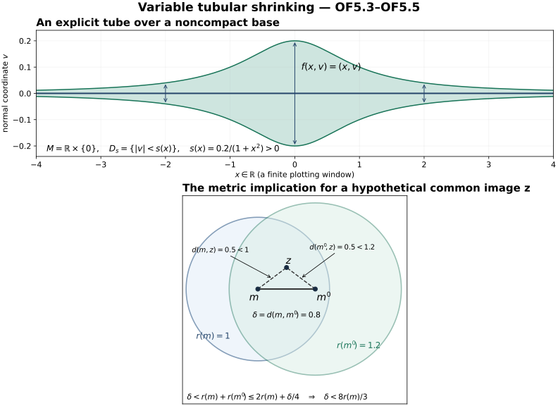
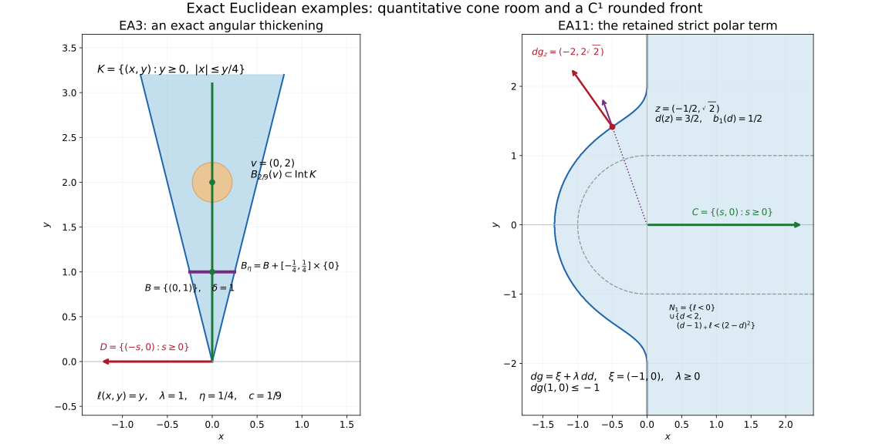

# Ordinary geometry at the bounded involutivity scope

This independently authored supplement is dedicated to CC0 1.0 Universal. It closes the exact ordinary differential-topology and real-analysis floor left in the frozen IC1–IC9 handoff, without modifying that handoff. Referenced source bodies retain their actual licenses: DG-FND local-tools Sections 0–2 declare independently written CC0 exposition, while its explicitly attributed Section 3 and marked completions retain CC BY-SA 4.0. Those referenced texts are not relicensed by this supplement.

The scope is finite-dimensional Hausdorff countable-at-infinity smooth manifolds, smooth embedded closed submanifolds (locally closed ones after an open ambient restriction), finite-rank smooth real vector bundles, and C1 local test functions on Euclidean charts. No analytic partition of unity or analytic tubular neighbourhood is asserted; the auxiliary topology of an analytic deformation may use the underlying smooth manifold exactly as normal-geometry.md:15 permits. A countable union of compact subsets gives a countable chart cover: cover each compact subset by finitely many charts. The rational-ball bases in these countably many charts give a countable basis. This verifies the second-countability premise of the admitted bodies rather than changing the manifold convention.

## OF1. Exact admitted calculus and local coordinate bodies

At immutable head `17e99c7e7fd7f0c92bc256317a57e52a46084d67`, the actual full body

`docs/courses/DG-FND/src/local-tools-for-bundles-and-transport.md`

has SHA-256 `d1d6644b8df928b7baac5cddfc11b64fbd069b208111c68cb7f78761bed7901e`. Lines 13–134 prove the ordinary analytic/linear inputs from the ordered real field's least-upper-bound property: Euclidean norm estimates, real and finite-coordinate completeness, compactness, extrema and uniform continuity, finite complements and operator completeness, Riemann integration/FTC and norm chain/product rules, smooth inversion and the flat smooth bump. Lines 137–170 prove contraction, the smooth inverse theorem, submersion and constant-rank coordinate forms. Lines 174–222 prove smooth parameter fixed points and the full finite-coordinate ODE solution/smooth-dependence/compact continuation theorem, including the path-space derivative estimates before applying fixed-point differentiation. All those bodies were read, not inferred from a theorem name or a reference.

The C1 inverse theorem is needed when a boundary is only C1. The actual body `docs/courses/AN-01/prerequisites/U011-free-foundations/implicit-maps-U070.md`, SHA-256 `2ead6579a3291900c866e9c1511c8dcdf71f8ccfc0d02b1c25ddb81510acb955`, lines 9–95 proves it for the actual map and derivative: on a closed ball, \(T_y(x)=x+A⁻¹(y−f(x))\) has contraction constant θ<1; its fixed point is interior; the exact lower Lipschitz estimate is (1−θ)/||A⁻¹||; the finite Neumann identities prove invertibility; the differentiability remainder proves Dh=(Df∘h)⁻¹. The only inputs needed by this used Euclidean/C1 part are precisely the already read DG-FND 0.0–0.4 bodies. Thus no unbound higher-inverse-derivative, finite-polynomial or general Banach implicit theorem is imported here. In dimension zero the inverse is the singleton identity; no division by a zero inverse norm occurs.

For clarity, the underlying finite cofactor identity, when a coordinate formula uses it, has an elementary verification. Define det A by the signed sum over permutations and the cofactor by the signed minor. Expanding the signed sum along a row gives A adj(A)=det(A)I: off-diagonal entries are determinants with two equal rows and cancel in pairs under the transposition of those rows. Applying the column expansion gives adj(A)A=det(A)I. Hence inversion is a rational smooth matrix map where det≠0. No independent polynomial-calculus provider is needed for that formula.

## OF2. Adapted charts, including the actual diagonal

Let j:M→X be a smooth embedding. At each m the coordinate derivative has full rank dim M, and its nonzero minor stays nonzero near m. Since the source has that dimension, rank is constant there. Apply the admitted constant-rank coordinate proof, DG-FND lines 168–170, to put j locally in the form u↦(u,0). Because j is a homeomorphism to its image, a sufficiently small open source neighbourhood has relatively open image in M; intersect an ambient open neighbourhood with that image condition to exclude other parts of M. Shrink to a product box in the resulting coordinate range. In that box the entire ambient intersection with M is exactly the normal-coordinate zero set. These are adapted submanifold charts, with the stated smooth inverse and actual inclusion. If embedded submanifolds are defined by adapted charts, this argument verifies agreement with the equivalent embedding convention rather than adding a new premise.

For a regular C1 level set f=c, use the C1 inverse body on the augmented map (f, remaining coordinates), whose derivative is invertible after choosing a nonzero derivative component. Its level set becomes the first-coordinate hyperplane. This closes the local C1 flattening used by boundary support tests.

For the diagonal of a chart U⊂ℝⁿ the chart is explicit:

\[
\begin{gathered}
(x,y)\longmapsto(u=x-y,z=y),\\
(u,z)\longmapsto(z+u,z).
\end{gathered}
\tag{OF2.1}
\]

Its domain is exactly z∈U and z+u∈U, an open set. The diagonal is u=0 and its normal coordinate is the first-minus-second difference. This retains IC1's sign; no global tubular theorem is substituted for this local calculation.

## OF3. Partitions, bundle metrics and a compatible ambient metric

DG-FND local-tools lines 249–396 supply the full compact-exhaustion, subordinate-chart, local-finiteness, bump-boundary and normalized partition proof at the above manifold scope. In particular lines 264 and 308–318 discharge the countable-subcover and shell-selection inputs, and lines 354 and 369–391 discharge smoothness across bump boundaries, open extension and local-finite summation. The compact-annulus selections give neighbourhood local finiteness, not merely finitely many nonzero values at a point. Its Section 3 license and Brenner/Wikiversity attribution are retained; admitting this actual body is not a CC0 relabeling of it.

Let E→X be a finite-rank smooth real vector bundle. Use a partition \(ψ_i\) subordinate to a trivializing cover. Put a Euclidean inner product \(h_i\) on E in each frame and set

\[
h=\sum_i\psi_i h_i.
\tag{OF3.1}
\]

Each summand extends smoothly by zero off its trivializing domain because its scalar support is closed and contained in that domain. The sum is finite on a neighbourhood of every point, so is smooth. At every point some \(ψ_i>0\), and all terms are nonnegative quadratic forms; h(v,v)>0 for v≠0. This gives the required smooth bundle metric, including on TX.

For the tangent bundle write g=h. On each connected component let \(d_g\) be the infimum of lengths of piecewise C1 paths. Such paths join any two points in that component: chart segments give open path components, and connectedness leaves one. The infimum is finite and satisfies symmetry and the triangle inequality by path reversal and concatenation. It is a genuine metric inducing the original topology. To check this, on a compact coordinate ball choose λ,Λ>0 bounding g between λ times and Λ times the Euclidean form; compactness and positive definiteness provide the bounds. A chart segment gives \(d_g(x,y)≤√Λ|x−y|\) for nearby points. Any path from x leaving that coordinate ball must first reach its Euclidean boundary and has length at least √λ times the distance of x to that boundary. Thus a sufficiently small \(d_g-ball\) remains in the coordinate ball, where any such path has length at least √λ|x−y|. These two local bounds prove positive distance for distinct points and equality of the metric and chart topologies. Set \(d=min(d_g,1)\) on a component and d=1 between different components. The components are open and the triangle inequality persists, so d is a compatible metric on X. This proves the metrizability used by IC4 and below without an additional metrization theorem.

If A⊂X is any locally closed subset, its restricted compatible metric induces its topology. It is second countable by intersecting an ambient countable basis. Write A closed in an ambient open S. At a∈A choose a compact ambient chart ball inside S; its intersection with A is compact and contains a relative open neighbourhood. Thus A is locally compact. Choose a countable cover by such relatively compact opens. Recursively cover the preceding compact set and the next member's compact closure by finitely many relatively compact opens; their closed union gives \(L_m⊂int_A\) \(L_{m+1}\) with interiors covering A. The finite compact-annulus selections in IC4 now refine every relative open cover locally finitely. This verifies paracompactness at every actual subset scope used in tautness, including subsets which are not manifolds, without pretending they possess smooth charts or smooth partitions.

For a smooth embedded M, identify its normal quotient with the orthogonal subbundle. In a local frame let B have columns framing TM. The matrix BᵀgB is positive definite and invertible, and

\[
P=B(B^\mathsf T gB)^{-1}B^\mathsf T g
\tag{OF3.2}
\]

is the smooth g-orthogonal projection to TM. The complementary bundle ker P is smooth: a nonzero maximal minor of a constant-rank matrix stays nonzero, and elimination writes its kernel locally as (−C⁻¹Dw,w). The quotient map induces the inverse smooth isomorphisms [v]↦(1−P)v and n↦[n]. The restricted metric gives the normal norm, and this identification has the actual quotient normal derivative, without a sign change.

## OF4. A smooth local addition from the actual geodesic equation

The compatible bundle metric supplies a smooth Riemannian g. In coordinates set

\[
\begin{gathered}
\Gamma^k_{ij}=\tfrac12 g^{k\ell}\\
(\partial_i g_{j\ell}+\partial_j g_{i\ell}-\partial_\ell g_{ij}),\\
x\prime=v,\quad (v^k)\prime=-\Gamma^k_{ij}(x)v^iv^j.
\end{gathered}
\tag{OF4.1}
\]

The coefficients are smooth by matrix inversion. These equations agree under coordinate changes. Indeed \(L(x,v)=g_x(v,v)/2\) is a scalar. Its Euler–Lagrange expression is \(d/dt(∂L/∂v^k)−∂L/∂x^k\). For x=x(y), the expression in \(y^a\) equals \((∂x^k/∂y^a)\) times that in x: differentiating \(∂L/∂w^a=(∂L/∂v^k)(∂x^k/∂y^a)\), the extra second-coordinate-derivative term cancels the corresponding term in \(∂L/∂y^a\). Expanding the remaining expression gives \(g_{kℓ}(v^ℓ)'+(∂_i\) \(g_{kj}−∂_k\) \(g_{ij}/2)v^iv^j=0\), equivalent to (OF4.1). Thus the admitted finite-coordinate ODE theorem glues its unique solutions on TX.

The zero-velocity solution is constant and exists on [0,1]. Compact-interval continuation and finite composition of the admitted local smooth solution maps give an open domain Ω⊂TX containing the zero section on which every solution exists through time 1; the endpoint map \(f(x,v)=x_v(1)\) is smooth. This requires no completeness of g. Equivalently, local time scaling of (OF4.1) gives \(x_{sv}(t)=x_v(st)\), which supplies the time-1 endpoint for sufficiently small velocities. Uniqueness makes all these local definitions agree.

At zero velocity f(x,0)=x. Differentiating the equation in an initial velocity direction w along the constant solution gives δx'=δv, δv'=0, since every term in the acceleration has two velocity factors. With δx(0)=0, δv(0)=w, the variation is δx(t)=tw. A base variation u is constant. Consequently

\[
Df_{(m,0)}(u,w)=u+w.
\tag{OF4.2}
\]

Restrict f to the orthogonal normal bundle \(E=N_MX\). The splitting \(TX|_M=TM⊕E\) makes (OF4.2) an isomorphism at every zero vector. The admitted smooth inverse theorem gives local inverse domains Γ about those vectors. The remaining issue is global injectivity near a possibly noncompact M, handled next with variable sizes.

## OF5. Global tubular shrinking with a quantitative noncompact argument

Suppose M⊂X is closed, E its metric normal bundle, and f defined near its zero section as above. If M is empty the empty tubular map proves the assertion. On each local inverse domain Γ, f is a diffeomorphism onto an open set. Let d be OF3's compatible ambient metric, also restricted to M. Choose for each centre c∈M a number \(a_c>0\) such that

\[
\{(m,v):d(m,c)<a_c,\ |v|<a_c\}\subset\Gamma_c.
\tag{OF5.1}
\]

For the existence, choose a product box about (c,0) in a bundle trivialization contained in \(Γ_c\). After shrinking the base, the positive-definite metric matrix has a uniform lower Euclidean bound, by continuity on a small compact base ball and its unit sphere. A sufficiently small normal norm then forces the fibre coordinates into that product box. A sufficiently small d-ball forces its base into the chosen box since d is compatible. This proves (OF5.1). Shrink \(a_c\) to at most one. Let \(U_c=\{m:d(m,c)<a_c/4\}\). Choose a locally finite smooth partition \(ψ_i\) on M subordinate to these \(U_c\), and put \(ε(m)=\sum_i\) \(ψ_i(m)a_{c_i}/40\). It is positive and smooth. At a fixed m choose among its finitely many positive-weight indices one with largest \(a_{c_i}\). Then \(ε(m)≤a_{c_i}/40\) and \(m∈U_{c_i}\), so

\[
\begin{aligned}
d(m',m)&<5\varepsilon(m),\\
|v|&<5\varepsilon(m)
\quad\Longrightarrow\quad(m',v)\in\Gamma_{c_i}.
\end{aligned}
\tag{OF5.2}
\]

Indeed \(d(m',c_i)<a_{c_i}/4+a_{c_i}/8<a_{c_i}\), and the normal norm is less than \(a_{c_i}/8\). Define the continuous positive function

\[
r(m)=\inf_{q\in M}\bigl(\varepsilon(q)+\tfrac14d(m,q)\bigr).
\tag{OF5.3}
\]

It is 1/4-Lipschitz by the triangle inequality and r≤ε by q=m. It is strictly positive: near a fixed m, continuity makes ε(q)≥ε(m)/2; outside a chosen ball of radius δ about m, the distance term is at least δ/4. Thus r(m)≥min(ε(m)/2,δ/4)>0. No compactness of M or global positive constant is asserted.

Restrict f to the open domain

\[
\begin{gathered}
D_0=\{(m,v)\in\Omega\cap E:\\
|v|<r(m),\ d(f(m,v),m)<r(m)\}.
\end{gathered}
\tag{OF5.4}
\]

It contains the full zero section. Every point of \(D_0\) lies in one of the local inverse domains by (OF5.2), so f is a local diffeomorphism there. If f(m,v)=f(m',v')=z for two points of \(D_0\), put δ=d(m,m'). Then

\[
\begin{gathered}
\delta<r(m)+r(m')\leq2r(m)+\delta/4,
\\
 \delta<\tfrac83r(m),\\
r(m')<\tfrac53r(m).
\end{gathered}
\tag{OF5.5}
\]

Both vectors therefore lie in the same \(Γ_{c_i}\) selected for m: their bases are within 5ε(m) and both norms are below 5ε(m). Injectivity there makes the two vectors identical. Hence f is injective on \(D_0\). A local diffeomorphism is open and its local inverses agree under injectivity, so \(f:D_0→f(D_0)\) is a global smooth diffeomorphism to an open neighbourhood of M.

The disk form required by NG556 is obtained by one more shrinking. Openness of \(D_0\) gives a cover \(U_i\) of M and constants \(b_i>0\) such that all \(|v|<b_i\) over \(U_i\) lie in \(D_0\). Take a subordinate locally finite smooth partition \(χ_i\) and set \(s(m)=\sum_iχ_i(m)b_i/2\). At m choose a largest \(b_i\) among the positive-weight indices; then |v|<s(m) implies \(|v|<b_i\) over \(U_i\). Thus the fibrewise disk domain \(D_s=\{|v|<s(m)\}\) is contained in \(D_0\). The restriction \(f:D_s→T\) is the required tubular diffeomorphism. Its derivative on the normal quotient is the identity by (OF4.2), and f(m,0)=m. All radii vary with m. Closedness of M is the standing global hypothesis; a locally closed M is treated within an open ambient space where it is closed.

This proves exactly the smooth tubular and metric inputs used in normal-geometry.md:556–563. The existing interval-neighbourhood proof at lines 573–634 then applies to the disk domain \(D_s\), with its explicit radial anchors, initial zero-axis interval, compact radial homotopy and all four openness cases. None of that proof requires a fixed-radius tube or deletion of zero vectors.

The reproducible source is [CC0 Python source](../figures/tubular_shrinking.py). The first panel shows the exact example M=ℝ×{0}, f(x,v)=(x,v), and s(x)=0.2/(1+x²)>0 on all of ℝ; only the plotting window is finite. The second panel illustrates the metric inequalities of OF5.5 for a hypothetical common image: m=(0,0), m′=(0.8,0), z=(0.4,0.3), r(m)=1 and r(m′)=1.2. Both displayed image distances equal 0.5, and the radius difference is (1/4)d(m,m′). The dashed lines denote metric distances, not geodesic trajectories or actual collisions of the tubular map. The proof uses the inequalities to place both inputs in one local inverse domain, which excludes a collision.

## OF6. Used angular and nearest-point supplement

The independently checked angular supplement is delivered separately in [EA1–EA11 below](../ordinary-involutivity-floor.html#EA1), SHA-256 `39e1226538ad24de60e0858cc704a28cc970c450680013fc42cb17097f247d87`. Its full EA1–EA11 bodies, lines 26–449, were read and checked by the owner. They supply projection uniqueness and the distance derivative with a quadratic error bound; positive functionals, bipolar and open-cone identities; quantitative convex cone thickening; no-cancellation closure and neighbourhood-uniform exclusion; the exact boundary cones and closed-set cofinality; directional caps; the global sublevel bound along remote cone rays; compact truncated tubes and localization; and the rounded front's strict polar differential. The relevant ball notation \(B_a(α)\), \(B_ε(x)\) in that supplement denotes an **open** ball. In EA2, the open radius-a ball is contained in the polar interior even when the initial margin is exactly a; a closed radius-a ball is not asserted to be contained there. All distance functions are differentiated only off their convex closed set.

The actual dependency points are microsupport-operations.md:46–63,237–298,302–340 and microsupport-tests.md:98–116,446–658, with the strict-normal displacement definition/geometry at subset-microsupport.md:45–151. The latter full body was separately checked: the strict cone is open and convex, its nonempty polar is pointed, its full/empty and zero-dimensional cases are distinguished, and its local finite-direction displacement criterion is written out. EA2 now supplies the elementary separation step used in that body's (S9) proof at lines 136–140; EA3 and EA7 supply its uniform inward-cone margins and finite-direction neighbourhood choice. The same construction with L the ray through a strict inward vector supplies the small closed cone inside the strict normal at asymptotic-estimates.md:49. Thus the angular construction uses the polar of the actual open strict-normal cone; it does not silently assume that an arbitrary normal cone is pointed. The cone-to-test comparison also bounds the entire saturated cone ray, including points outside the local chart ball.

The reproducible source is [CC0 Python source](../figures/angular_margins.py). At left, EA3 is instantiated with the green cone L={(0,y):y≥0}, ℓ(x,y)=y, λ=1, B={(0,1)}, the red cone D={(-s,0):s≥0}, δ=1 and η=1/4. Its exact thickening is K={y≥0,|x|≤y/4}; the displayed ball about v=(0,2) has radius c|v|=2/9 from EA3.4, with β=2 and c=1/9. At right, EA11 uses the nonzero cone C={(s,0):s≥0}, base x₀=(0,0), t=1, ξ=(-1,0) and ℓ=-x. The dashed curve is d=1 for distance to C; the blue region is N₁, displayed by numerical sampling of its exact inequalities. At its exact boundary point z=(-1/2,√2), d=3/2, b₁(d)=1/2, dd=(-1/3,2√2/3), λ=-b₁′(d)=3 and dg=ξ+3dd=(-2,2√2). The purple arrow shows dd and the red arrow shows dg, with their plotting scales reduced uniformly. Since dg(1,0)≤-1 everywhere on the front, the strict polar margin is retained even though the cone has empty interior. These examples illustrate the full proofs EA3 and EA11; a sampled image does not establish an infinite-set inclusion.

The supplied microsupport-tests.md:14,476 attributes the distance/front mechanism to Masaki Kashiwara and Pierre Schapira, [Microlocal Study of Sheaves, Astérisque 128 (1985)](https://www.numdam.org/item/AST_1985__128__1_0/), especially Proposition 3.2.1, printed pp. 55–57, and compares the general directional statement with Pierre Schapira's [2016 review](https://webusers.imj-prg.fr/~pierre.schapira/LectNotes/MuShv.pdf), Theorem 3.8. The actual finite distance, angular and front proofs used here are EA1–EA11, and both figures are original constructions with no human-source image reused.

## OF7. Scope of the closure

The previous frozen report's ordinary floor is discharged at its actual smooth/C1 bounded I1/I2/I15 uses by these admitted full bodies and the new finite arguments. The result does not assert analytic partitions or analytic tubular maps, metric completeness or a complete geodesic flow, uniform radii on a noncompact base, a general unbounded sheaf theorem, or closure of unrelated course units. The frozen IC1–IC9 statements, parent Fourier/MI comparison bodies, MC13a/b, and countable-exhaustion corrections remain unchanged.

One unused declaration is kept separate from this closure. asymptotic-estimates.md:39 lists a proper smooth embedding of a countable-at-infinity manifold into a finite-dimensional Euclidean space. Its actual proof use is line 626, in the later small-image theorem (AE.49–AE.54). The I1/I15 route uses the AE body through line 568, with the boundary blowup written directly in local coordinates; that route never invokes the embedding. A full proper-embedding provider therefore remains an obligation for that later theorem, outside this supplement's bounded dependency route. A declared import list alone is not evidence that this theorem was used or proved.

This is a mathematical proof audit from exact written bodies; no formal checker or independent human certification is claimed. No unresolved ordinary geometric/analytic inference remains in these used ranges. The [IC1–IC9 route](../involutivity-foundations.html#SH02-INVOLUTIVITY-FOUNDATIONS) uses these proofs while preserving its separately checked sheaf, Fourier and derived-operation contracts. All licenses, hashes and inclusive ranges are listed in the binding table below.

The admitted analytic source itself credits Jiří Lebl, [Basic Analysis, free version 6.3](https://www.jirka.org/ra/), as a construction source, and Gerald Teschl, [Ordinary Differential Equations and Dynamical Systems, free preliminary version](https://www.mat.univie.ac.at/~gerald/ftp/book-ode/ode.pdf), for mathematical comparison; its independently written proofs are the actual providers used here. The admitted partition component is explicitly attributed to Holger Brenner and the Wikiversity contributors, [Lecture 22, revision 1052940](https://de.wikiversity.org/w/index.php?oldid=1052940), through the [complete English edition v2026.09.01-complete](https://github.com/KokunoYumeto/brenner-differentialgeometrie-en/releases/tag/v2026.09.01-complete), and retains [CC BY-SA 4.0](https://creativecommons.org/licenses/by-sa/4.0/). The new tubular figure illustrates OF5's independently written proof; its partition input is this attributed component. No human-source image or book was downloaded or reproduced for this supplement.

# SH02-EA — Angular margins, convex distance, and directional neighborhoods

Original programme expression and proofs: CC0 1.0 Universal.

This finite supplement proves the Euclidean geometry used to turn a covector exclusion into a cone exclusion, to round the moving fronts, and to compare directional neighborhoods with ordinary neighborhoods. It concerns the indicated arguments only. It adds no constructibility, stalk-finiteness, field-coefficient, or interior-of-the-direction-cone hypothesis. It does not assert closure of the complete microlocal programme.

## Exact source binding

The audited sources are frozen at commit `17e99c7e7fd7f0c92bc256317a57e52a46084d67` of `KokunoYumeto/open-math-courses`.

| Frozen source | SHA-256 | Geometry audited |
|---|---|---|
| `docs/courses/sheaf-proof-readings/src/SH02/microsupport-operations.md` | `5f68121b74984b6a6cad0eb4f104f0ceb7e51255a8153c5f1cabebe2dfa1796a` | lines 237–298: (MO11), cone choice, directional caps, opposite cap; lines 302–340: (MO14), cone refinement and the bound (MO15 implicit in lines 332–336). Lines 46–63 supply the no-cancellation context. |
| `docs/courses/sheaf-proof-readings/src/SH02/microsupport-tests.md` | `fee430cf9ebbafb6faf5073e74ae91d14ba687f80acc4baab3f296c4f5039ba3` | lines 98–116: sublevel germ and cofinality; lines 482–530: nearest-point differential, rounded boundary, compact truncated tubes; lines 589–658: compact directional localization and halfspace cofinality. Lines 1–98, 446–481 and 531–588 provide the precise conventions and neighboring contracts used below. |

The exact subset-normal convention is the already supplied displacement criterion in `subset-microsupport.md`, lines 45–151, from the same commit, SHA-256 `3902c3481c5aabac3f0bd4902ae00e97ade02d342f55844485fc7f683d37f0de`. Whenever that criterion is used below it is stated explicitly. No sheaf theorem follows merely from the geometry here; the localization and propagation maps retain their separately audited contracts.

Fix a finite-dimensional real Euclidean vector space E. Its norm identifies vectors and covectors only for the calculations below. For a cone C,

\[
C^\circ=\{\alpha:\alpha(v)\geq0\ (v\in C)\},\qquad C^{\circ a}=-C^\circ.
\]

A closed convex cone contains 0 and is additive. It is pointed when C intersected with −C is {0}. The elementary floor retained here is finite-dimensional linear algebra, closed-bounded compactness, completeness of the real numbers, continuity, and the one-variable mean-value theorem. The separation, projection, differentiability and cofinality steps are proved rather than imported by theorem name.

## EA1. Projection and the precise distance differential

Let Q be a nonempty closed convex subset of E. For every y there is a unique p(y) in Q minimizing |y−q|. Existence follows by restricting a minimizing sequence to a closed bounded ball about y and taking a subsequence. If distinct minimizers p and q existed, their midpoint would lie in Q and

\[
\left|y-\frac{p+q}{2}\right|^2
=\frac{|y-p|^2+|y-q|^2}{2}-\frac{|p-q|^2}{4}
\]

would be smaller. Differentiating the squared distance at the start of the segment from p(y) to q in Q proves the variational inequality

\[
\begin{gathered}
\langle y-p(y),q-p(y)\rangle\leq0\\
(q\in Q).
\end{gathered}
\tag{EA1.1}
\]

Write r(y)=y−p(y). Applying (EA1.1) at y and z with the other point's projection gives

\[
\langle r(y)-r(z),p(y)-p(z)\rangle\geq0. \tag{EA1.2}
\]

Since y−z=(p(y)−p(z))+(r(y)−r(z)), expanding its squared norm proves both

\[
\begin{gathered}
|p(y)-p(z)|\leq|y-z|,\\
 |r(y)-r(z)|\leq|y-z|.
\end{gathered}
\tag{EA1.3}
\]

In particular both maps are continuous. Put ψ(y)=|r(y)|²/2. Using p(y) as a competitor at y+h gives the upper bound below. For the lower bound, put q=p(y+h), expand |y+h−q|², and use (EA1.1):

\[
\begin{gathered}
0\leq\psi(y+h)-\psi(y)-\langle r(y),h\rangle\\
\leq\frac{|h|^2}{2}.
\end{gathered}
\tag{EA1.4}
\]

Indeed the lower remainder equals

\[
-\langle r(y),q-p(y)\rangle+\tfrac12|h-(q-p(y))|^2\geq0.
\]

Thus ψ is differentiable with differential r(y), and (EA1.3) makes ψ of class C¹, with 1-Lipschitz gradient. Write d(y)=dist(y,Q). The triangle inequality, followed by an infimum over Q, proves |d(y)−d(z)|≤|y−z|. The distance derivative can now be obtained directly, without an extra differentiability assumption on p. If d(y)>0, put ε=ψ(y+h)−ψ(y)−⟨r(y),h⟩ and Δ=d(y+h)−d(y). Expanding the squared distances gives

\[
d(y)\left(\Delta-\left\langle\frac{r(y)}{d(y)},h\right\rangle\right)
=\epsilon-\frac{\Delta^2}{2}.
\]

Both ε and Δ²/2 lie between 0 and |h|²/2, by (EA1.4) and the 1-Lipschitz bound. Hence

\[
\begin{gathered}
\left|d(y+h)-d(y)-\left\langle\frac{r(y)}{d(y)},h\right\rangle\right|\\
\leq\frac{|h|^2}{2d(y)}.
\end{gathered}
\tag{EA1.4a}
\]

This proves differentiability off Q with the following differential, which is continuous there by (EA1.3):

\[
\begin{gathered}
dd_y=\frac{r(y)}{|r(y)|},\\
 |dd_y|=1.
\end{gathered}
\tag{EA1.5}
\]

Thus d is C¹ on E minus Q. On the set where both distances are at least ρ>0, (EA1.3) gives the additional precise bound

\[
|dd_y-dd_z|\leq\frac{|y-z|}{\rho}. \tag{EA1.6}
\]

To check it, for nonzero a,b one has |a−b|²=(|a|−|b|)²+|a||b||a/|a|−b/|b||²; use a=r(y), b=r(z).

For Q=x+C, with C any closed convex cone, p(y)+εv belongs to Q whenever v belongs to C and ε≥0. Equation (EA1.1) therefore gives

\[
\begin{gathered}
dd_y(v)\leq0\quad(v\in C),\\
 dd_y\in C^{\circ a}\quad(y\notin x+C).
\end{gathered}
\tag{EA1.7}
\]

This proves exactly the assertion at tests line 489, including cones with empty interior. No differentiability of the cone boundary is needed. Translation also gives

\[
\begin{gathered}
|d_x(y)-d_{x'}(y)|\leq|x-x'|,\\
 d_x(y+v)\leq d_x(y)\ (v\in C),
\end{gathered}
\tag{EA1.8}
\]

by translating competitors and using C+C=C.

## EA2. Positive functionals, polar interiors, and the open-cone identity

Let L be a nonzero pointed closed convex cone. Its unit section S=L∩{|v|=1} is nonempty compact. Its convex hull is compact. Here is the finite-dimensional detail: an affine dependence among more than dim(E)+1 points lets one change their nonnegative coefficients, with total coefficient fixed, until at least one positive coefficient becomes zero. Iterating reduces every convex combination to at most dim(E)+1 terms. The convex hull is consequently the continuous image of a compact product of copies of S and a closed coefficient simplex.

This convex hull excludes 0. If a convex combination of unit vectors summed to zero, choose a vector with positive coefficient. Its negative would be a positive combination of the other vectors and would belong to L, contradicting pointedness. Choose a nearest point q to 0 in this compact convex hull. The segment inequality at q gives

\[
\langle q,u\rangle\geq|q|^2>0\quad(u\in S).
\]

Thus ℓ=⟨q,−⟩ has a constant λ>0 such that

\[
\ell(v)\geq\lambda|v|\quad(v\in L). \tag{EA2.1}
\]

For any nonzero closed cone C, strict positivity of α on C minus {0} is equivalent to α∈Int C°: compactness of C's unit section gives a positive minimum, while an interior ball around α permits subtraction of a small covector that is positive on any chosen unit vector. Quantitatively, if α(v)≥a|v| on C, then the dual ball \(B_a(α)\) is contained in Int C°. The same statement with signs gives α(v)≤−a|v| and \(B_a(α)⊂Int\) \(C^{°a}\). For C={0}, its polar and polar interior are the entire dual space and no unit section is used.

For completeness, the bipolar identity for a closed convex cone follows from EA1. If y does not belong to C, let p be its projection and r=y−p. The competitors 0 and 2p give ⟨r,p⟩=0. Competitors p+c give ⟨r,c⟩≤0. Hence −r belongs to C° but ⟨−r,y⟩=−|r|²<0. This separates y from C and proves

\[
(C^\circ)^\circ=C. \tag{EA2.2}
\]

If G is a nonempty open convex cone, then

\[
G=\operatorname{Int}\overline G
=\operatorname{Int}((G^\circ)^\circ). \tag{EA2.3}
\]

The second equality follows from (EA2.2) and continuity of covector evaluation. For the first, the inclusion from G is immediate. Given y∈Int closure(G), place the vertices of a small nondegenerate simplex around y inside closure(G), with y strictly inside the simplex. Approximate its vertices by points of G. The solution for the barycentric coefficients is continuous in the vertices, as follows from the inverse of the nonzero affine determinant. With sufficiently close approximations all coefficients remain positive. Convexity of G then puts y in G. This proves the other inclusion without an unproved separation assertion.

The polar of a nonempty open cone is pointed: a covector and its negative in that polar would vanish on an open set and hence everywhere. Conversely a pointed closed cone has a polar with nonempty interior by (EA2.1); a full-dimensional closed cone has a pointed polar. A nonempty proper open convex cone has a nonzero polar: its closed cone closure is proper by (EA2.3), and the separating covector in the preceding projection proof is nonzero.

## EA3. Convex angular thickening with explicit margins

Let L be nonzero, closed, convex and pointed, and let D be closed and conic, contain 0, and satisfy L∩D={0}. D need not be convex. Choose ℓ and λ as in (EA2.1), and set

\[
B=L\cap\{\ell=1\},\quad H=\ker\ell,\quad
\delta=\operatorname{dist}(B,D)>0.
\]

B is nonempty compact convex and |b|≤λ⁻¹ on B. The asserted positive distance follows by taking a minimum on compact B of the continuous distance to closed D. Choose 0<η<δ and form

\[
\begin{gathered}
B_\eta=B+\{w\in H:|w|\leq\eta\},\\
K=\{t b':t\geq0,\ b'\in B_\eta\}.
\end{gathered}
\tag{EA3.1}
\]

\(B_η\) is a compact convex affine section contained in {ℓ=1}. K is a convex cone. It is closed: in any convergent sequence \(t_j\) \(b'_j\), the numbers \(t_j=ℓ(t_j\) \(b'_j)\) are bounded and one may take a subsequence of \(b'_j\) in \(B_η\). K is pointed because ℓ is strictly positive on its nonzero points. The affine ball about any b∈B in directions H, together with positive scaling, gives nonempty ordinary interior in E; this argument also covers dimension one, where H={0}.

Every \(b'∈B_η\) satisfies dist(b',D)≥δ−η>0, and conicity gives

\[
\begin{gathered}
K\cap D=\{0\},\\
 L\setminus\{0\}\subset\operatorname{Int}K.
\end{gathered}
\tag{EA3.2}
\]

There are explicit uniform bounds. Put R=λ⁻¹+η and β=1+||ℓ||/λ. Then

\[
\begin{gathered}
\ell(k)\geq |k|/R\quad(k\in K),\\
\operatorname{dist}(k,D)\geq\frac{\delta-\eta}{R}|k|\quad(k\in K).
\end{gathered}
\tag{EA3.3}
\]

For the second bound write k=t b', use dist(t b',D)=t dist(b',D), and |b'|≤R. Define

\[
c=\frac{\eta\lambda}{\beta+\eta||\ell||}>0.
\]

Then

\[
\operatorname{dist}(v,E\setminus\operatorname{Int}K)\geq c|v|\quad(v\in L). \tag{EA3.4}
\]

Indeed write v=t b with t=ℓ(v)≥λ|v|. If |h|<c|v|, then t'=ℓ(v+h)>0 and

\[
\left|\frac{v+h}{t'}-b\right|
=\frac{|h-b\ell(h)|}{t'}
\leq\frac{\beta|h|}{\lambda|v|-||\ell||\,|h|}<\eta.
\]

The difference lies in H, so v+h belongs to Int K. This proves (EA3.4).

The construction applies also when a prescribed open cone W contains L minus {0}: take D=(E minus W)∪{0}. This set is closed and conic, including when W=E. It gives K minus {0} contained in W. No convexity of W is necessary. The nonzero hypothesis on L matters: for L={0} and D=E there is no nonzero cone enlargement avoiding D, and this supplement makes no such assertion.

## EA4. No cancellation and neighborhood-uniform avoidance

Let P,Q be closed conic sets containing 0 with P∩(−Q)={0}. On the compact set of pairs (p,q) with |p|+|q|=1, the continuous function |p+q| has a positive minimum μ; otherwise p=−q would be nonzero. If the normalized set is empty both sets are {0}. Homogeneity gives

\[
|p+q|\geq\mu(|p|+|q|). \tag{EA4.1}
\]

Thus a convergent sequence of sums has bounded summands, and a convergent subsequence of those summands proves that P+Q is closed. This proof never assumes P or Q convex.

If T is a closed conic subset of a trivialized bundle U₀×E, x∈U₀, and K is a closed cone satisfying \(T_x∩K⊂\{0\}\), then after shrinking U₀ about x one has T∩(U×K)⊂U×{0}. Otherwise normalize offending nonzero vectors at a sequence of base points tending to x, pass to a subsequence in K's compact unit section, and use closedness of T. This proves the passage from the fibre exclusion (MO11) to the neighborhood exclusion in operations lines 265–270.

## EA5. The exact angular cone for the open boundary estimate

Use \(A=SS(F)_x\) and \(N=N_x^*(Ω)\) from operations line 257. Outside the closed support the local assertion is immediate. Otherwise 0∈A. The normal convention makes N closed convex; if N were the full fibre, A+N would be the full fibre and there would be no ξ to exclude. In the remaining case the strict normal is nonempty and open, so EA2, or the explicit subset proof at lines 88–90, makes N pointed. This is the missing premise behind the phrase “first pointed cone.” It follows from the actual strict-normal convention; it does not hold for an arbitrary closed convex N.

Take ξ∉A+N and A∩(−N)={0}. Since 0∈A, ξ∉N and ξ≠0. Consequently \(N∩R_{≥0}ξ=\{0\}\). Apply EA4 to N and \(R_{≥0}(−ξ)\). Their sum

\[
L=N+\mathbb R_{\geq0}(-\xi)
\]

is closed and convex. It is pointed: if n₁−t₁ξ=−n₂+t₂ξ, then n₁+n₂=(t₁+t₂)ξ. A positive total t would put ξ in N; a zero total leaves n₁=−n₂, which pointedness of N forces to be zero. L is nonzero because it contains −ξ.

It avoids −A. An equality n−tξ=−a with t>0 would give ξ=(a+n)/t∈A+N. With t=0 it gives a∈A∩(−N), so a=n=0. EA3 with D=−A therefore gives exactly

\[
\begin{gathered}
N+\mathbb R_{\geq0}(-\xi)\subset\operatorname{Int}K\cup\{0\},\\
K\cap(-A)=\{0\}.
\end{gathered}
\tag{EA5.1}
\]

Put γ=K°. EA2 shows that γ is pointed and full-dimensional, and γ°=K. If v∈γ minus {0}, the interior point −ξ of K pairs strictly positively with v: an arbitrarily small perturbation of −ξ in the direction of the covector represented by −v stays in K. Therefore ξ(v)<0. Compactness then gives a uniform negative bound on γ's unit section. Equations (EA5.1) and EA4 give the full-base exclusion in (MO11)–(MO12)'s local use.

The opposite-normal construction in operations line 281 uses the identical argument with N replaced by −N and A∩N={0}. It yields the cone required for the extension-by-zero sign. No linear separation of the possibly nonconvex set A is asserted.

## EA6. The cone for outward costalk vanishing

At the closed boundary point in operations lines 304–314, the strict normal \(G=N_x(Z)\) is nonempty because N=G° is proper. It is a proper open convex cone because a boundary point does not have strict normal E. EA2 gives N nonzero and pointed and G=Int N°. With \(A=SS(F)_x\), the hypothesis is A∩N⊂{0}. The no-cancellation argument makes A−N closed. It also gives

\[
(A-N)\cap N\subset\{0\}. \tag{EA6.1}
\]

Indeed a−n=m∈N implies a=n+m∈N, hence a=0; then m=−n and pointedness forces both to vanish. If F is already zero near x, the costalk is zero without this construction.

Apply EA3 to L=N and D=(A−N)∪{0}. It gives a pointed full-dimensional K containing N minus {0} in its interior and avoiding A−N away from 0. Define γ=−K°. Then γ is pointed and full-dimensional and −γ°=K. Since \(SS(RΓ_Z\) \(F)_x⊂A−N\) is the independently supplied boundary estimate, this proves precisely (MO14):

\[
\begin{gathered}
N\subset\operatorname{Int}(-\gamma^\circ)\cup\{0\},\\
SS(R\Gamma_ZF)_x\cap(-\gamma^\circ)\subset\{0\}.
\end{gathered}
\tag{EA6.2}
\]

Every nonzero v∈−γ=K° is strictly positive on every nonzero n∈N, because n is an interior point of K. Taking the minimum over N's unit section proves v∈Int N°=G. Thus

\[
-\gamma\setminus\{0\}\subset N_x(Z). \tag{EA6.3}
\]

This establishes the sign and interior assertion used at operations line 330.

## EA7. Cone refinement and the closed-set neighborhood estimate

Apply EA3 to γ and the open cone \(W=−N_x(Z)\). Equation (EA6.3) supplies its hypotheses. It gives a pointed closed convex cone Γ with

\[
\begin{gathered}
\gamma\setminus\{0\}\subset\operatorname{Int}\Gamma,\\
-\Gamma\setminus\{0\}\subset N_x(Z),\\
\operatorname{dist}(v,E\setminus\operatorname{Int}\Gamma)\geq c|v|\ (v\in\gamma),
\end{gathered}
\tag{EA7.1}
\]

where c can be chosen by (EA3.4).

The exact strict-normal displacement criterion says that each direction \(w∈N_x(Z)\) has an open cone \(G_w\) about w and a neighborhood \(U_w\) about x such that displacements in \(G_w\) preserve Z whenever both endpoints remain in \(U_w\). Cover the compact unit section of −Γ by finitely many such cones and intersect the neighborhoods. On a smaller coordinate ball U, all displacements in −Γ preserve Z whenever their endpoints stay in U. This is the entire local assertion needed here.

There is no z∈Z∩U with z−x∈Int Γ. Otherwise x−z lies in −Int Γ; every y in a sufficiently small ordinary ball about x still satisfies y−z∈−Γ and y∈U. The displacement property would put that whole ball in Z, contradicting x∈∂Z.

If z=x+b+v∈Z∩U, |b|<ε, v∈γ, the preceding exclusion means b+v lies outside Int Γ. Hence

\[
c|v|\leq\operatorname{dist}(v,E\setminus\operatorname{Int}\Gamma)\leq|b|<\epsilon,
\]

and therefore

\[
(B_\epsilon(x)+\gamma)\cap Z\cap U
\subset B_{(1+c^{-1})\epsilon}(x). \tag{EA7.2}
\]

The left side is an ordinary relative open neighborhood of x in Z∩U and contains \(B_ε(x)∩Z∩U\). The right-hand bound shrinks to x. These sets are consequently cofinal in the ordinary neighborhoods of x in Z∩U. This argument proves the local comparison at operations lines 330–339 and makes no statement about distant components of Z.

## EA8. Small directional caps and the opposite cutoff

For any closed convex cone C, \(N_ε(x)=B_ε(x)+C\) is ordinary open and stable under addition by C. These sets form a neighborhood basis for the C-topology: if x belongs to an ordinary open C-stable A, choose \(B_ε(x)⊂A\) and then \(N_ε(x)⊂A\).

If C is nonzero and pointed, choose ℓ(v)≥a|v| on C as in EA2. Given a coordinate ball \(B_R(x)\), choose r>0 and h>||ℓ||r so small that

\[
r+\frac{h+||\ell||r}{a}<R.
\]

Define the nested C-open sets

\[
\begin{gathered}
\Omega_1=B_r(x)+C,\\
\Omega_0=\Omega_1\cap\{\ell(y-x)>h\}.
\end{gathered}
\tag{EA8.1}
\]

Their difference contains \(B_r(x)\). Writing y=x+b+v in that difference gives a|v|≤h+||ℓ||r, hence its closure is compact inside \(B_R(x)\). For every y∈Ω₁, invariance gives y+C⊂Ω₁, and

\[
(y+C)\setminus\Omega_0
=\{y+v:v\in C,\ \ell(v)\leq h-\ell(y-x)\}
\]

is a closed bounded, thus compact, forward slice. This supplies the geometry of the caps in operations lines 272 and 324, at arbitrarily small prescribed U. C={0} has ordinary topology and may instead use Ω₀ empty and Ω₁ a small ball.

Suppose an ordinary open Ω is locally (−C)-open at x. The endpoint displacement criterion first supplies a smaller ball V on which its germ is represented by the globally (−C)-open set Ω̃=(Ω∩V)−C: equality on V follows because both endpoints lie in the original local domain. Choose b>ℓ(x) and put

\[
\Omega'=\widetilde\Omega\cap\{\ell<b\}. \tag{EA8.2}
\]

This is (−C)-open and retains the germ at x. For a compact K, every y=k+v∈Ω'∩(K+C) satisfies

\[
a|v|\leq\ell(v)<b-\min_{k\in K}\ell(k).
\]

Thus Ω'∩(K+C) is bounded and has compact closure in E. This proves precisely the local cutoff assertion at operations line 288. It does not require Ω' itself to be relatively compact.

## EA9. A sublevel germ and its global cofinality bound

Let C be nonzero and closed convex, and let f be C¹ on \(B_R(x)\). Assume that for every y in this ball and every unit u∈C,

\[
\begin{gathered}
df_y(u)\leq-c<0,\\
 |df_y|\leq M.
\end{gathered}
\tag{EA9.1}
\]

These are exactly the uniform bounds obtained by shrinking about a differential in Int \(C^{°a}\): EA2 gives the initial angular margin, and continuity of df preserves a smaller margin. Take 0<r<R and define

\[
\begin{gathered}
S=\{y\in B_r(x):f(y)<f(x)\},\\
 O=S+C.
\end{gathered}
\tag{EA9.2}
\]

O is ordinary open and C-open, and

\[
O\cap B_r(x)=\{f<f(x)\}\cap B_r(x). \tag{EA9.3}
\]

For the nontrivial inclusion, a point y=s+v with s∈S and \(y∈B_r(x)\) is connected to s by a cone segment entirely in the convex ball \(B_r(x)\). The one-variable mean-value theorem applied on that segment with (EA9.1) gives f(y)≤f(s)−c|v|<f(x), with the case v=0 immediate. The other inclusion uses 0∈C.

Set L=M/c+1 and K=M/c+2. For 0<ε<r/K one has the global estimate

\[
(B_\epsilon(x)+C)\setminus O\subset B_{K\epsilon}(x). \tag{EA9.4}
\]

Write y=x+b+v, |b|<ε. If |v|≥Lε, set u=v/|v| and w=x+b+Lεu. The segment to w stays in \(B_r(x)\), and

\[
f(w)-f(x)\leq M\epsilon-cL\epsilon=-c\epsilon<0.
\]

Thus w∈S and y−w=(|v|−Lε)u∈C; it follows that y∈O even when y lies far outside the coordinate ball. A point outside O must therefore have |v|<Lε, and |y−x|<Kε proves (EA9.4).

Each difference in (EA9.4) is a relative open neighborhood of x in E minus O and contains \(B_ε(x)\) minus O. Their diametric bound tends to 0, so they are cofinal ordinary neighborhoods there. By (EA9.3) this is the ordinary closed sublevel-test complement near x. This proves all geometry asserted at tests lines 102–106; the proof explicitly handles the potentially remote portion of a saturated cone ray. If C={0}, (T4) forces its representative A itself to be zero since \(q_C\) is the identity, so the cone-to-test implication already follows without a negative-direction argument.

## EA10. Compact truncated tubes and localization

Let C be nonzero and closed convex, ξ(v)≤−a|v| on C with a>0, and ℓ(y)=ξ(y)−c₀. For

\[
K_x(r)=\{y:\ell(y)\geq0,\ d_x(y)\leq r\},
\]

EA1 supplies y=x+v+e, v∈C, |e|≤r. Therefore

\[
\begin{gathered}
a|v|\leq\ell(x)+||\xi||r,\\
|y-x|\leq r+\frac{\ell(x)+||\xi||r}{a}.
\end{gathered}
\tag{EA10.1}
\]

If the right side of the first inequality is negative \(K_x(r)\) is empty. Otherwise these bounds and the closed defining conditions prove compactness. As r decreases to 0, these compact sets decrease to (x+C)∩{ℓ≥0}. Every open neighborhood of that limiting compact set contains \(K_x(r)\) for all sufficiently small positive r: if not, choose points outside the open set in a sequence \(K_x(r_j)\), use the common compact bound \(K_x(r₁)\), and obtain a limit in \(K_x(0)\) outside that neighborhood. The argument covers an empty limiting set as well. This proves the geometry in tests lines 523–530.

At z with ξ(z)=c₀, the same calculation for \(y=z+b+v∈(B_δ(z)+C)∩\{ξ≥c₀\}\) gives

\[
\begin{gathered}
|v|\leq||\xi||\delta/a,\\
|y-z|<(1+||\xi||/a)\delta.
\end{gathered}
\tag{EA10.2}
\]

These intersections contain \(B_δ(z)∩\{ξ≥c₀\}\) and are relative open in that closed halfspace. They are cofinal ordinary neighborhoods there, and are relatively compact in any prescribed coordinate neighborhood for small δ. This is exactly the neighborhood comparison at tests lines 630 and 649.

For the more general localization at tests lines 593–601, let O₀⊂O₁ be ordinary C-open sets with (x+C) minus O₀ compact for x∈O₁. Let U be ordinary open containing O₁ minus O₀. Fix x∈O₁ minus O₀ and a C-open neighborhood A⊂O₁. Choose R larger than the norm of every v whose x+v belongs to that compact truncated cone. The compact sphere section {x+v:v∈C,|v|=R} lies in O₀. Ordinary openness gives δ₁>0 such that its δ₁-neighborhood is contained in O₀. Every v∈C with |v|≥R splits as Rv/|v| plus a further vector of C. Consequently

\[
x+v+B_{\delta_1}\subset O_0\quad(|v|\geq R). \tag{EA10.3}
\]

For δ≤δ₁, every point of \(V_δ\) minus O₀, where \(V_δ=B_δ(x)+C\), has a representation using |v|<R. Its closure is uniformly bounded and lies in the closed complement of O₀. As δ decreases to 0, every limit of points of those closures belongs to (x+C) minus O₀, since dist(y,x+C)≤δ and C is closed. That compact set lies in U. If the closures were not eventually contained in U, a bounded subsequence in the closed complement of U would contradict this fact. A further shrink makes \(B_δ(x)⊂A\), so C-invariance gives

\[
\begin{gathered}
V_\delta\subset A,\\
\overline{V_\delta\setminus O_0}\Subset U.
\end{gathered}
\tag{EA10.4}
\]

For C={0}, choose a small ball with compact closure in U∩A; the statement follows directly. This proves (T56), including cones without interior.

## EA11. Rounded fronts retain an interior polar differential

Use the same C, ξ and ℓ as in EA10, and t>0. The sets in tests (T46) are

\[
N_t=\{\ell<0\}\ \cup\
\{d_x<2t,\ (d_x-t)_+\ell<(2t-d_x)^2\}.
\]

They are open and contain \(\{d_x≤t\}\). For \(d_x>t\), membership is equivalently \(ℓ<b_t(d_x)\), with

\[
b_t(r)=\begin{cases}(2t-r)^2/(r-t),&t<r<2t,\\0,&r\geq2t.\end{cases}
\]

For t<r<2t,

\[
\begin{gathered}
b_t\prime(r)=1-\frac{t^2}{(r-t)^2}\\
=\frac{r(r-2t)}{(r-t)^2}<0.
\end{gathered}
\tag{EA11.1}
\]

At r=2t its value and first derivative approach 0, so the extension is C¹. Its value tends to infinity as r decreases to t, and the whole tube \(\{d_x≤t\}\) is interior; hence no finite boundary point has \(d_x≤t\). At every boundary point the C¹ defining function \(g=ℓ−b_t(d_x)\) therefore exists. EA1 yields

\[
\begin{gathered}
dg=\xi+\lambda\,dd_x,\\
\lambda=-b_t'(d_x)\geq0,\\
dg(v)\leq-a|v|\quad(v\in C).
\end{gathered}
\tag{EA11.2}
\]

It follows from EA2 that dg∈Int \(C^{°a}\). For any fixed unit vector of the nonzero cone C, (EA11.2) also gives |dg|≥a; in particular the differential cannot vanish. The retained ξ term supplies the strict margin even when \(dd_x\) lies on the polar boundary. These are exactly (T47)–(T48).

At fixed r with t<r<2t,

\[
\partial_t b_t(r)=\frac{(2t-r)(3r-2t)}{(r-t)^2}>0. \tag{EA11.3}
\]

Together with the tube and flat pieces, this proves monotonicity. Left-continuity \(N_t=union_{s<t}N_s\) follows directly from the strict inequalities and continuity in the parameter. A boundary point of \(N_s\) with \(d_x≤2s\) is in \(N_t\) for every t>s: if \(d_x≤t\) it lies in the interior tube; otherwise (EA11.3), including the value 0 at \(d_x=2s\), makes its former boundary height strictly smaller than the new height.

The limiting front \(intersection_{r>s}\) \(closure(N_r\) minus \(N_s)\) lies in \(∂N_s∩\{ℓ≥0\}∩\{d_x≤2s\}\). To check the final assertion directly, its points lie outside the open \(N_s\), have ℓ≥0, and satisfy \(d_x≤2r\) for every r>s. A sequence from \(N_r\) as r decreases to s forces \(ℓ≤b_s(d_x)\) if \(s<d_x<2s\), and ℓ=0 if \(d_x=2s\). Values \(d_x≤s\) are interior to \(N_s\) and cannot occur. Thus the front is exactly in the boundary region where (EA11.2) applies. This supplies the geometry behind the endpoint use of the deformation contract at tests lines 536–550.

Finally, if |d−d'|≤δ and t'≥t+δ, then \(N_t(d)⊂N_{t'}(d')\). For ℓ≥0 and the curved inequality, \((d'−t')_+≤(d−t)_+\) and 2t'−d'≥2t−d>0; the strict inequality persists. The fixed lower halfspace is unchanged. This verifies the quantitative inclusion used in (T55), without changing the cone.

## Result of the bounded audit

The actual angular, distance and directional-neighborhood claims in the indicated source ranges follow from EA1–EA11 with their stated signs and constants. No unresolved flaw was found in this bounded geometry. Two premises must remain visible during integration: the boundary normal is the polar of the actual open strict-normal cone, which ensures the pointedness used in MO11 and MO14; and the distance defining function is used only away from x+C, which the rounded front guarantees by \(d_x>t\). The zero cone, zero-dimensional space, full normal fibre and locally zero sheaf cases are handled separately above. The sheaf localization, propagation and noncharacteristic deformation contracts are not reproved or newly certified by this supplement.

## Exact ordinary-floor source bindings

| Source at revision `17e99c7e7fd7f0c92bc256317a57e52a46084d67` | Inclusive used lines | Raw SHA-256 | Retained component terms |
|---|---|---|---|
| local-tools-for-bundles-and-transport.md | 1–11, 13–134, 137–170, 174–222, 245–396, 469–475 | `d1d6644b8df928b7baac5cddfc11b64fbd069b208111c68cb7f78761bed7901e` | Sections 0--2 independently written CC0; attributed Brenner Section 3 and marked completions CC BY-SA 4.0; human-source prose/images not relicensed. |
| implicit-maps-U070.md | 1–95, 149–150 | `2ead6579a3291900c866e9c1511c8dcdf71f8ccfc0d02b1c25ddb81510acb955` | CC0 programme proof selection/apparatus; rights and selection history separately bound. |
| RIGHTS.md | 1–9 | `ba546be2a5f6fbf18395b9ee34429a853cf9a617cc6e6a182330483a29c58076` | actual programme CC0 dedication and third-party rights exclusions retained |
| U070_SELECTION_HISTORY.md | 1–5 | `46bb22eeadb8faa51d4f607cad742bcb6b92aa2bf94495195eeec05cdc5c96ec` | actual programme CC0 dedication and third-party rights exclusions retained |
| normal-geometry.md | 13–15, 546–637 | `756c5ee5464e111dd56ecded7954051d240091a403148f3ef086c5af84e64b4b` | Retains original source dedication/provenance from frozen \(SOURCE_BINDINGS.json\). |
| microsupport-operations.md | 46–63, 237–298, 302–340 | `5f68121b74984b6a6cad0eb4f104f0ceb7e51255a8153c5f1cabebe2dfa1796a` | Retains original source dedication/provenance from frozen \(SOURCE_BINDINGS.json\). |
| microsupport-tests.md | 14–14, 98–116, 446–658 | `fee430cf9ebbafb6faf5073e74ae91d14ba687f80acc4baab3f296c4f5039ba3` | Retains original source dedication/provenance from frozen \(SOURCE_BINDINGS.json\). |
| subset-microsupport.md | 45–151 | `3902c3481c5aabac3f0bd4902ae00e97ade02d342f55844485fc7f683d37f0de` | Retains original source dedication/provenance from frozen \(SOURCE_BINDINGS.json\). |
| asymptotic-estimates.md | 7–75, 350–568, 604–626 | `6be321313f013a6ca44f8b5c8cbb13a238ed5d07036c8695818d5d1ea67bce96` | Retains original source dedication/provenance from frozen \(SOURCE_BINDINGS.json\). |

The attributed Brenner/Wikiversity Section 3 and its marked completions retain CC BY-SA 4.0. Their independently verified references and licence notice remain at the pinned source. The new OF and EA arguments and all new figures are dedicated to CC0 1.0; no antecedent is relicensed.
