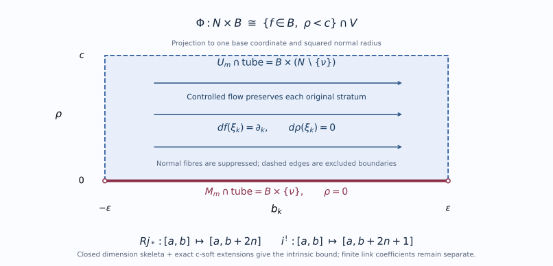
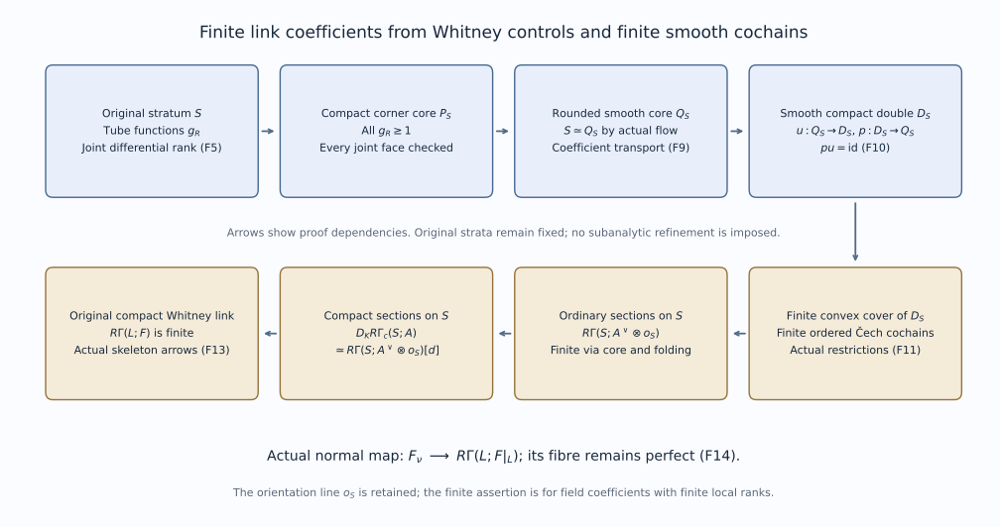

# SH02-PNM-UNIT — Perverse degrees and normal Morse complexes

The finite holomorphic microsupport argument uses perversity only after passing to a field. This lesson identifies the exact two inputs, checks the dimension shifts, and proves the functorial consequences needed there. Bounded perverse recollement on the original locally finite Whitney strata is proved below for arbitrary weak coefficients and finite coefficients. The normal-Morse geometric degree bounds are proved by the original-pair and complex-link arguments linked below, at their stated analytic provider scope. The categorical gluing argument and the comparison of degree tests under refinement are identified below.

## SH02-PNM-CONTRACT — Coefficients, ranges and external theorems

Let $K$ be an arbitrary field, of any characteristic. Let $X$ be a finite-dimensional complex analytic space, locally equipped with a finite complex Whitney stratification $\mathcal S$. Globally the stratification need only be locally finite. Work in $D^b_{\mathcal S,c}(X;K)$, the bounded derived category of complexes with finite-dimensional locally constant cohomology sheaves on its strata. The arguments about degrees also apply to the weakly constructible bounded category when finite-dimensionality is not used.

The mathematical supplier is the 2 June 2021 version of Maxim–Schürmann, [*Constructible sheaf complexes in complex geometry and applications*](https://people.math.wisc.edu/~lmaxim/handbook.pdf). Page numbers below are its printed page numbers. It works with commutative noetherian coefficient rings of finite global dimension; every field satisfies that assumption.

| External contract | Exact statement used | Source location |
| --- | --- | --- |
| Perverse existence | The middle-perverse halves defined by support and cosupport dimensions form a t-structure, also for a fixed Whitney stratification | Definition 2.16 and the gluing paragraph before Theorem 2.18, pp.12–13 |
| Pointwise characterization | On a stratum of complex dimension $d$, the stalk upper bound is $-d$ and the point-costalk lower bound is $d$ | Theorem 2.18, p.13 |
| Normal Morse models | Generic conormal points have normal Morse objects represented by supported normal-slice data, independent up to isomorphism of the allowed local choices | Theorem 3.12 and (26), pp.28–29 |
| Normal Morse bounds | Each perverse half is characterized by its normal Morse objects shifted by minus the complex stratum dimension | Corollary 3.25, pp.35–36; Example 3.26, p.36 |

[Gluing t-structures, Theorem 2.1](../../GL-PERV/gluing-t-structures.html#2-construct-a-truncation-from-the-two-pieces) supplies the abstract categorical construction. Its exact recollement hypotheses are the adjunctions $j_!\dashv j^*\dashv j_*$ and $i^*\dashv i_*\dashv i^!$, full faithfulness, $j^*i_*=0$, and the two localization triangles formed by their unit and counit maps. The proof constructs a truncation triangle by two cuts and an octahedron and proves orthogonality and functoriality. Theorem 1.4.10 of Beilinson–Bernstein–Deligne, [*Faisceaux pervers*](https://publications.ias.edu/sites/default/files/Faisceaux%20pervers.pdf), pp.48–49, is the classical antecedent. The section on bounded Whitney recollement below proves its realization with arbitrary weak coefficients and original-stratum ordinary and exceptional constancy. The finite compact-link proof below establishes preservation of finite stalk coefficients in the original strong category. The normal-Morse bounds also require the complex-link triangles, transverse restriction and real stratified Morse approximation used in the supplier's Theorem 3.19 and (35), pp.32–33.

## SH02-PNM-POINTS — Keeping point costalks distinct from stratum costalks

For $x\in S\in\mathcal S$, put $d=\dim_{\mathbb C}S$ and let $i_x:\{x\}\hookrightarrow X$. The pointwise contract says

$$
\begin{aligned}
F\in{}^pD^{\leq0}
&\Longleftrightarrow F_x\in D^{\leq-d}(K)
\quad\text{for all }x\in S,\ S\in\mathcal S,\\
F\in{}^pD^{\geq0}
&\Longleftrightarrow i_x^!F\in D^{\geq d}(K)
\quad\text{for all }x\in S,\ S\in\mathcal S.
\end{aligned}
\tag{PNM1}
$$

The opposite signs in PNM1 are necessary. Let $i_S:S\hookrightarrow X$ and $j_x:\{x\}\hookrightarrow S$. Composition gives $i_x^!=j_x^!i_S^!$. Since $i_S^!F$ has locally constant cohomology along $S$, the local orientation calculation in [manifold duality](../../sheaf-proof-readings/SH02-manifold-duality.html) gives

$$
j_x^!i_S^!F\simeq (i_S^!F)_x[-2d].
\tag{PNM2}
$$

Here the complex manifold supplies its real orientation. Thus the point-costalk bound $d$ is equivalent to the stratum-costalk bound $-d$. Substituting $-d$ directly for the point-costalk bound would lose the real dimension shift $2d$.

The support-dimension formulation in the perverse-existence contract makes the perverse conditions intrinsic. The following comparison proves exactly how the degree tests behave under refinement for an object satisfying the original ordinary and exceptional stratum local-constancy conditions.

## SH02-PNM-REFINEMENT — Comparing the same object on a locally finite refinement

Changing a partition changes its constructible category. The comparison needed here concerns an object already constructible on the original strata, together with its stratum costalks.

**Proposition.** Let $\mathcal T$ be a locally finite refinement of $\mathcal S$ by locally closed smooth complex strata. Every $T\in\mathcal T$ is contained in one $S\in\mathcal S$. Suppose, for each original stratum $S$, that both $i_S^{-1}F$ and $i_S^!F$ have locally constant cohomology, and that the point-orientation comparison PNM2 holds. Then the two tests in PNM1 for $F$, using the dimensions of the original strata, are respectively equivalent to the same tests using the refined dimensions. This assertion uses no finite-dimensionality of the coefficient modules and remains valid for weak coefficients. No global finite partition is required.

**Proof.** If $T\subset S$ has complex dimension $e$ and $S$ has dimension $d$, then $e\leq d$. At the same point $x\in T$, the original upper bound $-d$ implies the refined upper bound $-e$, and the original lower bound $d$ implies the refined lower bound $e$. These are inclusions of ordinary cohomological degree ranges; the stalk and point costalk themselves have not changed.

For the converse, the union $S^{\mathrm{full}}$ of the refined strata of dimension $d$ is dense in $S$. To check this without a finite-stratum assumption, fix a relatively open neighborhood meeting only finitely many refined strata. Every lower-dimensional piece is a positive-codimension locally closed submanifold of $S$ and is nowhere dense there. Indeed, if its closure contained an open set, that set would meet the piece. At such a point choose a smaller neighborhood on which the piece is closed. Density would make it contain an open neighborhood, contradicting its positive codimension. A finite union of their closed nowhere-dense closures has empty interior: successively shrink any nonempty open set away from each closure. Thus every nonempty open subset meets a full-dimensional piece. Apply this argument in the locally finite neighborhoods to obtain density throughout $S$.

On $S^{\mathrm{full}}$ the refined tests have exactly the original thresholds. For every $q>-d$, the locally constant sheaf $H^q(i_S^{-1}F)$ therefore has zero stalks on that dense subset. Its nonzero-stalk locus is open, so it is zero on all of $S$. This proves the original upper test.

For the lower test, PNM2 and the cohomological shift convention give

$$
H^r(i_x^!F)\simeq H^{r-2d}(i_S^!F)_x.
\tag{PNMR1}
$$

For every $r<d$, these stalks vanish on $S^{\mathrm{full}}$. The sheaf on the right is locally constant on the original stratum, so the same open-locus argument forces vanishing everywhere on $S$. This proves the original lower test. Apply the argument separately on every original stratum and in every degree. Dimension zero is included: it has no lower-dimensional refinement pieces. $\square$

The ordinary and exceptional local-constancy assertions in this proposition are geometric inputs. The comparison does not construct perverse truncations or prove that they stay constructible for a specified Whitney stratification. The bounded weak construction on the original singular analytic space is proved in the next section; the finite compact-link argument below discharges its remaining finite-coefficient input.

**Problem.** Refine $\mathbb C$ by $\{0\}$ and $\mathbb C\setminus\{0\}$. Compare a local system $L[1]$ with a skyscraper $i_*K$ at zero, where $i:\{0\}\hookrightarrow\mathbb C$.

**Solution.** The stalk of $L[1]$ is in degree $-1$ and its point costalk is in degree $1$, by the real two-dimensional orientation shift. Both tests hold before and after refinement; at zero the refined bounds are the weaker degree-zero bounds. For $i_*K$, the stalk and point costalk at zero are $K$ in degree zero, using the closed-support identity $i^!i_*K\simeq K$; both are zero off zero. It satisfies the refined tests but is not constructible on the single original stratum, and its degree-zero stalk violates that stratum's upper bound $-1$. Thus the proposition cannot assert equality of the whole constructible categories.

## SH02-PNM-WHITNEY-REALIZATION — Bounded recollement on the original Whitney strata

Let the underlying space of a complex analytic space \(X\) be locally a closed analytic subset of an open subset of a finite-dimensional complex vector space. Let \(\dim_{\mathbb C} X\le n\). Fix the original locally finite complex Whitney \((a,b)\) stratification \(S\), with the frontier rule and strict dimension decrease along a proper frontier. All assertions concern this stratification. Let \(K\) be any field, and let \(D^b_{S,w}(X;K)\) mean bounded complexes whose cohomology sheaves restrict to locally constant sheaves of arbitrary \(K\)-modules on every original stratum.

Set \(X_{-1}=\varnothing\), let \(X_m\) be the union of strata of complex dimension at most \(m\), and put

\[
E_m=X\setminus X_{m-1},\qquad M_m=X_m\setminus X_{m-1},
\qquad U_m=X\setminus X_m.
\]

For the closed inclusion \(i:M_m\to E_m\) and open complement \(j:U_m\to E_m\), all six classical recollement functors restrict to the corresponding bounded weak categories on the **original strata**. For arbitrary bounded sheaf complexes, without any constructibility hypothesis,

\[
Rj_*D^{[a,b]}(U_m;K)\subset D^{[a,b+2n]}(E_m;K),\tag{W1}
\]
\[
i^!D^{[a,b]}(E_m;K)\subset D^{[a,b+2n+1]}(M_m;K).\tag{W2}
\]

These are uniform global bounds obtained by local tests; no global countable-at-infinity assumption or bound on local embedding dimensions is introduced. The geometric constancy proof uses the preceding compatible Whitney tubes, controlled lifts and controlled flow in their stated **local smooth ambient** setting, together with coefficient transport for a bounded complex along stratum-preserving paths. Their full proofs are linked below. The proof checks the return from each ambient calculation to the original singular space.

If, additionally, every compact normal link used below has a compatible finite triangulation with the finite cohomology coefficient calculation preceding by the compact-fibre provider, the same functors preserve finite-dimensional cohomology. The compact smooth-core argument below proves finite link coefficients on the original Whitney strata.

### 1. The skeleton and three c-soft preservation checks

Every \(X_m\) is closed. Indeed, local finiteness reduces closure of a union locally to closure of finitely many strata; the frontier of each such stratum consists of strictly lower-dimensional original strata already in the union. Consequently \(M_m\) is closed in \(E_m\), and is a smooth manifold locally equal to one original stratum of dimension \(m\). Distinct strata of that dimension are open components of this layer locally: another such stratum cannot approach a point on it by the strict frontier rule. Thus a globally infinite layer causes no additional induction stage.

We use the compact-extension definition of c-softness on locally compact Hausdorff spaces: every section on every compact subspace extends globally. Restrictions to locally compact subspaces preserve this property, because restriction to a compact subspace is the same iterated inverse image and a compact set remains compact in the ambient space.

**Open extension.** For an open inclusion \(v:L\to Y\), exactness of \(v_!\) follows from its stalks. Suppose \(Q\) is c-soft on \(L\). A section of \(v_!Q\) on a compact subset \(C⊂Y\) has compact support \(A⊂C\cap L\): its zero-germ locus is open in \(C\), and all germs off \(L\) vanish. Choose a compact neighborhood \(P\) of \(A\) inside \(L\). Prescribe the given section on \(C\cap P\) and zero on \(∂P\). They agree on their intersection. Finite closed gluing and c-softness on \(L\) extend these prescriptions. The extension vanishes on a neighborhood of \(∂P\), so cutting there and extending by zero gives a section on \(Y\) with the prescribed restriction to \(C\). Hence \(v_!Q\) is c-soft. This is exactly the support-extension construction C2, rather than an assertion about nonproper direct image.

**Closed direct image.** If \(h:Z\to Y\) is closed, its direct image is exact. For a compact \(C⊂Y\), the natural closed-embedding base-change map identifies

\[
(h_*Q)|_C\simeq (h_C)_*(Q|_{C\cap Z}).
\]

This is an isomorphism on every stalk: the stalk is the original module on \(C\cap Z\) and zero elsewhere. Therefore a section on \(C\) is a section of \(Q\) on the compact set \(C\cap Z\). Its c-soft extension on \(Z\), pushed forward, is the required global section on \(Y\). Thus **closed** direct image preserves c-softness. This does not claim preservation by arbitrary \(f_*\).

**Ordinary sections.** A c-soft sheaf on a locally compact Hausdorff space with an exhaustion \(C_r⊂int C_{r+1}\) is acyclic for ordinary sections. Here is the actual argument. In a short exact sequence with c-soft kernel, the compact lifting lemma C3 lifts a global quotient section on every \(C_r\). Correct a lift on \(C_{r+1}\) by extending its difference from the chosen lift on \(C_r\), using c-softness of the kernel. Compatible lifts glue on the interiors. Hence global sections are exact on any such short exact sequence. Injectives are c-soft, and a quotient of two c-soft sheaves is c-soft by C3 on each compact subset. An injective resolution of a c-soft sheaf therefore remains exact after global sections in positive degrees. This proves ordinary acyclicity on these spaces, using the exhaustion explicitly. It is also the B1 proof in the duality provider. It does not confuse compact-support acyclicity with ordinary acyclicity.

Every open subset of a local analytic chart has such an exhaustion: it is locally compact, Hausdorff and second countable. A countable cover by relatively compact opens, enlarged successively around previous compact sets, constructs the nested compact exhaustion. This is the only countability needed below.

### 2. Intrinsic cohomological dimension

More generally let \(Y\) be one such local open space, with a locally finite smooth stratification satisfying the frontier rule and real stratum dimensions at most \(D\). For **every** module sheaf \(F\) on \(Y\),

\[
H^q(Y;F)=0\quad(q>D).\tag{W3}
\]

This applies to every open subset of \(Y\), with the restricted stratification.

To prove it, write \(Y_r\) for the closed union of strata of real dimension at most \(r\), and \(L_r=Y_r\setminus Y_{r-1}\). The layer is a second-countable manifold with local dimension \(r\), including any disconnected components. Its arbitrary sheaf \(F|_{L_r}\) has a c-soft resolution of length at most \(r\), by D9–D10 of the uniform manifold proof (equivalently M2–M4 of the preceding manifold-duality proof). No finite rank, projectivity or field property enters this resolution.

Let \(v_r:L_r\to Y_r\) be open and \(h_r:Y_r\to Y\) closed. Both exact functors preserve c-softness by the preceding checks. Applying \(h_{r*}v_{r!}\) to that finite resolution gives a resolution of

\[
P_r=h_{r*}v_{r!}(F|_{L_r})
\]

by sheaves acyclic for ordinary sections on \(Y\). Thus \(R\Gamma(Y;P_r)\) lies in degrees \([0,r]\). The original sheaf has the actual finite filtration described by the short exact sequences

\[
0\longrightarrow P_r\longrightarrow h_{r*}(F|_{Y_r})
\longrightarrow h_{r-1,*}(F|_{Y_{r-1}})\longrightarrow0.\tag{W4}
\]

Exactness is stalkwise; the map to the smaller skeleton is ordinary restriction. At the last stage the middle sheaf is \(F\). Long exact cohomology sequences show inductively that its derived sections lie in \([0,D]\). The number of layers does **not** multiply the bound: an extension of two complexes in \([0,D]\) again lies in \([0,D]\). This proves W3.

For analytic \(X\), take \(D=2n\). If \(j:U\to E\) is any open inclusion between open subsets of \(X\), the usual injective stalk formula is

\[
(R^qj_*Q)_x=\mathop{\rm colim}_{x\in V}H^q(V\cap U;Q).
\]

Small \(V\) lie in local analytic charts. W3 kills this group for \(q>2n\), uniformly for every \(x\), regardless of chart embedding dimension. Finite ordinary truncation triangles for a complex in \([a,b]\) give W1. Right derived direct image preserves the lower bound \(a\).

For the complementary closed inclusion, the existing global sheaf localization triangle is

\[
i_*i^!F\longrightarrow F\longrightarrow Rj_*j^{-1}F\xrightarrow{+1}.
\]

The two right objects lie in \([a,b]\) and \([a,b+2n]\). Their fibre lies in \([a,b+2n+1]\); the long exact sequence also proves the lower bound \(a\). Closed direct image reflects vanishing on its closed support, so this is W2. The extra \(+1\) is a safe support bound, not a sharpness assertion, including when \(n=0\).

### 3. A product on the original Whitney strata

Fix \(x∈M_m\) on an original stratum \(S\). Work in a small analytic embedding of \(E_m\) as a closed subset \(V\) of a smooth ambient chart. Lower-dimensional strata have been deleted. By local finiteness and the frontier rule, shrink so that the only stratum of dimension \(m\) meeting the chosen neighborhood of \(x\) is the local piece of \(S\).

Choose an ordinary tube for \(S\). In base coordinates its projection is a smooth ambient map \(f\) to a ball in \(R^{2m}\). WT1 makes \(f\) submersive on all incident upper strata after shrinking; it is the identity in coordinates on \(S\). Apply the compatible-tube construction CTU1–CTU7 to this \(f\). Its tube projection onto \(S\) is necessarily \(f\) in these coordinates, since \(fπ_S=f\) and \(f|_S\) is the identity. Write \(ρ\) for its squared normal norm.

Lift each base coordinate field by CL1–CL6. On common controlled tube neighborhoods its flow satisfies

\[
df(\xi_k)=\partial_k,\qquad dρ(\xi_k)=0.
\]

The fields need only be smooth on each stratum. CF1–CF5 proves a continuous stratum-preserving flow on an open time-space domain and compact escape at a finite endpoint. No ambient continuity of the vector field is presumed.

Choose a closed base cube \(C\) with a smaller open cube \(B\) about zero, and choose \(c>0\) so that the entire closed normal disk bundle over \(C\) with \(ρ\le c\) lies inside the common controlled tube and ambient chart. Its intersection with \(V\) is compact. Coordinate flow segments whose base stays in \(C\) and whose radius is less than \(c\) cannot leave this tube, and cannot have a finite endpoint there, by the compact escape theorem. Thus all the following finitely many coordinate flows are defined.

Let \(N={f=0,ρ<c}\cap V\), and let \(ν\) be its unique point on \(S\). Apply the coordinate flows in a fixed order for times \(b_1,…,b_{2m}\). This gives

\[
\Phi:N\times B\xrightarrow{\sim}
\{z\in V:f(z)\in B,ρ(z)<c\}.\tag{W5}
\]

Its inverse reads \(b=f(z)\) and runs the same flows with negative times in reverse order. The flow theorem makes both maps continuous. Each segment preserves \(ρ\); base coordinates have exactly the indicated translations. These facts prove the domain and inverse assertions. The product carries \(S\) to \({ν}×B\), and **each original upper stratum** to its central-fibre piece times \(B\). The construction stays inside the original singular closed set. It does not change the stratification to μ or identify different constructible categories.

This projection onto one base coordinate and squared normal radius displays W3–W5. Horizontal arrows are the controlled flows with \(df(\xi_k)=\partial_k\) and \(d\rho(\xi_k)=0\). Normal fibre geometry is suppressed; dashed edges and open endpoints mark excluded boundaries. The closed dimension filtration and the exact c-soft preservation proofs give the two displayed intrinsic bounds. [Reproducible diagram source](../figures/draw_dimension_layer.py).

### 4. The coefficient comparison and exceptional constancy

We use NMG5 in precisely its bounded weak form. If a continuous homotopy \(H:T×[0,1]\to Z\) has each vertical path in one original stratum and \(A\) has locally constant cohomology there, put \(G=H^{-1}A\). The projection \(p:T×[0,1]\to T\) is proper. Its fibre cohomology is the cohomology of a local system on a compact interval, so proper base change shows that the endpoint maps

\[
H_0^{-1}A\ \xleftarrow{\sim}\ Rp_*H^{-1}A\
\xrightarrow{\sim}\ H_1^{-1}A\tag{W6}
\]

and the evaluation counit are isomorphisms. The bounded cohomology filtration justifies this for a complex; coefficients may be arbitrary modules. These are natural \(K\)-linear arrows. A bare homeomorphism would not supply them.

On the product W5, use the homotopy \((z,b,t)↦(z,tb)\) transported by \(Φ\). Every vertical path stays in an original stratum. W6 identifies the given coefficient object with \(q^{-1}A_0\), where \(q:N×B\to N\) is projection and \(A_0\) is its exact restriction at base zero. The same statement holds for an object initially defined only on the punctured tube \((N\setminus\{\nu\})×B\); no ambient constructible extension of that object is assumed.

Here is the sheaf, rather than merely vector-space, constancy check. For \(N_r={ρ<r}\cap N\), a small closed base ball \(D⊂B\) gives a proper projection \(D×N_r\to N_r\). Proper base change, with its constant-ball fibre calculation, identifies

\[
RΓ(D\times N_r;q^{-1}A_0)\simeq RΓ(N_r;A_0),\tag{W7}
\]

and the identical comparison for \(N_r\setminus\{\nu\}\). These identifications commute with shrinking \(D\) and \(r\) and with the restriction map between the two normal sets. For stalk calculations, open base balls and closed base balls with interior form interleaving cofinal neighborhood systems. Inverse-image restriction maps on derived sections compose naturally; thus their filtered colimits agree. This uses closed balls only as local neighborhoods, not a nonproper base-change theorem.

For a punctured coefficient object \(G_0\), the actual evaluation map

\((R\Gamma(N_r\setminus\{\nu\};G_0))_{N_r\setminus\{\nu\}}\to G_0\)

pulled back to the product, followed by open adjunction, gives a map from the corresponding constant complex on \(B\) to \(i^{-1}Rj_*G\). Open restriction identifies the targets for different \(r\). The maps are compatible with ordinary restriction in \(r\). Passing to an exact filtered colimit of their complex models gives a morphism from a constant complex to \(i^{-1}Rj_*G\). W7 and the stalk formula show it is a quasi-isomorphism on every stalk of \(B\). In particular all its cohomology sheaves are locally constant on the **original** \(S\).

For \(F\), apply the same construction to the actual normal restriction map

\[
RΓ(N_r;A_0)\longrightarrow RΓ(N_r\setminus\{ν\};A_0).
\]

Its fibre is \(R\Gamma_{\{ν\}}(N_r;A_0)\). The evaluation maps form a map of the two localization diagrams. Using one injective complex model and its restriction maps gives their specified map of fibres; no uniqueness of an unspecified cone is invoked. W7 identifies the stalks of the resulting constant-complex map with the stalks of \(i^!F\). Exact filtered colimits give a quasi-isomorphism on \(B\). Hence \(i^!F\) has locally constant cohomology on the original \(S\) as well. W1–W2 already supply uniform boundedness of both comparisons.

More explicitly, take one bounded-below injective model \(I\) on the normal fibre (on the punctured fibre for \(G_0\)). Its section complexes on all \(N_r\) have strict restriction maps. The actual chain evaluation from the constant complex of those sections to \(I\), pulled back to the product, composes with one fixed injective replacement of that pullback. Open chain adjunction gives the displayed maps into \(j_*\) of the punctured replacement. For \(F\), use the chain map from full to punctured sections and its actual cone shifted by \([-1]\); the evaluation square commutes. The target is the same shifted cone for the product replacement, whose localization quasi-isomorphism is the supported complex. Inverse image to \(B×{ν}\) identifies the targets across shrinking tube opens. Thus the compatible maps and their filtered colimit are maps of actual complexes. They do not rely on constructing a colimit from a family of unenhanced derived morphisms.

On \(U_m\), \(Rj_*G\) restricts to \(G\) itself. The local calculations at \(M_m\) therefore prove its ordinary original-stratum constructibility everywhere. They prove exceptional constancy on the closed smooth layer for every originally constructible input, including subsequent correction cones.

### 5. Cones, cuts, and actual recollement

The bounded weak category is triangulated. On a small convex coordinate ball of an original stratum, a bounded complex with locally constant cohomology is isomorphic to the constant complex of its derived sections: the cohomology filtration, constant-sheaf acyclicity and evaluation prove this by a stalk test. This works for arbitrary modules. Derived constant/section adjunction, together with \(R\Gamma(B;C_B)=C\), shows that the constant-complex functor is fully faithful there; in particular a derived morphism between the two constant models comes from a morphism of coefficient complexes. That functor is exact, so its cones remain constant. This also proves local constancy of the extensions appearing in the cohomology sequence; finite generation is not smuggled into that assertion. Ordinary smart truncations preserve the cohomology sheaves retained by definition.

The four exact functors \(j^{-1},i^{-1},i_*,j_!\) preserve the original ordinary cohomological local constancy by restriction or their original-stalk-or-zero descriptions. Their bounds are \([a,b]\). Sections 2–4 handle \(Rj_*\) and \(i^!\). Thus all functors and both localization triangles of the existing global \(D^{+}\) recollement lie in the claimed bounded full subcategories. The adjunctions and full faithfulness restrict to them, since their Hom sets are the original derived Hom sets.

Apply GL-PERV Theorem 2.1 first to the highest-dimensional layer, then successively downward in \(m\). The open category at step \(m\) is the preceding \(E_{m+1}=U_m\); on \(M_m\) use the ordinary t-structure with cut degree \(-m\). There are at most \(n+1\) stages. The preceding gluing proof and the present preservation argument keep both correction cones in \(D^b_{S,w}\). Its orthogonality and boundedness theorem applies at each finite stage.

The resulting halves have ordinary stratum restriction in degrees \(\le -\dim_{\mathbb C} S\) and exceptional stratum restriction in degrees \(\ge -\dim_{\mathbb C} S\). Exceptional composition on a smooth original stratum of complex dimension \(d\), with its complex orientation, gives

\[
H^r(i_x^!F)=H^{r-2d}(i_S^!F)_x.
\]

Thus the lower stratum test is the original point-costalk threshold \(r\ge d\); the upper point-stalk threshold is \(r\le -d\). This proves the weak realization with the original signs. It uses global sheaf functors, so no separate descent of chartwise truncation arrows is needed.

### 6. Finite coefficients: the remaining exact obligation

Whitney rank also makes the normal radius a submersion on every positive-radius fibre stratum. Normal fibres and level links inherit Whitney regularity by the tangent-kernel argument for transverse restriction. Their frontier is verified by the corresponding local products. A level

\(L={ρ=r_0,f=0}\cap V\)

is compact, and the radius map on the punctured normal tube is proper over each compact interval of positive radii. The proper controlled product NMG4 therefore identifies that tube with \(L×(0,c)\), preserving original stratum labels. W6 identifies its coefficients with pullback from \(L\). Consequently its derived sections are \(R\Gamma(L;A|_L)\). One can check this last comparison by the interval deformation retraction with W6: the actual pullback maps for the retraction and section are inverse on derived sections. Equivalently use compact interval exhaustion with constant transition comparisons.

Restrictions between sufficiently small full normal cones are also isomorphisms on derived sections. Radial dilation by a positive factor is connected to the identity by a stratum-preserving homotopy fixing the vertex, and W6 identifies its coefficient pullback. The natural pullback on sections along that homotopy has endpoint zero equal to the identity; both endpoint evaluations are isomorphisms. Hence the actual dilation pullback, and therefore ordinary restriction to the smaller cone, is an isomorphism. Taking their germ colimit identifies full-cone sections with the original stalk \(A_ν\).

The finite coefficient calculation required for the two difficult functors is therefore exactly the normal map and its fibre

\[
A_ν\longrightarrow RΓ(L;A|_L),\qquad
\operatorname{fib}\bigl(A_ν\to RΓ(L;A|_L)\bigr).\tag{W8}
\]

The map is the actual punctured-neighborhood restriction; it cannot be replaced by a rank count. For \(Rj_*\) alone use the link coefficient object initially defined on the punctured tube. A compatible **finite** triangulation of \(L\), on whose simplices the cohomology coefficients are locally constant and finite dimensional, gives finite-dimensional link cohomology by the preceding finite star/cochain descent. W8 then preserves finite dimensions. No infinite colimit of unrelated finite-dimensional groups is being called finite: the preceding radial comparisons prove stabilization.

The next section proves finite coefficients on the original compact Whitney link using compact smooth cores and finite cochains; a standalone compatible triangulation theorem remains a separate geometric statement. If an available triangulation theorem only covers subanalytic strata, prove that its hypotheses apply to these original strata or supply the broader Whitney theorem. Merely selecting a μ-refinement or imposing finite coefficients does not prove this geometric claim. The arbitrary-module weak realization above is independent of finite triangulation and biduality; the next section proves the last finite coefficient input and retains the actual W8 arrow.

The complete internal inputs are the [c-soft extension and lifting proofs C2–C4](../../constructible-duality-and-infinite-twists/duality-maps-for-constructible-inverse-and-direct-images.html#compact-support-extension), the [finite manifold resolution D9–D10](../../constructible-duality-and-infinite-twists/duality-maps-for-constructible-inverse-and-direct-images.html#uniform-manifold-dimension), the [ordinary-section proof B1](../../constructible-duality-and-infinite-twists/duality-maps-for-constructible-inverse-and-direct-images.html#ordinary-cohomology-bound), the [Whitney compatible tubes and their controlled lifts and flows](../../sheaf-proof-readings/SH02-open-prerequisite-proofs.html#SH02-PRP-COMPATIBLE-TUBES), [NMG4–NMG5 proper products and bounded coefficient transport](../normal-morse-coefficients.html#SH02-NMC-NORMAL-FAMILY), and [GL-PERV Theorem 2.1](../../GL-PERV/gluing-t-structures.html#2-construct-a-truncation-from-the-two-pieces). The finite coefficient reduction W8 uses the [finite compact-fibre cochain calculation](../../sheaf-proof-readings/SH03-perfect-coefficients-on-compact-fibres.html), once its geometric hypotheses have been checked. This proof and diagram are independently authored and dedicated to [CC0 1.0](https://creativecommons.org/publicdomain/zero/1.0/).

## SH02-PNM-FINITE-WHITNEY-LINK — Finite coefficients on the original compact Whitney link

Let \(L\) be a compact closed subset of a finite-dimensional smooth manifold, with a locally finite smooth Whitney \((a,b)\) stratification satisfying the frontier rule and strict dimension decrease on proper frontiers. Let \(K\) be any field. If \(F∈D^b(K_L)\) has finite-dimensional locally constant cohomology on these **original** strata, then

\[
RΓ(L;F)\in D^b_{\mathrm{fd}}(K).\tag{F1}
\]

There is no subanalyticity hypothesis. Compactness and local finiteness imply that there are finitely many stratum labels. We do not split disconnected strata into additional labels. The proof has four stages: compatible tube cuts give compact cores of individual strata; a rounded core and its double give finite ordinary cochains; manifold duality gives finite compact-support cohomology on each stratum; the original localization triangles assemble the answer with their actual maps.

The needed geometric input is precisely the supplied Whitney control data, including the shrinking construction CL2 and the rank property WT1. CTU supplies these data for the constant ambient map to a point. Its ordinary smooth constructions SCF supply the partitions, minorants, bundle right inverses and ODEs used below. No general Whitney triangulation theorem is used.

### 1. Compatible small caps, including their domain boundaries

Fix an original stratum \(S\). For each lower stratum \(R<S\), write \((T_R,\pi_R,\rho_R)\) for its control tube. The norm is squared, so \(\rho_R\ge 0\) and its zero set is \(R\). The control identities are

\[
π_Rπ_T=π_R,\qquad ρ_Rπ_T=ρ_R\quad(R<T)
\]

where both sides are defined. WT1 says \((\pi_R,\rho_R)|_S\) is submersive inside the sufficiently shrunken tube.

Apply CL2 to the actual final control tubes. Obtain neighborhoods \(B_R\subset C_R\subset A_R\subset T_R\) with \(B_R\) closed off \(\partial R\), \(R\subset \operatorname{int}_L B_R\), incomparable \(C_R,C_T\) disjoint, and

\[
π_T(C_T\cap B_R)\subset A_R\quad(R<T).\tag{F2}
\]

These conditions ensure that the control identities used below are defined after projecting to a higher lower stratum. Mere tube overlap would not ensure that fact.

Choose a positive smooth function \(\varepsilon_R\) on \(R\) such that its entire closed normal disk with \(\rho_R\le 4\varepsilon_R\) lies in the tube and, after intersecting with \(L\), lies in \(\operatorname{int}_L B_R\). These are open restrictions on a variable radius, and SCF8 supplies a smooth positive minorant. When \(\partial R≠\varnothing\), impose in addition that every point \(z\) in this disk satisfies

\[
d(z,π_Rz)<\tfrac1{10}d(π_Rz,\partial R).\tag{F3}
\]

Here \(d\) is a compatible ambient metric; \(\partial R\) is closed. The inequality is an open requirement around each zero vector and is possible because its right side is positive on \(R\). No constant radius on a noncompact stratum is assumed.

The cap \({\rho_R\le 4\varepsilon_R(\pi_R)}\) has closure, off \(\partial R\), inside the actual tube. To check it, take a convergent sequence of cap points. Their bases lie in \(R\subset L\), so a subsequence of bases converges in the compact set \(\overline R\). If its limit were in \(\partial R\), F3 would force the point limit to be that same frontier point. Otherwise the base limit lies in \(R\); a local bundle trivialization, continuity of \(\varepsilon_R\), and compactness of a closed fibre disk put the limit in the retained closed disk and hence in the tube. The same reasoning retains its \(B_R\) condition. This prevents artificial faces at an undefined tube edge.

Put \(\phi_R=\rho_R/(\varepsilon_R∘\pi_R)\) on the tube. Choose a smooth saturation function \(\theta:(0,∞)\to (0,3]\) equal to \(t\) for \(t\le 2\), greater than \(2\) for \(t>2\), and identically \(3\) for \(t\ge 4\), with smooth flat matching at \(4\). Such a function is obtained by integrating a positive smooth derivative on \((2,4)\) with its endpoint values and total integral \(1\), then matching the identity and constant pieces. Define on \(S\)

\[
g_R=θ(φ_R)\text{ on the cap region},\qquad g_R=3\text{ outside it}.\tag{F4}
\]

The preceding closure check and saturation make this a globally smooth positive function on \(S\). In particular \(g_R\le 2\) exactly in the normalized small cap, where \(g_R=\phi_R\). At a point of \(R\) approached through \(S\), \(g_R\) tends to zero: the projection tends to that point, the norm tends to zero, and \(\varepsilon_R\) has a positive value there.

### 2. The joint corner rank, rather than individual wall rank

At any \(z∈S\), the active lower strata with \(g_R(z)\le 2\) form a chain. Indeed their caps lie in \(B_R\subset C_R\), and incomparable \(C_R\) are disjoint. The differentials of all their functions are jointly surjective:

\[
(dg_{R_1},\ldots,dg_{R_q}):T_zS\longrightarrow K_0^q
\quad\text{is surjective},\qquad K_0=\mathbb R.\tag{F5}
\]

We use \(K_0\) only to distinguish the real differential target from the coefficient field \(K\).

Here is the dimension induction proving F5. Let \(T\) be the largest active lower stratum. F2 puts \(\pi_T(z)\) in every smaller active tube. The actual control identities imply

\[
φ_R(z)=φ_R(π_Tz)\quad(R<T),
\]

including the denominator, since \(\pi_R\pi_T=\pi_R\). Thus these lower normalized functions factor through \(\pi_T\). Their values at \(\pi_Tz\) are still at most \(2\), so the induction hypothesis on the lower-dimensional manifold \(T\) makes their joint differential surjective there. Meanwhile WT1 gives the surjection

\((d\pi_T,d\rho_T):T_zS\to T_{\pi_Tz}T⊕R\).

The row for \(\phi_T\) is \(d\rho_T/\varepsilon_T\) plus a row depending only on \(d\pi_T\). Its coefficient on the independent radius coordinate is nonzero. The resulting block triangular system is surjective. The case of one row is the same argument without the lower block; the empty case is vacuous. Strict frontier dimension decrease makes this a finite induction.

Consequently

\[
P_S=\{z\in S:g_R(z)\ge1\text{ for every }R<S\}\tag{F6}
\]

is a smooth manifold with corners: at each face its active boundary functions \(g_R-1\) are jointly independent, and the inverse-function theorem gives an orthant chart. There are no extra cap-domain faces, by Section 1. It is compact. Otherwise a sequence in this closed subset of \(S\) would have a limit in \(\overline S\setminus S\), on some lower stratum \(R\), where \(g_R\to 0\), contradicting \(g_R\ge 1\).

### 3. An actual outward flow and a rounded compact core

There is a smooth vector field \(w\) on \(S\) satisfying

\[
dg_R(w)=g_R\quad\text{whenever }g_R\le2.\tag{F7}
\]

At each point, retain its finite active chain, exclude the closed inactive constraint sets nearby, and use F5 and a smooth bundle right inverse to solve these affine equations on that neighborhood. Rank remains surjective on a smaller open neighborhood. A smooth partition of unity averages the local fields. Every contributing field satisfies the same active equations at the point of evaluation, so their weighted average does too. No derivatives of the weights occur in \(dg_R(w)\).

The forward flow \(\alpha(t,z)\) exists for every \(t\ge 0\). While \(g_R\le 2\), it grows exponentially; the positive derivative at level \(2\) prevents crossing that level downwards. Thus along the trajectory

\[
g_R\ge\min(g_R(z),2)>0
\]

for every lower \(R\). The simultaneous lower bounds define a compact subset of \(S\): a lower frontier limit would again force its corresponding \(g_R\) to zero. A smooth ODE trajectory trapped in this compact subset extends through every finite endpoint by SCF's compact nonescape argument. This proves the claimed forward completeness even though \(S\) itself need not be compact.

With \(g_{\min}\) the minimum of the finitely many lower functions, the continuous time

\(T(z)=\max(0,\log(1/g_{\min}(z)))\)

pushes all of them to at least \(1\). Use \(T=0\) if there are no lower strata. Therefore \(\alpha(tT(z),z)\), \(0\le t\le 1\), is a strong deformation retraction onto \(P_S\), through paths entirely in the **same original stratum**.

For ordinary finite cochains it is convenient to round the corners without a triangulation theorem. Choose smooth \(\chi:(0,3]\to [0,∞)\) with \(\chi'=−β(t)/t²<0\) for \(t<2\), identically zero for \(t\ge 2\), and \(\chi(t)\to ∞\) as \(t\to 0\). One explicit construction is \(\chi(t)=∫_t^2 β(u)u^{-2}du\), with \(β=1\) near zero, positive before \(2\), and flat zero at \(2\). Set

\[
h=\sum_{R<S}χ(g_R).\tag{F8}
\]

Its sublevels are compact for the same frontier argument. F7 gives \(dh(w)<0\) wherever \(h>0\); therefore every positive level is regular. Choose \(C>0\), and set \(Q_S={h\le C}\). This is a compact smooth manifold with boundary. If there are no lower strata, use the already compact boundaryless \(S\) as \(Q_S\).

Every trajectory starting above \(C\) reaches that level in finite time: all initially small \(g_R\) reach \(2\) in finitely many steps of exponential growth, after which \(h=0\). The hitting time \(\tau(z)\) is smooth on \({h>C}\), by the inverse-function theorem and \(dh(w)<0\), and extends continuously as zero on \(Q_S\). The flow \(\alpha(t\tau(z),z)\) is a strong deformation retraction of \(S\) onto \(Q_S\).

This deformation has the actual coefficient comparison. For a locally constant coefficient sheaf \(A\) on \(S\), apply NMG5 to its stratum-preserving homotopy. Its natural endpoint arrows identify \(A\) with the pullback of \(A_Q=A|_{Q_S}\) through the retraction. The induced restriction

\[
RΓ(S;A)\longrightarrow RΓ(Q_S;A_Q)\tag{F9}
\]

is an isomorphism. To verify the map, pull coefficients and sections through the homotopy; evaluation at its identity endpoint is the identity, and both endpoint evaluations are isomorphisms by the proper-interval calculation. The retraction fixes \(Q_S\), so its pullback provides the inverse. Compact-support invariance has **not** been inferred from this nonproper retraction.

### 4. Finite ordinary cochains without a CW theorem for corners

The boundary of \(Q_S\) has an explicit smooth collar. Near \(h=C\), the field \(Z=w/(−dh(w))\) has \(dh(Z)=−1\). Its flow from the compact boundary exists for one common small positive and negative time interval; the level value and reverse flow give the inverse of \(\partial Q_S×(−δ,δ)\) onto the resulting neighborhood. This is the collar constructed from the displayed ODE, not a separately assumed corners theorem.

Double \(Q_S\) along its boundary using that collar. The two collar copies give a smooth coordinate \(t∈(−δ,δ)\) at the seam. Their interior charts and the seam charts define a compact smooth manifold \(D\) without boundary. If the boundary is empty, take \(D=Q_S\). There are a continuous inclusion \(u:Q_S\to D\) and folding map \(p:D\to Q_S\) with \(pu=id\). For any locally constant finite coefficient sheaf \(A_Q\), \(p^{-1}A_Q\) remains locally constant and finite, and the actual pullback arrows satisfy

\[
u^*p^*=id\text{ on }RΓ(Q_S;A_Q).\tag{F10}
\]

Thus this complex is a retract of the ordinary-section complex on \(D\) with those coefficients.

Give \(D\) a smooth positive metric using SCF's partition and bundle metric construction. The existing DG-FND strong-convexity theorem B.5 provides arbitrarily small opens for which the joining geodesic is the **unique global minimizer**. Compactness selects a finite cover \(V_1,…,V_N\) by these opens. Every nonempty finite intersection is contractible: joining any two of its points gives the same unique global minimizing geodesic in every \(V_i\), so that curve lies in the intersection. Contract to a chosen point using the smooth joining family from one of its members. Uniqueness only among curves inside a single chart would not justify this intersection claim.

For a finite locally constant sheaf \(B\) on \(D\), each intersection has finite-dimensional sections and no higher sheaf cohomology. Constancy follows from continuation or NMG5 along the contraction. Its constant-coefficient acyclicity follows from the same proper-interval contraction calculation and the section/retraction maps to a point. These arguments do not require characteristic zero.

The finite ordered Čech complex

\[
\mathcal C^r(B)=\bigoplus_{i_0<\cdots<i_r}
 Γ(V_{i_0}\cap\cdots\cap V_{i_r};B),\qquad
d=\sum_{k=0}^{r+1}(-1)^k\operatorname{res}_k\tag{F11}
\]

therefore computes \(R\Gamma(D;B)\). Its terms are finite-dimensional and it has at most \(N\) nonzero degrees. For the comparison, apply the finite ordered Čech double complex to one injective resolution of \(B\). Open restrictions and their direct images are injective, so the augmented sheaf Čech resolution computes its global sections. The other filtration uses the just proved intersection acyclicity and gives F11. Both augmentations use the actual restriction maps. This constructs finite cochains, not just finite dimensions inferred from the number of cover members.

F9–F11 show that every \(R\Gamma(S;A)\) with finite locally constant \(A\) has bounded finite-dimensional cohomology. The retract need not be called a CW equivalence of \(Q_S\); the weaker proved conclusion is sufficient here.

### 5. Compact supports by manifold duality, with the twist retained

Let \(d=dim_R S\) and let \(o_S\) be its integral-sign orientation local system extended to \(K\). The supplied manifold submersion proof M10 identifies \(a^!K=o_S[d]\) for \(a:S\to pt\), and the actual internal exceptional adjunction EX.21 gives

\[
R\operatorname{Hom}_K(RΓ_c(S;A),K)
\simeq RΓ(S;A^\vee\otimes o_S)[d].\tag{F12}
\]

Here \(A\) is a **finite** locally constant sheaf; consequently local internal Hom from it is exact and its dual is again finite locally constant. The right side has finite cohomology by Section 4. Compact-support cohomology lies in degrees \(0,…,d\) by the arbitrary-module manifold bound. Since \(K\) is a field, taking degree \(−q\) in F12 gives

\[
\operatorname{Hom}_K(H_c^q(S;A),K)
\simeq H^{d-q}(S;A^\vee\otimes o_S).
\]

A vector space with finite-dimensional linear dual is finite dimensional: otherwise arbitrary finite independent subsets, extended to a basis, supply arbitrarily many independent functionals. Hence every compact-support group is finite. This proves finiteness **before** any biduality claim. The orientation twist is retained, including for nonorientable link strata.

If a finite cochain representative is desired, take the dual of a finite model for the right side of F12 and use the bidual evaluation, now known to be a quasi-isomorphism. The Hom differential in degree \(r\) is \((-1)^{r+1}\phid\), and the shift follows the fixed cohomological convention \(H^q(C[d])=H^{q+d}(C)\). Its map is the same evaluated exceptional adjunction and trace, with no scalar or orientation chosen afterwards.

For a bounded complex with finite locally constant cohomology on \(S\), its finite cohomology filtration and F12 applied to its cohomology sheaves show that \(R\Gamma_c(S;F|_S)\) is perfect. No duality assertion about infinite weak coefficients has entered this finite step.

### 6. The original sheaf arrows assemble the finite model

Filter the compact \(L\) by its original closed dimension skeleta \(L_r\). If \(T_r=L_r\L_{r-1}\), with \(v_r:T_r\to L_r\) open and \(b_r:L_r\to L\) closed, the actual restriction sequence gives the localization triangle

\[
b_{r*}v_{r!}(F|_{T_r})\longrightarrow b_{r*}(F|_{L_r})
\longrightarrow b_{r-1,*}(F|_{L_{r-1}})\xrightarrow{+1}.\tag{F13}
\]

On the compact whole space, sections of the first object compute \(R\Gamma_c(T_r;F|_{T_r})\). This follows from the original stalk/compact-support identity and c-soft extension models. The open layer is the **finite** disjoint union of its original strata, so Section 5 makes this complex perfect. Finite induction in F13, using closure of perfect \(K\)-complexes under cones, proves F1. All attaching arrows are the given sheaf restriction and localization arrows. The finite covers of doubled cores establish their coefficient finiteness; they do not replace the attaching arrows by independently chosen topological maps.

Return now to the normal link \(L\) and the original normal-neighborhood map W8 from the weak-realization draft. Transverse restriction and the regular-radius check there give exactly the compact Whitney space used in F1, with its original stratum labels. Its coefficients satisfy the present finite hypothesis. Thus

\[
F_ν\longrightarrow RΓ(L;F|_L),\qquad
\operatorname{fib}\bigl(F_ν\to RΓ(L;F|_L)\bigr)\tag{F14}
\]

are perfect objects with the **actual** previously constructed map. The empty link gives the zero target and is included. This discharges the finite-link coefficient step for \(Rj_*\) and \(i^!\) without adding subanalyticity or triangulating the original Whitney link.

Over a field one may carry F14 to finite complexes explicitly. For an actual coefficient complex \(C\), split each degree as \(B^q⊕H^q_0⊕J^q\), where \(d:J^q\to B^{q+1}\) is an isomorphism. Projection \(p\), cycle inclusion \(e\) and its inverse on the boundary summands give \(dh+hd=id−ep\). For the actual map \(f:C\to C'\), transfer it as \(p'fe\). The displayed homotopies identify its cone with the original cone. After the established finite cohomology bounds, \(H_0\) and \(H'_0\) are finite complexes. These choices give a finite model of the actual arrow; ranks alone would not specify it.

The arrows are proof dependencies for F5–F14. They retain every joint tube corner, the actual coefficient flow, the folding retraction, the orientation line \(o_S\), and the original localization arrows. The rounded core is a smooth manifold; no compatible triangulation of the original singular link is claimed. [Reproducible figure source](../figures/draw_finite_link.py).

The full internal inputs are [DG-FND, global strong convexity Theorem B.5](../../DG-FND/riemannian-connections-and-convex-neighbourhoods.html), [exceptional duality EX.21–EX.22](../../sheaf-proof-readings/SH02-exceptional-operations.html#SH02-EX-INTERNAL), [M10–M12 and the arbitrary-module compact-support bound](../../sheaf-proof-readings/SH02-manifold-duality.html#SH02-MD-SUBMERSION), the [Whitney tube, finite-chain neighbourhood, rank, minorant and flow proofs](../../sheaf-proof-readings/SH02-open-prerequisite-proofs.html#SH02-PRP-COMPATIBLE-TUBES), and [actual bounded coefficient transport NMG5](../normal-morse-coefficients.html#SH02-NMC-NORMAL-FAMILY). All their hypotheses are checked above. This independently authored proof and diagram are dedicated to [CC0 1.0](https://creativecommons.org/publicdomain/zero/1.0/).

Combining F14 with W1–W8 shows that all six recollement functors preserve the original bounded finite-coefficient categories. Ordinary cuts, finite cones and the finite dimension-stage construction of GL-PERV Theorem 2.1 then stay in those categories. Thus the middle-perverse existence and pointwise characterization are proved on the original locally finite complex Whitney stratification, with the signs established above. The normal-Morse degree and detection theorems are separate geometric statements.

## SH02-PNM-BOUNDED — Boundedness from ordinary cohomological bounds

**Lemma.** Suppose $\dim_{\mathbb C}X\leq n$ and $F$ has ordinary cohomology in degrees $[a,b]$. Then

$$
F\in{}^pD^{\geq a-n}\cap{}^pD^{\leq b+n}.
\tag{PNM3}
$$

**Proof.** Every stalk belongs to $D^{\leq b}(K)$. On a stratum of dimension $d\leq n$, this implies the bound required for membership in ${}^pD^{\leq b+n}$, namely ordinary stalk degree at most $b+n-d$.

For the other half, sections with support form a left exact functor. Its right derived functor sends complexes in $D^{\geq a}$ into $D^{\geq a}$. Taking the stalk of the corresponding supported sheaf shows that $i_x^!F\in D^{\geq a}(K)$. This is at least the required lower bound $a-n+d$ on every stratum. The shifted version of PNM1 therefore gives $F\in{}^pD^{\geq a-n}$. $\square$

The estimates are deliberately uniform rather than optimal. They prove boundedness of the perverse t-structure in the finite-dimensional setting used here. Only the dimension bound and the ordinary boundedness of $F$ enter; no global finite partition is required.

## SH02-PNM-NORMAL-DEGREE-PROOF — Geometric proof of both normal-Morse degree converses

The [original complex-link proof CLF1–CLF9 and complete degree induction PD1–PD6](../normal-morse-coefficients.html#SH02-NMC-COMPLEX-LINK-FILTRATION) prove PNM5, including its all-original-strata converses. The ordinary link uses exact restriction fibres with tangential index at most the induced complex dimension. The compact-support link uses the reversed function and the radial boundary as a fixed exit set, with opposite index at least that dimension. Both finite filtrations have the actual original normal-Morse objects as quotients; their HNC endpoint square returns them to the prescribed distance-ball and holomorphic-fibre objects. No refinement of the coefficient category is involved.

The lower induction uses the [actual CV variation triangle](../normal-morse-coefficients.html#SH02-NMC-LINK-VARIATION), whose fibre is the normal-slice point costalk. PD2 identifies that point costalk with the ambient point costalk shifted by twice the complex stratum dimension. Thus the upper threshold is minus the stratum dimension and the ambient point-costalk lower threshold is plus that dimension, exactly PNM1. The normalized normal functor is consequently t-exact in the original field categories, and PNM6–PNM8 follow from their existing functorial proofs below. The degree comparison itself also retains arbitrary bounded weak module coefficients at the linked analytic provider scope.

The scholarly external contracts above remain antecedents. The internal proof just linked supplies this particular geometric degree input. Its analytic providers, independently authored finite completions and exact proof locators are explicit; full nongeneric detection and standalone compatible triangulation are separate statements. This explanation and the linked independently authored proof are dedicated to [CC0 1.0](https://creativecommons.org/publicdomain/zero/1.0/).

## SH02-PNM-NORMAL — The normal Morse object and its shift

Fix a generic covector on a conormal component associated with a stratum $S$ of complex dimension $d$. Choose an allowed normal slice and a normal Morse model. Write $N_S(F)$ for the unnormalized normal Morse complex. It is a supported local complex on that slice; a finite relative-pair model, when supplied by the normal-Morse prerequisite, computes the same object.

The perverse normalization is

$$
\mu_S(F)=N_S(F)[-d].
\tag{PNM4}
$$

The normal-Morse bound contract states, for either choice of inequality,

$$
F\in{}^pD^{\leq0}\ \Longrightarrow\ \mu_S(F)\in D^{\leq0}(K),
\qquad
F\in{}^pD^{\geq0}\ \Longrightarrow\ \mu_S(F)\in D^{\geq0}(K).
\tag{PNM5}
$$

Its converse holds when these conditions are checked on all strata, but only the forward implications are needed for t-exactness below. For a perverse sheaf, $N_S(F)$ is concentrated in degree $-d$; it is $\mu_S(F)$ which is concentrated in degree zero.

The shift comes from the complex dimension of the stratum, not from the dimension of the normal slice or the real dimension of the ambient manifold. In a holomorphic stratified Morse test, the tangential real Morse index is $d$. The tangential contribution shifts the unnormalized normal Morse complex by $[-d]$, giving precisely PNM4. This identifies the convention used in the isolated-test argument of finite holomorphic microsupport.

## SH02-PNM-EXACT — Exactness of the fixed normal Morse functor

**Proposition.** With a fixed allowed normal Morse model, $\mu_S$ is an exact functor of triangulated categories and is t-exact from the perverse t-structure to the ordinary t-structure on $D^b(K)$.

**Proof.** Restriction to the normal slice is an exact derived functor. Derived sections with support, followed by a stalk, is exact as a functor of triangulated categories. Alternatively, in a fixed relative-pair model $(A,B)$ one takes the fibre of the natural restriction map

$$
R\Gamma(A;F|_A)\longrightarrow R\Gamma(B;F|_B).
\tag{PNM6}
$$

The relative derived-sections functor carries distinguished triangles to distinguished triangles, as follows from the localization triangle, or from the cone construction on complexes computing this fixed restriction. Applying a fixed shift preserves exactness. Thus PNM4 is an exact functor, including its action on morphisms.

The two implications PNM5 show that it preserves the nonpositive and nonnegative halves. This is the definition of t-exactness. $\square$

The proof fixes one model, so it does not manufacture functorial identifications by choosing unrelated pair representatives for each object. The allowed model's existence, stabilization and comparison with the supported local complex remain the normal-Morse prerequisite.

## SH02-PNM-COHOMOLOGY — Commutation with perverse cohomology

**Corollary.** For every integer $j$ there is a natural isomorphism

$$
\mu_S({}^pH^jF)\simeq H^j(\mu_SF),
\tag{PNM7}
$$

where the right side is placed in ordinary degree zero.

**Proof.** Apply the exact functor $\mu_S$ to a perverse truncation triangle. Its first term lands in the required ordinary nonpositive range and its third term in the required ordinary positive range, by t-exactness. The resulting triangle is therefore the ordinary truncation triangle of $\mu_SF$, by the uniqueness property of a t-structure. This gives natural comparisons with truncation. Taking the two adjacent truncations defining cohomology gives PNM7. $\square$

In particular, because the complexes and the perverse t-structure are bounded,

$$
\mu_SF\simeq0
\quad\Longleftrightarrow\quad
\mu_S({}^pH^jF)\simeq0\text{ for every }j.
\tag{PNM8}
$$

Indeed an ordinary bounded complex is zero exactly when all its cohomology groups vanish; PNM7 applies degree by degree. No splitting of $F$ into its perverse cohomology objects is asserted, and no semisimplicity of the perverse category is needed.

If one additionally imports the normal-Morse detection theorem that closed conormal components occur in microsupport exactly when their generic normal Morse objects are nonzero, PNM8 yields

$$
\operatorname{SS}(F)=\bigcup_j\operatorname{SS}({}^pH^jF).
\tag{PNM9}
$$

This last statement is conditional on that detection theorem. It is the component-by-component deduction used in FH21, and does not prove the geometric detection theorem itself.

## SH02-PNM-EXAMPLES — Checking the degrees on a smooth stratum

Let $X$ be a smooth complex $d$-manifold and $L$ a finite-dimensional $K$-local system. Then $P=L[d]$ satisfies PNM1: its stalk lies in degree $-d$, while its point costalk, by PNM2, lies in degree $d$. Thus $P$ is perverse.

With the single smooth stratum, a normal slice is a point. Its normal Morse object is $N_X(P)=L_x[d]$. Applying PNM4 gives $\mu_X(P)=L_x$ in degree zero, as required.

On a point stratum $d=0$, all three conventions coincide: ordinary cohomological degree, perverse degree and normalized Morse degree. These two examples verify both endpoints of the dimension normalization.

## SH02-PNM-STATUS — What this lesson supplies

PNM3 proves boundedness from ordinary bounds. PNM4–PNM7 fix the normal Morse shift and prove t-exactness and its functorial cohomology comparison relative to the exact listed inputs. PNM8 is the nonvanishing deduction needed to inspect one perverse cohomology object at a time.

The original coefficient ring in the finite-map theorem can be more general than a field. This lesson applies only after the specified derived extension to a residue field; no perverse truncation over the original ring is introduced. The finite normal-pair and coefficient arguments must still supply the bounded finite-dimensional objects to which this lesson applies.

In particular, this lesson does not infer a general interchange of tensor product with nearby-cycle limits, or invoke the nonisolated vanishing-cycle route retained as an alternative in the finite-map lesson.
