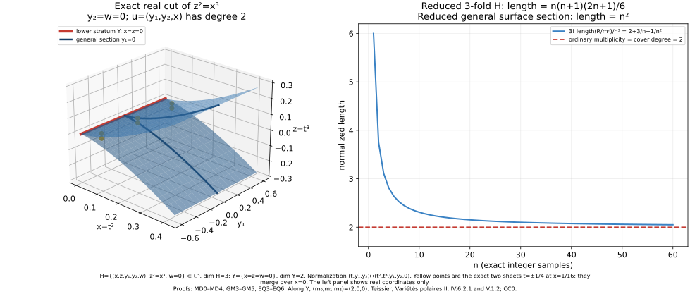

# Polar multiplicity in linear sections and Whitney strata

*Written by GPT-6.1 Sol and GPT-6 Astra (OpenAI). Self-checked by the writing AIs. CC0 1.0.*

A general linear projection measures ordinary multiplicity by the number of sheets over a regular value. We first prove that equality from the lengths of powers of the maximal ideal. We then compare the actual polar varieties of a germ and a general linear section, and show that their multiplicities agree. Finally, the conormal dimension bounds for a Whitney stratum produce one finite family whose degree gives every polar multiplicity along that stratum.

The geometric prerequisites are proved in Analytic geometry for finite maps: analytic components and their boundaries, the fibre-dimension jump theorem, proper analytic images, the one-equation dimension bound, local analytic algebra, and the direct ordinary and exceptional conormal-fibre bounds. [Polar sections, integral equations and generic Lipschitz algebras](../polar-sections-and-lipschitz-algebras.html#PS0) supplies the actual polar-image construction and the [metric-to-integral-equation theorem](../polar-sections-and-lipschitz-algebras.html#BI0). These exact statements, with their hypotheses, are used below.

The classical antecedents are Teissier's [*Variétés polaires II*, IV.6.2.1 and V.1.2](https://webusers.imj-prg.fr/~bernard.teissier/documents/VarPol2.pdf). The arguments below retain reduced singular and reducible germs, every specified polar index, and empty polar varieties.

## MP0. The local marked preparation

Let \(Z\) be one of finitely many closed analytic sets in \(U\times Q\times K\), where \(U\) is an analytic coordinate neighborhood of 0, \(Q\) is a connected smooth parameter domain, and \(K\) is a compact projective analytic parameter space. All projections in the \(K\) coordinate are proper. Mark \(Z\) intersected with \(\{0\}\times Q\times K\) and finitely many closed analytic bad subsets.

There is a dense analytic open restriction of a smaller \(Q\) such that the projection to \(Q\) is submersive on every source Whitney stratum in a neighborhood of the whole marked fibre, simultaneously for the marked bad subsets. Here and below a source set whose marked image is a proper subset of \(Q\) is absent after that restriction.

To prove this, take a complex analytic Whitney partition of the finite source family compatible with the marked sets, using the already proved generic Whitney bad-locus/dimension-descent construction. On each marked analytic-difference stratum construct its coherent Jacobian/minor rank locus and take its actual analytic closure by SGC8. A marked component not dominating \(Q\) has proper analytic image. On a dominating one, full FMR rank/image dimension gives generic rank \(\dim Q\); closures of its deficient-rank, singular and boundary pieces have proper image after the corresponding descending source-dimension steps. These projections are proper in \(K\). RMP therefore makes every discarded image analytic and of smaller dimension. There are finitely many relevant components near the entire compact marked fibre by SGC9 and proper shrinking of its closed complement, exactly as in GS1/RC3.

After removing those images, all marked source strata project submersively to \(Q\). Whitney \((a)\) makes every incident source tangent limit contain such a lower tangent; the differential of the ambient parameter projection is onto there. Kernel continuity and compactness of the marked projective fibre give the same rank in one neighborhood of its entire inverse image. No map on an arbitrary nonproper global source is asserted to have proper image.

Consequently, if \(\dim Z\leq\dim Q+b\), every selected parameter fibre has dimension at most \(b\) near the marked fibre: each of its finitely many Whitney pieces has dimension \(\dim(\text{stratum})-\dim Q\). If \(b<0\) that fibre is empty after shrinking. A pure source of dimension \(\dim Q+b\), cut by its \(\dim Q\) parameter equations, has every nonempty fibre component of dimension at least \(b\) by the exact equation bound. Thus its selected fibres are pure \(b\)-dimensional. A proper bad subset of dimension at most \(\dim Q+b-1\) has fibre dimension at most \(b-1\). This proves both the required purity and density assertions, not merely a generic rank at one point.

## MP1. Universal rank loci on the regular analytic germ

Let \(H\subset\mathbb C^N\) be reduced pure of dimension \(d\), \(N\geq d+2\). Fix \(0\leq k\leq d-1\) and set \(r=d-k+1\), \(q=d-k\). Let \(Q\) be the full-rank linear projection parameter domain \(p:\mathbb C^N\to\mathbb C^r\). On \(H_{\mathrm{reg}}\), the restriction \(p|TH\) is an arbitrary \(r\times d\) matrix: restriction of ambient linear rows to that tangent is surjective, and a holomorphic tangent frame gives local coordinates for this bundle map.

The rank-\(b\) matrix stratum has dimension \(b(d+r-b)\). One verifies it on an invertible \(b\)-minor chart: the complementary block is the product of the two off-diagonal blocks and the inverse minor, so those entries are determined. The lower-rank strata have smaller dimension. Thus the locus \(\operatorname{rank}(p|TH)\leq b\) has total dimension at most

\[
\dim Q+d-(d-b)(r-b).
\tag{MP1a}
\]

The coherent augmented-Jacobian minors, followed by SGC8 selection of exactly components meeting \(H_{\mathrm{reg}}\), give its actual analytic closure \(W_b\) in \(H\times Q\), retaining that dimension bound. Components excluded by full ambient rank of \(p\) are simply empty. For \(b=r-1=q\) the source is pure of dimension \(\dim Q+q\); the smooth exact-rank-\(q\) part is dense. Its old-singular-base boundary has dimension at most \(\dim Q+q-1\). For \(b\leq r-2\),

\[
\dim W_b-\dim Q\le d-2(k+1)<q.
\tag{MP1b}
\]

Apply MP0 to this finite family and its boundary/exact-rank partitions, with \(K\) a point. The resulting \(p\) have a pure \(q\)-dimensional critical closure or the empty set; its old regular critical part is dense, and all higher-deficiency loci have dimension less than \(q\). This is the actual reduced \(P_k(H,0)\). On its dense exact-rank-\(q\) part the kernel covector is unique projectively, so its ordinary conormal incidence is generically one-to-one onto it.

Moreover the universal exact-rank-\(q\) critical locus is smooth, because the matrix restriction above is submersive onto the smooth rank-\(q\) matrix stratum. MP0 makes its projection to \(p\) submersive near the marked germ. Therefore the fixed-\(p\) regular critical locus is smooth of codimension \(k\). These are genuine transverse rank equations, which will make the later base slice generically reduced. For \(k=0\) the restriction rank is at most \(d=r-1\) automatically; its critical locus is \(H\) itself and the assertion is the identity.

## MP2. Finite projective flags on ordinary and secant coordinates

All linear flag selections below use the following exact mechanism. Near a whole compact projective fibre retain finitely many components of a source and its proper bad subset. Avoid hyperplanes whose section vanishes identically on any selected component. Each avoidance is a proper linear condition because the relevant projective coordinate is nonzero. The complete one-equation theorem drops each nonempty component dimension by one; zero-dimensional components are avoided. Universal incidence, exact source FJ jumps, and proper marked-fibre images promote one such flag to a dense analytic open set of flags, as in PS1–PS2. This applies equally to a projective normal covector, a projective secant, or a defined quotient covector. All source subsets, not only their regular points, remain in the compact-fibre calculation.

For base linear sections use the actual closure of the universal incidence outside base 0. There the equations \(a_i(x)=0\) eliminate one independent row coefficient each, since \(x\) is nonzero. If the conormal source is pure \(N-1\)-dimensional, this closure has total dimension \(\dim(\text{parameters})+N-1-a\); its old-singular bad source has dimension at most one less. MP0 gives purity and old-regular density for every nonvertical component of the selected base slice. Components supported only over base 0 are not being treated as old regular limits. The strict secant transform below separately controls its whole exceptional fibre.

## MP3. A general projection misses all polar secants in its kernel

Let \(C=C(H)\) be the actual projectivized conormal. Blow up its pulled-back origin ideal by the actual graph construction FJ7, recording the projective secant \([x]\). Each source component has dimension \(N-1\) and meets base \(x\ne0\). Its exceptional divisor \(D_0\) is therefore pure \(N-2\) when nonempty, by the complete principal-zero theorem. It is compact in the two projective factors \((\xi,[x])\).

For an \(r\)-dimensional covector row space \(L\), the forbidden condition is \(\xi\in\mathbb P L\) and \([x]\in\mathbb P\ker L\). For a fixed incident pair \((\xi,v)\) with \(\xi(v)=0\), the allowed \(L\) form \(\operatorname{Gr}(r-1,N-2)\), of dimension \((r-1)(N-r-1)\); a nonincident pair has no allowed \(L\). Relative to \(\operatorname{Gr}(r,N)\) their codimension is \(N-1\). Since \(\dim D_0=N-2\), its universal forbidden incidence has dimension at most \(\dim\operatorname{Gr}(r,N)-1\). Its projective projection is proper, so RMP gives a proper analytic bad set of \(L\).

Choose \(L\) outside it and within the generic MP1/PS sets. Every limiting secant of \(P_k\) has an incidence lift \(\xi\in L\), by PS's actual proper polar image. Thus no such secant is in \(\ker p\). Compactness gives

\[
\|x\|\le C\|p(x)\|\quad(x\in P_k\text{ near }0).
\tag{MP3a}
\]

In particular \(p\) restricted to \(P_k\) is finite on a proper local representative: the bound excludes its outer trap boundary, and compact affine analytic fibres are finite by FMR3. The conclusion is stronger than an isolated set-theoretic zero fibre; it retains the full limiting secant cone required for ordinary multiplicity.

The prerequisites are the original generic Whitney construction, SGC8–SGC9, full FMR/FJ/RMP, projective conormal/minor construction, actual graph blow-up and the one-equation theorem. Matrix dimensions are proved in MP1. No polar multiplicity or equimultiplicity theorem is a premise.

## MD0. Statement and actual projection

Let \((X,0)\) be a reduced pure \(q\)-dimensional analytic germ in \(\mathbb C^b\), \(q\geq1\). Let \(u:\mathbb C^b\to\mathbb C^q\) be linear and suppose its kernel misses the projective limiting secants of \(X\) at 0. Thus, on a sufficiently small representative,

\[
\|x\|\le C\|u(x)\|\qquad(x\in X).
\tag{MD0a}
\]

The norm inequality follows by compactness of that projective secant set: a sequence violating it would supply a secant in the kernel. It makes \(u\) a finite proper germ. Indeed use a small closed source ball as trap, choose a target polydisc so that its inverse image misses the trap boundary, and take the corresponding open inverse image. Fibres are compact affine analytic sets and hence finite by FMR3. Each \(q\)-dimensional source component maps onto the target germ by the finite-map image/dimension theorem. Write \(N\) for its generic degree, counted over all reduced source components. We prove

\[
\lim_{n\to\infty}\frac{q!}{n^q}\dim_{\mathbb C}\mathcal O_{X,0}/\mathfrak m^n=N.
\tag{MD0b}
\]

The left side is the ordinary Samuel multiplicity. The proof proves the asserted leading asymptotic directly; it does not identify multiplicity with the length of a special, possibly non-flat, fibre.

## MD1. The projection ideal is a reduction of the maximal ideal

Put \(R=\mathcal O_{X,0}\), \(\mathfrak m=(x_1,\ldots,x_b)\), and \(J=(u_1,\ldots,u_q)\). MD0a bounds each \(x_i\) by a constant times \(\max_j|u_j|\). BI0–BI4 therefore supply an actual monic equation for \(x_i\) with its degree-\(j\) coefficient in \(J^j\). This use includes reducible \(X\) and components on which one of the functions vanishes identically.

For the formal Rees variable \(t\), each \(x_it\) is consequently integral over \(S=R[Jt]\). The algebra \(R[\mathfrak mt]\) is generated over \(S\) by these finitely many integral elements and is a finite graded \(S\)-module: reduce powers in their monic equations to finitely many bounded exponent monomials. Choose homogeneous module generators of degrees at most \(D\). Its degree \(n+D\) piece, for \(n\geq0\), then gives

\[
\mathfrak m^{n+D}=J^n\mathfrak m^D.
\tag{MD1a}
\]

For completeness, a generator of degree \(i\leq D\) contributes \(J^{n+D-i}\) times an element of \(\mathfrak m^i\), which lies in \(J^n\mathfrak m^D\) because \(J^{D-i}\mathfrak m^i\) is contained in \(\mathfrak m^D\). The reverse containment follows from \(J\subset\mathfrak m\). In particular

\[
J^n\subset\mathfrak m^n\subset J^{n-D}\quad(n\ge D).
\tag{MD1b}
\]

## MD2. Finite-module rank and a free lattice

Let \(A=\mathbb C\{u_1,\ldots,u_q\}\), with maximal ideal \(\mathfrak a\). We construct the finite \(A\)-module \(R\) directly. Complete \(u\) to ambient linear coordinates \((u,z)\). Off the proper analytic image of source singular and rank-deficient regular loci, the actual proper finite map is an \(N\)-sheeted unramified holomorphic cover. For each supplementary coordinate \(z_j\) form the polynomial

\[
Q_j(u,T)=\prod_{x\in u^{-1}(u)}(T-z_j(x)).
\tag{MD2a}
\]

Its symmetric coefficients are single-valued holomorphic on that complement and bounded by the source trap. The complete bounded-removal theorem on the smooth target extends them holomorphically to its polydisc. MD0a implies every source coordinate tends to zero as \(u\) tends to zero, so \(Q_j(0,T)=T^N\). The equations \(Q_j(u,z_j)=0\) hold on all \(X\) by density and reducedness. Successive Weierstrass division in the supplementary coordinates gives a finite \(A\)-module with basis the bounded exponent monomials \(0\leq\operatorname{exponent}(z_j)<N\) in the quotient by these equations. \(R\) is a quotient of that finite module. This is the literal triangular finite-module proof of local-ring Corollary 4.2, not an unnamed coherent direct-image theorem.

Since \(X\) is reduced and pure \(q\), every source component dominates \(A\). Multiplication by a nonzero element of \(A\) is injective on \(R\): its image is nonzero in every component's function field, and a reduced ring injects into the product of its minimal-prime domains. Thus \(R\) is torsion free over \(A\). Localizing at \(A\setminus\{0\}\) gives a reduced finite algebra over its fraction field, hence a product of the finite fields of the source components. In characteristic zero their separable primitive-element minimal polynomials and discriminants give the actual generic covers, exactly the supplied finite-extension/covering proof applied to MD2a's triangular finite algebra. Their degrees equal their sheet numbers. The sum is \(N\), so \(R\) has fraction-field rank \(N\). Choose a fraction-field basis in \(R\) and let \(L=A^N\) be its free \(A\)-span. Clearing denominators of a finite set of generators makes \(T=R/L\) killed by one nonzero \(a_0\) in \(A\). No normal or Cohen–Macaulay hypothesis on \(X\) is imposed.

## MD3. The needed intersection estimate, proved here

There is an integer \(c\) with

\[
\mathfrak a^nL\subset L\cap\mathfrak a^nR\subset\mathfrak a^{n-c}L\qquad(n\ge c).
\tag{MD3a}
\]

Here is the full algebraic argument. The analytic local ring \(A\) is Noetherian by the retained convergent preparation/coherent-module foundation. Its finitely generated algebra \(B=A[\mathfrak at]\) is Noetherian. One may verify the latter without importing an intersection lemma: for a polynomial algebra over a Noetherian ring, the ideals of leading coefficients in each possible degree form an increasing chain, hence stabilize. Choose finitely many polynomials realizing generators up to the stabilization degree; subtract their suitable monomial multiples from any polynomial in an ideal to lower its degree. Induction on degree proves finite generation. Iterating in the variables and passing to a quotient proves the assertion for \(B\).

The graded module \(G=\bigoplus_{n\geq0}\mathfrak a^nRt^n\) is finite over \(B\), generated by generators of \(R\) in degree zero. Its graded submodule \(G_L=\bigoplus_{n\geq0}(L\cap\mathfrak a^nR)t^n\) is therefore finite. Replacing finitely many generators by their homogeneous components, choose homogeneous generators of degrees \(\leq c\). In degree \(n\geq c\), each generator is an element of \(L\) multiplied by an element of \(\mathfrak a^{n-i}\), \(i\leq c\). This gives the upper inclusion in MD3a. The lower inclusion is immediate. No flatness or exactness of completion has been used.

## MD4. The lower-dimensional quotient contributes only a lower term

If \(a_0\) is a unit, \(T=0\) and its estimate below is immediate. Otherwise a coordinate change in \(A\) makes \(a_0\) a unit times a monic Weierstrass polynomial of positive degree \(h\) in \(u_q\). Therefore \(A/(a_0)\) is finite free of rank \(h\) over \(B_0=\mathbb C\{u_1,\ldots,u_{q-1}\}\). If \(T\) is generated by \(b\) elements over \(A/(a_0)\), it is generated by \(bh\) elements over \(B_0\). Consequently

\[
\dim_{\mathbb C}T/\mathfrak a^nT\le bh\binom{n+q-2}{q-1}=O(n^{q-1}).
\tag{MD4a}
\]

For \(q=1\) this means the constant bound \(bh\). The inequality is valid since the maximal-ideal power from \(B_0\) is contained in \(\mathfrak a^n\), so its quotient surjects onto the displayed quotient. It needs no regularity of \(T\).

The exact sequence induced by \(L\subset R\) is

\[
\begin{gathered}
0\longrightarrow L/(L\cap\mathfrak a^nR)\\
\longrightarrow R/\mathfrak a^nR\\
\longrightarrow T/\mathfrak a^nT\longrightarrow0.
\end{gathered}
\tag{MD4b}
\]

MD3a sandwiches the first length between \(N\binom{n-c+q-1}{q}\) and \(N\binom{n+q-1}{q}\). Together with MD4a this proves

\[
\dim_{\mathbb C}R/J^n
=\frac{N}{q!}n^q+O(n^{q-1}).
\tag{MD4c}
\]

Finally MD1b sandwiches \(\dim_{\mathbb C}R/\mathfrak m^n\) between \(\dim_{\mathbb C}R/J^{n-D}\) and \(\dim_{\mathbb C}R/J^n\), proving MD0b. A nonempty germ therefore has positive multiplicity. The empty germ has multiplicity zero by convention; a reduced zero-dimensional point has ring \(\mathbb C\) and multiplicity one. Neither of these conventions changes the \(q\geq1\) assertion used in polar sections.

## MD5. Family degree without special-fibre lengths

We will also use this precise consequence. Let \(f:X\to B\) be finite proper, \(X\) reduced pure \(\dim B\), \(B\) a connected smooth neighborhood, and suppose a marked smooth locus in \(B\) has a single point in every set-theoretic fibre. The generic cover degree \(N\) on \(B\) is constant. At each marked source point, proper closed-complement shrinking makes the germ of \(f\) contain the entire fibre over a small target neighborhood, so its local generic degree is the same \(N\). If the local linear coordinates on that target are secant-admissible at the source point, MD0 gives multiplicity \(N\) there. A marked fibre may be ramified and its scheme length may vary; neither is substituted for the generic degree in this argument.

Prerequisites: complete BI metric-to-integral proof; finite proper analytic image, rank and compact affine fibre facts FMR/RMP; full smooth-target bounded removal; convergent preparation/division and Noetherian analytic local rings; local-ring triangular finite-module Corollary 4.2 and the finite-extension/primitive-element cover proof; the displayed elementary graded-module argument. Ordinary Samuel multiplicity is used in its leading-length convention. No polar multiplicity, general-section formula or equimultiplicity statement is a premise.

## GM0. Full range and notation

Let \((H,0)\) subset \(\mathbb C^N\) be reduced pure \(d\)-dimensional, \(N\geq d+2\). Fix

\[
\begin{gathered}
0\le k\le d-1,\quad q=d-k,\\
0\le a\le q-1,\quad q'=q-a\ge1.
\end{gathered}
\tag{GM0a}
\]

For a general codimension-\(a\) linear subspace \(A\) through 0, put \(H'=(H\cap A)_{\mathrm{red}}\). The assertion, with general polar projections on both sides, is

\[
m_0(P_k(H',0))=m_0(P_k(H,0)).
\tag{GM0b}
\]

The index \(k\) is unchanged; the polar dimensions are \(q'\) and \(q\). The proof includes empty polars, reducible germs, \(k=0\) and \(a=0\). It uses no Whitney regularity of a specified lower stratum.

## GM1. A simultaneous general flag and all secants

Let \(C=C(H)\) be the actual projectivized conormal, and \(D_0\) its actual origin-blow-up exceptional fibre with the two projective coordinates \((\xi,[v])\). MP3 gives \(\dim D_0\leq N-2\). Choose a general \(a\)-dimensional row space \(L_a\) and write \(A=\ker l\), \(l:\mathbb C^N\to\mathbb C^a\). For \(a=0\) omit \(l\). The universal Grassmann calculation in MP3, with \(r=a\), shows that \(L_a\) can be chosen so that

\[
(\xi,[v])\in D_0,\ v\in\ker l
\quad\Longrightarrow\quad \xi\notin\mathbb P L_a.
\tag{GM1a}
\]

Successive general secant hyperplanes also give \(\dim(D_0\cap\{l(v)=0\})\leq N-2-a\). At the same time MP2 gives pure nonvertical base sections, old-regular density and the required density for the proper old-singular bad sets. These conditions are simultaneous dense analytic open flag conditions on a neighborhood of the whole compact fibre.

Choose an extension \(L\) of \(L_a\) of dimension \(r=q+1\), and write \(p=(l,p'):\mathbb C^N\to\mathbb C^a\times\mathbb C^{q'+1}\). On the secant section above, the quotient covector \(\xi\) modulo \(L_a\) is defined by GM1a. Its projective coordinate lies in \(\mathbb P^{N-a-1}\). Requiring it to belong to \(\mathbb P(L/L_a)\) imposes \(\ell=N-q-1\) general projective hyperplanes. MP2 consequently gives

\[
\begin{gathered}
\dim\left\{\begin{gathered}(\xi,[v])\in D_0:\\
l(v)=0,\ \xi\in\mathbb P L\end{gathered}\right\}\le q'-1.
\end{gathered}
\tag{GM1b}
\]

Choose \(L\) also in MP1's pure-polar and transverse-rank open sets, and in MP3's open set excluding \(\xi\in L\) with \(p(v)=0\). Thus \(p'v\) is nonzero on the compact set in GM1b. Its projective image in \(\mathbb P^{q'}\) has dimension at most \(q'-1\) by proper analytic image. Choose a point outside that image, and choose \(\beta:\mathbb C^{q'+1}\to\mathbb C^{q'}\) whose kernel is that point. Put \(m=\beta p'\) and

\[
u=(l,m):\mathbb C^N\longrightarrow\mathbb C^q.
\tag{GM1c}
\]

Every limiting secant of \(P=P_k(H,p)\) has a conormal incidence lift with \(\xi\in L\), by the actual proper polar-image theorem PS. If \(u(v)=0\), then \(l(v)=0\) and \(\beta p'v=0\), contradicting the choice of \(\beta\). Hence \(u\) is secant-admissible on \(P\), and MD proves that it is finite proper of degree \(N_0=m_0(P)\) when \(P\) is nonempty.

All stated choices are genuinely compatible with first choosing a general \(A\). For example, on a chart of the flag parameters take a nonzero holomorphic equation excluding a proper bad set of full flags and expand it in the remaining parameters. For a general first parameter \(l\) at least one coefficient is nonzero, so the remaining bad fibre is proper. Repeat for the finite list of closed bad sets. The universal exact-rank construction for \(H'\) supplies its further dense open projection conditions. Intersect these dense open fibres. This is the usual elementary coefficient argument for simultaneous general choices; no generic flatness is asserted.

## GM2. Conormal restriction off the vertex

There is a punctured neighborhood on which \(C\) intersect {\(x\) in \(A\)} has no covector in \(\mathbb P L_a\). Otherwise a sequence \(x\to0\) of such covectors has a projective secant subsequence \([x]\to[v]\) in \(\ker l\), giving the forbidden pair in GM1a. In particular \(l\) has full rank \(a\) on \(T_xH\) at every old regular point of \(A\) near 0 outside 0.

Restriction of covectors to \(A\) therefore defines a proper map

\[
\rho:C|_{A\setminus\{0\}}\longrightarrow\mathbb P T^*A.
\tag{GM2a}
\]

Each fibre is contained in an affine \(a\)-dimensional lift space, because no source covector lies in the projective kernel \(\mathbb P L_a\); being compact analytic there it is finite. On the old regular dense part, the elementary tangent identity \(T(H\cap A)=TH\cap TA\) identifies its image with the ordinary conormal bundle of \(H'\). MP2's density of this old regular part in every nonvertical source component, together with properness, makes the image exactly the actual conormal \(C(H')\) off 0. In the other direction the old regular part is dense in \(H'\) by the same generic base-section preparation, so its proper image closure contains all of \(C(H')\). This argument includes new regular points lying on \(H_{\mathrm{sing}}\); it does not delete them from the conormal.

Consequently, away from 0,

\[
P\cap A=P_k(H',p'|_A).
\tag{GM2b}
\]

Indeed a restricted covector in \(\operatorname{row}(p'|_A)\) lifts to a covector in \(\operatorname{row}(p')+L_a=L\), and conversely. Source components confined to base 0 never enter this punctured comparison.

## GM3. The slice is pure and genuinely reduced generically

Since \(u:P\to\mathbb C^q\) is finite and every pure \(q\)-dimensional component dominates the target germ, its inverse image of \(\{l=0\}\) is pure \(q'\)-dimensional: finite-map fibre dimension gives the upper bound \(q'\), and the \(a\)-equation theorem gives the lower bound \(q'\). The reduced \(P_k(H',p'|_A)\) is pure \(q'\) by MP1 for \(H'\). Equality GM2b thus extends across 0 as equality of reduced germs. No isolated component at 0 can be added because \(q'\geq1\). If \(P\) is empty so is that germ. If \(P\) is nonempty, finiteness and target surjectivity make this slice nonempty.

We must also check the scheme at its generic points, rather than infer a degree equality from that set equality. Include \(H_{\mathrm{sing}}\cap H'\) among the proper bad source sets in the universal projection preparation for \(H'\). On \(H'_{\mathrm{reg}}\) its dimension is at most \(d-a-1\); restriction of arbitrary \(p'\) to its tangent is still surjective onto the matrix space. MP1's rank calculation and MP0 then put its critical part in dimension at most \(q'-1\). Higher rank deficiency and singular critical points have the same strict bound. Hence every slice component has a dense set of old \(H\)-regular points where the \(p'\) critical equations on \(H'\) have transverse rank \(k\).

Near such a point choose holomorphic coordinates \((s,t)\) on \(H\) with \(s=l\) and \(t\) coordinates along the slice. The rank of \(p=(l,p')\) is \(a\) plus the rank of \(d_t p'\). Its critical equations are precisely the rank-(\(q'\)) equations for \(d_t p'\). At the chosen point their derivatives in the \(t\) coordinates have rank \(k\), by the transverse fixed-\(p'\) assertion of MP1. The implicit-function theorem therefore makes \(P\) smooth there and makes \(l|P\) a submersion of rank \(a\). The actual analytic \(a\)-equation slice of \(P\) is smooth and reduced there. This supplies the required generic scheme assertion even if \(H\) or \(P\) is not Cohen–Macaulay.

## GM4. Equality of cover degrees and multiplicities

The map \(m:P\cap A\to\mathbb C^{q'}\) is finite proper. Away from its proper singular and ramification images it is a local biholomorphism at every point of the fibre, since the slice is reduced and pure \(q'\) in characteristic zero. Choose \(w\) in that regular target set also outside the images of all bad subsets from GM3. At every point over \((0,w)\), \(P\) is smooth, \(l|P\) has rank \(a\) and \(m\) on its kernel has rank \(q'\). Therefore \(u=(l,m)\) has full rank \(q\) at every point of that fibre. It is a regular value of the full finite map \(u:P\to\mathbb C^q\).

Its number of points is consequently \(N_0\), the generic cover degree of \(u\). To see constancy directly, remove the proper analytic singular/ramification image: a finite map there is a covering, and the complement of a proper analytic subset in a connected smooth target is connected by the supplied bounded-removal Corollary 4.4 (a hypothetical locally constant 0/1 separator extends and contradicts connectedness). The sheet number is constant. Thus the generic degree of \(m\) on the reduced slice is exactly \(N_0\).

GM1's secant exclusion also makes \(m\) secant-admissible on \(P\cap A\): its secants are among those of \(P\) with \(l(v)=0\). MD applied to both maps proves

\[
\begin{gathered}
m_0(P_k(H',p'|_A))\\
=\deg m=N_0=\deg u\\
=m_0(P_k(H,p)).
\end{gathered}
\tag{GM4a}
\]

For \(a=0\) this is the identity. For \(k=0\) the critical rank condition is the identity on \(H\), and the same reduced-slice argument proves the ordinary general-section multiplicity formula.

Here is the complete parameter-family check for the traditional general polar multiplicity. Fix a good \(p_0\) and its secant-admissible degree projection \(u_0\). Let \(W\) be the universal actual reduced polar closure on a small chart \(Q_0\) about \(p_0\). If no uniform bound \(\|x\|\leq C\|u_0x\|\) held as \(p\to p_0\) and \(x\to0\), compact actual conormal incidence lifts would supply \((\xi,[v])\) in \(D_0\) with \(\xi\in\operatorname{row}(p_0)\) and \(u_0v=0\), contrary to GM1's selection. Thus the bound is uniform after shrinking \(Q_0\). The same source trap as MD0 produces one proper finite map \((p,u_0):W\to Q_0\times D^q\); its compact affine fibres are finite. MP0 identifies each selected parameter fibre with its actual pure polar and bounds every boundary/bad part by \(q-1\). On the dense exact-rank regular critical locus \(W\) is smooth and its parameter projection is submersive by MP1. Its actual parameter-equation fibre is therefore reduced at those generic points. Choose a degree-target point off the finite images of all lower-dimensional bad parts and of the fibre ramification locus. The derivative of \((p,u_0)\) then has full rank at every source point over it, by the same block-rank calculation as GM3–GM4. The fibre's generic number of sheets equals the total cover degree, which is constant on the connected regular target complement. MD identifies that degree with its ordinary multiplicity. Dense good parameter chart overlaps identify these numbers throughout the common general set. This supplies both a uniform proper representative and the actual generic scheme comparison; no set-cardinality conclusion about a ramified special fibre is made.

## GM5. The ordinary conormal bound

In PNY10, \(a=t-1\), \(k=d-t\) and \(q=t\), so \(q'=1\) and \(\dim H'=d-t+1\). The retained lower stratum transversality of \(A\) is an additional open condition on \(l\) and is compatible with all the general choices above. The actual curve polar of \(H'\) has multiplicity equal to the \(q\)-dimensional polar of \(H\). Thus the established curve argument's emptiness makes that full polar empty, since every nonempty reduced germ has positive multiplicity by MD. The original all-index PS test then gives exactly PNY11's ordinary conormal bound, without restricting the general-section theorem to Whitney pairs.

Prerequisites: MP0–MP3, PS all-index polar image/density, actual conormal and graph blow-up, complete finite proper image FMR/RMP, one-equation dimension, analytic implicit function, and MD's complete multiplicity-degree proof. No equimultiplicity theorem is a premise. LS parameter derivations are not used; in particular no connection is descended to a parameter fibre.

## EQ0. Scope and the conormal dimension bounds

Let \(H\subset\mathbb C^N\) be reduced pure \(d\)-dimensional, \(N\geq d+2\), and let \(Y\subset H\) be smooth of dimension \(t\). Assume \((H_{\mathrm{reg}}\setminus Y,Y)\) is Whitney \((a,b)\) at every nearby point of \(Y\). For each \(0\leq k\leq d-1\), the ordinary general polar multiplicity

\[
m_k(H,y)=m_y(P_k(H,p))
\tag{EQ0a}
\]

is constant along a sufficiently small connected neighborhood in \(Y\), with a common general projection \(p\). The statement includes zero polar multiplicity and reducible \(H\).

For \(0<t<d\) we use exactly the following completed geometric conclusions, pointwise along \(Y\):

\[
\begin{gathered}
\dim C(H)_y\le N-2-t,\\
\dim D_y\le N-2-t,
\end{gathered}
\tag{EQ0b}
\]

where \(D\) is the actual conormal graph-blow-up divisor along \(Y\). The ordinary bound is CSB10; the exceptional bound is CHN/HN11. Their direct curve/branch, slice and hyperplane proofs do not assume polar equimultiplicity or the general-section multiplicity theorem. We use those direct geometric proofs before proving equimultiplicity here. In particular, the multiplicity theorem is not a premise of the conormal dimension argument used below.

## EQ1. Normal coordinates and compact actual directions

Choose a general linear \(\pi:\mathbb C^N\to\mathbb C^t\) invertible on \(TY\) and a fixed linear splitting. Write the nearby \(Y\) as its graph \(\sigma(y)\), \(\pi\sigma(y)=y\), and set

\[
\begin{gathered}
K=\ker\pi,\quad n=N-t,\\
z=x-\sigma(\pi x)\in K.
\end{gathered}
\tag{EQ1a}
\]

The function \(\sigma\) is holomorphic; its derivative is bounded after shrinking. Whitney \((a)\) makes every covector of \(C(H)_y\) annihilate \(T_yY\). No nonzero such covector can restrict to zero on \(K\), because a pure \(\pi\)-covector cannot annihilate \(TY\). Properness and compactness of the whole conormal fibre make this normal covector restriction defined on one neighborhood of that fibre. Its image, together with the actual graph direction \([z]\) on \(D\), gives a proper analytic map

\[
\begin{gathered}
D|_Y\longrightarrow Y\times\mathbb P K^*\times\mathbb P K,\\
c\longmapsto(y,[\xi|_K],[z]).
\end{gathered}
\tag{EQ1b}
\]

Let \(Z_y\) be its reduced compact image over \(y\). Full RMP applies even if this map has positive-dimensional fibres. EQ0b gives \(\dim Z_y\leq n-2\). These are the actual exceptional directions of the graph closure; centre-supported incidence components have already been discarded. Whitney \((b)\), applied to the lower point \(\sigma(\pi x)\), also gives \(\xi|_K(v)=0\) for every pair \(([\xi|_K],[v])\) in \(Z_y\).

## EQ2. Which polars are empty

Put \(q=d-k\). If \(q\leq t\), EQ0b and PS's all-index compact conormal test give

\[
\dim C(H)_y\le N-2-t<N-1-q,
\]

so a common general \(P_k\) is empty near that marked point. Properness of the actual polar-image map makes that absence persist on a neighborhood. Its multiplicity is zero there.

Suppose \(q>t\) and put \(q'=q-t\geq1\). Choose a general row space \(L'\subset K^*\) of dimension \(q'+1\) and a projection \(p':K\to\mathbb C^{q'+1}\) with that row space. Extend \(p'\) linearly using the fixed splitting, and put \(p=(\pi,p')\). We choose \(\pi\) initially in the simultaneous general flag set and then \(p'\) in its dense open fibre, by the coefficient argument of GM1. In particular \(P=P_k(H,p)\) is pure \(q\)-dimensional or empty, and its actual conormal incidence with \(\operatorname{row}(p)\) has the PS density and proper-image property. This is a common general polar for \(H\), not an additional relative polar definition.

The universal rank construction remains valid with the first \(\pi\) rows fixed: \(\pi\) has rank \(t\) on nearby upper regular tangents by Whitney \((a)\). On \(\ker(\pi|TH)\), of dimension \(d-t\), arbitrary \(p'\) gives every matrix of size \((q'+1)\times(d-t)\). MP1–MP0 prove the pure rank-critical closure and transverse generic equations, with all proper source bad subsets retained. Thus the constrained description is compatible with the original general polar.

## EQ3. One normal degree projection works along the whole stratum

At a marked \(y_0\), general projective covector sections of \(Z_{y_0}\) give

\[
\dim\{(\xi',v)\in Z_{y_0}:\xi'\in\mathbb P L'\}\le q'-1.
\tag{EQ3a}
\]

Indeed the codimension of \(\mathbb P L'\) in \(\mathbb P K^*\) is \(n-q'-1\), and MP2 supplies the complete successive section calculation on the whole compact source. At the same time choose \(L'\) to exclude \(\xi'\in L'\) and \(v\in\ker L'\). For a fixed incident pair its forbidden Grassmann incidence has codimension \(n-1\), exactly as in MP3. Since \(\dim Z_{y_0}\leq n-2\), the proper image of this universal incidence is a proper analytic bad set of \(L'\). Both requirements are compatible with the preceding general polar choices.

The image of the compact set in EQ3a under \([v]\to[p'v]\) is defined and has dimension at most \(q'-1\) in \(\mathbb P^{q'}\). Choose a point outside it and let \(\beta:\mathbb C^{q'+1}\to\mathbb C^{q'}\) have that kernel; put \(m=\beta p'\). Proper closed-complement shrinking along \(Y\) and the full FJ proper jump/image theorem preserve both exclusions and the dimension bound for all \(y\) in one small connected neighborhood. Therefore

\[
(\xi',v)\in Z_y,\quad\xi'\in\mathbb P L'
\quad\Longrightarrow\quad m(v)\ne0.
\tag{EQ3b}
\]

Every polar point \(x\) outside \(Y\) has an actual incidence lift \(\xi\) in \(\operatorname{row}(\pi,p')\). Its normal restriction belongs to \(L'\). If the inequality below failed along a sequence tending to \(Y\), divide its nonzero \(z\) by its norm, extract a compact conormal/direction subsequence, and obtain a pair in \(Z_y\) violating EQ3b. Hence, uniformly near that neighborhood of \(Y\),

\[
\|x-\sigma(\pi x)\|\le C\|m(x-\sigma(\pi x))\|\quad(x\in P).
\tag{EQ3c}
\]

For \(x\in Y\) both sides vanish. Singular polar points are included because PS supplies an incidence lift at every point of its actual proper image. This is a bound on all points, rather than on the smooth polar locus only.

## EQ4. The finite family has a single marked point per fibre

Use EQ3c to choose a normal trap and shrink the parameter and target polydiscs. The map

\[
\begin{gathered}
F:P\longrightarrow Q\times\mathbb C^{q'},\\
F(x)=(\pi x,\ m x-m\sigma(\pi x))
\end{gathered}
\tag{EQ4a}
\]

is proper on the resulting germ representative: points above the target cannot reach the outer normal trap boundary, and a compact parameter subdisc keeps its base inside the source chart. Its fibres are compact affine analytic sets, hence finite. Each retained pure \(q\)-dimensional source component has \(q\)-dimensional analytic image in the smooth \(q\)-dimensional target. A nonempty image germ is therefore the entire target germ. After one proper closed-complement shrinking, \(F\) is a finite surjection on a common small target neighborhood when \(P\) is nonempty. Its fibre at \((y,0)\) is exactly the one point \(\sigma(y)\), by EQ3c. If \(P\) is empty at \(y_0\), it is empty near that point and EQ0a is uniformly zero instead.

Let \(N_k\) be the generic cover degree of this finite surjection. It is constant on the connected regular complement of its proper singular/ramification image. Every marked target point has its entire finite fibre at \(\sigma(y)\). Proper closed-complement shrinking thus identifies the local germ degree there with this same \(N_k\), even when that point is ramified. This is MD5's actual degree statement and assumes neither a flat special fibre nor a constant special-fibre length.

## EQ5. This degree is the ordinary multiplicity at every lower point

Fix \(y\). The bounded derivative of \(\sigma\) and EQ3c imply

\[
\begin{gathered}
\|x-\sigma(y)\|\\
\le C_y\bigl(\|\pi x-y\|+\\
\|m x-m\sigma(y)\|\bigr)\quad(x\in P).
\end{gathered}
\tag{EQ5a}
\]

For example, first compare \(x\) with \(\sigma(\pi x)\), and compare that graph point with \(\sigma(y)\); replace \(m\sigma(\pi x)\) by \(m\sigma(y)\) using the same Lipschitz bound. Thus the actual linear projection \(u=(\pi,m):\mathbb C^N\to\mathbb C^q\) is secant-admissible on \(P\) at \(\sigma(y)\). Its target differs from \(F\)'s target by the holomorphic triangular isomorphism \((y,v)\mapsto(y,v+m\sigma(y))\), so its local degree is \(N_k\). MD0–MD4 give

\[
m_{\sigma(y)}(P)=N_k\quad\text{for every nearby }y.
\tag{EQ5b}
\]

This proves constancy for a common general polar. To check that this is the ordinary general polar multiplicity, one may make the choices on a chart of the projection parameters. MP0 identifies each general parameter fibre of the universal critical closure with its actual polar and makes it pure; MP1 makes it generically smooth and reduced. The uniform compact secant exclusion gives a finite degree map from that universal family to the product of the parameter chart and \(\mathbb C^q\). On its regular target complement the number of sheets is constant. At generic points of each selected fibre, parameter submersivity and fixed-parameter transverse critical equations make its degree equal to that number, by the same block-rank argument as GM3–GM4. Dense chart overlaps identify these numbers. Hence all general choices yield the multiplicity in EQ0a, and no projection-dependent replacement invariant is used.

## EQ6. Boundary dimensions and dependency separation

When \(t=0\), a sufficiently small connected lower stratum is a point, so constancy is immediate. When \(d=t\), the original Whitney equal-dimension argument gives \(H=Y\) as germs; the actual blow-up has no retained component. Then \(H\) is smooth, \(m_0=1\) and \(m_k=0\) for \(k\geq1\). EQ0b is not applied to that case. The zero-dimensional upper case is the same reduced-point convention. All \(0\leq k\leq d-1\) and all embedding coordinates required by \(N\geq d+2\) have been retained.

The theorem uses the completed direct CSB/CHN dimension conclusion, MP/PS general polar constructions, FJ/RMP and MD ordinary multiplicity. It does not use LS's parameter connection, descend a connection to a fibre, assume fibre-algebra flatness, or replace the arbitrary general-section theorem GM by a Whitney-only subcase. The stronger equimultiplicity theorem and the PNY10 general-section theorem remain distinct complete statements, with an acyclic explicit dependency on the primary conormal-dimension route.

## A cusp with a two-dimensional parameter stratum

<picture>
<source media="(max-width:600px)" srcset="../figures/polar-multiplicity-mobile.svg">

</picture>

Take the three-dimensional analytic space

\[
\begin{gathered}
H=\left\{\begin{gathered}(x,z,y_1,y_2,w):\\
z^2=x^3,\ w=0\end{gathered}\right\}\subset\mathbb C^5,\\
Y=\{x=z=w=0\}.
\end{gathered}
\tag{PMF1}
\]

Its normalization is \((t,y_1,y_2)\mapsto(t^2,t^3,y_1,y_2,0)\). The left panel shows only the real section \(y_2=w=0\). The map \(u=(y_1,y_2,x)\) has degree two: at \(x=1/16\) the two points have \(t=\pm1/4\) and \(z=\pm1/64\). They meet over \(x=0\). The horizontal and vertical plotting intervals are display windows, not bounds asserted by the theorem.

The associated graded ring at a point of \(Y\) is \(\mathbb C[x,z,y_1,y_2]/(z^2)\). Every monomial has a unique representative with exponent zero or one in \(z\). Counting monomials of total degree less than \(n\) gives

\[
\begin{gathered}
\operatorname{length}(R/\mathfrak m^n)\\
=\binom{n+2}{3}+\binom{n+1}{3}\\
=\frac{n(n+1)(2n+1)}6.
\end{gathered}
\tag{PMF2}
\]

Thus the plotted normalized lengths are exactly \(2+3/n+1/n^2\) at the integer samples, tending to two. On the general surface section \(y_1=0\), the same count gives \(\binom{n+1}{2}+\binom n2=n^2\), again multiplicity two.

For the higher polar indices, a general projection to three coordinates has full rank on the punctured normalization near the marked stratum, and a general projection to two coordinates is already of full rank on its two parameter directions. Hence the higher polar germs are empty and \((m_0,m_1,m_2)=(2,0,0)\) along \(Y\). MD0–MD4, GM3–GM5 and EQ3–EQ6 prove the three general mechanisms illustrated here. [Open the full-size figure](../figures/polar-multiplicity-mobile.svg); its [drawing source](../figures/draw_polar_multiplicity.py) and [exact mathematical description](../figures/polar-multiplicity-math.md) retain the coordinates and calculation.
