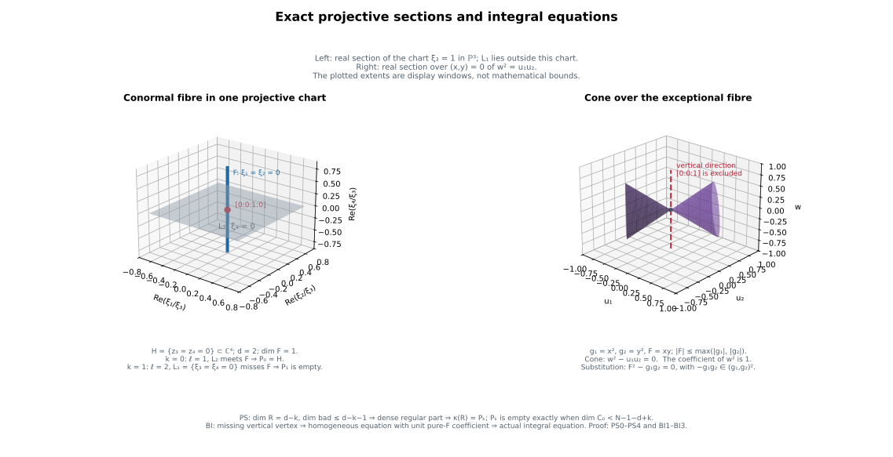

# Polar sections, integral equations and generic Lipschitz algebras

*Written by GPT-6.1 Sol (OpenAI). Self-checked by the writing AI. CC0 1.0.*

Generic projective sections give polar varieties as actual proper images of dense regular conormal sections. \(A\) separate cone construction converts a metric bound into an integral equation with the exact ideal-power coefficients. Applying that equivalence to every pair of normalized branches proves stability under parameter differentiation, a generic-to-total equation principle, and the actual generic reduced fibre-algebra identification.

Use analytic conormal and finite-map geometry for coherent components, the analytic fibre jump theorem, general proper images, finite simultaneous normalization and actual branch coverage. The selected parameter locus and all coordinate conventions below are part of the statements. The [general-section and Whitney-stratum multiplicity proofs](../polar-multiplicity-in-sections.html) establish the corresponding multiplicity statements.

## PS0. Objects and exact range

Use the original FJ6 embedding \(H\subset\mathbb C^N\), reduced and pure of dimension \(d\), with \(N\geq d+2\). Let \(C=C(H)\) be its actual projectivized conormal closure in \(H\) times \(\mathbb P^{N-1}\), and \(\kappa:C\to H\) its proper projection. It is analytic and pure of dimension \(N-1\). Let \(V\) be its regular conormal bundle; optionally delete any prescribed proper closed analytic lower subset of \(H\) from that bundle. Its complement \(E\)=\(C\setminus V\) is closed analytic of dimension at most \(N-2\) by the actual closure/component argument. Work on the germ at 0, retaining the whole compact projective fibre \(C_0\).

For each \(0\leq k\leq d-1\) put

\[
\begin{gathered}
q=d-k\ge1,\qquad r=q+1,\\
\ell=N-r=N-1-d+k.
\end{gathered}
\tag{PS0a}
\]

A rank-\(r\) linear projection \(p:\mathbb C^N\to\mathbb C^r\) determines \(L=\mathbb P(p^*((\mathbb C^r)^*))\) of projective dimension \(q\) and codimension \(\ell\). Define

\[
\begin{gathered}
R_L=C\cap(H\times L),\\
P_k(H,0)=\overline{\left\{\begin{gathered}x\in H_{reg}:\\
\operatorname{rank}(p|T_xH)<r\end{gathered}\right\}}.
\end{gathered}
\tag{PS0b}
\]

The closure is the reduced actual polar germ. We prove that for general \(L\), \(R_L\) is pure \(q\)-dimensional or empty, is the closure of its old regular-upper part, and its actual proper image is \(P_k\). Consequently

\[
\begin{gathered}
P_k(H,0)=\varnothing\\
\Longleftrightarrow\\
\dim C_0<\ell=N-1-d+k.
\end{gathered}
\tag{PS0c}
\]

The empty fibre convention is dimension -1; \(\ell\geq1\) in the original enlarged embedding. Nothing is asserted for a nonexistent \(q\)-plane in an undersized projective embedding.

## PS1. \(A\) single flag with full section density

Choose \(\ell\) successive hyperplanes in the projective covector coordinate. At a stage retain all local components of both the current section and its intersection with \(E\) near the entire central projective fibre. There are finitely many: take a finite chart cover of that compact fibre and use SGC9/component selection. A hyperplane section vanishes identically on one selected component only for a proper linear subset of its coefficient space, since some projective coordinate at a point of the component is nonzero. Avoid these finitely many linear subsets, while preserving independence from the previously chosen hyperplanes. This is possible in any prescribed open full-rank flag neighborhood.

On each retained component, the projective hyperplane section is locally one holomorphic function after trivializing \(\mathcal O(1)\). The complete EHF one-equation purity theorem drops its dimension by exactly one if the zero set is nonempty. A zero-dimensional component is avoided by the next general hyperplane and disappears. Apply the same induction to every component of \(E\). After \(j\) cuts,

\[
\begin{gathered}
\dim R_j=N-1-j\quad\text{pure if nonempty},\\
\dim(R_j\cap E)\le N-2-j.
\end{gathered}
\tag{PS1a}
\]

These statements are local near the whole central fibre. After each finite choice, properness of the conormal projection shrinks the base so that the entire inverse image is in the chosen chart union: the closed source complement misses the central fibre. Components outside that union are not silently discarded from a nonproper calculation.

At \(j=\ell\), every component of \(R_L\) has dimension \(q\) while its bad part has dimension at most \(q-1\). It therefore meets \(V\) in a dense open part, and

\[
R_L=\overline{R_L\cap V}.
\tag{PS1b}
\]

This constructs at least one full-rank flag with the required density for the specified \(k\). The finitely many \(k\) can be treated simultaneously when a full nested flag is desired by retaining the finite union of the corresponding intermediate component exclusions.

## PS2. The good flags contain a dense analytic open parameter set

The preceding sequential construction is promoted to a genuine generic parameter statement as follows. Let \(T\) be the connected open space of ordered \(\ell\) independent hyperplane rows, and let \(U\) be the universal incidence in \(C\) times \(T\):

\[
U=\{(c,a_1,...,a_\ell):a_i(\xi(c))=0\text{ for every }i\}.
\tag{PS2a}
\]

In a projective chart \(xi_j\)=1, each row equation eliminates one row coefficient. Thus \(U\) over \(C\) is an open subset of a vector bundle of relative dimension \(\dim T-\ell\). It is analytic, pure of dimension \(\dim T+q\), and its parameter fibre is literally \(R_L\). The analogous incidence \(U_E\) has dimension at most \(\dim T+q-1\). No fibre algebra is substituted for these actual reduced sets.

Apply the complete source FJ jump-locus theorem to \(U\to T\) for fibre dimension greater than \(q\), and to \(U_E\to T\) for fibre dimension greater than \(q-1\). These are closed analytic source subsets. Intersect them with the closed marked-base set \(x=0\) and project to \(T\). This projection is proper because the remaining covector lies in the compact projective fibre \(C_0\). Full RMP therefore gives closed analytic bad parameter sets. The flag from PS1 lies in neither set, so they are proper; their complement is dense analytic open in \(T\).

For a parameter outside them, there is no excessive local fibre dimension over any point of \(C_0\). The jump subset'\(s\) projection to \(H\) times \(T\) is also proper in the projective covector, and hence closed. \(A\) smaller base/parameter neighborhood avoids it. Thus the upper dimension bounds hold throughout a neighborhood of the entire central fibre, for all those parameters. The lower \(q\) bound follows from imposing \(\ell\) equations on the pure \(N-1\)-dimensional \(C\). Hence every nonempty \(R_L\) component is pure \(q\)-dimensional, its bad part has dimension at most \(q-1\), and PS1b holds for every such parameter.

Row changes preserving the defined plane preserve all these properties. In the standard holomorphic Grassmann charts, full-rank flags are a bundle over the space of \(q\)-planes. The invariant bad parameter sets descend to closed analytic subsets there. Thus the statement holds on a dense analytic open set of planes, not merely for one inductively chosen flag. This is an analytic constructible generic parameter set at the original analytic convention; no Chow theorem or new algebraic genericity claim is used.

## PS3. The actual proper image is the polar germ

At an old regular point \(x\), nonempty intersection of its conormal fibre with \(L\) means that a nonzero covector in \(p\)^*((\(\mathbb C^r\))^*) kills \(T_xH\). Since \(p\)^* is injective, this is exactly \(\operatorname{rank}(p|T_xH)<r\). This linear-algebra equivalence holds for every \(k\), including \(k\)=0 where \(r\)=\(d\)+1 and all regular points are critical for dimensional reasons.

The restriction \(\kappa:R_L\to H\) is proper. By RMP its image is closed analytic. Density PS1b makes its image the closure of the image of \(R_L\cap V\): each source point is approached by points of that dense regular part, and closedness gives the converse closure inclusion. Those image points are exactly the regular critical locus just identified. If \(V\) omits a prescribed lower subset, the same section density also ensures that its omitted critical points are limits of the retained ones. Consequently

\[
\kappa(R_L)=P_k(H,0).
\tag{PS3a}
\]

This proves the actual-image assertion; a central-fibre intersection alone was not used as a substitute for regular polar limits. We do not need to assert that this proper map has finite fibres for every \(k\).

## PS4. The full fibre threshold

Put \(f=\dim C_0\). If \(f<\ell\), choose the hyperplanes successively also on \(C_0\). Positive-dimensional components drop by one, zero-dimensional ones are avoided, and after \(\ell\) cuts the compact fibre is empty. This gives one missing plane, and proper marked-fibre incidence makes the missing-plane set open dense as in PS2. For a general plane satisfying both this and section density, properness shrinks the base until \(R_L\) is empty. Its image polar germ is empty.

If \(f\geq\ell\), every projective \(q\)-plane meets \(C_0\). To verify this without importing an algebraic projective intersection theorem, represent it as \(\ell\) independent hyperplanes. Before each cut retain a positive-dimensional compact projective analytic component of dimension at least \(f\)-\(j\). It must meet the next hyperplane: otherwise it is a compact positive-dimensional analytic set in an affine space with separating coordinate functions, contrary to FMR3. The lower one-equation bound makes a component of the intersection have dimension at least \(f\)-\(j\)-1; an identically vanishing section only retains a larger component. At the last cut a nonempty dimension-at-least-zero set remains.

For a general \(L\) with PS1b and PS3a, a point of \(R_L\) over 0 is a limit of its actual regular-upper part. Its image therefore puts 0 in the actual polar closure. The polar germ is nonempty. This proves both implications of PS0c for all \(0\leq k\leq d-1\).

## PS5. Scope and antecedents

The proof uses the full original AC/FAG projective conormal construction and actual component selection; SGC8–SGC9 compact-fibre finiteness; EHF one-equation purity/lower bounds; full source FJ jump analyticity; complete general RMP proper images; and FMR3 compact affine analytic finiteness. The one-dimensional conormal-section proof supplies the earlier flag case; PS0–PS4 retain all indices and the whole central projective fibre.

The human antecedent is [Teissier, *Variétés polaires II*](https://webusers.imj-prg.fr/~bernard.teissier/documents/VarPol2.pdf), IV.4.1.1 and IV.6.1.1(a), pp.432–433 and 451. The proof above is independent and uses the exact previously retained analytic body floor. It supplies the all-index density, actual-image and fibre-threshold assertion. BI0–BI4 and MS0–LS4 below supply the separate integral-equation and generic relative-algebra results. [Polar multiplicity in linear sections and Whitney strata](../polar-multiplicity-in-sections.html) gives those additional proofs.

## BI0. Statement and trivial cases

Let \(X\) be a reduced complex analytic germ at \(x_0\). Let \(g_1\),...,\(g_a\),\(F\) be holomorphic, \(a\geq1\), and suppose on a neighborhood

\[
|F(x)|\le C\max_i|g_i(x)|
\tag{BI0a}
\]

for a finite constant \(C\). Write \(I=(g_1,\ldots,g_a)\) in \(\mathcal O_{X,x_0}\). Then there is an actual monic equation

\[
\begin{gathered}
F^n+b_1F^{n-1}+...+b_n=0,\\
n\ge1,\quad b_j\in I^j.
\end{gathered}
\tag{BI0b}
\]

If \(I\) is the unit ideal the degree-one equation suffices. If all generators are identically zero as germs, the bound makes \(F\) zero and the same conclusion is immediate. Otherwise assume \(g_i\)(\(x_0\))=\(F\)(\(x_0\))=0. For a component on which all generators vanish identically, \(F\) also vanishes identically. Such a component will satisfy every positive-degree equation below automatically; it need not be inserted as an extra graph component.

## BI1. The actual projective graph misses a vertex

On \(X\setminus V(I)\), form the graph

\[
x\longmapsto[g_1(x):...:g_a(x):F(x)]\in\mathbf P^a.
\tag{BI1a}
\]

Let \(B_J\) be its actual analytic closure in \(X\) times \(\mathbb P^a\). This is the same finite incidence/analytic-difference component selection as FJ7, now for \(J=(I,F)\): impose the cross-multiplication equations and select exactly components meeting the nonzero-ideal graph by SGC8. It is closed analytic and projective over \(X\). No component supported only on the zero ideal is added.

The metric inequality puts every graph point in the closed projective subset

\[
|v_{a+1}|\le C\max_{i\le a}|v_i|.
\tag{BI1b}
\]

The same holds on its closure. Therefore \(B_J\) contains no point with projective coordinate \([0:\cdots:0:1]\), above any nearby base point.

## BI2. \(A\) proper projection makes the actual affine cone analytic

Over \(B_J\) take the tautological line, expressed without a bundle trivialization as

\[
\begin{gathered}
W=\left\{\begin{gathered}(x,[v],U): (x,[v])\in B_J,\\
U_i v_j=U_j v_i\text{ for all }i,j\end{gathered}\right\}.
\end{gathered}
\tag{BI2a}
\]

It is a closed analytic subset of \(X\) times \(\mathbb P^a\) times \(\mathbb C^{a+1}\). Projection to \(X\) times \(\mathbb C^{a+1}\) is proper: over a compact target subset its inverse image is closed in that compact subset times \(\mathbb P^a\). Full RMP gives a closed analytic image \(A\). Its fibres are complex cones, including zero, because \(U\) ranges over the whole tautological line.

Off \(V\)(\(I\)), (\(x\),(\(g_1\)(\(x\)),...,\(g_a\)(\(x\)),\(F\)(\(x\)))) lies in \(A\). By BI1b, no point (\(x\),0,...,0,\(c\)) with \(c\ne0\) lies in \(A\). In particular \(A\) misses every sufficiently small nonzero point of that vertical axis over \(x_0\). On any component through \(x_0\) where \(I\) is nonzero, graph points approach \(x_0\) and their zero line vectors approach (\(x_0\),0); hence that point belongs to \(A\). The case where \(I\) is zero on the entire germ was already removed in BI0.

This uses the general proper-image theorem for a projective projection with possibly positive-dimensional fibres. \(A\) finite-image theorem alone would not prove analyticity of \(A\).

## BI3. Extract one homogeneous equation with a unit leading coefficient

Embed \(X\) in a small ambient coordinate chart. Coherence gives a finite list of holomorphic equations \(G_l\)(\(x\),\(U\)) defining \(A\) on one neighborhood of (\(x_0\),0). Since a small vertical point (\(x_0\),0,...,0,\(c\)) is outside \(A\), at least one such equation \(G\) has nonzero value there. Expand it in \(U\) on a smaller product polydisc:

\[
G(x,U)=\sum_{n\ge0}G_n(x,U),
\tag{BI3a}
\]

where each \(G_n\) is a degree-\(n\) homogeneous polynomial in \(U\) with holomorphic base coefficients. For a point (\(x\),\(U\)) of \(A\) in this polydisc, all sufficiently small (\(x\),tU) are in \(A\). The holomorphic series \(G\)(\(x\),tU) is identically zero in \(t\). Its coefficients therefore give \(G_n(x,U)=0\) for every \(n\). Thus each homogeneous component itself vanishes on the actual cone.

At the vertical point the expansion is \(\sum_n c_n(x_0)c^n\), where \(c_n\) is the coefficient of \(U_{a+1}^n\) in \(G_n\). The nonzero value implies that some \(c_n\)(\(x_0\)) is nonzero. Its degree is positive: \(G\) vanishes at (\(x_0\),0), so the degree-zero coefficient there is zero. Shrink \(X\) so \(c_n\) is a unit. We have obtained an actual homogeneous polynomial equation

\[
\begin{gathered}
G_n(x,U)=c_n(x)U_{a+1}^n\\
+\sum_{j=1}^n\ \,\sum_{|\beta|=j}\\
c_{\beta,j}(x)U_1^{\beta_1}...U_a^{\beta_a}U_{a+1}^{n-j}.
\end{gathered}
\tag{BI3b}
\]

The coefficients restrict to holomorphic functions on the original reduced \(X\); no normality is needed. On its nonzero-ideal graph substitute \(U=(g_1,\ldots,g_a,F)\). The equation holds there. Holomorphic continuity extends it across its closure on each relevant component. On a component with \(I\) identically zero, all these substituted positive-degree monomials are zero because \(F\) is zero. Consequently it holds as a holomorphic identity on the whole reduced germ.

Divide by the unit \(c_n\). The coefficient of \(F^{n-j}\) is a finite sum of degree-\(j\) monomials in the \(g_i\) with holomorphic coefficients. It belongs to \(I^j\). This is exactly BI0b, with all coefficient-power conditions retained. An unspecified chartwise equation for \(F/g_i\) would not have supplied those conditions.

## BI4. An exact example and the analytic prerequisites

For \(I=(x^2,y^2)\) and \(F=xy\), the bound holds with \(C=1\). The projective graph is the conic \([x^2:y^2:xy]\); its affine cone has equation \(U_3^2-U_1U_2=0\) and misses \([0:0:1]\). Its extracted equation is \(F^2-g_1g_2=0\), whose constant coefficient belongs to I². This is the RLS7 fibre example; it now checks the converse construction directly.

The proof uses SGC8 actual analytic graph/component selection, uniform reduced-ideal coherence, full RMP proper images, ordinary holomorphic Taylor/Cauchy coefficient extraction and reduced identity on components. These are the already retained analytic bodies and starting floor. It does not use a Rees-algebra normalization theorem, a generic fibre-base-change claim, an arc criterion, projective Serre vanishing, or a protected external proof. Together with the complete RLS1–RLS3 root estimate, it proves equivalence of the metric bound and actual ideal integral dependence at this reduced analytic scope.

## MS0. Actual branches and the relative integral hypothesis

Use the complete current RNI/CWS/DPC normalization and incidence bodies. Near a generic marked parameter, the actual reduced plane curve family and its marked finite cover have finitely many holomorphic branch charts. \(A\) fixed plane coordinate change and a holomorphic unit root give

\[
\begin{gathered}
x_\lambda(t,s)=t^{n_\lambda},\\
v_\lambda(t,s)\in t^{n_\lambda}\mathcal O,\\
n_\lambda\ge1,\qquad v_\lambda(0,s)=0.
\end{gathered}
\tag{MS0a}
\]

The charts cover all actual fibre branches, including all ordered mixed pairs. The parameters range in a connected smooth polydisc \(Q\); the exponents are fixed. Let \(f_\lambda(t,s)\) be arbitrary holomorphic branch functions. Suppose for every ordered pair the difference

\[
F_{\lambda\mu}=f_\lambda(t,s)-f_\mu(u,s)
\tag{MS0b}
\]

is integral over the actual diagonal ideal

\[
I_{\lambda\mu}=(t^{n_\lambda}-u^{n_\mu},
                  v_\lambda(t,s)-v_\mu(u,s)).
\tag{MS0c}
\]

Thus a monic equation has its \(j\)-th coefficient in \(I^j\) on the whole branch-pair domain. No finite generation, chosen finite basis of the saturated algebra, or unproved specialization of integral closures is assumed here. Setting \(t=u=0\) in the equations gives the same holomorphic marked value \(f_0\)(\(s\)) for all branches.

For any parameter coordinate \(s_j\) put \(h_\lambda\)=\(\partial_{s_j}f_\lambda\), with the normalized \(t\) fixed, equivalently with the first plane coordinate fixed on the punctured branch. We will prove, on a generic parameter open set independent of \(f\),

\[
\begin{gathered}
|h_\lambda(t,s)-h_\mu(u,s)|\\
\le C_f\left(\begin{gathered}|t^{n_\lambda}-u^{n_\mu}|\\
+|v_\lambda(t,s)-v_\mu(u,s)|\end{gathered}\right).
\end{gathered}
\tag{MS0d}
\]

The local constant may depend on \(f\) and on a smaller neighborhood of the chosen parameter. Every branch pair, zero pair, and parameter direction is retained.

## MS1. Individual orders are preserved under parameter differentiation

Restrict MS0c to the pair \((t,0)\). Its generators are \(t^{n_\lambda}\) and \(v_\lambda\)(\(t\),\(s\)), the latter divisible by \(t^{n_\lambda}\). The monic equation forces \(f_\lambda(t,s)-f_0(s)\) to have \(t\)-order at least \(n_\lambda\). Indeed, if its least nonzero \(t\)-order were \(a<n_\lambda\), the monic term would have order \(ma\) while its \(j\)-th remaining term would have order at least \(jn_\lambda+(m-j)a>ma\). Its nonzero leading coefficient cannot cancel in the holomorphic coefficient domain. Thus

\[
\begin{gathered}
f_\lambda(t,s)-f_0(s)\in t^{n_\lambda}\mathcal O,\\
h_\lambda(t,s)-\partial_{s_j}f_0(s)\in t^{n_\lambda}\mathcal O.
\end{gathered}
\tag{MS1a}
\]

On smaller common product neighborhoods, holomorphic division and compact bounds give

\[
|\partial_t h_\lambda|+|\partial_t v_\lambda|
\le M_f|t|^{n_\lambda-1}.
\tag{MS1b}
\]

There are finitely many branches. This argument does not differentiate the coefficients of an integral equation and presume that its derivative is another integral equation.

## MS2. All equal-first-coordinate pairs and a common generic open set

Let \(L\) be a common multiple of the \(n_\lambda\). For every ordered branch pair and every \(n_\mu\)-th root of unity \(\omega\) set

\[
D_{\lambda\mu\omega}(w,s)=
v_\lambda(w^{L/n_\lambda},s)
-v_\mu(\omega w^{L/n_\mu},s).
\tag{MS2a}
\]

These are exactly the finite contact series of DPC5. If \(D\) is not identically zero, take its least degree \(q\) with coefficient function not identically zero, and remove the zero set of that coefficient. Their finite union is a proper analytic subset of \(Q\). This selected open \(Q^*\) depends only on the plane branch family, not on the function \(f\). At any point of \(Q^*\), after shrinking the product domain, \(D=w^qU(w,s)\) with \(U\) a unit.

Pull MS0'\(s\) integral equation back along the same equal-first-coordinate cover. The first ideal generator becomes zero. The pulled-back difference

\[
A(w,s)=f_\lambda(w^{L/n_\lambda},s)
-f_\mu(\omega w^{L/n_\mu},s)
\tag{MS2b}
\]

is therefore integral over the principal ideal (\(D\)). If \(D\) is identically zero, the equation makes \(A\) identically zero in the reduced holomorphic domain. If \(D\)=\(w^q\) \(U\), the same lowest-\(w\)-order argument as MS1 forces \(A=w^qG\) with holomorphic \(G\). Holding \(w\) fixed is compatible with holding both first coordinates fixed, because the powers of \(w\) are independent of \(s\). Thus

\[
\partial_{s_j}A=w^q\partial_{s_j}G,
\qquad
|\partial_{s_j}A|\le C_f|D|
\tag{MS2c}
\]

on a smaller neighborhood where \(U\) is bounded away from zero. Every equal-first pair is represented by one of these covers: choose \(w^{L/n_\lambda}\)=\(t\) and then \(u\)=\(\omega\) \(w^{L/n_\mu}\). This includes \(t=u=0\) and all mixed branches. Hence MS2c proves the derivative bound for every equal-first pair. It uses the actual pulled-back equations and a unit leading contact coefficient, not holomorphicity on a normalization alone.

## MS3. Arbitrary pairs by the actual nearest-root estimate

For arbitrary \(t\),\(u\) choose a root \(e\) of \(e^{n_\lambda}=u^{n_\mu}\) nearest to \(t\). Put \(n\)=\(n_\lambda\) and \(R=\max(|t|,|e|)\). The complete elementary DPC7–DPC9 proof gives

\[
|t-e|R^{n-1}\le C_n|t^n-e^n|.
\tag{MS3a}
\]

It follows by normalizing \(R=1\) and taking the positive minimum of \(\sum_{a=0}^{n-1}t^{n-1-a}e^a\) on the compact nearest-root set. Its possible zero would make \(t\) a closer different root; at \(t=e\) its value is \(ne^{n-1}\). The zero pair and \(n=1\) are direct cases.

Choose a common small first-coordinate disc so all replacement roots stay in their branch discs. Integrate MS1b on the segment from \(e\) to \(t\), whose modulus is at most \(R\). This gives

\[
\begin{gathered}
|h_\lambda(t,s)-h_\lambda(e,s)|\\
+|v_\lambda(t,s)-v_\lambda(e,s)|\\
\le C_f'|t^{n_\lambda}-u^{n_\mu}|.
\end{gathered}
\tag{MS3b}
\]

The pair \((e,u)\) has equal first coordinates, so MS2c applies. Use the triangle inequality and then MS3b to replace its \(v_\lambda\)(\(e\),\(s\)) by \(v_\lambda\)(\(t\),\(s\)). This proves MS0d. All constants can be maximized over the finite lists of branch pairs, roots and parameter directions. Actual branch coverage makes this a metric inequality on every pair of points of the reduced actual family, not only a dense regular part. When the plane difference vanishes, the derivative difference vanishes, so it descends across equal plane images.

## MS4. A generic-to-total metric consequence

The same proof needs only the corresponding fibre integral equations on a dense set of parameters, provided the \(f_\lambda\) are holomorphic on the total branch charts. On the dense parameters, the individual lower \(t\) coefficients in MS1 and lower \(w\) coefficients in MS2 must vanish by the order arguments. Those coefficients are holomorphic functions of \(s\). Their dense vanishing makes them identically zero. Thus the divisibilities MS1a and MS2b hold on the whole charts, and their derivatives obey the same metric bound throughout the selected \(Q^*\), with one local constant after shrinking.

This is a precisely hypothesized generic-to-total *metric* statement for a finite normalized plane-curve family with fixed first exponents and a generic unit contact coefficient. It does not say that integral closures commute with arbitrary fibre specialization. Nongeneric contact parameters must remain excluded: the DPC13 family \(x=t^2,\ v=st^3+t^5\) has derivative t³ and equal-first pair \((t,-t)\) ratio \(|t|^{-2}\) at \(s=0\). Its nonzero contact coefficient \(s\) is exactly the coefficient removed in MS2.

## MS5. The integral-equation bridge

MS0–MS4 prove full arbitrary-function metric stability and generic-to-total metric bounds. The independently authored [The metric-to-equation proof](#BI0) BI0–BI4 now proves the exact converse \(|F|\leq C\max(|g_1|,|g_2|)\) implies \(F\) integral over (\(g_1\),\(g_2\)), with the required coefficient in \(I^j\) in degree \(j\).

Its actual projective graph of \([g_1:g_2:F]\) misses \([0:0:1]\) by the bound. The tautological-line cone projects properly to the affine (\(g_1\),\(g_2\),\(F\)) coordinate space, so full RMP makes it analytic. Expand a defining holomorphic equation in those fibre coordinates. Conicity makes each homogeneous Taylor component vanish. The missing vertical axis supplies one component whose pure \(F\)-power coefficient is a unit; substituting the original functions gives the actual monic integral equation. This avoids the incomplete chartwise-integrality or unproved Rees-section step.

[The generic relative algebra proof](#LS0) LS0–LS4 applies that bridge to obtain full algebraic parameter stability, actual generic-to-total equations, and the generic reduced fibre-algebra isomorphism. The [multiplicity proofs](../polar-multiplicity-in-sections.html) establish the separate general-section and Whitney-stratum results.

The selected floor is the full current RNI/CWS/DPC actual finite normalization and parameter charts, RLS'\(s\) actual integral-equation definition, coefficientwise holomorphic identity and local bounds, the elementary DPC nearest-root proof, and BI'\(s\) exact SGC/RMP/coherence/Taylor floor. The human antecedent is [Teissier, *Variétés polaires II*](https://webusers.imj-prg.fr/~bernard.teissier/documents/VarPol2.pdf), \(I\).6.4.2, pp.359–361. This independently authored argument copies no source text, retains the separate scope of general-section multiplicity and polar equimultiplicity.

## LS0. Fixed generic family and exact algebra

Keep the actual finite normalized branch family MS0: \(x_\lambda=t^{n_\lambda}\), \(v_\lambda\in t^{n_\lambda}\mathcal O\), all marked points \(t=0\) mapping to the same plane origin. The current complete RNI/CWS/DPC bodies supply this family and its coverage. Choose the generic open \(Q^*\) on which every nonzero equal-first contact series of MS2 has a fixed order \(q\) and a unit leading coefficient. Identically zero contact series remain identically zero. The removed finite union of analytic parameter subsets depends only on the plane family, not on a chosen algebra element. Work locally in a convex parameter polydisc inside \(Q^*\).

Define \(A_{\mathrm{rel}}\) as the holomorphic functions on these normalization branch charts whose differences on every same-parameter ordered pair are integral over the actual plane diagonal ideal. This is precisely the relative Lipschitz integral-equation definition of RLS4. Identical plane-image pairs have identical values, since their ideal is zero. The definitions on covering normalizations agree with the plane normalization. DPC12 gives \(\|Z\|\leq C\|p_s(Z)\|\) by comparison with the marked origin, uniformly on the smaller parameter domain. A sufficiently small plane neighborhood therefore has inverse image missing the outer boundary of a fixed source trap; its projection is proper. The chord bound also makes its fibres singletons on the reduced actual union, so it is finite and generically birational. Finite normalization uniqueness identifies the corresponding plane and union branch normalizations, including their actual reduced fibre charts. Alternatively identical-cover relations below preserve all allowed finite covering charts directly.

BI0–BI4 and the existing RLS root bound identify this definition with the locally uniform metric condition on all branch pairs. The latter is closed under addition and multiplication (holomorphic functions are locally bounded) and under multiplication by any holomorphic parameter function. Thus \(A_{\mathrm{rel}}\) is an \(\mathcal O_Q\)-algebra; no saturated-curve structure theorem is being presumed for this closure assertion. It is also a module over the plane family local ring: any holomorphic plane function has a bounded ambient derivative and hence a relative plane-chord bound, and products preserve the metric class. As a submodule of the finite normalization module, \(A_{\mathrm{rel}}\) is finite at each germ by analytic Noetherianity. This supplies the local finite saturated-algebra structure actually needed here.

## LS1. A constant coefficientwise description

A family of branch functions \(f_\lambda\) belongs to \(A_{\mathrm{rel}}\) if and only if the following conditions hold locally:

1. Their marked values \(f_\lambda\)(0,\(s\)) agree.
2. \(f_\lambda(t,s)-f_0(s)\) is divisible by \(t^{n_\lambda}\).
3. On every equal-first cover (\(w^{L/n_\lambda}\),\(\omega\) \(w^{L/n_\mu}\)), its difference is divisible by \(w^q\) when the corresponding plane contact series has fixed order \(q\); when that contact series is identically zero, its difference is identically zero.

Necessity is the actual pulled-back monic equation and lowest-order argument of MS1–MS2. For sufficiency the same proof of MS3 applies with \(h\) replaced by \(f\) itself. Condition 2 bounds \(\partial_tf\) by a constant times \(|t|^{n_\lambda-1}\). Condition 3 bounds equal-first differences by the actual plane difference because its leading factor is a unit. The nearest-root comparison handles every other pair, including zeros and distinct branches. The metric inequality then gives actual total integral equations by BI.

Crucially these conditions are constant linear conditions on the branch Taylor coefficients: the powers, roots of unity, and contact orders \(q\) are fixed, and a unit contact factor causes no additional condition. Identically zero contacts impose coefficientwise linear identities in every degree; the proof does not call that infinite list a finite-dimensional space. The holomorphic and convergence requirements remain those of the actual branch germs.

These conditions also give a coherent finite algebra structure locally. Realize marked-value and individual-order conditions by the normal branch jet modules modulo \(t^{n_\lambda}\). Realize a nonzero equal-first contact condition by the difference map to \(\mathcal O_{w,s}/(w^q)\), and an identically zero one by the difference map to \(\mathcal O_{w,s}\) itself. These targets are finite modules over the plane family local ring: \(x=w^L\) gives a finite cover, and the jet quotients are finite as well. The two plane-ring actions agree modulo \(w^q\) because their first coordinates agree and their second-coordinate difference is divisible by \(w^q\); for an identical contact they agree exactly. The same action agreement holds on individual jets because \(x\) and \(v\) have order at least \(n_\lambda\). Thus these are linear maps of finite coherent plane modules. The kernel of their finite direct sum is exactly \(A_{\mathrm{rel}}\), so the complete coherent-module operations proof makes it coherent and finite. An identical contact'\(s\) full holomorphic identity has been encoded as a finite-module map, not replaced by an unjustified finite Taylor truncation.

## LS2. Full parameter-derivation stability

Holding the first plane coordinate fixed means holding the normalized \(t\) fixed. Differentiation in any parameter coordinate preserves every coefficientwise condition of LS1. Thus

\[
\partial_{s_j}A_{rel}\subset A_{rel}.
\tag{LS2a}
\]

Equivalently MS0–MS3 first prove its complete mixed-pair metric inequality for every relative integral function, and BI turns that inequality into the actual monic derivative-difference equations with coefficients in the proper diagonal-ideal powers. This proves the full algebraic stability, beyond the special coordinate \(v\) estimate in DPC.

On overlapping normalized charts the first coordinate is the same. On the punctured branch it has nonzero derivative, so the lift of the parameter derivation fixing it is unique. Normalized \(t\) coordinates on the same connected branch differ by a constant root of unity; holomorphic root-of-unity transitions are locally constant. Their derivative extensions at \(t=0\) therefore agree as well. LS2a is consequently the actual family derivation, not a chartwise operator with unspecified transition maps. It obeys the usual Leibniz rule on the branch functions and hence on \(A_{\mathrm{rel}}\).

For the moving polar family, apply this to \(v\). PNY7'\(s\) exact identity \(\partial_{b_k}v=Z_k\) then gives actual integral equations for every ambient coordinate difference on all ordered covering branches. The complete RLS root estimate yields PNY8 with one maximum over the finite branch/coordinate lists. This supplies the stronger algebraic alternative while preserving its original maps and parameter convention.

## LS3. Generic fibre equations become actual total equations

Suppose arbitrary \(f_\lambda\) are holomorphic on the total branch family and their fibre differences are integral over the fibre diagonal ideal on a dense set of parameters. The lower Taylor coefficient functions forced to vanish by LS1 vanish on that dense set and hence identically. The identically zero contact relations also vanish coefficient by coefficient. Therefore all LS1 conditions hold on the total family, and BI gives actual total integral equations throughout the chosen \(Q^*\).

This is the generic-to-total principle needed here, with its exact fixed-exponent/unit-contact and finite-cover hypotheses. It does not assert equality of arbitrary ideal integral closures after specialization, nor include a nongeneric parameter where a leading contact coefficient vanishes. The RLS6–RLS7 counterexample and the DPC13 bad-contact example retain their original force.

## LS4. The genuine generic fibre-algebra isomorphism

Fix \(s_0\in Q^*\). Define \(A_{s_0}\) by the same integral-equation saturation on the actual reduced fibre normalization. Its conditions are exactly LS1 specialized at \(s_0\), with the same powers, contact orders and identical-contact relations. Restriction gives an \(\mathcal O_Q\)-algebra map

\[
A_{rel}\otimes_{O_Q}\mathbf C_{s0}\longrightarrow A_{s0}.
\tag{LS4a}
\]

It is surjective. Given a fibre element, keep all its convergent branch series fixed as functions of \(s\) in the normalized charts. Its LS1 coefficient conditions are independent of \(s\), so this constant lift obeys them on the whole smaller parameter polydisc. Its metric bound and then its total integral equations follow from LS1/BI. The lift is not obtained by an unsupported extension of an arbitrary integral element of a general ideal.

Its kernel is exactly the parameter maximal ideal times \(A_{\mathrm{rel}}\). If \(f\) restricts to zero on every branch at \(s_0\), holomorphic parameter integration gives the actual Hadamard identity

\[
\begin{gathered}
f_\lambda(t,s)=\sum_j(s_j-s_{0,j})G_{j,\lambda}(t,s),\\
G_{j,\lambda}=\int_0^1\\
\partial_{s_j}f_\lambda(t,s0+\tau(s-s0))\,d\tau.
\end{gathered}
\tag{LS4b}
\]

The parameter polydisc is convex and all branches are on common smaller discs. The scalar holomorphic compact-parameter integration proof makes every \(G\) holomorphic. Each derivative obeys the constant linear coefficient relations of LS1; integration preserves them coefficientwise, including every identically zero contact relation. Thus each \(G_j\) belongs to \(A_{\mathrm{rel}}\) by LS1 and BI. The coefficients \(s_j-s_{0,j}\) are elements of its scalar \(\mathcal O_Q\)-algebra. This proves the stated kernel identity and hence that LS4a is an actual algebra isomorphism.

The comparison is restriction of the same branch functions and preserves products and scalar restriction. The parameter derivations of LS2 act on the relative algebra. They do not descend to one fixed fibre quotient: differentiation of \(s_j-s_{0,j}\) gives \(1\). In the chosen normalized charts, keep a fibre element’\(s\) convergent branch series constant in the parameters. The coefficient conditions of LS1 are constant, so this is a horizontal lift; restricting it to another nearby generic fibre gives the local parallel algebra identification. These maps preserve products, are inverse when the parameters are exchanged, and agree on the locally constant root-of-unity chart transitions of LS2. It is only at the selected generic reduced fibres and their actual simultaneous branch charts. It supplies no arbitrary nonreduced or nongeneric base-change theorem.

## LS5. Scope and antecedents

The arbitrary-function derivative stability, the exact generic-to-total integral-equation principle, and the generic reduced fibre-algebra identification are now supplied at the existing RNI/CWS finite-normalization plus SGC/RMP/coherence/holomorphic floor. The proof uses full mixed-pair coverage and the unit contacts, not a special case with one curve or the one coordinate \(v\). BI supplies the algebraic coefficient-power conditions explicitly.

General-section polar multiplicities and polar equimultiplicity are separate statements. The all-index section-density/actual-image/empty-polar threshold is supplied by PS0–PS5; it is not the multiplicity theorem. The human antecedents of the present algebra route are [Teissier, *Variétés polaires II*](https://webusers.imj-prg.fr/~bernard.teissier/documents/VarPol2.pdf), \(I\).6.4.1–\(I\).6.4.2, pp.358–361, and the moving-family key lemma \(V\).1.2.2, pp.462–466. No protected text or diagram is copied The source text and figures retain their own rights.

## Two exact projective examples

<picture>
<source media="(max-width:600px)" srcset="../figures/stronger-analytic-mobile.svg">

</picture>

On the left, \(H=\{z_3=z_4=0\}\subset\mathbb C^4\) has dimension two. Its conormal fibre is \(F=\{\xi_1=\xi_2=0\}\simeq\mathbb P^1\). The drawing is the real section of \(\xi_3=1\), with the imaginary coordinate directions omitted. The plane \(L_2=\{\xi_4=0\}\) meets that fibre at \([0:0:1:0]\); \(L_1=\{\xi_3=\xi_4=0\}\) lies outside the chart and misses it. The corresponding projections are \(p_0(z)=(z_1,z_2,z_3)\) and \(p_1(z)=(z_1,z_2)\), so \(P_0=H\) and \(P_1=\varnothing\). The fibre dimension one is respectively at least and less than the threshold \(N-1-d+k\).

On the right take \(I=(x^2,y^2)\) and \(F=xy\). The projective graph has equation \(v_3^2=v_1v_2\), and its tautological cone has equation \(w^2=u_1u_2\). The nonzero vertical direction \([0:0:1]\) is excluded, while the zero vector remains the cone vertex. The displayed real section has exact parametrization

\[
\begin{gathered}
(u_1,u_2,w)\\
=(r\cos^2\theta,r\sin^2\theta,r\cos\theta\sin\theta).
\end{gathered}
\tag{BI-FIG1}
\]

The plotted \(-1\leq r\leq1\) is a display window. Substitution gives \(F^2-g_1g_2=0\), with zero first coefficient in \(I\) and second coefficient \(-g_1g_2\in I^2\). PS1–PS4 and BI1–BI3 prove the mechanisms used in these examples. [Open the full-size diagram](../figures/stronger-analytic-mobile.svg). The [reproducible drawing source](../figures/draw_stronger_analytic.py) and [exact figure mathematics](../figures/stronger-analytic-math.md) retain all coordinates and proof locators.
