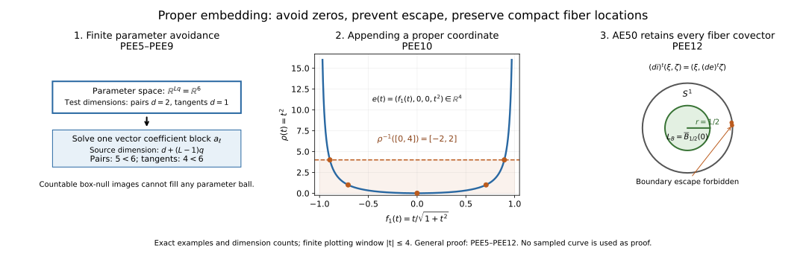

# Proper Euclidean embeddings and the compact-control reduction

This independently authored proof is dedicated to CC0 1.0 Universal. It supplies the full provider SH02-AE-DEP-SMOOTH-TOPOLOGY used by SH02-AE-MICROPROPER at AE626. The exact used-body bindings, scholarly references and component terms are given below. No text from the attributed DG-FND Section 3 is incorporated into this CC0 proof.

Our manifolds have the standing smooth, finite-dimensional, Hausdorff, countable-at-infinity convention. Charts are ordinary charts without boundary. Countable at infinity means a countable union of compact subsets. Neither connectedness nor compactness is assumed. For the usual pure-dimensional convention write \(\dim M=n\); the same proof permits components of different dimensions bounded by one finite \(n\). An immersion has injective differential, and an embedding is an immersion that is a homeomorphism onto its image. Proper means that inverse images of compact subsets are compact.

The elementary Euclidean floor is the ordered real field with its least-upper-bound property, natural-number induction, finite-dimensional linear algebra, compactness, the segment fundamental theorem of calculus, the smooth flat cutoff, and the smooth inverse function theorem. Complete proof bodies for these inputs are bound to the DG-FND elementary calculus and smooth inverse provider, lines 13–134 and 137–170 at revision `17e99c7e7fd7f0c92bc256317a57e52a46084d67`, raw SHA-256 `d1d6644b8df928b7baac5cddfc11b64fbd069b208111c68cb7f78761bed7901e`. These ranges are independently written CC0. In particular, the inverse theorem includes its contraction proof and the induction proving smoothness of the inverse. We prove below every countability, function-space completeness, avoidance, countable-intersection, and proper-exhaustion step used by the embedding construction. No Whitney, Sard, transversality, general Baire theorem, metric completeness of a manifold, or partition-of-unity theorem is imported.

## SH02-PEE-PROPER — PEE1. The full theorem

For every such manifold \(M\), there exists a finite integer \(N\) and a proper smooth embedding

\[
e:M\longrightarrow\mathbb R^N.
\tag{PEE1.1}
\]

Its image is closed. If \(n\ge1\), \(N=2n+2\) is sufficient. If \(n=0\), \(N=1\) is sufficient, including a finite or countably infinite disconnected \(M\). The empty manifold embeds properly in every Euclidean space, including \(\mathbb R^0\). A singleton can use \(\mathbb R^0\). For any standing manifold \(X\), \(\operatorname{id}_X\times e\) is a proper closed smooth embedding. All these assertions will be proved, including the local adapted-chart statement.

The bound is sufficient for AE626; no sharp embedding-dimension claim is needed. The construction first produces an injective immersion \(f:M\to\mathbb R^{2n+1}\), then appends a smooth proper exhaustion \(\rho\). We do not assume that the injective immersion \(f\) itself is a topological embedding.

## PEE2. Countable coordinate controls and compact interiors

Every point has a coordinate neighborhood with compact closure contained in a larger chart: take the inverse image of a small closed Euclidean box wholly inside the chart domain, and use its interior. That closed box is compact by the Euclidean floor; its image is compact in \(M\) and therefore closed because \(M\) is Hausdorff.

Let \(M=\bigcup_j S_j\) with \(S_j\) compact. Cover each \(S_j\) by finitely many chart domains. Their union is a countable atlas. In each coordinate image the rational open boxes form a countable basis: for a point in an open set choose sufficiently close rational endpoints so that the closed box still lies in that set. The images of these bases form a countable basis for \(M\). Thus the standing convention implies second countability without adding it as a new hypothesis.

Enumerate all closed rational coordinate boxes contained in these chart images and having positive side lengths. Include enough boxes that their interiors cover every chart image; in dimension zero a box is the singleton \(\mathbb R^0\). Write \(B_i\) for their inverse images and \(\phi_i\) for the chosen coordinates near \(B_i\). Every \(B_i\) is compact, and every point of \(M\) lies in \(\operatorname{int}B_i\) for some \(i\). Every compact subset of \(M\) is covered by finitely many such interiors. Repetitions cause no problem.

There also exist compact subsets \(K_j\) with

\[
\begin{gathered}
K_0=\varnothing,\\K_j\subset\operatorname{int}K_{j+1},\\\bigcup_{j\ge1}\operatorname{int}K_j=M.
\end{gathered}
\tag{PEE2.1}
\]

Construct \(K_j\) recursively. Cover the compact set \(K_{j-1}\cup S_j\) by finitely many of the precompact coordinate neighborhoods in the first paragraph, and let \(K_j\) be the union of their compact closures. Then \(K_{j-1}\cup S_j\) lies in \(\operatorname{int}K_j\). Finite unions are compact. Every point belongs to some \(S_j\) and hence to \(\operatorname{int}K_j\), proving (PEE2.1). This is a direct finite-cover construction.

The same countable-coordinate argument applies to \(M\times M\). The diagonal \(\Delta\) is closed: a pair of distinct points has disjoint neighborhoods, whose product misses \(\Delta\). Hence \(M\times M\setminus\Delta\) is an open manifold with a countable coordinate basis. Enumerate closed coordinate boxes \(T_j\) contained in that open manifold with interiors covering it. Their dimensions are at most \(2n\). These \(T_j\) are compact sets of pairs of distinct points. This avoids imposing a global positive distance between all distinct points.

## PEE3. Global smooth cutoff functions without partitions

Let \(E\) be compact in an open set \(O\subset M\). We prove that there is a global smooth \(\chi:M\to[0,1]\), equal to \(1\) on a neighborhood of \(E\), with compact support contained in \(O\).

For each \(x\in E\), choose a chart and concentric Euclidean balls of radii \(0<a<b\) whose closed outer ball is contained in the chart image of \(O\). Let \(\eta(t)=\exp(-1/t^2)\) for \(t>0\) and \(0\) otherwise, the flat smooth function from the admitted Euclidean floor. Put

\[
\begin{gathered}
\vartheta(t)=\frac{\eta(t)}{\eta(t)+\eta(1-t)},\\\beta(u)=\vartheta\!\left(\frac{b^2-|u-u_x|^2}{b^2-a^2}\right).
\end{gathered}
\tag{PEE3.1}
\]

The denominator of \(\vartheta\) is positive for every real \(t\); at least one of \(t\) and \(1-t\) is positive. Thus \(\vartheta\) is smooth, lies in \([0,1]\), is \(0\) for \(t\le0\) and \(1\) for \(t\ge1\). The function \(\beta\) is \(1\) on the closed inner ball and \(0\) off the open outer ball. Its chart formula, extended by zero outside the chart, is globally smooth: its support is a compact subset of the chart domain, so every point outside that domain has a neighborhood on which the extension is identically zero. Smoothness at the outer sphere also follows directly from the globally smooth formula (PEE3.1).

Finitely many inner balls cover \(E\). For their global functions \(\beta_1,\ldots,\beta_s\) define

\[
\chi=1-\prod_{\ell=1}^s(1-\beta_\ell).
\tag{PEE3.2}
\]

It is smooth and between \(0\) and \(1\). At every point of the union of inner-ball interiors at least one \(\beta\) is \(1\), so \(\chi=1\) there. Its support is contained in the finite union of the outer closed balls, a compact subset of \(O\). For \(E=\varnothing\) use \(\chi=0\). In dimension zero the characteristic function of any finite set is smooth and supplies the same conclusion.

Two consequences will be used. First, if \(x\ne y\), there is a smooth compactly supported scalar \(h\) with \(h=1\) near \(x\) and \(h=0\) near \(y\): choose an open neighborhood of \(x\) excluding \(y\) and apply the construction to \(E=\{x\}\). Second, for each positive-dimensional coordinate box \(B_i\) there is \(\chi_i=1\) near \(B_i\) supported in its chart. Thus the scalar functions

\[
h_{i,\ell}=\chi_i\,\phi_i^\ell
\quad(1\le\ell\le\dim\phi_i),
\tag{PEE3.3}
\]

extended by zero, are globally smooth and have differential \(d\phi_i^\ell\) on a neighborhood of \(B_i\).

## PEE4. A complete countable smooth-function metric

Fix a finite target dimension \(q\ge1\) and put \(V=C^\infty(M,\mathbb R^q)\). For every coordinate box \(B_i\) and nonnegative integer \(r\) define

\[
p_{i,r}(u)=
\max_{\substack{|\alpha|\le r\\1\le a\le q}}
\sup_{z\in\phi_i(B_i)}
\left|\partial^\alpha(u^a\circ\phi_i^{-1})(z)\right|.
\tag{PEE4.1}
\]

These numbers are finite by continuity on a compact set. Enumerate all pairs \((i,r)\) as a sequence \(p_1,p_2,\ldots\), and define

\[
d(u,v)=\sum_{\nu=1}^\infty2^{-\nu}
\min\{1,p_\nu(u-v)\}.
\tag{PEE4.2}
\]

The series converges. Each \(p\) is subadditive and absolutely homogeneous; \(\min(1,a+b)\le\min(1,a)+\min(1,b)\). These facts prove the triangle inequality. Symmetry is immediate. If \(d(u,v)=0\), all zeroth-coordinate seminorms vanish, and the covering by \(B_i\) gives \(u=v\). Therefore \(d\) is a translation-invariant metric.

This metric induces exactly convergence and neighborhoods governed by finitely many compact-coordinate derivative bounds. For one \(p_\nu\) and \(0<\varepsilon<1\), \(d(u,v)<2^{-\nu}\varepsilon\) forces \(p_\nu(u-v)<\varepsilon\). Conversely, given a metric tolerance \(\varepsilon>0\), choose \(J\) so that \(\sum_{\nu>J}2^{-\nu}<\varepsilon/2\), and choose \(\delta>0\) with \(\sum_{\nu\le J}2^{-\nu}\delta<\varepsilon/2\). If \(p_\nu(u-v)<\delta\) for \(\nu\le J\) then \(d(u,v)<\varepsilon\). Taking the minimum of finitely many tolerances proves the asserted neighborhood comparison. Each individual \(p_\nu\) is therefore continuous, and finite-dimensional perturbations \(u+\sum_\ell a_\ell h_\ell\) depend continuously on the coefficients in this metric.

We now prove completeness. If \(u_m\) is \(d\)-Cauchy, the first inequality makes every coordinate derivative in (PEE4.1) uniformly Cauchy on its closed box. For each box, derivative multi-index and target coordinate it has a uniform limit: pointwise real completeness supplies a limit, and passing to that limit in the Cauchy bound gives uniform convergence. A uniform limit of continuous functions is continuous by the three-term triangle estimate.

The zeroth limits agree at overlaps, because the same sequence \(u_m\) has the same pointwise value there. They define a global function \(u\). On the interior of any coordinate box, take a sufficiently short coordinate segment contained in that interior. The admitted segment fundamental theorem gives

\[
\begin{gathered}
\partial^\alpha u_m(z+t e_\ell)-\partial^\alpha u_m(z)\\=\int_0^t\partial^{\alpha+e_\ell}u_m(z+s e_\ell)\,ds.
\end{gathered}
\tag{PEE4.3}
\]

Uniform convergence permits passage to the limit in the integral. Dividing the resulting identity by \(t\) and using continuity of the limiting integrand proves that the limit of \(\partial^\alpha u_m\) has partial derivative equal to the limit of \(\partial^{\alpha+e_\ell}u_m\). Induction starting at \(\alpha=0\) proves that \(u\) is smooth on these interiors and that all its derivatives are the displayed limits. Continuous partial derivatives give the full norm derivative by successive coordinate increments and the segment formula. Iterating proves the usual smoothness in each chart.

This identifies the derivative limits on every closed box as well: each point of its boundary lies in the interior of another covering box; coordinate chain rules give local convergence of derivatives there, or one may approach it from the interior of the original box and use continuity. For positive-dimensional boxes that interior is dense; in dimension zero there is no boundary. Consequently \(p_\nu(u_m-u)\to0\) for every \(\nu\). Splitting (PEE4.2) into finitely many terms and a tail gives \(d(u_m,u)\to0\). This proves completeness of \(V\).

The coordinate transition step just mentioned is explicit. On a smaller compact neighborhood lying in two charts, every derivative of \(u_m\) in the second coordinates is a finite sum of derivatives of \(u_m\) in the first coordinates multiplied by fixed derivatives of the smooth transition map. The latter are bounded there. Uniform convergence therefore passes through the finite sum. Thus no unproved compatibility of coordinate limits is being assumed.

## PEE5. Elementary nullity of lower-dimensional parameter images

For \(A\subset\mathbb R^P\), \(P\ge1\), say \(A\) is box-null if, for every \(\varepsilon>0\), it has a countable cover by open rectangular boxes with sum of their Euclidean volumes less than \(\varepsilon\). This definition uses countable covers; it is not finite Jordan content.

Any countable union of box-null sets is box-null: for the \(j\)th set choose a cover of volume sum less than \(\varepsilon2^{-j-1}\), and unite the covers. The total is less than \(\varepsilon\). A nonempty Euclidean ball is not box-null. Indeed it contains a closed cube \(C\) of positive side length. If countably many open boxes cover \(C\), compactness gives a finite subcover. For any finite boxes covering \(C\) the sum of their volumes is at least \(\operatorname{vol}(C)\). To verify that elementary inequality, collect in each coordinate all endpoints of \(C\) and the finitely many box faces meeting \(C\). These faces divide \(C\) into finitely many rectangular cells. Assign every positive-volume cell to a covering box containing a point in its interior. No box face crosses such a cell's interior; hence that cell's interior lies in the assigned box. The assigned cell volumes sum to \(\operatorname{vol}(C)\), while for each box their sum is at most its volume, by the finite rectangular subdivision formula. This proves the inequality. A cover of total volume less than \(\operatorname{vol}(C)\) is therefore impossible.

Let \(\Psi:O\subset\mathbb R^D\to\mathbb R^P\) be smooth, with \(D<P\). Its image is box-null. First take a compact closed coordinate box \(Q\) contained in \(O\). The norm of \(D\Psi\) is bounded on \(Q\); the segment formula makes \(\Psi\) Lipschitz there with some finite constant \(L\). If \(Q\) has side lengths bounded by \(A\), split it into at most \((A/\delta+2)^D\) small boxes of side at most \(\delta\). Each image has diameter at most \(L\sqrt D\,\delta\) and is contained in an open \(P\)-dimensional box of side at most \(2(L\sqrt D+1)\delta\). The total volume is at most

\[
(A/\delta+2)^D\,\{2(L\sqrt D+1)\delta\}^P,
\tag{PEE5.1}
\]

which tends to \(0\) because \(P-D>0\). For \(D=0\) the domain is a singleton and an arbitrarily small target box suffices. Every open \(O\) is covered by countably many closed rational boxes contained in \(O\). Countable union nullity proves the assertion for \(\Psi(O)\).

More generally, if \(Z\) is a second-countable smooth manifold of dimension \(d\) and \(\Psi:Z\times\mathbb R^s\to\mathbb R^P\) is smooth with \(d+s<P\), its image is box-null. Choose countably many coordinate charts of \(Z\) and rational closed boxes within the corresponding open product-coordinate domains. Apply the preceding argument on each box. A second-countable manifold has a countable chart cover: given any chart cover and a countable basis, for each basis member contained in a chart select one such chart; these selected charts cover every point. Open subsets have the same property. This supplies every countability premise in this parameter-image argument.

## PEE6. Finite perturbations avoiding a compact family of zeros

Let \(Z\) be a second-countable \(d\)-dimensional smooth manifold with \(d<q\), let \(T\subset Z\) be compact, and let \(g:Z\to\mathbb R^q\) and \(b_1,\ldots,b_L:Z\to\mathbb R\) be smooth. Suppose that at every \(z\in T\) at least one \(b_\ell(z)\) is nonzero. For coefficients \(a_\ell\in\mathbb R^q\) put

\[
G_a(z)=g(z)+\sum_{\ell=1}^L b_\ell(z)a_\ell.
\tag{PEE6.1}
\]

There are arbitrarily small coefficient vectors \(a\in\mathbb R^{Lq}\) such that \(G_a\) has no zero on \(T\).

For the proof restrict \(Z\) to the open neighborhood \(U=\bigcup_\ell\{b_\ell\ne0\}\) of \(T\). On \(U_\ell=\{b_\ell\ne0\}\), a zero forces

\[
a_\ell=
-\frac{g(z)+\sum_{k\ne\ell}b_k(z)a_k}{b_\ell(z)}.
\tag{PEE6.2}
\]

Thus all bad coefficients arising from \(U_\ell\) lie in the image of the smooth map

\[
U_\ell\times\mathbb R^{(L-1)q}
\longrightarrow\mathbb R^{Lq}
\tag{PEE6.3}
\]

that retains the free coefficient blocks and fills the \(\ell\)th block by (PEE6.2). Its source dimension is \(d+(L-1)q<Lq\). PEE5 makes that image box-null. The union over finitely many \(\ell\) is box-null. It cannot contain any parameter ball, by PEE5. Every ball about zero therefore contains a coefficient outside the bad set, proving the claim. Empty \(T\) imposes no condition; no \(L=0\) division is used.

This proves the needed parameter avoidance directly. It does not use a regular-value theorem, a statement about almost every parameter without proof, or an unproved projection measure theorem.

## PEE7. Open dense derivative conditions

Take \(q=2n+1\) for \(n\ge1\). For each positive-dimensional box \(B_i\), let \(r_i=\dim\phi_i\). A coordinate tangent vector is denoted \(v\in\mathbb R^{r_i}\). Define \(I_i\subset V\) by

\[
\begin{gathered}
u\in I_i\quad\Longleftrightarrow\\D(u\circ\phi_i^{-1})_{\phi_i(x)}v\ne0\\\text{for every }x\in B_i,\ |v|=1.
\end{gathered}
\tag{PEE7.1}
\]

This condition is open. The displayed norm has a positive minimum \(\mu\) on the compact set \(B_i\times S^{r_i-1}\). If the first derivatives of \(u-u'\) in the chart are at most \(\delta\) per entry, their value on a unit \(v\) has norm at most \(\sqrt{q r_i}\,\delta\). Choosing this bound less than \(\mu\) preserves nonvanishing. PEE4 supplies the corresponding open metric neighborhood.

It is dense. Choose \(\chi_i\) and \(h_{i,\ell}\) from PEE3. On a neighborhood of \(B_i\) their derivatives in the chosen coordinates are the coordinate covectors, so for \(u_a=u+\sum_{\ell=1}^{r_i}h_{i,\ell}a_\ell\),

\[
\begin{gathered}
D(u_a\circ\phi_i^{-1})_zv\\=D(u\circ\phi_i^{-1})_zv+\sum_{\ell=1}^{r_i}v_\ell a_\ell.
\end{gathered}
\tag{PEE7.2}
\]

Apply PEE6 on a neighborhood of \(B_i\times S^{r_i-1}\), with \(b_\ell=v_\ell\). One \(b\) is nonzero at every unit \(v\). The parameter manifold has dimension \(r_i+(r_i-1)=2r_i-1<q\). Hence arbitrarily small coefficients make (PEE7.2) nonzero for every point of that compact set. PEE4 says these perturbations approach \(u\) in \(V\), proving density.

For completeness, the unit sphere has the ordinary smooth charts required here. Where \(v_\ell\) has prescribed nonzero sign, solve \(v_\ell=\pm\sqrt{1-\sum_{k\ne\ell}v_k^2}\) on the open unit disk in the remaining coordinates. Square root on positive numbers is smooth, either by the admitted smooth inverse theorem applied to \(t\mapsto t^2\) for \(t>0\) or by its elementary derivative formula. These finitely many charts cover the sphere. For \(r_i=1\) the sphere is the two-point zero-dimensional manifold. Zero-dimensional boxes impose no derivative condition, since their tangent spaces are zero.

## PEE8. Open dense point-separation conditions

For each compact off-diagonal box \(T_j\) from PEE2 define \(J_j\subset V\) by

\[
\begin{gathered}
u\in J_j\quad\Longleftrightarrow\\u(x)-u(y)\ne0\\\text{for every }(x,y)\in T_j.
\end{gathered}
\tag{PEE8.1}
\]

The norm of the difference has a positive minimum on \(T_j\) when the condition holds. The two compact projections of \(T_j\) to \(M\) are covered by finitely many box interiors \(B_i\). Small enough zeroth seminorm bounds on those boxes make \(u'-u\) uniformly small on both projections, so preserve that minimum. Hence \(J_j\) is open.

To prove density, at each pair \((x,y)\in T_j\) choose by PEE3 a scalar smooth compactly supported \(h\) with \(h(x)-h(y)=1\). Its difference remains nonzero on an open neighborhood of that pair. Finitely many such neighborhoods cover the compact \(T_j\); write their functions \(h_1,\ldots,h_L\). On \(Z=M\times M\setminus\Delta\) put

\[
\begin{gathered}
g(x,y)=u(x)-u(y),\\b_\ell(x,y)=h_\ell(x)-h_\ell(y).
\end{gathered}
\tag{PEE8.2}
\]

At each point of \(T_j\) one \(b\) is nonzero. Its local source dimension is at most \(2n<q\); for components with differing dimensions, apply PEE6 in each of the finitely or countably many coordinate dimension types, using the same nullity union argument. PEE6 yields arbitrarily small \(a\) for which \(u+\sum h_\ell a_\ell\) separates every pair of \(T_j\). Continuity of the coefficient perturbation in PEE4 proves density.

This argument also separates pairs on different components. No finite-component hypothesis and no local-finiteness claim for an infinite perturbation sum is being used.

## PEE9. Explicit countable-intersection construction

Enumerate all conditions \(I_i\) and \(J_j\) as \(G_1,G_2,\ldots\); skip empty derivative families. Each \(G_m\) is open and dense in the complete metric space \(V\). If a family is finite, repeat its members; a vacuous family causes no difficulty. We give the complete nested-ball construction.

Start with any open metric ball \(B(u_0,r_0)\), \(r_0>0\). Having constructed \(B(u_{m-1},r_{m-1})\), density supplies

\[
u_m\in G_m\cap B(u_{m-1},r_{m-1}).
\tag{PEE9.1}
\]

This intersection is open. Choose \(0<r_m\le2^{-m}\) so small that the closed metric ball

\[
\overline B(u_m,r_m)\subset
G_m\cap B(u_{m-1},r_{m-1}).
\tag{PEE9.2}
\]

Such a radius exists: take less than the metric distance allowed by an open neighborhood of \(u_m\) and less than \(r_{m-1}-d(u_m,u_{m-1})\). For \(k\ge m\), nesting puts \(u_k\) in the closed ball centered at \(u_m\) of radius \(r_m\). Consequently \(d(u_k,u_l)\le2r_m\) for \(k,l\ge m\). Completeness in PEE4 gives a limit \(f\). For fixed \(m\) the closed ball in (PEE9.2) contains the whole tail and hence \(f\); thus \(f\in G_m\). This proves existence without importing a Baire theorem.

All distinct \(x,y\) belong to some \(T_j\), so \(f(x)\ne f(y)\). At any point \(x\) and any nonzero tangent \(w\), choose a positive-dimensional \(B_i\) whose interior contains \(x\); scale its coordinate vector to a unit \(v\). Condition \(I_i\) gives \(df_x(w)\ne0\). Thus \(f\) is an injective immersion into \(\mathbb R^{2n+1}\). At a zero-dimensional component the differential is injective automatically.

## PEE10. A smooth proper exhaustion and the proper embedding

Choose \(K_j\) from PEE2, and by PEE3 choose \(\chi_j=1\) on a neighborhood of \(K_j\) with compact support contained in \(\operatorname{int}K_{j+1}\). Define

\[
\rho(x)=\sum_{j=1}^\infty(1-\chi_j(x)).
\tag{PEE10.1}
\]

This is a nonnegative smooth function. At \(x\) choose \(m\) with \(x\in\operatorname{int}K_m\). On that same open set, for every \(j\ge m\) one has \(\chi_j=1\) because \(K_m\subset K_j\). All those terms vanish identically there, leaving only a finite sum. This is neighborhood local finiteness, not merely pointwise convergence.

If \(x\notin K_{m+1}\), then for \(1\le j\le m\) it is outside \(\operatorname{supp}\chi_j\subset K_{j+1}\subset K_{m+1}\), so each of these terms is \(1\) and \(\rho(x)\ge m\). Given a finite \(R\), choose an integer \(m>R\). Then \(\{\rho\le R\}\) is a closed subset of the compact \(K_{m+1}\), hence compact. The inverse image of a compact subset of \(\mathbb R\) is closed and contained in such a sublevel, so \(\rho:M\to\mathbb R\) is proper.

Set

\[
e=(f,\rho):M\longrightarrow\mathbb R^{2n+2}.
\tag{PEE10.2}
\]

It is smooth and injective. Its differential is injective because \(df\) is. If \(C\) is compact in the target, its last coordinate is bounded by a finite \(R\), so \(e^{-1}(C)\) is a closed subset of the compact \(\{\rho\le R\}\). Thus \(e\) is proper.

Every continuous proper map \(e:M\to\mathbb R^N\) is closed. If \(H\subset M\) is closed and \(z\notin e(H)\), choose a compact closed Euclidean ball \(C\) with \(z\) in its interior. The set \(H\cap e^{-1}(C)\) is compact, so its image is a closed compact subset of \(\mathbb R^N\) missing \(z\). The open neighborhood \(\operatorname{int}C\setminus e(H\cap e^{-1}(C))\) misses \(e(H)\). Hence \(e(H)\) is closed. Taking \(H=M\) proves that \(e(M)\) is closed. An injective continuous closed map is a homeomorphism onto its image: the inverse carries each closed \(H\subset M\) to the relative closed set \(e(H)\). This proves that (PEE10.2) is a proper smooth embedding.

A zero-dimensional manifold is discrete, since every point is its own chart-open neighborhood. Its compact subsets are finite, since the singleton cover has a finite subcover precisely for finite subsets. Countable at infinity therefore makes \(M\) finite or countably infinite. Enumerate its points without repetition as \(m_1,m_2,\ldots\) and set \(e(m_j)=j\in\mathbb R\). This is smooth, injective, and proper, since a compact subset of \(\mathbb R\) is bounded and contains only finitely many positive integers. Its image is closed by the preceding closed-map proof, or directly because the integers have no finite accumulation point. Finite \(M\) uses the finite initial subset. For a singleton, the unique map to \(\mathbb R^0\) is smooth, is a homeomorphism, has injective zero-dimensional differential, and is proper because its domain is compact. For an empty \(M\) the unique map to \(\mathbb R^N\) has empty inverse images and is proper, a smooth embedding with closed image. These cases complete PEE1.

## SH02-PEE-ADAPTED-PRODUCT — PEE11. Adapted submanifold charts and product properness

We check the ordinary submanifold charts explicitly. At \(m\) in a positive-dimensional component, injectivity of \(de\) gives \(\dim_m M\) independent output coordinate functions with invertible derivative; elementary row selection proves such a minor exists. The smooth inverse theorem uses these output functions as coordinates \(u\) on a source neighborhood \(U\). The remaining outputs have a smooth expression \(h(u)\), so \(e|_U\) has expression \(u\mapsto(u,h(u))\). The ambient coordinate change

\[
\begin{gathered}
(u,w)\longmapsto(u,w-h(u)),\\(u,z)\longmapsto(u,z+h(u)).
\end{gathered}
\tag{PEE11.1}
\]

is an actual smooth local diffeomorphism, with the displayed inverse. Since \(e\) is a homeomorphism to its image, \(e(U)\) is relatively open in \(e(M)\). There is an ambient open \(W\) with \(e(M)\cap W=e(U)\). Shrink the target neighborhood and source coordinate range within \(W\) and to a product box in (PEE11.1). Its intersection with the entire \(e(M)\), rather than just one chosen parametrized part, is exactly \(\{z=0\}\). For a zero-dimensional component, relative openness isolates the image point and a translated ambient chart gives the same assertion. Thus \(e(M)\) is a closed embedded smooth submanifold in the full ordinary sense.

For any standing \(X\), \(i=\operatorname{id}_X\times e\) is smooth and injective with injective differential, is a homeomorphism onto \(X\times e(M)\), and has closed image. It is proper. If \(C\subset X\times\mathbb R^N\) is compact, let \(C_X\) and \(C_Z\) be its compact coordinate projections. Then

\[
i^{-1}(C)\subset C_X\times e^{-1}(C_Z).
\tag{PEE11.2}
\]

The right side is compact. A finite product of compact spaces is compact by the elementary finite-cover argument: for each point of the first compact factor, compactness of the second gives finitely many covering rectangles and a common first-factor neighborhood; finitely many such first-factor neighborhoods then give a finite subcover. An arbitrary product open cover first has a rectangle refinement. As \(C\) is closed in the Hausdorff product and \(i\) continuous, its preimage is closed in the compact right side. This proves properness. The same argument proves \(\operatorname{id}_P\times e\) proper for any locally compact Hausdorff \(P\), and in particular \(P=T^*X\) or an open cotangent region \(\Omega\).

## SH02-PEE-AE-TRANSPORT — PEE12. Exact AE49–AE54 transport and canonical comparison

This section checks the actual [AE49–AE55 consumer](../../sheaf-proof-readings/SH02-asymptotic-estimates.html#SH02-AE-MICROPROPER). Its sheaf-operation inputs remain the declared closed-embedding microsupport formula, proper-image estimate, localization triangle and canonical composition laws. It closes their missing smooth-topology input; it does not relabel those separate operation providers as a new proof of every foundation.

Let \(q:X\times Y\to X\), let \(A=\operatorname{SS}(F)\), and choose the proved proper embedding \(e:Y\to\mathbb R^N\). For \(i=\operatorname{id}_X\times e\) put \(F'=i_*F\). A closed embedding has exact direct image, coinciding with its proper-support direct image, and both derived images therefore equal \(i_*F\). The [closed-embedding equality MO8–MO9](../../sheaf-proof-readings/SH02-microsupport-operations.html#SH02-MO-PROPER-PUSH) is the exact operation used here. The transpose of its differential is

\[
(di)^t_{(x,y)}(\xi,\zeta)=(\xi,(de_y)^t\zeta).
\tag{PEE12.1}
\]

In particular, the \(X\) covector is unchanged. The actual closed-embedding microsupport formula gives

\[
\begin{gathered}
A'=\operatorname{SS}(F')\\=\bigl\{(x,e(y);\xi,\zeta):\\(x,y;\xi,(de_y)^t\zeta)\in A\bigr\}.
\end{gathered}
\tag{PEE12.2}
\]

Every cotangent \(\eta\) at \(y\) is \((de_y)^t\zeta\) for some \(\zeta\), because \(de_y\) is injective: extend a basis of its image to an ambient basis and define the functional there, using zero on the added basis vectors. Hence, if \(p\) and \(p'\) forget the fiber covector but retain the fiber base point,

\[
p'(A')=(\operatorname{id}_{T^*X}\times e)\,p(A).
\tag{PEE12.3}
\]

Write \(J=\operatorname{id}_{T^*X}\times e\). PEE11 makes \(J\) a proper closed embedding. For every subset \(S\) of its domain,

\[
\overline{J(S)}=J(\overline S).
\tag{PEE12.4}
\]

Indeed closedness of the image of \(J\) excludes closure points outside that image, and the homeomorphism to the image identifies the remaining closure. This also works after restricting to \(\Omega\times Y\). Therefore AE49's closed projected set is transported by \(J\), with its actual closure retained.

For compact \(K\subset\Omega\), AE50 supplies compact \(L\subset Y\) controlling the base of every \(\eta\) over \(K\). Equation (PEE12.2) then controls the base of every \(\zeta\) of \(A'\) over \(K\) by the compact \(e(L)\). Conversely (PEE12.3), or properness of \(e\) applied to a compact ambient control, recovers compact control in \(Y\). Thus the condition is preserved for all fiber covectors and all compact cotangent \(K\). Control only at \(\eta=0\) is never substituted.

The ordinary critical cotangent images are equal as well. If \((x,e(y);\xi,0)\in A'\), (PEE12.2) gives \((x,y;\xi,0)\in A\). Conversely such an original covector gives the ambient covector with \(\zeta=0\) in (PEE12.2). Therefore both sides of the desired AE52 inclusions have the same ordinary critical set after the embedding.

Let \(q_E:X\times\mathbb R^N\to X\). Composition gives \(R(q_E)_!i_*F\cong Rq_!F\) and \(R(q_E)_*i_*F\cong Rq_*F\). These identify the canonical comparison, not only its objects. For composable maps \(g\) then \(h\), the ordinary comparison \(C_{hg}\) is, under canonical composition identifications, the composite

\[
\begin{gathered}
Rh_!Rg_!F\xrightarrow{C_h}Rh_*Rg_!F\\\xrightarrow{Rh_*C_g}Rh_*Rg_*F.
\end{gathered}
\tag{PEE12.5}
\]

This is the canonical section-support inclusion: a proper-support section is sent to the same ordinary section, first for \(h\) and then for \(g\). Resolving by the admitted common acyclic models gives the displayed derived identity; the composition maps themselves come from the same section maps. For \(g=i\), \(C_i\) is the identity under \(i_!=i_*\). Thus (PEE12.5) identifies \(C_q\) with \(C_{q_E}\) evaluated on \(i_*F\), with no change of normalization.

Use the explicit diffeomorphism

\[
\begin{gathered}
b:\mathbb R^N\longrightarrow B^N,\\b(z)=\frac{z}{\sqrt{1+|z|^2}},\\b^{-1}(w)=\frac{w}{\sqrt{1-|w|^2}}.
\end{gathered}
\tag{PEE12.6}
\]

The formulas are smooth on their stated domains and their direct compositions are identities, so they are actual smooth inverses. A diffeomorphism is proper as a map to its target, since its inverse sends compact subsets to compact subsets. Its cotangent map fixes \(\xi\) and changes only the fiber covector by an invertible transpose. It therefore preserves both compact control and the critical condition. A compact \(L_B\subset B^N\) has \(\max|w|<1\), by compactness and the extreme-value theorem. It cannot contain a sequence converging to \(S^{N-1}\). Canonical direct-image comparison is transported through this homeomorphism by (PEE12.5).

Now retain the actual AE628–647 construction: \(j:X\times B^N\to X\times\mathbb R^N\), \(\overline q:X\times\mathbb R^N\to X\). The closed supports of \(j_!F_B\), \(Rj_*F_B\) and their comparison cone lie in \(X\times\overline{B^N}\). The projection \(\overline q\) is proper on any closed subset of this cylinder: its inverse image of compact \(C\subset X\) is closed in the compact \(C\times\overline{B^N}\). Consequently its comparison \(C_{\overline q}\) is an isomorphism on these objects. Formula (PEE12.5) for \(g=j\), \(h=\overline q\) identifies the original comparison with

\[
R\overline q_*
\bigl(j_!F_B\longrightarrow Rj_*F_B\bigr),
\tag{PEE12.7}
\]

under the exact AE54 identifications. The boundary comparison cone is carried through this actual map.

Finally, the boundary conormal has zero \(X\) covector. In the AE55 sum criterion an alleged critically projecting boundary covector over \((x_0;\xi_0)\in\Omega\) therefore gives \(A_B\) covectors whose \(X\) cotangent coordinates converge to \((x_0;\xi_0)\) and whose fiber base points converge to the sphere. Put the tail of the \(X\) coordinates in a compact neighborhood \(K\subset\Omega\). Such a neighborhood exists by finitely many precompact cotangent chart neighborhoods around the compact set or the single limiting point. AE50 puts all those fiber bases in one compact \(L_B\subset B^N\), contradicting \(\max|w|<1\). This excludes the boundary contribution without a bound on the fiber covector magnitude. The proper-image estimate applied to the two AE54 objects yields both AE52 estimates, with only the interior zero-fiber-covector critical set left. Applying it to (PEE12.7)'s cone gives microsupport disjoint from \(\Omega\), exactly the localization cone criterion for the canonical AE53 arrow.

For completeness, \(\text{AE49}\Longleftrightarrow\text{AE50}\) remains valid with closure: when proving properness over a compact \(K\subset\Omega\), choose a larger compact neighborhood \(K'\subset\Omega\), apply compact control there, and then take the closed projected set over \(K\) inside \(K\times L'\). A point in its closure is approximated by points whose first coordinate eventually lies in \(K'\). This is AE596's essential closure step, and equations (PEE12.3)–(PEE12.4) preserve it. For empty \(Y\) both images are zero. For \(N=0\) the only nonempty embedded fiber is a singleton and \(q\) is the identity. A general zero-dimensional \(Y\) may be countably infinite and uses the \(N=1\) embedding in PEE10, followed by the same ball argument.

## PEE13. Exact illustration of the construction and transport

The [reproducible CC0 figure source](../figures/proper_embedding_mechanism.py) generates the wide and [stacked mobile figure](../figures/proper_embedding_mechanism_mobile.svg) from identical exact objects. Both layouts were rendered and inspected. The first panel specializes PEE6 to \(n=1\), \(q=3\) and \(L=2\): pair tests have dimension \(2\) and their bad parameters are covered by images of dimension \(5\) sources in \(\mathbb R^6\); tangent tests have dimension \(1\) and corresponding source dimension \(4<6\). This is an exact dimension diagram, rather than a picture of a six-dimensional parameter space. The second panel uses the explicit injective immersion \(f(t)=(t/\sqrt{1+t^2},0,0)\) and the proper coordinate \(\rho(t)=t^2\); the plotted coordinates of \(e(t)\) are its first and fourth coordinates. The full domain is all \(\mathbb R\), while the plotting window is \(|t|\le4\). The exact sublevel inverse image is \(\rho^{-1}([0,4])=[-2,2]\). This example illustrates PEE10's mechanism and is not the generic \(f\) constructed in PEE9. The third panel shows the exact compact set \(L_B=\overline{B_{1/2}(0)}\subset B^2\). The orange samples are \(k=50\) and \(100\) of \(y_k=(1-1/k,6/k)\), \(k\ge19\); these points are in \(B^2\) and tend to \((1,0)\in S^1\). They cannot all lie in \(L_B\). The covector formula displayed is (PEE12.1), with its unchanged \(X\) covector and unrestricted fiber covector. No source image is reused and no numerical plot replaces a proof.

The human-source references relevant to the consumer and Euclidean floor are given next.

## PEE14. Scholarly references and exact scope of this delivery

The elementary source metadata already present in the admitted DG foundation credits Jiří Lebl, Basic Analysis: Introduction to Real Analysis, volumes I–II, version 6.3, 15 May 2026, author's free edition https://www.jirka.org/ra/; and Tomasz Mrowka, Geometry of Manifolds, MIT 18.965, Fall 2004, Lecture 4, Theorems 5.1–5.2, https://ocw.mit.edu/courses/18-965-geometry-of-manifolds-fall-2004/resources/lecture4/. The independently authored foundation supplies the actual calculus and inverse proofs used here, rather than outsourcing those proofs to the citations.

The frozen AE consumer's exact free scholarly comparison is Masaki Kashiwara and Pierre Schapira, Microlocal study of sheaves, Astérisque 128 (1985), Theorem 4.3.4 and Corollary 4.3.5, printed 70–72, with Theorems 4.4.1–4.4.2 and §§ 5.1–5.3, printed 77–84: https://www.numdam.org/item/AST_1985__128__1_0/ and the author's free scan https://webusers.imj-prg.fr/~pierre.schapira/BooksMono/Ast128.pdf. This is cited from AE749 and the existing provenance metadata; no new external book was downloaded or reproduced. The original owned reservation remains SM 6.3.3, PDF 281–282/printed 267–268, as recorded in the frozen original obligation ledger. That reservation is not falsely presented as an Astérisque numbering.

The human sources retain their own terms. DG Section 3, its attributed Brenner/Wikiversity component, and marked completions retain CC BY-SA 4.0 exactly; they are not used as the compact-exhaustion or partition provider in this independently authored proof. The complete mixed-license DG witness is retained with those notices, while only its independently written CC0 analytic/local-inverse ranges are imported here.

This delivery supplies a full mathematical proper-embedding provider and its consumer transport check. This complete provider binds the original smooth-topology dependency SH02-AE-DEP-SMOOTH-TOPOLOGY through SH02-PEE-PROPER, SH02-PEE-ADAPTED-PRODUCT and SH02-PEE-AE-TRANSPORT. Separate operation and analytic/detection requirements, the original 56 lessons, and their supplied proofs and counterexamples are preserved. No whole-course completion or recursive certification is asserted.
