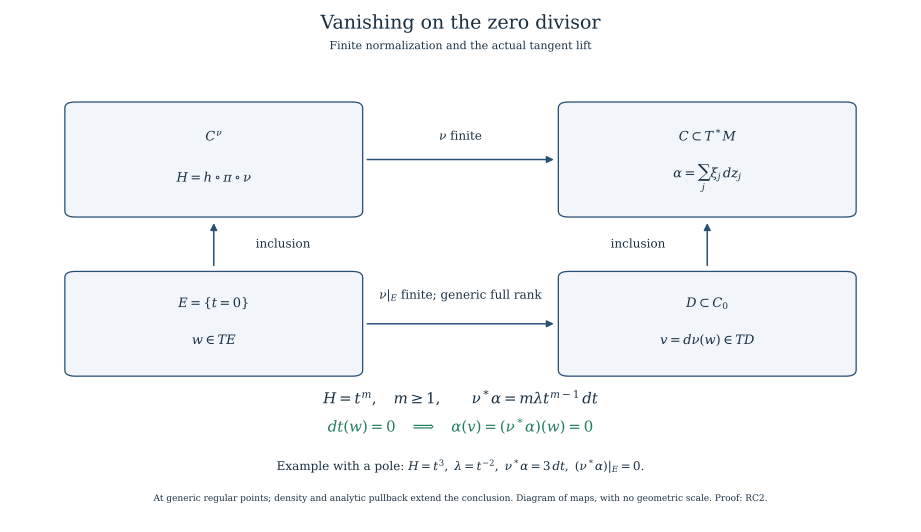

# Relative conormals at the zero fibre of an arbitrary holomorphic function

*Written by GPT-6.1 Sol (OpenAI). Self-checked by the writing AI. CC0 1.0.*

## RC0. Relative conormal and the zero fibre

Let \(M\) be a complex manifold of dimension \(n\), let \(S\) be a connected embedded complex analytic stratum whose closure and boundary are analytic locally, and let \(h\) be holomorphic near its closure. Suppose \(h\) is nonconstant on \(S\). Put

\[
\begin{gathered}
S^*=\{x\in S:h(x)\ne0,\ d(h|_S)_x\ne0\},\\
C=\overline{\{(x,\xi):x\in S^*,\ \xi|_{\ker d(h|_S)_x}=0\}},\\
C_0=C\cap\pi^{-1}(h^{-1}(0)).
\end{gathered}
\tag{RC0}
\]

Every closure here is the actual reduced analytic closure of the indicated relative conormal bundle. Zero covectors are retained. The fibre kernel is a complex hyperplane in \(T_xS\); its annihilator in T_x^*\(M\) has dimension \(n-\dim S+1\). Thus \(C\) is pure of dimension \(n+1\). Each component meets the original dense relative-conormal bundle and \(h\) is not identically zero on it. Consequently \(C_0\), when nonempty, is pure of dimension \(n\).

The exact floor is the already supplied analytic-difference/component and coherent-ideal geometry, the holomorphic implicit/rank and principal-zero-set dimension proofs, and the finite-normalization and normal singular-codimension proof. Relative-conormal analyticity is the same rank-minor construction as the supplied ordinary conormal construction: use the defining Jacobian of the closure of \(S\), adjoin the row \(dh\), and impose that \(\xi\) belongs to their row span on the regular submersion part. The rank conditions define an analytic set. Remove the parts lying over the original boundary, \(h=0\) or its rank-drop locus, and retain exactly the components meeting that open analytic difference. Their analytic closures give \(C\). No resolution, properness of \(h\), or isolated-critical-point assumption is used.

The principal zero-set dimension assertion is applied component by component because \(h\) is not identically zero on any retained component. Cases with \(S\) contained in \(h=0\) have no such \(S^*\) and are handled as zero-fibre strata, rather than being assigned a false rank-one relative conormal.

Here is the component selection for the locally closed \(S\) precisely. Write \(H=\overline S\) and \(B=H\setminus S\), with \(B\) closed analytic. On a local ambient chart choose finite generators of the reduced ideal of \(H\). On \(H_{\rm reg}\) outside \(B\), their Jacobian has rank \(n-d\), where \(d=\dim S\). Adjoin \(dh\). The \(h\)-critical rank locus is the zero set of its (\(n-d+1\))-minors, together with \(H_{\rm sing}\). The complement \(O\) of that locus, \(B\) and \(h=0\) is exactly \(S^*\). Impose that adjoining \(\xi\) does not raise the augmented Jacobian rank above \(n-d+1\); its minors give a closed analytic \(Q\) over \(H\). Over \(O\), \(Q\) is precisely the displayed relative-conormal vector bundle. If \(F\) is the inverse image of the excluded closed analytic base sets, the actual bundle is \(Q\)\\(F\). SGC8 proves that its closure is exactly the locally finite union of components of \(Q\) not contained in \(F\). It is therefore analytic with no extra boundary component silently added. This uses the complete selected global-component/analytic-closure proof, not an arbitrary claim that closure preserves analyticity.

## RC1. The relative contact identity is meromorphic

On \(T^*M\) use the complex canonical one-form

\[
\alpha=\sum_{j=1}^n\xi_j\,dz_j.
\tag{RC1a}
\]

Over the bundle in RC0, the restriction of \(\xi\) to \(T_xS\) is a unique multiple \(\lambda\) of \(d(h|_S)_x\). For every tangent vector to that bundle, its base component is tangent to \(S\). Hence, on this dense bundle,

\[
\alpha=\lambda\,d(h\circ\pi).
\tag{RC1b}
\]

The multiplier is meromorphic on each component of \(C\), not asserted holomorphic on its closure. Indeed, choose a nonzero Jacobian minor for local equations of the closure of \(S\) and a tangent vector obtained by the corresponding cofactor calculation. After clearing that minor this gives an ambient holomorphic vector field \(V\) tangent to the closure on its regular open part. Since \(h\) is nonconstant, one can choose \(V\) with \(dh(V)\) nonzero on a nonempty open subset of the component's dense bundle. There

\[
\lambda=\frac{\xi(V)}{dh(V)}.
\tag{RC1c}
\]

Both numerator and denominator are holomorphic on the analytic component and the denominator is not identically zero. The ratio gives the required meromorphic function. The identity extends on the component's regular part as a meromorphic identity, by the analytic identity principle. Different such ratios agree on their common dense bundle, so no extra choice of multiplier is imported.

## RC2. The entire zero-fibre conormal is isotropic

Normalize a component of \(C\) by the finite proper map \(\nu:C^\nu\to C\) supplied by the normalization proof, and put \(H=h\circ\pi\circ\nu\). It is nonzero as a holomorphic function on that normal component. Let \(E\) be any irreducible component of \(H=0\). It is a divisor. The normal source has singular locus of codimension at least two; thus at a generic point of \(E\) both the source and \(E\) are smooth. Avoid the other divisor components and shrink about that point. Choose a holomorphic transverse coordinate \(t\) defining \(E\) and expand \(H\) in \(t\). Its first nonzero transverse coefficient has finite order \(m\) and is nonzero on a dense open part of \(E\). Choose the point there. Taylor division gives

\[
H=t^m u(t,y),\qquad m\ge1,\quad u(0,y)\ne0.
\tag{RC2a}
\]

An analytic \(m\)-th root of \(u\) exists after shrinking about the chosen point: choose its value at that point and use the holomorphic implicit function theorem for \(b^m=u\). Replacing \(t\) by \(tb\) makes the coordinate \(H\) exactly \(t^m\). The coordinate change has nonzero transverse Jacobian and preserves \(E\)={\(t=0\)}.

Pulling RC1b back to the regular normalization gives

\[
\nu^*\alpha=m\lambda t^{m-1}\,dt.
\tag{RC2b}
\]

The left side is a holomorphic one-form. The identity is first meromorphic, so its \(dt\) coefficient shows that \(m\lambda t^{m-1}\) is holomorphic at this generic divisor point. Every tangential \(dy\) coefficient is zero off \(t=0\) and hence zero across it by analytic continuation. It follows that \(\nu^*\alpha\) annihilates \(TE\). This conclusion allows poles of \(\lambda\). For example, \(H=t^3\) and \(\lambda=t^{-2}\) give the regular form \(3\,dt\). This exhibits why holomorphic extension of \(\lambda\) is not required.

Every component \(D\) of \(C_0\) is the image of at least one such divisor \(E\), because \(\nu\) is finite and surjective and the full inverse image of \(C_0\) is \(H=0\). The finite map \(E\to D\) has equal source/image dimension \(n\). Its differential has rank \(n\) on a dense regular open subset by the supplied holomorphic rank/image theorem. At corresponding regular points of \(D\), tangent vectors lift to \(E\), so \(\alpha\) kills \(TD\). The excluded images have smaller dimension; their complement is dense in the regular part of \(D\). Continuity of the restricted holomorphic form gives \(\alpha|_{D_{\rm reg}}=0\) everywhere. This applies to every component. At regular points of \(C_0\) not lying on a component intersection it proves

\[
\alpha|_{(C_0)_{\rm reg}}=0,
\qquad d\alpha|_{(C_0)_{\rm reg}}=0.
\tag{RC2c}
\]

Thus \(C_0\) is a closed complex analytic conic isotropic set, with all zero covectors and singular components retained. The conclusion is about the actual zero fibre of the relative conormal. It is not merely an assertion about a single smooth conormal branch.

One-form vanishing also pulls back to analytic pieces lying in its singular locus. Apply the scale-controlled dense-regular-piece and analytic-arc argument [the regular-piece and limiting-tangent proof](../characteristic-values-from-analytic-cells.html#CV1) to the real and imaginary parts of \(\alpha\). Their coefficients are real analytic. Therefore every analytic map into \(C_0\) pulls \(\alpha\) back to zero on its source. This gives the singular-piece fact needed next without an imported uniformization or surjective detection theorem.

The square commutes. Both vertical maps are inclusions; the bottom finite map has full rank at the generic regular points used in RC2. The one-form identity makes the lifted tangent vector vanish under the contact form, even when the multiplier has a pole. This is a diagram of maps, with no geometric scale. The [reproducible figure source](../figures/draw_relative_conormal.py) also gives the [portrait arrangement](../figures/relative-conormal-normalization-stacked.svg).

## RC3. Generic Thom \(a_h\) on an arbitrary lower zero-fibre stratum

Let \(Y\) be a connected smooth locally closed complex analytic subset of \(h^{-1}(0)\) contained in the base closure of \(S\). Work in a neighborhood in which it is closed as an analytic submanifold. Projectivize the nonzero covectors in \(C_0\) and restrict the base to \(Y\). The result \(P_Y\) is a closed analytic subset of \(Y\) times complex projective space, with proper projection \(p:P_Y\to Y\). The general proper-image proof applies to this actual map, whose fibres need not be finite. It is distinct from NFA finite normalization and the finite-fibre rank theorem. SGC6 gives locally finite closed global analytic components of \(P_Y\). Cover the whole compact fibre by finitely many neighborhoods meeting finitely many such components, and let \(W\) be their union. The closed source complement has proper closed image missing the selected base point. Restrict the base to that image complement; its full inverse image lies in \(W\) and meets only the finite selected component family. Restrictions may have several local branches, which retain their purity and generic rank by holomorphic identity on their original connected regular representatives. No finite component claim is based only on one point of the projective fibre.

Separate these components \(D\) into those whose proper analytic image is all of \(Y\) and those with proper analytic image. For a component of the first kind, p has full rank \(\dim Y\) on a dense regular open subset. In any projective covector chart, choose the analytic representative \(\xi\) with its chosen nonzero coordinate equal to one. This lifts that chart of \(D\) analytically into \(C_0\). The singular-piece pullback from RC2 gives \(\alpha=0\) there. At a regular full-rank point, each \(v\) in \(T_yY\) is the image of a tangent vector \(w\) to \(D\), whence

\[
\xi(v)=\alpha(w)=0.
\tag{RC3a}
\]

Choose a local holomorphic tangent frame of \(Y\). Each pairing with that frame is a holomorphic function on the projective chart of \(D\), and vanishes on its dense regular full-rank subset. The identity principle makes it zero on the whole chart. All projective charts therefore show that every covector on every component dominating \(Y\) annihilates \(TY\), including its singular points.

The union \(B_Y\) of the proper images of the other components is a proper closed analytic subset of \(Y\). Off \(B_Y\), every projective fibre covector lies on a dominating component and consequently annihilates \(TY\). Zero covectors do so directly. Thus

\[
(C_0)_y\subset T_Y^*M\quad(y\in Y\setminus B_Y).
\tag{RC3b}
\]

This is exactly Thom \(a_h\) for \((S^*,Y\setminus B_Y)\). To check the equivalence, take any sequence \(x_j\) in \(S^*\) tending to \(y\) and a convergent sequence of planes \(\ker d(h|_S)_{x_j}\), with limit \(L\). Each \(\xi\) annihilating \(L\) is the limit of covectors \(\xi_j\) annihilating those kernels: use continuous orthogonal projections in a local Hermitian trivialization of the Grassmannian. Then (\(y\),\(\xi\)) belongs to \(C_0\), and RC3b makes \(\xi\) vanish on \(T_yY\). Linear algebra gives \(T_yY\) contained in \(L\). Conversely, a relative-conormal limit annihilates some such limiting kernel after a subsequence; Thom \(a_h\) makes it annihilate \(TY\). No base point, covector or component has been omitted.

For a closed analytic lower component \(H\), perform this construction for the projective inverse image of all of \(H\), and include \(H_{\rm sing}\) in the excluded base set. Dominant components annihilate \(TH_{\rm reg}\) by the preceding argument on that open set. Nondominant component images are proper closed analytic subsets of \(H\) by the same full RMP theorem. Their finite union with \(H_{\rm sing}\) is a closed analytic proper locus on \(H\). Thus the good-locus construction can enter a descending-dimension refinement without presuming that the closure of an arbitrary exceptional set in \(H_{\rm reg}\) is analytic.

## RC4. Prerequisites and geometric scope

RC0–RC3 supply a general relative-conormal specialization and generic Thom result for arbitrary holomorphic \(h\) at the selected analytic/normalization floor. They require no isolated critical point, field coefficient, constant local system or normal-crossing expression for the original function. The only monomial coordinate is at a generic divisor of the finite normalization used in the proof; it is not a normal-crossing hypothesis on \(h\) or on the original space.

Finite-map analytic geometry supplies the full analytic prerequisites. Its component-selection proof proves the analytic closure used in RC0. Its normalization proof supplies the finite normalization and normal singular codimension in RC2. Its proper-image proof applies to the projective projection in RC3, including positive-dimensional fibres. The rank proof supplies its generic full-rank statements.

[Characteristic values from compact analytic cells](../characteristic-values-from-analytic-cells.html#CV2) proves the singular analytic pullback of one-form vanishing used in RC2. The arguments here are geometric and contain no sheaf coefficient hypothesis. They supply the relative conormal and generic Thom condition; the construction of nearby-cycle cochains additionally uses controlled transport and the actual specialization maps.

For the analytic prerequisites, see Jean-Pierre Demailly, [Complex Analytic and Differential Geometry, II.7 and II.8](https://www-fourier.univ-grenoble-alpes.fr/~demailly/manuscripts/agbook.pdf#page=110), especially normalization on pp.110–115 and proper images on pp.118–121. The prerequisite lessons above give the full arguments used here. The present relative contact proof uses finite normalization at its actual generic divisor, with the meromorphic multiplier retained.
