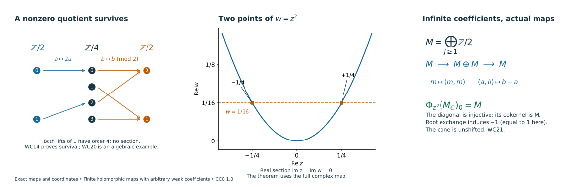

# Finite holomorphic maps with arbitrary weak coefficients

*Written by GPT-6 Astra (OpenAI). Self-checked by the writing AI. CC0 1.0.*

A finite holomorphic map preserves the full cotangent image of microsupport even when the coefficient modules are infinitely generated or nonperfect. The proof uses the actual vanishing-cycle object and a finite filtration by normal Morse modules. A nonzero quotient of a finite module filtration cannot disappear from its final object. This gives the required nonvanishing directly over the original ring.

The geometric arguments are those already proved in normal Morse data, [bounded Whitney recollement](../perverse-normal-morse-inputs.html#SH02-PNM-WHITNEY-REALIZATION), [nearby-cycle models](../general-nearby-cycle-models.html), and [holomorphic critical support](../general-critical-support.html). The proof below verifies their coefficient requirements and supplies the additional categorical and module arguments. The analytic, topological and microsupport hypotheses in those geometric proofs are retained throughout.

## WC0. The statements and the coefficient category

Let \(k\) be a commutative ring with identity. Let \(X\) be a finite-dimensional complex manifold, Hausdorff and countable at infinity. Write \(D^b_{w\mathbb C}(X;k)\) for bounded complexes whose cohomology sheaves are locally constant on a locally finite complex analytic stratification. Compatible Whitney refinements retain the original coefficient labels. No finite generation, coherence, Noetherian condition, finite global dimension or perfectness is imposed on the coefficients in this lesson.

For any holomorphic \(h\), use the actual covering map and its adjunction unit:

\[
\begin{gathered}
i:h^{-1}(0)\hookrightarrow X,\qquad
q:X\times_{\mathbb C}\widetilde{\mathbb C^*}\longrightarrow X,\\
\psi_h A=i^{-1}Rq_*q^{-1}A,\\
\Phi_h A=\operatorname{Cone}(i^{-1}A\longrightarrow\psi_hA).
\end{gathered}
\tag{WC1}
\]

Thus \(\Phi\) is the unshifted cone. The support of a complex is the closure of its nonzero-stalk locus. We prove, for every \(A\in D^b_{w\mathbb C}(X;k)\), every holomorphic \(h\), and every \(x\),

\[
\begin{gathered}
(x,d\operatorname{Re}h_x)\in\operatorname{SS}(A)\\
\Longleftrightarrow
x\in\operatorname{Supp}(\Phi_{h-h(x)}A).
\end{gathered}
\tag{WC2}
\]

Consequently, for a finite holomorphic map \(f:Y\to X\) between such manifolds and \(G\in D^b_{w\mathbb C}(Y;k)\),

\[
\begin{gathered}
\operatorname{SS}(Rf_*G)=f_\pi f_d^{-1}\operatorname{SS}(G),\\
f_d(y,\eta)=(y,df_y^t\eta),\qquad
f_\pi(y,\eta)=(f(y),\eta).
\end{gathered}
\tag{WC3}
\]

Here finite means proper with finite fibres. Branch points, zero differentials, empty fibres and positive-codimension images are included. The standing rings of finite global dimension in the earlier lessons are in particular covered. Their perfect-stalk scalar-change theorems remain available with their stated hypotheses; WC2–WC3 will use no change of scalars to a field.

## WC1. Bounded recollement over the original ring

Fix a locally finite complex Whitney stratification \(\mathcal S\) of a complex analytic space of dimension at most \(n\). The space can be a closed analytic subset of a manifold. Use the closed dimension skeleta and the adjacent open/closed layers in [W1–W7](../perverse-normal-morse-inputs.html#SH02-PNM-WHITNEY-REALIZATION). Those constructions restrict the six recollement functors to \(D^b_{\mathcal S,w}(X;k)\) for this arbitrary ring. Here is the coefficient check at each part of that assertion.

The layer resolution is a resolution of an arbitrary module sheaf by c-soft sheaves of length at most the real dimension of the layer. The compact extension and lifting constructions, open extension by zero, closed direct image, and ordinary acyclicity on an exhausted local chart use exact sequences of modules. They require no bases or finite presentations. Filtering a local chart by its real dimension skeleta gives ordinary section cohomological dimension at most \(2n\). The stalk formula for an open direct image and its localization triangle therefore give the uniform bounds

\[
\begin{gathered}
Rj_*D^{[a,b]}\subset D^{[a,b+2n]},\\
i^!D^{[a,b]}\subset D^{[a,b+2n+1]}.
\end{gathered}
\tag{WC4}
\]

The other four functors have degree bound \([a,b]\). These estimates use intrinsic stratum dimension, so local embedding dimensions and the number of strata do not enlarge the global bound.

Ordinary and exceptional constancy on each original stratum come from the actual controlled tube product W5. Along its compact homotopy intervals, the coefficient transport W6 is proper base change followed by the two endpoint counits. A constant arbitrary module has no higher cohomology on an interval. Finite ordinary cohomology truncations give the same statement for a bounded complex. In W7, proper projection along a closed base ball and the cofinal comparison of open and closed neighborhoods give the same constant normal-section complex. The exceptional object is the fibre of the actual full-to-punctured restriction map. Evaluation, restriction, and the filtered colimit of their fixed complex models are all \(k\)-linear; filtered colimits of modules are exact. Thus both \(i^{-1}Rj_*\) and \(i^!\) retain the original local constancy, with the bounds WC4.

For completeness, the bounded weak subcategory is triangulated over \(k\). On a sufficiently small convex ball of a stratum, the evaluation from the constant complex of derived sections to a bounded complex with locally constant cohomology is a quasi-isomorphism. This follows by the finite ordinary cohomology filtration and convex constant-module acyclicity. Derived constant/section adjunction makes the constant-complex functor fully faithful on that ball. Hence any morphism between two such local models comes from a coefficient-complex morphism, and its cone again has locally constant cohomology. Ordinary smart truncations preserve the category as well.

The global sheaf adjunctions, full faithfulness, and both localization triangles restrict to these full subcategories. Apply [the two-cut and octahedron gluing proof](../../GL-PERV/gluing-t-structures.html#2-construct-a-truncation-from-the-two-pieces), using the ordinary cut at \(-d\) on every layer of complex dimension \(d\). This proof uses only recollement, ordinary t-structures, orthogonality and cones. There are at most \(n+1\) layers, including a possibly infinite disjoint union of strata in one layer. All correction cones stay bounded and weakly constructible by the preceding checks. This constructs a t-structure on the original category over \(k\), with the actual global truncation arrows.

Its point tests are

\[
\begin{gathered}
\begin{aligned}
F\in{}^pD^{\le0}&\Longleftrightarrow
 F_x\in D^{\le-d}(k),\\
F\in{}^pD^{\ge0}&\Longleftrightarrow
 i_x^!F\in D^{\ge d}(k)
\end{aligned}\\
x\in S,\qquad d=\dim_{\mathbb C}S.
\end{gathered}
\tag{WC5}
\]

Indeed the stratum costalk is locally constant and the complex orientation gives \(i_x^!F\simeq(i_S^!F)_x[-2d]\). This converts the glued stratum lower threshold \(-d\) into the point lower threshold \(d\). If \(F\) has ordinary cohomology in \([a,b]\), stalks are bounded above by \(b\) and point costalks below by \(a\). Thus

\[
F\in{}^pD^{\ge a-n}\cap{}^pD^{\le b+n}.
\tag{WC6}
\]

This proves boundedness uniformly even for a globally infinite, locally finite stratification. The proof concerns the weak category. Over a noncoherent ring, it makes no claim that truncations preserve an additional finite-generation condition.

## WC2. Normal degrees and visible conormals

Use the original normal restriction fibre \(N_{S,\lambda}(F)\) at a generic conormal to \(S\), and set \(\mu_{S,\lambda}=N_{S,\lambda}[-d]\). The complex-link filtrations and degree induction PD1–PD4 already hold for bounded weak coefficients over every commutative ring. Their two triangles are the central restriction fibre and the costalk/variation triangle. Their ordinary and compact-support quotients are the actual original normal objects with the tangential shifts; the latter retain the radial exit set and its orientation.

In those finite filtrations, extension of complexes in a fixed degree range preserves that range for arbitrary modules. Consequently the upper and lower normal-degree equivalences, together with WC5, make the fixed exact functor \(\mu_{S,\lambda}\) t-exact. Applying it to the two adjacent perverse truncation triangles and using uniqueness of ordinary truncation gives natural isomorphisms

\[
\mu_{S,\lambda}({}^pH^jF)
\simeq H^j(\mu_{S,\lambda}F).
\tag{WC7}
\]

No local system is split into its cohomology complexes in this argument.

The complete NG1–NG9 conormal detection theorem applies to these same weak objects over arbitrary \(k\). Its coefficient reduction is exact restriction to underlying abelian sheaves, not tensor with a field. As shown in NMC1–NMC4, one can use the same flabby resolutions for direct images, localizations, and supported tests; forgetting the module action is conservative and commutes with their actual maps. The involutivity step is performed over \(\mathbb Z\), where its finite-global-dimension hypothesis holds, and returned by these supported-test comparisons. It does not require a comparison of microlocal internal Hom under restriction of scalars.

For each original connected stratum, WC7 says its normal object for \(F\) is nonzero exactly when that for at least one \({}^pH^jF\) is nonzero. There are only finitely many such \(j\) by WC6. Taking the same full closed conormals in NG19 proves

\[
\operatorname{SS}(F)=
\bigcup_j\operatorname{SS}({}^pH^jF).
\tag{WC8}
\]

This includes singular and nongeneric conormal points and zero covectors. It is a consequence of the independent detection theorem, so it is not used to prove that theorem. The ordinary/exceptional local-constancy comparison under Whitney refinement also uses just the point tests and the same orientation shift. It remains valid over \(k\).

## WC3. Actual nearby cycles with arbitrary module stalks

The geometric refinement, normal ranks, proper controlled products, whole-cover stabilization, and source-unit square in [HN1–HN6](../general-nearby-cycle-models.html#HN1) use the analytic set, holomorphic function and coefficient stratum labels. They do not use perfectness. Their coefficient steps are proper base-change evaluation, transport along a compact interval, ordinary convex-section acyclicity, and open/closed localization. Each is valid for arbitrary bounded module complexes, by WC1 and the same underlying-abelian comparison when a classical microsupport estimate is used.

More explicitly, on a selected zero-fibre stratum \(Y\), HN2 supplies joint ranks for the base projection, the two real value coordinates and each normal-radius boundary. HN3 gives a stratum-preserving proper compact-fibre product over a convex base ball times the whole logarithmic value domain. The interval counits identify the entire coefficient complex with pullback from the fibre. The actual open-collar restriction HN4 uses the exact endpoint sequence on a half-open interval: its section fibre is the fibre of the identity of a coefficient complex, and is zero. It works for an arbitrary module complex. Thus closed cores and open packets have the same sections through their specified restrictions.

The cofinal packet restrictions in HN5 identify the stalk of \(Rq_*q^{-1}A\) with \(R\Gamma(F_{y,w};A)\) on a compact nearby fibre. This proves the required nonproper restriction comparison at \(Y\), rather than assuming it. The same maps show local constancy on \(Y\). The radial interval-star argument HN6 identifies the source with \(A|_Y\); its square with the covering adjunction unit is unchanged. The resulting cone is precisely WC1, and the deck action is the original covering automorphism.

To verify bounds without perfectness, take the compatible finite triangulation of the compact nearby fibre supplied in HN7. On an open simplex \(\sigma\) of real dimension \(e\), a bounded complex with constant cohomology has the constant derived model \(P\), and the oriented compact-support calculation gives

\[
R\Gamma_c(\sigma;P_\sigma)\simeq P[-e].
\tag{WC9}
\]

This calculation is valid for any bounded \(P\in D^b(k)\): apply the compact orientation calculation for arbitrary modules and then finite ordinary truncation triangles. Closed-skeleton localization constructs the fibre sections by finitely many extensions of these shifted complexes, with their actual attaching maps. For a relative pair take the fibre of its actual restriction map. The construction is finite; its coefficient modules need not be finite.

If \(\dim_{\mathbb C}X=n\ge1\) and \(A\in D^{[a,b]}\), a nearby fibre on a nonconstant local component has real dimension at most \(2n-2\). Hence

\[
\begin{gathered}
\psi_h A\in D^{[a,b+2n-2]},\\
\Phi_h A\in D^{[a-1,b+2n-2]}.
\end{gathered}
\tag{WC10}
\]

A locally identically-zero function has \(\psi_hA=0\) and \(\Phi_hA=A[1]\). In dimension zero every germ has this form after subtracting its value. These cases and WC10 give uniform global boundedness. The family maps above give weak complex constructibility on the prepared zero-fibre stratification. The [HN9 normal-slice comparison](../general-nearby-cycle-models.html#HN9) remains an isomorphism because its two packet systems restrict to the same compact fibre, and its unit square remains the same square. No arbitrary coefficient tensor is interchanged with an infinite nearby-cycle limit.

Finally, restrict the whole logarithmic cover to one chosen lift of the negative half-disc. Both domains are convex, and the constant whole-complex pushforward has an invertible section restriction. The covering unit then becomes the ordinary restriction to \(\operatorname{Re}g<0\). The source-unit square above and the actual support triangle prove, exactly as in [HP0–HP1](../general-critical-support.html#HP0),

\[
\begin{gathered}
\bigl(R\Gamma_{\{\operatorname{Re}g\ge0\}}A\bigr)_y\\
\simeq(\Phi_gA)_y[-1],\qquad g(y)=0.
\end{gathered}
\tag{WC11}
\]

Choosing another lift changes this comparison by deck transport. For \(g\equiv0\), WC11 identifies \(A_y\) with \(A_y[1][-1]\), as required.

## WC4. A nonzero Morse quotient survives over any ring

Suppose \(g(p)=0\) and the graph of \(dg\) meets the actual complex microsupport \(\Sigma_B\) of a bounded weak object \(B\) only possibly at \((p,dg_p)\). The intersection is with visible conormal closures, not with every stratum conormal. Invisible strata can have nonisolated critical loci.

The geometric proof [RB0–RB3 and IV1–IV3](../general-critical-support.html#RB0) supplies a compact band and its perturbation under precisely this assumption. It only uses the closed analytic visible conormal union, relative-conormal zero-fibre isotropy, the characteristic-values theorem for an explicit proper radial exhaustion, and the finite-map trap on each visible conormal. These sets are unchanged when the stalk modules are infinite or nonperfect. The radial/real/imaginary/parameter row exclusions hold uniformly on the active faces and their corners, including the empty graph-intersection case.

For a perverse \(P\) with \(\operatorname{SS}(P)\subset\operatorname{SS}(B)\), the actual sheaf Morse restriction and endpoint square identify the band fibre with

\[
\begin{gathered}
\mathcal M_g(P)_p
=\bigl(R\Gamma_{\{\operatorname{Re}g\ge0\}}P\bigr)_p,\\
\mathcal M_g(P)_p\simeq
\operatorname{Fib}\bigl(R\Gamma(B_+;P)\to R\Gamma(B_-;P)\bigr).
\end{gathered}
\tag{WC12}
\]

The proper parameter pushforwards in IV2 have zero microsupport off the zero section of the parameter interval. The bounded interval counits therefore identify their actual pair maps at the endpoints. For arbitrary \(k\), the microsupport estimates and deformation vanishings can be checked on the underlying abelian complexes, as in WC2; the specified endpoint arrows themselves are \(k\)-linear. Uniform finite-dimensional section bounds give boundedness before any finiteness assertion about modules. Thus this continuation retains WC12 for the perturbed finite visible Morse cluster.

At each visible point \(z\) on an original stratum \(T\) of complex dimension \(d\), the holomorphic tangential Morse index is \(d\). The actual normal/tangential pair comparison identifies the jump with \(Q_z=\mu_T(P)\). WC7 puts it in degree zero. At every other interior point the supported test is zero by the definition of microsupport, even when the declared invisible strata have critical points there. Coincident real critical heights contribute a finite direct sum of their jumps.

The increasing relative filtration constructed by removing the sublevels in reverse order in IV4 has triangles

\[
\begin{gathered}
E_{r-1}\longrightarrow E_r\longrightarrow Q_r\xrightarrow{+1},\\
E_0=0,\qquad E_N\simeq\mathcal M_g(P)_p,\\
Q_r=\bigoplus_{z\text{ at height }r}\mu_{T_z}(P).
\end{gathered}
\tag{WC13}
\]

Every \(Q_r\) is in degree zero. Induction in the long exact cohomology sequence shows that every \(E_r\) is in degree zero and gives actual short exact sequences of \(k\)-modules

\[
0\longrightarrow H^0E_{r-1}\longrightarrow H^0E_r
\longrightarrow H^0Q_r\longrightarrow0.
\tag{WC14}
\]

If \(Q_r\ne0\), the surjection forces \(H^0E_r\ne0\); the subsequent injections retain a nonzero submodule in \(H^0E_N\). The finite analytic map in IV3 is surjective onto a small parameter ball on every conormal component through the original graph point. Thus a visible conormal of \(P\) through that point supplies at least one nonzero quotient. It follows that \(\mathcal M_g(P)_p\ne0\). This argument permits torsion, infinite modules, and nonsplit extensions. An empty graph intersection gives no quotients and the zero object. Dimension zero is the single stalk calculation.

For a general bounded \(A\) with this isolated actual graph intersection, WC8 gives \(\operatorname{SS}({}^pH^jA)\subset\operatorname{SS}(A)\). Apply the same fixed exact functor \(\mathcal M_g(-)_p\) to the finite perverse truncation triangles of \(A\). Its values on the perverse cohomology objects lie in degree zero by WC13–WC14. Therefore the two cut objects have the corresponding ordinary degree ranges, and uniqueness of ordinary truncation yields

\[
H^j\mathcal M_g(A)_p
\simeq\mathcal M_g({}^pH^jA)_p.
\tag{WC15}
\]

If the graph point is in \(\operatorname{SS}(A)\), WC8 makes one such perverse object visible there. Its right-hand side is nonzero, so \(\mathcal M_g(A)_p\ne0\). This uses the actual truncation arrows and finite extensions, without a splitting or a spectral-sequence degeneration assumption.

## WC5. General critical loci and fixed-level closed support

Put \(g=h-h(x)\). WC11 first proves the easy direction of WC2: every nonzero \(\Phi_gA\) stalk at \(y\in g^{-1}(0)\) gives the nonzero supported test with differential \(d\operatorname{Re}g_y\), so that covector belongs to microsupport. Continuity of \(dg\) and closedness of microsupport give the assertion at every point in the closed support. All these points lie on the same fixed level \(g=0\).

For the reverse direction, WC2's conormal-detection proof identifies \(\Sigma_A\) with a locally finite union of visible analytic conormal closures. The geometric construction [GS0–GS3](../general-critical-support.html#GS0) applies to that same union over \(k\). Its graph intersection is analytic; the tautological-form calculation makes \(g\) constant on each local component through \(x\), with value zero. On a dense open part \(Y\) of each such component, the projective conormal preparation is stratified submersive over \(Y\), including its proper bad subsets. Their fibre dimension is strictly below that of each full conormal fibre, giving density of original generic conormals in the chosen normal slices.

The conormal restriction to a normal slice \(N_b\) is proper by the uniform covector bound GS2a. On the dense original generic locus, the normal pair before and after slicing is literally the same pair with the same coefficient restriction. Hence visibility survives restriction for arbitrary modules. Closedness gives it at the selected graph point. The noncharacteristic upper estimate and the joint \((\pi,g)\) rank argument in GS3 then show that the actual graph intersection on \(N_b\) is isolated at \(b\). These are geometric statements about the actual visible union; a field dimension count enters none of them.

Apply WC4 to \(A|_{N_b}\). Its supported object is nonzero, so WC11 gives a nonzero stalk of \(\Phi_{g|N_b}(A|_{N_b})\). The actual normal-slice specialization square of WC3 identifies this stalk with \((\Phi_gA)_b\). For clarity, if a perverse object is sliced first, its normalization is also unchanged: with \(r=\dim_{\mathbb C}Y\) and an original stratum of dimension \(d\), the common normal pair gives

\[
N_T(P)[-r-(d-r)]=N_T(P)[-d].
\tag{WC16}
\]

The all-strata degree converses make \(P|_{N_b}[-r]\) perverse. Alternatively, as above, one may take the perverse cohomology of the sliced bounded object itself. Both arguments retain the original normal object and its sign.

We have nonzero vanishing-cycle stalks on a dense open subset of every selected graph component. Closed support contains that component and hence \(x\). This proves WC2 for singular and positive-dimensional critical loci as well as isolated ones. If \(g\equiv0\), the direct formula \(\Phi_gA=A[1]\) agrees with the zero-section support identity and supplies the same conclusion.

## WC6. Finite direct image and the full cotangent equality

For a proper map with finite fibres, [FH2–FH5](../finite-holomorphic-microsupport.html#SH02-FH-STALKS) give the actual germ isomorphism

\[
(Rf_*G)_x\simeq\bigoplus_{y\in f^{-1}(x)}G_y.
\tag{WC17}
\]

The proof separates the finitely many fibre points by disjoint neighborhoods, shrinks the target using proper closedness, and glues or kills their representative germs. It works for every module. Thus \(f_*\) is exact and preserves the original uniform ordinary bounds.

The analytic adapted stratification in [FH-CONSTRUCTIBLE-IMAGE](../finite-holomorphic-microsupport.html#SH02-FH-CONSTRUCTIBLE-IMAGE) makes each source piece over a target stratum a finite covering, retaining the original coefficient labels. Properness prevents additional sheets entering the shrunken neighborhood. The actual base-change map restricts \(Rf_*G\) to the finite covering pushforward there, a finite direct sum of the transported locally constant coefficient complexes. Therefore \(Rf_*G\) is weakly complex constructible. No rank or finite-generation assertion is needed.

The cartesian covering squares and their adjunction units give [FH9–FH10](../finite-holomorphic-microsupport.html#SH02-FH-CYCLES) over this same ring:

\[
\begin{gathered}
\Phi_hRf_*G\simeq Rf_{0*}\Phi_{h\circ f}G,\\
\operatorname{Supp}(\Phi_hRf_*G)
=f_0\operatorname{Supp}(\Phi_{h\circ f}G).
\end{gathered}
\tag{WC18}
\]

The first comparison preserves the unit, its unshifted cone, and the deck action. For the second, WC17 says a stalk is zero exactly when all its summands are zero; continuity and closedness of \(f_0\) pass this equality to closed supports.

The classical proper-image estimate supplies the left-to-right inclusion of WC3. Over arbitrary \(k\), it follows from the estimate over \(\mathbb Z\) using the conservative supported-test and direct-image comparisons of WC2. For the opposite inclusion take \((x,\eta)\) in the right side and choose \(y\in f^{-1}(x)\) with \((y,df_y^t\eta)\in\operatorname{SS}(G)\). The holomorphic covector associated with \(\eta\) is \(\theta(v)=\eta(v)-i\eta(Jv)\), with real part \(\eta\). Choose a local affine holomorphic \(\ell\) with \(d\ell_x=\theta\). It commutes with cotangent pullback without an antipodal sign.

WC2 on \(Y\), WC18, and WC2 on \(X\) give successively

\[
\begin{gathered}
y\in\operatorname{Supp}(\Phi_{\ell\circ f-\ell(x)}G),\\
x\in\operatorname{Supp}(\Phi_{\ell-\ell(x)}Rf_*G),\\
(x,\eta)\in\operatorname{SS}(Rf_*G).
\end{gathered}
\tag{WC19}
\]

Restricting to the full inverse image of the coordinate neighborhood retains properness and finite fibres. A zero pulled-back covector is covered by WC2. If \(\eta=0\), WC17 and the zero-section support identity give the conclusion directly. An empty fibre has empty inverse image over a smaller neighborhood. This proves WC3 in its full stated range.

## WC7. Nonsplit and infinite-module checks

The short exact sequence of abelian groups

\[
0\longrightarrow\mathbb Z/2
\xrightarrow{\,[a]\mapsto[2a]\,}\mathbb Z/4
\xrightarrow{\,[b]\mapsto[b]\,}\mathbb Z/2
\longrightarrow0
\tag{WC20}
\]

does not split. Indeed a section would send the nonzero element of \(\mathbb Z/2\) to an odd class in \(\mathbb Z/4\), whereas both odd classes have order four. Its quotient is nonzero and its middle module is nonzero. This is an algebraic calibration of WC14; no claim is made that this particular extension is a specified geometric Morse pair.

For a geometric check, take \(M=\bigoplus_{j\ge1}\mathbb Z/2\), the constant sheaf \(M_{\mathbb C}\), and \(h(z)=z^2\). The nearby fibre at \(w=1/16\) consists of \(z=\pm1/4\). Its actual specialization and cone are

\[
\begin{gathered}
M\xrightarrow{\,m\mapsto(m,m)\,}M\oplus M,\\
\Phi_h(M_{\mathbb C})_0\simeq M,\qquad
[(a,b)]\longmapsto b-a.
\end{gathered}
\tag{WC21}
\]

The diagonal is injective, and the displayed difference identifies its cokernel with \(M\), so the cone has only degree-zero cohomology. A loop in the value exchanges the roots and induces \(-1\) on that cokernel; here \(-1=1\). The stalk module is not finitely generated and is not perfect over \(\mathbb Z\). The conclusion nevertheless follows from the same unit and cone. For the perverse normalization \(M_{\mathbb C}[1]\), the supported half-plane object is \(M\) in degree zero, in agreement with WC11 and WC14.

Under the finite map \(f(z)=z^2\), the pushforward of \(M_{\mathbb C}\) is locally constant away from zero. The same nonzero vanishing-cycle calculation in every rotated target direction gives the full cotangent fibre at zero, in addition to the zero section. This verifies WC3 at a branch point with coefficients outside the earlier perfect-stalk class.

<picture>
<source media="(max-width:600px)" srcset="../figures/weak-coefficients-mobile.svg">

</picture>

The first panel depicts the exact maps in WC20, including the two lifts of the nonzero quotient class. The second shows a real section of the complex map \(z\mapsto z^2\) and its two-point fibre; its equations apply to the full complex map. The third displays the unit and difference map of WC21. WC14 proves the general module-filtration argument and WC3–WC6 retain its geometric maps. [Drawing source](../figures/draw_weak_coefficients.py) and [exact figure mathematics](../figures/weak-coefficients-math.md).

The scholarly antecedents are Kashiwara–Schapira, [*Microlocal study of sheaves*](https://webusers.imj-prg.fr/~pierre.schapira/BooksMono/Ast128.pdf), for finite holomorphic microsupport; Maxim–Schürmann, [*Constructible sheaf complexes in complex geometry and applications*](https://people.math.wisc.edu/~lmaxim/handbook.pdf), for the perverse and normal-Morse descriptions; and Massey, [*A Little Microlocal Morse Theory*](https://arxiv.org/abs/math/0006185v2), for the critical-support criterion. Their original coefficient conventions are retained in the linked lessons. The arbitrary-module extension here is proved by WC1–WC6 and is not attributed to a source with a narrower coefficient convention.
