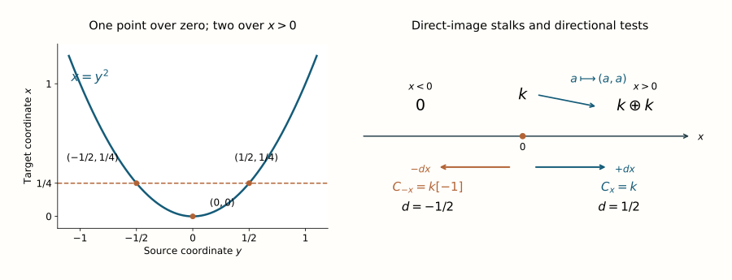

# Direct and inverse images of a sheaf type

For a smooth map of manifolds, a selected covector has two associated cotangent points. The direction on the source controls a microlocal direct image; the direction on the target controls an inverse image. When the relevant cotangent map is transverse to the input Lagrangian, the output is a bounded germ with a smooth Lagrangian microsupport bound. Its coefficient type can then be calculated by the graph kernel.

Use [the ordered transverse-composition formula](the-type-and-shift-of-a-transverse-kernel-composition.md#the-ordered-middle-index) for the graph-kernel degree calculation. The [conormal coefficient normalization](../../microlocal-composition-and-pure-sheaves/src/pure-and-simple-sheaves-from-directional-tests.md#type-purity-and-simplicity) gives the graph kernel its half-codimension shift. The formal operations, their representation and their relative dualizing comparison use the exact programme proofs linked below. Those arguments retain their stated geometric and sheaf-operation prerequisites. Coefficients are arbitrary bounded complexes over a commutative finite-global-dimension ring \(k\). Manifolds are smooth, finite dimensional, real, Hausdorff and second countable.

*Original lesson text and solutions: CC0 1.0 Universal. Human mathematical sources are credited below.*

## Two cotangent maps with different fibres

Let \(f:Y\to X\) be a smooth map, and write

\[
P=Y\times_X T^*X,\qquad
f_\pi(y;\xi)=(f(y);\xi),\qquad
f_d(y;\xi)=(y;d f_y^t\xi).
\qquad\text{(1)}
\]

Fix \(p\in P\), with \(p_X=f_\pi(p)\) and \(p_Y=f_d(p)\). No nonzero-covector assumption is added. The differentials of these maps are understood at \(p\) whenever tangent Lagrangian planes are propagated below.

A graph calculation will keep both the cotangent point and the second derivative visible. Write \(p=(y_0;\xi_0)\) and \(x_0=f(y_0)\). Choose coordinates near these bases, set \(J=df_{y_0}\), and let \(H:T_{y_0}Y\to T_{y_0}^*Y\) be the symmetric form

\[
H(u,v)=\langle\xi_0,d^2f_{y_0}(u,v)\rangle.
\]

For a tangent vector \((u,\beta)\in T_pP\), the derivatives are

\[
d f_\pi(u,\beta)=(Ju,\beta),\qquad
d f_d(u,\beta)=(u,J^t\beta+Hu).
\]

Here the second cotangent coordinates use the coordinate splittings of the tangent bundles. Symmetry of \(H\) gives

\[
\omega_Y\bigl(d f_d(u,\beta),d f_d(v,\gamma)\bigr)
=\langle\beta,Jv\rangle-\langle\gamma,Ju\rangle
=\omega_X\bigl(d f_\pi(u,\beta),d f_\pi(v,\gamma)\bigr).
\]

This is the tangent graph's symplectic identity in the convention \(\omega=d\theta\). The formulas require no constant-rank assumption on \(f\); when \(\xi_0=0\), their Hessian term is simply zero.

For direct image assume \(\operatorname{SS}(G)\subset\Lambda_Y\) near \(p_Y\), where \(\Lambda_Y\) is a smooth conic Lagrangian germ through \(p_Y\), and require \(f_d\) transverse to \(\Lambda_Y\). The incidence

\[
I_Y=f_d^{-1}\Lambda_Y
\qquad\text{(2)}
\]

is then smooth of dimension \(\dim X\). After shrinking near \(p\), its image under \(f_\pi\) is a locally embedded Lagrangian \(\Lambda_X\).

For inverse image instead assume \(\operatorname{SS}(F)\subset\Lambda_X\) near \(p_X\), where \(\Lambda_X\) is a smooth conic Lagrangian germ through \(p_X\), and require \(f_\pi\) transverse to \(\Lambda_X\). The incidence

\[
I_X=f_\pi^{-1}\Lambda_X
\qquad\text{(3)}
\]

has dimension \(\dim Y\), and \(f_d\) identifies a small neighborhood in it with a locally embedded Lagrangian \(\Lambda_Y\).

The following tangent check proves the stated local injectivity without assuming that \(f\) has constant rank. Put \(m=\dim Y\), \(n=\dim X\). The derivative formulas imply

\[
(\operatorname{im}d f_d)^{\omega_Y}
 =d f_d(\ker d f_\pi),\qquad
(\operatorname{im}d f_\pi)^{\omega_X}
 =d f_\pi(\ker d f_d).
\]

For example the first orthogonal consists of \((u,Hu)\) with \(Ju=0\), and the second consists of \((0,\beta)\) with \(J^t\beta=0\). Also \(d f_d\) is injective on \(\ker d f_\pi\), and \(d f_\pi\) is injective on \(\ker d f_d\), by those same formulas.

In the direct case, transversality says \(\operatorname{im}d f_d+T\Lambda_Y=E_Y\). Taking symplectic orthogonals, and using that \(T\Lambda_Y\) is Lagrangian, gives \(T\Lambda_Y\cap d f_d(\ker d f_\pi)=0\). Thus a vector in \(T I_Y=(d f_d)^{-1}T\Lambda_Y\) killed by \(d f_\pi\) must vanish. The transverse preimage has dimension \(m+n-m=n\). Its image is isotropic by the preceding symplectic identity, hence is Lagrangian of dimension \(n\). The inverse case interchanges the two cotangent maps: transversality to \(\Lambda_X\) gives dimension \(m\) and zero kernel for \(d f_d|_{T I_X}\), and its image is Lagrangian in \(E_Y\).

The immersion theorem now identifies a sufficiently small neighborhood in either incidence with an embedded Lagrangian image. In particular its fibre over the selected output covector is just the chosen lift after shrinking. No global injectivity is asserted.

## Formal images and their canonical comparisons

At the selected lift the proper-support microlocal direct image is represented by

\[
f_{!,p}^\mu G
\simeq\text{“}\!\lim_{U\ni y_0}\!\text{”}\, Rf_!(G_U)
\quad\text{in }D^b(k_X;p_X),
\qquad y_0=\pi_Y(p_Y).
\qquad\text{(4)}
\]

Here \(G_U\) denotes extension by zero of the restriction of \(G\) to the open neighborhood \(U\). The [direct-image germ-neighborhood proof](../../sheaf-proof-readings/src/SH02/microlocal-categories.md#sh02-mc-direct-germs--direct-images-use-the-germ-at-the-chosen-basepoint) identifies this system with the formal operation indexed by all incoming denominators. Its local isolated incidence, supplied by (2), satisfies the [isolated direct-image representation theorem](../../sheaf-proof-readings/src/SH02/microlocal-categories.md#sh02-mc-direct-rep--isolated-incidence-and-proper-support), so it is represented by an ordinary bounded object. That theorem identifies the ordinary microlocal direct image with it by the **canonical** proper-to-ordinary comparison. It also confines its microsupport witnesses to an arbitrarily small neighborhood of \(p\), giving the bound by \(\Lambda_X\).

For (3), the represented ordinary and exceptional microlocal inverse images are

\[
\begin{split}
f_{\mu,p}^{-1}F
 &=\text{“}\!\lim_{F'\to F}\!\text{”}\,f^{-1}F',\\
f_{\mu,p}^{!}F
 &=\text{“}\!\operatorname{colim}_{F\to F'}\!\text{”}\,f^!F',\\
\omega_{Y/X}\otimes^L f_{\mu,p}^{-1}F
 &\xrightarrow{\sim} f_{\mu,p}^{!}F.
\end{split}
\qquad\text{(5)}
\]

All indexing arrows are isomorphisms at \(p_X\), with the two opposite variances shown. The [formal-operation definitions](../../sheaf-proof-readings/src/SH02/microlocal-categories.md#sh02-mc-four--four-microlocal-operations-and-their-variance) fix those variances, and the [canonical comparison construction](../../sheaf-proof-readings/src/SH02/microlocal-categories.md#sh02-mc-adjunction--the-comparison-maps-before-representability) fixes the particular arrow in (5), including its ambient category before representability. The [isolated inverse-image representation theorem](../../sheaf-proof-readings/src/SH02/microlocal-categories.md#sh02-mc-pull-rep--when-microlocal-inverse-images-are-ordinary-objects) applies because (3) isolates the lift over \(p_Y\). It represents both formal objects, identifies the displayed canonical comparison and confines their microsupport to \(\Lambda_Y\). Locally \(\omega_{Y/X}=\operatorname{or}_{Y/X}[\dim Y-\dim X]\); the relative orientation line is retained before any trivialization.

Quotation marks in (4)–(5) denote formal pro or ind objects. They do not denote an ordinary inverse or direct limit of sheaves. The representation theorem concerns their morphisms against test objects. Likewise these represented germs need not be the ordinary global images of the original representative. That stronger statement requires the separate full-fibre and support/noncharacteristic hypotheses of the representation theorem.

## The direct-image formula uses a plane in the source cotangent space

Suppose \(G\) has coefficient type \(L\) with shift \(d\) along \(\Lambda_Y\) at \(p_Y\). Put \(A_Y=T_{p_Y}\Lambda_Y\), and propagate the target vertical through the graph correspondence into \(E_Y=T_{p_Y}T^*Y\):

\[
B_Y=(d f_d)\bigl((d f_\pi)^{-1}V_X\bigr),
\qquad
r_Y=\tau_{E_Y}(V_Y,A_Y,B_Y).
\qquad\text{(6)}
\]

The graph derivative identifies this plane explicitly:

\[
B_Y=\{(u,J^t\beta+Hu):Ju=0,\ \beta\in T_{x_0}^*X\}.
\]

It has dimension \(\dim\ker J+\operatorname{rank}J=m\), because its base projection has image \(\ker J\) and its vertical fibre is \(\operatorname{im}J^t\). The graph symplectic identity makes it isotropic: both vectors have zero target base component. Thus \(B_Y\) is Lagrangian, without requiring \(J\) to be injective or surjective. The Hessian term must be retained; it is responsible for the nonzero fold index below. Then the represented direct image (4) has type \(L\) and normalized shift

\[
d_{\mathrm{dir}}
=d-\frac12\bigl[\dim Y-\dim X+r_Y\bigr].
\qquad\text{(7)}
\]

**Proof.** Let \(\Gamma_f\subset X\times Y\) be the graph and \(\delta_f(y)=(f(y),y)\). Its codimension is \(\dim X\), so its constant kernel \(k_{\Gamma_f}\) has coefficient type \(k\) with normalized shift \(\dim X/2\), including at the zero conormal. This coefficient-type statement also covers the zero ring; simplicity is not needed for the graph calculation. The ordinary [closed-graph projection formula](../../constructible-duality-and-infinite-twists/src/duality-maps-for-constructible-inverse-and-direct-images.md#the-projection-proof-projection-arbitrary-coefficients) gives

\[
k_{\Gamma_f}\otimes^Lq_Y^{-1}G\simeq\delta_{f*}G,
\qquad Rq_{X!}\delta_{f*}G\simeq Rf_!G.
\]

The second identification is [composition of proper-support images](../../constructible-duality-and-infinite-twists/src/duality-maps-for-constructible-inverse-and-direct-images.md#composing-proper-images-and-preserving-c-softness-proper-image-composition), applied to the closed graph embedding and its target projection. Closed direct image introduces no exceptional orientation factor here.

We can identify the formal systems using [the bounded-composition comparison, formula (8)](../../microlocal-composition-and-pure-sheaves/src/microlocal-composition-at-prescribed-covectors.md#why-the-formal-composition-is-a-bounded-germ). Its two fixed-base conditions hold for this graph before any kernel replacement. With the output covector fixed at \(p_X\), the graph forces the sole middle covector \(p_Y=df_{y_0}^t\xi_0\), which is condition (4) of that provider. A zero output covector forces a zero middle covector, excluding its nonzero cancellation in condition (5). Local composability follows from the incidence immersion already proved. Thus its canonical comparison is

\[
k_{\Gamma_f}\circ_\mu G
\simeq\text{“}\!\lim_{U\ni y_0}\!\text{”}\,
 (k_{\Gamma_f})_{X\times U}\circ G
\simeq\text{“}\!\lim_{U\ni y_0}\!\text{”}\,Rf_!(G_U).
\]

The second map is the same closed-graph calculation on each ordinary term, and commutes with restriction and denominator transitions. The [direct-germ theorem MC.25](../../sheaf-proof-readings/src/SH02/microlocal-categories.md#sh02-mc-direct-germs--direct-images-use-the-germ-at-the-chosen-basepoint) identifies the last system with (4). This proves the required graph comparison as a formal morphism comparison, without declaring base restrictions cofinal among all kernel denominators before convolution.

The graph's twisted middle map is \(f_d\). Its transversality to \(\Lambda_Y\) is precisely the hypothesis for general kernel composition. The first propagated plane is \(B_Y\), and the second is \(A_Y\), because the last manifold is a point. The general relation index is consequently the ordered source-space index (6). Substitution into the composition theorem gives
\(\dim X/2+d-(\dim Y+r_Y)/2\), which is (7), with coefficient \(k\otimes^L L=L\). The represented output has exactly the Lagrangian bound already established in (2). \(\square\)

The location of the three planes in (6) matters. An index in the other cotangent space cannot be substituted without an additional proved identity. The fold calculation below checks this point, including the sign and shift parity.

## Ordinary inverse image preserves the normalized shift

Under the inverse-image assumptions, if \(F\) has type \(L\) with shift \(d\), then

\[
f_{\mu,p}^{-1}F\text{ has type }L\text{ with shift }d.
\qquad\text{(8)}
\]

**Proof.** Use \(\Gamma_f\subset Y\times X\) as the transposed graph kernel. Its codimension remains \(\dim X\), hence its normalized shift is \(\dim X/2\). For every ordinary representative \(F'\), projection of this graph to \(Y\) is the identity, and the closed-graph tensor calculation gives \(k_{\Gamma_f}\circ F'=f^{-1}F'\), with no orientation or exceptional-inverse factor.

To pass to the selected germ, use the good incoming representatives \(F'\to F\) constructed in the proof of [MC.14–MC.18](../../sheaf-proof-readings/src/SH02/microlocal-categories.md#sh02-mc-pull-rep--when-microlocal-inverse-images-are-ordinary-objects). They are cofinal among incoming denominators; each is noncharacteristic near \(y_0\) and its entire fixed-base incidence over \(p_Y\) contains only \(p_X\). For the pair \((k_{\Gamma_f},F')\), the latter property is the fixed-base condition (4) of the [bounded-composition comparison](../../microlocal-composition-and-pure-sheaves/src/microlocal-composition-at-prescribed-covectors.md#why-the-formal-composition-is-a-bounded-germ). Noncharacteristicity excludes a nonzero \(\xi\in\operatorname{SS}(F')_{x_0}\) with \(df_{y_0}^t\xi=0\), which is exactly its cancellation condition (5).

Its formula (8) therefore expresses the graph action by the formal system

\[
\text{“}\!\lim_{V\ni x_0}\!\text{”}\,
 (k_{\Gamma_f})_{Y\times V}\circ F'
\simeq\text{“}\!\lim_{V\ni x_0}\!\text{”}\,
 (f^{-1}F')_{f^{-1}V}.
\]

Every \(f^{-1}V\) is a neighborhood of \(y_0\). The displayed extension comparisons are isomorphisms at \(p_Y\), so this formal system is represented by \(f^{-1}F'\). MC.18 identifies that object with \(f_{\mu,p}^{-1}F'\); invariance under the denominator identifies it with \(f_{\mu,p}^{-1}F\). All comparisons are natural under common refinements of the good representatives. Thus the graph action is the first object of (5), not merely an object with the same microsupport.

Its middle space is now \(E_X\). The first propagated middle plane is

\[
(d f_\pi)\bigl((d f_d)^{-1}V_Y\bigr)
=\{d f_\pi(0,\beta):\beta\in T_{x_0}^*X\}
=V_X.
\]

Indeed \(d f_d(u,\beta)\) is vertical exactly when \(u=0\); then its Hessian term vanishes and \(d f_\pi(0,\beta)=(0,\beta)\), with no restriction on \(\beta\). The second middle plane is \(T_{p_X}\Lambda_X\). Therefore the relation index is \(\tau(V_X,T_{p_X}\Lambda_X,V_X)=0\). Directly, its quadratic form is \(\omega(v_0-v_1,a)\), since \(v_0,v_1\in V_X\); replacing \(a\) by \(-a\) negates the form, so its positive and negative indices agree, even when it is degenerate. The degree formula gives

\[
\dim X/2+d-\dim X/2=d,
\]

proving (8). No injectivity or surjectivity of \(df_{y_0}\), and no nonzero-covector division, entered this cancellation. \(\square\)

By (5), the exceptional inverse has coefficient type
\(L\otimes_k\operatorname{or}_{Y/X,y_0}\) and normalized shift
\(d+\dim Y-\dim X\). Locally the orientation line can be trivialized to name the type as \(L\), but (5) retains its actual canonical line and map. Ordinary and exceptional inverse images therefore have different degree normalizations when the relative dimension is nonzero.

More intrinsically, \(\operatorname{or}_{Y/X}=\operatorname{or}_Y\otimes f^{-1}\operatorname{or}_X^\vee\). This invertible local system is concentrated in degree zero, while \(\omega_{Y/X}\) includes the cohomological shift \([\dim Y-\dim X]\). Tensoring by that line and shifting commute with the coefficient normalization; neither operation requires \(L\) to be perfect or finitely generated. The map remains the particular comparison MC.13: the good incoming and outgoing representatives identify it with the ordinary noncharacteristic map \(\omega_{Y/X}\otimes f^{-1}F'\to f^!F'\), whose naturality passes it through the denominator refinements.

The zero-covector cases require no extra hypothesis. Under the inverse assumptions, \(p_X\ne0\) and \(p_Y=0\) cannot occur on \(\Lambda_X\): its conic radial tangent gives a nonzero vector in \(T I_X\) killed by \(d f_d\), contradicting the proved immersion. If \(p_X=0\), then \(p_Y=0\); the zero-covector part of MC.14–MC.18 uses scaling and closedness to obtain the same good noncharacteristic representatives. If the input germ is zero, all the formal images are zero. Direct image is different: a zero source covector with a nonzero target covector is permitted, as the fold below demonstrates.

These arguments concern represented selected germs. To identify a direct image with the original global \(Rf_!G\) or \(Rf_*G\), MC.28 still needs proper support and isolation on the entire output fibre. To identify an inverse image with the original \(f^{-1}F\) or \(f^!F\), MC.17–MC.18 still require the original representative to be noncharacteristic and its entire incidence fibre to be isolated. The graph calculation does not remove either distinction.

## A fold checks the direct degree and the index space

Take \(f:\mathbb R_y\to\mathbb R_x\), \(f(y)=y^2\), and \(G=k_{\mathbb R}\), with \(k\ne0\). Select \(p=(0;\xi\,dx)\) with \(\xi\ne0\). Its source covector \(p_Y\) is zero; \(G\) has type \(k\), shift zero, along the zero section.

The cotangent maps and their derivatives at this lift are

\[
\begin{split}
f_\pi(y;\xi)&=(y^2;\xi),&
d f_\pi(a,b)&=(0,b),\\
f_d(y;\xi)&=(y;2y\xi),&
d f_d(a,b)&=(a,2\xi a).
\end{split}
\qquad\text{(9)}
\]

The latter image is transverse to the zero-section tangent since \(\xi\ne0\). Its inverse incidence is \(y=0\), whose image is the conormal to \(\{0\}\) in \(X\). In (6), \((d f_\pi)^{-1}V_X\) is the full lift tangent, so \(B_Y\) is the graph line \(\eta=2\xi y\).

With the convention \(\omega=d\eta\wedge dy\), the ordered index of vertical, horizontal, and this graph is

\[
r_Y=\tau(V_Y,T_Y^*Y,B_Y)=-\operatorname{sign}\xi.
\qquad\text{(10)}
\]

For an explicit sign check, write the three vectors as \((0,u),(v,0),(w,aw)\), with \(a=2\xi\). Their index quadratic form is
\(u(v-w)-avw\). Set \(z=v-w\); it becomes
\(z(u-aw)-aw^2\), a hyperbolic pair of signature zero plus \(-aw^2\). This proves (10) without choosing another sign convention.

The relative dimension is zero. Formula (7) therefore gives shift \(1/2\) at \(+dx\) and \(-1/2\) at \(-dx\), both with type \(k\).

The map \(y\mapsto y^2\) is proper, and the entire incidence over each fixed nonzero \((0;\xi)\) consists of the single lift \(y=0\). Thus the original ordinary direct image represents the microlocal image by the full proper isolated-incidence prerequisite. [Proper base change](../../constructible-duality-and-infinite-twists/src/duality-maps-for-constructible-inverse-and-direct-images.md#composing-proper-images-and-preserving-c-softness-proper-image-composition) gives its stalks: zero for \(x<0\), \(k\) at zero, and \(k\oplus k\) for \(x>0\). The generization to the two positive branches is the diagonal \(k\to k\oplus k\).

## A diagram of the fold and its two tests

*The curve is drawn from 401 samples of \(x=y^2\); the marked points \((y,x)=(\pm1/2,1/4)\) and \((0,0)\) are exact. The right-hand diagram records the actual direct-image stalks and diagonal generization. The two covector tests at zero have coefficient complexes \(k\) and \(k[-1]\), respectively. This is the fold calculation (9)–(11), not a global claim that either single half-line coefficient represents the full direct image.*

The two support triangles compute the raw tests directly:

\[
C_x(Rf_*k_{\mathbb R})=k,
\qquad
C_{-x}(Rf_*k_{\mathbb R})
=\operatorname{Cone}(k\xrightarrow{\mathrm{diag}}k\oplus k)[-1]
\simeq k[-1].
\qquad\text{(11)}
\]

The output Lagrangian is a point conormal. Its tangent is vertical and each graph test has index zero, so the normalized exponent is \(-d+1/2\). The two degrees just computed give exactly the two shifts above. They also show why a shift zero would be incorrect: it has the wrong half-intersection parity.

The fold also checks which cotangent space carries the ordered index. Propagating the source vertical into the target gives \((d f_\pi)(d f_d)^{-1}V_Y=V_X\) in this example, and the output conormal tangent is vertical too. An index formed from those repeated target planes is zero, whereas the support tests in (11) require the two half-integer shifts. Formula (6) retains the source-space planes used in the graph-composition proof of (7).

## Exercises with complete solutions

### A closed embedding gains half its codimension on direct image

*Difficulty: Introductory.*

Let \(i:Y\hookrightarrow X\) be a closed embedding of codimension \(c\), and take a constant coefficient \(L_Y\), with type \(L\), shift zero along the zero section. Compute its represented direct-image degree at a selected conormal. Check the plane \(B_Y\).

**Solution.** Since \(di\) is injective, \(f_\pi\)'s base differential can be vertical only if \(\delta y=0\). The transpose \(di^t\) is surjective on covectors, so \(B_Y=V_Y\). The ordered index \(\tau(V_Y,T_Y^*Y,V_Y)\) is zero. The relative dimension is \(-c\); (7) gives \(c/2\), exactly the normalized degree of \(L_Y\) extended by zero to its codimension-\(c\) support in \(X\). The cotangent transversality also holds, because \(f_d\) is a submersion along this graph correspondence.

### A section of a projection has zero direct degree

*Difficulty: Intermediate.*

For \(f:\mathbb R^m\times X\to X\), take \(G=L_{\{0\}\times X}\). At the zero selected covectors, compute its input degree, the direct-image index and its output degree.

**Solution.** The input support has codimension \(m\), hence degree \(m/2\). In the source tangent space the conormal tangent is vertical in the \(\mathbb R^m\) factor and horizontal in \(X\), while \(B_Y\) is horizontal in the first factor and vertical in \(X\). Against the full vertical plane, the index splits into triples with repeated planes in both factors and is zero. The relative dimension is \(m\), so (7) gives degree zero. The restriction of \(f\) to the support is an isomorphism, giving the coefficient \(L_X\) directly. This case satisfies the isolated incidence and checks the zero-covector normalization.

### Ordinary and exceptional inverse images of a constant

*Difficulty: Intermediate.*

For a codimension-\(c\) embedding, let \(F=k_X\), shift zero along the zero section. Identify the two inverse coefficient types and shifts under the transverse hypotheses.

**Solution.** The ordinary inverse is \(k_Y\), type \(k\) with shift zero by (8). The exceptional inverse is the relative orientation line shifted by \([-c]\), so its intrinsic coefficient type is \(\operatorname{or}_{Y/X,y_0}\) with normalized shift \(-c\). A local orientation identifies that type with \(k\); the canonical comparison (5) retains the orientation line. The opposite denominator directions in (5) do not add a second degree shift.

### Compute the negative fold test from its gluing map

*Difficulty: Advanced.*

At zero for \(f(y)=y^2\), derive the second complex in (11) from the support triangle. Describe a quotient identifying its coefficient with \(k\).

**Solution.** For the closed support \(x\le0\), its complement is \(x>0\). The direct-image stalk at zero is \(k\), while the nearby-complement section complex is \(k\oplus k\) in degree zero; the actual map is diagonal. Thus the support triangle gives \(\operatorname{Cone}(\mathrm{diag})[-1]\). The diagonal is injective, and \((a,b)\mapsto b-a\) identifies its cokernel with \(k\). The support complex is therefore \(k[-1]\). At the negative covector the point conormal has zero test index, and the normalized exponent for degree \(-1/2\) is one, giving type \(k\).

### Why a local lift does not determine a whole global direct image

*Difficulty: Advanced.*

Suppose the local transverse direct-image hypotheses hold at one \(p\), but another source point has a cotangent incidence over the same \(p_X\). Can one replace (4) by the original global \(Rf_!G\) solely from local transversality?

**Solution.** No. Local transversality identifies one embedded incidence branch and gives its represented microlocal germ. The original global image can also receive the other branch, and boundary or nonproper support can add further contributions. Identifying the original global representative requires the theorem's entire-fibre incidence condition and proper support. The local formula (4) instead confines neighborhoods around the chosen source base point and uses boundary-controlled comparisons. It retains the selected branch without asserting that other global contributions vanish.

## References

Masaki Kashiwara and Pierre Schapira, [*Microlocal study of sheaves*](https://webusers.imj-prg.fr/~pierre.schapira/BooksMono/Ast128.pdf), Astérisque 128 (1985), Theorem 7.3.1, printed pp. 129–131 (PDF pp. 132–134), gives the direct-image shift for a pure module type. Its index is taken in the source cotangent space, in the order used in (6). The theorem assumes properness on the sheaf support, transverse cotangent incidence, an embedded output Lagrangian and isolation over the full output cotangent fibre. Its proof compares directional tests using proper direct image and the linear relation identity of Lemma 7.3.2, printed pp. 131–132.

Theorem 7.3.3, printed pp. 132–135 (PDF pp. 135–138), states that ordinary inverse image preserves the normalized pure shift. It assumes noncharacteristic pullback as well as transverse, embedded and isolated incidence. The direct and inverse statements above concern represented germs at one selected lift; identifying them with the original global images requires the separate full-fibre and support hypotheses explained after (5).

The linked programme proofs of [isolated inverse-image representation](../../sheaf-proof-readings/src/SH02/microlocal-categories.md#sh02-mc-pull-rep--when-microlocal-inverse-images-are-ordinary-objects), [direct-image germ neighborhoods](../../sheaf-proof-readings/src/SH02/microlocal-categories.md#sh02-mc-direct-germs--direct-images-use-the-germ-at-the-chosen-basepoint), and [isolated direct-image representation](../../sheaf-proof-readings/src/SH02/microlocal-categories.md#sh02-mc-direct-rep--isolated-incidence-and-proper-support) construct those selected operations. The [comparison-map construction](../../sheaf-proof-readings/src/SH02/microlocal-categories.md#sh02-mc-adjunction--the-comparison-maps-before-representability) supplies the relative orientation complex and canonical arrow. The graph calculations above apply the [transverse composition formula](the-type-and-shift-of-a-transverse-kernel-composition.md#the-ordered-middle-index) to arbitrary bounded coefficient complexes. The fold computes the actual stalk maps and support tests, checking both the source-space index and the two half-integer degrees.
