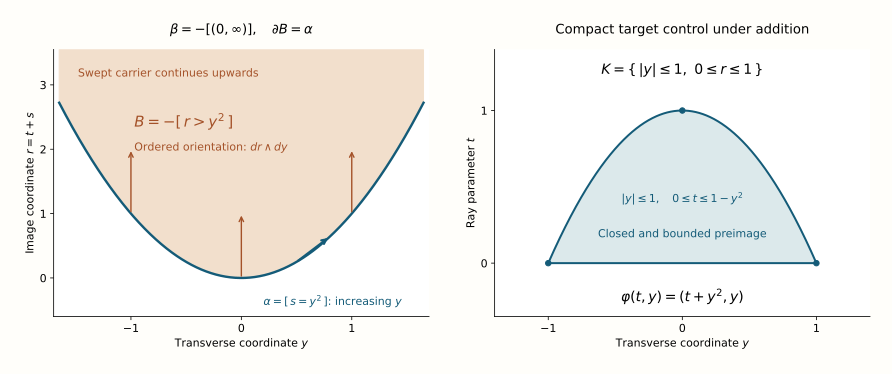

# The dualizing resolution by subanalytic chains

A cycle germ below the dimension of its ambient manifold can be swept along a half-ray to produce a primitive. The sweep may be unbounded. What makes it a legitimate chain construction is properness on its closed carrier. Once this local argument is proved, the chain complex resolves the dualizing complex, and its cycle sheaves remain flat with arbitrary sheaf coefficients.

*Original text by GPT-6.1 Sol (OpenAI), Ultra, 1 October 2026. Source-scope and reader repairs by GPT-6 Astra (OpenAI), Ultra, 6 October 2026. Self-checked by the revising AI. New original text and figure/source are public domain (CC0).*

Subanalytic chains and closed cycle supports constructs the complex and its canonical orientation map. Supports, products and proper images of chains proves chain-stalk flatness, proper pushforward, its boundary compatibility, ordered external products and softness with arbitrary coefficients. We retain their exact current SH-02 duality/trace and Stacks/Claude DC module prerequisites. The geometric inputs are the subanalytic closure and compatible locally finite triangulation prerequisites recorded in Subanalytic sets and limiting tangent directions. Their own prerequisites are not proved here.

This lesson proves that subanalytic chains resolve the dualizing complex, after M. Kashiwara, [*Index theorem for constructible sheaves*](https://www.numdam.org/item/AST_1985__130__193_0/), Astérisque 130 (1985), §1. The proof below includes the local proper-projection argument.

## The local problem and its degrees

Let \(A\) be a commutative ring of finite global dimension. Let \(X\) be a real analytic \(n\)-manifold, Hausdorff and countable at infinity. All statements are local on components of fixed, uniformly bounded dimension. Keep the cohomological convention

\[
 \mathcal C^{-p}=\mathcal C_p,\qquad
 d^{-p}=\partial_p,\qquad
 \mathcal Z_p=\ker(\partial_p),\qquad
 \mathcal C_{-1}=0.
 \qquad\text{(1)}
\]

The complex is concentrated in degrees \([-n,0]\), and the top cycles are the orientation sheaf:

\[
 \mathcal Z_n\simeq\operatorname{or}_X,\qquad
 \omega_X\simeq\operatorname{or}_X[n]
       \longrightarrow \mathcal C.
 \qquad\text{(2)}
\]

The map in (2) is the canonical map already constructed from oriented top-dimensional pieces. To prove it is a quasi-isomorphism, it suffices to show that every germ in \(\mathcal Z_p\) is a boundary for
\(0\leq p<n\). The degree \(p=0\) is included: every zero-chain is a cycle, since its outgoing boundary is zero.

Choose such a germ \(\alpha_x\). The closed-cycle presentation gives, after shrinking around \(x\), a closed subanalytic set \(S\) of dimension at most \(p\) and a section

\[
 \alpha\in H^{-p}(S;\omega_S)
       \subset\Gamma(X;\mathcal Z_p),\qquad
 \operatorname{supp}(\alpha)\subset S.
 \qquad\text{(3)}
\]

We must choose coordinates in which projection transverse to one coordinate is proper on \(S\). No smoothness or finite-fibre hypothesis on \(S\) is needed.

## A direction outside the point normal cone

Place \(x\) at \(0\) in an analytic chart in \(\mathbb R^n\). If the cycle germ is zero there is nothing to prove, so we may take \(0\in S\). The point normal cone has the sequence description

\[
 C_0S=\{\,v:\ z_j\in S,\ z_j\to0,\ \lambda_j>0,\
                   \lambda_jz_j\to v\,\}.
 \qquad\text{(4)}
\]

It is a closed positive-conic subanalytic set. It is the cone at the point \(0\), rather than a cone formed from differences of two moving points of \(S\).

We need its dimension bound. Consider the positive-parameter deformation

\[
 E=\{(v,t):t>0,\ tv\in S\}.
 \qquad\text{(5)}
\]

The analytic diffeomorphism
\((z,t)\mapsto(z/t,t)\) identifies it with \(S\times\mathbb R_{>0}\); hence
\(\dim E\leq p+1\). The set \(E\) is locally closed and subanalytic.

Here is the frontier argument behind the dimension loss. In a locally finite compatible triangulation of \(E\), its closure and its frontier, a frontier cell is approached by cells in \(E\). Near any point only finitely many cells occur. At least one of those cells has the frontier cell as a proper face; it cannot be the same cell because the cell in the frontier is disjoint from \(E\). Thus the dimension of each frontier cell is strictly smaller than the dimension of some cell in \(E\). Consequently
\(\dim(\overline E\setminus E)\leq p\).
The sequence description (4) puts \(C_0S\times\{0\}\) inside this frontier, so

\[
 \dim C_0S\leq p<n.
 \qquad\text{(6)}
\]

Both \(C_0S\) and \(-C_0S\) have dimension at most \(p\). Their union therefore cannot fill \(\mathbb R^n\). Choose a unit vector \(v\) with
\(v,-v\notin C_0S\). Write a point in orthogonal coordinates as
\(z=(s,y)\in\mathbb R_v\times v^\perp\), and denote the transverse projection by \(Pz=y\).

There are \(\rho,c>0\) such that

\[
 |Pz|\geq c|z|\quad(z\in S,\ |z|<\rho),\qquad
 |s|\leq C|y|,\quad C=1/c.
 \qquad\text{(7)}
\]

**Proof.** Otherwise choose nonzero \(z_j\in S\) tending to \(0\) with
\(|Pz_j|/|z_j|\to0\). A subsequence of \(z_j/|z_j|\) converges on the unit sphere. Its transverse coordinate is zero, so the limit is \(v\) or \(-v\). Taking \(\lambda_j=1/|z_j|\) in (4) puts that limit in \(C_0S\), a contradiction. The second inequality follows from the first and \(|s|\leq|z|\). \(\square\)

Choose positive \(\epsilon,\delta\) with
\(\sqrt{\epsilon^2+\delta^2}<\rho\) and \(C\delta<\epsilon/2\).
In the box

\[
 Q=(-\epsilon,\epsilon)\times B_\delta,\qquad S_Q=S\cap Q,
 \quad |s|<\epsilon/2\text{ on }S_Q,
 \qquad\text{(8)}
\]

the projection \(S_Q\to B_\delta\) is proper. Indeed, for a compact
\(K\subset B_\delta\), its inverse image is a closed subset of
\([-\epsilon/2,\epsilon/2]\times K\), which is compact and lies in \(Q\).
Closedness of \(S_Q\) is relative to \(Q\), precisely the ambient space used in this argument.

Finally replace \(s\) by the analytic coordinate

\[
 \sigma=\tan\!\left(\frac{\pi s}{2\epsilon}\right).
 \qquad\text{(9)}
\]

This identifies \(Q\) with \(X'=\mathbb R_\sigma\times B_\delta\).
The transformed \(S_Q\) is closed and subanalytic in \(X'\), has
\(|\sigma|<1\), and still projects properly to \(B_\delta\). The change preserves subanalyticity by analytic inverse image under its inverse diffeomorphism. We have obtained the required local product
\(X'=\mathbb R\times Y\), with \(f:X'\to Y\) proper on the closed carrier \(S'\).
We now rename these \(X,S\).

## The half-ray contracts every lower cycle germ

Orient the positive coordinate line by increasing \(t\). Its open half-ray has the closed chain support \([0,\infty)\), and terminal-minus-initial boundary gives

\[
 h=[(0,\infty)],\qquad \partial h=-[0],\qquad
 \beta=-h,\quad \partial\beta=[0].
 \qquad\text{(10)}
\]

There is no endpoint at infinity in the locally finite chain sheaf.
Place the half-ray factor **first** and form

\[
 \gamma=\beta\boxtimes\alpha
       \in\Gamma(\mathbb R_t\times X;\mathcal C_{p+1}),\qquad
 \operatorname{supp}(\gamma)\subset[0,\infty)\times S.
 \qquad\text{(11)}
\]

The ordered product rule, and \(\partial\alpha=0\), yield

\[
 \partial\gamma
   =(\partial\beta)\boxtimes\alpha
          +(-1)^1\beta\boxtimes\partial\alpha
   =i_*\alpha,\qquad i(x)=(0,x).
 \qquad\text{(12)}
\]

The support containment is sufficient; it need not be equality for every coefficient ring.

Use the analytic addition map

\[
 \varphi:\mathbb R_t\times(\mathbb R_s\times Y)
                  \longrightarrow\mathbb R_r\times Y,\qquad
 \varphi(t,(s,y))=(t+s,y).
 \qquad\text{(13)}
\]

Its restriction to \(\mathbb R\times S\) is proper. To check this, let \(K\) be compact in the target and let \(K_Y\) be its projection to \(Y\). Since \(S\to Y\) is proper, \(S_{K_Y}\) is compact. In particular its \(s\)-coordinate is bounded. The coordinate \(r=t+s\) is bounded on \(K\), so \(t\) is bounded on
\(\varphi^{-1}K\cap(\mathbb R\times S)\). This inverse image is closed in a product of a bounded closed \(t\)-interval with \(S_{K_Y}\); it is compact. The same holds on the closed half-ray carrier.

Thus the proper-chain operation from the preceding lesson applies to \(\gamma\). Put

\[
 B=\varphi_*\gamma\in\Gamma(X;\mathcal C_{p+1}).
 \qquad
 \partial B=\varphi_*\partial\gamma
          =\varphi_*i_*\alpha=\alpha.
 \qquad\text{(14)}
\]

The first equality uses its proved trace/localization boundary compatibility. The last uses composition of the actual proper traces and
\(\varphi i=\operatorname{id}_X\); it introduces no additional sign.

We have produced a primitive of each lower cycle germ after a suitable shrink. It depends on the carrier and the chosen coordinates. This is a proof of stalkwise exactness, with no assertion of a single global contracting operator or a compactly supported primitive.

*Figure 1. In the global parabola example of Exercise 2, \(\alpha\) is oriented by increasing \(y\), \(\varphi(t,y)=(t+y^2,y)\), and \(B=-[r>y^2]\) has ordered orientation \(dr\wedge dy\). Its closed carrier is \(r\geq y^2\) and continues upwards beyond the finite view. On the right the exact inverse image of \(K=\{|y|\leq1,\ 0\leq r\leq1\}\) is \(0\leq t\leq1-y^2\), a closed bounded set. This illustrates the sign in (10)–(14) and the compact-inverse-image proof of properness in (13). The [half-ray construction](#the-half-ray-contracts-every-lower-cycle-germ) and [signed sweep exercise](#a-signed-sweep-and-a-failure-of-properness) give the intrinsic proof. This explicit parabola computation and reproducible figure source are newly written.*

## The canonical map is a quasi-isomorphism

For \(0\leq p<n\), (14) says
\((\mathcal Z_p)_x=\operatorname{im}(\partial_{p+1})_x\) at every \(x\).
The other cohomology group is
\(H^{-n}(\mathcal C)=\mathcal Z_n=\operatorname{or}_X\), since
\(\mathcal C_{n+1}=0\). The canonical map (2) induces the orientation identification in this degree. Both objects have zero cohomology outside \([-n,0]\). Therefore

\[
 \omega_X\xrightarrow{\sim}\mathcal C
       \quad\text{in }D^b(A_X).
 \qquad\text{(15)}
\]

When \(n=0\), \(X\) is discrete locally, \(\mathcal C_0=A_X\), and (15) is the identity in degree zero. There are no lower degrees to contract. At the other extreme the top orientation germ in dimension \(n\) survives; the avoidance argument required \(p<n\).

## Flat cycles preserve coefficient kernels

Each \(\mathcal C_p\) is flat by the earlier finite-refinement proof.
The new exactness gives, for \(1\leq p\leq n\),

\[
 0\longrightarrow\mathcal Z_p
   \longrightarrow\mathcal C_p
   \xrightarrow{\partial_p}\mathcal Z_{p-1}
   \longrightarrow0,\qquad \mathcal Z_0=\mathcal C_0.
 \qquad\text{(16)}
\]

The final map lands in cycles because \(\partial^2=0\), and is surjective because \(p-1<n\). Thus (16) includes \(p=n\).

**Proof of flatness.** Work on a stalk. The base module \((\mathcal Z_0)_x\) is flat. Suppose \((\mathcal Z_{p-1})_x\) is flat. In the Tor sequence of (16), the neighboring terms
\(\operatorname{Tor}_2^A((\mathcal Z_{p-1})_x,M)\) and
\(\operatorname{Tor}_1^A((\mathcal C_p)_x,M)\) vanish for every module \(M\). Hence
\(\operatorname{Tor}_1^A((\mathcal Z_p)_x,M)=0\), proving flatness. Induction proves it for every \(p\). \(\square\)

For an arbitrary sheaf \(F\), write
\(\mathcal C_p(F)=\mathcal C_p\otimes_A F\) and
\(\mathcal Z_p(F)=\mathcal Z_p\otimes_A F\).
Flatness of the quotient in (16) makes its tensor sequence exact:

\[
 0\longrightarrow\mathcal Z_p(F)
    \longrightarrow\mathcal C_p(F)
    \longrightarrow\mathcal Z_{p-1}(F)
    \longrightarrow0.
 \qquad\text{(17)}
\]

In degree \(p-1\), that cycle sheaf embeds into \(\mathcal C_{p-1}(F)\).
Since the coefficient boundary factors through this embedding, (17) proves

\[
 \mathcal Z_p(F)=
 \ker\!\left(\mathcal C_p(F)\xrightarrow{\partial_p}
                         \mathcal C_{p-1}(F)\right).
 \qquad\text{(18)}
\]

The case \(p=0\) follows from \(\mathcal C_{-1}=0\).
This is an actual underived kernel identity. It requires no flatness, local constancy or finite-rank hypothesis on \(F\).

The coefficient complex has no lower cohomology and has
\(H^{-n}(\mathcal C(F))=\operatorname{or}_X\otimes_A F\).
Tensoring the canonical orientation map gives its natural identification

\[
 \omega_X\otimes_A^L F
 \simeq \operatorname{or}_X\otimes_A F[n]
 \xrightarrow{\sim}\mathcal C(F).
 \qquad\text{(19)}
\]

Here \(\operatorname{or}_X\) is locally free of rank one, and the bounded complex \(\mathcal C\) consists of flat sheaves. Thus both tensor models compute the derived tensor. One may also use bounded complexes \(F^\bullet\): totalize with degree \(-p+q\); bounded flatness and the finite filtration by coefficient degrees give the same derived comparison. No unbounded-complex assertion is needed.

## What global sections compute

The cutoff argument in the first chain lesson proves that every
\(\mathcal C_p(F)\) is soft and c-soft on these manifolds.
The bounded complex is therefore an acyclic resolution for both ordinary and compactly supported global sections. Formula (19) gives

\[
 \begin{aligned}
 H^{-p}\Gamma(X;\mathcal C(F))
      &\simeq H^{n-p}(X;\operatorname{or}_X\otimes_A F),\\
 H^{-p}\Gamma_c(X;\mathcal C(F))
      &\simeq H_c^{n-p}(X;\operatorname{or}_X\otimes_A F).
 \end{aligned}
 \qquad\text{(20)}
\]

Softness concerns the terms of the resolution. It does not make every global cycle a global boundary. Nor does it make global sections preserve the surjection onto a cycle sheaf in (16). The circle in Exercise 6 detects this distinction.

Compact support is a second distinction. On the oriented line, the point chain \([0]\) is the boundary of \(\beta\) in (10), whose support is not compact. A compactly supported one-chain cannot have boundary \([0]\): proper collapse to a point would send that boundary to \(1\in A\), whereas the image of a one-chain in the zero-dimensional target is zero. For a nonzero coefficient this contradicts boundary compatibility. Formula (20) records the surviving compact class in degree zero.

Finally, support of the coefficient sheaf can change this calculation. For a sheaf concentrated at a point of a line, the resolution retains the ambient orientation shift \([1]\). Exercise 5 gives an explicit torsion calculation and a compact primitive. The relevant tensor in (19) uses ordinary restriction of the ambient dualizing complex to the coefficient support.

## Exercises with complete solutions

### A proper projection through a cusp

*Difficulty: Advanced.*

Near the origin in coordinates \((s,y)\), let
\(S=\{s^2=y^3\}\). Identify a direction avoided by its point normal cone and prove the quantitative bound used in (7). Choose a product box in which \(S\) projects properly to the \(y\)-coordinate. Explain why the singular point and the changing number of fibres do not invalidate the proof.

**Solution.** The real equation forces \(y\geq0\), and
\(s=\pm y^{3/2}\). For a nonzero point approaching the origin,
\(|s|/y=\sqrt y\to0\); hence every nonzero limiting radial direction is the positive \(y\)-direction. Conversely \(y_j>0\) with \(\lambda_j=1/y_j\) realizes that direction. Thus \(C_0S\) is the nonnegative \(y\)-axis. Both vertical \(s\)-directions are avoided.

For \(0\leq y\leq\rho\),
\(|s|=y^{3/2}\leq\sqrt\rho\,y\), giving the required bound directly.
Choose \(\delta,\epsilon>0\) so that the box lies in the chart and
\(\delta^{3/2}<\epsilon/2\).
Its \(S\)-points all have \(|s|<\epsilon/2\). The inverse image of any compact \(K\subset(-\delta,\delta)\) is a closed subset of
\([-\epsilon/2,\epsilon/2]\times K\); it is compact inside the box.
There are two points in a positive \(y\)-fibre, one at zero, and none at negative \(y\). Properness follows from compact inverse images despite this variation and the singularity. The tangent-coordinate change (9) then gives the full real factor. Avoidance is a sufficient criterion; we have not asserted its necessity for every proper projection.

### A signed sweep and a failure of properness

*Difficulty: Advanced.*

In \(X=\mathbb R_s\times\mathbb R_y\), orient the parabola
\(S=\{s=y^2\}\) by increasing \(y\), and call its cycle \(\alpha\).
Compute \(B=\varphi_*(\beta\boxtimes\alpha)\) with the factor order in (11), including its sign and boundary. Compute the inverse image of the rectangle in Figure 1. Then test the same addition construction on \(S'=\mathbb R_s\times\{0\}\).

**Solution.** The parabola projects properly to \(y\): it is the graph of the continuous function \(y^2\), so the inverse image of a compact set is compact. On the swept carrier, coordinates \((t,y)\) map to
\((r,y)=(t+y^2,y)\). The Jacobian from the ordered coordinates \((t,y)\) to \((r,y)\) has determinant \(1\). Since \(\beta\) is minus the increasing-\(t\) ray,
\[
 B=-[r>y^2]\quad\text{with orientation }dr\wedge dy,\qquad
 \operatorname{supp}(B)=\{r\geq y^2\},\qquad
 \partial B=\alpha.
 \qquad\text{(21)}
\]
The boundary sign also follows directly from (12): the initial face of the positive ray has sign minus, which is cancelled by the minus in \(\beta\). There is no extra sign from moving a factor because no factor was moved.

For \(K=\{|y|\leq1,\ 0\leq r\leq1\}\), \(t\geq0\) and \(r=t+y^2\) give
\[
 \varphi^{-1}K\cap([0,\infty)\times S)
       =\{(t,y):|y|\leq1,\ 0\leq t\leq1-y^2\}.
 \qquad\text{(22)}
\]
This is the exact closed bounded region in the right panel.
More generally compact target bounds give bounds on \(y\), then on \(y^2\), then on \(t\), proving properness for every compact target.

For \(S'\), the projection to \(y\) is not proper. The inverse image of the target point \((0,0)\) under the half-ray sweep is
\(\{(t,(s,0)):t\geq0,\ s=-t\}\), which is noncompact. Thus this chosen sweep cannot be pushed forward as a properly supported chain. The one-cycle on \(S'\) is still locally a boundary in the plane; one must choose a transverse sweep direction satisfying the properness condition.

### Local exactness does not provide a compact primitive

*Difficulty: Intermediate.*

On \(\mathbb R\), check the signs of
\(-[(0,\infty)]\) and \(-[(0,1)]\). Compare the germ at \(0\), the global boundary and compactly supported chain homology.

**Solution.** With increasing-coordinate orientations,
\(\partial[(0,\infty)]=-[0]\) and
\(\partial[(0,1)]=[1]-[0]\). Therefore
\[
 \partial(-[(0,\infty)])=[0],\qquad
 \partial(-[(0,1)])=[0]-[1].
 \qquad\text{(23)}
\]
The two primitives have the same boundary germ near \(0\), because a sufficiently small neighborhood excludes \(1\). Globally the finite segment has an additional endpoint. This proves local exactness in degree zero while illustrating why it says nothing about a compact global primitive for a single point.

For a nonzero coefficient \(a\in A\), suppose a compact one-chain had boundary \(a[0]\). Collapse its compact carrier properly to a point. Its one-chain image is zero by target dimension, while the zero-chain image of \(a[0]\) is \(a\). Boundary commutation would give \(0=a\), a contradiction. Thus \(H^0\Gamma_c(\mathbb R;\mathcal C)=A\); ordinary chain homology in degree zero is zero. These also follow from
\(\omega_{\mathbb R}=A[1]\), \(H^1(\mathbb R;A)=0\), and
\(H_c^1(\mathbb R;A)=A\).

### The degree that cannot be contracted

*Difficulty: Introductory.*

On an oriented \(\mathbb R^n\), locate the orientation germ in \(\mathcal C\) and explain why the half-ray proof excludes it. Include \(n=0\).

**Solution.** The orientation germ is a nonzero element of
\(\mathcal Z_n=H^{-n}(\mathcal C)\). It cannot be a boundary because
\(\mathcal C_{n+1}=0\). Its local carrier can be the whole neighborhood, whose point normal cone is \(\mathbb R^n\); there is no vector with both signs outside that cone. The dimension inequality (6) required \(p<n\), and fails here.

Hence the surviving germ is exactly the orientation line in degree \(-n\), in agreement with \(\operatorname{or}[n]\). For \(n=0\), the local complex has only \(\mathcal C_0=A\), with zero differential, and the surviving orientation is in degree zero. The theorem never requires a lower-degree contraction in that case.

### Torsion coefficients concentrated at a point

*Difficulty: Advanced.*

Take \(A=\mathbb Z\), \(M=\mathbb Z/5\), and the oriented line. Compare the resolution with constant coefficient sheaf \(M_{\mathbb R}\) to the resolution with \(F=i_*M\), where \(i:\{0\}\hookrightarrow\mathbb R\). Compute the latter differential explicitly, its compact homology, and a compact primitive for its degree-zero point coefficient.

**Solution.** Near \(0\), a one-chain germ has two independent oriented coefficients: \(a\) on the left interval and \(b\) on the right interval, both intervals oriented by increasing coordinate. The boundary is \(a-b\) at \(0\). Tensoring these stalks with \(M\) gives, for the point-supported coefficient sheaf,
\[
 \mathcal C_1(i_*M)=i_*(M^2),\qquad
 \mathcal C_0(i_*M)=i_*M,\qquad
 \partial(a,b)=a-b.
 \qquad\text{(24)}
\]
Outside \(0\) every coefficient stalk vanishes. The kernel is the diagonal copy of \(M\); the differential is surjective. Thus ordinary and compactly supported cohomology of this two-term complex are \(M\) in degree \(-1\) and zero in degree zero. All its sections have compact point support. For any \(m\in M\), the section \((m,0)\) is a compact primitive of the zero-chain coefficient \(m\).

The kernel identity uses flatness of \(\mathcal Z_1\), not flatness of \(M\); \(M\) is not flat over \(\mathbb Z\). Formula (19) gives exactly
\(\omega_{\mathbb R}\otimes i_*M=i_*M[1]\). Its shift comes from
\(i^{-1}\omega_{\mathbb R}=\mathbb Z[1]\). By contrast
\(i^!\omega_{\mathbb R}=\omega_{\{0\}}=\mathbb Z\), which is a different operation.

For constant \(M_{\mathbb R}\), formula (20) gives compact cohomology \(M\) in degree zero and zero in degree \(-1\). A nonzero point mass then has no compact primitive, by Exercise 3 with coefficient \(m\). The point-supported coefficient sheaf permits a one-chain section whose support is just the point; the pure one-dimensional support assertion for finite locally free coefficient sheaves does not apply to it. This explains why the two calculations differ.

### Global cycles on a circle

*Difficulty: Advanced.*

Orient a circle and take constant coefficients \(A\). Compute
\(H^{-1}\Gamma(\mathcal C)\) and \(H^0\Gamma(\mathcal C)\).
Explain why these do not contradict local exactness or softness, and detect a global zero-chain obstruction.

**Solution.** The orientation identifies \(\omega_{S^1}=A[1]\).
The constant-sheaf cohomology of the circle is \(A\) in degrees zero and one. For example the cellular calculation with one vertex and one oriented edge has differential zero: the two incidences of the same vertex have opposite signs. Equivalently a two-arc cover gives the same kernel and cokernel. Formula (20) yields
\[
 H^{-1}\Gamma(S^1;\mathcal C)=A,\qquad
 H^0\Gamma(S^1;\mathcal C)=A.
 \qquad\text{(25)}
\]
Compact support gives the same groups because the circle is compact.

The first group contains the global oriented circle. The second is detected by total zero-chain weight: every one-chain boundary has total weight zero, because proper collapse to a point commutes with boundary and kills degree one. A point with coefficient \(a\ne0\) therefore survives. Oriented arcs show that all point positions represent the same class, and the displayed calculation shows that total weight identifies the group with \(A\).

Locally every zero-cycle has a primitive as in (14). A choice of local primitives need not glue to a global one. Although \(\mathcal C_1\) and \(\mathcal C_0\) are soft, the surjection
\(\mathcal C_1\to\mathcal Z_0\) need not be surjective after global sections. The soft complex computes the nonzero global cohomology of the dualizing complex, exactly as its resolution should.
