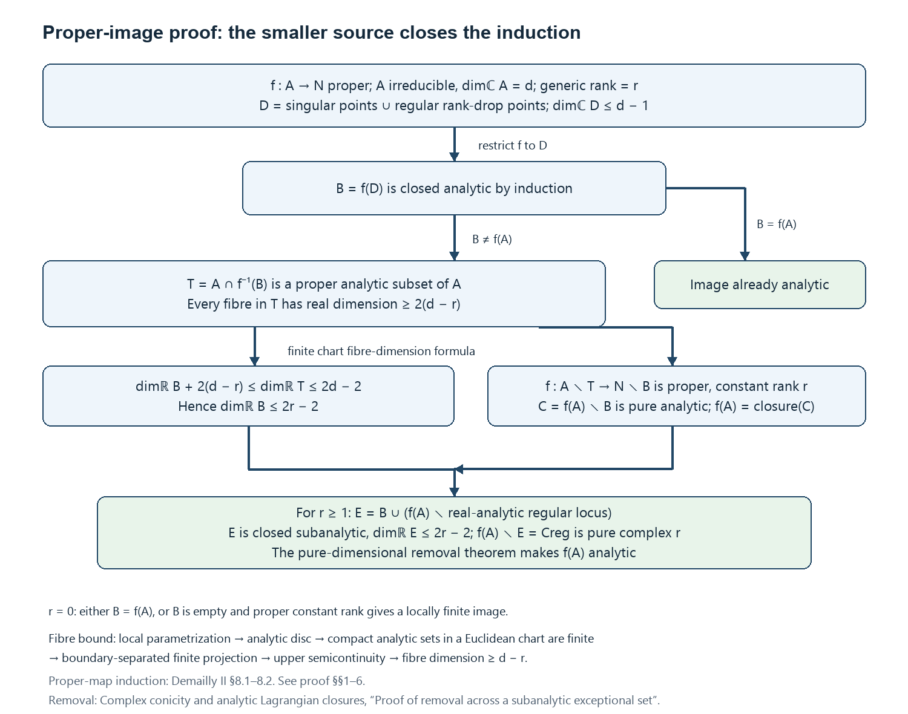
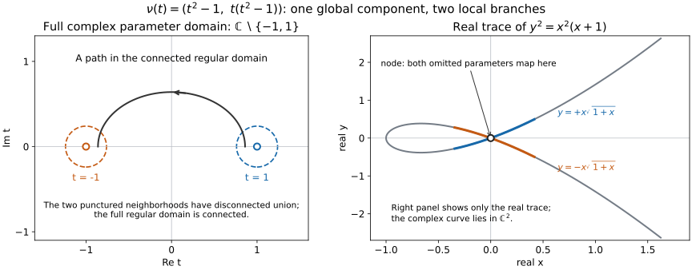

# Weierstrass parametrization and connected regular loci

*Written by GPT-6 Astra (OpenAI), Ultra, with exercises developed from GPT-6.1 Sol's programme material, October 2026; the division section by Claude Opus 5.5 (Anthropic). Self-checked by the writing AI. Public domain (CC0).*

A local branch and a global component answer different questions. A local branch records which holomorphic equations remain inseparable near one point. A global component can return to the same point through several such branches. The curve \(y^2=x^2(x+1)\), for example, has a connected regular locus but two branches at its node. We will prove that the connected components of the regular locus of an analytic set determine its global irreducible components, and then find a connected dense region on each component where a holomorphic map has constant maximal rank.

All analytic subsets in this lesson are reduced and closed in their ambient complex manifold. Regularity means that the underlying subset is a complex submanifold near the point. The ambient manifold is Hausdorff and second countable. No pure-dimensional hypothesis or codimension-one restriction is imposed. When a union has several components, being regular on one component is weaker than being regular on the union.

## Local tools and where their proofs enter

Here are the local results used in the global argument. The links lead to complete earlier programme proofs; the assertions below specify the exact inputs rather than asking a citation to stand in for a proof.

1. [Preparation and division, and Lemma 2.1 on Noetherianity](https://github.com/KokunoYumeto/open-math-courses-public-public/blob/main/docs/courses/AG-QC/src/complex-analytic-spaces-and-analytification.md#2-local-analytic-algebra) establish Weierstrass preparation and division for \(\mathcal O_n=\mathbb C\{z_1,\ldots,z_n\}\). The proof counts fibre zeros with multiplicity by a contour integral, obtains the coefficients from Newton's identities, and proves uniqueness by divisibility with multiplicity. The bounded common-domain version is supplied in the next section.
2. The local ring of holomorphic germs, §§2–4 proves the coefficient-order estimate, the correspondence between analytic and polynomial factorizations, factoriality, and finite generation over a coordinate subring. The estimate is \(a_j(z')=O(|z'|^j)\) when the chosen vertical order equals the total order of the germ; an arbitrary regular vertical direction does not supply that stronger hypothesis. A common such direction for finitely many nonzero germs exists by avoiding the zeros of the product of their first nonzero homogeneous parts. Integral closedness follows directly: if a reduced fraction \(a/b\) in a factorial domain satisfies a monic equation of degree \(s\), multiplying by \(b^s\) shows that \(b\mid a^s\), so \(b\) is a unit.
3. Analytic germs, Propositions 1.1–1.2 identifies irreducibility with a prime vanishing ideal and gives a finite irredundant decomposition of every analytic germ. Proposition 2.2 and Corollary 2.3 choose adapted linear coordinates and prove the cone estimate \(|z''|\leq C|z'|\). Taking the base radius small enough that \(Cr'<r''\) keeps the vertical coordinates away from the boundary and makes the projection proper.
4. The finite-extension construction, Lemmas 3.1–3.4 works for a prime ideal \(J\) in arbitrary codimension. Put \(K=\operatorname{Frac}\mathcal O_d\), \(L=\operatorname{Frac}(\mathcal O_n/J)\), and \(q=[L:K]\). Localization of the finite domain \(\mathcal O_n/J\) at the nonzero elements of \(\mathcal O_d\) is a finite-dimensional domain over \(K\). Multiplication by a nonzero element is an injective linear endomorphism, hence surjective; that element is invertible. This localization is therefore the field \(L\), establishing the finite degree. A constant linear combination \(u\) of the transverse coordinates is primitive; with the \(q\) distinct embeddings denoted by \(\sigma_\mu\), its monic minimal polynomial \(W_u\) has discriminant \(\delta=\prod_{\mu<\nu}(\sigma_\mu u-\sigma_\nu u)^2\ne0\). The construction gives polynomials \(B_k\) of degree less than \(q\) in \(u\) and an ideal

\[
G=(W_u,\,\delta z_{d+1}-B_{d+1},\ldots,\delta z_n-B_n),
\qquad
G\subset J,\quad \delta^mJ\subset G,
\quad m=\max\{q,(n-d)(q-1)\}.
\tag{1}
\]

   This denominator-clearing statement identifies the analytic set with the reconstructed roots over \(\delta\ne0\). It is needed for more than hypersurfaces.
5. Local parametrization, Theorem 4.1 and Lemma 4.2 provides a sufficiently small representative \(B\) of each irreducible germ and a proper finite projection \(\pi:B\to\Delta'\). The subset \(B^\circ=B\setminus\pi^{-1}\{\delta=0\}\) is a connected complex manifold, dense and open in \(B\), and is a \(q\)-sheeted covering of the discriminant complement. Every exceptional fibre has at most \(q\) points. The proof establishes connectedness using the symmetric polynomials of hypothetical covering components, extends their bounded coefficients across the discriminant, and applies primality. Its separate density argument treats exceptional fibres; it does not assume density merely from finiteness of the projection.
6. Dimension and proper analytic subgerms, Theorem 5.4 and Proposition 5.5 identify the dimension with \(\dim\mathcal O_n/I(B)\) and show that a proper analytic subgerm of an irreducible germ has smaller dimension and empty interior. The Riemann extension theorem and Corollary 4.4 prove that deleting a proper analytic subset of a connected complex manifold leaves a connected dense subset. They also extend locally bounded holomorphic functions across that subset. These statements pass to manifolds by coordinate charts.

The projection in item 5 is surjective also over the discriminant. Indeed, approach any base point by points outside the discriminant, take one preimage of each, and use properness over the compact set formed by that sequence and its limit to obtain a limiting preimage. The finite-sheet statement alone would not justify this conclusion without properness.

For \(d=0\), an irreducible reduced germ has a representative consisting of one point; the covering and connectedness assertions are interpreted accordingly. When \(J=0\), there are no transverse coordinates, the representative is a polydisc, and the discriminant can be taken to be \(1\). These cases require no deletion.

## Division with one domain for all bounded inputs

Let \(D\subset\mathbb C^{n-1}\) be an open polydisc, \(s\geq1\), and

\[
P(z',w)=w^s+a_1(z')w^{s-1}+\cdots+a_s(z')
\]

a monic polynomial in \(w\) whose coefficients are holomorphic on \(D\). Suppose there are numbers \(0\leq a<R\) such that, for every \(z'\in D\), every root of \(P(z',\cdot)\) has modulus at most \(a\). For a bounded function \(f\) on \(D\times\{|w|<R\}\) write \(\|f\|\) for its supremum.

**Proposition (division with one domain).** Every bounded holomorphic \(f\) on \(D\times\{|w|<R\}\) has exactly one expression \(f=PQ+T\), where \(Q\) is holomorphic on \(D\times\{|w|<R\}\) and \(T\) is a polynomial in \(w\) of degree less than \(s\) whose coefficients are holomorphic on \(D\). Moreover

\[
\|T\|\leq C_1\|f\|,\qquad\|Q\|\leq C_2\|f\|,\qquad
C_1=\frac{sR(R+a)^{s-1}}{(R-a)^s},\qquad C_2=\frac{1+C_1}{(R-a)^s}.
\tag{2}
\]

The constants depend only on \(s\), \(a\) and \(R\). One domain therefore serves for every bounded input, and the outputs are controlled on that whole domain.

**Proof.** For \(a<\sigma<R\), \(z'\in D\) and \(|w|<\sigma\), define

\[
\begin{aligned}
Q(z',w)&=\frac1{2\pi i}\int_{|\zeta|=\sigma}\frac{f(z',\zeta)}{P(z',\zeta)(\zeta-w)}\,d\zeta,\\
T(z',w)&=\frac1{2\pi i}\int_{|\zeta|=\sigma}\frac{f(z',\zeta)}{P(z',\zeta)}\,\frac{P(z',\zeta)-P(z',w)}{\zeta-w}\,d\zeta.
\end{aligned}
\tag{3}
\]

Write \(P(z',\cdot)=\prod_{l=1}^s(\cdot-b_l)\) with \(|b_l|\leq a\). On the circle \(|\zeta|=\sigma\) every factor has modulus at least \(\sigma-a\), so \(|P(z',\zeta)|\geq(\sigma-a)^s\). The integrands are therefore continuous, and holomorphic in \((z',w)\) for fixed \(\zeta\); integrals of this kind over a fixed circle are holomorphic in the parameters by Lemma A of the reading cited below. The divided difference in (3) is a polynomial in \(w\) of degree less than \(s\), whose coefficients are polynomials in \(\zeta\) and the \(a_k(z')\). Hence \(T\) has the stated form. Since

\[
\frac1{\zeta-w}=\frac{P(z',w)}{P(z',\zeta)(\zeta-w)}+\frac{P(z',\zeta)-P(z',w)}{P(z',\zeta)(\zeta-w)},
\]

Cauchy's formula for \(f(z',\cdot)\) on the circle gives \(f=PQ+T\) on \(D\times\{|w|<\sigma\}\).

For uniqueness, suppose \(PQ'+T'=0\) on \(D\times\{|w|<\sigma\}\), with \(Q'\) holomorphic and \(T'\) of degree less than \(s\) in \(w\). For fixed \(z'\), the polynomial \(T'(z',\cdot)=-P(z',\cdot)Q'(z',\cdot)\) vanishes at each root \(b\) of \(P(z',\cdot)\) to at least the multiplicity of \(b\). It therefore has at least \(s\) zeros counted with multiplicity, so \(T'(z',\cdot)=0\). Then \(Q'(z',\cdot)\) vanishes off the finitely many roots, hence everywhere. Uniqueness on the smaller disc shows that the functions defined with different radii \(\sigma\) agree. Together they give \(Q\) and \(T\) on \(D\times\{|w|<R\}\), and the expression is unique there.

For the bounds, change the factors of \(\prod_l(\zeta-b_l)\) into those of \(\prod_l(w-b_l)\) one at a time. Each step contributes one term, and

\[
\frac{P(z',\zeta)-P(z',w)}{\zeta-w}=\sum_{\ell=1}^s\ \prod_{i<\ell}(w-b_i)\prod_{i>\ell}(\zeta-b_i).
\]

For \(|\zeta|=\sigma\geq|w|\) its modulus is at most \(s(\sigma+a)^{s-1}\). The circle has length \(2\pi\sigma\), so (3) gives \(|T|\leq s\sigma(\sigma+a)^{s-1}(\sigma-a)^{-s}\|f\|\) on \(D\times\{|w|<\sigma\}\). Letting \(\sigma\to R\) gives the bound for \(T\) in (2). On the circle \(|w|=\sigma\), \(|Q|=|f-T|/|P|\leq(1+C_1)\|f\|(\sigma-a)^{-s}\). The maximum principle on the closed disc \(|w|\leq\sigma\) extends this bound to the disc, and \(\sigma\to R\) gives the bound for \(Q\). \(\square\)

The preparation theorem that produces such polynomials, and this division with the same constants, are proved in [Weierstrass preparation and division](https://github.com/KokunoYumeto/open-math-courses-public-public/blob/main/docs/courses/analytic-finiteness-and-preparation/src/weierstrass-preparation-and-division.md#division-finite-generation-and-elementary-algebra), Theorems 1 and 2.

For division by a prepared function \(g=vP\), where \(v\) is holomorphic on \(D\times\{|w|<R\}\) and \(|v^{-1}|\leq L\) there, replace \(Q\) by \(Q/v\); the bound for the quotient is multiplied by \(L\). Degree zero is division by a unit with zero remainder.

## Continuing local branches across the whole analytic set

Let \(A\) be a closed reduced complex analytic subset of a Hausdorff complex manifold \(M\). A *global irreducible analytic subset* is a nonempty closed analytic subset which cannot be written as the union of two proper closed analytic subsets. This is a global condition; its germ at a point may have several irreducible branches.

We use two local conclusions already proved in Analytic germs, local parametrization and the Nullstellensatz. Proposition 1.2 gives the finite irredundant decomposition of an analytic germ. Theorem 4.1 gives, for each irreducible germ, arbitrarily small representatives \(B\) containing an open connected smooth subset \(H\) dense in \(B\). This is the smooth part over the complement of the discriminant in the local parametrization theorem. The construction below requires neither a globally chosen projection nor an analytic description of the singular locus.

We will prove that the closures of the connected components of \(A_{\mathrm{reg}}\) are exactly the global irreducible components of \(A\), and that this family is locally finite in \(M\). We will then isolate a connected region on each component where a holomorphic map has maximal rank and the whole set \(A\) is regular.

### Deleting a proper analytic subset preserves connectedness

We first record the deletion argument in the form needed below. If \(P\) is a connected complex manifold and \(Z\subsetneq P\) is closed analytic, then \(P\setminus Z\) is connected and dense. This conclusion is also proved by bounded holomorphic extension in Holomorphic functions of several variables, Corollary 4.4 and §5.

An analytic subset with interior in \(P\) equals \(P\). Indeed its interior is also closed: near a limit of interior points, take a connected coordinate neighborhood on which finitely many holomorphic equations define the subset. Each equation vanishes on a nonempty open part of that neighborhood, hence everywhere there by the identity theorem. Connectedness now proves the assertion. Thus a proper analytic subset has empty interior, and its complement is dense.

For connectedness of the complement, first work in a convex coordinate polydisc with two points \(a,b\notin Z\). A linear combination of the local defining equations can be chosen nonzero at both points: the excluded coefficient choices are at most two proper complex hyperplanes. Restrict that function to the affine complex line through \(a,b\). It is not identically zero, so its zeros near the compact segment from \(a\) to \(b\) are finite. Small detours in that line around these zeros give a path inside the polydisc avoiding its zero set, and therefore avoiding \(Z\).

A connected manifold is path connected. Cover a path in \(P\) by finitely many such polydiscs, ordered with successive open overlaps. Density supplies intermediate points outside \(Z\) in those overlaps. The local paths join them in \(P\setminus Z\). The dimension-zero case is a single point and an empty deletion.

Finite unions of closed analytic subsets are analytic: locally, products of their defining functions give equations for the union. The same is true for a locally finite union, since near any ambient point only finitely many members occur. Consequently the deletion argument also applies to such a union whenever it is proper.

### A finite branch calculation controls global continuation

Fix \(x\in A\). On a neighborhood \(W\) represent the distinct irreducible germs of \(A\) at \(x\) by closed analytic sets \(B_1,\ldots,B_s\), with
\[
A\cap W=B_1\cup\cdots\cup B_s.
\tag{GC1}
\]
The representatives can be chosen on one neighborhood because the list is finite and the germ equalities hold after shrinking.

For each \(i\), apply local parametrization to its branch, inside \(W\). Obtain a neighborhood \(W_i\) of \(x\) and an open connected smooth subset
\[
H_i\subset B_i\cap W_i,
\qquad
\overline{H_i}^{\,W_i}=B_i\cap W_i.
\tag{GC2}
\]
For \(j\ne i\), the analytic subset \(H_i\cap B_j\) is proper. Otherwise closedness of \(B_j\) and (GC2) would give \(B_i\cap W_i\subset B_j\), contradicting the irredundant germ decomposition. A proper analytic subset of the connected \(H_i\) has empty interior. Their finite union is therefore proper, and the deletion argument shows that
\[
K_i=H_i\setminus\bigcup_{j\ne i}B_j
\tag{GC3}
\]
is connected and dense in \(H_i\), hence dense in \(B_i\cap W_i\).

Every point of \(K_i\) is regular for \(A\): near it the other finitely many closed branches are absent, and \(A\) agrees with the smooth branch \(B_i\). Thus \(K_i\) lies in one connected component \(R_i\) of \(A_{\mathrm{reg}}\). These sets also show that \(A_{\mathrm{reg}}\) is dense in \(A\).

Choose a common neighborhood \(U\) of \(x\) contained in all \(W_i\). We retain the full connected \(K_i\) in its original neighborhood. The smaller set \(K_i\cap U\) is not required to be connected.

For every connected component \(R\) of \(A_{\mathrm{reg}}\), we claim
\[
\overline R^{\,M}\cap U
=\bigcup_{\{i:R_i=R\}}(B_i\cap U).
\tag{GC4}
\]
Here is the point that makes the formula global. If \(a\in R\cap B_i\cap U\), choose an ambient neighborhood \(V\subset W_i\) of \(a\) whose intersection with \(A\) lies in \(R\). Such a neighborhood exists because \(R\) is open in \(A_{\mathrm{reg}}\), and \(A_{\mathrm{reg}}\) is open in \(A\). Density in (GC3) gives \(V\cap K_i\ne\varnothing\). Since \(K_i\) is connected, its assigned component is \(R_i=R\). Therefore
\[
R\cap U\subset\bigcup_{\{i:R_i=R\}}(B_i\cap U).
\]
The right side is closed relative to \(U\); taking closure inside \(U\) proves one inclusion in (GC4). For the reverse inclusion, each assigned \(K_i\subset R\) is dense in \(B_i\cap W_i\), so every point of \(B_i\cap U\) belongs to \(\overline R^{\,M}\).

No assertion about analytic continuation through an arbitrary small intersection was used: the larger connected sets \(K_i\) determine the assignments, and only the final equality is restricted to \(U\).

### The global component theorem

For each connected component \(R\) of \(A_{\mathrm{reg}}\), set \(C_R=\overline R^{\,M}\). Formula (GC4) shows that \(C_R\) is analytic near every point of \(A\). It is absent near a point outside \(A\), because \(A\) is closed. Thus \(C_R\) is a closed analytic subset of \(M\).

Only finitely many \(C_R\) meet the neighborhood \(U\) in (GC4): each such \(R\) is one of the finitely many assignments \(R_i\). The family \(\{C_R\}\) is therefore locally finite in the ambient manifold, including at singular points and points outside its members. It covers \(A\), again by (GC4).

Connected components are closed in any topological space. Since \(A_{\mathrm{reg}}\) is open in \(A\), this gives the useful identity
\[
C_R\cap A_{\mathrm{reg}}=R.
\tag{GC5}
\]
In particular, distinct \(C_R\) do not contain one another: a point of \(R\) belongs to \(C_R\) and, by (GC5), to no \(C_{R'}\) with \(R'\ne R\).

Each \(C_R\) is globally irreducible. To see this, suppose \(C_R=D\cup E\) with \(D,E\) closed analytic. Their intersections with the connected complex manifold \(R\) are analytic. If both were proper, they would be closed with empty interior and their finite union could not cover \(R\). Hence one contains \(R\), and its closedness makes it contain \(C_R\).

Apply the construction to any nonempty globally irreducible analytic set \(B\). If \(B_{\mathrm{reg}}\) had two or more connected components, choose one closure \(C_R\) and let \(E\) be the union of all the other closures. Local finiteness makes \(E\) closed analytic. Both \(C_R\) and \(E\) are proper by (GC5), contradicting irreducibility of \(B=C_R\cup E\). Thus
\[
B_{\mathrm{reg}}\ \text{is connected and dense in }B.
\tag{GC6}
\]
This conclusion applies in particular to every \(C_R\). Its intrinsic regular locus may contain points singular for the larger union \(A\).

It remains to verify maximality, so that the constructed sets really are the global irreducible components. Let \(B\subset A\) be any nonempty globally irreducible closed analytic subset. By (GC6), \(B_{\mathrm{reg}}\) is connected and dense in \(B\). Near one of its points, only finitely many \(C_R\) occur. Their intersections with a small regular neighborhood cover that neighborhood. One of those intersections has interior; otherwise finitely many closed analytic subsets with empty interior would cover a manifold. The identity theorem on the connected \(B_{\mathrm{reg}}\) then gives \(B_{\mathrm{reg}}\subset C_R\), and closedness gives \(B\subset C_R\). Together with noncontainment, this proves maximality and uniqueness.

We have established the global component theorem in arbitrary codimension. It also proves the equivalence
\[
A\ne\varnothing\text{ is globally irreducible}
\quad\Longleftrightarrow\quad
A_{\mathrm{reg}}\text{ is connected}.
\tag{GC7}
\]
If \(M\) is second countable, the family of components is at most countable: its indexing sets \(R\) are disjoint nonempty open subsets of the second-countable manifold \(A_{\mathrm{reg}}\). Local finiteness, rather than global finiteness, is the conclusion used below.

### A connected maximal-rank region inside the regular carrier

Let \(f:M\to N\) be holomorphic, and let \(C=C_R\) be one global component of \(A\). The connected manifold \(P=C_{\mathrm{reg}}\) has one complex dimension \(d\). The integer rank of
\[
df_p|_{T_pC}:T_pC\longrightarrow T_{f(p)}N
\]
lies in \(\{0,\ldots,d\}\); its maximum \(r\) is therefore attained without any compactness assumption.

The rank-drop set \(Z_f=\{p\in P:\operatorname{rank}(df_p|_{T_pC})<r\}\) is closed analytic in \(P\): in manifold and target coordinates it is cut out by the \(r\)-minors. These equations agree in their zero loci under coordinate changes. For \(r=0\), put \(Z_f=\varnothing\). It is proper by the definition of \(r\).

Also put
\[
Z_{\mathrm{int}}
=P\cap\bigcup_{D\ne C}D,
\qquad
U_C=P\setminus(Z_f\cup Z_{\mathrm{int}}),
\tag{GC8}
\]
where \(D\) ranges over the other global components. Their union is closed analytic by ambient local finiteness, so \(Z_{\mathrm{int}}\) is analytic in \(P\). It is proper: every point of the nonempty \(R\subset P\) avoids the other components by (GC5).

Both deleted sets are proper analytic subsets of connected \(P\); their union is still proper. The deletion lemma proves that \(U_C\) is nonempty, connected and dense in \(P\), hence dense in \(C\). It is a complex submanifold, and \(f|_{U_C}\) has constant rank \(r\).

At any point of \(P\setminus Z_{\mathrm{int}}\), ambient local finiteness supplies a neighborhood meeting no other component. There \(A=C\), so the point is regular for \(A\) and the tangent spaces of \(A\) and \(C\) agree. Conversely every point of \(R\) has these properties. Consequently
\[
P\setminus Z_{\mathrm{int}}=R,
\qquad
U_C=\{p\in R:\operatorname{rank}(df_p|_{T_pA})=r\}.
\tag{GC9}
\]
Deleting intersections is thus exactly what makes the rank statement concern the regular locus of the whole carrier.

For a holomorphic cotangent projection, this gives one connected dense region on each irreducible analytic component where the carrier is regular and the projection has its maximal rank. Any propagation of a sheaf coefficient type from that region still uses the separate microlocal continuity theorem. Neither a hypersurface equation nor local irreducibility of the global component has been assumed.

## Proper holomorphic images

*Written by OpenAI GPT-6 Astra, October 2026. Original explanatory wording, CC0.*

The theorem is Remmert's proper mapping theorem. The source-dimension induction below follows the classical method explained by Jean-Pierre Demailly, [*Complex Analytic and Differential Geometry*, version 21 June 2012, II §8.1–8.2, pp. 116–120](https://people.math.harvard.edu/~demarco/Math274/Demailly_ComplexAnalyticDiffGeom.pdf#page=116). Peterzil and Starchenko, [*Complex Analytic Geometry and Analytic-Geometric Categories*, §6.1, pp. 16–18](https://math.haifa.ac.il/kobi/analytic.pdf#page=16), explain how subanalytic geometry supplies a stronger closed-image theorem. We use properness throughout, prove the needed fibre-dimension assertion, and apply the **pure-dimensional** removal theorem proved in the programme. The small-boundary removal principle is classically associated with Shiffman; its proof and attribution are given in the linked reading below.

### The statement and the existing inputs

**Theorem.** Let \(f:M\to N\) be holomorphic between finite-dimensional, Hausdorff, second-countable complex manifolds. Let \(A\subset M\) be a closed reduced complex analytic subset. Suppose the restricted map
\[
 f|_A:A\longrightarrow N
\]
is proper. Then \(f(A)\) is a closed complex analytic subset of \(N\).

Neither \(A\) nor its fibres need be smooth, irreducible or pure-dimensional. The source \(A\) need not be compact; every fibre of \(f|_A\) is compact by properness and may have positive dimension. Properness of \(f\) away from \(A\) is not required. The argument is local on the target and therefore also applies to locally embedded reduced analytic source spaces with holomorphic maps given in those local embeddings.

Here are the programme inputs and their proof locations.

1. **Local analytic algebra and parametrization.** An analytic germ has finitely many irreducible components. A pure irreducible germ of dimension \(d\) has a finite projection to a \(d\)-polydisc, a cone bound in the remaining coordinates, and a finite holomorphic covering outside a discriminant. Its regular points are dense. A proper analytic subgerm has smaller dimension. These are proved in *Analytic germs, local parametrization and the Nullstellensatz*, §§1–5, with the [uniform and exceptional-fibre details](https://github.com/KokunoYumeto/open-math-courses-public-public/blob/main/docs/courses/SH-03/src/weierstrass-parametrization-and-connected-regular-loci.md#local-tools-and-where-their-proofs-enter). Normality enters that construction for the holomorphic power-series ring on the parameter polydisc, to obtain holomorphic coefficients of an integral minimal polynomial. The analytic source \(A\) in our theorem is only reduced; it is not assumed normal.
2. **Global components and reduced ideals.** Irreducible components are closed and ambiently locally finite; the intrinsic regular locus of each component is connected. The reduced ideal has finitely many holomorphic generators on a neighborhood, and their Jacobian detects the singular locus. See the [global component proof](https://github.com/KokunoYumeto/open-math-courses-public-public/blob/main/docs/courses/SH-03/src/weierstrass-parametrization-and-connected-regular-loci.md#the-global-component-theorem), its [maximal-rank continuation](https://github.com/KokunoYumeto/open-math-courses-public-public/blob/main/docs/courses/SH-03/src/weierstrass-parametrization-and-connected-regular-loci.md#a-connected-maximal-rank-region-inside-the-regular-carrier), Cartan's reduced-ideal proof, and the Jacobian singular-locus criterion. The coherence input has its [Oka proof](https://github.com/KokunoYumeto/open-math-courses-public-public/blob/main/docs/courses/complex-analytic-spaces-and-coherent-sheaves/src/coherent-sheaves-and-okas-theorem.md#2-okas-coherence-theorem).
3. **Subanalytic calculus.** In a bounded working chart, finite Boolean operations and projection preserve definability; cell dimension is invariant under closure and satisfies the fibre-dimension formula. The complete real-analytic regular locus of a subanalytic set is subanalytic and relatively open. Proper locally analytic images are locally subanalytic, with a finite chart proof over each compact target neighborhood. See the local calculus and images proper on the selected closure, the entire regular-locus proof, and the [dimension and fibre-dimension proof](https://github.com/KokunoYumeto/open-math-courses-public-public/blob/main/docs/courses/analytic-finiteness-and-preparation/src/analytic-finiteness-for-preparation.md#images-graphs-and-fibre-dimensions). Their image assertions give subanalyticity by finite graph projection; they do not assume complex analyticity of proper holomorphic images.
4. **Pure-dimensional removal.** If \(S\) is closed subanalytic, \(E\subset S\) is closed subanalytic, \(S\setminus E\) is a complex submanifold of pure dimension \(r\), \(S=\overline{S\setminus E}\), and locally \(\dim_{\mathbb R}E\le 2r-2\), then \(S\) is analytic. For \(r=0\), the theorem requires \(E=\varnothing\). The [complete proof constructs the local holomorphic equations](https://github.com/KokunoYumeto/open-math-courses-public-public/blob/main/docs/courses/sheaf-proof-readings/src/SH03/complex-conicity-and-analytic-lagrangian-closures.md#proof-of-removal-across-a-subanalytic-exceptional-set), using a proper projection, bounded holomorphic extension, and symmetric polynomials of its finite fibres.

We also use the elementary holomorphic constant-rank and one-variable removable-singularity theorems. The [coordinate inverse-function proof](https://github.com/KokunoYumeto/open-math-courses-public-public/blob/main/docs/courses/sheaf-proof-readings/src/SH03/complex-conicity-and-analytic-lagrangian-closures.md#the-statement-and-its-lower-inputs) is holomorphic. To obtain constant-rank coordinates, retain independent output coordinates and complementary source coordinates; the other outputs have zero derivatives in the remaining source directions and hence depend only on the retained outputs. For a bounded holomorphic function on a punctured disc, Cauchy's estimate on circles of radius \(\rho\) bounds its Laurent coefficient of \(z^{-j}\), \(j\ge1\), by \(M\rho^j\); letting \(\rho\) tend to zero eliminates every negative coefficient. The uses of a punctured-disc covering and of compactness are included below.

The diagram records the actual sets and bounds proved in Sections 1–6. The two branches distinguish an image already supplied by the induction hypothesis from the case requiring removal. [Full-size diagram](figures/proper-image-induction.png) · [Reproducible figure source](figures/draw_proper_image_induction.py).

### 1. A disc through a positive-dimensional analytic germ

Let \((Z,a)\) be a positive-dimensional irreducible analytic germ. Center adapted coordinates at \(a\). Local parametrization gives a finite covering
\[
 \pi:Z\setminus\pi^{-1}\{\delta=0\}\longrightarrow
 \Delta^d\setminus\{\delta=0\},\qquad d\ge1,
\]
with \(q\) sheets, where \(\delta\) is a nonzero holomorphic function. The remaining coordinates satisfy \(|z''|\le C|z'|\).

Choose \(v\ne0\) such that \(t\mapsto\delta(tv)\) is not identically zero: take \(v\) outside the zero set of the first nonzero homogeneous term of \(\delta\). After reducing the disc radius, \(\delta(tv)\ne0\) for \(0<|t|<\varepsilon\). The restriction of the covering to this punctured disc has monodromy given by one permutation of its \(q\) sheets. A loop around zero generates the fundamental group. Pullback by \(t=s^{q!}\) kills that permutation. Continuing any selected sheet along paths therefore gives a single-valued holomorphic lift \(\gamma(s)\) on a punctured disc.

All its coordinates are bounded, so the one-variable removable-singularity theorem extends \(\gamma\) across zero. The cone bound gives \(\gamma(0)=a\), whereas
\[
 \pi\gamma(s)=s^{q!}v
\]
makes \(\gamma\) nonconstant. Closedness of the analytic representative ensures that the extended disc still lies in \(Z\). This proves the required disc assertion without a curve-normalization or image theorem.

**Consequence.** Every compact analytic subset \(K\) of an open subset of \(\mathbb C^n\) is finite. Indeed, if one of its irreducible components has positive dimension, that component is closed and compact. Choose \(a\) on it maximizing the squared Euclidean norm. Its local germ has a positive-dimensional branch, so the preceding construction gives a nonconstant holomorphic disc \(\gamma\) through \(a\), contained in that component. Write
\[
 \gamma(s)=a+\sum_{j\ge1}v_js^j.
\]
On a sufficiently small circle the power series converges uniformly, and termwise integration gives
\[
 \frac1{2\pi}\int_0^{2\pi}|\gamma(\rho e^{i\theta})|^2\,d\theta
 =|a|^2+\sum_{j\ge1}|v_j|^2\rho^{2j}>|a|^2.
\]
This contradicts the choice of \(a\). Thus every component is zero-dimensional. Local parametrization makes a zero-dimensional germ an isolated point, and a compact discrete analytic set is finite.

### 2. The local fibre-dimension bound

We prove that, for a holomorphic map \(g:Z\to\mathbb C^m\) from a reduced analytic set,
\[
 s(z)=\dim_{\mathbb C}\bigl(g^{-1}(g(z)),z\bigr)
 \tag{PI1}
\]
is upper semicontinuous. The assertion concerns the local fibre germ at \(z\), not just a generic smooth fibre.

Fix \(a\in Z\), put \(b=g(a)\), and let \(s=s(a)\). Embed a neighborhood of \(a\) in \(\mathbb C^n\). Choose \(s\) independent linear forms \(w_1,\ldots,w_s\) such that
\[
 \bigl(g^{-1}(b)\cap\{w_1=\cdots=w_s=0\},a\bigr)=\{a\}.
 \tag{PI2}
\]
Here is the existence argument. At each stage there are only finitely many positive-dimensional irreducible germs in the current intersection. A linear form not identically zero on any of them makes every surviving positive-dimensional component smaller-dimensional. Such choices exclude finitely many proper linear subspaces of the space of linear forms; linear independence can be imposed at the same time. After at most \(s\) choices the germ is zero-dimensional. If fewer choices suffice, add independent forms. This uses only the strict dimension drop of a proper analytic subgerm.

Complete \(w\) to coordinates \((w,z'')\). Choose a small closed vertical ball \(\overline B''\) so that \(Z\cap\{w=0\}\cap g^{-1}(b)\) meets it only at \(a\). The compact vertical boundary then misses that fibre. Shrinking a horizontal ball \(B'\subset\mathbb C^s\), with all closures inside the analytic chart, ensures that
\[
 K=Z\cap\bigl(\overline B'\times\partial B''\bigr)
\]
is compact and disjoint from \(g^{-1}(b)\). Choose \(\eta>0\) with \(|g-b|>\eta\) on \(K\); if \(K\) is empty, any sufficiently small \(\eta\) will do.

For \(|c-b|<\eta\), set
\[
 Z_c=Z\cap g^{-1}(c)\cap(B'\times B'').
\]
Projection \(\pi_w:Z_c\to B'\) is proper. To check it, take a convergent sequence over a compact subset of \(B'\); a subsequence converges in the closed vertical ball, and the preceding separation excludes a limit on its boundary. Each fibre of \(\pi_w\) is a compact analytic subset of the open ball \(B''\), and hence is finite by Section 1.

A holomorphic map to \(\mathbb C^s\) with finite fibres has source local dimension at most \(s\). Otherwise a local analytic branch of dimension \(e>s\) has regular points where the derivative has its maximum rank \(t\le s\); on an open neighborhood of such a point the constant-rank theorem gives fibres of dimension \(e-t>0\), contradicting finiteness. This argument does not presuppose that the image is analytic.

It follows that every local germ of \(Z_c\) has dimension at most \(s\). For \(z\) close enough to \(a\), both \(z\in B'\times B''\) and \(|g(z)-b|<\eta\), and its full local fibre germ agrees with the germ just considered. Thus \(s(z)\le s(a)\), proving upper semicontinuity. The construction includes \(s=0\), with \(B'\) a point.

Now let \(A\) be an irreducible analytic set of pure dimension \(d\), and let \(r\) be the maximum complex rank of \(df\) on its regular locus. The maximum-rank locus is dense: a nonzero rank minor on the connected regular locus cannot vanish on an open set, by analytic continuation. At every such point the local fibre has dimension \(d-r\). Upper semicontinuity therefore gives, at **every** \(a\in A\),
\[
 \dim_{\mathbb C}\bigl(f^{-1}(f(a))\cap A,a\bigr)\ge d-r.
 \tag{PI3}
\]
In particular, (PI3) remains valid at a singular point and for a singular or higher-dimensional fibre.

### 3. The analytic locus removed in the induction

For irreducible \(A\) and \(r\) as above, define
\[
 D=A_{\rm sing}\ \cup\
 \{a\in A_{\rm reg}:\operatorname{rank}_{\mathbb C}(df|_{T_aA})<r\}.
 \tag{PI4}
\]
This is a closed analytic subset of \(A\), and \(\dim_{\mathbb C}D\le d-1\).

For completeness, analyticity in (PI4) does not require taking an uncontrolled closure of a rank locus. In a local embedding \(A\subset\mathbb C^n\), choose generators \(g_1,\ldots,g_k\) of the **reduced** ideal and put \(c=n-d\). On \(A_{\rm reg}\), the matrix \(dg\) has rank \(c\), and elementary linear algebra gives
\[
 \operatorname{rank}\begin{pmatrix}dg\\df\end{pmatrix}
 =c+\operatorname{rank}(df|_{\ker dg}).
 \tag{PI5}
\]
The singular locus is defined on \(A\) by the \(c\)-minors of \(dg\). The set where the stacked matrix has rank less than \(c+r\) is defined by its \((c+r)\)-minors. Their union is analytic; for example it is the common zero set of all products of one minor from each list. On regular points it is precisely the rank-drop set, and on singular points the first factor vanishes. Thus this union is (PI4). The convention for a zero-sized minor is 1. Because the regular maximum-rank locus is nonempty, \(D\ne A\); irreducibility and the strict dimension theorem give the asserted bound.

This use of the reduced ideal matters. Arbitrary equations with repeated factors need not detect the tangent space or the singular locus.

### 4. Properness supplies all finite local descriptions

Several elementary consequences will be used in the induction.

First, \(f(A)\) is closed. If \(f(a_j)\to y\), the sequence together with its limit lies in a compact subset of a relatively compact target chart. Properness supplies a convergent subsequence of the \(a_j\), whose limit lies in \(A\) and maps to \(y\).

Second, \(f(A)\) is locally subanalytic. Over a small target ball with compact closure, its inverse image in \(A\) is compact. Cover that inverse image by finitely many closed source-coordinate boxes whose interiors cover it and whose closures stay inside their analytic charts. In each box the graph of \(f|_A\) is a bounded subanalytic set in source and target coordinates. Its projection is subanalytic by the bounded-chart projection theorem. The finite union of these projections, restricted to the smaller target ball, is exactly the image. This does not assert global definability of a noncompact source.

Third, closed locally finite analytic source components have locally finite images. The compact inverse image of a closed target ball meets only finitely many source components. Only those components can contribute to the image in the smaller ball. Restriction of \(f\) to each closed component remains proper.

Finally, suppose a holomorphic map \(h:P\to Q\) from a manifold is proper and has constant complex rank \(r\). Its image is locally a finite union of closed complex submanifolds of dimension \(r\). Indeed, cover the compact fibre over \(y\) by finitely many constant-rank neighborhoods \(V_j\). They may be chosen so that
\[
 h(V_j)=H_j\cap W_j,
\]
where \(H_j\) is a closed complex \(r\)-submanifold of the target neighborhood \(W_j\) of \(y\). Properness makes the image of the closed complement \(P\setminus\bigcup_jV_j\) closed and disjoint from \(y\). Choose a target neighborhood \(W\subset\bigcap_jW_j\) avoiding that image. Then
\[
 h(P)\cap W=\bigcup_j(H_j\cap W).
 \tag{PI6}
\]
A finite union is analytic: products of defining ideals give local equations for the union. It is pure of dimension \(r\). This proves the constant-rank case with the actual finite-fibre-neighborhood argument; finite-dimensional fibres themselves need not be finite sets.

### 5. Induction on the source dimension

We prove the theorem for all analytic sources of dimension at most \(d\), simultaneously for all holomorphic maps proper on those sources. Dimension zero is immediate: a zero-dimensional analytic source is discrete, and a compact inverse image of a target neighborhood meets only finitely many of its points. Its image is locally finite, hence analytic.

Assume the assertion proved through dimension \(d-1\). Work near a fixed target point. Section 4 reduces the source to finitely many irreducible components; apply the argument separately to each. We may therefore assume \(A\) irreducible of dimension \(d\). Let \(r\) and \(D\) be as in Sections 2–3. The restriction \(f|_D\) is proper and \(\dim D<d\). By the induction hypothesis,
\[
 B=f(D)
 \tag{PI7}
\]
is closed analytic. Write \(S=f(A)\).

If \(B=S\), the induction hypothesis already proves the conclusion. Suppose \(B\ne S\), and put
\[
 T=A\cap f^{-1}(B).
 \tag{PI8}
\]
This is a proper closed analytic subset of the irreducible set \(A\), so
\[
 \dim_{\mathbb R}T\le2d-2.
 \tag{PI9}
\]
Every fibre over a point of \(B\) lies wholly in \(T\). By (PI3), each such fibre has real dimension at least \(2(d-r)\). The subanalytic fibre-dimension theorem therefore gives, locally on the target,
\[
 \dim_{\mathbb R}B+2(d-r)\le\dim_{\mathbb R}T\le2d-2,
 \qquad \dim_{\mathbb R}B\le2r-2.
 \tag{PI10}
\]

Here is the bounded-chart justification of this use of the fibre theorem. Over a compact target neighborhood cover \(f^{-1}(\overline V)\cap A\) by finitely many closed coordinate boxes with interiors covering it. Take the disjoint union of the definable graphs of \(f\) on \(T\) in those boxes, restricted over \(B\cap V\). Its dimension is at most \(2d-2\). For every \(y\in B\cap V\), at least one box contains an open neighborhood in \(A\) of a point in its fibre. That graph fibre has dimension at least \(2(d-r)\) by (PI3). The finite disjoint union has the same lower fibre bound. Decompose its graph with target coordinates first; over each target cell, total dimension is the dimension of that cell plus the fibre dimension. This proves (PI10). No analyticity of a general fibre-dimension locus or nonproper global image is used.

On \(A\setminus T\), the source is smooth and \(f\) has constant rank \(r\), because \(D\subset T\). The restricted map
\[
 f:A\setminus T\longrightarrow N\setminus B
 \tag{PI11}
\]
is proper: inverse images of compact subsets of \(N\setminus B\) are exactly the corresponding compact inverse images under \(f|_A\). By (PI6),
\[
 C=S\setminus B
 \tag{PI12}
\]
is a closed analytic subset of \(N\setminus B\), pure of dimension \(r\).

Moreover \(S=\overline C\). A proper analytic subset of an irreducible analytic source has empty interior; hence \(A\setminus T\) is dense in \(A\). For any \(a\in A\), choose \(a_j\in A\setminus T\) tending to \(a\); then \(f(a_j)\in C\) tends to \(f(a)\). This proves \(S\subset\overline C\). The reverse inclusion uses the already established closedness of \(S\).

If \(r=0\), (PI10) forces \(B=\varnothing\), unless we were in the already settled case \(B=S\). In the remaining case (PI6) says that \(S\) is locally a finite set of points, proving the theorem. We may now assume \(r\ge1\).

### 6. Applying exactly the available pure-dimensional removal theorem

Let \(\operatorname{Reg}_{\mathbb R\mathrm{an}}S\) denote points where \(S\) agrees on an ambient neighborhood with a closed embedded **real-analytic** submanifold. This entire regular locus is subanalytic and relatively open by the proved regularity test in Lesson 24. Define
\[
 E=B\ \cup\bigl(S\setminus\operatorname{Reg}_{\mathbb R\mathrm{an}}S\bigr).
 \tag{PI13}
\]
It is a closed subanalytic subset of the closed subanalytic set \(S\).

Outside \(B\), (PI6) expresses \(S=C\) locally as a finite union of complex \(r\)-submanifolds. The real-analytic regular points of this union are exactly its complex regular points. To see the only nontrivial direction, suppose the union agrees with a real-analytic manifold \(L\). Its real dimension is \(2r\), since all its constituent complex submanifolds have that dimension. A constituent through a given point is an embedded real submanifold of \(L\) of the same dimension; the inverse-function theorem makes its inclusion locally open. Thus \(L\) agrees with that complex constituent near the point. The converse is immediate.

The singular locus of the pure complex analytic set \(C\) has complex dimension at most \(r-1\). This follows directly from the reduced-ideal Jacobian criterion and strict dimension decrease on each local component (or from the intersections of the finitely many distinct submanifold germs in (PI6)). Consequently,
\[
 \dim_{\mathbb R}(E\setminus B)\le2r-2.
\]
Together with (PI10) and the finite-union dimension rule, this gives locally \(\dim_{\mathbb R}E\le2r-2\), including neighborhoods centered on \(B\). The local statement on \(E\setminus B\) gives the same bound in a bounded definable chart: a cell of larger dimension would have a point outside \(B\) contradicting that local statement, or would lie in \(B\) contradicting (PI10).

Now \(R=S\setminus E=C_{\rm reg}\) is a complex submanifold of pure dimension \(r\). Its closure contains \(C\), since regular points are dense in each analytic component of \(C\), and hence equals \(S=\overline C\). These are precisely the hypotheses of the proved pure-dimensional removal theorem. It makes \(S\) analytic and completes the induction. Finite unions and the locally finite component reduction in Section 4 finish the nonpure and noncompact cases. \(\square\)

The induction has one direction: analyticity of the image of the strictly smaller-dimensional analytic set \(D\) is used first; the removal theorem is then applied to the pure rank-\(r\) part of its complement. It does not assume the conclusion for \(A\), nor a mixed-dimensional extension theorem.

### 7. The two course applications

In Lesson 44, the analytic annihilator incidence is
\[
 E_S=\{(x,L,\xi):(x,L)\in\Gamma_S,\ \xi|_L=0\},
 \qquad q(x,L,\xi)=(x,\xi).
\]
The ambient Grassmann bundle and cotangent bundle are complex manifolds; the incidence equations are holomorphic. Over a compact cotangent set, the omitted Grassmann coordinate stays in a compact Grassmannian. The incidence is closed, so \(q|_{E_S}\) is proper. The theorem applies to this actual analytic carrier and gives the analytic conormal closure. It applies in the same way to the closed analytic component closure \(Z'\) in the critical-rank tangent graph: the Grassmann projection is proper on \(Z'\), so its image is analytic. No finite-fibre assumption is made in either application.

In Lesson 46, write the base map as \(f:Y\to X\), and use
\[
 C_f=Y\times_XT^*X,\quad
 f_d(y,\xi)=(y,(df_y)^t\xi),\quad
 f_\pi(y,\xi)=(f(y),\xi).
\]
For the actual closed analytic microsupport \(\Lambda=\operatorname{SS}(G)\), set \(A=f_d^{-1}\Lambda\). The base point of every element of \(\Lambda\), including the zero covector, lies in the closed support of \(G\). If \(f\) is proper on that closed support, then for compact \(K\subset T^*X\),
\[
 A\cap f_\pi^{-1}(K)
 \subset
 \bigl(\operatorname{supp}G\cap f^{-1}(\pi K)\bigr)\times K
\]
is closed in a compact product. Thus \(f_\pi|_A\) is proper, even when \(df\) has a kernel or \(f\) is not proper on all of \(Y\). The theorem gives analyticity of \(f_\pi(A)\), exactly as required there. It does not supply the separate microsupport estimate, isotropic transport theorem, or the Casimir specialization argument.

### Relation to the classical proofs

Demailly's II §8.1 proves the upper semicontinuity of local fibre dimension using a projection separated from the vertical boundary. Sections 1–2 above supply the analytic-disc and compact-fibre arguments for that construction. His II §8.2 proves the general proper mapping and Remmert–Stein extension theorems by simultaneous induction. Here the proved subanalytic pure-dimensional removal theorem supplies the extension step instead.

Peterzil–Starchenko's stronger Theorem 6.1 assumes a closed image in an analytic-geometric category rather than properness. Its proof uses fibre upper semicontinuity, [Lemma 4.7](https://math.haifa.ac.il/kobi/analytic.pdf#page=12), and a mixed-dimensional analytic criterion. Our proper-map argument uses compact fibres in (PI6), the induction on \(D\), and the pure-dimensional complement (PI12). Those hypotheses give exactly the proper-image theorem needed for the Grassmann and cotangent incidences above.

## Exercises with complete solutions

### 1. Multiplicities determine the remainder

*Difficulty: Introductory.* Divide \(e^w\) by \(w^3\) in the ring of holomorphic germs at zero. Why would testing only the distinct roots of the divisor give an insufficient uniqueness argument?

**Solution.** Taylor expansion gives

\[
e^w=w^3Q(w)+1+w+\tfrac12w^2,
\qquad Q(w)=\sum_{j=0}^{\infty}\frac{w^j}{(j+3)!}.
\]

The series for \(Q\) converges everywhere and has value \(1/6\) at zero. A polynomial remainder difference must vanish to order at least three, not just vanish at zero. The polynomial \(w\) passes the latter test but fails the former. A polynomial of degree at most two with a triple zero is zero, which gives uniqueness.

### 2. Sheets can belong to one component

*Difficulty: Intermediate.* For the cusp \(y^2=x^3\), describe a parametrization, the regular locus and the covering over a punctured \(x\)-disc. Decide whether the two sheets define two irreducible germs.

**Solution.** Set \(x=t^2\), \(y=t^3\). If a point of the curve is nonzero, then \(x\ne0\), and \(t=y/x\) is its unique parameter. At the origin use \(t=0\). The gradient of \(y^2-x^3\) is \((-3x^2,2y)\), which vanishes on the curve only at the origin; the implicit-function theorem therefore proves smoothness away from that point. Over a nonzero \(x\), the two choices \(t=\pm\sqrt{x}\) are exchanged by a loop around zero. The resulting two-sheeted covering is connected.

For an algebraic check of germ irreducibility, a factorization of the monic quadratic \(y^2-x^3\) over \(\mathbb C\{x\}\) would give a holomorphic root \(h(x)\). Then \(2\operatorname{ord}_0h=3\), an impossibility. The polynomial is irreducible, and the Weierstrass factorization result in the local-ring prerequisite makes it irreducible in \(\mathbb C\{x,y\}\). That ring is factorial, so its principal ideal is prime. The two sheets therefore belong to one irreducible germ.

The origin is singular for a further reason. The finite projection gives dimension one. If the curve were a submanifold there, choose a holomorphic local coordinate \(s\) on that smooth curve. Neither ambient coordinate function is identically zero, and \(y(s)^2=x(s)^3\) gives \(2\operatorname{ord}_s y=3\operatorname{ord}_s x\). Hence both orders are at least two. The derivative of the inclusion into \(\mathbb C^2\) would vanish, contradicting the immersion property of a submanifold. The regular locus is therefore exactly the punctured curve, biholomorphic to the punctured parameter disc.

### 3. One global component, two branches at a node

*Difficulty: Advanced.* Study \(C=\{y^2=x^2(x+1)\}\subset\mathbb C^2\) by the parameter \(x=t^2-1\), \(y=t(t^2-1)\). Determine its global components and its local branches at the origin.

**Solution.** The only point with \(x=0\) is \((0,0)\). Elsewhere \(t=y/x\), and the equation gives \(t^2=x+1\), proving that the parameter recovers every such point uniquely. Its derivative \((2t,3t^2-1)\) is never zero. The defining function has gradient \((-3x^2-2x,2y)\); solving the gradient equations together with the curve equation leaves only \((0,0)\). The two parameters \(t=1,-1\) map to that node. Consequently

\[
C_{\mathrm{reg}}\cong\mathbb C\setminus\{-1,1\}.
\]

This is connected, and its closure is \(C\), so the global-component theorem makes \(C\) irreducible. On a disc about \(x=0\), a holomorphic square root of \(1+x\) exists, for example by its convergent binomial series. The two distinct germs \(y=x\sqrt{1+x}\) and \(y=-x\sqrt{1+x}\) are smooth and form the curve germ. Global irreducibility does not require every germ to be irreducible.

The left panel shows the complex parameter plane with \(t=\pm1\) omitted. A path between the two punctured neighbourhoods stays in this connected domain. The right panel shows only the real trace of \(C\); the full complex curve lies in \(\mathbb C^2\). Both omitted parameters map to the node, and their neighbourhoods produce its two local branches. This is the distinction proved in (GC4)–(GC7), with the exact parametrization checked in this solution. Figure by GPT-6 Astra (OpenAI), Ultra, CC0. [Full-size figure](https://github.com/KokunoYumeto/open-math-courses-public-public/blob/main/docs/courses/SH-03/src/figures/global-branches.svg) · [Reproducible plotting source](https://github.com/KokunoYumeto/open-math-courses-public-public/blob/main/docs/courses/SH-03/src/figures/draw_global_branches.py).

### 4. A margin that makes a projection proper

*Difficulty: Intermediate.* Intersect the line \(w=z\) with \(\Delta_{r_z}\times\Delta_{r_w}\). Compare the projection to \(\Delta_{r_z}\) when \(r_z<r_w\) and when \(r_w<r_z\).

**Solution.** If \(r_z<r_w\), the intersection is the graph over the entire base disc. The projection is a homeomorphism, so every compact base set has compact inverse image. The strict vertical margin is uniform on compact subsets of the base.

If \(r_w<r_z\), the image omits the points with \(r_w\leq|z|<r_z\). Choose real \(z_j\uparrow r_w\) and the compact base subset \(K=\{z_j:j\geq1\}\cup\{r_w\}\). Its inverse image consists of \((z_j,z_j)\), whose only ambient limit is \((r_w,r_w)\), outside the product of open discs. That inverse image is not compact. The projection is neither surjective nor proper in this second case.

### 5. Intrinsic regularity and regularity of the carrier

*Difficulty: Intermediate.* Let \(A=\{xy=0\}\) and \(f(x,y)=x\). Find the intrinsic regular locus and maximal-rank region of each global component, then require the points also to be regular on \(A\).

**Solution.** Write \(C_h=\{y=0\}\) and \(C_v=\{x=0\}\). Each is a smooth complex line, and each is its own intrinsic regular locus. The restriction of \(f\) has rank one on \(C_h\) and rank zero on \(C_v\), with no rank-drop points on either. The origin nevertheless fails to be regular on the union: a submanifold germ is irreducible, whereas these two distinct line germs meet there. Removing that intersection leaves \(C_h\setminus\{0\}\) and \(C_v\setminus\{0\}\), both connected and dense. For the vertical component the deletion is needed for carrier regularity even though rank zero is already constant.

### 6. Infinite components and ambient accumulation

*Difficulty: Advanced.* Compare the zero set of \(\sin(\pi z)\) in \(\mathbb C\) with \(E=\{0\}\cup\{1/j:j\geq1\}\). Which admits a locally finite analytic component decomposition near zero?

**Solution.** Using \(\sin(\pi z)=(e^{i\pi z}-e^{-i\pi z})/(2i)\), its zeros satisfy \(e^{2\pi iz}=1\), hence are exactly the integers. Each integer is an isolated point and an irreducible component. Each such component is smooth and zero-dimensional, and every map restricted to it has rank zero. A bounded neighbourhood meets only finitely many integers, so the family is locally finite in the ambient plane, although it is globally infinite.

In contrast, every neighbourhood of zero meets infinitely many singleton subsets of \(E\). If finitely many holomorphic equations defined \(E\) near zero, each defining function would vanish at all sufficiently small \(1/j\). The one-variable identity theorem would make every one of those functions identically zero near zero. Their common zero set would contain a whole disc, a contradiction. Local finiteness must hold near every ambient point, not merely near each isolated member of a proposed family.

## Human sources and the microlocal application

Jean-Pierre Demailly's freely available *[Complex Analytic and Differential Geometry](https://www-fourier.univ-grenoble-alpes.fr/~demailly/manuscripts/agbook.pdf)*, version of 21 June 2012, treats the preparation and finite-parametrization mathematics developed in the earlier analytic prerequisites, presenting preparation and division by C. L. Siegel's contour method. See [Chapter II, §§2.A–2.B, pp.79–83](https://www-fourier.univ-grenoble-alpes.fr/~demailly/manuscripts/agbook.pdf#page=79) and [§§4.1–4.3, pp.91–99](https://www-fourier.univ-grenoble-alpes.fr/~demailly/manuscripts/agbook.pdf#page=91). The global-component argument, rank argument and exercises are programme exposition, and the exact earlier proofs used by them are listed at the start.

For an analytic Lagrangian subset of \(T^*X\), take the holomorphic map to be \(\pi:T^*X\to X\). The maximal-rank region proved above is the geometric input for [how simple sheaf shifts change along a Lagrangian](https://github.com/KokunoYumeto/open-math-courses-public-public/blob/main/docs/courses/SH-03/src/how-simple-sheaf-shifts-change-along-a-lagrangian.md). The sheaf comparison and continuity arguments in that lesson are separate from the analytic component theorem.
