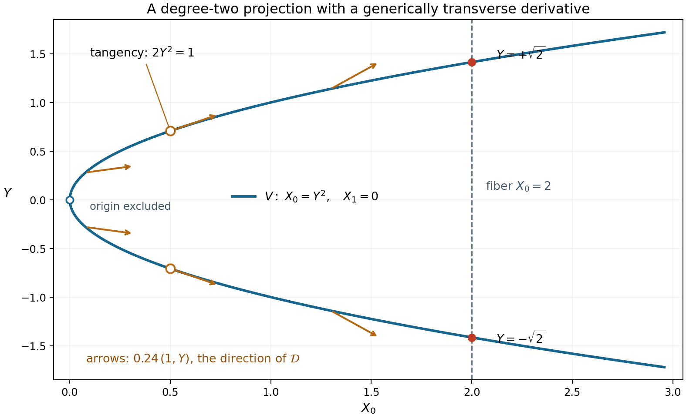
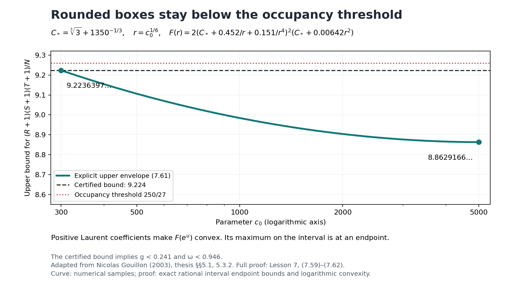
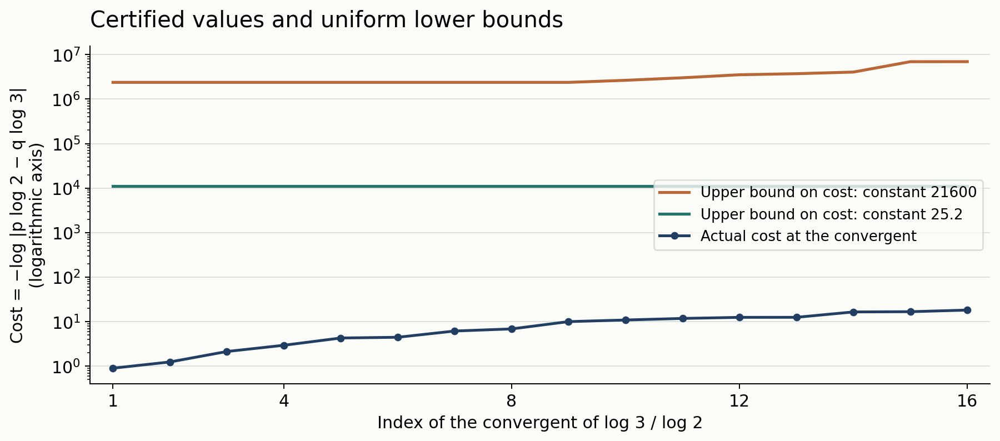

# Two logarithms II: explicit lower bounds

*Draft. Public domain (CC0).*

A parameter theorem becomes useful only after its integers and inequalities have been checked. We now make that check for arbitrary two-term logarithmic forms, including multiplicative dependence, roots of unity, nonprincipal branches and collisions in the additive grid. The resulting constant is deliberately generous: it permits every numerical estimate to be visible.

We use the preceding lesson's determinant parameter theorem and the written internal *Heights of algebraic numbers*, Theorem 2.8, for the one-place Liouville inequality. The height throughout this lesson is the absolute logarithmic Weil height. The general estimate is followed by a refined determinant argument, complete proofs of the constants \(25.2\) and \(35.1\), a rational specialization and both unit-circle estimates. We keep the centered exponents and the full perturbation Taylor expansion to obtain the sharper constants. A derivative matrix then leads to Gouillon's arithmetic and analytic comparison. We prove its polynomial bases, Taylor orders and general geometric zero estimate, and verify the exact cardinality conditions that give full row rank. Freely accessible works of [Laurent 2008], [Gouillon 2003] and [Gouillon 2006] support the full determinant proofs; [Bugeaud 2008] supplies additional rational context.

## 1. An explicit bound without multiplicative independence

**Theorem 7.1.** Let \(\alpha_1,\alpha_2\ne0\) be algebraic, choose any logarithms \(\ell_j\) of them, and put
\[
D=[\mathbb Q(\alpha_1,\alpha_2):\mathbb Q].
\]
Let \(a_j=\log A_j\) satisfy
\[
a_j\ge\max\{h(\alpha_j),|\ell_j|/D,1/D\}.
\]
For nonzero integers \(c_1,c_2\), assume
\(\Gamma=c_1\ell_1+c_2\ell_2\ne0\). Define
\[
B'=\frac{|c_1|}{Da_2}+\frac{|c_2|}{Da_1},
\qquad B=\max\{10,\log B'\}.
\]
Then
\[
\log|\Gamma|\ge-21600D^4a_1a_2B^2. \tag{7.1}
\]
No independence hypothesis is imposed on the bases. Enlarging \(a_j\) changes both the height factor and \(B'\); keep both changes when comparing bounds.

We prove the theorem in Sections 2–4. The normalizations
\[
x=Da_1\ge1,\qquad y=Da_2\ge1,\qquad t=BD\ge10,\qquad
Q=t^2xy=D^4a_1a_2B^2 \tag{7.2}
\]
will make the rounding estimates transparent.

## 2. Bounding the factorial normalization

We need the following estimate only for very large \(K\).

**Lemma 7.2.** If \(K\ge25\), then
\[
\left(\prod_{j=1}^{K-1}j!\right)^{2/(K(K-1))}
\ge\frac{K-1}{5}.
\]
Consequently, the parameter \(b\) of the preceding lesson satisfies
\[
b\le \frac{5(Rb_2+Sb_1)}{K-1}. \tag{7.3}
\]

**Proof.** Since \(\log z\) and \(z\log z\) are increasing on \([1,\infty)\),
\[
\log(j!)\ge\int_1^j\log z\,dz\ge j\log j-j,
\]
and, writing \(m=K-1\),
\[
\sum_{j=1}^{m}j\log j
\ge\int_1^m z\log z\,dz
\ge\frac{m^2}{2}\log m-\frac{m^2}{4}.
\]
Therefore the logarithm of the left side is at least
\[
\log m-
\left(1+\frac{m}{2(m+1)}+\frac{\log m}{m+1}\right).
\]
The expression in parentheses decreases for \(m\ge24\): the derivative of its last two terms is
\[
\frac{3/2+1/m-\log m}{(m+1)^2}<0.
\]
At \(m=24\), it is less than
\(1+12/25+3.18/25=1.6072<\log5\).
Exponentiating proves the first assertion. In the definition of \(b\), replace its numerator \((R-1)b_2+(S-1)b_1\) by the larger \(Rb_2+Sb_1\), and apply that assertion. \(\square\)

The elementary numerical bounds used here, and \(\log3\in(1.098,1.099)\) used below, can all be certified by the rational series for logarithms in the preceding lesson. This avoids rounded floating-point inequalities at the proof's strict boundary.

## 3. The noncolliding parameter choice

Use the inversion and sign reductions proved in the preceding lesson. In the cancellation case write
\[
\Lambda=b_2\ell_2-b_1\ell_1,\quad b_1,b_2>0,\quad
|\alpha_1|,|\alpha_2|\ge1,\quad b_1|\ell_1|\le b_2|\ell_2|.
\]
The \(a_j\), \(B'\) and \(Q\) are preserved, up to permuting indices. Suppose first that at least one base is not a root of unity. Choose
\[
\begin{aligned}
K&=\lfloor4900txy\rfloor,&L&=\lfloor4t\rfloor,\\
R_1&=\lceil4ty\rceil,&S_1&=\lceil4tx\rceil,\\
R_2&=\lceil140ty\rceil,&S_2&=\lceil140tx\rceil,
\end{aligned} \tag{7.4}
\]
and take the analytic radius \(\rho=3\).
Thus \(K\ge49000\), and every other integer is at least two.

Since \(R_1,S_1\ge L\), the multiplicative grid contains at least \(L\) distinct values, by Exercise 1 in the preceding lesson. If the second rectangle's additive map
\[
(r,s)\longmapsto rb_2+sb_1,\quad 0\le r<R_2,\ 0\le s<S_2
\]
is injective, then its cardinality satisfies
\[
R_2S_2\ge19600t^2xy\ge KL>(K-1)L. \tag{7.5}
\]
The equality allowed in the middle is harmless because the last inequality is strict.

Here are bounds incorporating every rounding error:
\[
\begin{gathered}
K\ge4899.9txy,\quad K-1\ge4899.8txy,\quad
L\le4t,\quad L-1\ge3.8t,\\
R=R_1+R_2-1\le144.1ty,\qquad
S=S_1+S_2-1\le144.1tx,\qquad
N=KL\le19600Q. \tag{7.6}
\end{gathered}
\]
For example \(R\le144ty+1\), and \(ty\ge10\). Lemma 7.2 gives
\[
b\le\frac{5(144.1)t(yb_2+xb_1)}{4899.8txy}
<B'=\frac{b_2}{x}+\frac{b_1}{y}.
\]
Therefore \(\log b\le B\). The previous theorem also proves \(b\ge L\), so its logarithm is positive.

The determinant inequality is implied by
\[
K(L-1)\log3>
2(D+1)\log N+(D+1)KB+8L(Rx+Sy). \tag{7.7}
\]
Indeed \(Dh(\alpha_j)\le Da_j\) and \(|\ell_j|\le Da_j\), so the analytic and height contribution with radius three is at most the last term.

Divide (7.7) by \(Kt\). Its left side is at least
\(3.8\log3>4.1724\). The middle contribution is at most
\[
(D+1)B/t=1+1/D\le2,
\]
and the last is at most
\[
\frac{8(4)(288.2)}{4899.9}<1.883.
\]
For the first contribution, note
\[
\log N\le\log19600+2\log t+\log(xy)\le2txy.
\]
For completeness, \(\log19600<10\), \(2\log t\le t\) for \(t\ge10\), and
\(\log(xy)\le xy-1\). The inequality
\(10+t+xy-1\le2txy\) follows by first setting \(xy=1\), then observing that the right side increases faster as \(xy\) increases. Since \(D/t=1/B\le1/10\),
\[
\frac{2(D+1)\log N}{Kt}
\le\frac{8D}{4899.9t}<0.001.
\]
The entire right side is less than \(3.884\), proving the strict inequality.

Theorem 6.3 now gives \(|\Lambda_*|>3^{-N}\), in its notation. Since
\[
N\log3<19600(1.099)Q<21550Q,
\]
this is almost (7.1). To remove the prefactor, put \(M=\max\{LR,LS\}\).
If \(|\Lambda|\ge1\), there is nothing to prove. If
\(1/M\le|\Lambda|<1\), then \(\log|\Lambda|\ge-\log M\).
Otherwise \(|\Lambda|M<1\); both exponentials in the prefactor are at most \(e\), because \(b_1,b_2\ge1\). Thus
\[
\log|\Lambda|>-N\log3-1-\log M
\ge-N\log3-1-\log L-\log R-\log S. \tag{7.8}
\]
The same lower bound follows in the intermediate case.

Using \(R\le145ty\), \(S\le145tx\), \(L\le4t\), we have
\[
1+\log L+\log R+\log S
<13+3\log t+\log(xy)
\le13+3t+xy\le t^2xy=Q.
\]
For the final inequality, the difference increases with \(xy\ge1\), and at \(xy=1\) it is \(t^2-3t-14>0\) for \(t\ge10\). Equation (7.8) therefore gives the stronger bound
\(\log|\Lambda|>-21551Q\).

## 4. Collisions, periods and the remaining reductions

If the additive rectangle in Section 3 has a collision, subtract the two pairs. There are integers \(r,s\), both nonzero, such that
\[
|r|<R_2<R,\quad |s|<S_2<S,\quad rb_2+sb_1=0.
\]
The strict inequalities \(R_2<R\), \(S_2<S\) follow from \(R_1,S_1\ge2\).
Put \(H=r\ell_1+s\ell_2\). Then
\[
H=-\frac r{b_1}\Lambda\ne0,\qquad
|\Lambda|=\frac{b_1}{|r|}|H|. \tag{7.9}
\]
If \(e^H=1\), the nonzero period has \(|H|\ge2\pi\). Hence
\(\log|\Lambda|\ge-\log R\), which is much stronger than (7.1).

If \(e^H\ne1\), height arithmetic and one-place Liouville give
\[
|e^H-1|\ge
\exp\{-D\log2-|r|Dh(\alpha_1)-|s|Dh(\alpha_2)\}
\ge\exp\{-D\log2-Rx-Sy\}.
\]
For \(|H|\le1\), \(|e^H-1|\le e|H|\); for \(|H|>1\), the desired lower estimate on \(|H|\) is automatic. By (7.9),
\[
\log|\Lambda|\ge-\log R-D\log2-Rx-Sy-1.
\]
The right side exceeds \(-44Q\): use \(Rx+Sy\le288.2txy\),
\(\log R\le R\le144.1txy\), \(D\log2\le0.1txy\), \(1\le0.1txy\), and \(t\ge10\).
Thus a collision is an easier case. We have not assumed multiplicative independence or incorrectly applied Liouville to the zero number \(e^H-1\).

If both bases are roots of unity, then \(h(e^\Gamma)=0\), regardless of the integer coefficients. When \(e^\Gamma\ne1\), Liouville gives
\(|e^\Gamma-1|\ge2^{-D}\); applying \(|e^z-1|\le e|z|\) for \(|z|\le1\) yields
\(\log|\Gamma|\ge-D\log2-1\). When \(e^\Gamma=1\), the nonzero form is a period of magnitude at least \(2\pi\). Both cases imply (7.1).

Finally, the same-sign case after inversions has the lower bound proved in the preceding lesson:
\[
\log|\Gamma|\ge-\log4-D^2(2h(\alpha_j)+\log2)
\]
for a base of modulus greater than one. This exceeds \(-Q\): \(Q\ge100D^2\), \(Q\ge100D^3a_j\), and \(h(\alpha_j)\le a_j\). If both moduli are one, inverting either base permits the cancellation setting. These cases exhaust the original form and complete the proof of Theorem 7.1. \(\square\)

## 5. Centering the exponents

The smaller constants use more information about the rectangle than the coarse bounds of Theorem 6.3. Here is the precise estimate, together with a proof.

**Lemma (centered exponent sums).** Let \(N=KL\le RS\), let \((r_j,s_j)\), \(1\le j\le N\), be distinct points in
\(\{0,\ldots,R-1\}\times\{0,\ldots,S-1\}\), and let \(\lambda_i\) be the list in which each number
\[
-\frac{L-1}{2},-\frac{L-1}{2}+1,\ldots,\frac{L-1}{2}
\]
occurs \(K\) times. Set
\[
g=\frac14-\frac{N}{12RS},\qquad
G_1=\frac{gLRN}{2},\qquad G_2=\frac{gLSN}{2}.
\]
For every permutation \(\tau\),
\[
\left|\sum_i\lambda_i r_{\tau(i)}\right|\le G_1,\qquad
\left|\sum_i\lambda_i s_{\tau(i)}\right|\le G_2. \tag{7.13}
\]

**Proof.** We prove the first bound by replacing the discrete points with intervals whose means are the same. Associate to a paired value \((\lambda_i,r_{\tau(i)})\) a measure of mass one on
\[
[\lambda_i-\tfrac12,\lambda_i+\tfrac12]
\times[r_{\tau(i)},r_{\tau(i)}+1],
\]
uniform and independent in its two coordinates. Call these coordinates \(u,v\). Summing the measures gives a marginal density \(K\) for \(u\) on \([-L/2,L/2]\); the marginal density for \(v\) on \([0,R]\) is at most \(S\), since at most \(S\) selected grid points have any fixed first coordinate. Moreover,
\[
\int uv=\sum_i\lambda_i(r_{\tau(i)}+\tfrac12)
=\sum_i\lambda_i r_{\tau(i)},
\]
because \(\sum_i\lambda_i=0\).

A measure of mass \(m\) on \([0,R]\) with density at most \(S\) has first moment between
\(m^2/(2S)\) and \(Rm-m^2/(2S)\). To see the lower bound, let \(F(v)\) be its mass in \([0,v]\), so \(F(v)\le\min\{Sv,m\}\); integration of \(m-F(v)\) over \([0,R]\) gives the first moment and the stated bound. Reflecting \(v\) about \(R/2\) gives the upper bound.

For \(0\le z\le L/2\), each of the sets \(u>z\) and \(u<-z\) has mass
\(m(z)=K(L/2-z)\). Their \(v\)-marginals still have density at most \(S\). By expressing \(u\) as its positive and negative level-set integrals,
\[
\int uv
=\int_0^{L/2}\left(\int_{u>z}v-\int_{u<-z}v\right)\,dz
\le\int_0^{L/2}\left(Rm(z)-\frac{m(z)^2}{S}\right)\,dz.
\]
The last integral equals
\[
\frac{KRL^2}{8}-\frac{K^2L^3}{24S}
=\frac{LRN}{8}-\frac{LN^2}{24S}=G_1.
\]
Replacing every \(\lambda_i\) by its negative gives the lower bound.
Interchanging \(R,S\) and the two grid coordinates proves the other assertion. \(\square\)

This proves the centered estimate used in Laurent–Mignotte–Nesterenko and Laurent's sharper determinant argument. The continuous measure is an exact device for counting the discrete rectangle, rather than a limiting approximation.

## 6. A sharper arithmetic determinant bound

We first need a useful form of Hadamard's inequality.

**Lemma (largest permutation product).** For an \(N\)-square complex matrix \(A\),
\[
|\det A|\le N^{N/2}\max_\tau\prod_i|A_{i,\tau(i)}|. \tag{7.14}
\]

**Proof.** The assertion is immediate when \(\det A=0\). Otherwise choose a nonzero permutation product of largest absolute value and permute columns so that it is the diagonal. Put \(c_{ij}=\log|A_{ij}|-\log|A_{ii}|\) for nonzero entries. Regard it as the weight of a directed edge from \(j\) to \(i\). Every directed cycle has total weight at most zero: a positive cycle would replace the corresponding diagonal entries by a larger permutation product.

Add a starting vertex with edges of weight zero to all vertices. Let \(u_i\) be the largest weight of a path from it to \(i\). This maximum exists: deleting cycles never decreases a path's weight, so a maximizing path can be chosen without repeated vertices. Then \(c_{ij}\le u_i-u_j\), whence
\[
|A_{ij}|\le |A_{ii}|e^{u_i-u_j}.
\]
Divide row \(i\) by \(|A_{ii}|e^{u_i}\) and column \(j\) by \(e^{-u_j}\). The resulting entries have modulus at most one. Hadamard bounds its determinant by \(N^{N/2}\), while the total scaling factor is exactly the largest permutation product. This proves (7.14). \(\square\)

Return to the nonzero minor of the binomial matrix in Section 6 of the preceding lesson. Write its row indices as \((k_i,\tau_i)\), and its distinct column points as \((r_j,s_j)\). Let
\[
d=[\mathbb Q(\alpha_1,\alpha_2):\mathbb Q],\qquad
\chi=[\mathbb R(\alpha_1,\alpha_2):\mathbb R]\in\{1,2\},\qquad
D_*=\frac d\chi.
\]
Here \(\chi\) is the local degree of the selected real or complex embedding; thus \(D_*\) differs from the \(D=d\) in Theorem 7.1. Suppose \(|\alpha_1|,|\alpha_2|\ge1\) at this embedding. Set
\[
\begin{gathered}
M_1=\frac{L-1}{2}\sum_jr_j,\qquad
M_2=\frac{L-1}{2}\sum_js_j,\\
b=\frac{(R-1)b_2+(S-1)b_1}{2}
\left(\prod_{k=1}^{K-1}k!\right)^{-2/(K(K-1))},
\quad T=\frac{(K-1)N}{2}.
\end{gathered} \tag{7.15}
\]
The factor \(1/2\) in this \(b\) is intentional; it was absent from the coarser theorem.

**Lemma (arithmetic bound).** The minor satisfies
\[
\begin{aligned}
\log|\Delta|\ge{}&
-\frac{D_*-1}{2}N\log N-(D_*-1)T\log b\\
&+(M_1+G_1)\log|\alpha_1|+(M_2+G_2)\log|\alpha_2|\\
&-2D_*\{G_1h(\alpha_1)+G_2h(\alpha_2)\}.
\end{aligned} \tag{7.16}
\]

**Proof.** At a nonarchimedean place \(v\), the binomial entries are integers. Expanding the determinant, using the ultrametric inequality and (7.13) for the exponents \(\tau_i-(L-1)/2\), gives
\[
\log|\Delta|_v
\le M_1\log|\alpha_1|_v+M_2\log|\alpha_2|_v
+G_1|\log|\alpha_1|_v|+G_2|\log|\alpha_2|_v|.
\]
For an archimedean embedding, shift the binomial variable to its midpoint and replace the binomial basis by its leading monomials divided by \(k!\). Within each fixed \(\tau\), these are triangular row operations of determinant one. The centered variable has absolute value at most
\(((R-1)b_2+(S-1)b_1)/2\). Each permutation product in the transformed determinant is therefore bounded by
\[
b^T|\alpha_1|^{M_1}|\alpha_2|^{M_2}
\exp\{G_1|\log|\alpha_1||+G_2|\log|\alpha_2||\}.
\]
Apply (7.14). Thus the archimedean bound has the same form as the finite-place bound, with the additional constant
\(\log C=\tfrac N2\log N+T\log b\).

Now apply the product formula to \(\Delta\ne0\), with the usual local degrees \(n_v\). The terms \(M_j\log|\alpha_j|_v\) sum to zero, and
\[
\sum_v n_v|\log|\alpha_j|_v|=2d\,h(\alpha_j).
\]
Exclude the selected embedding from the upper bounds on all other places. Its local weight is \(\chi\); the total archimedean weight remaining is \(d-\chi\). After division by \(\chi\), the constant is \((D_*-1)\log C\). At the selected embedding the excluded absolute-log term is \(G_j\log|\alpha_j|\), because the moduli are at least one. Reinsert the centering term \(M_j\log|\alpha_j|\). This gives precisely (7.16). No assertion that the midpoint exponents themselves are integral is needed; only the original binomial determinant is used at finite places. \(\square\)

The proof uses exactly the height normalization and product formula in the written internal height lesson. In particular the selected complex place has weight two; treating it as weight one would lose the sharper degree \(D_*\).

## 7. Keeping the full Taylor expansion

Laurent's refinement uses every Taylor order in the perturbation. We begin with an alternative combinatorial proof of the Taylor-order estimate used in the preceding lesson.

**Lemma (Taylor orders).** Let \(1/3\le\mu\le1\), set
\(\sigma=(1+2\mu-\mu^2)/2\), and let positive integers \(\nu_1,\ldots,\nu_q\) sum to \(N\). Then
\[
\sum_{j=1}^q\binom{\nu_j}{2}
+\mu N\sum_{j=1}^q(j-1)\nu_j
\ge\frac{\sigma N^2-N}{2}. \tag{7.17}
\]

**Proof.** On the simplex \(\sum x_j=1,\ x_j\ge0\), minimize
\(F(x)=\tfrac12\sum x_j^2+\mu\sum(j-1)x_j\).
Swapping two coordinates shows that a minimizing vector is decreasing. Transferring mass between coordinate one and any positive coordinate \(j\) gives the stationarity condition
\(x_j=x_1-(j-1)\mu\). If \(m\) coordinates are positive, their sum yields
\[
x_j=\frac1m+\left(\frac{m+1}{2}-j\right)\mu,\quad 1\le j\le m.
\]
Positivity of the last one requires \(\mu<2/(m(m-1))\); hence \(m\le2\).
For one positive coordinate the minimum is \(1/2\ge\sigma/2\).
For two it is attained at \(((1+\mu)/2,(1-\mu)/2)\), with value \(\sigma/2\).
Substitute \(x_j=\nu_j/N\) and subtract \(N/2\) to obtain (7.17). \(\square\)

**Lemma (analytic bound).** Use the same minor and quantities as in Section 6, and suppose
\(b_1|\ell_1|\le b_2|\ell_2|\). For \(\rho>1\), if
\[
|\Lambda'|\le\rho^{-\mu N},\qquad
\Lambda'=\Lambda\max\left\{
\frac{LS}{2b_2}e^{LS|\Lambda|/(2b_2)},
\frac{LR}{2b_1}e^{LR|\Lambda|/(2b_1)}
\right\},
\]
then
\[
\begin{aligned}
|\Delta|\le{}&
\rho^{-(\sigma N^2-N)/2}
N\{e^N+(e-1)^N\}\,N!(\rho b)^T\\
&\qquad{}\times|\alpha_1|^{M_1}|\alpha_2|^{M_2}
e^{\rho(G_1|\ell_1|+G_2|\ell_2|)}.
\end{aligned} \tag{7.18}
\]

**Proof.** Put \(\beta=b_1/b_2\), \(\eta=((R-1)+\beta(S-1))/2\),
\(z_j=r_j+\beta s_j-\eta\) and
\(\lambda_i=\tau_i-(L-1)/2\). The row operations of Section 6, together with \(\sum_i\lambda_i=0\), give
\[
\Delta=\alpha_1^{M_1}\alpha_2^{M_2}
\det\left(\varphi_i(z_j)e^{\lambda_i s_j\Lambda/b_2}\right),
\quad
\varphi_i(z)=\frac{b_2^{k_i}}{k_i!}z^{k_i}e^{\lambda_i\ell_1z}.
\]
Fractional powers in this identity are defined with the chosen logarithms; their absolute values are unambiguous.

Expand each row's exponential in its full power series. If
\(\mathbf n=(n_1,\ldots,n_N)\) is a tuple of nonnegative integers, its term is
\[
\Delta_{\mathbf n}=
\det\left(\varphi_i(z_j)
\frac{(\lambda_i s_j\Lambda/b_2)^{n_i}}{n_i!}\right).
\]
The series is absolutely convergent: the determinant is a finite sum over permutations, each of whose products is bounded by a product of exponential series.

Let \(m_1<\cdots<m_q\) be the distinct row orders \(n_i\), occurring with multiplicities \(\nu_1,\ldots,\nu_q\).
The function obtained by replacing \(\varphi_i(z_j)\) by \(\varphi_i(xz_j)\) has zero order at least \(\sum_j\binom{\nu_j}{2}\). Indeed two rows having both the same \(n_i\) and the same Taylor exponent of \(\varphi_i\) are proportional; their common column factor is \(z_j^h s_j^{n_i}\). Each group of \(\nu_j\) equal row orders therefore requires distinct nonnegative Taylor exponents.

For any permutation, (7.13) bounds the product of exponential factors by
\[
\exp\{|x||\ell_1|(G_1+\beta G_2)\}
\le\exp\{|x|(G_1|\ell_1|+G_2|\ell_2|)\}.
\]
The midpoint bound for \(z_j\) gives the polynomial factor \((|x|b)^T\).
Writing \(u=LS|\Lambda|/(2b_2)\), Schwarz's estimate thus yields
\[
|\Delta_{\mathbf n}|
\le\Omega\,\rho^{-\sum_j\binom{\nu_j}{2}}
\frac{u^{\sum_i n_i}}{\prod_i n_i!},
\quad
\Omega=N!(\rho b)^T
e^{\rho(G_1|\ell_1|+G_2|\ell_2|)}. \tag{7.19}
\]

Here is the complete summation. First take tuples with \(m_1=0\). Write
\(m_j=(j-1)+r_j\) for \(j\ge2\), with \(0\le r_2\le\cdots\le r_q\).
Since \(m_j!\ge(j-1)!\,r_j!\), summing the residual orders and dropping their ordering condition bounds the residual factor by
\[
\prod_{j=2}^q\sum_{r\ge0}\frac{u^{r\nu_j}}{(r!)^{\nu_j}}
\le e^{u\sum_{j=2}^q\nu_j}
\le e^{u\sum_{j=1}^q(j-1)\nu_j}.
\]
The first inequality follows by expanding
\((\sum_{r\ge0}u^r/r!)^{\nu_j}\), which includes all displayed diagonal terms.
Thus the remaining factor is at most
\[
\frac{(ue^u)^{\sum_j(j-1)\nu_j}}{\prod_j((j-1)!)^{\nu_j}}.
\]
There are \(N!/\prod\nu_j!\) assignments of the row groups. By
\(ue^u\le|\Lambda'|\le\rho^{-\mu N}\) and (7.17), their total is bounded by
\[
\Omega\rho^{-(\sigma N^2-N)/2}
\sum_{q=1}^N
\sum_{\substack{\nu_j\ge1\\\sum\nu_j=N}}
\frac{N!}{\prod\nu_j!}\prod_{j=1}^q\frac1{((j-1)!)^{\nu_j}}
\le\Omega\rho^{-(\sigma N^2-N)/2}Ne^N.
\]
The last step is the multinomial theorem with zero multiplicities allowed.

For tuples with \(m_1\ge1\), write \(m_j=j+r_j\) instead. The same reasoning uses \(\prod(j!)^{\nu_j}\) and \(\sum j\nu_j\); its latter exponent is larger than the one in (7.17). The multinomial sum is now at most \(N(e-1)^N\), since \(\sum_{j\ge1}1/j!=e-1\).
Add the two bounds and reinsert \(|\alpha_1|^{M_1}|\alpha_2|^{M_2}\).
This proves (7.18). If \(\Lambda=0\), only the tuple of all zero orders survives, and the same bound follows directly, with \(0^0=1\). \(\square\)

## 8. The refined parameter theorem

**Theorem 7.3 (Laurent's refined determinant estimate).** In the cancellation setting, use \(D_*=d/\chi\) from Section 6. Let \(K\ge2\) and \(L,R_1,R_2,S_1,S_2\ge1\) be integers satisfying
\[
\#\{\alpha_1^r\alpha_2^s:0\le r<R_1,\ 0\le s<S_1\}\ge L,
\quad
\#\{rb_2+sb_1:0\le r<R_2,\ 0\le s<S_2\}>(K-1)L.
\]
Set \(R=R_1+R_2-1,\ S=S_1+S_2-1,\ N=KL\), and define \(g,b\) by Sections 5–6. Choose \(\rho>1,\ 1/3\le\mu\le1\), and put
\(\sigma=(1+2\mu-\mu^2)/2\). Let positive real \(a_1,a_2\) satisfy
\[
a_j\ge\rho|\ell_j|-\log|\alpha_j|+2D_*h(\alpha_j).
\]
If
\[
K(\sigma L-1)\log\rho
-(D_*+1)\log N-D_*(K-1)\log b
-gL(Ra_1+Sa_2)>\epsilon(N), \tag{7.20}
\]
where
\[
\epsilon(N)=\frac2N
\log\{N!N^{-N+1}(e^N+(e-1)^N)\},
\]
then \(|\Lambda'|>\rho^{-\mu KL}\), with \(\Lambda'\) from Section 7.

**Proof.** The zero lemma proved in the preceding lesson works with \(K\ge2,\ L\ge1\) and positive side lengths; it produces a nonzero \(N\)-column minor. In particular \(N\le RS\), so the centered-sum lemma applies. Permute the bases if necessary to order \(b_1|\ell_1|\le b_2|\ell_2|\); all the hypotheses and the conclusion are symmetric.

Suppose the conclusion were false. Apply the arithmetic lower bound (7.16) and analytic upper bound (7.18). Their \(M_j\log|\alpha_j|\) terms cancel. Dividing their comparison by \(N/2\), using \(T=(K-1)N/2\) and \(2G_1/N=gLR,\ 2G_2/N=gLS\), gives
\[
\begin{aligned}
K(\sigma L-1)\log\rho\le{}&
(D_*+1)\log N+D_*(K-1)\log b+\epsilon(N)\\
&+gLR\{\rho|\ell_1|-\log|\alpha_1|+2D_*h(\alpha_1)\}\\
&+gLS\{\rho|\ell_2|-\log|\alpha_2|+2D_*h(\alpha_2)\}.
\end{aligned}
\]
This contradicts (7.20). The conclusion follows. \(\square\)

This is Theorem 1 of [Laurent 2008]. Its rank, centered-exponent, arithmetic, analytic and summation arguments have all been supplied here or in the preceding lesson. In particular no unproved arithmetic estimate from Laurent–Mignotte–Nesterenko is being used. The parameter \(\mu\) measures the relative perturbation size. Retaining its full Taylor expansion changes the zero-order coefficient from one to \(\sigma\), while allowing the perturbation threshold to use \(\mu\).

## 9. Factorials and the optimized rectangle

To specialize Theorem 7.3 sharply, we need more than the factor five in Lemma 7.2. We establish the required factorial estimate directly.

**Lemma (Stirling bounds).** For every integer \(n\ge1\),
\[
\sqrt{2\pi n}(n/e)^n<n!
<\sqrt{2\pi n}(n/e)^n e^{1/(12n)}.
\]

**Proof.** Put \(a_n=\log(n!)-(n+\tfrac12)\log n+n\). With
\(z=(2n+1)^{-1}\), the convergent logarithm series gives
\[
a_n-a_{n+1}
=(n+\tfrac12)\log(1+1/n)-1
=\sum_{j\ge1}\frac{z^{2j}}{2j+1}.
\]
This is positive and less than
\(z^2/(3(1-z^2))=1/(12n(n+1))\). Thus \(a_n\) has a finite limit \(c\), and
\(0<a_n-c<1/(12n)\).

We determine \(c\) without assuming Stirling's formula. Let
\(I_m=\int_0^{\pi/2}\sin^m v\,dv\). Integration by parts gives
\(I_m=(m-1)I_{m-2}/m\), with \(I_0=\pi/2,\ I_1=1\). Hence
\[
I_{2n}=\frac{\pi}{2}\frac{\binom{2n}{n}}{4^n},\qquad
I_{2n+1}=\frac{4^n}{(2n+1)\binom{2n}{n}}.
\]
Since \(I_{2n+1}\le I_{2n}\le I_{2n-1}\) and
\(I_{2n-1}/I_{2n+1}=(2n+1)/(2n)\), the ratio \(I_{2n}/I_{2n+1}\) tends to one. Their product is \(\pi/(2(2n+1))\); it follows that
\(\binom{2n}{n}\sqrt n/4^n\to1/\sqrt\pi\).
On the other hand, expressing this same ratio with \(a_{2n}-2a_n\) gives the limit \(\sqrt2e^{-c}\). Thus \(c=\tfrac12\log(2\pi)\). The bounds on \(a_n-c\) prove the result. \(\square\)

**Lemma (factorial product).** For \(K\ge2\),
\[
\begin{aligned}
\log\left(\prod_{j=1}^{K-1}j!\right)^{2/(K(K-1))}
\ge{}&\log(K-1)-\frac32\\
&+\frac{\log(2\pi(K-1)/\sqrt e)}{K-1}
-\frac{\log K}{6K(K-1)}.
\end{aligned} \tag{7.21}
\]

**Proof.** We first bound \(\sum_{j=1}^m j\log j\) from above. For
\(f(v)=v\log v\), integration by parts on each unit interval gives the trapezoidal error
\[
\frac{f(a)+f(a+1)}2-\int_a^{a+1}f(v)\,dv
=\frac12\int_0^1 u(1-u)f''(a+u)\,du.
\]
Because \(f''(v)=1/v\) is convex, the right side is at most
\(\tfrac1{12}\int_a^{a+1}f''(v)\,dv\).
Here is a justification of this weighted bound: symmetrize \(f''(a+u)\) about \(u=1/2\); the resulting function decreases on \([0,1/2]\), while \(u(1-u)-1/6\) increases, has one sign change there, and has integral zero. Subtracting the function's value at that sign change makes the product nonpositive on both subintervals. Reflection proves the bound on \([0,1]\).

Summing the errors yields
\[
\sum_{j=1}^m j\log j
\le\frac{m^2+m}{2}\log m-\frac{m^2}{4}
+\frac14+\frac{\log m}{12}.
\]
Use the identity
\[
\sum_{j=1}^m\log(j!)=(m+1)\log(m!)-\sum_{j=1}^m j\log j,
\]
and the Stirling lower bound. With \(K=m+1\), division by \(K(K-1)/2\) gives (7.21), even with \(\log(K-1)\) in place of \(\log K\) in the last numerator. The displayed weaker version follows. \(\square\)

We also record the optimized geometric contribution.

**Lemma (rectangle contribution).** Let \(K\ge2,\ L\ge1,\ a_1,a_2>0\), and suppose
\[
R\le1+(1+\sqrt{K-1})\sqrt{La_2/a_1},\qquad
S\le1+(1+\sqrt{K-1})\sqrt{La_1/a_2}.
\]
With \(N=KL,\ g=1/4-N/(12RS)\), one has
\[
\begin{aligned}
gL(Ra_1+Sa_2)\le{}&
\frac13 L^{3/2}\sqrt{(K-1)a_1a_2}
+\frac23L^{3/2}\sqrt{a_1a_2}
+\frac13L(a_1+a_2)\\
&-\frac{L^{3/2}\sqrt{a_1a_2}}{6(1+\sqrt{K-1})}.
\end{aligned} \tag{7.22}
\]

**Proof.** The left side equals
\[
\frac L4(Ra_1+Sa_2)-\frac{KL^2}{12}(a_1/S+a_2/R),
\]
which increases in each of \(R,S>0\). Replace them by their upper bounds.
Put \(q=K-1,\ c=1+\sqrt q,\ r=\sqrt{La_2/a_1},\
s=\sqrt{La_1/a_2},\ u=r+s\), and \(V=\sqrt{La_1a_2}\).
Then \(rs=L\), \(a_1+a_2=Vu/L\), and the proposed inequality reduces, after multiplying by positive factors, to
\[
(2q/c-u/L)(1+cu+c^2L)\le K(u+2cL).
\]
The left side minus the right side is
\[
2q/c-2cL-2cu-u/L-cu^2/L\le0.
\]
Indeed \(q\le c^2,\ L\ge1,\ u>0\). This proves (7.22). \(\square\)

These estimates supply, within the course, the factorial and rectangle inequalities used in the numerical specialization of Laurent's refined theorem. Their hypotheses allow all the rounded integers used next.

## 10. A numerical specialization with complete parameter checks

We now specialize Theorem 7.3. The following form of Laurent's Theorem 2 keeps the quantities needed to verify a numerical constant.

**Theorem 7.4.** Suppose that \(\alpha_1,\alpha_2\) are multiplicatively independent, with moduli at least one and chosen logarithms \(\ell_j\). Use \(D_*=d/\chi\) as above. Choose \(\rho>1,\ 1/3\le\mu\le1\), and define
\[
\sigma=\frac{1+2\mu-\mu^2}{2},\quad
\lambda=\sigma\log\rho,\quad
H=\frac{h_0}{\lambda}+\frac1\sigma,\quad
\omega=2\left(1+\sqrt{1+\frac1{4H^2}}\right),\quad
\theta=\sqrt{1+\frac1{4H^2}}+\frac1{2H}.
\]
Let \(a_j\ge\max\{1,\rho|\ell_j|-\log|\alpha_j|+2D_*h(\alpha_j)\}\), with \(a_1a_2\ge\lambda^2\), and assume
\[
h_0\ge\max\left\{
D_*\left(\log\left(\frac{b_1}{a_2}+\frac{b_2}{a_1}\right)+\log\lambda+1.75\right)+0.06,\
\lambda,\ \frac{D_*\log2}{2}\right\}.
\]
Define
\[
C=\frac{\mu}{\lambda^3\sigma}
\left(\frac{\omega}{6}+\frac12
\sqrt{\frac{\omega^2}{9}
+\frac{8\lambda\omega^{5/4}\theta^{1/4}}{3\sqrt{a_1a_2}\sqrt H}
+\frac43\left(\frac1{a_1}+\frac1{a_2}\right)\frac{\lambda\omega}{H}}
\right)^2,
\quad
C'=\sqrt{\frac{C\sigma\omega\theta}{\lambda^3\mu}}.
\]
Then, with \(U_0=h_0+\lambda/\sigma\),
\[
\log|\Lambda|
\ge-CU_0^2a_1a_2-\sqrt{\omega\theta}\,U_0
-\log(C'U_0^2a_1a_2). \tag{7.23}
\]

The symbol \(h_0\) is a positive real parameter, distinct from the height function.

**Proof.** Choose the unique integer \(L\) in
\[
H+\sqrt{H^2+\tfrac14}-\tfrac12<L
\le H+\sqrt{H^2+\tfrac14}+\tfrac12.
\]
Put
\[
U=\lambda(L-H),\quad V=L/3,\quad
W=\frac13\left(\frac1{a_1}+\frac1{a_2}+\frac{2\sqrt L}{\sqrt{a_1a_2}}\right),
\quad
k=\left(\frac{V}{2U}+\frac12\sqrt{\frac{V^2}{U^2}+\frac{4W}{U}}\right)^2.
\]
Thus \(kU-\sqrt k\,V-W=0\). Finally choose
\[
\begin{gathered}
K=1+\lfloor kLa_1a_2\rfloor,\\
R_1=1+\lfloor\sqrt{La_2/a_1}\rfloor,\quad
S_1=1+\lfloor\sqrt{La_1/a_2}\rfloor,\\
R_2=1+\lfloor\sqrt{(K-1)La_2/a_1}\rfloor,\quad
S_2=1+\lfloor\sqrt{(K-1)La_1/a_2}\rfloor.
\end{gathered} \tag{7.24}
\]

We verify the needed size estimates first. Since \(H\ge2\),
\[
\frac{3+\sqrt{17}}4\le\sqrt{\omega/\theta}<L/H
\le\sqrt{\omega\theta}\le\frac{5+\sqrt{17}}4.
\]
For any half integer \(\gamma\ne2\),
\[
\omega^{\gamma/2}\theta^{-|\gamma/2-1|}H^{\gamma-1}
\le\frac{L^\gamma}{L-H}
\le\omega^{\gamma/2}\theta^{|\gamma/2-1|}H^{\gamma-1}, \tag{7.25}
\]
and
\[
4H\le\frac{L^2}{L-H}\le\omega H.
\]
To check (7.25), differentiate \(x^\gamma/(x-H)\): its derivative has the sign of \(\gamma(x-H)-x\). On the chosen interval it is negative for \(\gamma\le3/2\), because \(x/H\le(5+\sqrt{17})/4<3\); it is positive for \(\gamma\ge5/2\), because \(x/H>(3+\sqrt{17})/4>5/3\). Substituting the two interval endpoints gives (7.25). For \(\gamma=2\), the minimum is at \(2H\), and the two endpoints give the same upper value \(\omega H\).

In particular \(L\ge4\). Also \(K\ge8\). Here is an explicit lower estimate that checks the latter assertion, using \(a_1a_2\ge\lambda^2\) and \(a_1+a_2\ge2\sqrt{a_1a_2}\) in the definition of \(k\):
\[
\sqrt{kLa_1a_2}\ge
\frac{\omega^{3/4}\sqrt H}{6\theta^{1/4}}
+\frac12\sqrt{
\frac{\omega^{3/2}H}{9\sqrt\theta}
+\frac{8\omega^{3/4}\sqrt H}{3\theta^{1/4}}
+\frac{8\sqrt\omega}{3\sqrt\theta}}.
\]
The right side increases with \(H\): express its terms through the increasing functions \(H\omega=2H+\sqrt{4H^2+1}\) and
\(\sqrt{\omega/\theta}=1+\sqrt{1+1/(4H^2)}-1/(2H)\).
At \(H=2\) it exceeds \(2.66>\sqrt7\), so \(1+\lfloor kLa_1a_2\rfloor\ge8\). Consequently \(N=KL\ge32\).

Write \(b''=b_1/a_2+b_2/a_1\), \(g_0=\gcd(b_1,b_2)\).
First suppose
\[
b''>2\mu\lambda\sigma^{-1}kL^2g_0. \tag{7.26}
\]
The additive rectangle is injective. Indeed, since
\[
\sqrt k\,L\ge\frac{L^2}{3\lambda(L-H)}\ge\frac{4H}{3\lambda},
\quad \frac{\mu}{\sigma}\ge\frac37,
\]
we have \(\mu\lambda\sigma^{-1}\sqrt k\,L\ge4H/7>1\).
Condition (7.26) forces either
\[
b_1/g_0>\mu\lambda\sigma^{-1}\sqrt k\,L
\sqrt{(K-1)La_2/a_1},
\]
or the corresponding bound on \(b_2/g_0\) with the ratio reversed.
Thus \(b_1/g_0>R_2-1\) or \(b_2/g_0>S_2-1\).
An additive collision would force these coprime integers to divide the two nonzero coordinate differences, contradicting that bound.
Therefore the additive cardinality is \(R_2S_2>(K-1)L\).
Multiplicative independence gives multiplicative cardinality \(R_1S_1>L\).

For the factorial parameter, (7.21) and (7.24) give
\[
b\le
\frac{(1+\sqrt{K-1})\sqrt K}{2(K-1)\sqrt k}\,
b''\exp\left\{\frac32-
\frac{\log(2\pi(K-1)/\sqrt e)}{K-1}
+\frac{\log K}{6K(K-1)}\right\}.
\]
Using \(\sqrt k\ge(3+\sqrt{17})/(12\lambda)\), this implies
\[
\log b\le\log(\lambda b'')-
\frac{\log(2\pi K/\sqrt e)}{K-1}+f(K),
\]
where
\[
f(x)=\log\frac{(1+\sqrt{x-1})\sqrt x}{x-1}
+\frac{\log x}{6x(x-1)}+\frac32
+\log\frac6{3+\sqrt{17}}
+\frac{\log(x/(x-1))}{x-1}.
\]
Every nonconstant term decreases for \(x>1\). For the first term set \(q=\sqrt{x-1}\); its derivative with respect to \(q\) is
\(-\{q^2+q+2\}/\{q(q+1)(q^2+1)\}<0\).
The other two decrease directly, using
\(\log x>(x-1)/x\).
Since \(f(8)<1.75\), the hypothesis on \(h_0\) yields
\[
\log b\le\frac{h_0-0.06}{D_*}
-\frac{\log(2\pi K/\sqrt e)}{K-1}. \tag{7.27}
\]

We now check the strict analytic inequality of Theorem 7.3. Insert (7.27) and (7.22) into its left side. The result is at least \(\Phi+\Theta\), where
\[
\begin{aligned}
\Phi={}&K(\lambda L-h_0-\lambda/\sigma)
-\frac{L^{3/2}\sqrt{(K-1)a_1a_2}}3
-\frac{2L^{3/2}\sqrt{a_1a_2}}3-\frac{L(a_1+a_2)}3,\\
\Theta={}&0.06(K-1)+h_0+
\frac{L^{3/2}\sqrt{a_1a_2}}{6(1+\sqrt{K-1})}
+D_*\log(2\pi K/\sqrt e)-(D_*+1)\log(KL).
\end{aligned}
\]
Because \(K\ge kLa_1a_2,\ K-1\le kLa_1a_2\), and
\(\lambda L-h_0-\lambda/\sigma=U>0\),
\[
\Phi\ge La_1a_2(kU-\sqrt k\,V-W)=0.
\]
Condition (7.26) gives
\[
\lambda b''\ge\frac{32}{21}H^2,
\]
by the lower bound on \(\sqrt k\,L\).
In particular \(h_0>3.6\), and
\(L^{3/2}\sqrt{a_1a_2}\ge2L\lambda>12\).

Use the lower bound on \(h_0\) in \(\Theta\). It gives
\(\Theta\ge(D_*-1)\Theta_0+\Theta_1\), with
\[
\Theta_0=\log(\lambda b'')+1.75-\log L+\log(2\pi/\sqrt e)>3,
\]
and
\[
\Theta_1\ge0.06K-\log K+c_0+\frac2{1+\sqrt{K-1}},
\quad
c_0=-2\log\frac{5+\sqrt{17}}4+\log\frac{2\pi}{\sqrt e}
+\log\frac{32}{21}+1.75.
\]
The last function is strictly convex for \(K>1\). Its derivative is negative at \(19\) and positive at \(20\), so its minimum lies in that interval. Its value at \(19\) exceeds \(0.437\), and its derivative there exceeds \(-0.002\); the tangent-line bound gives a minimum exceeding \(0.435>0.4\).

On the other hand, the proved Stirling upper bound gives, for \(N\ge32\),
\[
\epsilon(N)\le\frac2N\left\{\frac32\log N+
\frac12\log(2\pi)+\frac1{12N}
+\log\left(1+\left(\frac{e-1}{e}\right)^N\right)\right\}<0.4.
\]
Each term divided by \(N\) decreases for \(N\ge32\), and substitution at \(32\) verifies the strict inequality. Hence \(\Phi+\Theta>\epsilon(N)\), as required. Theorem 7.3 applies.

To express its conclusion in the original parameters, the definition of \(k\) gives
\[
\sqrt k\,L=
\frac{L^2}{6U}+\frac12\sqrt{
\frac{L^4}{9U^2}+
\frac{8L^{5/2}}{3U\sqrt{a_1a_2}}
+\frac43\left(\frac1{a_1}+\frac1{a_2}\right)\frac{L^2}{U}}.
\]
Apply (7.25) and its \(\gamma=2\) counterpart, with \(U=\lambda(L-H)\).
Substitution in this displayed expression proves
\[
\mu\lambda\sigma^{-1}kL^2a_1a_2\le CU_0^2a_1a_2.
\]
Since \(KL\le L+kL^2a_1a_2\) and
\(\mu\lambda\sigma^{-1}L\le\lambda L\le\sqrt{\omega\theta}\,U_0\), we obtain
\[
\log|\Lambda'|\ge-CU_0^2a_1a_2-\sqrt{\omega\theta}\,U_0. \tag{7.28}
\]

We remove its prefactor explicitly. Applying (7.25) with exponents
\(3,4,9/2\) to the expression for \(\sqrt k\,L^2\) proves
\[
\sqrt k\,L^2\le C'U_0^2,\qquad
C'U_0^2a_1a_2>e^2,\qquad C'/C<4.
\]
For the middle inequality, the lower bound
\[
\sqrt k\,L^2>
\frac{\omega^{3/2}\theta^{-1/2}H^2}{3\lambda}
\]
and \(a_1a_2\ge\max\{1,\lambda^2\}\) give
\(C'U_0^2a_1a_2>4(3+\sqrt{17})/3>e^2\).
For the last, ignore the positive supplementary terms in the radical defining \(C\), obtaining
\(C'/C\le3(\sigma/\mu)\sqrt{\theta/\omega}<4\).
The same lower estimate gives
\[
L\le\frac{3\theta}{2\omega}\sqrt k\,L^2a_1a_2.
\]
Using \(a_j\ge1,\ K\ge8\) and (7.24), it follows that
\[
\max\{LR,LS\}\le
\left\{\frac32\left(\frac4{3+\sqrt{17}}\right)^2
+1+\frac1{\sqrt7}\right\}\sqrt k\,L^2a_1a_2
<1.86C'U_0^2a_1a_2.
\]
Write \(Q_0=CU_0^2a_1a_2\), \(A_0=C'U_0^2a_1a_2\).
We have \(Q_0\ge(16/21)H^2>3\) and
\(\sqrt{\omega\theta}U_0\ge D_*\log2\).
Unless (7.23) is already true, we may assume
\(\log|\Lambda|\le-Q_0-D_*\log2-2\le-Q_0-2.6\).
Then
\[
\frac{|\Lambda|}{2}\max\{LR,LS\}
\le3.72Q_0e^{-Q_0-2.6}\le12e^{-5.6}.
\]
Consequently each exponential in the prefactor is at most \(e^{12e^{-5.6}}\), and
\[
|\Lambda'|\le0.53|\Lambda|\max\{LR,LS\}
<|\Lambda|A_0.
\]
Combine this with (7.28) to prove (7.23) when (7.26) holds.

It remains to cover the complementary case. Put \(b_j^*=b_j/g_0\).
Multiplicative independence ensures
\(\gamma=\alpha_2^{b_2^*}\alpha_1^{-b_1^*}\ne1\).
The weighted product formula, applied to \(\gamma-1\) and excluding the chosen place, gives
\[
\log\frac{|\gamma-1|}{\max\{1,|\gamma|\}}
\ge-D_*h(\gamma)-(D_*-1)\log2.
\]
For any logarithm \(z\) of \(\gamma\),
\(|e^z-1|\le|z|\max\{1,|e^z|\}\), by integrating \(e^{tz}\) for \(0\le t\le1\).
Thus
\[
\log|\Lambda|\ge
-D_*\{b_1^*h(\alpha_1)+b_2^*h(\alpha_2)+\log2\}
\ge-\tfrac12\left(\frac{b_1^*}{a_2}+\frac{b_2^*}{a_1}\right)a_1a_2-D_*\log2.
\]
The complementary inequality to (7.26) bounds this below by
\(-Q_0-\sqrt{\omega\theta}U_0\). Since \(A_0>e^2\), it also implies (7.23).
This completes the proof. \(\square\)

**Corollary 7.5 (Laurent's constant \(25.2\)).** Let \(\alpha_1,\alpha_2\) be multiplicatively independent nonzero algebraic numbers, with any chosen logarithms. Set \(D_*=d/\chi\), and choose
\[
a_j^0=\log A_j\ge\max\{h(\alpha_j),|\ell_j|/D_*,1/D_*\}.
\]
For integers \(c_1,c_2\), not both zero, put
\[
B'=\frac{|c_1|}{D_*a_2^0}+\frac{|c_2|}{D_*a_1^0},\quad
M=\max\{\log B'+0.21,\ 20/D_*,\ 1\}.
\]
Then
\[
\log|c_1\ell_1+c_2\ell_2|
\ge-25.2D_*^4a_1^0a_2^0M^2. \tag{7.29}
\]

**Proof.** In the cancellation setting apply Theorem 7.4 with
\[
\rho=6.3,\quad\mu=0.56,\quad
h_0=D_*M,\quad a_j=(\rho+2)D_*a_j^0.
\]
The height inequalities are immediate; \(a_j\ge8.3\) and
\(a_1a_2\ge8.3^2>\lambda^2\).
Also \(h_0\ge20,\ h_0\ge D_*\), so the last two cutoffs hold.
For the coefficient cutoff, \(b''=B'/8.3\), and
\[
-\log8.3+\log\lambda+1.81<0.21.
\]
Since \(D_*\ge1\), this verifies the full cutoff, including its additive \(0.06\).

For fixed \(\mu,\rho\), write (7.23) as
\(\log|\Lambda|\ge-C''h_0^2a_1a_2\), where
\[
C''=\left(1+\frac{\lambda}{h_0\sigma}\right)^2
\left\{C+\frac{\sqrt{\omega\theta}}{U_0a_1a_2}
+\frac{\log(C'U_0^2a_1a_2)}{U_0^2a_1a_2}\right\}. \tag{7.30}
\]
This coefficient decreases in \(h_0,a_1,a_2\). To check the only less immediate term, put \(A_0=C'U_0^2a_1a_2>e^2\).
The explicit formula for \(C'\) shows that \(A_0\) increases in all three variables: its terms are positive products of \(H\omega\), \(H\theta\), \(a_1,a_2\), all with positive powers. Meanwhile \(C'\) decreases. Since \(\log v/v\) is positive and decreases for \(v>e\), the product
\(C'\log A_0/A_0=\log A_0/(U_0^2a_1a_2)\) decreases.
Every other factor in (7.30) decreases directly.

It therefore suffices to substitute \(h_0=20,\ a_1=a_2=8.3\).
The [exact interval certificate](../verification/laurent_constant.py) for these expressions gives
\[
25.1203<C''(8.3)^2<25.1205<25.2.
\]
Substitution in (7.30) proves (7.29).

We finish the reductions, rather than assuming the cancellation notation exhausts all signs. In the same-sign case after inversions, Section 1 of the preceding lesson bounds the form below by
\(\exp\{-\log4-d^2(2h(\alpha_j)+\log2)\}\).
Since \(d\le2D_*\), \(a_j^0\ge1/D_*\), \(M\ge\max\{20/D_*,1\}\), and \(D_*M\ge20\), this is stronger than (7.29). For example the height term is at most \(8D_*^2a_j^0\), while the magnitude on the right of (7.29) is at least \(25.2D_*^3a_j^0M^2\); the ratio is at most \(8/(25.2D_*M^2)\le8/(25.2\cdot20)\). The constant terms are at most \(6D_*^2\), whose ratio to the target magnitude is at most \(6/(25.2M^2)\le6/25.2\). The sum of these two ratios is less than one. If both moduli are one, invert either base to enter the cancellation case.

If exactly one coefficient is zero, the selected-place logarithm bound in the proof of Theorem 7.4 gives
\(\log|\ell_j|\ge-D_*(h(\alpha_j)+\log2)\).
Multiplicative independence excludes \(\alpha_j=1\).
The nonzero integer coefficient cannot decrease its absolute value, and this lower bound is stronger than (7.29) by the same cutoffs. Thus all stated cases are covered. \(\square\)

### Laurent's numerical families

The cutoff \(20/D_*\) in Corollary 7.5 balances the leading constant
against the size of the coefficients. Other cutoffs give useful bounds
for different ranges. The following complete family is due to
[Laurent 2008].

**Corollary (complex and positive-real families).** Under the hypotheses
of Corollary 7.5, retain \(a_j^0,B'\), and let \(m\) be any even
integer from \(10\) through \(30\). Put
\[
M_1(m)=\max\{\log B'+0.21,m/D_*,1\}.
\]
For the constant \(C_1(m)\) in the table below,
\[
\log|c_1\ell_1+c_2\ell_2|
\ge-C_1(m)D_*^4a_1^0a_2^0M_1(m)^2.
\]
If both bases exceed one and the chosen logarithms are positive real,
use \(D_*=[\mathbb Q(\alpha_1,\alpha_2):\mathbb Q]\) and put
\[
M_2(m)=\max\{\log B'+0.38,m/D_*,1\}.
\]
Then the stronger real bound is
\[
\log|c_1\ell_1+c_2\ell_2|
\ge-C_2(m)D_*^4a_1^0a_2^0M_2(m)^2.
\]
Both assertions permit arbitrary integer coefficients that are not both
zero. The bases remain multiplicatively independent. The parameter
pairs in the table make the numerical verification reproducible.

| \(m\) | \(C_1\) | \(\mu_1\) | \(\rho_1\) | \(C_2\) | \(\mu_2\) | \(\rho_2\) |
|---:|---:|---:|---:|---:|---:|---:|
| 10 | 32.3 | 0.54 | 5.9 | 25.2 | 0.52 | 5.0 |
| 12 | 29.9 | 0.54 | 6.0 | 23.4 | 0.53 | 5.1 |
| 14 | 28.2 | 0.55 | 6.1 | 22.1 | 0.54 | 5.2 |
| 16 | 26.9 | 0.56 | 6.2 | 21.1 | 0.55 | 5.2 |
| 18 | 26.0 | 0.56 | 6.3 | 20.3 | 0.55 | 5.3 |
| 20 | 25.2 | 0.56 | 6.3 | 19.7 | 0.56 | 5.3 |
| 22 | 24.5 | 0.57 | 6.4 | 19.2 | 0.56 | 5.4 |
| 24 | 24.0 | 0.57 | 6.4 | 18.8 | 0.56 | 5.4 |
| 26 | 23.5 | 0.57 | 6.4 | 18.4 | 0.57 | 5.4 |
| 28 | 23.1 | 0.57 | 6.5 | 18.1 | 0.57 | 5.4 |
| 30 | 22.8 | 0.58 | 6.5 | 17.9 | 0.57 | 5.5 |

**Proof.** First take two nonzero coefficients in the cancellation
setting. For the complex family choose \(\rho=\rho_1,\mu=\mu_1\),
\(h_0=D_*M_1(m)\), and \(a_j=(\rho+2)D_*a_j^0\).
The height and product conditions of Theorem 7.4 follow exactly as in
Corollary 7.5. For every row of the table, the
[rational interval certificate](../verification/laurent_families.py) verifies
\[
-\log(\rho+2)+\log\lambda+1.81<0.21,\qquad
\lambda<m,\qquad \lambda<\rho+2.
\]
Since \(D_*\ge1\), the first inequality includes the additive
\(0.06\) in the coefficient cutoff. The other two, together with
\(M_1(m)\ge1\), verify all remaining hypotheses.

The monotonicity of \(C''\) proved in Corollary 7.5 holds for every
fixed pair \((\rho,\mu)\). Therefore
\[
C''(h_0,a_1,a_2)(\rho+2)^2
\le C''(m,\rho+2,\rho+2)(\rho+2)^2<C_1(m).
\]
The last strict inequality is certified for every row using outward
rational intervals. Substitution into (7.30) proves the complex bound.

For the real family choose \(\rho=\rho_2,\mu=\mu_2\),
\(h_0=D_*M_2(m)\), and \(a_j=(\rho+1)D_*a_j^0\).
The improvement of one in this scale comes from
\[
\rho|\ell_j|-\log|\alpha_j|+2D_*h(\alpha_j)
=(\rho-1)\ell_j+2D_*h(\alpha_j)
\le(\rho+1)D_*a_j^0.
\]
The same certificate proves
\[
-\log(\rho+1)+\log\lambda+1.81<0.38,\qquad
\lambda<m,\qquad \lambda<\rho+1,
\]
and
\(C''(m,\rho+1,\rho+1)(\rho+1)^2<C_2(m)\).
Thus all hypotheses and the conclusion follow as before.

For arbitrary signs and a single nonzero coefficient, use the reductions
in Corollary 7.5. Their estimates remain stronger throughout both
families. Indeed \(D_*M_i(m)\ge m\), \(M_i(m)\ge1\), and the
sum of the two coarse ratios used there is at most
\[
\frac{8}{C_i(m)m}+\frac{6}{C_i(m)}<0.39<1
\]
for every entry. Multiplicative independence supplies nonvanishing.
This completes all coefficient cases. \(\square\)

For example, the positive-real bound at \(m=20\) has constant
\(19.7\), while the complex bound at \(m=30\) has constant
\(22.8\). One may evaluate all eleven expressions and take their
largest lower bound: decreasing the leading constant also increases
the cutoff, so the last row need not give the best bound for a given
form.

## 11. A sharper bound when the real bases are close to one

For positive real bases, a large admissible radius reduces the main coefficient by a factor \((\log E)^3\). The height condition must accompany this gain: a tiny real logarithm by itself does not imply a small Weil height.

**Theorem 7.6 (Laurent–Mignotte–Nesterenko).** Let \(\alpha_1,\alpha_2\) be multiplicatively independent positive real algebraic numbers. Write \(D=[\mathbb Q(\alpha_1,\alpha_2):\mathbb Q]\), use real logarithms, and choose
\[
a_j^0=\log A_j\ge\max\{h(\alpha_j),|\log\alpha_j|/D,1/D\}.
\]
For integers \(c_1,c_2\), not both zero, set
\[
B'=\frac{|c_1|}{Da_2^0}+\frac{|c_2|}{Da_1^0}.
\]
Suppose
\[
2\le E\le 1+\min_j\frac{Da_j^0}{|\log\alpha_j|},
\qquad E\le\min_j A_j^{3D/2},
\]
and put
\[
v=\log E,\qquad
M_E=\max\{\log B'+\log v+0.47,\ 10v/D,\ 1/2\}.
\]
Then
\[
\log|c_1\log\alpha_1+c_2\log\alpha_2|
\ge-\frac{35.1D^4a_1^0a_2^0M_E^2}{v^3}. \tag{7.31}
\]

A rational specialization appears in the freely readable author version [Bugeaud 2008]. We prove the full algebraic estimate from the parameter theorem of [Laurent 2008], using the complete determinant argument above and a slightly smaller intermediate coefficient.

**Proof.** Invert bases below one and change their coefficient signs. Heights and absolute logarithms are preserved. The bases are now greater than one. In the cancellation case, apply Theorem 7.4 with
\[
\rho=E,\quad\mu=0.56,\quad\sigma=0.9032,\quad
\lambda=\sigma v,\quad h_0=DM_E,\quad
a_j=\tfrac72 Da_j^0.
\]
Indeed,
\[
(\rho-1)|\log\alpha_j|+2Dh(\alpha_j)\le3Da_j^0<a_j.
\]
The cutoffs give \(Da_j^0\ge\max\{1,2v/3\}\), so \(a_j\ge1\) and \(a_1a_2\ge\lambda^2\). Also \(h_0\ge10v,\ h_0\ge D/2\), which verifies the radius and \(D\log2/2\) cutoffs. Since \(b''=2B'/7\) and
\[
\log\sigma-\log(7/2)+1.81<0.47,
\]
the coefficient cutoff, including its additive \(0.06\), follows from \(D\ge1\).

We bound the coefficient \(C''\) from (7.30). Its established monotonicity allows us to replace \(h_0\) by \(10v\) and both \(a_j\) by \(7v/3\). These values are admissible for the coefficient formulas because \(v\ge\log2\). At these values let
\[
H=\frac{11}{\sigma},\quad
\omega=2\left(1+\sqrt{1+\frac1{4H^2}}\right),\quad
\theta=\sqrt{1+\frac1{4H^2}}+\frac1{2H},
\]
and define the constants
\[
\begin{aligned}
c&=\frac{\mu}{\sigma^4}
\left\{\frac{\omega}{6}
+\frac12\sqrt{\frac{\omega^2}{9}
+\frac{8\sigma(3/7)\omega^{5/4}\theta^{1/4}}{3\sqrt H}
+\frac83(3/7)\frac{\sigma\omega}{H}}\right\}^{\!2},\\
c'&=\sqrt{\frac{c\omega\theta}{\sigma^2\mu}},\qquad
c_A=\frac{5929}{9}c'.
\end{aligned}
\]
Then \(C=c/v^3,\ C'=c'/v^3,\ U_0=11v\), and \(C'U_0^2a_1a_2=c_Av\). Consequently,
\[
\left(\tfrac72\right)^2v^3C''
\le \frac{5929}{400}
\left\{c+\frac{9\sqrt{\omega\theta}}{539}
+\frac{9\log(c_Av)}{5929v}\right\}. \tag{7.32}
\]
The exact interval certificate verifies \(c_A\log2>e\). The function \(\log(c_Av)/v\) therefore decreases for \(v\ge\log2\). Substitution of \(v=\log2\), with outward rational rounding, bounds the right side of (7.32) by \(34.41890783<35.1\). Since
\[
h_0^2a_1a_2=(7/2)^2D^4M_E^2a_1^0a_2^0,
\]
Theorem 7.4 proves (7.31) in the cancellation case.

For completeness, a single nonzero coefficient or two coefficients of the same sign also satisfy the result. The logarithm is then at least one of the positive real logarithms in absolute value. The selected-place product formula used in Theorem 7.4 gives
\(\log|\log\alpha_j|\ge-D(h(\alpha_j)+\log2)\).
Writing \(s_j=Da_j^0\), the target magnitude
\(T=35.1h_0^2s_1s_2/v^3\) satisfies
\[
T\ge2340s_j,\qquad T\ge78D.
\]
The first inequality uses \(h_0\ge10v\) and \(s_{3-j}\ge2v/3\); the second uses \(h_0^2\ge(10v)(D/2)\) and \(s_1s_2\ge4v^2/9\). Hence
\((s_j+D\log2)/T\le1/2340+\log2/78<1\), proving the remaining cases. \(\square\)

### An absolute cutoff, including dependent bases

An absolute term in the coefficient cutoff permits a simple bound valid
for dependent bases as well. The next deduction uses the complete proof
of Theorem 7.6 and the height inequality; its cutoff is part of its statement.

**Corollary (an absolute coefficient cutoff).** Let
\(\alpha_1,\alpha_2>1\) be real algebraic numbers and set
\(D=[\mathbb Q(\alpha_1,\alpha_2):\mathbb Q]\). Choose
\[
a_j\ge\max\{h(\alpha_j),\log\alpha_j/D,1/D\}.
\]
Let \(c_1,c_2\) be integers such that
\(\Gamma=c_1\log\alpha_1+c_2\log\alpha_2\ne0\), and define
\[
\begin{gathered}
B'=\frac{|c_1|}{Da_2}+\frac{|c_2|}{Da_1},\qquad v=\log E,\\
2\le E\le1+\min_j\frac{Da_j}{\log\alpha_j},\\
E\le\min_j\exp(3Da_j/2),\\
W=\max\{3/D,\log B'/v,1\}.
\end{gathered}
\]
Then, without a multiplicative-independence hypothesis,
\[
\log|\Gamma|\ge-\frac{390D^4a_1a_2}{v}W^2. \tag{7.76}
\]
The same statement follows with the larger constant \(78500\).
The cutoff \(1\) in \(W\) is retained in both statements.

**Proof.** First suppose that the bases are multiplicatively independent.
Put \(U=vW=\max\{3v/D,\log B',v\}\). Since
\(\log v\le v-1\), we have
\[
\begin{aligned}
\log B'+\log v+0.47&\le2U-0.53<2U,\\
10v/D&\le(10/3)U,\\
1/2&\le(10/3)U.
\end{aligned}
\]
The last inequality follows from \(U\ge v\ge\log2\).
Thus \(M_E\le(10/3)U\) in Theorem 7.6, and
\(35.1(10/3)^2=390\) proves (7.76).

Now suppose that the bases are dependent. Their real logarithms have
a positive rational ratio. There are relatively prime positive integers
\(r,s\) with \(\alpha_1^r=\alpha_2^s\). Choose integers
\(p,q\) with \(sp+rq=1\), and put
\(\beta=\alpha_1^p\alpha_2^q\). Taking real logarithms gives
\[
\begin{gathered}
\beta>1,\qquad \beta^s=\alpha_1,\qquad \beta^r=\alpha_2,\\
\Gamma=(c_1s+c_2r)\log\beta.
\end{gathered}
\]
The integer in the last expression is nonzero, so
\(|\Gamma|\ge\log\beta\). Also \(\beta\) belongs to the same
number field and
\[
h(\beta)=h(\alpha_1)/s=h(\alpha_2)/r\le a_j
\quad(j=1,2).
\]
Apply the one-place height inequality to
\(\gamma=1-\beta^{-1}\ne0\). Its degree is at most \(D\), and
\(h(\gamma)\le h(\beta)+\log2\). Consequently
\[
\log\beta\ge1-\beta^{-1}
\ge\exp\{-D(h(\beta)+\log2)\},
\]
and \(\log|\Gamma|\ge-Da_j-D\log2\).

Write \(s_j=Da_j\) and let \(T=390D^4a_1a_2W^2/v\).
The height and radius cutoffs give \(s_j\ge1\) and
\(s_j\ge2v/3\). Using \(W\ge1\), we obtain
\[
T\ge\frac{390D^2s_1s_2}{v}
\ge260D^2s_j\ge260D.
\]
Therefore
\[
\frac{Da_j+D\log2}{T}
\le\frac1{260D^2}+\frac{\log2}{260D}<1.
\]
The elementary dependent-base bound is stronger than (7.76).
This also covers a zero coefficient, provided \(\Gamma\ne0\).
\(\square\)

The [cutoff certificate](../verification/real_radius_cutoff.py) checks the
scalar margins and actual dependent forms in fields generated by
roots of \(X^D-2\). The proof above supplies the uniform argument;
finite numerical checks are supplementary.

## 12. A rational number close to one

**Corollary 7.7.** Let \(x_1,x_2,y_1,y_2\) be positive integers with
\[
x_1\ge2,\quad x_1\ne y_1,\quad
y_2<x_2\le\tfrac65y_2.
\]
Let \(b\ge1\) be an integer, and suppose
\((x_1/y_1)^b\ne x_2/y_2\). Define \(\eta>0\) by
\[
\frac{x_2}{y_2}=1+x_2^{-\eta}.
\]
Then \(0<\eta<1,\ \eta\log x_2>1\), and
\[
\log\left|(y_1/x_1)^b(x_2/y_2)-1\right|
\ge-\frac{35.2}{\eta}\log x_1
\left(\max\left\{1+\frac{\log b}{\eta\log x_2},10\right\}\right)^2.
\tag{7.33}
\]

**Proof.** Put \(\delta=|(y_1/x_1)^b(x_2/y_2)-1|\) and \(E=x_2^\eta=y_2/(x_2-y_2)\). The hypotheses give \(E\ge5,\ x_2\ge6\), and \(E<x_2\). Thus \(0<\eta<1\) and \(\eta\log x_2=\log E\ge\log5>1\).

Several cases have elementary stronger bounds. If \(y_1>x_1\), then \(\delta\ge1/x_1\). If \(y_1<x_1\le5\), then \(\delta\ge1-24/25=1/25\). If the two ratios above one are multiplicatively dependent, their prime-exponent vectors lie on the same rational line. Dividing the first vector by the greatest common divisor of its coordinates gives a primitive integer vector; the second is an integer multiple because a primitive vector has an integer linear combination of its coordinates equal to one. Thus
\[
x_1/y_1=(c/d)^u,\qquad x_2/y_2=(c/d)^w
\]
for coprime integers \(c>d\ge1\) and positive integers \(u,w\). The exponent \(ub-w\) is nonzero, and
\[
\delta=|(d/c)^{ub-w}-1|\ge1/c\ge1/x_1.
\]
These elementary lower bounds imply (7.33), whose target magnitude exceeds \(3520\log x_1\).

We may now assume \(x_1>y_1,\ x_1\ge6\), and multiplicative independence. If \(x_1<E/2\), then
\[
(y_1/x_1)^b(x_2/y_2)
\le(1-1/x_1)(1+1/E)<1-\frac1{2x_1},
\]
again proving the result. If \(\delta\ge x_1^{-10}\), the assertion is also immediate. Therefore suppose
\[
5\le E\le2x_1,\qquad 0<\delta<x_1^{-10}.
\]
Apply Theorem 7.6 to \(\alpha_1=x_1/y_1,\ \alpha_2=x_2/y_2\), with \(D=1,\ a_j^0=\log x_j\). Their reduced numerator heights and real logarithms are at most \(\log x_j\), and these cutoffs exceed one. Moreover,
\[
E\le x_1^{3/2},\quad E<x_2^{3/2},\quad
\log\alpha_2=\log(1+1/E)\le1/E.
\]
The local logarithm comparison gives
\[
b\log\alpha_1\le\log\alpha_2+2\delta
\le\frac{1+4x_1^{-9}}{E}<\frac{1.001}{E}.
\]
Since \(\log x_1\ge\log6>1.001\), both inequalities
\(E\le1+\log x_j/\log\alpha_j\) hold. All radius hypotheses are therefore verified.

Set \(v=\log E=\eta\log x_2\) and
\(B'=b/\log x_2+1/\log x_1\). Because \(b\ge1,\ v\le\log x_2,\ E\le2x_1\),
\[
v\left(\frac1{\log x_2}+\frac1{\log x_1}\right)
\le2+\frac{\log2}{\log6}<2.5.
\]
As \(2.5e^{0.47}<5\le E\), it follows that
\(\log B'+\log v+0.47\le\log b+v\). The other cutoffs give
\[
\frac{M_E}{v}\le
\max\{1+\log b/v,10\}=:T_b.
\]
Theorem 7.6 now yields
\[
\log|\log\alpha_2-b\log\alpha_1|
\ge-\frac{35.1}{\eta}(\log x_1)T_b^2.
\]
Finally \(|\log(1+u)|\le2|u|\) for real \(|u|<1/2\), so the same lower bound for \(\log\delta\) loses at most \(\log2\). The extra
\(0.1(\log x_1)T_b^2/\eta\ge10\log6>\log2\)
absorbs that loss, proving (7.33). \(\square\)

## 13. The unit circle and nonzero logarithmic periods

**Theorem 7.8.** Let \(\alpha\) have modulus one and not be a root of unity. Write \(D=[\mathbb Q(\alpha):\mathbb Q]\), and choose any logarithm \(\ell\). Let
\[
a=\log A\ge\max\{h(\alpha),|\ell|/D,1/D\}.
\]
For nonzero integers \(b_1,b_2\), put
\[
B'=\frac{|b_1|}{Da}+\frac{|b_2|}{\pi}.
\]
Then
\[
\log|b_1i\pi-b_2\ell|
\ge-68000D^3a\bigl(\max\{10,\log B'\}\bigr)^2. \tag{7.10}
\]

**Proof.** Apply Theorem 7.1 with bases \(-1,\alpha\), logarithms \(i\pi,\ell\), and \(a_1=\pi/D,\ a_2=a\). The field degree is still \(D\), and \(h(-1)=0\). The form cannot vanish: otherwise exponentiating twice gives \(\alpha^{2b_2}=1\). The bound supplied by (7.1) has constant \(21600\pi<68000\). \(\square\)

The constant \(68000\) estimate is proved above. The absence of a multiplicative independence assumption in Theorem 7.1 is essential: \(-1\) is itself torsion.

For powers of a unit-circle number, use the principal logarithm \(\ell=i\theta\), \(-\pi<\theta\le\pi\). Given an integer \(b>0\), choose an integer \(q\) nearest to \(b\theta/(2\pi)\) and put \(z=i(b\theta-2\pi q)\). Then
\[
|z|\le\pi,\quad e^z=\alpha^b,\quad
|\alpha^b-1|=2|\sin(|z|/2)|\ge\frac{2}{\pi}|z|.
\]
The last inequality follows from concavity of sine on \([0,\pi/2]\).
If \(q\ne0\), (7.10) applies with \(|b_1|=2|q|\le b+1\), \(|b_2|=b\). If \(q=0\), then \(z=b\ell\ne0\), and the one-place bound on \(\alpha-1\), followed by \(|e^\ell-1|\le e|\ell|\) when \(|\ell|\le1\), gives
\[
\log|z|\ge-D(h(\alpha)+\log2)-1.
\]
Thus no artificial nonzero-coefficient assumption is needed when reducing a power difference to two logarithms.

### A sharper estimate for powers

The following unit-circle estimate follows from the refined determinant theorem proved above, including the torsion base \(-1\).

**Theorem 7.9.** Let \(\alpha\) have modulus one and not be a root of unity, use its principal logarithm, and let \(b\ge1\) be an integer. Put
\[
D_*=\tfrac12[\mathbb Q(\alpha):\mathbb Q],\qquad
a^0=\log A=\max\{20/D_*,\,11|\log\alpha|/D_*+h(\alpha)\},
\]
and
\[
M=\max\{17/D_*,\,1/(10\sqrt{D_*}),\,
\log(b/25)+2.35+5.1/D_*\}.
\]
Then
\[
\log|\alpha^b-1|\ge-9D_*^3a^0M^2. \tag{7.34}
\]

**Proof.** Write \(D=D_*,\ a=Da^0,\ h_0=DM\). A real number of modulus one is a root of unity, so \(\alpha\) is nonreal and the selected local weight is two. Thus \(D\ge1\), and
\[
a\ge20,\qquad h_0\ge17,\qquad h_0^2\ge D/100.
\]
The target magnitude is \(T=9ah_0^2\).
If \(\delta=|\alpha^b-1|\ge1/3\), the assertion is immediate. The weighted product formula for a unit-circle number gives
\[
\log\delta\ge-Dbh(\alpha)-(D-1)\log2\ge-ab-D\log2.
\]
When \(b\le4h_0^2\), the first term uses at most \(4T/9\). Since \(T\ge1.8D\), the second uses at most \(T\log2/1.8\); the sum is less than \(T\). This settles this entire range, including \(b=1,2\).

Henceforth \(b>4h_0^2\) and \(0<\delta<1/3\). Set
\(u_0=\log25-2.35<0.869\). The cutoff implies
\[
h_0\ge D(\log b-u_0)+5.1,\qquad D<h_0/6,
\]
because \(b>4\cdot17^2=1156\) and \(\log1156-u_0>6\).
Invert \(\alpha\) if necessary so \(\log\alpha=i\theta,\ 0<\theta<\pi\). Choose an integer \(q\) such that
\[
z=i(b\theta-2\pi q),\qquad |z|\le\pi,\qquad e^z=\alpha^b.
\]
Since \(\delta<1/3\), the logarithm comparison gives \(|z|\le2\delta<2/3\). Consequently \(0\le2q\le b\): a larger \(2q\) would give \(|b\theta-2\pi q|\ge\pi\). If \(q=0\), monotonicity of sine on \([0,\pi/2]\) gives \(\delta\ge|\alpha-1|\), and the preceding product-formula comparison proves the result. We can therefore write
\[
b_1=2q\in[1,b],\quad b_2=b,\quad
\Lambda=b_2\log\alpha-b_1\log(-1)=z\ne0.
\]

Apply Theorem 7.3 with
\[
\rho=22,\quad\mu=3/5,\quad\sigma=23/25,\quad
\lambda=\sigma\log22,\quad a_1=22\pi,\quad a_2=2a.
\]
These height cutoffs hold because \(a\ge11\theta+Dh(\alpha)\).
Let \(c=23/5,\ A=2a\ge40\), and choose
\[
\begin{aligned}
L&=\lfloor2h_0/\lambda\rfloor\ge11,\qquad
K=1+\lfloor cAL\rfloor,\\
R_1&=2,\qquad S_1=\lceil L/2\rceil,\\
R_2&=1+\lfloor\sqrt{(K-1)LA/a_1}\rfloor,\qquad
S_2=1+\lfloor\sqrt{(K-1)La_1/A}\rfloor.
\end{aligned}
\]
The numbers \((-1)^r\alpha^s\), \(0\le r<2,\ 0\le s<S_1\), are all distinct, since \(\alpha\) is not torsion. Their number is at least \(L\).
Also \(R_2S_2>(K-1)L\).

First suppose an additive collision occurs in the \(R_2\times S_2\) grid. With \(g_0=\gcd(b_1,b_2)\), it implies
\[
b_2/g_0\le S_2-1
\le\sqrt{ca_1}\,L<18L.
\]
The number \(\gamma=\alpha^{b_2/g_0}(-1)^{-b_1/g_0}\) is not one. Since it has modulus one and \(e^{\Lambda/g_0}=\gamma\), the product formula and \(|e^{it}-1|\le|t|\) give
\[
\log|\Lambda|\ge-a(b_2/g_0)-D\log2
>-18ah_0-D\log2>-3ah_0^2.
\]
Here \(L<h_0,\ h_0\ge17,\ D<h_0/6,\ a\ge20\).
Together with \(\delta\ge|\Lambda|/2\), this is stronger than the claimed estimate. We may assume the additive grid is injective, so both rank conditions hold.

We check the strict numerical determinant condition uniformly. Its factorial parameter, denoted \(b_{\rm det}\) to distinguish it from the exponent, satisfies Lemma 7.2's factor-five bound, with the additional factor \(1/2\) in Section 6. Write
\[
r=\sqrt{c/a_1},\qquad s=\sqrt{ca_1}.
\]
The rounded lengths obey
\[
R\le rAL+2,\qquad S\le sL+L/2+1/2.
\]
Since \(b_1\le b_2=b\) and \(K-1\ge cAL-1\),
\[
\frac{b_{\rm det}}b
\le\frac52\,
\frac{r+s/A+1/(2A)+3/(2AL)}{c-1/(AL)}
<0.392<e^{-0.9}. \tag{7.35}
\]
The expression decreases in \(A,L\); its maximum is at \(A=40,L=11\), and the exact certificate checks the displayed constants. Thus
\[
D(K-1)\log b_{\rm det}\le K(h_0-5.1).
\]
This follows by first replacing \(\log b_{\rm det}\) by the positive upper bound \(\log b-0.9\); no sign assumption on the actual logarithm is needed.

The function
\[
\frac L4(Ra_1+SA)-\frac{KL^2}{12}(a_1/S+A/R)
\]
increases in \(R,S\). Inserting their upper bounds and \(K>cAL\) gives
\[
\frac{gL(Ra_1+SA)}{AL^2}
\le\frac s2+\frac18+\frac{a_1}{2AL}+\frac1{8L}
-\frac c{12}\left\{\frac{a_1}{s+1/2+1/(2L)}
+\frac1{r+2/(AL)}\right\}<6.23. \tag{7.36}
\]
The right side increases in \(1/A,1/L\), so again only \(A=40,L=11\) needs to be checked.
On the other hand \(h_0<\lambda(L+1)/2\), and
\[
5.1-\log22-\lambda/2>0,\qquad c\lambda/2>6.54.
\]
Therefore
\[
\frac{K(\lambda L-\log22)-D(K-1)\log b_{\rm det}}{AL^2}>6.54.
\]
Finally \(N=KL\le(c+1)AL^2\) and \(D<h_0/6<\lambda(L+1)/12\), so
\[
\frac{(D+1)\log N}{AL^2}
\le
\frac{(\lambda(L+1)/12+1)\log((c+1)AL^2)}{AL^2}
<0.009.
\]
This expression decreases in \(A,L\): each occurrence of \(\log((c+1)AL^2)/A\), or of that logarithm divided by \(L\) or \(L^2\), decreases in the relevant variable, since the logarithm exceeds two. The exact certificate evaluates its maximum at \(40,11\).
We already proved \(\epsilon(N)<0.4\) for \(N\ge32\); here \(AL^2\ge4840\), so \(\epsilon(N)/(AL^2)<0.0001\).
The margin
\(6.54-6.23-0.009-0.0001>0\)
verifies (7.20) strictly.

Theorem 7.3 yields
\[
\log|\Lambda'|>-\mu(\log22)KL
\ge-\frac{8\mu c}{\sigma^2\log22}\,ah_0^2
-\frac{2\mu}{\sigma}h_0.
\]
The first coefficient is less than \(8.44\), and \(2\mu/\sigma<1.305\).
The length bounds give \(\max\{LR,LS\}<AL^2\). If \(|\Lambda|\ge1/\max\{LR,LS\}\), a stronger bound is immediate. Otherwise the exponentials in \(\Lambda'\) are at most \(e\), and
\[
\log|\Lambda|\ge-8.44ah_0^2-1.305h_0-1-\log(AL^2).
\]
For \(A=2a\ge40,\ h_0\ge17,\ L<h_0\), use
\(\log A\le A/10\) and \(2\log h_0\le h_0/2\). They imply
\[
1.305h_0+1+\log(AL^2)<0.01ah_0^2.
\]
Indeed the ratio of the resulting upper bound
\(1.805h_0+1+0.2a\) to \(ah_0^2\) decreases in both variables and is less than \(0.007\) at \(a=20,h_0=17\).
Thus \(\log|\Lambda|>-8.45ah_0^2\). The loss \(\log2\) in \(\delta\ge|\Lambda|/2\) is less than \(0.01ah_0^2\), giving
\(\log\delta>-8.46ah_0^2>-9ah_0^2\).
Since \(ah_0^2=D^3a^0M^2\), the proof is complete. \(\square\)

## 14. Adding derivatives to the interpolation matrix

The squared logarithm comes from a one-variable Taylor order. Gouillon's Schneider method with multiplicity adds a second additive coordinate. Its rows are indexed by a triangular set of monomials, rather than a rectangle. Before estimating such a determinant, we must explain why changing its derivative basis preserves rank and why its coefficients remain integral. The arguments below supply these arithmetic ingredients of [Gouillon 2006].

Write
\[
\mathcal I_K=\{(k_0,k_1)\in\mathbb Z_{\ge0}^2:k_0+k_1\le K\},\qquad
C_K=\frac{(K+1)(K+2)}2,\qquad N=C_K(L+1).
\]
For the derivation \(\mathcal D=\partial_{X_0}+Y\partial_Y\), Leibniz's rule gives
\[
\left.\mathcal D^t\left(\frac{X_0^{k_0}}{k_0!}X_1^{k_1}Y^l\right)
\right|_{(0,x,y)}
=x^{k_1}\binom t{k_0}l^{t-k_0}y^l. \tag{7.37}
\]
The expression is zero for \(t<k_0\); at \(t=k_0,l=0\), the remaining power is one. Thus the columns at the points \((0,rb_2+sb_1,\alpha_1^r\alpha_2^s)\), with derivative orders \(0\le t\le T\), have entries
\[
M_{(k_0,k_1,l),(r,s,t)}
=(rb_2+sb_1)^{k_1}\binom t{k_0}l^{t-k_0}
\alpha_1^{rl}\alpha_2^{sl}.
\]
Here \(0\le l\le L\). Rank preservation below does not assert that this rank is \(N\); that assertion requires a zero estimate for this triangular degree condition.

### An integral polynomial basis for the derivatives

For integers \(b\ge1,t\ge0\), write \(t=bq+r\), \(0\le r<b\), and set
\[
\delta_b(Z;t)=\binom Zb^{q}\binom Zr,\qquad
\nu(b)=\operatorname{lcm}(1,\ldots,b),\qquad
\delta_b(Z;t,k)=\frac{d^k}{dZ^k}\delta_b(Z;t).
\]
The binomial symbols here are polynomials. In particular \(\binom Z0=1\). Each \(\delta_b(Z;t)\) has degree exactly \(t\) and a nonzero leading coefficient, so \(\delta_b(Z;0),\ldots,\delta_b(Z;T)\) form a basis of the polynomials of degree at most \(T\).

**Lemma (integral divided derivatives).** For every integer \(l\), and all \(t,k\ge0\),
\[
\frac{\nu(b)^k}{k!}\delta_b(l;t,k)\in\mathbb Z. \tag{7.38}
\]

**Proof.** The polynomial Vandermonde identity says
\[
\binom{l+Z}{n}=\sum_{j=0}^n\binom l{n-j}\binom Zj.
\]
It follows by taking the coefficient of \(U^n\) in the formal identity
\((1+U)^{l+Z}=(1+U)^l(1+U)^Z\); the coefficients up to any fixed degree are polynomial in \(Z\), and generalized integer binomial coefficients \(\binom lm\) are integral even for negative \(l\).
For \(j\ge1\),
\[
\binom Zj=\frac{(-1)^{j-1}Z}{j}
\prod_{i=1}^{j-1}(1-Z/i).
\]
Every contribution to its coefficient of \(Z^k\) has a denominator dividing a product of \(k\) integers from \(1,\ldots,j\). If \(j\le b\), multiplying by \(\nu(b)^k\) makes that contribution integral. The constant coefficient is also integral. Consequently the coefficient of \(Z^k\) in \(\binom{l+Z}{n}\), for \(n\le b\), has the same property. Products preserve it: in a term of total degree \(k\), the factors \(\nu(b)^{k_i}\) multiply to \(\nu(b)^k\). Apply this to \(\delta_b(l+Z;t)\), a product of binomial polynomials of orders \(b\) and \(r\le b\). Its coefficient of \(Z^k\) is exactly \(\delta_b(l;t,k)/k!\). \(\square\)

**Lemma (change of derivative basis).** Replace the entries of \(M\) by
\[
\widetilde M_{(k_0,k_1,l),(r,s,t)}
=\binom{rb_2+sb_1}{k_1}\,
\frac{\nu(b)^{k_0}}{k_0!}\delta_b(l;t,k_0)
\alpha_1^{rl}\alpha_2^{sl}. \tag{7.39}
\]
The two matrices have the same rank. Their coefficient polynomials in \(\alpha_1,\alpha_2\) have integral coefficients when \(b_1,b_2,r,s\) are integers.

**Proof.** Write \(\delta_b(Z;t)=\sum_{v=0}^Tq_{v,t}Z^v\). Its degree and leading coefficient make \(Q=(q_{v,t})\) invertible. Differentiating and dividing by \(k_0!\) gives
\[
\frac{\delta_b(l;t,k_0)}{k_0!}
=\sum_{v=0}^Tq_{v,t}\binom v{k_0}l^{v-k_0}.
\]
For each fixed pair \((r,s)\), multiply the block of its \(T+1\) derivative columns by \(Q\). All these block operations are invertible. Next, for each fixed \((k_0,l)\), replace the rows with \(X_1^{k_1}\) by those with \(\binom{X_1}{k_1}\). This is a triangular invertible transformation on \(0\le k_1\le K-k_0\), because the leading coefficient is \(1/k_1!\). Finally multiply the row by the nonzero number \(\nu(b)^{k_0}\). These operations produce exactly (7.39), proving equality of ranks. The binomial coefficient at an integer is integral, as is the divided derivative by (7.38). Expanding any minor therefore gives an integral polynomial in the two bases. \(\square\)

### A factorial estimate for the triangular rows

Each coordinate has the same sum over \(\mathcal I_K\):
\[
\sum_{\mathcal I_K}k_0=\sum_{\mathcal I_K}k_1=\frac{KC_K}{3}.
\]
Indeed \(k_0,k_1,K-k_0-k_1\) have identical distributions and sum to \(K\). The following estimate retains the constant needed for the triangular determinant.

**Lemma (triangular factorial product).** For every integer \(K\ge1\),
\[
\sum_{\mathcal I_K}\log(k_0!)
\ge\frac{KC_K}{3}\left(\log K-\frac{11}{6}\right). \tag{7.40}
\]

**Proof.** Put \(S_K=KC_K/3=\sum_{k=1}^Kk(K+1-k)\). The elementary integral estimate \(\log(k!)\ge k\log k-k\) reduces the assertion to
\[
\frac1{S_K}\sum_{k=1}^Kk(K+1-k)\log(k/K)\ge-5/6.
\]
Here is a convenient exact comparison of this discrete average with an integral. Choose \(u\in(0,1)\) with density \(6u(1-u)\), and, conditionally on \(u\), let \(J\) be a binomial random variable with parameters \(K-1,u\). The probability that \(1+J=k\) is
\[
6\binom{K-1}{k-1}\int_0^1u^k(1-u)^{K+1-k}\,du
=\frac{k(K+1-k)}{S_K}.
\]
For nonnegative integers \(a,c\), the integral used here is \(a!c!/(a+c+1)!\), obtained by repeated integration by parts.
The conditional mean of the reciprocal satisfies
\[
\mathbb E\left(\frac K{1+J}\,\middle|\,u\right)
=\frac{1-(1-u)^K}{u}\le\frac1u.
\]
To verify the equality, use \(1/(j+1)=\int_0^1z^j\,dz\) in the binomial sum. Concavity of the logarithm now gives
\[
\mathbb E\left(\log\frac{1+J}{K}\,\middle|\,u\right)
\ge-\log\mathbb E\left(\frac K{1+J}\,\middle|\,u\right)
\ge\log u.
\]
This application of concavity follows directly from \(\log x\le x-1\), by normalizing a finite weighted mean; no probabilistic limit theorem is involved. Finally,
\[
\int_0^16u(1-u)\log u\,du
=6(-1/4+1/9)=-5/6.
\]
The identity \(\int_0^1u^a\log u\,du=-1/(a+1)^2\) follows by integration by parts, with the boundary term at zero equal to zero. Integrating the conditional inequality gives the required discrete inequality and then (7.40). The argument includes \(K=1\). \(\square\)

### Counting derivative orders and bounding their product

Let \(q\ge1,T\ge0\), and select \(N\le q(T+1)\) derivative orders \(t_i\in\{0,\ldots,T\}\), each used at most \(q\) times. Write \(N=qm+r\), \(0\le r<q\). Filling the largest available orders first maximizes their sum, so
\[
\sum_i t_i\le NT-\frac{qm(m-1)}2-rm
\le NT-\frac{N^2}{2q}+\frac N2. \tag{7.41}
\]
For the first inequality, if a selected order is smaller than an available larger order, replacing it increases the sum. Repeating this finite operation gives \(q\) copies of \(T,T-1,\ldots,T-m+1\), followed by \(r\) copies of \(T-m\). For the second, the difference between its right side and the first right side is \(r(q-r)/(2q)\ge0\).
Define
\[
\omega=1-\frac{N}{2q(T+1)},\qquad
\omega_0=\frac{2q(T+1)}N.
\]
Then (7.41) implies \(\sum_i t_i\le N(\omega T+\omega_0)\). To check this, set \(z=N/[q(T+1)]\in(0,1]\). The difference between \(\omega T+\omega_0\) and \(T-N/(2q)+1/2\) is
\(z/2+2/z-1/2>0\).
This direct proof also covers \(T=0\).

Take \(K,L,T,b\ge1\), and suppose the selected columns of an \(N\)-row minor of (7.39) satisfy this occupancy condition. Its rows contain every \((k_0,k_1,l)\in\mathcal I_K\times\{0,\ldots,L\}\) once. The block size \(b\) may exceed \(T\): in that case \(\delta_b(Z;t)=\binom Zt\) for every column order \(t\le T\), and the same basis and integrality arguments apply. Put
\[
H_b=\max\{L,b-1\},\qquad U=\omega T+\omega_0.
\]
For any integer \(l\in[0,L]\), differentiating the product of \(t\) linear factors defining \(\delta_b(Z;t)\) gives
\[
\frac{|\delta_b(l;t,k)|}{k!}
\le\binom tk\frac{H_b^{t-k}}{b!^{\lfloor t/b\rfloor}(t\bmod b)!}
\le\binom tk\frac{H_b^{t-k}}{b^t}e^{t+b}.
\]
The left side is zero for \(k>t\). For the last inequality, the factorial integral bound gives, with \(r=t\bmod b\),
\[
\log(b!^{\lfloor t/b\rfloor}r!)
\ge t\log b-t-r\log(b/r)\ge t\log b-t-b.
\]
At \(r=0\) the last term is zero; otherwise \(r\log(b/r)\le b/e<b\), by differentiating \(x\log(b/x)\).

Consequently, writing \(t_i\) for the derivative order assigned to row \(i\),
\[
\begin{aligned}
\log\prod_i\frac{|\delta_b(l_i;t_i,k_{0,i})|}{k_{0,i}!}
\le{}&\frac{KN}{3}\log\frac{T}{KL}+\frac{11KN}{18}\\
&+N\left\{b+U\left(1+\log\frac{H_b}{b}\right)\right\}.
\end{aligned} \tag{7.42}
\]
If a factor vanishes, read the left side as \(-\infty\). Otherwise use \(\binom{t_i}{k_{0,i}}\le T^{k_{0,i}}/k_{0,i}!\), sum \(k_{0,i}=KN/3\), apply (7.40) to its factorials, and replace \(H_b\) by \(L\) only in the negative term \(-(KN/3)\log H_b\). The coefficient of \(\sum_i t_i\) is \(1+\log(H_b/b)>0\): for \(b\ge2\), \(H_b/b\ge1/2\), while for \(b=1\) it is at least one. Thus replacing that sum by \(NU\) is legitimate even when \(\log(H_b/b)\) is negative.

### The arithmetic length before specializing the parameters

Let \(\Delta\ne0\) be an \(N\)-row minor, with columns \((r_j,s_j,t_j)\), \(0\le r_j\le R,\ 0\le s_j\le S\). Put \(W=R|b_2|+S|b_1|>0\), and use \(q=(R+1)(S+1)\) in the preceding occupancy bounds. There is an integral polynomial \(P(X,Y)\) with \(\Delta=P(\alpha_1,\alpha_2)\). Its coefficient length satisfies
\[
\begin{aligned}
\log\mathcal L(P)\le{}&\log(N!)+\frac{KN}{3}\log\frac{W}{2K}
+\frac{11KN}{9}+\frac{KN}{3}\log\frac{T}{KL}\\
&+\frac{KN}{3}\log\nu(b)
+N\left\{b+U\left(1+\log\frac{H_b}{b}\right)\right\}.
\end{aligned} \tag{7.43}
\]

**Proof.** Center the additive coordinate at the midpoint of its range. For nonnegative \(b_1,b_2\) take \(\eta=W/2\); with arbitrary signs take the midpoint of \(\{rb_2+sb_1\}\), whose range has length at most \(W\). For each fixed \((k_0,l)\), replacing \(\binom{x}{k_1}\) by \((x-\eta)^{k_1}/k_1!\) is a triangular row operation with diagonal one. Hence it preserves this minor exactly, including its polynomial in \(X,Y\). All centered arguments have absolute value at most \(W/2\).
Expand the resulting determinant by permutations. In each product the first additive coordinate contributes at most
\[
(W/2)^{KN/3}\prod_i\frac1{k_{1,i}!}
\le\left(\frac W{2K}\right)^{KN/3}e^{11KN/18},
\]
by (7.40). The factor \(\nu(b)^{\sum_i k_{0,i}}\) is exactly \(\nu(b)^{KN/3}\). The remaining derivative product is bounded by (7.42), for every permutation; its derivative orders still satisfy the same occupancy condition. There are \(N!\) products. Triangle inequality for their coefficient lengths proves (7.43). Integrality was established before centering, so the possibly rational midpoint does not weaken the arithmetic conclusion. \(\square\)

### The selected-place arithmetic lower bound

The derivative columns change the occupancy, but the centered-exponent proof in Section 5 still applies. For the distinct triples of a minor put
\[
\begin{gathered}
g=\frac14-\frac{N}{12(R+1)(S+1)(T+1)},\\
G_1=\frac{N(L+1)(R+1)g}{2},\qquad
G_2=\frac{N(L+1)(S+1)g}{2},\\
M_1=\frac L2\sum_j r_j,\qquad M_2=\frac L2\sum_j s_j.
\end{gathered}
\]
Then every permutation satisfies
\[
\left|\sum_i(l_i-L/2)r_{\tau(i)}\right|\le G_1,
\qquad
\left|\sum_i(l_i-L/2)s_{\tau(i)}\right|\le G_2. \tag{7.44}
\]
Indeed, for the first bound encode \((s,t)\) as the integer \(s+(S+1)t\). The distinct triples become distinct points in a rectangle with side lengths \(R+1\) and \((S+1)(T+1)\). Apply the centered-exponent lemma with its row repetition count \(K\) replaced by \(C_K\) and its number of levels \(L\) replaced by \(L+1\). The list of centered levels is precisely \(-L/2,\ldots,L/2\), each repeated \(C_K\) times. Its value of \(g\) and first-coordinate bound are exactly those above. Encode \((r,t)\) instead to obtain the second bound. There is no assumption that the projections \((r,s)\) alone are distinct.

Let \(F\) denote the right side of (7.43). At the selected embedding suppose \(|\alpha_j|\ge1\), and write \(D_*=d/\chi\) as in Section 6. The nonzero minor has the arithmetic bound
\[
\begin{aligned}
\log|\Delta|\ge{}&-(D_*-1)F
+(M_1+G_1)\log|\alpha_1|+(M_2+G_2)\log|\alpha_2|\\
&-2D_*\{G_1h(\alpha_1)+G_2h(\alpha_2)\}.
\end{aligned} \tag{7.45}
\]

**Proof.** At a finite place, use the original integral entries (7.39) and expand the determinant. The coefficient factors have absolute value at most one. Equation (7.44) bounds the exponents in each product, so
\[
\log|\Delta|_v\le\sum_{j=1}^2
\{M_j\log|\alpha_j|_v+G_j|\log|\alpha_j|_v|\}.
\]
At an archimedean place center the additive coordinate as in the proof of (7.43). That proof bounds the coefficient product of every permutation by \(e^F/N!\). Insert its powers of the bases and use (7.44). Triangle inequality over the \(N!\) permutations therefore adds just \(F\) to the preceding local bound. These bounds concern the same nonzero algebraic number \(\Delta\).
Apply the product formula, excluding the selected embedding. The \(M_j\) terms sum to zero over all places, while the sums of absolute logarithms are \(2d h(\alpha_j)\). The remaining archimedean weight is \(d-\chi\). Divide by \(\chi\), and restore the excluded terms. Since \(|\alpha_j|\ge1\) at this embedding, its absolute logarithms equal its logarithms. The result is (7.45). \(\square\)

### Taylor orders for the derivative determinant

Here the triangular monomials also control the analytic zero order. Fix a nonzero linear form \(w\) on \(\mathbb C^2\), and let
\(f_i(X)=p_i(X)e^{l_iw(X)}\), where \(\deg p_i\le K\). Write \(f_{i,d}\) for its homogeneous Taylor part of degree \(d\). All the \(f_{i,d}\), for a fixed \(d\), lie in a vector space of dimension at most \(K+1\). For \(d\le K\), the entire space of homogeneous polynomials has dimension \(d+1\). For \(d>K\), the Taylor expansion
\[
f_{i,d}=\sum_{h=0}^K p_{i,h}\frac{l_i^{d-h}}{(d-h)!}w^{d-h}
\]
is divisible by \(w^{d-K}\); the remaining homogeneous polynomial has degree \(K\), so its space has dimension \(K+1\).

Select a set \(I\) of \(m\) rows of an \(N\)-square matrix. In these rows put the entries
\(\partial_{X_0}^{v_j}f_i(z\xi_j)\), with \(0\le v_j\le T\), and multiply entries of each remaining row by arbitrary constants \(\theta_{i,j}\). The unselected row functions have the same entire form; their particular values will not matter. The determinant is entire in \(z\) and has order at least
\[
\frac{m^2}{2(K+1)}-\frac m2-TN
\ge\frac m2\left(\frac{m+1}{K+1}-\frac K2-1\right)-TN.
\tag{7.46}
\]
A negative lower bound places no restriction on an entire function.

**Proof.** Multiply column \(j\) by \(z^{v_j}\). Its entries are analytic, and in a selected row its expansion is
\[
z^{v_j}\partial_{X_0}^{v_j}f_i(z\xi_j)
=\sum_{d\ge0}z^d\partial_{X_0}^{v_j}f_{i,d}(\xi_j).
\]
The differentiated homogeneous part is zero when \(d<v_j\), so the formula has no negative powers. Expand the selected rows by multilinearity, leaving the other rows analytic. For any fixed \(d\), the vectors
\((\partial_{X_0}^{v_j}f_{i,d}(\xi_j))_{j=1}^N\)
belong to an image of a space of dimension at most \(K+1\). A term with more than \(K+1\) selected rows of that degree therefore vanishes, even in the presence of the unselected rows.
Among \(m\) nonnegative degrees with each value used at most \(c=K+1\) times, the least sum is obtained by using \(0,1,\ldots\) in order. If \(m=cq+r\), \(0\le r<c\), it is
\[
\frac{cq(q-1)}2+qr
=\frac{m^2}{2c}-\frac m2+\frac{r(c-r)}{2c}
\ge\frac{m^2}{2c}-\frac m2.
\]
Undo the column factors; their total degree is \(\sum_jv_j\le TN\). This proves the first inequality of (7.46). The difference between its two displayed degree bounds is
\(m\{K/4-1/[2(K+1)]\}\ge0\) for \(K\ge1\), proving the second. Convergence on compact sets justifies the Taylor expansions and the finite determinant operations. \(\square\)

We now apply this count to the minor of (7.39). Use chosen logarithms \(\ell_j\), put \(\Lambda=b_2\ell_2-b_1\ell_1\), and assume \(b_1,b_2>0\) and \(b_1|\ell_1|\le b_2|\ell_2|\). Write \(\beta=b_1/b_2\), \(\lambda_i=l_i-L/2\), and center the additive coordinate at \(\eta=(Rb_2+Sb_1)/2\). Set
\[
x_j=r_j+\beta s_j-\eta/b_2,\qquad
\Lambda_* =\Lambda\max\left\{
\frac{LS}{2b_2}e^{LS|\Lambda|/(2b_2)},
\frac{LR}{2b_1}e^{LR|\Lambda|/(2b_1)}\right\}.
\]
The first term in the maximum gives
\( |e^{\lambda_i s_j\Lambda/b_2}-1|\le|\Lambda_*|\).
Hence write this perturbation as \(\Lambda_*\theta_{i,j}\), with \(|\theta_{i,j}|\le1\); for \(\Lambda=0\), take \(\theta_{i,j}=0\).

Define an entire matrix with entries
\[
C_{i,j}(z)=\frac{(zb_2x_j)^{k_{1,i}}}{k_{1,i}!}
\frac{\nu(b)^{k_{0,i}}}{k_{0,i}!}
\delta_b(l_i;t_j,k_{0,i})e^{z\lambda_i x_j\ell_1}.
\]
Let \(\Phi_I(z)\) be its determinant with entries in rows outside \(I\) multiplied by \(\theta_{i,j}\). Expanding the perturbations row by row, and using \(\sum_i\lambda_i=0\), gives
\[
\Delta=e^{M_1\ell_1+M_2\ell_2}
\sum_{I\subseteq\{1,\ldots,N\}}\Lambda_*^{N-|I|}\Phi_I(1).
\]
This identity follows directly from
\(r_j\ell_1+s_j\ell_2=x_j\ell_1+\eta\ell_1/b_2+s_j\Lambda/b_2\).
The midpoint factor is a row factor whose product is one.

The coefficient identity for \(\delta_b\) expresses \(\Phi_I\) as a finite sum of determinants of column derivatives of
\[
\frac{(b_2X_1)^{k_{1,i}}\nu(b)^{k_{0,i}}X_0^{k_{0,i}}}
{k_{1,i}!k_{0,i}!}
e^{l_i(X_0+\ell_1X_1)}e^{-L\ell_1X_1/2}
\]
at \(z(0,x_j)\). The last exponential is a common column factor, independent of \(X_0\), and is nonzero at \(z=0\). Apply (7.46) with \(w=X_0+\ell_1X_1\) to each summand. Thus \(\Phi_I\) has at least the second order in (7.46).

For \(|z|=E>1\), the coefficient-product proof of (7.43), with \(|\theta_{i,j}|\le1\), gives
\[
|\Phi_I(z)|\le e^F E^{KN/3}
\exp\{E(G_1|\ell_1|+G_2|\ell_2|)\}. \tag{7.47}
\]
Indeed \(|b_2x_j|\le(Rb_2+Sb_1)/2\), and each permutation's exponent is bounded by
\[
|z|\left|\ell_1\sum_i\lambda_i x_{\tau(i)}\right|
\le |z|\{G_1|\ell_1|+G_2\beta|\ell_1|\}
\le |z|\{G_1|\ell_1|+G_2|\ell_2|\},
\]
using (7.44), the zero sum of the \(\lambda_i\), and the ordering of the logarithm magnitudes.

### Completing the comparison for a nonzero minor

Put \(u=\log E\) and
\[
V=\frac{K+2}{4}\bigl(L+\sqrt{L^2-1}\bigr)u.
\]
Suppose \(|\Lambda_*|\le e^{-V}\). Schwarz's estimate at radii \(1,E\), applied to the order in (7.46), bounds a summand's logarithm, apart from the common right side of (7.47), by
\[
-(N-m)V-
\left\{\frac{m^2}{2(K+1)}-
\left(\frac{K+2}{4}-\frac1{2(K+1)}\right)m-TN\right\}u.
\]
If the displayed order is negative, the same bound follows from maximum modulus, since replacing zero by a negative order only enlarges the upper bound.
To maximize over \(m\), let \(v=V/u\), \(c=K+1\), and \(a=(K+2)/4-1/(2c)\). Completing the square gives an upper bound
\[
-NV+\frac{cu}{2}(v+a)^2+TNu.
\]
With \(a_0=(K+2)/4\), the definition of \(V\) satisfies
\((v+a_0)^2=(N/c)v\). Since \(0<a<a_0\), the preceding expression is at most \(-NV/2+TNu\). Summing the \(2^N\) subsets therefore gives
\[
\log|\Delta|\le M_1\log|\alpha_1|+M_2\log|\alpha_2|
+F+N\log2-NV/2+(T+K/3)Nu
+E(G_1|\ell_1|+G_2|\ell_2|).
\]
Combine this with (7.45). If positive numbers \(a_j\) satisfy
\(a_j\ge E|\ell_j|-\log|\alpha_j|+2D_*h(\alpha_j)\), then
\[
\frac V2\le\frac{D_*F}{N}+\log2+(T+K/3)\log E
+\frac{g(L+1)}2\{(R+1)a_1+(S+1)a_2\}. \tag{7.48}
\]
Consequently, a strict reverse inequality in (7.48) proves
\(|\Lambda_*|>e^{-V}\), provided a nonzero full-row minor exists. This last proviso is precisely the separate multiplicity estimate; the analytic comparison itself is now complete for arbitrary chosen complex logarithms.

Keeping \(\log\nu(b)\) exact makes these estimates directly computable without assuming a prime-distribution estimate. The derivative basis, its denominators, triangular factorial constant, occupancy bound, selected-place arithmetic estimate and analytic comparison all retain their explicit hypotheses. The [exact-arithmetic checks](../verification/gouillon_arithmetic.py) verify finite derivative, basis, factorial, occupancy and Taylor-space examples, together with the quadratic identity for \(V\). The arguments above supply the general conclusions.

## 15. The geometric zero estimate and full rank

The arithmetic and analytic estimates in Section 14 concern a nonzero minor.
We now prove that the required minor exists. The argument is Gouillon's
complete-intersection method, including the finite-torsion improvement of
[Gouillon 2006]. We give the degree and derivative arguments explicitly.
The proof works for any number of additive coordinates; its two-coordinate
specialization is what the interpolation matrix needs.

The Noether normalization theorem proved in [*Krull dimension and Noether normalization*](../../AG-CA/krull-dimension-and-noether-normalization.html#3-normalization-that-respects-ideals), Corollary 3.2, applies to every nonzero finite-type \(k\)-algebra, including a nonreduced algebra. It contains an embedded polynomial algebra over which it is finite. Theorem 4.2 and the paragraph following its proof in [Section 4 of that lesson](../../AG-CA/krull-dimension-and-noether-normalization.html#4-parameters-measure-dimension-and-height) show that the number of parameters is its Krull dimension. We use this full form below.

For a module over a Noetherian ring, the union of its associated primes is its zero-divisor set, by Theorem 1.2 of [*Associated primes and primary decomposition*](../../AG-CA/associated-primes-and-primary-decomposition.html#1-annihilators-that-are-prime). The associated set of a finite module is finite by [Theorem 2.2](../../AG-CA/associated-primes-and-primary-decomposition.html#2-exact-sequences-and-finite-control). Its localization is described in [Theorem 3.1](../../AG-CA/associated-primes-and-primary-decomposition.html#3-localizing-the-associated-points).

For a nonzero finite module over a Noetherian local ring, quotienting by a regular element in the maximal ideal lowers both its dimension and depth by one. This is Lemma 2.1 and Theorem 2.3 of [*Regular sequences, depth and Cohen–Macaulay modules*](../../AG-CA/regular-sequences-depth-and-cohen-macaulay-modules.html#2-depth-and-its-homological-measurement). Consequently a regular quotient of a Cohen–Macaulay module is again Cohen–Macaulay. [Theorem 4.1](../../AG-CA/regular-sequences-depth-and-cohen-macaulay-modules.html#4-when-dimension-detects-regularity) proves that its associated primes are precisely its minimal support primes, and all corresponding quotient dimensions equal its support dimension.

The passage from a module over a local ring to the quotient ring
acting faithfully on it introduces no additional assumption.
Under a local surjection \(B\to C\), every sequence in the maximal
ideal of \(C\) lifts to one in that of \(B\), with exactly the same
successive actions on a \(C\)-module; hence their depths agree.
Its supports correspond under the closed embedding
\(\operatorname{Spec}C\hookrightarrow\operatorname{Spec}B\), with
the same chains of primes, so their dimensions agree as well.
This proves the quotient-ring compatibility of the
Cohen–Macaulay condition directly.

The coordinate ring of \(H\) described in (8.57) is a finite product of polynomial Laurent rings. A field is Cohen–Macaulay of dimension zero, and polynomial rings over it are Cohen–Macaulay by [Theorem 5.3](../../AG-CA/regular-sequences-depth-and-cohen-macaulay-modules.html#5-localization-and-cohen-macaulay-rings). Laurent rings inherit the property by localization. A prime of a finite product belongs to one factor: the orthogonal factor idempotents sum to one, so exactly one survives in the domain quotient by that prime. Its local ring is the corresponding factor's local ring. Thus the product is Cohen–Macaulay. The subgroup description also shows that all these factors have dimension \(\dim H\).

Let \(B\) be an equidimensional finite-type Cohen–Macaulay \(k\)-algebra of dimension \(D\), and let \(f\) be a nonzerodivisor with \(B/fB\ne0\). Every maximal localization \(B_{\mathfrak m}\) has dimension \(D\): each component through that closed point has dimension \(D\), and [Theorem 6.1 of *Krull dimension and Noether normalization*](../../AG-CA/krull-dimension-and-noether-normalization.html#6-dimension-at-a-point) applies with residue transcendence degree zero. At every maximal ideal containing \(f\), its regular quotient is therefore Cohen–Macaulay of dimension \(D-1\). All prime localizations of that quotient are Cohen–Macaulay by [Theorem 5.1](../../AG-CA/regular-sequences-depth-and-cohen-macaulay-modules.html#5-localization-and-cohen-macaulay-rings), proving that \(B/fB\) is Cohen–Macaulay.

For any minimal prime \(\mathfrak p\) of \(B/fB\), choose a maximal ideal \(\mathfrak m\) containing it. The localized prime \(\mathfrak p_{\mathfrak m}\) is minimal, so the associated-component theorem gives
\[
\dim(B/\mathfrak p)_{\mathfrak m}=D-1.
\]
Here \(\mathfrak p\) also denotes its inverse image in \(B\). The algebra \(B/\mathfrak p\) is a finite-type domain, so [Corollary 4.4 of *Krull dimension and Noether normalization*](../../AG-CA/krull-dimension-and-noether-normalization.html#4-parameters-measure-dimension-and-height) identifies this local dimension with \(\dim B/\mathfrak p\). Every component of \(B/fB\) therefore has dimension \(D-1\), proving equidimensionality.

The associated primes of any Cohen–Macaulay ring are globally minimal as well. For \(\mathfrak p\in\operatorname{Ass}(B)\), choose \(\mathfrak m\supseteq\mathfrak p\). Localization makes \(\mathfrak p_{\mathfrak m}\) associated to the Cohen–Macaulay local ring \(B_{\mathfrak m}\), hence minimal by the associated-component theorem. A smaller prime of \(B\) would remain strictly smaller after localization at \(\mathfrak m\), a contradiction. These are the exact facts used in selecting the subsequent regular equations.

Starting with a polynomial Laurent ring, apply the preceding regular-quotient argument successively to a regular sequence. Each proper quotient remains Cohen–Macaulay and equidimensional, its dimension falls by one at each step, and its associated primes remain minimal. These are the precise algebraic facts used below.

### Two degrees for the polynomial spaces

Put
\[
G=\mathbb C^m\times\mathbb C^\times,\qquad
R=\mathbb C[X_0,\ldots,X_{m-1},Y,Y^{-1}],\qquad
\mathcal D=\partial_{X_0}+Y\partial_Y.
\]
Translation by \(g=(a,b)\) substitutes \(X+a,bY\). It commutes with
\(\mathcal D\) and preserves the total degree in \(X\) and the degree in
\(Y\). Write the group law additively, including its multiplicative last
coordinate.

For a proper ideal \(I\subset R\), let
\[
h_I(u,v)=\dim_{\mathbb C}\operatorname{im}
\{P\in\mathbb C[X,Y]:\deg_X P\le u,\ \deg_Y P\le v\}
\longrightarrow R/I.
\]
Here only nonnegative powers of \(Y\) occur in the filtered space.
The ambient ring still allows \(Y^{-1}\), so it describes the open group
rather than introducing a component at \(Y=0\).

**Lemma (the two leading degrees).** If \(d=\dim(R/I)\ge1\), then
\(h_I(u,v)\) is a polynomial for sufficiently large integers \(u,v\).
Its leading homogeneous part is
\[
p_{I,d}(u,v)=A(I)\frac{u^{d-1}v}{(d-1)!}
             +B(I)\frac{u^d}{d!},\qquad A(I),B(I)\in\mathbb Z_{\ge0}.
\tag{7.49}
\]
At least one coefficient is positive. If \(d=0\), its eventual value
is the positive integer \(B(I)\); set \(A(I)=0\) in this case.
A fixed shift of either filtration bound does not change the leading part.

**Proof.** Let \(R_0=\mathbb C[X,Y]\) and \(I_0=I\cap R_0\).
The filtered image is the corresponding space in \(R_0/I_0\).
This algebra has dimension \(d\). Indeed, its localization at \(Y\)
is \(R/I\), and every minimal prime of \(I_0\) avoids \(Y\).
To justify the latter assertion, \(Y\) is a nonzerodivisor on
\(R_0/I_0\), since that algebra embeds in \(R/I\), where \(Y\) is
invertible. A minimal prime is associated, and therefore cannot contain
that nonzerodivisor. Localization leaves the fraction field of each
minimal-prime domain unchanged. The finite-type dimension theorem,
obtained from Noether normalization, identifies each such dimension with
its transcendence degree. Thus localization does not change the maximum
component dimension.

Homogenize the additive variables in a block
\((U_0,X_0,\ldots,X_{m-1})\), and \(Y\) in a block \((V_0,Y)\).
For every pair \((u,v)\), evaluate a bihomogeneous polynomial at
\(U_0=V_0=1\) and reduce modulo \(I_0\). Its kernel, summed over
all bidegrees, is a bihomogeneous ideal. The quotient's \((u,v)\)-piece
has dimension exactly \(h_I(u,v)\).

Here is a direct polynomial count for that quotient. Choose a monomial
order and the ideal of leading monomials of its homogeneous kernel.
This monomial ideal has finitely many minimal generators. The elementary
reason is that an infinite sequence of nonnegative integer vectors has
an infinite subsequence nondecreasing in every coordinate: in one coordinate
either a value repeats infinitely or one can successively choose increasing
values, and this can be repeated over the finitely many coordinates.
An infinite antichain of minimal exponent vectors is consequently impossible.
Choose a homogeneous polynomial for each minimal leading monomial.
Division by this finite list preserves bidegree. Monomials outside the
leading ideal form a basis: they span by division, and a nonzero relation
would have a leading monomial inside that ideal.

The number of monomials of bidegree \((u,v)\) divisible by a fixed
monomial of block degrees \((a,b)\) is
\(\binom{u-a+m}{m}(v-b+1)\) when the bounds are large enough.
Inclusion–exclusion over the finite leading-monomial list, using its
least common multiples, gives a polynomial in \(u,v\).
Its degree in \(v\) is at most one and its degree in \(u\) at most
\(m\), either from this formula or from the ambient bound
\(h_I(u,v)\le\binom{u+m}{m}(v+1)\).

Its total degree is \(d\). For completeness, the ordinary generator
filtration of \(R_0/I_0\) grows above and below by positive multiples
of \(t^d\). Noether normalization embeds a polynomial algebra in
\(d\) variables over which \(R_0/I_0\) is finite. Its independent
monomials give the lower bound, since its generators have bounded
ordinary degree. For the upper bound choose finitely many module generators.
Multiplication by any original algebra generator is expressed by a finite
matrix of polynomial coefficients of bounded degree. A product of \(t\)
generators has coefficients of degree at most \(ct+c'\), and hence spans
only \(O(t^d)\) dimensions. This argument also applies to nilpotents.
For every fixed positive integer pair \((u,v)\), the filtration at
\((tu,tv)\) contains the ordinary filtration at \(t\min(u,v)\) and
is contained in that at \(t(u+v)\). Its growth is therefore of order
\(t^d\). A putative higher leading part would vanish on every positive
integer pair, and hence identically; a polynomial cannot vanish on that
whole grid unless it is zero. A lower degree would contradict the lower
growth bound. The top part is positive at positive pairs.

Since its degree in \(v\) is at most one, the top part has precisely
the form (7.49). Positivity for every positive ratio \(v/u\), first
rational and then real, implies \(A,B\ge0\). They are integers:
\(\Delta_u^{d-1}\Delta_v p_I=A\) and \(\Delta_u^d p_I=B\), and
these differences are integer combinations of eventual integer values.
For dimension zero the algebra is finite-dimensional, and sufficiently
large bounds exhaust it. Fixed shifts affect only lower total degrees.
\(\square\)

For an irreducible variety \(V\subset G\), abbreviate these coefficients
by \(A(V),B(V)\), using its vanishing ideal. Translation gives the same
coefficients because it is an invertible map of every filtered space.
For the whole group,
\(h_0(u,v)=\binom{u+m}{m}(v+1)\), so \(A(0)=1,B(0)=0\).

**Lemma (regular cuts).** Suppose \(I_j=(f_1,\ldots,f_j)\subset R\)
is proper, its generators form a regular sequence, and each \(f_i\)
has the two degree bounds \((K,L)\). Then its quotient has dimension
\(m+1-j\), and
\[
A(I_j)\le K^j\quad(0\le j\le m),\qquad
B(I_j)\le jK^{j-1}L\quad(1\le j\le m+1).
\tag{7.50}
\]

**Proof.** The cited Cohen–Macaulay facts give the dimension and purity.
Multiplication by the next regular element \(f=f_{j+1}\) injects
the filtered image of bounds \((u,v)\) in \(R/I_j\) into that of
bounds \((u+K,v+L)\). Its image is in the kernel of the map to
\(R/(I_j,f)\). Hence
\[
h_{I_{j+1}}(u+K,v+L)
\le h_{I_j}(u+K,v+L)-h_{I_j}(u,v).
\]
If the old dimension is \(d\), substitute \((tu,tv)\) and compare
the degree-\(d-1\) terms. The upper leading polynomial is
\(K\partial_u p_{I_j,d}+L\partial_v p_{I_j,d}\).
For \(d\ge2\), taking the positive ratio \(v/u\) arbitrarily
large or small gives
\[
A(I_{j+1})\le K A(I_j),\qquad
B(I_{j+1})\le K B(I_j)+L A(I_j).
\]
For \(d=1\), only the second, constant inequality remains.
Starting from \(A(0)=1,B(0)=0\) proves (7.50) by induction.
This proves the needed mixed-degree intersection bound without assuming
that affine intersections retain every component of a projective closure.
\(\square\)

### Counting translates and transverse derivatives

Let \(V_1,\ldots,V_s\) be distinct irreducible varieties of the same
dimension \(d\), and let \(J=I(V_1\cup\cdots\cup V_s)\).
Then their leading polynomials add:
\[
p_{J,d}=\sum_{i=1}^s p_{I(V_i),d}. \tag{7.51}
\]
Indeed, restriction injects each filtered quotient for the union into the
sum of the component quotients. Conversely, for each \(i\) choose a
polynomial \(c_i\) vanishing on every other component and not identically
on \(V_i\). Such a polynomial is a product of choices in
\(I(V_h)\setminus I(V_i)\), \(h\ne i\). The distinct prime ideals
are incomparable because their dimensions agree. Laurent choices can
be multiplied by powers of \(Y\) to make them polynomials.
Multiplying representatives of the \(i\)-th quotient by \(c_i\)
embeds their direct sum into the union quotient after a fixed degree
shift: on \(V_i\) only its own term survives, and \(c_i\) is a
nonzero element of a domain. The two inequalities have the same leading
parts. This proves (7.51), even when the components intersect.

**Lemma (one transverse derivative).** Suppose every element of an ideal
\(I\subset R\) vanishes, with all its \(\mathcal D\)-derivatives
through order \(T\), on \(Z=V_1\cup\cdots\cup V_s\).
Assume \(\dim(R/I)=d=\dim V_i\), and that none of the ideals
\(I(V_i)\) is preserved by \(\mathcal D\). Then
\[
A(I)\ge(T+1)\sum_i A(V_i),\qquad
B(I)\ge(T+1)\sum_i B(V_i).
\tag{7.52}
\]
For \(d=0\) only the second inequality is needed. Without the transverse
assumption the same assertion holds with factor one.

**Proof.** Choose \(a_i\in I(V_i)\) with
\(\mathcal D a_i\notin I(V_i)\), and choose the \(c_i\) just used
in (7.51). Set \(a=\sum_i c_i^2a_i\).
It vanishes on every component. On \(V_i\),
\(\mathcal D a=c_i^2\mathcal D a_i\ne0\): derivatives of the
other summands still contain a factor vanishing there. Thus
\(\mathcal D a\) is a nonzerodivisor modulo the reduced ideal
\(J=I(Z)\). To see this without any primarity assumption, if
\((\mathcal D a)P\) vanishes on the union, its restriction to each
component domain forces \(P=0\) there, and hence \(P\in J\).

Choose a complement \(E\) to \(J\) in the polynomial space of bounds
\((u,v)\). The \((T+1)\dim E\) products
\(P a^k\), \(P\) in a basis of \(E\), \(0\le k\le T\),
are independent modulo \(I\). For otherwise choose the smallest index
\(k\) with nonzero coefficient \(P_k\in E\) in a relation
\(\sum_k P_k a^k\in I\), and apply \(\mathcal D^k\).
Modulo \(J\), every higher-index term vanishes, whereas the index
\(k\) term is
\(k!P_k(\mathcal D a)^k\). Every Leibniz term other than this one
contains an undifferentiated \(a\). The derivative of the relation
lies in \(J\) by the hypothesis on \(I\). Characteristic zero and
the nonzerodivisor property give \(P_k\in J\), a contradiction.

If \((a_X,a_Y)\) bounds the degrees of \(a\), this proves
\[
h_I(u+Ta_X,v+Ta_Y)\ge(T+1)h_J(u,v).
\]
Compare leading terms at positive dilates and use (7.51).
Their difference is nonnegative for every positive ratio \(v/u\),
so each of its two coefficients is nonnegative. In dimension zero
the same comparison is between constants. With no derivatives,
the filtered restriction surjection proves the factor-one assertion.
\(\square\)

In applications it suffices to check this derivative hypothesis for
generators of \(I\). Leibniz's rule extends it to their polynomial
Laurent multiples and sums. This proof measures multiplicity in one
transverse direction; it does not assume vanishing in every normal
direction to a component.

### Stabilizers and the finite torus factor

For an irreducible nonempty \(V\subset G\), its stabilizer
\(H_V=\{g:g+V=V\}\) is a closed algebraic subgroup. It is closed
because the condition \(g+V\subset V\) is the common vanishing of
\(P(g+v)\), \(P\in I(V),v\in V\); the equal-dimensional
irreducible inclusion is equality. The group properties follow from
translation and inversion.

**Lemma (subgroups of one torus factor).** Every closed subgroup of
\(\mathbb C^m\times\mathbb C^\times\) is
\(W\times\mathbb C^\times\) or \(W\times\mu_n\), where
\(W\) is a vector subspace and \(\mu_n\) consists of all \(n\)-th
roots of unity, \(n\ge1\).

**Proof.** The Zariski closure \(W\) of its additive projection is
an additive subgroup. Addition and inversion preserve the closure by
applying density successively in each variable. For \(w\in W\),
every defining polynomial vanishes on \(tw\) for integer \(t\).
It therefore vanishes for every complex \(t\). Closure under sums
makes \(W\) a vector subspace.

Let \(\Phi=\{a\in\mathbb Z:Y^a|_H=1\}\), either \(0\) or
\(n\mathbb Z\). Combine a finite Laurent polynomial's exponents
modulo \(\Phi\), so its terms are \(Y^a p_a(X)\) with distinct
characters on \(H\). Such terms cannot cancel on \(H\).
To prove this, let \(h\) bound their polynomial degrees. Translation
\(T_g\) on block \(a\) is the character \(y_g^a\) times
translation of the polynomial. Its difference from that scalar is
nilpotent of order \(h+1\), because finite differences reduce degree.
Fix block \(a\). For each other block \(b\), choose \(g_b\in H\)
distinguishing their characters and apply
\(\prod_{b\ne a}(T_{g_b}-y_{g_b}^b)^{h+1}\).
The commuting factors annihilate all other blocks and are invertible
on block \(a\): a nonzero scalar plus a nilpotent operator has a
finite geometric-series inverse. These operators and that inverse
are polynomials in translations, and preserve vanishing on \(H\).
Thus every \(p_a\) vanishes on the additive projection, hence on \(W\).
It follows that \(I(H)\) is generated by \(I(W)\) and the character
relations \(Y^a-1\), \(a\in\Phi\). Its zero set is exactly one
of the two stated products. \(\square\)

If \(\mathcal D I(V)\subseteq I(V)\), then
\((t e_0,e^t)+V=V\) for every \(t\in\mathbb C\), where
\(e_0=(1,0,\ldots,0)\). Indeed, the Taylor derivatives of
\(P(X+t e_0,e^tY)\) at zero are \(\mathcal D^rP\), which vanish
on \(V\); the function is entire. Its zero Taylor series makes it
zero for all \(t\), and translation by \(-t\) gives equality.
The Zariski closure of this one-parameter group is
\(\mathbb C e_0\times\mathbb C^\times\).
For if a Laurent polynomial vanished on it, it would give
\(\sum_a p_a(t)e^{at}=0\). The largest exponent's nonzero polynomial
cannot tend to zero as real \(t\to+\infty\), while after division
by its exponential every smaller-exponent term does. Removing that
term successively proves that all coefficients were zero.
Consequently
\[
\mathcal D I(V)\subseteq I(V)
\quad\Longleftrightarrow\quad
H_V=W\times\mathbb C^\times\ \hbox{with }e_0\in W.
\tag{7.53}
\]
The converse follows by differentiating the translations by
\((t e_0,1)\) and \((0,e^t)\), which both preserve \(V\).

If \(d=\dim V\) and \(H_V=W\times\mathbb C^\times\), then
\(V=U\times\mathbb C^\times\) for an irreducible additive
variety \(U\). Indeed, invariance under all scalings of \(Y\)
makes each Laurent coefficient of a defining polynomial vanish
separately; its ideal is extended from \(\mathbb C[X]\).
Thus \(\dim U=d-1\),
\(h_V(u,v)=h_U(u)(v+1)\), and \(A(V)\ge1\).
The single-block version of the Hilbert argument gives the positive
integer leading degree of \(U\). Also \(\dim W\le d-1\), since
a translate of \(H_V\) lies in \(V\).

If \(H_V=W\times\mu_n\), then
\[
\dim W\le d,\qquad B(V)\ge n. \tag{7.54}
\]
Here is the degree proof, including the full finite-torsion factor.
Let \(U\) be the closure of the additive projection and
\(F=\mathbb C(U)\). The field of \(V\) is \(F(Y)\).
If \(Y\) were transcendental over \(F\), the vanishing ideal would
have no relation beyond \(I(U)\), so \(V=U\times\mathbb C^\times\).
That would contradict its finite torus stabilizer. Hence \(Y\)
is algebraic of degree \(q=[F(Y):F]\), and \(\dim U=d\).
Every \(\zeta\in\mu_n\) gives a field automorphism fixing \(F\)
and carrying \(Y\) to \(\zeta Y\). These are distinct roots of
its minimal polynomial, so \(q\ge n\).
For any fixed sufficiently large \(v\ge q-1\), the powers
\(1,Y,\ldots,Y^{q-1}\) are independent over \(F\). Multiplying
them by an additive polynomial basis on \(U\) gives
\(h_V(u,v)\ge q h_U(u)\).
Compare the coefficient of \(u^d\): by (7.49) it is \(B(V)/d!\),
while the right side has coefficient \(q\deg(U)/d!\).
The positive integer \(\deg(U)\) is at least one, proving (7.54).
The dimension assertion again follows from a stabilizer orbit in \(V\).
In dimension zero, \(V\) is a point, its stabilizer is trivial,
and \(B(V)=1\); the same conclusions hold directly.

For example, the curve \(X_1=0,\ X_0=Y^n\) in
\(\mathbb C^2\times\mathbb C^\times\), \(n\ge2\), has stabilizer
\(\{0\}\times\mu_n\). Its filtered monomials are powers
\(Y^{na+c}\), \(0\le a\le u,0\le c\le v\).
When \(v\ge n-1\), their exponent intervals join, giving
\(h_V(u,v)=nu+v+1\). Thus \(A(V)=1,B(V)=n\): the finite-torsion
factor is attained, rather than an artefact of the bound.



*Figure.* A real slice of \(X_1=0,X_0=Y^2,Y\ne0\), the example in
(7.54). The projection to \(X_0=2\) has two points, interchanged by
\(Y\mapsto-Y\); its complex stabilizer has torus factor \(\mu_2\).
The orange arrows are exactly \(0.24(1,Y)\), a positive multiple of
\(\mathcal D=\partial_{X_0}+Y\partial_Y\) in this plane.
For \(Q=X_0-Y^2\), \(\mathcal DQ=1-2Y^2\), so tangency occurs
at the two marked points with \(Y^2=1/2\). Elsewhere the direction is
transverse. The proof of (7.52) needs a derivative nonzero on each
component as a polynomial function; exceptional points do not alter its
leading-degree count. The hollow origin is excluded. Original figure by
GPT-6.1 Sol (OpenAI), Codex, Ultra; CC0.
[Reproducible figure source](../figure_sources/gouillon_transverse_curve.py).

### The zero theorem

For a subgroup \(H\), \(\#(\Sigma/H)\) means the number of its
cosets meeting the finite set \(\Sigma\).

**Theorem 7.10 (Gouillon's zero estimate).** Let \(m,K,L\ge1\),
let \(T_1,\ldots,T_{m+1}\ge0\) be integers, and let
\(\Sigma_1,\ldots,\Sigma_{m+1}\subset G\) be finite and nonempty.
For every \(1\le j\le m\) and every vector subspace
\(W\subset\mathbb C^m\) with \(\dim W\le m-j\), suppose
\[
(T_j+1)^{\epsilon(W)}\#(\Sigma_j/(W\times\mathbb C^\times))>K^j,
\qquad
\epsilon(W)=\begin{cases}0,&e_0\in W,\\1,&e_0\notin W.\end{cases}
\]
For every \(1\le j\le m+1\) and every such subspace with
\(\dim W\le m+1-j\), suppose
\[
(T_j+1)\#(\Sigma_j/(W\times\{1\}))>jK^{j-1}L.
\]
Then a polynomial of total additive degree at most \(K\) and
\(Y\)-degree at most \(L\), vanishing on
\(\Sigma_1+\cdots+\Sigma_{m+1}\) with all \(\mathcal D\)-derivatives
through order \(T_1+\cdots+T_{m+1}\), is identically zero.

**Proof.** First ensure that every \(\Sigma_j\) contains the identity.
Choose \(a_j\in\Sigma_j\), replace the sets by \(\Sigma_j-a_j\),
and replace \(P\) by its translate by \(a_1+\cdots+a_{m+1}\).
This changes neither degree bounds, derivative orders nor any quotient
cardinality in the hypotheses. It preserves the proposed vanishing and
nonvanishing of \(P\). We may therefore use the nested tail sets
\(\Sigma_j+\cdots+\Sigma_{m+1}\).

Suppose \(P\ne0\). We construct polynomials \(f_1=P,f_2,\ldots,f_{m+1}\)
of degree bounds \((K,L)\), forming a regular sequence in \(R\),
such that \(f_i\) vanishes on its tail set with derivatives through
\(T_i+\cdots+T_{m+1}\).
The first ideal is proper because \(P\) has a zero in the group;
\(P\) is a nonzerodivisor because \(R\) is a domain.

Suppose we have reached \(I_j=(f_1,\ldots,f_j)\), \(j\le m\),
and consider the finite family
\[
\mathcal F_j=\{(\mathcal D^t f_i)\circ T_\tau:
                  i\le j,\ 0\le t\le T_j,\ \tau\in\Sigma_j\}.
\]
No irreducible component \(V\) of the zero set of \(I_j\) can contain all
of \(\mathcal F_j\). To prove this, assume the contrary for one
component of \(I_j\), and put \(H=H_V\).
All \(f_i\) and their derivatives through \(T_j\) vanish on
the translates \(V+\tau\), \(\tau\in\Sigma_j\).
These are components of \(I_j\): they are contained in its zero set
and have its pure dimension \(d=m+1-j\). Distinct translates are
indexed by the \(s=\#(\Sigma_j/H)\) cosets.

If \(H=W\times\mathbb C^\times\), we have
\(\dim W\le m-j\) and \(A(V)\ge1\). When \(e_0\in W\),
the factor-one part of (7.52), together with (7.50), gives
\(s\le K^j\). When \(e_0\notin W\), (7.53) makes every
translate transverse, and gives \((T_j+1)s\le K^j\).
Each contradicts the corresponding first hypothesis.

If \(H=W\times\mu_n\), it is transverse by (7.53),
\(\dim W\le m+1-j\), and \(B(V)\ge n\). Thus
\((T_j+1)sn\le B(I_j)\le jK^{j-1}L\).
Each \(H\)-coset contains at most \(n\) distinct
\(W\times\{1\}\)-cosets, so
\(\#(\Sigma_j/(W\times\{1\}))\le sn\).
This contradicts the second hypothesis. These are all subgroup cases.

Choose a complex linear combination \(f_{j+1}\) of \(\mathcal F_j\)
outside every component prime of \(I_j\). Such a choice exists:
for each of the finitely many primes the bad coefficient choices form
a proper linear subspace, and a finite union of proper linear subspaces
does not cover a vector space over an infinite field. One direct proof
uses coefficient vectors \((1,t,\ldots,t^{a-1})\); each prime excludes
only finitely many values of \(t\).
There are no embedded associated primes, by the regular-sequence
Cohen–Macaulay property. Thus \(f_{j+1}\) is a nonzerodivisor.

It has the required tail vanishing. In fact \(i\le j\), the preceding
sets contain the identity, and differentiation by at most \(T_j\)
leaves at least \(T_{j+1}+\cdots+T_{m+1}\) of the original order
budget. Translating by \(\Sigma_j\) sends the remaining tail into
the tail of \(f_i\). The combination therefore vanishes on the
remaining tail. This nonempty set also keeps \(I_{j+1}\) proper.
Its dimension and degrees are controlled by (7.50), so induction continues.

Finally \(I_{m+1}\) has dimension zero and
\(B(I_{m+1})\le(m+1)K^mL\). Every generator and all its derivatives
through \(T_{m+1}\) vanish on \(\Sigma_{m+1}\).
A point's ideal is transverse: if its first additive coordinate is
\(a_0\), then \(\mathcal D(X_0-a_0)=1\).
Apply (7.52) to these distinct points, whose \(B\)-degrees are one:
\[
(T_{m+1}+1)\#\Sigma_{m+1}\le B(I_{m+1})\le(m+1)K^mL.
\]
This contradicts the second hypothesis with \(j=m+1,W=0\).
The supposed nonzero polynomial cannot exist. \(\square\)

The identity normalization is what permits the nested tails in the
induction. It places no additional restriction on the theorem's finite
sets. The finite-torsion degree in (7.54) is precisely what permits
\(W\times\{1\}\) in the second hypothesis.

### Applying the theorem to the triangular matrix

**Theorem 7.11 (full row rank).** Let \(K,L\ge1\) and let
\(R_j,S_j,T_j\ge0\), \(j=1,2,3\), be integers. Put
\(R=\sum_jR_j,S=\sum_jS_j,T=\sum_jT_j\). In the following sets,
\(r,s\) range over the integers \(0\le r\le R_j,0\le s\le S_j\):
\[
\begin{aligned}
\mathcal X_j&=\{rb_2+sb_1\},\\
\mathcal Y_j&=\{\alpha_1^r\alpha_2^s\}.
\end{aligned}
\]
with \(\mathcal Z_j\) the corresponding set of pairs \((x,y)\).
Assume
\[
\begin{gathered}
T_1\ge K,\\
\#\mathcal X_1\ge K+1,\\
(T_1+1)\#\mathcal Y_1\ge L+1,\\
(T_2+1)\#\mathcal Y_2\ge2KL+1,\\
(T_2+1)\#\mathcal X_2\ge K^2+1,\\
(T_3+1)\#\mathcal Z_3\ge3K^2L+1.
\end{gathered} \tag{7.55}
\]
Then the matrix in (7.37), and its integral-basis version (7.39),
have row rank \(C_K(L+1)\).

**Proof.** Take \(m=2\) and
\(\Sigma_j=\{(0,x,y):(x,y)\in\mathcal Z_j\}\).
These sets contain the identity, and their sum is contained in the full
rectangle of evaluation points with bounds \((R,S)\).
For the first hypothesis of Theorem 7.10 at \(j=1\), a line
\(W\) containing \(e_0\) is exactly \(\mathbb C e_0\);
its quotient distinguishes all \(\mathcal X_1\).
If \(W\) does not contain \(e_0\), it either equals
\(\mathbb C e_1\), in which case \(T_1+1\ge K+1\) suffices,
or meets \(\mathbb C e_1\) trivially, in which case its quotient
distinguishes the \(\mathcal X_1\) values. The same argument covers
\(W=0\). At \(j=2\) only \(W=0\) is allowed, and the fifth
inequality in (7.55) gives the required \((T_2+1)\#\mathcal X_2>K^2\).
For the second hypothesis, any \(W\times\{1\}\)-quotient retains
the multiplicative coordinate, so its cardinality is at least
\(\#\mathcal Y_j\). The third and fourth inequalities suffice
at \(j=1,2\). At \(j=3,W=0\), the quotient retains the whole pair,
and the final inequality supplies its strict bound. Thus every condition
of the zero theorem is verified.

A linear dependence of the rows would give a nonzero polynomial
\(P=\sum c_{k_0,k_1,l}X_0^{k_0}X_1^{k_1}Y^l/k_0!\)
of the required degrees, with all derivatives through \(T\) zero
on the rectangle. The zero theorem forces \(P=0\), contradicting
independence of its monomials. The first matrix has full rank, and
the derivative-basis lemma transfers that rank to (7.39). \(\square\)

**Theorem 7.12 (a determinant criterion with an exact denominator).**
Use the algebraic cancellation setting of Section 14:
\(b_1,b_2>0\), \(|\alpha_j|\ge1\), chosen logarithms
\(b_1|\ell_1|\le b_2|\ell_2|\), and
\(D_*=[\mathbb Q(\alpha_1,\alpha_2):\mathbb Q]/\chi\),
where \(\chi=1\) for the chosen real place and \(\chi=2\) for
the chosen complex place. Suppose (7.55) holds. For any integer
\(b\ge1\), use the exact \(\nu(b)\) and \(F\) in (7.43).
Let \(E>1\), and use \(g,V,\Lambda^*\) from Section 14.
Choose
\(a_j\ge E|\ell_j|-\log|\alpha_j|+2D_*h(\alpha_j)\).
If
\[
\frac V2>
\frac{D_*F}{N}+\log2+(T+K/3)\log E+
\frac{g(L+1)}2\big((R+1)a_1+(S+1)a_2\big),
\tag{7.56}
\]
then \(|\Lambda^*|>e^{-V}\).

**Proof.** Theorem 7.11 supplies a nonzero full-row minor.
In particular \(N\le(R+1)(S+1)(T+1)\), as used in the centered
counts. All hypotheses of the arithmetic and analytic comparison
(7.48) are now established. If \(|\Lambda^*|\le e^{-V}\), that
comparison contradicts (7.56). \(\square\)

This criterion retains the denominator exactly and can be checked with
integer lcm arithmetic. Its full-rank assertion requires no
multiplicative independence beyond the actual cardinality conditions.
The [exact geometric examples](../verification/gouillon_geometry.py) check
the finite-torsion degree, a transverse thickening, crossing components,
translation normalization and a full-rank matrix with dependent bases.
These examples supplement the general proofs above.

### An exponential bound for least common multiples

**Lemma.** For every integer \(H\ge1\),
\[
\operatorname{lcm}(1,\ldots,H)<3^H.
\]

**Proof.** Write \(d_H=\operatorname{lcm}(1,\ldots,H)\). The factorial mechanism below is due to [Hanson 1972].

Set \(a_1=2\) and \(a_{j+1}=a_j(a_j-1)+1\).
Induction gives
\[
a_{k+1}-1=\prod_{j=1}^k a_j,\qquad
\sum_{j=1}^k\frac1{a_j}=1-\frac1{a_{k+1}-1}<1.
\]
For every real \(x\ge1\),
\[
\sum_{j=1}^k\left\lfloor\frac{x}{a_j}\right\rfloor
=\sum_{j=1}^k\left\lfloor\frac{\lfloor x\rfloor}{a_j}\right\rfloor
<\lfloor x\rfloor.
\]
The last sum is an integer, so it is at most \(\lfloor x\rfloor-1\).
For \(n\ge2\), choose \(k\) by \(a_k\le n<a_{k+1}\), and put
\[
m_j=\lfloor n/a_j\rfloor,\qquad
C_n=\frac{n!}{\prod_{j=1}^k m_j!}.
\]
This is an integer, since \(\sum m_j<n\).
Legendre's formula and the preceding floor inequality show that
\(v_p(C_n)\ge1\) for each power \(p^b\le n\), counted separately.
Thus \(v_p(C_n)\ge v_p(d_n)\), and \(d_n\mid C_n\).

Let \(r=n-\sum m_j\ge1\).
The term of the multinomial expansion with exponents
\(m_1,\ldots,m_k,r\), applied to
\(n=m_1+\cdots+m_k+r\), gives
\[
C_n\le\frac{n^n r!}{r^r\prod_j m_j^{m_j}}
\le\frac{n^n}{\prod_j m_j^{m_j}}.
\]
For \(y\ge1\), the derivative of \(y\log y\) gives
\[
y\log y-\lfloor y\rfloor\log\lfloor y\rfloor
\le\log y+1.
\]
Apply this with \(y=n/a_j\).
Using \(a_{k+1}-1\ge n\), we obtain
\[
\log C_n
\le n\sum_{j=1}^k\frac{\log a_j}{a_j}
+(k+1)\log n+k.
\]
Also \(a_j\ge2^{j-1}+1\) for \(j\ge2\), by induction in the recurrence,
so \(k\le1+(\log n)/\log2\).

The convergent entropy sum \(w=\sum_{j\ge1}(\log a_j)/a_j\) has a
particularly short exact bound. Since \(a_{j+1}<a_j^2\) and
\(a_{j+1}>a_j(a_j-1)\), its successive terms have ratio less than
\(2/(a_j-1)\). The first six entries are
\[
2,\ 3,\ 7,\ 43,\ 1807,\ 3263443.
\]
Thus the first five terms plus
\[
\frac{(\log3263443)/3263443}{1-2/(3263443-1)}
\]
bound the entire sum from above.
The exact rational calculation below puts this bound below \(1.082389424\). For every \(n\ge10000\), it consequently proves
\[
\frac{\log d_n}{n}-\log3
\le
w+\frac{(\log n)^2/\log2+(2+1/\log2)\log n+1}{n}-\log3<0.
\]
Indeed, each of \(e^{-t},te^{-t},t^2e^{-t}\) decreases for \(t\ge9\).
Since \(\log10000>9\), the displayed upper bound is largest at
\(n=10000\), where its certified value is less than \(-0.0007135\).
The same certificate computes \(d_n\) and \(3^n\) with integers for
every \(1\le n<10000\), and verifies \(d_n<3^n\) in all 9,999 cases.
This covers the entire range. \(\square\)


For completeness, the numerical and finite comparisons in this proof have the following exact certificate. For \(0\le t\le1/3\), integrating the geometric series gives
\[
\log\frac{1+t}{1-t}
=2\sum_{j=0}^{31}\frac{t^{2j+1}}{2j+1}+R,
\qquad
0\le R\le\frac{2t^{65}}{65(1-t^2)}.
\]
Indeed, the remaining positive terms are bounded by replacing each remaining denominator by 65 and summing the geometric tail. For an integer \(x\ge2\), write \(x=2^k u\) with \(1\le u<2\), so \(t=(u-1)/(u+1)<1/3\), and use the same series at \(t=1/3\) for \(\log2\). The following program uses only integers and rational numbers; every asserted inequality is therefore exact.

```python
from fractions import Fraction as Q
from math import gcd

def series_bounds(t):
    value = sum((2*t**(2*j+1)/Q(2*j+1) for j in range(32)), Q(0))
    error = 2*t**65/(65*(1-t*t))
    return value, value+error

def log_bounds(x):
    x = Q(x)
    k = 0
    while x >= 2:
        x /= 2
        k += 1
    lo2, hi2 = series_bounds(Q(1, 3))
    lo, hi = series_bounds((x-1)/(x+1))
    return k*lo2+lo, k*hi2+hi

a = [2]
for _ in range(5):
    a.append(a[-1]*(a[-1]-1)+1)
assert a == [2, 3, 7, 43, 1807, 3263443]
w_upper = sum((log_bounds(x)[1]/x for x in a[:5]), Q(0))
w_upper += (log_bounds(a[5])[1]/a[5])/(1-Q(2, a[5]-1))
assert w_upper < Q(1082389424, 1000000000)
lo2, hi2 = log_bounds(2)
lo3, hi3 = log_bounds(3)
loT, hiT = log_bounds(10000)
assert loT > 9
margin_upper = w_upper + (hiT**2/lo2+(2+1/lo2)*hiT+1)/10000-lo3
assert margin_upper < -Q(7135, 10000000)
d = 1
power = 1
for n in range(1, 10000):
    d = d//gcd(d,n)*n
    power *= 3
    assert d < power
if __name__ == '__main__':
    print('Exact finite prefix: 1 <= n <= 9999 passed')
    print('Entropy upper:', float(w_upper))
    print('Infinite margin upper:', float(margin_upper))
```


### A uniform denominator budget

The exponential least-common-multiple lemma just proved gives
\(\nu(b)<3^b\) for every integer \(b\ge1\), without a prime-distribution estimate. The same denominator bound appears in [Yu 1989], Lemma 2.3; the complete proof used here is the preceding factorial and entropy argument.

**Corollary (uniform determinant criterion).** Retain all the hypotheses
and notation of Theorem 7.12, and put
\[
q=(R+1)(S+1),\qquad
\omega=1-\frac{N}{2q(T+1)},\qquad
\omega_0=\frac{2q(T+1)}N,\qquad
U=\omega T+\omega_0.
\]
Set
\[
c=\log3,\qquad J_K=1+\frac{cK}{3},\qquad
b=1+\left\lfloor\frac{U}{J_K}\right\rfloor,
\]
and define the real-valued budget
\[
\begin{aligned}
\mathcal B={}&\log(N/2)
+\frac K3\log\frac{W}{2K}
+\frac K3\log\frac{T}{KL}
+\frac{11K}{9}+J_K+2U\\
&+U\log\max\left\{1,\frac{J_KL}{U}\right\},
\qquad W=R b_2+S b_1.
\end{aligned} \tag{7.57}
\]
If
\[
\frac V2>D_*\mathcal B+\log2+(T+K/3)\log E
+\frac{g(L+1)}2\big((R+1)a_1+(S+1)a_2\big),
\tag{7.58}
\]
then \(|\Lambda^*|>e^{-V}\).

**Proof.** The cardinality hypotheses give \(N\le q(T+1)\), hence
\(\omega\ge1/2\), \(\omega_0\ge2\), and \(U>0\).
They also give \(T\ge K\ge1\), \(W>0\), and \(N\ge6\).
The estimate
\[
N!\le(N/2)^N\qquad(N\ge6)
\]
has a short integer proof. At \(N=6\), it is \(720<729\).
The induction step follows from
\((1+1/N)^N>2\), obtained by retaining the first three terms of the
binomial expansion. Thus \(\log(N!)/N\le\log(N/2)\).

Use \(\log\nu(b)\le cb\) in (7.43). The two contributions involving
the block size become
\[
\frac K3\log\nu(b)+b+
U\left(1+\log\frac{H_b}{b}\right)
\le J_Kb+U\left(1+\log\frac{H_b}{b}\right),
\qquad H_b=\max\{L,b-1\}.
\]
By the chosen rounding,
\[
\frac{U}{J_K}<b\le\frac{U}{J_K}+1,\qquad
\frac{H_b}{b}\le\max\left\{1,\frac{J_KL}{U}\right\}.
\]
The latter inequality covers both \(H_b=L\) and \(H_b=b-1\).
It follows that the displayed block-size cost is at most
\[
J_K+2U+U\log\max\left\{1,\frac{J_KL}{U}\right\}.
\]
Together with the factorial estimate this proves \(F/N\le\mathcal B\).
Consequently (7.58) implies (7.56), so Theorem 7.12 applies. \(\square\)

The maximum inside the logarithm is essential to this rounding argument.
When the block size exceeds \(L+1\), the derivative-product bound uses
\(H_b=b-1\), rather than \(L\). The criterion therefore retains all
positive block sizes, including the small-degree cases. For instance,
the full-rank parameters in Exercise 8 give
\(N=18,q=16,T=10,U=23003/792\). The rounded choice is \(b=17>T\),
and \(H_b=16>L\). The integral polynomial basis is still valid.
The [integer and rational interval certificate](../verification/gouillon_uniform_budget.py)
checks both branches of this maximum and the rounded cost, including
examples with \(b>T\).

### Controlling the point count in a numerical specialization

The determinant budget also depends on how densely its rows occupy the
three-dimensional box. Here is an adaptation of the rounded construction
of [Gouillon 2003], Section 5.1, with a uniform proof of its point-count estimates. The
integer parts in all three directions matter.

**Lemma (rounded boxes and occupancy).** Let
\(D\ge1,\lambda\ge1,Q>0\), and suppose
\[
DQ\ge\lambda,\qquad a_1,a_2\ge3\lambda,\qquad
300\le c_0\le5000,\qquad c_1\ge5.1,\qquad
h\ge\max\{265\lambda/D,150Q\}.
\]
Put \(A=a_1a_2\), \(g_0=0.241\), \(\gamma=1.309\), and set
\[
K=\lfloor c_0ADQ\lambda^{-3}\rfloor,\qquad
L=\lfloor c_1Dh\lambda^{-1}\rfloor,\qquad
\Gamma=\min\{(K+1)/2,L+1\},\qquad \eta=\Gamma^{-1/3}.
\]
Define the positive quantities
\[
\begin{aligned}
x&=\sqrt{K+1},\\
y&=\frac{(K+1)^{2/3}(2\gamma DQ)^{1/3}}{g_0^{1/3}A^{1/6}},\\
z&=\frac{g_0^{2/3}(L+1)A^{1/3}(K+1)^{2/3}}{(2\gamma DQ)^{2/3}}.
\end{aligned}
\]
Take componentwise integer parts in
\[
\begin{aligned}
(R_1,R_2,R_3)&=\left\lfloor\sqrt{a_2/a_1}\,(x,\eta y,3^{1/3}y)\right\rfloor,\\
(S_1,S_2,S_3)&=\left\lfloor\sqrt{a_1/a_2}\,(x,\eta y,3^{1/3}y)\right\rfloor,\\
(T_1,T_2,T_3)&=\left(\max\{\lfloor(L+1)/(K+1)\rfloor,K\},
                   \lfloor\eta z\rfloor,\lfloor3^{1/3}z\rfloor\right).
\end{aligned} \tag{7.59}
\]
As before, let \(R=\sum R_j,S=\sum S_j,T=\sum T_j\),
\(q=(R+1)(S+1)\), and \(N=(K+1)(K+2)(L+1)/2\). Then
\[
\frac{q(T+1)}N<9.224,\qquad
g<0.241,\qquad\omega<0.946,\qquad\omega_0<20,
\tag{7.60}
\]
for the exact \(g,\omega,\omega_0\) used above. Also
\(T/(KL)<1/20\), and the block chosen in (7.57) satisfies \(b<L\).
If the bases are multiplicatively independent and the additive map
\((r,s)\mapsto rb_2+sb_1\) is injective on the full rectangle,
all six full-rank conditions (7.55) hold.

**Proof.** Write \(k=c_0ADQ\lambda^{-3}\). The assumptions give
\(k\ge2700\), \(K\ge2700\), \(K+1>k\),
\(K+1\le k(1+1/2700)\), and \(L\ge1351\).
In particular \(\Gamma\ge1350\). Put
\[
C=3^{1/3}+\Gamma^{-1/3},\qquad
f=0.452c_0^{-1/6}+0.151c_0^{-2/3},\qquad
t_0=0.00642c_0^{1/3}.
\]
The definitions immediately give
\(R\le\sqrt{a_2/a_1}(x+yC)\) and the symmetric bound for \(S\).
The extra unit in \(R+1\) is controlled as follows:
\[
\begin{aligned}
\frac{x}{y}&\le
\left(\frac{g_0}{2\gamma}\right)^{1/3}
c_0^{-1/6}\sqrt{\frac{\lambda}{DQ}}
<0.452c_0^{-1/6},\\
\frac{\sqrt{a_1/a_2}}y&\le
\left(\frac{g_0}{2\gamma}\right)^{1/3}
\frac{\lambda^2}{c_0^{2/3}a_2DQ}
<0.151c_0^{-2/3}.
\end{aligned}
\]
The second inequality uses both \(a_2\ge3\lambda\) and
\(DQ\ge\lambda\); it holds uniformly even when \(\lambda\) is large.
Consequently
\[
R+1\le\sqrt{a_2/a_1}\,y(C+f),\qquad
S+1\le\sqrt{a_1/a_2}\,y(C+f).
\]

For the derivative direction,
\[
T+1\le zC+\max\{(L+1)/(K+1)+1,K+1\}.
\]
Divide the last maximum by \(z\). Its second entry is at most
\[
\left(\frac{2\gamma}{g_0}\right)^{2/3}
\frac{c_0^{1/3}Q}{c_1h}(1+1/2700)^{1/3}
<0.00642c_0^{1/3}.
\]
Its first entry is at most
\[
\frac{(2\gamma/g_0)^{2/3}}{9c_0^{2/3}}
\left(\frac1{1350}+\frac1{2700}\right)
<0.0007c_0^{-2/3}<t_0.
\]
Here we used \(A\ge9\lambda^2\) and \(K+1>k\).
It follows that \(T+1\le z(C+t_0)\). Since
\(y^2z=(K+1)^2(L+1)\), we obtain
\[
\frac{q(T+1)}N\le2(C+f)^2(C+t_0). \tag{7.61}
\]

Replace \(C\) by its larger constant
\(C_*=3^{1/3}+1350^{-1/3}\). For \(r=c_0^{1/6}\), the right side
is bounded by
\[
F(r)=2(C_*+0.452r^{-1}+0.151r^{-4})^2
       (C_*+0.00642r^2).
\]
Expanding gives a finite sum of powers of \(r\) with positive
coefficients. Therefore \(F(e^u)\) is convex in \(u\): each summand
has nonnegative second derivative. On the interval from
\((\log300)/6\) to \((\log5000)/6\), its maximum is at an endpoint.
Outward rational intervals give the endpoint values less than
\(9.223640\) and \(8.862917\), respectively. Thus (7.61) is less than
\(9.224<250/27\). Substitution in the definitions of the three
occupancy constants proves (7.60).

To check the block size, first use (7.59) and the same rounding bounds:
\[
\frac{T}{KL}\le\frac1{1350}
+\left(\frac{g_0}{2\gamma}\right)^{2/3}300^{-1/3}
 (1+1/2700)(1+1/1350)C_*<\frac1{20}.
\tag{7.62}
\]
Indeed the contribution of \(T_1\) is at most
\(\max\{1/L,(L+1)/(K(K+1)L)\}\le1/1350\).
For \(T_2+T_3\), cancel powers using \(K+1>k\) and
\(\lambda/(DQ)\le1\) to obtain the second term in (7.62).
The third box alone gives \(q(T+1)>3y^2z>N\), so \(U>0\).
With \(J_K\ge K\log3/3\), (7.60) now implies
\[
b\le1+\frac U{J_K}
<1+\frac{3(0.946)}{20\log3}L+\frac{60}{K\log3}
<\frac L7+2<L.
\]
Thus this family uses the branch \(H_b=L\), with the restriction
established rather than presumed.

Finally consider the rank conditions. Under the two injectivity
hypotheses, every additive, multiplicative and paired box cardinality
equals \((R_j+1)(S_j+1)\). The first product exceeds \(x^2=K+1\),
and \(T_1+1>(L+1)/(K+1)\). For the second box the product with
\(T_2+1\) exceeds
\(\eta^3y^2z=(K+1)^2(L+1)/\Gamma\), which exceeds both
\(K^2+1\) and \(2KL+1\). For the third it exceeds
\(3y^2z=3(K+1)^2(L+1)>3K^2L+1\).
Together with \(T_1\ge K\), these are (7.55). \(\square\)



*Figure 7.3.* The curve samples the explicit function in the proof of
(7.61). Convexity in the logarithm of \(c_0^{1/6}\) proves the endpoint
bound throughout \(300\le c_0\le5000\); the samples alone are not the
proof. The horizontal threshold \(250/27\) gives both
\(g<0.241\) and \(\omega<0.946\). The construction follows Gouillon's
rounded boxes; the precise adapted choices, residual bounds and convexity verification are supplied
above. [Exact integer and interval checks](../verification/gouillon_parameter_family.py)
and [reproducible figure source](../figure_sources/gouillon_occupancy_envelope.py)
are included.

### The coefficient cutoff for the rounded boxes

We can now bound the coefficient contribution with the same parameters.
This follows the grouping in [Gouillon 2003], Lemma 5.2, using the
proved \(T/(KL)<1/20\) and the denominator constant \(\log3\).

**Lemma (coefficient and factorial budget).** Under the hypotheses of
the rounded-box lemma, let \(b_1,b_2>0\), and put
\[
B_0=\frac{b_1}{a_2}+\frac{b_2}{a_1},\qquad
B_{\rm det}=\frac{Rb_2+Sb_1}{2K}.
\]
Then
\[
\begin{aligned}
\frac RK&<\frac{0.566\lambda}{a_1},\\
\frac SK&<\frac{0.566\lambda}{a_2},\\
B_{\rm det}&<0.283\lambda B_0.
\end{aligned}
\tag{7.63}
\]
Consequently the arithmetic bracket satisfies
\[
\begin{aligned}
&\log B_{\rm det}+\frac{11}{3}+\log3\\
&+\frac6K\log\frac{K+2}{2}+\log\frac{T}{KL}+\frac{\lambda}{D}\\
&<\log B_0+\log\lambda+\frac{\lambda}{D}+0.524.
\end{aligned}
\tag{7.64}
\]
If \(h\) is at least the last right side, the uniform budget (7.57)
therefore obeys
\[
\begin{aligned}
D\mathcal B+\frac{\lambda K}{3}
&<\frac{DKh}{3}+D\log(L+1)+D\\
&+DU\left(2+\log\frac{J_KL}{U}\right).
\end{aligned}
\tag{7.65}
\]

**Proof.** The upper bound for \(R\) in the preceding proof gives
\[
\frac RK\le\frac{\lambda}{a_1}(1+1/K)
\left\{\sqrt{\frac{\lambda}{c_0DQ}}
+\left(\frac{2\gamma}{g_0c_0}\right)^{1/3}C\right\}.
\]
Use \(K\ge2700\), \(DQ\ge\lambda\), \(c_0\ge300\), and
\(C\le C_*\). The factor in braces, including \(1+1/K\), is at most
\[
\frac{2701}{2700}
\left\{300^{-1/2}+\left(\frac{2\gamma}{300g_0}\right)^{1/3}C_*\right\}
<0.565024<0.566.
\]
The symmetric argument proves the \(S\) bound; adding the two
coefficient contributions proves the \(B_{\rm det}\) bound.

The function \(6\log((K+2)/2)/K\) decreases for \(K\ge2700\).
Its derivative has the sign of
\(K/(K+2)-\log((K+2)/2)\), which is negative in this range.
Its endpoint value is less than \(0.0161\). Substituting (7.63) and
\(T/(KL)<1/20\) now leaves the constant
\[
\log(0.283)+\frac{11}{3}+\log3+0.0161+\log(1/20)
<0.523339<0.524,
\]
proving (7.64). The supplied rational interval certificate verifies
these strict scalar margins, as well as the rounded-length bounds.

Finally,
\[
\log(N/2)\le2\log((K+2)/2)+\log(L+1),
\qquad J_K=1+K\log3/3.
\]
The previous lemma proves \(b<L\), so \(U/J_K<b<L\) and
\(J_KL/U>1\). Insert these facts into (7.57), and group the terms
proportional to \(K/3\) using (7.64). The remaining terms are precisely
those displayed in (7.65). \(\square\)

### Completing the rounded determinant bound

The derivative cost contains a logarithm of the ratio of the polynomial
degree to the number of derivatives. We control this ratio before
combining it with the height term. The following explicit family follows
the grouping in [Gouillon 2003], Section 5.3, with the denominator
\(\log3\), the adapted boxes above, and the field-to-radius ratio retained
through the final remainder estimate.

**Corollary (a complete rounded family).** Retain the rounded-box and
coefficient-budget hypotheses, including
\(h\ge\log B_0+\log\lambda+\lambda/D+0.524\).
Use the algebraic cancellation setting of Theorem 7.12, with
\(D=D_*\), \(E=e^\lambda\), and
\[
a_j\ge E|\ell_j|-\log|\alpha_j|+2Dh(\alpha_j).
\]
Suppose the bases are multiplicatively independent. Put
\(\mu_0=0.946\), \(C_*=3^{1/3}+1350^{-1/3}\), and assume
\[
\begin{aligned}
Q\ge{}&\frac\lambda D+2.16\\
&+\frac{\mu_0}{3}\log c_0
+\mu_0\log\frac D\lambda.
\end{aligned} \tag{7.66}
\]
Finally require
\[
\begin{aligned}
\Psi(c_0,c_1)={}&\frac{1/3+\gamma/150}{c_1}
+\frac{g_0}{\sqrt{c_0}}\\
&+\frac{g_0}{3c_0}\\
&+\frac{3g_0^{2/3}\gamma^{1/3}C_*}
             {2^{2/3}c_0^{1/3}}
<0.249.
\end{aligned} \tag{7.67}
\]
Then, for \(\Lambda=b_1\ell_1-b_2\ell_2\),
\[
\log|\Lambda|>
-0.501c_0c_1AD^2hQ\lambda^{-3}. \tag{7.68}
\]
There is no additive-injectivity restriction in this conclusion. For
example \((c_0,c_1)=(400,5.1)\) satisfies (7.67), giving the coefficient
\(1022.04\) in (7.68). All the other hypotheses remain in force.

**Proof.** First consider the case in which the additive map is injective
on the full rectangle. Its rank conditions are already proved.
Write \(t=\lambda/D\). The minimum of
\(t-\mu_0\log t\), for \(t>0\), is
\(\mu_0(1-\log\mu_0)\). Thus (7.66) and \(c_0\ge300\) imply
\(Q>4.9\). The function \(\log Q/Q\) decreases for \(Q>e\), so
\[
\frac{\mu_0\log Q}{Q}<0.309=\gamma-1.
\]
The strict scalar margins used here are verified by outward rational
intervals in the supplied certificate.

We need a lower bound for \(T\). From (7.59),
\[
T\ge K+(\eta+3^{1/3})z-2>3^{1/3}z.
\]
Together with \(K+1\le k(1+1/2700)\), this gives
\[
\begin{aligned}
\frac{J_KL}{T}&\le M_0c_0^{1/3}\frac{DQ}{\lambda},\\
M_0&=\left(\frac{\log3}{3}+\frac1{2700}\right)\\
&\quad\cdot\frac{(2\gamma)^{2/3}}{3^{1/3}g_0^{2/3}}
\left(1+\frac1{2700}\right)^{1/3}.
\end{aligned}
\]
Indeed, first bound \((K+1)(L+1)/T\) using the definition of \(z\),
and then use \(J_K/(K+1)\le(\log3)/3+1/2700\).
The certificate proves
\(\mu_0(2+\log(M_0/\mu_0))<2.16\).
For \(Z=J_KL/(\mu_0T)\), (7.66) therefore yields
\[
\begin{aligned}
\frac\lambda D+\mu_0(2+\log Z)
&<Q+\mu_0\log Q\\
&<\gamma Q.
\end{aligned} \tag{7.69}
\]

We now separate the two parts of \(U\) without enlarging a logarithm
unnecessarily. Let \(F(y)=y(2+\log(J_KL/y))\), for \(y>0\).
It is concave, and increasing on \((0,J_KL]\).
By (7.60) and (7.62),
\[
U<\mu_0T+20<J_KL.
\]
For the second inequality use \(T<KL/20\), \(J_K>K/3\), and
\(KL\ge2700\cdot1351\). The tangent line at \(\mu_0T\) gives
\[
F(U)<\mu_0T(2+\log Z)+20(1+\log Z).
\]
Write its height contribution as
\[
\begin{aligned}
H_{\rm ht}={}&\frac{g_0(L+1)}2\\
&\quad\cdot\big((R+1)a_1+(S+1)a_2\big).
\end{aligned}
\]
Consequently (7.65) and (7.69) bound the right side of (7.58) by
\[
\begin{aligned}
&\frac{DKh}{3}+\gamma DQT+H_{\rm ht}\\
&\qquad+D\log(L+1)+D\\
&\qquad+20D(1+\log Z)+\log2.
\end{aligned}
\]

The definitions of \(x,y,z\) give
\[
\begin{aligned}
R&\le\sqrt{a_2/a_1}(x+Cy),\\
S&\le\sqrt{a_1/a_2}(x+Cy),\\
T&\le K+\frac{L+1}{K+1}+Cz,
\end{aligned}
\]
Here \(C=\eta+3^{1/3}\le C_*\).
Adding their height and derivative costs therefore gives
\[
\begin{aligned}
\gamma DQT+H_{\rm ht}
&\le\Phi+\frac{\gamma DQ(L+1)}{K+1}.
\end{aligned}
\]
Here
\[
\begin{aligned}
\Phi&=\gamma DQK\\
&\quad+g_0(L+1)\sqrt{(K+1)A}\\
&+\frac{g_0(L+1)}2(a_1+a_2)\\
&+\frac{3g_0^{2/3}(\gamma ADQ)^{1/3}}{2^{2/3}}
\\
&\qquad\cdot C(L+1)(K+1)^{2/3}.
\end{aligned} \tag{7.70}
\]
For the last term, \(\gamma DQ\,Cz\) is one third of the combined
contribution, and \(g_0(L+1)Cy\sqrt A\) is the other two thirds.

Divide \(D(K+1)h/3+\Phi\) by \((K+1)(L+1)\lambda\).
The resulting five terms are respectively less than or equal to
\[
\begin{gathered}
\frac1{3c_1},\quad \frac\gamma{150c_1},\quad
\frac{g_0}{\sqrt{c_0}},\\
\frac{g_0}{3c_0},\quad
\frac{3g_0^{2/3}\gamma^{1/3}C_*}{2^{2/3}c_0^{1/3}}.
\end{gathered}
\]
Here use \(L+1>c_1Dh/\lambda\), \(h\ge150Q\),
\(K+1>c_0ADQ/\lambda^3\), \(DQ\ge\lambda\),
and \(a_j\ge3\lambda\). This proves the bound (7.67).

Put
\[
\theta=\frac18\left(1-\frac1{L+1}
+\sqrt{1-\frac2{L+1}}\right).
\]
Since \(L\ge1351\), \(\theta>0.249\), and
\(V/2=\theta(K+2)(L+1)\lambda\).
After allocating \(\theta(K+1)(L+1)\lambda\) to the five terms
just bounded, it suffices to show that the two remainders
\[
\begin{aligned}
\Omega_1={}&-\theta(L+1)\lambda\\
&+\frac{\gamma DQ(L+1)}{K+1}\\
&+D\log(c_1h)\\
&+D(1+1/1351)+\log2,\\
\Omega_2={}&-Dh/3+20D(1+\log Z)\\
&+D\log(D/\lambda)
\end{aligned}
\]
are negative. These include the full \(D\log(L+1)\) cost, because
\[
\begin{aligned}
\log(L+1)\le{}&\log(D/\lambda)+\log(c_1h)\\
&+1/1351.
\end{aligned}
\]
Keeping \(D/\lambda\) together is essential when the radius is large.

For \(\Omega_2\), (7.69) gives
\(1+\log Z<\gamma Q/\mu_0\), and (7.66) gives
\(\log(D/\lambda)<Q/\mu_0\). Hence
\[
\frac{\Omega_2}{D}
<\left(-50+\frac{20\gamma+1}{\mu_0}\right)Q<0.
\]
For \(\Omega_1\), use \(K+1>c_0ADQ/\lambda^3\) and
\(A\ge9\lambda^2\). Then
\(\gamma DQ/(K+1)<\gamma\lambda/2700\), and
\(0.249-\gamma/2700>0.2485\).
Writing \(s=c_1h>5.1\cdot150\cdot4.9>3700\), we obtain
\[
\frac{\Omega_1}{D}<-0.2485s+\log s+2.001<0.
\]
The last step follows from \(\log s<s/8\) for \(s\ge100\):
it holds at 100, and \(s/8-\log s\) increases in that range.
Thus (7.58) holds strictly, proving \(|\Lambda^*|>e^{-V}\).

To convert back, set
\[
M=\max\left\{\frac{LS}{2b_2},\frac{LR}{2b_1}\right\},
\qquad x=M|\Lambda|.
\]
Then \(|\Lambda^*|=xe^x\). Since \(V>0\),
\(xe^x>e^{-V}\) implies \(x>e^{-V-1}\).
Also (7.63) and \(a_j\ge3\lambda\) give \(M<KL\).
For \(KL\ge2700\cdot1351\),
\[
\log(KL)+1<10^{-5}KL.
\]
Use the decreasing function \((1+\log w)/w\) and its certified
endpoint. Finally
\[
\begin{aligned}
V+\log M+1
&<0.50001(K+2)(L+1)\lambda\\
&<0.501c_0c_1AD^2hQ\lambda^{-3},
\end{aligned} \tag{7.71}
\]
using \(K+2\le k(1+2/2700)\),
\(L+1\le(c_1Dh/\lambda)(1+1/1351)\).
This proves (7.68) in the injective case.

Suppose instead that two additive labels coincide. There is a primitive
integer pair \((r,s)\ne(0,0)\), with \(|r|\le R\), \(|s|\le S\),
and \(rb_2+sb_1=0\). Both coordinates are nonzero, and
\(b_1/r\) is an integer up to sign. Consequently
\[
|\Lambda|=|b_1/r|\,|r\ell_1+s\ell_2|
\ge|r\ell_1+s\ell_2|.
\]
Multiplicative independence gives
\(\beta=\alpha_1^r\alpha_2^s\ne1\).
Let \(d=[\mathbb Q(\alpha_1,\alpha_2):\mathbb Q]\le2D\).
If \(|r\ell_1+s\ell_2|\ge1\), the conclusion is immediate.
Otherwise the exponential comparison and the product formula give
\[
\begin{aligned}
-\log|\Lambda|
&\le1+(d-1)\log2+d\,h(\beta)\\
&<1+2D\log2+Ra_1+Sa_2.
\end{aligned}
\]
Here \(a_j\ge2Dh(\alpha_j)\), since
\(E|\ell_j|-\log|\alpha_j|\ge0\).
By (7.63), \(Ra_1+Sa_2<1.132K\lambda\), whereas
\[
D<\frac{(K+1)\lambda}{2700Q}
<\frac{(K+1)\lambda}{13230}.
\]
Thus the displayed cost is less than \(1.134K\lambda\).
The magnitude of the exponent in (7.68) is
\(0.501k(c_1Dh/\lambda)\lambda\), which exceeds
\(0.501KL\lambda>1.134K\lambda\).
This completes the collision case and the proof. \(\square\)

The [rational interval certificate](../verification/gouillon_final_budget.py)
checks every scalar margin and complete abstract determinant budgets,
including \(D=\lambda=10^{30}\) and \(10^{1000}\). Those examples
supplement the uniform proof and do not replace its field, rank or
logarithm hypotheses. The full family has linear dependence on
\(\log B_0\) through the explicit choice of \(h\).

### Gouillon's fixed-radius estimates

At a fixed radius we can retain the larger height cutoffs, giving these
constants of [Gouillon 2006], Corollaries 2.2–2.3.

**Corollary.** Let \(\alpha_1,\alpha_2\) be multiplicatively independent
nonzero algebraic numbers with chosen logarithms \(\ell_j\). Use
\(D=D_*\), and choose
\[
a_j^0=\log A_j\ge\max\{h(\alpha_j),|\ell_j|/D,1/D\}.
\]
For integers \(n_1,n_2\), not both zero, put
\[
\Gamma=n_1\ell_1+n_2\ell_2,\qquad
b=\frac{|n_1|}{Da_2^0}+\frac{|n_2|}{Da_1^0}.
\]
Define
\[
\begin{aligned}
Q_{\mathbb{C}}&=3.317+1.888/D+0.946\log D,\\
h_{\mathbb{C}}&=\max\{\log b+3.1,\ 1000/D,\\
&\hspace{18mm}498+284/D+142\log D\}.
\end{aligned}
\]
Then
\[
\begin{aligned}
\log|\Gamma|\ge{}&-9400D^4a_1^0a_2^0\\
&\qquad\cdot h_{\mathbb{C}}Q_{\mathbb{C}}. \tag{7.72}
\end{aligned}
\]
For positive-real bases and their real logarithms, use
\(D=[\mathbb Q(\alpha_1,\alpha_2):\mathbb Q]\) and put
\[
\begin{aligned}
Q_{\mathbb{R}}&=3.409+1.705/D+0.946\log D,\\
h_{\mathbb{R}}&=\max\{\log b+3.1,\ 1000/D,\\
&\hspace{18mm}512+256/D+142\log D\}.
\end{aligned}
\]
The stronger real estimate is
\[
\begin{aligned}
\log|\Gamma|\ge{}&-7200D^4a_1^0a_2^0\\
&\qquad\cdot h_{\mathbb{R}}Q_{\mathbb{R}}. \tag{7.73}
\end{aligned}
\]
Both assertions include every coefficient sign and a zero coefficient.

**Proof.** First enter the cancellation setting by the reductions already
proved. In the rounded boxes (7.59), use these parameters:

| Case | \(E\) | \(c_0\) | \(c_1\) | \(m\) | \(q_0\) | \(q_1\) | \(\delta\) |
|---|---:|---:|---:|---:|---:|---:|---:|
| Complex | 6.6 | 317 | 5.378 | 8.6 | 3.317 | 1.888 | 0.039 |
| Real | 5.5 | 313 | 5.386 | 6.5 | 3.409 | 1.705 | 0.0395 |

Set \(\lambda=\log E\), \(a_j=mDa_j^0\),
\(Q=q_0+q_1/D+\mu_0\log D\), and take the corresponding \(h\).
Then \(a_j\ge m>3\lambda\), \(Dh\ge1000>265\lambda\),
\(DQ\ge q_0+q_1>\lambda\), and \(h\ge150Q\).
For example, \(150Q_{\mathbb{C}}=497.55+283.2/D+141.9\log D\).
The complex height cost is at most \((E+2)Da_j^0=a_j\).
For positive-real logarithms it is at most
\((E-1)|\ell_j|+2Dh(\alpha_j)\le(E+1)Da_j^0=a_j\).
Moreover \(B_0=b/m\), and
\[
-\log m+\log\lambda+\lambda+0.524<3.1.
\]
Thus \(h\ge\log B_0+\log\lambda+\lambda/D+0.524\),
and every rounded-box and coefficient-budget hypothesis holds.

Write
\[
\begin{aligned}
q_*&=q_0+\mu_0(1+\log(q_1/\mu_0)),\\
d_*&=q_0+q_1,\quad k_*=c_0m^2d_*\lambda^{-3},\\
l_*&=1000c_1/\lambda.
\end{aligned}
\]
Minimizing \(q_1/D+\mu_0\log D\) gives \(Q\ge q_*>4.9\).
Also \(DQ\ge d_*\), \(K+1>k_*\), \(L+1>l_*\).
The certificate verifies \(k_*/2>l_*\), so
\[
\begin{aligned}
C&=\eta+3^{1/3}<C_0:=3^{1/3}+l_*^{-1/3},\\
\theta&>\theta_0:=\frac18
\left(1-\frac1{l_*}+\sqrt{1-\frac2{l_*}}\right).
\end{aligned}
\]

Keep the \(\log3\) derivative denominator. With \(M_0\) defined above
(7.69), put
\[
\begin{aligned}
\mathcal E={}&\frac\lambda D+\mu_0(2+\log Z)\\
&-\gamma Q.
\end{aligned}
\]
The proved ratio bound gives
\[
\begin{aligned}
\mathcal E\le{}&d_0+\frac{\lambda-q_1}{D}\\
&+\mu_0\log Q-(\gamma-1)Q.
\end{aligned}
\]
Here
\[
\begin{aligned}
d_0={}&\mu_0\left(2+\log
\frac{M_0c_0^{1/3}}{\mu_0\lambda}\right)-q_0.
\end{aligned}
\]
Here \(\lambda<q_1\), and
\(\mu_0\log Q-(\gamma-1)Q\) decreases for
\(Q>\mu_0/(\gamma-1)\). Since \(q_*\) exceeds this threshold,
its value at \(q_*\) bounds the right side from above.
Outward rational intervals give upper bounds \(0.038826700<0.039\)
in the complex case and \(0.039461582<0.0395\) in the real case.
The complete derivative grouping therefore retains the extra cost
\(\delta DT\), in addition to \(\gamma DQT\).

Normalize by \((K+1)(L+1)\lambda\). The five terms in
\(D(K+1)h/3+\Phi\) have sum at most
\[
\begin{aligned}
P={}&\frac{1/3+\gamma/150}{c_1}
+\frac{g_0}{\sqrt{c_0d_*/\lambda}}\\
&+\frac{g_0\lambda^2}{c_0md_*}\\
&+\frac{3g_0^{2/3}\gamma^{1/3}C_0}{2^{2/3}c_0^{1/3}}.
\end{aligned}
\]
These bounds use \(a_j\ge m\), \(DQ\ge d_*\),
\(Q/h\le1/150\), and the rounded lower bounds on \(K+1,L+1\).
The three terms in the upper bound for \(T\) give
\[
\frac{DT}{(K+1)(L+1)\lambda}
\le W_*,
\]
where
\[
\begin{aligned}
W_*={}&\frac1{150c_1q_*}\\
&+\frac{\lambda^5}{c_0^2m^4q_*^2}\\
&+\frac{C_0g_0^{2/3}}{(2\gamma)^{2/3}c_0^{1/3}q_*}.
\end{aligned}
\]
For the middle term use
\(K+1>c_0m^2DQ\lambda^{-3}\), \(D\ge1\).
For the last, substituting \(z\) cancels the factor \(A\).
The exact certificates prove the positive margins
\[
\begin{array}{c|c}
\text{case}&\theta_0-P-\delta W_*\\\hline
\text{complex}&>0.000099564877\\
\text{real}&>0.000002585938.
\end{array} \tag{7.74}
\]
This allocates every main term.

The remainders have the same form as in the preceding proof.
For \(\Omega_1\), \(K\ge2700\), \(L\ge1351\), and
\(c_1h>3700\) give the previously proved negative bound.
For \(\Omega_2\), use
\(1+\log Z<(\gamma Q+\delta)/\mu_0\), and
\(\log(D/\lambda)<Q/\mu_0\); the latter follows from
\(\lambda>1\) and the formula for \(Q\). Thus
\[
\frac{\Omega_2}{D}
<\left(-50+\frac{20\gamma+1}{\mu_0}\right)Q
+\frac{20\delta}{\mu_0}<0.
\]
The full strict determinant inequality (7.58) is verified.

The prefactor argument (7.71), retaining the larger minima \(k_*,l_*\),
gives the coefficient
\[
0.50001\left(1+\frac2{k_*}\right)
\left(1+\frac1{l_*}\right)c_0c_1m^2\lambda^{-3}.
\]
Its interval upper bounds are \(9386.248604217<9400\) and
\(7191.782010965<7200\). In the collision case, the already proved
cost is less than \(1.134K\lambda\); each target magnitude exceeds
\(\tfrac12KL\lambda\), which is larger. Thus no additive-injectivity
restriction remains.

For a single coefficient or a remaining same-sign case, the elementary
cost used in Corollary 7.5 is at most
\(\log4+4D^2(2a_j^0+\log2)\). A target magnitude
\(CD^4a_1^0a_2^0hQ\), with \(C\ge7200\), is at least
\(CD^3a_j^0hQ\) and \(CD^2hQ\).
The height and constant parts have ratios at most \(8/(CDhQ)\)
and \(6/(ChQ)\); their sum is less than one.
Every stated coefficient case is therefore covered. \(\square\)

The [fixed-radius certificate](../verification/gouillon_fixed_radius.py)
checks all the uniform scalar margins and the full prefactor.
For positive-real bases with arbitrary logarithm branches, the imaginary
part of \(\Gamma\) is an integer multiple of \(2\pi\).
If it is nonzero, (7.73) is immediate. If it vanishes, apply (7.73)
to the real logarithms, using that the original cutoffs dominate the
real-logarithm cutoffs. The period cases thus have the same bound.

### A real-radius estimate with the full cutoff range

The radius gain can also be kept when the logarithms are small. We spell
out the field-to-radius ratio inside the logarithmic cutoff.

**Corollary.** Let \(\alpha_1,\alpha_2>1\) be multiplicatively independent
real algebraic numbers, use real logarithms, and set
\(D=[\mathbb Q(\alpha_1,\alpha_2):\mathbb Q]\). Choose
\[
a_j^0=\log A_j\ge\max\{h(\alpha_j),\log\alpha_j/D,1/D\}.
\]
Let \(n_1,n_2\) be integers, not both zero, and put
\[
\Gamma=n_1\log\alpha_1+n_2\log\alpha_2,
\qquad b=\frac{|n_1|}{Da_2^0}+\frac{|n_2|}{Da_1^0}.
\]
Define
\[
E=1+\min_j\frac{Da_j^0}{\log\alpha_j},\qquad v=\log E,
\]
and suppose \(E\le\min\{A_1^{D/2},A_2^{D/3}\}\).
In particular \(E\ge2\). Set
\[
\begin{aligned}
Q&=\max\{v/D,\\
&\qquad v/D+0.946\log(D/v)+3.965\},\\
h&=\max\{\log b+v-\log v-2.27,\\
&\hspace{20mm}265v/D,\ 150Q\}.
\end{aligned}
\]
Then
\[
\begin{aligned}
\log|\Gamma|\ge{}&-8550D^4a_1^0a_2^0\\
&\qquad\cdot hQv^{-3}. \tag{7.75}
\end{aligned}
\]
This uses Gouillon's real-radius mechanism and constant. The explicitly
stated \(\log(D/v)\) is defined throughout the advertised \(E\ge2\)
range. We retain that range and the coefficient, \(265\), and \(150\)
cutoffs in the proof.

**Proof.** In the cancellation case choose
\(\lambda=v\), \(a_j=3Da_j^0\), \(c_0=368\), \(c_1=5.141\),
and use the rounded boxes (7.59). The definition of \(E\) gives the
required height cost, since
\[
(E-1)\log\alpha_j+2Dh(\alpha_j)\le3Da_j^0=a_j.
\]
The two upper cutoffs on \(E\) give \(a_1\ge6v\), \(a_2\ge9v\).
Consequently
\[
A\ge54v^2,\qquad v(1/a_1+1/a_2)\le5/18.
\]
These symmetric inequalities survive any permutation in the cancellation
reduction. Put \(t=v/D\), \(r=Q/t\ge1\).
Minimizing \(t-\mu_0\log t\) gives
\[
Q\ge q_*:=3.965+\mu_0(1-\log\mu_0)>4.9635.
\]
We have \(K+1>54c_0r\), \(K\ge19872\), and
\(L+1>c_1\max\{265,150r\}\).
Also \((K+1)/2>27c_0r>c_1\max\{265,150r\}\).
Thus \(\Gamma\), the minimum of these two box lengths, exceeds the
latter lower bound.
All occupancy, coefficient-length and rank arguments (7.59)–(7.64)
remain valid for \(\log2\le v<1\): their proofs use only
\(DQ/v\ge1\), \(A/v^2\ge9\), \(a_j/v\ge3\),
\(Dh/v\ge265\), \(Q/h\le1/150\), and the resulting minima on
\(K,L\). No lower bound \(v\ge1\) is used in those arguments.

Write \(C_0=3^{1/3}+(265c_1)^{-1/3}\), and let
\(\theta_0=(1-(265c_1)^{-1}+\sqrt{1-2/(265c_1)})/8\).
The five-term normalized height/arithmetic budget is at most
\[
\begin{aligned}
P(r)={}&\frac{1/3+\gamma\min\{r/265,1/150\}}{c_1}\\
&+\frac{g_0}{\sqrt{c_0r}}+\frac{5g_0}{36c_0r}\\
&+\frac{3g_0^{2/3}\gamma^{1/3}}{2^{2/3}c_0^{1/3}}\\
&\qquad\cdot\left(3^{1/3}
+[c_1\max\{265,150r\}]^{-1/3}\right).
\end{aligned}
\]
The actual \(\theta\) is at least \(\theta_0\).
For \(1\le r\le265/150\), the only increasing term in \(P\) has
derivative \(\gamma/(265c_1)\), which is smaller than
\(g_0/(2\sqrt{c_0}(265/150)^{3/2})\).
The square-root term alone therefore makes \(P\) decrease.
Beyond that breakpoint every term is nonincreasing and the square-root
term strictly decreases. Thus \(P\) decreases on the whole domain.

There are two further costs. First, the derivative ratio argument gives
\[
\frac vD+\mu_0(2+\log Z)\le\gamma Q+\delta,
\qquad \delta=0.034.
\]
Indeed its excess is at most
\[
\begin{aligned}
&\mu_0\left(2+\log(M_0c_0^{1/3}/\mu_0)\right)-3.965\\
&\qquad+\mu_0\log q_*-(\gamma-1)q_*
<0.033103084.
\end{aligned}
\]
Here we used \(Q\ge t+3.965-\mu_0\log t\) and the decreasing
function of \(Q\) from the fixed-radius proof.
If \(r\le1.1\), this excess is negative: the decreasing ratio
\(1+(3.965-\mu_0\log t)/t\), on \(0<t\le14\),
at \(t=14\) exceeds \(1.1\),
so \(t>14\); then its excess is at most
\[
\begin{aligned}
&-14(\gamma-1)\\
&\quad+\mu_0\left(2+\log(1.1M_0c_0^{1/3}/\mu_0)\right)\\
&\qquad<0.
\end{aligned}
\]
Otherwise the extra \(\delta DT\), normalized as before, is at most
\(\delta W_*\), where
\[
\begin{aligned}
W_*={}&\frac1{150c_1q_*}+
\frac1{c_0^2\,54^2q_*}\\
&+\frac{C_0g_0^{2/3}}{(2\gamma)^{2/3}c_0^{1/3}q_*}.
\end{aligned}
\]
The middle term now uses \(A\ge54v^2\) and \(t\le Q\).

Second, retain the coefficient cutoff exactly. Put
\(c=2.794-\log3\), and
\(\varepsilon=\max\{0,2\log v+t-v+c\}\).
Since \(B_0=b/3\), the specified \(h\) implies
\[
\log B_0+\log v+t+0.524\le h+\varepsilon.
\]
Use (7.64) directly with this upper bound. It adds
\(DK\varepsilon/3\) to the budget, while every box is still chosen
using the original \(h\). Its normalized cost is at most
\(\varepsilon/(3c_1h)\).
For \(D\ge2\), \(t-v\le-v/2\), so
\(\varepsilon\le2\log4-2+c<2.468\).
For \(D=1\), \(t=v\), and \((2\log t+c)/t\) decreases for \(t\ge8\).
Its global maximum is \(2e^{c/2-1}\).
Also \(r\le1.2\) implies \(t>8\), by the same ratio test at \(8\).
Using \(h\ge265t\) and \(h\ge150q_*\), these inequalities prove
\[
\frac{\varepsilon}{3c_1h}<
\begin{cases}
0.000123,&r\le1.1,\\
0.000180,&1.1<r\le1.2,\\
0.000421,&r>1.2.
\end{cases}
\]
The bounds include both \(D=1\) and every integer \(D\ge2\).

Monotonicity of \(P\) now reduces the three complete main allocations
to the following exact scalar margins:
\[
\begin{aligned}
&\theta_0-P(1)-0.000123\\
&\qquad>0.000029665768,\\
&\theta_0-P(1.1)-\delta W_*-0.000180\\
&\qquad>0.000161969904,\\
&\theta_0-P(1.2)-\delta W_*-0.000421\\
&\qquad>0.000341730440.
\end{aligned}
\]
The first uses the negative derivative excess. The other two allocate
the full extra \(\delta DT\) and coefficient cost.
The \(\Omega_1\) argument remains valid, and
\[
\frac{\Omega_2}{D}
<\left(-50+\frac{20\gamma+1}{\mu_0}\right)Q
+\frac{20\delta}{\mu_0}<0.
\]
Indeed \(\mu_0\log(D/v)\le Q-t-3.965<Q\).
This verifies the whole determinant inequality.

For \(\log2\le v<1\), the conversion cost
\(\log(KL)+1<10^{-5}KL\) is at most
\(0.000015KLv\). Thus throughout the stated range
\[
\begin{aligned}
&V+\log M+1\\
&\qquad<0.500015(K+2)(L+1)v.
\end{aligned}
\]
Its normalized coefficient satisfies
\[
\begin{aligned}
C_{\rm conv}={}&0.500015\left(1+\frac2{54c_0}\right)\\
&\quad\cdot\left(1+\frac1{265c_1}\right)c_0c_1\cdot9\\
&<8520.858136944<8550.
\end{aligned}
\]
Since \(A=9D^2a_1^0a_2^0\), this gives (7.75).
The primitive-collision cost is again below \(1.134Kv\): here
\(Kv>13770\), so its additive unit is also absorbed.
The target exceeds \(\tfrac12KLv\), proving the collision case.
For a same-sign or single-coefficient form, the elementary logarithm
cost is at most \(Da_j^0+D\log2\). The target divided by \(Da_j^0\)
is at least \(8550\cdot150\cdot2\), using
\(h\ge150Q\), \(DQ\ge v\), and \(Da_{3-j}^0\ge2v\).
Its ratio to \(D\) is at least
\(8550\cdot150\cdot6Q>10^7\), using both radius height cutoffs.
Thus those elementary costs are smaller too, covering all coefficients.
\(\square\)

The [real-radius interval certificate](../verification/gouillon_real_radius.py)
checks the three uniform allocations, both degree ranges, and conversion
down to \(v=\log2\). All field, independence and height hypotheses are
part of the proof.

## 16. A first application: differences of powers

For the real logarithms of \(2,3\), take
\[
D=1,\qquad a_1=1,\qquad a_2=\log3,\qquad
B'=\frac m{\log3}+n.
\]
The cutoff \(1/D\) exceeds \(\log2\); replacing \(a_1\) by \(\log2\) would violate the theorem's hypothesis.

**Corollary 7.13.** For all positive integers \(m,n\),
\[
|2^m-3^n|\ge
2^m\exp\{-24000(\max\{10,\log(em)\})^2\}. \tag{7.11}
\]

**Proof.** Put \(\delta=|3^n2^{-m}-1|\). If \(\delta\ge1/2\), the assertion is immediate. Otherwise
\[
n\log3<m\log2+\log(3/2)\le m\log3,
\]
where the last inequality uses \(m\ge1\). In particular \(n\le m\), and
\(B'<2m<em\). Unique prime factorization shows \(n\log3-m\log2\ne0\).
Writing \(T=\max\{10,\log(em)\}\), Theorem 7.1 gives
\[
|n\log3-m\log2|\ge e^{-21600(\log3)T^2}.
\]
For real \(|u|<1/2\), integration of \(1/(1+u)\) gives
\(|\log(1+u)|\le2|u|\). Hence
\[
\delta\ge\tfrac12e^{-21600(\log3)T^2}\ge e^{-24000T^2},
\]
since \(\log3<1.1\) and \(T\ge10\). Multiply by \(2^m\). \(\square\)

This bound concerns all positive \(m,n\), rather than only the nearest powers. It is weak at modest exponents but becomes an effective finiteness argument.

**Corollary 7.14.** Fix an integer \(k\ne0\). Every positive integer solution of \(2^m-3^n=k\) satisfies
\[
\begin{aligned}
m&\le M_k,\\
n&\le\frac{M_k\log2+\log(|k|+1)}{\log3},
\end{aligned}
\]
where
\[
M_k=\max\left\{22027,\
\left(\frac{24000+\sqrt{24000^2+4(\log2)\log|k|}}{2\log2}\right)^2\right\}. \tag{7.12}
\]
Thus only a finite, explicitly specified rectangle must be searched. For \(k=0\) there are no positive solutions.

**Proof.** From (7.11),
\[
m\log2\le\log|k|+24000(\max\{10,1+\log m\})^2.
\]
When \(m\ge e^{10}\), the squared maximum is \((1+\log m)^2\le\sqrt m\).
Indeed \(e^{s/2}/(1+s)^2\) increases for \(s\ge10\), and \(e^5>121\).
The resulting quadratic inequality in \(\sqrt m\) gives the second entry in (7.12). If \(m<e^{10}<22027\), the first entry covers it. Finally
\[
3^n=2^m-k\le2^m+|k|\le2^m(|k|+1),
\]
which gives the displayed bound for \(n\). \(\square\)

### Comparing the bounds with actual small forms

Let \(p/q\) run through convergents of \(\xi=\log3/\log2\). For the form
\(\Lambda=p\log2-q\log3\), both Theorem 7.1 and Corollary 7.5 apply with
\[
D=D_*=1,\quad a_1^0=1,\quad a_2^0=\log3,\quad
B'=p/\log3+q.
\]
Prime factorization verifies nonvanishing and multiplicative independence.
The following values are decimal approximations to certified rational intervals:

| Convergent \(p/q\) | \(|p\log2-q\log3|\) | Actual \(\log|\Lambda|\) | Theorem 7.1 lower bound | Corollary 7.5 lower bound |
|---|---:|---:|---:|---:|
| \(8/5\) | \(0.0521160\) | \(-2.95428\) | \(-2.37300\cdot10^6\) | \(-11074.0\) |
| \(1054/665\) | \(4.36541\cdot10^{-5}\) | \(-10.0392\) | \(-2.37300\cdot10^6\) | \(-11074.0\) |
| \(125743/79335\) | \(3.66472\cdot10^{-6}\) | \(-12.5168\) | \(-3.51725\cdot10^6\) | \(-11074.0\) |
| \(301994/190537\) | \(6.45075\cdot10^{-8}\) | \(-16.5565\) | \(-4.04172\cdot10^6\) | \(-11074.0\) |
| \(17087915/10781274\) | \(1.22070\cdot10^{-8}\) | \(-18.2213\) | \(-6.92788\cdot10^6\) | \(-11074.0\) |

The [rational interval certificate](../verification/continued_fraction_comparison.py) evaluates \(\log2,\log3\) by the convergent series
\[
\log x=2\sum_{j=0}^{m}\frac{t^{2j+1}}{2j+1}
+\text{a remainder in }
\left[0,\frac{2t^{2m+3}}{(2m+3)(1-t^2)}\right],
\qquad t=\frac{x-1}{x+1},
\]
after reduction to \(1\le x\le2\). It certifies every continued-fraction digit by checking that the two interval endpoints have the same integer part; it also certifies the signs of the forms and both displayed inequalities. Sixteen convergents are included in the accompanying data.



*Figure.* The cost is \(-\log|\Lambda|\). The vertical axis uses a logarithmic scale, so the uniform estimates and the actual values fit on one plot. The two upper curves bound the cost from above; their plateaus come from the cutoffs \(10\) and \(20\). Exact rational intervals underlie the plotted decimal approximations. Original figure and certificate by GPT-6.1 Sol (OpenAI), in Codex, Ultra; CC0. [Reproducible figure source](../figure_sources/continued_fraction_comparison.py).

## 17. What the squared logarithm does and does not imply

Let \(\xi=\log3/\log2\). For rational approximations \(p/q\) with \(p\) comparable to \(q\), (7.1) gives a lower bound of the shape
\[
\left|\xi-\frac pq\right|
\ge\frac{1}{q\log2}\exp\{-C(\log q)^2\}.
\]
Its right side is essentially \(q^{-1-C\log q}\). The exponent increases without bound, so this inequality alone supplies no fixed effective irrationality exponent. This is a limitation of the estimate, not a claim that \(\xi\) has infinite irrationality exponent.

The effective Baker theorem already proved in *Effective lower bounds II: proof of Baker's theorem* does supply a finite effective exponent for these fixed bases: its lower bound is a fixed power of \(\max\{|p|,|q|,2\}\). Dividing by \(q\log2\), and treating \(p/q\) outside a fixed interval around \(\xi\) separately, gives a fixed power lower bound for rational approximation. The many-logarithm estimates in the following lesson make this dependence explicit with useful uniform constants. Gouillon's work also supplies two-logarithm bounds with linear dependence on \(\log B'\), rather than its square; its numerical constants and hypotheses must be compared alongside this asymptotic advantage.

## 18. Exercises

1. **Easy.** For the real logarithms of \(2,3\), compute admissible \(a_1,a_2,B'\), and write (7.1) explicitly for \(m\log2-n\log3\).
2. **Medium.** Deduce Theorem 7.8 from Theorem 7.1, including the nonvanishing argument and the comparison of constants.
3. **Medium.** Give an explicit upper bound for \(\max\{m,n\}\) over the positive solutions of \(2^m-3^n=k\), in terms of \(|k|\).
4. **Hard.** Explain why a lower estimate with \((\log B)^2\) does not supply a fixed effective irrationality exponent. Show precisely how a lower estimate with \(C\log B\), with \(C\) fixed for the bases, does.
5. **Medium.** For \(b=2\), write the six polynomials \(\delta_b(Z;t)\), \(0\le t\le5\). Compute the determinant of their coefficient matrix in the monomial basis, and all the integral divided derivatives \(2^k\delta_2(1;5,k)/k!\), \(0\le k\le5\).
6. **Medium.** Choose eight orders from \(\{0,1,2,3,4\}\), with each value used at most three times. Determine their largest sum and compare it with (7.41). Explain why the Taylor count in (7.46) uses \(K+1\), rather than the triangular number \(C_K\).
7. **Hard.** In \(\mathbb C^2\times\mathbb C^\times\), put
\(Q=X_0-Y^n\) and \(I=(X_1,Q^M)\), with integers \(n,M\ge1\).
Show that every element of \(I\) and its derivatives through order
\(M-1\) vanish on \(V=\{X_1=0,Q=0\}\). Prove, for
\(u\ge M-1,v\ge nM-1\), that
\[
h_I(u,v)=M(nu+v+1)-nM(M-1).
\]
Deduce that the factor \(T+1\) in (7.52) can be attained exactly.
8. **Medium.** In Theorem 7.11 take \(K=L=2\), \(b_1=2,b_2=3\),
\(\alpha_1=2,\alpha_2=4\), \(R_j=S_j=1\) for all three sets,
and \((T_1,T_2,T_3)=(2,2,6)\). Verify every cardinality condition.
Explain why full rank here is compatible with multiplicative dependence
of the bases. Is the numerical determinant inequality (7.56) automatic?
9. **Medium.** For the parameters in Exercise 8, compute \(\omega,\omega_0,U\)
and the block size in the uniform criterion. Explain why replacing
\(H_b\) by \(L\) in the logarithm would fail. Verify directly that
the basis \(\delta_b(Z;t)\), \(0\le t\le T\), is unchanged when
\(b=17\) is replaced by any larger integer.

## 19. Solutions

**Solution 1.** The Weil heights are \(h(2)=\log2,\ h(3)=\log3\) and \(D=1\). Thus \(a_1=1,\ a_2=\log3\) are admissible; the integer coefficients are \(m,-n\). We obtain
\[
\log|m\log2-n\log3|
\ge-21600(\log3)
\left(\max\left\{10,\log\left(\frac m{\log3}+n\right)\right\}\right)^2.
\]
The form is nonzero because \(2^m\ne3^n\).

**Solution 2.** The field generated by \(-1,\alpha\) is \(\mathbb Q(\alpha)\), of degree \(D\). With \(a_1=\pi/D\), all three lower cutoffs for the first base hold, and the normalized coefficient sum becomes \(|b_1|/(Da)+|b_2|/\pi\). If the form vanished, \(\alpha^{2b_2}=1\), contradicting the hypothesis. The constant is \(21600\pi<68000\), yielding exactly (7.10); no independence of \(-1,\alpha\) was used.

**Solution 3.** Let \(M_k\) be (7.12) and \(U_k=\log(|k|+1)\). An explicit real upper bound is
\[
\max\{m,n\}\le
\max\left\{M_k,\frac{M_k\log2+U_k}{\log3}\right\}.
\]
Taking its ceiling gives an integer search limit. The proof is Corollary 7.14; it includes \(|k|=1\), when \(\log|k|=0\), and both signs of \(k\). For \(k=0\), prime factorization excludes a solution.

**Solution 4.** Suppose \(p/q\) lies in a fixed bounded interval around \(\xi\); then \(\max\{|p|,q,2\}\le C_0q\). A bound
\(\log|p\log2-q\log3|\ge-C(\log(C_0q))^2\)
gives a variable exponent of order \(C\log q\). For any fixed \(\mu\), its lower bound is eventually smaller than \(q^{-\mu}\), so it does not entail such a fixed power bound. By contrast,
\(\log|p\log2-q\log3|\ge-C\log(C_0q)\)
implies
\[
|\xi-p/q|\ge\frac{C_0^{-C}}{\log2}\,q^{-(C+1)}.
\]
Outside that interval a fixed positive distance suffices. This proves a finite effective irrationality exponent after enlarging the constant to cover small denominators.

**Solution 5.** The polynomials are
\[
1,\quad Z,\quad (Z^2-Z)/2,\quad (Z^3-Z^2)/2,\quad
(Z^4-2Z^3+Z^2)/4,\quad (Z^5-2Z^4+Z^3)/4.
\]
The coefficient matrix is triangular, with diagonal \(1,1,1/2,1/2,1/4,1/4\), so its determinant is \(1/64\ne0\). This is the invertible column transformation used in the derivative-basis lemma. At \(Z=1+U\), the last polynomial is
\(U^2(1+U)^3/4=(U^2+3U^3+3U^4+U^5)/4\).
Multiply its coefficient of \(U^k\) by \(2^k\); the requested integers, in order, are \(0,0,1,6,12,8\). The factorial normalization is essential: Taylor coefficients are divided derivatives.

**Solution 6.** Fill the largest orders first: three copies of four, three copies of three and two copies of two. Their sum is \(25\). With \(q=3,T=4,N=8\), the second right side of (7.41) is
\(32-64/6+4=76/3\), so the bound holds, with loss \(1/3\). This is exactly \(r(q-r)/(2q)\) for \(m=2,r=2\).
For the Taylor count, fix a homogeneous degree \(d\). If \(d\le K\), its space has dimension \(d+1\le K+1\). If \(d>K\), every homogeneous Taylor part is divisible by the same \(w^{d-K}\), and the quotient is a homogeneous binary form of degree \(K\), whose dimension is \(K+1\). The \(C_K\) original monomials do not give \(C_K\) independent directions at each fixed Taylor degree. This is the analytic advantage of the triangular row indexing.

**Solution 7.** Since \(\mathcal D X_1=0\), all derivatives of the
first generator vanish on \(V\). In a derivative of \(Q^M\) of
order less than \(M\), at least one factor \(Q\) remains. Leibniz's
rule extends this vanishing to all elements of \(I\).
The quotient is \(\mathbb C[Y,Y^{-1},Q]/(Q^M)\), with
\(X_0=Y^n+Q\). For a filtered monomial,
\[
X_0^aY^c=\sum_{i=0}^{M-1}\binom ai Q^iY^{n(a-i)+c},
\qquad 0\le a\le u,\quad0\le c\le v,
\]
where terms with \(i>a\) are zero. Group the monomials by weight
\(w=na+c\). Distinct weights occupy disjoint basis elements, because
the basis element \(Q^iY^j\) has weight \(j+ni\).
For fixed \(w\), let \(c_w\) be the number of integers \(a\)
with \(0\le a\le u,0\le w-na\le v\). Its columns are
\((\binom ai)_{0\le i<M}\) for distinct such \(a\), and have
rank \(\min(M,c_w)\). Indeed, binomial polynomials of degrees
\(0,\ldots,r-1\) have nonzero triangular leading coefficients,
so their evaluation determinant at \(r\) distinct integers is a
nonzero multiple of the Vandermonde determinant. The possible rows
with negative \(Y\)-exponent have zero coefficients and do not
change this rank: \(r-1\le\lfloor w/n\rfloor\).
Thus \(h_I(u,v)=\sum_w\min(M,c_w)\).

For \(1\le i\le M\), the condition \(c_w\ge i\) means that
\(w\) is covered by a block of \(i\) consecutive intervals
\([na,na+v]\). Equivalently it belongs to one of
\[
[n(a+i-1),na+v],\qquad0\le a\le u-i+1.
\]
Because \(v\ge nM-1\ge ni-1\), these integer intervals join
without gaps. Their union contains
\(nu+v+1-2n(i-1)\) integers. Summing over \(i=1,\ldots,M\)
gives the required formula. Its leading part is \(Mn,u+M v\),
so \(A(I)=M A(V)\) and \(B(I)=M B(V)\), with
\(A(V)=1,B(V)=n\). Taking \(T=M-1\) attains both bounds in (7.52).

**Solution 8.** All three sets have additive values
\(\{0,2,3,5\}\), multiplicative values \(\{1,2,4,8\}\), and
four distinct pairs. The six conditions are respectively
\(2\ge2,4\ge3,12\ge3,12\ge9,12\ge5,28\ge25\).
Consequently the full \(18\)-row matrix with
\(R=S=3,T=10\) has rank \(18\). Its \(176\) columns are also
checked by exact rational elimination in the geometric certificate.
The theorem requires these actual cardinalities, so the relation
\(\alpha_2=\alpha_1^2\) causes no conflict. For the chosen real
logarithms, the form in Section 14 is \(4\log2\), which is nonzero.
Full rank establishes existence of a nonzero minor. The separate size
inequality (7.56) still requires its own parameter check.

**Solution 9.** Here \(q=16,N=18,T=10\), so
\[
\omega=\frac{167}{176},\qquad
\omega_0=\frac{176}{9},\qquad
U=\frac{23003}{792}.
\]
The bounds \(1.098<\log3<1.099\) give
\(16J_2<U<17J_2\). Thus the rounded block size is \(b=17\),
and \(H_b=16\). Using \(L=2\) instead would replace
\(\log(16/17)\) by the smaller \(\log(2/17)\), which does not
give the required upper bound for the product of derivatives.
For every \(b\ge17\) and \(0\le t\le10\), division of \(t\)
by \(b\) has quotient zero and remainder \(t\). Consequently
\(\delta_b(Z;t)=\binom Zt\) throughout the column block.
The common integer multiplier \(\nu(b)\) can change, but the
polynomial basis and its rank do not.

## References

- [Hanson 1972] Denis Hanson, “On the product of the primes,” *Canadian Mathematical Bulletin* **15** (1972), 33–37, [free journal text](https://www.cambridge.org/core/services/aop-cambridge-core/content/view/EBCBB4096EBC2A145C743C4C0E123E69/S0008439500060835a.pdf/on_the_product_of_the_primes.pdf). The least-common-multiple proof uses Hanson's Sylvester-factorial mechanism, with a separately supplied entropy estimate and finite prefix check.
- [Laurent 2008] Michel Laurent, *Linear forms in two logarithms and interpolation determinants II*, Acta Arithmetica **133** (2008), 325–348, Theorems 1–2 and Corollary 1, [free journal text](https://www.impan.pl/shop/publication/transaction/download/product/82485). The centered exponent, arithmetic, Taylor, factorial and rectangle arguments required for these bounds are proved in this lesson.
- [Bugeaud 2008] Yann Bugeaud, *Linear forms in the logarithms of algebraic numbers close to 1 and applications to Diophantine equations*, in *Diophantine Equations*, Tata Institute of Fundamental Research Studies in Mathematics 20, 2008, pp. 59–76. [Freely readable author version](https://irma.math.unistra.fr/~bugeaud/travaux/ConfMumbaidef.pdf).
- [Gouillon 2006] Nicolas Gouillon, *Explicit lower bounds for linear forms in two logarithms*, Journal de théorie des nombres de Bordeaux **18** (2006), 125–146, [free journal text](https://jtnb.centre-mersenne.org/item/10.5802/jtnb.537.pdf). The derivative matrix and binomial polynomial basis are his constructions. Sections 14–15 prove their rank-preserving transformation, integral divided derivatives, arithmetic and analytic estimates, and the geometric zero estimate giving full rank. The complete-intersection method and finite-torsion refinement are Gouillon's; the filtered-space proofs are supplied here.

- [Gouillon 2002] Nicolas Gouillon, *Un lemme de zéros*, Comptes Rendus Mathématique **335** (2002), 167–170, [free journal text](https://comptes-rendus.academie-sciences.fr/mathematique/item/10.1016/S1631-073X%2802%2902422-6.pdf). This work develops the complete-intersection zero method, following David Masser; the degree, stabilizer and derivative arguments needed here are supplied in Section 15.

- [Yu 1989] Kunrui Yu, *Linear forms in p-adic logarithms*, Acta Arithmetica **53** (1989), 107–186, [free journal version](https://www.impan.pl/shop/publication/transaction/download/product/106168). Lemma 2.3 states the least-common-multiple bound used with divided polynomial derivatives. The argument here retains the exact denominator and supplies its exponential estimate through the complete least-common-multiple lemma above.

- [Gouillon 2003] Nicolas Gouillon, *Minorations explicites de formes linéaires en deux logarithmes*, doctoral thesis, Université de la Méditerranée, 2003, [HAL version tel-00003964v1](https://theses.hal.science/tel-00003964v1). Section 5.1 supplies the rounded-box construction; Section 5.3.2 discusses its occupancy. The precise adapted choices, estimates and full-rank verification used here are proved in the lesson.

## Editable source

[Markdown source](TR-BAKER-07.md).
