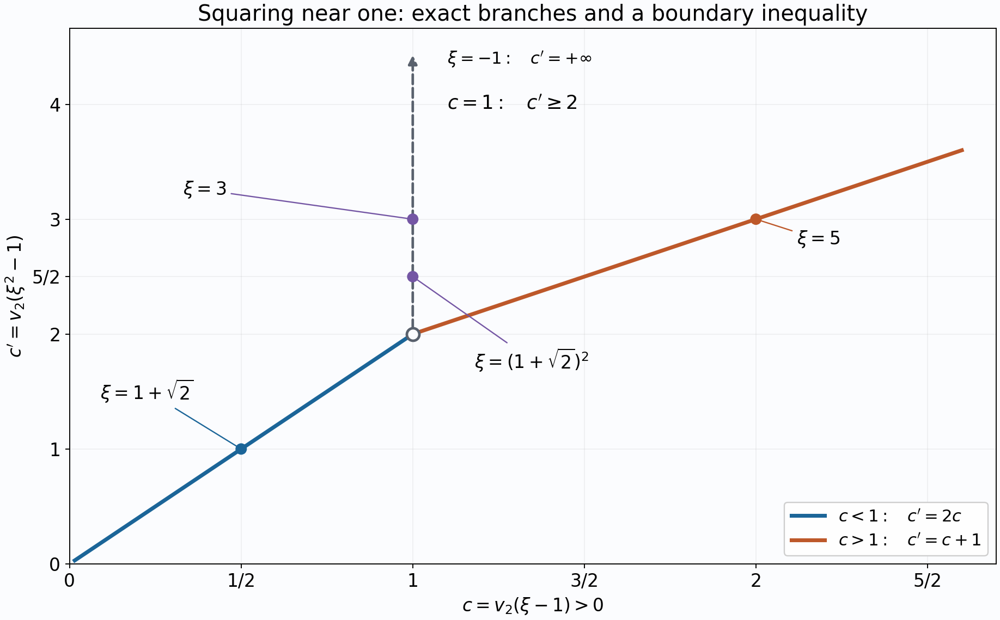

# p-adic analysis for linear forms in logarithms

*Draft. Public domain (CC0).*

A congruence such as \(16^k\equiv1\pmod{5^s}\) says that a power is close to one in a nonarchimedean metric. Its precision is measured by \(v_5(16^k-1)\). Taking a p-adic logarithm turns powers into multiples, but only after checking the convergence domain. This lesson proves those checks, the Schwarz estimate for a power series, and a height bound for the precision of \(\alpha^m-1\).

The field prerequisites are the proved lessons [Completions](../../NT-LOC/NT-LOC-02.html#completing-a-field), [Extensions of complete valued fields](../../NT-LOC/NT-LOC-04.html#3-an-integral-basis-from-residue-digits), and [Places and the product formula](../../NT-LOC/NT-LOC-05.html#3-finite-places-and-prime-ideals). The arithmetic prerequisite is [Heights of algebraic numbers](../../TR-TRANS/TR-TRANS-02.html#4-height-arithmetic-and-finite-sets), Theorem 2.4, Proposition 2.5 and Theorem 2.8. The analytic arguments are written out below. Keith Conrad's freely available notes [Conrad] are a useful companion for the exponential and logarithm; in particular, they explain why convergence must be checked before composing their series.

Here \(p\) is a rational prime. The symbol \(\log\) denotes the p-adic logarithm when its argument is a p-adic unit; \(\ln\) denotes the real natural logarithm in heights and real-valued bounds.

## 1. Valuations, local degrees and the complete ambient field

Let \(K\) be a number field and \(\mathfrak P\) a prime above \(p\). The discrete valuation \(\operatorname{ord}_{\mathfrak P}\) assigns value one to a uniformizer. If \(e=e_{\mathfrak P}\), then \(\operatorname{ord}_{\mathfrak P}(p)=e\). Throughout this course we use

\[
v_p(x)=\frac{\operatorname{ord}_{\mathfrak P}(x)}e,
\qquad v_p(p)=1,
\qquad |x|_p=p^{-v_p(x)},
\qquad v_p(0)=+\infty.
\tag{9.1}
\]

The selected prime, or equivalently the selected embedding into an algebraic extension of \(\mathbb Q_p\), is part of the data. At its completion \(L=K_{\mathfrak P}\), write \(f=[\kappa_L:\mathbb F_p]\). The earlier local-field lessons prove

\[
v_p(L^\times)=\frac1e\mathbb Z,
\qquad |\kappa_L|=p^f,
\qquad [L:\mathbb Q_p]=ef\le [K:\mathbb Q].
\tag{9.2}
\]

The equality of local degree and \(ef\) is NT-LOC-04, Theorem 3.1; the comparison with the global degree is NT-LOC-05, Corollary 2.2 and Proposition 3.1. In particular a positive valuation in \(L\) is at least \(1/e\).

The unique extensions of the absolute value to finite extensions, proved in NT-LOC-04, Theorem 1.1, are compatible on their overlaps. They give an absolute value on an algebraic closure \(\overline{\mathbb Q}_p\). Define \(\mathbb C_p\) to be its completion, using NT-LOC-02, Theorem 2.1. Every series argument below works in any complete valued extension of \(\mathbb Q_p\). Whenever algebraic roots or an infinite residue field are needed, we work in \(\mathbb C_p\).

For reference, the precise proximity statement available in the programme is **Krasner's lemma**, NT-LOC-04, [Theorem 4.1](../../NT-LOC/NT-LOC-04.html#4-when-proximity-forces-containment): if \(\alpha\) is separable over a complete nonarchimedean field \(F\), \(\beta\) is algebraic, and

\[
|\beta-\alpha|<|\alpha'-\alpha|
\quad\text{for every other }F\text{-conjugate }\alpha'\text{ of }\alpha,
\]

then \(F(\alpha)\subseteq F(\beta)\). The cited programme lesson supplies the proof, including the uniqueness-of-valuation input.

## 2. Convergence and legitimate substitution

**Lemma 9.1 (summing small terms).** In a complete nonarchimedean field \(F\), a series \(\sum_{n\ge0}a_n\) converges if and only if \(a_n\to0\). Its absolute value is at most \(\max_n|a_n|\). More generally, a countable family can be summed in any order, and grouped into finite or countable subfamilies, provided that for each \(\varepsilon>0\) only finitely many terms have absolute value at least \(\varepsilon\).

**Proof.** Necessity follows by subtracting consecutive partial sums. For sufficiency, a tail of any finite partial sum has absolute value at most the largest term in that tail. If the terms tend to zero, the partial sums are Cauchy and hence converge. The same estimate proves the asserted bound. For the family statement, include the finite set of terms of size at least \(\varepsilon\) in a finite partial sum. Adding or removing any other finite collection changes the sum by less than \(\varepsilon\). These finite sums have a unique limit by completeness, independently of the enumeration. Grouped sums satisfy the same estimate; the finite large-term set lies in finitely many groups. Thus grouping and subsequent summation give the same limit. \(\square\)

For a positive real \(r\), let \(\mathcal A_r\) consist of the series \(F(X)=\sum a_nX^n\) satisfying \(|a_n|r^n\to0\). Give it the Gauss norm

\[
\|F\|_r=\max_{n\ge0}|a_n|r^n.
\tag{9.3}
\]

The maximum exists, unless the series is zero, because its terms tend to zero. Evaluation at \(|x|\le r\) converges and has absolute value at most this norm.

**Lemma 9.2 (a complete coefficient algebra).** The normed algebra \(\mathcal A_r\) is complete, and \(\|FG\|_r\le\|F\|_r\|G\|_r\). If \(G(0)=0\), \(\|G\|_r\le s\), and \(F(Y)=\sum b_nY^n\in\mathcal A_s\), then \(\sum b_nG(X)^n\) converges in \(\mathcal A_r\). Its coefficients are those of the formal substitution \(F(G(X))\), and its values equal \(F(G(x))\) on \(|x|\le r\). The same assertions hold for finitely many variables, with weight \(r^{\text{total degree}}\).

**Proof.** If \(G=\sum c_nX^n\), the coefficient of \(X^k\) in \(FG\) is \(\sum_{i+j=k}a_ic_j\). Each summand, multiplied in absolute value by \(r^k\), is at most \(\|F\|_r\|G\|_r\). These weighted coefficients tend to zero: in a pair with large \(i+j\), at least one index is large, and that factor has a uniformly small weighted coefficient while the other factor is bounded.

A Cauchy sequence in the norm is Cauchy in every coefficient. Let its coefficient limits be \(a_n\). Approximate the sequence by one fixed member within \(\varepsilon\); beyond a sufficiently large index that member has weighted coefficients below \(\varepsilon\). Passing to coefficient limits bounds the corresponding coefficients of the limit by \(\varepsilon\). The limit belongs to \(\mathcal A_r\), and the original Cauchy estimates, passed to each coefficient, give convergence in norm.

Now \(\|b_nG^n\|_r\le |b_n|s^n\to0\). Lemma 9.1, with the norm estimate in this complete algebra, permits its summation. Because the constant term of \(G\) is zero, the coefficient of each fixed degree receives contributions from only finitely many powers of \(G\). It is therefore the formal substitution coefficient. Evaluation is continuous, so it commutes with this limit and gives the stated numerical substitution. For several variables, there are finitely many monomials of bounded total degree. The same coefficient and tail proofs apply verbatim with total degrees in place of indices. \(\square\)

This lemma will justify the formal identities used in the next section. An identity of formal series alone does not guarantee that a numerical composition represents it on a proposed disc.

## 3. The exponential and the logarithm

Counting the multiples of \(p^j\) in a factorial gives

\[
v_p(n!)=\sum_{j\ge1}\left\lfloor\frac n{p^j}\right\rfloor
=\frac{n-s_p(n)}{p-1}\le\frac{n-1}{p-1}\quad(n\ge1),
\qquad
v_p(n)\le\frac{n-1}{p-1},
\tag{9.4}
\]

where \(s_p(n)\) is the sum of the base-\(p\) digits of \(n\). To prove the middle equality, write \(n=\sum_i d_ip^i\) and sum \(\sum_{j=1}^i d_ip^{i-j}=d_i(p^i-1)/(p-1)\) over \(i\). For the last inequality put \(a=v_p(n)\). Then \(n\ge p^a\ge1+a(p-1)\), the second inequality following by induction on \(a\).

Define

\[
\exp z=\sum_{n\ge0}\frac{z^n}{n!},
\qquad
\log(1+z)=\sum_{n\ge1}\frac{(-1)^{n+1}z^n}{n}.
\tag{9.5}
\]

**Proposition 9.3 (exact domains and first-term dominance).** The exponential converges exactly when \(v_p(z)>1/(p-1)\). The logarithm converges exactly when \(v_p(z)>0\). Their radii in absolute-value notation are

\[
R_{\exp}=p^{-1/(p-1)},\qquad R_{\log}=1,
\tag{9.6}
\]

and neither series converges on its boundary. On the smaller disc, including zero with the usual infinite-valuation convention,

\[
v_p(\exp z-1)=v_p(z),
\qquad v_p(\log(1+z))=v_p(z).
\tag{9.7}
\]

**Proof.** Put \(c=v_p(z)\) when \(z\ne0\). The exponential term has valuation \(nc-v_p(n!)\). If \(c>1/(p-1)\), (9.4) makes this tend to infinity. For \(n=p^j\), its valuation is

\[
p^j\left(c-\frac1{p-1}\right)+\frac1{p-1}.
\]

It stays constant on the boundary and tends to minus infinity below it. Lemma 9.1 proves the exact convergence claim. A logarithm term has valuation \(nc-v_p(n)\). Since \(v_p(n)\le\ln n/\ln p\), this tends to infinity for \(c>0\). At \(n=p^j\) it is \(p^jc-j\), which fails to tend to infinity when \(c\le0\).

When \(c>1/(p-1)\), the valuation of every term after the linear term in either series is strictly larger than \(c\), by (9.4): the difference is at least \((n-1)(c-1/(p-1))>0\). The linear term uniquely has smallest valuation, and summing the convergent remainder preserves its valuation. The case \(z=0\) follows directly from the definitions. \(\square\)

**Proposition 9.4 (analytic identities).** Let \(D=\{z:v_p(z)>1/(p-1)\}\), and \(U=\{u:v_p(u-1)>0\}\). Then

\[
\exp(x+y)=\exp x\exp y\quad(x,y\in D),
\qquad
\log(uv)=\log u+\log v\quad(u,v\in U).
\tag{9.8}
\]

The maps \(\exp:D\to1+D\) and \(\log:1+D\to D\) are inverse isometries. In particular \(\log(u^n)=n\log u\) for every \(u\in U\) and \(n\in\mathbb Z\).

**Proof.** Fix \(0<r<p^{-1/(p-1)}\). Proposition 9.3's coefficient estimates give \(\exp X-1\in\mathcal A_r\) with norm \(r\), and \(\log(1+X)\in\mathcal A_r\) with norm \(r\). Since the outer logarithm converges in \(\mathcal A_r\) for \(r<1\), and the outer exponential for \(r<p^{-1/(p-1)}\), Lemma 9.2 justifies both compositions on \(|x|\le r\).

In formal series over \(\mathbb Q\), differentiating coefficient by coefficient gives \((\exp X)'=\exp X\) and \((\log(1+X))'=1/(1+X)\). The derivative of \(\log(\exp X)\) is one and its constant term is zero, so its coefficients give exactly \(X\). For \(F(X)=\exp(\log(1+X))\), the formal identity is \((1+X)F'=F\) with \(F(0)=1\). If \(F=\sum a_nX^n\), its coefficient recurrence is \(a_1=a_0=1\) and \((n+1)a_{n+1}=(1-n)a_n\) for \(n\ge1\). Thus \(F=1+X\). These formal calculations involve only finitely many terms in each coefficient; the already justified compositions turn them into numerical inverse identities.

In two variables the binomial formula gives the formal identity \(\exp(X+Y)=\exp X\exp Y\). It is also an identity in the complete coefficient algebra of Lemma 9.2 on a closed bidisc of radius \(r<p^{-1/(p-1)}\). Indeed \(\|X+Y\|_r\le r\), so the outer exponential converges. Evaluation proves the first identity in (9.8).

For the second identity fix any \(r<1\). In the two-variable coefficient algebra, \(G=X+Y+XY\) has norm at most \(r\). The outer logarithm converges because \(|1/n|_p r^n\le nr^n\to0\). Lemma 9.2 therefore justifies the composition \(\log(1+X+Y+XY)\). Its formal \(X\)-derivative is \((1+Y)/((1+X)(1+Y))=1/(1+X)\); its \(Y\)-derivative is \(1/(1+Y)\). Subtract \(\log(1+X)+\log(1+Y)\). Both partial derivatives are zero, so characteristic zero makes every nonconstant coefficient zero. Its constant is also zero. Evaluation at \(X=u-1,Y=v-1\), choosing \(r\ge\max(|u-1|,|v-1|)\), proves the product identity on all of \(U\).

The set \(U\) is a group: \(|u|=1\), \(uv-1=(u-1)v+(v-1)\), and \(u^{-1}-1=(1-u)/u\). Induction and inverses now give the integer-power identity. Finally,

\[
|\exp x-\exp y|=|\exp y|\,|\exp(x-y)-1|=|x-y|,
\]

by (9.7) and \(|\exp y|=1\). For \(u,v\in1+D\), the product identity and (9.7) give \(|\log u-\log v|=|\log(u/v)|=|u/v-1|=|u-v|\). This proves both isometries. \(\square\)

For example, the exponential on \(\mathbb Q_p\) has domain \(p\mathbb Z_p\) when \(p\) is odd, and \(4\mathbb Z_2\) when \(p=2\). The logarithm on \(\mathbb Q_2\) converges on \(1+2\mathbb Z_2\), but it is not injective there: \(2\log(-1)=\log1=0\), so \(\log(-1)=0\).

## 4. Taking powers until the exponential applies

**Lemma 9.5 (one power step).** Suppose \(0<c=v_p(\xi-1)<+\infty\). Then

\[
v_p(\xi^p-1)=
\begin{cases}
pc,&0<c<1/(p-1),\\
c+1,&c>1/(p-1),
\end{cases}
\quad\text{and at }c=1/(p-1)\text{ it is at least }p/(p-1).
\tag{9.9}
\]

If \(n\ge1\) and \(p\nmid n\), then \(v_p(\xi^n-1)=c\).

**Proof.** Write \(z=\xi-1\). In \((1+z)^p-1\), the first term \(pz\) has valuation \(1+c\), and the last term \(z^p\) has valuation \(pc\). For \(1<j<p\), the coefficient \(\binom pj\) is divisible by \(p\), so the intermediate term has valuation at least \(1+jc\), strictly greater than the smaller of the first and last valuations. When \(c\ne1/(p-1)\), the smaller of those two is unique, proving equality. At the boundary they coincide, and the ultrametric inequality gives the stated lower bound, allowing \(+\infty\). For a prime-to-\(p\) exponent \(n\), the first term \(nz\) has valuation \(c\); all later terms have valuation at least \(2c\), since their binomial coefficients are integers. This proves the last assertion. \(\square\)

**Corollary 9.6 (an explicit entrance time).** Let \(c=v_p(\xi-1)>0\), and let \(t\) be the smallest nonnegative integer with

\[
p^tc>\frac1{p-1}.
\tag{9.10}
\]

Then \(\xi^{p^t}=1\) or \(v_p(\xi^{p^t}-1)>1/(p-1)\). If \(\xi\) lies in a finite extension of ramification index \(e\), the choice of the least \(t\) with \(p^t>e/(p-1)\) works uniformly and satisfies \(p^t\le2e\).

**Proof.** Before reaching the threshold the valuation is multiplied by \(p\) at each step of Lemma 9.5. If a step lands exactly on the threshold, the next step is already strictly above it, unless the power is one. After the valuation is strictly above the threshold, each further step adds one. Thus the strict inequality in (9.10) guarantees entrance. In a finite extension, \(c\ge1/e\). If the uniform \(t\) is zero, \(p^t=1\le2e\). Otherwise its minimality gives \(p^{t-1}\le e/(p-1)\), so \(p^t\le pe/(p-1)\le2e\). \(\square\)

*Figure.* For \(p=2\), plot \(c=v_2(\xi-1)\) against \(c'=v_2(\xi^2-1)\). Lemma 9.5 proves the branches \(c'=2c\) for \(0<c<1\) and \(c'=c+1\) for \(c>1\). At \(c=1\), the vertical dashed ray displays the bound \(c'\ge2\), including infinity; it does not assert that every real point on the ray is attained. The labels mark exact examples: \(\xi=3\) gives \(1\mapsto3\), \(\xi=-1\) gives \(1\mapsto+\infty\), and \(\xi=5\) gives \(2\mapsto3\). In \(\mathbb Q_2(\sqrt2)\), \(\xi=1+\sqrt2\) gives \(1/2\mapsto1\mapsto5/2\), as checked in Solution 8. This is a graph of scalar valuations, rather than a Euclidean model of \(\mathbb C_2\). Original figure: GPT-6.1 Sol (OpenAI), Ultra, CC0. [Figure program](../figure_sources/padic_squaring.py).

Corollary 9.6 also determines the logarithm's kernel on \(U\): it consists exactly of roots of unity of \(p\)-power order. Indeed, \(\log\xi=0\) implies \(\log(\xi^{p^t})=0\); after entrance, the inverse exponential forces \(\xi^{p^t}=1\). Conversely, such a root reduces to one in the residue field, since in characteristic \(p\), \(X^{p^t}-1=(X-1)^{p^t}\). Its logarithm is defined, and \(p^t\log\xi=0\) forces it to vanish.

## 5. Cyclotomic ramification and distances between roots

**Proposition 9.7 (the cyclotomic scale).** If \(\zeta\) has exact order \(p^u\), with \(u\ge1\), then

\[
v_p(\zeta-1)=\frac1{p^{u-1}(p-1)},
\qquad
[\mathbb Q_p(\zeta):\mathbb Q_p]=e=p^{u-1}(p-1),
\qquad f=1.
\tag{9.11}
\]

Moreover,

\[
\sum_{\substack{\zeta\text{ of exact}\\\text{order }p^u}}v_p(1-\zeta)=1,
\qquad
\sum_{\substack{\zeta^{p^u}=1\\\zeta\ne1}}v_p(1-\zeta)=u.
\tag{9.12}
\]

**Proof.** Roots of \(X^{p^u}-1\) exist in the algebraic closure and are distinct in characteristic zero. The quotient

\[
\Phi_{p^u}(X)=\frac{X^{p^u}-1}{X^{p^{u-1}}-1}
=\sum_{j=0}^{p-1}X^{jp^{u-1}}
\]

has precisely the roots of exact order \(p^u\), and degree \(n=p^{u-1}(p-1)\). For the shifted polynomial \(\Phi_{p^u}(1+T)\), the leading coefficient is one and the constant is \(p\). Modulo \(p\), the binomial identity \((1+T)^{p^{u-1}}=1+T^{p^{u-1}}\) gives

\[
\sum_{j=0}^{p-1}(1+T^{p^{u-1}})^j
=T^{p^{u-1}(p-1)}.
\]

For the last equality, multiply by \(T^{p^{u-1}}\) and use \((1+T^{p^{u-1}})^p-1=T^{p^u}\) in \(\mathbb F_p[T]\); cancellation is legitimate in this polynomial domain. Thus every lower nonconstant coefficient of the shifted polynomial is divisible by \(p\), while its constant has valuation exactly one.

A root \(\zeta\) is a unit, since \(\zeta^{p^u}=1\), and its residue is one in characteristic \(p\). Put \(c=v_p(\zeta-1)>0\). If \(nc<1\), the leading term of the shifted polynomial at \(T=\zeta-1\) uniquely has smallest valuation: every intermediate term has valuation at least \(1+jc>nc\). If \(nc>1\), its constant uniquely has smallest valuation. Neither is consistent with a zero sum. Consequently \(nc=1\).

Let \(L=\mathbb Q_p(\zeta)\). Since \(1/n\in(1/e)\mathbb Z\), we have \(n\mid e\). On the other hand \(e\le[L:\mathbb Q_p]\le n\), the last inequality coming from the polynomial just displayed. Hence the degree and \(e\) are both \(n\), and (9.2) gives \(f=1\). This also proves the irreducibility of the displayed cyclotomic polynomial over \(\mathbb Q_p\).

Finally \(\Phi_{p^u}(1)=p\). Factor it into its distinct primitive roots and take valuations to obtain the first sum in (9.12). Each nontrivial \(p^u\)-th root has exact order \(p^j\) for one \(1\le j\le u\). Adding the first sum for these \(u\) orders gives the second. \(\square\)

The factorization of \(X^{p^u}-1\) also gives, whenever \(\xi^{p^u}\ne1\),

\[
v_p(\xi^{p^u}-1)=\sum_{\zeta^{p^u}=1}v_p(\xi-\zeta).
\tag{9.13}
\]

This is an exact finite sum, not an estimate. Distinct roots at the same cyclotomic scale explain the cancellation allowed at the boundary of Lemma 9.5.

## 6. Analytic powers on larger discs

**Proposition 9.8 (the power function).** Let \(\theta\ge0\) be real and suppose \(v_p(x-1)>\theta+1/(p-1)\). Then

\[
x^z:=\exp(z\log x)
=\sum_{n\ge0}\frac{(\log x)^n}{n!}z^n
\quad\text{is analytic on }v_p(z)\ge-\theta.
\tag{9.14}
\]

The convergence is uniform on this closed disc. For every integer \(z\), it agrees with the usual power of \(x\), including negative powers.

**Proof.** If \(x=1\), the series is the constant one. Otherwise, because \(\theta\ge0\), the hypothesis places \(x\) in the inverse disc of Proposition 9.4. Put \(c=v_p(\log x)=v_p(x-1)\). At radius \(R=p^\theta\), the weighted coefficient valuation for \(n\ge1\) is \(n(c-\theta)-v_p(n!)\), which tends to infinity by (9.4). Thus the series belongs to \(\mathcal A_R\); its tails are uniformly small by Lemma 9.1. Every \(z\) in the stated disc has \(v_p(z\log x)>1/(p-1)\), so the exponential is defined. Since \(x=\exp(\log x)\), its group law proves the integer-power assertion by induction and inverses. \(\square\)

The restriction on \(\theta\) matters. For a smaller disc, corresponding to \(\theta<0\), a sufficient hypothesis is \(v_p(x-1)>\max\{1/(p-1),\theta+1/(p-1)\}\). The first term of that maximum ensures that \(\log x\) has the valuation of \(x-1\). For instance, \(x=-1\) at \(p=2\) has valuation \(v_2(x-1)=1\) but \(\log x=0\).

## 7. Schwarz's lemma and the meaning of the norm

**Theorem 9.9 (p-adic Schwarz lemma).** Suppose \(\Psi(X)=\sum a_nX^n\in\mathcal A_R\), and \(\Psi\) has a zero of order at least an integer \(T\ge0\) at zero, meaning \(a_0=\cdots=a_{T-1}=0\). For \(0<r\le R\),

\[
\|\Psi\|_r\le\left(\frac rR\right)^T\|\Psi\|_R.
\tag{9.15}
\]

Over \(\mathbb C_p\) the Gauss norm equals the supremum of the values on the closed disc. Thus (9.15) also reads

\[
\sup_{|z|_p\le r}|\Psi(z)|_p
\le\left(\frac rR\right)^T\sup_{|z|_p\le R}|\Psi(z)|_p.
\tag{9.16}
\]

**Proof.** For each \(n\ge T\),

\[
|a_n|r^n=|a_n|R^n\left(\frac rR\right)^n
\le\|\Psi\|_R\left(\frac rR\right)^T.
\]

Taking the maximum proves (9.15) over any complete extension. This proof also includes \(T=0\), and the zero series.

We prove the claimed equality with the supremum, rather than assume it for every field. First, the residue field of \(\mathbb C_p\) is infinite. For arbitrarily large positive \(N\) prime to \(p\), all \(N\) distinct roots of \(X^N-1\) lie in the algebraic closure and are units. Their residues are distinct: if two had the same residue, their ratio \(\eta\ne1\) would satisfy \(v_p(\eta-1)>0\) and \(\eta^N=1\), contradicting Lemma 9.5's prime-to-\(p\) assertion. These roots provide arbitrarily many residue classes.

Suppose first that \(R=|b|_p\) for some \(b\in\mathbb C_p^\times\), and \(\Psi\ne0\). Choose a coefficient \(a_k\) attaining the Gauss norm. The series \(H(Y)=\Psi(bY)/(a_kb^k)\) has integral coefficients, at least one unit coefficient, and coefficients tending to zero. Reducing them gives a nonzero polynomial over the residue field: only finitely many coefficients are units. A polynomial of degree \(d\) has at most \(d\) roots, by repeated division by \(Y-c\). Choose a nonzero residue outside these finitely many roots, and lift it to a unit \(y\). Then \(|H(y)|_p=1\), so \(|\Psi(by)|_p=\|\Psi\|_R\). Evaluation always gives the opposite inequality, proving equality.

For an arbitrary positive real \(R\), the value group contains \(p^{\mathbb Q}\): roots of \(p\) of every positive integer order are already in the algebraic closure. Choose radii \(R_j\) in this dense subgroup increasing to \(R\). If \(a_k\) attains \(\|\Psi\|_R\), then \(\|\Psi\|_{R_j}\ge|a_k|R_j^k\to\|\Psi\|_R\). Applying the already proved equality on the smaller discs gives a supremum on the \(R\)-disc at least \(\|\Psi\|_R\). The reverse inequality is the evaluation bound. This proves the equality for all real radii and completes (9.16). \(\square\)

The field matters in the last step. On \(\mathbb Z_p\), the polynomial \(X^p-X\) has Gauss norm one at radius one, but all its values have absolute value at most \(p^{-1}\). Its reduction vanishes on the entire finite residue field. Thus a coefficient norm and a pointwise supremum should not be interchanged over a finite extension without an additional argument.

## 8. A height bound for one p-adic logarithm

Let \(\alpha\ne0\) be algebraic of degree \(d\), with a fixed p-adic embedding, and let \(h(\alpha)\) be the absolute logarithmic Weil height. The earlier height lesson proves, for \(\gamma\in\mathbb Q(\alpha)^\times\) and \(N\ge1\),

\[
v_p(\gamma)\ln p\le d\,h(\gamma),
\qquad h(\alpha^N)=Nh(\alpha),
\qquad h(\alpha^N-1)\le Nh(\alpha)+\ln2.
\tag{9.17}
\]

The first inequality is its one-place Liouville inequality with the local degree bounded below by one. It remains true when its left side is negative.

**Theorem 9.10 (one-logarithm height bound).** If \(m\ge1\) and \(\alpha^m\ne1\), then

\[
v_p(\alpha^m-1)
\le v_p(m)+\frac{2d(p^d-1)h(\alpha)+d\ln2}{\ln p}.
\tag{9.18}
\]

In particular, for \(m\ge2\),

\[
v_p(\alpha^m-1)
\le\frac{\ln m}{\ln p}
+\frac{2d(p^d-1)}{\ln p}h(\alpha)
+\frac{2d\ln2}{\ln p}.
\tag{9.19}
\]

**Proof.** If \(v_p(\alpha)>0\), then \(v_p(\alpha^m-1)=0\). If \(v_p(\alpha)<0\), the valuation is \(m v_p(\alpha)<0\). Both satisfy (9.18), whose right side is nonnegative. We may assume that \(\alpha\) is a unit in the completion \(L\) of \(K=\mathbb Q(\alpha)\). Use \(e,f\) from (9.2), so \(ef\le d\).

Let \(q\) be the order of the nonzero residue of \(\alpha\) in \(\kappa_L^\times\). Then \(q\mid p^f-1\), in particular \(p\nmid q\) and \(q\le p^f-1\). To recall the finite-group argument, the subgroup generated by an element partitions the group into cosets of equal size, namely its order. If \(q\nmid m\), the residue of \(\alpha^m-1\) is nonzero, so its valuation is zero and the bound holds.

Suppose first that \(\alpha\) is not a root of unity and \(q\mid m\). Put \(\beta=\alpha^q\), with \(c_0=v_p(\beta-1)\ge1/e\). Let \(t\) be the least nonnegative integer satisfying \(p^t>e/(p-1)\), and put \(N=qp^t\). Corollary 9.6 gives a finite valuation \(c_t=v_p(\alpha^N-1)>1/(p-1)\). The exponent is bounded by

\[
N\le2e(p^f-1)\le2(p^{ef}-1)\le2(p^d-1).
\tag{9.20}
\]

The middle inequality follows from \(x^e-1=(x-1)(1+x+\cdots+x^{e-1})\ge e(x-1)\) for \(x=p^f\ge1\).

Write \(m=q p^a\ell\), where \(p\nmid\ell\). Since \(p\nmid q\), \(a=v_p(m)\). Lemma 9.5 says that the prime-to-\(p\) factor \(\ell\) preserves the valuation. If \(a\ge t\), every further \(p\)-power adds one, so the valuation is \(c_t+a-t\). If \(a<t\), the earlier valuations are at most \(c_t\), since every \(p\)-step strictly increases a positive finite valuation. Therefore in both cases

\[
v_p(\alpha^m-1)\le v_p(m)+c_t,
\qquad
c_t\ln p\le d\bigl(Nh(\alpha)+\ln2\bigr).
\tag{9.21}
\]

The second inequality is (9.17) applied to \(\alpha^N-1\ne0\). Combining (9.20) and (9.21) proves (9.18) in this case.

Now suppose that \(\alpha\) is a root of unity. Its height is zero: if \(\alpha^b=1\), the height-power identity gives \(b h(\alpha)=h(1)=0\). When \(v_p(\alpha^m-1)>0\), the nontrivial root \(\zeta=\alpha^m\) has \(p\)-power order. Indeed, if its order is \(p^u s\) with \(p\nmid s\), then \(\eta=\zeta^{p^u}\) has order dividing \(s\) and is congruent to one. If \(\eta\ne1\), Lemma 9.5 would give a finite value for \(v_p(\eta^s-1)\), a contradiction. Hence \(\zeta^{p^u}=1\). Proposition 9.7 now yields

\[
v_p(\alpha^m-1)\le\frac1{p-1}\le\frac{d\ln2}{\ln p}.
\tag{9.22}
\]

For the second inequality, \(p\le2^{p-1}\) follows by induction on the integer \(p\ge2\), and thus \(\ln p\le(p-1)\ln2\). This proves (9.18) for torsion too, including the cases in which a power used in the preceding argument would have become exactly one.

Finally, \(p^{v_p(m)}\le m\), so \(v_p(m)\le\ln m/\ln p\). Replacing \(d\ln2\) by the larger \(2d\ln2\) gives (9.19). \(\square\)

The factor \(p^d-1\) in this proof comes from two explicit operations: annihilating the residue-class order and taking enough \(p\)-powers to enter the exponential disc. The residue-field factor and the ramification factor combine through (9.20). The proof does not presume that \(\alpha\) is an integer or that its local ramification index is one.

## 9. Lifting the exponent and two exact examples

**Corollary 9.11 (lifting the exponent).** Let \(p\) be odd, and let \(a,b\) be integers with \(p\nmid ab\) and \(p\mid a-b\). For every \(n\ge1\),

\[
v_p(a^n-b^n)=v_p(a-b)+v_p(n).
\tag{9.23}
\]

If \(a=b\), both sides are infinite and the assertion has that interpretation. More generally, for a p-adic unit \(\xi\) with \(v_p(\xi-1)>1/(p-1)\), the identical argument gives \(v_p(\xi^n-1)=v_p(\xi-1)+v_p(n)\), allowing \(\xi=1\).

**Proof.** When \(a\ne b\), put \(\xi=a/b\). Then \(c=v_p(\xi-1)=v_p(a-b)\ge1>1/(p-1)\), since \(p\) is odd and \(b\) is a unit. Decompose \(n=p^s\ell\), \(p\nmid\ell\). Lemma 9.5 adds one on each of the \(s\) successive \(p\)-steps and leaves the value unchanged on the last \(\ell\)-step. Multiplication by \(b^n\) does not change it. The same proof works for any unit initially in the deeper disc. The equal-base case is immediate. \(\square\)

In particular, \(16-1=15\) has 5-adic valuation one and \(729-1=728=7\cdot104\) has 7-adic valuation one. Hence for \(k\ge1\),

\[
v_5(16^k-1)=1+v_5(k),
\qquad v_7(729^k-1)=1+v_7(k).
\tag{9.24}
\]

For example \(16^{25}-1\) has valuation three at 5, and \(729^{49}-1\) has valuation three at 7. These exponents may make the ordinary integers enormous while their valuations are obtained exactly from the small exponent.

At \(p=2\), the deeper-disc condition is \(c>1\). It gives \(v_2(5^k-1)=2+v_2(k)\). It cannot be weakened to \(c\ge1\): \(v_2(3-1)=1\), but \(v_2(3^2-1)=3\). If \(k\) is odd, Lemma 9.5 gives \(v_2(3^k-1)=1\); if \(k\) is even, apply the deeper-disc formula to \(9^{k/2}\) to obtain \(v_2(3^k-1)=2+v_2(k)\).

The included [exact-arithmetic program](../verification/padic_examples.py) checks these examples, the factorial digit identity and small cyclotomic shifted polynomials. The general statements are proved above.

## 10. Exercises

1. **Easy.** Derive (9.23) directly from the two parts of Lemma 9.5. Calculate \(v_5(16^{125}-1)\) and \(v_7(729^{343}-1)\).
2. **Medium.** Prove that the exponential radius is exactly \(p^{-1/(p-1)}\), including divergence on the boundary. What happens to the terms with indices \(p^j\)?
3. **Medium.** Prove Proposition 9.7 for \(u=1\), including the ramification degree and the sum over primitive roots.
4. **Hard.** Prove both norm versions of Schwarz's lemma, explaining the role of the residue field. Give a series for which the inequality is an equality at every pair of radii.
5. **Medium.** Prove that a root of unity congruent to one has \(p\)-power order. Deduce the full kernel of the logarithm on \(U\).
6. **Easy.** Verify \(v_5(99!)=22\) using the base-5 digits, and also by counting multiples of successive powers of 5.
7. **Medium.** Translate (9.18) into the \(\operatorname{ord}_{\mathfrak P}\) normalization. Identify the coefficient of \(v_p(m)\), and explain why omitting it changes the bound.
8. **Medium.** In \(\mathbb Q_2(\sqrt2)\), calculate the first two squaring steps for \(\xi=1+\sqrt2\). Determine the uniform entrance exponent from Corollary 9.6 and its contribution to (9.20).
9. **Medium.** Compute the Gauss norm and the pointwise supremum of \(X^p-X\) on \(\mathbb Z_p\). Explain why the corresponding supremum on the unit disc of \(\mathbb C_p\) is different.
10. **Medium.** Apply the stronger estimate (9.18) to \(\alpha=-1\), \(p=2\) and odd \(m\). Why would the nontorsion part of its proof be invalid if used alone?

## 11. Complete solutions

**Solution 1.** Let \(\xi=a/b\), whose valuation is zero and whose distance from one has integer valuation \(c\ge1\). For an odd prime, \(c>1/(p-1)\). Writing \(n=p^s\ell\), \(p\nmid\ell\), the \(p\)-power clause adds one at each of \(s\) steps, while the prime-to-\(p\) clause leaves the result unchanged. This gives \(c+s\), and \(b^n\) has valuation zero. In the two examples the initial values are one, so \(v_5(16^{125}-1)=1+3=4\), and \(v_7(729^{343}-1)=1+3=4\).

**Solution 2.** For \(z\ne0\), write \(c=v_p(z)\). Formula (9.4) gives \(v_p(z^n/n!)\ge n(c-1/(p-1))+1/(p-1)\), so the terms tend to zero if \(c>1/(p-1)\). At \(n=p^j\), the digit sum is one, and the valuation is exactly \(p^j(c-1/(p-1))+1/(p-1)\). It is constant on the boundary and tends to minus infinity outside. By Lemma 9.1, convergence holds exactly in the asserted open disc. Boundary points exist in \(\mathbb C_p\), for instance a \((p-1)\)-st root of \(p\). Thus the radius is exact, rather than merely a sufficient convergence radius.

**Solution 3.** Here \(\Phi_p(1+T)=((1+T)^p-1)/T=p+\binom p2T+\cdots+T^{p-1}\). The constant has valuation one, all intervening coefficients are divisible by \(p\), and the leading coefficient is one. A primitive root has reduction one; at \(c=v_p(\zeta-1)>0\), a unique smallest term would occur unless \((p-1)c=1\). Its value group therefore forces \(p-1\mid e\). The polynomial degree gives \([\mathbb Q_p(\zeta):\mathbb Q_p]\le p-1\), while the degree is at least \(e\). Thus \(e=[\mathbb Q_p(\zeta):\mathbb Q_p]=p-1\), and \(f=1\). There are \(p-1\) primitive roots, each with valuation \(1/(p-1)\), so their sum is one. Equivalently their product \(\prod(1-\zeta)=\Phi_p(1)=p\) gives that sum.

**Solution 4.** Vanishing to order at least \(T\) means the coefficients below \(T\) vanish. For every remaining coefficient, multiply its radius-\(R\) bound by \((r/R)^n\le(r/R)^T\), and take the maximum. This proves the Gauss version. To obtain the pointwise version on \(\mathbb C_p\), for radii in the value group scale the variable and divide by a coefficient of maximal weighted norm. Reduction gives a nonzero polynomial, because the scaled coefficients tend to zero. The residue field is infinite by the distinct reductions of arbitrarily many prime-to-\(p\) roots of unity, proved in Section 7. A residue outside the polynomial's roots lifts to a point attaining the Gauss norm. Radii in \(p^{\mathbb Q}\) approximate any real radius from below; a maximizing coefficient shows the corresponding norms tend to the norm at that radius. Thus the supremum equals the Gauss norm for all real radii. The series \(aX^T\), with \(a\ne0\), gives equality in both versions.

**Solution 5.** If the root \(\zeta\) has order \(p^u s\), \(p\nmid s\), then \(\eta=\zeta^{p^u}\) is congruent to one and \(\eta^s=1\). Unless \(\eta=1\), the prime-to-\(p\) power clause of Lemma 9.5 would preserve a positive finite valuation and contradict \(\eta^s=1\). Thus \(\zeta\) has \(p\)-power order. Such roots have logarithm zero by the integer-power identity and characteristic zero. Conversely if \(\log\xi=0\) with \(\xi\in U\), Corollary 9.6 puts some \(\xi^{p^t}\) in \(1+D\) or makes it one. In \(1+D\), the inverse identity gives \(\xi^{p^t}=\exp(p^t\log\xi)=1\). Hence precisely the \(p\)-power roots comprise the kernel.

**Solution 6.** The base-5 expansion is \(99=3\cdot25+4\cdot5+4\), with digit sum 11. Thus \(v_5(99!)=(99-11)/4=22\). Directly, there are \(\lfloor99/5\rfloor=19\) multiples of 5, and \(\lfloor99/25\rfloor=3\) further factors of 5 contributed by multiples of 25. There are no multiples of 125. The sum is again 22.

**Solution 7.** Multiply every term of (9.18) by \(e\). The result is

\[
\operatorname{ord}_{\mathfrak P}(\alpha^m-1)
\le e\,v_p(m)+\frac{e\bigl(2d(p^d-1)h(\alpha)+d\ln2\bigr)}{\ln p}.
\]

Here \(\operatorname{ord}_{\mathfrak P}(m)=e\,v_p(m)\). Each additional factor of \(p\) in an exponent therefore contributes \(e\) uniformizer units after entrance, rather than one. Retaining \(v_p(p)=1\) on one side and using a uniformizer normalization on the other would lose that factor.

**Solution 8.** The valuation of \(\sqrt2\) is \(1/2\), so the local ramification index is at least two. The degree of \(X^2-2\) is two, and (9.2) forces degree and ramification index two and residue degree one. With \(\xi=1+\sqrt2\),

\[
\xi^2-1=2+2\sqrt2=2(1+\sqrt2),
\qquad
\xi^4-1=16+12\sqrt2=4\sqrt2(3+2\sqrt2).
\]

The parenthesized factors are units, so these valuations are one and \(5/2\). Thus the first step lands on the boundary, and the second has greater valuation than the boundary lower bound two. The uniform entrance choice is the least \(t\) with \(2^t>2\), namely \(t=2\), so \(2^t=4=2e\). The residue of \(\xi\) is one, hence \(q=1\) and \(N=4\). The exponent bound (9.20) here is \(4\le2(2^2-1)=6\).

**Solution 9.** The two nonzero coefficients have absolute value one, so the Gauss norm at radius one is one. Every residue in \(\mathbb F_p\) satisfies \(a^p=a\): for \(a\ne0\), the coset proof of Lagrange's theorem gives \(a^{p-1}=1\), and zero is immediate. Consequently \(x^p-x\in p\mathbb Z_p\) for every \(x\in\mathbb Z_p\). At \(x=p\), its valuation is one, since \(p^p-p=p(p^{p-1}-1)\). The supremum on \(\mathbb Z_p\) is therefore \(p^{-1}\). The residue field of \(\mathbb C_p\) is infinite; choose a residue which is not a root of \(X^p-X\). A unit lift gives value of absolute value one, so the supremum on its unit disc is one.

**Solution 10.** The degree is one and the height is zero. If \(m\) is odd, \(v_2(m)=0\) and \(\alpha^m-1=-2\) has valuation one. The right side of (9.18) is \(\ln2/\ln2=1\), so equality holds. But the uniform entrance power for \(e=1,p=2\) is \(2\), and \(\alpha^2-1=0\). A Liouville bound for this zero would be meaningless. The separate torsion argument in (9.22) is essential.

## References

- [Conrad] Keith Conrad, *Infinite series in p-adic fields*, freely available [author's notes](https://kconrad.math.uconn.edu/blurbs/gradnumthy/infseriespadic.pdf). Sections 2, 4 and 8 treat convergence, the exponential, the logarithm and the justification of inverse identities. The local-field and height inputs used here have complete proofs in the programme lessons linked in Sections 1 and 8.

## Editable source

[LaTeX source](../sources/TR-BAKER-09.tex) · [Markdown source](TR-BAKER-09.md).
