# Two p-adic logarithms: determinant bounds

*Draft. Public domain (CC0).*

A large valuation of \(2^a-3^b\) means that the two powers agree to many p-adic digits. The determinant method measures how far this agreement can continue. It places products of powers in a single residue class, obtains a nonzero algebraic determinant, and compares a height bound with the large valuation forced by near agreement.

We use the exponential, logarithm, power laws and cyclotomic distances proved in [p-adic analysis for linear forms in logarithms](../TR-BAKER-09.html). The polynomial zero argument is the method proved in [Two logarithms I: interpolation determinants](../TR-BAKER-06.html#3-the-zero-lemma). The weighted product formula is [Places of number fields in extensions and the product formula](../../NT-LOC/NT-LOC-05.html#5-norms-and-the-normalized-product-formula), Theorem 5.2. The height convention and its power law are proved in [Heights of algebraic numbers](../../TR-TRANS/TR-TRANS-02.html#4-height-arithmetic-and-finite-sets). The necessary determinant estimates are written out below.

Throughout, \(v=v_p\) is normalized by \(v(p)=1\), and \(\ln\) is the real natural logarithm. All algebraic numbers have a specified embedding into \(\overline{\mathbb Q}_p\). We distinguish the global degree \(d\), local ramification index \(e\), and local residue degree \(f\).

## 1. Residues and principal units

Put \(K_0=\mathbb Q(\alpha_1,\alpha_2)\), \(d=[K_0:\mathbb Q]\), and \(F=\mathbb Q_p(\alpha_1,\alpha_2)\). Its residue field has \(p^f\) elements and \([F:\mathbb Q_p]=ef\le d\). Assume \(v(\alpha_i)=0\).

The multiplicative group of the residue field is cyclic. Here is an elementary proof. In a finite abelian group, elements whose orders have prescribed prime power parts can be multiplied to obtain an element of order equal to the least common multiple \(m\) of all element orders. To see this, for each prime choose an element whose order contains the largest occurring power of that prime, and raise it to its complementary part; the resulting elements have pairwise coprime orders. Their product has the product of those orders, since a power that kills the product must kill each component. In a finite subgroup of a field's multiplicative group, every element is a root of \(X^m-1\), so the group has at most \(m\) elements. The element just constructed already has \(m\) distinct powers. It generates the group.

Every nonzero residue has a unique lift to a \((p^f-1)\)-st root of unity in \(F\). For completeness, take any unit \(a\) with that residue and set \(g=p^f-1\). Since \(a^g\in1+\mathfrak m_F\), the powers \((a^g)^{p^n}\) tend to one: the power laws of Lesson 9 first enter \(v(x-1)>1/(p-1)\), and then add one at each further p-th power. Consequently

\[
a^{p^{f(n+1)}}-a^{p^{fn}}
=a^{p^{fn}}\bigl((a^g)^{p^{fn}}-1\bigr)\longrightarrow0.
\]

The differences have valuations tending to infinity, so the sequence is Cauchy. Its limit \(\eta\) has the original residue and satisfies \(\eta^{p^f}=\eta\). Thus \(\eta^g=1\). If two such lifts have the same residue, their quotient \(w\) is a principal unit with \(w^g=1\). The prime-to-p power law in Lesson 9 gives \(v(w^g-1)=v(w-1)\) when \(w\ne1\), which rules this out. This proves uniqueness.

Lift a generator of the residue group to \(\eta\). We may write

\[
\alpha_i=\eta^{m_i}\epsilon_i,
\qquad \epsilon_i\in1+\mathfrak m_F,
\qquad g=p^f-1.
\tag{10.1}
\]

We use the full residue group here; no condition \(\gcd(m_1,m_2,g)=1\) is required. Choose the least integer \(t\ge0\) such that

\[
p^t>\frac e{p-1},\qquad c_0=\frac{p^t}e.
\tag{10.2}
\]

Lesson 9 proves \(v(\epsilon_i^{p^t}-1)\ge c_0>1/(p-1)\). Also

\[
\frac{p^t}e\le\frac p{p-1}\le2.
\tag{10.3}
\]

If \(t>0\), minimality gives the first inequality. If \(t=0\), it follows from \(e\ge1\).

## 2. Three integral determinant estimates

**Lemma 10.1 (factorials and alternants).** For \(n\ge0\),

\[
\frac n{p-1}-\frac{\ln(n+1)}{\ln p}
\le v(n!)\le\frac n{p-1}.
\tag{10.4}
\]

For \(z_1,\ldots,z_n\in\mathbb Z_p\),

\[
v\!\left(\prod_{i<j}(z_j-z_i)\right)
\ge\sum_{j=0}^{n-1}v(j!)
\ge\frac{n(n-1)}{2(p-1)}-\frac{n\ln n}{\ln p}.
\tag{10.5}
\]

Use \(0\ln0=0\). If \(0\le\nu_1<\cdots<\nu_n\), the determinant \(\det(z_i^{\nu_j})\) satisfies the same lower bound.

**Proof.** The digit formula \(v(n!)=(n-s_p(n))/(p-1)\) was proved in Lesson 9. At a fixed digit sum \(s=a(p-1)+c\), \(0\le c<p-1\), the smallest nonnegative integer is \((c+1)p^a-1\): moving one digit unit from a higher position to an unfilled lower position decreases the number. Concavity of \(\ln(1+x)\) on \([0,p-1]\) gives \(\ln(c+1)\ge c\ln p/(p-1)\). Hence \(s_p(n)\le(p-1)\ln(n+1)/\ln p\), proving (10.4).

The polynomial \(\binom Zj\) is p-adically integral on \(\mathbb Z_p\). It is integral on nonnegative integers, which are dense in \(\mathbb Z_p\): every residue modulo \(p^h\) has such a representative. Continuity gives the assertion on the completion. Replacing the powers in the Vandermonde determinant by falling factorials gives

\[
\det\!\left(\binom{z_i}{j-1}\right)_{i,j=1}^n
=\frac{\prod_{i<j}(z_j-z_i)}{\prod_{j=0}^{n-1}j!}.
\]

The determinant on the left is integral. Sum (10.4), and use \(\ln(n!)\le n\ln n\), to obtain (10.5).

Finally \(\det(Z_i^{\nu_j})\) is alternating, so it vanishes on \(Z_i=Z_j\). Division by the monic polynomial \(Z_j-Z_i\) takes place over \(\mathbb Z\). Each such factor is prime in \(\mathbb Z[Z_1,\ldots,Z_n]\), because its quotient ring is a polynomial ring over \(\mathbb Z\), an integral domain. Distinct pair factors are not associates. They therefore all divide the alternant, with an integer polynomial quotient. Evaluating that quotient in \(\mathbb Z_p\) and applying (10.5) proves the last assertion. \(\square\)

**Lemma 10.2 (centering without an occupancy hypothesis).** Let \(N=KL\), and let the row labels \(l_i\) consist of \(K\) copies of each integer \(0,\ldots,L-1\). For any ordering of integers \(0\le r_i\le R-1\),

\[
\left|\sum_i l_ir_i-\frac{L-1}{2}\sum_i r_i\right|
\le\frac{NL(R-1)}8.
\tag{10.6}
\]

**Proof.** The weights \(l_i-(L-1)/2\) sum to zero. Their positive sum is \(K\lfloor L^2/4\rfloor/2\): sum the arithmetic progression on either side of the midpoint. A weighted sum with \(r_i\in[0,R-1]\) has maximum at \(R-1\) on the positive weights and zero on the negative weights, and minimum at the reverse choice. Both absolute values are at most \(K(R-1)L^2/8=NL(R-1)/8\). \(\square\)

**Lemma 10.3 (a polynomial zero lemma).** Let \(a_1,a_2\ne0\) lie in a field of characteristic zero. Let \(E_1,E_2\subset\mathbb Z^2\) be finite and suppose

\[
\#\{a_1^ra_2^s:(r,s)\in E_1\}\ge L,
\qquad
\#\{b_2r+b_1s:(r,s)\in E_2\}>(K-1)L.
\tag{10.7}
\]

A nonzero polynomial of partial degrees at most \(K-1,L-1\) cannot vanish at all points

\[
\bigl(b_2(r+r')+b_1(s+s'),a_1^{r+r'}a_2^{s+s'}\bigr),
\quad (r,s)\in E_1,\ (r',s')\in E_2.
\]

**Proof.** Write \(P(X,Y)=\sum_{j=1}^q Q_j(X)Y^{e_j}\), with distinct \(0\le e_j<L\) and nonzero \(Q_j\). Evaluation of these monomials on the at least \(L\) distinct available values has row rank \(q\): otherwise a nonzero polynomial of degree less than \(L\) would have at least \(L\) roots. Choose \(q\) labels \((r_i,s_i)\in E_1\) giving an invertible matrix \((y_i^{e_j})\), where \(x_i=b_2r_i+b_1s_i\) and \(y_i=a_1^{r_i}a_2^{s_i}\).

The polynomial \(D(X)=\det(Q_j(X+x_i)y_i^{e_j})_{i,j}\) has nonzero leading coefficient: it is the product of the leading coefficients of the \(Q_j\)'s times \(\det(y_i^{e_j})\). Its degree is \(\sum_j\deg Q_j\le(K-1)L\). Proposed vanishing gives, at each point \((x,y)\) from \(E_2\), a homogeneous linear system with coefficient determinant \(D(x)\) and nonzero vector \((y^{e_j})\). Thus \(D(x)=0\). The second cardinality condition supplies more roots than its degree. \(\square\)

## 3. A close root and the analytic determinant

**Lemma 10.4 (removing the common p-part).** Suppose \(\epsilon_1,\epsilon_2\) are principal units in \(F\), \(b_i>0\), and \(u=v_p(\gcd(b_1,b_2))\). If

\[
v(\epsilon_1^{b_1}-\epsilon_2^{b_2})>u+\frac1{p-1},
\]

there is a root of unity \(\zeta\in F\), of order dividing both \(p^u\) and \(p^t\), such that, for \(b_i'=b_i/p^u\),

\[
\delta=\epsilon_1^{b_1'}-\zeta\epsilon_2^{b_2'},
\qquad
v(\delta)=v(\epsilon_1^{b_1}-\epsilon_2^{b_2})-u.
\tag{10.8}
\]

**Proof.** Set \(\sigma=\epsilon_1^{b_1'}/\epsilon_2^{b_2'}\). Then \(v(\sigma^{p^u}-1)\) equals the valuation in the hypothesis. Choose a \(p^u\)-th root \(\zeta\) maximizing \(v(\sigma-\zeta)\). For every other root \(\xi\), maximality and the ultrametric inequality give \(v(\sigma-\xi)\le v(\zeta-\xi)\). The cyclotomic product identity proved in Lesson 9 gives

\[
\sum_{\xi^{p^u}=1,\ \xi\ne\zeta}v(\zeta-\xi)=u.
\]

Factoring \(\sigma^{p^u}-1\) therefore yields \(v(\sigma-\zeta)>1/(p-1)\). Distinct p-power roots have distance valuation at most \(1/(p-1)\), again by Lesson 9. Thus all the other factors have exactly their root distance valuation, giving \(v(\sigma-\zeta)=v(\sigma^{p^u}-1)-u\).

The chosen root is closer than any of its other \(\mathbb Q_p\)-conjugates, so Krasner's lemma, in [Extensions of complete valued fields](../../NT-LOC/NT-LOC-04.html#4-when-proximity-forces-containment), Theorem 4.1, gives \(\zeta\in\mathbb Q_p(\sigma)\subset F\). If its order is \(p^w\) with \(w>0\), the cyclotomic ramification theorem proved in Lesson 9 gives \(p^{w-1}(p-1)\le e\). Definition (10.2) implies \(w\le t\). Multiplying \(\sigma-\zeta\) by the unit \(\epsilon_2^{b_2'}\) proves (10.8). \(\square\)

Take a matrix with rows \((k,l)\), \(0\le k<K\), \(0\le l<L\), and distinct selected columns \((r_j,s_j)\), \(0\le r_j<R\), \(0\le s_j<S\), all in one class \(m_1r_j+m_2s_j\equiv c\pmod g\). Its entries are

\[
\binom{b_2r_j+b_1s_j}{k}\alpha_1^{p^t l r_j}\alpha_2^{p^t l s_j}.
\tag{10.9}
\]

**Lemma 10.5 (analytic valuation).** Let \(\Delta\) be a determinant of order \(N=KL\) extracted in this way. Write \(\Lambda=\alpha_1^{b_1}-\alpha_2^{b_2}\). If

\[
v(\Lambda)\ge c_0\left(N-\frac12\right)+u,
\]

then

\[
v(\Delta)\ge\frac{p^tNK(L-1)}{2e}-\frac{N\ln N}{\ln p}.
\tag{10.10}
\]

**Proof.** Substitute (10.1). Since all columns have one residue class, the root-of-unity factor in each row is constant across that row; removing these factors changes no valuation. The positive valuation of \(\Lambda\) also forces \(m_1b_1\equiv m_2b_2\pmod g\), so the principal-unit difference has the same valuation. We may therefore work with \(\epsilon_1,\epsilon_2\).

Lemma 10.4 applies. Interchange the two bases, coefficients and column coordinates if necessary so that \(p\nmid b_2'\). Put

\[
\theta=b_1'/b_2'\in\mathbb Z_p,\qquad
z_j=r_j+\theta s_j\in\mathbb Z_p,\qquad
\omega=\log(\epsilon_1^{p^t}),\qquad v(\omega)\ge c_0.
\]

The logarithm here is the p-adic logarithm. The deep-unit power laws of Lesson 9, together with \(\zeta^{p^t}=1\), give

\[
\epsilon_2^{p^t l s_j}
=\epsilon_1^{p^t\theta l s_j}
\bigl(1-\epsilon_1^{-b_1'}\delta\bigr)^{p^t l s_j/b_2'}
=\epsilon_1^{p^t\theta l s_j}(1+\delta q_{ij}),
\qquad v(q_{ij})\ge0.
\tag{10.11}
\]

Indeed the final power has p-adic integral exponent, and the logarithm and exponential are isometries on their deep domains. Its difference from one has valuation at least \(v(\delta)\). All the substitutions take place in those domains, since \(v(\delta)\ge c_0(N-1/2)>1/(p-1)\).

If \(\delta=0\), the power factor in (10.11) is exactly one; set every \(q_{ij}=0\). This treats a possible zero difference without dividing by zero.

The factor \(q_{ij}\) in (10.11) depends on \(l_i,s_j\), not on \(k_i\). Within each fixed \(l\), the binomial polynomials \(\binom Xk\) may be replaced by \(X^k/k!\) by a triangular row transformation with diagonal entries one. Factoring \(b_2^{k_i}\) from each row, define

\[
\phi_i(z)=\frac{z^{k_i}}{k_i!}\exp(l_i\omega z),
\qquad
\Delta'=b_2^{\sum_i k_i}
\det\bigl(\phi_i(z_j)(1+\delta q_{ij})\bigr).
\tag{10.12}
\]

Here \(v(\Delta')=v(\Delta)\), and the extracted scalar has nonnegative valuation.

Expand the determinant by choosing its ordinary part in a set \(I\) of \(n\) rows and its error part in the other \(N-n\) rows. Expand that summand by the columns chosen for those \(n\) rows. Every summand then contains a factor \(\delta^{N-n}\), a pure \(n\)-row minor \(A\) of \(\phi_i(z_j)\), and a complementary error minor \(B\). We claim

\[
v(A)\ge c_0\left(\frac{n(n-1)}2-\sum_{i\in I}k_i\right)
-\frac{n\ln n}{\ln p},
\qquad
v(B)\ge-\frac{\sum_{i\notin I}k_i}{p-1}.
\tag{10.13}
\]

The bound for \(B\) follows directly from \(z_j\in\mathbb Z_p\), unit exponential values, integral \(q_{ij}\), and \(v(k_i!)\le k_i/(p-1)\).

For \(A\), expand

\[
\phi_i(z)=\sum_{\nu\ge k_i}\binom\nu{k_i}
l_i^{\nu-k_i}\omega^{\nu-k_i}\frac{z^\nu}{\nu!}.
\]

Its determinant is a sum over distinct orders \(0\le\nu_1<\cdots<\nu_n\). The node determinant is \(\det(z_j^{\nu_h})\); Lemma 10.1 bounds its valuation below by \(n(n-1)/(2(p-1))-n\ln n/\ln p\). The coefficient determinant is an integer polynomial in \(\omega\), homogeneous of degree \(\sum_h\nu_h-\sum_{i\in I}k_i\). If it is nonzero this degree is nonnegative. The factorial denominators lose at most \(\sum_h\nu_h/(p-1)\). Since \(c_0>1/(p-1)\) and \(\sum_h\nu_h\ge n(n-1)/2\), the resulting lower bound is exactly the bound for \(A\) in (10.13). This argument includes \(\omega=0\); terms of positive degree then vanish.

These series may be regrouped: \(\phi_i\) is analytic on a disc of radius greater than one, because \(v(\omega)>1/(p-1)\). In a finite product of its convergent coefficient series only finitely many terms exceed any fixed positive absolute size. The summation lemma of Lesson 9 justifies the multilinear expansions and the regrouping by distinct orders.

Now \(\sum_i k_i=N(K-1)/2\). As \(c_0>1/(p-1)\), each complete summand has valuation at least

\[
(N-n)v(\delta)
+c_0\left(\frac{n(n-1)}2-\frac{N(K-1)}2\right)
-\frac{N\ln N}{\ln p}.
\]

For \(0\le n\le N\),

\[
(N-n)\left(N-\frac12\right)+\frac{n(n-1)}2
=\frac{N(N-1)}2+\frac{(N-n)^2}2
\ge\frac{N(N-1)}2.
\tag{10.14}
\]

Apply the ultrametric inequality to the finite row expansion, then subtract \(N(K-1)/2\). This proves (10.10). \(\square\)

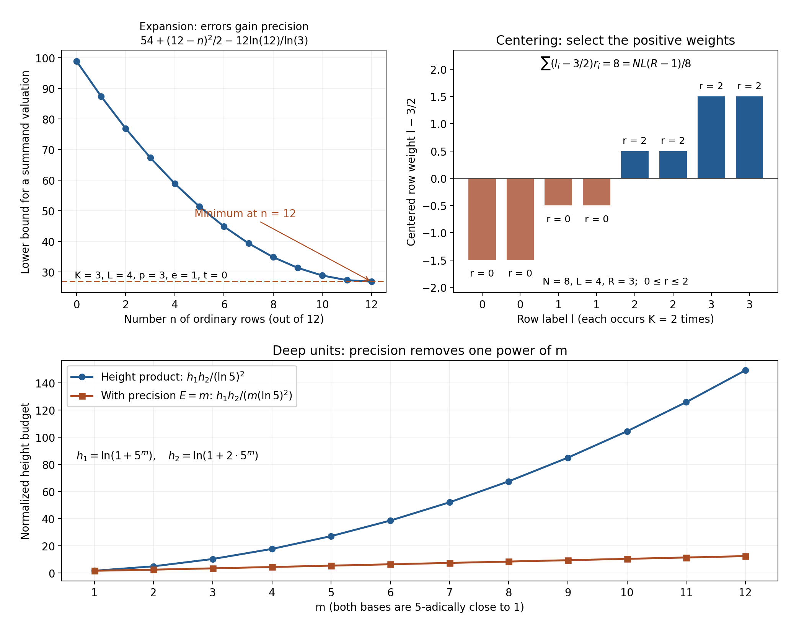

*Figure 1. Left: Lemma 10.5 with \(K=3,L=4,N=12,p=3,e=1,t=0,u=0\). Under its precision hypothesis, a summand using \(n\) ordinary rows has valuation at least \(54+(12-n)^2/2-12\ln12/\ln3\); the dots are these lower bounds, not measured determinant valuations. The minimum is attained in the bound at \(n=12\). Right: Lemma 10.2 with \(K=2,L=4,N=8,R=3\). The weights are \(l_i-3/2\); selecting \(r_i=2\) on positive weights and zero on negative weights gives the exact extremum \(8=NL(R-1)/8\). Equations (10.6) and (10.14) prove these two mechanisms. Bottom: the family \(\alpha_1=1+5^m,\alpha_2=1+2\cdot5^m\) from Theorem 10.11, with \(1\le m\le12\). The curves show the calculated height budgets \(h_1h_2/(\ln5)^2\) and \(h_1h_2/(m(\ln5)^2)\), where \(h_i=h(\alpha_i)\). They illustrate the precision divisor in (10.43); the curves are height factors, while the exact difference valuation is \(m\).*

## 4. The arithmetic determinant and a parameter theorem

For the selected columns define

\[
W=(R-1)b_2+(S-1)b_1,
\qquad
\beta=\frac W2
\left(\prod_{k=1}^{K-1}k!\right)^{-2/(K(K-1))}.
\tag{10.15}
\]

**Lemma 10.6 (height bound).** If \(\Delta\ne0\), then

\[
v(\Delta)\le\frac{dN}{2ef\ln p}
\left\{\ln N+(K-1)\ln\beta
+\frac{p^tL}{2}\bigl((R-1)h(\alpha_1)+(S-1)h(\alpha_2)\bigr)\right\}.
\tag{10.16}
\]

**Proof.** The polynomial

\[
P(X,Y)=\det\!\left(\binom{b_2r_j+b_1s_j}{k_i}X^{l_ir_j}Y^{l_is_j}\right)
\in\mathbb Z[X,Y]
\]

satisfies \(\Delta=P(\alpha_1^{p^t},\alpha_2^{p^t})\). Its coefficients are integers because each binomial is evaluated at a nonnegative integer.

On \(|X|=|Y|=1\), replace the binomial basis in each \(l\)-block by \((Z-W/2)^k/k!\), again without changing the determinant. Each row has Euclidean norm at most \(\sqrt N(W/2)^k/k!\). Hadamard's inequality gives

\[
\|P\|_{\mathbb T^2}\le N^{N/2}\beta^{N(K-1)/2}.
\tag{10.17}
\]

One can prove the inequality used here by successively subtracting orthogonal projections of each row onto the span of earlier rows. These operations preserve the determinant; the resulting perpendicular row lengths multiply to its absolute value, and each is no larger than its original row length. If the rows are dependent the determinant is zero.

Every monomial in the determinant expansion has first exponent \(\sum_i l_ir_{\pi(i)}\). Lemma 10.2 places all such exponents in an interval of length at most \(NL(R-1)/4\), and places all second exponents in an interval of length at most \(NL(S-1)/4\). Divide \(P\) by its smallest actual powers of \(X,Y\), obtaining an integer polynomial \(Q\) of these partial degrees. Multiplication by those unit powers changes neither its torus norm nor the valuation at the selected embedding.

We spell out the torus form of Liouville's inequality. For a complex polynomial of partial degrees \(a,b\), maximum modulus applied inside the unit disc, and to the reciprocal polynomial outside it, gives

\[
|Q(x,y)|\le\|Q\|_{\mathbb T^2}\max(1,|x|)^a\max(1,|y|)^b.
\]

Apply the one-variable argument successively. At finite places an integer polynomial satisfies the same bound without the torus factor. The weighted product formula, applied to the nonzero value, and the definition \(h(x)=d^{-1}\sum_w n_w\ln^+|x|_w\), therefore give

\[
v(Q(x,y))\le\frac d{ef\ln p}
\left(\ln\|Q\|_{\mathbb T^2}+a h(x)+b h(y)\right).
\]

Here the selected local weight is \(ef\). A nonzero integer polynomial has torus norm at least one: any nonzero coefficient is the corresponding Fourier coefficient on the torus and has absolute value at most that norm. Thus the archimedean factor used in the product formula has nonnegative logarithm. Insert (10.17), the two degree widths, and \(h(\alpha_i^{p^t})=p^t h(\alpha_i)\). This proves (10.16). \(\square\)

**Theorem 10.7 (p-adic determinant parameter theorem).** Let \(K\ge3,L\ge2\), and let \(R_1,R_2,S_1,S_2\) be positive integers. Put \(R=R_1+R_2-1\), \(S=S_1+S_2-1\), \(N=KL\), and define \(\beta\) by (10.15). Suppose two residue classes \(c_1,c_2\pmod g\) satisfy

\[
\begin{aligned}
\#\{\alpha_1^{p^tr}\alpha_2^{p^ts}:&\ 0\le r<R_1,\ 0\le s<S_1,
\ m_1r+m_2s\equiv c_1\pmod g\}\ge L,\\
\#\{b_2r+b_1s:&\ 0\le r<R_2,\ 0\le s<S_2,
\ m_1r+m_2s\equiv c_2\pmod g\}>(K-1)L.
\end{aligned}
\tag{10.18}
\]

If

\[
\begin{aligned}
p^tK(L-1)\ln p>{}&(d/f+2e)\ln N+(d/f)(K-1)\ln\beta\\
&+\frac{d p^tL}{2f}\bigl((R-1)h(\alpha_1)+(S-1)h(\alpha_2)\bigr),
\end{aligned}
\tag{10.19}
\]

then

\[
v(\alpha_1^{b_1}-\alpha_2^{b_2})
<\frac{p^t}e\left(N-\frac12\right)+u.
\tag{10.20}
\]

**Proof.** The two rectangles restricted to their indicated classes are sets \(E_1,E_2\). Their sum lies in the larger rectangle and class \(c_1+c_2\). Apply Lemma 10.3 with \(a_i=\alpha_i^{p^t}\). A row dependence in (10.9) would be a nonzero polynomial of the stated partial degrees vanishing on the sum set. Hence the matrix restricted to that class has row rank \(N\), and contains a nonzero minor \(\Delta\).

If (10.20) failed, Lemmas 10.5 and 10.6 would both apply. Multiply their comparison by \(2e\ln p/N\). The result is the opposite weak inequality to (10.19). This contradiction proves the theorem. \(\square\)

## 5. A bound with the height floor \(1/d\)

**Theorem 10.8 (two p-adic logarithms).** Suppose \(\alpha_1,\alpha_2\) are multiplicatively independent p-adic units, and \(b_1,b_2\) are nonzero integers. Let \(d=[\mathbb Q(\alpha_1,\alpha_2):\mathbb Q]\), and choose real \(A_i>1\) satisfying

\[
\ln A_i\ge\max\{h(\alpha_i),1/d\}.
\]

Define

\[
\begin{gathered}
B'=\frac{|b_1|}{d\ln A_2}+\frac{|b_2|}{d\ln A_1},\\
H=\max\left\{\ln B'+\ln\ln p,\frac{10\ln p}d\right\}.
\end{gathered}
\tag{10.21}
\]

Then

\[
v(\alpha_1^{b_1}-\alpha_2^{b_2})
\le2500\,\frac{p^d-1}{(\ln p)^4}\,
d^4\ln A_1\ln A_2\,H^2.
\tag{10.22}
\]

In particular, the same inequality holds with \(132000\) in place of \(2500\).

**Proof.** Inverting a base when its exponent is negative makes both exponents positive, preserving the difference, heights, degree, and independence. We assume this has been done. Set

\[
G=p^d-1,\quad a_i=\frac{d\ln A_i}{\ln p},\quad
z=Ga_1a_2,\quad B=\frac{dH}{\ln p},\quad k=256.
\tag{10.23}
\]

We have \(B\ge10\), \(a_i\ge1/\ln p\), and \(z\ge d^2\ge1\). For the last assertion use \(\mathrm e^x-1\ge x^2\) for \(x\ge0\), with \(x=d\ln p\). Its derivative is \(\mathrm e^x-2x>0\), since \(\mathrm e^x\ge1+x+x^2/2>2x\), and it vanishes at \(x=0\).

Choose

\[
\begin{aligned}
L&=\lfloor2B\rfloor+2,& K&=\lfloor k z L\rfloor+1,\\
R_1&=\left\lfloor\sqrt{GL a_2/a_1}\right\rfloor+1,&
S_1&=\left\lfloor\sqrt{GL a_1/a_2}\right\rfloor+1,\\
R_2&=\left\lfloor\sqrt{G(K-1)L a_2/a_1}\right\rfloor+1,&
S_2&=\left\lfloor\sqrt{G(K-1)L a_1/a_2}\right\rfloor+1.
\end{aligned}
\tag{10.24}
\]

Thus \(2B<L\le(11/5)B\), \(K\ge k z L\), and

\[
R_1S_1>GL\ge gL,\qquad
R_2S_2>G(K-1)L\ge g(K-1)L.
\tag{10.25}
\]

Multiplicative independence makes the products in the first rectangle distinct. Pigeonhole among the \(g\) classes gives the first condition in (10.18).

We first suppose the map \((r,s)\mapsto b_2r+b_1s\) is injective within every class of the second rectangle. Pigeonhole gives the second condition. We verify the remaining parameter inequality.

Let \(Q_K=(\prod_{j=1}^{K-1}j!)^{-2/(K(K-1))}\). Elementary integration of \(\ln x\) gives \(\ln(j!)\ge j\ln j-j\). Since \(x\ln x\) increases for \(x\ge1\),

\[
\sum_{j=1}^{K-1}j\ln j
\ge\int_0^{K-1}x\ln x\,dx
=\frac{(K-1)^2}2\ln(K-1)-\frac{(K-1)^2}4.
\]

For the first interval the integral is negative and its endpoint value is zero; for every later unit interval the increasing-function comparison applies. Consequently

\[
\ln Q_K\le-\ln(K-1)+\frac32
+\frac{\ln(K-1)-1/2}{K}
\le-\ln(K-1)+2.
\tag{10.26}
\]

The last step uses \(\ln m\le(m+1)/2\) for \(m\ge2\), obtained by differentiating from \(m=2\). Also \(K-1\ge255zL\). Formula (10.24) gives

\[
\begin{aligned}
W&\le\sqrt{zL}\bigl(1+\sqrt{K-1}\bigr)
\left(\frac{b_1}{a_2}+\frac{b_2}{a_1}\right),\\
\beta&\le\frac{\mathrm e^2}{2\sqrt{255}}
\left(1+\frac1{\sqrt{K-1}}\right)
\left(\frac{b_1}{a_2}+\frac{b_2}{a_1}\right)
<\frac{b_1}{a_2}+\frac{b_2}{a_1}=B'\ln p.
\end{aligned}
\tag{10.27}
\]

Indeed \(\mathrm e<3\), \(\sqrt{255}>15\), and the parenthesis is at most two. The elementary bound \(\mathrm e<3\) follows by bounding the tail of \(\sum1/j!\) by a geometric series. Thus \(\ln\beta\le H\). Using \(d/f\le d\), \(e\le d\), \(p^t\ge1\), and the height budgets, a sufficient condition for (10.19) is

\[
K(L-1)>\frac{3d}{\ln p}\ln N
+(K-1)B+L\bigl((R-1)a_1+(S-1)a_2\bigr).
\tag{10.28}
\]

This sufficient comparison is valid even when \(\ln\beta<0\), because \(H>0\) and \(\ln\beta\le H\).

The left side minus \((K-1)B\) is at least \(k z L B\). For the height term,

\[
L\bigl((R-1)a_1+(S-1)a_2\bigr)
\le2\sqrt{k}\,zL^2+2\sqrt z\,L^{3/2}
<72zLB.
\tag{10.29}
\]

To check the last strict inequality, divide by \(zLB\). The first term is at most \(32\cdot11/5=70.4\); the second is at most \(2\sqrt{(11/5)/10}<1\).

Also \(N\le257zL^2\). Since \(z\ge d^2\), we have \(d/z\le1\) and \(d\ln z/z\le1\): the latter follows from \(d\le\sqrt z\) and \(\ln z/\sqrt z\le2/\mathrm e<1\), found by differentiation. Using \(1/\ln p\le1/\ln2<2\), we obtain

\[
\frac{3d\ln N}{zLB\ln p}
\le\frac{6(\ln257+1+2\ln L)}{LB}
\le\frac{6(\ln257+1+2\ln20)}{200}<1.
\tag{10.30}
\]

The middle comparison uses \(B\ge10,L\ge20\) and the decreasing function \((\ln257+1+2\ln L)/L\). For the last comparison the elementary bounds \(\ln257<6\), \(\ln20<3\) already suffice. Hence the right side of (10.28), after removing \((K-1)B\), is less than \(73zLB\); its left side is at least \(256zLB\). Theorem 10.7 applies and gives \(v(\Lambda)<2N+u\).

It remains to treat a collision in the second rectangle. Subtract the colliding labels. With \(n=\gcd(b_1,b_2)\), \(r_0=b_1/n\), \(s_0=b_2/n\), the differences are \((\ell r_0,-\ell s_0)\) for a nonzero integer \(\ell\). Put \(\sigma=\alpha_1^{r_0}\alpha_2^{-s_0}\). Its residue has an order \(q\mid g\). The class congruence gives \(q\mid\ell\), so

\[
q r_0\le R_2-1,\qquad q s_0\le S_2-1.
\tag{10.31}
\]

If \(q\nmid n\), then \(v(\Lambda)=0\). Otherwise \(n=q p^u n'\), with \(p\nmid n'\). The prime-to-p power law, followed by the p-power laws of Lesson 9, shows

\[
v(\Lambda)=v(\sigma^n-1)
\le u+v(\sigma^{q p^t}-1).
\]

If \(u\ge t\), the deep-domain formula gives equality with \(u-t\) in place of \(u\). If \(u<t\), raising the principal unit to further p-th powers never decreases its positive valuation, giving the displayed inequality. Independence ensures \(\sigma^{q p^t}\ne1\). Applying the weighted product formula to \(X-1\), as in Lemma 10.6, gives

\[
\begin{aligned}
v(\Lambda)
&\le u+\frac d{ef\ln p}
\left(p^tq(r_0h(\alpha_1)+s_0h(\alpha_2))+\ln2\right)\\
&\le u+2\bigl((R_2-1)a_1+(S_2-1)a_2\bigr)+d\\
&\le u+64zL+z.
\end{aligned}
\tag{10.32}
\]

Here (10.3) bounds \(p^t/e\), (10.31) bounds the exponents, and \(d\le z\).

Finally, \(b_1\le a_2\mathrm e^H\). Since \(\ln^+a_2\le a_2\) and \(a_1\ln p\ge1\),

\[
u\le\frac{\ln b_1}{\ln p}
\le\frac Bd+\frac{\ln^+a_2}{\ln p}
\le B+a_1a_2\le B+z
\le\frac{11}{100}zB^2.
\tag{10.33}
\]

In the injective case,

\[
2N+u\le\left(514\left(\frac{11}{5}\right)^2+\frac{11}{100}\right)zB^2
<2500zB^2.
\]

The collision bound (10.32) is at most \(14.2zB^2\), since \(L\le(11/5)B\) and \(B\ge10\). Thus both cases give (10.22), because

\[
zB^2=\frac{p^d-1}{(\ln p)^4}\,d^4\ln A_1\ln A_2\,H^2.
\]

This completes the proof. \(\square\)

The factor \(p^d-1\) in these parameter choices is an upper budget for the number of residue classes. It is not being asserted to equal the local residue-group order. This distinction allows the height floor \(1/d\) without inserting an additional absolute cutoff in \(H\).

## 6. Coprime powers and a worked example

**Corollary 10.9.** Let \(a>b\ge1\) be coprime positive integers, and let \(p\nmid ab\) be prime. Then

\[
v_p(a^{p-1}-b^{p-1})
\le250000\,\frac{p-1}{(\ln p)^2}\,\ln(5a)\ln(5b).
\tag{10.34}
\]

**Proof.** First suppose \(b>1\). Coprimality makes the bases \(a,b\) multiplicatively independent: a prime dividing either base forces its exponent to vanish in a proposed relation. In Theorem 10.8 take \(d=1\), \(b_1=b_2=p-1\), and \(\ln A_1=\ln(5a)\), \(\ln A_2=\ln(5b)\). These exceed their rational heights and one.

For \(b=1\), choose \(c\in\{2,3,5\}\) such that \(c\ne p\) and \(a,c\) are multiplicatively independent. Such a prime always exists. Dependence of \(a\ge2\) and a prime \(c\) would force \(a=c^j\) for an integer \(j\ge1\): taking a prime valuation outside \(c\) in the relation makes the exponent of \(a\) zero unless every prime divisor is \(c\). Thus at most one of the three primes is dependent with \(a\), and excluding \(p\) removes at most one more.

Set \(\alpha_1=a/c,\alpha_2=1/c\). A relation \(\alpha_1^u\alpha_2^v=1\) is \(a^u c^{-u-v}=1\), so independence of \(a,c\) forces \(u=v=0\). Both bases are p-adic units, their common number field is \(\mathbb Q\), and
\[
h(a/c)\le\ln\max\{a,c\}\le\ln(5a),\qquad
h(1/c)=\ln c\le\ln5.
\]
Use \(\ln A_1=\ln(5a)\), \(\ln A_2=\ln5\), and again \(b_1=b_2=p-1\). The exact identity
\[
\left(\frac ac\right)^{p-1}
-\left(\frac1c\right)^{p-1}
=c^{-(p-1)}(a^{p-1}-1)
\]
preserves the valuation, since \(c\ne p\).

In both cases the height choices are the stated \(\ln(5a),\ln(5b)\), and
\[
B'\ln p\le\frac{2(p-1)\ln p}{\ln5},
\qquad \ln(B'\ln p)\le3\ln p<10\ln p.
\]
For the second inequality use \(\ln\ln p\le\ln p\), \(p-1\le p\), and \(\ln(2/\ln5)<\ln2\le\ln p\). Thus \(H=10\ln p\). Substitute it into the proved bound (10.22), and use the displayed valuation identity when \(b=1\). This proves (10.34) for every allowed prime, including \(p=2\). \(\square\)

For positive integers \(a,b\), the independent bases \(2,3\) are 5-adic units. Taking \(\ln A_1=1\), \(\ln A_2=\ln3\), Theorem 10.8 gives

\[
v_5(2^a-3^b)
\le\frac{10000\ln3}{(\ln5)^4}
\max\!\left\{\ln\left(\frac a{\ln3}+b\right)+\ln\ln5,10\ln5\right\}^{2}.
\tag{10.35}
\]

If \(M=\max(a,b)\), its maximum is at most \(10\ln5+\ln(3M)\). This is an explicit constant times \((1+\ln M)^2\). For example \(2^3-3=5\), so its valuation is one; \(2^7-3=125\), so its valuation is three. These are exact illustrations of the quantity being bounded, rather than numerical evidence for the theorem.

**Corollary 10.10 (all powers).** For coprime \(a>b\ge1\), an odd prime \(p\nmid ab\), and \(n\ge1\),

\[
v_p(a^n-b^n)
\le250000\ln(5a)\ln(5b)\frac p{(\ln p)^2}+v_p(n).
\tag{10.36}
\]

**Proof.** Let \(q\mid p-1\) be the residue order of \(a/b\). If \(q\nmid n\), the valuation is zero. Otherwise write \(n=qm\). The base \((a/b)^q\) is a principal unit in \(\mathbb Q_p\), whose positive valuation is at least one and thus strictly exceeds \(1/(p-1)\). The prime-to-p and deep p-power laws proved in Lesson 9 give

\[
v_p(a^n-b^n)=v_p(a^q-b^q)+v_p(m)
=v_p(a^{p-1}-b^{p-1})+v_p(n).
\]

Here \(p\nmid q\) and \(p\nmid(p-1)/q\). Apply Corollary 10.9 and \(p-1\le p\). \(\square\)

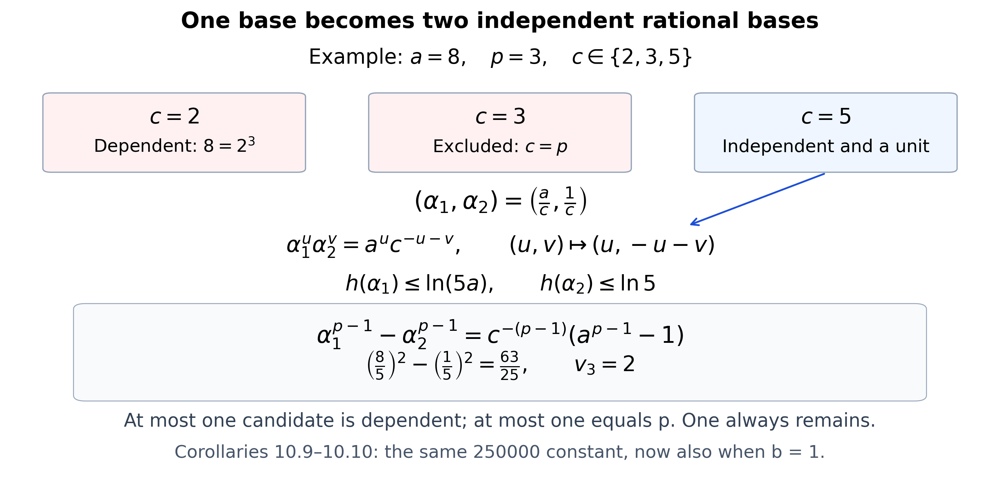

*Figure 10.1b. Choose \(c\in\{2,3,5\}\) with \(c\ne p\) and independent of \(a\). At most one candidate is removed by dependence and at most one by the prime \(p\). The invertible exponent change \((u,v)\mapsto(u,-u-v)\) proves that \(a/c,1/c\) are independent. The lower row gives the exact unit-factor identity and the height choices \(\ln A_1=\ln(5a),\ln A_2=\ln5\). The example \(a=8,p=3\) removes \(c=2\) by dependence and \(c=3\) by the unit condition, leaving \(c=5\); both differences have valuation two. The complete argument is Corollaries 10.9–10.10, and Solution 30 verifies the examples and the height cutoff. Human-source context: the determinant estimate from Bugeaud's freely accessible 1999 paper, cited below; the auxiliary-prime embedding here is proved explicitly from Theorem 10.8. [Figure program](../figure_sources/one_base_embedding.py).*

## 7. A deep-unit refinement

The precision of the first base can improve the height factor. We state the coefficient and convergence conditions explicitly.

**Theorem 10.11 (an E-parameter estimate).** Let \(\alpha_1,\alpha_2\) be multiplicatively independent nonzero rationals with \(v_p(\alpha_i)=0\). Put \(g=p-1\), and suppose

\[
v_p(\alpha_1^g-1)\ge E>\frac1{p-1}.
\tag{10.37}
\]

If \(p=2\), require also \(v_2(\alpha_2-1)\ge2\). Let \(b_1,b_2\) be nonzero integers, \(u=v_p(\gcd(b_1,b_2))\), and require \(p\nmid b_2/p^u\). Choose

\[
\begin{gathered}
\ln A_i\ge\max\{h(\alpha_i),E\ln p\},\\
B'=\frac{|b_1|}{\ln A_2}+\frac{|b_2|}{\ln A_1},\qquad
H_E=\max\{\ln B'+\ln(E\ln p),10E\ln p\}.
\end{gathered}
\tag{10.38}
\]

Then

\[
v_p(\alpha_1^{b_1}-\alpha_2^{b_2})
\le1300\,\frac{p-1}{E^3(\ln p)^4}\,
\ln A_1\ln A_2\,H_E^2.
\tag{10.39}
\]

Consequently this inequality also holds with \(88000\) in place of \(1300\).

**Proof.** Invert bases with negative exponents as before. Inversion preserves the precision conditions, because the denominators introduced are units. Decompose \(\alpha_i=\eta^{m_i}\epsilon_i\) as in (10.1), now in \(\mathbb Q_p\). Since \(p\nmid g\), the prime-to-p power law gives \(v(\epsilon_1-1)=v(\alpha_1^g-1)\ge E\). Both principal units are in the exponential domain. For odd \(p\) their positive integer valuations are at least one, greater than \(1/(p-1)\); for \(p=2\), (10.37) and the second-base condition give valuations at least two.

If the original difference has valuation zero, the conclusion is immediate. Otherwise its residue factors agree, so it has the valuation of \(\epsilon_1^{b_1}-\epsilon_2^{b_2}\). For \(b_i'=b_i/p^u\), the deep p-power law gives

\[
\delta=\epsilon_1^{b_1'}-\epsilon_2^{b_2'},
\qquad v(\delta)=v(\alpha_1^{b_1}-\alpha_2^{b_2})-u.
\]

The matrix (10.9) is used with exponent multiplier one. In Lemma 10.5 take \(\omega=\log\epsilon_1\), so \(v(\omega)\ge E\). The assumed unit denominator \(b_2'\) gives \(z_j=r_j+(b_1'/b_2')s_j\in\mathbb Z_p\). Formula (10.11) holds with multiplier one and no root of unity in \(\delta\). The coefficient of its error part remains integral whenever \(v(\delta)>1/(p-1)\).

We give the resulting comparison, keeping the scale change visible. If \(v(\delta)\ge E(N-1/2)\), the alternant and factorial estimates in (10.13) give

\[
\begin{aligned}
v(A)&\ge E\left(\frac{n(n-1)}2-\sum_{i\in I}k_i\right)-\frac{n\ln n}{\ln p},\\
v(B)&\ge-\frac{\sum_{i\notin I}k_i}{p-1}
\ge-E\sum_{i\notin I}k_i.
\end{aligned}
\]

The positive coefficient \(E-1/(p-1)\) is what permits replacement of the Taylor-order sum by \(n(n-1)/2\). Formula (10.14) then gives

\[
v(\Delta)\ge\frac{ENK(L-1)}2-\frac{N\ln N}{\ln p}.
\]

The polynomial height proof of Lemma 10.6 has \(d=e=f=1\) and exponent multiplier one. Thus a sufficient parameter inequality is

\[
EK(L-1)\ln p>
3\ln N+(K-1)\ln\beta
+\frac L2\bigl((R-1)h(\alpha_1)+(S-1)h(\alpha_2)\bigr).
\tag{10.40}
\]

Under the two cardinality conditions (10.18), the zero lemma and these two bounds prove \(v(\Lambda)<E(N-1/2)+u\).

Use (10.24) with

\[
G=p-1,\qquad a_i=\frac{\ln A_i}{E\ln p},\qquad
z=Ga_1a_2,\qquad B=\frac{H_E}{E\ln p},\qquad k=256.
\tag{10.41}
\]

Here \(a_i\ge1\), \(z\ge G\ge1\), and \(B\ge10\). The cardinalities, factorial estimate and height comparison (10.25)–(10.29) apply unchanged, with \(B' E\ln p=b_1/a_2+b_2/a_1\). In particular \(\ln\beta\le H_E\), and the height contribution after division by \(E\ln p\) is less than \(72zLB\).

We check the remaining logarithmic contribution. From \(E>1/G\) and \(z\ge G\),

\[
\frac1{Ez\ln p}<\frac1{\ln p}<2,
\qquad
\frac{\ln z}{Ez\ln p}\le1.
\]

For the second bound, at \(p=2,3\) use \(1/(E\ln p)<2\) and \(\ln z/z\le1/\mathrm e\). For \(p\ge5\), the function \(\ln z/z\) decreases on \(z\ge G\ge4\), giving a bound \(\ln G/\ln p<1\). With \(N\le257zL^2\), therefore,

\[
\frac{3\ln N}{EzLB\ln p}
\le\frac{6(\ln257+1+2\ln L)}{LB}<1.
\]

The left side of the sufficient parameter inequality, after removing \((K-1)B\), is at least \(256zLB\), while its remaining right side is less than \(73zLB\). This verifies (10.40) in the injective case.

In the collision case, take \(q,r_0,s_0\) as in (10.31). If \(q\nmid n=\gcd(b_1,b_2)\), the valuation is zero. Otherwise \(\sigma^q\), with \(\sigma=\alpha_1^{r_0}\alpha_2^{-s_0}\), is a deep principal unit: its residue root has disappeared, and its two principal factors were already deep. Hence \(v(\Lambda)=u+v(\sigma^q-1)\). The one-place polynomial bound for \(X-1\) gives

\[
\begin{aligned}
v(\Lambda)
&\le u+\frac{q(r_0h(\alpha_1)+s_0h(\alpha_2))+\ln2}{\ln p}\\
&\le u+E\bigl((R_2-1)a_1+(S_2-1)a_2\bigr)+1\\
&\le u+32EzL+1\le u+Ez(32L+1).
\end{aligned}
\tag{10.42}
\]

Here \(Ez>EG>1\). Finally \(b_1\le a_2\mathrm e^{H_E}\), so

\[
u\le EB+\frac{\ln^+a_2}{\ln p}
\le EB+2Ez\le\frac{12}{100}EzB^2.
\]

The middle bound uses \(\ln^+a_2\le a_2\), \(EGa_1>1\), and \(1/\ln p<2\). In the injective case,

\[
EN+u\le
\left(257\left(\frac{11}{5}\right)^2+\frac{12}{100}\right)EzB^2
=1244EzB^2<1300EzB^2.
\]

The collision bound is at most \(7.17EzB^2\). Substituting (10.41) into \(EzB^2\) proves (10.39). \(\square\)

The coefficient condition singles out the first base whose logarithm supplies the precision \(E\). Interchanging bases is permissible only if the precision and second-base convergence hypotheses are checked for the newly ordered pair. At \(p=2\), a unit such as three has \(v_2(3-1)=1\), on the exponential boundary; its positivity alone does not provide the deep-unit substitution used in this proof.

For a concrete family take

\[
\alpha_1=1+5^m,\qquad \alpha_2=1+2\cdot5^m,\qquad E=m,\qquad m\ge1.
\]

The two integers are coprime, because twice the first minus the second is one. They exceed one, so they are multiplicatively independent. Their fourth powers have distance valuation \(m\) from one, by the prime-to-five power law. Both height budgets may be their actual logarithms. For \(b_1=b_2=1\), \(H_E=10m\ln5\) and the exact difference valuation is \(m\). The bound (10.39) is

\[
v_5(\alpha_1-\alpha_2)
\le520000\,
\frac{\ln(1+5^m)\ln(1+2\cdot5^m)}{m(\ln5)^2}.
\tag{10.43}
\]

The height factor is linear in \(m\), bounded explicitly by
\((m\ln5+\ln2)(m\ln5+\ln3)/(m(\ln5)^2)\). Without the precision divisor, the product of these heights is quadratic in \(m\).

## 8. Saturated bases and Kummer degree

We now allow an arbitrary number of bases. A root which already belongs to the number field should be incorporated into the bases before taking an auxiliary extension. The following construction does this and proves the resulting extension degree.

Let \(K\) be a number field of degree \(d\), embedded in \(\mathbb C\). Let \(q\) be a prime, and assume that \(K\) contains all the q-th roots of unity. For \(n\ge1\) and multiplicatively independent \(\alpha_1,\ldots,\alpha_n\in K^*\), define

\[
\begin{aligned}
M_q(\boldsymbol\alpha)=\{\boldsymbol v\in\mathbb Z[1/q]^n:\ &\text{for some }T=q^t,
\ T\boldsymbol v\in\mathbb Z^n,\\
&\alpha_1^{Tv_1}\cdots\alpha_n^{Tv_n}=\beta^T
\text{ for some }\beta\in K^*\}.
\end{aligned}
\tag{10.44}
\]

No choice of complex logarithms is involved in this definition.

The complete finite-height count in [Heights of algebraic numbers](../../TR-TRANS/TR-TRANS-02.html#theorem-2-6-northcott-s-finite-box), Theorem 2.6, bounds the number of algebraic numbers of degree at most \(d\) and height at most \(H\ge0\) by

\[
\mathcal N(d,H)=d^2\bigl(2^{d+1}\mathrm e^{dH}+1\bigr)^{d+1}.
\tag{10.45}
\]

We use its polynomial coefficient proof and the height arithmetic of Proposition 2.5 in that earlier lesson.

**Lemma 10.12 (finite saturation).** The set \(M=M_q(\boldsymbol\alpha)\) is an additive subgroup of \(\mathbb Q^n\), contains \(\mathbb Z^n\), and has finite index over it. More precisely,

\[
 [M:\mathbb Z^n]\le\mathcal N\left(d,\sum_{j=1}^n h(\alpha_j)\right).
\tag{10.46}
\]

This index is a power of \(q\). The group \(M\) has a basis of \(n\) rational vectors over \(\mathbb Z\).

**Proof.** Powers \(T\) in (10.44) can be enlarged to a common power of \(q\). Multiplying or dividing the corresponding \(\beta\)'s proves closure under addition and subtraction. Integral vectors belong to \(M\) with \(T=1\).

Every coset modulo \(\mathbb Z^n\) has a unique representative \(\boldsymbol v\) with \(0\le v_j<1\). Choose one associated \(\beta\) from (10.44). The product inequality and power identity in [Heights of algebraic numbers](../../TR-TRANS/TR-TRANS-02.html#proposition-2-5-sums-products-powers-and-conjugates), Proposition 2.5, give

\[
 T h(\beta)=h\left(\prod_j\alpha_j^{Tv_j}\right)
 \le T\sum_j v_jh(\alpha_j)\le T\sum_j h(\alpha_j).
\]

Distinct representatives give distinct chosen \(\beta\)'s. Indeed, if two choices were equal, raise their defining equations to a common power \(T\). Their quotient would give \(\prod_j\alpha_j^{T(v_j-w_j)}=1\). Independence forces every \(v_j=w_j\). The earlier finite-height count (10.45) therefore bounds the number of cosets as asserted.

There are finitely many representatives, and each has a denominator which is a power of \(q\). Choose a common denominator \(q^a\). Then
\(\mathbb Z^n\subset M\subset q^{-a}\mathbb Z^n\). The finite group \(M/\mathbb Z^n\) is a subgroup of \((q^{-a}\mathbb Z/\mathbb Z)^n\), so its order is a power of \(q\).

For completeness, a subgroup \(L\subset\mathbb Z^n\) containing \(m\mathbb Z^n\), with \(m>0\), has an integral basis of size \(n\). Prove this by induction. Its first-coordinate image is \(c\mathbb Z\) for some \(c>0\): take the least positive first coordinate and apply integer division. Choose \(\boldsymbol x\in L\) with first coordinate \(c\). The kernel of that projection contains \(m\mathbb Z^{n-1}\), so has an \((n-1)\)-element basis by induction. Any element of \(L\) becomes an element of the kernel after subtracting the appropriate integer multiple of \(\boldsymbol x\). These \(n\) vectors are independent and span \(L\). Apply this to \(L=q^aM\) and divide its basis by \(q^a\). \(\square\)

**Lemma 10.13 (the maximal q-primary root).** The q-primary roots of unity in \(K\) form a finite cyclic group. If \(\alpha_0\) generates it and has order \(q^u\), then \(u\ge1\), and \(\alpha_0^a\) is not a q-th power in \(K\) when \(q\nmid a\).

**Proof.** Roots of unity have height zero, by the height power identity. Finiteness follows from (10.45) with \(H=0\). The finite-subgroup argument of Section 1 applies over any field: its root count and the existence of an element of maximal exponent prove cyclicity. The assumption that q-th roots are in \(K\) gives \(u\ge1\). If \(\beta^q=\alpha_0^a\) with \(q\nmid a\), then \(\beta^{q^{u+1}}=1\), while its q-th power has order \(q^u\). Thus \(\beta\) has order \(q^{u+1}\), contradicting maximality of \(u\). \(\square\)

Fix such a generator \(\alpha_0\).

Choose a basis \(\boldsymbol v_1,\ldots,\boldsymbol v_n\) of \(M\). By (10.44), after choosing a common power \(T=q^t\), there are \(\theta_i\in K^*\) with

\[
 \theta_i^T=\prod_{j=1}^n\alpha_j^{T v_{ji}},
 \qquad v_{ji}=(\boldsymbol v_i)_j.
\tag{10.47}
\]

**Theorem 10.14 (the saturated Kummer condition).** The classes of
\(\alpha_0,\theta_1,\ldots,\theta_n\) in \(K^*/(K^*)^q\) are linearly independent over \(\mathbb F_q\). Consequently

\[
 [K(\alpha_0^{1/q},\theta_1^{1/q},\ldots,\theta_n^{1/q}):K]
 =q^{n+1}.
\tag{10.48}
\]

**Proof.** Suppose \(\alpha_0^{a_0}\prod_i\theta_i^{a_i}=\beta^q\), with integers \(a_i\) and \(\beta\in K^*\). Enlarge \(T\) in (10.47) until it is divisible by the order of \(\alpha_0\). Raising the relation to \(T\) shows that

\[
 \boldsymbol w=\frac1q\sum_i a_i\boldsymbol v_i\in M:
 \quad \prod_j\alpha_j^{qT w_j}=\beta^{qT}.
\]

Uniqueness of integral coordinates in the basis of \(M\) forces \(q\mid a_i\) for \(1\le i\le n\). Dividing out the corresponding q-th powers, we find that \(\alpha_0^{a_0}\) is a q-th power in \(K\). If \(q\nmid a_0\), its q-th root would have order \(q^{u+1}\), contradicting the choice of \(\alpha_0\). Thus \(q\mid a_0\) as well. This proves independence of all the classes.

We prove the degree consequence directly. More generally, let \(c_1,\ldots,c_r\in K^*\) have independent classes modulo q-th powers, and choose roots \(\rho_i^q=c_i\). The field \(L=K(\rho_1,\ldots,\rho_r)\) splits the separable polynomials \(X^q-c_i\), since all q-th roots of unity are already in \(K\). Fix a primitive q-th root \(\zeta\). Every \(K\)-automorphism acts by
\(\rho_i\mapsto\zeta^{t_i}\rho_i\), giving an injective group homomorphism

\[
 \operatorname{Aut}_K(L)\longrightarrow\mathbb F_q^r.
\]

Its image is a vector subspace. If it were proper, Gaussian elimination would give a nonzero vector \(\boldsymbol a\in\mathbb F_q^r\) annihilating it. Choose integer representatives \(0\le a_i<q\). The element \(\prod_i\rho_i^{a_i}\) would then be fixed by every automorphism and would belong to \(K\). Its q-th power is \(\prod_i c_i^{a_i}\), contradicting the independence of the classes.

Here the fixed-element assertion and the automorphism count need only elementary separability. An embedding of an intermediate field extends across each algebraic generator by choosing a root of the transported minimal polynomial. In characteristic zero these roots are distinct, so the number of embeddings of \(L\) equals the product of the successive degrees, namely \([L:K]\). Since \(L\) is a splitting field, every such embedding has image \(L\). If an element outside \(K\) were fixed, choose a different root of its separable minimal polynomial and extend that embedding to \(L\); the resulting automorphism would move it. Thus the fixed elements are precisely \(K\).

The automorphism image is therefore all of \(\mathbb F_q^r\), and \([L:K]=q^r\). Apply this with \(r=n+1\) and the already proved independent classes. \(\square\)

**Lemma 10.15 (the residue index does not depend on the saturated basis).** Suppose \(q\ne p\), a prime of \(K\) above \(p\) is fixed, and every \(\alpha_j\) is a unit there. The group
\(\langle\alpha_0,\theta_1,\ldots,\theta_n\rangle\subset K^*\) is independent of the basis and of the root choices in (10.47). Its generators are p-adic units. If the residue field has size \(p^f\), the integer

\[
 \delta_q(\boldsymbol\alpha)=
 \frac{p^f-1}{|\langle\overline{\alpha_0},\overline{\theta_1},
 \ldots,\overline{\theta_n}\rangle|}
\tag{10.49}
\]

is consequently well defined.

**Proof.** Replacing a root choice in (10.47) multiplies \(\theta_i\) by a q-primary root of unity in \(K\), hence by a power of \(\alpha_0\). For a change of basis write \(\boldsymbol v_i'=\sum_j c_{ji}\boldsymbol v_j\), with the integer matrix \(C\) invertible over \(\mathbb Z\). Raising to a common power \(T=q^t\) shows that
\(\theta_i'/\prod_j\theta_j^{c_{ji}}\) is again a q-primary root of unity. The new group is contained in the old one. Applying the inverse integral matrix gives the reverse inclusion.

Taking the valuation in (10.47) gives \(v(\theta_i)=0\); roots of unity are units too. Reduction is therefore defined. Its image is a subgroup of the cyclic group of order \(p^f-1\) proved in Section 1, so its order divides \(p^f-1\), and the quotient in (10.49) is an integer. Basis independence proves the final assertion. \(\square\)

For example, take \(K=\mathbb Q\), \(q=2\), \(\alpha_1=4\), and \(\alpha_2=9\). Prime valuations show that
\(M_2(4,9)=\tfrac12\mathbb Z^2\). A saturated basis gives \(\theta_1=2,\theta_2=3\), and \(\alpha_0=-1\). Theorem 10.14 proves

\[
 [\mathbb Q(\sqrt{-1},\sqrt2,\sqrt3):\mathbb Q]=8.
\]

Starting with \(4,9\) would instead leave both classes trivial modulo squares. Saturation exposes the arithmetic independence needed for the auxiliary extension.

## 9. Counting heights and bounding saturation

The index in (10.46) is finite, but its bound uses the sum of the heights inside an exponential. A sharper count gives a product of heights and a small power of the field degree. This is the arithmetic input for reducing a form with many logarithms to independent bases.

Write \(\mathcal H(\gamma)=\exp h(\gamma)\) for multiplicative height. Let \(K\) have degree \(d\). The number field containing a scalar \(\theta\) below can be larger than \(K\).

**Lemma 10.16 (a count at one archimedean place).** Fix an archimedean place of \(K\), represented by \(\sigma:K\to\mathbb C\), and put \(f=1\) for a real place and \(f=2\) for a complex place. Fix \(\phi\ne0\) algebraic and a number field \(L\supset K(\phi)\), of degree \(\ell\). Use the product-formula absolute values of \(L\), and set

\[
\begin{aligned}
\Phi_v&=\prod_{w\mid v}|\phi|_w^{1/\ell},&
\Phi_{\widehat v}&=\prod_{w\nmid v}|\phi|_w^{1/\ell},\\
A_v(a)&=\prod_{w\mid v}\max\{|\phi|_w,|a|_w\}^{1/\ell},&
A_{\widehat v}(a)&=\prod_{w\nmid v}\max\{|\phi|_w,|a|_w\}^{1/\ell}.
\end{aligned}
\]

Thus \(\Phi_v\Phi_{\widehat v}=1\), and
\(A_v(a)A_{\widehat v}(a)=\mathcal H(a/\phi)\). If \(X,Y\ge1\), \(N\ge2\), and \(u=N^{1/(N-1)}\), then

\[
\#\{a\in K:A_v(a)\le X\Phi_v,
\ A_{\widehat v}(a)\le Y\Phi_{\widehat v}\}
\le (N-1)\left(1+(uXY^2)^{d/f}\right)^f.
\tag{10.50}
\]

**Proof.** Finiteness follows from the earlier finite-height count: the numbers \(a/\phi\) lie in \(L\), have degree at most \(\ell\), and have height at most \(\ln(XY)\). The identity for \(A_vA_{\widehat v}\) follows by factoring \(|\phi|_w\) from each maximum and applying the product formula to \(\phi\).

The first local inequality implies \(|\sigma a|\le R\), where
\(R=(X\Phi_v)^{d/f}\). This follows because the sum of archimedean weights above \(v\) is \(f\ell/d\). Indeed, each embedding of \(K\) has \([L:K]\) extensions; conjugate complex embeddings contribute weight two, and real embeddings contribute weight one.

Put \(r=(uY^2\Phi_{\widehat v})^{-d/f}\). Draw around each \(\sigma a\) a ball of radius \(r\) in \(\mathbb R^f\). These balls lie in the ball of radius \(R+r\). We show that no point is in the interiors of \(N\) of them.

Otherwise there are distinct \(a_1,\ldots,a_N\) whose images lie in a ball of radius strictly less than \(r\), with centre \(z\). Put \(Q=N(N-1)/2\), and let
\(\Delta=\prod_{i<j}(a_j-a_i)\ne0\). Translating the Vandermonde rows replaces \((\sigma a_i)^k\) by \((\sigma a_i-z)^k\) without changing the determinant. Factoring the radius from its rows and using Hadamard's inequality gives
\(|\sigma\Delta|<N^{N/2}r^Q=u^Qr^Q\).
Here Hadamard's inequality follows by orthogonalizing the columns: this preserves the determinant and weakly decreases their norms, while the determinant of the orthogonal columns has absolute value the product of those norms.

At a finite place \(w\nmid v\), expand the determinant into its permutation monomials. Every monomial has total degree \(Q\) and degree at most \(N-1\) in each \(a_i\). With \(\lambda=|\phi|_w\), its absolute value is at most

\[
\lambda^{-Q}\prod_i\max\{\lambda,|a_i|_w\}^{N-1}.
\]

The ultrametric inequality gives the same bound for \(\Delta\). At an archimedean embedding \(\tau\) outside \(v\), apply Hadamard to the powers of \(\tau a_i/\tau\phi\). Each column has norm at most
\(\sqrt N\max\{1,|\tau a_i/\tau\phi|\}^{N-1}\), so the same bound has the extra factor \(N^{f_wN/2}\), where \(f_w=1\) or two is its archimedean weight.

Crucially, the sum of these *unselected* archimedean weights is exactly \(\ell(d-f)/d\). Multiplying their bounds and the finite-place bounds gives

\[
\prod_{w\nmid v}|\Delta|_w
\le u^{\ell Q(d-f)/d}
Y^{2\ell Q}\Phi_{\widehat v}^{\ell Q}.
\]

The selected place contributes strictly less than
\((ur)^{f\ell Q/d}\). The full product is therefore strictly less than
\((r^{f/d}uY^2\Phi_{\widehat v})^{\ell Q}=1\), contrary to the product formula. This proves the asserted multiplicity bound for the balls.

Integrate their indicator functions. Their sum is at most \(N-1\) outside their boundaries, which have volume zero. Scaling a ball's volume by its radius gives
\(M r^f\le(N-1)(R+r)^f\) for the number \(M\) of centres. Since \(R/r=(uXY^2)^{d/f}\), this is (10.50). \(\square\)

We need a uniform choice of \(N\). For \(d\ge2\), take

\[
m=\lfloor d\ln d\rfloor,\qquad N=m+1,\qquad
u=N^{1/m},\qquad u^d<8.
\tag{10.51}
\]

Here is a proof of the last inequality for every degree. For \(d=2,3\), the choices are \(N=2,4\), giving \(u^d=4\) in both cases. For \(d\ge4\), put \(x=d\ln d>4\). Then \(m\ge3x/4\), \(N\le5x/4\), and

\[
\frac{d\ln N}{m}
\le\frac43\left(1+\frac{\ln\ln d}{\ln d}
+\frac{\ln(5/4)}{\ln d}\right)
<\frac43\left(1+\frac38+\frac16\right)=\frac{37}{18}<\ln8.
\]

The first fraction is at most \(1/\mathrm e<3/8\), by differentiating \(\ln t/t\). The second is less than \(1/6\), since \((5/4)^6<4\). Finally
\(\ln2=2\sum_{j\ge0}(1/3)^{2j+1}/(2j+1)>56/81\), which proves \(\ln8>37/18\). This series follows by integrating the geometric series on \([0,1/3]\). The elementary bounds \(8/3<\mathrm e<3\) follow directly from its exponential series. They give \(1/2<\ln2<1\) and \(1<\ln3<4/3\); for the last upper bound, use \((8/3)^4>3^3\). These also verify the two small choices of \(N\).

**Theorem 10.17 (uniform twisted height count).** Let \(\theta\ne0\) be algebraic and \(H\ge1\). The following bounds hold:

\[
\begin{aligned}
\#\{a\in K:\mathcal H(\theta a)\le H\}
&\le68d\ln d\,H^{2d} &&(d\ge2),\\
&\le31d\ln d\,H^{2d} &&(d\ge2,\ \theta\in K),\\
&\le17H^2 &&(d=1).
\end{aligned}
\tag{10.52}
\]

**Proof.** Apply Lemma 10.16 with \(\phi=1/\theta\). Both ratios \(A_v/\Phi_v\) and \(A_{\widehat v}/\Phi_{\widehat v}\) are at least one, and their product is \(\mathcal H(\theta a)\). Divide the first ratio into bands
\(2^{(i-1)/d}\le A_v/\Phi_v<2^{i/d}\). There are at most
\(I=1+\lfloor d\ln H/\ln2\rfloor\) bands. Within band \(i\), set
\(X_i=2^{i/d}\), \(Y_i=2^{-(i-1)/d}H\). Then
\(X_iY_i^2=2^{(2-i)/d}H^2\).

Let \(M(H)\) denote the count. Summing (10.50), using
\(I\le H^d\), \(\sum_{i\ge1}2^{2-i}=4\), and
\(\sum_{i\ge1}2^{(2-i)/2}=2/(\sqrt2-1)\), gives

\[
\begin{aligned}
M(H)&\le m(1+4u^d)H^{2d} &&(f=1),\\
M(H)&\le m\left[
\left(1+\frac{4u^{d/2}}{\sqrt2-1}\right)H^d
+4u^dH^{2d}\right] &&(f=2).
\end{aligned}
\tag{10.53}
\]

To see \(I\le H^d\), put \(t=H^d\); if \(k=\lfloor\log_2t\rfloor\), then \(k+1\le2^k\le t\). With (10.51), the first coefficient is less than 33, and the two coefficients in the second line are less than 31 and 32: use \(\sqrt8<3\) and \(1/(\sqrt2-1)=1+\sqrt2<5/2\). Since \(m\le d\ln d\), both imply the first assertion of (10.52). For \(d=1\), take \(N=2,u=2\) instead. The first line yields \(M(H)\le H+8H^2\le9H^2<17H^2\).

If \(\theta\in K\), multiplication by \(\theta\) is a bijection, so reduce to \(\theta=1\). The set contains \(0,1,-1\). All other elements pair as \(a,a^{-1}\), with equal heights, and at least one member of each pair satisfies \(|\sigma a|\le1\). Consequently a subset of cardinality \((M(H)+3)/2\) satisfies the inequalities of Lemma 10.16 with \(X=1,Y=H,\phi=1\). At a complex place this gives
\(M(H)\le2m(1+u^{d/2}H^d)^2-3\le30d\ln d\,H^{2d}\); at a real place it gives
\(M(H)\le2m(1+u^dH^{2d})-3\le18d\ln d\,H^{2d}\). These prove the second assertion. \(\square\)

**Theorem 10.18 (the full saturation index).** For independent
\(\alpha_1,\ldots,\alpha_n\in K^*\), define

\[
M_K(\boldsymbol\alpha)=
\{\boldsymbol v\in\mathbb Q^n:
T\boldsymbol v\in\mathbb Z^n,
\ \prod_j\alpha_j^{Tv_j}=\beta^T
\text{ for some }T\ge1,\ \beta\in K^*\}.
\tag{10.54}
\]

Let \(w_K\) be the number of roots of unity in \(K\). This is a lattice containing \(\mathbb Z^n\), and

\[
w_K[M_K:\mathbb Z^n]
\le C_d\frac{n!\mathrm e^n}{n^n}\prod_jh(\alpha_j),
\qquad
C_d=\begin{cases}58d^{n+1}\ln d,&d\ge2,\\17,&d=1.
\end{cases}
\tag{10.55}
\]

**Proof.** Common integer powers prove that \(M_K\) is a subgroup. The coset argument of Lemma 10.12 applies with arbitrary positive integers \(T\): distinct representatives in \([0,1)^n\) give distinct elements of \(K\) of height at most \(\sum h(\alpha_j)\). Thus its index \(J\) is finite. A common denominator puts it between \(\mathbb Z^n\) and \(T^{-1}\mathbb Z^n\); the integral basis induction there proves it is a lattice. Its fundamental volume is \(1/J\), since the unit-volume fundamental domain of \(\mathbb Z^n\) contains \(J\) fundamental domains of \(M_K\).

The group of all roots of unity in \(K\) is finite by (10.45) with height zero, and the finite-subgroup argument of Section 1 makes it cyclic. Each \(h_j=h(\alpha_j)\) is positive: otherwise all powers of \(\alpha_j\) have height zero and lie in \(K\), so the same finite-height count would make two powers equal, contradicting independence.

For \(H>1\), the open diamond

\[
S=\{\boldsymbol x:\sum_jh_j|x_j|<\ln H\}
\quad\text{has volume}\quad
V=\frac{2^n(\ln H)^n}{n!\prod_jh_j}.
\tag{10.56}
\]

In each orthant, scale the coordinates by \(h_j\) and integrate the simplex \(\sum y_j<\ln H\); induction by its last coordinate gives volume \((\ln H)^n/n!\). This proves the volume formula.

Average the count \(\sum_{\boldsymbol v\in M_K}1_S(\boldsymbol t+\boldsymbol v)\) over a fundamental domain. Translating its integrals tiles \(\mathbb R^n\), so the integral equals \(V\) and its average equals \(JV\). Some coset therefore has at least \(JV\) points in \(S\). There are only finitely many in the bounded diamond. Since \(S\) is open, perturb the translating vector to a rational vector while retaining this finite set of points. Denote the resulting rational points by \(P_0,\ldots,P_s\); their differences still lie in \(M_K\), and \(s+1\ge JV\).

Choose determinations \(\theta_i=\prod_j\alpha_j^{(P_i)_j}\). They are algebraic because the coordinates are rational. The definition of \(M_K\) gives
\(\theta_i/\theta_0=\mu_i\beta_i\) for \(\beta_i\in K\) and roots of unity \(\mu_i\) in an algebraic closure. The height power and product identities give
\(h(\theta_0\beta_i)=h(\theta_i)<\ln H\). Multiplying by a root of unity preserves height: raise to its order and use the power identity.

The \(\beta_i\) are distinct modulo roots of unity in \(K\). If a quotient were a root of unity, then so would \(\theta_i/\theta_j\); raising to a common denominator and then to its order would contradict independence of the \(\alpha_j\). Consequently their \(w_K\) root-of-unity multiples give \(w_K(s+1)\) distinct elements of \(K\) counted by Theorem 10.17 with twist \(\theta_0\). Hence \(w_KJV\le M(H)\).

Take \(H=\exp(n/(2d))\). At a complex place, (10.53) divided by \(\exp(n)\) is less than
\(d\ln d(31/\sqrt{\mathrm e}+32)<58d\ln d\), since \(\sqrt{\mathrm e}>3/2\). At a real place the coefficient is less than \(33d\ln d\). Substitute (10.56) to obtain (10.55). For \(d=1\), the bound \(17H^2\) gives exactly its stated constant 17. \(\square\)

In particular, since \(w_K\ge1\) and the index is at least one,

\[
\prod_jh(\alpha_j)\ge
\frac{w_K}{C_d}\frac{n^n}{n!\mathrm e^n}.
\tag{10.57}
\]

**Corollary 10.19 (the q-primary part).** The lattice of Section 8 is exactly
\(M_q=M_K\cap\mathbb Z[1/q]^n\). Therefore (10.55) also bounds \(w_K[M_q:\mathbb Z^n]\).

**Proof.** Only the reverse inclusion needs proof. For a vector in the intersection, write a power realizing (10.54) as \(T=q^a m\) with \(q\nmid m\). Since its coordinates have q-power denominators, \(q^a\boldsymbol v\) is integral. Put \(\gamma=\prod_j\alpha_j^{q^av_j}\). The defining equation says \(\gamma^m=\beta^{q^am}\), so \(\zeta=\gamma/\beta^{q^a}\in K\) has order dividing \(m\). Raising to \(q^a\) is a bijection on this finite cyclic group, by Bezout's identity for \(q^a,m\). Choose \(\eta\in\langle\zeta\rangle\) with \(\eta^{q^a}=\zeta\). Then \(\gamma=(\beta\eta)^{q^a}\), which realizes (10.44). The inclusion of finite quotients gives the index inequality. \(\square\)

**Corollary 10.20 (a primitive circuit relation).** Suppose
\(\alpha_0,\ldots,\alpha_n\in K^*\) are dependent but every \(n\) of them are independent. There are nonzero integers \(b_i\) with \(\prod_i\alpha_i^{b_i}=1\) and

\[
|b_i|\le C_d\frac{n!\mathrm e^n}{n^n}
\prod_{j\ne i}h(\alpha_j)\qquad(0\le i\le n),
\tag{10.58}
\]

where \(C_d\) is the degree factor in (10.55).

**Proof.** The integer vectors whose products are roots of unity have rational rank one. Two nonproportional such vectors could eliminate a coordinate, producing a nonzero torsion relation on only \(n\) bases; raising to the torsion order contradicts their independence. Divide any nonzero relation vector by its coordinate gcd to obtain a primitive vector \(\boldsymbol r\). Its product is still a root of unity, since a power of that product is one. All \(r_i\ne0\), and every integer vector in this rational line is an integer multiple of \(\boldsymbol r\), by Bezout's identity for its coordinate gcd.

The vector \((r_1/r_0,\ldots,r_n/r_0)\) belongs to \(M_K(\alpha_1,\ldots,\alpha_n)\): take \(T=|r_0|w_K\) and \(\beta=\alpha_0^{-1}\) in (10.54). The root of unity in the relation disappears upon raising to \(T/r_0\). Its order modulo \(\mathbb Z^n\) is exactly \(|r_0|\), again by Bezout's identity for the coordinate gcd. Thus \(|r_0|\le[M_K:\mathbb Z^n]\). Set \(b_i=w_Kr_i\); their product is one, and (10.55) proves the bound for \(b_0\). Apply the same argument after omitting each other coordinate. The vector \(\boldsymbol b\) is the same throughout, so all the bounds hold simultaneously. \(\square\)

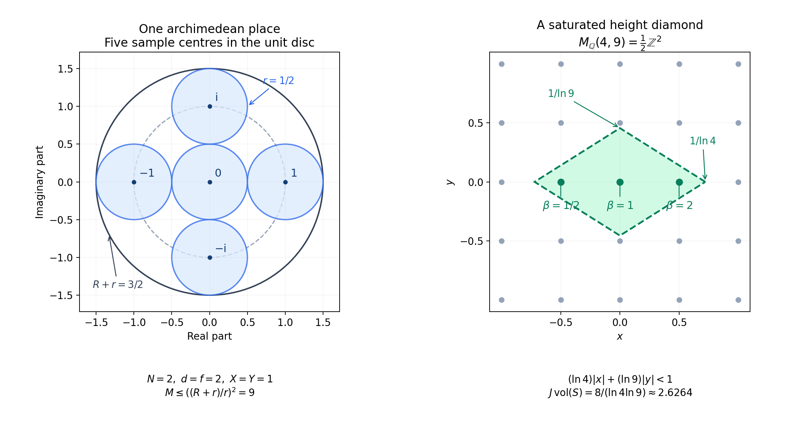

*Figure 10.2. Left: the sample \(0,\pm1,\pm i\) in \(\mathbb Q(i)\) has multiplicative height one and lies in the unit disc. For \(N=2,d=f=2,X=Y=1\), Lemma 10.16 uses radius \(r=1/2\); the five small discs have disjoint interiors and lie in the disc of radius \(R+r=3/2\). The area bound is nine centres. Right: for the rational bases \(4,9\), the full lattice is \(\tfrac12\mathbb Z^2\). The open diamond \((\ln4)|x|+(\ln9)|y|<1\) has volume \(2/(\ln4\ln9)\); its coset average is \(8/(\ln4\ln9)\), between two and three. The zero coset contains the three displayed points, giving \(1/2,1,2\). Their two rational root-of-unity multiples are six distinct numbers of height below \(\mathrm e\). These are samples of the proved packing and averaging steps (10.50), (10.56), not numerical substitutes for the uniform bounds. Source mechanism: Loher and Masser, cited below. Reproducible source: [height_counting_geometry.py](../figure_sources/height_counting_geometry.py).*

## 10. One logarithm with its residue order

The one-dimensional case needs the order of the original residue class, rather than the size of a saturated residue group. Keeping that order and the local residue degree in the height inequality gives a sharper form of the one-logarithm bound.

**Theorem 10.21 (the actual residue order).** Let \(K\) have degree \(d\), and let \(\mathfrak p\) be a prime above \(p\), of ramification index \(e\) and residue degree \(f\). Normalize \(v_p(p)=1\) and \(\operatorname{ord}_{\mathfrak p}=e v_p\). Suppose \(\alpha\in K^*\) is a unit at \(\mathfrak p\), and let
\(g=|\langle\bar\alpha\rangle|\) be the order of its nonzero residue class. If \(b\in\mathbb Z\setminus\{0\}\) and \(\alpha^b\ne1\), then

\[
\operatorname{ord}_{\mathfrak p}(\alpha^b-1)
\le e v_p(b)+\frac d{f\ln p}
\left(\frac{gep}{p-1}h(\alpha)+\ln2\right).
\tag{10.59}
\]

Consequently,

\[
\operatorname{ord}_{\mathfrak p}(\alpha^b-1)
\le\frac d{f\ln p}
\left(\ln(2|b|)+g\left(1+\frac1{p-1}\right)e h(\alpha)\right).
\tag{10.60}
\]

Both bounds include roots of unity, subject to the nonvanishing condition.

**Proof.** Replacing \(b\) by \(|b|\) does not change the valuation: for a unit \(x\), \(x^{-1}-1=-x^{-1}(x-1)\). Hence take \(b>0\). The order \(g\) divides \(p^f-1\), so it is prime to \(p\). If \(g\nmid b\), reduction makes the left side zero.

For every nonzero \(\eta\in K\), the normalized height formula gives

\[
\operatorname{ord}_{\mathfrak p}(\eta)\ln p
\le\frac d f h(\eta).
\]

Indeed, when the valuation is positive, the contribution of \(\mathfrak p\) to \(d h(\eta^{-1})\) is \(f\operatorname{ord}_{\mathfrak p}(\eta)\ln p\), and all other contributions are nonnegative. Use \(h(\eta^{-1})=h(\eta)\). When it is nonpositive, the inequality is immediate. These are the height and local-degree identities proved in [Heights of algebraic numbers](../../TR-TRANS/TR-TRANS-02.html#3-the-arithmetic-normalization-and-the-weil-height) and [Places of number fields in extensions and the product formula](../../NT-LOC/NT-LOC-05.html).

First suppose \(\alpha\) is not a root of unity and \(g\mid b\). Put \(\beta=\alpha^g\). Its positive finite valuation \(v_p(\beta-1)\) is at least \(1/e\). Let \(t\) be the least nonnegative integer with \(p^t>e/(p-1)\). The proved entrance-time and power-step statements in [p-adic logarithms: power series, heights and the one-logarithm bound](../TR-BAKER-09.html#4-taking-powers-until-the-exponential-applies) give

\[
c_t=v_p(\alpha^{gp^t}-1)>\frac1{p-1},
\qquad p^t\le\frac{ep}{p-1}.
\]

The second inequality follows from minimality when \(t>0\). When \(t=0\), its right side is greater than one since \(e\ge1\).

Write \(b=g p^a m\), with \(p\nmid m\). Then \(a=v_p(b)\). Prime-to-\(p\) powers preserve positive valuation. After step \(t\), each \(p\)-power adds one. Earlier positive valuations increase strictly at each step, including a step on the boundary. Thus, whether \(a\ge t\) or \(a<t\),

\[
v_p(\alpha^b-1)\le a+c_t.
\]

Apply the local height inequality to \(\eta=\alpha^{gp^t}-1\ne0\). The proved height power and sum inequalities give
\(h(\eta)\le gp^t h(\alpha)+\ln2\). Multiplying the preceding valuation bound by \(e\) therefore yields

\[
\operatorname{ord}_{\mathfrak p}(\alpha^b-1)
\le e a+\frac d{f\ln p}
\left(gp^t h(\alpha)+\ln2\right).
\]

Use \(p^t\le ep/(p-1)\) to obtain (10.59).

Now suppose \(\alpha\) is a root of unity. Its height is zero by the height power identity. If the left side is positive, the nontrivial root \(\alpha^b\) has \(p\)-power order: write its order as \(p^u s\), \(p\nmid s\), and use the prime-to-\(p\) power step to show that a root of order dividing \(s\) congruent to one must be one. The completely proved cyclotomic distance formula in [the same lesson, Section 5](../TR-BAKER-09.html#5-cyclotomic-ramification-and-distances-between-roots) gives

\[
\operatorname{ord}_{\mathfrak p}(\alpha^b-1)
\le\frac e{p-1}\le\frac{d\ln2}{f\ln p}.
\]

For the second inequality use \(ef\le d\) and
\(\ln p\le(p-1)\ln2\), which follows by induction from \(p\le2^{p-1}\) for integers \(p\ge2\). This proves (10.59) for torsion as well.

Finally \(v_p(b)\ln p\le\ln|b|\) and \(ef\le d\), so
\(e v_p(b)\le d\ln|b|/(f\ln p)\). Substitute in (10.59) and use \(p/(p-1)=1+1/(p-1)\) to obtain (10.60). \(\square\)

For example, take \(K=\mathbb Q\), \(\alpha=4\), \(p=5\). The original residue has order \(g=2\), while the saturated basis \(2\), together with \(-1\), generates all four nonzero residues. Thus (10.49) gives saturated index one, whereas the original one-dimensional residue index is two. The parameters serve different bounds.

The exact power laws give valuation zero for odd \(b\), and \(1+v_5(b)\) for even \(b\). For \(b=2\cdot5^k\), (10.60) reads

\[
1+k\le k+\frac{7\ln4}{2\ln5}.
\]

At the torsion boundary, \(K=\mathbb Q\), \(p=2\), \(\alpha=-1\), \(b=1\), the height term vanishes and (10.60) is the equality \(1=\ln2/\ln2\).

**Corollary 10.22 (a rational one-base reduction).** Let \(\alpha_1,\ldots,\alpha_n\in K^*\) be units at \(\mathfrak p\), and let \(\zeta\in K\) be a root of unity of order \(w\). Let \(c_0,c_1,\ldots,c_n\) and \(b_1,\ldots,b_n\) be integers, with \(\boldsymbol b\ne0\), and suppose

\[
b_j=\frac uv c_j\quad(1\le j\le n),
\qquad u\ne0,\quad v\ge1,\quad \gcd(u,v)=1.
\]

Put
\(\gamma=\zeta^{c_0}\prod_j\alpha_j^{c_j}\),
\(\Xi=\prod_j\alpha_j^{b_j}\), and
\(B_*=\min_{b_j\ne0}|b_j|\). If \(\gamma\) is not a root of unity and \(\Xi\ne1\), then, with \(g_\gamma=|\langle\bar\gamma\rangle|\),

\[
\operatorname{ord}_{\mathfrak p}(\Xi-1)
\le\frac d{f\ln p}
\left(\ln(2wB_*)+
g_\gamma\left(1+\frac1{p-1}\right)e h(\gamma)\right).
\tag{10.61}
\]

**Proof.** The coefficient identities give
\(\Xi^v=\zeta^{-uc_0}\gamma^u\), and hence
\(\Xi^{vw}=\gamma^{uw}\ne1\). All these numbers are local units. Factoring \(X^{vw}-1\) by \(X-1\) and evaluating at \(\Xi\) shows that
\(\operatorname{ord}_{\mathfrak p}(\Xi-1)\le
\operatorname{ord}_{\mathfrak p}(\gamma^{uw}-1)\):
the remaining finite sum consists of integral units and is therefore integral. Apply (10.60) to \(\gamma\) and exponent \(uw\). Since \(v b_j=u c_j\) and \(u,v\) are coprime, \(u\) divides every \(b_j\). Thus \(|u|\le B_*\), proving (10.61). \(\square\)

This reduces a form whose coefficient vector is rationally proportional to one integral vector to a single unit, with an exact exponent budget. Applying it to a many-logarithm estimate also requires a proved bound for \(h(\gamma)\) in terms of the original heights; the saturation bounds of Section 9 supply one of the ingredients for that step.

## 11. Integral derivative bases and a multiplicity reduction

The many-logarithm argument changes the torus coordinates and then differentiates in a rational hyperplane. Two facts matter: the change of derivative basis must preserve p-adic integrality, and the zero estimate must allow different allocations of points at its different dimension steps. We establish both, keeping the coordinate degrees separate.

### A minor of minimum valuation

**Lemma 10.23 (integral derivative coordinates).** Let \(2\le r\le n\). Suppose \(L_0=z_0,L_1,\ldots,L_r\) are independent integral linear forms, with
\(L_i=a_{i0}z_0+\sum_{j=1}^n a_{ij}z_j\), and
\(\sum_j b_jz_j=B_0L_0+\sum_{i=1}^rB_iL_i\), where \(b_j\in\mathbb Z\), \(B_i\in\mathbb Q\), \(b_n\ne0\), and \(B_r\ne0\). Set

\[
C_{ij}=b_n a_{ij}-b_j a_{in}\quad(1\le i\le r,\ 1\le j<n),
\qquad E_i=Y_i\frac{\partial}{\partial Y_i}.
\tag{10.62}
\]

The derivations

\[
\delta_j=\sum_{i=1}^rC_{ij}E_i
=\frac1{B_r}\sum_{i<r}C_{ij}(B_rE_i-B_iE_r)
\quad(1\le j<n)
\tag{10.63}
\]

span the torus hyperplane \(\sum_iB_i x_i=0\), of dimension \(r-1\). Let \(C'\) be the first \(r-1\) rows of \(C\). Choose \(r-1\) columns \(J\) whose nonzero determinant has minimum \(v_p\) among all such minors. Then the corresponding \(\delta_j\), \(j\in J\), are independent, and every \(\delta_j\) has an expression

\[
\delta_j=\sum_{k\in J}\lambda_{kj}\delta_k,
\qquad \lambda_{kj}\in\mathbb Q\cap\mathbb Z_p.
\tag{10.64}
\]

Vanishing of all jets of total order at most \(T\) for these selected derivations and \(\partial_{Y_0}\) is therefore equivalent to vanishing for all the displayed derivations and \(\partial_{Y_0}\). The changes of jets have p-adically integral coefficients.

**Proof.** Comparing the coefficients of \(z_j\), \(j\ge1\), gives
\(b_j=\sum_iB_i a_{ij}\). Hence \(\sum_iB_i C_{ij}=0\), proving the equality in (10.63).

The \(r\) row vectors \(a_i=(a_{i1},\ldots,a_{in})\) are independent. Otherwise a nonzero combination of the \(L_i\) would be a multiple of \(L_0\), contrary to the assumed independence. Suppose a combination \(a=\sum_{i<r}q_i a_i\) annihilates the vectors \(b_ne_j-b_je_n\), \(j<n\). Then
\(b_n a_j-b_j a_n=0\) for every \(j<n\), so \(a=(a_n/b_n)b\). Since \(b=\sum_iB_i a_i\) and \(B_r\ne0\), row independence first forces \(a_n/b_n=0\), then all \(q_i=0\). Thus \(C'\) has rank \(r-1\). Its column images in the full matrix are determined by their first \(r-1\) coordinates through \(\sum_iB_i C_{ij}=0\). They span exactly the stated hyperplane.

Solve \(C'_j=C'_J\lambda_j\) by Cramer's rule. Each numerator is zero or, up to sign, another \((r-1)\)-column minor. Minimality of the chosen denominator's valuation therefore gives \(v_p(\lambda_{kj})\ge0\). This proves (10.64).

The Euler derivations commute with one another and with \(\partial_{Y_0}\). Expanding a product of the linear combinations (10.64) expresses every jet of order at most \(T\) as a combination of selected jets of that order. The coefficients are products and sums of the \(\lambda_{kj}\), multiplied by integer multinomial coefficients, so they are in \(\mathbb Z_p\). Conversely the selected derivations are among the original ones. This proves both directions of the vanishing assertion. \(\square\)

These operators also preserve the coordinate degree bounds and local integral coefficients. In fact,
\(\delta_j(Y^{\boldsymbol m})=(\sum_iC_{ij}m_i)Y^{\boldsymbol m}\).
For a polynomial of degrees at most \(D_i\ge1\), put
\(M_j=\max\{1,\sum_i|C_{ij}|D_i\}\). On a monomial, the multiplier of
\(\partial_{Y_0}^{t_0}\prod_j\delta_j^{t_j}\) is an integer, and its ordinary absolute value is at most

\[
D_0^{t_0}\prod_jM_j^{t_j}.
\tag{10.65}
\]

Indeed the additive factor is the falling factorial of its exponent, bounded by \(D_0^{t_0}\), and each Euler factor has the displayed bound. Nonzero terms retain their torus exponents and lose exactly \(t_0\) in the additive exponent, so distinct input monomials do not merge. At finite places the integral multipliers introduce no new denominators.

### Weighted relations with a sharp degree constant

We shall use the complete upper successive-minima inequality and subgroup-minor calculation in [Modern estimates: Matveev and Waldschmidt](../TR-BAKER-08.html#the-subgroup-polynomial-and-its-integer-minors). The following deduction uses the Euclidean radius \(1/\sqrt r\) in the weighted estimate.

**Lemma 10.24 (weighted independent relations).** Let \(\mathcal M\subseteq\mathbb Z^r\) have rank \(1\le\nu\le r\), with basis matrix \(U\) of size \(r\) by \(\nu\). Let \(A_j>0\). If
\(|\det U_J|\prod_{j\in J}A_j\le B\) for every \(\nu\)-row set \(J\), there are independent \(u_1,\ldots,u_\nu\in\mathcal M\) with

\[
\prod_{i=1}^{\nu}\sum_jA_j|u_{ij}|
\le K_{r,\nu}B,\qquad
K_{r,\nu}=2^\nu(r/\pi)^{\nu/2}
\Gamma(1+\nu/2)\binom r\nu^{1/2}\le r^\nu.
\tag{10.66}
\]

They span \(\mathcal M_{\mathbb Q}\); an integral basis is not asserted.

**Proof.** Give its real span the weighted Euclidean metric
\(\sum_jA_j^2x_j^2\). The Gram determinant identity gives covolume
\((\sum_{|J|=\nu}\det(U_J)^2\prod_{j\in J}A_j^2)^{1/2}\le\binom r\nu^{1/2}B\).
The unit ball of \(\sum_jA_j|x_j|\) contains the weighted Euclidean ball of radius \(1/\sqrt r\), by Cauchy–Schwarz. Its \(\nu\)-volume is therefore at least
\((\pi/r)^{\nu/2}/\Gamma(1+\nu/2)\). The complete volume and upper successive-minima arguments in the earlier lesson give independent lattice vectors with product of these norms at most \(2^\nu\) times the covolume divided by that volume. This proves the first inequality.

For the second use \(\binom r\nu\le r^\nu/\nu!\). It suffices to show
\(a_\nu=2^\nu\Gamma(1+\nu/2)/(\pi^{\nu/2}\sqrt{\nu!})\le1\).
The Gaussian integral gives \(a_0=a_1=1\), and integration by parts in the defining gamma integral gives
\[
\frac{a_{\nu+2}}{a_\nu}=\frac2\pi
\sqrt{\frac{\nu+2}{\nu+1}}<1\quad(\nu\ge0),
\]
since \(\pi>3>2\sqrt2\). For completeness, \(\pi>3\) follows from \(\pi/4=\int_0^1(1+x^2)^{-1}\,dx\): the first eight terms of the integrated geometric series give the strict lower bound \(\sum_{j=0}^7(-1)^j/(2j+1)>3/4\). Its omitted remainder is the integral of \(x^{16}/(1+x^2)>0\). Thus both parity sequences decrease from one. This proves \(K_{r,\nu}\le r^\nu\). \(\square\)

### Unequal allocations in the zero estimate

Let \(k\) be algebraically closed of characteristic zero, and put
\(G=\mathbb G_a\times\mathbb G_m^r\). Write
\(g^s=(s,\vartheta_1^s,\ldots,\vartheta_r^s)\), where the \(\vartheta_i\in k^*\) are multiplicatively independent. For nonzero \(\boldsymbol B\in\mathbb Q^r\), let \(W\) be the span of \(\partial_{Y_0}\) and the Euler directions in the hyperplane \(\boldsymbol B\cdot\boldsymbol x=0\). Its dimension is \(r\).

**Theorem 10.25 (multiplicity and dimension reduction).** Suppose \(r\ge2\), and let \(S,T\) be nonnegative integers. Choose nonincreasing nonnegative integer allocations

\[
S_0\ge\cdots\ge S_r,\quad T_0\ge\cdots\ge T_r,\qquad
\sum_{m=0}^rS_m\le S,\quad\sum_{m=0}^rT_m\le T.
\tag{10.67}
\]

Let the positive coordinate bounds \(D_0,\ldots,D_r\) satisfy
\(D_0\ge\max\{D_1,\ldots,D_r,T_r+r\}\), and assume

\[
\begin{aligned}
(S_m+1)\binom{T_m+m+1}{m+1}
&>(m+1)!D_0
\max_{\substack{J\subseteq\{1,\ldots,r\}\\|J|=m}}
\prod_{j\in J}D_j &&(0\le m<r),\\
(S_r+1)\binom{T_r+r}{r}
&>(r+1)!D_0\prod_{j=1}^rD_j.
\end{aligned}
\tag{10.68}
\]

If a nonzero polynomial of these coordinate bounds vanishes at \(g^s\), \(0\le s\le S\), with all \(W\)-jets of total order at most \(T\), then there are \(1\le\nu<r\) and independent integral vectors \(u_1,\ldots,u_\nu\), whose rational span contains \(\boldsymbol B\). For any \(A_j>0\), put \(R_i=\sum_jA_j|u_{ij}|\) and \(C_{r,\nu}=\nu!K_{r,\nu}\le\nu!r^\nu\). At least one of

\[
(S_\nu+1)\binom{T_\nu+\nu-1}{\nu-1}\prod_iR_i
\le C_{r,\nu}\max_{|J|=\nu}\prod_{j\in J}A_jD_j,
\tag{10.69}
\]

\[
(S_\nu+1)\binom{T_\nu+\nu}{\nu}\prod_iR_i
\le(\nu+1)C_{r,\nu}D_0
\max_{|J|=\nu}\prod_{j\in J}A_jD_j
\tag{10.70}
\]

holds.

**Proof.** We use the fully proved stabilizer, jet and coordinate-degree arguments of the [multiplicity subsection of the earlier lesson](../TR-BAKER-08.html#intersections-and-the-multiplicity-estimate), explaining the allocation step explicitly. Let \(N=r+1\). For \(1\le j\le N+1\), let \(I_j\) be generated by the translates of all \(W\)-derivatives of \(P\) of order at most \(\sum_{m=0}^{j-2}T_m\), at translating points \(g^s\) with \(0\le s\le\sum_{m=0}^{j-2}S_m\); empty sums are zero. Write \(X_j=Z(I_j)\).
Translations and invariant derivatives preserve the coordinate bounds. Hence
\(G\supsetneq X_1\supseteq\cdots\supseteq X_{N+1}\), and the last set contains the identity by (10.67). Every set is nonempty.

Choose the first \(j\) for which \(X_j,X_{j+1}\) have the same dimension, and a common component \(V\) of that dimension. Such a \(j\le N\) exists, since \(\dim X_1\le N-1\). Before it each dimension falls, so \(\dim V\le N-j\).
As in the cited stabilizer proof, define
\(E=\{x:x+V\subseteq X_j\}\) and \(H=\{x:x+V=V\}\).
The set \(E\) is a finite union of \(H\)-cosets. Its defining ideal, obtained by translating the generators of \(I_j\) by \(V\), has dimension \(\dim H\) and the same coordinate degree bounds. That ideal vanishes through order \(T_{j-1}\) on
\(\{g^s:0\le s\le S_{j-1}\}+H\), because the added derivatives and translates are among those defining \(X_{j+1}\).

Replace \(H\) by its identity component \(H_0\), and put \(c=N-\dim H_0\). Since \(\dim H_0\le\dim V\), we have \(c\ge j\). Monotonicity gives at least \(S_{c-1}+1\) point cosets and at least \(T_{c-1}\) jets on them. All these cosets are distinct. Indeed, if \(g^q\in H_0\) for \(q\ne0\), the nonzero additive coordinate forces the additive part of \(H_0\) to be \(\mathbb G_a\). Properness then supplies a nonzero torus character \(u\) with \(\boldsymbol\vartheta^{qu}=1\), contrary to multiplicative independence.

Put \(\sigma=\dim(W/(W\cap T(H_0)))\). The complete positive-filtration upper and lower estimates (8.72)–(8.76) give, for every codimension-\(c\) coordinate set \(J\),

\[
(S_{c-1}+1)\binom{T_{c-1}+\sigma}{\sigma}\delta(H_0;J)
\le c!\prod_{j\in J}D_j.
\tag{10.71}
\]

Here \(\delta(H_0;J)\) is the nonnegative integral coefficient of the complementary monomial in the subgroup Hilbert polynomial. To extract a coefficient from the lower polynomial inequality, send exactly the coordinates in that complementary monomial to a common infinity, keeping the others one. The polynomials are squarefree of the same degree, so division by that power leaves exactly the desired coefficient. This is the coefficient argument already proved in the earlier lesson.

Since \(W\) is a hyperplane, \(\sigma=c-1\) when \(T(H_0)\subseteq W\), and \(\sigma=c\) otherwise. In the second case \(c\le r\), and some \(\delta\) is at least one. The maximum product of \(c\) coordinate bounds is \(D_0\max_{|J|=c-1}\prod_{j\in J}D_j\), because \(D_0\) is largest. Inequality (10.71) contradicts (10.68) with \(m=c-1\). Hence \(T(H_0)\subseteq W\).

Write \(H_0=H_a\times H_m\), and let \(\mathcal M\) be the primitive character lattice of \(H_m\), of rank \(\nu\). The subgroup and tangent classification in the earlier lesson shows that \(\boldsymbol B\in\mathcal M_{\mathbb Q}\). Thus \(\nu\ge1\).
If \(\nu=r\) and \(H_a=\{0\}\), then \(c=r+1,\sigma=r\), and (10.71) contradicts the last line of (10.68). If \(\nu=r\) and \(H_a=\mathbb G_a\), then \(c=r,\sigma=r-1\). We may decrease the available budgets to \(S_r,T_r\); its unique torus coefficient is one. Thus
\((S_r+1)\binom{T_r+r-1}{r-1}\le r!\prod_{j=1}^rD_j\).
The last line of (10.68), and
\(\binom{T_r+r}{r}/\binom{T_r+r-1}{r-1}=(T_r+r)/r\), contradict this since \(D_0\ge T_r+r\). Therefore \(1\le\nu<r\).

Let \(U\) be a basis matrix of \(\mathcal M\). If \(H_a=\mathbb G_a\), the subgroup coefficients are \(|\det U_J|\), \(c=\nu,\sigma=\nu-1\). Decrease its budgets to \(S_\nu,T_\nu\). Multiply (10.71) by \(\prod_{j\in J}A_j\), and apply Lemma 10.24 to the resulting bounds on every weighted minor. The independent vectors supplied by that lemma span \(\mathcal M_{\mathbb Q}\), so their span contains \(\boldsymbol B\). Its factor \(K_{r,\nu}\) times \(\nu!\) gives (10.69).
If \(H_a=\{0\}\), then \(c=\nu+1,\sigma=\nu\); its coefficients on \(\{0\}\cup J\) are \(|\det U_J|\). The same argument uses \((\nu+1)!D_0\) in (10.71), proving (10.70). This accounts for both additive subgroups and completes the proof. \(\square\)

For the allocations
\(S_0=\lfloor S/3\rfloor\),
\(S_i=\lfloor2S/(3r)\rfloor\) for \(i\ge1\), and
\(T_i=\lfloor T/(r+1)\rfloor\), (10.67) holds: \(r\ge2\) makes the point allocations nonincreasing, and their sums are at most \(S,T\). Since the \(T_i\) are equal and \(D_0\ge T_r+r\), (10.69) also implies (10.70). Multiply (10.69) by \((T_\nu+\nu)/\nu\le D_0\); its enlarged right side is at most the right side of (10.70). Thus the second bound alone suffices for this choice of allocations.

**Corollary 10.26 (new algebraic bases).** If the \(\vartheta_j\) are independent algebraic units in a number field and \(u_i\) are the vectors in Theorem 10.25, put \(\gamma_i=\prod_j\vartheta_j^{u_{ij}}\). They are independent units and

\[
h(\gamma_i)\le\sum_j|u_{ij}|h(\vartheta_j)\le R_i
\quad\text{if }A_j\ge h(\vartheta_j).
\tag{10.72}
\]

If \(\boldsymbol b\in\mathbb Z^r\) is in their rational span, there are integers \(m\ge1,c_i\) with \(m\boldsymbol b=\sum_i c_i u_i\), and
\((\prod_j\vartheta_j^{b_j})^m=\prod_i\gamma_i^{c_i}\).

**Proof.** Integer products preserve local units, and the proved height power and product inequalities give (10.72). A multiplicative relation among the \(\gamma_i\) gives a zero integral combination of the \(u_i\), by independence of the \(\vartheta_j\); linear independence of the vectors makes every coefficient zero. Clearing the denominators of a rational span expression proves the last identity. \(\square\)

**Example of a sharp weighted factor.** For \(r=2,\nu=1\), take \(\mathcal M=\mathbb Z(3,-2)\), weights \(A_1=2,A_2=3\), and minor bound \(B=6\). Its primitive vector has weighted norm 12, exactly \(K_{2,1}B=2B\). In the torus put \(H_m=\{Y_1^3=Y_2^2\}\), \(H=\mathbb G_a\times H_m\), and \(g=(1,2,3)\). For \(s=0,1,2\), its three distinct \(H\)-cosets have characters \(Y_1^3/Y_2^2=(8/9)^s\). The polynomial
\[
P(Y_1,Y_2)=\prod_{s=0}^2(9^sY_1^3-8^sY_2^2)
\]
vanishes on all three. The directions \(\partial_{Y_0}\) and \(2E_1+3E_2\) are tangent to these cosets, so every such derivative vanishes there. Its coordinate bounds are \(D_1=9,D_2=6\), and the corresponding weighted relation inequality is the equality
\(3\cdot12=2\max(2\cdot9,3\cdot6)=36\).
There is no transverse multiplicity factor in this case: \(\sigma=\nu-1=0\).

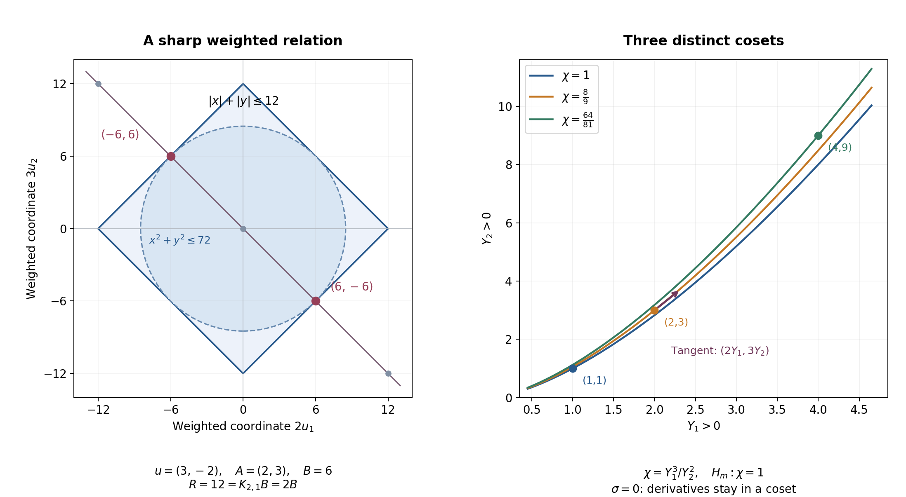

*Figure 10.3. Left: in weighted coordinates \((2u_1,3u_2)\), the relation \((3,-2)\) becomes \((6,-6)\). Its diamond norm is 12; the Euclidean circle of radius \(12/\sqrt2\) lies in the diamond and meets that relation line at the two marked primitive vectors. This is the equality case of (10.66) for \(r=2,\nu=1\). Right: a positive real section of the torus projections of the three cosets above. Their quotient character values \(1,8/9,64/81\) are distinct, and the points \((1,1),(2,3),(4,9)\) lie on their respective curves. The additive coordinates \(0,1,2\) are omitted from this projection. The arrow is tangent to a coset, in the direction \(2E_1+3E_2\); it illustrates \(\sigma=0\), not a transverse derivative. The complete subgroup, degree and lattice arguments are (10.66), (10.69)–(10.71) and the example. Mathematical background: the earlier complete multiplicity lesson and Yu's free 2013 article, cited below. [Figure program](../figure_sources/yu_multiplicity_geometry.py).*

## 12. Closing the one-base branch

The many-logarithm construction may reduce to one new base before the auxiliary polynomial is needed. A one-logarithm inequality alone does not finish that step: its constant term must also be compared with the product of the original heights. We give that comparison with the full residue-order and root-of-unity factors.

Let \(n\ge2\), let \(K\) have degree \(d\), and let \(\mathfrak p\) lie above \(p\), with ramification index \(e_{\mathfrak p}\) and residue degree \(f\). Put \(t=f\ln p\) and \(\ln^*d=\max\{1,\ln d\}\). Take multiplicatively independent \(\mathfrak p\)-adic units \(\alpha_1,\ldots,\alpha_n\), integers \(b_j\) not all zero, and write

\[
\Xi=\prod_j\alpha_j^{b_j},\qquad
P_h=\prod_jh(\alpha_j),\qquad
B_* =\min_{b_j\ne0}|b_j|.
\tag{10.73}
\]

Take \(q=2\) for \(p>2\), and \(q=3\) for \(p=2\). In the second case assume \(\zeta_3\in K\). Let \(w_q=q^u\) be the order of the q-primary roots of unity in \(K\), and choose their generator \(\alpha_0\). Use the intrinsic saturated residue index \(\delta(\boldsymbol\alpha)\) from Lemma 10.15, and define

\[
\begin{aligned}
Q_n&=p^f/\delta(\boldsymbol\alpha),&
M_n&=\max\{Q_n/t^{n+1},\mathrm e^n/n^n\},\\
L&=\max\{\ln(\mathrm e^4(n+1)d),e_{\mathfrak p},t\},&
\varepsilon_n&=10^{-26}/(2n),\\
a&=\begin{cases}
7(p-1)/(p-2),&p\ge5,\ e_{\mathfrak p}=1,\\
14,&p>2\text{ in the other cases},\\
26,&p=2,
\end{cases}&
R_n&=\frac{\mathrm e a}{q}(1+\varepsilon_n)(n+1)d.
\end{aligned}
\tag{10.74}
\]

Here \(\mathrm e=\exp(1)\) is distinct from the ramification index. For any \(c\ge206\), put

\[
\mathcal C_n=
c a^n\frac{n^n(n+1)^{n+1}d^{n+2}\ln^*d}
{n!w_qt}\,M_nL.
\tag{10.75}
\]

**Theorem 10.27 (the one-base numerical closure).** Suppose there are independent integral forms \(L_0=z_0,L_1=a_0z_0+\sum_ja_jz_j\), and rationals \(B_0,B_1\), with \(B_1\ne0\), such that
\(\sum_jb_jz_j=B_0L_0+B_1L_1\). Set
\(\gamma=\alpha_0^{a_0}\prod_j\alpha_j^{a_j}\), and let \(g_\gamma\) be its actual residue order at \(\mathfrak p\). Define

\[
\delta_\gamma=\frac{p^f-1}{g_\gamma},\qquad
M_\gamma=\max\{p^f/(\delta_\gamma t^2),\mathrm e\}.
\tag{10.76}
\]

Suppose a positive \(\sigma\) satisfies

\[
h(\gamma)\le\sigma\le
R_n^{n-1}\frac{M_n}{M_\gamma}P_h.
\tag{10.77}
\]

If
\(H\ge\max\{\ln B_*,(n+1)t,\ln(4d)\}\), then

\[
\operatorname{ord}_{\mathfrak p}(\Xi-1)
\le\frac1{500}\mathcal C_nP_hH
<\mathcal C_nP_hH.
\tag{10.78}
\]

**Proof.** Write \(B_1=v_1/v_2\) in lowest terms, with \(v_2>0\). Coefficient comparison gives \(v_2b_j=v_1a_j\); hence \(v_1\mid b_j\) and \(|v_1|\le B_*\). Also \(v_2B_0=-v_1a_0\) is integral. Raising the resulting multiplicative identity to \(w_q\) removes \(\alpha_0\):
\(\Xi^{v_2w_q}=\gamma^{v_1w_q}\).

The vector \((a_1,\ldots,a_n)\) is nonzero, by independence of the two forms. Thus \(\gamma\) is not a root of unity: a torsion relation would, after a further power killing \(\alpha_0\), contradict independence of the \(\alpha_j\). The same argument proves that \(\Xi\) is not torsion. All powers just used are therefore different from one. The finite geometric sum and Theorem 10.21 give

\[
\operatorname{ord}_{\mathfrak p}(\Xi-1)
\le\frac d t\left(
\ln(2w_q B_*)+
g_\gamma\frac p{p-1}e_{\mathfrak p}h(\gamma)\right).
\tag{10.79}
\]

Negative \(v_1\) is covered by that theorem. The geometric sum has integral local-unit terms, so its valuation is nonnegative.

We need two elementary estimates. First,

\[
w_q\le\frac q{q-1}d\le2d.
\tag{10.80}
\]

Indeed [Proposition 9.7](../TR-BAKER-09.html#5-cyclotomic-ramification-and-distances-between-roots), applied at the prime \(q\), proves that \(\Phi_{q^u}\) is irreducible over \(\mathbb Q_q\), of degree \(q^{u-1}(q-1)\). It is consequently irreducible over \(\mathbb Q\) as well. Since its root \(\alpha_0\) belongs to \(K\), that degree is at most \(d\), proving (10.80). Thus \(\ln(2w_qB_*)\le2H\).

Second, if \(w_K\) is the total number of roots of unity in \(K\), Theorem 10.18 and the index lower bound one give the uniform weakened form

\[
P_h\ge
\frac{w_K n^n}
{58 n!\mathrm e^n d^{n+1}\ln^*d}
\ge\frac{w_q n^n}
{58 n!\mathrm e^n d^{n+1}\ln^*d}.
\tag{10.81}
\]

For \(d=1\), the proved constant 17 is smaller than 58, so the same form holds. There is no lower bound for a single new height hidden in this step.

Combining (10.75), (10.81) and \(M_n\ge\mathrm e^n/n^n\) gives

\[
\mathcal C_nP_h\ge
\frac c{58}a^n
\frac{n^n(n+1)^{n+1}}{(n!)^2}\frac d tL
\ge\frac c{58}a^n(n+1)\frac d tL
>2000\frac d t.
\tag{10.82}
\]

Here \(n!\le n^n\), \((n+1)^{n+1}/n^n\ge n+1\), \(a\ge7\), and \(L\ge4+\ln3>5\). The last numerical comparison is
\(206\cdot49\cdot3\cdot5>2000\cdot58\).
The logarithmic term in (10.79) is therefore at most \(\mathcal C_nP_hH/1000\).

For the height term use \(g_\gamma/M_\gamma<t^2\), directly from (10.76), and (10.77). Its ratio to \(\mathcal C_nP_hH\) is at most

\[
\frac{n!}{n^n}\left(\frac{\mathrm e}{q}\right)^{n-1}
(1+\varepsilon_n)^{n-1}
\frac{w_q e_{\mathfrak p}t^2}
{c a(n+1)^2d^2\ln^*d\,LH}\frac p{p-1}.
\tag{10.83}
\]

This is an exact cancellation of the \(M_n\), degree and exponential factors. The local degree inequality gives \(e_{\mathfrak p}\le d\); also \(L\ge t\), \(H\ge(n+1)t\), \(p/(p-1)\le2\), and (10.80) gives \(w_q/d\le2\).

For completeness, monotonicity of \(\ln x\) gives
\(\ln(n!)\le\int_1^n\ln x\,dx+\ln n
=n\ln n-n+1+\ln n\).
Consequently \(n!\mathrm e^{n-1}/n^n\le n\).
Furthermore \((1+\varepsilon_n)^{n-1}<2\): use
\(\ln(1+x)\le x\), which follows by integrating \((1+x)^{-1}\le1\), and \(\varepsilon_n(n-1)<1/2\). The exponential series gives \(\mathrm e<3\), since \(k!\ge2^{k-1}\) for \(k\ge2\), with strict inequality for \(k\ge3\); hence \(\exp(1/2)<2\). This also proves \(\ln3>1\) used above.

Thus (10.83) is at most
\(8n/(q^{n-1}c a(n+1)^3)\le4n/(c a(n+1)^3)\), because \(q\ge2,n\ge2\).
Since \((n+1)^2\ge4n\) and \(n+1\ge3\), this is at most
\(1/(3ca)\le1/(3\cdot206\cdot7)<1/1000\).
The height term is also at most \(\mathcal C_nP_hH/1000\). Adding the two terms proves (10.78). \(\square\)

We check the correspondence with the free 2013 preparation. Let \(\kappa\) be the unique nonnegative integer with
\(p^{\kappa-1}(p-1)\le2e_{\mathfrak p}<p^\kappa(p-1)\).
Set \(c_2=7/4\) for \(p>2\), and \(c_2=13/9\) for \(p=2\). Put
\(\vartheta=(p-2)/(p-1)\) when \(p\ge5,e_{\mathfrak p}=1\), and
\(\vartheta=p^\kappa/(2e_{\mathfrak p})\) otherwise, and let
\(\theta=\vartheta/(1+\varepsilon_n)\).
Direct substitution gives

\[
\mathrm e c_2q\frac{p^\kappa}{e_{\mathfrak p}\theta}(n+1)d=R_n.
\tag{10.84}
\]

In the first case \(\kappa=0\); in the other cases the factors are respectively \(7\) and \(26/3\) before multiplication by \(\mathrm e(1+\varepsilon_n)(n+1)d\). Thus (10.77) is precisely the one-base height-product hypothesis of that preparation. Formula (10.75) is its first numerical coefficient, with any of its listed choices of \(c\), all at least 206. Its parameter \(h^{(1)}\) is at least \(\ln B_*\) and \((n+1)t\); its term
\((n+1)(a_0^{(1)}n+a_1^{(1)}+\ln(a_0^{(1)}n+a_2^{(1)})+\ln d)\)
is larger than \(\ln(4d)\), since the listed constants satisfy
\(a_0^{(1)}>3,a_1^{(1)}>2,a_2^{(1)}>2\).
Theorem 10.27 therefore proves the full numerical conclusion in this branch. The proof retains the original saturated index for the \(n\) bases, and the actual unsaturated residue order for the one new base.

## 13. Binomial preparation of the auxiliary polynomial

The auxiliary polynomial uses shifted powers of binomial polynomials and binomial polynomials in the Euler eigenvalues. We prove their independence, their exact denominator control and their equivalence to ordinary jets. These are algebraic statements; no logarithm estimate is assumed in their proofs.

### Taylor coefficients at integral and fractional nodes

For integers \(k\ge1,\ell\ge1,m\ge0\), define

\[
\begin{aligned}
\Delta(z;k)&=\frac{(z+1)\cdots(z+k)}{k!},\quad \Delta(z;0)=1,\\
v(k)&=\operatorname{lcm}(1,\ldots,k),\\
\Theta(z;k,\ell,m)&=\frac1{m!}\frac{d^m}{dz^m}\Delta(z;k)^\ell.
\end{aligned}
\tag{10.85}
\]

**Lemma 10.28 (prepared Taylor integrality).** For every integer \(s\),

\[
v(k)^m\Theta(s;k,\ell,m)\in\mathbb Z.
\tag{10.86}
\]

If \(q\) is prime, \(I\in\mathbb Z_{\ge0}\), and \(A,s\in\mathbb Z\), then

\[
q^{\chi_I\ell(kI+v_q(k!))}v(k)^m
\Theta(s/q^I+A;k,\ell,m)\in\mathbb Z,
\qquad \chi_0=0,\quad\chi_I=1\ (I>0).
\tag{10.87}
\]

In particular \(v(k)^m\Theta(s/q^I+A;k,\ell,m)\) belongs to \(\mathbb Z[1/q]\), before multiplication by the displayed q-power.

**Proof.** Generalized binomial coefficients \(\binom Nj\) are integral for every integer \(N\): for \(N<0\), their product formula is \((-1)^j\binom{-N+j-1}j\). Vandermonde's polynomial identity gives
\(\Delta(s+Z;k)=\sum_{j=0}^k\binom{s+k}{k-j}\binom Zj\).
One proof first counts subsets for nonnegative integer arguments and then uses polynomial equality to extend to all arguments. For \(j\ge1\),
\[
\binom Zj=\frac{(-1)^{j-1}Z}{j}
\prod_{a=1}^{j-1}(1-Z/a).
\]
Each coefficient of \(Z^m\) has denominators consisting of \(j\) and \(m-1\) numbers among \(1,\ldots,j-1\). Every factor divides \(v(k)\). Hence multiplication by \(v(k)^m\) makes that coefficient integral. The constant coefficient is integral too. In the \(\ell\)-th power, a coefficient of order \(m\) is a sum of products whose orders sum to \(m\); the same scaling therefore clears all of them. This proves (10.86), including vanishing coefficients beyond the degree.

Fix \(F(Z)=v(k)^m\Theta(Z;k,\ell,m)\). It is a rational polynomial, integral at every integer. At \(x=s/q^I+A\), it has no denominator at a prime \(r\ne q\). To see this without a limiting argument, choose \(B\) bounding the r-adic denominators of its finitely many coefficients, and an integer \(N\equiv x\pmod{r^{B+1}}\); the inverse of \(q^I\) modulo that power supplies \(N\). Both \(x,N\) are r-integral. Factoring \(x^j-N^j\) shows that \(F(x)-F(N)\) is r-integral, so \(F(x)\) is r-integral.

The coefficients of \(\Delta(Z;k)^\ell\) have denominator dividing \((k!)^\ell\). Dividing an ordinary derivative of order \(m\) by \(m!\) multiplies each monomial coefficient by an integer binomial coefficient and decreases its degree by \(m\). Thus its value at \(x\) has q-adic denominator at most \(q^{\ell v_q(k!)+Ik\ell}\); the integer factor \(v(k)^m\) cannot worsen this bound. Together with the preceding assertion at every other prime this proves (10.87) for \(I>0\). For \(I=0\), (10.86) already gives an integer and no q-factor is needed. \(\square\)

### Independence of the shifted powers

**Lemma 10.29 (a binomial polynomial basis).** For \(k,L\ge1\), the \(kL\) polynomials

\[
F_{a,\ell}(X)=\Delta(X+a;k)^\ell,
\qquad 0\le a<k,\quad1\le\ell\le L,
\tag{10.88}
\]

are a basis of the polynomials of degree at most \(kL\) vanishing at \(X=-k\). For fixed \(\ell\), their top \(k\) coefficient matrix satisfies

\[
\det\left([X^{k\ell-j}]F_{a,\ell}\right)_{0\le j,a<k}
=\frac{\prod_{j=0}^{k-1}\binom{k\ell}{j}}
{(k!)^{k\ell}}\prod_{0\le a<b<k}(b-a)\ne0.
\tag{10.89}
\]

**Proof.** The coefficient in row \(j\), regarded as a polynomial in \(a\), has degree \(j\) and leading coefficient \(\binom{k\ell}j/(k!)^\ell\). Indeed expand the degree-\(k\ell\) polynomial \(\Delta(X;k)^\ell\) after substituting \(X+a\); its highest term gives that leading coefficient, and lower terms give smaller powers of \(a\). Changing these row polynomials to monomials is triangular. The monomial evaluation determinant at \(0,\ldots,k-1\) is the Vandermonde product in (10.89). It follows either by subtracting columns and induction, or by observing its zeros at equal columns and its leading coefficient one. This proves the formula.

In a proposed relation, take the largest \(\ell\) occurring. Lower levels have degree at most \(k(\ell-1)\). The top \(k\) coefficients and (10.89) force every coefficient at this largest level to vanish. Descending proves independence. Every polynomial in (10.88) vanishes at \(-k\), because the factor with index \(k-a\) is zero there. The space with this one vanishing condition has dimension \(kL\): evaluation at \(-k\) is a nonzero linear functional on the \(kL+1\)-dimensional polynomial space. Thus the independent family is a basis. An invertible affine substitution preserves its independence. \(\square\)

For \(k=L=2\), Figure 10.4 shows the four basis polynomials and their exact coefficient matrix. A shared root does not give a relation among the polynomials.

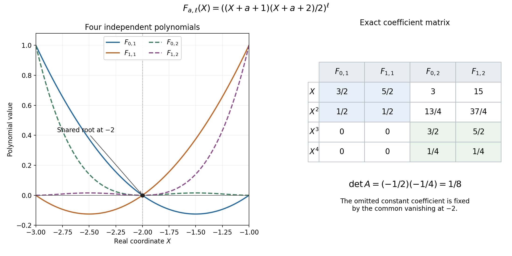

*Figure 10.4. Left: the restrictions to the real interval \([-3,-1]\) of \(F_{0,1},F_{1,1},F_{0,2},F_{1,2}\) in (10.88) for \(k=2\). All vanish at \(-2\); the squared polynomials have a double zero there. Right: their coefficients of \(X,X^2,X^3,X^4\), in the same column order. The diagonal two-by-two block determinants are \(-1/2,-1/4\), so the full determinant is \(1/8\). Their constant coefficients are determined by their common vanishing at \(-2\). This is the exact independence mechanism in Lemma 10.29 and (10.89), applied to the auxiliary polynomial below. Human-source background: the binomial preparation in Yu's free 2013 article, cited below. [Figure program](../figure_sources/binomial_auxiliary_basis.py).*

### Affine changes of binomial jets

**Lemma 10.30 (Newton reparametrization).** Over a characteristic-zero field, for \(h\ne0\) and \(c\),

\[
\Delta(hZ+c;t)=\sum_{j=0}^t d_j\Delta(Z;j),\qquad
d_j=\sum_{i=0}^j(-1)^i\binom ji\Delta(c-h(i+1);t),
\qquad d_t=h^t.
\tag{10.90}
\]

If \(h,c\in\mathbb Z[1/q]\), then all \(d_j\) belong to that ring. If moreover \(h=q^b\), \(b\in\mathbb Z\), the triangular change and its inverse are p-adically integral for every \(p\ne q\). Products in several commuting variables preserve the total-order filtration.

**Proof.** The polynomials \(\Delta(Z;j)\), \(0\le j\le t\), have degrees \(j\) and nonzero leading coefficients, so form a basis. At \(Z=-i-1\), their values are \((-1)^j\binom ij\), zero when \(j>i\). Inverting this triangular evaluation matrix gives (10.90). Explicitly the inner binomial inversion sum is
\(\binom ab\sum_{i=b}^a(-1)^{i-b}\binom{a-b}{i-b}\), which is zero for \(a>b\) and one for \(a=b\), by \((1-1)^{a-b}\). Comparing leading coefficients gives \(d_t=h^t\).

Lemma 10.28 with \(\ell=1,m=0\) makes each displayed value at a \(\mathbb Z[1/q]\) argument belong to that ring; the sum for \(d_j\) does too. When \(h=q^b\), the diagonal \(h^t\) is a unit in \(\mathbb Z[1/q]\). Successive substitution therefore also puts the inverse matrix in that ring, hence in \(\mathbb Z_p\) for \(p\ne q\). In products, every new index is coordinatewise at most the old one, so its total order cannot increase. \(\square\)

The integrality assertion here concerns changes between binomial families. Conversion between a binomial family and ordinary powers has leading coefficient \(1/t!\); we use that conversion only for algebraic equivalence of vanishing.

### From prepared equations to the ordinary zero estimate

**Proposition 10.31 (the auxiliary polynomial and its jets).** Let \(\mathcal M\subset\mathbb Z^r\) be finite, with distinct exponent vectors \(\boldsymbol m\), and let \(A_i\ge0\) bound \(|m_i|\). Put \(d_i=\lfloor A_i\rfloor\). Fix \(q,I,k,L\) as above, and coefficients \(c_{\boldsymbol m,a,\ell}\) in a characteristic-zero field, not all zero. Form

\[
Q(X,Y)=\sum_{\boldsymbol m\in\mathcal M}
\sum_{0\le a<k,\,1\le\ell\le L}
c_{\boldsymbol m,a,\ell}\Delta(q^{-I}X+a;k)^\ell Y^{\boldsymbol m},
\qquad P=Y^{\boldsymbol d}Q.
\tag{10.91}
\]

Then \(P\) is nonzero, is an ordinary polynomial, and has coordinate bounds \(kL,2A_1,\ldots,2A_r\).

Let \(D_j=\sum_i C_{ij}Y_i\partial_{Y_i}\) be commuting Euler derivations, and put \(\omega_j(\boldsymbol m)=\sum_iC_{ij}m_i\), \(1\le j\le r-1\). For a torus point \(\boldsymbol y\) define the prepared value

\[
\mathcal Q(s;\boldsymbol t)=
\sum_{\boldsymbol m,a,\ell}c_{\boldsymbol m,a,\ell}
v(k)^{t_0}\Theta(q^{-I}s+a;k,\ell,t_0)
\prod_{j=1}^{r-1}\Delta(\omega_j(\boldsymbol m);t_j)
\boldsymbol y^{\boldsymbol m}.
\tag{10.92}
\]

For any \(T\), vanishing of all these values with \(|\boldsymbol t|\le T\) is equivalent to vanishing of all ordinary jets of \(Q\), and hence of \(P\), at \((s,\boldsymbol y)\) for \(\partial_X,D_1,\ldots,D_{r-1}\) through total order \(T\).

**Proof.** Distinct Laurent monomials are linearly independent. For each fixed \(\boldsymbol m\), Lemma 10.29, with the invertible substitution \(X\mapsto q^{-I}X\), proves independence of its coefficient polynomials. Thus not all coefficients can cancel, and \(Q\ne0\). Since \(m_i\) is integral and \(m_i\ge-A_i\), it satisfies \(m_i\ge-\lfloor A_i\rfloor\). Hence \(0\le m_i+d_i\le2A_i\). This proves the degree and nonvanishing assertions for \(P\).

On its monomial terms, (10.92) is exactly the value of the commuting operator
\((q^Iv(k))^{t_0}\partial_X^{t_0}/t_0!\)
times \(\prod_j\Delta(D_j;t_j)\), applied to \(Q\). The chain rule supplies \(q^{-It_0}\), canceled by \(q^{It_0}\). Each \(\Delta(D_j;t_j)\) has leading term \(D_j^{t_j}/t_j!\) and only lower powers. All diagonal scalars are nonzero. Induction on the torus part of the total order therefore makes these operators and the ordinary jet operators span exactly the same filtered space. This proves the first equivalence, in both directions.

Put \(c_j=\sum_iC_{ij}d_i\). The product rule gives

\[
\partial_X^{t_0}\prod_jD_j^{t_j}P
=Y^{\boldsymbol d}\partial_X^{t_0}
\prod_j(D_j+c_j)^{t_j}Q.
\tag{10.93}
\]

Expanding is triangular with diagonal one and preserves total order. The inverse uses \(-c_j\) and \(Y^{-\boldsymbol d}\). Since every torus coordinate is nonzero, evaluation proves the second equivalence. \(\square\)

When the \(C_{ij}\) are integers, \(s\) is integral and \(q\ne p\), Lemma 10.28 and integer-valued \(\Delta\) give
\[
v(k)^{t_0}\Theta(q^{-I}s+a;k,\ell,t_0)
\prod_j\Delta(\omega_j(\boldsymbol m);t_j)
\in\mathbb Z[1/q]\subseteq\mathbb Z_p.
\]
The prepared product \(v(k)^{t_0}\Theta\), rather than \(\Theta\) alone, needs at most the q-denominator in (10.87). Integrality of the whole value additionally requires locally integral \(c_{\boldsymbol m,a,\ell}\) and local-unit torus coordinates.

For the application to Theorem 10.25, take \(D_1,\ldots,D_{r-1}\) to be the selected integral Euler directions in Lemma 10.23, renumbered. They span the Euler hyperplane in that theorem's space \(W\). Apply the proposition at \((s,\vartheta_1^s,\ldots,\vartheta_r^s)\). All prepared equations then give precisely the ordinary \(W\)-jets required there, with

\[
D_0=kL,\qquad D_i=2A_i,
\qquad A_i=q^{\nu-I}D_i^{\mathrm{old}},\quad
k=D_{-1}^{\mathrm{old}}+1,\quad L=D_0^{\mathrm{old}}+1.
\tag{10.94}
\]

Here \(\nu\ge0\) is an exponent clearing the denominators of the q-saturated basis, supplied by Lemma 10.12; it is distinct from the subgroup rank used in Theorem 10.25. The Euler shift adds \(\sum_i C_{ij}d_i\) to its eigenvalue; Lemma 10.30 supplies the corresponding reversible binomial change. Thus the nonzero-polynomial and prepared-to-ordinary steps require no omitted derivative lemma. Theorem 10.25 still requires its separate independence, degree and allocation inequalities.

## 14. Constructing the initial auxiliary coefficients

The prepared equations are a finite homogeneous linear system. The weighted Siegel lemma has a complete proof in [the earlier multiplicity lesson](../TR-BAKER-08.html#small-solutions-over-the-coefficient-field), equation (8.40), including dependent rows and integral solutions. We apply it with all weights one and bound every row explicitly. Figure 10.4 and Lemma 10.29 ensure that a nonzero coefficient vector produces a nonzero polynomial.

For a number field \(K\) of degree \(d\), use all archimedean embeddings, counting a complex pair twice. At a finite prime ideal \(\mathfrak p\), put \(|x|_{\mathfrak p}=(N\mathfrak p)^{-v_{\mathfrak p}(x)}\). These are the product-formula conventions of the earlier lesson. For a nonzero vector \(c\in K^N\), define its Euclidean projective height by
\[
h_2(c)=\frac1d\left(
\sum_{\sigma\mid\infty}\log\Bigl(\sum_j|\sigma(c_j)|^2\Bigr)^{1/2}
+\sum_{\mathfrak p}\log\max_j|c_j|_{\mathfrak p}\right).
\]
The product formula makes this invariant under multiplication of the whole vector by any nonzero scalar in \(K\). Replacing the archimedean Euclidean norm by the maximum defines \(h_\infty(c)\le h_2(c)\).

**Theorem 10.32 (initial prepared-jet kernel).** Let \(r,k,L\in\mathbb Z_{\ge1}\), \(S,T\in\mathbb Z_{\ge0}\), and let \(\mathcal M\subset\mathbb Z^r\) be a finite set of distinct vectors with \(|m_i|\le A_i\). Take \(\vartheta_i\in K^\times\) and integer Euler coefficients \(C_{ij}\), \(1\le j<r\). Write \(\omega_j(\boldsymbol m)=\sum_iC_{ij}m_i\), and put

\[
\begin{aligned}
N&=kL|\mathcal M|,\qquad M=(2S+1)\binom{T+r}{r},\\
\Omega&=\max\bigl(\{0\}\cup\{|\omega_j(\boldsymbol m)|:j<r,\boldsymbol m\in\mathcal M\}\bigr),\\
\mathcal B&=\left(\frac{(S+2k-1+v(k))^k}{k!}\right)^L
\max\{1,\Omega+T\}^{T}.
\end{aligned}
\tag{10.95}
\]

If \(N>M\), there are algebraic integers \(c_{\boldsymbol m,a,\ell}\), not all zero, for which every prepared value (10.92), with \(I=0\), vanishes at
\((s,\vartheta_1^s,\ldots,\vartheta_r^s)\) for \(s\in[-S,S]\cap\mathbb Z\) and \(|\boldsymbol t|\le T\). They may be chosen with

\[
h_\infty(c)\le h_2(c)\le
\frac12\log N+\frac{\log|\Delta_K|}{2d}
+\frac{M}{N-M}
\left(\frac12\log N+\log\mathcal B
+2S\sum_i A_i h(\vartheta_i)\right).
\tag{10.96}
\]

The resulting \(P=Y^{\boldsymbol d}Q\) is nonzero and has the degree and ordinary-jet properties of Proposition 10.31. When the directions are the selected basis in Lemma 10.23, these are all the required \(W\)-jets at the stated points.

**Proof.** There are \(\binom{T+r}{r}\) nonnegative \(r\)-tuples of total order at most \(T\). Append a slack coordinate to give total \(T\); distributing \(T\) objects among \(r+1\) slots amounts to choosing the \(r\) divider positions among \(T+r\). Thus the prepared values give at most \(M\) linear equations in the \(N\) coefficients. Their entries lie in \(K\). Rows that vanish or depend on others cause no difficulty in (8.40).

We bound a row entry. The coefficient of \(Z^{t_0}\) in \(\Delta(s+a+v(k)Z;k)^\ell\) is exactly \(v(k)^{t_0}\Theta(s+a;k,\ell,t_0)\). For \(|s|\le S\), \(0\le a<k\), the sum of the absolute values of all coefficients of this polynomial is at most
\[
\frac{\prod_{b=1}^k(|s+a+b|+v(k))^\ell}{(k!)^\ell}
\le\left(\frac{(S+2k-1+v(k))^k}{k!}\right)^\ell.
\]
The base on the right is at least one, so \(\ell\le L\) gives its first factor in \(\mathcal B\). For an integer \(\omega\) with \(|\omega|\le\Omega\),
\(|\Delta(\omega;t)|\le(\Omega+t)^t\) when \(t>0\), directly from its product formula and \(t!\ge1\). The product over Euler indices is therefore at most \(\max\{1,\Omega+T\}^{T}\), also when all indices are zero. Every prepared scalar has absolute value at most \(\mathcal B\) and is an integer, by Lemma 10.28 and integer-valued \(\Delta\).

At an archimedean embedding, the Euclidean row norm is consequently at most
\[
\sqrt N\,\mathcal B\prod_i
\max\{|\sigma(\vartheta_i)|,|\sigma(\vartheta_i)|^{-1}\}^{SA_i}.
\]
At a finite place its maximum norm is at most the analogous product, since its prepared scalar is an integer. The exponents satisfy \(|s m_i|\le SA_i\), including negative \(s\) and negative \(m_i\). The product formula and the proved height formula give
\[
\frac1d\sum_v\log\max\{|\vartheta_i|_v,|\vartheta_i|_v^{-1}\}
=2h(\vartheta_i):
\]
the sums of the positive and negative parts of \(\log|\vartheta_i|_v\) are equal. Thus every nonzero row has adelic norm at most
\(\sqrt N\mathcal B\exp(2S\sum_i A_i h(\vartheta_i))\), which is at least one. Set all weights in (8.40) to one, with \(J=N,I=M\). Its finite conditions give \(c\in\mathcal O_K^N\); taking logarithms gives (10.96). Proposition 10.31 proves the nonzero-polynomial and derivative assertions. \(\square\)

For a fixed finite place \(\mathfrak p\) above \(p\), select a nonzero coefficient \(c_*\) of minimum p-adic valuation. The scalar normalization
\[
\widetilde c=c/c_*,\qquad
\min_j v_{\mathfrak p}(\widetilde c_j)=0,\qquad
h_2(\widetilde c)=h_2(c)
\tag{10.97}
\]
preserves all equations and makes the coefficients locally integral with one local unit. It need not preserve integrality at other finite places; the unnormalized vector supplied by the theorem is globally integral.

This construction supplies an explicit initial coefficient-height budget. Applying it in a numerical logarithm estimate still requires comparing (10.96) with that estimate's parameters and supplying the jet precision required by the following extrapolation bounds.

## 15. P-adic interpolation at integer nodes

We prove the analytic extrapolation estimates directly. The power-series algebra and its norm are those of [Convergence and legitimate substitution](../TR-BAKER-09.html#2-convergence-and-legitimate-substitution), Lemmas 9.1–9.2. We use \(v_p(p)=1\) and \(v_p(0)=+\infty\). A *normal series* means \(F(Z)=\sum_{n\ge0}a_n Z^n\in\mathcal A_1\), with \(v_p(a_n)\ge0\) and \(a_n\to0\). Its divided jet is \(F_j(a)=F^{(j)}(a)/j!\).

### Division and the Hermite remainder

**Lemma 10.33 (division inside the unit disc).** If \(v_p(a)>0\) and \(F\) is normal, then

\[
F(Z)=(Z-a)G(Z)+F(a),\qquad
G(Z)=\sum_{n\ge0}\left(\sum_{j\ge0}a_{n+1+j}a^j\right)Z^n
\tag{10.98}
\]

has a normal quotient \(G\). Consequently, for a finite set of distinct such points \(a_s\) and an integer \(\mu\ge1\), there are unique \(H,G\) with
\(F=H+WG\), \(W(Z)=\prod_s(Z-a_s)^\mu\), \(\deg H<\mu|E|\), and \(G\) normal. The polynomial \(H\) has the same jets as \(F\) through order \(\mu-1\) at every \(a_s\).

**Proof.** The inner series converges because \(|a|<1\). Its coefficients have absolute value at most one, and tend to zero, since their absolute values are at most \(\sup_{m\ge n+1}|a_m|\). The coefficient recurrence verifies (10.98); the constant coefficient uses the convergent identity for \(F(a)\). Repeating division by the listed linear factors gives \(F=H+WG\), with a normal quotient and the stated remainder degree. Every partial remainder is a polynomial with integral coefficients: the successive values and the roots are integral, and products and sums preserve that condition.

Translation of a normal series is legitimate on the unit disc: the coefficient of \(T^j\) in \(F(a+T)\) is \(\sum_{n\ge j}\binom nj a_n a^{n-j}\), of absolute value at most \(\sup_{n\ge j}|a_n|\). The full binomial family has only finitely many terms of any fixed minimum size, since \(a_n\to0\). Lemma 9.1 therefore justifies regrouping, and these Taylor coefficients also tend to zero. Since \(W\) contains \((Z-a_s)^\mu\), the first \(\mu\) Taylor coefficients of \(F-H\) vanish there. Conversely a polynomial with those zero coefficients is divisible by that factor. Distinct factors may be removed successively: a factor nonzero at another point has an invertible Taylor series there, so removing it preserves the other vanishing order. Their product therefore divides any polynomial with all these zero jets. A polynomial of degree below \(\deg W\) with those jets zero is zero. This proves uniqueness of \(H\). Then \(G\) is unique because multiplication by the nonzero polynomial \(W\) is injective on formal power series: the product of the first nonzero coefficients cannot vanish. \(\square\)

### The exact integer separation cost

Fix a prime \(p\), an integer \(R\ge1\), and let \(B=\lfloor\log_p(2R)\rfloor\). We use either the full node set \(E=[-R,R]\cap\mathbb Z\), or, for a prime \(q\ne p\), its subset of nodes not divisible by \(q\). Put \(n=|E|\), and

\[
L_s(X)=\prod_{t\in E\setminus\{s\}}\frac{X-t}{s-t},\qquad
\kappa=\begin{cases}0&\text{for the full set},\\1&\text{for the q-deleted set}.\end{cases}
\tag{10.99}
\]

**Theorem 10.34 (normal-series Hermite extrapolation).** Choose \(\rho\in\mathbb C_p\) with \(v_p(\rho)=\theta>0\), let \(\mu\in\mathbb Z_{\ge1}\), and suppose that the normal series \(F\) satisfies

\[
v_p(F_j(\rho s))+j\theta\ge\Lambda
\qquad(s\in E,\ 0\le j<\mu).
\tag{10.100}
\]

Then every \(x\in\mathbb Z_p\subset\mathbb Q_p\) satisfies

\[
v_p(F(\rho x))\ge
\min\{n\mu\theta,\ \Lambda-((\kappa+1)\mu-1)B\}.
\tag{10.101}
\]

**Proof.** First \(v_p(L_s(x))\ge-\kappa B\). At a node, its value is zero or one, so assume \(x\notin E\). For each integer \(a\ge1\), count the elements of \(E\) in each residue class modulo \(p^a\). For the full interval these counts differ by at most one. For the q-deleted interval they differ by at most two: the full counts differ by at most one, and so do the counts of deleted points \(qt\), because \(q\) is invertible modulo \(p^a\) and \(-\lfloor R/q\rfloor\le t\le\lfloor R/q\rfloor\).

Write these counts as \(N_a(u)\) for a residue class \(u\). The contribution at level \(a\) to the numerator valuation minus the denominator valuation of \(L_s(x)\) is
\(N_a(x)-N_a(s)+1-\mathbf1_{x\equiv s\bmod p^a}\).
If the classes agree it is zero. Otherwise it is at least \(-\kappa\). For \(a>B\), there is no denominator contribution, since nonzero differences of integer nodes have ordinary absolute value at most \(2R<p^a\). The remaining contributions are nonnegative. Summing proves the bound. Each valuation is an integer, so the identity \(v_p(u)=\sum_{a\ge1}\mathbf1_{u\equiv0\bmod p^a}\) applies; numerator valuations are finite because \(x\notin E\).

The Taylor inverse of \(L_s\) at its own node has the form
\[
A_s(U)=L_s(s+U)^{-\mu}
=\prod_{t\ne s}(1+U/(s-t))^{-\mu}.
\]
The coefficient of \(U^h\) has valuation at least \(-hB\). Indeed the coefficients of \((1+V)^{-\mu}\) are the integers \((-1)^h\binom{\mu+h-1}{h}\), obtained by multiplying \(\mu\) geometric series; every denominator \((s-t)^h\) has valuation at most \(hB\). Products preserve the bound.

Let \([A_s]_{\le b}\) mean truncation through degree \(b\). Lemma 10.33's unique Hermite remainder is explicitly
\[
H(\rho X)=\sum_{s\in E}L_s(X)^\mu
\sum_{j=0}^{\mu-1}\rho^j F_j(\rho s)(X-s)^j
[A_s(X-s)]_{\le\mu-1-j}.
\]
Its degree is at most \(\mu(n-1)+\mu-1=n\mu-1\). At each other node the factor \(L_s^\mu\) gives order \(\mu\); at its own node, multiplication by the truncated inverse reproduces the required jets. This proves the formula by uniqueness, without an assumption about interpolation matrices.

For \(x\in\mathbb Z_p\), \(x-s\) is integral. Each displayed summand has valuation at least \(\Lambda-\mu\kappa B-(\mu-1)B\), by (10.100) and the two bounds just proved. Hence \(H(\rho x)\) has that valuation bound. On the other hand, \(v_p(W(\rho x))=\mu\sum_s(\theta+v_p(x-s))\ge n\mu\theta\), and its normal quotient has integral value. The ultrametric inequality for \(F=H+WG\) proves (10.101). \(\square\)

**Corollary 10.35 (the two integer-node steps).** For the full node set, it is enough to have

\[
\Lambda\ge(2R+1)\mu\theta
+\mu\frac{\log(2R+1)}{\log p}
\quad\Longrightarrow\quad
v_p(F(\rho x))\ge(2R+1)\mu\theta.
\tag{10.102}
\]

For the q-deleted node set, if \(q\mid R\), it is enough to have

\[
\Lambda\ge2(1-1/q)R\mu\theta
+2\mu\frac{\log(2R)}{\log p}
\quad\Longrightarrow\quad
v_p(F(\rho x))\ge2(1-1/q)R\mu\theta.
\tag{10.103}
\]

Both conclusions hold for every \(x\in\mathbb Z_p\), including \(x=s/q\) for any integer \(s\). In (10.102), the case \(R=0\) is also valid: Taylor truncation at zero gives \(v_p(F(\rho x))\ge\min\{\mu\theta,\Lambda\}\).

**Proof.** The full count is \(2R+1\). The deleted count is \(2R-2\lfloor R/q\rfloor\), equal to \(2(1-1/q)R\) when \(q\mid R\). Also \(B\le\log(2R)/\log p\), so the stated costs dominate \((\mu-1)B\) and \((2\mu-1)B\). Apply the theorem. The separate Taylor proof covers \(R=0\). Since \(q\ne p\), division of an integer by \(q\) stays in \(\mathbb Z_p\). \(\square\)

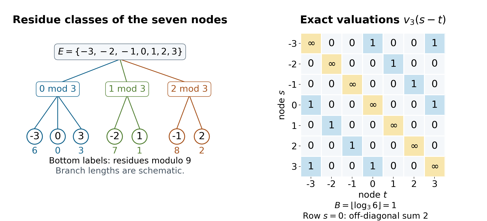

*Figure 10.5. The seven nodes \(-3,\ldots,3\), grouped by their residues modulo three, and the exact matrix \(v_3(s-t)\). The diagonal is \(+\infty\). Nodes in the same indicated class have difference valuation one; all other nonzero differences have valuation zero. The groups split into singletons modulo nine. The drawing is a residue-class schematic: its line lengths are not p-adic distances. For \(R=3,p=3\), the exact separation cost in Theorem 10.34 is \(B=1\). The off-diagonal entries in the row at zero sum to two, matching \(v_3((3!)^2)=2\), but this factorial total cancels in the integral cardinal factors for the full node set. The complete mechanism is proved in (10.99)–(10.103). Human-source context: the normal-series extrapolation in Yu's freely accessible 1990 and 2013 articles, cited below. [Figure program](../figure_sources/integer_node_separation.py).*

For an application with jet order \(M\), put \(\mu=M+1\). Replacing either logarithmic cost above by a larger maximum with a coefficient-height parameter only strengthens the hypothesis. The conclusion then follows once normality and the input jet bound (10.100) hold.

### The error from projecting a logarithmic curve

**Lemma 10.36 (uniform projection error).** Let \(q\ne p\) be a prime, \(I\ge0\) be an integer, and use the prepared family (10.92) with integer Euler coefficients and a finite coefficient vector \(c\in\mathbb C_p^N\setminus\{0\}\). Put \(\delta=\min_j v_p(c_j)\). Take \(b\in\mathbb Z\setminus\{0\}\), \(a_i\in\mathbb Z_p\), and \(u_i,\mathcal L\in\mathbb C_p\), satisfying \(v_p(u_i)>1/(p-1)\), \(v_p(\mathcal L)\ge U\), and \(U-v_p(b)>1/(p-1)\). For \(y\in\mathbb Z_p\), define

\[
\begin{aligned}
\Phi(y;\boldsymbol t)&=\mathcal Q(y;\boldsymbol t)
\big|_{Y_i=\exp(yu_i)},\\
f(y;\boldsymbol t)&=\mathcal Q(y;\boldsymbol t)
\big|_{Y_i=\exp(y(u_i-a_i\mathcal L/b))}.
\end{aligned}
\tag{10.104}
\]

Then for every nonnegative index \(\boldsymbol t\),

\[
v_p\bigl(f(y;\boldsymbol t)-\Phi(y;\boldsymbol t)\bigr)
\ge\delta+U-v_p(b).
\tag{10.105}
\]

**Proof.** Here the integer \(v(k)=\operatorname{lcm}(1,\ldots,k)\) retains its earlier meaning, distinct from the valuation \(v_p\). The prepared Taylor factor is p-integral at \(q^{-I}y+a\). Here is the slight extension of Lemma 10.28 needed for \(y\in\mathbb Z_p\): the rational polynomial \(v(k)^m\Theta(Z;k,\ell,m)\) is integral at integers. Choose an integer approximating any given p-integral argument modulo a sufficiently high power of \(p\), exceeding all its coefficient denominator valuations. Factoring the differences of monomials proves its value is p-integral, exactly as in the proof of Lemma 10.28. The Euler binomial factors are integers. Thus every prepared scalar in (10.92) is p-integral.

All displayed exponentials exist. In each monomial term the ratio of the projected exponential to the original one is
\(\exp(-y\mathcal L\sum_i m_i a_i/b)\), by Proposition 9.4 in [The exponential and the logarithm](../TR-BAKER-09.html#3-the-exponential-and-the-logarithm). Its exponent has valuation at least \(U-v_p(b)>1/(p-1)\), because \(y\), \(m_i\) and \(a_i\) are p-integral. The exact first-term exponential valuation in Proposition 9.3 of that subsection gives that the ratio minus one has valuation at least \(U-v_p(b)\). The original exponential is a local unit. Multiplying by the prepared scalar and its coefficient, then summing, proves (10.105). \(\square\)

In logarithmic applications take \(\mathcal L=p^\kappa\log\Xi\), where \(\kappa\in\mathbb Z_{\ge0}\). If \(v_p(\Xi-1)\ge U>1/(p-1)\), Proposition 9.3 gives \(v_p(\mathcal L)\ge U\). The coefficient \(a_i\) may include a denominator that is a q-power, since it remains p-integral. The precise domain and coefficient valuation cost of the projection estimate are thus visible in (10.104)–(10.105).

### Normalizing the prepared series

**Proposition 10.37 (a normal prepared auxiliary function).** Retain the integer data of (10.92), the finite nonzero coefficient vector \(c\), and \(\delta=\min_j v_p(c_j)\). Choose a coefficient \(c_*\) of that valuation and \(\rho\in\mathbb C_p\) with \(v_p(\rho)=\theta>0\). Suppose that every logarithmic slope \(w_i\) satisfies \(v_p(w_i)>\theta+1/(p-1)\). Define \(f(y;\boldsymbol t)\) by substituting \(Y_i=\exp(yw_i)\) in (10.92), and put

\[
\begin{aligned}
D&=kL,\qquad \gamma=\rho^D(k!)^L/c_*,\\
\Gamma&=v_p(\gamma)=D\theta+L v_p(k!)-\delta,\\
F(Z;\boldsymbol t)&=\gamma f(Z/\rho;\boldsymbol t).
\end{aligned}
\tag{10.106}
\]

For every nonnegative prepared index \(\boldsymbol t\), the function \(F\) is normal. At an integer node \(s\), its divided jets satisfy

\[
F_j(\rho s;\boldsymbol t)=\gamma\rho^{-j}f_j(s;\boldsymbol t),\qquad
v_p(F_j(\rho s;\boldsymbol t))+j\theta=\Gamma+v_p(f_j(s;\boldsymbol t)).
\tag{10.107}
\]

Consequently, if \(v_p(f_j(s;\boldsymbol t))\ge P\) at the node set of Theorem 10.34 for \(0\le j<\mu\), then

\[
v_p(f(x;\boldsymbol t))\ge
\min\{n\mu\theta-\Gamma,\ P-((\kappa+1)\mu-1)B\}
\qquad(x\in\mathbb Z_p).
\tag{10.108}
\]

**Proof.** Consider one prepared polynomial factor after \(y=Z/\rho\). Its coefficient of \(Z^h\) has valuation at least \(-h\theta-\ell v_p(k!)\), and its degree is at most \(k\ell-t_0\). To see this without a coefficient estimate from another source, multiply it by \((k!)^\ell\): it is the coefficient of \(U^{t_0}\) in
\[
\prod_{b=1}^k(q^{-I}Z/\rho+a+b+v(k)U)^\ell.
\]
All constants and \(v(k)\) are integers, while \(q\ne p\). A term of degree \(h\) in \(Z\) therefore has valuation at least \(-h\theta\). Multiplying by \(\rho^D(k!)^L\) makes every coefficient integral, because \(h\le k\ell\le D\) and \(\ell\le L\). The Euler binomial factors are integers, and \(c_j/c_*\) is locally integral. Thus the normalized polynomial part of every summand has Gauss norm at most one.

The exponential part of that summand is \(\exp(\beta Z/\rho)\), where \(\beta=\sum_i m_iw_i\). Either \(\beta=0\), or \(v_p(\beta/\rho)>1/(p-1)\), since the exponents \(m_i\) are integers. By (9.4), its coefficient of degree \(h\ge1\) has valuation
\(h v_p(\beta/\rho)-v_p(h!)\ge h(v_p(\beta/\rho)-1/(p-1))+1/(p-1)>0\), tending to infinity. Its constant coefficient is one. It belongs to \(\mathcal A_1\) with norm one. The product and finite-sum statements of Lemma 9.2 now prove that \(F\in\mathcal A_1\) with norm at most one, hence is normal.

The slope hypotheses define \(f\) on the full closed disc \(|y|\le|\rho|^{-1}\), so the chain rule is valid at every integer node. It gives (10.107), also for zero jets with infinite valuation. Apply Theorem 10.34 with \(\Lambda=\Gamma+P\), then subtract \(\Gamma\), to obtain (10.108). \(\square\)

The larger scale \(D(\theta+1/(p-1))-\delta\) also suffices: (9.4) gives \(L v_p(k!)\le D/(p-1)\), and a scalar of any additional nonnegative valuation preserves normality. For the projected slopes in (10.104), it suffices that \(v_p(u_i)>\theta+1/(p-1)\) and \(U-v_p(b)>\theta+1/(p-1)\). The ultrametric inequality then supplies the slope hypotheses above. Input derivative precision remains an explicit hypothesis in (10.108), distinct from this proof of normality.

## 16. Prepared jets and derivative precision

The interpolation argument can keep the precision of each derivative separately. We first obtain that precision from the prepared equations, without changing the selected Euler directions.

### Differentiating along the projected curve

**Lemma 10.38 (the loss in an ordinary divided jet).** Take the integral forms, matrix \(C\), selected column set \(J\), and derivations \(\delta_j\) of Lemma 10.23. Use those selected derivations as the \(D_j\) in (10.92), renumbering them if necessary. Let \(q\ne p\) be a prime, \(I,\nu\ge0\) be integers, and \(z_j\in\mathbb C_p\), \(1\le j<n\), satisfy \(v_p(z_j)>1/(p-1)\). Put \(\beta=v_p(b_n)\), and define

\[
\begin{aligned}
w_i&=\frac1{b_nq^\nu}\sum_{j<n}C_{ij}z_j,\\
\xi_a&=\frac1{b_nq^\nu}\sum_{j<n}\lambda_{aj}z_j\quad(a\in J),\\
C_0&=\max\{v_p(v(k)),\beta\}.
\end{aligned}
\tag{10.109}
\]

Here the coefficients \(\lambda_{aj}\) are those in (10.64), with \(\lambda_{aj}=\mathbf1_{a=j}\) for selected columns. Suppose that \(v_p(w_i)>1/(p-1)\) for every \(i\). Define \(f(y;\boldsymbol t)\) by substituting \(Y_i=\exp(yw_i)\) in the prepared family (10.92). Fix \(s\in\mathbb Z_p\), an integer \(T\ge0\), and a real \(P_0\). If
\(v_p(f(s;\boldsymbol t'))\ge P_0\) for every \(|\boldsymbol t'|\le T\), then

\[
v_p\bigl(f_j(s;\boldsymbol t)\bigr)\ge P_0-jC_0
\quad\text{whenever }\ |\boldsymbol t|+j\le T,
\qquad
f_j=\frac1{j!}\frac{d^jf}{dy^j}.
\tag{10.110}
\]

**Proof.** By (10.64), \(\sum_iw_iE_i=\sum_{a\in J}\xi_a\delta_a\). Each \(\lambda_{aj}\) is p-integral, and \(q\ne p\), so either \(\xi_a=0\) or
\(v_p(\xi_a)>1/(p-1)-\beta\). Differentiating along the curve therefore applies the commuting operator
\(V=\partial_X+\sum_{a\in J}\xi_a\delta_a\).
This identity follows directly on a term \(P(X)Y^{\boldsymbol m}\): its restriction is \(P(y)\exp(y\sum_i m_iw_i)\), whose derivative has the stated two terms. The exponential laws and convergence in Propositions 9.3–9.4 justify this differentiation on the finite prepared sum.

Write \(A=q^Iv(k)\). The additive prepared operator is \(\mathcal B_{t_0}=A^{t_0}\partial_X^{t_0}/t_0!\). For \(h\ge0\),
\[
\frac{\partial_X^h}{h!}\mathcal B_{t_0}
=A^{-h}\binom{t_0+h}{h}\mathcal B_{t_0+h}.
\]
Its scalar has valuation at least \(-h v_p(v(k))\).

For an indeterminate \(Z\), the defining product for \(\Delta\) gives
\[
Z\Delta(Z;t)=(t+1)\Delta(Z;t+1)-(t+1)\Delta(Z;t).
\]
Repeated use of this identity expresses \(Z^h\Delta(Z;t)\) as an integer linear combination of \(\Delta(Z;e)\), with \(t\le e\le t+h\). Substitution of an Euler derivation is legitimate because all the operators commute. Multiplication by \(\xi_a^h/h!\) gives coefficients of valuation at least \(-h\beta\): for \(h>0\), (9.4) gives
\(h v_p(\xi_a)-v_p(h!)\ge-h\beta\); for \(h=0\), the coefficient is one. A zero \(\xi_a\) causes no problem.

Expand \(V^j/j!\) over \(h_0+\sum_a h_a=j\). The multinomial coefficient cancels the denominator \(j!\), leaving the product of the divided powers just considered. Every resulting prepared index has total order at most \(|\boldsymbol t|+j\), and every scalar has valuation at least
\(-h_0v_p(v(k))-\sum_a h_a\beta\ge-jC_0\).
Evaluation at the same curve point \(s\), followed by the ultrametric inequality, proves (10.110). This proof retains the factorials; no extra \(v_p(j!)\) loss is needed. \(\square\)

### Retaining the precision of each jet

**Theorem 10.39 (interpolation with a linear jet loss).** Retain the normal function, integer node set, \(\rho\), \(\theta\), \(n\), \(\mu\), \(B\), and \(\kappa\in\{0,1\}\) of Theorem 10.34. Suppose \(C\ge0\) and
\(v_p(F_j(\rho s))+j\theta\ge\Lambda-jC\) for every node \(s\) and \(0\le j<\mu\). Then

\[
v_p(F(\rho x))\ge
\min\{n\mu\theta,\ \Lambda-\kappa\mu B-(\mu-1)\max\{B,C\}\}
\qquad(x\in\mathbb Z_p\subset\mathbb Q_p).
\tag{10.111}
\]

**Proof.** Use the explicit Hermite remainder in the proof of Theorem 10.34. Its term with jet index \(j\) contains a coefficient of degree \(h\le\mu-1-j\) in \(A_s\). That proof gives valuations at least \(-\kappa\mu B\) for \(L_s(x)^\mu\), and at least \(-hB\) for that coefficient. The remaining power of \(x-s\) is integral. The term thus has valuation at least
\(\Lambda-jC-\kappa\mu B-(\mu-1-j)B\).
Since \(0\le j\le\mu-1\),
\[
jC+(\mu-1-j)B\le(\mu-1)\max\{B,C\}.
\]
The ultrametric inequality gives the second bound in (10.111) for the full Hermite remainder. The normal quotient and its root product give the first bound \(n\mu\theta\), exactly as before. Their sum proves the claim. \(\square\)

For \(C=0\) this is Theorem 10.34. For \(C>0\), first replacing all jets by their least precision would instead give the larger loss \((\mu-1)(C+B)+\kappa\mu B\). The exact Hermite formula avoids that loss by pairing each jet with only the inverse coefficients it actually uses.

### The input precision for extrapolation

**Corollary 10.40 (prepared vanishing supplies the required jets).** Retain the selected directions and notation of Lemma 10.38, the prepared coefficient vector \(c\ne0\), and \(\delta=\min_jv_p(c_j)\). Suppose the unprojected and projected functions \(\Phi\) and \(f\) satisfy Lemma 10.36 with \(b=b_n\), projection precision \(U\), and coefficient minimum \(\delta\). Suppose also that the slopes of \(f\) satisfy Proposition 10.37 for \(v_p(\rho)=\theta>0\). Let \(\Gamma\) be its exact scale in (10.106).

At every node of Theorem 10.34, assume
\(\Phi(s;\boldsymbol t')=0\) for all \(|\boldsymbol t'|\le T\). Fix \(\boldsymbol t\) with \(|\boldsymbol t|+\mu-1\le T\), and write \(M_0=\max\{B,C_0\}\). Then, for every \(x\in\mathbb Z_p\),

\[
v_p(f(x;\boldsymbol t))\ge
\min\{n\mu\theta-\Gamma,\ U+\delta-\beta
-\kappa\mu B-(\mu-1)M_0\}.
\tag{10.112}
\]

In particular the following explicit budget suffices for
\(v_p(f(x;\boldsymbol t))\ge n\mu\theta-\Gamma\):

\[
U+D\theta+L v_p(k!)\ge n\mu\theta+(\kappa+1)\mu M_0,
\qquad D=kL.
\tag{10.113}
\]

Under that budget the same lower bound holds for \(\Phi(x;\boldsymbol t)\). For the full interval, \(n=2R+1\) and \(\kappa=0\); for the q-deleted interval with \(q\mid R\), \(n=2(1-1/q)R\) and \(\kappa=1\).

These hypotheses have a direct logarithmic model. Take \(z_1,\ldots,z_n\) with \(v_p(z_j)>\theta+1/(p-1)\), and put
\[
u_i=q^{-\nu}\sum_{j=1}^na_{ij}z_j,
\qquad \mathcal L=\sum_{j=1}^nb_jz_j,
\qquad a_i=q^{-\nu}a_{in}.
\]
Then \(a_i\in\mathbb Z_p\), and \(w_i=u_i-a_i\mathcal L/b_n\) is exactly (10.109). If \(v_p(\mathcal L)\ge U\) and \(U-\beta>\theta+1/(p-1)\), the hypotheses of both the projection and normality estimates follow from the ultrametric inequality. The chosen-minor argument supplies the integral coefficients used for the ordinary input jets.

**Proof.** Vanishing of \(\Phi\) and (10.105) give
\(v_p(f(s;\boldsymbol t'))\ge U+\delta-\beta\) for every required prepared index. Lemma 10.38 therefore gives the ordinary input jets with loss \(jC_0\). By (10.107), the corresponding normal jets have weighted precision
\(\Gamma+U+\delta-\beta-jC_0\). Theorem 10.39 and subtraction of \(\Gamma\) prove (10.112).

Here \(\beta\le C_0\le M_0\) and \(B\le M_0\). Consequently
\(\beta+\kappa\mu B+(\mu-1)M_0\le(\kappa+1)\mu M_0\).
Substitute \(\Gamma+\delta=D\theta+Lv_p(k!)\) in (10.113) to see that the second entry of the minimum in (10.112) is at least the first. It also follows that \(U+\delta-\beta\ge n\mu\theta-\Gamma\). The projection error (10.105) holds at \(x\), so \(\Phi=f+(\Phi-f)\) has the same lower bound. The node counts are those proved in Corollary 10.35. \(\square\)

The coefficient minimum cancels from (10.113); it remains in the valuation conclusion through \(\Gamma\). One may instead choose the larger normalizing scale
\(\Gamma'=D(\theta+1/(p-1))-\delta\) allowed by Proposition 10.37. Multiplying the normal function by a scalar of valuation \(\Gamma'-\Gamma\ge0\) repeats the proof with \(\Gamma'\) throughout. It gives the sufficient budget and its corresponding conclusion
\[
U+D\left(\theta+\frac1{p-1}\right)
\ge n\mu\theta+(\kappa+1)\mu M_0
\quad\Longrightarrow\quad
v_p(f(x;\boldsymbol t)),\ v_p(\Phi(x;\boldsymbol t))\ge n\mu\theta-\Gamma'.
\tag{10.114}
\]
Such a scalar exists: its required valuation is the nonnegative rational \(D/(p-1)-L v_p(k!)\), and a b-th root of \(p^a\) has valuation \(a/b\) in \(\mathbb C_p\). The conclusion with \(\Gamma'\) does not assert the stronger conclusion with \(\Gamma\).

Finally, \(v_p(v(k))=\lfloor\log_p k\rfloor\): the highest p-power dividing a least common multiple is the highest p-power dividing one of its factors, and the largest such power among \(1,\ldots,k\) is \(p^{\lfloor\log_pk\rfloor}\). Also \(\beta\le\ln|b_n|/\ln p\). Thus \(M_0\le\max\{\ln(2R),\ln k,\ln|b_n|\}/\ln p\), a useful real-valued upper bound in (10.113)–(10.114). To deduce an algebraic zero from the valuation conclusion one must additionally compare it with the height of the nonzero prepared value. Those arithmetic and numerical comparisons are separate from this interpolation argument.

## 17. When extrapolation forces an algebraic zero

An analytic lower bound for a valuation forces an algebraic value to vanish only when it exceeds the upper bound for a nonzero value. We prove that upper bound with the exact local degree and with the denominators of the prepared polynomial retained.

### A nonzero prepared value

Use the height conventions of Section 14 and the product formula proved in [Places of number fields in extensions and the product formula](../../NT-LOC/NT-LOC-05.html). The height identities for powers and inverses are proved in [Heights of algebraic numbers](../../TR-TRANS/TR-TRANS-02.html#3-the-arithmetic-normalization-and-the-weil-height).

**Theorem 10.41 (arithmetic precision of a prepared value).** Let \(K\) have degree \(d\), and let its chosen prime above \(p\) have ramification index \(e\) and residue degree \(f\). Take the prepared family (10.92) with a prime \(q\ne p\), integers \(I,J\ge0\), \(k,L\ge1\), a nonzero vector \(c\in K^N\), and integer Euler arguments \(\omega_j(\boldsymbol m)\). Let \(|m_i|\le A_i\), put \(N=kL|\mathcal M|\), \(D=kL\), and take \(x=s/q^J\), \(s\in\mathbb Z\), with \(|x|\le X\). Suppose \(\eta_i\in K^\times\) are units at the chosen prime. Evaluate (10.92) at \((x,\boldsymbol\eta)\), and call its value \(V\). Let \(|\boldsymbol t|\le T\), \(T\in\mathbb Z_{\ge0}\), and put

\[
\begin{aligned}
\delta&=\min_jv_p(c_j),\qquad
\Omega=\max\bigl(\{0\}\cup\{|\omega_j(\boldsymbol m)|\}\bigr),\\
\mathcal B_I(X,T)&=
\left(\frac{(q^{-I}X+2k-1+v(k))^k}{k!}\right)^L
\max\{1,\Omega+T\}^{T},\\
\Xi_{I,J,t_0}&=
\begin{cases}
0,&I+J=0,\\
\max\{0,Lv_q(k!)+(I+J)(D-t_0)-t_0v_q(v(k))\},&I+J>0.
\end{cases}
\end{aligned}
\tag{10.115}
\]

If \(V\ne0\), then

\[
\begin{aligned}
v_p(V)-\delta\le\frac d{ef\ln p}
\biggl(&\min\{h_\infty(c)+\ln N,\ h_2(c)+\tfrac12\ln N\}\\
&+\ln\mathcal B_I(X,T)+\Xi_{I,J,t_0}\ln q
+2\sum_iA_i h(\eta_i)\biggr).
\end{aligned}
\tag{10.116}
\]

If \(t_0>D\), the value is zero automatically. The same estimate holds when the Euler arguments are any assigned integers bounded by \(\Omega\); their linear dependence on \(\boldsymbol m\) is not needed for this arithmetic assertion.

**Proof.** Write each row entry as its rational prepared scalar times \(\boldsymbol\eta^{\boldsymbol m}\). The additive scalar is the coefficient of \(Z^{t_0}\) in
\(\Delta(q^{-I}x+a+v(k)Z;k)^\ell\). The sum of the absolute values of the coefficients of this polynomial is at most
\[
\frac{\prod_{b=1}^k(q^{-I}|x|+a+b+v(k))^\ell}{(k!)^\ell}
\le\left(\frac{(q^{-I}X+2k-1+v(k))^k}{k!}\right)^\ell.
\]
The displayed base is at least one: \(2k-1+v(k)\ge k\), and \(k^k\ge k!\). Since \(\ell\le L\), its L-th power bounds this coefficient. The product formula for \(\Delta(\omega;t_j)\) gives the remaining factor in \(\mathcal B_I\), as in Theorem 10.32. Thus every rational scalar has ordinary absolute value at most \(\mathcal B_I\).

There is no denominator away from \(q\), by Lemma 10.28 at the argument \(q^{-I-J}s+a\); the Euler factors are integers. If \(I+J=0\), every scalar is an integer. Otherwise the coefficient of degree \(h\) of the ordinary divided derivative has denominator dividing \((k!)^\ell\), because differentiating a monomial and dividing by \(t_0!\) multiplies its coefficient by an integer binomial coefficient. Its degree is at most \(k\ell-t_0\). Evaluation at \(q^{-I-J}s+a\) costs at most \((I+J)(k\ell-t_0)\) in q-adic valuation. Multiplication by \(v(k)^{t_0}\) restores \(t_0v_q(v(k))\). Taking \(\ell\le L\) gives the clearing factor \(q^{\Xi_{I,J,t_0}}\). If \(t_0>D\), every additive derivative is zero.

Choose a coefficient \(c_*\) of valuation \(\delta\), and put \(z=V/c_*\). At the chosen prime the maximum norm of the coefficient vector \(c/c_*\) is exactly one. For \(V\ne0\), the product formula therefore gives
\[
ef\ln p\,(v_p(V)-\delta)
=-\ln|z|_{\mathfrak p}
=\sum_{v\ne\mathfrak p}\ln|z|_v.
\]
The factor is \(ef\), since \(|z|_{\mathfrak p}=p^{-f\operatorname{ord}_{\mathfrak p}(z)}\) and \(\operatorname{ord}_{\mathfrak p}=ev_p\).

At each archimedean embedding, the triangle inequality bounds the sum by \(N\) times the coefficient maximum times the entry maximum. Alternatively Cauchy–Schwarz gives the coefficient Euclidean norm times \(\sqrt N\) times the entry maximum. This last inequality follows by applying
\((\sum u_jv_j)^2\le(\sum u_j^2)(\sum v_j^2)\) to the absolute values; its difference is \(\sum_{i<j}(u_iv_j-u_jv_i)^2\ge0\). At finite places the ultrametric inequality uses maximum norms and introduces no factor \(N\).

Sum these bounds outside the chosen prime. The normalized coefficient norms contribute exactly \(d h_\infty(c)\), or \(d h_2(c)\), because their missing finite norm is one. There are \(d\) archimedean embeddings with a complex pair counted twice. The rational scalar contributes at most \(d\ln\mathcal B_I\) there. Its clearing factor contributes at most \(d\Xi_{I,J,t_0}\ln q\) over the primes above \(q\), by the local-degree identity for the element \(q\).

At every other place, the torus contribution is bounded by
\(\sum_iA_i\ln\max\{|\eta_i|_v,|\eta_i|_v^{-1}\}\). Its omitted contribution at the chosen prime is zero, since the \(\eta_i\) are units. Summing over all places gives \(2d\sum_iA_i h(\eta_i)\), by the inverse-height identity and product formula. Divide by \(ef\ln p\), and take the better of the two coefficient norm bounds, to obtain (10.116). Every step used only integrality and the absolute size of the Euler factors, proving the final assertion too. \(\square\)

### Fractional nodes and the coefficient field

**Proposition 10.42 (roots and a common local unit).** Let \(\vartheta_i\in K^\times\) be units at \(p\), and choose \(q^J\)-th roots \(\eta_i\) in a fixed algebraic embedding into \(\mathbb C_p\). Put \(F=K(\eta_1,\ldots,\eta_r)\). For \(x=s/q^J\), consider the prepared value with torus coordinates \(\eta_i^s\). Theorem 10.41 applies over \(F\). Its torus height term is at most \(2X\sum_iA_i h(\vartheta_i)\) when \(|x|\le X\), but its local-degree coefficient is

\[
\frac{[F:\mathbb Q]}{e_Ff_F}
=\frac d{ef}\frac{[F:K]}{[F_{\mathfrak P}:K_{\mathfrak p}]}.
\tag{10.117}
\]

One cannot replace this coefficient by \(d/(ef)\) without further information.

If every exponent belongs to \(\boldsymbol m_*+q^J\mathbb Z^r\), where \(\boldsymbol m_*\) is one of the exponent vectors, define
\(\widehat A_i=\max_{\boldsymbol m}|m_i-m_{*,i}|\le2A_i\). Then the common-factor identity is

\[
\begin{aligned}
V&=\boldsymbol\eta^{s\boldsymbol m_*}V_0,\\
V_0&=\sum_{\boldsymbol m,a,\ell}
c_{\boldsymbol m,a,\ell}\,\mathcal S_{\boldsymbol m,a,\ell}(x;\boldsymbol t)
\boldsymbol\vartheta^{s(\boldsymbol m-\boldsymbol m_*)/q^J}\in K,
\qquad v_p(V)=v_p(V_0).
\end{aligned}
\tag{10.118}
\]

Here \(\mathcal S\) denotes the rational prepared scalar in (10.92). In this case (10.116) may instead use \(d/(ef)\) and the torus height term \(2X\sum_i\widehat A_i h(\vartheta_i)\), with the same \(\mathcal B_I\), clearing factor, and coefficient heights. For a logarithmic curve with \(\vartheta_i=\exp(u_i)\), choose \(\eta_i=\exp(u_i/q^J)\). The exponential laws of Proposition 9.4 give \(\eta_i^{q^J}=\vartheta_i\) and \(\exp(xu_i)=\eta_i^s\), identifying the fractional analytic value with the stated algebraic value.

**Proof.** A root of a local unit is a local unit. The height power identity gives \(h(\eta_i)=h(\vartheta_i)/q^J\), and hence \(h(\eta_i^s)=|x|h(\vartheta_i)\). Heights of the coefficient vector are unchanged by extending the field: every archimedean embedding is repeated \([F:K]\) times, and the corresponding finite-place contribution is multiplied by that same factor, as proved by the local-degree identities in the earlier places lesson. Dividing by the field degree cancels that factor. The relative ramification and residue degrees multiply the original ones, and their product is \([F_{\mathfrak P}:K_{\mathfrak p}]\). This proves (10.117) and the assertion about applying the preceding theorem.

In the coset case, \((\boldsymbol m-\boldsymbol m_*)/q^J\) is an integer vector. Factoring its common root monomial gives (10.118), term by term. The common factor is a local unit, so it changes no valuation. Apply the last assertion of Theorem 10.41 to \(V_0\): the Euler arguments stay their original integers, and the new exponent bound is \(\widehat A_i/q^J\). The torus coordinates are \(\vartheta_i^s\), of height \(|s|h(\vartheta_i)\). Their contribution is at most \(2|s|\sum_i(\widehat A_i/q^J)h(\vartheta_i)\le2X\sum_i\widehat A_i h(\vartheta_i)\). The rational scalars and coefficient vector have not changed. \(\square\)

The two comparisons in Theorem 10.43 exclude every finite valuation in the case illustrated in Figure 10.6.

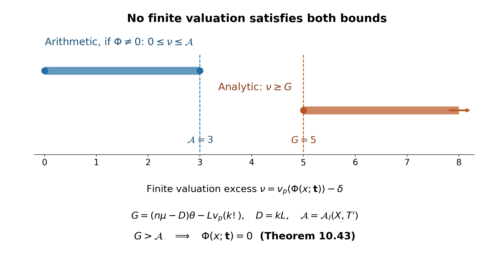

*Figure 10.6. The prepared scalars are p-integral and the torus coordinates are local units, so \(\Phi/c_*\) is p-integral and the valuation excess \(\nu=v_p(\Phi(x;\boldsymbol t))-\delta\) is nonnegative. If the value is nonzero, the product-formula proof of Theorem 10.41 gives \(\nu\le\mathcal A_I(X,T')\). The analytic proof gives \(\nu\ge(n\mu-D)\theta-Lv_p(k!)\). The drawn endpoints \(\mathcal A=3,G=5\) illustrate these two intervals; they are not parameters of a specified auxiliary function. Their separation is exactly the strict second comparison in (10.120), and forces \(\Phi(x;\boldsymbol t)=0\). The zero value has infinite valuation and is outside the finite axis. Human-source context: the product-formula step in Yu's free2013 article, cited below. [Figure program](../figure_sources/arithmetic_precision_budget.py).*

### An explicit zero-forcing step

**Theorem 10.43 (extension of the prepared zeros).** Retain the hypotheses of Corollary 10.40 over the field \(K\), and suppose that at every integer \(x\) the unprojected function is the algebraic prepared value at \((x,\vartheta_1^x,\ldots,\vartheta_r^x)\), with \(\vartheta_i\in K^\times\) local units. Let \(T'=T-\mu+1\ge0\), and let \(X\ge0\) be real. Put

\[
\begin{aligned}
Q_I&=\begin{cases}0,&I=0,\\L(kI+v_q(k!)),&I>0,\end{cases}\\
\mathcal A_I(X,T')&=\frac d{ef\ln p}\biggl(
\min\{h_\infty(c)+\ln N,\ h_2(c)+\tfrac12\ln N\}\\
&\hspace{28mm}+\ln\mathcal B_I(X,T')+Q_I\ln q
+2X\sum_iA_i h(\vartheta_i)\biggr).
\end{aligned}
\tag{10.119}
\]

The node count \(n\), \(\kappa\), \(\theta\), and \(M_0=\max\{B,C_0\}\) are those of Corollary 10.40. If

\[
\begin{aligned}
U+D\theta+L v_p(k!)&\ge n\mu\theta+(\kappa+1)\mu M_0,\\
(n\mu-D)\theta-L v_p(k!)&>\mathcal A_I(X,T'),
\end{aligned}
\tag{10.120}
\]

then \(\Phi(x;\boldsymbol t)=0\) for every integer \(|x|\le X\) and every \(|\boldsymbol t|\le T'\). With the larger normalizing scale of (10.114), an alternative sufficient pair is

\[
\begin{aligned}
U+D\left(\theta+\frac1{p-1}\right)&\ge n\mu\theta+(\kappa+1)\mu M_0,\\
(n\mu-D)\theta-\frac D{p-1}&>\mathcal A_I(X,T').
\end{aligned}
\tag{10.121}
\]

**Proof.** The first line of (10.120) supplies the analytic budget of Corollary 10.40. At every stated index its conclusion gives
\[
v_p(\Phi(x;\boldsymbol t))-\delta
\ge(n\mu-D)\theta-L v_p(k!).
\]
If the prepared value were nonzero, Theorem 10.41 with \(J=0\) would give the opposite upper bound \(\mathcal A_I(X,T')\): its torus coordinates have height \(|x|h(\vartheta_i)\), and its clearing exponent is at most \(Q_I\). The strict second line of (10.120) contradicts this. A prepared index with \(t_0>D\) already has zero value. These cases prove every claimed zero. The same argument using (10.114) instead proves (10.121). \(\square\)

Both comparisons remove \(\delta\), so they are invariant under scaling the coefficient vector. The first comparison gives enough analytic precision; the second makes a nonzero algebraic value impossible. At fractional nodes one must additionally use the field or common-factor rule of Proposition 10.42. Applying this step repeatedly requires checking these inequalities, the slope conditions, and the available derivative orders at every stage.

## 18. Retaining the derivative orders in the height budget

The uniform estimate (10.115) bounds every coefficient by the sum of all coefficients. It also discards the factorials in the Euler binomials. Those bounds suffice for Theorem 10.43, but a numerical induction benefits from retaining the actual derivative order. We now do so, including the average over the symmetric initial nodes. The additive estimate below has the form of Lemma 1.6 in Yu's free 1990 paper; we give its full proof using only an elementary factorial inequality.

### Positive polynomial majorants

Let \(\Omega_j=\max_{\boldsymbol m\in\mathcal M}|\omega_j(\boldsymbol m)|\), for \(1\le j<r\), and let \(\Omega_\Sigma=\sum_{j<r}\Omega_j\). For integers \(\Omega,h\ge0\), define \(E_h(\Omega)=\binom{\Omega+h}{h}\). Thus \(E_0(\Omega)=E_h(0)=1\). Put \(\Gamma_0=1\); for \(h>0\), put \(\Gamma_h=0\) if \(r=1\), and \(\Gamma_h=\binom{\Omega_\Sigma+r-2+h}{h}\) if \(r\ge2\). Use empty products and sums when \(r=1\). Define the positive polynomial

\[
\begin{aligned}
\mathcal P_{I,X}(Z)
&=\left(\frac1{k!}\prod_{b=1}^k
(q^{-I}X+k-1+b+v(k)Z)\right)^L\\
&=\sum_{u=0}^{D}\mathcal C_{I,u}(X)Z^u,
\qquad D=kL.
\end{aligned}
\tag{10.122}
\]

**Theorem 10.44 (an order-dependent scalar bound).** For the rational prepared scalar \(\mathcal S_{\boldsymbol m,a,\ell}(x;\boldsymbol t)\) in (10.92), with \(0\le a<k\), \(1\le\ell\le L\), \(|x|\le X\), and \(t_0\le D\), one has

\[
\begin{aligned}
|\mathcal S_{\boldsymbol m,a,\ell}(x;\boldsymbol t)|
&\le\mathcal H_I(X;\boldsymbol t)
:=\mathcal C_{I,t_0}(X)\prod_{j<r}E_{t_j}(\Omega_j),\\
\mathcal B_I^*(X,T)
&:=\max_{|\boldsymbol t|\le T,\ t_0\le D}
\mathcal H_I(X;\boldsymbol t).
\end{aligned}
\tag{10.123}
\]

An index with \(t_0>D\) has zero scalar. If \(\Omega_j=0\), its Euler factor is \(\Delta(0;t_j)=1\), so changing that index to zero leaves the scalar unchanged. The maximum in (10.123) is at least one and satisfies

\[
\begin{aligned}
\mathcal B_I^*(X,T)&\le\mathcal B_I(X,T),\\
\mathcal B_I^*(X,T)&\le
\left(\mathrm e\left(2+\frac{q^{-I}X}{k}\right)\right)^D
\max_{\substack{u,h\ge0\text{ integers}\\u\le D,\ u+h\le T}}
v(k)^u\Gamma_h.
\end{aligned}
\tag{10.124}
\]

Here \(\mathcal B_I\) is (10.115); the second bound retains the division of the total order between the additive and Euler directions. For \(h>0\), one may further bound \(\Gamma_h\) by \([\mathrm e(1+(\Omega_\Sigma+r-1)/h)]^h\).

**Proof.** At a given real or complex \(x\), replace each factor \(q^{-I}x+a+b\) by its absolute-value upper bound \(q^{-I}X+a+b\). Expansion of the product bounds the absolute value of each coefficient by the corresponding coefficient of this polynomial with nonnegative coefficients. Its constant coefficient after division by \(k!\) is at least one: each factor \(q^{-I}X+a+b\) is at least \(b\). Consequently increasing its power from \(\ell\) to \(L\) can only increase every coefficient. Increasing \(a\) to \(k-1\) has the same property. Taking the coefficient of \(Z^{t_0}\) gives \(\mathcal C_{I,t_0}(X)\).

For an integer \(\omega\) with \(|\omega|\le\Omega\), the product defining \(\Delta(\omega;t)\) gives \(|\Delta(\omega;t)|\le E_t(\Omega)\). Indeed \(|\omega+b|\le\Omega+b\), for \(1\le b\le t\), and the factorial \(t!\) is retained. When \(\Omega=0\), the Euler argument is zero and every such binomial is one. This proves (10.123), the degree-zero case and the duplicate-direction assertion. Every \(\mathcal C_{I,u}(X)\) is positive. At \(X=0\), it is the prepared Taylor coefficient at the integer \(k-1\), so it is an integer by Lemma 10.28 and is at least one. The coefficients increase with \(X\). In particular the index \(\boldsymbol t=0\) proves \(\mathcal B_I^*\ge1\).

For the first inequality in (10.124), each \(\mathcal C_{I,u}(X)\) is at most \(\mathcal P_{I,X}(1)\). Bounding each of its \(k\) factors by \(q^{-I}X+2k-1+v(k)\) gives the additive part of (10.115). Put \(\Omega=\max_j\Omega_j\), with \(\Omega=0\) for an empty index set. The Euler product is at most \(\max\{1,\Omega+T\}^T\), as in Theorem 10.32. Hence this sharper maximum never exceeds the earlier one.

We prove the additive estimate used for the second inequality. For every integer \(k\ge1\), monotonicity of \(\log x\) on each interval \([j-1,j]\) gives
\(\log k!\ge\int_1^k\log x\,dx=k\log k-k+1\). Thus \(k!\ge\mathrm e(k/\mathrm e)^k\), including \(k=1\). At \(y\ge0\), coefficient comparison with \((Z+k)^{k\ell}/(k!)^\ell\) gives
\[
\begin{aligned}
|\Theta(z;k,\ell,u)|
&\le\frac{\binom{k\ell}{u}(|z|+k)^{k\ell-u}}{(k!)^\ell}\\
&\le\frac{\ell^u}{u!}\,
\frac{(|z|+k)^{k\ell}}{(k!)^\ell}
\le\left(\frac{\mathrm e(|z|+k)}k\right)^{k\ell}.
\end{aligned}
\tag{10.125}
\]
The first comparison takes absolute values in the differentiated product. The second uses \(\binom{k\ell}{u}\le(k\ell)^u/u!\) and \(|z|+k\ge k\). The last uses the factorial bound and \(\ell^u/u!\le\mathrm e^\ell\), since this is one nonnegative term of the exponential series. Derivatives above degree \(k\ell\) are zero. Apply (10.125) with \(z=q^{-I}x+a\), multiply by \(v(k)^u\), and increase \(\ell\) to \(L\). The base \(\mathrm e(2+q^{-I}X/k)\) is greater than one. The same bound applies to \(\mathcal C_{I,u}(X)\), by using \(x=X,a=k-1,\ell=L\).

Finally, \(E_h(\Omega)\) is the coefficient of \(Z^h\) in the product of \(\Omega+1\) copies of \(1+Z+Z^2+\cdots\). Distributing \(h\) objects among these slots gives \(\binom{\Omega+h}{h}\). Multiplying these series over the Euler directions uses \(\Omega_\Sigma+r-1\) slots, so every fixed Euler product of total order \(h\) is at most \(\Gamma_h\): it is one of the nonnegative summands of that coefficient. For no Euler directions only order zero occurs. This proves the second inequality in (10.124). When \(h>0,r\ge2\), the numerator product for \(\Gamma_h\) is at most \((\Omega_\Sigma+r-1+h)^h\); the factorial bound gives the further estimate. When \(r=1\), its left side is zero. \(\square\)

### Averaging the initial rows

Keep the data of Theorem 10.32, and write \(H=\sum_i A_i h(\vartheta_i)\). Let \(r_0\) be the number of Euler indices with \(\Omega_j>0\). The representative prepared indices after removing duplicate zero directions, and their row count, are

\[
\begin{aligned}
\mathcal J_T&=\{\boldsymbol t\ge0:|\boldsymbol t|\le T,\ t_0\le D,
\ t_j=0\text{ if }\Omega_j=0\},\\
J_T&=|\mathcal J_T|=
\sum_{u=0}^{\min(D,T)}\binom{T-u+r_0}{r_0},
\qquad M_*=(2S+1)J_T.
\end{aligned}
\tag{10.126}
\]

**Corollary 10.45 (a sharper initial coefficient budget).** If \(N>M_*\), the integral kernel in Theorem 10.32 exists with every originally specified zero and with

\[
\begin{aligned}
h_\infty(c)\le h_2(c)\le&\ \tfrac12\log N+
\frac{\log|\Delta_K|}{2d}\\
&+\frac1{N-M_*}\sum_{s=-S}^S\sum_{\boldsymbol t\in\mathcal J_T}
\left(\tfrac12\log N+
\log\mathcal H_0(|s|;\boldsymbol t)+2|s|H\right).
\end{aligned}
\tag{10.127}
\]

A simpler consequence is

\[
\begin{aligned}
h_2(c)\le&\ \tfrac12\log N+\frac{\log|\Delta_K|}{2d}\\
&+\frac{M_*}{N-M_*}
\left(\tfrac12\log N+\log\mathcal B_0^*(S,T)
+\frac{2S(S+1)}{2S+1}H\right).
\end{aligned}
\tag{10.128}
\]

When \(N>M\) in Theorem 10.32, the right side of (10.128) is no larger than the right side of (10.96).

**Proof.** An index above the additive degree has zero scalar. An index in a zero Euler direction duplicates the row with that index set to zero, by Theorem 10.44. Removing it therefore preserves every original vanishing condition. Fixing \(t_0=u\) leaves \(r_0\) Euler indices of total order at most \(T-u\). The divider argument from Theorem 10.32 counts them as \(\binom{T-u+r_0}{r_0}\), also when \(r_0=0\). This proves (10.126).

At each retained row \((s,\boldsymbol t)\), the same adelic row-norm proof as in Theorem 10.32 now uses \(\mathcal H_0(|s|;\boldsymbol t)\). At finite places the prepared scalars are still integers. The row norm is therefore at most
\(\sqrt N\mathcal H_0(|s|;\boldsymbol t)\exp(2|s|H)\).
The scalar majorant is at least one: its positive additive coefficient at integer \(|s|+k-1\) is an integer by Lemma 10.28, and every retained Euler factor is a positive integer. Hence the displayed row bound is at least one, as required by the maximum in (8.40). A row that vanishes for additional reasons has norm zero and contributes the factor one there. Apply that proved weighted Siegel lemma with all weights one, retaining the separate row factors. Its logarithm is exactly (10.127), and its finite conditions give algebraic-integer coordinates. Dependent rows are already included in that lemma.

The uniform scalar bound in (10.123) and the identity
\(\sum_{s=-S}^S|s|=S(S+1)\) give (10.128). Finally \(M_*\le M\), \(\mathcal B_0^*\le\mathcal B\), and \(S(S+1)/(2S+1)\le S\). All summands are nonnegative. The function \(m/(N-m)\) increases for \(0\le m<N\), as cross multiplication shows. These facts prove the comparison with (10.96). The nonzero polynomial and its required ordinary jets follow from Proposition 10.31, exactly as before. \(\square\)

### The smaller nonzero-value budget

For the integer target nodes in Theorem 10.43, define, at each \(\boldsymbol t\in\mathcal J_{T'}\),

\[
\begin{aligned}
\mathcal A_{I,\boldsymbol t}^*(X)=\frac d{ef\ln p}\biggl(&
\min\{h_\infty(c)+\ln N,h_2(c)+\tfrac12\ln N\}\\
&+\ln\mathcal H_I(X;\boldsymbol t)
+\Xi_{I,0,t_0}\ln q+2XH\biggr),\\
\mathcal A_I^*(X,T')&=\max_{\boldsymbol t\in\mathcal J_{T'}}
\mathcal A_{I,\boldsymbol t}^*(X).
\end{aligned}
\tag{10.129}
\]

**Corollary 10.46 (zero forcing with the retained orders).** Under the hypotheses of Theorem 10.43, its first analytic comparison and

\[
(n\mu-D)\theta-Lv_p(k!)>\mathcal A_I^*(X,T')
\tag{10.130}
\]

force every zero asserted there. The analogous assertion holds with its larger normalizing scale and lower bound \((n\mu-D)\theta-D/(p-1)\). Moreover \(\mathcal A_I^*(X,T')\le\mathcal A_I(X,T')\).

**Proof.** Repeating the product-formula proof of Theorem 10.41 uses the individual scalar bound \(\mathcal H_I(X;\boldsymbol t)\) instead of \(\mathcal B_I\), with its same exact clearing exponent. Thus a nonzero value at a retained index has valuation excess at most \(\mathcal A_{I,\boldsymbol t}^*\). The analytic lower bound contradicts (10.130). Every removed index either has zero scalar by additive degree or duplicates a retained index by setting its zero Euler directions to zero. The larger normalizing scale gives the stated second conclusion by the same argument. Finally \(\mathcal H_I(X;\boldsymbol t)\le\mathcal B_I(X,T')\) and \(\Xi_{I,0,t_0}\le Q_I\). Taking the maximum proves the comparison with (10.119). Fractional targets still require the field or common-factor conditions of Proposition 10.42. \(\square\)

These refinements retain the exact factorials, lcm, derivative orders and mean node size. To obtain a numerical logarithm estimate, their bounds and the analytic slope and order conditions must all be checked for its chosen induction parameters.

## 19. Passing to one exponent coset

The next auxiliary function is obtained by retaining one coset of the exponent set and dividing its exponent differences by \(q\). Two facts justify this step: independent root monomials separate the cosets, and an invertible affine change preserves the filtered Euler jets. The saturated Kummer theorem and the Newton reparametrization have already been proved in Theorem 10.14 and Lemma 10.30. We now combine them, retaining the coefficient field and the condition on the integer node. This is the algebraic mechanism of the coset passage in Yu's free 2013 paper, Lemma 5.4.

### Separating the root monomials

**Theorem 10.47 (exact coset extraction).** Let \(F\) be a characteristic-zero field, \(q\) a prime, and \(\vartheta_i\in F^\times\), \(1\le i\le r\). Choose \(\eta_i^q=\vartheta_i\), and suppose
\([F(\eta_1,\ldots,\eta_r):F]=q^r\).
Take a finite set \(\mathcal M\subset\mathbb Z^r\), coefficients \(A_{\boldsymbol m}\in F\), and an integer \(s\) coprime to \(q\). If \(\sum_{\boldsymbol m}A_{\boldsymbol m}\boldsymbol\eta^{s\boldsymbol m}=0\), then for each residue vector \(\boldsymbol\rho\in\{0,\ldots,q-1\}^r\),

\[
\sum_{\boldsymbol m\equiv\boldsymbol\rho\ (q)}
A_{\boldsymbol m}\boldsymbol\vartheta^{s(\boldsymbol m-\boldsymbol\rho)/q}=0.
\tag{10.131}
\]

**Proof.** The \(q^r\) monomials \(\boldsymbol\eta^{\boldsymbol\rho}\) span the root field over \(F\): reduce every exponent modulo \(q\), using \(\eta_i^q=\vartheta_i\ne0\), also for negative exponents. The span is closed under multiplication. Every nonzero element of this finite-dimensional span has an inverse in it: multiplication by that element is injective in the surrounding field and thus surjective on the span. Hence it is the whole root field. Its degree is \(q^r\), so these spanning monomials are a basis.

Group the given sum by \(\boldsymbol\rho\). Its coefficient after factoring \(\boldsymbol\eta^{s\boldsymbol\rho}\) is exactly the expression in (10.131), an element of \(F\). Let \(\boldsymbol\rho'\) be the least nonnegative residues of \(s\boldsymbol\rho\), and put \(\boldsymbol b=(s\boldsymbol\rho-\boldsymbol\rho')/q\). Then
\(\boldsymbol\eta^{s\boldsymbol\rho}=\boldsymbol\vartheta^{\boldsymbol b}\boldsymbol\eta^{\boldsymbol\rho'}\).
Multiplication by \(s\) permutes the residue vectors because \(q\nmid s\). Thus grouping gives a relation among distinct basis monomials, with each grouped coefficient multiplied by the nonzero scalar \(\boldsymbol\vartheta^{\boldsymbol b}\). Every coefficient vanishes, proving (10.131). \(\square\)

This argument extracts exact zeros. A large finite valuation of the sum does not by itself supply that valuation for each coset.

### The next prepared family

**Theorem 10.48 (coset restriction and affine jet transfer).** Take a number field \(K\), a prime \(q\ne p\), local units \(\vartheta_i\in K^\times\), and the integer Euler forms \(\omega_j(\boldsymbol m)=\sum_iC_{ij}m_i\) in (10.92). Let \(c\in K^N\setminus\{0\}\). Suppose that a field \(F\supset K\) and chosen roots \(\eta_i^q=\vartheta_i\) satisfy the degree condition of Theorem 10.47. Let \(\mathcal E\) be any set of integers coprime to \(q\). Assume that all original prepared values at
\((s/q,\eta_1^s,\ldots,\eta_r^s)\), \(s\in\mathcal E\), vanish through total order \(T\).

Choose \(\boldsymbol m_*\) at which some coefficient attains \(\delta=\min v_p(c_j)\). Retain its exponent coset, and put

\[
\begin{aligned}
\mathcal M'&=\{(\boldsymbol m-\boldsymbol m_*)/q:
\boldsymbol m\in\mathcal M,\ \boldsymbol m\equiv\boldsymbol m_*\ (q)\},\\
c'_{\boldsymbol n,a,\ell}&=c_{\boldsymbol m_*+q\boldsymbol n,a,\ell},\\
Q'(X,Y)&=\sum_{\boldsymbol n,a,\ell}c'_{\boldsymbol n,a,\ell}
\Delta(q^{-(I+1)}X+a;k)^\ell Y^{\boldsymbol n}.
\end{aligned}
\tag{10.132}
\]

Then \(Q'\ne0\). Its new prepared family, with stage \(I+1\) and the same Euler matrix \(C\), vanishes at \((s,\boldsymbol\vartheta^s)\), \(s\in\mathcal E\), through the same total order \(T\).

The original prepared values restricted to this coset and the new prepared values are related by the affine changes

\[
\begin{aligned}
\Delta(qZ+\omega_j(\boldsymbol m_*);t_j)
&=\sum_{u_j=0}^{t_j}d_{t_j,u_j}^{(j)}\Delta(Z;u_j),
\qquad d_{t_j,t_j}^{(j)}=q^{t_j},\\
\min_{|\boldsymbol t|\le T}v_p(\text{original coset value at }s/q)
&=\min_{|\boldsymbol t|\le T}v_p(\text{new prepared value at }s).
\end{aligned}
\tag{10.133}
\]

The minimum identity includes \(\infty\) when all values are zero. The coefficients satisfy

\[
\min v_p(c'_j)=\delta,\qquad
h_\infty(c')\le h_\infty(c),\qquad h_2(c')\le h_2(c).
\tag{10.134}
\]

Global integrality of \(c\) is retained by \(c'\). For any convex body \(\mathcal C\) and vector \(x_0\) with \(\mathcal M\subset q^{-I}\mathcal C-x_0\), one has

\[
\begin{aligned}
\mathcal M'&\subset q^{-(I+1)}\mathcal C-(x_0+\boldsymbol m_*)/q,\\
\deg_{Y_i}(\text{ordinary monomial shift of }Q')
&\le\left\lfloor
\frac{\max_{\boldsymbol m\in\mathcal M}m_i-
\min_{\boldsymbol m\in\mathcal M}m_i}{q}\right\rfloor.
\end{aligned}
\tag{10.135}
\]

Its additive degree is at most \(D=kL\).

**Proof.** Fix \(s\in\mathcal E\) and a prepared index. The rational additive and Euler factors, multiplied by the coefficients \(c\), belong to \(K\subset F\). Theorem 10.47 therefore extracts a zero separately in every exponent coset. For the chosen one, factoring \(\boldsymbol\eta^{s\boldsymbol m_*}\) gives a zero with torus monomials \(\boldsymbol\vartheta^{s\boldsymbol n}\).

The additive scalar at \(s/q\) is exactly
\(v(k)^{t_0}\Theta(q^{-(I+1)}s+a;k,\ell,t_0)\).
The old Euler argument is
\(\omega_j(\boldsymbol m_*+q\boldsymbol n)=
q\omega_j(\boldsymbol n)+\omega_j(\boldsymbol m_*)\).
Lemma 10.30 gives the first line of (10.133), and both its matrix and inverse have coefficients in \(\mathbb Z[1/q]\). The product changes only to indices with \(u_j\le t_j\), keeping \(t_0\) fixed. On the finite space of indices of total order at most \(T\), it is triangular with nonzero diagonal \(q^{\sum_{j<r}t_j}\); its inverse preserves the same filtration. Every new jet is therefore a linear combination of the extracted old coset jets, proving all the claimed zeros without reducing \(T\).

The factored root monomial is a local unit, since every \(\vartheta_i\) is one. The affine matrix and inverse are p-integral because \(q\ne p\). Applying the ultrametric inequality to each change shows in both directions that the minimum valuation cannot decrease. This proves the second line of (10.133). It compares the jets of an individual coset; extraction from the whole sum used exact vanishing.

The selected coefficient vector is nonzero and contains a coefficient of the original minimum valuation. This proves the first assertion of (10.134). At every place its maximum norm is at most the old one; at each archimedean embedding the same is true for its Euclidean norm. Summing logarithms in the projective height definitions proves the remaining two inequalities. Coordinates of an integral vector remain integral. Distinct exponents give distinct \(\boldsymbol n\), so Lemma 10.29 proves \(Q'\ne0\), as in Proposition 10.31.

For the geometric inclusion, divide
\(\boldsymbol m+x_0\in q^{-I}\mathcal C\) by \(q\) and subtract \((x_0+\boldsymbol m_*)/q\). Each coordinate width of the retained exponent set is divided by \(q\). Multiplying \(Q'\) by the inverse of its coordinatewise least Laurent monomial makes its torus exponents nonnegative, with exactly those widths. They are integers, proving (10.135). The additive degree is unchanged. \(\square\)

Figure 10.7 shows the exponent change in Theorem 10.48 for a square support at \(q=2\).

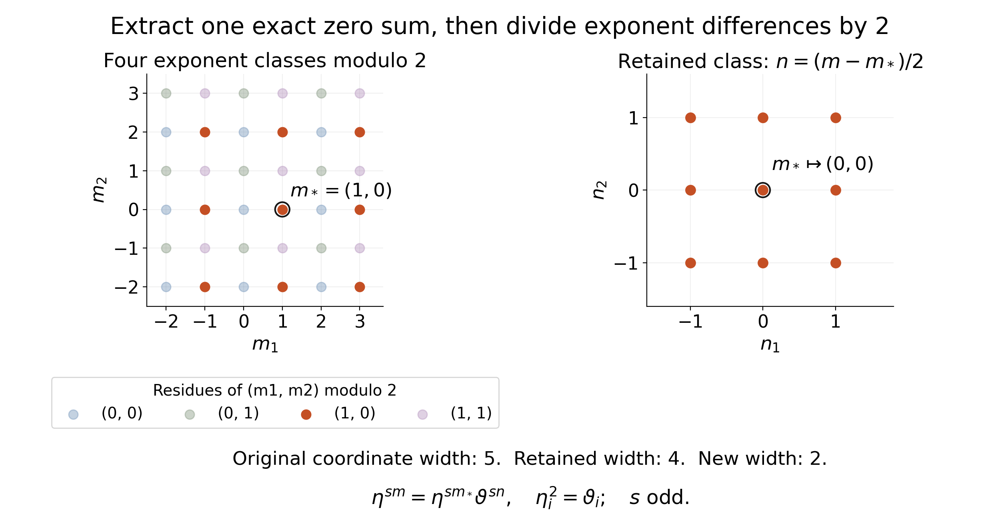

*Figure 10.7. The exact support is \(\mathcal M=\{-2,-1,0,1,2,3\}^2\). The four colors mark its four classes modulo two. Selecting \(\boldsymbol m_*=(1,0)\) retains the nine orange points \(m_1\in\{-1,1,3\},m_2\in\{-2,0,2\}\); translating by \(-\boldsymbol m_*\) and dividing by two gives \(\{-1,0,1\}^2\). The original coordinate width five becomes retained width four and then new width two, exactly as in (10.135). For odd \(s\), full root-field degree separates the four root monomials in Theorem 10.47; their exact zero sums can then be treated separately. In the selected class the common local unit is \(\boldsymbol\eta^{s\boldsymbol m_*}\), and the remaining monomials are \(\boldsymbol\vartheta^{s\boldsymbol n}\), by (10.132)–(10.133). The displayed support illustrates that algebraic transformation; it does not assert a particular coefficient vector or numerical logarithm bound. Human-source context: Yu's free2013 Lemma5.4, cited below. [Figure program](../figure_sources/coset_descent_geometry.py).*

### Root-of-unity phases and the coefficient field

**Corollary 10.49 (q-primary phases).** Let \(\alpha_0,\theta_1,\ldots,\theta_r\) be the saturated generators of Theorem 10.14. Choose \(\xi^q=\alpha_0\) and \(\rho_i^q=\theta_i\), and put \(F=K(\xi)\). For an integer \(P\ge1\) coprime to \(q\) and integers \(d_i\), set

\[
\vartheta_i=\theta_i^P\alpha_0^{d_i},\qquad
\eta_i=\rho_i^P\xi^{d_i},\qquad
[F(\boldsymbol\eta):F]=q^r,\qquad
h(\vartheta_i)=P h(\theta_i).
\tag{10.136}
\]

Thus Theorems 10.47–10.48 apply to these phased torus coordinates. If the \(\theta_i\) are local units and \(q\ne p\), all the displayed roots are local units. In particular one may take \(P=p^a\), \(a\ge0\).

**Proof.** Theorem 10.14 gives total root degree \(q^{r+1}\), and the same proved Kummer argument for \(\alpha_0\) alone gives \([F:K]=q\). Hence \([F(\boldsymbol\rho):F]=q^r\). Clearly \(F(\boldsymbol\eta)\subset F(\boldsymbol\rho)\). Choose integers \(A,B\) with \(AP+Bq=1\); integer division gives such a pair because \(P\) and \(q\) are coprime. Then
\(\rho_i=(\eta_i\xi^{-d_i})^A\theta_i^B\),
giving the reverse inclusion and the degree in (10.136). The q-th power identity follows directly. A root of unity has height zero; applying the product-height inequality in both directions shows that multiplying by it preserves height. The proved power identity then gives \(h(\vartheta_i)=P h(\theta_i)\). Finally taking valuations in the defining power equations proves every unit assertion. \(\square\)

The coefficient field \(F\) holds the root-of-unity phase, while the selected new coefficients and torus bases in Theorem 10.48 remain in \(K\). The next zero set consists of the stated integer nodes coprime to \(q\); extension to further nodes uses the extrapolation results, with their slope and precision conditions.

## 20. Retaining the phase congruence in the next support

The phase used to make a local unit close to one need not belong to the global field \(K\). A support congruence controls its powers. After division by \(q\), the congruence has either one class or \(q\) classes; in the latter case the q-primary root separates them. We prove both cases, keeping all the new coefficients in \(K\). This supplies the phase and support passage of Yu's free 2013 paper, equations (5.51)–(5.61), before the separate analytic extension to further nodes.

### The congruence and its phase classes

**Lemma 10.50 (division of a phase congruence).** Let \(q\) be prime, \(G_0\ge1\) an integer, and \(a\in\mathbb Z\). The congruence \(qu+a\equiv0\pmod{G_0}\) has the following solutions:

\[
\begin{aligned}
u&\equiv-q^{-1}a\pmod{G_0},
&&\gcd(q,G_0)=1,\\
u&\equiv-a/q+bG_0/q\pmod{G_0},
\quad 0\le b<q,
&&q\mid G_0,\ q\mid a.
\end{aligned}
\tag{10.137}
\]

In the second case there is no solution if \(q\nmid a\), and the displayed \(q\) classes are distinct. Suppose additionally that \(\alpha_0\in K^\times\) is not a q-th power, \(\mu_q\subset K\), and \(\beta^q=\alpha_0\). Then, for every integer \(s\) prime to \(q\), the \(q\) powers \(\beta^{sb}\), \(0\le b<q\), are linearly independent over \(K\).

**Proof.** If \(q\) and \(G_0\) are coprime, integer division gives integers \(A,B\) with \(Aq+BG_0=1\). Multiplication by \(A\) solves the congruence, uniquely modulo \(G_0\). If \(q\mid G_0\), reduction modulo \(q\) first forces \(q\mid a\). Put \(H=G_0/q\). The original congruence is equivalent to \(u+a/q\equiv0\pmod H\), so \(u=-a/q+bH+G_0v\) for a unique \(b\) modulo \(q\). This proves the second formula and its distinctness.

The complete Kummer argument of Theorem 10.14 applied to the one independent class \(\alpha_0\) proves \([K(\beta):K]=q\). Equivalently \(1,\beta,\ldots,\beta^{q-1}\) are a basis, since their span is the field and has that degree, as proved in Theorem 10.47. Multiplication by \(s\) permutes exponents modulo \(q\); reducing \(\beta^{sb}\) by \(\beta^q=\alpha_0\) multiplies those basis elements by nonzero scalars in \(K\). This proves the asserted independence, also for negative \(s\). \(\square\)

### The phased prepared values

Take the saturated generators \(\alpha_0,\theta_1,\ldots,\theta_r\) of Theorem 10.14, with \(\alpha_0\) of order \(q^u\). Let \(G_0\ge1\), put \(G=q^uG_0\), and choose roots of unity and algebraic roots in a fixed embedding such that

\[
\begin{aligned}
\zeta^{G_0}&=\alpha_0,\quad \zeta\text{ has order }G,\quad
\xi^q=\zeta,\quad \beta=\xi^{G_0},\quad \beta^q=\alpha_0,\\
\rho_i^q&=\theta_i,\qquad
\gamma_i=\theta_i^P\zeta^{d_i},\qquad
\eta_i=\rho_i^P\xi^{d_i},\qquad \eta_i^q=\gamma_i ,
\end{aligned}
\tag{10.138}
\]

where \(P\ge1\) is prime to \(q\), and \(d_i\in\mathbb Z\). The existence of \(\zeta\) with the specified order is a hypothesis here; Lemma 10.53 constructs it for the local residue modulus. Write \(d\cdot m=\sum_i d_i m_i\), and let \(F=K(\beta)\). Theorem 10.14 gives \([F(\boldsymbol\rho):F]=q^r\).

Let \(I\ge0,k,L\ge1,T\ge0\) be integers. Let a finite nonempty \(\Lambda\subset\mathbb Z^r\) satisfy \(d\cdot\iota\equiv\varepsilon\pmod{G_0}\). Fix \(\iota_0\in\Lambda\), an integer Euler matrix \(C\), and a nonzero coefficient vector \(c\in K^N\), with \(N=kL|\Lambda|\). The fractional prepared values are

\[
\begin{aligned}
\Psi(s/q;\boldsymbol t)=
\sum_{\iota,a,\ell}c_{\iota,a,\ell}
v(k)^{t_0}\Theta(q^{-(I+1)}s+a;k,\ell,t_0)
\prod_{j<r}\Delta(C_j(\iota-\iota_0);t_j)
\boldsymbol\eta^{s(\iota-\iota_0)} .
\end{aligned}
\tag{10.139}
\]

Here \(C_j(m)=\sum_i C_{ij}m_i\), the indices \(a,\ell\) retain \(0\le a<k,1\le\ell\le L\), and the sum ranges over \(\iota\in\Lambda\).

**Theorem 10.51 (complete phase and support passage).** Suppose that (10.139) is zero for every \(s\) in a set \(\mathcal E\subset\mathbb Z\) prime to \(q\), and every \(|\boldsymbol t|\le T\). Put \(\delta=\min_jv_p(c_j)\), where \(q\ne p\) and the \(\theta_i\) are units in a fixed embedding into \(\mathbb C_p\).

Choose \(\iota_{\min}\) at which some coefficient has valuation \(\delta\), and let \(\lambda_*\in\{0,\ldots,q-1\}^r\) represent \(\iota_{\min}-\iota_0\) modulo \(q\). First retain the exponents in this q-coset, and write

\[
\iota-\iota_0=q\lambda+\lambda_*,
\qquad a_*=d\cdot\lambda_*,
\qquad q\,d\cdot\lambda+a_*\equiv0\pmod{G_0}.
\tag{10.140}
\]

If \(\gcd(q,G_0)=1\), retain this whole coset and put \(\varepsilon'=-q^{-1}a_*\pmod{G_0}\). If \(q\mid G_0\), then \(q\mid a_*\). Put \(H=G_0/q\), \(a_0=-a_*/q\), and choose the unique \(b_{\min}\in\{0,\ldots,q-1\}\) for which the \(\lambda\) corresponding to \(\iota_{\min}\) satisfies \(d\cdot\lambda\equiv a_0+b_{\min}H\pmod{G_0}\). Retain only that subclass and put \(\varepsilon'=a_0+b_{\min}H\).

The resulting nonempty set \(\Lambda'\) has \(d\cdot\lambda\equiv\varepsilon'\pmod{G_0}\). Select \(\lambda_0\in\Lambda'\) corresponding to \(\iota_{\min}\), retain the same coefficients \(c'_{\lambda,a,\ell}=c_{\iota,a,\ell}\), and form

\[
\begin{aligned}
Q'(X,Y)&=\sum_{\lambda,a,\ell}c'_{\lambda,a,\ell}
\Delta(q^{-(I+1)}X+a;k)^\ell
Y^{\lambda-\lambda_0},\\
\Psi'(s;\boldsymbol t)&=
\sum_{\lambda,a,\ell}c'_{\lambda,a,\ell}
v(k)^{t_0}\Theta(q^{-(I+1)}s+a;k,\ell,t_0)
\prod_{j<r}\Delta(C_j(\lambda-\lambda_0);t_j)
\boldsymbol\gamma^{s(\lambda-\lambda_0)} .
\end{aligned}
\tag{10.141}
\]

Then \(Q'\ne0\), and \(\Psi'(s;\boldsymbol t)=0\) for every \(s\in\mathcal E,|\boldsymbol t|\le T\). All those values belong to \(K\), although the individual \(\gamma_i\) need not belong to \(K\). The coefficients retain global integrality when present, satisfy \(\min v_p(c'_j)=\delta\), and have \(h_\infty(c')\le h_\infty(c)\), \(h_2(c')\le h_2(c)\).

If \(\Lambda\subset q^{-I}\mathcal C-x\), the uncentered support satisfies

\[
\begin{aligned}
\Lambda'&\subset q^{-(I+1)}\mathcal C-x',
\qquad x'=(x+\iota_0+\lambda_*)/q,\\
\deg_{Y_i}(\text{ordinary monomial shift of }Q')
&\le
\left\lfloor\frac{\max_{\iota\in\Lambda}\iota_i-
\min_{\iota\in\Lambda}\iota_i}{q}\right\rfloor,
\qquad \deg_XQ'\le kL .
\end{aligned}
\tag{10.142}
\]

**Proof.** Since \(d\cdot(\iota-\iota_0)\) is divisible by \(G_0\), let \(w_\iota=d\cdot(\iota-\iota_0)/G_0\in\mathbb Z\). The torus part of an old fractional term is
\(\boldsymbol\rho^{Ps(\iota-\iota_0)}\beta^{s w_\iota}\).
The latter factor belongs to \(F\), while its rational prepared scalar and coefficient belong to \(K\). Over \(F\), the monomials \(\boldsymbol\rho^{Ps\lambda_*}\), one for each q-residue vector, are independent: \([F(\boldsymbol\rho):F]=q^r\) and \(Ps\) is prime to \(q\), so Theorem 10.47 supplies exactly that basis permutation. Thus every original zero separates into a zero for each first q-coset.

In the selected coset, substituting (10.140) into the zero and removing the common nonzero factor \(\boldsymbol\rho^{Ps\lambda_*}\xi^{s a_*}\) gives
\[
\sum_{\iota\text{ in the selected coset},a,\ell}
c_{\iota,a,\ell}\mathcal S_\iota(s;\boldsymbol t)
\boldsymbol\gamma^{s\lambda}=0,
\]
where \(\mathcal S_\iota\) contains the additive scalar and the original Euler arguments. This equality holds for every specified \(s,\boldsymbol t\). Lemma 10.50 proves that the divided support has exactly the stated phase congruence when \(q\) and \(G_0\) are coprime.

Suppose \(q\mid G_0\). Lemma 10.50 gives the \(q\) subclasses \(d\cdot\lambda=a_0+bH+G_0v_\lambda\). Since \(q\mid G_0\), (10.138) implies \(\zeta^H=\xi^{qH}=\beta\). Multiply the last zero by \(\zeta^{-s a_0}\). The contribution of subclass \(b\) now belongs to
\(\beta^{sb}K\): each term is its coefficient and rational scalar times
\(\boldsymbol\theta^{Ps\lambda}\alpha_0^{s v_\lambda}\beta^{sb}\).
The \(q\) powers \(\beta^{sb}\) are independent by Lemma 10.50, so every subclass sum is zero. In particular the subclass containing \(\iota_{\min}\) is zero for all the specified indices, not just at one node.

Remove the common local unit \(\boldsymbol\gamma^{s\lambda_0}\). The old Euler arguments are
\[
C_j(\iota-\iota_0)=
qC_j(\lambda-\lambda_0)+C_j(q\lambda_0+\lambda_*).
\]
The shift is an integer. Applying the invertible affine binomial change of Lemma 10.30 in every Euler direction converts the extracted zeros into the new ones in (10.141). Both changes preserve the total-order cutoff, as proved in Theorem 10.48. The additive scalar is already the stage \(I+1\) scalar and is unchanged.

For \(\lambda\in\Lambda'\), the integer
\(v'_\lambda=d\cdot(\lambda-\lambda_0)/G_0\) exists. Each new torus term is
\(\boldsymbol\theta^{Ps(\lambda-\lambda_0)}\alpha_0^{s v'_\lambda}\in K\).
This proves the coefficient-field assertion. All roots of unity are local units, since their finite powers are one; roots of the local units \(\theta_i\) are units too. Thus every removed common torus factor is a local unit. The coefficient subset contains a coefficient of valuation \(\delta\); the projective-height and integrality assertions follow from the proved subset inequalities in Theorem 10.48. Distinct new exponents and the binomial basis in Lemma 10.29 give \(Q'\ne0\).

Finally divide \(\iota+x\in q^{-I}\mathcal C\) by \(q\) and use \(\iota=\iota_0+\lambda_*+q\lambda\) to obtain the inclusion in (10.142). Centering at \(\lambda_0\) changes no coordinate width. Every retained width is at most the original width divided by \(q\), and is an integer. The monomial shift and additive bound follow as in Theorem 10.48. \(\square\)

Figure 10.8 gives the exact two-class split in the case \(q\mid G_0\).

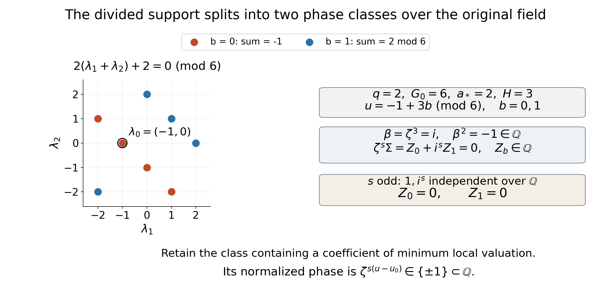

*Figure 10.8. Here \(q=2,G_0=6,d=(1,1)\), and the first residue vector is \(\lambda_*=(1,1)\), so \(a_*=2\). The divided support is the eight points \(\lambda\in\{-2,-1,0,1,2\}^2\) with \(2(\lambda_1+\lambda_2)+2\equiv0\pmod6\). The original support may be taken as \(\{(0,0)\}\cup\{2\lambda+(1,1)\}\), with reference \(\iota_0=(0,0)\); every original point has coordinate sum divisible by six. Put \(K=\mathbb Q,\alpha_0=-1\), choose a primitive twelfth root \(\zeta\) with \(\zeta^6=-1\), and write \(\beta=\zeta^3=i\) in a complex embedding. The normalized phase sum at a fixed odd node is \(Z_0+i^sZ_1\), with each \(Z_b\in\mathbb Q\). When that sum is zero, independence in Lemma 10.50 forces both coefficient sums to vanish. Red points have coordinate sum \(-1\), blue points have sum \(-4\) or \(2\). The circled reference \(\lambda_0=(-1,0)\) illustrates retaining the subclass containing a coefficient of minimum valuation; its normalized phase is one. Choosing a blue reference instead gives phases in \(\{\pm1\}\), also in \(\mathbb Q\). These are exactly the congruence, extraction and field-return mechanisms of Theorem 10.51 and (10.140)–(10.142). The plotted coefficient sums are formal variables. Human-source context: Yu's free2013 equations5.51–5.59, cited below. [Figure program](../figure_sources/phase_congruence_split.py).*

### The analytic branch and arithmetic height

**Corollary 10.52 (the phase does not enlarge the height field).** If \(v_p(\gamma_i-1)>1/(p-1)\), choose the fractional branch

\[
\eta_i=\exp\bigl(q^{-1}\log\gamma_i\bigr),\qquad
\rho_i^q=\theta_i,\qquad
\rho_i^P\xi^{d_i}=\eta_i .
\tag{10.143}
\]

Such a choice of the \(\rho_i\) exists. It identifies (10.139) with the fractional values of the corresponding logarithmic curve. At an integer node \(|s|\le X\), a nonzero new value in (10.141) satisfies

\[
\begin{aligned}
v_p(\Psi'(s;\boldsymbol t))-\delta
\le\frac{[K:\mathbb Q]}{ef\ln p}\biggl(&
\min\{h_\infty(c')+\ln N',h_2(c')+\tfrac12\ln N'\}\\
&+\ln\mathcal H_{I+1}(X;\boldsymbol t)
+\Xi_{I+1,0,t_0}\ln q
+2PX\sum_i A'_i h(\theta_i)\biggr),
\end{aligned}
\tag{10.144}
\]

where \(N'=kL|\Lambda'|\), \(A'_i=\max_{\lambda\in\Lambda'}|\lambda_i-\lambda_{0,i}|\), and \(\mathcal H\) uses the new integer Euler arguments in Theorem 10.44. An index above the additive degree is already zero. Every local degree in (10.144) is that of \(K\), not the degree of a field containing all individual phases.

**Proof.** The exponential laws proved in Proposition 9.4 give the q-th power of the chosen \(\eta_i\) as \(\gamma_i\), since \(q\ne p\) changes no slope valuation. Begin with any root \(\rho_i^q=\theta_i\). The quotient \(\eta_i/(\rho_i^P\xi^{d_i})\) is in \(\mu_q\). Raising to \(P\) permutes that cyclic group because \(q\nmid P\); multiplication of \(\rho_i\) by the appropriate q-th root of unity therefore gives (10.143). This proves the branch identification without a further root-existence assertion.

Theorem 10.51 writes each new torus term over \(K\) as a power of \(\alpha_0\) times powers of the \(\theta_i\). At every place, a root of unity has absolute value one, because its order-th power is one. Thus these phases contribute zero to every local norm bound, including the chosen p-adic place. The prepared scalar has the order-dependent archimedean bound \(\mathcal H_{I+1}\) and the rational clearing factor of Theorem 10.41. Apply its complete normalized product-formula argument over \(K\), retaining the coefficient norms and using \(|Ps(\lambda_i-\lambda_{0,i})|\le PX A'_i\). The signed torus-height sum is \(2[K:\mathbb Q]PX\sum_i A'_ih(\theta_i)\). This proves (10.144). \(\square\)

### Constructing the local phase

**Lemma 10.53 (lifting the residue phase and its depth).** Let \(K_{\mathfrak p}\) be the completion at the chosen prime above \(p\), with ramification index \(e\) and residue field of order \(p^f\). Suppose \(q\ne p\), and let \(\alpha_0\in K\) have order \(q^u\), \(u\ge1\). Then \(q^u\mid G=p^f-1\), and there is a primitive G-th root \(\zeta\in K_{\mathfrak p}\) such that

\[
G_0=G/q^u,\qquad
\zeta^{G_0}=\alpha_0,\qquad
\theta_i\zeta^{-r_i}\equiv1\pmod{\mathfrak p}
\tag{10.145}
\]

for suitable integers \(r_i\), whenever the \(\theta_i\in K^\times\) are local units. Given a real depth target \(\vartheta\ge0\), let \(t\) be the least nonnegative integer with \(p^t>e/(p-1)\). Choose an integer \(j\ge0\) with \(p^t/e+j>\vartheta+1/(p-1)\), put \(h=t+j\), and set

\[
\begin{aligned}
P&=p^h,\qquad d_i=-Pr_i,\qquad
\gamma_i=\theta_i^P\zeta^{d_i},\\
v_p(\gamma_i-1)&\ge p^t/e+j>
\vartheta+\frac1{p-1}.
\end{aligned}
\tag{10.146}
\]

Thus these phases supply the required analytic branch and supernormal slope depth. This is a sufficient explicit choice of \(P\); using a smaller prescribed \(P\) in a numerical estimate requires checking its depth separately.

**Proof.** We first prove the lifting assertion directly. In a complete discretely valued field, take a polynomial \(f\) with integral coefficients and an integral \(x_0\) satisfying \(v_p(f(x_0))>0\), \(v_p(f'(x_0))=0\). Define \(x_{n+1}=x_n-f(x_n)/f'(x_n)\). A finite polynomial expansion gives
\(f(x+y)=f(x)+f'(x)y+y^2R(x,y)\) with \(R\) integral when \(x,y\) are integral. The linear terms cancel at the Newton step, so
\(v_p(f(x_{n+1}))\ge2v_p(f(x_n))\).
Also \(f'(x_{n+1})-f'(x_n)\) has positive valuation, leaving the derivative a unit. Every step remains integral and in the original residue class. The successive differences have valuations tending to infinity, hence form a Cauchy sequence. Completeness gives its limit, and the polynomial difference identity proves that the limit is a root. If \(x,y\) are roots in that residue class, then
\(0=f(y)-f(x)=(y-x)(f'(x)+(y-x)R(x,y))\).
The factor in parentheses is a unit. Therefore \(x=y\). This proves existence and uniqueness of a simple-residue lift, including the case of a zero residual error where the iteration has already stopped.

Apply this to \(X^m-1\), for \(p\nmid m\). Its derivative at a unit is a unit. In particular a prime-to-\(p\) root of unity reducing to one is one, by uniqueness in that residue class. Reduction is consequently injective on all prime-to-\(p\) roots of unity. The reduction of \(\alpha_0\) has its exact order \(q^u\): a smaller order would make a nontrivial prime-to-\(p\) root reduce to one. Since the finite multiplicative residue group has order \(G\), we get \(q^u\mid G\).

The group of G-th roots in \(K_{\mathfrak p}\) maps bijectively to that residue group: every nonzero residue solves \(X^G-1\) and has its unique lift. Multiplication commutes with reduction, and the finite-field cyclicity proved in Section 1 therefore gives a primitive root \(z\). Write \(\alpha_0=z^{G_0a}\) with \(q\nmid a\), since its order is \(q^u\). Let \(n=G/q^{v_q(G)}\), so \(\gcd(n,q)=1\). Choose \(a'\equiv a\pmod{q^u}\) and \(a'\equiv1\pmod n\): Bezout's identity gives a solution by varying \(a'\) among \(a+q^u b\). Then \(\gcd(a',G)=1\). The primitive root \(\zeta=z^{a'}\) has \(\zeta^{G_0}=\alpha_0\). Its reduction generates the residue group, so every \(\overline{\theta_i}\) is \(\overline\zeta^{\,r_i}\). This proves (10.145).

Put \(g_i=\theta_i\zeta^{-r_i}\). Its positive valuation distance from one is at least \(1/e\), unless it is already one. The proved p-power inequality of Lesson 9 is
\[
v_p(g_i^{p^{a+1}}-1)\ge
\min\{p\,v_p(g_i^{p^a}-1),\,v_p(g_i^{p^a}-1)+1\}.
\]
The function on the right increases with its argument. For \(0\le a<t\), the lower bound \(p^a/e\) is at most \(1/(p-1)\), by the definition of \(t\). Induction therefore gives \(v_p(g_i^{p^t}-1)\ge p^t/e>1/(p-1)\). Each further p-power adds one by the exact power law already proved in Lesson 9; if a power is one its infinite valuation satisfies the same bound. After \(j\) further steps we obtain (10.146), because \(g_i^P=\gamma_i\). Finally \(P\) is prime to \(q\), so all the root-field and phase arguments above apply. Proposition 9.4 gives \(v_p(\log\gamma_i)=v_p(\gamma_i-1)\), including the infinite value when \(\gamma_i=1\); hence these logarithmic slopes have the stated depth. \(\square\)

### Filling the missing integer nodes

Theorem 10.51 gives the new zeros at nodes prime to \(q\). We can now prove a precise condition for filling the remaining nodes, while keeping the height comparison over \(K\).

**Corollary 10.54 (phase-sensitive q-deleted-node closure).** Take the new family (10.141), with \(\gamma_i=\exp(u_i)\), and retain the slope, projection and selected integer Euler-basis hypotheses of Corollary 10.40 at stage \(I+1\). In particular \(v_p(w_i)>\theta+1/(p-1)\), \(v_p(\mathcal L)\ge U\), and \(U-v_p(b_n)>\theta+1/(p-1)\). Let \(R\ge1,\mu\ge1,T\ge0\) be integers with \(T'=T-\mu+1\ge0\). Suppose that \(\Psi'(s;\boldsymbol t)=0\) for every \(s\in[-R,R]\cap\mathbb Z\) prime to \(q\) and every \(|\boldsymbol t|\le T\). Put
\(n=2R-2\lfloor R/q\rfloor\),
\(B=\lfloor\log_p(2R)\rfloor\),
\(C_0=\max\{v_p(v(k)),v_p(b_n)\}\),
\(M_0=\max\{B,C_0\}\), and \(D=kL\).
For \(X\ge0\), define the nonzero-value budget

\[
\begin{aligned}
\mathcal A_{\mathrm{ph}}(X,T')=
\max_{\substack{|\boldsymbol t|\le T'\\t_0\le D}}
\frac{[K:\mathbb Q]}{ef\ln p}\biggl(&
\min\{h_\infty(c')+\ln N',h_2(c')+\tfrac12\ln N'\}\\
&+\ln\mathcal H_{I+1}(X;\boldsymbol t)
+\Xi_{I+1,0,t_0}\ln q
+2PX\sum_iA'_ih(\theta_i)\biggr).
\end{aligned}
\tag{10.147}
\]

If

\[
\begin{aligned}
U+D\theta+Lv_p(k!)&\ge n\mu\theta+2\mu M_0,\\
(n\mu-D)\theta-Lv_p(k!)&>\mathcal A_{\mathrm{ph}}(X,T'),
\end{aligned}
\tag{10.148}
\]

then \(\Psi'(x;\boldsymbol t)=0\) for every integer \(|x|\le X\) and every \(|\boldsymbol t|\le T'\). In particular \(X=R\) fills all the previously omitted integer nodes in the interval. With the larger normalizing scale, the alternative sufficient pair is

\[
\begin{aligned}
U+D\left(\theta+\frac1{p-1}\right)&\ge n\mu\theta+2\mu M_0,\\
(n\mu-D)\theta-\frac D{p-1}&>\mathcal A_{\mathrm{ph}}(X,T').
\end{aligned}
\tag{10.149}
\]

If \(q\mid R\), the node count is exactly \(n=2(1-1/q)R\). For a desired order \(0\le O\le T\), the choice \(\mu=T-O+1\) makes the output order exactly \(T'=O\).

**Proof.** The q-deleted input set has the stated exact count and separation cost \(\kappa=1\), by Corollary 10.35. The complete analytic proof of Corollary 10.40 at the new stage applies to the local torus coordinates \(\gamma_i\). Its normality, prepared integrality, ordinary input jets and projection estimates use those local units and their logarithmic slopes; they do not require each \(\gamma_i\) to lie in \(K\). The first line of (10.148) is its exact sufficient precision budget, with \(\kappa+1=2\). Consequently
\[
v_p(\Psi'(x;\boldsymbol t))-\delta
\ge(n\mu-D)\theta-Lv_p(k!)
\]
at every stated integer and derivative index.

The support congruence in Theorem 10.51 does put each of these integer values in \(K\). If a value were nonzero, Corollary 10.52 would bound its valuation excess above by the corresponding summand of (10.147), and hence by \(\mathcal A_{\mathrm{ph}}\). The second line of (10.148) is a strict contradiction. An index with \(t_0>D\) is already zero. This proves the full conclusion. Using the larger scale and its proved lower bound (10.114) instead proves (10.149); the two scales have their respective conclusions. Finally \(q\mid R\) gives \(\lfloor R/q\rfloor=R/q\), and the asserted order choice is the identity \(T-(T-O+1)+1=O\). \(\square\)

The phase and support passage, the local phase construction and the conditional closure of the missing nodes now have complete proofs. A numerical Yu estimate still requires a verified coefficient construction and a check of the slope, order and strict height comparisons at every stage with its actual parameters.

## 21. Constructing coefficients for the phased values

The initial coefficient construction can also be performed over \(K\) when the separate phased torus bases lie outside \(K\). What matters is the field of each normalized row entry. The support congruence determines that field and removes the root-of-unity phase from every absolute-value estimate.

**Theorem 10.55 (an initial kernel over the original field).** Let \(K\) have degree \(d\) and discriminant \(\Delta_K\). Take nonzero \(\theta_i\in K\), a root of unity \(\alpha_0\in K\), an integer \(G_0\ge1\), and a root of unity \(\zeta\) with \(\zeta^{G_0}=\alpha_0\). Let \(P\in\mathbb Z_{\ge1}\), \(d_i\in\mathbb Z\), and set \(\gamma_i=\theta_i^P\zeta^{d_i}\). The separate \(\gamma_i\) need not lie in \(K\).

Take integers \(r,k,L\ge1\), \(S,T\ge0\), and a nonempty finite set \(\Lambda\subset\mathbb Z^r\) of distinct vectors satisfying \(\boldsymbol d\cdot\lambda\equiv\varepsilon\pmod{G_0}\), where \(\boldsymbol d=(d_1,\ldots,d_r)\). Fix \(\lambda_0\in\Lambda\), put \(A_i=\max_{\lambda\in\Lambda}|\lambda_i-\lambda_{0i}|\), and take integer Euler forms \(\omega_j(\lambda)=C_j(\lambda-\lambda_0)\), \(1\le j<r\). Write \(D=kL\), \(N=kL|\Lambda|\), and use \(\mathcal J_T,J_T,M_*=(2S+1)J_T\) from (10.126), with these new Euler arguments. Define \(H_{\mathrm{ph}}=P\sum_iA_i h(\theta_i)\).

If \(N>M_*\), there is a nonzero vector \(c\in\mathcal O_K^N\) for which

\[
\begin{aligned}
Q(X,Y)&=\sum_{\lambda,a,\ell}c_{\lambda,a,\ell}
\Delta(X+a;k)^\ell Y^{\lambda-\lambda_0},\\
\Psi_0(s;\boldsymbol t)&=\sum_{\lambda,a,\ell}c_{\lambda,a,\ell}
v(k)^{t_0}\Theta(s+a;k,\ell,t_0)
\prod_{j<r}\Delta(\omega_j(\lambda);t_j)
\gamma^{s(\lambda-\lambda_0)}
=0
\end{aligned}
\tag{10.150}
\]

for every integer \(|s|\le S\) and every \(|\boldsymbol t|\le T\), with \(0\le a<k\), \(1\le\ell\le L\). The Laurent polynomial \(Q\) is nonzero. Every normalized monomial in these equations belongs to \(K\), since

\[
v_\lambda=\frac{\boldsymbol d\cdot(\lambda-\lambda_0)}{G_0}\in\mathbb Z,
\qquad
\gamma^{s(\lambda-\lambda_0)}
=\alpha_0^{s v_\lambda}
\prod_i\theta_i^{Ps(\lambda_i-\lambda_{0i})}\in K.
\tag{10.151}
\]

The vector may be chosen with the separate-row budget

\[
\begin{aligned}
h_\infty(c)\le h_2(c)\le&
\tfrac12\ln N+\frac{\ln|\Delta_K|}{2d}\\
&+\frac1{N-M_*}
\sum_{s=-S}^S\sum_{\boldsymbol t\in\mathcal J_T}
\left(\tfrac12\ln N+
\ln\mathcal H_0(|s|;\boldsymbol t)+2|s|H_{\mathrm{ph}}\right),
\end{aligned}
\tag{10.152}
\]

and hence with the mean-node budget

\[
\begin{aligned}
h_2(c)\le&
\tfrac12\ln N+\frac{\ln|\Delta_K|}{2d}\\
&+\frac{M_*}{N-M_*}
\left(\tfrac12\ln N+\ln\mathcal B_0^*(S,T)
+\frac{2S(S+1)}{2S+1}H_{\mathrm{ph}}\right).
\end{aligned}
\tag{10.153}
\]

These estimates involve \(K\) and the original \(\theta_i\), even when the individual phases require a larger global field.

**Proof.** Subtracting the two support congruences gives the integer \(v_\lambda\). Raising \(\zeta^{G_0}=\alpha_0\) to \(s v_\lambda\) proves (10.151), for negative \(s\) and negative exponent differences as well. This identity puts every matrix entry of (10.150) in \(K\).

The prepared scalar in each entry is an integer: Lemma 10.28 proves the additive assertion at every integer \(s+a\), and each rising Euler binomial at an integer is an integer. An index with \(t_0>D\) has zero row. If \(\omega_j\) vanishes throughout the support, its factor is \(\Delta(0;t_j)=1\); setting \(t_j=0\) gives the same row and a no larger total order. Thus imposing the representative rows imposes every stated equation. Counting them exactly as in (10.126) gives \(M_*\) rows and \(N\) columns, including any further zero or dependent rows.

We bound each representative row over \(K\). At an archimedean embedding its Euclidean norm is at most
\[
\sqrt N\,\mathcal H_0(|s|;\boldsymbol t)
\prod_i\max\{|\sigma(\theta_i)|,|\sigma(\theta_i)|^{-1}\}^{P|s|A_i}.
\]
At a finite place its maximum norm is at most the analogous product without the first two factors. Indeed the scalar is an integer, while the root of unity \(\alpha_0^{s v_\lambda}\) in (10.151) has absolute value one at every place. Theorem 10.44 supplies the scalar bound. The product formula, with the height conventions of Section 14, gives the exact identity
\[
\frac1d\sum_v\ln\max\{|\theta_i|_v,|\theta_i|_v^{-1}\}
=2h(\theta_i).
\]
Consequently the logarithm of the row-norm bound is
\(\tfrac12\ln N+\ln\mathcal H_0(|s|;\boldsymbol t)+2|s|H_{\mathrm{ph}}\). This bound is nonnegative, since its scalar majorant is at least one by Theorem 10.44. A zero row has the allowed row factor one.

Apply the complete weighted Siegel lemma (8.40) from [Small solutions over the coefficient field](../TR-BAKER-08.html#small-solutions-over-the-coefficient-field), with all weights one and with these actual \(K\)-rows. Its finite-place conditions give \(c\in\mathcal O_K^N\setminus\{0\}\). Taking logarithms of its bound proves (10.152); no discriminant or degree of a field containing the individual \(\gamma_i\) enters. The monomials \(Y^{\lambda-\lambda_0}\) are distinct, and Lemma 10.29 gives the independence of the additive polynomials within each monomial block. Hence the nonzero coefficient vector gives \(Q\ne0\).

Finally \(\mathcal H_0(|s|;\boldsymbol t)\le\mathcal B_0^*(S,T)\), and \(\sum_{s=-S}^S|s|=S(S+1)\). Summing the separate bounds proves (10.153). \(\square\)

Multiplying \(Q\) by a monomial clears its negative exponents. The complete prepared-to-ordinary jet argument of Proposition 10.31 applies when the \(\gamma_i\) are nonzero elements of the chosen local field and the Euler directions are the selected integral basis. Each monomial factor is nonzero at the evaluation point, so the order of vanishing is preserved. A coefficient of minimum local valuation can also be divided out as in (10.97), preserving the heights and equations; this last normalization is locally integral and need not remain globally integral.

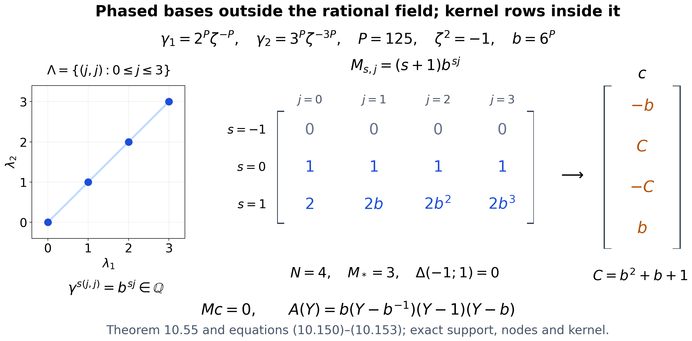

*Figure 10.9. In \(\mathbb Q_5\), choose the root \(\zeta^2=-1\) with \(\zeta\equiv2\pmod5\), and put \(P=125\), \(G_0=2\), \(\alpha_0=-1\), \(\theta=(2,3)\), \(d=(-P,-3P)\). Both \(\gamma_1=2^P\zeta^{-P}\) and \(\gamma_2=3^P\zeta^{-3P}\) are outside \(\mathbb Q\), but \(\gamma_1\gamma_2=6^P=b\in\mathbb Q\). For support \(\Lambda=\{(j,j):0\le j\le3\}\), reference \((0,0)\), \(k=L=1\), \(S=1\), \(T=0\), the normalized torus column is \(b^{sj}\). The drawn matrix includes the additive factor \(\Delta(s;1)=s+1\), so its first row is zero. With \(C=b^2+b+1\), its integer vector \((-b,C,-C,b)\) is a kernel vector. Equations (10.150)–(10.153) prove the general field and height mechanism; Solution 28 checks this exact example and its extra zero. The plotted support points and matrix entries are exact. Human-source context: the field reduction and initial kernel in Lemma 4.2 of Yu's free 2013 paper, cited below. [Figure program](../figure_sources/phase_kernel_matrix.py).*

## 22. The field and budget at the first fractional nodes

At a fractional node the value need not be in \(K\), even if its chosen completion is still \(K_{\mathfrak p}\). We now determine the smaller field generated by the support, and then prove the arithmetic comparison needed before the next coset extraction.

### The support-generated root field

**Theorem 10.56 (the field of the normalized fractional monomials).** Retain the saturated Kummer and phase data of Section 20: in particular \(\mu_q\subset K\), \(q\ne p\), \(q\nmid P\), and
\([K(\beta,\rho_1,\ldots,\rho_r):K]=q^{r+1}\), with \(\beta^q=\alpha_0\), \(\rho_i^q=\theta_i\). Suppose \(\gamma_i\in K_{\mathfrak p}\) have \(v_p(\gamma_i-1)>1/(p-1)\), and use the compatible principal roots
\(\eta_i=\exp(q^{-1}\log\gamma_i)=\rho_i^P\xi^{d_i}\) of Corollary 10.52.

Let \(\Lambda\) be a nonempty finite support with \(\boldsymbol d\cdot\lambda\equiv\varepsilon\pmod{G_0}\), and fix \(\lambda_0\in\Lambda\). Define

\[
\begin{aligned}
m_\lambda&=\lambda-\lambda_0,&
w_\lambda&=\frac{\boldsymbol d\cdot m_\lambda}{G_0}\in\mathbb Z,\\
g&=\gcd(G_0,d_1,\ldots,d_r),&
G_*&=G_0/g,\qquad d_{*i}=d_i/g,\\
v_\lambda&=(w_\lambda,Pm_{\lambda1},\ldots,Pm_{\lambda r})
\in\mathbb F_q^{r+1},&
h_\Lambda&=\dim_{\mathbb F_q}\langle v_\lambda:\lambda\in\Lambda\rangle,\\
U_\lambda&=\eta^{m_\lambda},&
E_\Lambda&=K(U_\lambda:\lambda\in\Lambda).
\end{aligned}
\tag{10.154}
\]

Then

\[
P G_*(v_\lambda)_0-\sum_i d_{*i}(v_\lambda)_i=0,\qquad
h_\Lambda\le r,\qquad
[E_\Lambda:K]=q^{h_\Lambda},\qquad
(E_\Lambda)_{\mathfrak P}=K_{\mathfrak p}
\tag{10.155}
\]

for the prime \(\mathfrak P\) selected by these principal roots. The first relation is a nonzero linear equation over \(\mathbb F_q\). In particular the global degree can increase while the chosen local degree stays one.

**Proof.** Cancelling the positive gcd gives \(G_*w_\lambda=\sum_i d_{*i}m_{\lambda i}\), and \(\gcd(G_*,d_{*1},\ldots,d_{*r})=1\). Multiply by \(P\) and reduce modulo \(q\) to obtain the relation in (10.155). If \(q\nmid G_*\), its first coefficient is nonzero, since \(q\nmid P\). If \(q\mid G_*\), at least one \(d_{*i}\) is nonzero modulo \(q\). Thus it defines a hyperplane of dimension \(r\), proving \(h_\Lambda\le r\). Cancelling the gcd is essential: the unreduced equation can otherwise be the identity \(0=0\).

The phase congruence and the compatible roots give
\[
U_\lambda=\beta^{w_\lambda}\prod_i\rho_i^{Pm_{\lambda i}},
\qquad
U_\lambda^q=\alpha_0^{w_\lambda}\prod_i\theta_i^{Pm_{\lambda i}}\in K.
\]
Choose \(\lambda_1,\ldots,\lambda_h\), \(h=h_\Lambda\), whose residue vectors form a basis of the support span. Express any \(v_\lambda\) as \(\sum_j a_jv_{\lambda_j}\), with \(0\le a_j<q\). The corresponding integer exponent vectors differ by \(q(z_0,z_1,\ldots,z_r)\). The displayed exact monomial identity therefore gives
\[
U_\lambda=\alpha_0^{z_0}\prod_i\theta_i^{z_i}
\prod_{j=1}^h U_{\lambda_j}^{a_j}.
\]
Consequently the \(h\) selected roots generate \(E_\Lambda\), and their q-th powers lie in \(K\), so its degree is at most \(q^h\).

For the reverse bound, the monomials \(\prod_jU_{\lambda_j}^{a_j}\), \(0\le a_j<q\), have distinct residue vectors \(\sum_j a_jv_{\lambda_j}\). Reduce their exponents in the full root field \(K(\beta,\rho_1,\ldots,\rho_r)\). Its degree is \(q^{r+1}\), so the root monomials with exponents in \(\{0,\ldots,q-1\}^{r+1}\) are a basis by Theorem 10.47. Our \(q^h\) monomials are nonzero \(K\)-multiples of distinct elements of that basis, and are therefore independent. This proves the exact degree, including \(h=0\).

Each \(\eta_i\) lies in \(K_{\mathfrak p}\) by the exponential proof in Lesson 9, hence \(E_\Lambda\subset K_{\mathfrak p}\). Its closure contains the closure \(K_{\mathfrak p}\) of \(K\), and is contained in \(K_{\mathfrak p}\). Thus its chosen completion is precisely \(K_{\mathfrak p}\). The absolute ramification index and residue degree at \(\mathfrak P\) are the original \(e,f\). \(\square\)

### A nonzero fractional prepared value

**Corollary 10.57 (the phase-sensitive fractional arithmetic budget).** Take the support of Theorem 10.56, integers \(I\ge0,k,L\ge1\), a nonzero coefficient vector \(c\in K^N\), \(N=kL|\Lambda|\), and integer Euler arguments \(C_j(m_\lambda)\). Put \(D=kL\), \(A_i=\max_\lambda|m_{\lambda i}|\), \(\delta=\min_jv_p(c_j)\), and take \(x=s/q\), \(s\in\mathbb Z\), with \(|x|\le X\). Let \(V=\Psi_I(s/q;\boldsymbol t)\) be the prepared value whose torus term is \(U_\lambda^s\) and whose additive argument is \(q^{-I}x+a\). If \(t_0>D\), it is zero. Otherwise it belongs to \(E_\Lambda\), and if it is nonzero,

\[
\begin{aligned}
v_p(V)-\delta\le \mathcal A_{\mathrm{frac},\boldsymbol t}(X)
:=\frac{q^{h_\Lambda}[K:\mathbb Q]}{ef\ln p}\biggl(&
\min\{h_\infty(c)+\ln N,h_2(c)+\tfrac12\ln N\}\\
&+\ln\mathcal H_I(X;\boldsymbol t)
+\Xi_{I,1,t_0}\ln q
+2PX\sum_iA_i h(\theta_i)\biggr).
\end{aligned}
\tag{10.156}
\]

Here \(\mathcal H_I\) and \(\Xi_{I,1,t_0}\) are the already proved scalar majorant and q-clearing exponent of (10.123) and (10.115).

**Proof.** Every torus term lies in \(E_\Lambda\), and every prepared scalar is rational, so \(V\in E_\Lambda\). Lemma 10.28 and Theorem 10.41 clear each scalar's denominator by \(q^{\Xi_{I,1,t_0}}\), with no denominator at any other prime; Theorem 10.44 bounds its ordinary absolute value by \(\mathcal H_I(X;\boldsymbol t)\).

At every place of \(E_\Lambda\), taking the absolute value of \(U_\lambda^q\) removes the root-of-unity phase. Its signed torus contribution is bounded by
\[
\sum_i \frac{P|s|A_i}{q}
\ln\max\{|\theta_i|_v,|\theta_i|_v^{-1}\}.
\]
The torus terms are units at \(\mathfrak P\). Summing this contribution outside that prime is therefore at most
\(2[E_\Lambda:\mathbb Q]PX\sum_iA_i h(\theta_i)\), by the same inverse-height identity as in Theorem 10.41. The coefficient heights retain their values over \(K\): each archimedean embedding is repeated \([E_\Lambda:K]\) times, and the local degrees over a finite place sum to that same factor.

Now repeat the full coefficient-normalized product-formula argument of Theorem 10.41 over \(E_\Lambda\), retaining its Euclidean and maximum coefficient bounds and the new scalar majorant. Theorem 10.56 gives \([E_\Lambda:\mathbb Q]=q^{h_\Lambda}[K:\mathbb Q]\) and the unchanged \(e,f\) at the selected prime. These are exactly the factor and all terms in (10.156). \(\square\)

The unchanged completion does not remove \(q^{h_\Lambda}\). Nor does a high valuation at the principal-root prime give that valuation at the other primes of the global field.

### Closing the first fractional-node extension

**Corollary 10.58 (a proved first fractional extension).** Retain the phase family of Corollary 10.57 and all selected-basis, slope, normality and projection hypotheses of Corollary 10.40 for its local curve \(\gamma^x=\exp(x\log\gamma)\). Suppose its prepared values vanish at all integers \(|s|\le R\) through total order \(T\), where \(R\ge1,T\ge0\) are integers. Choose an integer \(\mu\ge1\) with \(T'=T-\mu+1\ge0\), and put
\(n=2R+1\), \(B=\lfloor\log_p(2R)\rfloor\),
\(C_0=\max\{v_p(v(k)),v_p(b_n)\}\), \(M_0=\max\{B,C_0\}\).
Let
\(\mathcal A_{\mathrm{frac}}(X,T')=
\max_{|\boldsymbol t|\le T',\,t_0\le D}
\mathcal A_{\mathrm{frac},\boldsymbol t}(X)\),
using (10.156). If

\[
\begin{aligned}
U+D\theta+Lv_p(k!)&\ge n\mu\theta+\mu M_0,\\
(n\mu-D)\theta-Lv_p(k!)&>
\mathcal A_{\mathrm{frac}}(X,T'),
\end{aligned}
\tag{10.157}
\]

then every first fractional prepared value \(\Psi_I(s/q;\boldsymbol t)\) is zero for integers \(|s|\le qX\) and \(|\boldsymbol t|\le T'\). With the larger normalizing scale, an alternative sufficient pair is

\[
\begin{aligned}
U+D\left(\theta+\frac1{p-1}\right)&\ge n\mu\theta+\mu M_0,\\
(n\mu-D)\theta-\frac D{p-1}&>
\mathcal A_{\mathrm{frac}}(X,T').
\end{aligned}
\tag{10.158}
\]

**Proof.** The full integer input interval has separation cost \(\kappa=0\), as proved in Corollary 10.35. The first inequality of (10.157) is consequently the sufficient analytic budget (10.113). Its complete proof, retaining the loss from the selected integer Euler basis, gives
\[
v_p(\Psi_I(x;\boldsymbol t))-\delta
\ge(n\mu-D)\theta-Lv_p(k!)
\]
for every \(x\in\mathbb Z_p\) and each output index. The local curve satisfies the same proof when its separate torus bases lie outside \(K\), since that argument uses their local logarithms, prepared scalars and projection data.

For \(x=s/q\), the assumption \(q\ne p\) gives \(x\in\mathbb Z_p\). Proposition 9.4 identifies the local exponential torus factors with the principal roots \(\eta^s\), so this analytic value is exactly the algebraic value of Corollary 10.57. If it were nonzero, (10.156) would give the opposite upper bound \(\mathcal A_{\mathrm{frac}}(X,T')\), contradicting the strict second inequality. Indices with \(t_0>D\) are already zero. This proves every asserted fractional zero. Repeating the same comparison with the proved larger-scale conclusion (10.114) gives (10.158). \(\square\)

These hypotheses separate the two tasks in a numerical descent: constructing the integer input zeros and verifying the precision and strict height comparisons. Once the fractional zeros are available at nodes prime to \(q\), Theorem 10.51 performs the exact phase and support passage.

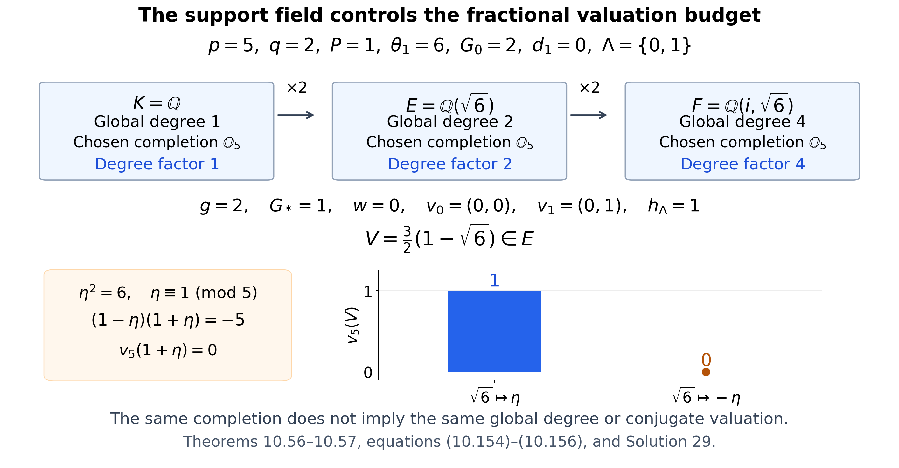

*Figure 10.10. The exact example has \(K=\mathbb Q,p=5,q=2,\alpha_0=-1,\theta_1=6,P=1,G_0=2,d_1=0,\Lambda=\{0,1\}\). The cancelled relation is \(w=0\), and the support vectors span \((0,1)\) over \(\mathbb F_2\), so \(h_\Lambda=1\). The support field \(E=\mathbb Q(\sqrt6)\) has degree two; the full root field \(F=\mathbb Q(i,\sqrt6)\) has degree four. Choose the completion sending \(\sqrt6\) to \(\eta\equiv1\pmod5\). Both these roots and \(i\equiv2\pmod5\) lie in \(\mathbb Q_5\), so all three chosen completions in the diagram are \(\mathbb Q_5\). Their global-to-local degree factors are \(1,2,4\). The value \(V=\tfrac32(1-\sqrt6)\) has valuation one at this root and zero at the other root \(-\eta\); the two bars display these exact valuations. Theorem 10.56 and (10.154)–(10.155) prove the field mechanism, Corollary 10.57 proves its arithmetic budget, and Solution 29 verifies every number in this example. Human-source context: the first fractional step and product-formula field discussion in Yu's free 2013 paper, printed pp. 352 and 365–366, cited below. [Figure program](../figure_sources/fractional_phase_field.py).*

## 23. Heights of the actual exponent support

The torus contribution can be measured before enclosing the exponents in a coordinate box. This keeps the geometry of a support through a change of multiplicative bases and through division by \(q\). Positive and negative nodes require separate heights unless the support is symmetric.

### A projective height from a support function

Let \(K\) have degree \(d\), and use the absolute values and place multiplicities of Section 14. Thus \(\sum_v\ln|z|_v=0\) for \(z\in K^\times\); a complex place is counted with multiplicity two. Take \(\theta=(\theta_1,\ldots,\theta_r)\in(K^\times)^r\), and put \(\ell_v=(\ln|\theta_1|_v,\ldots,\ln|\theta_r|_v)\). Only finitely many finite-place vectors \(\ell_v\) are nonzero. For a nonempty compact set \(C\subset\mathbb R^r\), and a nonempty finite set \(M\subset\mathbb Z^r\), define

\[
\begin{aligned}
\mathfrak H_\theta(C)&=\frac1d\sum_v\sup_{u\in C}u\cdot\ell_v,\\
\mathfrak H_\theta(M)&=\mathfrak H_\theta(\operatorname{conv}M)
=h_\infty((\theta^m)_{m\in M}).
\end{aligned}
\tag{10.159}
\]

The finite-set equality, and all the properties needed below, are proved next.

**Theorem 10.59 (the support height).** The quantities in (10.159) are finite and nonnegative. For a real vector \(a\), a real \(t\ge0\), and an integer \(s\),

\[
\begin{aligned}
\mathfrak H_\theta(C+a)&=\mathfrak H_\theta(C),&
\mathfrak H_\theta(tC)&=t\mathfrak H_\theta(C),\\
C\subset C'&\Longrightarrow\mathfrak H_\theta(C)\le\mathfrak H_\theta(C'),&
h_\infty((\theta^{sm})_{m\in M})
&=\begin{cases}
s\mathfrak H_\theta(M),&s\ge0,\\
|s|\mathfrak H_\theta(-M),&s<0.
\end{cases}
\end{aligned}
\tag{10.160}
\]

If \(|m_i|\le A_i\) for every \(m\in M\), then

\[
\mathfrak H_\theta(M),\ \mathfrak H_\theta(-M)
\le2\sum_i A_i h(\theta_i).
\tag{10.161}
\]

These heights are unchanged by extending \(K\). Root-of-unity factors attached separately to the monomial coordinates change neither height.

**Proof.** The support function of a finite convex hull is the maximum over its original points: a convex combination cannot exceed their maximum, and those points belong to the hull. Since \(\ln|\theta^m|_v=m\cdot\ell_v\), its normalized sum is exactly the maximum projective height in (10.159). All sums are finite. For a compact \(C\), translating by \(a\) adds \(a\cdot\ell_v\) at each place. The product formula for each \(\theta_i\) makes the sum of these additions zero. Translating by the negative of any point of \(C\) places zero in the set; every resulting support function is then nonnegative. This proves nonnegativity.

Nonnegative scaling multiplies each support function by \(t\), including \(t=0\); inclusion increases it. Taking \(s\ge0\) in the monomial identity multiplies the local maximum by \(s\), while \(s<0\) replaces \(M\) by \(-M\). This proves (10.160). At any place, the box bounds both support functions by \(\sum_i A_i|\ln|\theta_i|_v|\). The sum of the positive logarithms for one element is \(d h(\theta_i)\), and the product formula says the sum of the negative logarithms has the same absolute value. Their total is \(2d h(\theta_i)\), proving (10.161).

For completeness, an extension \(E/K\) repeats each archimedean embedding \([E:K]\) times. At a finite place \(v\), the logarithm of the norm absolute value at a place \(w\) of \(E\) restricting to \(v\) is multiplied by \([E_w:K_v]\). The local degrees sum to \([E:K]\), by the places identities proved in [Absolute values and places](../TR-BAKER-02.html). The support function is homogeneous for these positive multipliers. Thus its unnormalized place sum is multiplied by \([E:K]\); dividing by \([E:\mathbb Q]=[E:K]d\) preserves its value. Every root of unity has absolute value one at every place, by its finite-order equation, so its coordinate factors make no contribution. \(\square\)

Symmetry is a sufficient reason for the two signs to agree; it is not automatic. Over \(\mathbb Q\), for \(\theta=(2,3)\) and \(M=\{(0,0),(1,0),(0,1)\}\), the monomial vector is \((1,2,3)\), of height \(\ln3\). The inverse vector \((1,1/2,1/3)\) becomes the primitive integer vector \((6,3,2)\), of height \(\ln6\). These are \(\mathfrak H_\theta(M)\) and \(\mathfrak H_\theta(-M)\).

### Contraction and the original multiplicative bases

**Theorem 10.60 (a height envelope for the divided support).** Let \(C\subset\mathbb R^r\) be nonempty and compact. If a finite nonempty support \(M_I\) satisfies \(M_I\subset q^{-I}C-x_I\), then

\[
\mathfrak H_\theta(M_I)\le q^{-I}\mathfrak H_\theta(C),\qquad
\mathfrak H_\theta(-M_I)\le q^{-I}\mathfrak H_\theta(-C).
\tag{10.162}
\]

The support passage \(M_{I+1}=\{(m-m_*)/q:m\text{ in a retained coset of }M_I\}\) retains this form of containment. A further restriction of the support and any choice of reference point retain the bound.

Suppose also that \(\alpha_1,\ldots,\alpha_n\in K^\times\), that \(B=(b_{ji})\) is a real \(n\)-by-\(r\) matrix of rank \(r\), and that a positive integer \(\tau\) satisfies \(\tau b_{ji}\in\mathbb Z\) and
\(\theta_i^\tau=\prod_j\alpha_j^{\tau b_{ji}}\).
For finite \(D_j\ge0\), put \(C_B=\{u: |(Bu)_j|\le D_j,\ 1\le j\le n\}\). Then \(C_B\) is compact and centrally symmetric, and

\[
\mathfrak H_\theta(C_B)=\mathfrak H_\theta(-C_B)
\le2\sum_{j=1}^nD_j h(\alpha_j),\qquad
\mathfrak H_\theta(\pm M_I)
\le2q^{-I}\sum_jD_jh(\alpha_j)
\quad(M_I\subset q^{-I}C_B-x_I).
\tag{10.163}
\]

**Proof.** Translation, scaling and inclusion in Theorem 10.59 give (10.162). The next retained support is contained in
\(q^{-(I+1)}C-(x_I+m_*)/q\), so induction preserves exactly this envelope. Restriction uses inclusion; changing reference uses translation.

Choose an invertible \(r\)-by-\(r\) row minor of \(B\). Its inverse bounds each coordinate of \(u\in C_B\) by a fixed finite linear combination of the \(D_j\). Thus \(C_B\) is bounded; its defining inequalities make it closed. To see directly that its support maximum is attained, take a sequence approaching the supremum of a linear function. Successive bisection of a bounded coordinate interval chooses an infinite subsequence in nested closed intervals of lengths tending to zero. Repeating this for the finitely many coordinates gives a convergent subsequence. Its limit lies in the closed set, and the finite linear sum tends to its value there. This also proves the required compactness in finite dimension.

Taking absolute values of the \(\tau\)-power identities and cancelling \(\tau\) gives \(\ell_v=B^{\mathsf T}(\ln|\alpha_j|_v)_j\). Consequently
\[
u\cdot\ell_v=\sum_j(Bu)_j\ln|\alpha_j|_v
\le\sum_jD_j|\ln|\alpha_j|_v|
\qquad(u\in C_B).
\]
Sum this inequality and use the inverse-height identity proved in Theorem 10.59. The set \(C_B\) is centrally symmetric because its inequalities use absolute values. Combining the resulting bound with (10.162) proves (10.163). \(\square\)

The same height bound holds for a nonempty affine box constraint \(|(Bu)_j-z_j|\le D_j\), with arbitrary real \(z_j\). Indeed its local support maximum is at most \(\sum_j z_j\ln|\alpha_j|_v+\sum_jD_j|\ln|\alpha_j|_v|\). The first sum disappears after summing over places, by the product formula, even if \(z\) is outside the image of \(B\). Thus the bound uses the half-widths in the original coordinates and follows the original torus products through a change of basis. An enclosing box in the new coordinates is unnecessary.

### The coefficient and nonzero-value budgets

**Corollary 10.61 (initial coefficients with the support height).** Retain every hypothesis and notation of Theorem 10.55, including \(N>M_*\), and put \(M=\Lambda-\lambda_0\),
\(H_+=\mathfrak H_\theta(M)\), \(H_-=\mathfrak H_\theta(-M)\). Define \(b(s)=PsH_+\) for \(s\ge0\), and \(b(s)=P|s|H_-\) for \(s<0\). Its nonzero integral kernel exists with

\[
\begin{aligned}
h_\infty(c)\le h_2(c)\le&
\tfrac12\ln N+\frac{\ln|\Delta_K|}{2d}\\
&+\frac1{N-M_*}\sum_{s=-S}^S\sum_{\boldsymbol t\in\mathcal J_T}
\left(\tfrac12\ln N+\ln\mathcal H_0(|s|;\boldsymbol t)+b(s)\right),
\end{aligned}
\tag{10.164}
\]

and hence with

\[
\begin{aligned}
h_2(c)\le&\ \tfrac12\ln N+\frac{\ln|\Delta_K|}{2d}\\
&+\frac{M_*}{N-M_*}\left(
\tfrac12\ln N+\ln\mathcal B_0^*(S,T)
+\frac{PS(S+1)}{2(2S+1)}(H_++H_-)\right).
\end{aligned}
\tag{10.165}
\]

Both bounds are at least as strong as their respective bounds (10.152) and (10.153).

**Proof.** The normalized torus monomials in a row are
\(\alpha_0^{s w_\lambda}\theta^{Ps m_\lambda}\).
At an archimedean embedding, their maximum times
\(\sqrt N\mathcal H_0(|s|;\boldsymbol t)\) bounds the row's Euclidean norm. At a finite place their maximum bounds its maximum norm, since every scalar is an integer. The phase has absolute value one. Summing the logarithms of these maxima gives exactly \(b(s)\), by Theorem 10.59. The support contains zero, so each local torus maximum is at least one; the scalar majorant is also at least one, by Theorem 10.44. These are valid row factors in the completely proved weighted Siegel lemma (8.40), with a zero row allowed factor one. Its proof therefore gives (10.164) over \(K\), exactly as in Theorem 10.55. The same row system, integral vector and polynomial-independence argument impose every original zero.

The positive and negative node sums are both \(S(S+1)/2\). There are \(J_T\) rows at each node and \(M_*=(2S+1)J_T\). Using the uniform scalar bound gives (10.165). Finally (10.161) bounds each of \(H_+,H_-\) by \(2\sum_iA_i h(\theta_i)\); substitution gives the original two torus terms, without changing any other term. \(\square\)

**Corollary 10.62 (the support budget for a nonzero value).** In the phase family of Theorem 10.55, suppose the \(\gamma_i\) are units at the chosen prime, and consider an integer-node prepared value \(V=\Psi_I(s;\boldsymbol t)\), with \(t_0\le D\). Put
\(C_c=\min\{h_\infty(c)+\ln N,h_2(c)+\tfrac12\ln N\}\) and
\(\delta=\min_jv_p(c_j)\).
If \(V\ne0\), then

\[
v_p(V)-\delta\le\frac d{ef\ln p}
\left(C_c+\ln\mathcal H_I(|s|;\boldsymbol t)
+\Xi_{I,0,t_0}\ln q+b(s)\right).
\tag{10.166}
\]

In the first fractional family of Corollary 10.57, with its support field \(E_\Lambda\), the nonzero value at \(x=s/q\) satisfies instead

\[
v_p(V)-\delta\le\frac{q^{h_\Lambda}d}{ef\ln p}
\left(C_c+\ln\mathcal H_I(|s|/q;\boldsymbol t)
+\Xi_{I,1,t_0}\ln q+\frac{b(s)}q\right).
\tag{10.167}
\]

Uniformly for \(|s|\le X\) in the integer case and \(|s|\le qX\) in the fractional case, the torus term may be replaced by

\[
PX\max\{H_+,H_-\}.
\tag{10.168}
\]

The corresponding strict zero-forcing comparisons of Theorem 10.43 and Corollaries 10.54 and 10.58 remain valid with these smaller budgets, under all their original analytic and field hypotheses.

**Proof.** For the integer case the phase congruence puts every torus monomial in \(K\). Repeat Theorem 10.41's product formula after dividing by a coefficient of minimum local valuation. Its coefficient contribution is \(C_c\); Theorem 10.44 supplies the individual scalar bound, and (10.115) supplies its clearing exponent. At each place the torus contribution is the maximum of the logarithms of \(\theta^{Ps m_\lambda}\), with the phase removed. Its sum is \(d b(s)\). Its omitted contribution at the chosen prime is zero: the \(\gamma_i\) are units, and taking absolute values of \(\gamma_i=\theta_i^P\zeta^{d_i}\) shows that the \(\theta_i\) are units there. These local maxima are nonnegative because \(0\in M\). This proves (10.166).

In the fractional case, \(U_\lambda^q=\alpha_0^{w_\lambda}\theta^{Pm_\lambda}\). Taking local logarithmic absolute values divides the preceding torus maximum by \(q\), and its field-normalized sum is \(b(s)/q\), by the field-invariance proof of Theorem 10.59. Theorem 10.56 still gives the global degree \(q^{h_\Lambda}d\) and the original local \(e,f\); none of these degree factors has been discarded. The same coefficient-normalized product formula gives (10.167). The bounds on \(s\) give (10.168).

The analytic conclusions in the cited zero-forcing proofs supply their unchanged lower bounds for the same valuations. A strict inequality between that lower bound and the new arithmetic upper bound again contradicts \(V\ne0\). Taking the maximum over the asserted output indices proves all the same zeros. This changes only the torus height estimate; every slope, depth, order and field condition remains a hypothesis. \(\square\)

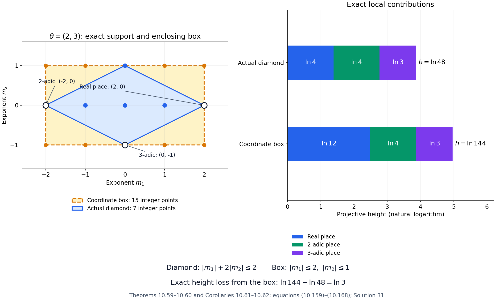

*Figure 10.11. Over \(\mathbb Q\), with \(\theta=(2,3)\), the diamond \(C=\{(u_1,u_2):|u_1|+2|u_2|\le2\}\) has seven integer points; its enclosing box \([-2,2]\times[-1,1]\) has fifteen. At the real, 2-adic and 3-adic places the diamond's support contributions are \(\ln4,\ln4,\ln3\), attained respectively at \((2,0),(-2,0),(0,-1)\). The box contributions are \(\ln12,\ln4,\ln3\). Their exact projective heights are therefore \(\ln48\) and \(\ln144\). The bar lengths are numerical renderings of these labelled exact logarithms. The polygon, lattice points, active points and height identities are exact. Equations (10.159)–(10.168) prove the general support, contraction and budget mechanism; Solution 31 checks the primitive monomial vectors and a divided-support example. Human-source context: the original-coordinate torus identity and support containment (4.16), (5.1), and the product-formula steps (5.34)–(5.36), (7.13) in Yu's free 2013 paper, cited below. [Figure program](../figure_sources/support_height_envelope.py).*

The enclosing-box estimate is valid, but this example loses exactly \(\ln3\) in its torus height. The support budget avoids that loss, and (10.163) retains bounds in the original bases after a multiplicative change of coordinates.

## 24. The field and the numerical scale of the initial kernel

The initial rows need not generate the entire ambient number field. We can construct their coefficients over the field they actually generate. Its discriminant is controlled by the heights of explicit normalized torus monomials, so an unrelated extension of the ambient field does not enter the coefficient budget.

### The exact field of the row entries

Retain Theorem 10.55, and write \(M=\Lambda-\lambda_0\),
\(H_+=\mathfrak H_\theta(M)\), \(H_-=\mathfrak H_\theta(-M)\).
The normalized monomials and the field generated by all initial row entries are

\[
\begin{aligned}
W_\lambda&=\alpha_0^{w_\lambda}\theta^{P(\lambda-\lambda_0)}
\in K,\qquad W_{\lambda_0}=1,\\
E_0&=\begin{cases}
\mathbb Q,&S=0,\\
\mathbb Q(W_\lambda:\lambda\in\Lambda),&S\ge1,
\end{cases}
\qquad d_0=[E_0:\mathbb Q]\le d.
\end{aligned}
\tag{10.169}
\]

**Theorem 10.63 (initial coefficients over their row field).** The field in (10.169) is exactly the smallest subfield of \(K\) containing every coefficient of the initial homogeneous system (10.150). If \(N>M_*\), that system has a nonzero coefficient vector \(c\in\mathcal O_{E_0}^N\subset\mathcal O_K^N\) giving the same nonzero Laurent polynomial and every originally specified zero.

For \(S\ge1\), choose normalized monomials \(z_1,\ldots,z_a\) that generate \(E_0\). Put \(F_j=\mathbb Q(z_1,\ldots,z_j)\), \(F_0=\mathbb Q\), so \(F_a=E_0\), and let \(e_j=[F_j:F_{j-1}]\). Omit steps of degree one, and define \(\Gamma=\sum_j(e_j-1)h(z_j)\). For \(S=0\), use the empty tower and \(\Gamma=0\). Then

\[
\frac{\ln|\Delta_{E_0}|}{2d_0}
\le\frac12\ln d_0+\Gamma,\qquad
\Gamma\le(d_0-1)P\min\{H_+,H_-\}.
\tag{10.170}
\]

With \(b(s)\) as in Corollary 10.61, the coefficients can be chosen with

\[
\begin{aligned}
h_\infty(c)\le h_2(c)\le&
\frac12\ln(Nd_0)+\Gamma\\
&+\frac1{N-M_*}\sum_{s=-S}^S
\sum_{\boldsymbol t\in\mathcal J_T}
\left(\frac12\ln N+\ln\mathcal H_0(|s|;\boldsymbol t)+b(s)\right),
\end{aligned}
\tag{10.171}
\]

and therefore with

\[
\begin{aligned}
h_2(c)\le&\ \frac12\ln(Nd_0)+\Gamma\\
&+\frac{M_*}{N-M_*}
\left(\frac12\ln N+\ln\mathcal B_0^*(S,T)
+\frac{PS(S+1)}{2(2S+1)}(H_++H_-)\right).
\end{aligned}
\tag{10.172}
\]

The actual discriminant term \(\ln|\Delta_{E_0}|/(2d_0)\) may instead be retained, replacing \(\frac12\ln d_0+\Gamma\) in either formula.

**Proof.** Every entry of the row at \(s\) is an integer prepared scalar times \(W_\lambda^s\). If \(S=0\), all entries are rational integers, so their field is \(\mathbb Q\). If \(S\ge1\), these expressions first show that every entry belongs to the monomial field in (10.169). Conversely take the row at \(s=1\) with derivative index zero. Its column with \(a=0,\ell=1\) and any \(\lambda\) is
\(\Delta(1;k)W_\lambda=(k+1)W_\lambda\).
Every Euler factor there is \(\Delta(\omega;0)=1\).
Division by the nonzero rational integer \(k+1\) recovers \(W_\lambda\) from that row. Thus every field containing the entries contains each monomial, proving minimality.

The [discriminant-and-generators proof](../TR-BAKER-08.html#the-discriminant-of-the-coefficient-field), equation (8.33), gives the first bound in (10.170) for this explicit tower, including nonintegral monomials. Each selected \(z_j\) is a coordinate of the monomial vector containing \(1\). Its ordinary height is at most that vector's maximum projective height \(PH_+\): locally, the vector maximum bounds \(\max\{1,|z_j|_v\}\). The inverse vector also contains \(1\), so it bounds \(h(z_j^{-1})=h(z_j)\) by \(PH_-\). Consequently \(h(z_j)\le P\min\{H_+,H_-\}\). The integer degrees have product \(d_0\); induction using
\((u-1)+(v-1)\le uv-1\) gives \(\sum_j(e_j-1)\le d_0-1\). This proves the second bound. The empty-tower case has \(d_0=1,\Delta_{E_0}=1\).

Apply the completely proved weighted Siegel lemma (8.40) over \(E_0\) to the actual representative rows. Their number \(M_*\), their integer scalar bounds and all their dependencies are unchanged. Their normalized torus row height is \(b(s)\), as in Corollary 10.61. This height can be computed over \(K\), because the row vector lies in \(E_0\) and projective heights are invariant under extension. The individual \(\theta_i\) need not lie in \(E_0\). The Euclidean row bound adds \(\frac12\ln N+\ln\mathcal H_0\) as before. The finite-place conditions give \(c\in\mathcal O_{E_0}^N\), and such elements are also algebraic integers in \(K\).

That lemma supplies \(\frac12\ln N+\ln|\Delta_{E_0}|/(2d_0)\), followed by the displayed row sum divided by \(N-M_*\). Substitution of (10.170) proves (10.171). Summing the positive and negative nodes separately proves (10.172), exactly as in (10.165). A nonzero coefficient vector still gives a nonzero polynomial by Lemma 10.29, and the same representative-row argument preserves all jets in (10.150). This proves every assertion. \(\square\)

### Full widths in the original coordinates

The original torus widths can now be inserted before any numerical constants are rounded. Let \(\alpha_1,\ldots,\alpha_r\in K^\times\), and suppose the multiplicative change of basis in Theorem 10.60 satisfies, for a positive integer \(\tau\),
\(\theta_i^\tau=\omega_i\prod_j\alpha_j^{\tau b_{ji}}\), where \(\omega_i\) is a root of unity and every \(\tau b_{ji}\) is integral. The root-of-unity factors contribute zero to every local logarithm, so the proof of (10.163) still applies.
Suppose the original support coordinates \(B\Lambda\) lie in a translated box of full widths \(D_1,\ldots,D_r\), and put
\(L_\alpha=\sum_j D_j h(\alpha_j)\).
After choosing the reference point \(\lambda_0\), its original coordinates \(BM\) satisfy affine box constraints with half-widths \(D_j/2\). The affine-centre proof following (10.163) gives

\[
H_+,H_-\le L_\alpha,\qquad
\Gamma\le(d_0-1)P L_\alpha.
\tag{10.173}
\]

Here the box condition is imposed on \(Bm\); it does not require its centre to be in the image of \(B\).

**Corollary 10.64 (an initial budget in the original heights).** Under these hypotheses and \(N>M_*\), the initial coefficient vector may be chosen with

\[
\begin{aligned}
h_2(c)\le&\ \frac12\ln(Nd_0)+(d_0-1)P L_\alpha\\
&+\frac{M_*}{N-M_*}
\left(\frac12\ln N+\ln\mathcal B_0^*(S,T)
+\frac{PS(S+1)}{2S+1}L_\alpha\right).
\end{aligned}
\tag{10.174}
\]

Replacing \(d_0\) everywhere by its upper bound \(d\) gives a valid further bound.

**Proof.** Substitute both parts of (10.173) into (10.172). The factor of two from \(H_++H_-\) cancels the two in its denominator. The replacement by \(d\) increases \(\ln d_0\) and \(d_0-1\), while all other terms stay unchanged and \(P L_\alpha\ge0\). \(\square\)

In particular a full width \(D_j\) is not a half-width \(D_j\). This distinction accounts for a factor of two in the torus contribution.

### Substitution at the numerical scale

**Corollary 10.65 (the scaled coefficient inequality).** Suppose \(S\ge1\), \(N\ge c_*M_*\) with \(c_*>1\), and that positive numbers \(\mathcal D,c_1,c_2,\sigma_1,\ldots,\sigma_r\) satisfy

\[
h(\alpha_j)\le\sigma_j,\qquad
D_j=\frac{\mathcal D}{c_1c_2rPd\sigma_j},\qquad
Z=\frac{S\mathcal D}{d}.
\tag{10.175}
\]

Then a coefficient vector with every zero in Theorem 10.63 exists with

\[
\begin{aligned}
\frac{h_2(c)}Z\le&
\frac{d\ln(Nd_0)}{2S\mathcal D}
+\frac{d_0-1}{c_1c_2S}\\
&+\frac1{c_*-1}\left(
\frac{d(\frac12\ln N+\ln\mathcal B_0^*(S,T))}{S\mathcal D}
+\frac1{2c_1c_2}\left(1+\frac1{2S+1}\right)\right).
\end{aligned}
\tag{10.176}
\]

An explicit generator tower may improve the second term to \(\Gamma/Z\).
If \(S\ge g>0\), the last factor \(1+1/(2S+1)\) is at most \(1+1/(2g+1)\).

**Proof.** Formula (10.175) gives
\[
P L_\alpha=P\sum_jD_jh(\alpha_j)
\le P\sum_jD_j\sigma_j
=\frac{\mathcal D}{c_1c_2d}.
\]
Also \(M_*/(N-M_*)\le1/(c_*-1)\): divide \(N\ge c_*M_*\) by \(M_*>0\) and subtract one. Every term in the parentheses of (10.174) is nonnegative. Divide that bound by \(Z\), insert these inequalities, and use the exact identity
\[
\frac{S+1}{2S+1}=\frac12\left(1+\frac1{2S+1}\right).
\]
This proves (10.176), including its coefficient \(\frac1{2c_1c_2}\). Retaining \(\Gamma\) in (10.172) proves the tower refinement. Finally \(S\ge g\) increases the positive denominator \(2S+1\), giving the asserted upper bound. \(\square\)

Equation (10.176) supplies a direct numerical comparison once the column surplus, scalar majorant and coefficient-field tower have been determined. It retains the full-width torus term without an ambient-field discriminant. The later zero-forcing inequalities still require their own strict comparisons.

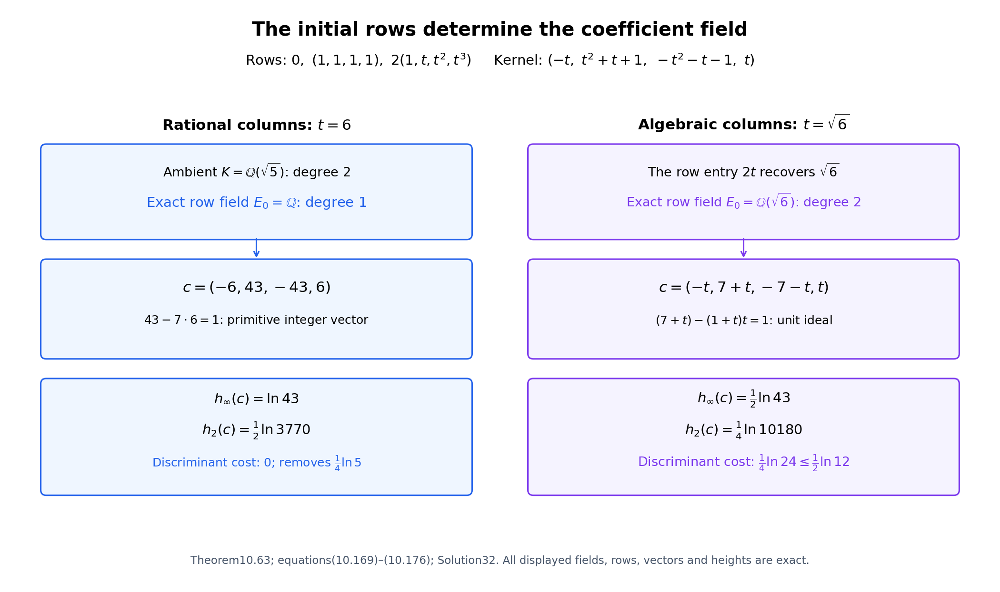

*Figure 10.12. For \(k=L=S=1,T=0,\Lambda=\{0,1,2,3\},P=1\), the initial rows are \(0\), \((1,1,1,1)\), \(2(1,t,t^2,t^3)\). The vector \((-t,t^2+t+1,-t^2-t-1,t)\) is their exact integral kernel. Left: \(t=6\), with ambient \(K=\mathbb Q(\sqrt5)\), gives row field \(\mathbb Q\), vector \((-6,43,-43,6)\), and no discriminant cost. The ambient-field cost would be \(\frac14\ln5\). Right: \(t=\sqrt6\) generates row field \(\mathbb Q(\sqrt6)\), with discriminant \(24\). Its cost \(\frac14\ln24\) is retained; the generator proof bounds it by \(\frac12\ln12\). The exact coefficient heights are \(\ln43,\frac12\ln3770\) on the left and \(\frac12\ln43,\frac14\ln10180\) on the right. Theorem 10.63 and equations (10.169)–(10.176) prove the field and budget mechanism; Solution 32 verifies the rows, discriminants and heights. Human-source context: the initial coefficient-field reduction in Lemma 4.2 of Yu's free 2013 paper; the complete discriminant and Siegel inputs are proved in the earlier lesson linked above, from Matveev's free paper. [Figure program](../figure_sources/initial_coefficient_field.py).*

## 25. Constructing enough columns in one phase class

The coefficient inequalities require a surplus of columns over equations. We now produce that surplus from the volume of a closed box, the covolume of the saturated exponent lattice and the number of possible phase classes. The boundary of the box matters when its normalized volume is an integer.

### Points in a translated closed box

**Theorem 10.66 (the closed-box lattice count).** Let \(\mathcal L=B\mathbb Z^r\), with \(B\) an invertible real matrix, and let
\(C=\prod_{j=1}^r[0,D_j]\), with every \(D_j>0\). Write

\[
\Delta=|\det B|,\qquad V=\prod_jD_j,\qquad m=\lfloor V/\Delta\rfloor.
\tag{10.177}
\]

There are \(m+1\) distinct points \(y_0,\ldots,y_m\) of \(C\) such that all \(y_j-y_0\) lie in \(\mathcal L\). Consequently a translate of \(C\) contains \(m+1\) distinct lattice points, including zero.

If \(\mathcal L\supset\mathbb Z^r\) has finite index \(J=|\mathcal L/\mathbb Z^r|\), then

\[
\Delta=J^{-1},\qquad m=\lfloor JV\rfloor.
\tag{10.178}
\]

**Proof.** Take the half-open fundamental cell \(F=B[0,1)^r\). Its translates by \(\mathcal L\) partition \(\mathbb R^r\), and its volume is \(\Delta\). For \(x\in F\), let \(n_C(x)\) count the points of \(x+\mathcal L\) in \(C\). This is a finite sum of indicator functions: boundedness of \(C-F\) bounds the integer coordinates \(B^{-1}\ell\) of any participating lattice vector. Translating each integral and using the partition gives
\[
\int_F n_C(x)\,dx
=\sum_{\ell\in\mathcal L}\int_{F+\ell}\mathbf1_C(y)\,dy
=V.
\]
The volume and translation rules used here are the same ones proved in the lattice argument of [Small solutions over the coefficient field](../TR-BAKER-08.html#small-solutions-over-the-coefficient-field). If \(V/\Delta>m\), this integral prevents \(n_C(x)\le m\) everywhere. Some coset therefore supplies \(m+1\) points.

For the equality case \(V/\Delta=m\), enlarge \(C\) about its centre by factors \(1+1/n\). Each enlarged closed box has volume strictly greater than \(m\Delta\), so it contains \(m+1\) points \(x_n+\ell_{0n},\ldots,x_n+\ell_{mn}\), with \(x_n\in F\). All participating lattice vectors lie in one fixed bounded set, because the enlarged boxes lie in the box enlarged by two and \(F\) is bounded. There are finitely many such lattice vectors. Passing to a subsequence fixes the distinct vectors \(\ell_0,\ldots,\ell_m\); a further subsequence makes \(x_n\) converge in the closed bounded cell \(B[0,1]^r\). Coordinatewise interval bisection gives this convergent subsequence, as in the proof of Theorem 10.60. The limits \(x+\ell_j\) lie in \(C\): its closed inequalities are the limits of the enlarged inequalities. Their differences are the distinct lattice differences \(\ell_j-\ell_0\). This proves the count also at integer normalized volume.

For (10.178), since every coordinate unit vector belongs to \(\mathcal L\), the matrix \(U=B^{-1}\) is integral. Multiplication by \(B^{-1}\) identifies \(\mathcal L/\mathbb Z^r\) with \(\mathbb Z^r/U\mathbb Z^r\). Its index is \(|\det U|\). Here is an integer reduction proof of that identity. Interchanging rows or columns, changing a sign, and adding an integer multiple of another row or column preserve index and absolute determinant. The Euclidean algorithm makes the first column have a positive pivot and zeros below. If an entry in its first row is not divisible by the pivot, column division and interchange produce a smaller positive pivot; repeat. This must stop because positive integers decrease. Column subtraction then clears the first row and leaves a nonsingular block of size \(r-1\). Induction diagonalizes the matrix by these operations. The quotient for a diagonal matrix has the product of the absolute diagonal entries as its index, by independent residue representatives. This is its absolute determinant. Thus \(J=|\det U|=1/\Delta\), proving (10.178). \(\square\)

The enlargement argument uses a closed box. For the open interval \(C=(0,1)\) and lattice \(\mathbb Z\), the normalized volume is one but no translate contains two lattice points.

### Retaining a single phase

**Lemma 10.67 (the phase-class count).** Take the \(m+1\) lattice differences in Theorem 10.66 and write them as \(B\lambda_j\), with \(\lambda_j\in\mathbb Z^r\). For integers \(G_0\ge1\) and \(d_1,\ldots,d_r\), put

\[
g=\gcd(G_0,d_1,\ldots,d_r),\qquad H=G_0/g.
\tag{10.179}
\]

There is a set \(\Lambda\) of at least \(\lceil(m+1)/H\rceil\) of these distinct integer vectors, all satisfying the same congruence
\(\boldsymbol d\cdot\lambda\equiv\varepsilon\pmod{G_0}\).
Moreover \(B\Lambda\subset C-y_0\).

**Proof.** Each phase value is a multiple of \(g\) modulo \(G_0\), so there are at most \(H\) possible values. If every class contained fewer than \(\lceil(m+1)/H\rceil\) of the \(m+1\) points, their total would be smaller than \(m+1\). Choose a class of at least that size. The map \(B\) is injective, so no points coalesce. The containment holds because every original difference was \(y_j-y_0\). This includes the case \(d_i=0\) for every \(i\), when \(g=G_0,H=1\). \(\square\)

### A certified surplus of prepared columns

**Corollary 10.68 (box volume supplies the initial kernel).** Suppose the multiplicative and phase hypotheses of Theorem 10.55 are available for the lattice basis \(B\) and the phase data of Lemma 10.67. For integers \(k,L\ge1,S,T\ge0\), choose the retained support \(\Lambda\) there. Its number of coefficient columns satisfies

\[
\begin{aligned}
kL\left\lceil\frac{\lfloor V/\Delta\rfloor+1}{H}\right\rceil
&\le N=kL|\Lambda|\le kL(\lfloor V/\Delta\rfloor+1),\\
N&>\frac{kLV}{\Delta H}.
\end{aligned}
\tag{10.180}
\]

Define the support-independent row upper bound

\[
\overline J_T=\sum_{u=0}^{\min(kL,T)}
\binom{T-u+r-1}{r-1},\qquad
\overline M=(2S+1)\overline J_T.
\tag{10.181}
\]

If \(kLV/(\Delta H)\ge c_*\overline M\), with \(c_*>1\), then \(N>c_*M_*\). In particular the complete integral initial kernel of Theorem 10.63 exists and its scaled budget (10.176) applies whenever its original-width hypotheses hold. The selected support retains that full-width height bound.

For a saturated lattice of index \(J\) and widths from (10.175), an explicit sufficient criterion is

\[
\frac{kLJ}{H}\,
\frac{\mathcal D^r}
{(c_1c_2rPd)^r\prod_j\sigma_j}
\ge c_*(2S+1)
\sum_{u=0}^{\min(kL,T)}\binom{T-u+r-1}{r-1}.
\tag{10.182}
\]

**Proof.** The first inequality in (10.180) is the retained-class count; the upper bound follows because the retained class is a subset of the chosen \(m+1\) points. Since
\(\lfloor V/\Delta\rfloor+1>V/\Delta\), and a ceiling is at least its argument, the strict inequality follows.

At additive order \(u\le\min(kL,T)\), allowing all \(r-1\) Euler directions gives \(\binom{T-u+r-1}{r-1}\) indices of order at most \(T-u\), by the divider count proved in Theorem 10.32. Every representative index in (10.126) is among these; zero Euler directions only remove duplicates. Hence \(M_*\le\overline M\). Combining this fact with (10.180) proves the strict surplus.

Pick any reference \(\lambda_0\) in the retained class. Its normalized phase differences are multiples of \(G_0\), and its original coordinates lie in \(C-y_0-B\lambda_0\). Thus all the hypotheses for the initial coefficient construction and the full-width estimate are retained. Apply Theorem 10.63 and, when (10.175) holds, Corollary 10.65. Substitution of \(\Delta=1/J\) and
\(V=\mathcal D^r/[(c_1c_2rPd)^r\prod_j\sigma_j]\)
gives (10.182). \(\square\)

The count certifies the initial coefficient construction. The analytic slope, derivative precision and strict nonzero-value comparisons used to extend its zeros remain separate hypotheses.

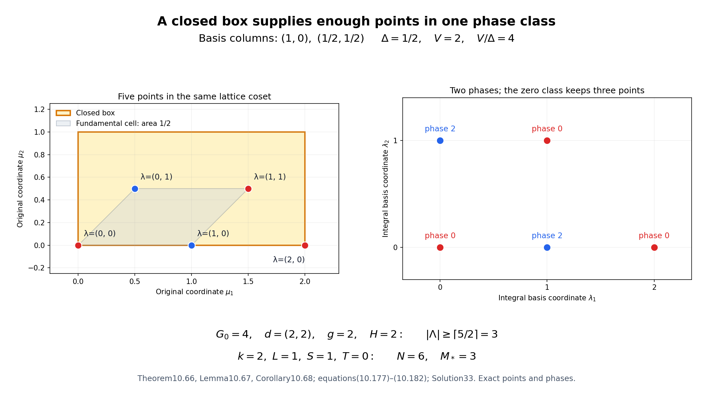

*Figure 10.13. The exact lattice has basis columns \((1,0)\), \((1/2,1/2)\), covolume \(1/2\) and index two over \(\mathbb Z^2\). The closed box is \(C=[0,2]\times[0,1]\), so \(V/\Delta=4\). Five displayed points have integral basis coordinates \((0,0),(0,1),(1,0),(1,1),(2,0)\). For \(G_0=4,d=(2,2)\), there are \(H=2\) phase classes. The class \(0\) retains three points with coordinates \((0,0),(1,1),(2,0)\). At \(k=2,L=1,S=1,T=0\), they give \(N=6\) columns and \(M_*=3\) rows. The lattice, box, points and phase labels are exact. Theorem 10.66, Lemma 10.67 and Corollary 10.68 prove (10.177)–(10.182), including the integer-volume boundary case; Solution 33 verifies these data and the derivative-order limitation. Human-source context: the box and phase selection (4.18)–(4.21) in Yu's free 2013 paper, cited below. [Figure program](../figure_sources/box_phase_support.py).*

## 26. Choosing parameters with a strict coefficient surplus

The lattice count becomes useful only when it exceeds the number of prescribed jets. We give a parameter choice for which that comparison holds with all integer roundings retained. The node and jet budgets are real numbers; their floors, rather than the budgets themselves, count the equations.

### The real parameters

Let \(r\ge2\), and retain the independent \(\mathfrak p\)-adic units \(\alpha_1,\ldots,\alpha_r\) in a number field of degree \(d\). Write \(e=e_{\mathfrak p}\), \(f=f_{\mathfrak p}\), and \(t=f\ln p\); thus \(ef\le d\). Let \(q=2\) for odd \(p\), and \(q=3\) for \(p=2\), with \(\zeta_3\in K\) in the latter case. Let \(q^u\) be the order of the q-primary roots of unity, and \(J=q^\nu\) the index of the q-primary saturation lattice. The roots reduce injectively: a nontrivial q-primary root in \(1+\mathfrak p\) would retain its positive finite valuation under its prime-to-\(p\) order by [p-adic logarithms: power series, heights and the one-logarithm bound](../TR-BAKER-09.html#4-taking-powers-until-the-exponential-applies), Lemma 9.5, but its power is one. Their reductions form a subgroup of the finite field's group of \(p^f-1\) nonzero elements. Its distinct cosets partition that group into sets of size \(q^u\), proving \(q^u\mid p^f-1\). Use its phase coefficients from Section 20, and put

\[
\begin{aligned}
G&=p^f-1,&G_0&=G/q^u,&
\delta&=\gcd(G_0,d_1,\ldots,d_r),&H&=G_0/\delta,\\
\ell_d&=\max\{1,\ln d\},&
\rho&=\begin{cases}58,&d\ge2,\\17,&d=1,\end{cases}&
g_1&=4+\ln((r+1)d),&A&=\max\{g_1,e,t\}.
\end{aligned}
\tag{10.183}
\]

Take \(\sigma_i\ge h(\alpha_i)>0\), constants \(c_0>1\) and \(c_1,c_3,c_4>0\), and \(g_0>39\). Choose \(h\ge\max\{g_0,(r+1)t\}\). In this subsection \(h\) is this real auxiliary parameter, whereas \(h(\alpha)\) denotes Weil height. Let \(\kappa\ge0\) be the integer with
\(p^{\kappa-1}(p-1)\le2e<p^\kappa(p-1)\), and set \(P=p^\kappa\). For any \(\tau\ge0\) define

\[
\begin{aligned}
\vartheta&=\begin{cases}(p-2)/(p-1),&p\ge5, e=1,\\P/(2e),&\text{otherwise},\end{cases}
&\theta&=\vartheta/(1+\tau),\\
c_2&=\begin{cases}7/4,&p>2,\\13/9,&p=2,\end{cases}
&a_*&=\begin{cases}7/2,&p\ge5, e=1,\\26/3,&p=2,\\7,&\text{otherwise}.
\end{cases}
\end{aligned}
\tag{10.184}
\]

Choose any \(\widehat\vartheta\ge\vartheta\). The explicit choices \(3/2\) at \(p=3\), \(5/4\) at \(p=5,e\ge2\), \(1\) at \(p\ge5,e=1\), \(7/6\) at \(p\ge7,e\ge2\), and \(2\) at \(p=2\) work. Indeed \(P\le2pe/(p-1)\), so \(P/(2e)\le p/(p-1)\). If \(p\ge5,e=1\), then \(\kappa=0\), \(P=1\), and \(\vartheta<1\). In particular \(c_2qP/(e\theta)\ge a_*\) in every case.

Define the positive lower budgets

\[
\begin{aligned}
g_2&=\begin{cases}
c_3q(r+1)^2d,&p\ge5,\ e=1,\text{ or }p\ge7,\\
c_3q(r+1)g_0e/\ln p,&p=2,3,\text{ or }p=5,\ e\ge2,
\end{cases}\\
g_3&=\frac{2c_0c_1c_4}{\rho}
a_*^r\frac{r^r(r+1)^r}{(r!)^2}g_1t,\\
g_4&=\frac{q(r+1)g_3}{c_1\widehat\vartheta t}
\begin{cases}1,&e=1\text{ and }(p\ge5\text{ or }d=1),\\g_1^{-1},&\text{otherwise},\end{cases}\\
g_5&=\frac{c_3q(r+1)g_3}{c_1c_4g_1t},
&1+\epsilon&=\left(1+\frac{r+1}{2g_4}\right)^r.
\end{aligned}
\tag{10.185}
\]

Here the \(d=1\) alternative in \(g_4\) is compatible with \(p=3,e=1\); \(p=2,d=1\) cannot meet \(\zeta_3\in K\). Set

\[
\begin{aligned}
x&=\nu\ln q,\\
\gamma&=\frac{q^\nu hA}{(h+x)(A+x)},\\
S&=\frac{c_3q(r+1)d(h+x)}t,\\
\mathcal D&=\frac{\gamma}{q^{\nu+u}}
(1+\epsilon)(2+g_2^{-1})c_0c_1c_4
\left(\frac{c_2qPr(r+1)}{e\theta}\right)^r\frac1{r!}\\
&\quad{}\times
\max\left\{\frac{p^f}{\delta t^r},\frac{\mathrm e^r}{r^r}t\right\}
d^{r+1}\ell_d\prod_i\sigma_i\,(A+x),\\
T&=\frac{q(r+1)\mathcal D}{c_1\theta et},\\
k&=\lfloor h+x-1\rfloor+1=\lfloor h+x\rfloor,\\
\widetilde D_0&=\frac{S\mathcal D}{c_1c_4kd(A+x)},\\
L&=\lfloor\widetilde D_0\rfloor+1,\\
D_i&=\frac{\mathcal D}{c_1c_2rPd\sigma_i}.
\end{aligned}
\tag{10.186}
\]

The exponential constant \(\mathrm e=\exp(1)\) in this formula is different from the ramification index \(e\). The additive factors of the prepared family have precisely \(k\) choices of degree index and \(L\) choices of positive power, as in Lemma 10.29.

**Lemma 10.69 (the saturation factor).** The parameters above satisfy \(1\le\gamma\le q^\nu\).

**Proof.** With \(x\ge0\), \(\gamma=\exp(x)hA/((h+x)(A+x))\). The logarithmic derivative with respect to \(x\) is
\(1-(h+x)^{-1}-(A+x)^{-1}>0\), because \(h>39\) and \(A\ge g_1>5\). At \(x=0\) the value is one. The upper bound follows from \((h+x)(A+x)\ge hA\). \(\square\)

### Lower bounds and the rounded equation count

**Lemma 10.70 (lower budgets without lost floors).** We have

\[
\begin{gathered}
S\ge g_2,\qquad
\frac{\mathcal D}{A+x}\ge\frac{g_3}{g_1},\qquad
\mathcal D\ge g_3,\qquad T\ge g_4,\\
\widetilde D_0\ge g_5,\qquad
\widetilde D_0<L\le(1+g_5^{-1})\widetilde D_0,\\
\binom{\lfloor T\rfloor+r}{r}
\le(1+\epsilon)\frac{T^r}{r!}.
\end{gathered}
\tag{10.187}
\]

**Proof.** In the first alternative for \(g_2\), use \(h+x\ge(r+1)t\) in \(S\). In the second, use \(h+x\ge g_0\) and \(d/f\ge e\). These give both stated lower bounds, including \(p=5,e\ge2\).

The q-primary lattice lies in the full saturation lattice of Theorem 10.18. Its index is \(q^\nu\), and \(w_K\ge q^u\). Consequently (10.55) gives

\[
d^{r+1}\ell_d\prod_i\sigma_i
\ge \frac{q^{\nu+u}}{\rho}\frac{r^r}{r!\mathrm e^r}.
\tag{10.188}
\]

For \(d\ge2\), replacing \(\ln d\) by the larger \(\ell_d\) preserves this bound; at \(d=1\) the degree and logarithmic factors equal one. The maximum in (10.186) is at least \((\mathrm e^r/r^r)t\). Combine this fact with (10.188), \(\gamma\ge1\), \((1+\epsilon)(2+g_2^{-1})\ge2\), and \(c_2qP/(e\theta)\ge a_*\). This yields
\(\mathcal D/(A+x)\ge g_3/g_1\), including every displayed constant. Since \(A+x\ge g_1\), it also yields \(\mathcal D\ge g_3\).

If the first alternative in \(g_4\) applies, \(e=1\); use \(\mathcal D\ge g_3\) and \(\theta\le\widehat\vartheta\). Otherwise use the stronger bound \(\mathcal D\ge g_3(A+x)/g_1\) and \(A+x\ge e\). Both give \(T\ge g_4\).

We have \(0<k\le h+x\). Substitute the formula for \(S\) into \(\widetilde D_0\), and then use the stronger bound for \(\mathcal D\):
\[
\widetilde D_0=
\frac{c_3q(r+1)(h+x)\mathcal D}{c_1c_4kt(A+x)}
\ge\frac{c_3q(r+1)g_3}{c_1c_4g_1t}=g_5.
\]
For any positive real \(y\), \(y<\lfloor y\rfloor+1\le y+1\). Taking \(y=\widetilde D_0\) proves both assertions about \(L\), including the strict inequality when \(y\) is an integer.

Finally,
\[
\binom{\lfloor T\rfloor+r}{r}
\le\frac1{r!}\prod_{j=1}^r(T+j)
\le\frac1{r!}\left(T+\frac{r+1}{2}\right)^r.
\]
The last inequality follows from the concavity of \(\ln\): its second derivative is \(-z^{-2}<0\), so the sum of the logarithms is at most \(r\) times the logarithm of their average. Divide by \(T^r\), and use \(T\ge g_4\) and (10.185). This proves the last line of (10.187). \(\square\)

**Theorem 10.71 (the parameter choice supplies a kernel).** Use the closed box with widths \(D_i\) and choose its single phase class as in Lemma 10.67. In the prepared system impose every node \(|s|\le S\) with integer \(s\), and every jet of total order at most the real number \(T\). Write \(s_0=\lfloor S\rfloor\), \(t_0=\lfloor T\rfloor\), let \(N=kL|\Lambda|\), and let \(M_*\) be the actual representative row count. Put

\[
c_{01}=c_0\ell_d\frac{p^f}{p^f-1}>1.
\tag{10.189}
\]

Then

\[
\begin{aligned}
N&>\frac{kLq^\nu D_1\cdots D_r}{H}
>c_{01}(2S+1)\binom{t_0+r}{r}\\
&\ge c_{01}(2s_0+1)\binom{t_0+r}{r}
\ge c_{01}M_*.
\end{aligned}
\tag{10.190}
\]

In particular a nonzero global-integral coefficient vector and polynomial with all these zeros and jets exist, with the field and height conclusions of Lemma 10.63.

**Proof.** The first strict inequality is (10.180), with \(J=q^\nu\), \(\Delta=1/J\), and \(H=G/(q^u\delta)\). For the next comparison keep all widths in (10.186), and write \(V=\prod_iD_i\). Since \(L>\widetilde D_0\),
\[
\frac{kLq^\nu V}{H}>
\frac{Sq^{\nu+u}\delta\mathcal D^{r+1}}
{c_1^{r+1}c_4c_2^rr^rP^rd^{r+1}(A+x)G\prod_i\sigma_i}.
\]
Divide by \((2S+1)(1+\epsilon)T^r/r!\). Substitute (10.186) for \(\mathcal D\). The degree factors, widths and normalization factors cancel, leaving
\[
\frac{S(2+g_2^{-1})}{2S+1}
\frac{\gamma c_0\ell_d\delta t^r}{G}
\max\left\{\frac{p^f}{\delta t^r},\frac{\mathrm e^r}{r^r}t\right\}
\ge c_{01}.
\]
Indeed \(S\ge g_2\) makes the first factor at least one, \(\gamma\ge1\), and the first member of the maximum gives \(p^f\). The binomial inequality (10.187) proves the second strict inequality in (10.190). A derivative order is an integer, so an order at most \(T\) is exactly an order at most \(t_0\); similarly there are exactly \(2s_0+1\) nodes. Counting all \(r\) derivative directions gives \(\binom{t_0+r}{r}\) rows per node by the divider argument of Theorem 10.32. Removing zero additive orders or duplicate Euler directions only decreases the representative count. This proves the remaining inequalities.

Since \(N>M_*\), the completely proved integral Siegel argument in Lemma 10.63 applies over the actual row field, with no unproved estimate used in place of an equation. Its nonzero vector gives a nonzero polynomial by Lemma 10.29. \(\square\)

### The height term with a real node budget

**Corollary 10.72 (the rounded mean torus contribution).** In this kernel let \(d_0\) be the row-field degree, let \(\mathcal H_0\) be the scalar row bound from Lemma 10.63 with node budget \(s_0\) and jet budget \(t_0\), and put \(Z=S\mathcal D/d\) and \(L_\alpha=\sum_iD_i h(\alpha_i)\). Then

\[
\begin{aligned}
\frac{h_2(\boldsymbol c)}Z
\le{}&\frac{\tfrac12\ln(Nd_0)}Z
 +\frac{d_0-1}{c_1c_2S}\\
&+\frac1{c_{01}-1}\left[
\frac{\tfrac12\ln N+\ln\mathcal H_0}Z
 +\frac{1+1/(2g_2)}{2c_1c_2}
\right].
\end{aligned}
\tag{10.191}
\]

**Proof.** Apply (10.174) at the integer budget \(s_0\), and use \(N>c_{01}M_*\) from (10.190). The full original width bound and \(\sigma_i\ge h(\alpha_i)\) give
\(PL_\alpha\le\mathcal D/(c_1c_2d)\), so the generator term divided by \(Z\) is at most \((d_0-1)/(c_1c_2S)\). The exact mean of the absolute integer nodes is
\(s_0(s_0+1)/(2s_0+1)\). It satisfies
\[
\frac{s_0(s_0+1)}{2s_0+1}
=\frac{s_0}{2}+\frac14-\frac1{4(2s_0+1)}
\le\frac S2+\frac14.
\]
Thus its contribution divided by \(Z\) is at most
\((1+1/(2S))/(2c_1c_2)\le(1+1/(2g_2))/(2c_1c_2)\). Substitution proves (10.191). This leaves the scalar row and row-field generator costs explicit; each must still be included in a numerical zero-forcing comparison. \(\square\)

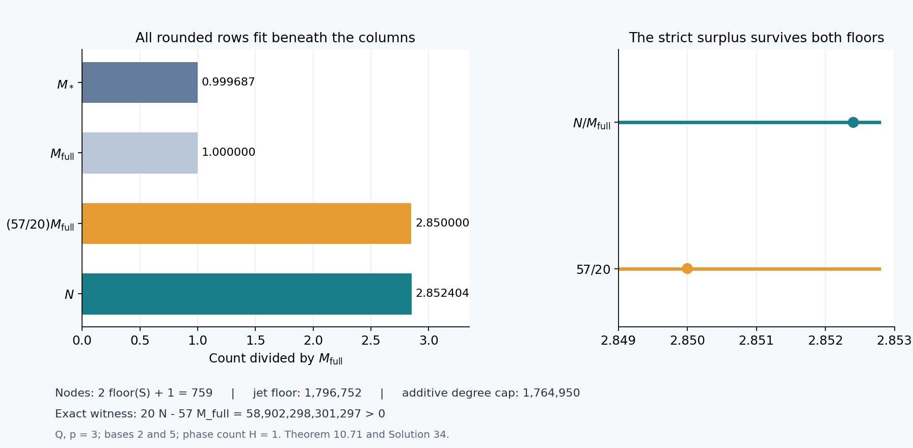

*Figure 10.14. Take \(K=\mathbb Q\), \(p=3\), \((\alpha_1,\alpha_2)=(2,5)\), and the parameters in Solution 34. The prepared column count and every plotted comparison are exact integer or rational quantities. There are \(2\lfloor S\rfloor+1\) nodes and \(\binom{\lfloor T\rfloor+2}{2}\) possible jets per node. The surplus \(c_{01}=57/20\) is retained through both floors; the strict comparison follows from the full real parameters, without rounding either budget upwards. The phase count is one, so no support is lost at that step. See (10.187)–(10.191), Solution 34, and [Yu's free paper](https://archive.ymsc.tsinghua.edu.cn/pacm_download/117/6782-11511_2013_Article_106.pdf) for further reading.*

## 27. The global size and scalar cost of the initial kernel

We now bound the number of coefficients and the size of each scalar row entry at the parameters of Section 26. Two factors need separate care. A prime-to-\(p\) root field is unramified, which strengthens the global degree bound by the ramification index. The additive prepared derivative also contains an lcm clearing factor; that factor contributes to its ordinary absolute value as well as to its integrality.

### The degree available above an unramified root field

**Lemma 10.73 (the torsion degree divided by ramification).** With the notation of (10.183), we have

\[
\frac d e\ge q^{u-1}(q-1).
\tag{10.192}
\]

**Proof.** Put \(F=\mathbb Q(\zeta_{q^u})\subseteq K\). The cyclotomic Eisenstein proof in [p-adic logarithms: power series, heights and the one-logarithm bound](../TR-BAKER-09.html#5-cyclotomic-ramification-and-distances-between-roots), Proposition 9.7 at the prime \(q\), gives
\([F:\mathbb Q]=q^{u-1}(q-1)\): irreducibility over \(\mathbb Q_q\) implies irreducibility over \(\mathbb Q\). Since \(q\ne p\), the completion \(F_{\mathfrak q}\) at the prime below \(\mathfrak p\) is unramified over \(\mathbb Q_p\), by the complete prime-to-\(p\) proof in [Cyclotomic, quadratic and Kummer extensions of local fields](../../NT-LOC/NT-LOC-12.html#1-two-kinds-of-cyclotomic-extension), Proposition 1.1.

Let \(m=[K:F]\), and choose an \(F\)-basis \(b_1,\ldots,b_m\) of \(K\). Inside \(K_{\mathfrak p}\), the subspace \(\sum_jF_{\mathfrak q}b_j\) has dimension at most \(m\) over the complete field \(F_{\mathfrak q}\). It is complete, hence closed, by the finite-dimensional norm proof in [Extensions of complete valued fields](../../NT-LOC/NT-LOC-04.html#2-coordinates-control-convergence), Proposition 2.1. It contains \(K\), whose closure is \(K_{\mathfrak p}\), so it equals that completion. Therefore \([K_{\mathfrak p}:F_{\mathfrak q}]\le m\).

Ramification indices multiply in a tower: restriction of a normalized integer valuation multiplies it by the ramification index at each step. The base root field has ramification index one, so \(e=e(K_{\mathfrak p}/F_{\mathfrak q})\). The degree formula \(ef=[L:K]\), fully proved by residue digits in [Extensions of complete valued fields](../../NT-LOC/NT-LOC-04.html#3-an-integral-basis-from-residue-digits), Theorem 3.1, gives \(e\le[K_{\mathfrak p}:F_{\mathfrak q}]\le m\). Therefore \(d/e=[F:\mathbb Q]m/e\ge[F:\mathbb Q]\), as asserted. \(\square\)

### A lower volume and an upper coefficient count

Retain all real parameters in (10.183)–(10.186). Set

\[
\begin{aligned}
b&=\begin{cases}1,&e=1\text{ and }(p\ge5\text{ or }d=1),\\
g_1^{-1},&\text{otherwise},\end{cases}\\
g_{61}&=
2c_0c_1^{1-r}c_4
\left(\frac q{\widehat\vartheta}\right)^r
\frac{(r+1)^r\mathrm e^r}{r!r^r}\,
t\,\frac{q-1}{q}\,g_1\,(bg_3)^{r-1},\\
v&=q^\nu D_1\cdots D_r.
\end{aligned}
\tag{10.193}
\]

**Lemma 10.74 (a uniform lower box volume).** We have

\[
v\ge g_{61}>0.
\tag{10.194}
\]

**Proof.** In the maximum defining \(\mathcal D\), use the second member \((\mathrm e^r/r^r)t\). Substituting one factor of \(\mathcal D\) into \(v\), and using \(\gamma\ge1\), \(1+\epsilon\ge1\), and \(2+g_2^{-1}\ge2\), gives
\[
v\ge
\frac{2c_0c_1^{1-r}c_4}{q^u}
\left(\frac q\theta\right)^r
\frac{(r+1)^r\mathrm e^r}{r!r^r}\,
t\,\frac d{e^r}\ell_d(A+x)\mathcal D^{r-1}.
\]
Lemma 10.73 gives \(d/q^u\ge e(q-1)/q\); also \(\ell_d\ge1\) and \(\theta\le\widehat\vartheta\). The remaining factor is
\((A+x)(\mathcal D/e)^{r-1}\). In the first case for \(b\), \(e=1\) and \(\mathcal D\ge g_3\). In the other case, the stronger bound in (10.187) and \(A+x\ge e\) give \(\mathcal D/e\ge g_3/g_1\). Since \(A+x\ge g_1\), both cases imply
\((A+x)(\mathcal D/e)^{r-1}\ge g_1(bg_3)^{r-1}\). This proves (10.194). \(\square\)

Let \(w_K\) denote the full root-of-unity order, and put

\[
\begin{aligned}
g_6&=
\rho(1+g_5^{-1})(1+g_{61}^{-1})
\frac{r!\mathrm e^r}
{c_1^{r+1}c_4c_2^rP^rw_Kr^{2r}},\\
g_7&=\frac{c_3q(r+1)g_0g_3}{t},\\
g_8&=\frac{\ln g_7+g_1+
\max\{\ln(g_6d/\mathrm e^{g_1}),0\}}{g_7}
+\frac r{c_3q(r+1)^2}\frac{\ln g_3}{g_3}.
\end{aligned}
\tag{10.195}
\]

**Theorem 10.75 (the logarithmic coefficient budget).** Suppose \(g_3\ge\mathrm e\) and \(g_7\ge\mathrm e\). For the selected support of Theorem 10.71, \(N=kL|\Lambda|\) and \(Z=S\mathcal D/d\) satisfy

\[
N\le g_6S\mathcal D^{r+1},
\qquad Z\ge g_7,\qquad
\ln N\le g_8Z.
\tag{10.196}
\]

**Proof.** By (10.180), \(|\Lambda|\le v+1\). Also
\[
kL\le(1+g_5^{-1})\frac{S\mathcal D}{c_1c_4d(A+x)}.
\]
Use \(v\ge g_{61}\) to replace \(v+1\) by at most \((1+g_{61}^{-1})v\). The full saturation bound (10.55) gives
\[
\frac{q^\nu}{d^{r+1}\prod_i\sigma_i}
\le\frac{\rho\ell_dr!\mathrm e^r}{w_Kr^r}.
\]
For \(d\ge2\), use the same replacement of \(\ln d\) by \(\ell_d\) as in (10.188); for \(d=1\) the formula is exact. Substituting the widths \(D_i\) and \(\ell_d\le g_1\le A+x\) gives the first inequality of (10.196), with exactly \(g_6\).

The formula for \(S\), together with \(h+x\ge g_0\) and \(\mathcal D\ge g_3\), gives \(Z\ge g_7\). Taking logarithms in the first inequality yields
\[
\ln N\le\ln(g_6d)+\ln Z+r\ln\mathcal D.
\]
Put \(C=g_1+\max\{\ln(g_6d/\mathrm e^{g_1}),0\}>0\); then \(\ln(g_6d)\le C\), so \(C/Z\le C/g_7\). The function \(\ln y/y\) decreases for \(y\ge\mathrm e\), because its derivative is \((1-\ln y)/y^2\). Thus \(\ln Z/Z\le\ln g_7/g_7\).

Finally \(h+x\ge(r+1)t\) gives \(S/d\ge c_3q(r+1)^2\), and therefore
\[
\frac{r\ln\mathcal D}{Z}
\le\frac r{c_3q(r+1)^2}\frac{\ln\mathcal D}{\mathcal D}
\le\frac r{c_3q(r+1)^2}\frac{\ln g_3}{g_3}.
\]
Combining these three bounds proves \(\ln N\le g_8Z\). \(\square\)

The lower hypotheses here have simple sufficient conditions. If
\(c_0\ge19/10,c_1\ge7/5,c_3\ge47/100,c_4\ge15/4\), then \(g_3/\!t>21\). Indeed \(a_*\ge7/2\), \(\rho\le58\), \(g_1>5\), and \(r^r(r+1)^r/(r!)^2\ge1\); hence
\[
\frac{g_3}{t}>
\frac2{58}\frac{19}{10}\frac75\frac{15}4
\left(\frac72\right)^2\,5>21.
\]
The positive logarithm series in Solution 34 gives \(\ln2>2/3\), so \(t\ge\ln2>2/3\), and \(g_3>14>\mathrm e\). Also
\(g_7>(47/100)\cdot2\cdot3\cdot39\cdot21>3>\mathrm e\), where \(\mathrm e<3\) follows by summing its positive series and bounding the tail geometrically.

### Retaining the clearing factor and the jet allocation

Write \(s_0=\lfloor S\rfloor,t_0=\lfloor T\rfloor,D_{\mathrm a}=kL\), and \(\mathfrak v=v(k)=\operatorname{lcm}(1,\ldots,k)\). For the \(r-1\) integer Euler forms of the actual prepared system, let \(\Omega_j\) be the maximum of their absolute arguments on the support, and put
\[
m=\sum_{j=1}^{r-1}\Omega_j+r-2,\qquad
U=\min(D_{\mathrm a},t_0).
\tag{10.197}
\]

**Lemma 10.76 (a complete scalar row bound).** The scalar bound in Lemma 10.63 may be taken to be

\[
\mathcal H_0=
\left[2\mathrm e\left(\frac{s_0}{k}+2\right)\right]^{D_{\mathrm a}}
\max_{0\le u\le U}
\left\{\mathfrak v^u
\binom{m+t_0-u}{t_0-u}\right\}.
\tag{10.198}
\]

If \(\mathfrak v=1\), a maximizing index is \(u_*=0\). If \(\mathfrak v>1\), one is
\[
u_*=\min\left\{U,\,
\max\left\{0,t_0-\left\lceil\frac m{\mathfrak v-1}\right\rceil+1\right\}\right\}.
\tag{10.199}
\]

More sharply, with \(R=s_0+2k\), the scalar bound may be taken to be
\[
\mathcal H_{\rm fine}=
\frac{R^{D_{\mathrm a}}}{(k!)^L}
\max_{0\le u\le U}
\left\{\left(\frac{\mathfrak v}{R}\right)^u
\binom{D_{\mathrm a}}u
\binom{m+t_0-u}{t_0-u}\right\}.
\tag{10.200}
\]
A maximizing index \(\widehat u\) is the first index after all the consecutive increasing steps. A step from \(u\) to \(u+1\), for \(u<U\), is increasing or constant precisely when
\[
\mathfrak v(D_{\mathrm a}-u)(t_0-u)
\ge R(u+1)(m+t_0-u).
\tag{10.201}
\]
These steps form an initial interval, so an integer binary search finds a maximizing index, with no numerical root approximation.

**Proof.** For \(0\le a<k\), \(1\le\ell\le L\), write
\[
F_{a,\ell}(X)=\frac1{(k!)^\ell}
\prod_{j=1}^k(X+a+j)^\ell.
\]
It has degree \(k\ell\), and every shift \(a+j\) is at most \(2k\). In the divided derivative of order \(u\), choose the \(u\) differentiated linear factors. There are \(\binom{k\ell}{u}\) choices. For \(|s|\le s_0\), each remaining factor has absolute value at most \(s_0+2k\). Thus
\[
\left|\frac{F_{a,\ell}^{(u)}(s)}{u!}\right|
\le \frac{\binom{k\ell}{u}(s_0+2k)^{k\ell-u}}{(k!)^\ell}
\le\left[2\mathrm e\left(\frac{s_0}{k}+2\right)\right]^{D_{\mathrm a}}.
\]
For the last inequality use \(\binom{k\ell}{u}\le2^{k\ell}\), the positive factor \(s_0+2k\ge1\), and
\(\ln(k!)\ge k\ln k-k\). The latter follows by comparing \(\sum_{j=1}^k\ln j\) with the integral of the increasing function \(\ln x\) on \([1,k]\). The resulting base is greater than one, and \(k\ell\le D_{\mathrm a}\). If \(u>k\ell\), the derivative is zero.

The prepared derivative multiplies this divided derivative by \(\mathfrak v^u\), by (10.86); discarding that multiplier would give the wrong ordinary absolute-value bound. Each Euler factor satisfies
\[
|\Delta(\omega_j;t_j)|
\le\binom{\Omega_j+t_j}{t_j}.
\]
Multiplying the positive generating series for these binomial coefficients, as in (10.124), shows that their product at total Euler order \(h\) is at most \(\binom{m+h}{h}\). This increases with \(h\), so for additive order \(u\) it is at most \(\binom{m+t_0-u}{t_0-u}\). This proves (10.198).

For \(F(u)=\mathfrak v^u\binom{m+t_0-u}{t_0-u}\), whenever \(u<t_0\),
\[
\frac{F(u+1)}{F(u)}
=\mathfrak v\frac{t_0-u}{m+t_0-u}.
\]
At \(\mathfrak v=1\) this is at most one. Otherwise it is at least one exactly when
\((\mathfrak v-1)(t_0-u)\ge m\). These ratios decrease as \(u\) increases. Hence \(F\) increases up to this integer threshold and decreases afterwards; equality may give two adjacent maximizers. Clamping the last increasing step to \([0,U]\) gives (10.199), choosing the larger maximizer in the equality case.

For (10.200), retain the first divided-derivative estimate, rather than replacing its binomial coefficient by \(2^{k\ell}\). Since \(\binom{k\ell}{u}\le\binom{D_{\mathrm a}}u\) and \(R^k/k!>1\), it gives
\[
\left|\frac{F_{a,\ell}^{(u)}(s)}{u!}\right|
\le \binom{D_{\mathrm a}}u\,R^{-u}
\left(\frac{R^k}{k!}\right)^\ell
\le\frac{\binom{D_{\mathrm a}}u R^{D_{\mathrm a}-u}}{(k!)^L}.
\]
Multiply by the clearing and Euler factors already proved. The ratio of the resulting expression at \(u+1\) to that at \(u\) is
\[
\frac{\mathfrak v}{R}\frac{D_{\mathrm a}-u}{u+1}
\frac{t_0-u}{m+t_0-u}.
\]
Every factor depending on \(u\) decreases on \(0\le u<U\); the first is strictly decreasing. Thus the ratios cross one at most once. Clearing their positive denominators gives exactly (10.201), which proves the asserted integer rule and the sharper bound. \(\square\)

**Corollary 10.77 (the normalized additive cost).** If \(c_3q/t\le8\), the first factor in (10.198) contributes at most
\[
\frac{D_{\mathrm a}}Z
\ln\left[2\mathrm e\left(\frac{s_0}{k}+2\right)\right]
\le\frac{1+g_5^{-1}}{c_1c_4}.
\tag{10.202}
\]

**Proof.** Since \(h+x>39\), \(k=\lfloor h+x\rfloor\ge39\) and \((h+x)/k<(k+1)/k\le40/39\). Put \(W=(r+1)d\ge3\). Then
\[
\frac{s_0}{k}+2\le\frac Sk+2
<\frac{320}{39}W+2\le\frac{346}{39}W.
\]
Since \(\mathrm e^3>18>692/39\), it follows that
\(2\mathrm e(s_0/k+2)<\mathrm e^4W\), and its logarithm is at most \(g_1\). The inequality \(\mathrm e^3>18\) follows already from the terms of degrees zero through five in its exponential series at three. Also \(D_{\mathrm a}/Z\le(1+g_5^{-1})/[c_1c_4(A+x)]\), by (10.187), and \(g_1\le A+x\). These prove (10.202). For odd \(p\), the hypothesis holds whenever \(c_3\le4\), since \(\ln p\ge\ln3>1\). At \(p=2\), it holds whenever \(c_3\le1/2\), since \(\ln2>2/3\). \(\square\)

**Theorem 10.78 (the initial height with all scalar costs).** Assume the hypotheses of Theorems 10.71 and 10.75 and Corollary 10.77. Set
\(\Psi=u_*\ln\mathfrak v+\ln\binom{m+t_0-u_*}{t_0-u_*}\).
Then the integral initial kernel can be chosen with
\[
\begin{aligned}
\frac{h_2(\boldsymbol c)}Z\le{}&
\frac12g_8+\frac{\ln d_0}{2g_7}
+\frac{d_0-1}{c_1c_2S}\\
&+\frac1{c_{01}-1}
\left[\frac12g_8+\frac{1+g_5^{-1}}{c_1c_4}
+\frac{\Psi}{Z}
+\frac{1+1/(2g_2)}{2c_1c_2}\right].
\end{aligned}
\tag{10.203}
\]

**Proof.** In (10.191), use \(\ln N/Z\le g_8\), \(Z\ge g_7\), and the exact scalar bound (10.198) at (10.199). Corollary 10.77 bounds its additive first factor; its remaining factor has logarithm exactly \(\Psi\). Substitution proves every term of (10.203). The row-field term may further be bounded by \(1/[c_1c_2c_3q(r+1)^2]\), since \(d_0\le d\) and \(S/d\ge c_3q(r+1)^2\), but its exact vanishing at \(d_0=1\) is preferable there.

More sharply, replace the sum \((1+g_5^{-1})/(c_1c_4)+\Psi/Z\) in (10.203) by \(\ln\mathcal H_{\rm fine}/Z\), evaluated at the exact integer maximizer \(\widehat u\) in (10.201). This follows from the same substitution in (10.191), using (10.200).

This is a height bound for coefficients whose existence has already been proved. An extension of their zeros still requires the stated analytic slopes, derivative precision, arithmetic strict comparisons and final multiplicity contradiction. In particular the lcm and Euler term \(\Psi\) must be retained in each such comparison. \(\square\)

### Averaging the derivative orders

**Corollary 10.79 (a mean scalar budget).** Retain every Euler index, allowing duplicate rows, but omit the identically zero additive orders above \(D_{\mathrm a}\). Define
\[
\begin{aligned}
J_u&=\binom{t_0-u+r-1}{r-1}\quad(0\le u\le U),&
\overline J&=\sum_{u=0}^U J_u,\\
\overline u&=\frac{\sum_{u=0}^UuJ_u}{\overline J},&
\overline h&=\frac{r-1}{r}(t_0-\overline u),&
\overline M&=(2s_0+1)\overline J.
\end{aligned}
\tag{10.204}
\]
Let \(H(z)=-z\ln z-(1-z)\ln(1-z)\), with endpoint values zero, and put
\[
\begin{aligned}
A_{\rm mean}&=(D_{\mathrm a}-\overline u)\ln R
-L\ln(k!)+D_{\mathrm a}H(\overline u/D_{\mathrm a}),\\
E_{\rm mean}&=\begin{cases}
\overline h\ln\!\left[\mathrm e(1+m/\overline h)\right],&\overline h>0,\\
0,&\overline h=0,
\end{cases}\\
B_{\rm mean}&=A_{\rm mean}+\overline u\ln\mathfrak v+E_{\rm mean}.
\end{aligned}
\tag{10.205}
\]
The mean logarithm of the scalar row bounds is at most \(B_{\rm mean}\), and an integral initial kernel exists with
\[
\begin{aligned}
\frac{h_2(\boldsymbol c)}Z\le{}&
\frac{\tfrac12\ln(Nd_0)}Z+\frac{d_0-1}{c_1c_2S}\\
&+\frac{\overline M}{N-\overline M}
\left[\frac{\tfrac12\ln N+B_{\rm mean}}Z
+\frac{s_0(s_0+1)}
{(2s_0+1)c_1c_2S}\right].
\end{aligned}
\tag{10.206}
\]
Moreover \(\overline u\le t_0/(r+1)\).

**Proof.** At fixed additive order \(u\), the \(r-1\) Euler indices and their slack coordinate are all the nonnegative integer compositions of \(t_0-u\) into \(r\) parts. Permuting their coordinates is a bijection; the sum of their coordinate averages is \(t_0-u\). Thus their mean total Euler order is \((r-1)(t_0-u)/r\). Weighting by \(J_u\) proves the formula for \(\overline h\).

Without the additive cutoff, all \(r\) derivative coordinates and their slack are the compositions of \(t_0\) into \(r+1\) parts, so the mean additive order is \(t_0/(r+1)\). Removing orders greater than \(U\) can only decrease that mean: each removed order exceeds every retained one. This proves the last assertion.

The sharper additive estimate in the proof of Lemma 10.76 has logarithm at most
\[
\ln\binom{D_{\mathrm a}}u+(D_{\mathrm a}-u)\ln R-L\ln(k!).
\]
For \(0<u<D_{\mathrm a}\), the binomial theorem at \(z=u/D_{\mathrm a}\) gives
\(\binom{D_{\mathrm a}}u z^u(1-z)^{D_{\mathrm a}-u}\le1\). Hence
\(\ln\binom{D_{\mathrm a}}u\le D_{\mathrm a}H(u/D_{\mathrm a})\), including the endpoints by continuity. The second derivative \(H''(z)=-1/z-1/(1-z)<0\) proves concavity, so averaging gives \(A_{\rm mean}\).

At total Euler order \(h>0\), the factorial integral bound gives
\(\ln\binom{m+h}{h}\le h\ln[\mathrm e(1+m/h)]\). The right side extends continuously by zero at \(h=0\). Its second derivative is \(-m^2/[h(m+h)^2]\le0\), so its average is at most \(E_{\rm mean}\); when \(m=0\) it is the linear function \(h\). The clearing multiplier has logarithm \(u\ln\mathfrak v\), whose mean is exactly \(\overline u\ln\mathfrak v\). This proves (10.205).

By (10.190), \(N>c_{01}(2s_0+1)\binom{t_0+r}{r}\ge c_{01}\overline M\), so the completely proved weighted integral Siegel argument of Lemma 10.63 applies to these rows. Duplicate or further zero rows do not increase rank; assigning them the same positive upper scalar bounds preserves that argument. The row field remains \(E_0\), and the torus-row mean remains that of (10.174). Use (10.173) for its full-width and field-generator terms, and substitute the mean scalar bound into the row sum in (10.171). This is (10.206), with the actual ratio \(\overline M/(N-\overline M)\). The nonzero polynomial and every required jet follow as before. \(\square\)

### A second way to clear the global rows

**Corollary 10.80 (row scaling and an alternative mean bound).** Define
\[
B_{\rm proj}=(D_{\mathrm a}-\overline u)\ln R
+D_{\mathrm a}H(\overline u/D_{\mathrm a})+E_{\rm mean}.
\tag{10.207}
\]
In (10.206), \(B_{\rm mean}\) may be replaced by
\[
\min\{B_{\rm mean},B_{\rm proj}\}.
\tag{10.208}
\]
One may also choose the smaller scalar bound separately at each row before averaging.

**Proof.** At the additive order \(u\), every original prepared row contains the common multiplier \(\mathfrak v^u\). Replace it by the common multiplier \((k!)^L\). This multiplies that entire row by the nonzero rational number \((k!)^L/\mathfrak v^u\), so it preserves its kernel and its coefficient field. Every nonzero row has unchanged projective height; zero rows remain zero. For a nonzero row, the logarithms of the absolute values of that common scalar sum to zero by the normalized product formula proved in [Places of number fields in extensions and the product formula](../../NT-LOC/NT-LOC-05.html#5-norms-and-the-normalized-product-formula), Theorem 5.2.

The divided derivative of \(F_{a,\ell}\) has denominator dividing \((k!)^\ell\). To verify this at every order, its polynomial coefficients have that denominator and divided differentiation multiplies a monomial coefficient by an integer binomial coefficient. At an integer node its denominator still divides \((k!)^\ell\), hence divides \((k!)^L\). The Euler binomials are integers at their integer arguments. Thus the replaced scalar entries are integers, as required for the same finite-place row estimate.

The sharper derivative bound in Lemma 10.76 now gives the archimedean scalar bound
\[
\binom{D_{\mathrm a}}u R^{D_{\mathrm a}-u}
\binom{m+t_0-u}{t_0-u}.
\]
The factorial denominator cancels against the new common multiplier. Averaging its logarithm with the concavity arguments of Corollary 10.79 gives \(B_{\rm proj}\). Its coefficient matrix has exactly the same kernel as the original prepared matrix, so the identical weighted Siegel and full-width argument proves (10.206) with this bound. Both bounds therefore apply to the same row heights; choosing their smaller value, globally or row by row, is valid. The original lcm normalization remains available for every later local jet-precision computation. \(\square\)

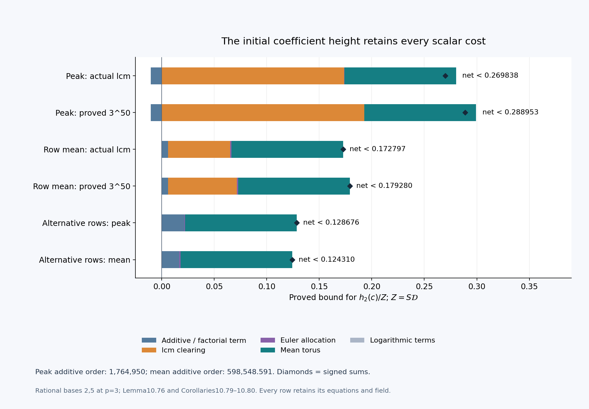

*Figure 10.15. The parameters of Solution 34 give the proved coefficient-height bounds in Solution 35. The sharper allocation and row average retain the factorial denominator; lcm clearing, Euler orders, mean torus and logarithmic terms are all included. Left of zero is the factorial contribution to be subtracted when the highest additive order is used. The diamonds mark the net sums. Each pair uses either the actual integer \(\operatorname{lcm}(1,\ldots,50)\) or the completely proved coarser \(3^{50}\) bound in [Two logarithms II: explicit lower bounds](../TR-BAKER-07.html#an-exponential-bound-for-least-common-multiples). The final pair uses the alternative global row clearing of Corollary 10.80. All bars give proved upper bounds on the height of some initial kernel. See (10.198)–(10.208), Solution 35, and [Yu's free paper](https://archive.ymsc.tsinghua.edu.cn/pacm_download/117/6782-11511_2013_Article_106.pdf) for further reading.*

## 28. Principal-unit depth and the analytic torus

The local torus coordinates must define convergent exponential functions on the enlarged disc used for interpolation. We prove the depth with the same power \(P\) as in Section 26. The ramification index enters this choice; the small strict reduction from \(\vartheta\) to \(\theta\) also has a mathematical purpose.

### The power needed for an enlarged disc

Let \(L/\mathbb Q_p\) be a finite extension with ramification index \(e\), and normalize \(v_p(p)=1\). Write \(a_p=1/(p-1)\), and choose the nonnegative integer \(\kappa\) by

\[
p^{\kappa-1}(p-1)\le2e<p^\kappa(p-1),\qquad P=p^\kappa,
\qquad
\vartheta=\begin{cases}
(p-2)/(p-1),&p\ge5, e=1,\\
P/(2e),&\text{otherwise}.
\end{cases}
\tag{10.209}
\]

This integer exists: take the least nonnegative \(\kappa\) satisfying the strict upper inequality. At \(\kappa=0\), its lower inequality still holds because \((p-1)/p<1\le2e\). Fix \(0<\theta<\vartheta\); in particular the choice \(\theta=\vartheta/(1+\varepsilon)\) with \(\varepsilon>0\) is permitted.

**Lemma 10.81 (the original principal-unit depth).** If \(\beta\in L\) and \(v_p(\beta-1)>0\), then

\[
v_p(\beta^P-1)\ge\vartheta+a_p>\theta+a_p.
\tag{10.210}
\]

The statement includes \(\beta^P=1\), with valuation infinity.

**Proof.** The valuation group of \(L\) is \(e^{-1}\mathbb Z\), by the complete degree-and-residue proof in [Extensions of complete valued fields](../../NT-LOC/NT-LOC-04.html#3-an-integral-basis-from-residue-digits), Theorem 3.1. Thus \(v_p(\beta-1)\ge1/e\). The elementary power step in [p-adic logarithms: power series, heights and the one-logarithm bound](../TR-BAKER-09.html#4-taking-powers-until-the-exponential-applies), Lemma 9.5, gives
\(c_{j+1}\ge F(c_j)\) for \(c_j=v_p(\beta^{p^j}-1)\), where \(F(c)=\min\{pc,c+1\}\). Below \(a_p\) the step is exactly multiplication by \(p\); at or above that threshold the lower bound still holds. The function \(F\) is increasing and \(F(c)\ge c\) for \(c\ge0\). If any power is one, all subsequent assertions are immediate.

In the exceptional case \(p\ge5,e=1\), we have \(\kappa=0\), so the initial bound is \(1=\vartheta+a_p\). Consider the other cases. The inequalities defining \(\kappa\) give
\(a_p<\vartheta\le p a_p\). If \(\kappa=0\), then \(1/e=2\vartheta>\vartheta+a_p\), which proves the claim.

Suppose \(\kappa\ge1\). We first prove \(c_{\kappa-1}\ge P/(pe)\). If none of \(c_0,\ldots,c_{\kappa-2}\) reaches \(a_p\), the exact steps below the threshold give \(c_{\kappa-1}=p^{\kappa-1}c_0\ge P/(pe)\); for \(\kappa=1\) this uses no step. Otherwise, after the first such crossing there is at least one further step before index \(\kappa-1\). That step gives \(c\ge a_p+1\ge2a_p\). Subsequent steps cannot decrease the valuation, and the lower defining inequality gives \(P/(pe)\le2a_p\). This proves the same bound in that case.

Applying the increasing function \(F\) once more yields

\[
c_\kappa\ge\min\{P/e, 1+P/(pe)\}
=\min\{2\vartheta, 1+2\vartheta/p\}
\ge\vartheta+a_p.
\tag{10.211}
\]

Indeed \(2\vartheta>\vartheta+a_p\). For the other member, use
\((1-2/p)\vartheta\le(p-2)/(p-1)=1-a_p\). This remains valid at \(p=2\), where both sides of that last inequality are zero. Finally \(\theta<\vartheta\) supplies the strict inequality in (10.210). \(\square\)

### Coefficients and divided jets of the torus functions

**Corollary 10.82 (normality with the actual depth).** Let \(w_1,\ldots,w_s\in L\) satisfy \(v_p(w_i-1)\ge\vartheta+a_p\), and let \(\lambda_i\in L\) have \(v_p(\lambda_i)\ge0\). Put

\[
\ell=\sum_i\lambda_i\log w_i,\qquad
F(Z)=\exp(Z\ell)=\sum_{n\ge0}A_nZ^n.
\tag{10.212}
\]

Then \(F\in\mathcal A_{p^\theta}\), its Gauss norm is one, and for \(n\ge1\)

\[
v_p(A_n)\ge n\vartheta+a_p,\qquad
v_p(A_n)-n\theta\ge n(\vartheta-\theta)+a_p.
\tag{10.213}
\]

If \(v_p(z)\ge-\theta\), its divided jets satisfy

\[
\frac{F^{(j)}(z)}{j!}=F(z)\frac{\ell^j}{j!},\qquad
v_p\!\left(\frac{F^{(j)}(z)}{j!}\right)
\ge j\vartheta+a_p\quad(j\ge1).
\tag{10.214}
\]

If \(\ell=0\), the positive-order coefficients and jets are zero. The constant coefficient and value have valuation zero.

**Proof.** The logarithm is an isometry at this depth, by Proposition 9.3 of the linked preceding lesson. Thus each logarithm has valuation at least \(\vartheta+a_p\), and the integral multipliers and ultrametric inequality give the same bound for \(\ell\). If \(\ell=0\), the assertions follow from \(F=1\). Otherwise \(A_n=\ell^n/n!\). The complete factorial digit formula (9.4) gives
\(v_p(n!)=(n-s_p(n))a_p\le(n-1)a_p\). This proves the first bound in (10.213); subtracting \(n\theta\) proves the second. It tends to infinity, so the series belongs to the complete coefficient algebra \(\mathcal A_{p^\theta}\). The constant coefficient is one and every other weighted coefficient has positive valuation, proving that the Gauss norm is exactly one.

For the asserted nodes, \(v_p(z\ell)\ge\vartheta-\theta+a_p>a_p\). The exponential converges there and is a unit, by Proposition 9.3. The coefficient algebra and analytic identities of Lemma 9.2 and Proposition 9.4 justify differentiation and translation on this disc; alternatively the coefficient identity for each divided derivative is verified directly by the convergent exponential series. It gives (10.214), with the same factorial estimate. \(\square\)

This applies to the integer exponent vectors of every torus monomial, including negative coordinates, and to exponents divided by any power of \(q\ne p\). Such scalars are p-adically integral. Finite sums of these exponential series with locally integral coefficients have Gauss norm at most one. An additional additive polynomial still contributes its own coefficient norm; (10.213) does not discard that contribution.

The strict choice of \(\theta\) cannot generally be removed. If \(v_p(\ell)=\vartheta+a_p\), then the exact factorial formula gives \(v_p(A_n)-n\vartheta=s_p(n)a_p\). At \(n=p^j\) this is the constant \(a_p\). The weighted coefficients therefore fail to tend to zero at radius \(p^\vartheta\). In this equality case the exponential does not converge at a point of valuation \(-\vartheta\). Solution 36 supplies an actual example.

### Residue phases and a coherent root choice

**Corollary 10.83 (principal roots of the phased coordinates).** Let \(G=p^f-1\), let \(\zeta\in L\) be a primitive \(G\)-th root of unity, and suppose that the residue of the local unit \(\alpha\) is the residue of \(\zeta^a\). Such residue lifts, including their primitivity, are proved in Lemma 10.53. Put

\[
\beta=\alpha\zeta^{-a},\qquad
V=\beta^P=\alpha^P\zeta^{-aP}.
\tag{10.215}
\]

For a prime \(q\ne p\), the element

\[
\eta=\exp(q^{-1}\log V)\in L,\qquad
\eta^q=V,\qquad
v_p(\eta-1)=v_p(V-1)\ge\vartheta+a_p
\tag{10.216}
\]

is the unique \(q\)-th root of \(V\) with residue one. Fix \(\xi\in\mathbb C_p\) with \(\xi^q=\zeta\). A \(q\)-th root \(\rho\) of \(\alpha\) can be chosen so that

\[
\rho^P\xi^{-aP}=\eta.
\tag{10.217}
\]

The choice may be made separately for every member of a finite family, without changing any of their \(q\)-th power identities.

**Proof.** The residue condition gives \(v_p(\beta-1)>0\). Lemma 10.81 therefore proves the depth of \(V\). Since \(q\) is a local unit, \(q^{-1}\log V\) has this same valuation; Proposition 9.4 gives both \(\eta^q=V\) and the valuation identity. The series defining \(\eta\) lies in the complete field \(L\). If two such roots had residue one, their ratio would be a \(q\)-th root of unity with positive valuation of its difference from one. The prime-to-\(p\) power identity in Lemma 9.5 forces that ratio to be one. This proves uniqueness, also when \(V=1\).

Start with any \(\rho_0^q=\alpha\) in \(\mathbb C_p\). Then \(w=\rho_0^P\xi^{-aP}\) satisfies \(w^q=V\), so \(\eta/w\) is a \(q\)-th root of unity. Fix a primitive one \(\omega\), and write \(\eta/w=\omega^j\). Since \(P=p^\kappa\) is coprime to \(q\), integer division gives an integer \(b\) with \(Pb\equiv j\pmod q\). Set \(\rho=\rho_0\omega^b\). Its \(q\)-th power is still \(\alpha\), and its \(P\)-th power supplies the required correction, proving (10.217). No equation for another member of the family is affected. \(\square\)

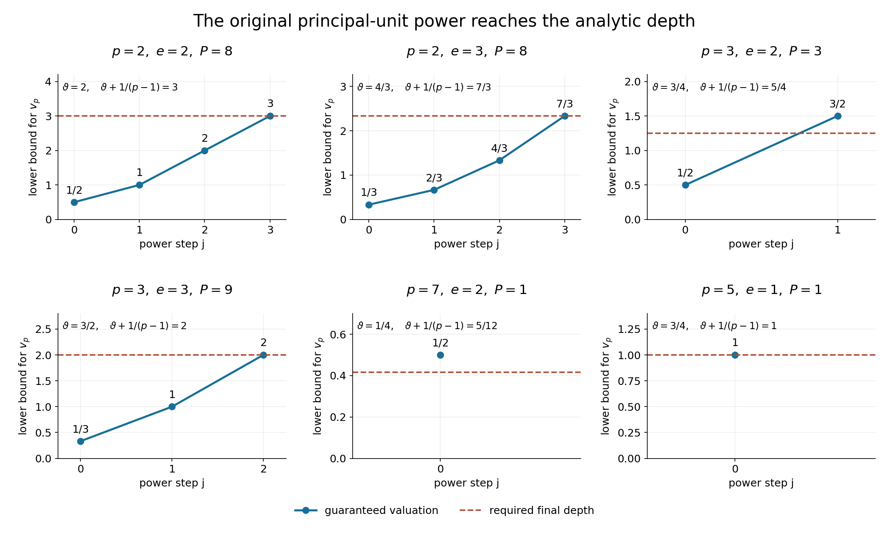

*Figure 10.16. Start with the smallest possible positive valuation \(1/e\) and iterate the guaranteed step \(c\mapsto\min\{pc,c+1\}\). The points show lower bounds, not claims that every step is attained by a unit. The horizontal line is the exact final depth \(\vartheta+1/(p-1)\); its special unramified branch is retained at \(p=5,e=1\). The zero-step case \(p=7,e=2\) is included. Lemma 10.81 proves all six bounds and all other ramification cases. Corollary 10.82 then permits every closed radius \(p^\theta\) with \(\theta<\vartheta\). See Solution 36, [the figure program](../figure_sources/principal_unit_depth.py), and [Yu's free paper](https://archive.ymsc.tsinghua.edu.cn/pacm_download/117/6782-11511_2013_Article_106.pdf), equations (2.1), (4.7) and (4.11), for further reading.*

## 29. The uniform clearing and Euler budget

The saturated coordinates explain the integer arguments of the Euler factors. Their full \(q^\nu\) multiplier matters for ordinary absolute values. Averaging the derivative orders then controls that multiplier and the additive lcm cost together.

### Euler arguments in a saturated basis

Let \(\beta_1,\ldots,\beta_n\in K^\times\), with \(n\ge2\) and positive heights \(h_j=h(\beta_j)\). Let \(A_0=(a_{ij})\) be an \(r\)-by-\(n\) integer matrix, \(2\le r\le n\), and suppose that the original independent bases \(\alpha_i\) of Section 26 have the form \(\alpha_i=\zeta_i\prod_j\beta_j^{a_{ij}}\), with roots of unity \(\zeta_i\), and that

\[
\sum_{j=1}^n|a_{ij}|h_j\le\sigma_i,\qquad
R_j=\frac{|b_n|}{h_j}+\frac{|b_j|}{h_n},
\qquad R_{\max}=\max_{1\le j<n}R_j.
\tag{10.218}
\]

Here \(b_j\in\mathbb Z\) and \(b_n\ne0\). The product and inverse height inequalities proved earlier give \(h(\alpha_i)\le\sigma_i\), as required in Section 26.

Let \(B\) be a column-basis matrix of the q-primary saturation lattice \(M\supseteq\mathbb Z^r\), of index \(J=q^\nu\). Suppose \(B\Lambda\) lies in a translated closed box of full widths \(D_i\). Fix \(\lambda_0\in\Lambda\), and write \(\mu=B\lambda,\mu_0=B\lambda_0\). For any selected indices \(j<n\), put

\[
\omega_j(\lambda)
=J\sum_{i=1}^r(b_na_{ij}-b_ja_{in})(\mu_i-\mu_{0i}).
\tag{10.219}
\]

**Lemma 10.84 (the original integer Euler arguments).** These are integer linear forms in \(\lambda-\lambda_0\). They are the eigenvalues of \(\sum_i(b_na_{ij}-b_ja_{in})Y_i\partial/\partial Y_i\) on the Laurent monomials \(Y^{J(\mu-\mu_0)}\). With the widths of (10.186),

\[
\Omega_j=\max_{\lambda\in\Lambda}|\omega_j(\lambda)|
\le J R_{\max}\sum_iD_i\sigma_i
=\frac{q^\nu\mathcal D R_{\max}}{c_1c_2Pd}.
\tag{10.220}
\]

**Proof.** The quotient \(M/\mathbb Z^r\) has order \(J\). The cyclic subgroup generated by any class has order dividing \(J\), because its distinct cosets partition this finite group into equal-sized sets. Hence \(J\) annihilates every class, and \(JB\) has integer entries. This proves integrality in (10.219). Acting on a Laurent monomial multiplies it by its integer exponent in the differentiated coordinate, which proves the eigenvalue identity, including negative exponents.

Both \(\mu\) and \(\mu_0\) lie in the same translated box, so \(|\mu_i-\mu_{0i}|\le D_i\). No extra factor two is needed for its full widths. Also
\[
|b_na_{ij}-b_ja_{in}|
\le |b_n||a_{ij}|+|b_j||a_{in}|
\le R_j\sigma_i.
\]
The last inequality uses separately \(|a_{ij}|h_j\le\sigma_i\) and \(|a_{in}|h_n\le\sigma_i\), which follow from (10.218). Sum over \(i\), and substitute \(D_i\sigma_i=\mathcal D/(c_1c_2rPd)\). This gives (10.220). \(\square\)

The same proof divides the bound by \(q^I\) when the full original widths have contracted by \(q^{-I}\). It keeps the original denominator-clearing multiplier \(J\).

### The combined mean cost

Use the full composition rows of Corollary 10.79, including duplicate Euler rows, and let \(t_0=\lfloor T\rfloor\ge1\). Retain its \(\overline u,\overline h\), and \(m=\sum_{j=1}^{r-1}\Omega_j+r-2\). Then \(\overline h>0\).

**Lemma 10.85 (one budget for clearing and Euler factors).** With \(\mathfrak v=\operatorname{lcm}(1,\ldots,k)\), put

\[
\begin{aligned}
\mathfrak a_{\rm av}
&=\max\left\{\ln\!\left[\mathrm e(1+m/\overline h)\right],
                   \frac12\ln\mathfrak v\right\},\\
E_{\rm mean}+\overline u\ln\mathfrak v
&\le t_0\mathfrak a_{\rm av}.
\end{aligned}
\tag{10.221}
\]

**Proof.** The exact composition means in (10.204) give
\[
\overline h+2\overline u
=\frac{r-1}{r}t_0+\frac{r+1}{r}\overline u
\le t_0,
\]
since \(\overline u\le t_0/(r+1)\). Formula (10.205) bounds the mean Euler logarithm by \(\overline h\ln[\mathrm e(1+m/\overline h)]\); the mean clearing logarithm is exactly \(\overline u\ln\mathfrak v\). Both are bounded by their respective multipliers times \(\mathfrak a_{\rm av}\). Adding proves (10.221). \(\square\)

For the original parameters, we can retain more information than the maximum in this lemma. Define

\[
W(d)=\begin{cases}
\ln^3(3d),&d\ge2,\\
\dfrac{\ln6}{\ln2\,\ln3},&d=1,
\end{cases}
\qquad
g_{91}=1+\frac{1+\ln W(d)}{g_0}.
\tag{10.222}
\]

Thus \(g_{91}\) is \(1+(1+3\ln\ln(3d))/g_0\) for \(d\ge2\). Assume in addition to Section 26 that

\[
h\ge\ln\!\left(\frac{R_{\max}}{dW(d)}\right),
\qquad c_0\ge19/10,\quad c_4\ge15/4,\quad
\widehat\vartheta\le2,
\qquad H_1=h+\nu\ln q.
\tag{10.223}
\]

The added height condition is exactly \(R_{\max}\le dW(d)\mathrm e^h\). It is the coefficient-height condition associated with (10.218).

**Theorem 10.86 (the original uniform mean Euler budget).** Under these assumptions,

\[
\begin{aligned}
\frac m{\overline h}
&\le\frac47\,\mathrm e^{H_1}tW(d)+\frac{r+1}{t_0},\\
\ln\!\left[\mathrm e(1+m/\overline h)\right]
&\le\left(g_{91}+\frac1{2(r-1)}\right)H_1,
\end{aligned}
\tag{10.224}
\]

and

\[
E_{\rm mean}+\overline u\ln\mathfrak v
\le g_{91}t_0H_1.
\tag{10.225}
\]

**Proof.** First \(T\ge g_4>9\). To verify the latter lower bound directly, the factor defining \(g_4\) is at least \(g_1^{-1}\). Insert \(g_3\) from (10.185), cancel \(c_1,g_1,t\), and use \(q\ge2,r+1\ge3,\rho\le58,a_*\ge7/2\) and \(r!\le r^r\). This gives
\[
g_4\ge\frac62\frac{2(19/10)(15/4)}{58}
                 \left(\frac72\right)^2
=\frac{8379}{928}>9.
\]
Consequently \(t_0\ge1\) and \(T/t_0<2\).

We have \(\overline h\ge(r-1)t_0/(r+1)\). Sum (10.220), use (10.223), and use \(T=q(r+1)\mathcal D/(c_1\theta et)\). Then
\[
\frac m{\overline h}
\le\mathrm e^{H_1}\frac{T}{t_0}
       \frac{\theta e}{P}\frac{tW(d)}{c_2q}+
       \frac{(r+1)(r-2)}{(r-1)t_0}.
\]
Indeed the factor \(d\) in \(R_{\max}\le dW(d)\mathrm e^h\) cancels the global degree in (10.220). Formula (10.184) gives \(\theta e/P\le1\), including its special unramified case, and \(c_2q\ge7/2\). These inequalities prove the first line of (10.224).

Both branches have \(W(d)\ge1\). For \(d\ge2\), \(\ln(3d)\ge\ln6>1\). For \(d=1\), use \(\ln6=\ln2+\ln3\) and \(\ln2<1\), so \(W(d)=1/\ln2+1/\ln3>1\). Since \(t\ge\ln2>2/3\) and \(H_1\ge(r+1)t\), we have \(r+1<3H_1/2\). Moreover \(H_1>39\) implies
\[
1+\frac{3H_1}{2}<\frac3{14}H_1^2
\le\frac37\mathrm e^{H_1}.
\]
The last inequality follows from the quadratic term of the positive exponential series. This absorbs the \(1+(r+1)/t_0\) term in the first line of (10.224), yielding
\[
1+m/\overline h\le
\mathrm e^{H_1}W(d)\max\{t,1\}.
\]
Take logarithms and add one. As \(H_1\ge g_0\), the constant \(1+\ln W(d)\) is at most \((g_{91}-1)H_1\). The function \(\ln z/z\) has maximum \(1/\mathrm e\) for \(z>0\), by differentiating. Hence
\(\ln\max\{t,1\}\le t/\mathrm e\le H_1/[\mathrm e(r+1)]\le H_1/[2(r-1)]\), since \(\mathrm e>2\). This proves the second line of (10.224).

The complete lcm bound in [Two logarithms II: explicit lower bounds](../TR-BAKER-07.html#an-exponential-bound-for-least-common-multiples) gives \(\ln\mathfrak v<k\ln3<(3/2)H_1\). Here \(k\le H_1\), and \(\ln3<3/2\) follows already from \(1+3/2+(3/2)^2/2>3\) in the positive exponential series.

Put \(a=g_{91}+1/[2(r-1)]\). We have bounded the combined mean by
\[
H_1\left[\frac{r-1}{r}(t_0-\overline u)a+
                       \frac32\overline u\right].
\]
This is affine in \(\overline u\), so its maximum on \([0,t_0/(r+1)]\) occurs at an endpoint. At zero its coefficient of \(t_0H_1\) is \((r-1)g_{91}/r+1/(2r)\le g_{91}\). At the other endpoint that coefficient is \(((r-1)g_{91}+2)/(r+1)\le g_{91}\). Both inequalities use \(g_{91}\ge1\). This proves (10.225). \(\square\)

### The full initial coefficient-height bound

**Corollary 10.87 (a uniform bound for all initial scalar rows).** Assume also the hypotheses of Theorem 10.75 and Corollary 10.77. An integral initial kernel with all required zeros can be chosen with mean scalar logarithm at most

\[
\ln\mathcal B_{\rm av}
=kL\ln\!\left[2\mathrm e\left(\frac{s_0}{k}+2\right)\right]
                    +g_{91}TH_1.
\tag{10.226}
\]

In particular

\[
\frac{\ln\mathcal B_{\rm av}}Z
\le\frac{1+g_5^{-1}}{c_1c_4}
                    +\frac{g_{91}}{c_1c_3\theta e}.
\tag{10.227}
\]

With \(d_0\) the actual row-field degree, its coefficients satisfy

\[
\begin{aligned}
\frac{h_2(\boldsymbol c)}Z\le{}&
\frac12g_8+\frac{\ln d_0}{2g_7}
                         +\frac{d_0-1}{c_1c_2S}\\
&+\frac1{c_{01}-1}\left[
\frac12g_8+\frac{1+g_5^{-1}}{c_1c_4}
+\frac{g_{91}}{c_1c_3\theta e}
+\frac{1+1/(2g_2)}{2c_1c_2}\right].
\end{aligned}
\tag{10.228}
\]

**Proof.** At every additive order, the first factor of (10.198) bounds its divided derivative before the lcm multiplier. Its logarithm is independent of the derivative allocation, so it also bounds its average. Theorem 10.86 bounds the mean lcm and Euler contributions together by \(g_{91}t_0H_1\le g_{91}TH_1\). This proves (10.226). Corollary 10.77 bounds its first normalized term. The exact parameter formulas give
\[
\frac{TH_1}{Z}=\frac1{c_1c_3\theta e},
\]
proving (10.227).

Use the full composition rows and their actual ratio \(\overline M/(N-\overline M)\) in (10.206). The column surplus (10.190) bounds that ratio by \(1/(c_{01}-1)\). Insert (10.227), \(\ln N/Z\le g_8\), \(Z\ge g_7\), and the exact mean-node bound from Corollary 10.72. This is (10.228), with every scalar, logarithmic, field-generator and torus cost retained. The row field and the integral nonzero coefficient conclusion are those of Lemma 10.63. \(\square\)

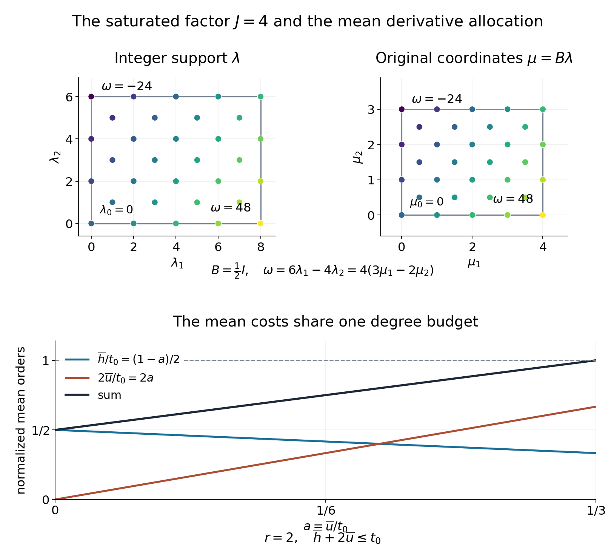

*Figure 10.17. Take the rational bases \(4,9\), their q-primary saturated generators \(2,3\), and \(J=4\). The map \(B=\tfrac12I\) sends the integer support on the left to its original coordinates in the upper right panel. Retain the phase class \(\lambda_1+\lambda_2\equiv0\pmod2\). With \((b_1,b_2)=(2,3)\), the prepared Euler argument is \(6\lambda_1-4\lambda_2=4(3\mu_1-2\mu_2)\). Its extrema at the reference \(\lambda_0=0\) are \(48\) and \(-24\), marked at the corresponding vertices. The lower panel shows the exact mean relation at \(r=2\): for \(a=\overline u/t_0\le1/3\), the normalized Euler mean is \((1-a)/2\) and their weighted sum \((1-a)/2+2a\) is at most one. Lemma 10.84 keeps the full clearing factor and original widths; Lemma 10.85 and Theorem 10.86 control the cost after averaging orders. The coordinates and values are reconstructed in Solution 37. [Figure program](../figure_sources/mean_clearing_euler.py). Human-source context: [Yu's free paper](https://archive.ymsc.tsinghua.edu.cn/pacm_download/117/6782-11511_2013_Article_106.pdf), equations (2.8), (4.23) and (5.6).*

## 30. The generator field and its uniform discriminant cost

The initial scalar bound is now uniform. We next control the field in which its coefficients are chosen. A large entry of a saturation basis can make its displayed generators have large heights while leaving the field unchanged. Centering the basis removes that loss. We then use the height-product theorem separately after each omission; the cancellation in \(S\mathcal D/d\) keeps its bound independent of the saturation index.

### A centered basis with small generator heights

**Lemma 10.88 (a centered saturation basis).** Let \(r\ge2\), and let \(M\supseteq\mathbb Z^r\) be a rational lattice of finite index \(J\). Suppose its basis \(B\) corresponds to generators \(\theta_1,\ldots,\theta_r\in K^\times\) in the independent original bases \(\alpha_1,\ldots,\alpha_r\), up to roots of unity. Put \(\sigma_{\max}=\max_i\sigma_i\), where \(h(\alpha_i)\le\sigma_i\).

There is a basis \(B'=BU\), with \(U\in\operatorname{GL}_r(\mathbb Z)\), that is upper triangular and has the following alternatives for each column:

\[
\begin{gathered}
B'_{ii}=1\quad\Longrightarrow\quad B'_i=e_i,\\
0<B'_{ii}<1\quad\Longrightarrow\quad
 B'_{ii}\le\tfrac12,\qquad
 |B'_{ji}|\le\tfrac12\quad(j<i),\qquad B'_{ji}=0\quad(j>i).
\end{gathered}
\tag{10.229}
\]

Choose \(\theta'_j=\prod_i\theta_i^{U_{ij}}\). Then

\[
\begin{aligned}
h(\theta'_j)&\le\sum_i|B'_{ij}|h(\alpha_i)
\le\frac r2\sigma_{\max},\\
E&=\mathbb Q(\alpha_0,\theta_1,\ldots,\theta_r)
=\mathbb Q(\alpha_0,\theta'_1,\ldots,\theta'_r),
\end{aligned}
\tag{10.230}
\]

for any root of unity \(\alpha_0\). This change preserves every normalized monomial, phase class, original support width and integer Euler argument after relabelling \(\lambda'=U^{-1}\lambda\).

**Proof.** The cyclic-subgroup coset argument in Lemma 10.84 shows that \(J\) kills \(M/\mathbb Z^r\). Thus \(L=JM\) is an integer lattice containing \(J\mathbb Z^r\). Let
\(L_i=L\cap\operatorname{span}(e_1,\ldots,e_i)\). Its i-th coordinate image is a nonzero subgroup \(h_i\mathbb Z\) containing \(J\mathbb Z\). Hence \(h_i\) is a positive divisor of \(J\).

Inductively choose \(v_i\in L_i\) whose i-th coordinate is \(h_i\). If \(h_i=J\), choose \(v_i=Je_i\), which belongs to \(L\). Otherwise, subtract integer multiples of \(v_{i-1},\ldots,v_1\), in that descending order, to place coordinate \(j<i\) in the interval \([-h_j/2,h_j/2]\). Ordinary integer division, with either consistent choice at a midpoint, makes this possible. Subtracting \(v_j\) does not change a coordinate larger than \(j\).

The vectors \(v_1,\ldots,v_i\) form a basis of \(L_i\). Indeed, for \(x\in L_i\), subtract the multiple of \(v_i\) specified by its i-th coordinate to obtain an element of \(L_{i-1}\), and use induction. Reading the largest coordinate proves independence. Thus \(B'=(v_1,\ldots,v_r)/J\) is a basis of \(M\). Its diagonal lies in \((0,1]\); a proper divisor \(h_i<J\) is at most \(J/2\). Every centered upper entry has absolute value at most \(h_j/(2J)\le1/2\). The special choice at \(h_i=J\) gives the first alternative in (10.229).

Both \(B\) and \(B'\) are integer bases of the same lattice, so expressing one in the other gives inverse integer matrices \(U,U^{-1}\). The chosen new generators and their inverse products therefore generate exactly the same field. Clear the denominators of \(B'\) and the finite root-of-unity factors by a common positive power. The height product inequality and exact power identity, already proved in the earlier height lesson, give the first inequality of (10.230). A proper-diagonal column has at most \(r\) entries of absolute value at most \(1/2\). A unit column gives height at most \(\sigma_{\max}\le r\sigma_{\max}/2\). This proves the second inequality.

Finally \(B'\lambda'=B\lambda\) and \((\theta')^{\lambda'}=\theta^\lambda\). With the phase vector transformed to \(d'=U^{\mathsf T}d\), we have \(d'\cdot\lambda'=d\cdot\lambda\). Original-coordinate differences, hence their full-width bounds and the integer Euler forms in (10.219), are unchanged. Taking the same integer products of chosen q-th roots also preserves their powers and generated root field; the inverse products recover the old roots. The uniqueness assertion in Corollary 10.83 preserves the principal root choices. \(\square\)

The unit-column alternative matters. Centering only the off-diagonal entries of a column with diagonal one would give the weaker \((r+1)\sigma_{\max}/2\). Choosing the coordinate unit vector avoids this extra half-height.

### Each omitted height product and the exact scale

Retain all parameters in (10.183)–(10.186). Write \(w_K\) for the full root-of-unity order, and define

\[
\begin{aligned}
g_{11}&=\frac{4q\mathrm e}{\rho}\,
c_0c_1c_3c_4a_*^r
\frac{(r+1)^{r+1}(r-1)^{r-1}}{(r!)^2}g_0g_1,\\
g_{12}&=\begin{cases}
g_1/(2g_7)+1/g_{11},&d\ge2,\\
0,&d=1.
\end{cases}
\end{aligned}
\tag{10.231}
\]

These are the original constants in Yu's equation (3.16); \(\mathrm e=\exp(1)\) is distinct from the ramification index.

**Lemma 10.89 (the original omitted-product bound).** For \(Z=S\mathcal D/d\) and every \(i=1,\ldots,r\),

\[
\begin{gathered}
d^r\ell_d\prod_{j\ne i}\sigma_j
\ge\frac{w_K}{\rho}
\frac{(r-1)^{r-1}}{(r-1)!\,\mathrm e^{r-1}},\\
\frac{2Z}{rd\sigma_i}\ge g_{11}.
\end{gathered}
\tag{10.232}
\]

**Proof.** Every subset of an independent multiplicative family is independent: a relation in that subset would extend by zero exponents to a relation in the full family. Apply the completely proved height-product inequality (10.57) to the \(r-1\) original bases other than \(\alpha_i\). Since \(\sigma_j\ge h(\alpha_j)\), replacing the heights preserves its lower bound. At \(d\ge2\), multiply by \(d^r\ell_d\) and use \(\ell_d\ge\ln d\). At \(d=1\), the proved constant is \(17=\rho\). This proves the first line of (10.232) for each omission separately.

For clarity the exact cancellation in the scale is

\[
\begin{aligned}
Z={}&\frac{c_3q(r+1)hA}{q^ut}
(1+\epsilon)(2+g_2^{-1})c_0c_1c_4
\left(\frac{c_2qPr(r+1)}{e\theta}\right)^r\frac1{r!}\\
&\quad{}\times
\max\left\{\frac{p^f}{\delta t^r},
\frac{\mathrm e^r}{r^r}t\right\}
d^{r+1}\ell_d\prod_j\sigma_j.
\end{aligned}
\tag{10.233}
\]

It follows by substituting \(S\) and \(\gamma\) in (10.186): the factors \(q^\nu\), \(h+x\) and \(A+x\) cancel exactly. Use \(h\ge g_0\), \(A\ge g_1\), \((1+\epsilon)(2+g_2^{-1})\ge2\), \(c_2qP/(e\theta)\ge a_*\), and the second member of the maximum. We obtain

\[
Z\ge
\frac{2q\mathrm e^r}{q^u}
c_0c_1c_3c_4a_*^r
\frac{(r+1)^{r+1}}{r!}g_0g_1
d^{r+1}\ell_d\prod_j\sigma_j.
\]

Divide by \(\sigma_i\), insert the first line of (10.232), and use \(w_K\ge q^u\). Multiplication by \(2/(rd)\), together with \(r(r-1)!=r!\), gives exactly \(g_{11}\) in (10.231). No bound on \(q^\nu\) has been inferred from an omitted product. \(\square\)

### A uniform coefficient-field and initial height bound

**Theorem 10.90 (the original field cost).** Let \(E=\mathbb Q(\alpha_0,\theta_1,\ldots,\theta_r)\subseteq K\) be the generator field of the normalized initial rows, and let \(d_E=[E:\mathbb Q]\). Then

\[
\frac{\ln|\Delta_E|}{2d_EZ}\le g_{12}.
\tag{10.234}
\]

Under the remaining hypotheses of Corollary 10.87, the initial rows have a nonzero integral kernel \(c\in\mathcal O_E^N\subseteq\mathcal O_K^N\) giving every original zero and the same nonzero-polynomial conclusion, with

\[
\begin{aligned}
\frac{h_2(c)}Z\le{}&
g_{12}+\frac{g_8}{2}\\
&+\frac1{c_{01}-1}\left[
\frac{g_8}{2}
+\frac{1+g_5^{-1}}{c_1c_4}
+\frac{g_{91}}{c_1c_3\theta e}
+\frac{1+(2g_2)^{-1}}{2c_1c_2}\right].
\end{aligned}
\tag{10.235}
\]

**Proof.** At \(d=1\), \(E=\mathbb Q\) and its discriminant is one. Suppose \(d\ge2\), and use the centered generators of Lemma 10.88. Apply the complete discriminant-and-generators argument (8.33) in [Linear forms in many logarithms](../TR-BAKER-08.html#the-discriminant-of-the-coefficient-field) to the tower obtained by first adjoining \(\alpha_0\), then the \(\theta'_j\). The first height is zero. The product of its nontrivial degrees is \(d_E\); induction on \((a-1)+(b-1)\le ab-1\) bounds the sum of the degree decrements by \(d_E-1\). Consequently

\[
\frac{\ln|\Delta_E|}{2d_E}
\le\frac{\ln d_E}{2}
+(d_E-1)\frac r2\sigma_{\max}.
\tag{10.236}
\]

Choose an index attaining \(\sigma_{\max}\). Lemma 10.89 gives \(r\sigma_{\max}/2\le Z/(dg_{11})\). Since \(d_E\le d\), the second term in (10.236), divided by \(Z\), is at most \((d_E-1)/(dg_{11})<1/g_{11}\). Also \(Z\ge g_7\) and \(\ln d_E\le\ln d<g_1\), so its first term is at most \(g_1/(2g_7)\). This proves (10.234), with the original \(g_{12}\).

Every initial row entry is its integer prepared scalar times
\(\alpha_0^{sw_\lambda}\theta^{Ps(\lambda-\lambda_0)}\), by (10.151), hence belongs to \(E\). Apply the complete weighted integral Siegel proof (8.40) over this field, allowing the full composition rows and retaining zero or duplicate rows as in Corollary 10.79. Their normalized heights do not change upon restriction to \(E\), by the field-invariance argument in Theorem 10.59. The resulting bound is the original row-sum inequality with discriminant term \(\ln|\Delta_E|/(2d_E)\).

Insert (10.234), \(\ln N/Z\le g_8\), the exact row ratio bounded by \(1/(c_{01}-1)\), the mean scalar bound (10.227), and the mean-node torus term in Corollary 10.72. This is (10.235). The vector is integral over \(E\), hence over \(K\); it is nonzero, and Lemma 10.29 gives the nonzero Laurent polynomial. The representative-row identities used in Theorem 10.55 supply every original jet zero. \(\square\)

The field bound uses the same \(g_{12}\) as the original argument. Equation (10.235) retains the complete mean scalar budget proved with \(\operatorname{lcm}(1,\ldots,k)<3^k\). A later individual prepared value still has its own scalar, denominator and field costs; averaging the initial rows does not change that value.

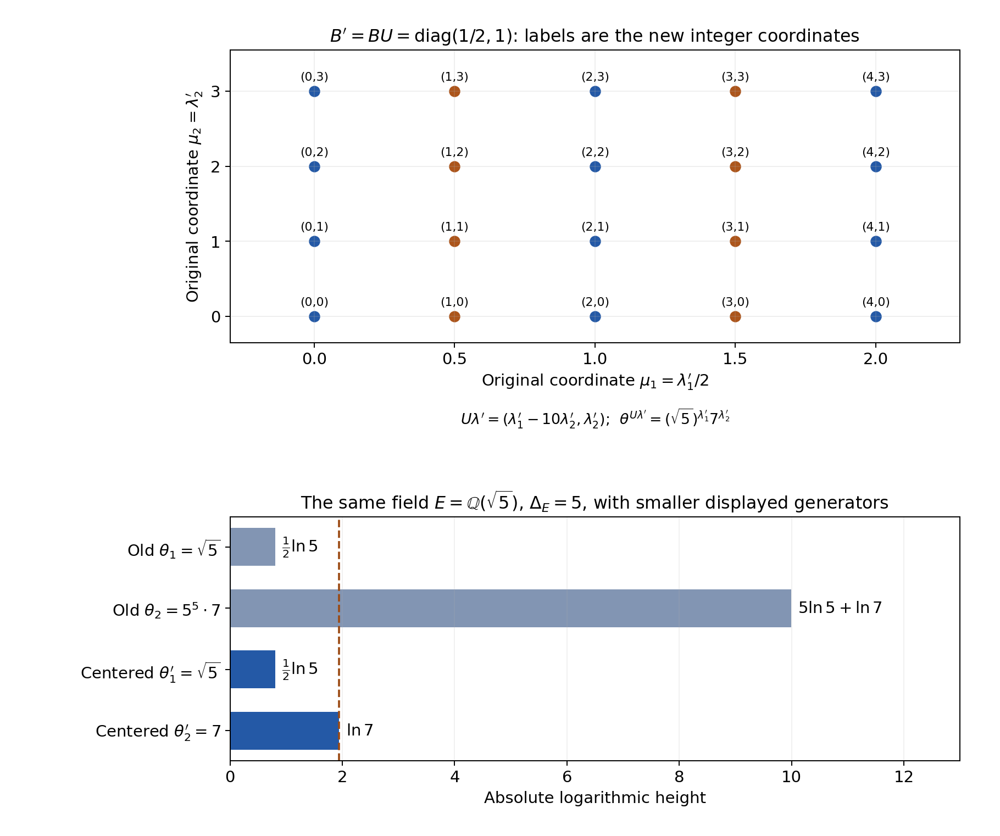

*Figure 10.18. Over \(K=\mathbb Q(\sqrt5)\), the original bases \(5,7\) have saturation lattice \((\tfrac12\mathbb Z)\times\mathbb Z\) and index two. The displayed basis \(B=\left(\begin{smallmatrix}1/2&5\\0&1\end{smallmatrix}\right)\) has generators \(\sqrt5,5^5\cdot7\). The integer matrix \(U=\left(\begin{smallmatrix}1&-10\\0&1\end{smallmatrix}\right)\) gives \(B'=BU=\operatorname{diag}(1/2,1)\) and generators \(\sqrt5,7\). The sampled lattice points, blue for an even first coordinate and brown for an odd one, are labelled by \(\lambda'\), with original coordinates \(B'\lambda'=(\lambda'_1/2,\lambda'_2)\). In the old basis they have labels \(U\lambda'\), producing exactly the same points and monomials. The height bars are numerical renderings of the labelled exact logarithms; the dashed line is the centered bound \(r\sigma_{\max}/2=\ln7\). Both lists generate the same quadratic field of discriminant five. Lemmas 10.88–10.89 and Theorem 10.90 prove the basis, omitted-product and field-budget mechanisms; Solution 38 checks this example and the normalized original constants. [Figure program](../figure_sources/initial_field_budget.py). Human-source context: [Yu's free paper](https://archive.ymsc.tsinghua.edu.cn/pacm_download/117/6782-11511_2013_Article_106.pdf), equations (3.16), (3.23) and Lemma 4.2; [Loher and Masser's free paper](https://www.impan.pl/shop/en/publication/transaction/download/product/82907), Theorem 3, whose complete height-product proof is given in Section 9.*

## 31. Individual scalar values and a complete integer extension

The initial coefficient estimate averages its rows. An individual value in the induction has its own additive order, ordinary absolute value and denominator. We retain these costs together with the actual derivative precision. At the end of this section, all three integer extensions of the original rational rank-two parameter example are verified uniformly over its permitted coefficient family.

### The actual projected slopes and the additive order

**Lemma 10.91 (normality at the original logarithmic slopes).** Let \(q\ne p\), \(\nu\ge0\), \(A_0=(a_{ij})\) an integer \(r\)-by-\(n\) matrix, and \(b_1,\ldots,b_n\in\mathbb Z\) with \(b_n\ne0\) and \(v_p(b_j)\ge v_p(b_n)\). Suppose \(z_j\in\mathbb C_p\) satisfy \(v_p(z_j)\ge\vartheta+1/(p-1)\), and \(0<\theta<\vartheta\). Put

\[
\begin{aligned}
u_i&=q^{-\nu}\sum_{j=1}^na_{ij}z_j,&
\mathcal L&=\sum_jb_jz_j,\\
w_i&=u_i-\frac{q^{-\nu}a_{in}}{b_n}\mathcal L
=q^{-\nu}\sum_{j<n}
\left(a_{ij}-\frac{b_j}{b_n}a_{in}\right)z_j.
\end{aligned}
\tag{10.237}
\]

Every \(u_i,w_i\) has valuation at least \(\vartheta+1/(p-1)>\theta+1/(p-1)\), with the convention \(v_p(0)=\infty\). Thus the normality hypotheses of Proposition 10.37 hold for the original and projected curves.

More precisely, retain its prepared family, \(\rho,c_*,\delta,k,L\), and let \(D_{\mathrm a}=kL\), \(\mathfrak v=\operatorname{lcm}(1,\ldots,k)\). For a fixed additive order \(u=t_0\le D_{\mathrm a}\), the following function is normal:

\[
\begin{aligned}
F_u(Z;\boldsymbol t)
&=\frac{\rho^{D_{\mathrm a}-u}(k!)^L}
{c_*\mathfrak v^u}\,f(Z/\rho;\boldsymbol t),\\
G_u&=(D_{\mathrm a}-u)\theta+Lv_p(k!)
-u v_p(\mathfrak v),\\
v_p\!\left(\frac{\rho^{D_{\mathrm a}-u}(k!)^L}
{c_*\mathfrak v^u}\right)&=G_u-\delta .
\end{aligned}
\tag{10.238}
\]

Its ordinary divided jets obey the chain-rule identity (10.107) with scale \(G_u-\delta\). For \(u>D_{\mathrm a}\), every prepared value is zero.

**Proof.** The fractions \(b_j/b_n\) are p-integral by their valuation hypothesis; \(q^{-\nu}\) is a local unit. Every displayed linear combination therefore has the asserted lower valuation, by the ultrametric inequality. In particular the projected slope does not lose \(v_p(b_n)\): the factors of \(b_n\) have already canceled in (10.237). The principal-unit depth proof in Lemma 10.81 and its logarithmic consequence in Corollary 10.82 supply these \(z_j\) when the original local units are used.

For the scale, the additive factor of a term is the coefficient of \(V^u\) in
\[
\frac1{(k!)^\ell}
\prod_{a=1}^k(q^{-I}Z/\rho+\lambda_{-1}+a+\mathfrak v V)^\ell,
\qquad 1\le\ell\le L,\quad 0\le\lambda_{-1}<k.
\]
Factoring \(\mathfrak v^u\) from that coefficient leaves an integer-coefficient polynomial in \(q^{-I}Z/\rho\), divided by \((k!)^\ell\), of degree at most \(k\ell-u\). Multiplication by the factor in (10.238) makes every coefficient p-integral: \(q\) is a local unit, \(k\ell-u\le D_{\mathrm a}-u\), and \(\ell\le L\). The ratios \(c_j/c_*\) are p-integral and the integer Euler factors introduce no denominator.

Every exponential factor has argument \(\beta Z/\rho\), where \(\beta\) is an integer linear combination of the \(w_i\). Its positive-degree coefficients tend to zero and have positive valuation, by Corollary 10.82. Its Gauss norm is one. Multiplication by the normalized polynomial, followed by the finite sum over the support, proves normality through Lemma 9.2. The chain rule proves the jet identity. The degree bound proves the final zero assertion. \(\square\)

The scale in (10.238) is allowed to have negative valuation; the prepared derivative already has the compensating local divisibility. The order-independent scale \(G_0-\delta\) remains valid, as proved in Proposition 10.37. We use that common scale in the numerical extension below.

### A factorial-preserving pointwise majorant

Take a support at contraction depth \(I\), and let \(\Omega_j\) be nonnegative integer bounds for its \(r-1\) integer Euler arguments. For \(|x|\le X\), define

\[
R_I=q^{-I}X+2k-1,\qquad
m_I=\sum_{j=1}^{r-1}\Omega_j+r-2,\qquad D_{\mathrm a}=kL.
\tag{10.239}
\]

**Theorem 10.92 (the individual scalar and denominator budget).** For a prepared index with additive order \(u\le D_{\mathrm a}\) and Euler order \(h=\sum_{j>0}t_j\), its rational scalar has ordinary absolute value at most

\[
\mathcal H_{I,u,h}(X)=
\frac{R_I^{D_{\mathrm a}-u}}{(k!)^L}
\mathfrak v^u\binom{D_{\mathrm a}}u
\binom{m_I+h}{h}.
\tag{10.240}
\]

Uniformly through total order \(T'\), its scalar bound is

\[
\mathcal H_I^{\rm fine}(X,T')=
\frac{R_I^{D_{\mathrm a}}}{(k!)^L}
\max_{0\le u\le\min(D_{\mathrm a},T')}
\left\{\left(\frac{\mathfrak v}{R_I}\right)^u
\binom{D_{\mathrm a}}u\binom{m_I+T'-u}{T'-u}\right\}.
\tag{10.241}
\]

A maximizing index is the first one after all consecutive increasing or constant steps. For \(u<\min(D_{\mathrm a},T')\), their exact test is

\[
\mathfrak v(D_{\mathrm a}-u)(T'-u)
\ge R_I(u+1)(m_I+T'-u).
\tag{10.242}
\]

At \(x=s/q^J\), \(s\in\mathbb Z\), all scalar denominators divide \(q^{\Xi_{I,J,u}}\), where

\[
\Xi_{I,J,u}=
\begin{cases}
0,&I+J=0,\\
\max\{0,(I+J)(D_{\mathrm a}-u)+Lv_q(k!)-u v_q(\mathfrak v)\},
&I+J>0.
\end{cases}
\tag{10.243}
\]

Suppose the normalized torus support has original full widths \(q^{-I}D_i\), \(h(\alpha_i)\le\sigma_i\), and the phase hypotheses of Theorem 10.55. Let the actual algebraic value \(V\) belong to a number field \(F\), with degree \(d_F\) and chosen local degrees \(e_F,f_F\). Its torus monomials are local units and arise from the consistent roots at \(x=s/q^J\). If \(V\ne0\), then

\[
\begin{aligned}
v_p(V)-\delta\le\frac{d_F}{e_Ff_F\ln p}\biggl[
&h_2(c)+\tfrac12\ln N+\ln\mathcal H_{I,u,h}(X)\\
&+\Xi_{I,J,u}\ln q
+P Xq^{-I}\sum_iD_i\sigma_i\biggr].
\end{aligned}
\tag{10.244}
\]

The field factor is retained even when these roots lie in the old completion.

**Proof.** Differentiate the product of \(k\ell\) linear factors at \(q^{-I}x+\lambda_{-1}\), dividing by \(u!\). Choosing the \(u\) differentiated factors gives \(\binom{k\ell}u\) terms. Every remaining factor has ordinary absolute value at most \(R_I\), since \(\lambda_{-1}\le k-1\) and \(a\le k\). Multiply by \(\mathfrak v^u\), retaining the denominator \((k!)^\ell\).

If \(u>k\ell\), the derivative is zero. Otherwise \(\binom{k\ell}u\le\binom{D_{\mathrm a}}u\) and
\[
\frac{R_I^{k\ell-u}}{(k!)^\ell}
=R_I^{-u}\left(\frac{R_I^k}{k!}\right)^\ell
\le\frac{R_I^{D_{\mathrm a}-u}}{(k!)^L},
\]
because \(R_I\ge k\) makes the parenthesized base at least one. The proved integer Euler generating-series estimate in Lemma 10.76 bounds their product at order \(h\) by \(\binom{m_I+h}h\). This proves (10.240). It increases with \(h\), so maximizing through \(u+h\le T'\) gives (10.241).

The ratio of consecutive terms inside this maximum is
\[
\frac{\mathfrak v}{R_I}
\frac{D_{\mathrm a}-u}{u+1}
\frac{T'-u}{m_I+T'-u}.
\]
Both variable factors are nonincreasing, and the first strictly decreases. At \(m_I=0\), the last factor is one wherever a step is taken; the terminal value has Euler binomial one. Thus (10.242) describes an initial interval of steps, including this endpoint case. For rational \(R_I\), integer division after clearing its denominator gives an exact binary search.

The scalar is integral at every prime other than \(q\), by the fractional-node argument of Lemma 10.28. At \(q\), the polynomial divided derivative has denominator dividing \((k!)^\ell\) and degree at most \(k\ell-u\). Evaluation at \(q^{-I-J}s+\lambda_{-1}\) costs at most \((I+J)(k\ell-u)\); its multiplier \(\mathfrak v^u\) recovers \(u v_q(\mathfrak v)\). Taking \(\ell\le L\) proves (10.243), with the globally integral \(I+J=0\) case stated separately.

Apply the completely proved nonzero-value product formula of Theorem 10.41 over \(F\), dividing by a coefficient of minimum valuation \(\delta\). Cauchy–Schwarz gives \(h_2(c)+\frac12\ln N\). The scalar bounds just proved give its archimedean and q-denominator terms. The full-width support proof in Theorem 10.64, with contraction as in Theorem 10.60, bounds the torus contribution by \(PXq^{-I}\sum_iD_i\sigma_i\). Taking consistent roots divides heights by \(q^J\), while the node numerator multiplies them by \(|s|\le q^JX\); these two factors cancel. The phase factors have height zero. Summing the place contributions and dividing by \(e_Ff_F\ln p\) gives (10.244). \(\square\)

### All three first integer extensions in the rational parameter family

**Theorem 10.93 (a complete rank-two integer block).** Use the original rational parameters and support of Solution 34, with bases \(2,5\) at three. Let \(b_1,b_2\ne0\) be integers satisfying

\[
\begin{gathered}
v_3(b_2)\le v_3(b_1),\qquad
R_{\max}=\frac{|b_2|}{\ln2}+\frac{|b_1|}{\ln5}
\le W\exp(h),\qquad
W=\frac{\ln6}{\ln2\,\ln3},\quad h=g_0,\\
\eta=1-\frac{0.538}{3}=\frac{1231}{1500},
\qquad U=\frac{8Z}{\ln3},\qquad Z=S\mathcal D .
\end{gathered}
\tag{10.245}
\]

Choose the integral initial kernel of Theorem 10.90 for this support and these Euler arguments. Assume \(v_3(2^{b_1}5^{b_2}-1)\ge U\). Then the same prepared auxiliary family, without contraction of its support, satisfies

\[
\Phi_0(s;\boldsymbol t)=0
\quad\text{for }|s|\le\lfloor2^jS\rfloor,\quad
|\boldsymbol t|\le\lfloor\eta^jT\rfloor,\qquad j=1,2,3.
\tag{10.246}
\]

The allowed coefficient family in (10.245), rather than one chosen pair \(b_1,b_2\), is covered by these comparisons.

**Proof.** Put \(\beta_1=-2,\beta_2=-5\), both in \(1+3\mathbb Z_3\), and
\(u_i=\log(\beta_i^3)\). Since \(\beta_1^3-1=-9\) and \(\beta_2^3-1=-126\), the exact logarithm valuation identity in Proposition 9.3 gives \(v_3(u_i)=2\). Here \(\nu=0\), \(P=3\), and \(\theta<3/2\). The hypothesis on the multiplicative difference forces \(b_1+b_2\) even by reduction modulo three. Hence
\(\mathcal L=b_1u_1+b_2u_2=3\log(2^{b_1}5^{b_2})\) has valuation at least \(U\).
The projected slopes are \(w_1=u_1\) and \(w_2=-(b_1/b_2)u_1\). Lemma 10.91 proves their enlarged-disc normality. The single selected Euler direction is \(b_2E_1-b_1E_2\), so Lemma 10.38 supplies its actual ordinary jet precision.

The coefficient height (10.235) is uniform over (10.245), since this is precisely the height condition of Theorem 10.86. It gives \(h_2(c)/Z\le0.310817025826\). Also \(k=50,L=35299,D_{\mathrm a}=1764950\), \(v_3(50!)=22\), and \(v_3(\mathfrak v)=3\). Set \(G_0=D_{\mathrm a}\theta+22L\).

For the induction from \(j\) to \(j+1\), write
\[
R_j=\lfloor2^jS\rfloor,\quad T_j=\lfloor\eta^jT\rfloor,\quad
n_j=2R_j+1,\quad \mu_j=T_j-T_{j+1}+1 .
\]
Then \(|\boldsymbol t|+\mu_j-1\le T_j\) for every output index. The initial case has every required zero by the kernel construction.

The height condition gives
\[
v_3(b_2)\le\frac{h+\ln W+\ln(\ln2)}{\ln3}<47 .
\]
This valuation is an integer, so it is at most46. Since every separation cost \(B_j=\lfloor\log_3(2R_j)\rfloor\) below is at most7, we may use \(M_0=46\) in (10.113). In particular \(U-v_3(b_2)>\theta+1/2\). The exact input budgets in Figure 10.19 satisfy
\[
U+G_0>n_j\mu_j\theta+\mu_jM_0,\qquad j=0,1,2.
\]
Corollary 10.40 therefore supplies the analytic valuation excess
\((n_j\mu_j-D_{\mathrm a})\theta-22L\) at every output index.

For the arithmetic bound, Lemma 10.84 and (10.245) give the common integer bound
\[
\Omega\le
\left\lceil\frac{\mathcal D}{c_1c_2P}W\exp(h)\right\rceil
\le1313846807806555244846459051 .
\]
Use this bound, \(\mathfrak v<3^{50}\), and Theorem 10.92 at \(I=J=0\), \(X=R_{j+1}\), \(T'=T_{j+1}\). There is no scalar denominator. The normalized torus values at integer nodes belong to \(\mathbb Q\), and their full-width height divided by \(Z\) is at most \(R_{j+1}/(c_1c_2S)\). Retain the coefficient term \(h_2(c)+\frac12\ln N\), with \(\ln N/Z\le g_8\).

The following are outward certified bounds, all valuation excesses divided by \(Z\). Their computation and every integer rounding are detailed in Solution 39.

| Extension | Analytic lower bound | Arithmetic upper bound |
| --- | ---: | ---: |
| \(j=0\) to \(1\) | 1.339613527059 | 1.269329770046 |
| \(j=1\) to \(2\) | 2.205396661115 | 1.946854665422 |
| \(j=2\) to \(3\) | 3.629068791040 | 3.349870794944 |

Each comparison is strict. If a prepared output value were nonzero, (10.244) would contradict its analytic lower bound. Indices of additive order exceeding \(D_{\mathrm a}\) are already zero. This proves the entire output range at each step, and induction proves (10.246). \(\square\)

This proves the integer block for the stated original rank-two parameter family. Fractional-node extraction, contracted supports, the other ranks and primes, the second stopping branch and the final multiplicity contradiction require their own comparisons.

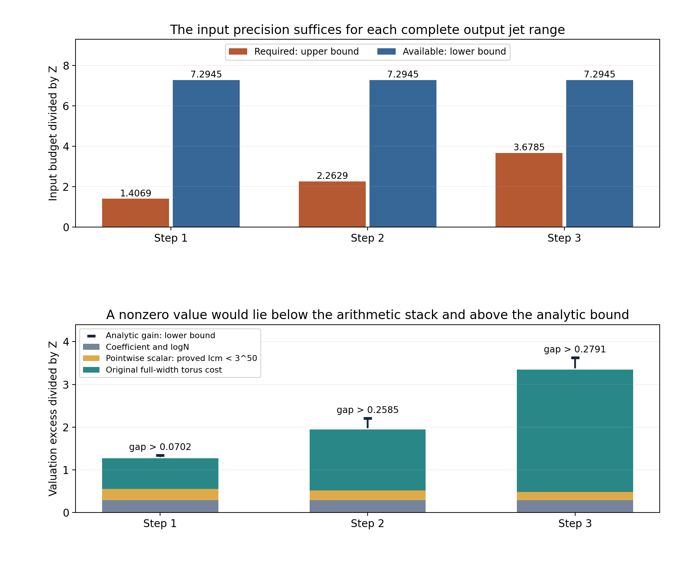

*Figure 10.19. The constants, floors and permitted coefficient family are those of (10.245), with \(k=50,L=35299\) and the proved clearing bound \(3^{50}\). Each upper panel pair compares the available lower input budget \((U+G_0)/Z\) with the required upper budget \((n_j\mu_j\theta+\mu_jM_0)/Z\). The lower stacks are certified upper bounds from the coefficient, individual scalar and full-width torus terms in (10.244); the black marks are the certified analytic lower bounds. Their strict gaps force zero values. These are bounds rather than sampled valuations of an auxiliary function. Lemma 10.91 proves actual normality, Theorem 10.92 proves the full pointwise budget, and Theorem 10.93 proves all three integer extensions. Solution 39 reconstructs every bound. [Figure program](../figure_sources/pointwise_precision_budget.py). Human-source context: [Yu's free paper](https://archive.ymsc.tsinghua.edu.cn/pacm_download/117/6782-11511_2013_Article_106.pdf), Lemma 5.2 and equations (5.25)–(5.38).*

## 32. Nested integer jets and the first fractional step

Earlier integer extensions retain more derivatives at their inner nodes. These derivatives can be used together. The following interpolation argument keeps the full nested distribution rather than assigning its smallest multiplicity to every node.

### Hermite interpolation on nested intervals

**Lemma 10.94 (nested normal-series interpolation).** Let \(0\le R_0<\cdots<R_m\) be integers and let \(\mu_0\ge\cdots\ge\mu_m\ge1\) be integers. Put

\[
\begin{aligned}
E_j&=[-R_j,R_j]\cap\mathbb Z,&
\mu(s)&=\mu_j\quad(s\in E_j\setminus E_{j-1}),\\
E_{-1}&=\varnothing,&
N_*&=(2R_0+1)\mu_0+
2\sum_{j=1}^m(R_j-R_{j-1})\mu_j .
\end{aligned}
\tag{10.247}
\]

Choose \(v_p(\rho)=\theta>0\), a normal series \(F\), and \(C\ge0\). Set \(B=\lfloor\log_p(2R_m)\rfloor\) when \(R_m\ge1\), and \(B=0\) when \(R_m=0\). Suppose
\(v_p(F_h(\rho s))+h\theta\ge\Lambda-hC\) for \(s\in E_m\) and \(0\le h<\mu(s)\). Then

\[
v_p(F(\rho x))\ge
\min\{N_*\theta,\ \Lambda-(\mu_0-1)\max\{B,C\}\}
\qquad(x\in\mathbb Z_p\subset\mathbb Q_p).
\tag{10.248}
\]

**Proof.** For \(s\in E_m\), form the rational polynomial
\[
L_s(X)=\prod_{\substack{t\in E_m\\t\ne s}}
\left(\frac{X-t}{s-t}\right)^{\mu(t)}.
\]
It has value one at \(s\) and a zero of order \(\mu(t)\) at every other node \(t\).
We claim
\[
v_p(L_s(x))\ge-(\mu_0-\mu(s))B\qquad(x\in\mathbb Z_p).
\]
The claim holds at a node by its zero or unit value, so consider a point that is not a node. Decompose the exponents as
\[
\mu(t)=\mu_m+\sum_{j=0}^{m-1}(\mu_j-\mu_{j+1})\mathbf1_{t\in E_j}.
\]
For a full integer interval, the counts in residue classes modulo \(p^a\) differ by at most one. If \(s\in E_j\), the contribution of that interval, omitting \(s\), at level \(a\) is
\[
N_a(x)-N_a(s)+1-\mathbf1_{x\equiv s\pmod{p^a}}\ge0.
\]
If \(s\notin E_j\), no node is omitted and the contribution is \(N_a(x)-N_a(s)\ge-1\). For \(a>B\), every denominator difference \(s-t\) has valuation less than \(a\), since \(0<|s-t|\le2R_m<p^a\); those remaining contributions are nonnegative. The base interval \(E_m\) always contains \(s\). Only increments belonging to intervals not containing \(s\) can lose valuation, and their sum is \(\mu_0-\mu(s)\). This proves the claim.

The formal Taylor inverse
\[
A_s(U)=L_s(s+U)^{-1}
=\prod_{t\ne s}(1+U/(s-t))^{-\mu(t)}
\]
has its degree-\(h\) coefficient of valuation at least \(-hB\). Each factor has integer binomial coefficients, and each denominator difference has valuation at most \(B\). Consequently the Hermite polynomial is
\[
H(\rho X)=\sum_{s\in E_m}L_s(X)
\sum_{h=0}^{\mu(s)-1}\rho^h F_h(\rho s)(X-s)^h
[A_s(X-s)]_{\le\mu(s)-1-h}.
\]
Its degree is at most \(N_*-1\), and its divided jets at each node agree with those of \(F\) through order \(\mu(s)-1\). A summand with inverse coefficient of degree \(a\le\mu(s)-1-h\) has valuation at least
\[
\Lambda-(\mu_0-\mu(s))B-hC-aB
\ge\Lambda-(\mu_0-1)\max\{B,C\}.
\]

For completeness, the normal quotient argument of Lemma 10.33 applies to the nonuniform root polynomial
\(W(Z)=\prod_s(Z-\rho s)^{\mu(s)}\).
Indeed \(W=Z^{N_*}-A\), where every coefficient of \(A\) has positive valuation. Write \(Q\) and \(R\) for quotient and remainder on division by \(Z^{N_*}\). Both have Gauss operator norm at most one. Let \(M_A\) mean multiplication by \(A\). The convergent series
\[
G=\sum_{j\ge0}(Q\circ M_A)^jQF
\]
is normal, because multiplication by \(A\) strictly decreases Gauss norm and the normal-series algebra is complete by Lemma 9.2. With \(H_0=R(F+AG)\), one has \(F=H_0+WG\), \(\deg H_0<N_*\), and \(H_0\) is normal. Its jets are the required jets. Uniqueness of the polynomial with those jets follows because a polynomial of degree less than \(N_*\) divisible by every \((Z-\rho s)^{\mu(s)}\) is zero. Thus \(H_0=H\).

Finally \(v_p(W(\rho x))\ge N_*\theta\), and \(G(\rho x)\) is integral. Combining this with the bound on \(H\) proves (10.248). \(\square\)

In the prepared-family setting, suppose the values at a node in the \(j\)-th interval are zero through total order \(T_j\). For a desired output order \(T'\), choose nonincreasing multiplicities \(\mu_j\le T_j-T'+1\). Lemma 10.38 and the common normality scale of Proposition 10.37 give the hypotheses of Lemma 10.94 with \(\Lambda=U-\beta+G_0\) and \(C=C_0\). If \(M_0=\max\{B,C_0\}\), then \(\beta\le M_0\), so the sufficient input inequality is

\[
U+G_0\ge N_*\theta+\mu_0M_0.
\tag{10.249}
\]

Under this inequality the prepared analytic valuation excess is at least \(N_*\theta-G_0\) at every \(x\in\mathbb Z_p\), for every total prepared order at most \(T'\). The comparison with the unprojected family uses the same projection estimate as Corollary 10.40; no new precision hypothesis is introduced.

### The original first fractional range

**Theorem 10.95 (the first fractional step for the rational family).** Under the hypotheses and with the initial family of Theorem 10.93, put \(S_1=\eta^{-3}S\), \(T_1^*=\eta^3T\). Then

\[
\Phi_0(s/2;\boldsymbol t)=0
\quad\text{for }\ |s|\le2(\lfloor S_1\rfloor+1)=1374,\qquad
|\boldsymbol t|\le\lfloor T_1^*\rfloor=993090.
\tag{10.250}
\]

This range uses the original unfloored \(S,T\), and the coefficient family is the whole family (10.245).

**Proof.** Theorem 10.93 and the initial construction give these nested integer data.

| \(j\) | Radius \(R_j\) | Available order \(T_j\) |
| --- | ---: | ---: |
| 0 | 379 | 1796752 |
| 1 | 758 | 1474535 |
| 2 | 1517 | 1210101 |
| 3 | 3034 | 993090 |

For output order \(T'=993090\), take
\[
(\mu_0,\mu_1,\mu_2,\mu_3)=(780000,481446,217012,1).
\]
Each multiplicity is at most the available order minus \(T'\) plus one. The ring counts are \(759,758,1518,3034\), hence \(N_*=1286383318\). Here \(B=7\), \(C_0\le46\), and \(M_0=46\). The certified bounds are
\[
\frac{N_*\theta+780000\cdot46}{Z}\le7.244899709935
<7.294535093395\le\frac{U+G_0}{Z}.
\]
Thus (10.249) holds. The analytic valuation excess at every fractional output argument, divided by \(Z\), is at least \(7.100020502185\). Division by two preserves membership in \(\mathbb Z_3\).

We must retain the field of these values. Put
\(\gamma_1=-8,\gamma_2=-125\) and
\(\eta_i=\exp(\tfrac12\log\gamma_i)\). Their logarithms have valuation two, so Lesson 9 proves that these are square roots in \(\mathbb Q_3\), each congruent to one. Their global field is
\[
F=\mathbb Q(\eta_1,\eta_2)
=\mathbb Q(\sqrt{-2},\sqrt{-5}),\qquad [F:\mathbb Q]=4.
\]
The two square classes are independent: \(-2,-5,10\) are all nonsquares, as their prime valuations or signs show. Equivalently, if \(\sqrt{-5}=a+b\sqrt{-2}\) with rational \(a,b\), squaring forces \(ab=0\); \(b=0\) would make \(-5\) a rational square, and \(a=0\) would make \(5/2\) a rational square. Both are impossible. This proves the degree. The chosen completion of \(F\) is \(\mathbb Q_3\), since \(F\subset\mathbb Q_3\) and \(\mathbb Q\) is dense there. Hence its chosen \(e,f\) are one. Every normalized monomial at \(s/2\) is a product of integer powers of \(\eta_1^s,\eta_2^s\), so every prepared value belongs to this ambient field. Individual values may belong to a proper subfield; the bound over \(F\) remains valid.

The outward parameter intervals give
\[
686.229279178168\le S_1\le686.229279178169.
\]
Thus \(X=687\) covers the entire output range. In Theorem 10.92 take \(I=0,J=1,R=X+99=786\), the same common Euler bound of Theorem 10.93, and \(T'=993090\). Its scalar maximum, using the proved upper clearing bound \(3^{50}\), occurs at additive order \(470396\), leaving Euler order \(522694\). The ratio tests are exact integer products. The entropy estimates proved in Solution 39, with the negative factorial logarithm retained, give
\(\ln\mathcal H_0^{\rm fine}/Z\le0.208379911543\).

Also \(v_2(50!)=25+12+6+3+1=47\). Equation (10.243) therefore gives the common denominator exponent
\[
\Xi_{0,1,u}\le D_{\mathrm a}+47L=3424003
\]
for every additive order. This deliberately retains a valid common upper bound; the order recovery can only improve it.

The four terms inside the arithmetic bracket of (10.244), divided by \(Z\), have the following certified upper bounds.

| Term | Upper bound |
| --- | ---: |
| Coefficient height and \(\tfrac12\ln N\) | 0.310842088027 |
| Individual scalar logarithm | 0.208379911543 |
| q-denominator logarithm | 0.008748404912 |
| Original full-width torus height | 0.714102914710 |

Multiplying their sum by the actual ambient global-to-local factor \(4/\ln3\), using the unrounded rational intervals before the final rounding, gives an arithmetic valuation excess at most \(4.522335429896Z\). It is strictly smaller than the analytic lower bound. Their gap exceeds \(2.577685072290Z\). Thus every nonzero prepared value would contradict (10.244); orders above \(D_{\mathrm a}\) are already zero. This proves (10.250). \(\square\)

This establishes the first fractional step for the stated original rank-two family. The following section completes its finite contraction chain and terminal contradiction; other parameter cases require separate arguments.

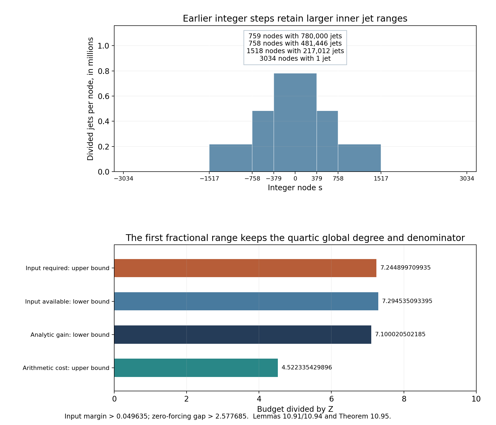

*Figure 10.20. Each unit cell in the upper panel represents one integer node, with constant height equal to its available multiplicity \(\mu(s)\); cell edges are half-integers. The exact interval radii are \(379,758,1517,3034\), and the four ring counts and multiplicities give \(N_*=1286383318\). The lower panel shows certified bounds divided by \(Z\): the input required is below the input available, and the arithmetic upper bound is below the analytic lower bound. The arithmetic cost includes the quartic ambient field and the full common q-denominator exponent \(3424003\). These are proved bounds, not sampled values of an auxiliary function. Lemma 10.94 proves the nested interpolation; Theorem 10.95 proves the exact original first fractional range; Solution 40 checks the Hermite basis and calculations. [Figure program](../figure_sources/nested_integer_jets.py). Human-source context: [Yu's free paper](https://archive.ymsc.tsinghua.edu.cn/pacm_download/117/6782-11511_2013_Article_106.pdf), Lemma 5.3.*

## 33. Seventeen contractions and a polynomial contradiction

The first fractional step can be repeated after restriction to an exponent coset. Three features make a complete finite descent possible for the family (10.245): the coefficients remain a subvector of the initial vector, the actual Euler arguments shrink with the support, and integer values return to the rational field. We first prove the interpolation estimate that uses the odd nodes together with two full intervals.

### Odd nodes inside nested full intervals

**Lemma 10.96 (mixed nested interpolation).** Let \(p\ne q\) be primes and \(1\le A\le R\) integers. Put

\[
\begin{aligned}
E_0&=\{s\in\mathbb Z:|s|\le A,\ q\nmid s\},&
E_1&=[-A,A]\cap\mathbb Z,&E_2&=[-R,R]\cap\mathbb Z,\\
\mu(s)&=\mu_0\quad(s\in E_0),&
\mu(s)&=\mu_1\quad(s\in E_1\setminus E_0),&
\mu(s)&=\mu_2\quad(s\in E_2\setminus E_1),
\end{aligned}
\tag{10.251}
\]

where \(\mu_0\ge\mu_1\ge\mu_2\ge1\). Define
\[
N_*=(2R+1)\mu_2+(2A+1)(\mu_1-\mu_2)
+|E_0|(\mu_0-\mu_1),\qquad
B=\lfloor\log_p(2R)\rfloor,\quad M=\max\{B,C\}.
\]
Suppose \(F\) is normal, \(v_p(\rho)=\theta>0\), \(C\ge0\), and
\(v_p(F_h(\rho s))+h\theta\ge\Lambda-hC\) for \(0\le h<\mu(s)\).
Then

\[
v_p(F(\rho x))\ge
\min\{N_*\theta,\ \Lambda-B(\mu_0-\mu_1)-(\mu_0-1)M\}
\quad(x\in\mathbb Z_p\subset\mathbb Q_p).
\tag{10.252}
\]

**Proof.** Write the multiplicity as
\(\mu_2+(\mu_1-\mu_2)\mathbf1_{E_1}+(\mu_0-\mu_1)\mathbf1_{E_0}\).
For a full integer interval, residue-class counts modulo \(p^a\) differ by at most one. For \(E_0\), they differ by at most two: subtract the counts of multiples of \(q\) from those of the full interval, and use that multiplication by \(q\) permutes residue classes modulo \(p^a\).

Use the cardinal polynomial
\[
L_s(X)=\prod_{\substack{t\in E_2\\t\ne s}}
\left(\frac{X-t}{s-t}\right)^{\mu(t)}
\]
from the proof of Lemma 10.94. At a residue level \(a\le B\), an interval containing \(s\) contributes
\(N_a(x)-N_a(s)+1-\mathbf1_{x\equiv s\ (p^a)}\).
This is nonnegative for a full interval and at least \(-1\) for the deleted interval \(E_0\). If \(x\equiv s\), it is zero; otherwise the asserted bounds follow from the respective count differences. A level not containing \(s\) contributes at least \(-1\) for a full interval and \(-2\) for \(E_0\). For \(a>B\), no denominator difference contributes and all remaining contributions are nonnegative. Therefore
\[
v_p(L_s(x))\ge
-B\bigl(\mu_0-\mu(s)+\mu_0-\mu_1\bigr).
\]
At a node this inequality also follows from its zero or unit value.

The coefficient of \(U^a\) in \(L_s(s+U)^{-1}\) has valuation at least \(-aB\), by the integer negative-binomial expansion proved in Lemma 10.94. In its Hermite formula, a term using the divided jet \(h<\mu(s)\) and inverse coefficient \(a\le\mu(s)-1-h\) consequently has valuation at least
\[
\Lambda-B(\mu_0-\mu(s)+\mu_0-\mu_1)-hC-aB
\ge\Lambda-B(\mu_0-\mu_1)-(\mu_0-1)M.
\]
The polynomial has degree less than \(N_*\) and the prescribed jets. The monic normal quotient proof of Lemma 10.94 applies unchanged to
\(W(Z)=\prod_{s\in E_2}(Z-\rho s)^{\mu(s)}\); it gives \(F=H+WG\) with \(G\) normal. Thus \(v_p(W(\rho x)G(\rho x))\ge N_*\theta\). This proves (10.252). \(\square\)

For the prepared family, \(\Lambda=U-\beta+G_0\), \(C=C_0\), and \(\beta\le M\). Hence a sufficient input condition is

\[
U+G_0\ge N_*\theta+\mu_0M+B(\mu_0-\mu_1).
\tag{10.253}
\]

It gives analytic valuation excess at least \(N_*\theta-G_0\), with the same projection comparison as Corollary 10.40. The last term in (10.253) is the cost of the odd-only data. It cannot be omitted by treating those nodes as a full interval.

### What each contraction preserves

**Proposition 10.97 (rational contraction invariants).** Start with the support and integral coefficients of Theorem 10.93, and use \(\gamma_1=-8,\gamma_2=-125\). Whenever the stage \(I\) family has exact zeros at \(s/2\), for odd \(s\), through total prepared order \(O\), one can choose a nonzero stage \(I+1\) family with exact integer zeros at those same odd \(s\) through order \(O\). At every stage choose a reference exponent carrying a coefficient of minimum three-adic valuation. Then

\[
\begin{gathered}
\delta_I=\delta_0,\qquad h_2(c_I)\le h_2(c_0),\qquad N_I\le N_0,\\
\operatorname{width}_i(\mathcal M_I)\le D_i/2^I,\qquad
0\in\mathcal M_I,\qquad
|\omega(\boldsymbol n)|\le\Omega_I:=
\left\lfloor\frac{\Omega_0}{2^I}\right\rfloor,\\
\Omega_0=1313846807806555244846459051,\qquad
\omega(\boldsymbol n)=b_2n_1-b_1n_2.
\end{gathered}
\tag{10.254}
\]

Each family is nonzero, has additive degree at most \(D_{\mathrm a}=1764950\), and has integral coefficients. Its normality scale remains \(G_0-\delta_0\), with \(C_0\le46\). Integer prepared values belong to \(\mathbb Q\); fractional values at \(s/2\) belong to the fixed field \(F=\mathbb Q(\sqrt{-2},\sqrt{-5})\), whose global-to-local factor at the chosen three-adic place is four.

**Proof.** Theorem 10.95 proves that \(1,\eta_1,\eta_2,\eta_1\eta_2\) are independent over \(\mathbb Q\), where \(\eta_i^2=\gamma_i\). For odd \(s\), reducing powers of \(\eta_i^s\) modulo two multiplies these four basis elements by nonzero rational factors. Thus an exact zero splits into four exact exponent-coset zeros. Choose a coset containing a coefficient of valuation \(\delta_0\), with exponent \(\boldsymbol m_*\), and set \(\boldsymbol n=(\boldsymbol m-\boldsymbol m_*)/2\). Theorem 10.48 proves that the new coefficients are precisely the selected old coefficients, with no mixing.

The old Euler argument is \(2\omega(\boldsymbol n)+\omega(\boldsymbol m_*)\). Lemma 10.30 expands its binomial polynomials in the new binomial basis. The triangular matrix and its inverse lie in \(\mathbb Z[1/2]\), are three-integral, and preserve total order. Their diagonal entries are powers of two. They carry all extracted zero jets to all new zero jets without lowering \(O\). The additive factor at the old argument \(s/2\) is exactly the stage \(I+1\) factor at \(s\):
\(2^I\mathfrak v\,\partial_X\) cancels the scaling \(2^{-I}\) in each divided derivative. The factored root monomial is a local unit.

The chosen subvector retains \(\delta_0\), integrality and the projective-height bounds of Theorem 10.48. It contains a nonzero coefficient, and the additive-basis independence of Lemma 10.29 proves the new polynomial nonzero. Its support contains \(\boldsymbol n=0\), and every coordinate width is divided by two. Induction gives (10.254). Since zero is a reference inside the support,
\[
|b_2n_1-b_1n_2|\le
2^{-I}(|b_2|D_1+|b_1|D_2)\le2^{-I}\Omega_0;
\]
the left side is an integer.

The ordinary analytic torus uses the same \(\log\gamma_i\), the same projected slopes and integer exponents \(\boldsymbol n\). The proof of Lemma 10.91 therefore supplies the same normality scale. Powers of two in additive differentiation are three-adic units, so the ordinary-jet loss in Lemma 10.38 still uses \(C_0\le46\). At integers the torus is \(\gamma_1^{sn_1}\gamma_2^{sn_2}\), hence rational. At \(s/2\) it is \(\eta_1^{sn_1}\eta_2^{sn_2}\). No further roots are introduced when a support is contracted: the torus bases remain \(\gamma_i\). The global field is always the same quartic field proved in Theorem 10.95, with chosen completion \(\mathbb Q_3\). This proves all the assertions. \(\square\)

The inverse Euler change is three-integral, but need not be integral at two. It does not change the coefficient vector of the new polynomial. The height estimate below is applied directly to its new integer Euler arguments; it does not charge that jet-change matrix as an extra polynomial coefficient.

### All stages with their original radii and orders

**Theorem 10.98 (complete finite contraction chain).** Under the contradiction hypothesis of Theorem 10.93, there are nonzero contracted families satisfying Proposition 10.97 for \(I=1,\ldots,17\). Define from the original real parameters

\[
\begin{aligned}
S_I&=\eta^{-3I}S,& T_I&=\eta^{3I}T,&
O_j&=\lfloor\eta^jT_I\rfloor\quad(0\le j\le3),\\
A_I&=2(\lfloor S_I\rfloor+1),&
R_I&=\lfloor4S_I\rfloor,&
X_I&=\lfloor S_I/\eta^3\rfloor+1 .
\end{aligned}
\tag{10.255}
\]

The stage \(I\) family vanishes at every odd integer \(|s|\le A_I\) through order \(O_0\), at every integer \(|s|\le A_I\) through order \(O_1\), at every integer \(|s|\le R_I\) through order \(O_2\), and at every \(s/2\) with \(|s|\le2X_I\) through order \(O_3\).

**Proof.** Theorem 10.95 and Proposition 10.97 give the first odd-node input. We give all estimates for the induction.

For closure of the odd-node set, let \(n=A_I\), \(\mu=O_0-O_1+1\), \(B=\lfloor\log_3(2A_I)\rfloor\), and \(M=\max\{46,B\}\). The radius \(A_I\) is even, so it contains exactly \(A_I\) odd nodes. The deleted-node interpolation of Lemma 10.39, with its proved residue-count loss, has sufficient input and analytic gain

\[
\begin{aligned}
\mathcal B_{I,0}&=n\mu\theta+\mu(B+M),&
\mathcal G_{I,0}&=n\mu\theta-G_0.
\end{aligned}
\tag{10.256}
\]

Indeed its Hermite loss is \(\mu B+(\mu-1)M\); adding \(\beta\le M\) proves the stated sufficient bound. This fills the even nodes as well. For extension from the full interval \(A_I\) to \(R_I\), take \(n=2A_I+1\), \(\mu=O_1-O_2+1\), and the same \(B,M\). Full-interval interpolation gives

\[
\mathcal B_{I,1}=n\mu\theta+\mu M,\qquad
\mathcal G_{I,1}=n\mu\theta-G_0.
\tag{10.257}
\]

For the next fractional step use Lemma 10.96 with \(q=2\), \(A=A_I\), \(R=R_I\), and

\[
\begin{aligned}
\mu_0&=\lfloor780000\eta^{3I}\rfloor,&
\mu_1&=O_1-O_3,&\mu_2&=O_2-O_3,\\
N_*&=(2R_I+1)\mu_2+(2A_I+1)(\mu_1-\mu_2)
+A_I(\mu_0-\mu_1),\\
\mathcal B_{I,2}&=N_*\theta+\mu_0M+B(\mu_0-\mu_1),&
\mathcal G_{I,2}&=N_*\theta-G_0,
\end{aligned}
\tag{10.258}
\]

where now \(B=\lfloor\log_3(2R_I)\rfloor\). For all seventeen stages, the exact floors give
\(\mu_0\ge\mu_1\ge\mu_2\ge1\) and \(\mu_0\le O_0-O_3+1\).
The smaller choices \(\mu_1=O_1-O_3\), \(\mu_2=O_2-O_3\) are valid: each is below the available order difference plus one. They do not lower the output order \(O_3\). All \(s/2\) in the asserted range belong to \(\mathbb Z_3\).

Here is the arithmetic estimate used for each output comparison. Let its total order be \(O\), its absolute argument bound be \(X\), and put \(J=0\) for integers, \(J=1\) for half-integers. Take respectively
\[
(O,X,J)=(O_1,A_I,0),\ (O_2,R_I,0),\ (O_3,X_I,1).
\]
Set \(r=X/2^I+99\), \(D=D_{\mathrm a}\), and \(V=3^{50}\). The pointwise scalar bound in Theorem 10.92 is

\[
\mathcal H_I(O,X)=\max_{0\le u\le\min\{D,O\}}
\frac{r^{D-u}}{(50!)^L}\binom Du V^u
\binom{\Omega_I+O-u}{O-u}.
\tag{10.259}
\]

Keep the uniform denominator exponent
\(\Xi_{I,J}=(I+J)D+47L\), which bounds (10.243) at every order. Proposition 10.97 and Theorem 10.92 give the nonzero-value upper bound

\[
\begin{aligned}
\mathcal A_{I,J}(O,X)
&=\frac{d_J}{\ln3}\Bigl(
0.310817025826Z+\tfrac12g_8Z+\ln\mathcal H_I(O,X)\\
&\hspace{18mm}+\Xi_{I,J}\ln2+
\frac{Z(X/2^I)}{1.4494\cdot1.75S}\Bigr),\\
d_0&=1,\qquad d_1=4.
\end{aligned}
\tag{10.260}
\]

The coefficient term is the uniform bound of Theorem 10.93; shrinking the vector can only improve it. The last term is the original full-width torus bound after \(I\) contractions. The common clearing term retains \(v_2(50!)=47\). Integer values use the actual rational field; every fractional value is bounded over the fixed quartic field. This explains every term in (10.260).

The next table gives an upper bound for \(\max_j\mathcal B_{I,j}/Z\) and a lower bound for the minimum of the three gaps \((\mathcal G_{I,j}-\mathcal A_{I,j})/Z\), with the respective output arguments above. The common available input is
\((U+G_0)/Z\ge7.294535093395\).

| \(I\) | Maximum required input, upper bound | Minimum zero-forcing gap, lower bound |
| --- | ---: | ---: |
| 1 | 7.192833169904 | 0.240138949661 |
| 2 | 7.156267657061 | 0.358632162785 |
| 3 | 7.136548280236 | 0.444858960780 |
| 4 | 7.125498620658 | 0.510791197596 |
| 5 | 7.119172043534 | 0.563520072068 |
| 6 | 7.115527327639 | 0.607407734375 |
| 7 | 7.113058026427 | 0.644775387448 |
| 8 | 7.112111071831 | 0.677281716283 |
| 9 | 7.112117675512 | 0.705361309159 |
| 10 | 7.109803325816 | 0.730342112918 |
| 11 | 7.110367794024 | 0.754317954142 |
| 12 | 7.105538214081 | 0.775918682856 |
| 13 | 7.095336861199 | 0.798823134852 |
| 14 | 7.111140057941 | 0.818899480846 |
| 15 | 7.120519275568 | 0.839066755948 |
| 16 | 7.021962525897 | 0.912928544835 |
| 17 | 7.002483730960 | 0.985921533843 |

These are outward rational bounds. Solution 41 gives their calculation from the convergent series and exact integer ratio tests already proved in Solutions 34 and 39. In particular the maximum in (10.259) is bounded without floating-point exponentiation or constructing the enormous Euler binomial. Both input and zero-forcing comparisons hold at every one of the fifty-one entries.

Interpolation now gives excess at least \(\mathcal G_{I,j}\). If a respective prepared value were nonzero, (10.260) would bound its excess by a strictly smaller quantity. Thus each closure, extension and fractional output is zero through its stated order. For odd output numerators, Proposition 10.97 creates the next contracted family. Since
\(S_{I+1}=S_I/\eta^3\), \(T_{I+1}=\eta^3T_I\), its odd radius and order are exactly \(2X_I=A_{I+1}\) and \(O_3=\lfloor T_{I+1}\rfloor\). This proves the induction and all asserted ranges. \(\square\)

### The last support has one exponent

**Corollary 10.99 (a complete valuation bound for the stated family).** For every pair of nonzero integers \(b_1,b_2\) satisfying (10.245),

\[
v_3(2^{b_1}5^{b_2}-1)<\frac{8Z}{\ln3}.
\tag{10.261}
\]

**Proof.** Suppose the reverse inequality holds. Theorem 10.98 gives a nonzero stage-seventeen family. The original parameter bounds of Solution 34 are \(D_1<67805\), \(D_2<29202\). Both are smaller than \(2^{17}=131072\), so (10.254) gives integer coordinate widths zero. The support is nonempty and contains its reference zero, hence is exactly \(\{0\}\). The polynomial is therefore

\[
Q_{17}(X)=\sum_{a,\ell}c_{17,a,\ell}
\Delta(2^{-17}X+a;50)^\ell,\qquad
0\ne Q_{17},\qquad \deg Q_{17}\le1764950.
\tag{10.262}
\]

At this stage \(A_{17}=18092274\), \(O_1=61\). The full integer closure in Theorem 10.98 includes the prepared order \((0,0)\), so \(Q_{17}(s)=0\) at all \(36184549\) distinct integers in that interval. A nonzero degree-\(d\) polynomial has at most \(d\) distinct roots: at each root polynomial division gives a factor \(X-s\), and division by the preceding distinct factors leaves the next factor nonzero at the new root. Induction proves the root bound. It contradicts (10.262). Also \(2^{b_1}5^{b_2}\ne1\), since its two-adic valuation is the nonzero integer \(b_1\). Thus no infinite-valuation exception occurs, and (10.261) follows. \(\square\)

This proves a complete finite descent and contradiction for the entire rational coefficient family (10.245). Other ranks, fields, primes and parameter families require their own comparisons; this corollary does not assert the general Yu estimate (2.9) or its variants.

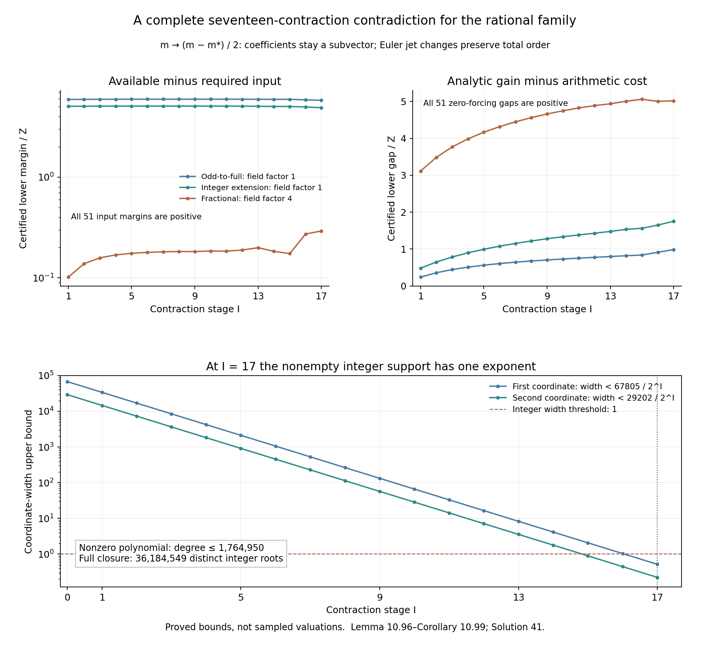

*Figure 10.21. At stage \(I\), restriction to a minimum-coefficient exponent coset sends \(\boldsymbol m\) to \((\boldsymbol m-\boldsymbol m_*)/2\), with the forward and inverse Euler changes preserving total jet order. The upper panels give certified lower margins for all three comparisons at each stage; they are bounds, not sampled valuations. Integer arithmetic uses global-to-local factor one, fractional arithmetic factor four at every stage. The lower panel shows the proved coordinate-width upper bounds \(D_i/2^I\); the horizontal line is width one. At seventeen both integer widths vanish, leaving the nonzero polynomial of degree at most1764950 with36184549 integer roots. Lemma10.96, Proposition10.97, Theorem10.98 and Corollary10.99 prove these mechanisms; Solution41 reconstructs the bounds. [Figure program](../figure_sources/first_contraction_budget.py). Human-source context: [Yu's free paper](https://archive.ymsc.tsinghua.edu.cn/pacm_download/117/6782-11511_2013_Article_106.pdf), Lemmas5.3–5.4 and the support passage in Section5.*

## 34. Uniform degree comparisons at the geometric stop

The general descent has a geometric stopping depth, where the multiplicity theorem produces fewer independent algebraic bases. Its degree comparisons can be proved uniformly from the height-product bound of Theorem 10.18. In particular, they require no additional individual-height theorem.

We use the parameters (10.183)–(10.186), writing \(a=r+1\), \(x=\nu\ln q\), and \(\ell_d=\max\{1,\ln d\}\). The independent bases \(\alpha_i\) belong to the same degree-\(d\) field, and \(\sigma_i\ge h(\alpha_i)>0\). Use the original choices of \(\widehat\vartheta\) in (10.184), and \(0\le\tau\le1/100\). The fixed case constants satisfy the following weaker rational bounds:

\[
\begin{gathered}
\frac{19}{10}\le c_0\le3,\qquad c_2\ge1,\qquad
c_3>\frac{47}{100},\qquad \frac{15}{4}<c_4<21,\\
a_*\ge\frac72,\qquad \rho\le58,\qquad
\theta\le\widehat\vartheta\le2,\qquad e\theta>\frac{49}{100},\\
\eta=1-\frac{c_5}{r+1}>\frac{18}{25},\qquad
1<q\eta^{r+1},\qquad q\eta^{2(r+1)}<1 .
\end{gathered}
\tag{10.263}
\]

The bound \(a_*\ge7/2\), rather than seven, includes the special unramified case \(p\ge5,e=1\).
For the geometric comparisons the relevant ranges of \(c_5\) are
\(0.5267\le c_5\le0.56\) at \(q=2\), and
\(0.753\le c_5\le0.827\) at \(q=3\).
The other rational bounds are direct comparisons with the fixed case constants.
The last two inequalities in (10.263), and all estimates used below, are proved explicitly.

Let \(I\) be any nonnegative integer with

\[
\begin{gathered}
E_I=(q\eta^{r+1})^I>\exp(3(A+x)),\\
\overline S=q\eta^{-(r+1)I}S,\qquad
\overline T=\eta^{(r+1)I+1}T,\qquad
\mathsf D_0=kL,\qquad
\mathsf D_j=2q^{\nu-I}D_j\quad(1\le j\le r).
\end{gathered}
\tag{10.264}
\]

The original geometric stopping choice is
\(I=\lfloor3(A+x)/\ln(q\eta^{r+1})\rfloor+1\).
The widths \(D_j\) and their normalization are exactly those in (10.186).
The positive real \(\mathsf D_j\) are upper coordinate-degree bounds; the actual degrees are integers.
For the ordinary jet budget set \(S^\circ=\lfloor\overline S\rfloor\),
\(T^\circ=\lfloor\overline T\rfloor\), and allocate

\[
S_0=\left\lfloor\frac{\overline S}{3}\right\rfloor,\qquad
S_j=\left\lfloor\frac{2\overline S}{3r}\right\rfloor\ (1\le j\le r),
\qquad
T_j=\left\lfloor\frac{\overline T}{r+1}\right\rfloor\ (0\le j\le r).
\tag{10.265}
\]

**Theorem 10.100 (all geometric-stop degree inequalities).** Under these hypotheses, the allocations satisfy (10.67), and

\[
\mathsf D_0>20\mathsf D_j\quad(1\le j\le r),\qquad
\mathsf D_0>4\overline T,\qquad
\mathsf D_0>4r.
\tag{10.266}
\]

Consequently \(\mathsf D_0>\max\{\mathsf D_1,\ldots,\mathsf D_r,T_r+r\}\).
For every \(1\le m<r\) and every \(m\)-element subset \(J\), define the ratios

\[
\begin{aligned}
\mathcal R_0&=\frac{(S_0+1)(T_0+1)}{\mathsf D_0},\\
\mathcal R_{m,J}
&=\frac{(S_m+1)\binom{T_m+m+1}{m+1}}
{(m+1)!\mathsf D_0\prod_{j\in J}\mathsf D_j},\\
\mathcal R_r
&=\frac{(S_r+1)\binom{T_r+r}{r}}
{(r+1)!\mathsf D_0\prod_{j=1}^r\mathsf D_j}.
\end{aligned}
\tag{10.267}
\]

They satisfy the uniform strict bounds

\[
\mathcal R_0>\frac{36}{25},\qquad
\mathcal R_{m,J}>8\quad(1\le m<r),\qquad
\mathcal R_r>31.
\tag{10.268}
\]

Thus every allocation and degree hypothesis of Theorem 10.25 holds, for every original rank, field and prime parameter case.

**Proof.** We keep the ramification index \(e\) distinct from \(\mathrm e=\exp(1)\).
The power-series proof of the logarithm gives \(\ln2>2/3\) and \(\ln3>1\). Hence \(t=f\ln p>2/3\), and \(A\ge g_1>5\).
Also \(2<\mathrm e<3\): the exponential series gives the lower bound, while
\(n!\ge2\cdot3^{n-2}\) for \(n\ge2\) bounds its tail by a geometric series.
For \(d\ge1\) one has \(\ell_d\le d\), since \(\ln d<d\).

First check (10.263). The inequalities for \(c_5\) give \(\eta>18/25\).
For fixed \(0<c<3\), the function \((1-c/y)^y\) increases for \(y\ge3\).
Its logarithmic derivative is
\(\ln(1-c/y)+(c/y)/(1-c/y)>0\): writing \(z=c/y\), the derivative of
\(\ln(1-z)+z/(1-z)\) is \(z/(1-z)^2>0\), and its value at zero is zero.
Therefore \(q\eta^{r+1}\) is bounded below by
\(2(61/75)^3>1\) at \(q=2\), or by
\(3(2173/3000)^3>1\) at \(q=3\).
On the other hand, \(\ln(1-z)<-z\) gives
\(q\eta^{2(r+1)}<q\exp(-2c_5)<1\).
For the last comparison it suffices that \(\ln2<7/10\), \(\ln3<11/10\); the finite positive exponential sums at \(7/10\) through degree four and at \(11/10\) through degree six already exceed two and three, respectively.
Finally \(e\vartheta\ge1/2\) by (10.184), so
\(e\theta\ge50/101>49/100\). The stated upper bounds for \(\widehat\vartheta\) were proved there.

### Small uniform parameter bounds

The two alternatives in \(g_2\) give \(g_2>1\).
For the first use \(c_3>47/100,q\ge2,r+1\ge3,d\ge1\).
For the second, \(g_0>39,e\ge1\), and \(p\in\{2,3,5\}\), with
\(\ln5<2\). The latter follows from the finite exponential sum at two through degree three.

Let
\[
F_r=\frac{r^r(r+1)^r}{(r!)^2}.
\]
Since \(r!\le r^r\), one has \(F_r\ge(1+1/r)^r>2\).
The definitions (10.185) consequently imply

\[
\begin{gathered}
g_5>
\frac{893}{7250}(r+1)\left(\frac72\right)^r>2r,\qquad
g_4>\frac{57}{116}(r+1)\left(\frac72\right)^r>r(r+1),\\
1+\epsilon<\exp(1/2)<2,\qquad
1+g_5^{-1}<\frac54.
\end{gathered}
\tag{10.269}
\]

Indeed \(g_5=(2c_0c_3q/\rho)(r+1)a_*^rF_r\).
For its second inequality the ratio
\((r+1)(7/2)^r/r\) increases: its consecutive ratio is
\((7/2)r(r+2)/(r+1)^2\ge28/9\).
At \(r=2\) the displayed lower bound is \(131271/29000>4\).
For \(g_4\), its extra factor in (10.185) is at least \(g_1^{-1}\), and \(\widehat\vartheta\le2\).
Thus \(g_4>(qc_0c_4/\rho)(r+1)a_*^rF_r\), giving its displayed lower bound.
The function \((7/2)^r/r\) increases, and at two its comparison with \(r(r+1)\) reduces to \(2793/928>1\).
The bound on \(\epsilon\) follows from its defining power and \(\ln(1+z)<z\).
Since \(\mathrm e<3\), also \(\exp(1/2)<2\).

Lemma 10.70 and \(k\ge39\) now give
\(\mathsf D_0=kL>kg_5>78r\).
They also give the two useful bounds
\[
\frac{S\mathcal D}{c_1c_4d(A+x)}
<\mathsf D_0
<\frac54\frac{S\mathcal D}{c_1c_4d(A+x)}.
\]

### Dominance of the additive degree

For a non-torsion \(\alpha_i\), Theorem 10.18 with one base, its saturation index at least one, and \(w_K\ge2\), gives
\[
\sigma_i\ge\frac{2}{58\mathrm e\,d^2\ell_d},
\qquad d\sigma_i>\frac1{87d^2}.
\]
At \(d=1\), weakening its proved constant17 to58 preserves the bound.
Thus no sharper individual-height result is needed.

Because \(q\eta^{2(r+1)}<1\), we have
\(\eta^{-(r+1)I}>E_I>\exp(3(A+x))\).
Also \(q^{I-\nu}> \exp(3A)\).
From the definitions of the two degree bounds,

\[
\frac{\mathsf D_0}{\mathsf D_j}
>\frac{c_3c_2qr(r+1)P}{2c_4}\,
d\sigma_j\,\frac{h+x}{A+x}\,\frac{q^{I-\nu}}t.
\]

Here \(c_2P\ge1\), \((h+x)/(A+x)\ge39/(A+39)\), and \(t\le A\).
Use \(\exp(3A)\ge\exp(2g_1)\exp A
=\mathrm e^8(r+1)^2d^2\exp A\).
The function \(\exp A/[A(A+39)]\) increases for \(A\ge5\), by its logarithmic derivative.
The ratio is therefore larger than
\[
\frac{47}{350}\,\frac{9\cdot256}{87}\,
\frac{39\cdot32}{5\cdot44}
=\frac{135143424}{6699000}>20.
\]

Similarly the additive degree divided by the real output order satisfies

\[
\frac{\mathsf D_0}{\overline T}
>\frac{c_3e\theta}{c_4}\frac{h+x}{A+x}
\eta^{-1}\eta^{-(r+1)I}
>\frac{47}{100}\frac{49}{100}\frac{39}{21\cdot44}\,2^{15}>4.
\]

The function \(\exp(3A)/(A+39)\) is increasing for \(A\ge5\); this justifies its endpoint bound in the second line.
Together with \(\mathsf D_0>4r\), these inequalities imply
\(\mathsf D_0>2(\overline T+r)>T_r+r\).

### Every allocation inequality

The floor definitions in (10.265) have integer sums at most \(\overline S,\overline T\), hence at most \(S^\circ,T^\circ\).
They are nonincreasing because \(r\ge2\).
Moreover
\[
S_0+1>\overline S/3,\qquad
S_j+1>2\overline S/(3r),\qquad
T_j+1>\overline T/(r+1).
\]
The binomial product gives
\(\binom{T_j+b}{b}\ge(T_j+1)^b/b!\) for every positive integer \(b\).
These strict floor bounds retain all integer losses.

Put \(\lambda=1+g_5^{-1}<5/4\).
For \(m=0\), substitution and cancellation give

\[
\mathcal R_0>
B_0:=\frac{q^2\eta c_4d(A+x)}{3\theta et\,\lambda}
>\frac{36}{25}.
\]

The last inequality uses \(d\ge e\), \(A+x\ge t\), \(q\ge2\), \(\eta>18/25\), \(c_4>15/4\), and \(\theta\le2\).

For \(1\le m<r\), retain every subset \(J\).
The same substitutions give
\[
\mathcal R_{m,J}>
\frac{2B_0}{r}\,
\frac{\prod_{j\in J}\sigma_j}{((m+1)!)^2}
\left(\frac{\eta c_2qPrd}{2e\theta t}
\frac{E_I}{q^\nu}\right)^m.
\]
All these subfamilies are independent, so Theorem 10.18 applies separately to each one:
\[
\prod_{j\in J}\sigma_j
\ge\frac{m^m}{29m!\mathrm e^m d^{m+1}\ell_d}.
\]
Furthermore \(E_I/q^\nu>\exp(3A)\), and

\[
\frac{\exp(3A)}t
>\frac{8192}{5}(r+1)^2d^2.
\]

Use \(c_2qP/(e\theta)\ge a_*\ge7/2\).
The expression in parentheses is larger than
\(2048r(r+1)^2d^3\).
Since \(\mathrm e<3\), \(m^m\ge m!\), and
\(d^{2m-1}\ge\ell_d\), dropping only positive factors gives
\[
\mathcal R_{m,J}>
\frac{72}{725}\left(\frac{2048}{3}\right)^m
\frac{(r+1)^{2m}}{r((m+1)!)^2}
\ge\frac{72}{725}\frac{(2048/3)^m}{(m+1)^3}>8.
\]
For the middle inequality use \((m+1)!\le(m+1)^{m+1}\), and the increase of
\((r+1)^{2m}/r\) for \(r\ge m+1\).
The last expression increases with \(m\ge1\): its consecutive ratio exceeds
\((2048/3)(2/3)^3>1\).
At \(m=1\) it is \(147456/17400>8\).

For \(m=r\), use the complete formula for \(\mathcal D\) in (10.186).
Write
\[
M=\max\{p^f/(\delta t^r),\,\mathrm e^rt/r^r\}.
\]
Since \(\delta\ge1\), \(t>2/3\), \(p^f=\exp t\le\exp A\), and \(r\ge2\),
\(M<\exp A(3/2)^r\).
The identities
\[
q^{rI}\eta^{(r-1)(r+1)I}=q^I E_I^{r-1}>E_I^r,
\qquad q^{\nu+u}/\gamma\ge1
\]
retain the saturation factors before they are bounded.
Cancellation of \(\mathcal D\) yields
\[
\mathcal R_r>
\frac{8\eta^r\exp((3r-1)A)}
{135r(r+1)!\,[3(r+1)t]^r\ell_d}.
\]
Indeed the remaining factor
\(3\lambda(1+\epsilon)(2+g_2^{-1})c_0\) is less than \(135/2\).
Now \(t\le A\), \(\exp A/A>32/5\), and
\(\exp((2r-1)A)\ge[\mathrm e^4(r+1)d]^{2r-1}\).
Using \((r+1)!\le(r+1)^{r+1}\) gives
\[
\mathcal R_r>
\frac{8(192/125)^r16^{2r-1}}{135r(r+1)^2}>31.
\]
At \(r=2\) the last expression exceeds31.
Its consecutive ratio is
\((192/125)16^2r(r+1)/(r+2)^2>1\), because
\(r(r+1)/(r+2)^2\ge3/8\).
This proves all three parts of (10.268), hence all the hypotheses asserted. \(\square\)

### The resulting bases remain in the original field

**Corollary 10.101 (weighted rank reduction at the geometric stop).** Suppose the contracted prepared family at the depth in (10.264) vanishes at every integer \(|s|\le\overline S\) through total order \(\overline T\). Suppose its independent torus bases and selected Euler directions give the hyperplane \(W\) of Theorem 10.25, with nonzero vector \(\boldsymbol B\).
Then there are \(1\le m<r\) and independent integral vectors \(u_1,\ldots,u_m\), whose rational span contains \(\boldsymbol B\). Put
\(\beta_i=\prod_j\alpha_j^{u_{ij}}\) and \(R_i=\sum_j\sigma_j|u_{ij}|\).
These are independent units in the original field, \(h(\beta_i)\le R_i\), and

\[
(S_m+1)\binom{T_m+m}{m}\prod_{i=1}^m R_i
\le(m+1)!r^m\mathsf D_0
\left(\frac{2q^{\nu-I}\mathcal D}{c_1c_2rPd}\right)^m.
\tag{10.270}
\]

If the original multiplicative form satisfies
\(\Xi^{N_0}=\zeta\prod_j\alpha_j^{N_0B_j}\), with integral exponents and a root of unity \(\zeta\in K\), then for some positive integers \(N_1,w\) and integers \(c_i\),

\[
\Xi^{N_0N_1w}=\prod_{i=1}^m\beta_i^{N_0wc_i}.
\tag{10.271}
\]

**Proof.** Proposition 10.31 converts all prepared zero jets into ordinary \(W\)-jets, and clears the Laurent monomial without changing the cutoff or the additive degree. Its coordinate bounds are precisely \(\mathsf D_0,\mathsf D_j\) in (10.264).
Theorem 10.100 verifies every degree and allocation hypothesis of Theorem 10.25.
Apply that theorem with weights \(A_j=\sigma_j\).
If its first alternative (10.69) holds, multiply by
\((T_m+m)/m\le\mathsf D_0\); it implies the second alternative (10.70).
For that alternative use \(C_{r,m}\le m!r^m\) and
\(\sigma_j\mathsf D_j=2q^{\nu-I}\mathcal D/(c_1c_2rPd)\), independent of \(j\).
This proves (10.270).

The integer products \(\beta_i\) lie in \(K\) and are local units.
Their independence and height inequalities are exactly the elementary argument of Corollary 10.26, applied to the original \(\alpha_j\).
Clear denominators in the rational-span identity to obtain
\(N_1\boldsymbol B=\sum_i c_i u_i\).
Raise the assumed identity for \(\Xi\) to \(N_1\), then to the order \(w\) of \(\zeta\). This proves (10.271), without adjoining a new root field. \(\square\)

These degree comparisons apply uniformly to the geometric stopping depth. Reaching that depth requires the integer and fractional zero-production estimates with their actual global field and derivative-precision costs. Once those zeros are available, (10.270) gives the quantitative lower-rank output used in the general estimate.

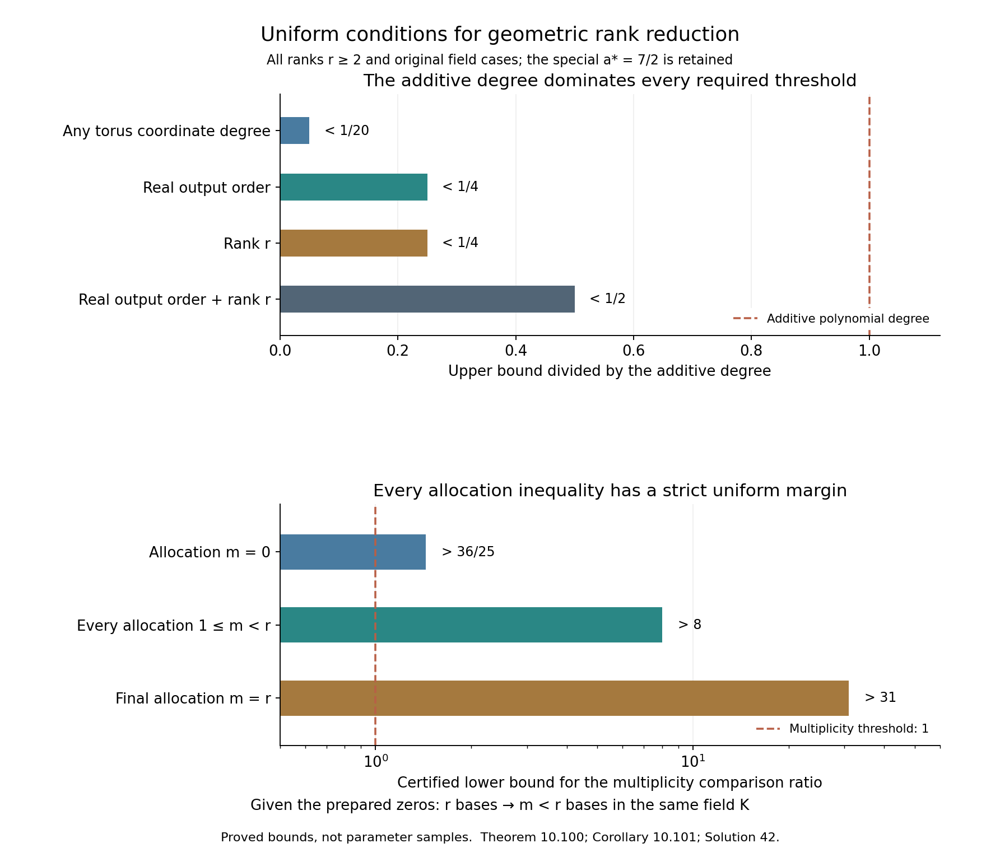

*Figure 10.22. The coordinate-degree, output-order and rank bounds in (10.266) put the additive degree above every required degree threshold. The allocation ratios in (10.268) have proved lower bounds 36/25, 8, 31, uniformly over every original rank and field case, including \(a_*=7/2\). The plotted numbers are certified universal bounds, not samples of parameter cases. Theorem 10.100 proves the cancellations, floors and height-product comparisons; Corollary 10.101 keeps the new bases in the original field and gives their quantitative height product. Solution 42 checks the limiting rank constants and allocation algebra. [Figure program](../figure_sources/geometric_stop_bounds.py). Human-source context: [Yu's free paper](https://archive.ymsc.tsinghua.edu.cn/pacm_download/117/6782-11511_2013_Article_106.pdf), Section 6.*

## 35. The original height profile survives rank reduction

The new bases from Corollary 10.101 must satisfy the original height-product allowance at their smaller rank. A small height product by itself does not prove this: the allowance changes with both the rank and the residue index. We retain that change exactly.

Keep all hypotheses and parameters of Theorem 10.100. For any independent family \(\boldsymbol a\) of \(j\ge1\) local units in the same field, let \(\delta(\boldsymbol a)\) be its residue index. At \(j\ge2\) use the q-primary saturated residue index in (10.49). At \(j=1\) use the actual residue order as in (10.76), without adjoining the torsion generator to that order. Both are positive integers. Set

\[
\begin{aligned}
M_j(\boldsymbol a)
&=\max\left\{\frac{p^f}{\delta(\boldsymbol a)t^j},
                 \frac{\mathrm e^j}{j^j}t\right\},\\
H_*&=\frac{c_2qP}{e\theta},\qquad
\Gamma_n=\mathrm e H_*(n+1)d\quad(n\ge r).
\end{aligned}
\tag{10.272}
\]

Here \(\mathrm e=\exp(1)\), whereas \(e\) is the ramification index. The field, \(\theta\), \(c_2\), \(P\), and \(n\) stay fixed when the rank changes. In particular, the maximum \(M_r(\boldsymbol\alpha)\) is exactly the one in \(\mathcal D\) in (10.186).

**Theorem 10.102 (uniform preservation of the original rank profile).** Under the actual zero hypotheses of Corollary 10.101, let \(m\), \(\boldsymbol\beta\), and \(R_i\) be its output. For every \(n\ge r\),

\[
\prod_{i=1}^m R_i
<\frac1{700}\,
\Gamma_n^{r-m}
\frac{M_r(\boldsymbol\alpha)}{M_m(\boldsymbol\beta)}
\prod_{j=1}^r\sigma_j.
\tag{10.273}
\]

This preserves the original residue-index-dependent allowance, including the different definition at rank one.

**Proof.** First, \(t>1\) in every original parameter case. At odd primes this follows from \(t\ge\ln3>1\). At two, \(\zeta_3\in K\), and the injectivity of the prime-to-two roots under reduction, proved before (10.183), gives \(3\mid2^f-1\). Thus \(f\) is even and at least two, and \(t\ge\ln4>1\).

For any \(j\ge1\) and any positive residue index,

\[
t^jM_j(\boldsymbol a)\le p^ft.
\]

Indeed \(\delta(\boldsymbol a)t\ge1\) gives the first part of the maximum. For the second use \(\ln y\le y-1\) at \(y=t/j>0\): it gives \((\mathrm e t/j)^j\le\exp t=p^f\). This proves the bound at every rank, with its actual residue index.

Put \(\lambda=1+g_5^{-1}\), \(E=(q\eta^{r+1})^I\), and
\(C=\lambda(1+\epsilon)(2+g_2^{-1})c_0\).
Theorem 10.100 gives \(C<45/2\), \(\lambda<5/4\), and
\(\mathsf D_0<\lambda S\mathcal D/(c_1c_4d(A+x))\).
In (10.270), bound its denominator from below by

\[
\frac{2\overline S}{3r}
\frac{(\overline T/(r+1))^m}{m!}.
\]

Both lower bounds are strict because \(\lfloor y\rfloor+1>y\).
Divide the resulting upper bound for \(\prod_iR_i\) by
\(\Gamma_n^{r-m}(M_r/M_m)\prod_j\sigma_j\).
Substitute the complete \(\mathcal D,S,T,\overline S,\overline T\) formulas.
Writing this normalized upper bound as \(\mathcal Q\), the exact cancellation gives

\[
\begin{aligned}
\mathcal Q={}&\frac{3r}{2q}\,
\frac{(m+1)!m!}{r!}\,C\,
\frac{\gamma}{q^{\nu+u}}\,
\frac{r^r(r+1)^r}{\mathrm e^{r-m}(n+1)^{r-m}}\\
&\quad{}\times
\left(\frac{2t}{\eta}\right)^m
\ell_d M_m(\boldsymbol\beta)q^{m\nu}
\frac{\eta^{(r+1)I}}{E^m}.
\end{aligned}
\tag{10.274}
\]

The factors \(H_*\) and \(d\) cancel completely. The original \(M_r\) cancels against the profile ratio; the new \(M_m\) remains. Neither \((m+1)!\) nor \(m!\) has disappeared.

Monotonicity of \(\ln\) gives
\(\ln(r!)\ge\int_1^r\ln y\,dy=r\ln r-r+1\), hence \(r^r/r!<\mathrm e^r\).
Use \(n\ge r\), \(q\ge2\), \(\gamma/q^{\nu+u}\le1\), and \(C<45/2\) in (10.274).
The stopping inequalities give

\[
q^{m\nu}\frac{\eta^{(r+1)I}}{E^m}
<\exp\bigl(-3(m+1)A-(2m+3)x\bigr)
\le\exp\bigl(-3(m+1)A\bigr).
\]

Combine this with \(t^mM_m\le p^ft\le\exp(A)A\),
\(\mathrm e<3\), and \(\eta>18/25\). It follows that

\[
\mathcal Q<\frac{135}{8}\,r(m+1)!m!
\left(\frac{25}{3}\right)^m(r+1)^m
\ell_d A\exp\bigl(-(3m+2)A\bigr).
\tag{10.275}
\]

This remaining inequality is uniform in the rank, field, prime, ramification and residue degree.
Set \(V=(r+1)d\), so \(g_1=4+\ln V\) and \(A\ge g_1>5\).
The function \(y\exp(-(3m+2)y)\) decreases for \(y\ge5\).
Also \(g_1\le5V\), since \(\ln V\le V\) and \(V\ge1\), and \(\ell_d\le d\).
Thus (10.275) is at most

\[
\frac{675}{8}\left(\frac{25}{3}\right)^m
\exp\bigl(-4(3m+2)\bigr)
\frac{r(m+1)!m!}{(r+1)^{2m+1}d^{3m}}.
\]

For fixed \(m\ge1\), \(r/(r+1)^{2m+1}\) decreases for \(r\ge1\), by its logarithmic derivative.
Since \(r\ge m+1\), and \((m+1)!m!\le(m+1)^{2m+1}\), its last factorial-rank factor is smaller than \(m+1\le2^m\).
The latter inequality follows by induction from its equality at one.
Finally \(\mathrm e>2\) gives

\[
\mathcal Q<
\frac{675}{2048}\left(\frac{25}{6144}\right)^m
\le\frac{5625}{4194304}<\frac1{700}.
\tag{10.276}
\]

The final rational comparison is \(5625\cdot700<4194304\).
All these bounds hold for every \(1\le m<r\); they are not deductions from a finite list of ranks.
This proves (10.273). \(\square\)

### A genuine minimum-rank contradiction

Let \(a_1,\ldots,a_n\) be independent local units in \(K\), and let \(a_0\) generate its q-primary roots of unity.
Fix \(\mathcal L=\sum_jb_jz_j\ne0\).
A rank-\(j\) representation consists of integral forms \(L_0=z_0,L_1,\ldots,L_j\) independent over \(\mathbb Q\), rationals \(B_0,\ldots,B_j\) with
\(\mathcal L=\sum_iB_iL_i\), and positive weights \(s_i\).
If \(L_i=\sum_{k=0}^na_{ik}z_k\), require

\[
\begin{gathered}
\alpha_i=a_0^{a_{i0}}\prod_{k=1}^na_k^{a_{ik}},\qquad
s_i\ge\sum_{k=1}^n|a_{ik}|h(a_k),\\
\prod_{i=1}^js_i\le
\Psi_j(\boldsymbol\alpha)\prod_{k=1}^nh(a_k),\qquad
\Psi_j(\boldsymbol\alpha)=
\Gamma_n^{n-j}\frac{M_n(\boldsymbol a)}{M_j(\boldsymbol\alpha)}.
\end{gathered}
\tag{10.277}
\]

The weighted condition implies \(h(\alpha_i)\le s_i\) by the height product and power laws; the torsion factor has height zero.
The bases \(\alpha_i\) are independent: a torsion multiplicative relation, after killing the finite torsion factor, would give a linear relation among the rows of \(L_i\) modulo \(z_0\), contradicting independence with \(L_0\).
At \(j=n\), take \(L_i=z_i,s_i=h(a_i)\). Its profile equals one, so a representation exists.
There is therefore a least positive admissible rank. After renumbering its forms one may assume \(B_j\ne0\).

**Corollary 10.103 (the geometric stop contradicts the original minimum rank).** Suppose \(r\ge2\) is this least admissible rank, and the parameters and actual prepared zeros satisfy Corollary 10.101 for its bases and weights. Then those zeros cannot exist.

**Proof.** Take the integral vectors \(u_i\) of Corollary 10.101 and put
\(L_i'=\sum_{j=1}^ru_{ij}L_j\).
Together with \(L_0\), these forms are independent: their projections modulo \(L_0\) are the independent combinations of the independent projections of \(L_1,\ldots,L_r\).
Because \(\boldsymbol B\) belongs to the rational span of the \(u_i\),
\(\mathcal L=B_0L_0+\sum_ic_iL_i'\) for rationals \(c_i\), not all zero.
The bases associated with \(L_i'\) are precisely \(\beta_i=\prod_j\alpha_j^{u_{ij}}\), in the same field and units at the same prime.
The triangle inequality for each coefficient gives

\[
\sum_{k=1}^n\left|\sum_{j=1}^ru_{ij}a_{jk}\right|h(a_k)
\le\sum_{j=1}^r|u_{ij}|s_j=R_i.
\]

Thus every required independence, representation and weighted-height condition survives.
Finally Theorem 10.102 and (10.277) give

\[
\prod_iR_i<\frac1{700}\,
\Gamma_n^{r-m}\frac{M_r}{M_m}\,
\Gamma_n^{n-r}\frac{M_n}{M_r}\prod_kh(a_k)
=\frac1{700}\Psi_m(\boldsymbol\beta)\prod_kh(a_k).
\]

So \(m<r\) is admissible with the original allowance, contrary to the choice of \(r\).
No enlargement of the original field occurs in this argument. \(\square\)

### A rank-two example with a proved gap

Take \(K=\mathbb Q,p=3,(a_1,a_2)=(2,5)\), and
\(\mathcal L=101z_1+103z_2\).
Here \(d=e=f=1\), \(P=3\), \(H_*=7(1+\tau)\), and \(0\le\tau\le1/100\).
The rational valuations at two and five prove independence and show that the q-primary saturation is already \(\mathbb Z^2\).
The residue group generated by the torsion root and the two bases has order two, giving \(\delta(\boldsymbol a)=1\).
The proved logarithm bounds \(1<t=\ln3<11/10\), \(2/3<\ln2<7/10\), \(1<\ln5<2\), and \(2<\mathrm e<3\) imply

\[
\Gamma_2<64,\qquad M_2(\boldsymbol a)<3,\qquad
M_1(\beta)\ge\mathrm e t>2,
\qquad
\Psi_1(\beta)h(2)h(5)<\frac{672}{5}.
\tag{10.278}
\]

Every possible rank-one form has non-torsion coefficients
\((a_{11},a_{12})=k(101,103)\), where \(k\) is a nonzero integer.
Indeed rational proportionality follows from the representation; \(\gcd(101,103)=1\) makes its proportionality factor integral.
Its required weight is larger than
\(101(2/3)+103=511/3>672/5\).
Thus rank one is impossible, whereas the standard rank-two representation is admissible.
This is a concrete instance of the minimum-rank contradiction once the geometric-stop zeros are produced. It does not assert those zero hypotheses without their precision proof.

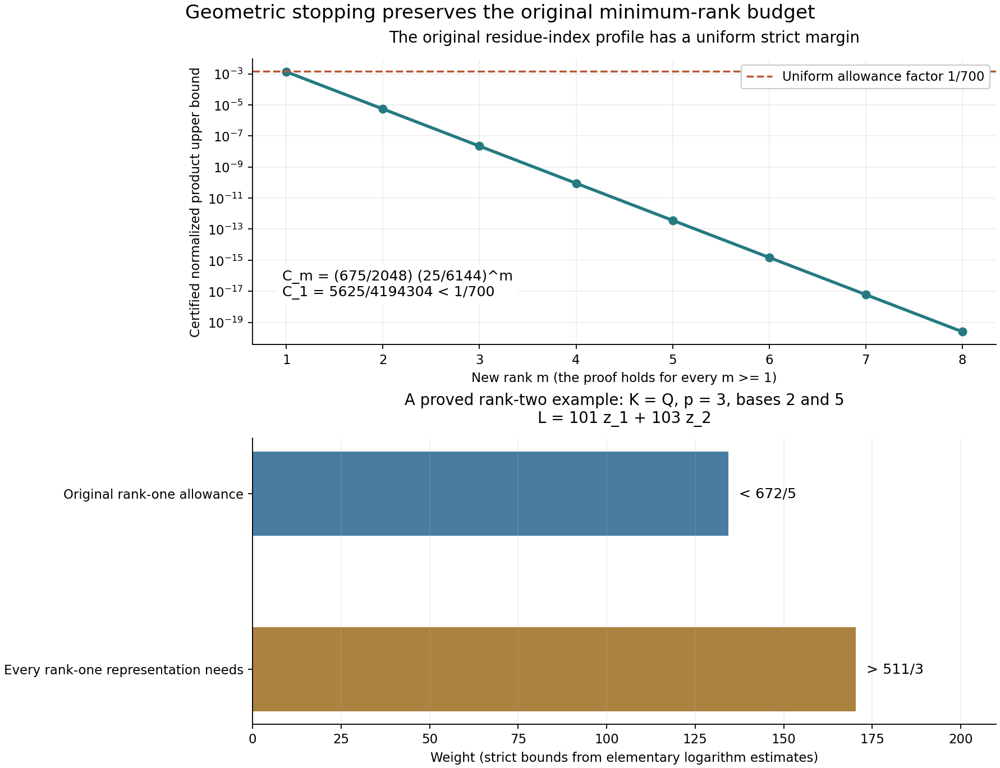

*Figure 10.23. The universal envelope in (10.276) decreases geometrically for every smaller rank \(m\ge1\). The plotted first eight values illustrate the proved formula; its validity for all ranks comes from Theorem 10.102. The rank-two example has an admissible rank-one weight below \(672/5\), while every rank-one representation needs a weight above \(511/3\). Corollary 10.103 proves the general minimum-rank contradiction, retaining the original residue-index profile and original field. Solution 43 checks the complete cancellation and the example. [Figure program](../figure_sources/rank_profile_contraction.py). Human-source context: [Yu's free paper](https://archive.ymsc.tsinghua.edu.cn/pacm_download/117/6782-11511_2013_Article_106.pdf), (2.10) and (6.18)–(6.19).*

The geometric branch now has its full degree, multiplicity and minimum-rank closure under the actual prepared-zero hypotheses. The general descent still requires those hypotheses to be proved with their original integer and fractional precision budgets, and requires the separate stopping branch when its first phase range ends earlier.

## 36. Complete composition averages at the original general parameters

We keep the parameters of Section 26, including their full coordinate widths, the original coefficient field and every field and prime case. The derivative coordinates together with their slack form a complete simplex. Retaining its zero rows makes the average of each coordinate exact. This gives a smaller initial height budget while keeping the original kernel and all its zeros.

Throughout this section use the following rational constants. In the last column, \(\widehat\vartheta\) is the upper bound used in (10.185).

| Case | Conditions | \(c_0\) | \(c_1\) | \(c_3\) | \(c_4\) |
| --- | --- | ---: | ---: | ---: | ---: |
| I.1 | \(p=3,d\ge2\) | 2.66 | 1.449 | 1.4647 | 20.74 |
| I.2 | \(p=3,d=1\) | 1.9 | 1.4494 | 1.3852 | 20.8 |
| II | \(p=5,e\ge2\) | 2.74 | 1.4372 | 0.8412 | 19 |
| III.1 | \(p\ge5,e=1,d\ge2\) | 2.78 | 1.4341 | 2.992 | 18.7 |
| III.2 | \(p\ge5,e=1,d=1\) | 2.6 | 1.432 | 3.26 | 18.2757 |
| IV | \(p\ge7,e\ge2\) | 3 | 1.4441 | 3.849 | 20 |
| V | \(p=2,\zeta_3\in K\) | 2.5 | 2.5347 | 0.4757 | 3.765 |

| Case | \(a_*\) | \(q\) | \(\widehat\vartheta\) |
| --- | ---: | ---: | ---: |
| I.1, I.2 | 7 | 2 | \(3/2\) |
| II | 7 | 2 | \(5/4\) |
| III.1, III.2 | \(7/2\) | 2 | 1 |
| IV | 7 | 2 | \(7/6\) |
| V | \(26/3\) | 3 | 2 |

Every terminating decimal in this table denotes an exact rational number. Put

\[
F_r=\frac{r^r(r+1)^r}{(r!)^2},\qquad
B_r=\frac{2c_0c_1c_4}{\rho}a_*^rF_r,\qquad
b_r=\frac{7200}{29}\,14^{r-2},\qquad Z=\frac{S\mathcal D}{d}.
\tag{10.279}
\]

### Coupled rounding and coefficient-count bounds

**Lemma 10.104 (uniform lower budgets in every original case).** For every integer \(r\ge2\), the table and (10.183)–(10.186) give

\[
\begin{gathered}
t>1,\qquad B_r>b_r,\qquad
\mathcal D>B_r(A+x)t,\\
S>\frac75(r+1)^2d,\qquad g_2>58,\qquad g_5>188,\\
\lambda:=1+g_5^{-1}<\frac{189}{188},\qquad
1+\epsilon<\frac{251}{250}.
\end{gathered}
\tag{10.280}
\]

**Proof.** For odd \(p\), \(t=f\ln p\ge\ln3>1\). At \(p=2\), the primitive cube root reduces to an element of order three, by the injectivity proof preceding (10.183). Thus \(3\mid2^f-1\), so \(f\) is even and at least two. Consequently \(t\ge\ln4>1\).

Direct multiplication of the seven rational rows gives

\[
c_0c_1c_4a_*^2>800,\quad
c_0c_3qa_*^2>202,\quad
\frac{c_0c_4qa_*^2}{\widehat\vartheta}>1000,\quad
c_3q>\frac75.
\tag{10.281}
\]

For explicit checks at the possible minima, the first product is smallest in III.2 and equals \(833.54005644\). The second is smallest in III.1 and equals \(203.78512\). The third is smallest in V and equals \(1060.475\); the fourth is also smallest in V and equals \(1.4271\). These are exact products of the displayed rationals.

We have \(F_2=9\) and

\[
\frac{F_{r+1}}{F_r}
=\frac{r+2}{r+1}\left(1+\frac2r\right)^r>4.
\tag{10.282}
\]

To verify the last inequality for every real \(r\ge2\), the derivative of \(r\ln(1+2/r)\) is \(\ln(1+z)-z/(1+z)>0\), where \(z=2/r>0\). The latter function vanishes at zero and has derivative \(z/(1+z)^2>0\). Its value at \(r=2\) gives \((1+2/r)^r\ge4\). Since \(a_*\ge7/2\) and \(\rho\le58\), (10.281)–(10.282) give

\[
B_r>\frac{800}{29}\,9\,14^{r-2}=b_r.
\tag{10.283}
\]

The stronger lower bound in Lemma 10.70 is \(\mathcal D\ge B_r(A+x)t\); its proof uses the strict inequality \(2+g_2^{-1}>2\), so this inequality is strict. The formula for \(S\), with \(h\ge(r+1)t\), proves its bound in (10.280).

In cases III and IV, the smallest possible value of \(g_2=c_3q(r+1)^2d\) is \(3.26\cdot2\cdot9=58.68\), in III.2. In I, II and V use the other formula for \(g_2\), \(g_0>39\), and respectively \(\ln3<11/10\), \(\ln5<2\), and \(\ln2<1\). In II also \(e\ge2\). Each lower bound is greater than 58.

The formulas for \(g_5\) and \(g_4\), including the smaller alternative \(g_1^{-1}\) for the latter, give

\[
g_5>\frac{404}{58}(r+1)F_r(7/2)^{r-2},\qquad
g_4>\frac{2000}{58}(r+1)F_r(7/2)^{r-2}.
\tag{10.284}
\]

The first bound is at least \(5454/29>188\). In the second, (10.282) implies
\((r+1)F_r(7/2)^{r-2}> (87/20)r(r+1)\): at \(r=2\), \(9>87/10\), and each next ratio of \(F_r(7/2)^{r-2}\) is greater than 14 while \((r+1)/r\le3/2\). Hence \(r(r+1)/(2g_4)<1/300\). Since \((1+z)^r\le\exp(rz)\) for \(z\ge0\),

\[
1+\epsilon<\exp(1/300)
\le\sum_{j\ge0}(1/300)^j
=\frac{300}{299}<\frac{251}{250}.
\]

This also proves the remaining rounding bounds. The elementary logarithm inequalities used above follow from the positive exponential series: its terms through degree five at \(11/10\) already exceed three; its terms through degree four at two exceed five. \(\square\)

**Lemma 10.105 (a general logarithmic coefficient budget).** Let \(\Lambda\) be the selected initial support of Theorem 10.71, \(N=kL|\Lambda|\), and \(1\le d_E\le d\). Then

\[
\frac{\ln(Nd_E)}Z
<\varepsilon_r:=\frac{3+14/(r+1)}{7b_r}
\le\frac{667}{151200}\,14^{2-r}
<\frac1{225}\,14^{2-r}.
\tag{10.285}
\]

**Proof.** The height-product bound of Theorem 10.18, applied separately to each singleton, gives \(d\sigma_i>1/(87d^2)\). Indeed for \(d\ge2\), its lower bound is \(d^2\ell_d\sigma_i\ge w_K/(58\mathrm e)>1/87\), using \(w_K\ge2\), \(\mathrm e<3\), and \(\ell_d\le d\). At \(d=1\) its denominator is 17 and the same weaker bound follows.

Every coordinate of the lattice lies in \(q^{-\nu}\mathbb Z\), by the annihilator argument in Lemma 10.84. A translated interval of full width \(D_i\) therefore contains at most \(\lfloor q^\nu D_i\rfloor+1\) possible coordinates. The phase restriction only decreases the count. As \(c_1c_2rP>1\), (10.186) gives \(q^\nu D_i<87q^\nu d^2\mathcal D\). Moreover
\(kL\le\lambda S\mathcal D/[c_1c_4d(A+x)]<S\mathcal D\), and \(\mathcal D>1\). Consequently

\[
N<S\mathcal D(88q^\nu d^2\mathcal D)^r,
\qquad
\ln(Nd_E)<\ln S+(r+1)\ln\mathcal D
 +(2r+1)\ln d+rx+r\ln88.
\tag{10.286}
\]

Set \(S_*=\tfrac75(r+1)^2d\). Both \(S_*\) and \(5b_r\) exceed \(\mathrm e\); the function \(\ln z/z\) decreases there. Also
\(\ln S_*<2A\), since \(\ln(7/5)<1\) and \(A\ge4+\ln((r+1)d)\). Thus the contribution of \(\ln S\), after division by \(Z\), is less than
\(10/[7(r+1)^2b_r]\).

Since \(\mathcal D>b_r(A+x)t>5b_r\),

\[
\frac{\ln\mathcal D}{\mathcal D}
<\frac{\ln(5b_r)}{5b_r}
<\frac{3r+2}{5b_r}.
\]

Here \(\ln(36000/29)<8\) and \(\ln14<3\); the positive exponential series proves both, using respectively terms through degree eight at eight and through degree four at three. The contribution of \((r+1)\ln\mathcal D\) is therefore less than \((3r+2)/[7(r+1)b_r]\).

Finally \(\ln88<5<A\), by the positive exponential series through degree six at five, and \(\ln d<A\). The remaining terms in (10.286) are at most \((3r+1)(A+x)\). Their contribution is less than \(5(3r+1)/[7(r+1)^2b_r]\). Adding these three bounds gives

\[
\frac{3r^2+20r+17}{7(r+1)^2b_r}
=\frac{3+14/(r+1)}{7b_r}.
\]

This factor decreases apart from the displayed \(14^{2-r}\). At \(r=2\) it is \(667/151200<1/225\). All divisions used the original scale \(Z=S\mathcal D/d\). \(\square\)

### The original height parameter

For the next average take the original

\[
g_0=(r+1)\bigl(a_0r+a_1+\ln(a_0r+a_2)+\ln d\bigr),
\tag{10.287}
\]

with the following choices. In III, \(a_0=2+\ln7\); in I, II and IV, \(a_0=2+\ln14\); in V, \(a_0=2+\ln26\). The values of \(a_1\), in the order of the seven rows above, are
\(4.03,4.79,3.44,4.71,5.84,5.12,2.52\). Set \(a_2=a_1\) in I.2 and III.2, and \(a_2=a_1+\ln2\) otherwise. These choices are compatible with the larger \(h\) in Section 26.

**Lemma 10.106 (the general Euler logarithm constant).** For these original choices, \(g_{91}\) of (10.222) satisfies

\[
g_0>(r+1)(39r/10+36/5+\ln d),
\qquad
g_{91}<1+\frac1{3(r+1)}.
\tag{10.288}
\]

**Proof.** The elementary positive logarithm series
\(\ln z=2\sum_{j\ge0}y^{2j+1}/(2j+1)\), \(y=(z-1)/(z+1)\), proves
\(\ln7>19/10\), \(\ln14>13/5\), and \(\ln13>5/2\) by retaining respectively six, twelve and twelve terms. This series and its explicit geometric tail were proved in Solution 34. In every case \(a_0>39/10\). Directly at \(r=2\), each of \(2a_0+a_1+\ln(2a_0+a_2)\) exceeds 15. For the smallest checks in II and III.1 use \(2a_0+a_1>12.64\) and \(>12.51\), respectively, together with \(2a_0+a_2>13\) and \(\ln13>5/2\). In V, \(a_0>2+2/3+5/2=31/6\), and \(2a_0+a_2>13\). The other four checks have larger lower bounds. Increasing \(r\) increases the first linear term by at least \((39/10)(r-2)\) and the logarithm cannot decrease. This proves the first bound.

For \(d\ge2\), set \(y=\ln d\). Concavity gives the tangent inequality \(\ln z\le\ln9+(z-9)/9\). At \(z=y+\ln3\),

\[
1+3\ln(y+\ln3)
\le\frac{19}{3}\ln3-2+\frac y3
<5+\frac y3.
\]

The last inequality uses \(\ln3<11/10\). The first bound in (10.288) gives \(g_0>(r+1)(15+y)\). Substituting in \(g_{91}-1=[1+3\ln\ln(3d)]/g_0\) proves the second bound. At \(d=1\), use \(\ln6<9/5\), \(\ln2>2/3\), and \(\ln3>1\), so \(W(1)<27/10<\mathrm e\). The last comparison follows from the exponential series through degree five at one. Hence \(1+\ln W(1)<2\) and \(g_0>15(r+1)\), which is stronger than required. The exponential series through degree six at \(9/5\) proves \(\ln6<9/5\). \(\square\)

### Keeping the zero rows in the simplex

Put \(t_0=\lfloor T\rfloor\), and now retain **all** \(\binom{t_0+r}{r}\) composition indices at every node, including those whose additive order exceeds \(D_{\mathrm a}\). Such rows are zero. Assign them the same positive scalar majorants as below. Let \(u\) be the additive coordinate and \(h_{\mathrm E}\) the sum of the \(r-1\) Euler coordinates. The slack completes the \(r+1\) coordinates to total \(t_0\).

**Theorem 10.107 (the complete-simplex mean bound).** Assume the coefficient-height condition (10.223) and the original choices (10.287). Retaining these full rows preserves every initial zero and the coefficient field. Their mean scalar logarithm is at most

\[
D_{\mathrm a}\ln\!\left[2\mathrm e\left(\frac{s_0}{k}+2\right)\right]
 + C_rTH_1,
\qquad
C_r=\frac{r+1/10}{r+1}
 +\frac{17(r-1)}{24(r+1)^2}<1,
\tag{10.289}
\]

where \(s_0=\lfloor S\rfloor\), \(H_1=h+x\). In fact

\[
1-C_r=\frac{23r+193}{120(r+1)^2}>0.
\tag{10.290}
\]

**Proof.** Permutation of the \(r+1\) composition coordinates is a bijection. Their means are therefore exactly \(t_0/(r+1)\). Consequently

\[
\overline u=\frac{t_0}{r+1},\qquad
\overline h_{\mathrm E}=\frac{(r-1)t_0}{r+1}.
\tag{10.291}
\]

For \(u\le D_{\mathrm a}\), Lemma 10.76 gives its additive majorant in (10.198). For \(u>D_{\mathrm a}\) the derivative is zero, so the same positive expression is still a valid majorant; no division by a zero entry is used. At Euler total \(h_{\mathrm E}\), retain the majorant \(\binom{m+h_{\mathrm E}}{h_{\mathrm E}}\). Its logarithm is bounded by \(h_{\mathrm E}\ln[\mathrm e(1+m/h_{\mathrm E})]\); concavity, as proved in Corollary 10.79, bounds its mean by its value at \(\overline h_{\mathrm E}\).

The first part of the proof of Theorem 10.86 used only \(\overline h\ge(r-1)t_0/(r+1)\). Repeating its substitution with equality (10.291) gives

\[
\frac m{\overline h_{\mathrm E}}
\le\frac47\mathrm e^{H_1}tW(d)+\frac{r+1}{t_0},
\qquad
1+\frac m{\overline h_{\mathrm E}}
\le\mathrm e^{H_1}W(d)t.
\tag{10.292}
\]

For the second inequality, use exactly its quadratic-series absorption of \(1+(r+1)/t_0\), with \(H_1>39\), \(H_1\ge(r+1)t\), \(W(d)\ge1\) and now \(t>1\). Taking logarithms and adding one bounds the mean Euler contribution by
\(\overline h_{\mathrm E}(g_{91}H_1+\ln t)\). Differentiating \(\ln t/t\) gives its maximum \(1/\mathrm e\); hence \(\ln t\le H_1/[\mathrm e(r+1)]\).

The complete lcm proof in lesson seven gives \(\ln\mathfrak v<k\ln3\le H_1\ln3\). Combining this with (10.291), the sum of the mean clearing and Euler logarithms is less than

\[
\frac{t_0H_1}{r+1}
\left[(r-1)g_{91}+\ln3+
             \frac{r-1}{\mathrm e(r+1)}\right].
\tag{10.293}
\]

Lemma 10.106, \(\ln3<11/10\), and \(1/\mathrm e<3/8\) bound its coefficient by \(C_r\): the latter exponential inequality follows from the first four terms at one, whose sum is \(8/3\), and the remaining terms are positive. The identity (10.290) follows by subtraction. Adding the allocation-independent additive majorant proves (10.289), since \(t_0\le T\).

Finally Theorem 10.71 supplies \(N>c_{01}(2s_0+1)\binom{t_0+r}{r}\), so the complete weighted integral Siegel argument applies to this full row matrix. The additional zero rows change no kernel equation, and repeated Euler rows preserve the same equations. Every entry still lies in \(E=\mathbb Q(\alpha_0,\theta_1,\ldots,\theta_r)\). The row field, nonzero vector, independent polynomial basis and all prescribed initial jets are therefore retained. \(\square\)

**Corollary 10.108 (a sharper general initial coefficient bound).** In the original generator field \(E\subseteq K\), an integral initial coefficient vector with every prescribed zero and a nonzero polynomial may be chosen with

\[
\begin{aligned}
\frac{h_2(c)}Z<{}&g_{12}+\frac{\varepsilon_r}{2}\\
&+\frac1{c_{01}-1}\left[
\frac{\varepsilon_r}{2}
 +\frac{\lambda}{c_1c_4}
 +\frac{C_r}{c_1c_3\theta e}
 +\frac{1+(2g_2)^{-1}}{2c_1c_2}\right].
\end{aligned}
\tag{10.294}
\]

Here \(g_{12}=0\) when \(d=1\); in every case one may further use

\[
g_{12}\le\frac{1+5/(r+1)}{546b_r}.
\tag{10.295}
\]

**Proof.** Apply the weighted field argument of Theorem 10.90 to the full rows just proved, retaining its actual discriminant bound. Lemma 10.105 bounds \(\ln N/Z\). Corollary 10.77 bounds the allocation-independent additive term; its hypothesis holds for every displayed case. The identity \(TH_1/Z=1/(c_1c_3\theta e)\), with Theorem 10.107, bounds the combined mean term. The exact row ratio is less than \(1/(c_{01}-1)\), and Corollary 10.72 bounds the mean torus contribution. These substitutions give (10.294).

For (10.295), write \(g_3=B_rg_1t\). Then
\(g_1/(2g_7)=1/[2c_3q(r+1)g_0B_r]
 <5/[546(r+1)b_r]\), by \(c_3q>7/5\) and \(g_0>39\).
The formula (10.231) for \(g_{11}\) can be written as

\[
g_{11}=2\mathrm e\,c_3qB_rg_0g_1
\frac{(r+1)(r-1)^{r-1}}{r^r}.
\]

The last ratio exceeds \(1/\mathrm e\), because
\((1+1/(r-1))^{r-1}<\mathrm e\). Thus
\(g_{11}>2c_3qB_rg_0g_1>546b_r\), using \(g_1>5\). Adding its reciprocal proves (10.295); at \(d=1\) its exact discriminant contribution remains zero. \(\square\)

### An individual value in its normal coordinates

The exact normalizing factor in Lemma 10.91 also gives a second arithmetic estimate. Here its factorial and lcm valuations cancel against a common rational rescaling of the actual algebraic value. The global field degree is still required.

**Theorem 10.109 (a second arithmetic bound for the normalized value).** Retain all hypotheses and notation of Theorem 10.92. Let \(I,J\ge0\), \(x=s/q^J\), \(u\le D_{\mathrm a}\), and \(h_{\mathrm E}\) the total Euler order. Put

\[
G_u=(D_{\mathrm a}-u)\theta+Lv_p(k!)-uv_p(\mathfrak v),
\qquad
\widehat\Xi=(I+J)(D_{\mathrm a}-u).
\tag{10.296}
\]

If the actual value \(V\in F\) is nonzero, then

\[
\begin{aligned}
v_p(V)+G_u-\delta\le{}&
\frac{d_F}{e_Ff_F\ln p}\biggl[
h_2(c)+\tfrac12\ln N
 +(D_{\mathrm a}-u)\ln R_I
 +\ln\binom{D_{\mathrm a}}u\\
&\quad{}+\ln\binom{m_I+h_{\mathrm E}}{h_{\mathrm E}}
 +\widehat\Xi\ln q
 +PXq^{-I}\sum_iD_i\sigma_i\biggr]
 +(D_{\mathrm a}-u)\theta.
\end{aligned}
\tag{10.297}
\]

For this same normal quantity one may take the smaller of (10.297) and the right side of (10.244) plus \(G_u\). Both estimates use the same actual \(F,d_F,e_F,f_F\).

**Proof.** Multiply the whole algebraic value, at this one fixed additive order, by the common nonzero rational scalar

\[
W=q^{\widehat\Xi}\frac{(k!)^L}{\mathfrak v^u}\,V\in F.
\tag{10.298}
\]

It is essential that this multiplier is independent of the support index and the binomial-basis column. For a column of power \(\ell\le L\), divided differentiation of \(F_{a,\ell}\) has denominator dividing \((k!)^\ell\). Multiplication by \((k!)^L\) leaves integer polynomial coefficients. At \(q^{-I}x\), its degree is at most \(k\ell-u\le D_{\mathrm a}-u\), so \(q^{\widehat\Xi}\) clears every remaining rational denominator. The Euler binomials are integers at their original integer arguments. Thus the rational scalar multiplying each torus monomial in \(W\) is an integer.

Its ordinary absolute value is at most

\[
q^{\widehat\Xi}R_I^{D_{\mathrm a}-u}
\binom{D_{\mathrm a}}u
\binom{m_I+h_{\mathrm E}}{h_{\mathrm E}}.
\]

Indeed the column estimate before taking the largest power is
\((k!)^{L-\ell}\binom{k\ell}u R_I^{k\ell-u}\). Since \(R_I\ge k\), we have \(R_I^k\ge k!\); increasing \(\ell\) to \(L\) and the binomial to \(\binom{D_{\mathrm a}}u\) therefore gives the stated bound, exactly as in Theorem 10.92.

Apply its proved product-formula and row-height argument to this nonzero \(W\), using the integer scalar bound just obtained. The coefficient vector and full-width torus term are unchanged. At the chosen prime, \(q\) is a unit, so
\(v_p(W)=v_p(V)+Lv_p(k!)-uv_p(\mathfrak v)\).
Adding \((D_{\mathrm a}-u)\theta\) proves (10.297). Applying (10.244) to the original \(V\) and adding its same \(G_u\) proves the other bound. Their minimum is valid because both bound the same number. Restriction of the completion, or the fact that roots lie in an old completion, has not replaced the actual global field degree. \(\square\)

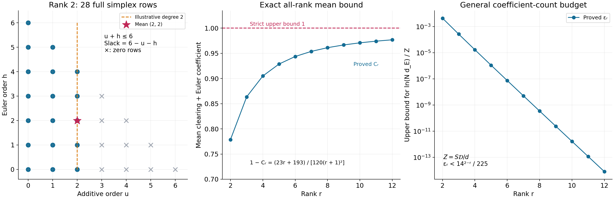

*Figure 10.24. Left: every pair of nonnegative additive and Euler orders with sum at most six, with the remaining slack, at rank two. The 28 equally weighted rows have mean additive and Euler order two; rows above the illustrative additive degree two are zero and remain in the average. Middle: the proved constants \(C_r\) for ranks two through twelve. Equation (10.290) proves their strict upper bound one for every rank. Right: the logarithmic coefficient-count bounds \(\varepsilon_r\) of (10.285), with logarithmic vertical scale; the displayed points illustrate the analytical all-rank formula. The actual scale is \(Z=S\mathcal D/d\). Lemmas 10.104–10.106 and Theorem 10.107 keep every original field and prime case, and Corollary 10.108 retains all scalar, discriminant and mean torus costs. [Figure program](../figure_sources/general_descent_precision.py). Human-source background: [Yu's free paper](https://archive.ymsc.tsinghua.edu.cn/pacm_download/117/6782-11511_2013_Article_106.pdf), equations (1.11), (3.12)–(3.18) and the initial row system in Section 4.*

## 37. A fully proved elementary bound for least common multiples

The individual prepared derivatives contain \(v(k)^u\), where \(v(k)=\operatorname{lcm}(1,\ldots,k)\). We will prove

\[
\ln v(k)<\frac{107}{103}k\qquad(k\ge1).
\tag{10.299}
\]

This strengthens the complete elementary bound in lesson seven. It also keeps the lcm constant used in the general logarithmic-form parameters. The proof follows the finite-recurrence method of [Costa Pereira's freely available paper](https://www.impan.pl/shop/en/publication/transaction/download/product/106154), pages 321–323. We give the recurrence, its induction, and the complete exact finite computation here. The computation regenerates its primes and encloses each logarithm by rational numbers; no numerical table is an assumed input.

### A factorial combination

For \(x>0\), put \(\psi(x)=\sum_{p^a\le x}\ln p\), summing over primes \(p\) and integers \(a\ge1\). It is zero below one and constant on each interval \([n,n+1)\). Define the integer weights

| \(r\) | 1 | 2 | 3 | 5 | 6 | 7 | 10 | 11 | 13 | 14 | 15 | 30 | 42 | 110 | 182 |
|---|---:|---:|---:|---:|---:|---:|---:|---:|---:|---:|---:|---:|---:|---:|---:|
| \(v_r\) | 1 | \(-1\) | \(-1\) | \(-1\) | 1 | \(-1\) | 1 | \(-1\) | \(-1\) | 1 | 1 | \(-1\) | \(-1\) | \(-1\) | 1 |

The symbols \(v_r\) are weights; they are distinct from the integer \(v(k)\). Put

\[
F(y)=\sum_rv_r\lfloor y/r\rfloor,\qquad
\sigma(x)=\sum_rv_r\ln(\lfloor x/r\rfloor!),\qquad
\omega=-\sum_r\frac{v_r\ln r}{r}.
\tag{10.300}
\]

As usual, \(0!=1\).

**Lemma 10.110 (the factorial combination and its error).** These weights satisfy \(\sum v_r/r=0\), \(\sum v_r=-3\) and \(\sum|v_r|=15\). For every \(y\ge0\), \(-1\le F(y)\le4\). Moreover

\[
\ln v(k)=\psi(k),\qquad
\sigma(x)=\sum_{p^a\le x}(\ln p)F(x/p^a),\qquad
|\sigma(x)-\omega x|\le15(\ln x+1)\quad(x\ge182).
\tag{10.301}
\]

**Proof.** The exponent of \(p\) in the least common multiple is the largest integer \(a\) for which \(p^a\le k\); summing its logarithm proves the first identity. In \(n!\), the exponent of \(p\) is \(\sum_{a\ge1}\lfloor n/p^a\rfloor\), by counting multiples of each power. Thus
\(\ln(\lfloor x\rfloor!)=\sum_{p^a\le x}(\ln p)\lfloor x/p^a\rfloor\). Substituting this finite sum in (10.300) proves the second identity.

For the weight sum, add the four rational identities
\(1+1/15-1/2-1/3-1/5-1/30=0\),
\(1/6-1/7-1/42=0\),
\(1/10-1/11-1/110=0\), and
\(1/14+1/182-1/13=0\).
The other two sums follow directly from the table.

Write \(F=F_0+F_1+F_2+F_3\), using respectively the weights at
\(\{1,2,3,5,15,30\}\), \(\{6,7,42\}\), \(\{10,11,110\}\), and \(\{13,14,182\}\). The first rational identity makes \(F_0\) periodic with period 30. Its values at the residues \(0,1,\ldots,29\), obtained by substituting in its six floors, are
\(0,1,1,1,1,1,0,1,1,1,0,1,0,1,1,1,1,2,1,2,1,1,1,2,1,1,1,1,1,2\).
It is constant between consecutive integers, so \(F_0\le2\) at every real argument. The identities for \(1/6\) and \(1/10\), together with
\(\lfloor a+b\rfloor-\lfloor a\rfloor-\lfloor b\rfloor\in\{0,1\}\), show that \(F_1,F_2\in\{0,1\}\). The identity for \(1/13\) gives \(F_3\in\{-1,0\}\). Consequently \(F\le4\).

For the lower bound, all denominators divide \(\tau=30030\); the zero inverse-weight sum makes \(F\) periodic with this period. At integral \(n\),
\(\lfloor n/r\rfloor+\lfloor(\tau-1-n)/r\rfloor=\tau/r-1\).
Therefore \(F(n)+F(\tau-1-n)=3\). Since \(F\le4\), it follows that \(F(n)\ge-1\). Each floor in \(F\) is constant between consecutive integers, so the same bounds hold at real \(y\ge0\).

Finally let \(t\ge1\), \(n=\lfloor t\rfloor\). Monotonicity of \(\ln z\) gives
\(n\ln n-n+1\le\ln(n!)\le n\ln n-n+1+\ln n\).
The change in \(t\ln t-t\) between \(n\) and \(t\) is between zero and \(\ln t\). Hence
\(|\ln(n!)-(t\ln t-t)|\le\ln t+1\).
Apply this at every \(t=x/r\ge1\). The \(x\ln x-x\) terms cancel because \(\sum v_r/r=0\); the remaining linear term is \(\omega x\). The fifteen absolute weights give the stated error. \(\square\)

### The finite certificate

The selected half-open intervals in the next table have integer endpoints. Each pair \((b,c)\) denotes \([b,c)\); pairs in a given row are disjoint.

| Level \(s\) | Intervals with \(F\ge s\), for the upper recurrence | Intervals with \(F<s\), for the lower recurrence |
|---|---|---|
| 1 | (67,126), (157,176), (179,220), (223,275), (277,330), (359,429) | none |
| 2 | (17,22), (23,26), (29,35), (47,52), (59,65), (71,78), (79,88), (191,210) | (26,29), (65,71), (117,139) |
| 3 | (19,21) | (21,31), (33,61), (63,73), (84,103), (110,193), (208,229), (242,271), (294,323), (325,373), (440,493) |
| 4 | none | (440,877) |

Let \(\mathcal U,\mathcal L\) be the respective lists of pairs, retaining their level. The initial cutoffs are
\(a_0=877,a_1=66,a_2=17,a_3=19,a_4=439\).
Here \(F(y)\ge s\) for \(1\le y<a_s\), \(s=0,1\), and \(F(y)<s\) for \(1\le y<a_s\), \(s=2,3,4\).

**Lemma 10.111 (exact finite certificate).** The cutoffs and every interval in the table have the asserted property. Set

\[
\begin{aligned}
A&=1-1/a_0-1/a_1-\sum_{(b,c)\in\mathcal U}1/c,\\
B&=\sum_{(b,c)\in\mathcal U}1/b,\\
C&=1/a_2+1/a_3+1/a_4+\sum_{(b,c)\in\mathcal L}1/c,\\
D&=1-\sum_{(b,c)\in\mathcal L}1/b.
\end{aligned}
\tag{10.302}
\]

With \(Q=10^{12}\), \(N=10^6\), \(U=27/26\), \(L=25/26\), and \(\varepsilon=9/40000\), the following rational inequalities hold:

\[
\begin{gathered}
A\ge.732878,\quad B\ge.297381,\quad
C\le.263738,\quad D\le.802853,\\
1.046524<\omega<1.046525,\\
AU+BL-\omega-\varepsilon>\frac{6731}{26000000},\qquad
\omega-\varepsilon-CU-DL>\frac{11523}{26000000}.
\end{gathered}
\tag{10.303}
\]

Also \(\psi(x)<Ux\) for \(114\le x<N\), and \(\psi(x)>Lx\) for \(227\le x<N\). For integers \(1\le n<113\), \(\psi(n)/n<\psi(113)/113\), and
\(U<\psi(113)/113<107/103\).

**Proof and reproducible finite computation.** The full standard-library program [chebyshev_certificate.py](../figure_sources/chebyshev_certificate.py) is part of this lesson's editable sources. We describe every finite check it performs, including its rational logarithm bounds.

For the floor conditions it substitutes \(\sum v_r(n\mathbin{//}r)\) at every integer in each initial range and every listed half-open interval. This covers real arguments as well, because \(F\) is constant on \([n,n+1)\). It checks the within-level disjointness and that each interval begins at or beyond its level's initial cutoff. The fractions in (10.302) are then summed with exact integer numerators and denominators. Their comparison with the displayed terminating decimals is an exact rational comparison.

To enclose a logarithm, first write an integer \(m=2^at\), \(1\le t<2\), and put \(z=(t-1)/(t+1)\), so \(0\le z<1/3\). For \(\ln2\), take \(z=1/3\). Integrating the finite geometric identity for \((1-z^2)^{-1}\) proves

\[
0\le\ln\frac{1+z}{1-z}
 -2\sum_{j=0}^{15}\frac{z^{2j+1}}{2j+1}
\le\frac{2z^{33}}{33(1-z^2)}
\le\frac9{132\,3^{33}}<\frac1Q.
\tag{10.304}
\]

Round each of the sixteen positive terms down to an integer multiple of \(1/Q\). Their sum is a lower bound; adding \(17/Q\) gives an upper bound, since there are sixteen rounding errors and the tail is less than \(1/Q\). At \(z=0\) use the exact value zero. Adding \(a\) copies of the interval for \(\ln2\) gives integer endpoints \(l_m,u_m\) with
\(l_m/Q\le\ln m\le u_m/Q\). This uses integer division and powers only. Apply these enclosures, with the appropriate signs, to the fifteen terms defining \(\omega\). They give the displayed strict bracket. Substituting its two endpoints and the four rational coefficient bounds proves (10.303); the residual fractions are exactly those shown there.

The sieve begins with unmarked integers from two through \(N\). Each unmarked \(p\) is prime: a composite would already have been marked by its smaller prime divisor. It marks multiples starting at \(p^2\); smaller multiples were marked earlier. For every discovered prime, it assigns the interval for \(\ln p\) to each of \(p,p^2,\ldots\le N\). No two different primes assign the same integer. Successive cumulative sums give integer endpoints \(L_n,U_n\) for \(Q\psi(n)\). The program checks all the following inequalities by integer arithmetic:

| Integer range | Checked positive integer expression | Smallest value |
|---|---|---:|
| \(114\le n<N\) | \(27Qn-26U_n\) | 13207722459676, at \(n=199\) |
| \(227\le n<N\) | \(26L_n-25Q(n+1)\) | 55077005461136, at \(n=346\) |
| \(1\le n\le113\) | \(107Qn-103U_n\) | 167297005424 |
| \(1\le n<113\) | \(nL_{113}-113U_n\) | 33103591701014 |

The same calculation gives
\(117386725268647\le Q\psi(113)\le117386725271792\)
and verifies \(26L_{113}>27Q\cdot113\).
The sieve finds 78498 primes and 78734 prime powers at most \(N\); these counts are outputs, not inputs. Every prime-power assignment and cumulative sum is integral, and the maximum cumulative upper endpoint is checked to be below \(2^{63}\), the storage limit. The finite sums for (10.302) use arbitrary-size integers.

For a real \(x\in[n,n+1)\), the upper comparison follows from \(\psi(x)=\psi(n)<Un\le Ux\). The lower comparison follows from \(\psi(x)=\psi(n)>L(n+1)>Lx\); the extra \(n+1\) in its certificate is essential. These arguments prove all assertions of the lemma. \(\square\)

### Continuing the bounds to every real argument

**Theorem 10.112 (a sharp elementary lcm bound).** For every real \(x>0\),

\[
\psi(x)\le\frac{\psi(113)}{113}x<\frac{107}{103}x.
\tag{10.305}
\]

Consequently (10.299) holds at every positive integer \(k\).

**Proof.** We first derive the two recurrences from the actual factorial combination. For an integer \(j\in[-1,4]\),
\(j-1=-\sum_{s=0}^1\mathbf1_{j<s}+\sum_{s=2}^4\mathbf1_{j\ge s}\).
Apply this at \(j=F(x/p^a)\) in (10.301). All weights \(\ln p\) are positive. The condition \(x/p^a\in[b,c)\) contributes exactly
\(\psi(x/b)-\psi(x/c)\), with the indicated half-open convention.

For \(s=0,1\), occurrences of \(F<s\) begin only at \(a_s\). Their total mass is at most \(\psi(x/a_s)\), minus the masses of any disjoint selected intervals where \(F\ge s\). For \(s=2,3,4\), the mass where \(F\ge s\) is at least that of its selected intervals. This gives the upper recurrence. Reverse the two roles to obtain the lower recurrence:

\[
\begin{aligned}
\psi(x)&\le\sigma(x)+\psi(x/a_0)+\psi(x/a_1)
 -\sum_{(b,c)\in\mathcal U}[\psi(x/b)-\psi(x/c)],\\
\psi(x)&\ge\sigma(x)-\sum_{s=2}^4\psi(x/a_s)
 +\sum_{(b,c)\in\mathcal L}[\psi(x/b)-\psi(x/c)].
\end{aligned}
\tag{10.306}
\]

There is no subtraction of intersecting intervals within a level: Lemma 10.111 checked disjointness. Intervals at different levels represent different indicator terms and must retain their multiplicity.

For \(x\ge N\), (10.301) gives \(|\sigma(x)/x-\omega|<\varepsilon\). Indeed \((\ln x+1)/x\) decreases for \(x>1\), and \(\ln N<14\). The latter follows from \(\ln10<7/3\): the exponential series at \(7/3\) through degree six is already greater than ten.

Now prove simultaneously \(Lx<\psi(x)<Ux\), starting at \(x=N\), by induction on the interval \([n,n+1)\). The finite base is Lemma 10.111. Every argument \(x/d\) on the right of (10.306) has \(d\ge17\), so it is less than \(n\). Every argument requiring an upper estimate is at least \(N/877>114\). Every argument requiring a lower estimate is at least \(N/440>227\). Thus either the finite base or the earlier induction intervals apply to each term. Division of the upper recurrence by \(x\) gives
\(\psi(x)/x<\omega+\varepsilon+(1-A)U-BL<U\).
The lower recurrence gives
\(\psi(x)/x>\omega-\varepsilon-CU+(1-D)L>L\).
The two strict final comparisons are precisely (10.303). This proves the bounds at every \(x\ge N\), and hence the upper bound \(\psi(x)<Ux\) at every \(x\ge114\).

At \(0<x<1\) the assertion is immediate. At \(1\le x<114\), let \(n=\lfloor x\rfloor\le113\). Lemma 10.111 gives
\(\psi(x)/x\le\psi(n)/n\le\psi(113)/113\), with equality permitted at \(x=113\). At \(x\ge114\), use \(\psi(x)/x<U<\psi(113)/113\). The last strict bound in (10.305) is the certificate at 113. Finally use \(\ln v(k)=\psi(k)\). \(\square\)

**Corollary 10.113 (the sharper full-simplex coefficient budget).** Every field, prime and rank case of Theorem 10.107 and Corollary 10.108 remains valid with \(C_r\) replaced by

\[
C_r^{\sharp}=\frac{r+4/103}{r+1}
 +\frac{17(r-1)}{24(r+1)^2}
=C_r-\frac{63}{1030(r+1)}<C_r<1.
\tag{10.307}
\]

The individual clearing factor also satisfies
\(u\ln v(k)<(107/103)uk\) whenever \(u>0\), and is zero when \(u=0\).

**Proof.** In (10.293), substitute \(\ln v(k)<(107/103)k\le(107/103)H_1\), using Theorem 10.112. All Euler, additive and field arguments are unchanged. The rational calculation of its mean coefficient now gives (10.307). The full row composition, its zero rows and its actual coefficient field are the same. In (10.294), only the scalar mean term containing \(C_r\) changes, so the same substitution gives the asserted coefficient-height bound. Multiplication of (10.299) by \(u\) proves the last statement. \(\square\)

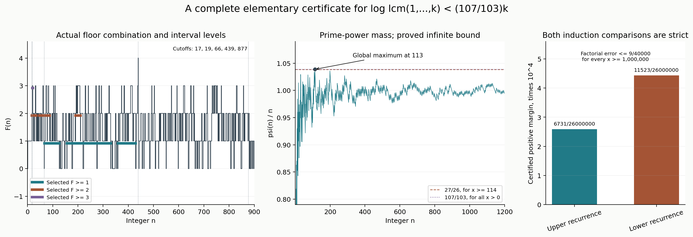

*Figure 10.25. Left: the actual integer floor combination \(F(n)\) and the selected intervals in the upper recurrence, colored by their level; the vertical marks are its initial cutoffs. Middle: \(\psi(n)/n\) for integers through 1200, with the maximum at 113 and the proved constants \(27/26\) and \(107/103\). These discrete points illustrate (10.305); the simultaneous induction (10.306) proves the infinite statement. Right: the exact positive lower bounds for the two induction margins in (10.303). The factorial combination is estimated at \(x\ge10^6\); the finite base is generated by the integer certificate of Lemma 10.111. [Figure program](../figure_sources/chebyshev_recurrence.py). Human method and interval choices: [Costa Pereira's free paper](https://www.impan.pl/shop/en/publication/transaction/download/product/106154), pages 321–323; all required identities, finite checks, error bounds and induction are given above.*

## 38. An individual clearing and Euler bound at every original parameter

The full-simplex average controls the initial coefficient height. A later nonzero-value argument needs a bound for each individual row. We obtain one from a positive generating series. It preserves the factorial denominator in the additive polynomial and makes the remainder uniform in the field, prime and rank.

Retain Sections 26 and 29, with \(H_1=h+x\), \(Z=S\mathcal D/d\), the coefficient-height condition (10.223), and the seven original constant cases in (10.281). Define
\(g_9=\max\{g_{91},107/103\}\).

### The exact sharp regime for the Euler constant

**Lemma 10.114.** For every original case and every \(r\ge2\),

\[
g_9\le\max\left\{1+\frac1{3(r+1)},\frac{107}{103}\right\}.
\qquad
g_9=\frac{107}{103}\quad\text{if }d=1\text{ or }r\ge8.
\tag{10.308}
\]

**Proof.** The first statement follows from Lemma 10.106. At \(r\ge8\), its bound gives \(g_{91}-1<1/27<4/103\); the difference of the last two fractions is \(5/2781\).

At \(d=1\), the only cases are I.2 and III.2. Four terms of the positive logarithm series give \(\ln2>693/1000\), and five terms give \(\ln3>1098/1000\). The already proved \(\ln6<9/5\) therefore gives
\(W(1)<(9/5)/[(693/1000)(1098/1000)]<19/8\).
The exponential series through degree five at \(7/8\) exceeds \(19/8\), so \(\ln W(1)<7/8\). All these comparisons are between explicit rational numbers; the positive tails have the required direction.

At rank two in I.2, (10.287) and \(\ln14>13/5,\ln13>5/2\) give
\(g_0>3(9.2+4.79+2.5)=49.47\).
In III.2, use \(\ln7>19/10\) to obtain
\(g_0>3(7.8+5.84+2.5)=2421/50\).
Every term defining \(g_0\) increases with \(r\), so the latter lower bound holds throughout both cases. By (10.222),
\(g_{91}-1<(15/8)/(2421/50)=125/3228<4/103\).
The last difference is \(37/332484>0\). Taking the maximum with \(107/103\) proves (10.308). \(\square\)

### A positive generating-series majorant

For a support contracted by \(q^{-I}\), \(I\ge0\), take its actual integer Euler maxima \(\Omega_j\), and set
\(m_I=\sum_{j=1}^{r-1}\Omega_j+r-2\), as in (10.239).
Lemma 10.84 permits the same bound with the integer part of its upper estimate. Put
\(a=g_9H_1\), \(z=\exp(-a)\), and
\(E_I=(m_I+1)[-\ln(1-z)]\).
This remainder depends on the support, not on the allocation of derivative orders.

**Theorem 10.115 (an individual clearing/Euler bound).** For every pair of nonnegative integers \(u,h_{\mathrm E}\),

\[
u\ln v(k)+\ln\binom{m_I+h_{\mathrm E}}{h_{\mathrm E}}
\le a(u+h_{\mathrm E})+E_I.
\tag{10.309}
\]

In the original parameters the remainder satisfies

\[
\frac{E_I}{Z}<
\frac{1000}{999}\,
\frac{q^{-I}(r-1)}{\mathrm e\,c_1c_2c_3qP(r+1)^2}
+\frac{r-1}{999Z}
<\frac{q^{-I}}{300}+\frac{r-1}{999Z}.
\tag{10.310}
\]

The symbol \(\mathrm e\) in this formula is \(\exp(1)\), and \(P=p^\kappa\) is the original prime power.

**Proof.** The positive geometric series and its \(m_I+1\)-fold product give
\((1-z)^{-m_I-1}=\sum_{j\ge0}\binom{m_I+j}{j}z^j\).
Indeed its coefficient counts the \(m_I+1\) nonnegative parts summing to \(j\); placing \(m_I\) separators among \(m_I+j\) positions gives the displayed binomial. Positivity bounds any one term by the entire sum. By Theorem 10.112, \(\ln v(k)<(107/103)k\le a\), because \(k\le H_1\) and \(g_9\ge107/103\). Thus
\(v(k)^u\binom{m_I+h_{\mathrm E}}{h_{\mathrm E}}\le z^{-u-h_{\mathrm E}}(1-z)^{-m_I-1}\).
Taking logarithms proves (10.309), including \(u=0\) or \(h_{\mathrm E}=0\).

We now bound its actual remainder. The full-width argument (10.220), with contraction, gives
\(m_I+1\le(r-1)q^{\nu-I}\mathcal D R_{\max}/(c_1c_2Pd)+r-1\).
There is no extra factor \(1/r\): summing the \(r\) widths cancels that factor in (10.186). Substituting \(R_{\max}\le dW(d)\exp(h)\), \(q^\nu=\exp(x)\), and the exact formula for \(S\) gives

\[
\frac{m_I+1}{Z}
\le\frac{q^{-I}(r-1)tW(d)\exp(H_1)}
 {c_1c_2c_3qP(r+1)H_1}
+\frac{r-1}{Z}.
\tag{10.311}
\]

For \(0<z<1\), integration gives \(-\ln(1-z)\le z/(1-z)\). Since
\((g_9-1)H_1\ge(g_{91}-1)g_0=1+\ln W(d)\), we have
\(W(d)\exp(H_1)z\le1/\mathrm e\).
Also \(H_1>39\) and \(g_9>1\). The first four exponential terms at 39 exceed 1000, so \(z<1/1000\) and \((1-z)^{-1}<1000/999\). Finally \(t/H_1\le1/(r+1)\). These substitutions in (10.311) prove the first inequality of (10.310).

For its uniform last inequality, the definition \(2e<P(p-1)\) gives \(P\ge3\) in I, \(P\ge5\) in II, and \(P\ge4\) in V; in III and IV use \(P\ge1\). Direct substitution of the seven rational rows gives the following lower bounds for \(c_1c_2c_3qP\), all greater than 15:

| Case | Rational lower bound |
|---|---:|
| I.1 | \(445693563/20000000\) |
| I.2 | \(527023581/25000000\) |
| II | \(52892553/2500000\) |
| III.1 | \(18772369/1250000\) |
| III.2 | \(204239/12500\) |
| IV | \(389083863/20000000\) |
| V | \(522494609/25000000\) |

For all \(r\ge2\), \((r-1)/(r+1)^2\le1/8\), since \((r-3)^2\ge0\). The positive exponential series proves \(1/\mathrm e<3/8\), as in Theorem 10.107. The coefficient of \(q^{-I}\) is therefore less than
\((1000/999)(3/8)/(8\cdot15)=25/7992<1/300\).
This proves the last inequality. It holds at every rank and degree; the proof did not test a finite list of ranks or degrees. \(\square\)

### Retaining the factorial and the actual field

**Corollary 10.116 (a factorial-preserving general point budget).** Retain every hypothesis and notation of Theorem 10.92, with its actual \(R_I=q^{-I}X+2k-1\), number field \(F\), q-denominator exponent \(\Xi_{I,J,u}\), and \(u\le D_{\mathrm a}\). For an integer total-order cutoff \(O\ge u+h_{\mathrm E}\), put

\[
\begin{aligned}
B_{I,u}(X,O)&=(D_{\mathrm a}-u)\ln R_I
 +\ln\binom{D_{\mathrm a}}u-L\ln(k!)+aO+E_I,\\
B_I(X,O)&=D_{\mathrm a}\ln(R_I+1)-L\ln(k!)+aO+E_I.
\end{aligned}
\tag{10.312}
\]

Then \(\ln\mathcal H_{I,u,h_{\mathrm E}}(X)\le B_{I,u}(X,O)\le B_I(X,O)\). The exact maximization (10.241) remains available, so its logarithm and \(B_I\) may be replaced by their smaller value when the whole cutoff is used.
For a nonzero value, its same actual normal quantity satisfies

\[
\begin{aligned}
v_p(V)+G_u-\delta\le
\frac{d_F}{e_Ff_F\ln p}\biggl[
&h_2(c)+\tfrac12\ln N+B_{I,u}(X,O)\\
&+\Xi_{I,J,u}\ln q
+PXq^{-I}\sum_iD_i\sigma_i\biggr]+G_u.
\end{aligned}
\tag{10.313}
\]

Here \(G_u=(D_{\mathrm a}-u)\theta+Lv_p(k!)-u v_p(v(k))\), exactly as in Lemma 10.91. One may take the minimum with the previously proved normal-coordinate bound (10.297).

**Proof.** Insert (10.309) into the individual scalar expression (10.240), and use \(u+h_{\mathrm E}\le O\). This gives its bound by \(B_{I,u}\). The ordinary binomial expansion gives
\(\binom{D_{\mathrm a}}uR_I^{D_{\mathrm a}-u}\le(R_I+1)^{D_{\mathrm a}}\), proving \(B_{I,u}\le B_I\). Both bounds keep the negative term \(-L\ln(k!)\); it has not been canceled by changing the rational clearing convention.

Apply (10.244) with this scalar bound and then add the same exact \(G_u\) to both sides. No global field has been restricted, no q-denominator has been removed, and no derivative order has been averaged. Equation (10.297) bounds this identical normal quantity in the identical field. Their minimum is therefore legitimate. At \(u>D_{\mathrm a}\), the value is zero by Lemma 10.91 and no nonzero-value argument is needed. \(\square\)

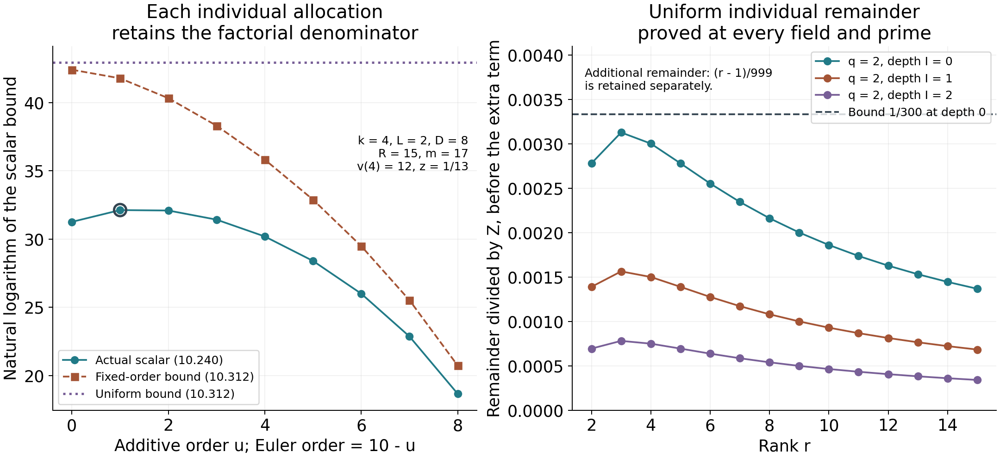

*Figure 10.26. Left: all additive allocations \(0\le u\le8\) with Euler order \(10-u\), at \(k=4,L=2,D_{\mathrm a}=8,R_I=15,m_I=17\). The lcm is exactly 12. The plotted scalar is (10.240), including its denominator \((4!)^2\); its largest value occurs at \(u=1\). The generating comparison uses \(z=1/13\), so \(a=\ln13\), and displays both the fixed-allocation and uniform bounds (10.312). This is an illustrative instance of the positive-series proof, not a substitution for the original general parameters. Right: the coefficient of \(Z\) in the first term of the analytical bound (10.310), using \(1/\mathrm e<3/8\) and \(c_1c_2c_3qP>15\), for \(q=2\) and depths zero, one and two. Its bound by \(1/(300q^I)\) is proved for every rank; the separate additive remainder \((r-1)/999\) is retained in (10.310). Proof locators: Theorem 10.115, Corollary 10.116 and Solution 46. [Figure program](../figure_sources/individual_clearing_euler.py). Human background: [Yu's free paper](https://archive.ymsc.tsinghua.edu.cn/pacm_download/117/6782-11511_2013_Article_106.pdf), its definitions (3.16) and the individual scalar estimate (5.38); the positive-series bound and its uniform remainder are proved here.*

## 39. Keeping additive divisibility in the ordinary jets

The prepared equations vanish at their input nodes. Their projection error already contains a useful factor from the additive polynomial. Keeping that factor through differentiation gives a more precise input to interpolation, at each fixed additive order. The argument applies to the original fields and to every contraction depth; it does not average derivative orders.

### Divisibility of a prepared scalar

Use the prepared family (10.92), its original and projected curves (10.104), and the logarithmic slopes of Lemma 10.91. Write

\[
D_{\mathrm a}=kL,\qquad
\ell_p=v_p(\mathfrak v),\qquad
\chi_p=L v_p(k!),\qquad
\gamma_u=\max\{0,u\ell_p-\chi_p\},
\qquad \mathfrak v=\operatorname{lcm}(1,\ldots,k).
\tag{10.314}
\]

The symbol \(\ell_p\) is a valuation, not the exponent of an additive basis column. The selected Euler arguments are integers, as in Lemma 10.38.

**Lemma 10.117 (order-dependent projection precision).** Suppose the hypotheses of Lemma 10.36 hold, with \(b=b_n\), \(\beta=v_p(b_n)\), and coefficient minimum \(\delta\). At any \(y\in\mathbb Z_p\), every prepared scalar of additive order \(u\le D_{\mathrm a}\) has valuation at least \(\gamma_u\). Consequently

\[
v_p\bigl(f(y;\boldsymbol t)-\Phi(y;\boldsymbol t)\bigr)
\ge \delta+U-\beta+\gamma_u,
\qquad u=t_0.
\tag{10.315}
\]

If \(u>D_{\mathrm a}\), both prepared functions vanish identically.

**Proof.** Consider a column with exponent \(1\le l\le L\). Its additive prepared scalar is \(\mathfrak v^u\) times the coefficient of \(V^u\) in

\[
\frac1{(k!)^l}
\prod_{a=1}^k(q^{-I}y+\lambda_{-1}+a+V)^l.
\]

Every coefficient of the numerator is p-integral, since \(q\ne p\) and \(y\in\mathbb Z_p\). Thus its valuation is at least \(u\ell_p-lv_p(k!)\ge u\ell_p-\chi_p\). Independently, prepared Taylor integrality, extended to \(\mathbb Z_p\) in the proof of Lemma 10.36, gives valuation at least zero. These are simultaneous bounds, giving their maximum \(\gamma_u\). Each integer Euler binomial is p-integral, so multiplication by the Euler factors preserves that maximum.

In the proof of Lemma 10.36, the ratio of the two exponential monomials minus one has valuation at least \(U-\beta\); the original monomial is a local unit. Multiply this by the scalar bound just proved and by a coefficient of valuation at least \(\delta\). The ultrametric inequality proves (10.315). Beyond degree \(D_{\mathrm a}\), every additive derivative is zero. \(\square\)

This proof also applies at \(y=s/q^J\). A q-denominator has p-adic valuation zero. It still incurs its full arithmetic cost at primes above q in Theorem 10.92.

### The precision at one additive order

Retain the selected derivations and coefficients \(\lambda_{aj}\) of Lemma 10.38. Assume the full original depth condition \(v_p(z_j)\ge\vartheta+1/(p-1)\), the p-integrality of \(b_j/b_n\), and \(0<\theta<\vartheta\). For an integer \(j\ge0\), define

\[
\begin{aligned}
H_{u,j}&=\min\{j,D_{\mathrm a}-u\},\\
M_u(j)&=\min_{0\le a\le H_{u,j}}
\left\{\max\{-a\ell_p,u\ell_p-\chi_p\}
+(j-a)(\vartheta-\beta)\right\}.
\end{aligned}
\tag{10.316}
\]

The minimum is over integers. It computes a lower-bound envelope for the jets; it does not assert that a jet attains that valuation.

**Theorem 10.118 (ordinary jets with the additive divisibility retained).** Fix a prepared index \(\boldsymbol t\) of additive order \(u\le D_{\mathrm a}\). Suppose the original prepared values at a node \(s\in\mathbb Z_p\) vanish through total order \(T\). For \(|\boldsymbol t|+j\le T\),

\[
\begin{aligned}
v_p(f_j(s;\boldsymbol t))
&\ge\delta+U-\beta+M_u(j),\\
v_p((F_u)_j(\rho s;\boldsymbol t))+j\theta
&\ge U-\beta+G_u+M_u(j).
\end{aligned}
\tag{10.317}
\]

Here \(F_u,G_u\) are exactly (10.238), and the subscript \(j\) is ordinary divided differentiation. In particular, with

\[
C_{\mathrm{sharp}}=\max\{\ell_p,\beta-\vartheta,0\},
\qquad M_u(j)\ge-j C_{\mathrm{sharp}},
\tag{10.318}
\]

one may use the linear loss \(C_{\mathrm{sharp}}\) instead of \(C_0\). Formula (10.316) can be stronger than this linear consequence.

**Proof.** Differentiate along the projected curve with the commuting operator
\(\partial_X+\sum_{a\in J}\xi_a\delta_a\) of Lemma 10.38. Its coefficients satisfy
\(v_p(\xi_a)\ge\vartheta+1/(p-1)-\beta\), unless they are zero. For every positive integer \(h\), the factorial bound (9.4) gives

\[
v_p(\xi_a^h/h!)\ge h(\vartheta-\beta).
\]

The bound is also valid at \(h=0\). Multiplication of an Euler binomial by a power of its argument has integer expansion coefficients in the same binomial basis, by the identity used in Lemma 10.38. Thus all Euler operations of combined order \(j-a\) have scalar valuation at least \((j-a)(\vartheta-\beta)\), without an additional factorial loss.

The additive part of order \(a\) has multiplier
\((q^I\mathfrak v)^{-a}\binom{u+a}{a}\), whose valuation is at least \(-a\ell_p\). Its resulting prepared additive order is \(u+a\). The resulting total prepared order is at most \(|\boldsymbol t|+j\), so its original value is zero at \(s\). Lemma 10.117 bounds its projected value by
\(\delta+U-\beta+\gamma_{u+a}\). If \(u+a>D_{\mathrm a}\), the term is identically zero and can be omitted. Every remaining term therefore has valuation at least

\[
\delta+U-\beta+\gamma_{u+a}-a\ell_p
+(j-a)(\vartheta-\beta).
\]

Since \(\gamma_{u+a}-a\ell_p=\max\{-a\ell_p,u\ell_p-\chi_p\}\), minimization and the ultrametric inequality prove the first line of (10.317). The exact chain rule (10.238) proves its second line in the same normal coordinates.

For the simpler bound, \(\gamma_{u+a}\ge0\) and \(\vartheta-\beta\ge-C_{\mathrm{sharp}}\), while \(\ell_p\le C_{\mathrm{sharp}}\). Each term is at least \(-jC_{\mathrm{sharp}}\), proving (10.318). All q-powers used here are local units; this assertion does not remove a q-cost from the separate height estimate. \(\square\)

### Full, nested and q-deleted interpolation

For an integer maximum multiplicity \(M\ge1\) and separation bound \(B\ge0\), put

\[
\begin{aligned}
K_u(M,B)&=\min_{0\le j<M}\{M_u(j)+jB\}\\
&=\min_{0\le a\le H}
\bigl\{\max\{-a\ell_p,u\ell_p-\chi_p\}+aB\\
&\hspace{37mm}+(M-1-a)\min\{0,\vartheta-\beta+B\}\bigr\},\\
H&=\min\{M-1,D_{\mathrm a}-u\}.
\end{aligned}
\tag{10.319}
\]

These are finite integer minima. To evaluate the second one when \(\ell_p>0\), it suffices to check \(0,H\) and the floor and ceiling of \((\chi_p-u\ell_p)/\ell_p\), clipped to \([0,H]\). Indeed its expression is affine on either side of that one breakpoint, and a linear function on an integer interval takes its minimum at an endpoint. When \(\ell_p=0\), it equals \((M-1)\min\{0,\vartheta-\beta+B\}\).

To prove the equality in (10.319), write \(j=a+h\). At each fixed \(a\), the admissible Euler order is \(0\le h\le M-1-a\). Its coefficient in the expression to minimize is \(\vartheta-\beta+B\). Choosing the appropriate endpoint gives exactly the second line. No real relaxation of an integer order is being made.

**Theorem 10.119 (interpolation at the retained jet precision).** Use any one of the following proved node systems:

- The full nested intervals of Lemma 10.94. Set \(N_*\) as in (10.247), \(M=\mu_0\), and \(E=0\).
- The mixed q-deleted and full intervals of Lemma 10.96. Set \(N_*\) as in (10.251), \(M=\mu_0\), and \(E=\mu_0-\mu_1\).
- A q-deleted interval \(|s|\le R\), \(q\nmid s\), with \(q\mid R\) and constant multiplicity \(M\). Set \(N_*=2(1-1/q)RM\) and \(E=M\).

In the first two cases use their proved separation bound \(B\); in the last use \(B=\lfloor\log_p(2R)\rfloor\). At every node \(s\), suppose the original prepared values vanish through order \(|\boldsymbol t|+\mu(s)-1\), where \(\boldsymbol t\) has fixed additive order \(u\le D_{\mathrm a}\). Put \(\Lambda_u=U-\beta+G_u\). Then, for every \(x\in\mathbb Z_p\subset\mathbb Q_p\),

\[
\begin{aligned}
v_p(f(x;\boldsymbol t))+G_u-\delta&\ge\mathcal P_u,\\
v_p(\Phi(x;\boldsymbol t))+G_u-\delta&\ge\mathcal P_u,\\
\mathcal P_u&=\min\{N_*\theta,\Lambda_u-EB-(M-1)B+K_u(M,B)\}.
\end{aligned}
\tag{10.320}
\]

**Proof.** Lemma 10.91 makes \(F_u\) normal. Theorem 10.118 gives its weighted jets with baseline \(\Lambda_u=U-\beta+G_u\) and increment \(M_u(j)\). Use the complete cardinal polynomial, Taylor inverse and normal quotient constructions of Lemmas 10.94 and 10.96. At a node of multiplicity \(\mu(s)\), its cardinal factor has valuation at least
\(-B(M-\mu(s)+E)\). The inverse coefficient of degree \(a\le\mu(s)-1-j\) has valuation at least \(-aB\). These assertions also hold for the constant q-deleted system, with \(E=M\), by the cardinal and inverse proof of Theorem 10.39.

A Hermite summand with divided jet \(j\) thus has valuation at least

\[
\Lambda_u+M_u(j)-B(M-\mu(s)+E)-aB
\ge\Lambda_u-EB-(M-1)B+M_u(j)+jB.
\]

Every such \(j\) is less than \(M\), so (10.319) gives the second entry of (10.320). The same monic normal quotient has valuation at least \(N_*\theta\) at \(\rho x\), exactly as in those proved interpolation lemmas. Their sum proves the asserted lower bound for \(f\).

At \(j=0\), (10.316) gives \(M_u(0)=\gamma_u\). Hence \(K_u(M,B)\le\gamma_u\), and the second entry of (10.320) is at most \(\Lambda_u+\gamma_u\). Lemma 10.117 gives at least this last precision for the normalized projection error at \(x\). Adding that error to \(f\) proves the same assertion for \(\Phi\). \(\square\)

The q-deleted extra term \(EB\) survives. The lower bound also retains the exact factorial/lcm terms in \(G_u\). From (10.318), its second entry is at least
\(U-\beta+G_u-EB-(M-1)\max\{B,C_{\mathrm{sharp}}\}\). The finite envelope (10.319) can give additional precision.

### The comparison with an actual algebraic value

**Corollary 10.120 (a fixed-order zero criterion).** Retain the hypotheses and precision \(\mathcal P_u\) of Theorem 10.119. At \(x=s/q^J\), suppose the phase and field hypotheses of Theorem 10.92 identify the analytic original value \(\Phi(x;\boldsymbol t)\) with its actual algebraic value \(V\in F\). Take its same coefficient minimum and fixed additive/Euler orders, full global degree and local degrees. Let \(\mathcal A_u(x)\) be the smaller of the right sides of (10.312) and (10.297), with these exact data. Then

\[
\mathcal P_u>\mathcal A_u(x)
\quad\Longrightarrow\quad V=0.
\tag{10.321}
\]

In particular the sufficient input budget

\[
U-\beta+G_u\ge N_*\theta+EB+(M-1)B-K_u(M,B)
\tag{10.322}
\]

and the strict comparison \(N_*\theta>\mathcal A_u(x)\) imply that zero.

**Proof.** For a nonzero \(V\), Corollary 10.116 and Theorem 10.109 give
\(v_p(V)+G_u-\delta\le\mathcal A_u(x)\) in the same actual field. Theorem 10.119 gives the opposite strict inequality under (10.321), a contradiction. Substitution of (10.322) proves the last assertion. \(\square\)

The criterion keeps the separate remainder in (10.311), the original root field, q-denominators and derivative order. Its two inequalities must still be verified at the particular original radii, multiplicities and arithmetic data.

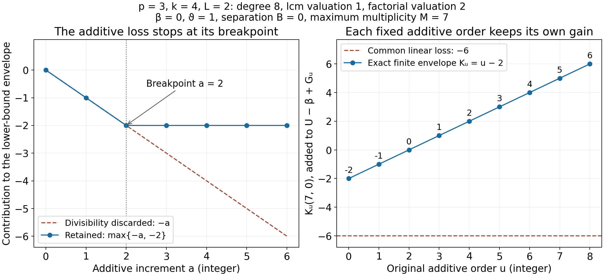

*Figure 10.27. An exact illustrative scalar calculation at \(p=3,k=4,L=2,D_{\mathrm a}=8\), so \(\ell_p=1,\chi_p=2\), with \(\beta=0,\vartheta=1,B=0,M=7\). Left: at \(u=0\), the expression minimized in (10.319) is \(\max\{-a,-2\}\), for integer \(0\le a\le6\); its minimum is \(-2\), attained from \(a=2\) onward. The dashed line displays the bound \(-a\) obtained after discarding additive divisibility. Right: the exact lower-bound envelope is \(K_u(7,0)=u-2\) for every \(0\le u\le8\), compared with the common linear-loss contribution \(-6\) from \(C_0=1\). These are contributions to \(U-\beta+G_u\), not valuations of actual nonzero auxiliary values. The displayed integers are checked in Solution 47; Theorems 10.118–10.119 prove the general mechanism. [Figure program](../figure_sources/additive_jet_precision.py). Human-source context: the original ordinary-jet extrapolation in [Yu's freely accessible paper](https://archive.ymsc.tsinghua.edu.cn/pacm_download/117/6782-11511_2013_Article_106.pdf), Section 5, equations (5.25)–(5.32); the order-dependent refinement is proved above.*

## 40. General integer zero production at the original parameters

We now perform the strict analytic and arithmetic comparisons for every original field, prime and rank case. The integer radii and jet orders are formed from the original real parameters. The q-denominator at a contracted stage is charged in full; its depth-dependent cost is controlled by the corresponding decrease in the torus height.

### The original height and descent ranges

Retain Sections 26, 29 and 36–39. Choose the original \(\theta=\vartheta/(1+\varepsilon_n)\), where \(\varepsilon_n=10^{-26}/(2n)\) and \(n\) is the number of original logarithms, as in (10.74). The estimates below are also valid for \(\theta=\vartheta/(1+\tau)\) with \(0<\tau\le10^{-6}\). Let \(b_n\ne0\) have minimum p-adic valuation among the nonzero coefficients. Put

\[
\begin{aligned}
B_{\dagger}&=\min_{b_j\ne0}|b_j|,&
h&\ge\max\{g_0,(r+1)t,\ln B_{\dagger},\ln(R_{\max}/(dW(d)))\},\\
U&=\frac{q^{r+1}S\mathcal D}{et},&
W_*&=\frac{et}{dZ},&W_*U&=q^{r+1},\\
S_I&=S\eta^{-(r+1)I},&T_I&=T\eta^{(r+1)I},&
\eta&=1-\frac{c_5}{r+1}.
\end{aligned}
\tag{10.323}
\]

Here \(t=f\ln p\), \(Z=S\mathcal D/d\), \(k=\lfloor h+\nu\ln q\rfloor\), and every other parameter is exactly (10.186). The following values of \(c_5\) complete the original constant table.

| Case | \(r=2\) | \(3\le r\le7\) | \(r\ge8\) |
|---|---:|---:|---:|
| I.1 | 0.5377 | 0.55 | 0.56 |
| I.2 | 0.538 | 0.551 | 0.56 |
| II | 0.53 | 0.54 | 0.55 |
| III.1 | 0.528 | 0.536 | 0.55 |
| III.2 | 0.5267 | 0.534 | 0.55 |
| IV | 0.5345 | 0.543 | 0.56 |
| V | 0.753 | 0.78 | 0.827 |

Use a nonnegative integer stage \(I\) satisfying
\(I\ln(q\eta^{r+1})\le3(A+\nu\ln q)\) and
\(c_5T_{I+1}/(r+1)\ge1\). These are the original geometric and multiplicity restrictions before either stopping point. They include \(I=0\): Lemma 10.104 gives \(T\ge g_4>6(r+1)\), while \(c_5>1/2\) and \(\eta^{r+1}>1/3\).

An admissible stage family has the same selected Euler derivations, an integral coefficient subvector of the initial kernel, its reference coefficient of minimum valuation, the phase condition of Theorem 10.55, full widths at most \(q^{-I}D_i\), and additive factors evaluated at \(q^{-I}x\). The original torus slopes and their projection are those of Lemma 10.91. The phase identity (10.151) puts every integer value in \(K\); the height and coefficient-minimum conclusions of Theorems 10.48 and 10.60 keep the original coefficient bound. Thus these data describe the full original induction, without a special rational or fixed-rank family.

### Coupled field bounds

**Lemma 10.121 (surplus and depth in the same field).** Write

\[
C_{01}=c_0\ell_d\frac{p^f}{p^f-1},\qquad
Y=e\theta,\qquad
\Omega_{\mathrm n}=\frac e d\left(\theta+\frac1{p-1}\right).
\tag{10.324}
\]

The following bounds hold simultaneously. In the third column, the lower bound for \(Y\) is the displayed number divided by \(1+10^{-6}\).

| Case | Lower bound for \(C_{01}\) | Numerator of the lower bound for \(Y\) | Upper bound for \(\Omega_{\mathrm n}\) |
|---|---:|---:|---:|
| I.1 | \(9c_0/8\) | \(3/2\) | 2 |
| I.2 | \(57/20\) | \(3/2\) | 2 |
| II | \(5c_0/4\) | \(5/2\) | \(3/2\) |
| III.1 | \(c_0\) | \(3/4\) | \(1/2\) |
| III.2 | \(c_0\) | \(3/4\) | 1 |
| IV, \(P=1\) | \(c_0\) | \(1/2\) | \(1/2\) |
| IV, \(P\ge7\) | \(c_0\) | \(7/2\) | \(4/3\) |
| V | \(10/3\) | 2 | \(3/2\) |

**Proof.** The local degree identity gives \(ef\le d\). In I.1, if \(d=2\), then \(f\le2\) and \(3^f/(3^f-1)\ge9/8\). At \(d=3\), use \(f\le3\) and \(\ln3>13/12\), giving \(\ell_d3^f/(3^f-1)>(13/12)(27/26)=9/8\). At \(d\ge4\), \(\ell_d\ge\ln4>4/3\) suffices. In I.2, \(e=f=d=1\), so \(C_{01}=(19/10)(3/2)=57/20\). In II, \(e\ge2\). At \(d=2,3\), we have \(f=1\), giving the factor \(5/4\). At larger \(d\), \(\ell_d>4/3>5/4\). The other odd-prime surplus bounds follow directly from \(\ell_d\ge1\) and \(p^f/(p^f-1)>1\).

In V, \(K\) contains a primitive cube root. Its quadratic field has degree two, so \(d\) is even. Its reduction has order three, hence \(f\) is even and at least two, as proved in Lemma 10.104. At \(d=2\), \(f=2\) and the surplus is \((5/2)(4/3)=10/3\). At \(d\ge4\), use \(\ell_d>4/3\). The logarithm bounds follow from the positive series in Solution 34; in particular \(\ln2>2/3\) and \(\ln3>1098/1000>13/12\).

Outside III, \(Y=P/[2(1+\tau)]\). The defining strict inequality \(2e<P(p-1)\) gives \(P\ge3,5,4\) respectively in I, II and V. In IV, \(P\) is either one or at least \(p\ge7\). In III, \(e=1\) and \(\vartheta=(p-2)/(p-1)\ge3/4\). These prove the depth column.

For I, use \(\theta\le3/2\), \(e/d\le1\), giving \(\Omega_{\mathrm n}\le2\); for II use \(\theta\le5/4\). In III, \(\theta+1/(p-1)\le1\), and \(d\ge2\) in III.1. If IV has \(P=1\), then \(2e<p-1\), so
\(\Omega_{\mathrm n}=[1/(2(1+\tau))+e/(p-1)]/d<1/d\le1/2\).
For its other branch, \(\theta\le p/(p-1)\) gives \(\Omega_{\mathrm n}\le(p+1)/(p-1)\le4/3\). Finally Lemma 10.73 gives \(e/d\le1/2\) in V, and \(\theta\le2\), giving \(\Omega_{\mathrm n}\le3/2\). \(\square\)

### The additive polynomial and the contracted denominator

**Lemma 10.122 (integer-stage scalar costs).** At the target radius \(X=q^{j+1}S_I\), \(j\ge0\), the additive part of the bound (10.312) satisfies

\[
\frac{D_{\mathrm a}\ln(R_I+1)-L\ln(k!)}Z
<\frac{\lambda}{c_1c_4}
\left(1+\frac{j\ln q}{A+\nu\ln q}\right),
\qquad \lambda<\frac{189}{188}.
\tag{10.325}
\]

At \(I=0\) there is no q-denominator. At \(I\ge1,j\ge1\), its full denominator cost and the torus height obey

\[
\frac{\Xi_{I,0,u}\ln q}Z
+\frac{PXq^{-I}\sum_iD_i\sigma_i}Z
\le\frac{q^{j+1}}{c_1c_2}
+\frac{\lambda\ln q}{c_1c_4(q-1)(A+\nu\ln q)}.
\tag{10.326}
\]

**Proof.** Monotonicity of \(\ln x\) gives
\(\ln(k!)\ge\int_1^k\ln x\,dx=k\ln k-k+1\). Thus the additive numerator in (10.325) is at most \(D_{\mathrm a}\ln[\mathrm e(R_I+1)/k]\). Put \(H_1=h+\nu\ln q\). Since \(k\ge39\), \(H_1/k<40/39\). We have \(R_I+1=2k+q^{j+1}S(q\eta^{r+1})^{-I}\). The table gives \(c_3q^2<77/5\), and \((r+1)d\ge3,t>1\). Therefore

\[
\frac{R_I+1}{k}
<q^j(r+1)d\left(\frac23+\frac{77}5\frac{40}{39}\right)
=\frac{214}{13}q^j(r+1)d.
\]

The exponential series through degree five at three exceeds \(214/13\), so \(\ln[\mathrm e(R_I+1)/k]<g_1+j\ln q\le A+j\ln q\). Insert \(D_{\mathrm a}/Z\le\lambda/[c_1c_4(A+\nu\ln q)]\) from Lemma 10.70. This proves (10.325), retaining the factorial contribution.

Let \(Q=q\eta^{r+1}>1\), \(D=A+\nu\ln q>5\). The exact full-width term is \(q^{j+1}Q^{-I}/(c_1c_2)\). Formula (10.243) and the proved factorial bound give \(\Xi_{I,0,u}\le D_{\mathrm a}(I+1/(q-1))\). Only the part proportional to \(I\) needs absorption. Set
\(a=q^{j+1}/(c_1c_2)\), \(b=\lambda\ln q/(c_1c_4D)\).
The function \(aQ^{-z}+bz\) is convex for \(z\ge0\). On \(0\le z\le3D/\ln Q\), its maximum is bounded by its two endpoints. At zero its value is \(a\). At the other endpoint its ratio to \(a\) is
\(\exp(-3D)+3\lambda c_2\ln q/(c_4q^{j+1}\ln Q)\).

For odd primes, \(c_5\le14/25\) and the increasing function \((1-c/y)^y\), \(y\ge3\), gives
\(Q\ge2(61/75)^3>43/40\). Hence \(\ln Q>6/83\), by the first term of the positive logarithm series. With \(c_4>18\), \(j\ge1\), and \(\ln2<347/500\), the second ratio term is less than \(4233747/6016000<3/4\).
In V, apply the same increasing function separately in the three rank bands: their endpoints give
\(3(749/1000)^3,3(161/200)^4,3(8173/9000)^9>5/4\).
Thus \(\ln Q>2/9\). Using \(c_4>15/4\) and \(\ln3<1099/1000\), the ratio term is less than \(300027/470000<2/3\). The first ratio term is less than \(1/1000\): \(D>5\), and the exponential series through degree six at 15 exceeds 1000. Both endpoint ratios are less than one. Convexity therefore absorbs the entire \(I\)-dependent cost. The remaining \(1/(q-1)\) term is exactly the second term in (10.326).

For the stated monotonicity, the derivative of \(y\ln(1-c/y)\) is \(\ln(1-z)+z/(1-z)>0\), \(z=c/y\); its latter expression has derivative \(z/(1-z)^2>0\) and value zero at zero. No denominator at q has been treated as globally harmless. \(\square\)

### The analytic input at every order

**Lemma 10.123 (all integer input budgets).** Put \(\beta=v_p(b_n)\). For a fixed additive order \(u\le D_{\mathrm a}\), the exact envelopes of Section 39 satisfy

\[
G_u+K_u(M,B)
\ge(D_{\mathrm a}-u)\theta
 -(M-1)\max\{0,\beta-\vartheta-B\}.
\tag{10.327}
\]

Consequently full-node interpolation has precision at least

\[
\min\{N_*\theta,\ U-\beta+(D_{\mathrm a}-u)\theta
 -(M-1)\max\{B,\beta-\vartheta,0\}\}
\tag{10.328}
\]

in the unchanged normal quantity \(v_p(\Phi)+G_u-\delta\).

At any allowed stage \(I\), and for \(0\le j\le r\), define
\(R=\lfloor q^jS_I\rfloor\),
\(\mu=\lfloor c_5\eta^jT_I/(r+1)\rfloor+1\),
\(N_*=(2R+1)\mu\), and \(B=\lfloor\log_p(2R)\rfloor\).
Then, simultaneously for all \(u\le D_{\mathrm a}\),

\[
U-\beta+(D_{\mathrm a}-u)\theta
>N_*\theta+(\mu-1)\max\{B,\beta-\vartheta,0\}.
\tag{10.329}
\]

The analytic gain obeys

\[
W_*N_*\theta>
\frac{c_5q\eta^j}{c_1}\left(2q^j-\frac1{S_I}\right).
\tag{10.330}
\]

**Proof.** Write \(\ell=v_p(\mathfrak v),\chi=Lv_p(k!)\). In the expression defining \(M_u(a)\), the identity
\(\chi-u\ell+\max\{-b\ell,u\ell-\chi\}=\max\{\chi-(u+b)\ell,0\}\)
is nonnegative. The remaining Euler contribution is at least \(a\min\{\vartheta-\beta,0\}\). Thus
\(G_u+M_u(a)\ge(D_{\mathrm a}-u)\theta+a\min\{\vartheta-\beta,0\}\).
Minimizing after adding \(aB\) proves (10.327), and substitution in Theorem 10.119 proves (10.328).

For each nonzero \(b_j\), its integer factorization gives \(v_p(b_j)\ln p\le\ln|b_j|\). The minimum-valuation choice of \(b_n\) therefore gives \(\beta\ln p\le\ln B_\dagger\le h\). Next,
\(\ln(3q^rS)<g_1+(11/10)r+\ln H_1\), since \(3c_3q<24<\mathrm e^4\) and \(t>1\). We have \(g_1\le4+r+\ln d\), while (10.288) implies
\(H_1>2(4+21r/10+\ln d)\). Also \(\ln H_1<H_1/2\), by the maximum \(\ln z/z=1/\mathrm e<1/2\). Hence \(\ln(3q^rS)<H_1\). With \(Y_I=\eta^{-(r+1)I}\ge1\), the inequality \(\ln Y_I\le Y_I-1\) gives
\(\ln(2R+1)\le\ln(3q^rS_I)<Y_IH_1\).
It follows that \(\max\{B,\beta-\vartheta,0\}\le Y_IH_1/\ln p\).

The identities \(S_IT_I=ST\) and \(W_*ST\theta=q(r+1)/c_1\), with \(\mu>c_5\eta^jT_I/(r+1)\) and \(2R+1>2q^jS_I-1>0\), prove (10.330). For the upper input bound, the stage restriction gives
\(\mu\le c_5(\eta^j+\eta^{r+1})T_I/(r+1)\).
Moreover
\(W_*\beta<1/[7(r+1)b_r]\), using \(ef\le d\), \(\mathcal D>b_r(A+\nu\ln q)t\), and \(c_3q>7/5\).
The remaining jet loss satisfies
\(W_*(\mu-1)\max\{B,\beta-\vartheta,0\}\le c_5\eta^j/[c_1c_3Y(r+1)]\).

For completeness, \(2c_5(\eta^r+\eta^{r+1})<27/20\) at odd primes and is less than \(3/2\) in V. To prove these uniform bounds, set \(c=c_5,y=r+1,z=c/y\). The logarithmic derivative of \((1-c/y)^{y-1}(2-c/y)\) is
\(\ln(1-z)+z/(1-z)-z/[y(1-z)(2-z)]\).
Its first two terms equal \(\int_0^z t/(1-t)^2\,dt\le z^2/[2(1-z)^2]\). The full derivative is nonpositive because \(c(2-z)\le2(1-z)\): at \(z\le c/3\) this follows from \(6-8c+c^2>0\) for \(c\le827/1000\). Thus the expression is largest at \(r=2\). The product \(2c(1-c/3)^2(2-c/3)\) increases up to \(c=827/1000\), since its derivative has the sign of \(18-24c+4c^2>0\) there. At the odd endpoint \(c=14/25\), and at the V endpoint \(c=827/1000\), direct rational substitution gives the asserted bounds.

Divide the upper input sum by \(q^{r+1}/c_1\). Since \(q\eta>1\), both \((q\eta)^j\) and \(q^j\) increase with \(j\); their endpoint \(j=r\) bounds the principal part by these last constants. The floor-radius remainder is less than \(1/200\), because \(S_I>58\) and \(q^r\ge4\). The jet-loss remainder is less than \(1/75\), since \(c_3Y>19/10\) at odd primes and \(c_3Y>19/20\) in V, by Lemma 10.121. The coefficient-minimum remainder is less than \(1/10000\), using \(c_1<3\) and \(b_r\ge7200/29\). Their sum is less than \(1/50\). Hence the input sum is less than \((137/100)q^{r+1}/c_1\) at odd primes and \((38/25)q^{r+1}/c_1\) in V. These are less than \(W_*U=q^{r+1}\), since \(c_1>7/5\) or \(c_1>5/2\), respectively. Dropping the nonnegative \((D_{\mathrm a}-u)\theta\) proves (10.329).

The projection is defined with the required depth: from (10.186), \(U/H_1>c_3q^{r+2}(r+1)b_r>5000\), while \(\beta<3H_1/2\). Thus \(U-\beta>1\ge1/(p-1)\). \(\square\)

### The strict arithmetic comparison

Use the simultaneous field bounds of Lemma 10.121, denoting its last three columns by \(C,Y_-,\Omega_+\); thus \(Y_-=Y_0/(1+10^{-6})\). Set \(\bar\lambda=189/188\), \(\ell_2=347/500\), \(\ell_3=1099/1000\), and

\[
\begin{aligned}
b_r&=\frac{7200}{29}14^{r-2},&
\epsilon_r&=\frac{3+14/(r+1)}{7b_r},\\
\bar g_{12}&=\begin{cases}0&d=1,\\(1+5/(r+1))/(546b_r)&d>1,\end{cases}&
\bar g_9&=\begin{cases}107/103&d=1\text{ or }r\ge8,\\
\max\{107/103,1+1/(3(r+1))\}&\text{otherwise}.\end{cases}
\end{aligned}
\tag{10.331}
\]

The following lower bounds \(S_-\le S\) will retain the floor-radius loss.

| Case | \(S_-\) |
|---|---:|
| I.1 and I.2 | \((10/11)c_3q(r+1)^2(39r/10+36/5)\) |
| II | \(c_3q(r+1)^2(39r/10+36/5)\) |
| III.1 and both IV branches | \(2c_3q(r+1)^2\) |
| III.2 | \(c_3q(r+1)^2\) |
| V | \((500/347)c_3q(r+1)^2(39r/10+36/5)\) |

Indeed \(S=c_3q(r+1)(d/f)H_1/\ln p\), and \(d/f\ge e\). Use \(h\ge g_0\) with \(\ln3<11/10\) in I, \(e\ge2\) and \(\ln5<2\) in II, and \(\ln2<347/500\) in V. These are the first three bounds. For III and IV use \(H_1\ge(r+1)t\) and their minimum degree, two except in III.2. The resulting \(S_-\) increase with \(r\); direct substitution at \(r=2\) gives \(S_->58\) in every row. Thus the same lower bound applies to \(S_I\).

Define

\[
\begin{aligned}
A_r={}&c_1(\bar g_{12}+\epsilon_r)\\
&+\frac{c_1\epsilon_r/2+\bar\lambda/c_4+
C_r^{\sharp}/(c_3Y_-)+117/(232c_2)}{C-1},\\
\mathcal R_r(j)={}&A_r+
c_1\left(\frac1{300}+\frac1{273\cdot999b_r}\right)
+\frac{\bar g_9\eta^{j+1}}{c_3Y_-}\\
&+\frac{\bar\lambda}{c_4}
\left(1+\Omega_++\frac{j\ell_q}{5}
 +\frac{\chi_j\ell_q}{5(q-1)}\right)
 +\frac{q^{j+1}}{c_2},\\
\mathcal L_r(j)={}&c_5q\eta^j\left(2q^j-\frac1{S_-}\right)
 -\mathcal R_r(j),
\qquad \chi_0=0,\quad\chi_j=1\ (j\ge1).
\end{aligned}
\tag{10.332}
\]

The number \(117/232\) bounds \((1+(2g_2)^{-1})/2\), since \(g_2>58\). Corollary 10.113 and Lemma 10.105 give
\(c_1[h_2(c)+\tfrac12\ln N_0]/Z<A_r\).
These bounds persist for every contracted coefficient subvector: each local vector norm decreases under deletion, hence so does the projective height, and \(N_I\le N_0\). Its chosen minimum reference coefficient remains present.

**Lemma 10.124 (the comparison margin increases along the integer steps).** For every original rank and field case,
\(\mathcal L_r(j)>\mathcal L_r(0)\) at every integer \(1\le j\le r-1\).

**Proof.** Write \(c=c_5\), \(a=\bar\lambda\ell_q/(5c_4)\). First omit the indicator term \(\chi_ja/(q-1)\) in \(\mathcal R_r(j)\), and allow a real variable \(s\in[0,r-1]\). Call the resulting difference \(\widetilde{\mathcal L}(s)\). Differentiation and deletion of its positive terms give

\[
\widetilde{\mathcal L}'(s)
\ge q^{s+1}\left[2c\eta^s\ln(q\eta)-\frac{\ln q}{c_2}\right]-a.
\tag{10.333}
\]

The terms deleted here are positive because \(\ln\eta<0\): they come from \(-cq\eta^s/S_-\) and \(-\bar g_9\eta^{s+1}/(c_3Y_-)\).

We establish a uniform positive lower bound for the bracket. Put \(b=c/(r+1-c)\). The inequality \(-\ln(1-z)\le z/(1-z)\) follows by integration of \(1/(1-z)\). Hence
\(\eta^{r-1}\ge\exp[-c+(2-c)b]\) and \(\ln(q\eta)\ge\ln q-b>0\). For \(s\le r-1\), the bracket is therefore at least
\(2c\exp(-c)\exp((2-c)b)(\ln q-b)-\ln q/c_2\).
The factor \(2c\exp(-c)\) increases for \(0<c<1\). For fixed positive \(a_0,l\), the derivative of \(\exp(a_0b)(l-b)\) changes sign at most once, from positive to negative. Its minimum on a compact interval consequently occurs at an endpoint.

At odd primes, \(5267/10000\le c\le14/25\), \(b\le14/61\), \(2-c\ge36/25\), and \(\ln2>693/1000\). The exponential at \(5267/10000\) is less than \(17/10\). At the two endpoints, the resulting product has the following lower bounds:

\[
\frac{693}{1000},\qquad
\left(\frac{693}{1000}-\frac{14}{61}\right)
\sum_{m=0}^{5}\frac{(504/1525)^m}{m!}
>\frac{129}{200}.
\]

It follows that the bracket is greater than
\(2(5267/10000)(10/17)(129/200)-(347/500)(4/7)
=36901/11900000>1/400\).
In V, use \(753/1000\le c\le827/1000\), \(b\le827/2173\), \(2-c\ge1173/1000\), \(\ln3>1098/1000\), and \(\exp(753/1000)<213/100\). The endpoint at zero is \(1098/1000\); the other endpoint, bounded with the exponential series through degree five, exceeds that number. The bracket is therefore greater than
\(2(753/1000)(100/213)(1098/1000)-(1099/1000)(9/13)
=71469/4615000>1/100\).
All exponential upper bounds just used follow by summing through degree ten and bounding the remaining positive series by
\(x^{11}/[11!(1-x/12)]\), for \(0\le x<1\); the ratio of each following term to its predecessor is at most \(x/12\). The logarithm intervals follow from the positive series of Solution 34, with four terms for \(\ln2\) and five for \(\ln3\), and its geometric tail estimate. Thus none is an unproved numerical decimal.

For \(s\ge1\), (10.333) is positive: at odd primes, \(q^{s+1}/400\ge1/100>a\), since \(a<1/125\); in V, \(q^{s+1}/100\ge9/100>a\), since \(a<3/50\). We must also pay the jump of the indicator at the first integer. On \(0\le s\le1\), use \(\eta^s\ge\eta\). At odd primes, \(\eta\ge61/75\), \(\ln(2\eta)>12/25\), and therefore the bracket exceeds
\(2(5267/10000)(61/75)(12/25)-(347/500)(4/7)>7/500\).
In V, \(\eta\ge2173/3000\), \(\ln(3\eta)>3/4\), giving a bracket greater than
\(2(753/1000)(2173/3000)(3/4)-(1099/1000)(9/13)>1/20\).
The two logarithm lower bounds follow from the first two positive terms, at \(2\eta\ge122/75\) and \(3\eta\ge2173/1000\).
Integrating (10.333) on this interval yields
\(\widetilde{\mathcal L}(1)-\widetilde{\mathcal L}(0)>q d_0-a>a/(q-1)\), using \(d_0=7/500\) or \(1/20\). Indeed \(2(7/500)-1/125>1/125\), and \(3/20-3/50>3/100\). After the full indicator cost is subtracted, \(\mathcal L_r(1)>\mathcal L_r(0)\). At later integers that cost is constant, and the positive derivative proves the assertion. \(\square\)

**Lemma 10.125 (strict margins in all original cases).** For every \(r\ge2\) and \(0\le j\le r-1\),

\[
\mathcal L_r(j)>\frac1{200}.
\tag{10.334}
\]

**Proof.** By Lemma 10.124 it suffices to check \(j=0\). For \(r=2,3,\ldots,7\), substitute their six integer values into (10.331)–(10.332), using the original constants of (10.186), the displayed \(c_5\) table and the coupled field bounds. Every quantity is rational. The following table gives strict lower bounds for the minimum of those six results.

For every \(r\ge8\), use the single last-band value of \(c_5\), \(C_r^{\sharp}<1\), \(\eta\le1\), \(\bar g_9=107/103\), and the values of \(\epsilon_r,\bar g_{12},b_r,S_-\) at \(r=8\). This is a uniform bound: \(b_r\) increases, \(\epsilon_r\) and \(\bar g_{12}\) decrease, and \(S_-\) increases. Thus every positive arithmetic cost is enlarged and every gain is diminished by these substitutions. The inequality \(C_r^{\sharp}<1\) follows directly from (10.307), or by subtracting it from one and using \(99/103>17/24\). The last column is the resulting strict lower bound for every integer \(r\ge8\).

| Case | Minimum over \(2\le r\le7\), greater than | Uniformly for \(r\ge8\), greater than |
|---|---:|---:|
| I.1 | \(80/1000\) | \(76/1000\) |
| I.2 | \(17/1000\) | \(5/1000\) |
| II | \(91/1000\) | \(89/1000\) |
| III.1 | \(52/1000\) | \(65/1000\) |
| III.2 | \(22/1000\) | \(45/1000\) |
| IV, \(P=1\) | \(28/1000\) | \(47/1000\) |
| IV, \(P\ge7\) | \(592/1000\) | \(690/1000\) |
| V | \(248/1000\) | \(402/1000\) |

These are finite rational inequalities, obtainable by multiplying positive denominators. The complete rational inputs and all 56 exact differences are generated by the [editable arithmetic certificate](../figure_sources/integer_comparison_bounds.py). Its calculation uses precisely (10.331)–(10.332), including \(S_-\), the normality contribution and the separate remainder. Solution 48 spells out the narrowest uniform row and its comparison with \(1/200\). The eight uniform rows use proved inequalities for all larger ranks; they are not an inference from sampled ranks. Lemma 10.124 then supplies every integer step, including the first q-denominator cost. \(\square\)

### The integer extension theorem

**Theorem 10.126 (general integer zero production).** Assume the original contradiction \(v_p(\mathcal L)\ge U\), the integral initial kernel of Corollary 10.113, and an admissible original stage \(I\) as above. Let \(j\in\{0,\ldots,r-1\}\) if \(I=0\), or \(j\in\{1,\ldots,r-1\}\) if \(I\ge1\). Suppose all its prepared values vanish at the integers \(|s|\le\lfloor q^jS_I\rfloor\) and selected derivative orders \(|\boldsymbol t|\le\lfloor\eta^jT_I\rfloor\). Then all its prepared values vanish at

\[
|s|\le\lfloor q^{j+1}S_I\rfloor,\qquad
|\boldsymbol t|\le\lfloor\eta^{j+1}T_I\rfloor.
\tag{10.335}
\]

**Proof.** Fix one target derivative, with additive order \(u\) and total selected order at most \(O=\lfloor\eta^{j+1}T_I\rfloor\). If \(u>D_{\mathrm a}\), it is identically zero by polynomial degree. Otherwise take \(R,\mu,N_*,B\) from Lemma 10.123. The integer inequality \(\lfloor A\rfloor-\lfloor B\rfloor\ge\lfloor A-B\rfloor\), for \(A\ge B\), follows by writing \(A-B=m+a\) with integer \(m\) and \(0\le a<1\). Apply it to \(A=\eta^jT_I\), \(B=\eta^{j+1}T_I\). It gives \(O+\mu-1\le\lfloor\eta^jT_I\rfloor\). The ordinary-jet transfer in Theorem 10.118 consequently provides all \(\mu\) input jets at each of the \(2R+1\) integer nodes. The projected function is normal on the same enlarged disc by Lemma 10.91 and Corollary 10.82; multiplication of the arguments by powers of q does not change their p-adic depths. Formula (10.329) and Theorem 10.119 give analytic precision at least \(N_*\theta\) in the original quantity \(v_p(\Phi)+G_u-\delta\).

Suppose the integer value \(V\) were nonzero. The phase identity (10.151) puts it in the original field \(K\). Apply Corollary 10.116 in that field, with exactly its degree \(d\) and local degrees \(e,f\). The coefficient term is bounded by \(A_r\). Lemma 10.122 bounds the additive polynomial and the entire torus/q-denominator contribution. Its indicator remainder is needed at \(I\ge1\), where \(j\ge1\); at \(I=0,j\ge1\) the same term is a harmless upper bound, and at \(I=j=0\) it is absent. The normal scalar satisfies
\(W_*G_u\le\lambda\Omega_{\mathrm n}/(c_1c_4)\), by \(u\le D_{\mathrm a}\) and Lemma 10.70. The individual Euler/lcm term is at most \(\bar g_9\eta^{j+1}/(c_1c_3Y_-)\), by Lemma 10.114 and the target order. Finally its separate scalar remainder is bounded using (10.311) and \(Z>273(r+1)b_r\), giving
\(\mathcal E_u/Z<1/300+1/(273\cdot999b_r)\).
Together these give
\(c_1W_*[v_p(V)+G_u-\delta]\le\mathcal R_r(j)\).
But (10.330), \(S_I\ge S_-\), and (10.334) give the strict opposite inequality
\(c_1W_*N_*\theta>\mathcal R_r(j)+1/200\).
Corollary 10.120 now forces \(V=0\), a contradiction. This holds for every target order and integer, proving (10.335). \(\square\)

**Corollary 10.127 (the full initial integer block).** Under the same original contradiction, the initial auxiliary polynomial of Corollary 10.113 has every prepared zero at
\(|s|\le\lfloor q^jS\rfloor\), \(|\boldsymbol t|\le\lfloor\eta^jT\rfloor\), simultaneously for \(j=0,1,\ldots,r\), for every original field, prime and rank case.

**Proof.** Its prescribed initial kernel equations give \(j=0\). The initial stage satisfies both descent restrictions. Apply Theorem 10.126 successively at \(j=0,1,\ldots,r-1\), using each concluded zero block as the next input. The coefficient vector, field, logarithmic slopes, radii and real multiplicities stay the original ones throughout. \(\square\)

Theorem 10.126 also proves the integer part of each subsequent admissible contraction, once that stage's first q-expanded zero block has been obtained. Producing that input uses fractional-node interpolation and coset extraction, separately from the integer induction proved here.

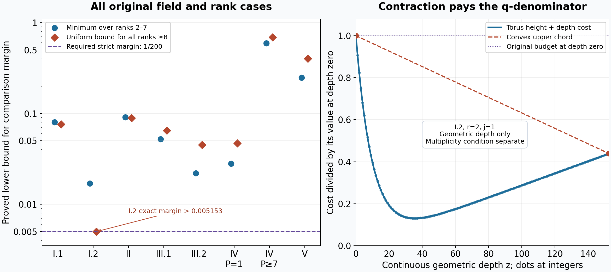

*Figure 10.28. Left: the strict lower bounds in Lemma 10.125, on a logarithmic vertical scale. Each first marker bounds all six ranks 2–7; each second marker bounds every rank at least eight by a single proved uniform estimate. The horizontal line is \(1/200\); the I.2 uniform marker equals that line as a displayed lower bound, and its exact margin is strictly larger, as Solution 48 verifies. Right: the convex denominator-absorption function of Lemma 10.122, divided by its value at depth zero, for the illustrative case I.2, \(r=2,j=1,D=4+\ln3\), \(c_5=269/500\). The continuous curve covers \(0\le z\le3D/\ln Q\); dots select integer depths in that geometric range. This plot does not assert that all these depths satisfy the separate multiplicity stopping condition. Both endpoint values lie at most one, so the upper chord proves the entire q-denominator budget. [Figure program](../figure_sources/general_integer_extension.py) and [exact comparison certificate](../figure_sources/integer_comparison_bounds.py). Human-source context: the original constant cases and integer extrapolation in [Yu's freely accessible paper](https://archive.ymsc.tsinghua.edu.cn/pacm_download/117/6782-11511_2013_Article_106.pdf), Table 3.1 and Section 5, equations (5.23)–(5.41); the coupled bounds, floor estimates and all strict comparisons are proved here.*

## 41. The full first fractional block and contraction

The preceding integer induction gives a hierarchy of zero blocks. Its earlier blocks have more derivatives than its last block. Retaining all those derivatives supplies the first fractional extrapolation in every original field and rank case, with the full degree of the normalized root field. We then pass to a coefficient class and fill its missing multiples of q.

Retain the original parameters and contradiction of Section 40. Write \(c=c_5\), \(a=r+1\), \(H=\eta^{r+1}\), \(S_1=H^{-1}S\), and \(T_1=HT\). Here the subscript 1 denotes the first stage; it does not replace any real parameter by its floor. Use the original phase and saturated Kummer data of Theorems 10.51 and 10.56.

### The mass of the complete nested input

**Lemma 10.128 (all initial integer blocks as one interpolation system).** For every \(0\le j\le r\), set

\[
\begin{aligned}
R_j&=\lfloor q^jS\rfloor,&T_j&=\lfloor\eta^jT\rfloor,&O&=\lfloor HT\rfloor,\\
\mu_j&=T_j-O+1,&
N_*&=(2R_0+1)\mu_0+
2\sum_{j=1}^r(R_j-R_{j-1})\mu_j.
\end{aligned}
\tag{10.336}
\]

These are valid nested multiplicities for every output derivative of order at most \(O\). They are positive and nonincreasing, and

\[
\begin{aligned}
N_*&=(2R_r+1)\mu_r+
\sum_{j=0}^{r-1}(2R_j+1)(\mu_j-\mu_{j+1}),\\
\frac{c_1W_*N_*\theta}{q^r}&>\Gamma_r,\qquad
\Gamma_r=\frac{2cq}{q^r}\sum_{j=0}^r(q\eta)^j-F_r,\\
F_r&=\frac{q(r+1)}{q^rS_-}
\left[1-H+2\sum_{j=1}^r(\eta^j-H)\right].
\end{aligned}
\tag{10.337}
\]

Here \(S_-\) is the original-case lower bound in Section 40. For a fixed additive order \(u\le D_{\mathrm a}\), the resulting normalized analytic precision at every \(x\in\mathbb Z_p\) is at least

\[
\min\{N_*\theta,\ U-\beta+(D_{\mathrm a}-u)\theta
-(\mu_0-1)\max\{B,\beta-\vartheta,0\}\},
\quad B=\lfloor\log_p(2R_r)\rfloor.
\tag{10.338}
\]

**Proof.** Corollary 10.127 provides the zeros through order \(T_j\) in each interval. For an output index of order at most \(O\), its next \(\mu_j-1=T_j-O\) ordinary jets are consequently available there, by Theorem 10.118. The inequality
\(\lfloor A\rfloor-\lfloor B\rfloor+1>A-B\) gives
\(\mu_j>(\eta^j-H)T\). The smallest real difference, at \(j=r\), is \(c\eta^rT/(r+1)\). The original first-stage restriction \(cHT/(r+1)\ge1\) makes this at least \(1/\eta>1\); hence all multiplicities are positive. Monotonicity follows from \(T_j\ge T_{j+1}\).

Telescoping proves the first equality in (10.337). For its strict lower bound, count the annuli instead of rounding the multiplicity differences. The inner interval has more than \(2S-1\) nodes. The \(j\)-th annulus has more than \(2(q^j-q^{j-1})S-2\) nodes, all positive. Multiply these lower counts by \((\eta^j-H)T\). The principal real sum is

\[
2ST\left[(1-H)+\sum_{j=1}^r(q^j-q^{j-1})(\eta^j-H)\right]
=\frac{2cST}{r+1}\sum_{j=0}^r(q\eta)^j.
\]

The removed radius-floor mass is at most
\(T[1-H+2\sum_{j=1}^r(\eta^j-H)]\).
Use \(c_1W_*ST\theta=q(r+1)\) and \(S\ge S_-\). This proves the second inequality of (10.337), without replacing a difference of floors by its real value.

Finally apply Theorem 10.119 to these full nested intervals, with \(M=\mu_0\) and \(E=0\). The cancellation (10.327) applies to its same fixed additive order. It gives (10.338), retaining the complete maximum jet order and all factorial/lcm contributions in the original normal quantity \(v_p(\Phi)+G_u-\delta\). \(\square\)

### A comparison in the actual root field

Let \(C,Y_-,\Omega_+,\bar g_9,\bar g_{12},b_r,\epsilon_r,A_r\) have the meanings and simultaneous field bounds of (10.331)–(10.332). Write \(d_r=5\) for \(2\le r\le7\), and \(d_r=6\) for \(r\ge8\); this number is a lower bound for \(A+\nu\ln q\), not a field degree. Define

\[
\begin{aligned}
\mathcal A_r^{\mathrm f}={}&A_r+
c_1\left(\frac1{300}+\frac1{273\cdot999b_r}\right)
 +\frac{\bar g_9H}{c_3Y_-}+\frac{\bar\lambda}{c_4}\\
&+\frac{\bar\lambda\ell_q}{d_rc_4}
\left(1+\frac1{q-1}\right)
 +\frac{H^{-1}+S_-^{-1}}{c_2}
 +\frac{\bar\lambda\Omega_+}{c_4q^r},\\
\mathcal I_r={}&c_1q-
\frac{c_1}{7(r+1)b_rq^r}
 -\frac{1-H+1/(6(r+1))}{q^rc_3Y_-}.
\end{aligned}
\tag{10.339}
\]

**Lemma 10.129 (both original first fractional comparisons).** For every original field, prime and rank case, the arithmetic upper bound for a nonzero value at \(x=s/q\), \(|x|\le\lfloor S_1\rfloor+1\), satisfies

\[
\frac{c_1W_*}{q^r}
\bigl[v_p(V)+G_u-\delta\bigr]\le\mathcal A_r^{\mathrm f}.
\tag{10.340}
\]

The second analytic entry of (10.338), in that same normalization, is greater than \(\mathcal I_r\). Moreover

\[
\Gamma_r-\mathcal A_r^{\mathrm f}>\frac1{50},\qquad
\mathcal I_r-\mathcal A_r^{\mathrm f}>1.
\tag{10.341}
\]

**Proof.** Theorem 10.56 gives the actual normalized support field
\(E_\Lambda\), with \([E_\Lambda:K]=q^{h_\Lambda}\), \(h_\Lambda\le r\), and unchanged chosen local degrees \(e,f\). Its nonzero hyperplane relation requires cancellation of \(\gcd(G_0,d_1,\ldots,d_r)\); those degree conclusions are therefore valid also when q divides the original phase modulus. They concern the full field, not just its selected completion.

Use the individual scalar bound of Corollary 10.116 over \(E_\Lambda\), as in Corollary 10.57. Its positive coefficient/scalar/torus envelope is multiplied by \(q^{h_\Lambda}\le q^r\). The normal term \(G_u\) is added after that multiplication; it is not multiplied by the degree factor. The coefficient envelope is \(A_r\). The separate remainder is the second term of \(\mathcal A_r^{\mathrm f}\). Since the output order is at most \(HT\), its individual Euler/lcm contribution is at most \(\bar g_9H/(c_3Y_-)\).

The target radius obeys
\(X/S\le H^{-1}+1/S_-<q\). To check the last inequality uniformly, at odd primes Lemma 10.122 gives
\(H\ge(61/75)^3\), hence \(H^{-1}<15/8\); also \(1/S_-<1/58<1/8\). In V its three rank bands give \(H>5/12\), so \(H^{-1}<12/5\), again leaving the required room. The additive term is consequently bounded by Lemma 10.122 at radius \(qS\), namely \(\bar\lambda/c_4\) after multiplication by \(c_1\). Its factorial contribution stays in that estimate. Formula (10.243) gives the full rational clearing bound
\(\Xi_{0,1,u}\le D_{\mathrm a}(1+1/(q-1))\).
Lemma 10.70 converts its cost to the fifth term of \(\mathcal A_r^{\mathrm f}\). The torus height gives the sixth term, including the rounded radius's \(+1\). Finally
\(c_1W_*G_u\le\bar\lambda\Omega_+/c_4\), proving the last term and (10.340). For \(r\ge8\),
\(A+\nu\ln q\ge g_1=4+\ln((r+1)d)>6\), since \(\ln9>2\). Thus the stated \(d_r\) bounds are valid.

For the analytic input, the coefficient-minimum loss satisfies
\(c_1W_*\beta<c_1/[7(r+1)b_r]\), by Lemma 10.123. Its same node estimate gives
\(\max\{B,\beta-\vartheta,0\}\le H_1/\ln p\).
Here \(\mu_0-1=\lfloor T\rfloor-\lfloor HT\rfloor\le(1-H)T+1\), and

\[
c_1W_*T\frac{H_1}{\ln p}
=\frac f{dc_3\theta}\le\frac1{c_3Y_-}.
\]

Since \(T>6(r+1)\), the input loss is bounded by the last term of \(\mathcal I_r\). Divide by \(q^r\), use \(W_*U=q^{r+1}\), and discard only the nonnegative \((D_{\mathrm a}-u)\theta\). This proves the asserted input lower bound.

For ranks 2–7, every expression in (10.337) and (10.339) is rational. Substitute each of the six integer ranks in each of the eight coupled field rows. For all larger ranks use the last constant \(c=c_5\), and set

\[
\begin{aligned}
H_-&=(1-c/9)^9,&
H_+&=\left(\sum_{j=0}^{10}\frac{c^j}{j!}\right)^{-1},\\
E_+(c)&=\sum_{j=0}^{10}\frac{c^j}{j!}
 +\frac{c^{11}}{11!(1-c/12)},\\
\Gamma_{\ge8}^{-}&=
\frac{2cq}{E_+(c)}\sum_{j=0}^{3}q^{-j}
 -\frac{153q}{q^8S_-(8)}.
\end{aligned}
\tag{10.342}
\]

The positive exponential series and its geometric tail prove \(\exp(c)<E_+(c)\) and \(\exp(c)>1/H_+\). The increasing function \((1-c/y)^y\) from Lemma 10.122 gives \(H_-\le H<\exp(-c)<H_+\). Also
\(r\ln(1-c/(r+1))\ge-rc/(r+1-c)>-c\), so \(\eta^r>1/E_+(c)\). In the reversed geometric sum of (10.337), retain its last four terms and use \(q\eta\le q\). This gives the principal part of \(\Gamma_{\ge8}^{-}\). For its floor loss, \(F_r\le q(r+1)(2r+1)/(q^rS_-(r))\). Each original \(S_-(r)/(r+1)^2\) is nondecreasing. The factor \((2r+1)/((r+1)q^r)\) decreases: its consecutive ratio is less than \(2/q\le1\). Hence its maximum on \(r\ge8\) is at eight, giving the last term of (10.342).

In the arithmetic upper bound replace \(C_r^{\sharp}\) by one, \(H\) by \(H_+\) in the Euler term and by \(H_-\) in its inverse, and every \(\epsilon_r,\bar g_{12},b_r,S_-,q^r\) by its conservative rank-eight value. In the input lower bound replace \(H\) by \(H_-\) and the decreasing losses by their rank-eight values. Every substitution has the correct direction. There are therefore eight rational uniform comparisons, in addition to the 48 finite-rank comparisons.

The strict lower bounds for the first gap are as follows. Each displayed integer is divided by 1000.

| Case | Minimum at ranks 2–7 | Uniformly at every rank at least 8 |
|---|---:|---:|
| I.1 | 1108 | 647 |
| I.2 | 1075 | 587 |
| II | 1121 | 679 |
| III.1 | 1041 | 589 |
| III.2 | 1023 | 580 |
| IV, \(P=1\) | 1040 | 574 |
| IV, \(P\ge7\) | 1473 | 1061 |
| V | 508 | 25 |

Every corresponding input gap is strictly greater than one. These are exact rational substitutions in the formulas just proved; the [editable comparison certificate](../figure_sources/first_fractional_bounds.py) generates all 56 differences and checks them using integer arithmetic. In particular the smallest uniform fractional comparison, in V, exceeds \(25/1000>1/50\). The infinite rank range follows from the displayed monotonicity and exponential bounds, not from numerical rank sampling. This proves (10.341). \(\square\)

### First fractional zero production

**Theorem 10.130 (the full original first fractional block).** Under the original contradiction and phase data above, the integral initial auxiliary family has all its prepared zeros at

\[
\Phi(s/q;\boldsymbol t)=0,
\qquad |s|\le q(\lfloor S_1\rfloor+1),\qquad
|\boldsymbol t|\le\lfloor T_1\rfloor.
\tag{10.343}
\]

This holds for every original field, prime and rank case.

**Proof.** Fix a target derivative. An additive order greater than \(D_{\mathrm a}\) gives an identically zero derivative. Otherwise use the complete nested integer input of Lemma 10.128. The projected function and its unprojected prepared value have the same lower precision (10.338), by the order-specific projection theorem. Since q differs from p, \(s/q\in\mathbb Z_p\); the principal exponential laws of Lesson 9 identify this analytic value with the normalized algebraic support value in \(E_\Lambda\). Its global degree factor is exactly \(q^{h_\Lambda}\), and its selected local degrees are the original ones.

If the value were nonzero, Lemma 10.129 would bound its normalized valuation by \(\mathcal A_r^{\mathrm f}\). The first analytic entry is strictly larger, by (10.337) and (10.341). The second entry is also strictly larger, by the input part of (10.341). Their minimum is therefore strictly larger than the arithmetic upper bound. Corollary 10.120 forces zero. Both inequalities are proved at the original rounded radius, including its \(+1\), for all derivative indices. \(\square\)

### Completing the first contraction

**Theorem 10.131 (the original first full contracted block).** A coefficient class containing an initial coefficient of minimum valuation may be chosen, with a nonzero contracted polynomial, original coefficient-height bound and original minimum. Its phase family is defined over \(K\), has torus widths at most \(q^{-1}D_i\) and additive argument \(q^{-1}x\). Initially it has the stronger zeros

\[
\Phi_1(s;\boldsymbol t)=0,
\qquad |s|\le q(\lfloor S_1\rfloor+1),\quad q\nmid s,
\quad |\boldsymbol t|\le\lfloor T_1\rfloor.
\tag{10.344}
\]

It also has all the zeros, including multiples of q, at

\[
\Phi_1(s;\boldsymbol t)=0,
\qquad |s|\le q(\lfloor S_1\rfloor+1),
\quad |\boldsymbol t|\le\lfloor\eta T_1\rfloor.
\tag{10.345}
\]

**Proof.** Apply the full phase and coset passage of Theorem 10.51 to (10.343), using its second phase partition when q divides \(G_0\). The saturated root-monomial basis separates the coefficient classes at \(q\nmid s\). Choose a class containing an initial coefficient attaining \(\delta\). Its coefficient subvector preserves that minimum, remains nonzero, and has no larger projective height. The affine prepared-jet transfer of Theorem 10.48 proves (10.344) at every selected order; its triangular leading entries are powers of q, hence are units at p. The widths and the additive argument are exactly (10.141)–(10.142); Theorem 10.60 preserves the original height envelope. The phase condition of Theorem 10.55 puts every integer prepared value of this new family in \(K\). No global root-degree factor is needed for those integer values.

Set \(R=q(\lfloor S_1\rfloor+1)\),
\(M=\lfloor cT_1/(r+1)\rfloor+1\),
\(N_*=2(q-1)(\lfloor S_1\rfloor+1)M\), and
\(B=\lfloor\log_p(2R)\rfloor\).
The nodes are exactly the q-deleted interval of (10.344), whose radius is divisible by q. The floor-difference inequality gives
\(\lfloor\eta T_1\rfloor+M-1\le\lfloor T_1\rfloor\), so all the required ordinary jets are present. Apply the q-deleted case of Theorem 10.119. Its extra term is \(EB=MB\), in addition to the inverse-coefficient and derivative loss.

Define the following arithmetic bound in the original field:

\[
\begin{aligned}
\mathcal A_r^{\mathrm c}={}&A_r+
c_1\left(\frac1{300}+\frac1{273\cdot999b_r}\right)
 +\frac{\bar g_9\eta H}{c_3Y_-}+\frac{\bar\lambda}{c_4}\\
&+\frac{\bar\lambda\ell_q}{d_rc_4}
\left(1+\frac1{q-1}\right)
 +\frac{H^{-1}+S_-^{-1}}{c_2}+\frac{\bar\lambda\Omega_+}{c_4},\\
\mathcal J_r={}&c_1q^{r+1}
 -\frac{c_1}{7(r+1)b_r}
 -\frac{3c}{(r+1)c_3Y_-}.
\end{aligned}
\tag{10.346}
\]

For a nonzero target integer value, \(c_1W_*[v_p(V)+G_u-\delta]\le\mathcal A_r^{\mathrm c}\). Indeed its coefficient/scalar envelope is unchanged, its order is at most \(\eta HT\), its torus width and argument give \(Rq^{-1}/(c_2S)\le(H^{-1}+S_-^{-1})/c_2\), including the rounded radius's \(+1\), and \(\Xi_{1,0,u}\le D_{\mathrm a}(1+1/(q-1))\) gives the full q-denominator term. Its additive scalar is evaluated at \(q^{-1}x\), of absolute size at most \(\lfloor S_1\rfloor+1<qS\), by Lemma 10.129; Lemma 10.122 therefore bounds it by the same additive term. The normal contribution now has no \(q^{-r}\) factor, because the value is in \(K\).

For the two analytic entries, we have

\[
\begin{aligned}
c_1W_*N_*\theta&>2cq(q-1),\\
c_1W_*\mathcal P_{u,\mathrm{input}}&>\mathcal J_r.
\end{aligned}
\tag{10.347}
\]

The first uses \(\lfloor S_1\rfloor+1>S_1\), \(M>cT_1/(r+1)\), and \(S_1T_1=ST\). For the second, the node bound of Lemma 10.123 gives
\(\max\{B,\beta-\vartheta,0\}\le H^{-1}H_1/\ln p\).
After the exact cancellation (10.327), the input loss is at most
\(MB+(M-1)\max\{B,\beta-\vartheta,0\}\).
Since \(M-1\le cT_1/(r+1)\) and \(M\le cT_1/(r+1)+1\), it is at most
\([2cT_1/(r+1)+1]H^{-1}H_1/\ln p\).
The identity used in Lemma 10.129 and the restriction \(cT_1/(r+1)\ge1\) bound its normalized value by \(3c/((r+1)c_3Y_-)\). The same coefficient-minimum estimate bounds \(\beta\). This proves (10.347), retaining both q-deleted losses.

The two strict comparisons are

\[
2cq(q-1)-\mathcal A_r^{\mathrm c}>\frac1{50},\qquad
\mathcal J_r-\mathcal A_r^{\mathrm c}>1.
\tag{10.348}
\]

They follow from the same 48 finite and eight uniform rational substitutions used in Lemma 10.129. For \(r\ge8\) bound \(\eta H\) by \(H_+\) and \(H^{-1}\) by \(H_-^{-1}\); the other monotone terms have their same rank-eight bounds. The gain has its constant last-band value. In \(\mathcal J_r\), use \(q^{r+1}\ge q^9\) and the decreasing losses at rank eight. Strict lower bounds for the first gap, again divided by 1000, are

| Case | Minimum at ranks 2–7 | Uniformly at every rank at least 8 |
|---|---:|---:|
| I.1 | 372 | 392 |
| I.2 | 338 | 332 |
| II | 402 | 420 |
| III.1 | 366 | 384 |
| III.2 | 326 | 348 |
| IV, \(P=1\) | 371 | 391 |
| IV, \(P\ge7\) | 725 | 836 |
| V | 5635 | 6334 |

Every corresponding input gap exceeds one; the [exact certificate](../figure_sources/first_fractional_bounds.py) checks all four comparisons in each of its 56 rows. Thus both analytic entries exceed the arithmetic bound for every target integer. Corollary 10.120 forces those values to vanish. This proves (10.345), and completes the first contraction in all original cases. \(\square\)

The higher-order q-deleted zeros (10.344) remain available alongside the full block (10.345). They belong to the input of later mixed extrapolations, rather than being discarded after the missing multiples of q have been filled.

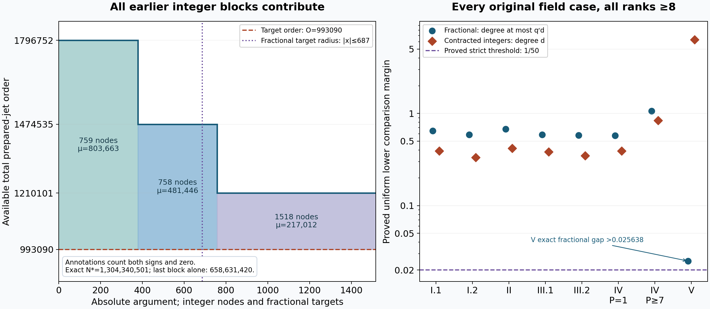

*Figure 10.29. Left: the actual certified integer radii and derivative floors of Solutions 39 and 49, with output order993090. Each annotation counts the full symmetric annulus, including zero in the first interval. The shaded excess derivative orders give the variable multiplicities of (10.336), with cardinal degree1304340501; the fractional target radius687 is the original rounded radius from (10.343). This is a precision profile, not a graph of auxiliary-function values. Right: the strict rational lower bounds for every original field case at every rank at least eight, under the proved uniform substitutions of (10.342). Fractional values retain their actual normalized root-field factor at mostq^r; after the exact phase passage, integer values belong toK. The horizontal threshold is1/50; the exact V fractional margin exceeds0.025638. Both input comparisons also pass, as proved in Lemma10.129 and Theorem10.131. [Figure program](../figure_sources/first_fractional_profiles.py) and [exact rational certificate](../figure_sources/first_fractional_bounds.py). Human-source context: the original fractional range and first phase passage in [Yu's free paper](https://archive.ymsc.tsinghua.edu.cn/pacm_download/117/6782-11511_2013_Article_106.pdf), Section5, equations(5.42)–(5.60); all field, nested-jet, floor and strict comparison arguments used here are proved in this lesson.*

## 42. Retaining the complete mixed profile

The full contracted interval and the higher-order q-deleted interval provide different information. Both remain available when the integer block is extended to larger radii. We now put an arbitrary number of these full blocks into the same interpolation system. The cardinal-polynomial loss must account separately for the deleted nodes.

### Mixed interpolation with any number of full intervals

**Theorem 10.132 (the complete mixed normal interpolation bound).** Let \(p\ne q\) be primes. Let \(1\le A\le R_1<\cdots<R_m\) be integers, where \(m\ge1\), and put

\[
\begin{aligned}
E_j&=[-R_j,R_j]\cap\mathbb Z,&
D&=\{s\in\mathbb Z:|s|\le A,\ q\nmid s\},\\
\nu_1&\ge\cdots\ge\nu_m\ge1,&
E&\ge0,& M&=\nu_1+E,\\
\mu(s)&=\nu_m+
\sum_{j=1}^{m-1}(\nu_j-\nu_{j+1})\mathbf1_{E_j}(s)
+E\mathbf1_D(s).
\end{aligned}
\tag{10.349}
\]

All the multiplicities and \(E\) are integers. Their total degree is

\[
\begin{aligned}
N_*&=(2R_m+1)\nu_m+
\sum_{j=1}^{m-1}(2R_j+1)(\nu_j-\nu_{j+1})
+2\bigl(A-\lfloor A/q\rfloor\bigr)E,\\
B&=\lfloor\log_p(2R_m)\rfloor.
\end{aligned}
\tag{10.350}
\]

Choose \(\rho\) with \(v_p(\rho)=\theta>0\) and a normal series \(F\). Suppose, for real numbers \(\Lambda,C\) with \(C\ge0\), that its divided jets satisfy
\(v_p(F_h(\rho s))+h\theta\ge\Lambda-hC\)
at every \(s\in E_m\) and \(0\le h<\mu(s)\). Then

\[
v_p(F(\rho x))\ge
\min\{N_*\theta,\ \Lambda-EB-(M-1)\max\{B,C\}\}
\qquad(x\in\mathbb Z_p\subset\mathbb Q_p).
\tag{10.351}
\]

For the prepared family, suppose the original values vanish through order
\(|\boldsymbol t|+\mu(s)-1\) at those nodes, with fixed additive order \(u\le D_{\mathrm a}\). Use the exact jet quantities \(G_u,M_u(h),K_u(M,B)\) of Theorems 10.117–10.119. Then the projected and unprojected values have the common lower bound

\[
\begin{aligned}
v_p(f(x;\boldsymbol t))+G_u-\delta&\ge\mathcal P_u,\\
v_p(\Phi(x;\boldsymbol t))+G_u-\delta&\ge\mathcal P_u,\\
\mathcal P_u&=
\min\{N_*\theta,\ U-\beta+G_u-EB-(M-1)B+K_u(M,B)\}.
\end{aligned}
\tag{10.352}
\]

In particular,

\[
\mathcal P_u\ge
\min\{N_*\theta,\ U-\beta+(D_{\mathrm a}-u)\theta
-EB-(M-1)\max\{B,\beta-\vartheta,0\}\}.
\tag{10.353}
\]

**Proof.** The intervals are nested, and \(D\subset E_1\). The representation of \(\mu\) in (10.349) is therefore its exact decomposition into a full outer layer, nonnegative full-interval increments and one nonnegative deleted increment. Counting each layer gives (10.350): there are \(2(A-\lfloor A/q\rfloor)\) nonmultiples of q in the symmetric interval, because zero is a multiple.

At every residue level \(p^a\), counts in the residue classes of a full consecutive integer interval differ by at most one. To prove this, write its length as \(kp^a+b\), \(0\le b<p^a\). Each class has either \(k\) or \(k+1\) representatives. For the deleted interval, subtract the representatives that are multiples of q. Their indices form the full interval \([-\lfloor A/q\rfloor,\lfloor A/q\rfloor]\), and multiplication by q permutes the classes modulo \(p^a\). Each of the two full-interval count differences is at most one in absolute value. Deleted-interval counts consequently differ by at most two. A bound of one does not hold in general.

For \(s\in E_m\), take the cardinal factor

\[
L_s(X)=\prod_{\substack{t\in E_m\\t\ne s}}
\left(\frac{X-t}{s-t}\right)^{\mu(t)}.
\]

If \(x\) is another node, it is zero; if \(x=s\), it is one. Consider a nonnode \(x\in\mathbb Z_p\). At a residue level \(a\le B\), an increment on a set containing s contributes
\(N_a(x)-N_a(s)+1-\mathbf1_{x\equiv s\ (p^a)}\).
For a full interval this is nonnegative: if the residues agree it is zero, and otherwise its first difference is at least \(-1\). For the deleted interval it is at least \(-1\). An increment on a set not containing s contributes \(N_a(x)-N_a(s)\), at least \(-1\) for a full interval and at least \(-2\) for the deleted interval.

The full outer layer always contains s. If \(s\in D\), all the full increments contain s, and only the deleted increment can lose valuation, by at most \(E\) at each level. If \(s\in E_1\setminus D\), all full increments still contain s, but the missing deleted increment can lose at most \(2E\). If s belongs to a later annulus, the missing full increments have total weight \(\nu_1-\mu(s)\), and the deleted increment can again lose at most \(2E\). All three cases give the same bound

\[
v_p(L_s(x))\ge-B\bigl(M-\mu(s)+E\bigr).
\tag{10.354}
\]

For \(a>B\), every nonzero denominator difference has valuation less than a, since \(0<|s-t|\le2R_m<p^a\). The remaining contributions are nonnegative. Thus the sum over the residue levels proves (10.354), also at the nodes by their zero or unit values.

The coefficient of degree a in
\[
L_s(s+Z)^{-1}
=\prod_{t\ne s}(1+Z/(s-t))^{-\mu(t)}
\]
has valuation at least \(-aB\). Indeed each negative-binomial coefficient is an integer, and each denominator difference has valuation at most B. Use the Hermite polynomial constructed in Lemma 10.94, with this exact multiplicity function. A term with divided jet h and Taylor-inverse degree \(a\le\mu(s)-1-h\) has valuation at least
\[
\Lambda-hC-B(M-\mu(s)+E)-aB
\ge\Lambda-EB-(M-1)\max\{B,C\}.
\]
Its degree is less than \(N_*\), and it has the required jets at every node.

The full monic normal-quotient construction in Lemma 10.94 applies to
\(W(Z)=\prod_{s\in E_m}(Z-\rho s)^{\mu(s)}\).
It produces \(F=H+WG\), with G normal and H the unique polynomial of degree less than \(N_*\) having those jets. At \(\rho x\), each factor of W has valuation at least \(\theta\), and G is integral. The quotient contribution is therefore at least \(N_*\theta\). The ultrametric inequality proves (10.351).

For the prepared family, Theorem 10.118 gives the weighted jet baseline \(U-\beta+G_u\) and increment \(M_u(h)\). The same Hermite term now has valuation at least
\[
U-\beta+G_u-EB-(M-1)B+M_u(h)+hB.
\]
Every h is less than M. Taking the minimum in the definition of \(K_u(M,B)\) proves the asserted lower bound for f. The projection error has precision at least \(U-\beta+G_u+\gamma_u\), by Lemma 10.117. Since \(K_u(M,B)\le M_u(0)=\gamma_u\), it has at least the second entry of (10.352). Adding it gives the same bound for \(\Phi\). Finally the exact fixed-order cancellation in Lemma 10.123 gives (10.353). This proves the theorem with both the deleted-cardinal cost and the complete inverse/jet cost retained. \(\square\)

### An exact small profile

Take \(p=2,q=3,A=R_1=9,R_2=18,\nu_1=3,\nu_2=1,E=2\). The twelve deleted nodes have multiplicity five, the remaining seven inner nodes have multiplicity three, and the eighteen outer nodes have multiplicity one. Thus

\[
N_*=12\cdot5+7\cdot3+18\cdot1
=37+19(3-1)+12\cdot2=99,\qquad M=5,\quad B=5.
\tag{10.355}
\]

The deleted nodes have residue counts \((4,3,2,3)\) modulo four. The discrepancy of two occurs here, so it is necessary to distinguish the deleted increment from a full interval. The uniform cardinal bounds in (10.354) are respectively \(-10,-20,-30\) at a deleted inner node, a nondeleted inner node and an outer node. With \(C=0\), (10.351) gives precision at least \(\min\{99\theta,\Lambda-30\}\). These are bounds on the interpolation calculation; they assert no value or zero for a particular auxiliary function.

For later course stages, the available full-interval orders and higher q-deleted orders must be inserted into this theorem without discarding either. The resulting cardinal count and input precision are exact. A zero-production conclusion additionally requires the corresponding strict arithmetic comparisons in the actual coefficient field.

### The exact inherited profile at a later depth

**Lemma 10.133 (the complete inherited mixed mass and input budget).** Retain every original rank, field and prime parameter of Section 40, and let \(I\ge1\) be an admissible depth with \(cT_{I+1}/(r+1)\ge1\). Write \(c=c_5,a=r+1,H=\eta^{r+1}\), \(S_I=H^{-I}S,T_I=H^IT\), and \(O=\lfloor HT_I\rfloor\). Suppose the stage-I family has all its q-deleted zeros through order \(\lfloor T_I\rfloor\) at radius \(q(\lfloor S_I\rfloor+1)\), all its full integer zeros through order \(\lfloor\eta T_I\rfloor\) at that radius, and all its full integer zeros through order \(\lfloor\eta^jT_I\rfloor\) at radius \(\lfloor q^jS_I\rfloor\), \(2\le j\le r\). Put

\[
\begin{aligned}
R_1&=q(\lfloor S_I\rfloor+1),&
R_j&=\lfloor q^jS_I\rfloor\quad(2\le j\le r),\\
\mu_j&=\lfloor\eta^jT_I\rfloor-O+1\quad(0\le j\le r),&
E&=\mu_0-\mu_1,\\
N_I&=(2R_r+1)\mu_r+
\sum_{j=1}^{r-1}(2R_j+1)(\mu_j-\mu_{j+1})
+2(q-1)(\lfloor S_I\rfloor+1)E.
\end{aligned}
\tag{10.356}
\]

These are valid multiplicities for every output derivative of order at most O. For a fixed additive order \(u\le D_{\mathrm a}\), Theorem 10.132 applies with \(M=\mu_0\), and its first analytic entry satisfies

\[
\begin{aligned}
\frac{c_1W_*N_I\theta}{q^r}
&>\Gamma_{r,I}^{\mathrm{mix}},\\
\Gamma_{r,I}^{\mathrm{mix}}
&=\frac{2cq}{q^r}
\left[\sum_{j=0}^r(q\eta)^j+q-2\right]\\
&\quad-\frac{q(r+1)}{q^rS_I}
\left[2(q+1)(\eta^2-H)+2\sum_{j=3}^r(\eta^j-H)\right].
\end{aligned}
\tag{10.357}
\]

An empty sum is zero. Its second analytic entry, in the same normalization, is strictly greater than

\[
\mathcal I_r^{\mathrm{mix}}
=c_1q-\frac{c_1}{7(r+1)b_rq^r}
-\frac{1-H+c(1+2H)/(r+1)}{q^rc_3Y_-}.
\tag{10.358}
\]

Here \(b_r,Y_-\) are the original coupled bounds in Lemma 10.121.

**Proof.** The original bound \(S_I\ge S>58\) gives
\(\lfloor q^2S_I\rfloor>q(\lfloor S_I\rfloor+1)\), since
\(q(q-1)S_I-q-1>0\). All the outer radii are strictly increasing. The floor-difference inequality gives
\(\mu_j>(\eta^j-H)T_I\). At the last layer,
\((\eta^r-H)T_I=c\eta^rT_I/(r+1)\ge1/\eta>1\).
Thus the multiplicities are positive and nonincreasing. Each node has exactly the available additional ordinary jets required by Theorem 10.118. The top increment on deleted nodes is \(E=\lfloor T_I\rfloor-\lfloor\eta T_I\rfloor\ge0\). Formula (10.350) is therefore precisely (10.356).

For the lower mass, count the nodes by disjoint types, with their full available multiplicities. There are exactly \(2(q-1)(\lfloor S_I\rfloor+1)>2(q-1)S_I\) deleted inner nodes, with multiplicity \(\mu_0\). There are \(2(\lfloor S_I\rfloor+1)+1>2S_I\) inner multiples of q, with multiplicity \(\mu_1\). The first outer annulus has more than
\(2(q^2-q)S_I-2(q+1)\) nodes, with multiplicity \(\mu_2\). Every subsequent annulus j has more than \(2(q^j-q^{j-1})S_I-2\) nodes, with multiplicity \(\mu_j\). Each lower node count is positive.

Multiply these counts by their respective strict lower multiplicities \((\eta^j-H)T_I\). The principal mass is

\[
\begin{aligned}
2S_IT_I\bigg[(q-1)(1-H)+(\eta-H)
+\sum_{j=2}^r(q^j-q^{j-1})(\eta^j-H)\bigg]\\
=\frac{2cS_IT_I}{r+1}
\left[\sum_{j=0}^r(q\eta)^j+q-2\right].
\end{aligned}
\tag{10.359}
\]

For the equality, subtract the full initial real annular sum of Lemma 10.128. The difference is
\((q-2)(1-\eta)=(q-2)c/(r+1)\).
The remaining removed floor mass is at most
\(T_I[2(q+1)(\eta^2-H)+2\sum_{j=3}^r(\eta^j-H)]\).
Use \(S_IT_I=ST\) and \(c_1W_*ST\theta=q(r+1)\). This proves (10.357), including the larger rounded inner radius. It does not round the differences of derivative floors independently.

For the input entry of (10.353), Lemma 10.123 gives
\[
B,\ \max\{B,\beta-\vartheta,0\}\le
H^{-I}H_1/\ln p,\qquad H_1=h+\nu\ln q.
\]
Also \(E\le cT_I/(r+1)+1\) and
\(\mu_0-1\le(1-H)T_I+1\). The two separate losses are consequently bounded by
\[
\left[(1-H+c/(r+1))T_I+2\right]H^{-I}H_1/\ln p.
\]
Since \(cHT_I/(r+1)\ge1\), we have \(2/T_I\le2cH/(r+1)\).
The identity
\(c_1W_*T_IH^{-I}H_1/\ln p=f/(dc_3\theta)\le1/(c_3Y_-)\)
therefore gives the last term of (10.358). Finally
\(W_*U=q^{r+1}\) and the strict coefficient-minimum bound of Lemma 10.123 give the first two terms. Discard only the nonnegative \((D_{\mathrm a}-u)\theta\). This proves the claimed strict input bound, retaining both \(EB\) and the maximum inverse/jet loss. \(\square\)

Thus the complete inherited profile supplies two explicitly proved analytic entries at every admissible later depth. To produce fractional zeros one must compare both of them with the nonzero-value upper bound in the actual normalized support field. These analytic bounds alone do not remove its global degree factor or the q-denominator cost.

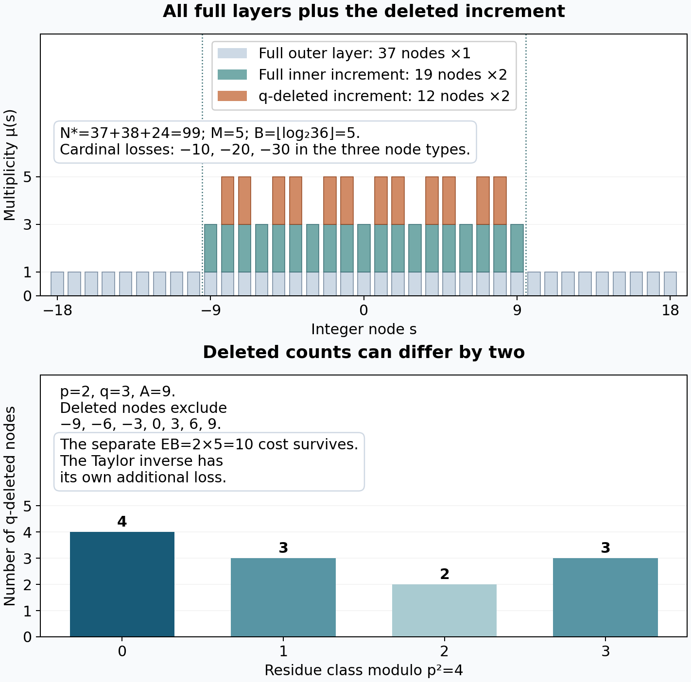

*Figure 10.30. The exact profile of (10.355) and Solution51, withp=2,q=3,A=R1=9,R2=18. Each bar represents one integer node and shows its complete multiplicity, decomposed into the full outer layer, full inner increment and q-deleted increment. The total degree is99. The lower panel counts the deleted nodes in the four residue classes modulo4; the counts4,3,2,3 show why discrepancy two is needed. Theorem10.132 proves the cardinal losses and the separateEB cost; Lemma10.133 supplies the later original floor profile without discarding any layer. These diagrams describe the interpolation system, not auxiliary-function values or a later zero-production comparison. [Figure program](../figure_sources/general_mixed_profiles.py). Human-source context: the original integer and fractional phase ranges in [Yu's freely accessible paper](https://archive.ymsc.tsinghua.edu.cn/pacm_download/117/6782-11511_2013_Article_106.pdf), Section5, equations(5.23) and(5.42)–(5.60); the arbitrary-layer mixed interpolation, floor-mass and fixed-order input proofs are given here.*

## 43. The complete prime-two phase induction

In the original case V, retaining more integer derivatives supplies the fractional interpolation with enough precision throughout the full descent. We choose each derivative loss from its actual arithmetic envelope. The subsequent comparison keeps the complete global root-field factor. It also treats the last contracted block, which can occur one step beyond the interval used to produce fractional zeros.

Throughout this section take the original case V, so \(p=2,q=3\). Retain all the original field, phase, coefficient, height and projection hypotheses of Section 40. Put \(a=r+1,c=c_5,\eta=1-c/a,H=\eta^a,Q=qH\), and \(D=A+\nu\ln q\). The additive degree remains \(D_{\mathrm a}=kL\); it is distinct from D. Let \(S_I=H^{-I}S,T_I=H^IT\). The exact original stopping indices are

\[
L_D=\frac{3D}{\ln Q},\qquad
I^*=\lfloor L_D\rfloor+1,\qquad
I_1=\max\{I\in\mathbb Z_{\ge0}:cT_I/a\ge1\},\qquad
I_0=\min\{I^*,I_1\}.
\tag{10.360}
\]

These indices exist: \(0<H<1,Q>1\), and the initial multiplicity bounds give \(cT_1/a>1\), as in Section 41. For \(1\le I<I_0\), both \(I\le L_D\) and \(cHT_I/a\ge1\) hold. At \(J=I_0\), only \(J\le L_D+1\) and \(cT_J/a\ge1\) are needed for closing the deleted interval.

### Arithmetic costs and chosen ordinary-jet losses

Use the exact rational coupled bounds \(Y_-=2/(1+10^{-6}),\Omega_+=3/2,C=10/3\) from Lemma 10.121, and \(b_r,\epsilon_r,\bar g_{12},\bar g_9,S_-\) from (10.331) and its table. The coefficient bound \(A_r\) of (10.339) is

\[
A_r=c_1(\bar g_{12}+\epsilon_r)+
\frac{c_1\epsilon_r/2+\bar\lambda/c_4+
C_r^{\sharp}/(c_3Y_-)+117/(232c_2)}{C-1}.
\tag{10.361}
\]

Here \(c_1=2.5347,c_2=13/9,c_3=0.4757,c_4=3.765\), \(\bar\lambda=189/188\), and \(C_r^{\sharp}\) is (10.307). Define

\[
\begin{aligned}
b&=A_r+c_1\left(\frac1{300}+\frac1{273\cdot999b_r}\right)+\frac{\bar\lambda}{c_4},&
n&=\frac{\bar\lambda\Omega_+}{c_4},\\
e_0&=\frac{\bar g_9}{c_3Y_-},&
\ell&=\frac{\bar\lambda(1099/1000)}{Dc_4},\\
\mathcal C(I)&=b+n+e_0H^I+\ell(I+1/2),\\
B_0(I)&=\mathcal C(I)+\frac{q(1+S_-^{-1})}{c_2}Q^{-I},\\
B_j(I)&=\mathcal C(I)+\ell j+\frac{q^{j+1}}{c_2}Q^{-I}\quad(1\le j<r).
\end{aligned}
\tag{10.362}
\]

The symbol \(e_0\) is a numerical envelope, not the ramification index. Choose

\[
\begin{aligned}
\varepsilon&=1/100,&\lambda_{\mathrm{node}}&=232/231,\\
\Delta_0(I)&=\frac{B_0(I)+\varepsilon}{2q(q-1)a},&
\Delta_j(I)&=\frac{\lambda_{\mathrm{node}}(B_j(I)+\varepsilon)}{2q^{j+1}a}\quad(1\le j<r),\\
\tau_0(I)&=1,&
\tau_j(I)&=1-\sum_{k=0}^{j-1}\Delta_k(I)\quad(1\le j\le r).
\end{aligned}
\tag{10.363}
\]

All quantities preceding the depth variable are those of the original construction. These choices change the retained derivative profile; they do not change its stopping indices, initial coefficients or height constants.

**Lemma 10.134 (the adaptive comparison envelopes).** Suppose \(1\le I<I_0\). A nonzero integer target at radius \(q(\lfloor S_I\rfloor+1)\), with total order at most \(T_I\), has normalized valuation \(c_1W_*[v_p(V)+G_u-\delta]\) at most \(B_0(I)\). A nonzero integer target at radius \(\lfloor q^{j+1}S_I\rfloor\), \(1\le j<r\), has the same normalized valuation at most \(B_j(I)\). The additive order u is fixed in each comparison.

For the fractional targets \(x=s/q\), \(|s|\le q(\lfloor S_I/H\rfloor+1)\), of total order at most \(\lfloor HT_I\rfloor\), the arithmetic envelope in normalization \(c_1W_*/q^r\) is

\[
A_{\mathrm f}(I)=b+e_0H^{I+1}+\ell(I+3/2)
+\frac{H^{-1}+S_-^{-1}}{c_2}Q^{-I}+\frac n{q^r}.
\tag{10.364}
\]

Assuming the necessary integer input zeros, the two analytic entries for deleted closure are bounded below by \(B_0(I)+\varepsilon\) and

\[
J_0(I)=c_1q^{r+1}-\frac{c_1}{7ab_r}
-\frac{2\Delta_0(I)+cH/a}{c_3Y_-}.
\tag{10.365}
\]

For the full extension from the jth to the \((j+1)\)st radius, with cutoffs \(\lfloor\tau_jT_I\rfloor,\lfloor\tau_{j+1}T_I\rfloor\), they are bounded below by \(B_j(I)+\varepsilon\) and

\[
J_j(I)=c_1q^{r+1}-\frac{c_1}{7ab_r}-\frac{\Delta_j(I)}{c_3Y_-}.
\tag{10.366}
\]

If \(1\ge\tau_1\ge\cdots\ge\tau_r>H\), the complete mixed fractional profile has its two analytic entries strictly greater than

\[
\begin{aligned}
\Gamma(I)&=\frac{2qa}{q^r}
\left[(q-1)(1-H)+(\tau_1-H)
+\sum_{j=2}^r(q^j-q^{j-1})(\tau_j-H)\right]\\
&\quad-\frac{qa}{q^rS_-}
\left[2(q+1)(\tau_2-H)+2\sum_{j=3}^r(\tau_j-H)\right],\\
J_{\mathrm f}(I)&=c_1q-\frac{c_1}{7ab_rq^r}
-\frac{1-H+\Delta_0(I)+2cH/a}{q^rc_3Y_-}.
\end{aligned}
\tag{10.367}
\]

**Proof.** At an integer target, Theorem 10.55 places the actual value in K. Corollary 10.116 therefore uses its full global degree d and local degrees e,f. The coefficient term is at most \(A_r\), and the scalar remainder is the separate term already included in b, by Theorem 10.115. An order at most \(T_I\) has Euler/lcm cost at most \(e_0H^I\), by Lemma 10.114. The normal contribution is at most n.

At the full extension radius, Lemma 10.122 bounds the additive part by \(\bar\lambda/c_4+\ell j\). Retain the actual torus term \(q^{j+1}Q^{-I}/c_2\) and clearing term \(\ell(I+1/2)\); no chord absorption is used here. These give \(B_j\).

For deleted closure, the additive argument has size at most
\(q^{-I}q(\lfloor S_I\rfloor+1)\le qSQ^{-I}+q^{1-I}\le S/H+1<qS\).
The last inequality is Lemma 10.129. The scalar monotonicity thus gives the j=0 additive cost. Its torus cost is at most \(q(1+S_-^{-1})Q^{-I}/c_2\), since \(q^{-I}\le Q^{-I}\). This proves \(B_0\).

At a fractional target the corresponding additive argument is at most
\(q^{-I}(\lfloor S_I/H\rfloor+1)\le(S/H)Q^{-I}+q^{-I}<qS\).
The torus cost is at most \((H^{-1}+S_-^{-1})Q^{-I}/c_2\), and the clearing exponent obeys \(\Xi_{I,1,u}\le D_{\mathrm a}(I+1+1/(q-1))\). Its order is at most \(HT_I\), giving \(e_0H^{I+1}\). Theorem 10.56 gives global degree \(dq^{h_\Lambda}\), \(h_\Lambda\le r\), with the original selected local degrees. Dividing the product-formula bound by \(q^r\) bounds every positive algebraic-height term by the terms displayed in (10.364). The normal contribution is added after that product-formula comparison; it is consequently \(n/q^r\). This proves (10.364), retaining the worst global factor even if the selected completion has local degree one.

For deleted closure take \(M_0=\lfloor\Delta_0T_I\rfloor+1\). The inequality \(\lfloor A\rfloor-\lfloor B\rfloor\ge\lfloor A-B\rfloor\) ensures that an output through \(\lfloor\tau_1T_I\rfloor\) has all M ordinary input jets at every deleted node. Their number is \(2(q-1)(\lfloor S_I\rfloor+1)>2(q-1)S_I\), and \(M_0>\Delta_0T_I\). The identity \(c_1W_*ST\theta=qa\) gives first entry strictly greater than \(2q(q-1)a\Delta_0=B_0+\varepsilon\).

Theorem 10.119 has both the deleted loss \(M_0B\) and the inverse/jet loss. Its exact cancellation (10.327) bounds their sum by
\([2\Delta_0T_I+1]H^{-I}H_1/\ln p\).
Here and below, the rounded inner radius also satisfies \(2R_1<3q^rS_I\); hence the separation bound of Lemma 10.123 applies to it. Since \(1/T_I\le cH/a\) and \(c_1W_*T_IH^{-I}H_1/\ln p\le1/(c_3Y_-)\), this gives (10.365). The coefficient-minimum loss is at most \(c_1/(7ab_r)\). Only the nonnegative term \((D_{\mathrm a}-u)\theta\) is discarded.

For a full extension take \(M_j=\lfloor\Delta_jT_I\rfloor+1\). The same floor-difference inequality provides all those ordinary jets between successive \(\tau\) cutoffs. The full node count exceeds \(2q^jS_I-1\). Since \(S_I\ge S_->58\) and \(q^j\ge2\),
\(1-1/(2q^jS_I)>231/232\).
The factor \(\lambda_{\mathrm{node}}\) in (10.363) thus gives first entry strictly greater than \(B_j+\varepsilon\). There is no deleted increment in this full system; \(M_j-1\le\Delta_jT_I\) gives (10.366) by the same exact fixed-order cancellation. This proves both integer input estimates without presuming a zero.

For fractional interpolation take \(O=\lfloor HT_I\rfloor\), full radii \(R_1=q(\lfloor S_I\rfloor+1),R_j=\lfloor q^jS_I\rfloor\) for \(2\le j\le r\), and multiplicities
\(\mu_j=\lfloor\tau_jT_I\rfloor-O+1\), with \(\mu_0=\lfloor T_I\rfloor-O+1\).
They are positive and nonincreasing. Every available input order covers the required additional jets, including when two derivative floors coincide. Apply Theorem 10.132 with deleted increment \(E=\mu_0-\mu_1\). The disjoint annular counts used in Lemma 10.133 now multiply \((\tau_j-H)T_I\), giving (10.367). Replacing \(S_I\) by its lower bound \(S_-\) enlarges the floor loss. No differences of floors are rounded separately.

For its second entry, \(E\le\Delta_0T_I+1\) and \(\mu_0-1\le(1-H)T_I+1\). Thus both deleted and inverse/jet losses together are at most
\([(1-H+\Delta_0)T_I+2]H^{-I}H_1/\ln p\).
Use \(2/T_I\le2cH/a\), then divide by \(q^r\). The identities \(W_*U=q^{r+1}\) and the same minimum-valuation bound give \(J_{\mathrm f}\). The comparison throughout is in the unchanged normal quantity with the same u and \(\delta\). \(\square\)

### Continuous depths and every rank

**Lemma 10.135 (strict adaptive bounds at every depth).** For every original V rank \(r\ge2\) and every \(1\le I\le L_D\),

let \(\mathcal G(I)=\Gamma(I)\) at ranks 2–7, and let
\(\mathcal G(I)=qa(2-1/(q^rS_-))(\tau_r(I)-H)\) at ranks at least eight. The latter is the lower mass from the last full block alone. Then

\[
\begin{aligned}
\Delta_0(I)<c/a,\qquad
\tau_r(I)>H,\qquad
J_j(I)-B_j(I)&>1\ (0\le j<r),\\
\mathcal G(I)-A_{\mathrm f}(I)>19/10,\qquad
J_{\mathrm f}(I)-A_{\mathrm f}(I)&>12/5.
\end{aligned}
\tag{10.368}
\]

For \(2\le r\le7\), each \(\tau_j(I)>\eta^j\). For every \(r\ge8\), \(\tau_r(I)>2/3\); the original \(\eta^j\) blocks are retained independently by Theorem 10.126.

There is also a strict closure comparison on the larger interval \(1\le J\le L_D+1\):

\[
2cq(q-1)-B_0(J)>3,\qquad
c_1q^{r+1}-\frac{c_1}{7ab_r}
-\frac{3c}{ac_3Y_-}-B_0(J)>1.
\tag{10.369}
\]

**Proof.** Fix r and the original D. Each \(B_j(I)\) is convex: it is a sum of positive multiples of \(H^I,Q^{-I}\), a constant and an affine function of I. Consequently each \(\Delta_j\) is convex and each \(\tau_j\) is concave. Each coefficient of \(\tau_j\) in \(\Gamma\) is positive. For j=2 this follows from
\(2(q^2-q)>2(q+1)/S_-\), and for j at least three from \(2(q^j-q^{j-1})>2/S_-\); the first coefficient is positive directly. The bounds \(S_->58,q=3\) imply both inequalities. The last-block mass is also a positive affine function of \(\tau_r\). Thus \(\mathcal G-A_{\mathrm f}\), \(J_{\mathrm f}-A_{\mathrm f}\), and every \(J_j-B_j\) are concave. It suffices to bound their two endpoints; likewise, an upper bound on \(\Delta_0\) and lower bounds on \(\tau_j\) follow from the endpoints. This is a proof for a continuous interval, not a check of sampled depths.

At I=1 every exponential is rational. At \(I=L_D\), use \(Q^{-L_D}=\exp(-3D)<1/1000\), \(H^{L_D}\le H\), and
\(\ell L_D=3\bar\lambda(1099/1000)/(c_4\ln Q)\).
The exponential inequality follows from the positive series through degree six at 15 and \(D>5\), as proved in Lemma 10.122. For a rational x greater than one put

\[
\mathcal L_{20}(x)=2\sum_{k=0}^{19}
\frac{((x-1)/(x+1))^{2k+1}}{2k+1}<\ln x.
\tag{10.370}
\]

The identity follows by integrating the finite geometric expansion of \(2/(1-z^2)\) from zero to \((x-1)/(x+1)\); its omitted integral is positive. This also proves the inequality without a numerical logarithm oracle. Replace the remaining \(1/D\) terms by \(1/5\) at ranks 2–7. In (10.362), the two upper endpoint common costs are then

\[
\begin{aligned}
C_{\mathrm E}&=b+n+e_0H+3\ell_-/2,\\
C_{\mathrm L}&=b+n+e_0H+
\frac{3\bar\lambda(1099/1000)}{c_4\mathcal L_{20}(Q)}+\ell_-/2,
\qquad \ell_-=\frac{\bar\lambda(1099/1000)}{5c_4}.
\end{aligned}
\tag{10.371}
\]

Use \(Q^{-1}\) and \(1/1000\), respectively, for the torus terms; use \(e_0H^2\) for the fractional Euler cost. All resulting \(B_j,\Delta_j,A_{\mathrm f}\) are upper bounds. The resulting \(\tau_j\) are lower bounds, and the positive coefficients just proved make their resulting \(\Gamma\) a lower bound. Formula (10.367) similarly gives a lower input entry.

The following are strict rational lower bounds, each divided by 1000, on the minima of the two endpoint differences. They are obtained from (10.361)–(10.367), (10.370)–(10.371) by multiplying positive denominators. The editable [rational certificate](../figure_sources/V_adaptive_comparison.py) supplies every integer numerator and denominator, and performs precisely these finite operations.

| Rank | Fractional mass gap | Fractional input gap | Terminal closure gap |
|---|---:|---:|---:|
| 2 | 1930 | 2456 | 3358 |
| 3 | 4129 | 2531 | 3657 |
| 4 | 7334 | 2838 | 3934 |
| 5 | 9512 | 3000 | 4088 |
| 6 | 11191 | 3100 | 4186 |
| 7 | 12895 | 3168 | 4254 |
| Every rank at least 8 | 7299 | 2520 | 4171 |

In the twelve finite endpoint substitutions, every integer input gap exceeds one, every \(\Delta_0<c/a\), and every \(\tau_j>\eta^j\). These are also finite rational inequalities with their original c bands, not extrapolations in r. Concavity proves their full depth ranges.

Here is the analytic bound that justifies the last row for all ranks. Take \(c=827/1000\) and define

\[
H_-=\left(1-\frac c9\right)^9,\qquad
H_+=\left(\sum_{k=0}^{10}\frac{c^k}{k!}\right)^{-1},\qquad Q_-=3H_-.
\tag{10.372}
\]

Lemma 10.122 proves \(H\ge H_-\). The inequality \(\ln(1-z)<-z\), obtained by integrating \(-1/(1-z)<-1\), gives \(H<\exp(-c)<H_+\). Thus \(Q\ge Q_->1\). The increasing \(b_r,S_-\), decreasing \(\epsilon_r,\bar g_{12}\), \(C_r^{\sharp}<1\), and \(\bar g_9=107/103\) bound b and \(e_0\) from above by their rank-eight substitutions with \(C_r^{\sharp}\) replaced by one. Write these bounds as \(b_+,e_+\), let \(S_8=S_-(8)\), and use \(\ell_+=\bar\lambda(1099/1000)/(6c_4)\). The original D exceeds six in this rank range, by the parameter bounds in Lemma 10.129.

The upper common endpoints are (10.371) with \(b_+,e_+,H_+,\ell_+\), and \(\mathcal L_{20}(Q_-)\). Write them as \(C_{\mathrm E}^+,C_{\mathrm L}^+\), and put \(C_{\max}=\max\{C_{\mathrm E}^+,C_{\mathrm L}^+\}\). To bound the sum of the adaptive losses, the finite positive sums are at most
\(\sum_{j\ge1}q^{-j-1}=1/[q(q-1)]=1/6\) and
\(\sum_{j\ge1}j q^{-j-1}=1/(q-1)^2=1/4\).
The first follows by multiplying a finite geometric sum by \(1-1/q\) and passing to its vanishing remainder. For the second, write \(j=\sum_{k=1}^j1\) and sum the nonnegative double series in either order, obtaining \((1/q^2)/(1-1/q)^2\). Hence

\[
\sum_{j=0}^{r-1}\Delta_j(I)\le\frac1a
\left[\frac{(1+\lambda_{\mathrm{node}})(\mathcal C(I)+\varepsilon)}{12}
+\frac{\lambda_{\mathrm{node}}\ell}{8}
+\left(\frac{1+S_-^{-1}}{4c_2}
+\frac{\lambda_{\mathrm{node}}(r-1)}{2c_2}\right)Q^{-I}\right].
\tag{10.373}
\]

At the early endpoint replace \(Q^{-I}\) by \(Q_-^{-1}\); at the late endpoint replace it by \(1/1000\). Use \((r-1)/a\le1\) and \(1/a\le1/9\). If these two torus bounds are v, the resulting loss bound is

\[
\frac{\lambda_{\mathrm{node}}v}{2c_2}
+\frac19\left[
\frac{(1+\lambda_{\mathrm{node}})(C^++\varepsilon)}{12}
+\frac{\lambda_{\mathrm{node}}\ell_+}{8}
+\frac{(1+S_8^{-1})v}{4c_2}\right].
\tag{10.374}
\]

The exact rational substitutions give \(1-\text{loss}>671/1000>2/3\) at the early endpoint and \(1-\text{loss}>892/1000>2/3\) at the late endpoint. Concavity then gives \(\tau_r>2/3\) throughout. Both comparisons are included in the two uniform certificate rows.

The last full block alone now has normalized fractional mass strictly greater than

\[
q\cdot9\left(2-\frac1{q^8S_8}\right)(2/3-H_+).
\tag{10.375}
\]

Indeed it has more than \(2q^rS_I-1\) nodes and multiplicity greater than \((\tau_r-H)T_I\). Use \(a\ge9,q^rS_I\ge q^8S_8\), and \(c_1W_*ST\theta=qa\). All the other increments in the mixed system are nonnegative. This is a lower bound for its actual total mass, without any requirement that every adaptive \(\tau_j\) exceed \(\eta^j\).

At both endpoints, enlarge (10.364) with \(b_+,e_+,H_+^2,H_-^{-1},S_8^{-1},\ell_+\), \(q^{-r}\le q^{-8}\), and the respective common depth terms. Subtracting this upper bound from (10.375) gives differences greater than \(9753/1000\) and \(7299/1000\). Since \(\Delta_0<c/a\), the input formula (10.367) is bounded below by (10.358). In that formula use \(1-H\le1-H_-\), \(2cH/a\le2cH_+/9\) and \(q^r\ge q^8\). Its two gaps exceed \(4974/1000\) and \(2520/1000\). These bounds prove the asserted uniform fractional comparisons.

For the remaining uniform integer assertions, the two endpoint bounds give \(B_0<8\). Consequently \(\Delta_0<(801/1200)/a<c/a\). For \(j\ge1\), \((C_{\max}+\ell_+j)/q^{j+1}\) decreases with j: cross multiplication reduces its next-step comparison to
\((q-1)C_{\max}+((q-1)j-1)\ell_+>0\).
Thus its largest value is at one, and exact rational substitution gives

\[
\frac{C_{\max}+\ell_+}{q^2}+\frac1{c_2Q_-}<3/2,
\qquad
\frac{\lambda_{\mathrm{node}}(3/2+\varepsilon/q^2)}2<4/5.
\tag{10.376}
\]

It follows that \(B_j<(3/2)q^{j+1}\), \(\Delta_j<4/(5a)\). The full input gap is bounded below by
\(q^8(qc_1-3/2)-c_1/(7\cdot9b_8)-(4/5)/(9c_3Y_-)\), which exceeds one. The closure gap is bounded below by
\(c_1q^9-c_1/(7\cdot9b_8)-[2(801/1200)+cH_+]/(9c_3Y_-)-8\), also greater than one. This proves every integer comparison at every rank, rather than testing finitely many larger ranks.

Finally, (10.369) needs the interval \([1,L_D+1]\). The function \(B_0(J)\) remains convex. Its early endpoint has the same upper bound as before. At the new late endpoint, \(Q^{-J}<1/1000,H^J\le H\), and \(\ell J\le3\bar\lambda(1099/1000)/(c_4\mathcal L_{20}(Q))+\ell_-\), using \(\ell_+\) in the uniform case. Its upper bound is therefore the previous late \(B_0\) bound plus that one extra \(\ell_-\) or \(\ell_+\). The third column of the table uses exactly this extra cost. The associated input bound in (10.369) exceeds its arithmetic bound by more than one in each of the twelve finite rows and the two uniform rows. Convexity proves (10.369) on the whole larger interval. All strict assertions of the lemma follow. \(\square\)

### Producing the actual zeros and passing the phase

**Theorem 10.136 (the complete original V first induction).** Under the original contradiction and initial integral auxiliary kernel of Section 40, there are nonzero stage families \(\Phi_I\) for every \(0\le I\le I_0\). Each has the original coefficient-height bound, minimum valuation \(\delta\), selected derivations and phase conditions, torus widths at most \(q^{-I}D_i\), and additive argument \(q^{-I}x\). Each has every original zero at

\[
\Phi_I(s;\boldsymbol t)=0,
\qquad |s|\le\lfloor qS_I\rfloor,\quad
|\boldsymbol t|\le\lfloor\eta T_I\rfloor.
\tag{10.377}
\]

For each \(1\le I\le I_0\), the stronger radius \(q(\lfloor S_I\rfloor+1)\) is available at that same full cutoff, together with all q-deleted zeros at that radius through \(\lfloor T_I\rfloor\). For every \(1\le I<I_0\), all full original outer blocks at radii \(\lfloor q^jS_I\rfloor\), cutoffs \(\lfloor\eta^jT_I\rfloor\), \(2\le j\le r\), remain available. The same family has the additional full adaptive blocks at those radii through \(\lfloor\tau_j(I)T_I\rfloor\), with the rounded first radius and cutoff \(\tau_1\). Its original fractional output is

\[
\Phi_I(s/q;\boldsymbol t)=0,
\qquad |s|\le q(\lfloor S_{I+1}\rfloor+1),\quad
|\boldsymbol t|\le\lfloor T_{I+1}\rfloor.
\tag{10.378}
\]

**Proof.** Corollary 10.127 and Theorems 10.130–10.131 supply the initial family, full first fractional block and stage-one family, including its q-deleted zeros. The original multiplicity bound ensures \(I_0\ge1\).

Suppose the stage-I q-deleted zeros have been obtained and \(1\le I<I_0\). First close them at cutoff \(\lfloor\tau_1T_I\rfloor\), using \(M_0\) from Lemma 10.134. Both analytic entries exceed \(B_0\), by (10.368); a nonzero value in K has the opposite arithmetic bound. Corollary 10.120 therefore forces every missing integer value to be zero. Since \(\Delta_0<c/a\), this includes the original full \(\eta T_I\) cutoff. Theorem 10.126 independently extends those original integer blocks through all \(\eta^jT_I\) cutoffs. In addition, apply Lemma 10.134 successively at \(j=1,\ldots,r-1\), with the just-proved adaptive block as the next input. Both entries exceed the corresponding \(B_j\). This gives every stated adaptive block for the very same coefficient family. No selection or coefficient change occurs during these integer extensions.

Use their complete mixed multiplicities for a target in (10.378). Both normalized analytic entries exceed \(A_{\mathrm f}\), by Lemma 10.135. The projected and unprojected values have the same proved precision, and the principal exponential laws identify the analytic original value with the actual algebraic value in the normalized support field. Corollary 10.120, with its full global degree factor and original selected local degrees, forces that value to vanish. This proves every fractional zero in (10.378) at its exact rounded radius and every derivative order.

Apply Theorem 10.51 to its nodes prime to q. Retain a class containing an original coefficient of valuation \(\delta\); when q divides \(G_0\), perform the required second phase partition too. The entire class vanishes at every prescribed node and order. The invertible affine binomial transfer preserves the total-order cutoff; q is a unit at p. The new coefficient subvector is integral, nonzero, of the same minimum and no larger height. Its widths shrink by q and its additive argument becomes \(q^{-(I+1)}x\). The actual phase identity puts its integer prepared values in K. This constructs \(\Phi_{I+1}\) with all q-deleted zeros at the rounded radius and cutoff \(\lfloor T_{I+1}\rfloor\).

For clarity, the full closure at the successor \(J=I+1\) is valid even when \(J=I_0\). Set \(M=\lfloor cT_J/a\rfloor+1\) and take the q-deleted radius \(q(\lfloor S_J\rfloor+1)\). The floor inequality supplies every ordinary jet for output \(\lfloor\eta T_J\rfloor\). Its first analytic entry exceeds \(2cq(q-1)\). The two separate deleted and inverse/jet losses are at most \([2cT_J/a+1]H^{-J}H_1/\ln p\). Since \(cT_J/a\ge1\), its second entry exceeds
\(c_1q^{r+1}-c_1/(7ab_r)-3c/(ac_3Y_-)\).
Its nonzero integer arithmetic envelope is \(B_0(J)\), by the same scalar, clearing, width and field argument as Lemma 10.134. Formula (10.369) forces every remaining integer value to vanish on \([1,L_D+1]\). This completes the full original final block without applying the fractional-depth comparison beyond its proved interval.

Induction now constructs the families through \(I_0\), with (10.377) and all the asserted stronger blocks. Every passage retains a coefficient attaining the original minimum, so none can vanish identically. The result proves the original V first induction at both possible stopping indices; the subsequent stopping contradictions and the other prime cases are separate arguments. \(\square\)

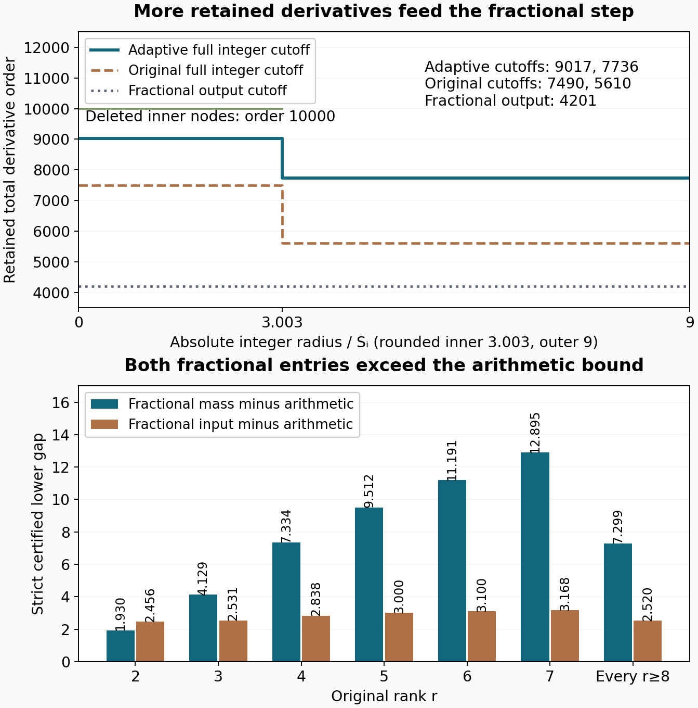

*Figure 10.31. Left: a conservative rank-two early-endpoint envelope, with D=5, evaluated by the exact rational formulas (10.361)–(10.363), at illustrative \(S_I=1000,T_I=10000\). The full cutoffs are \(\lfloor\tau_1T_I\rfloor,\lfloor\tau_2T_I\rfloor\); the original cutoffs are \(\lfloor\eta T_I\rfloor,\lfloor\eta^2T_I\rfloor\), and the fractional output is \(\lfloor HT_I\rfloor\). Deleted inner nodes additionally retain order10000. The panel describes available derivative cutoffs, not auxiliary-function values. Right: strict rational lower bounds for the mass and input gaps in Lemma10.135, minimized over both continuous-depth endpoints. The last column represents the proved uniform bound for every rank at least eight. The full factor \(q^r\) has already been charged in these fractional comparisons. The extra terminal closure is proved separately in (10.369). [Figure program](../figure_sources/V_adaptive_profile.py), [rational certificate](../figure_sources/V_adaptive_comparison.py). Human-source context: the original first induction and stopping indices in [Yu's freely accessible paper](https://archive.ymsc.tsinghua.edu.cn/pacm_download/117/6782-11511_2013_Article_106.pdf), Section5, equations(5.14)–(5.16),(5.20),(5.42)–(5.62). The adaptive bounds, complete interpolation comparisons and terminal closure are proved above.*

## 44. The complete odd-prime phase induction

For odd p the original integer derivative cutoffs already give enough fractional precision. We prove this for all seven coupled field rows, every rank and the entire original depth interval. The proof uses the full mixed profile of Section 42 and the global degree of the actual fractional support field.

Retain every original hypothesis of Section 40, now with odd p and q=2. The rows are I.1, I.2, II, III.1, III.2 and the two branches of IV. Put \(a=r+1,c=c_5,\eta=1-c/a,H=\eta^a,Q=qH,D=A+\nu\ln q\), and retain the stopping indices (10.360). Thus \(S_I=H^{-I}S,T_I=H^IT\). The additive degree \(D_{\mathrm a}=kL\) is unchanged. The original depth restriction gives \(1\le I<I_0\Rightarrow I\le L_D\) and \(cHT_I/a\ge1\). At the final stage only \(cT_{I_0}/a\ge1\) is asserted.

### Arithmetic envelopes and the complete input profile

Use the constants \(c_1,c_2,c_3,c_4\), their original rank bands for c, and the simultaneous bounds \(C,Y_-,\Omega_+\) in Lemma 10.121. In particular \(c_2=7/4\). Let \(b_r,\epsilon_r,\bar g_{12},\bar g_9,S_-\) be exactly the row-dependent bounds in (10.331). The number \(\bar g_{12}\) is zero in the degree-one rows I.2 and III.2; \(\bar g_9=107/103\) in those rows and at every rank at least eight. Define

\[
\begin{aligned}
A_r&=c_1(\bar g_{12}+\epsilon_r)+
\frac{c_1\epsilon_r/2+\bar\lambda/c_4+
C_r^{\sharp}/(c_3Y_-)+117/(232c_2)}{C-1},\\
b&=A_r+c_1\left(\frac1{300}+\frac1{273\cdot999b_r}\right)
+\frac{\bar\lambda}{c_4},\\
e_0&=\frac{\bar g_9}{c_3Y_-},\qquad
n=\frac{\bar\lambda\Omega_+}{c_4},\qquad
\ell=\frac{\bar\lambda(347/500)}{Dc_4},\qquad
\bar\lambda=189/188.
\end{aligned}
\tag{10.379}
\]

The coefficient bound is precisely (10.339); \(C_r^{\sharp}\) is (10.307). The symbol \(e_0\) again denotes a numerical cost rather than a local degree. Our two arithmetic envelopes are

\[
\begin{aligned}
A_{\mathrm f}(I)&=b+e_0H^{I+1}+\ell(I+2)
+\frac{H^{-1}+S_-^{-1}}{c_2}Q^{-I}+\frac n{q^r},\\
B_0(J)&=b+n+e_0H^J+\ell(J+1)
+\frac{q(1+S_-^{-1})}{c_2}Q^{-J}.
\end{aligned}
\tag{10.380}
\]

**Lemma 10.137 (odd-prime fractional and terminal envelopes).** For an admissible stage \(1\le I<I_0\), a nonzero fractional target \(x=s/q\), with
\(|s|\le q(\lfloor S_{I+1}\rfloor+1)\) and total derivative order at most \(\lfloor T_{I+1}\rfloor\), has
\((c_1W_*/q^r)[v_p(V)+G_u-\delta]\le A_{\mathrm f}(I)\).
Assuming all the original stage-I integer blocks, its two analytic entries in that same normalization are strictly greater than

\[
\begin{aligned}
\Gamma_r&=\frac{2cq}{q^r}\sum_{j=0}^r(q\eta)^j
-\frac{qa}{q^rS_-}
\left[2(q+1)(\eta^2-H)+2\sum_{j=3}^r(\eta^j-H)\right],\\
J_{\mathrm f,r}&=c_1q-\frac{c_1}{7ab_rq^r}
-\frac{1-H+c(1+2H)/a}{q^rc_3Y_-}.
\end{aligned}
\tag{10.381}
\]

For any integer stage \(J\ge1\) with \(cT_J/a\ge1\), a nonzero integer target at the rounded radius \(q(\lfloor S_J\rfloor+1)\), of total order at most \(\lfloor\eta T_J\rfloor\), has normalized valuation at most \(B_0(J)\). If all q-deleted zeros are available at this radius through \(\lfloor T_J\rfloor\), the two analytic closure entries are strictly greater than

\[
2cq(q-1),\qquad
J_{\mathrm c,r}=c_1q^{r+1}-\frac{c_1}{7ab_r}
-\frac{3c}{ac_3Y_-}.
\tag{10.382}
\]

All comparisons fix the same additive order \(u\le D_{\mathrm a}\) and use the original coefficient minimum \(\delta\).

**Proof.** Theorem 10.115 gives the coefficient bound \(A_r\) and the separate scalar remainder in b. At the fractional radius, the additive argument has size at most
\[
q^{-I}(\lfloor S_I/H\rfloor+1)
\le (S/H)Q^{-I}+q^{-I}<qS.
\]
The last strict inequality is the original scalar bound of Lemma 10.129. It gives the additive cost \(\bar\lambda/c_4\). The actual torus cost is at most
\((H^{-1}+S_-^{-1})Q^{-I}/c_2\), since \(S\ge S_-\) and \(q^{-I}\le Q^{-I}\). The fractional clearing exponent is
\(\Xi_{I,1,u}\le D_{\mathrm a}(I+1+1/(q-1))=D_{\mathrm a}(I+2)\).
The upper logarithm bound \(\ln2<347/500\), proved in Lemma 10.122, therefore gives \(\ell(I+2)\). The total output order is at most \(HT_I\), so Lemma 10.114 gives the Euler/lcm cost \(e_0H^{I+1}\).

The actual normalized support field in Theorem 10.56 has global degree \(dq^{h_\Lambda}\), \(h_\Lambda\le r\), and the original selected local degrees e,f. The product-formula comparison charges this entire factor. Divide its positive algebraic-height terms by \(q^r\); because \(q^{h_\Lambda-r}\le1\), each is bounded above by its displayed cost. The normal contribution is added after that comparison and is at most \(n/q^r\). This proves the first line of (10.380). It remains valid when the chosen completion has local degree one.

The original full and deleted blocks have the exact nested multiplicities (10.356). Lemma 10.133 proves their complete mass and fixed-order input estimates, including the separate deleted-cardinal and inverse/jet losses. Since q=2 and \(S_I\ge S_-\), (10.357)–(10.358) imply (10.381). All terms \(\eta^j-H\) in the subtracted floor loss are positive. Replacing \(S_I\) by \(S_-\) thus decreases that lower mass. No derivative floor is changed.

At the integer closure radius,
\[
q^{-J}q(\lfloor S_J\rfloor+1)
\le qSQ^{-J}+q^{1-J}\le S/H+1<qS.
\]
The additive bound is the same. The integer clearing exponent obeys \(\Xi_{J,0,u}\le D_{\mathrm a}(J+1)\), since the original binomial denominator contribution is at most \(D_{\mathrm a}/(q-1)\). The torus cost is at most \(q(1+S_-^{-1})Q^{-J}/c_2\), the Euler/lcm cost at most \(e_0H^J\), and the normal term at most n. The actual prepared integer value lies in K by Theorem 10.55. Corollary 10.116 therefore uses d, e and f without a fractional root-field factor. These facts prove \(B_0(J)\).

For the analytic closure choose \(M=\lfloor cT_J/a\rfloor+1\). The inequality
\(\lfloor T_J\rfloor-\lfloor\eta T_J\rfloor\ge\lfloor cT_J/a\rfloor\)
supplies every required ordinary input jet at every deleted node, for every output order under consideration. There are
\(2(q-1)(\lfloor S_J\rfloor+1)>2(q-1)S_J\) such nodes. Since \(M>cT_J/a\) and \(c_1W_*ST\theta=qa\), their normalized mass is strictly greater than \(2cq(q-1)\).

The exact cancellation (10.327) retains both the cardinal loss \(MB\) and the inverse/jet loss \((M-1)\max\{B,\beta-\vartheta,0\}\). Lemma 10.123 applies to this rounded interval because \(2q(\lfloor S_J\rfloor+1)<3q^rS_J\). Their sum is at most
\([2cT_J/a+1]H^{-J}H_1/\ln p\).
Use \(1/T_J\le c/a\), the identity
\(c_1W_*T_JH^{-J}H_1/\ln p\le1/(c_3Y_-)\),
\(W_*U=q^{r+1}\), and the strict coefficient-minimum bound from Lemma 10.123. Discard only the nonnegative term \((D_{\mathrm a}-u)\theta\). The remaining entry is strictly greater than \(J_{\mathrm c,r}\). This proves (10.382) using \(cT_J/a\ge1\), without the stronger successor multiplicity restriction. Orders \(u>D_{\mathrm a}\) vanish identically and require no comparison. \(\square\)

### A continuous interval and an infinite rank range

**Lemma 10.138 (all odd-prime strict comparisons).** At every original odd-prime rank \(r\ge2\), throughout \(1\le I\le L_D\),

\[
\Gamma_r-A_{\mathrm f}(I)>3/4,\qquad
J_{\mathrm f,r}-A_{\mathrm f}(I)>1.
\tag{10.383}
\]

Throughout the larger interval \(1\le J\le L_D+1\),

\[
2cq(q-1)-B_0(J)>1/4,\qquad
J_{\mathrm c,r}-B_0(J)>1.
\tag{10.384}
\]

**Proof.** Fix the actual r and D. The functions \(A_{\mathrm f},B_0\) are convex: they are sums of a constant, an affine function and positive multiples of \(H^I,Q^{-I}\). For example \((H^I)''=(\ln H)^2H^I>0\). All the analytic lower bounds in (10.381)–(10.382) are independent of depth. Their gaps are therefore concave. A concave function on a closed interval is bounded below by the lesser of its two endpoint values: its defining chord inequality gives this directly. We will bound precisely those endpoints.

At ranks 2–7 put \(\ell_-=\bar\lambda(347/500)/(5c_4)\) and
\(d_+=3\bar\lambda(347/500)/(c_4\mathcal L_{20}(Q))\),
where \(\mathcal L_{20}\) is the positive rational logarithm bound (10.370). Lemmas 10.122 and 10.129 give \(D>5\), \(Q>1\), \(L_D>1\), and
\(Q^{-L_D}=\exp(-3D)<1/1000\).
Consequently \(\ell\le\ell_-\), \(\ell L_D<d_+\), and \(H^{L_D+1}\le H^2\). The following are upper bounds at the early and late endpoints, respectively:

\[
\begin{aligned}
F_{\mathrm E}&=b+e_0H^2+3\ell_-
+\frac{H^{-1}+S_-^{-1}}{c_2Q}+n/q^r,\\
F_{\mathrm L}&=b+e_0H^2+d_++2\ell_-
+\frac{H^{-1}+S_-^{-1}}{1000c_2}+n/q^r,\\
C_{\mathrm E}&=b+n+e_0H+2\ell_-
+\frac{q(1+S_-^{-1})}{c_2Q},\\
C_{\mathrm L}&=b+n+e_0H+d_++2\ell_-
+\frac{q(1+S_-^{-1})}{1000c_2}.
\end{aligned}
\tag{10.385}
\]

The closure late endpoint is \(J=L_D+1\). Its clearing cost is \(\ell(L_D+2)\), which explains both copies of \(\ell_-\) in \(C_{\mathrm L}\). We have bounded \(H^{L_D+1}\) by the weaker H there. These substitutions only enlarge the arithmetic costs.

Here are strict lower bounds, divided by 1000, for all four endpoint gaps. The first table takes the minimum over ranks 2–7 and both endpoints. The second gives uniform bounds for every rank at least eight, justified below.

| Case, ranks 2–7 | Mass gap | Input gap | Closure gap | Closure input gap |
|---|---:|---:|---:|---:|
| I.1 | 1266 | 1204 | 320 | 9517 |
| I.2 | 1231 | 1163 | 288 | 9472 |
| II | 1278 | 1220 | 347 | 9473 |
| III.1 | 1200 | 1155 | 313 | 9438 |
| III.2 | 1164 | 1136 | 284 | 9418 |
| IV, \(P=1\) | 1219 | 1151 | 312 | 9449 |
| IV, \(P\ge7\) | 1530 | 1553 | 713 | 10088 |

| Case, every rank at least 8 | Mass gap | Input gap | Closure gap | Closure input gap |
|---|---:|---:|---:|---:|
| I.1 | 868 | 1366 | 392 | 739955 |
| I.2 | 815 | 1314 | 332 | 740095 |
| II | 913 | 1406 | 420 | 733980 |
| III.1 | 815 | 1303 | 383 | 732361 |
| III.2 | 780 | 1266 | 347 | 731256 |
| IV, \(P=1\) | 811 | 1300 | 391 | 737433 |
| IV, \(P\ge7\) | 1185 | 1675 | 836 | 737961 |

For each finite row, substitute the original rational c band, coupled constants, \(S_-\), \(b_r\) and \(C_r^{\sharp}\) in (10.379), (10.381), (10.382) and (10.385). Multiply the positive denominators. The editable [exact rational calculation](../figure_sources/odd_depth_endpoints.py) supplies all 84 individual finite substitutions and their integer numerators and denominators. Thus the finite columns are finite rational inequalities; the continuous depths follow from concavity.

We now justify the uniform columns without sampling ranks. For each row use its fixed c at ranks at least eight, and put

\[
\begin{aligned}
H_-&=(1-c/9)^9,\qquad
E_-(c)=\sum_{j=0}^{10}\frac{c^j}{j!},\qquad H_+=E_-(c)^{-1},\\
E_+(c)&=E_-(c)+\frac{c^{11}}{11!(1-c/12)},\qquad Q_-=qH_-.
\end{aligned}
\tag{10.386}
\]

The positive exponential series gives \(E_-<\exp(c)<E_+\). Indeed the omitted terms start at \(c^{11}/11!\); the ratio of each subsequent term to its predecessor is at most \(c/12<1\), with a strict inequality after the first ratio. Summing the geometric majorant proves the upper inequality. Lemma 10.122 proves \(H\ge H_-\); integration of \(-1/(1-z)<-1\) gives \(H<\exp(-c)<H_+\). Direct rational substitution in each original c row gives \(Q_->1\).

The same integral also gives, for \(0<z<1\),
\(\ln(1-z)>-z/(1-z)\), since \(1/(1-t)<1/(1-z)\) for \(0\le t<z\). Apply it with \(z=c/a\). Because \(a-c>r\),

\[
\ln(\eta^r)>-\frac{rc}{a-c}>-c,
\qquad \eta^r>\exp(-c)>E_+(c)^{-1}.
\tag{10.387}
\]

Reverse the principal geometric sum in (10.381):
\(q^{-r}\sum_{j=0}^r(q\eta)^j=\sum_{k=0}^r q^{-k}\eta^{r-k}\).
At ranks at least eight it contains its first four positive terms. Each of them is at least \(q^{-k}\eta^r\). The negative floor bracket in (10.381) is less than \(2(q+r-1)\), because every difference \(\eta^j-H\) is less than one. Hence

\[
\begin{aligned}
\Gamma_r&>
\frac{2cq}{E_+(c)}\sum_{k=0}^3q^{-k}
-\frac{2qa(q+r-1)}{q^rS_-}\\
&\ge
\frac{2cq}{E_+(c)}\sum_{k=0}^3q^{-k}
-\frac{2q\cdot9(q+7)}{q^8S_8}
=:\Gamma_+,
\qquad S_8=S_-(8).
\end{aligned}
\tag{10.388}
\]

For the second inequality q=2 makes the subtracted numerator \(4(r+1)^2\). The sequence \((r+1)^2/2^r\) decreases for \(r\ge8\): its consecutive ratio is \(((r+2)/(r+1))^2/2<1\). The original \(S_-\) increases in each row, as is explicit in (10.331). Their combination proves the rank-eight upper bound on the loss.

The parameters \(b_r,S_-\) increase, \(\epsilon_r,\bar g_{12}\) decrease, and \(C_r^{\sharp}<1\). All coefficients in (10.379) are positive. Consequently b is bounded above by \(b_+\), its rank-eight value with \(C_r^{\sharp}\) replaced by one; \(e_+=\bar g_9/(c_3Y_-)\) is constant in this rank range. By Lemma 10.129, D exceeds six. Define
\(\ell_+=\bar\lambda(347/500)/(6c_4)\) and
\(d_+^+=3\bar\lambda(347/500)/(c_4\mathcal L_{20}(Q_-))\).

In the four endpoints (10.385), replace b, \(e_0H^2,e_0H,H^{-1},S_-^{-1},Q^{-1},\ell_-,d_+,n/q^r\) by the respective upper bounds
\(b_+,e_+H_+^2,e_+H_+,H_-^{-1},S_8^{-1},Q_-^{-1},\ell_+,d_+^+,n/q^8\).
The late torus factor is still \(1/1000\). Call the resulting rational upper bounds \(F_{\mathrm E}^+,F_{\mathrm L}^+,C_{\mathrm E}^+,C_{\mathrm L}^+\). These are valid at every rank at least eight, in each row. Corresponding uniform analytic lower bounds are

\[
\begin{aligned}
J_{\mathrm f,r}&\ge c_1q-\frac{c_1}{7\cdot9b_8q^8}
-\frac{1-H_-+c(1+2H_+)/9}{q^8c_3Y_-}=:J_{\mathrm f,+},\\
J_{\mathrm c,r}&\ge c_1q^9-\frac{c_1}{7\cdot9b_8}
-\frac{3c}{9c_3Y_-}=:J_{\mathrm c,+}.
\end{aligned}
\tag{10.389}
\]

For the first use \(1-H\le1-H_-\), \(2cH/a\le2cH_+/9\), \(a\ge9,q^r\ge q^8,b_r\ge b_8\). For the second use those last three bounds and \(q^{r+1}\ge q^9\).

There are now only fourteen rational substitutions: seven coupled rows and two endpoints. Subtract their upper F bounds from \(\Gamma_+,J_{\mathrm f,+}\), and their upper C bounds from \(2cq(q-1),J_{\mathrm c,+}\). Multiplying positive denominators gives the uniform table displayed above. The same exact calculation file records all fourteen values. Over both tables, the minimum mass gap exceeds \(780/1000>3/4\), minimum fractional input gap exceeds one, minimum closure gap exceeds \(284/1000>1/4\), and minimum closure input gap exceeds one. Concavity extends these endpoint bounds to both entire depth intervals. This proves every assertion. \(\square\)

### The actual phase induction

**Theorem 10.139 (the complete odd-prime first induction).** Under the original contradiction and the initial integral kernel of Section 40, every odd-prime case has a nonzero family \(\Phi_I\) for each \(0\le I\le I_0\). Each retains the initial coefficient-height bound and minimum \(\delta\), selected derivations and phase conditions, widths at most \(q^{-I}D_i\), and additive argument \(q^{-I}x\). It has every original full integer zero

\[
\Phi_I(s;\boldsymbol t)=0,
\qquad |s|\le\lfloor qS_I\rfloor,\quad
|\boldsymbol t|\le\lfloor\eta T_I\rfloor.
\tag{10.390}
\]

For \(1\le I\le I_0\), the stronger rounded radius \(q(\lfloor S_I\rfloor+1)\) is available at this full cutoff, and its q-deleted nodes have every zero through \(\lfloor T_I\rfloor\). For \(1\le I<I_0\) the same family has all full integer outer blocks at radii \(\lfloor q^jS_I\rfloor\), cutoffs \(\lfloor\eta^jT_I\rfloor\), \(2\le j\le r\). Its full fractional output is

\[
\Phi_I(s/q;\boldsymbol t)=0,
\qquad |s|\le q(\lfloor S_{I+1}\rfloor+1),\quad
|\boldsymbol t|\le\lfloor T_{I+1}\rfloor.
\tag{10.391}
\]

**Proof.** The initial family and all its integer extensions are Corollary 10.127. The complete first fractional block is Theorem 10.130; Theorem 10.131 gives the stage-one family, both its rounded full block and q-deleted block. The original initial multiplicity bound gives \(I_0\ge1\). These earlier proofs include every original coupled row and rank.

Assume the stage-I family has its rounded full inner and deleted blocks, where \(1\le I<I_0\). Theorem 10.126 extends its original full integer blocks to every radius \(\lfloor q^jS_I\rfloor\) with cutoff \(\lfloor\eta^jT_I\rfloor\), \(2\le j\le r\). These comparisons use the same coefficient family throughout. The mixed multiplicities in (10.356) therefore apply to every target in (10.391) and every specified derivative order.

If such a value were nonzero, Lemma 10.137 would bound its normalized valuation above by \(A_{\mathrm f}(I)\), in its actual support field. Lemma 10.138 says that both analytic entries exceed this bound. The principal exponential laws in Lemma 10.92 identify the analytic value with the prepared algebraic value, and the projected and unprojected values have the identical proved precision. Corollary 10.120, with the full global factor \(q^r\), the selected local degrees and exact clearing, yields a contradiction. This proves (10.391) at every fractional node and derivative order.

Apply Theorem 10.51 to the nodes prime to q in that fractional block. Choose a phase class containing a coefficient of valuation \(\delta\); if q divides \(G_0\), apply its required second phase partition as well. Each chosen class vanishes at all the prescribed nodes and orders. The invertible affine binomial transfer preserves the total-order cutoff, since q is a unit at p. The selected coefficient subvector is integral, nonzero, of no larger height, and still has minimum \(\delta\). Its torus widths shrink by q, its additive argument is \(q^{-(I+1)}x\), and Theorem 10.55 puts its actual integer prepared values in K. Thus it is \(\Phi_{I+1}\), with every required q-deleted zero through \(\lfloor T_{I+1}\rfloor\).

Close that new deleted block with J=I+1. Even when \(J=I_0\), the original indices give \(J\le L_D+1\) and \(cT_J/a\ge1\). The last part of Lemma 10.137 supplies both analytic entries; (10.384) makes each strictly exceed the nonzero integer bound \(B_0(J)\). Corollary 10.120 forces every remaining integer value to vanish. Hence the stronger rounded full inner block is available through \(\lfloor\eta T_J\rfloor\), including the terminal stage. This step uses the larger closure interval, without extending the fractional comparison beyond \(L_D\).

Induction proves all the asserted families through \(I_0\). Their reference coefficients attain \(\delta\) at every phase passage, so all are nonzero. Every original integer and fractional radius and floor cutoff is retained. \(\square\)

**Corollary 10.140 (the first induction in every original prime and field case).** For each original case I–V and every rank \(r\ge2\), the original parameters (10.186), coefficient bounds and minimum, selected derivations and both stopping indices (10.360) admit nonzero stage families through \(I_0\), satisfying

\[
|s|\le\lfloor qS_I\rfloor,\quad
|\boldsymbol t|\le\lfloor\eta T_I\rfloor
\ \Longrightarrow\ \Phi_I(s;\boldsymbol t)=0.
\tag{10.392}
\]

For positive stages their full rounded and deleted blocks, and before the terminal stage their full original outer and fractional blocks, have exactly the stronger ranges specified in Theorems 10.136 and 10.139.

**Proof.** Theorem 10.139 covers all odd primes, including both degree-one rows and both IV branches with their simultaneous field bounds. Theorem 10.136 covers p=2 with q=3. These exhaust the original constant table. Both theorems preserve the identical initial kernel data and stopping indices, so their conclusions combine directly. \(\square\)

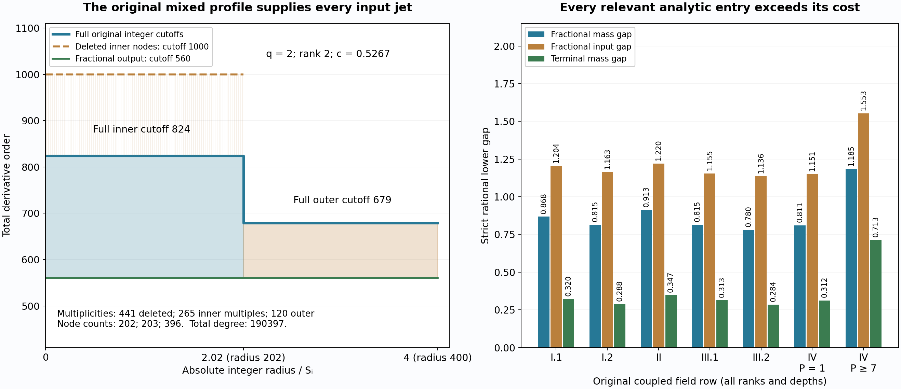

*Figure 10.32. Left: the original rank-two III.2 profile, with \(c=0.5267,S_I=100,T_I=1000\). The full inner radius is 202, the outer radius 400, their derivative cutoffs 824 and 679, and the fractional output cutoff 560. Deleted inner nodes retain order 1000. The illustration records interpolation inputs and output orders; it does not plot auxiliary-function values. Solution 53 computes the exact multiplicities 441, 265, 120 and total interpolation degree 190397. Right: strict lower bounds for both fractional gaps and the terminal mass gap in Lemma 10.138, minimized over all finite-rank and analytically uniform endpoints for each original coupled row. The comparisons retain the global \(q^r\) field factor. Terminal closure is proved on its separate larger interval. [Figure program](../figure_sources/odd_all_depth_profiles.py), [exact rational calculation](../figure_sources/odd_depth_endpoints.py). Human-source context: the original first induction and stopping ranges in [Yu's freely accessible paper](https://archive.ymsc.tsinghua.edu.cn/pacm_download/117/6782-11511_2013_Article_106.pdf), Section 5, equations (5.13)–(5.20), (5.42)–(5.62); the full comparison and phase-induction proofs are given here.*

## 45. Closing the geometric stopping branch

The first induction now supplies the actual zeros needed by the geometric reduction. Its last family retains the initial coefficient minimum, so its polynomial remains nonzero. The degree and rank-profile comparisons of Sections 34–35 therefore apply to that family with their original field and weights.

**Theorem 10.141 (the original geometric stopping contradiction).** Suppose the original contradiction parameters of Section 40 arise from the least admissible rank \(r\) in (10.277), with \(r\ge2\). Then the alternative \(I^*\le I_1\) is impossible.

**Proof.** If \(I^*\le I_1\), then \(I_0=I^*\). Set \(I\) equal to this integer. The exact stopping definition gives

\[
Q^I>\exp(3D),\qquad
\overline S=qS_I,\qquad \overline T=\eta T_I,
\qquad
\mathsf D_0=kL,\quad
\mathsf D_j=2q^{\nu-I}D_j\ (1\le j\le r).
\tag{10.393}
\]

Indeed \(I=\lfloor3D/\ln Q\rfloor+1>3D/\ln Q\), including when the quotient is an integer. Corollary 10.140 gives the nonzero terminal family and all of its prepared zeros for integer \(|s|\le\lfloor\overline S\rfloor\), total order at most \(\lfloor\overline T\rfloor\).

Its coefficients form a nonzero subvector of the original kernel, with one coefficient attaining \(\delta\). The additive basis still has k shifted polynomials and powers 1 through L. Its normalized torus exponent vectors are integral, distinct, and bounded by \(q^{\nu-I}D_j\). Proposition 10.31 therefore constructs a nonzero ordinary polynomial with the coordinate bounds in (10.393). The triangular binomial change and Laurent monomial shift convert exactly these prepared zeros into ordinary jets through the same total order. The selected Euler directions still span the original hyperplane W: affine translations of their eigenvalues give invertible triangular changes, and their scalar rescalings are nonzero. Lemmas 10.23 and 10.30 prove these assertions.

All original field, height and parameter data remain unchanged. The independent torus bases and nonzero vector \(\boldsymbol B\) are those of the minimum-rank representation. The original \(\theta=\vartheta/(1+\varepsilon_n)\) satisfies the weaker restriction \(0\le\tau\le1/100\) used in Theorem 10.100. Equation (10.393) is exactly its geometric depth hypothesis (10.264). Thus Theorem 10.100 verifies every degree inequality and every integer allocation required by Theorem 10.25, with the strict bounds \(36/25,8,31\).

Corollary 10.101 yields independent integral vectors of some rank \(1\le m<r\), representing the same nonzero form and producing local-unit bases in the original field. Theorem 10.102 preserves their exact residue-index-dependent rank profile, with the strict factor \(1/700\). Corollary 10.103 then contradicts the defining least rank \(r\). This rules out \(I^*\le I_1\), including equality. \(\square\)

Figures 10.22–10.23 display the degree thresholds, allocation margins and preserved rank-profile factor used in this proof. Human-source context for the original branch is [Yu's freely accessible paper](https://archive.ymsc.tsinghua.edu.cn/pacm_download/117/6782-11511_2013_Article_106.pdf), Section 6; the degree, multiplicity, jet and minimum-rank proofs used here are in this lesson.

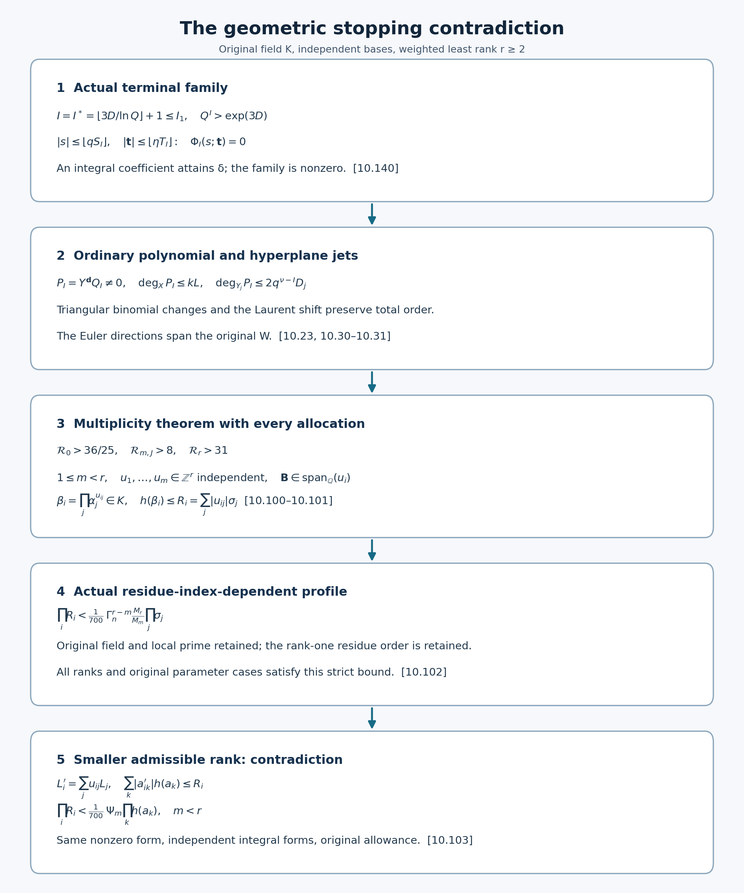

*Figure 10.33. The branch \(I^*\le I_1\) reaches its exact terminal integer, including \(I^*=I_1\). Corollary 10.140 supplies the zeros and the preserved nonzero coefficient. Proposition 10.31 converts them to ordinary hyperplane jets without increasing their total order; the polynomial has additive degree at most \(kL\) and torus degrees at most \(2q^{\nu-I}D_j\). Theorem 10.100 verifies all three allocation ratios. Corollary 10.101 produces independent integral vectors and new bases in the original field, and Theorem 10.102 retains the actual residue-index-dependent profile with factor \(1/700\). Corollary 10.103 gives a smaller admissible rank, contradicting minimality. Arrows indicate proved implications, with their exact locators; no sampled parameter case is used. [Figure program](../figure_sources/geometric_stop_coupling.py). Human-source context: [Yu's free paper](https://archive.ymsc.tsinghua.edu.cn/pacm_download/117/6782-11511_2013_Article_106.pdf), Section 6. Solution 54 checks the integer endpoint and the weighted composition.*

## 46. The multiplicity stop and the retained integer zeros

Retain the original contradiction and the actual stage families of Theorem
10.140. The remaining alternative to the geometric stop is \(I_1<I^*\).
Write \(a=r+1,c=c_5,H=\eta^a,Q=qH,D=A+\nu\ln q\). In this section
\(S_1=S_{I_1},T_1=T_{I_1}\): the subscript denotes the stopping stage,
which need not be the first stage. We first determine the exact last
integer derivative level and the subsequent depth. We also prove what a
family with the required final zeros would imply. The terminal integer
zeros themselves are constructed in Theorem 10.144 below.

**Lemma 10.142 (exact parameters of the fixed-order branch).** There is a
unique integer \(r_1\) with \(0\le r_1\le r\) and

\[
1\le\frac{c\eta^{r_1}T_1}{a}<\frac1\eta.
\tag{10.394}
\]

Set \(T_\flat=\eta^{r_1+1}T_1\),
\(R=q\lfloor q^{r_1}S_1\rfloor\), and

\[
I_2=\left\lfloor\frac{3D-I_1\ln Q}{\ln q}\right\rfloor+1,
\qquad I_3=I_1+I_2.
\tag{10.395}
\]

Then \(I_1\ge1,I_2\ge1\),
\(\eta\le cT_\flat/a<1\), and
\(Q^{I_1}q^{I_2}>\exp(3D)\), including a possible integer endpoint in
the quotient defining \(I_2\).

**Proof.** Lemma10.70 gives \(T\ge g_4\). In (10.284), \(F_r\ge9\) and \((7/2)^{r-2}\ge1\), so Lemma10.104 gives \(g_4>(9000/29)a>6a\). Thus \(cHT/a>1\), using \(c>1/2,H>1/3\).
Thus stage1 is allowed and \(I_1\ge1\). The definition and maximality of
\(I_1\) give \(cT_1/a\ge1\) and \(cHT_1/a<1\).
The positive sequence \(c\eta^jT_1/a\) decreases strictly to zero because
\(0<\eta<1\). Its last term at least one has an integer index \(r_1\).
The next term is less than one, proving the stated two-sided inequality.
Since the term at \(j=a\) is less than one, \(r_1<a\), hence \(r_1\le r\).
Strict decrease proves uniqueness. Multiplying by \(\eta\) gives the
assertion for \(T_\flat\).

From \(I_1<\lfloor3D/\ln Q\rfloor+1\) and integrality,
\(I_1\le\lfloor3D/\ln Q\rfloor\le3D/\ln Q\). Thus the numerator
defining \(I_2\) is nonnegative and \(I_2\ge1\). The floor plus one
is strictly larger than its real argument, even when that argument is
an integer. Multiplication by \(\ln q>0\) and exponentiation prove
\(Q^{I_1}q^{I_2}>\exp(3D)\). \(\square\)

**Proposition 10.143 (the final fixed-order zeros force an additive
polynomial contradiction).** Suppose an admissible stage family at
\(I_3\) retains a nonzero coefficient subvector of the original kernel,
the selected derivations and integral normalized torus exponents of
Proposition10.31, with widths bounded by \(q^{-I_3}D_j\), and has its
prepared zeros for every integer \(|s|\le R\) through
\(\lfloor T_\flat\rfloor\). Then this family cannot exist. In fact,
every torus coordinate degree of its ordinary polynomial is less than
\(145/14336<1\), and its number of distinct integer roots exceeds
\((171/58)kL\).

**Proof.** The first inequality in Lemma10.142 gives

\[
q^{I_3}H^{I_1}>\exp(3D).
\tag{10.396}
\]

For the following degree estimate use \(T_1<a/(cH)\), the ratio of
the two original parameters in (10.186), and
\(c_2qP/(e\theta)\ge7/2\):

\[
\begin{aligned}
q^{\nu-I_3}D_j
&<q^\nu H^{I_1}D_j\exp(-3D)\\
&=q^\nu T_1\frac{D_j}{T}\exp(-3D)\\
&<\frac{q^\nu e\theta t}{cc_2qrPHd\sigma_j}\exp(-3D)\\
&\le\frac{2}{7crH}\frac{t}{d\sigma_j}\exp(-3A).
\end{aligned}
\tag{10.397}
\]

In the last line \(q^\nu\exp(-3D)=\exp(-3A-2\nu\ln q)\le\exp(-3A)\),
with \(\nu\ge0\). Each original base is non-torsion, so the one-base
case of Theorem10.18 gives \(d\sigma_j>1/(87d^2)\), as proved in
Theorem10.100. Also \(c>1/2,r\ge2,H>1/q\ge1/3,t\le A\). Therefore

\[
q^{\nu-I_3}D_j<\frac{522}{7}d^2 A\exp(-3A).
\tag{10.398}
\]

Now \(A\ge g_1=4+\ln(ad)>5\). Hence
\(d^2\exp(-2A)\le\exp(-8)/a^2\).
The function \(y\exp(-y)\) decreases for \(y\ge5\), because its
derivative is \((1-y)\exp(-y)<0\). Using \(a\ge3\) and
\(\exp(1)>2\), proved in Theorem10.100, gives

\[
2q^{\nu-I_3}D_j
<\frac{5220}{7\cdot9\cdot2^{13}}
=\frac{145}{14336}<1.
\tag{10.399}
\]

The normalized torus exponent differences in Proposition10.31 are
integers of absolute value at most \(q^{\nu-I_3}D_j<145/28672<1\).
Every such integer is zero. Thus the nonzero ordinary polynomial
constructed there depends only on the additive coordinate \(X\) and
has degree at most \(D_{\rm a}=kL\). Equivalently, an ordinary polynomial
whose every torus degree is less than one is independent of those variables.
The remaining coefficient polynomials cannot cancel: the distinct
shifted powers in Lemma10.29 are independent, as used in Proposition10.31.

It remains to count its roots. We have \(S_1\ge S>58\), and
\(r_1\ge0\), so

\[
2R+1>2q(S_1-1)+1>\frac{57}{29}qS_1.
\tag{10.400}
\]

Put \(\lambda=1+g_5^{-1}<5/4\). The parameter bounds proved in
Lemma10.70 and Theorem10.100 give
\(D_{\rm a}\le\lambda S\mathcal D/(c_1c_4dD)\).
Use \(S_1/S=T/T_1\), the formula for \(T\), and \(T_1<a/(cH)\):

\[
\begin{aligned}
\frac{2R+1}{D_{\rm a}}
&>\frac{57}{29}\frac{q c_1c_4dD}{\lambda\mathcal D}\frac{T}{T_1}\\
&=\frac{57}{29}\frac{q^2a c_4dD}{\lambda e\theta tT_1}\\
&>\frac{57}{29}\frac{q^2 c c_4H}{\lambda\theta}\frac d e\frac D t\\
&>\frac{57}{29}\frac{2(1/2)(15/4)}{(5/4)\,2}
=\frac{171}{58}>1.
\end{aligned}
\tag{10.401}
\]

Here \(qH>1,c_4>15/4,d\ge e,D\ge t\), and \(\theta\le2\) are the
original proved bounds. Prepared vanishing includes total order zero,
since \(T_\flat>0\); Proposition10.31 therefore gives ordinary zeros
at the \(2R+1\) distinct integers. A nonzero polynomial of degree at
most \(D_{\rm a}\) has at most that many roots: divide successively by
\(X-s\) at distinct roots, or use the root-count proof already in
Theorem10.98. The strict count above is impossible. \(\square\)

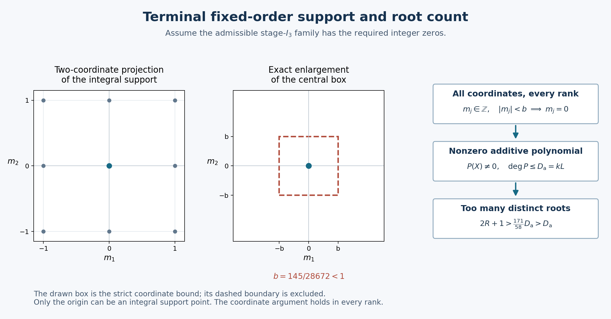

*Figure 10.34. A two-coordinate projection of the strict integral-support
bound in Proposition 10.143, with its exact enlargement. Every coordinate
satisfies \(|m_j|<145/28672\); the dashed boundary is excluded. Only the
origin can be integral. The right-hand arrows give the resulting nonzero
additive polynomial of degree at most \(kL\), and the excessive number of
distinct roots. The hypothesis is the admissible stage-\(I_3\) family with
the stated integer zeros. [Figure program](../figure_sources/fixed_order_final_polynomial.py).
Human-source context: the final stopping alternative in Section 7 of
[Yu's freely accessible paper](https://archive.ymsc.tsinghua.edu.cn/pacm_download/117/6782-11511_2013_Article_106.pdf).
The coordinate bound, additive nonzeroness and root count are proved above.*

### Completing the integer zeros at the multiplicity stop

The previous integer theorem assumed that the next full contraction still
had enough derivatives. At the multiplicity stop that assumption can fail.
We use the derivatives that remain at the last integer level, and reduce the
number of Hermite conditions on a short outer interval. The output radius
and derivative order remain the original ones.

**Theorem 10.144 (the original terminal integer zero block).** Assume the
original contradiction and initial kernel of Theorem 10.140. Suppose
\(I_1<I^*\), and use \(S_1,T_1,r_1,T_\flat,R\) of Lemma 10.142.
The actual stage-\(I_1\) family produced by Theorem 10.140 has all its
prepared zeros at

\[
|s|\le R=q\lfloor q^{r_1}S_1\rfloor,
\qquad |\boldsymbol t|\le\lfloor T_\flat\rfloor.
\tag{10.402}
\]

This holds in every original prime, field and rank case. The coefficient
minimum, coefficient subvector and original phase condition are retained.

**Proof.** Theorem 10.140 supplies the actual stage family and its zeros
at \(|s|\le\lfloor qS_1\rfloor\) through order \(\lfloor\eta T_1\rfloor\).
When \(r_1=0\), these include the stated zeros, since
\(q\lfloor S_1\rfloor\le\lfloor qS_1\rfloor\).
Assume henceforth \(r_1\ge1\). Write \(a=r+1,c=c_5,H=\eta^a\), and
retain \(b_r,S_-,Y_-,\bar\lambda,\mathcal R_r(j)\) from Section 40.
The stopping inequalities are
\(c\eta^{r_1}T_1/a\ge1\) and \(cHT_1/a<1\).
Also \(I_1\le3(A+\nu\ln q)/\ln(qH)\), by Lemma 10.142.

First consider an integer level \(1\le j\le\min\{r_1,r-1\}\).
Suppose the zeros at radius \(\lfloor q^jS_1\rfloor\) through order
\(\lfloor\eta^jT_1\rfloor\) have been obtained. For a target order at
most \(\lfloor\eta^{j+1}T_1\rfloor\), choose
\(\mu=\lfloor c\eta^jT_1/a\rfloor+1\) at every input node. The floor
inequality used in Theorem 10.126 supplies all these ordinary jets by
Theorem 10.118. Put \(N_*=(2\lfloor q^jS_1\rfloor+1)\mu\).
The weaker stopping condition suffices for the following upper bound:

\[
\mu\le\frac{c(\eta^j+\eta^{r_1})T_1}{a}
\le\frac{2cT_1}{a}.
\tag{10.403}
\]

Indeed the added one is at most \(c\eta^{r_1}T_1/a\). The coefficient
and separation estimates in the proof of Lemma 10.123 use only
\(S_1=S\eta^{-aI_1}\), \(T_1=T\eta^{aI_1}\), and the original
height bounds. They still give
\(\beta=v_p(b_n)\),
\(\max\{B,\beta-\vartheta,0\}\le\eta^{-aI_1}H_1/\ln p\), and the
same required projection depth \(U-\beta>1\).
Using \(S_1T_1=ST\) and \(c_1W_*ST\theta=qa\), the full input sum,
multiplied by \(c_1W_*/q^a\), is bounded above by

\[
\frac{c_1W_*}{q^a}
\bigl[N_*\theta+\beta+(\mu-1)\max\{B,\beta-\vartheta,0\}\bigr]
\le\frac{4c}{q}+\frac{2c}{q^rS_-}
 +\frac{c_1}{7ab_rq^a}+\frac{c}{c_3Y_-aq^a}.
\tag{10.404}
\]

Here the first term uses \(j\le r-1\), and both powers of \(\eta\)
are at most one. At odd primes insert
\(c\le14/25,q=2,S_->58,c_1<3,b_r\ge7200/29,c_3Y_->19/10\).
The resulting rational bound is less than \(23/20<c_1\).
In V use \(c\le827/1000,q=3,c_3Y_->19/20\); the bound is less than
\(9/8<c_1\). These exact substitutions are included in the certificate
below. Dropping the nonnegative term \((D_{\rm a}-u)\theta\) from the
left side of the input criterion therefore proves its strict inequality
for every additive order \(u\le D_{\rm a}\). Larger additive orders
vanish identically.

Theorem 10.119 and the scalar identity (10.327) give analytic precision
at least \(N_*\theta\) in the original quantity
\(v_p(\Phi)+G_u-\delta\). Its strict lower bound (10.330) follows from
\(\mu>c\eta^jT_1/a\); it does not use the stronger next-contraction
condition. All integer target values lie in the original field \(K\)
by the retained phase identity (10.151). Lemma 10.122 applies at the
same depth \(I_1\), with \(j\ge1\), and charges the full q-denominator.
Thus their original arithmetic bound is \(\mathcal R_r(j)\).
Lemma 10.125 gives
\(c_1W_*N_*\theta>\mathcal R_r(j)+1/200\).
Corollary 10.120 forces each value to zero, with the actual degree and
local degrees of \(K\). Successive applications complete all required
levels unless \(r_1=r\). In that last case they give the full radius
\(\lfloor q^rS_1\rfloor\) through order \(\lfloor\eta^rT_1\rfloor\).

It remains to extend this last level when \(r_1=r\). Put
\(z=c\eta^rT_1/a\), so \(1\le z<1/\eta<2\).
The last inequality follows from
\(\eta\ge1-827/3000>1/2\). The same floor inequality gives
\(\lfloor\eta^rT_1\rfloor-\lfloor HT_1\rfloor\ge\lfloor z\rfloor=1\).
Consequently every input node provides a value and its first ordinary jet
for every target selected order at most \(\lfloor HT_1\rfloor\).
We retain the extra jet only in an inner interval. Set

\[
R_b=\lfloor q^rS_1\rfloor,\qquad R_0=\lfloor24R_b/25\rfloor,
\qquad
\mu(s)=\begin{cases}2,&|s|\le R_0,\\1,&R_0<|s|\le R_b.\end{cases}
\tag{10.405}
\]

Since \(R_b>q^rS_1-1>231\), these are two strictly nested nonempty
intervals. Their Hermite mass is exactly

\[
N_*=2R_b+2R_0+2,
\qquad \frac{98}{25}R_b<N_*\le\frac{98}{25}R_b+2.
\tag{10.406}
\]

The inequalities follow respectively from
\(R_0>24R_b/25-1\) and \(R_0\le24R_b/25\).
Lemma 10.94 and Theorem 10.119 apply with \(M=2,E=0\).
In particular the outer nodes lose one separation factor in their
cardinal polynomial; that loss is already included in \((M-1)B\).
There is no deletion of nodes and no q-deleted cardinal loss.

Because \(1\le z\), the upper bound on \(N_*\) and the same coefficient
and separation bounds give the following upper bound on the entire input
sum, after multiplication by \(c_1W_*/q^a\):

\[
P_r=\frac{98}{25}c\eta^r
 +\frac{2c\eta^r}{q^rS_-}
 +\frac{c_1}{7ab_rq^a}
 +\frac{c\eta^r}{c_3Y_-aq^a}.
\tag{10.407}
\]

For the last term use \(M-1=1\le z\); this pays the outer cardinal
loss and all retained jet costs, rather than dropping them. On the other
side \(T_1<a/(cH)\) and the strict lower mass inequality yield

\[
\frac{c_1W_*N_*\theta}{q^a}>
G_r:=\frac{98}{25}cH\left(1-\frac1{q^rS_-}\right).
\tag{10.408}
\]

The upper arithmetic bound for a nonzero integer target at
\(|s|\le\lfloor q^{r+1}S_1\rfloor\) and order \(\lfloor HT_1\rfloor\)
is the corrected \(\mathcal R_r(r)\) of (10.332). Its full normalized
cost is

\[
C_r=\frac1{q^a}\left[
A_r+c_1\left(\frac1{300}+\frac1{273\cdot999b_r}\right)
 +\frac{\bar g_9H}{c_3Y_-}
 +\frac{\bar\lambda}{c_4}
 \left(1+\Omega_++\frac{\ell_q}{5}
 \left(r+\frac1{q-1}\right)\right)\right]+\frac1{c_2}.
\tag{10.409}
\]

Here \(\ell_q=347/500\) at \(q=2\) and \(1099/1000\) at \(q=3\)
are the proved logarithm upper bounds. In particular the final
\(1/c_2\), the full depth-denominator indicator, the Euler/lcm term,
and the separate scalar remainder all survive.

We now prove the needed strict inequalities for every rank, using the
coupled field rows of Lemma 10.121. For ranks 2–7 substitute the exact
decimal rationals of that table and the rank band for \(c\) into these
three formulas. For ranks at least eight, \(c\) is constant within each
case. Put \(\eta_8=1-c/9,H_8=\eta_8^9,S_8=S_-(8),b_8=b_r(8)\).
The following bounds hold simultaneously for all such ranks:

\[
\begin{aligned}
P_r&\le\frac{98}{25}c\eta_8^8
 +\frac{2c}{q^8S_8}
 +\frac{c_1}{7\cdot9b_8q^9}
 +\frac{c}{9c_3Y_-q^9},\\
G_r&\ge\frac{98}{25}cH_8
 \left(1-\frac1{q^8S_8}\right),\\
C_r&\le\frac{O_8}{q^9}
 +\frac{\bar\lambda\ell_q(8+1/(q-1))}{5c_4q^9}
 +\frac1{c_2}.
\end{aligned}
\tag{10.410}
\]

In the last line \(O_8\) is the bracket before the linear-in-r term
in the formula for \(C_r\), evaluated at rank eight with
\(C_r^\sharp\) and \(H\) enlarged to one and
\(\bar g_9=107/103\). This is exactly the `high=True` output of
the preceding integer certificate. To verify the enclosing bounds,
\(b_r,S_-\) increase with rank, while \(\epsilon_r,\bar g_{12}\)
decrease; \(C_r^\sharp<1\) by Lemma 10.121 and
\(\bar g_9=107/103\) for every rank at least eight.
The positive constant terms divided by \(q^{r+1}\) decrease.
So does \(r/q^{r+1}\), since its successive ratio is
\((r+1)/(qr)<1\).

For the remaining powers, \((1-c/y)^y\) increases for \(y\ge3\),
as proved in Lemma 10.122. The function \((1-c/y)^{y-1}\) decreases:
with \(w=c/y\), its logarithmic derivative is

\[
\ln(1-w)+\frac{w}{1-w}-\frac{w}{y(1-w)}
\le\frac{w^2}{2(1-w)^2}-\frac{w}{y(1-w)}<0.
\tag{10.411}
\]

The non-strict bound integrates \(t/(1-t)^2\) from zero to \(w\).
The strict sign uses \(c<2(1-w)\), which follows from
\(c\le827/1000<2(1-c/3)\). Thus \(H\ge H_8\) and
\(\eta^r\le\eta_8^8\); replacing the remaining numerator powers
by one only enlarges the two input remainders. This proves all the
uniform bounds, without inferring them from sampled ranks.

The exact rational certificate gives the following strict lower bounds,
each divided by 1000. Each row includes its six finite ranks and its one
uniform bound for every rank at least eight.

| Original case | \(c_1-P_r\) | \(G_r-C_r\) |
|---|---:|---:|
| I.1 | 21/1000 | 493/1000 |
| I.2 | 21/1000 | 489/1000 |
| II | 20/1000 | 492/1000 |
| III.1 | 20/1000 | 487/1000 |
| III.2 | 19/1000 | 481/1000 |
| IV, first prime branch | 19/1000 | 490/1000 |
| IV, larger prime branch | 26/1000 | 540/1000 |
| V | 872/1000 | 475/1000 |

All entries are exact rational substitutions with downward-rounded
lower bounds; [the editable certificate](../figure_sources/terminal_integer_endpoints.py)
retains their exact numerators and denominators. In particular
\(P_r<c_1\) and \(G_r>C_r\). The first inequality proves the complete
input criterion with \(W_*U=q^a\). The second gives strictly more
analytic precision than the full arithmetic bound in the original field
\(K\), so Corollary 10.120 forces every target value to zero.

We have therefore obtained the radius
\(\lfloor q^{r_1+1}S_1\rfloor\) and derivative order
\(\lfloor\eta^{r_1+1}T_1\rfloor\) in every case, including \(r_1=r\).
Finally \(q\lfloor q^{r_1}S_1\rfloor\le
\lfloor q^{r_1+1}S_1\rfloor\), so these include exactly the required
original terminal integer zeros. \(\square\)

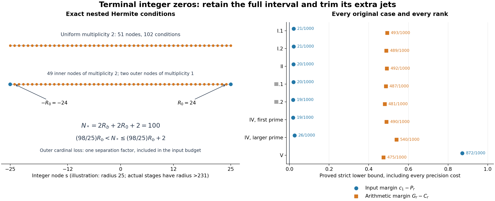

*Figure 10.35. Left: an illustrative nested interval with \(R_b=25\),
\(R_0=24\). Its 49 inner nodes carry multiplicity two and its two outer
nodes carry multiplicity one, so \(N_*=100\) instead of 102. This small
example illustrates the exact cardinal construction; actual terminal
stages satisfy \(R_b>231\). For every integer radius the retained mass
lies strictly above \((98/25)R_b\) and at most two above that bound.
Right: the proved lower margins in the table, for all original rank and
field cases. The input margins include the coefficient minimum and the
outer cardinal loss; the arithmetic margins include the full global
degree, denominator, Euler/lcm and scalar costs. [Figure program](../figure_sources/terminal_integer_profile.py).
Human-source context: the terminal integer range in Lemma 5.5 of
[Yu's freely accessible paper](https://archive.ymsc.tsinghua.edu.cn/pacm_download/117/6782-11511_2013_Article_106.pdf).
The complete nested interpolation and both strict comparisons are proved
above.*

### Full-node interpolation at the fixed derivative order

**Proposition 10.145 (the full fixed-order analytic input).** Use the
original multiplicity-stop parameters of Lemma10.142, and the original
explicit depth choices in Section26. Put \(O=\lfloor T_\flat\rfloor\),
\(R=q\lfloor q^{r_1}S_1\rfloor\), \(N=2R+1\). Suppose an admissible
stage family at any depth \(I\ge I_1\) retains the initial coefficient
bound, minimum coefficient and phase, and has all its prepared zeros at
the integers \(|s|\le R\) through selected order \(O\). Under the original
contradiction, for every selected order \(\boldsymbol t\) with
\(|\boldsymbol t|\le O\) and additive order \(u\le D_{\rm a}\),

\[
v_p(\Phi^{(I)}(x;\boldsymbol t))+G_u-\delta\ge N\theta
\qquad(x\in\mathbb Z_p\subset\mathbb Q_p).
\tag{10.412}
\]

In particular this holds at each fractional argument \(x=s/q\), with
\(s\in\mathbb Z\), since \(q\ne p\). No additional ordinary jet beyond
the given selected order is required. Larger additive orders vanish by
polynomial degree. This is a local analytic precision assertion.

**Proof.** Normality and projection depth are those of Lemma10.91 and
Theorems10.117–10.119. Multiplication of the torus slopes and additive
argument by \(q^{-I}\) does not change their p-adic depths, because
\(q\ne p\). The retained coefficient bound and minimum provide the same
\(\beta=v_p(b_n)\), \(U\), and \(\delta\). Thus these results apply at
the given depth without its being inside the earlier geometric range.

Apply the full-node case of Theorem10.119 with \(M=1,E=0\). Every node
has multiplicity one, so the available prepared zero of the target order
itself is sufficient. The complete integer-interval cardinal polynomials
are integral on \(\mathbb Z_p\), by Lemma10.94. Their inverse Taylor
polynomials here have degree zero. Consequently there is neither a
q-deleted loss nor a higher-jet separation loss. By (10.319),
\(K_u(1,B)=M_u(0)=\gamma_u\), and (10.327) at \(M=1\) gives
\(G_u+\gamma_u\ge(D_{\rm a}-u)\theta\). The full precision therefore is

\[
\mathcal P_u\ge
\min\{N\theta,\ U-\beta+(D_{\rm a}-u)\theta\}.
\tag{10.413}
\]

It remains to prove \(U-\beta>N\theta\) for every original case and
rank. We retain the actual large initial multiplicity instead of using
only the coarser lower bound on \(\mathcal D\).
From the formula for \(S\), \(\beta\ln p\le h\le H_1\), and
\(ef\le d\),

\[
c_1W_*\beta
\le\frac{f}{c_3d\theta T}
\le\frac1{c_3YT}
\le\frac1{c_3Y_-g_4},\qquad Y=e\theta.
\tag{10.414}
\]

Here \(T\ge g_4\) is Lemma10.70, and the simultaneous field bounds of
Lemma10.121 give \(Y\ge Y_-\).
The endpoint condition \(c\eta^{r_1}T_1/a\ge1\), together with
\(c_1W_*S_1T_1\theta=qa\), bounds the node input by

\[
\frac{c_1W_*N\theta}{q^a}
\le2c\eta^{r_1}q^{r_1+1-r}
 +\frac{c\eta^{r_1}}{q^rS_1}.
\tag{10.415}
\]

Since \(q\eta>1\) and \(r_1\le r\), the first term is at most
\(2cq\eta^r\). The other stopping inequality gives
\(T_1<a/(cH)\). Using \(S_1/S=T/T_1\), \(T\ge g_4\) and \(H>1/3\)
therefore gives
\(S_1>Sg_4cH/a>S_-g_4c/(3a)\). The second term is less than
\(3a/(q^rS_-g_4)\). Thus a sufficient exact input bound is

\[
B_r:=2cq\eta^r
 +\frac{3a}{q^rS_-g_4}
 +\frac1{c_3Y_-g_4q^a}<c_1.
\tag{10.416}
\]

This bound charges the coefficient minimum in full. It follows for all
ranks from the following explicit lower bound on the actual \(g_4\).
Write \(F_r=r^ra^r/(r!)^2\). The formulas (10.185) give

\[
g_4\ge L_r:={2c_0c_4qa\over\rho\widehat\vartheta}
a_*^rF_r v_0,
\tag{10.417}
\]

where the simultaneous original choices are

| Case | \(\rho\) | \(\widehat\vartheta\) | \(a_*\) | \(v_0\) |
|---|---:|---:|---:|---:|
| I.1 | 58 | 3/2 | 7 | 1 |
| I.2 | 17 | 3/2 | 7 | 5 |
| II | 58 | 5/4 | 7 | 1 |
| III.1 | 58 | 1 | 7/2 | 5 |
| III.2 | 17 | 1 | 7/2 | 5 |
| both IV branches | 58 | 7/6 | 7 | 1 |
| V | 58 | 2 | 26/3 | 1 |

For I.2 and III the definition of \(g_4\) retains its \(g_1\) factor,
which exceeds five; using \(v_0=5\) is a lower bound. In the other rows
that factor cancels or can be enlarged, so \(v_0=1\) suffices. The values
of \(\rho\) follow from the same degree cases as Lemma10.121; the depth
and \(a_*\) choices are exactly (10.184) and its ensuing explicit
upper depths. Thus this uses the actual field row, not independently
combined extrema.

For ranks 2–7, substitute \(L_r\) for \(g_4\), the original rational
constant row and its exact \(c\) band into \(B_r\). For ranks at least
eight, \(c\) is constant and \(\eta^r\) decreases by the derivative
proved in Theorem10.144. The ratio \(F_{r+1}/F_r>4\) is proved in
Lemma10.104; consequently \(L_{r+1}/L_r>14(r+2)/(r+1)\).
Both \(a/L_r\) and \(1/L_r\) decrease. Since \(S_-\) and \(q^r\)
increase, each of the two positive remainders also decreases. Therefore
the rank-eight substitution bounds every larger rank.

The exact rational certificate `fixed_order_input_endpoints.py` gives
these strict lower bounds for \(c_1-B_r\), including each case's six
finite rows and one uniform row:

| Case | Strict input margin |
|---|---:|
| I.1 | 77/1000000 |
| I.2 | 39/1000000 |
| II | 80/1000000 |
| III.1 | 89/1000000 |
| III.2 | 23/1000000 |
| IV, first prime branch | 56/1000000 |
| IV, larger prime branch | 67/1000000 |
| V | 54/1000000 |

Thus \(c_1W_*[N\theta+\beta]<c_1q^a=c_1W_*U\), proving the required
strict input. Since \((D_{\rm a}-u)\theta\ge0\), the displayed minimum
is at least \(N\theta\). This proves the proposition. \(\square\)

The argument includes the source's zero-additional-jet convention:
one value condition at each node corresponds to \(M=1\) in our Hermite
notation. This distinction prevents accidentally requesting an extra
derivative or discarding the coefficient cost.

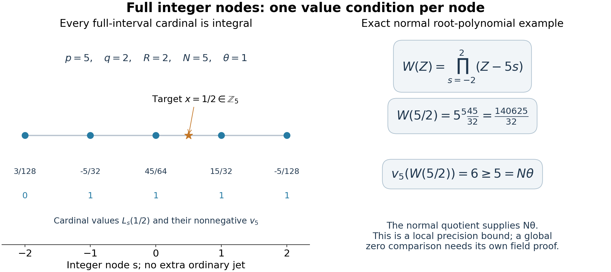

*Figure 10.36. An exact illustration at \(p=5,q=2,R=2,\theta=1\).
The five integer nodes each carry one value condition, with no additional
ordinary jet. At \(x=1/2\in\mathbb Z_5\) their cardinal values are
\(3/128,-5/32,45/64,15/32,-5/128\), with nonnegative valuations
\(0,1,1,1,1\). Right: the monic normal root polynomial
\(W(Z)=\prod_{s=-2}^2(Z-5s)\) has
\(W(5/2)=140625/32\), of valuation six, exceeding its normal bound
\(N\theta=5\). This example illustrates the full-node interpolation
mechanism; it is not a complete choice of logarithmic contradiction
parameters. Proposition 10.145 proves the full original input bound, and
Solution 57 checks the example. [Figure program](../figure_sources/fixed_order_value_nodes.py)
and [all-rank input certificate](../figure_sources/fixed_order_input_endpoints.py).
Human-source context: the zero-additional-jet argument in Section 7 of
[Yu's freely accessible paper](https://archive.ymsc.tsinghua.edu.cn/pacm_download/117/6782-11511_2013_Article_106.pdf).
The normality, cardinal construction and simultaneous input bounds are
proved above.*

### Closing successor integers without lowering the derivative order

**Theorem 10.146 (the full fixed-order successor integer block).** Retain
the original multiplicity-stop parameters of Lemma10.142, including
\(I_1<I^*,R=q\lfloor q^{r_1}S_1\rfloor\) and
\(O=\lfloor T_\flat\rfloor\). Suppose
\(I_1+1\le J\le I_3\), and an admissible stage-J coefficient family
retains the initial coefficient bound and minimum, the phase condition,
and all prepared zeros through total order O at the integers
\(|s|\le R\) prime to q. Then that same family has every prepared zero
through order O at all integers \(|s|\le R\).

The proof uses one value condition at each q-deleted node, without any
additional ordinary jet, and keeps the full q-denominator at depth J.

**Proof.** Put \(a=r+1,c=c_5,H=\eta^a,Q=qH,D=A+\nu\ln q\), and
use \(C,Y_-,\Omega_+,S_-,b_r,A_r,\bar g_9\) of Section40. Let
\(L_r\) be the explicit lower bound on the initial \(g_4\) in
(10.417). Thus \(T\ge g_4\ge L_r\), while
\(cT_1/a\ge1>cHT_1/a\). Let \(m_r\) be the largest nonnegative integer satisfying

\[
\frac{cL_rH^{m_r}}a\ge1.
\tag{10.418}
\]

Then \(I_1\ge m_r\), since otherwise strict decrease would contradict
\(cTH^{I_1+1}/a<1\). In particular \(Q^{I_1}>q\). Here is a uniform
proof of this last fact. Within each constant band H increases with rank,
as proved in Lemma10.122. At the three band starts, exact substitution
gives \(H>11/20\) for odd p and \(H>5/12\) in V. Lemma10.142 gives
\(T>(9000/29)a\). At odd p, \(c>1/2\), and
\((11/20)^8(4500/29)>1\); hence \(I_1\ge8\), so
\(Q^{I_1}>(11/10)^8>2=q\). In V, \(c>3/4\), and
\((5/12)^6(6750/29)>1\); hence \(I_1\ge6\), so
\(Q^{I_1}>(5/4)^6>3=q\). The sharper \(m_r\) below will retain the
actual initial multiplicity rather than only these coarse depths.

There are exactly
\(N_*=2(q-1)\lfloor q^{r_1}S_1\rfloor\) q-deleted nodes. For each
target prepared index of order at most O and additive order
\(u\le D_{\rm a}\), Theorem10.119 with \(M=1,E=1\) gives

\[
\mathcal P_u\ge
\min\{N_*\theta,\ U-\beta+(D_{\rm a}-u)\theta-B\},
\qquad B=\lfloor\log_p(2R+1)\rfloor.
\tag{10.419}
\]

Indeed \(K_u(1,B)=\gamma_u\) and
\(G_u+\gamma_u\ge(D_{\rm a}-u)\theta\), by (10.327). The single
deleted-cardinal loss is B; there is no higher-jet inverse loss. Normality
and projection apply at J because q is a p-adic unit, just as in
Proposition10.145. Beyond additive degree \(D_{\rm a}\), the value is
identically zero.

We compare both entries with the arithmetic bound for that same normal
quantity in the original field K. The phase identity places every integer
prepared value in K. Set

\[
\begin{aligned}
E_r&=c_1\left(\frac1{300}+\frac1{273\cdot999b_r}\right),\\
K_r&=A_r+E_r+\frac{\bar g_9a}{cc_3Y_-L_r}
 +\frac{\bar\lambda}{c_4}
 \left[1+\Omega_++\frac{3\ell_q}{\mathcal L(Q)}
  +\frac{(1+1/(q-1))\ell_q}{5}\right],\\
F_r(x)&=K_r+\frac{\bar\lambda x\ell_q}{5c_4}
       +\frac{q^x}{c_2Q^{m_r}}.
\end{aligned}
\tag{10.420}
\]

Here \(\bar\lambda=189/188\), \(\ell_2=347/500,\ell_3=1099/1000\),
and \(\mathcal L(Q)>0\) is the five-term positive-series lower bound

\[
\mathcal L(Q)=2\sum_{j=0}^4\frac{z^{2j+1}}{2j+1},
\qquad z=\frac{Q-1}{Q+1};\qquad \ln Q>\mathcal L(Q).
\tag{10.421}
\]

The logarithm series and its positivity are proved in Solution34.
For a nonzero target V, Corollary10.116 and its same-order normal bound
therefore give

\[
c_1W_*[v_p(V)+G_u-\delta]<F_r(r_1).
\tag{10.422}
\]

To verify every term, the coefficient bound is \(A_r\), as in (10.332).
The complete Euler remainder is at most \(E_r\), by (10.310) and
\((r-1)/Z<1/(273b_r)\). Since \(O<T_\flat<a/c\) and
\(T\ge L_r\), the main Euler term is at most
\(\bar g_9a/(cc_3Y_-L_r)\). The additive factorial estimate in
Lemma10.122 applies directly: its physical radius satisfies

\[
q^{-J}R<q^{r_1+1}S Q^{-I_1}q^{-(J-I_1)}
\le q^{r_1}S Q^{-I_1}<q^{r_1-1}S.
\tag{10.423}
\]

Enlarging this radius to \(q^{r_1+1}S\) in that lemma's factorial proof
bounds the scalar by \(\bar\lambda[1+r_1\ell_q/5]/c_4\); this step
uses no geometric-depth absorption. The normal term \(G_u\) is at most
\(D_{\rm a}(\theta+1/(p-1))\), giving the separate
\(\bar\lambda\Omega_+/c_4\). The complete denominator is
\(\Xi_{J,0,u}\le D_{\rm a}[J+1/(q-1)]\). Lemma10.142 gives
\(I_1\le3D/\ln Q\) and

\[
I_3\ln q\le3D+I_1(\ln q-\ln Q)+\ln q
\le\frac{3D\ln q}{\ln Q}+\ln q.
\tag{10.424}
\]

Together with \(D>5,J\le I_3\), this gives precisely the remaining
depth and constant-denominator terms in \(K_r\). Finally the full torus
cost is at most \(q^{r_1}/(c_2Q^{I_1})\), hence at most
\(q^{r_1}/(c_2Q^{m_r})\). Nothing has been dropped at primes above q,
or from the normal scalar or coefficient minimum.

For the first analytic entry, \(T_1<a/(c\eta^{r_1+1})\),
\(c_1W_*ST\theta=qa\), and \(ST=S_1T_1\) give

\[
c_1W_*N_*\theta>
2c(q-1)(q\eta)^{r_1+1}
-\frac{2q(q-1)a}{S_-L_r}.
\tag{10.425}
\]

The floor loss follows from \(c_1W_*\theta=qa/(ST)\),
\(S\ge S_-,T\ge L_r\). The difference of this lower bound and
\(F_r(r_1)\) increases for every real \(0\le r_1\le r\). In fact
\(Q^{m_r}>q\) and \(\eta^{x+1}\ge H\) give the derivative lower bound

\[
q^{x-1}\left[2c(q-1)q^2H\ln(q\eta)-\frac{\ell_q}{c_2}\right]
-\frac{\bar\lambda\ell_q}{5c_4}>0.
\tag{10.426}
\]

For odd p, use \(c\ge5267/10000,H>11/20\),
\(\ln(q\eta)>12/25,c_4>18,c_2=7/4,q=2\). The bound exceeds
\(1/3\), since \(q^{x-1}\ge1/q\). For V use
\(c>3/4,H>5/12,\ln(q\eta)>3/4,c_4>15/4,c_2=13/9,q=3\);
the bound exceeds two. Indeed \(\eta\ge61/75\) at odd p and \(\eta\ge2173/3000\) in V;
the first two terms of the positive logarithm series give
\(\ln(122/75)>12/25\) and \(\ln(2173/1000)>3/4\).
The exact endpoint substitutions below also check \(Q^{m_r}>q\). Thus it suffices to compare at
\(r_1=0\).

For the second entry, \(R\le q^{r+1}S_1\). The separation argument of
Lemma10.123 gives
\(\ln(2R+1)<H_1H^{-I_1}+\ln q\).
Since \(\ln q/H_1<1/3\), and \(T_1\ge a/c\),

\[
c_1W_*B<\frac{4c}{3c_3Y_-a},\qquad
c_1W_*\beta\le\frac1{c_3Y_-L_r}.
\tag{10.427}
\]

Consequently its normal input is greater than or equal to the conservative
bound \(c_1q^a-1/(c_3Y_-L_r)-4c/(3c_3Y_-a)\). For its opposite
arithmetic envelope, \(F_r(x)\) increases, and \(Q^{m_r}>q\); hence

\[
F_r(r_1)<K_r+\frac{q^{r-1}}{c_2}
                  +\frac{\bar\lambda r\ell_q}{5c_4}.
\tag{10.428}
\]

For ranks2–7, choose the largest integer \(m_r\) for which
\(cL_rH^{m_r}/a\ge1\), and substitute the coupled original row in
these formulas. The exact rational certificate gives the following
strict margins; every entry is divided by1000.

| Case | First-entry margin at \(r_1=0\) | Second-entry margin |
|---|---:|---:|
| I.1 | 38 | 8808 |
| I.2 | 84 | 8769 |
| II | 123 | 8776 |
| III.1 | 87 | 8723 |
| III.2 | 55 | 8650 |
| IV, first prime branch | 105 | 8801 |
| IV, larger prime branch | 232 | 9035 |
| V | 1405 | 60699 |

The same table also includes one analytic enclosure for every rank at
least eight. Here c is constant, H and Q increase, while
\(L_{r+1}/L_r>14(r+2)/(r+1)\), as proved in Proposition10.145.
Therefore \(L_r/a\) and \(S_-\) increase. The same \(m_8\) is
available for every larger rank, and
\(Q^{I_1}\ge Q_8^{m_8}>q\). Bound \(A_r\) by its rank-eight envelope
with \(C_r^\sharp\) replaced by one. All its other positive components
decrease; \(\bar g_9=107/103\). Thus \(K_r\le K_8^+\), using the
rank-eight lower Q in \(\mathcal L\), and its lower \(L_r/a\).
The mass at \(r_1=0\) increases, and its floor loss decreases. The
rank-eight mass comparison therefore encloses every larger rank.

For the remaining input comparison, divide both bounds by \(q^{r+1}\).
The constant torus term becomes \(1/(q^2c_2)\); the remaining positive
constant costs decrease after division, and \(r/q^{r+1}\) decreases.
The losses involving \(1/L_r\) and \(1/a\) also decrease. Hence its
rank-eight divided comparison proves every larger rank, with at least
the unscaled positive margin displayed in the table. These monotonicity
arguments, not a finite rank experiment, certify the infinite range.

Both analytic entries strictly exceed the original-K arithmetic bound
for every target. Corollary10.120 forces each remaining integer value to
zero. This closes the entire original R-block at exactly O, for the same
coefficient family, including \(J=I_3\). \(\square\)

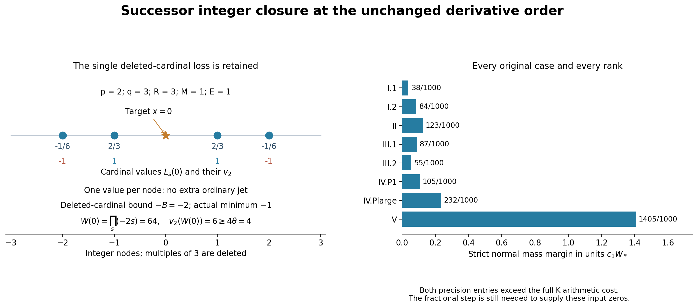

*Figure 10.37. Left: at \(p=2,q=3,R=3\), the four q-deleted integer
nodes carry one value condition each. Their cardinals at zero are
\(-1/6,2/3,2/3,-1/6\), of valuations \(-1,1,1,-1\). The uniform
cardinal loss is \(B=2\), while the actual loss here is one. The normal
root polynomial \(W(Z)=\prod_s(Z-2s)\) has \(W(0)=64\), of valuation
six, above \(N_*\theta=4\) at \(\theta=1\). These exact values illustrate
the interpolation, rather than a full original logarithmic-contradiction
parameter choice. Right: proved strict first-entry margins for every
original case, minimized over all ranks; every second-entry margin also
exceeds eight in the same normalization. Both entries retain the original
field K, coefficient minimum, full denominator and deleted-cardinal loss.
The actual q-deleted family is the hypothesis of Theorem10.146;
Theorem10.149 and the phase construction supply it in Corollary10.150. Solution58 checks the example
and endpoint. [Figure program](../figure_sources/fixed_order_successor_profile.py),
[exact all-rank certificate](../figure_sources/successor_fixed_order_endpoints.py).
Human-source context: Lemma7.2 of [Yu's freely accessible paper](https://archive.ymsc.tsinghua.edu.cn/pacm_download/117/6782-11511_2013_Article_106.pdf).
The full successor integer argument and both strict comparisons are
proved above.*

### The exact field of a fractional value

The field generated by all fractional monomials can be larger than the
field generated by a particular prepared value. We can determine the
latter field from the components which survive in that value. This gives
an exact arithmetic factor without identifying distinct local primes.

**Theorem 10.147 (the surviving Kummer components).** Retain Theorem10.56,
and write \(h=h_\Lambda\). Choose its independent principal monomials
\(U_1,\ldots,U_h\), with \(U_j^q\in K\). For
\(a\in\{0,\ldots,q-1\}^h\), put \(U^a=\prod_jU_j^{a_j}\).
Every fractional prepared value has a unique expansion

\[
V=\sum_a A_aU^a,\qquad A_a\in K,\qquad
W_V=\langle a:A_a\ne0\rangle_{\mathbb F_q},\qquad t_V=\dim W_V.
\tag{10.429}
\]

If \(V\ne0\), then

\[
[K(V):K]=q^{t_V},\qquad K(V)_{\mathfrak P}=K_{\mathfrak p}.
\tag{10.430}
\]

In particular \(t_V=0\) precisely when \(V\in K\). A nonzero constant
component contributes the zero vector and does not increase \(t_V\).
The arithmetic upper bounds (10.156), (10.244) and (10.313) for this
value may use the exact factor \(q^{t_V}d/(ef\ln p)\), while retaining
their other terms and the same coefficient normalization. All those
terms remain present; the normal summand \(G_u\) in (10.313) is added
after the arithmetic bound, as before.

**Proof.** Theorem10.56 gives the basis \(U^a\) of
\(E=K(U_1,\ldots,U_h)\), of degree \(q^h\). Its exact monomial
identities collect every prepared term into the stated expansion;
the rational scalars and coefficients lie in K. Fix a primitive q-th
root \(\omega\in K\). For \(b\in\mathbb F_q^h\), define

\[
\sigma_b\!\left(\sum_a A_aU^a\right)
=\sum_a A_a\omega^{b\cdot a}U^a.
\tag{10.431}
\]

These are K-automorphisms. Indeed products of basis monomials are reduced
by \(U_j^q\in K\), and \(\omega^q=1\), so the formula respects
multiplication and addition. Its inverse is \(\sigma_{-b}\).
Uniqueness of the expansion shows that \(\sigma_b(V)=V\) if and only
if \(b\cdot a=0\) for every surviving component. Row reduction over
\(\mathbb F_q\) gives exactly \(q^{h-t_V}\) such b. Thus the orbit
of V has \(q^{t_V}\) distinct elements.

Every orbit element is a root of V's minimal polynomial over K, because
each \(\sigma_b\) fixes K. Conversely, the product of \(X-V'\) over
the distinct orbit elements is fixed by every \(\sigma_b\). Its
coefficients belong to K: in the basis expansion of any fixed element,
a nonzero exponent vector a is detected by some b with
\(b\cdot a\ne0\), forcing its coefficient to vanish. The orbit
polynomial therefore belongs to \(K[X]\). These two degree
inequalities prove the exact degree without an additional Galois-theory
input. The principal roots lie in \(K_{\mathfrak p}\), so
\(K\subset K(V)\subset K_{\mathfrak p}\). Its closure is exactly
\(K_{\mathfrak p}\), as in Theorem10.56; hence the selected local
indices are the original e,f.

For the arithmetic assertion, let \(F=K(V)\), and divide V by the same
nonzero reference coefficient of minimum valuation \(\delta\).
This quotient belongs to F. The individual torus monomials may still
belong only to E, so we justify the height comparison over F explicitly.
At each place of F extend its absolute value to E. The triangle or
ultrametric bound for the displayed prepared sum holds in that extension.
The absolute value of every fractional monomial is determined by its
q-th power in K. Changing the extension therefore changes none of its
absolute values; its root-of-unity factors also have absolute value one.
Coefficient norms and rational scalar bounds likewise depend only on
the restricted place of K. Consequently the same local bound used in
Theorems10.41 and10.92 bounds \(V/c_{\min}\) at the place of F.

When these bounds are summed, the local weights over a place of K sum
to \([F:K]\) times its original weight, by the extension and norm
formula proved in the prerequisite lesson on places. The coefficient
height, scalar maximum, q-denominator term and signed torus height hence
acquire the factor \([F:K]=q^{t_V}\). The selected local term has
weight \(ef\), as just proved. The complete product-formula proof
therefore gives exactly the claimed arithmetic bound. Adding the same
\(G_u\) proves its normal version. This argument does not require
the other primes to have the selected valuation. \(\square\)

For \(s\) prime to q, multiplication of every support residue vector
by s is invertible over \(\mathbb F_q\). This observation alone does
not reduce \(t_V\): reductions require exact vanishing of components
\(A_a\), rather than a change of representative or a choice of local
embedding. At different prepared indices the surviving components may
be different, so their fields must be checked for the value in question.

Here is an exact phase example. Set
\(K=\mathbb Q,p=73,q=2,\theta_1=74,\theta_2=147,P=1\).
Take the roots \(U_1=\sqrt{74},U_2=\sqrt{147}\) which are congruent
to one at73. They are the principal roots of Lesson9. The phase data
may be \(G_0=36,d_1=d_2=0,\alpha_0=-1\), so the normalized residue
relation is the genuine relation \(w=0\). The square classes of
\(-1,74,147\) are independent: prime valuations at37 and3 first force
the exponents of74 and147 to be even, and then the sign forces the
remaining exponent to be even. Thus the full root field has degree
eight, and the two principal monomials generate a degree-four field.
For \(V=2-U_1-U_2\), the surviving vectors are
\((0,0),(1,0),(0,1)\), which span dimension two. Theorem10.147 gives
degree four. Its minimal polynomial and norm are

\[
P_V(X)=X^4-8X^3-418X^2+1736X+3577,
\qquad N_{K(V)/\mathbb Q}(V)=3577=49\cdot73.
\tag{10.432}
\]

The four sign embeddings above73 have valuations \(1,0,0,0\), with
the selected principal-root embedding first. Thus the weighted sum is
one, whereas four times the selected valuation is four. These are
explicit algebraic values with the phase relation and principal roots;
they are an illustration of the field and valuation mechanisms, rather
than an auxiliary family with all the integer zeros of the second
induction. Solution59 proves these computations. Theorem10.149 verifies the strict arithmetic comparison for the actual
fractional targets by strengthening the integer input.

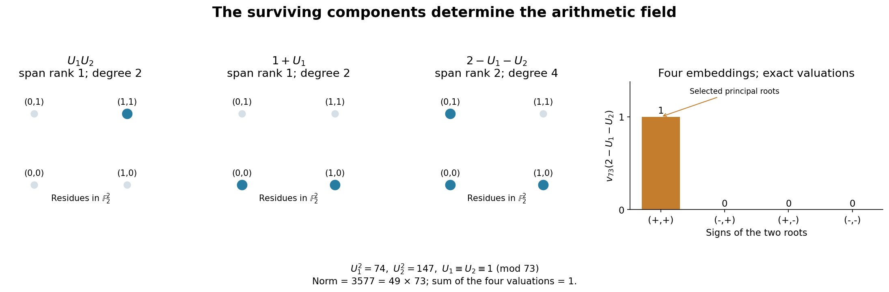

*Figure10.38. Left: the nonzero residue components of \(U_1U_2\),
\(1+U_1\) and \(2-U_1-U_2\) have span dimensions one, one and two,
giving exact degrees two, two and four over \(\mathbb Q\). A constant
component contributes the origin. Right: at73, the four sign embeddings
of \(2-\sqrt{74}-\sqrt{147}\) have valuations \(1,0,0,0\).
The norm has valuation one; the selected embedding is marked. The bars
are exact valuations, rather than height upper bounds. Theorem10.147
proves the component and field assertions; Solution59 verifies the
polynomial, principal roots and norm. [Figure program](../figure_sources/fractional_value_components.py),
[exact calculations](../figure_sources/fractional_value_certificate.py).
Human-source context: the fractional phase and product-formula passage in
[Yu's freely accessible paper](https://archive.ymsc.tsinghua.edu.cn/pacm_download/117/6782-11511_2013_Article_106.pdf),
Section7. The exact field and local comparisons used here are proved
above.*

### Increasing the integer input before the fractional step

The prescribed integer interval is retained throughout the second
induction. Before taking a fractional value, we can temporarily prove
more integer zeros at the same derivative order. Two such extensions
give enough analytic precision to keep the full global field degree.

**Lemma 10.148 (the two-radius arithmetic comparisons).** Retain the
original fixed-order parameters, constants and notation of
Theorems10.145–10.146. Set \(\xi=24/25\), \(a=r+1\), and

\[
\begin{aligned}
\mu_r&=q^r/Q^{m_r},&
f_r&=\max\{1,\xi c_1/(2cqH)\},\\
j_r&=\min\{j\in\mathbb Z_{\ge0}:\mu_rf_r\le q^j\},&
\Gamma&=\bar\lambda\Omega_+/c_4,&
\sigma_r&=qa/(S_-L_r).
\end{aligned}
\tag{10.433}
\]

Use the same full-depth \(K_r\) as in Theorem10.146; for ranks at
least eight use its enclosing coefficient bound with
\(C_r^\sharp\le1\). The following quantities are strictly positive
in every original case and at every rank \(r\ge2\):

\[
\begin{aligned}
P_1={}&2cq^2\eta-2q\sigma_r
 -K_r-\frac{\bar\lambda j_r\ell_q}{5c_4}
 -\frac{\mu_rf_r}{c_2},\\
P_2={}&\xi c_1q^r-2\sigma_r
 -K_r-\frac{\bar\lambda(j_r+1)\ell_q}{5c_4}
 -\frac{q\mu_rf_r}{c_2},\\
P_3={}&\xi c_1q-K_r+\Gamma
 -\frac{\bar\lambda j_r\ell_q}{5c_4}
 -\frac{\mu_r}{c_2}
 -\frac{\Gamma+2\sigma_r}{q^r}.
\end{aligned}
\tag{10.434}
\]

Also \(j_r\le2\), and
\((1-\xi)c_1q^a>1/(c_3Y_-L_r)\).

**Proof.** All terms are rational endpoints of the complete bounds in
Theorem10.146. Its \(m_r\) is the last integer with
\(cL_rH^{m_r}/a\ge1\). We give an enclosure for the unbounded rank
range which also retains the factor \(q^r\).

Put \(E_x=(1+1/x)^x\), \(x>0\). Differentiating its logarithm gives
\(\ln(1+1/x)-1/(x+1)>0\): the first term is the integral of
\(1/(1+t)\) from zero to \(1/x\), strictly greater than the interval
length times its endpoint minimum. Thus \(E_x\) increases. The
exact factorial ratio of \(F_r=r^r(r+1)^r/(r!)^2\) is
\(F_{r+1}/F_r=E_rE_{r+1}\). At rank eight the rational product
\((9/8)^8(10/9)^9>13/2\). Therefore
\(F_{r+1}/F_r>13/2\) for every \(r\ge8\).

For \(r\ge32\), the c band is constant, and both H and Q increase
by Lemma10.122. The formula (10.417) gives

\[
\frac{L_{r+2}/(r+3)}{L_r/(r+1)}
>a_*^2(13/2)^2.
\tag{10.435}
\]

The following three rational substitutions at \(H_{32}=(1-c/33)^{33}\),
\(Q_{32}=qH_{32}\), verify
\(a_*^2(13/2)^2H_{32}^{d_0}>1\) and
\(Q_{32}^{d_0}>q^2\):

| Rank band | \(c\) used in the enclosure | \(a_*\) | \(q\) | \(d_0\) |
|---|---:|---:|---:|---:|
| odd cases other than III | 14/25 | 7 | 2 | 12 |
| III | 11/20 | 7/2 | 2 | 11 |
| V | 827/1000 | 26/3 | 3 | 9 |

In the first row the other actual c values are smaller, so their H and
Q are larger. Multiplying the inequality defining \(m_r\) by the
displayed two-rank ratio and by \(H_{32}^{d_0}\) proves
\(m_{r+2}\ge m_r+d_0\). Consequently

\[
\mu_{r+2}\le\mu_r\,q^2/Q_r^{d_0}<\mu_r
\qquad(r\ge32).
\tag{10.436}
\]

This proves decrease along both parity sequences. It is not an
enclosure obtained by holding \(m_r\) fixed while rank grows.
Furthermore \(f_r\) decreases because H increases. Thus \(j_r\)
is nonincreasing along each sequence. The enclosing \(K_r\)
decreases: its coefficient and Euler remainders decrease, \(a/L_r\)
decreases, and the increasing Q enlarges the positive logarithm lower
bound in its denominator term. These are exactly the monotonicities
used in Theorem10.146, now without a growing \(r_1\) scalar cost.
Also \(\sigma_r\) decreases, while \(\eta\) and \(q^r\) increase.
Each displayed \(P_i\) therefore increases along each parity sequence
from32 or33. The input comparison likewise improves.

Substitute ranks2–31 and parity endpoints32,33 in each original row,
using exact integer comparisons for \(m_r,j_r\) and the margins.
The following strict margins are divided by1000000.

| Case | \(P_1\) | \(P_2\) | \(P_3\) |
|---|---:|---:|---:|
| I.1 | 1028198 | 2077317 | 437081 |
| I.2 | 1376333 | 2808629 | 735003 |
| II | 1237102 | 2462590 | 678380 |
| III.1 | 1212788 | 2458197 | 615506 |
| III.2 | 1309556 | 2722070 | 711872 |
| IV, first prime branch | 1190595 | 2368885 | 589777 |
| IV, larger prime branch | 1318170 | 2496460 | 748768 |
| V | 2912809 | 10621246 | 82270 |

All256 substitutions also give \(j_r\le2\) and the strict input
comparison. Their rational formulas and integer calculations are
provided with Figure10.39. Together with the parity argument, these
checks include every rank. \(\square\)

**Theorem 10.149 (the actual fixed-order fractional zeros).** Suppose
\(I_1\le I<I_3\) and an admissible stage-I family has all its
prepared zeros at integers \(|s|\le R\) through the original order
\(O=\lfloor T_\flat\rfloor\). Then it has all its prepared zeros
at \(s/q\) for integers \(|s|\le R\), through that same order O.
The original coefficient minimum, support widths and phase are retained.

**Proof.** Put

\[
R_{\rm s}=\left\lfloor\frac{\xi U/(q\theta)-1}{2}\right\rfloor,
\qquad
R_{\rm l}=\left\lfloor\frac{\xi U/\theta-1}{2}\right\rfloor.
\tag{10.437}
\]

The original parameter lower bounds make both radii positive. Indeed
\(U/\theta=c_1q^rST/a\), by (10.186), while
\(S\ge S_->58,T\ge g_4>(9000/29)a\), \(c_1>7/5\), and \(q^r\ge4\).
For \(x\in\mathbb R\), \(\lfloor x\rfloor>x-1\).
Therefore, writing \(N_{\rm s}=2R_{\rm s}+1\),
\(N_{\rm l}=2R_{\rm l}+1\),

\[
\begin{aligned}
N_{\rm s}\theta&>\xi U/q-2\theta,&
N_{\rm s}\theta&\le\xi U/q,\\
N_{\rm l}\theta&>\xi U-2\theta,&
N_{\rm l}\theta&\le\xi U,&
qR_{\rm s}&\le R_{\rm l}.
\end{aligned}
\tag{10.438}
\]

For the last inequality use
\(qR_{\rm s}\le(\xi U/\theta-q)/2
\le(\xi U/\theta-1)/2\), and integrality. Lemma10.148 and
(10.414) give \(\beta<(1-\xi)U\). Thus both new intervals satisfy
the full-node input inequality \(N\theta<U-\beta\). The original
interval already satisfies it by Proposition10.145. Taking the larger
of it and either new interval preserves that inequality.

We first show that every integer \(|s|\le R_{\rm s}\) is a zero,
without changing the family. The old interval supplies the local normal
precision \((2R+1)\theta\) at every \(x\in\mathbb Z_p\), by
Proposition10.145. The same calculation as in Theorem10.146, now using
all nodes, gives

\[
c_1W_*(2R+1)\theta
>2cq^2\eta-2q\sigma_r.
\tag{10.439}
\]

Here \(q\eta>1\) bounds the original \(r_1\) mass below by its
value at zero; the floor loss uses \(c_1W_*\theta=qa/(ST)\).
If \(u>D_{\rm a}\) the target is identically zero. Otherwise its
integer value belongs to K by the phase identity, so it has the
original-K arithmetic bound.

For precision we bound the physical real radius rather than absorbing
the denominator into a geometric stage restriction. From
\(ST=S_1T_1\), \(T_1<a/(cH)\), and \(I\ge I_1\ge m_r\),

\[
q^{-I}R_{\rm s}
\le q^{-I}R_{\rm l}/q
<\frac{\xi c_1q^{r-1}}{2cH Q^{I_1}}S
\le\mu_rf_rS\le q^{j_r}S.
\tag{10.440}
\]

The factorial proof of (10.325), applied directly with this physical
radius enlarged to \(q^{j_r+1}S\), bounds the scalar by
\(\bar\lambda[1+j_r\ell_q/5]/c_4\) in the normalization
\(c_1W_*\). This uses only that factorial proof, not the separate
geometric absorption (10.326). The full coefficient, Euler and normal
terms and the entire denominator through \(I_3\) remain those in
\(K_r\). The torus contribution is at most
\(\mu_rf_r/c_2\). The same-order normal arithmetic cost is therefore
less than \(K_r+\bar\lambda j_r\ell_q/(5c_4)+\mu_rf_r/c_2\).
The strict \(P_1\) comparison forces every proposed nonzero integer
value to zero, by Corollary10.120. Integers already in the old interval
retain their zeros. We now have the full interval of radius
\(\max\{R,R_{\rm s}\}\) at exactly O.

Apply the full-node normal interpolation theorem10.119 to that larger
interval. Its input inequality was just verified, so its precision is
at least \(N_{\rm s}\theta\). In normalization this is greater
than \(\xi c_1q^r-2\sigma_r\). At an integer target of radius
\(R_{\rm l}\), the physical radius and torus height can be larger
by at most q than the previous bounds. The factorial scalar may
conservatively use \(j_r+1\); all other costs still belong to the
same \(K_r\). The normal arithmetic cost is less than
\(K_r+\bar\lambda(j_r+1)\ell_q/(5c_4)+q\mu_rf_r/c_2\).
The strict \(P_2\) comparison forces every such integer target to
zero. Thus the original family has all its zeros through O on the
full interval of radius \(\max\{R,R_{\rm l}\}\).

Its normal analytic precision, by the same full-node theorem and its
verified input, is greater than \(\xi U-2\theta\) at every point
of \(\mathbb Z_p\). In normalization it is greater than
\(\xi c_1q^{r+1}-2\sigma_r\). Consider now only the prescribed
fractional targets \(|s|\le R\), \(x=s/q\). Their physical radius
satisfies
\(q^{-I}R/q\le q^rS/Q^{I_1}\le\mu_rS\le q^{j_r}S\).
Their torus cost is consequently at most \(\mu_r/c_2\), and their
factorial scalar uses the already justified \(j_r\) envelope.

For a nonzero fractional value, Theorems10.56 and10.147 permit a
global degree factor at most \(q^r\), with the selected e,f
unchanged. Its complete arithmetic bracket therefore has normal upper
bound, in the scale \(c_1W_*\),

\[
q^r\left(K_r-\Gamma
 +\frac{\bar\lambda j_r\ell_q}{5c_4}+\frac{\mu_r}{c_2}\right)
 +\Gamma.
\tag{10.441}
\]

The \(\Gamma\) term bounds \(G_u\), which is added once after
the product-formula arithmetic bracket. All q-denominators are charged
at depth \(I+1\le I_3\); every coefficient, Euler and torus cost
remains. The difference between the analytic lower bound and this
upper bound, divided by \(q^r\), is exactly \(P_3>0\). Hence the
value must be zero. The local exponential branch is the algebraic
principal-root branch of Corollary10.52. Indices beyond additive degree
vanish already. This proves every required fractional zero through O.
Neither the two extra integer intervals nor either interpolation changes
any coefficient, phase, minimum, support width or selected derivative
order. \(\square\)

**Corollary 10.150 (the original second induction and its contradiction).**
Under the original contradiction parameters at least admissible rank
\(r\ge2\), the alternative \(I_1<I^*\) is impossible.

**Proof.** The actual terminal family at \(I_1\) and all of its
original integer R-block zeros through O are supplied by Theorem10.144.
Suppose a family with those properties has reached depth
\(I_1\le I<I_3\). Theorem10.149 supplies every original fractional
zero. The full saturated Kummer and phase construction of Theorem10.51
then extracts a nonzero successor family with its q-deleted integer
zeros for \(|s|\le R\) through the same order O. It retains a
coefficient attaining the original minimum, never increases the
coefficient height, preserves the exact phase and divides the support
widths by q. Its rational scalar is the stage \(I+1\) scalar;
the affine binomial changes in that theorem preserve the total-order
cutoff. The selected derivations and integral normalized torus exponents
therefore remain the ones required by Proposition10.31.

Theorem10.146 applies at \(J=I+1\le I_3\) and closes all the
missing integers on the original R-block at the unchanged O. This is
the induction hypothesis for the next depth. Finite induction reaches
the actual family at \(I_3\), including its endpoint. That family
has every hypothesis of Proposition10.143, which makes its integral
torus support constant and yields more distinct integer roots than the
degree of its nonzero additive polynomial. This is a contradiction.
The alternative is therefore impossible. Together with Theorem10.141,
both original stopping branches, including their integer endpoints,
have now been ruled out. \(\square\)

The full global factor is retained in Theorem10.149. Separate primes
are never assigned the same valuation. The stronger intermediate integer
zeros supply the additional local precision before phase extraction.
The required original radius and order remain the induction invariant.

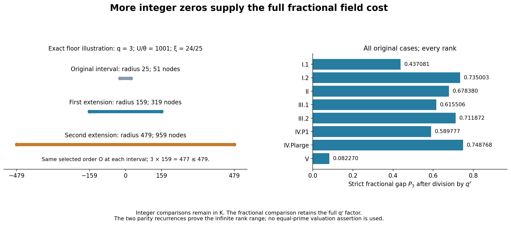

*Figure10.39. Left: exact illustrative floor data q=3, theta=1, U=1001, xi=24/25 give radii159 and479, with319 and959 integer nodes. The old radius25 is shown only to illustrate the two extensions. Their node masses lie above xi U/q-2 and xi U-2, and3 times159 is at most479. These data illustrate the floor mechanism, rather than a full original contradiction parameter choice. The selected order O is unchanged. Right: proved strict lower fractional gaps P3 after division by the full q^r field factor, for every original case and every rank. Lemma10.148 proves the two parity enclosures, Theorem10.149 proves both integer extensions and all original fractional zeros, and Corollary10.150 performs the actual phase induction and stopping contradiction. Solution60 checks the floors and recurrence. [Figure program](../figure_sources/fixed_fractional_boost_profile.py), [exact all-rank certificate](../figure_sources/fixed_fractional_boost_bounds.py). Human-source context: Section7 of [Yu's freely accessible paper](https://archive.ymsc.tsinghua.edu.cn/pacm_download/117/6782-11511_2013_Article_106.pdf). The stronger intermediate integer intervals and the complete full-field comparison are proved above.*

## 47. The first explicit Yu estimate

The two stopping contradictions now give an explicit estimate for the
original multiplicative form. The bases used during the proof can have
smaller rank than the original list. We keep their height allowance until
it cancels against the auxiliary bound. This also requires an elementary
argument when the least rank is one.

### The constants are uniform in the rank

Use the seven cases and their constants from Section 36. Write
\(a=r+1\), \(F_r=r^r(r+1)^r/(r!)^2\), and let \(a_*\),
\(\rho\) and \(\widehat\vartheta\) have their meanings there.
For the two IV branches use the same constants. Define

\[
L_r=\frac{2c_0c_4q(r+1)a_*^rF_r}{\rho\widehat\vartheta}\,v,
\qquad
v=\begin{cases}
5,&\mathrm{I.2,III.1},\\
509/100,&\mathrm{III.2},\\
1,&\mathrm{I.1,II,IV,V}.
\end{cases}
\tag{10.442}
\]

These are lower bounds for the actual \(g_4\). In the branches where
\(g_1\) remains in (10.185), use \(g_1>5\).
For III.2, \(d=1\) gives \(g_1\ge4+\ln3>509/100\).
Indeed the first three positive terms of the logarithm series at
\((3-1)/(3+1)=1/2\) sum to \(1+1/12+1/80>109/100\).
In the other branches the factor \(g_1\) cancels, and \(v=1\)
is valid.

Define the following lower bounds for the actual \(g_2\):

\[
G_r=c_3q(r+1)^2
\begin{cases}
(39r/10+36/5)/(11/10),&\mathrm{I.1,I.2},\\
(39r/10+36/5)\,20/17,&\mathrm{II},\\
2,&\mathrm{III.1,IV},\\
1,&\mathrm{III.2},\\
(39r/10+36/5)/(347/500),&\mathrm V.
\end{cases}
\tag{10.443}
\]

For I and V, these follow from (10.185), (10.288), \(e\ge1\),
\(\ln3<11/10\) and \(\ln2<347/500\). The logarithm bounds
were proved in the exact series calculations of Section 40 and Solution 48.
For II, \(e\ge2\) and \(\ln5<17/10\); the positive exponential
series through degree four at \(17/10\) already exceeds five.
For III and IV use \(d\ge2\) except in III.2, where \(d=1\).
Thus these inequalities apply to every field in the corresponding case.

**Lemma 10.151 (closing every numerical constant).** Put

\[
F_0=(1+\epsilon)(2+g_2^{-1})c_0c_1c_3c_4q^2.
\tag{10.444}
\]

For every rank \(r\ge2\),
\((1+10^{-26})F_0<c\), where \(c\) is the following exact
case constant. The last column gives strict lower bounds for the gap.

| Case | \(c\) | Gap greater than |
| --- | ---: | ---: |
| I.1 | 939 | \(165185/10^6\) |
| I.2 | 636 | \(262798/10^6\) |
| II | 505 | \(146558/10^6\) |
| III.1 | 1794 | \(305548/10^6\) |
| III.2 | 1790 | \(4059/10^6\) |
| IV | 2680 | \(656871/10^6\) |
| V | 206 | \(724409/10^6\) |

**Proof.** Set \(\Delta_r=(r+1)/(2L_r)\). The exact formula
(10.282) gives \(F_{r+1}/F_r>4\), and \(a_*\ge7/2\), so

\[
0<\Delta_{r+1}<\Delta_r/14,\qquad \Delta_2<1.
\tag{10.445}
\]

The second inequality follows by direct substitution in the seven rows.
For \(0<z<1\),
\((1+z/14)^2<1+z\): after subtracting one and dividing by
\(z\), its left side is \(1/7+z/196<1\).
Since \(r+1\le2r\), it follows that
\((1+\Delta_{r+1})^{r+1}<(1+\Delta_r)^r\).
Each displayed \(G_r\) increases with \(r\).
By (10.185), therefore,

\[
(1+10^{-26})F_0
\le (1+10^{-26})(1+\Delta_r)^r
       (2+G_r^{-1})c_0c_1c_3c_4q^2
\le (1+10^{-26})(1+\Delta_2)^2
       (2+G_2^{-1})c_0c_1c_3c_4q^2.
\tag{10.446}
\]

All entries of the final expression are rational. Subtracting it from
the seven integers \(c\), and multiplying positive denominators,
gives the table. The exact fractions and the two positive-series checks
are recorded in the [reproducible calculation](../figure_sources/yu_first_main_bound_certificate.py).
The decrease just proved supplies the quantifier over every rank;
the table alone would only check rank two. \(\square\)

### The bound for the original independent bases

Let \(a_1,\ldots,a_n\) be multiplicatively independent
\(\mathfrak p\)-adic units in a number field \(K\), with \(n\ge2\).
Write \(d=[K:\mathbb Q]\), \(e=e_{\mathfrak p}\),
\(f=f_{\mathfrak p}\), \(t=f\ln p\) and
\(\ell_d=\max\{1,\ln d\}\). At odd \(p\) put \(q=2\).
At \(p=2\), assume \(\zeta_3\in K\) and put \(q=3\).
Let \(q^u\) be the order of the q-primary roots of unity in \(K\).
Use the saturated residue index \(\delta(\boldsymbol a)\) from
(10.49), as in (10.272), for the original list of bases.

Let \(b_1,\ldots,b_n\in\mathbb Z\), not all zero. Renumber so
that \(b_n\ne0\) and \(v_p(b_n)\le v_p(b_j)\) for every
\(j\), with \(v_p(0)=+\infty\). Put

\[
\begin{aligned}
\Xi&=\prod_{j=1}^na_j^{b_j},&
B_\dagger&=\min_{b_j\ne0}|b_j|,\\
R_{\max}&=\max_{j<n}
\left\{\frac{|b_n|}{h(a_j)}+\frac{|b_j|}{h(a_n)}\right\},&
A_n&=\max\{4+\ln((n+1)d),e,t\}.
\end{aligned}
\tag{10.447}
\]

Independence implies \(\Xi\ne1\) and every \(h(a_j)>0\).
Use \(W(d)\) from (10.222). The constants for the statement are

\[
\mathfrak a=\begin{cases}
14,&\mathrm{I,II,IV},\\
7(p-1)/(p-2),&\mathrm{III},\\
26,&\mathrm V,
\end{cases}
\qquad
a_0=\begin{cases}
2+\ln14,&\mathrm{I,II,IV},\\
2+\ln7,&\mathrm{III},\\
2+\ln26,&\mathrm V.
\end{cases}
\tag{10.448}
\]

Use \(c\) from Lemma 10.151 and the exact \(a_1,a_2\)
from (10.287): \(a_1=4.03,4.79,3.44,4.71,5.84,5.12,2.52\)
in the seven cases, \(a_2=a_1\) in I.2 and III.2, and
\(a_2=a_1+\ln2\) otherwise. Define

\[
\begin{aligned}
G_1(n,d)&=(n+1)(a_0n+a_1+\ln(a_0n+a_2)+\ln d),\\
\mathsf h&=\max\left\{
\ln\frac{R_{\max}}{dW(d)},\ \ln B_\dagger,
\ G_1(n,d),\ (n+1)t\right\},\\
C_1&=c\mathfrak a^n
\frac{n^n(n+1)^{n+1}d^{n+2}\ell_d}{n!q^ut}
\max\left\{\frac{p^f}{\delta(\boldsymbol a)t^{n+1}},
                   \frac{\mathrm e^n}{n^n}\right\}A_n.
\end{aligned}
\tag{10.449}
\]

Here \(\mathrm e=\exp(1)\); \(e\) is the ramification index.
The cases are I: \(p=3\), with I.1 for \(d>1\) and I.2
for \(d=1\); II: \(p=5,e\ge2\); III: \(p\ge5,e=1\),
with the same degree subdivisions; IV: \(p\ge7,e\ge2\);
V: \(p=2,\zeta_3\in K\).

**Theorem 10.152 (Yu's first explicit estimate, with proof).** Under
these hypotheses,

\[
\operatorname{ord}_{\mathfrak p}(\Xi-1)
<C_1\mathsf h\prod_{j=1}^nh(a_j).
\tag{10.450}
\]

**Proof.** Choose \(\tau=10^{-26}/(2n)\) in (10.184).
Keep this same \(\theta=\vartheta/(1+\tau)\) and the same
original \(n\) at every smaller rank. Direct substitution gives

\[
qH_*=\mathfrak a(1+\tau),\qquad
(1+\tau)^n<1+10^{-26}.
\tag{10.451}
\]

For the second inequality, the binomial expansion and
\(\binom nk\le n^k\) give
\((1+\tau)^n\le(1-n\tau)^{-1}\).
Here \(n\tau=10^{-26}/2\), and
\((1-x)^{-1}<1+2x\) for \(0<x<1/2\).

Take the least admissible rank \(r\) of (10.277), with integral
forms \(L_0=z_0,L_1,\ldots,L_r\), rational coefficients
\(B_i\), weights \(\sigma_i\) and local unit bases
\(\alpha_i\). This rank exists by the explicit rank-n
representation in Section 35. The weighted height condition there
and the original integers \(b_j\) supply precisely (10.218).
The function \(G_1(j,d)\) increases for integers \(j\ge1\),
because all its positive linear and logarithmic factors increase.
Consequently \(\mathsf h\) meets the original height conditions
(10.223), (10.287), and \(\mathsf h\ge(r+1)t\).

Suppose first \(r\ge2\). Form the complete original parameters
(10.183)–(10.186) with \(h=\mathsf h\) and this least-rank
representation. Write \(U_r=q^{r+1}S\mathcal D/(et)\).
If \(v_p(\Xi-1)\ge U_r\), the depth and phase construction
of Sections 20 and 28, the minimum-valuation derivation choice of
Lemma 10.23, and the integral kernel of Theorem 10.71 give the
original contradiction setting of Section 40.
The evaluated linear form is \(P\log\Xi\), whose valuation
is at least \(U_r\). This evaluation is legitimate on the
principal unit disc: (10.280) gives
\(U_r>q^{r+1}Sb_r>1\ge1/(p-1)\), because \(A_r+x\ge e\).
Lemma 9.5
and Proposition 9.4 identify its valuation with that of \(\Xi-1\).
The original minimum-valuation coefficient hypothesis is retained;
no bound on newly chosen rational \(B_i\) replaces it.

Corollary 10.140 constructs the first induction. If
\(I^*\le I_1\), Theorem 10.141 gives the least-rank
contradiction, including equality. If \(I_1<I^*\),
Corollary 10.150 constructs the second induction and gives its
contradiction. These exhaustive alternatives prove
\(v_p(\Xi-1)<U_r\).

Now use \(\gamma(\mathsf h+x)(A_r+x)/q^\nu
=\mathsf hA_r\) in (10.186). Exact cancellation, with
\(M_r\) and \(H_*\) as in (10.272), gives

\[
eU_r=F_0(qH_*)^r
\frac{r^r(r+1)^{r+1}d^{r+2}\ell_d}{r!q^ut^2}
M_r(\boldsymbol\alpha)A_r\mathsf h\prod_i\sigma_i.
\tag{10.452}
\]

The profile (10.277) bounds its last weight product by
\((\mathrm eH_*(n+1)d)^{n-r}
(M_n(\boldsymbol a)/M_r(\boldsymbol\alpha))\prod_jh(a_j)\).
Thus the actual smaller-rank residue factor cancels exactly.
The ratio between the remaining rank factor and the desired rank-n
factor is at most

\[
\left(\frac{\mathrm e}{q}\right)^{n-r}
\frac{r^r/r!}{n^n/n!}
\left(\frac{r+1}{n+1}\right)^{r+1}\le1.
\tag{10.453}
\]

Indeed consecutive ratios of \(k^k/k!\) are
\((1+1/k)^k\ge2\), by the binomial expansion or its increasing
logarithm. Hence the middle quotient is at most \(2^{r-n}\).
Also \(\mathrm e<3\), \(q\ge2\), and \(r\le n\).
Finally \(A_r\le A_n\), and
\(M_n/t^2=t^{-1}\max\{p^f/(\delta(\boldsymbol a)t^{n+1}),
\mathrm e^n/n^n\}\).
Lemma 10.151 and the small-\(\tau\) bound therefore give the
claimed strict inequality.

It remains to prove the result for \(r=1\). Write
\(B_1=p_1/q_1\) in lowest terms, \(q_1>0\).
Comparison of the integral coefficients in
\(q_1\mathcal L=q_1B_0z_0+p_1L_1\) gives
\(q_1B_0\in\mathbb Z\), \(p_1\mid b_j\) for every \(j\),
and \(|p_1|\le B_\dagger\). Set \(\beta=\alpha_1\) and
let \(g\) be its actual residue order, as defined in Theorem 10.21.
It is non-torsion by the independence in (10.277), and

\[
\Xi^{q_1q^u}=\beta^{p_1q^u}\ne1,\qquad
\operatorname{ord}_{\mathfrak p}(\Xi-1)
\le\frac d t\left(2\mathsf h+2eg\sigma_1\right).
\tag{10.454}
\]

The power identity kills the \(z_0\) torsion factor.
A positive integer power of a local unit never decreases the
valuation of its difference from one, by the factorization of
\(X^m-1\). Apply the proved bound (10.60) to that power.
We have \(q^u\le p^f-1<p^f\), \(t>1\),
\(\mathsf h\ge(n+1)t\), and
\(\mathsf h\ge\ln B_\dagger\); hence
\(\ln(2q^uB_\dagger)<2\mathsf h\).
Also \(p/(p-1)\le2\) and \(h(\beta)\le\sigma_1\).
These facts prove the displayed inequality without a logarithm
estimate for a rank-one form.

Let \(\mathcal T=C_1\mathsf h\prod_jh(a_j)\).
The height-product lower bound (10.55), with
\(w_K\ge q^u\), and \(M_n\ge\mathrm e^nt/n^n\), imply

\[
\mathcal T\ge\frac{d\mathsf h}{t}
\frac{c\mathfrak a^n n^n(n+1)^{n+1}A_n}{\rho(n!)^2}
>800\frac{d\mathsf h}{t}.
\tag{10.455}
\]

For the last inequality use \(c\ge200\), \(\mathfrak a\ge7\),
\(n\ge2\), \(A_n>5\), \(\rho\le58\), and
\(n^n(n+1)^{n+1}/(n!)^2\ge1\).
Thus the first summand in the elementary rank-one bound is less
than \(\mathcal T/400\).

At rank one, \(\delta(\beta)=(p^f-1)/g\), so
\(M_1(\beta)\ge p^fg/((p^f-1)t)>g/t\).
The profile gives
\(\sigma_1\le\Gamma_n^{n-1}(M_n/M_1)\prod_jh(a_j)\).
Consequently its second summand is less than
\(2ed\Gamma_n^{n-1}M_n\prod_jh(a_j)\).
By Lemma 10.73, \(eq^u\le2d\). Dividing this summand by
\(\mathcal T\) and substituting
\(H_*=\mathfrak a(1+\tau)/q\) gives an upper bound

\[
\frac{4t^2(\mathrm e/q)^{n-1}(n!/n^n)(1+\tau)^{n-1}}
{c\mathfrak a(n+1)^2d\ell_d A_n\mathsf h}
<\frac8{c\mathfrak a(n+1)^3d\ell_d}
\le\frac8{200\cdot7\cdot27}<\frac1{4000}.
\tag{10.456}
\]

Here \(n!/n^n\le2^{1-n}\), by the same consecutive-ratio
argument; \(\mathrm e/q<3/2\), \((1+\tau)^{n-1}<2\),
\(A_n\ge t\), and \(\mathsf h\ge(n+1)t\).
The two summands together are strictly smaller than
\((1/400+1/4000)\mathcal T<\mathcal T\).
This completes the rank-one case and the proof. \(\square\)

This is the first estimate in Theorem I of
[Yu's freely accessible 2013 paper](https://archive.ymsc.tsinghua.edu.cn/pacm_download/117/6782-11511_2013_Article_106.pdf),
with its actual residue index, ramification, degree-one constants,
coefficient choice and height parameter. The proof above derives it from
the complete programme arguments, including both stopping branches.

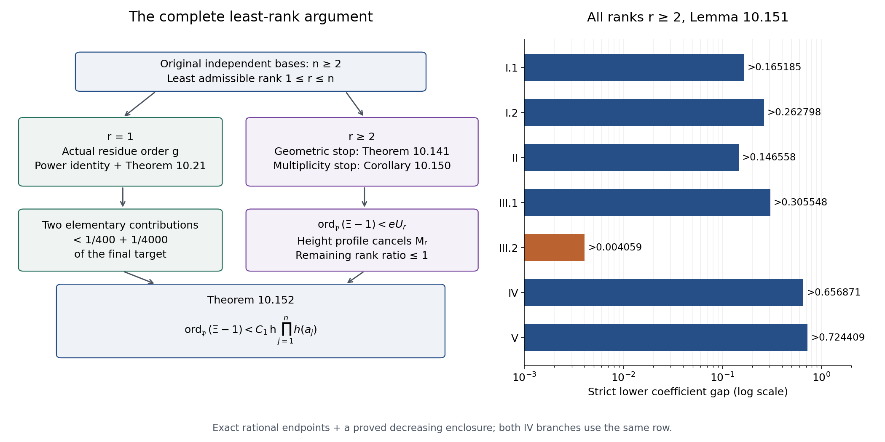

*Figure 10.40. The least admissible rank divides the proof into the elementary residue-order bound at rank one and the two exhaustive stopping contradictions at larger rank. The actual smaller-rank residue factor cancels through (10.277); the remaining rank factor is at most one. The bars give strict lower bounds for the seven coefficient gaps in Lemma 10.151, on a logarithmic scale; every bar applies to all ranks, including the small III.2 gap. Theorem 10.152 proves the final original-base estimate and Solution 61 checks the cancellation and rank-one margins. [Figure program](../figure_sources/yu_first_main_bound_profile.py), [exact rational calculation](../figure_sources/yu_first_main_bound_certificate.py). Human-source context: Sections 1.1, 1.3, 2 and 3.2 of [Yu's free paper](https://archive.ymsc.tsinghua.edu.cn/pacm_download/117/6782-11511_2013_Article_106.pdf).*

## 48. An application bound in terms of the largest coefficient

Keep the field cases and constants of Theorem 10.152. Let
\(a_1,\ldots,a_n\in K^*\) be independent local units,
\(n\ge1\), and let \(b_1,\ldots,b_n\in\mathbb Z\) be not
all zero. Set \(\Xi=\prod_ja_j^{b_j}\) and put
\(\Omega=\prod_jh(a_j)\),
\(B\ge\max\{3,|b_1|,\ldots,|b_n|\}\),
\(H=\max\{\ln B,t\}\), and \(C_1^*=(n+1)C_1\).
When \(n=1\), use the same displayed formula for \(C_1\), with
\(\delta(a_1)=(p^f-1)/g\), where \(g\) is the original residue
order. The height parameter can be replaced by \((n+1)H\) after
a simple local-height alternative. This replacement will then be useful
for dependent lists of bases.

### An explicit coefficient-height threshold

For \(n\ge2\), set

\[
W_B=\frac{7899}{7900}\frac{t}{nd}\,
       C_1^*\frac{\Omega}{\max_jh(a_j)}.
\tag{10.457}
\]

**Lemma 10.153 (the large-coefficient branch supplies every height condition).**
For every original case and every \(n\ge2\),

\[
\ln W_B>a_0n+a_1+\ln d,
\qquad \ln W_B>a_0n+a_2.
\tag{10.458}
\]

**Proof.** Remove one base of maximal height from the independent list,
and apply (10.55) to the remaining \(n-1\) bases. Use
\(w_K\ge q^u\), \(M_n\ge\mathrm e^nt/n^n\), and the exact
formula for \(C_1^*\). All powers of \(q^u\), \(t\) and
\(\ell_d\) cancel, giving

\[
W_B\ge\frac{7899}{7900}\frac{c\mathrm e}{\rho}
\mathfrak a^n
\frac{(n+1)^{n+2}(n-1)^{n-1}}{(n!)^2}\,dA_n.
\tag{10.459}
\]

In all cases \(\mathfrak a\ge\exp(a_0-2)\).
For \(2\le n\le511\), taking logarithms in this lower bound
and subtracting \(a_0n+a_1+\ln d\) leaves at least

\[
\begin{aligned}
&\ln\frac{7899c}{7900\rho}+1
 +(n+2)\ln(n+1)+(n-1)\ln(n-1)\\
&\quad{}-2\ln(n!)-2n+\ln(4+\ln((n+1)d_0))-a_1,
\end{aligned}
\tag{10.460}
\]

where \(d_0=1\) in I.2 and III.2, and \(d_0=2\) in the
other five cases. All 3570 expressions have strictly positive rigorous
lower endpoints. Their minimum is greater than \(5/1000\),
in case IV at \(n=14\). To reproduce this finite certificate, reduce
each positive logarithm argument to \([1,2]\) by powers of two, then
use 32 terms of the positive series
\(2\sum_{j\ge0}z^{2j+1}/(2j+1)\), \(z=(x-1)/(x+1)\).
The omitted tail is at most \(2z^{65}/(65(1-z^2))\).
Round every lower endpoint down and every upper endpoint up to
\(10^{-24}\). Form \(\ln(n!)\) by adding the integer logarithm
intervals; use its upper endpoint in the subtracted term and the lower
endpoint of the positive \(\ln A_n\). These directions preserve
the lower bound at every operation. The [reproducible exact
calculation](../figure_sources/yu_application_height_certificate.py)
records the seven minima and their rational endpoints.

For the infinitely many \(n\ge512\), concavity of \(\ln x\)
puts its graph above the chord on each interval \([k,k+1]\).
Summing their trapezoid integrals gives

\[
\ln(n!)-\tfrac12\ln n\le\int_1^n\ln x\,dx
=n\ln n-n+1.
\tag{10.461}
\]

Hence \(n!\le\mathrm e\sqrt n(n/\mathrm e)^n\).
The integral identities
\(\ln(1+x)>x/(1+x)\) and
\(\ln(1-x)>-x/(1-x)\), for \(x>0\) and \(0<x<1\)
respectively, give
\((1+1/n)^{n+2}(1-1/n)^{n-1}>1\).
Thus the preceding lower bound implies

\[
\frac{W_B}{d\exp(a_0n)}
>\frac{7899c}{7900\rho\mathrm e}A_n
>\frac{7899c}{7900\rho(11/4)}\,10>\exp(a_1).
\tag{10.462}
\]

Here \(\mathrm e<11/4\), \(\exp6<513\), and therefore
\(A_n\ge4+\ln(n+1)>10\). The final seven inequalities follow
from exact positive-exponential series upper bounds: sum through degree
64 and bound the remaining tail by its first term divided by
\(1-x/66\), at each \(x=a_1<6\). Each difference is positive;
the smallest exceeds \(47/100\), in II. The same series checks
\(\mathrm e<11/4\) and \(\exp6<513\).
This proves the first assertion for all ranks. In the degree-one cases
\(a_2=a_1\); in the others \(\ln d\ge\ln2\) and
\(a_2=a_1+\ln2\). The second assertion follows. \(\square\)

### Conversion to the maximum coefficient

**Theorem 10.154 (independent-base application bound).** For the independent
units just described, if \(\Xi\ne1\), then

\[
\operatorname{ord}_{\mathfrak p}(\Xi-1)<C_1^*\Omega H.
\tag{10.463}
\]

At \(n=1\), its right side may be multiplied by \(1/2100\).

**Proof.** First let \(n\ge2\), and write
\(\mathcal T=C_1^*\Omega H\).
The height-product lower bound (10.55), and the second term in \(M_n\),
give

\[
\mathcal T\ge\frac{dH}{t}
\frac{c\mathfrak a^n n^n(n+1)^{n+2}A_n}{\rho(n!)^2}
>7900\frac d t\ln2.
\tag{10.464}
\]

Indeed consecutive ratios of \(k^k/k!\) are at least two, so
\(n^n/n!\ge2^{n-1}\) and
\((n+1)^n/n!\ge2^n\). Thus its rank factor is at least 72.
Use \(c\ge200\), \(\mathfrak a\ge7\), \(A_n>5\),
\(\rho\le58\), \(H>1\) and \(\ln2<1\).

The local height inequality in the proof of Theorem 10.21 gives

\[
\operatorname{ord}_{\mathfrak p}(\Xi-1)
\le\frac d t\bigl(nB\max_jh(a_j)+\ln2\bigr).
\tag{10.465}
\]

If \(B/\ln B\le W_B\), its first term is at most
\((7899/7900)\mathcal T\), and its second is strictly less
than \(\mathcal T/7900\). This proves the desired strict bound.

Otherwise \(B/\ln B>W_B\). Renumber the bases so a nonzero
coefficient of minimum p-adic valuation is last; \(C_1\) and
\(\Omega\) are unchanged. Since \(\ln B>1\), we have
\(B>W_B\) and then \(B>W_B\ln W_B\). Lemma 10.153 yields
\((n+1)\ln B>G_1(n,d)\).
The singleton case of (10.55), with \(w_K\ge2\), gives
\(\min_jh(a_j)\ge2/(\rho d^2\ell_d\mathrm e)\).
Also \(W(d)>1\) and \(\ell_d\le d\); thus

\[
\frac{R_{\max}}{dW(d)}\le\rho\mathrm e d^2 B.
\tag{10.466}
\]

We have \(\ln\rho+1<6\), since the positive exponential
series at five already exceeds 58. Lemma 10.153 gives
\(n\ln B>2\ln d+6\), using \(a_0>39/10\),
\(a_1>0\) and \(n\ge2\). Therefore
\(\ln(R_{\max}/(dW(d)))<(n+1)\ln B\).
The other two entries in \(\mathsf h\) are bounded by
\((n+1)H\) directly. Apply Theorem 10.152 to obtain
\(\operatorname{ord}_{\mathfrak p}(\Xi-1)
<C_1(n+1)H\Omega=\mathcal T\).
This argument uses the proved programme singleton height bound in place
of a separate unproved lower-height theorem.

Now take \(n=1\). Let \(g\) be the original residue order,
\(\Omega=h(a_1)\), and \(\mathcal T=C_1^*\Omega H\),
with the rank-one definition of \(M_1\). Formula (10.60) bounds the
valuation by \((d/t)\ln(2B)+2edg\Omega/t\).
At two, the roots \(-1\) and the q-primary root together have
order \(2q^u\), so \(w_K/q^u\ge2\); at odd primes it is at
least one. Directly in the seven rows,
\(c\mathfrak a w_K/(\rho q^u)>120\) and
\(c\mathfrak a>5000\).
Use the singleton height bound, \(M_1\ge\mathrm e t\), and
\(A_1\ge4+\ln2>14/3\), to get

\[
\mathcal T>4480\frac{dH}{t}.
\tag{10.467}
\]

Since \(2^3<3^2\) and \(B\ge3\),
\(\ln(2B)<(5/3)H\). Its summand is therefore less than
\(\mathcal T/2688\).
For the other summand, retain the actual residue term
\(M_1>g/t\) and \(eq^u\le2d\) from Lemma 10.73.
Exact division by \(\mathcal T\) gives

\[
\frac{2edg\Omega/t}{\mathcal T}
<\frac{t^2}{2c\mathfrak a d\ell_d A_1H}
\le\frac1{2c\mathfrak a d\ell_d}<\frac1{10000}.
\tag{10.468}
\]

Both \(A_1\) and \(H\) are at least \(t\). Finally
\(1/2688+1/10000<1/2100\), since
\(12688\cdot2100<26880000\). This proves the stronger
rank-one assertion. \(\square\)

For example, let \(K=\mathbb Q,p=3,a_1=4,b_1=3^k\),
\(k\ge1\), and choose \(B=3^k\).
The original residue order is \(g=1\), so \(\delta(a_1)=2\);
the roots in \(\mathbb Q\) give \(q^u=2\).
Here \(t=\ln3\), \(H=k\ln3\),
\(A_1=4+\ln2\), and \(M_1=\mathrm e\ln3\): its other
entry is \(3/(2\ln3)<3/2\), whereas \(\mathrm e\ln3>2\).
Substituting the I.2 constants gives

\[
v_3(4^{3^k}-1)=k+1
<\frac{4\cdot636\cdot14}{2100}
  \mathrm e(4+\ln2)k\ln4.
\tag{10.469}
\]

The valuation equality follows from \(v_3(4-1)=1\) and the proved
deep-unit power law, Lemma 9.5. The right side is greater than \(128k\),
using \(4\cdot636\cdot14/2100>16\), \(\mathrm e>2\),
\(4+\ln2>4\), and \(\ln4>1\); hence it strictly exceeds
\(k+1\). The application bound is deliberately uniform rather than
sharp in this simple example. It uses the original rank-one residue
order, which is different from the residue group of a saturated basis.

This is the independent-list part of Theorem 1 in
[Yu's free 2013 paper](https://archive.ymsc.tsinghua.edu.cn/pacm_download/117/6782-11511_2013_Article_106.pdf),
Section 8. Independence supplies positive heights and the height-product
bounds for every sublist. For a dependent list, a change of basis must
also control the new coefficients, its weighted height product and
torsion. Those additional conditions are distinct from the
coefficient-height conversion proved here.

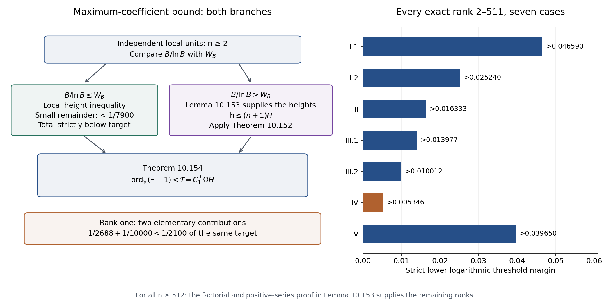

*Figure 10.41. For \(n\ge2\), the small-coefficient branch proves the bound directly by the local height inequality; the large-coefficient branch supplies every entry of \(\mathsf h\) and applies Theorem 10.152. Both give \(\operatorname{ord}_{\mathfrak p}(\Xi-1)<\mathcal T=C_1^*\Omega H\). The bars are strict lower bounds for \(\ln W_B-(a_0n+a_1+\ln d)\), minimized over all exact ranks 2–511 in each field case. The infinite range \(n\ge512\) is proved separately in Lemma 10.153, rather than inferred from the bars. At rank one the two elementary contributions sum to less than \(1/2100\) of \(\mathcal T\), as shown below the diagram. Solution 62 checks the factorial bound, branch conversion and rational example. [Figure program](../figure_sources/yu_application_height_profile.py), [exact calculation](../figure_sources/yu_application_height_certificate.py). Human-source context: Section 8 of [Yu's free 2013 paper](https://archive.ymsc.tsinghua.edu.cn/pacm_download/117/6782-11511_2013_Article_106.pdf); the height conversion here uses the proved programme singleton bound.*

## 49. A weighted application bound for dependent bases

Keep the field and prime hypotheses of Theorem 10.154. Let
\(a_1,\ldots,a_n\in K^*\) be local units of multiplicative rank
\(r\ge1\) modulo roots of unity. They can now be dependent. Let
\(b_i\in\mathbb Z\), \(\Xi=\prod_i a_i^{b_i}\ne1\),
\(B\ge\max\{3,|b_1|,\ldots,|b_n|\}\), and
\(H=\max\{\ln B,t\}\). Sort the indexed list by nondecreasing
height, keeping a fixed ordering at equal heights. Define

\[
\begin{aligned}
\varkappa&=\begin{cases}
18,&\mathrm{I,II,IV},\\
9(p-1)/(p-2),&\mathrm{III},\\
34,&\mathrm V,
\end{cases}\\
X_n&=\max\{n,t\},\qquad
L_n=\frac{X_n}{\varkappa(n+5)d},\qquad
H_n(a)=\max\{h(a),L_n\}.
\end{aligned}
\tag{10.470}
\]

Choose \(\boldsymbol\beta\) by reading this sorted list and
retaining a base exactly when it increases the multiplicative rank.
This greedy basis has r elements. Its residue index
\(\delta_\beta\) is saturated when \(r\ge2\), and is the
original rank-one residue index when \(r=1\), as in (10.272).
All products below are over the indicated indices, so repeated bases
are counted correctly in the complementary product. Set

\[
\begin{aligned}
\Omega_n&=\prod_{a\in\boldsymbol\beta}h(a)
              \prod_{a\notin\boldsymbol\beta}H_n(a),\\
C_n(\boldsymbol\beta)&=c\mathfrak a^n
\frac{n^n(n+1)^{n+2}d^{n+2}\ell_d}{n!q^ut}
\max\left\{\frac{p^f}{\delta_\beta t^{n+1}},
                  \frac{\mathrm e^n}{n^n}\right\}A_n,\\
\mathcal T_n&=C_n(\boldsymbol\beta)\Omega_nH,
\qquad \lambda=2099/2100,\\
\mathcal W_n&=\lambda\frac{t}{nd}
 C_n(\boldsymbol\beta)\frac{\Omega_n}{h(a_n)}.
\end{aligned}
\tag{10.471}
\]

The n in the constant is the length of the original list. Its residue
index belongs to the specified r-element basis. We will preserve that
basis and index during the proof.

**Lemma 10.155 (weighted height and coefficient bounds).** The greedy
basis minimizes \(\Omega_n\) over all independent r-element
sublists. For \(n\ge2\),

\[
\mathcal T_n>2100\frac d t\ln2,
\qquad \mathcal W_n>\mathrm e^nd,
\qquad \mathcal W_n>w_K.
\tag{10.472}
\]

Suppose additionally \(r<n\), \(a_1\) is non-torsion and
\(B/\ln B>\mathcal W_n\). Let x be the first index discarded by
the greedy procedure. Its minimal circuit has an exact integer
relation with positive coefficient at \(a_x\), and every
coefficient has absolute value at most K, where

\[
K<\begin{cases}
B/8,&x<n,\\
BdH_n(a_x)/8,&x=n.
\end{cases}
\tag{10.473}
\]

The rank factor needed after removal satisfies, for every \(n\ge2\),

\[
J_n:=\frac{(n+1)^{n+2}}{(n-1)^{n-1}n^2}
       \left(\frac{n+4}{n+5}\right)^{n-2}
>\mathrm e(n+5).
\tag{10.474}
\]

**Proof.** Rank is ordinary linear rank in the rational space of formal
exponent vectors modulo rational relations whose products are roots of
unity. Clearing denominators proves that these relations form a
subspace. Independence modulo torsion is the same as multiplicative
independence, because a torsion product can be raised to its finite
order. This supplies the elementary linear algebra used by the greedy
procedure.

Write its selected indices as \(i_1<\cdots<i_r\). Any independent
sublist with indices \(j_1<\cdots<j_r\) has \(j_k\ge i_k\):
otherwise it would give k independent vectors before the greedy list
first attained rank k. The function \(h/\max\{h,L_n\}\)
increases with h. Factoring every candidate product as the common
product of all \(H_n(a_i)\), times these r ratios, proves the
minimum assertion. Removing a discarded dependent base or a torsion
base leaves the ordered spans unchanged. Thus it also leaves the
greedy basis unchanged, including when the floor becomes \(L_{n-1}\).

For an independent sublist of length \(j\ge1\), (10.55) gives

\[
\prod h(a)\ge\frac{w_K}{\rho d^{j+1}\ell_d}
              \frac{j^j}{j!\mathrm e^j}.
\tag{10.475}
\]

We will also use this at j=0, with the empty product and the last ratio
both defined to be one. To justify it, apply the untwisted count of
Theorem 10.17 at \(H_0>1\) to the height-zero roots, then let
\(H_0\) decrease to one. It gives \(w_K\le30d\ln d\) for
\(d\ge2\), and \(w_K\le17\) for \(d=1\). In both cases
\(w_K\le\rho d\ell_d\), precisely the required empty-list bound.

To bound \(\mathcal W_n\), remove \(a_n\). If it is selected,
put k=r; otherwise put k=r+1 and use
\(H_n(a_n)/h(a_n)\ge1\). In each case \(1\le k\le n\).
Apply the height bound at length k-1, and the floors to the n-k
remaining complementary elements. The second entry of the maximum in
\(C_n\) yields

\[
\begin{aligned}
\mathcal W_n\ge{}&\lambda\frac c\rho\frac{w_K}{q^u}
\frac{dA_n}{n}\,
\mathfrak a^n\mathrm e^{n-k+1}
\frac{(n+1)^{n+2}}{n!}\\
&{}\times\left(\frac{X_n}{\varkappa(n+5)}\right)^{n-k}
\frac{(k-1)^{k-1}}{(k-1)!}.
\end{aligned}
\tag{10.476}
\]

The case constants give \(\mathfrak a/\varkappa\ge13/17>3/4\),
and \(\mathrm e>8/3\), so \(\mathfrak a\mathrm e/\varkappa>2\).
Also \([n/(n+5)]^{n-k}>\mathrm e^{-5}\), since
\(\ln(1+5/n)<5/n\). Use the factorial bound of Lemma 10.153 and
\((n+1)^2/n^{3/2}\ge3\) to obtain

\[
\mathcal W_n>
\frac{\lambda(200/58)\,105}{(11/4)^5}
\frac{w_K}{q^u}d\mathrm e^n
>2\frac{w_K}{q^u}d\mathrm e^n.
\tag{10.477}
\]

For the rank factor just used, the derivative of
\((x+1)^2/x^{3/2}\) is \((x+1)(x-3)/(2x^{5/2})\). Its minimum
at three is \(16/(3\sqrt3)>3\), because \(256>243\).
The displayed rational prefactor is greater than two by exact
multiplication. Since \(w_K\ge q^u\) and Lemma 10.73 gives
\(q^u\le2d\), both assertions about \(\mathcal W_n\) follow.

For \(\mathcal T_n\), use the height bound at length r and all n-r
complementary floors. Put \(z_n=2n/(n+5)\). Since
\(7>z_n\), \(\mathfrak a\mathrm e/\varkappa>2\) and
\(X_n\ge n\), the resulting bound is

\[
\frac{\mathcal T_n}{dH/t}
\ge\frac{200}{58}\,5\cdot7\,
\frac{(n+1)^{n+2}}{n!}\,z_n^{n-1}.
\tag{10.478}
\]

Consecutive ratios of \((n+1)^{n+2}/n!\) exceed two, so it is at
least \((81/2)2^{n-2}\). At n=2 the remaining factor
\(2^{n-2}z_n^{n-1}\) is \(4/7\); at three and four it is
\(9/8\) and \(2048/729\); at all n at least five it is at least
eight. Thus the preceding coefficient is at least \(81000/29>2100\).
Use \(H>1\) and \(\ln2<1\) to prove the assertion about
\(\mathcal T_n\).

For the circuit assertion, let \(a_1,\ldots,a_m\) be the longest
initial independent block, and set x=m+1. Choose a minimal dependent
sublist containing \(a_x\) and v earlier selected bases, with
\(1\le v\le r\). Let S be these v bases. Theorem 10.20 gives an
exact integer relation, and its sign can make the coefficient at x
positive. Every earlier height is at most \(h(a_x)\), so its
coefficients satisfy

\[
K\le\rho d^{v+1}\ell_d\frac{v!\mathrm e^v}{v^v}
\frac{h(a_x)\prod_{a\in S}h(a)}{\min_{a\in S}h(a)}.
\tag{10.479}
\]

Put j=r-v+1 and s=n-r-1. After dividing by \(\Omega_n\), the
height denominator is the smallest-height member of S and the basis
elements outside S, an independent list of length j. Therefore

\[
\frac K{\Omega_n}\le
\frac{\rho^2d^{r+3}\ell_d^2}{w_K}\,
\mathrm e^{r+1}\frac{v!j!}{v^vj^j}
\frac{h(a_x)}{H_n(a_x)}L_n^{-s}.
\tag{10.480}
\]

Normalize using \(B>\mathcal W_n\ln B\). In the terminal case
x=n, divide additionally by \(dH_n(a_x)\). The normalized ratio
of 8K to the claimed coefficient bound is at most

\[
\frac{8n\rho^2}{\lambda c\mathfrak a^{r+1}(n+1)^2}
\left[\frac{\varkappa}{\mathfrak a\mathrm e}
             \left(1+\frac5n\right)\right]^s.
\tag{10.481}
\]

This uses \(q^u/w_K\le1\), \(\ell_d/A_n\le1\),
\(\ln B>1\), \(n!\le n^n\),
\(v!j!/(v^vj^j)\le1\) and \(h(a_x)/H_n(a_x)\le1\).
Every degree power cancels, since r+3+s=n+2.
If x<n and \(a_n\) is selected, it is outside S. Cancel its
height against the \(h(a_n)\) in \(\mathcal W_n\), and use the
height bound at length j-1. This yields the same envelope multiplied
by \(1/\mathrm e\); j=1 is covered by the empty-list bound.
If \(a_n\) is not selected, cancel its height against its modified
height. Use s-1 floors to obtain the envelope with exponent s-1 and
the extra factor \(1/(\mathfrak a\mathrm e)\).
These alternatives exhaust the internal case, since S lies before x<n.

We have \(\varkappa/(\mathfrak a\mathrm e)<1/2\). For
\(0\le s\le n-2\), \([(1+5/n)/2]^s\le4/3\): the exponent is
zero at n=2; at n=3 it is at most one; at n=4 use
\((9/8)^2<4/3\); at n at least five the base is at most one.
Also \(n/(n+1)^2\le2/9\). Every normalized ratio is therefore
strictly less than

\[
\frac{64\cdot58^2}{27\lambda\cdot200\cdot7^2}
=\frac{107648}{132237}<1.
\tag{10.482}
\]

This proves both circuit bounds, including the field height and all
relation coefficients. The [exact calculation](../figure_sources/yu_dependent_application_enclosures.py)
records these rational endpoints.

Finally, for \(2\le n\le15\), direct rational evaluation gives
\(J_n/(n+5)>11/4>\mathrm e\). For n at least sixteen put y=1/n.
Integrating the geometric-series remainders gives
\(\ln(1+x)\ge x-x^2/2\),
\(\ln(1+x)\le x-x^2/2+x^3/3\) for x nonnegative, and
\(-\ln(1-y)\ge y+y^2/2\). Substitute them into

\[
\begin{aligned}
\ln\frac{J_n}{n+5}={}&(n+2)\ln(1+y)-(n-1)\ln(1-y)\\
&{}+(n-2)\ln(1+4y)-(n-1)\ln(1+5y).
\end{aligned}
\tag{10.483}
\]

The result is at least \(1+(5/2)y-(119/3)y^2+(125/3)y^3\).
Since \(y\le1/16\), it is greater than \(1+y/48\).
Exponentiation proves the rank-factor assertion for all remaining n.
\(\square\)

**Theorem 10.156 (the dependent-list main application estimate).** For
the stated local units, coefficients and specified greedy basis,

\[
\operatorname{ord}_{\mathfrak p}(\Xi-1)
<C_n(\boldsymbol\beta)\Omega_n\max\{\ln B,t\}.
\tag{10.484}
\]

**Proof.** Induct on n. The full-rank case r=n, including n=1, is
Theorem 10.154. Suppose r<n and n at least two.
If \(B/\ln B\le\mathcal W_n\), the local height inequality gives
\(\operatorname{ord}_{\mathfrak p}(\Xi-1)
\le(d/t)(nBh(a_n)+\ln2)<\mathcal T_n\): its two contributions
are at most \(\lambda\mathcal T_n\) and strictly less than
\(\mathcal T_n/2100\), by Lemma 10.155.

Otherwise \(B>\mathcal W_n\ln B>\mathcal W_n\), so
\(\ln B>n+\ln d\), \(B>w_K\) and \(H\ge X_n\).
First suppose \(a_1\) is non-torsion. Use the circuit at the first
discarded index x, with positive coefficient \(k_x\) at x and
coefficients bounded by K. Raising \(\Xi\) to \(k_x\) eliminates
\(a_x\). Its new integer coefficients have absolute value at most
2BK. The greedy basis and its residue index are unchanged.
If \(\Xi^{k_x}=1\), then \(\Xi\) is a root of unity;
Theorem 10.21 gives
\(\operatorname{ord}_{\mathfrak p}(\Xi-1)\le(d/t)\ln2<\mathcal T_n\).

Otherwise put \(z=dH_n(a_x)\). The new coefficients are at most
\(B^2/4\) for x<n, and \(B^2z/4\) for x=n.
For every positive u, \(\ln u\le u/\mathrm e\): differentiating
\(\ln u/u\) locates its maximum at \(u=\mathrm e\).
A valid new bound is therefore \(B'=B^2\exp(z/(4\mathrm e))\),
and its corresponding parameter satisfies

\[
H'\le H\left(2+\frac z{4\mathrm eX_n}\right).
\tag{10.485}
\]

The two entries in the maximum defining \(C_n\) have ratios
\(1/t\) and \(\mathrm e(n-1)^{n-1}/n^n>1/n\) compared with
\(C_{n-1}\). The latter inequality follows from
\((n-1)\ln(1-1/n)>-1\). Their maximum thus has ratio at least
\(1/X_n\), and \(A_n\ge A_{n-1}\). Exact cancellation gives

\[
\frac{C_n(\boldsymbol\beta)}{C_{n-1}(\boldsymbol\beta)}
\ge\mathfrak a\frac d{X_n}
\frac{(n+1)^{n+2}}{(n-1)^{n-1}n^2}.
\tag{10.486}
\]

Let \(\Omega'\) be the modified product of the remaining list with
its new floor and the same basis. Each surviving modified height has
ratio at least \((n+4)/(n+5)\), because \(X_n\ge X_{n-1}\).
Consequently

\[
\frac{\Omega_n}{\Omega'}
\ge H_n(a_x)\left(\frac{n+4}{n+5}\right)^{n-r-1}
\ge H_n(a_x)\left(\frac{n+4}{n+5}\right)^{n-2}.
\tag{10.487}
\]

The product of these two ratios exceeds
\(\mathfrak a\mathrm e(n+5)z/X_n\), by Lemma 10.155.
Since \(z/X_n\ge1/(\varkappa(n+5))\),

\[
\begin{aligned}
\left[\mathfrak a\mathrm e(n+5)-\frac1{4\mathrm e}\right]\frac z{X_n}
&\ge\frac{\mathfrak a\mathrm e}{\varkappa}
       -\frac1{4\mathrm e\varkappa(n+5)}\\
&>\frac{104}{51}-\frac1{672}>2.
\end{aligned}
\tag{10.488}
\]

This uses \(\mathfrak a/\varkappa\ge13/17\),
\(\mathrm e>8/3\), \(\varkappa\ge9\) and n+5 at least seven.
Thus the original \(C_n\Omega_n\) absorbs the complete increase
of the coefficient-height parameter. Apply induction to
\(\Xi^{k_x}\), and the factored-power inequality
\(\operatorname{ord}_{\mathfrak p}(\Xi-1)
\le\operatorname{ord}_{\mathfrak p}(\Xi^{k_x}-1)\), to prove the claim.

If \(a_1\) is torsion, raise \(\Xi\) to its order
\(w\le w_K\). This removes \(a_1\) and preserves the basis.
If the resulting power is one, use the torsion bound above.
Otherwise its coefficients are bounded by \(wB<B^2\), so
\(H'\le2H\). The product-ratio argument, now with deleted height
\(H_n(a_1)=L_n\), gives a ratio greater than
\(\mathfrak a\mathrm e/\varkappa>104/51>2\).
Induction and the same factored-power inequality conclude the proof.
\(\square\)

For an indexed example, take \(K=\mathbb Q,p=5\) and the sorted
list \((2,3,4)\). Prime valuations at two and three give vectors
\((1,0),(0,1),(2,0)\); thus the greedy basis is \((2,3)\) and
r=2. Its q-primary saturation has no extra rational exponent, again
by prime valuations. The residue of two generates all four nonzero
classes at five, so \(\delta_\beta=1\).
Here \(\varkappa=12\), \(L_3=1/32\), and every actual height
exceeds this floor. Hence

\[
\Omega_3=(\ln2)(\ln3)(\ln4),\qquad
4\cdot2^{-2}=1,\qquad
2^1 3^1 4^2=2^5 3^1=96.
\tag{10.489}
\]

Both sides have valuation \(v_5(96-1)=1\).
With B=3, \(B/\ln B<3<8<\mathcal W_3\), by Lemma 10.155, so
this example is in the local-height branch. The exact circuit identity
also illustrates how the coefficient transfer keeps the selected
basis and its residue index. The full list still has length three in
\(C_3\), while its basis has rank two. For a list of rank zero,
\(\Xi\ne1\) is torsion and Theorem 10.21 directly gives
\(\operatorname{ord}_{\mathfrak p}(\Xi-1)\le(d/t)\ln2\).

Theorem 10.156 proves the main dependent-list inequality corresponding
to Theorem 1 of [Yu's free 2013 paper](https://archive.ymsc.tsinghua.edu.cn/pacm_download/117/6782-11511_2013_Article_106.pdf),
Section 8. Its statement uses the specified greedy basis, which attains
the minimum weighted product. The factor \(1/2100\) established in
Theorem 10.154 applies to an independent list of length one.

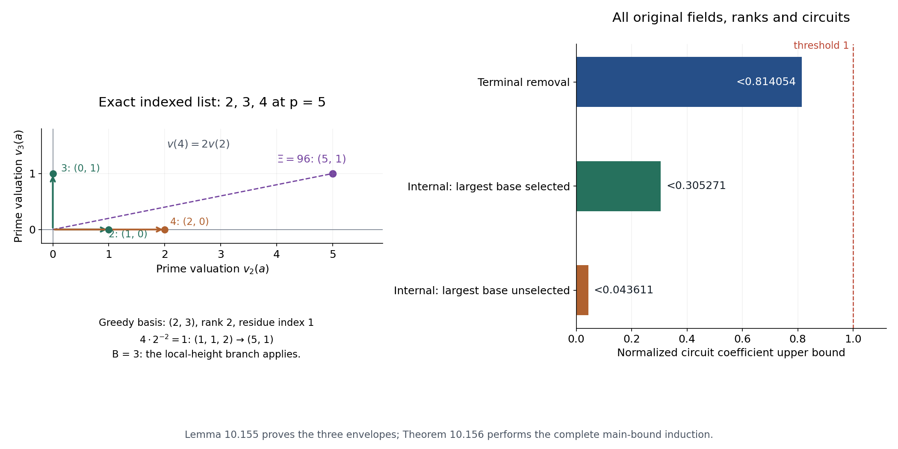

*Figure 10.42. Left: exact prime-valuation vectors of the rational list \((2,3,4)\) give the greedy basis \((2,3)\); the circuit \(4\cdot2^{-2}=1\) transfers exponents \((1,1,2)\) to \((5,1)\). Its actual value is 96, of valuation one at five. This B=3 example uses the local-height branch. Right: proved upper bounds for the normalized circuit coefficient cost in the large-coefficient branch, for all original fields, ranks and circuit sizes. Lemma 10.155 treats terminal removal, internal removal with the largest-height base selected, and internal removal with that base unselected. Each lies below one. Theorem 10.156 then performs the rank-preserving induction, including torsion. Solution 63 checks the coefficient, height-floor and scalar-rank cancellations. [Figure program](../figure_sources/yu_dependent_application_profile.py), [exact universal envelopes](../figure_sources/yu_dependent_application_enclosures.py). Human-source context: Section 8 of [Yu's freely accessible paper](https://archive.ymsc.tsinghua.edu.cn/pacm_download/117/6782-11511_2013_Article_106.pdf).*

## 50. The sharper bound for a dependent list of rank one

Retain the units, sorted indexed list, greedy basis, heights and constants
of Section 49. Suppose its multiplicative rank is one. Write
\(i_0\) for the selected index, \(\beta=a_{i_0}\) for its first
non-torsion base, and
\(g=|\langle\overline\beta\rangle|\). Its residue index is the
original one, \(\delta_\beta=(p^f-1)/g\). Put

\[
R=\prod_{i\ne i_0}\frac{H_n(a_i)}{L_n}\ge1,
\qquad U=\frac{t}{d}\mathcal T_n.
\tag{10.490}
\]

The product is over indices other than the selected index of
\(\beta\), including roots of unity and repetitions. A direct
reduction to one base will also handle coefficients that are too small
for the large-coefficient branch of Theorem 10.156.

### Two uniform budgets

For \(n\ge2\) define

\[
\begin{aligned}
F_n&=\frac c\rho\frac{w_K}{q^u}\mathfrak a^n\mathrm e^{n-1}
\frac{(n+1)^{n+2}}{n!}
\left(\frac{n}{\varkappa(n+5)}\right)^{n-1},\\
E_n&=\frac{4n!\varkappa^{n-1}(n+5)^{n-1}}
{c\mathfrak a^n n^n(n+1)^{n+2}},\\
\alpha_n&=\left(\frac1{2100}-\frac1{40000}\right)F_n.
\end{aligned}
\tag{10.491}
\]

**Lemma 10.157 (rank-one scalar budgets).** These quantities satisfy

\[
U\ge F_nA_nHR,
\qquad \frac{2eg h(\beta)}U<\frac1{40000},
\qquad F_{n+1}>3F_n.
\tag{10.492}
\]

At \(n=2\), the following bounds hold. In the last column the
field degree and \(\ell_d\) are already included.

| Field case | Lower bound for \(\alpha_2\) | Upper bound for \(E_2/(d\ell_d)\) |
| --- | --- | --- |
| I.1 | \(9/4\) | \(1/118314\) |
| I.2 | \(9/4\) | \(1/40068\) |
| II | \(4/3\) | \(1/63630\) |
| III.1 | \(9/4\) | \(1/113022\) |
| III.2 | \(9/4\) | \(1/56385\) |
| IV | \(9/4\) | \(1/337680\) |
| V | \(19/10\) | \(119/5639868\) |

Every lower bound is strict, and every last entry is less than
\(1/40000\). For \(n\ge3\), \(\alpha_n>4n/3\).

**Proof.** The singleton case of (10.55) gives
\(h(\beta)\ge w_K/(\rho\mathrm e d^2\ell_d)\).
Insert this and \(\Omega_n=h(\beta)L_n^{n-1}R\) into
\(U\), using the second entry of the maximum in \(C_n\) and
\(X_n\ge n\). All degree and height-floor powers cancel to give
the first inequality.

For the second inequality use the first entry instead. The original
residue order gives \(p^f/\delta_\beta>g\), while
\(L_n\ge t/[\varkappa(n+5)d]\). Exact division yields

\[
\frac{2eg h(\beta)}U
<\frac{2e q^u n!\varkappa^{n-1}(n+5)^{n-1}t^2}
{c\mathfrak a^n n^n(n+1)^{n+2}d^2\ell_dRA_nH}
\le\frac{E_n}{d\ell_dR}.
\tag{10.493}
\]

The last step uses \(eq^u\le2d\) from Lemma 10.73, and
\(t^2\le A_nH\). At two,
\(E_2=14\varkappa/(81c\mathfrak a^2)\).
In I.1, II, III.1, IV and V use \(d\ge2\); in the other two
cases use \(d=1\). Also \(\ell_d\ge1\).
Direct substitution of the seven case constants gives the last column.
In III, \(\mathfrak a^2/\varkappa\ge49/9\), including every
prime in that case.

For the middle column, use
\(\mathrm e>27/10\), obtained by summing its positive exponential
series through degree five. At odd primes \(w_K/q^u\ge1\).
At two, \(-1\) together with the q-primary roots has order
\(2q^u\), so \(w_K/q^u\ge2\). Thus

\[
F_2>\frac c\rho\frac{w_K}{q^u}
\frac{\mathfrak a^2}{\varkappa}\frac{2187}{70}.
\tag{10.494}
\]

Use \(\rho=17\) in degree one and \(\rho=58\) otherwise.
Substitution gives the stated strict rational bounds on \(\alpha_2\).
The [exact scalar calculations](../figure_sources/yu_rank_one_refinement_enclosures.py)
include each difference as a positive fraction.

The ratio of consecutive \(F_n\) is

\[
\frac{F_{n+1}}{F_n}=
\frac{\mathfrak a\mathrm e}{\varkappa}
\left(1+\frac1{n+1}\right)^{n+3}
\frac{n+1}{n+6}
\left(\frac{(n+1)(n+5)}{n(n+6)}\right)^{n-1}.
\tag{10.495}
\]

We have \(\mathfrak a\mathrm e/\varkappa>104/51\).
For \(n=2,3,4,5\), the rational product after this factor is,
respectively,

\[
\frac{56}{27},\quad\frac{15625}{6561},\quad
\frac{1594323}{625000},\quad\frac{11529602}{4348377}.
\tag{10.496}
\]

Multiplying each by \(104/51\) gives a number greater than three.
For all \(n\ge6\), the first power in the ratio is greater than
\(\mathrm e\), by \(\ln(1+x)>x/(1+x)\). The last power is
greater than one and \((n+1)/(n+6)\ge7/12\). The ratio is
therefore greater than \((104/51)(8/3)(7/12)=1456/459>3\).
This proves the claim at every rank.

Direct cancellation also gives
\(E_{n+1}/E_n=\mathrm e nF_n/[(n+1)F_{n+1}]<11/12\).
Consequently the last column bounds every \(E_n/(d\ell_dR)\).
Finally \(\alpha_2>4/3\) in every row, so
\(\alpha_n>4\cdot3^{n-3}\ge4n/3\) for \(n\ge3\).
The latter inequality follows by induction, starting at three.
\(\square\)

### Simultaneous reduction to the selected base

**Theorem 10.158 (the rank-one application refinement).** Under the
hypotheses of Theorem 10.156, if the list has rank one, then

\[
\operatorname{ord}_{\mathfrak p}(\Xi-1)
<\frac1{2100}C_n(\beta)\Omega_n\max\{\ln B,t\}.
\tag{10.497}
\]

**Proof.** At \(n=1\) this is Theorem 10.154. Let \(n\ge2\).
Put

\[
D_n=\rho\mathrm e d^2\ell_dL_n,
\qquad D_0=\max\{1,D_n\}.
\tag{10.498}
\]

For each non-torsion base at an index \(i\ne i_0\), Theorem 10.20
applied to the dependent pair \((\beta,a_i)\) supplies an exact
relation
\(\beta^{u_i}a_i^{k_i}=1\), with \(k_i\) a positive integer and
\(k_i\le\rho\mathrm e d^2\ell_dh(a_i)\).
Here \(h(\beta)\le h(a_i)\), so the smaller height in that
theorem is \(h(\beta)\). Taking heights in the relation gives
\(|u_i|/k_i=h(a_i)/h(\beta)\).

Let m be the number of these non-torsion complementary indices.
If the original list has no torsion bases, put
\(P=\prod k_i\). Otherwise put \(P=w_K\prod k_i\).
Every torsion base then disappears, and the relations give

\[
\Xi^P=\beta^M,
\qquad M\in\mathbb Z,
\qquad |M|\le nBP\frac{h(a_n)}{h(\beta)}.
\tag{10.499}
\]

This is an identity in K, with no change in the residue index.
If the power is one, \(\Xi\) is torsion. Theorem 10.21 and
\(\mathcal T_n>2100(d/t)\ln2\) from Lemma 10.155 give the
required bound. Hence assume M is nonzero.

Each \(k_i\le D_0H_n(a_i)/L_n\), so the product of these
coefficients is at most \(D_0^mR\). If there is a non-torsion
complementary base, the largest height occurs among the complementary
indices, or equals the selected height. The singleton height bound
then gives

\[
\frac{h(a_n)}{h(\beta)}
\le\max\{1,D_n/w_K\}R.
\tag{10.500}
\]

When there is no such base, this ratio is one. Since
\(\ln B\le H\), the resulting bounds for \(\ln(2|M|)\) are

\[
\begin{cases}
Z_0+2\ln R,&\text{no torsion bases},\\
Z_1+2\ln R,&\text{torsion and a non-torsion complement},\\
H+\ln(2w_K),&\text{only torsion in the complement},
\end{cases}
\tag{10.501}
\]

where

\[
\begin{aligned}
Z_0&=H+\ln(2n)+(n-1)\ln D_0+\ln\max\{1,D_n/w_K\},\\
Z_1&=H+\ln(2n)+(n-2)\ln D_0+\ln\max\{w_K,D_n\}.
\end{aligned}
\tag{10.502}
\]

We show that all three are less than \(\alpha_nA_nHR\).
The empty-list height bound in Lemma 10.155 gives
\(w_K\le\rho d\ell_d\). Since \(D_0\ge D_n\),

\[
\frac{w_K}{D_0}\le\frac{\varkappa(n+5)}{\mathrm eX_n}<45.
\tag{10.503}
\]

Indeed \(\varkappa\le34\), \(X_n\ge n\),
\((n+5)/n\le7/2\) and \(\mathrm e>8/3\).
Every displayed alternative is thus at most \(Z_n+2\ln R\), where

\[
Z_n=H+\ln(2n)+n\ln D_0+\ln45.
\tag{10.504}
\]

For \(n\ge3\), use \(X_n\le nH\), \(H>1\), and
\(\rho\mathrm e/\varkappa<18\). Concavity of the logarithm at
eight gives
\(\ln\ell_d\le(\ln d)/8+11/10\): if \(d\ge3\) use
\(\ln x\le x/8+\ln8-1\), and if \(d=1,2\) the left side
is zero. Also \(\ln H\le H-1\), \(\ln18<3\) and
\(\ln45<4\). Consequently

\[
Z_n<(n+1)H+\frac{31n}{10}+\ln(2n)+4
          +\frac{9n}{8}\ln d.
\tag{10.505}
\]

By Lemma 10.157, \(\alpha_n>4n/3\); since \(H>1\), its
coefficient of \(\ln d\) is greater than \(9n/8\).
For the remaining terms use \(A_n\ge4+\ln(n+1)+\ln d\),
\(\ln(n+1)\ge\ln4>4/3\), and \(\ln(2n)<n\).
At H=1 their comparison reduces to

\[
\frac{64n}{9}>\frac{51n}{10}+5\qquad(n\ge3).
\tag{10.506}
\]

The difference is \(181n/90-5>0\). Increasing H only increases
the difference, because \(\alpha_n[4+\ln(n+1)]>n+1\).
Thus \(Z_n<\alpha_nA_nH\) throughout this infinite range.

At \(n=2\) there are just two possibilities. If the complementary
base is non-torsion, the first alternative is at most
\(H+\ln4+2\ln D_0+2\ln R\).
Here \(D_0\le s d\ell_dH\), where
\(s=\max\{1,2\rho\mathrm e/(7\varkappa)\}\).
In II, \(s<319/126<\mathrm e\); in every case
\(s<319/63<\exp(5/3)\).
The logarithmic tangent at sixteen gives
\(\ln\ell_d\le(\ln d)/16+9/5\).
Using \(\ln4<7/5\) and \(\ln H\le H-1\) bounds its part
independent of R by

\[
\begin{cases}
3H+5+(17/8)\ln d,&\mathrm{II},\\
3H+19/3+(17/8)\ln d,&\text{all other cases}.
\end{cases}
\tag{10.507}
\]

In II, \(H\ge\ln5>8/5\) and \(\alpha_2>4/3\).
In V, \(f\ge2\), hence \(H\ge2\ln2>4/3\), and
\(\alpha_2>19/10\). In all remaining cases
\(H>1\) and \(\alpha_2>9/4\).
These give \(\alpha_2H>17/8\).
Since \(4+\ln3>5\), the constant comparisons in II and the
other cases follow from
\((20/3-3)(8/5)>5\) and \(19/2-3>19/3\), respectively.
Thus this alternative is less than \(\alpha_2A_2H+2\ln R\).

If the complement is torsion, its bound is
\(H+\ln(2w_K)\). The same tangent, with \(\ln\rho<5\),
gives at most \(H+15/2+(17/16)\ln d\).
The coefficient comparison already established is stronger than needed.
For the constant part, in II use
\((20/3-1)(8/5)>15/2\), and otherwise use
\(19/2-1>15/2\). This proves the comparison in the second
possibility too. All numerical logarithm comparisons used here follow
from the positive series in Solution 64; they require no approximation
to be accepted as an equality.

In every case the bound before the \(2\ln R\) term is less than
\(\alpha_nA_nH\), which is greater than two.
The inequality \(\ln R\le R-1\), for \(R\ge1\), therefore
proves

\[
\ln(2|M|)<\alpha_nA_nHR
\le\left(\frac1{2100}-\frac1{40000}\right)U.
\tag{10.508}
\]

Apply Theorem 10.21 to \(\beta^M\), using its actual residue
order g. Factoring the P-th power difference gives

\[
\begin{aligned}
\operatorname{ord}_{\mathfrak p}(\Xi-1)
&\le\operatorname{ord}_{\mathfrak p}(\beta^M-1)\\
&\le\frac d t\left(\ln(2|M|)+2eg h(\beta)\right)
<\frac{\mathcal T_n}{2100},
\end{aligned}
\tag{10.509}
\]

by the two budgets. This includes every size of B and every torsion
pattern. \(\square\)

For example, at five in \(K=\mathbb Q\), the indexed list
\((4,16)\) has rank one and selected base four, with original
residue order two and \(\delta_\beta=2\).
Its floor is \(L_2=1/42\), and
\(\Omega_2=(\ln4)(\ln16)\). For coefficients
\((0,5^k)\), \(k\ge0\), choose \(B=\max\{3,5^k\}\).
The exact relation \(16\cdot4^{-2}=1\) permits P=1 and gives
\(\Xi=4^{2\cdot5^k}\). Lemma 9.5 proves
\(v_5(\Xi-1)=1+k\). The bound of Theorem 10.158 uses the
length-two constant and this weighted product, while keeping the raw
residue order of four. It does not replace it by the order of a
saturated base.

The rank-one factor is also asserted in Theorem 1 of
[Yu's freely accessible paper](https://archive.ymsc.tsinghua.edu.cn/pacm_download/117/6782-11511_2013_Article_106.pdf).
The proof above uses the exact integer relations and the proved
one-base power bound for the whole list; it therefore also covers the
small-coefficient case directly.

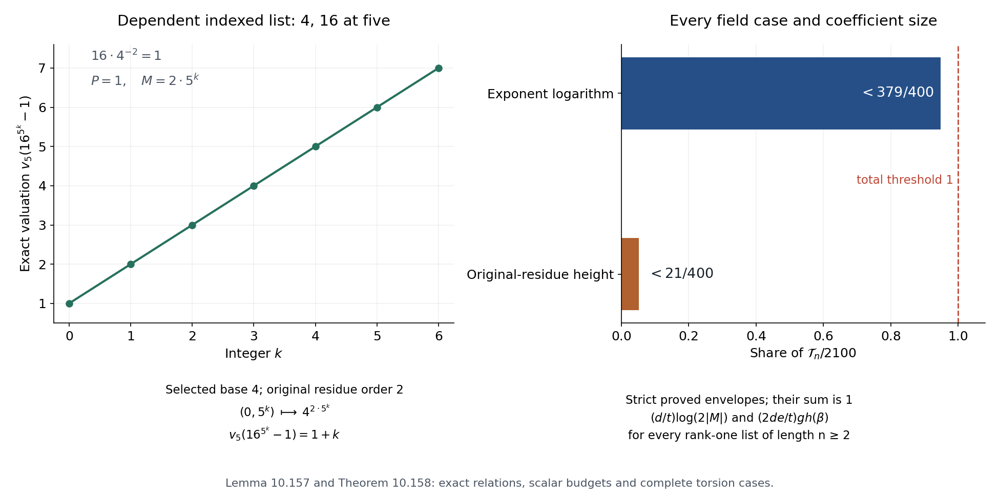

*Figure 10.43. Left: the dependent indexed list \((4,16)\) at five,
with coefficients \((0,5^k)\), reduces exactly to
\(4^{2\cdot5^k}\); the plotted valuations \(1+k\) are exact
values, proved by the deep-unit power law. Right: the normalized
logarithmic exponent cost is strictly below
\(1/2100-1/40000\), and the original-residue height cost is strictly
below \(1/40000\). These are universal proved envelopes for every
rank-one list of length at least two, every field case and every
coefficient size, whose sum is \(1/2100\). Lemma 10.157 proves the
scalar budgets and Theorem 10.158 proves the full reduction, including
torsion. [Figure program](../figure_sources/yu_rank_one_refinement_profile.py),
[exact scalar calculations](../figure_sources/yu_rank_one_refinement_enclosures.py).
Human-source context: Theorem 1 and Section 8 of
[Yu's freely accessible paper](https://archive.ymsc.tsinghua.edu.cn/pacm_download/117/6782-11511_2013_Article_106.pdf).*

## 51. An effective p-adic distance between integral S-units

Let S be a finite set of rational primes. An integral S-unit here is a
nonzero integer whose prime factors all belong to S; either sign is
allowed. Let x and y be distinct integral S-units, set
\(M=\max\{|x|,|y|\}\), and let p be any rational prime. Put

\[
g_0=\gcd(|x|,|y|),\qquad x_0=x/g_0,\qquad y_0=y/g_0,
\qquad S_p=S\setminus\{p\}.
\tag{10.510}
\]

The common factor must be retained. For example,
\(x=3^N25,y=3^N7\) have difference \(3^N18\), of valuation
\(N+2\) at three. Their coprime parts have fixed distance of
valuation two, however large N is.

Write \(S_p=\{q_1<\cdots<q_n\}\). For \(n\ge1\) the
following explicit constants will bound the distance of the coprime
parts. Use the field

\[
K_p=\begin{cases}\mathbb Q,&p>2,\\
\mathbb Q(\zeta_3),&p=2,\end{cases}
\qquad
(d,e,f,q^u)=\begin{cases}(1,1,1,2),&p>2,\\
(2,1,2,3),&p=2.
\end{cases}
\tag{10.511}
\]

Here \(\zeta_3\) is a primitive cube root of unity, and q is the
auxiliary prime of the earlier logarithm estimates, distinct from the
listed primes \(q_i\). Put \(t=f\ln p\).
The rational prime bases are independent, so set
\(\boldsymbol\beta=(q_1,\ldots,q_n)\). Use their saturated
residue index when \(n\ge2\), and the raw index at \(n=1\).

These indices are entirely explicit. At odd p and \(n\ge2\), let
\(G\) be the subgroup of \(\mathbb F_p^*\) generated by
\(-1,q_1,\ldots,q_n\); then \(\delta_\beta=(p-1)/|G|\).
At odd p and \(n=1\), use
\(\delta_\beta=(p-1)/\operatorname{ord}_p(q_1)\).
At two, the indices are one for \(n\ge2\) and three for
\(n=1\). All these finite orders can be found by enumerating a
finite multiplicative group.

Let \(\epsilon=\operatorname{sgn}(x_0/y_0)\), and define

\[
\begin{aligned}
m&=\begin{cases}n,&\epsilon=1,\\n+1,&\epsilon=-1,\end{cases}\\
\Omega_\epsilon&=\begin{cases}
\displaystyle\prod_{i=1}^n\ln q_i,&\epsilon=1,\\
\displaystyle L_m\prod_{i=1}^n\ln q_i,&\epsilon=-1,
\end{cases}\\
\eta_n&=\begin{cases}1/2100,&n=1,\\1,&n\ge2,\end{cases}\\
K_{S,p}^{\epsilon}&=\eta_n C_m(\boldsymbol\beta)\Omega_\epsilon,\\
B_M&=\max\{3,\ln M/\ln2\},\qquad
H_{S,p}(M)=\max\{\ln B_M,t\}.
\end{aligned}
\tag{10.512}
\]

The \(L_m\), \(C_m\), \(\varkappa\) and case constants are
those of Section 49, computed in the specified field \(K_p\).
Thus \(C_m\) uses the original list length m and the index of its
n-element basis. The constant depends on S, p and the sign, but not
on the exponents occurring in x and y.

**Theorem 10.159 (integral S-unit distance).** If \(n\ge1\), then

\[
v_p(x-y)<v_p(g_0)+K_{S,p}^{\epsilon}H_{S,p}(M).
\tag{10.513}
\]

If \(n=0\), the exact excess \(v_p(x-y)-v_p(g_0)\) is zero
unless \(x_0=-y_0=\pm1\), in which case it is \(v_p(2)\).

**Proof.** Coprimality of \(|x_0|\) and \(|y_0|\) implies
that at most one is divisible by p. If one is divisible by p, their
difference is a p-adic unit, so \(v_p(x-y)=v_p(g_0)\).
For \(n\ge1\) the constant is positive, proving the strict
inequality in this case. At \(n=0\), all prime factors of the
coprime parts must be p. If neither part is divisible by p, their
absolute values are both one; distinctness gives the stated opposite
sign case. This proves the entire \(n=0\) assertion.

Now assume \(n\ge1\) and both coprime parts are p-adic units.
Their ratio is

\[
\Xi=\frac{x_0}{y_0}=\epsilon\prod_{i=1}^n q_i^{b_i}\ne1,
\qquad b_i\in\mathbb Z,\qquad
|b_i|\le\frac{\ln M}{\ln q_i}\le\frac{\ln M}{\ln2}.
\tag{10.514}
\]

Indeed the nonnegative exponents in each of \(|x_0|,|y_0|\)
are at most \(\ln M/\ln q_i\), and their difference has
absolute value at most their maximum. Rational prime valuations show
that the listed bases are independent, even modulo roots of unity:
a positive rational number that is a root of unity is one, and each
prime valuation then makes its exponent zero. Their heights are
\(h(q_i)=\ln q_i\).

We verify the field and index data. At odd p these are the rational
field data. Its q-primary saturation of prime bases has no additional
exponents: if a rational q-power root of their product exists, prime
valuations make all the indicated exponents integral. Root choices
only introduce the already available sign. Consequently the saturated
residue group is precisely G. The raw singleton index follows from
its actual residue order, as in (10.272).

At two the polynomial \(X^2+X+1\) has no rational root, so
\([K_p:\mathbb Q]=2\). Its reduction is irreducible over
\(\mathbb F_2\), since it vanishes at neither zero nor one.
Thus the residue degree is at least two. The degree inequality
\(ef\le d=2\) gives \(e=1,f=2\). Its root reduces to an
element of order three in \(\mathbb F_4^*\), so including the
q-primary torsion generator makes every saturated residue group at
rank at least two equal to that whole group, irrespective of a
choice of saturated basis. Every odd rational prime reduces to one,
so a singleton's raw order is one and its index is three.
The field contains \(\zeta_3\), and cannot contain
\(\zeta_9\), whose degree six is proved by the cyclotomic
argument of Lesson 9. Hence \(q^u=3\). These also verify the
two-adic field hypothesis required by Theorems 10.154 and 10.156.

If \(\epsilon=1\), apply Theorem 10.154 to the n independent
prime bases and bound \(B=B_M\). Its weighted product is
\(\prod_i\ln q_i\). The factor \(\eta_1=1/2100\) is
included by that theorem's singleton conclusion.

If \(\epsilon=-1\), use the indexed list
\((-1,q_1,\ldots,q_n)\), whose length is m=n+1 and rank is n.
Its first base has height zero, so the greedy basis is exactly
\(\boldsymbol\beta\), and its weighted product is
\(L_m\prod_i\ln q_i\). The coefficient of the sign base is
one, which is also bounded by \(B_M\). Apply Theorem 10.156,
and apply its sharpened rank-one form, Theorem 10.158, when n=1.
Neither argument changes the selected basis's residue index.

The fields used here both have ramification index e=1. Restricting
their normalized prime-ideal valuation to the rational numbers is
therefore exactly \(v_p\). Since \(y_0\) is a p-adic unit,

\[
v_p(x-y)-v_p(g_0)=v_p(x_0-y_0)
=v_p(\Xi-1)<K_{S,p}^{\epsilon}H_{S,p}(M).
\tag{10.515}
\]

This proves the claimed effective bound in every case. \(\square\)

**Corollary 10.160 (distance after removing the common factor).** With
\(|z|_p=p^{-v_p(z)}\) and \(n\ge1\),

\[
\frac{|x-y|_p}{|g_0|_p}
>\min\left\{p^{-K_{S,p}^{\epsilon}t},
B_M^{-K_{S,p}^{\epsilon}\ln p}\right\}.
\tag{10.516}
\]

**Proof.** Exponentiate the strict valuation inequality of Theorem
10.159. The negative exponential of the maximum of two real numbers
is the minimum of their negative exponentials. This gives exactly
the two terms displayed. \(\square\)

For fixed S and p, this lower bound is a fixed negative power of
\(\ln M\) once \(\ln B_M\ge t\). The normalization by the
common factor is necessary; the family at the start of the section
proves that directly.

For the positive example \(S=\{3,5,7\},p=3\), the prime bases
are five and seven. Together with minus one their residues generate
\(\mathbb F_3^*\), so \(\delta_\beta=1\).
The data are \(d=e=f=1,q^u=2,c=636,\mathfrak a=14\),
\(t=\ln3\), \(\Omega=(\ln5)(\ln7)\), and
\(A_2=4+\ln3\). Thus the completely specified constant is

\[
K_{S,3}^{+}=
\frac{636\cdot14^2\cdot81}{\ln3}
\max\left\{\frac3{(\ln3)^3},\frac{\mathrm e^2}4\right\}
(4+\ln3)(\ln5)(\ln7).
\tag{10.517}
\]

For \(x=3^N25,y=3^N7\), the coprime ratio is \(25/7\),
with prime exponents \((2,-1)\). Its difference from one is
\(18/7\), of exact valuation two. The original difference has
valuation N+2. The theorem bounds the excess two by a constant
times \(H_{S,3}(3^N25)\), while retaining the exact contribution N
of the common factor.

For a signed example take \(x=25,y=-7,p=2\) and
\(S=\{5,7\}\). The ratio is \(-25/7\), represented by
the list \((-1,5,7)\) with coefficients \((1,2,-1)\).
Here \(d=2,e=1,f=2,q^u=3,\delta_\beta=1\),
\(\varkappa=34,m=3\), and \(L_3=3/544\).
The weighted product is \((3/544)(\ln5)(\ln7)\), and the
exact difference \(25+7=32\) has valuation five at two. The sign
requires the dependent-list theorem rather than being silently
discarded from the exponent vector.

The logarithmic-form input is the complete programme proof in
Theorems 10.154, 10.156 and 10.158. Its scholarly context is Theorem 1
of [Yu's freely accessible paper](https://archive.ymsc.tsinghua.edu.cn/pacm_download/117/6782-11511_2013_Article_106.pdf).

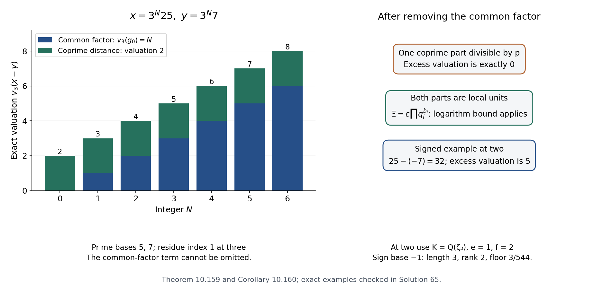

*Figure 10.44. Left: for \(x=3^N25,y=3^N7\), the exact
valuation is N+2. Its two components are the common-factor valuation N
and the fixed coprime distance of valuation two. The bars show exact
integer values, while Theorem 10.159 bounds the second component in
general. Right: a coprime nonunit case has zero excess valuation;
the unit case is reduced to \(\epsilon\prod q_i^{b_i}\).
The example \(25-(-7)=32\) at two requires the sign base minus one,
the field \(\mathbb Q(\zeta_3)\), and the length-three weighted
height floor \(3/544\). Theorem 10.159 proves the full sign and
field conditions, Corollary 10.160 gives the normalized distance, and
Solution 65 checks both examples. [Reproducible exact calculation and
figure](../figure_sources/integral_s_unit_distance.py).
Human-source context: Theorem 1 of [Yu's freely accessible paper](https://archive.ymsc.tsinghua.edu.cn/pacm_download/117/6782-11511_2013_Article_106.pdf).*

## 52. The one-base case of Yu's second constant

The second constant in Yu's free 2013 paper has a different rank
dependence from the first. Its one-base estimate follows directly from
the power bound already proved here. We give its full numerical
constant and keep the original residue order throughout.

Let \(K\) be a number field, \(\mathfrak p\) a prime above p,
and \(\beta\in K^*\) a non-torsion unit at \(\mathfrak p\).
Write \(d=[K:\mathbb Q]\), \(e=e_{\mathfrak p}\),
\(f=f_{\mathfrak p}\), \(t=f\ln p\), and
\(\ell_d=\max\{1,\ln d\}\). At odd p put \(q=2\).
At \(p=2\), assume \(\zeta_3\in K\) and put \(q=3\).
Let \(q^u\) be the order of the q-primary roots of unity in K,
and let \(w_K\) be the order of all its roots of unity.
The order g of the reduction of \(\beta\) is its original
residue order, without replacing \(\beta\) by a saturated base.
Put

\[
\delta_\beta=\frac{p^f-1}{g},\qquad
A_1=\max\{4+\ln(2d),e,t\},\qquad
a^{(2)}=\begin{cases}7,&p>2,\\13,&p=2.\end{cases}
\tag{10.518}
\]

Use the following exhaustive field cases. Their constants are the
freely accessible parameters (1.29)–(1.30) in Yu's paper.

| Case | Field and prime hypotheses | \(c^{(2)}\) |
| --- | --- | ---: |
| I.1 | \(p=3,d>1\) | 1438 |
| I.2 | \(p=3,d=1\) | 648 |
| II | \(p=5,e\ge2\) | 690 |
| III.1 | \(p\ge5,e=1,d>1\) | \(495(p-1)/(p-2)\) |
| III.2 | \(p\ge5,e=1,d=1\) | \(557(p-1)/(p-2)\) |
| IV | \(p\ge7,e\ge2\) | 2418 |
| V | \(p=2,\zeta_3\in K\) | 406 |

Take a nonzero integer b and \(B\ge\max\{3,|b|\}\).
Set \(H=\max\{\ln B,t\}\) and

\[
\mathcal T_2=
\frac{8c^{(2)}a^{(2)}\mathrm e d^3\ell_d}{q^ut^3}
\max\left\{\frac{p^f}{\delta_\beta},\mathrm e t^2\right\}
A_1h(\beta)H.
\tag{10.519}
\]

Here \(\mathrm e=\exp(1)\), distinct from the ramification
index e. The notation \(\mathcal T_2\) refers to the second
Yu constant at list length one. Substituting \(n=1\) into
his formula (1.10) and multiplying by \(n+1\) gives this
expression: the factor \(P=p^\kappa\) cancels and \(0!=1\).

**Theorem 10.161 (the second one-base application estimate).** Under
these hypotheses,

\[
\operatorname{ord}_{\mathfrak p}(\beta^b-1)
<\frac{\mathcal T_2}{4000}.
\tag{10.520}
\]

**Proof.** Put \(U_2=(t/d)\mathcal T_2\). The singleton
height bound (10.55) is
\(h(\beta)\ge w_K/(\rho\mathrm e d^2\ell_d)\), with
\(\rho=17\) for \(d=1\) and \(\rho=58\) for \(d\ge2\).
Using the second entry of the maximum gives

\[
U_2\ge JA_1H,\qquad
J=\frac{8c^{(2)}a^{(2)}\mathrm e}{\rho}
\frac{w_K}{q^u}.
\tag{10.521}
\]

For the other contribution, the first entry gives
\(p^f/\delta_\beta=p^fg/(p^f-1)>g\). Exact division yields

\[
\begin{aligned}
\frac{2eg h(\beta)}{U_2}
&<\frac{eq^ut^2}
{4c^{(2)}a^{(2)}\mathrm e d^2\ell_dA_1H}\\
&\le\frac1{2c^{(2)}a^{(2)}\mathrm e d\ell_d}.
\end{aligned}
\tag{10.522}
\]

The last step uses \(t^2\le A_1H\) and
\(eq^u\le2d\). The latter follows from Lemma 10.73:
\(d/e\ge q^{u-1}(q-1)\), while \(q/(q-1)\le2\).

At odd primes \(w_K/q^u\ge1\). At two, the roots \(-1\)
and the q-primary roots generate a group of order \(2q^u\),
so \(w_K/q^u\ge2\), as in Lemma 10.157.
The positive exponential series gives \(\mathrm e>27/10\).
Also \(\ln2>2/3\), so \(A_1>14/3\) at degree one and
\(A_1>16/3\) at degree at least two.

Since \(B\ge3\) and \(2^3<3^2\),
\(\ln(2B)<(5/3)H\). In III, \(H\ge\ln5>8/5\) and
\(\ln2<7/10\), so the sharper inequality is
\(\ln(2B)<(23/16)H\).
These logarithm comparisons follow from the positive series proved
in Section 40 and Solution 48; equivalently, the first four terms
of the series for \(\ln5\), with argument \(2/3\), already
exceed \(8/5\).

The following table supplies all numerical endpoints. The column L
is a strict lower bound for \(U_2/H\). The last column is an
upper bound for the sum of the two contributions after division
by \(U_2\).

| Case | L | Logarithm multiplier \(\mu\) | Total upper bound |
| --- | ---: | ---: | ---: |
| I.1 | \(2899008/145\) | \(5/3\) | \(115/1242432\) |
| I.2 | \(2286144/85\) | \(5/3\) | \(235/2286144\) |
| II | \(278208/29\) | \(5/3\) | \(1/5184\) |
| III.1 | \(199584/29\) | \(23/16\) | \(2257/9580032\) |
| III.2 | \(1965096/85\) | \(23/16\) | \(10345/94324608\) |
| IV | \(4874688/145\) | \(5/3\) | \(115/2089152\) |
| V | \(104832/5\) | \(5/3\) | \(295/3040128\) |

To obtain each entry, replace \(\mathrm e\) by \(27/10\),
\(\ell_d\) by one, and d by its lower bound: one in I.2
and III.2, two in every other case. Cases II and IV have
\(d\ge e\ge2\); V has \(d\ge2\) because it contains
a primitive cube root. Use the corresponding value of \(\rho\),
the stated torsion ratio, and the lower bound for \(A_1\).
In III, \((p-1)/(p-2)>1\), so replacing this factor by one
covers every prime in that case. The entry in the last column is
exactly

\[
\frac\mu L+
\frac1{2c_{\min}^{(2)}a^{(2)}(27/10)d_{\min}}.
\tag{10.523}
\]

All seven entries are less than \(1/4000\). Their smallest
positive difference from \(1/4000\) occurs in III.1 and is
\(17251/1197504000\). Multiplying positive denominators proves
each comparison; the [exact calculation](../figure_sources/yu_second_singleton_budget.py)
retains every fraction and every positive difference.

The complete one-base power estimate (10.60) now gives

\[
\begin{aligned}
\operatorname{ord}_{\mathfrak p}(\beta^b-1)
&\le\frac d t\bigl(\ln(2B)+2eg h(\beta)\bigr)\\
&<\frac d t\frac{U_2}{4000}
=\frac{\mathcal T_2}{4000}.
\end{aligned}
\tag{10.524}
\]

Non-torsion ensures \(\beta^b\ne1\), so every quantity in
this argument is defined. \(\square\)

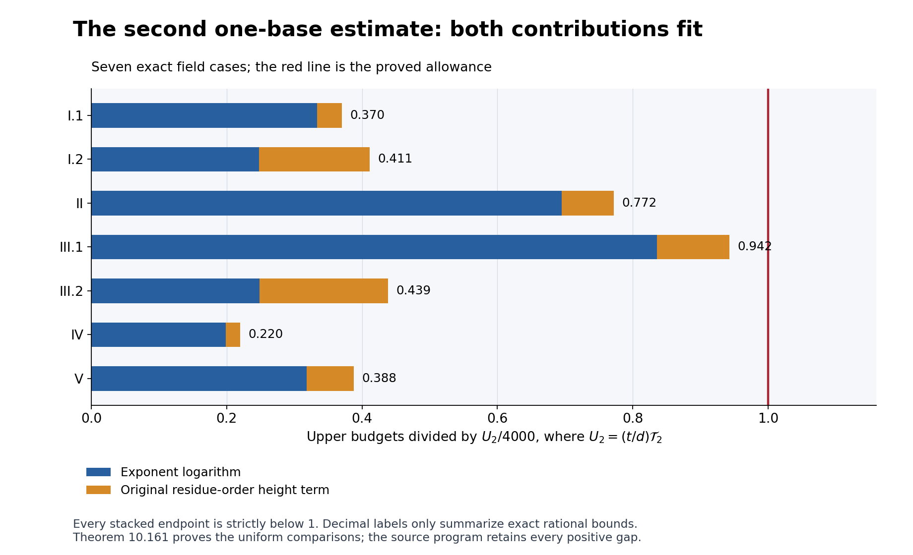

*Figure 10.45. The logarithm and original residue-order height
contributions are stacked after normalization by \(U_2/4000\).
The bars are uniform rational upper bounds for the seven exhaustive
field cases, and the red line is the allowance. The displayed
decimals summarize the exact fractions in the table. Proof:
Theorem 10.161. Human source for the target constant: equations
(1.10), (1.29)–(1.30) of Yu's free 2013 paper, cited below.
[Reproducible figure and exact certificate](../figure_sources/yu_second_singleton_budget.py).*

For \(K=\mathbb Q,p=3,\beta=4,b=3^k\), \(k\ge1\),
take \(B=3^k\). The raw residue order is one,
\(\delta_\beta=2\), \(q^u=2\),
\(A_1=4+\ln2\), and \(H=k\ln3\).
The second entry of the maximum dominates:
\(\mathrm e(\ln3)^2>8/3>3/2=p^f/\delta_\beta\).
Theorem 10.161 therefore reads

\[
v_3(4^{3^k}-1)=k+1
<\frac{4\cdot648\cdot7}{4000}
\mathrm e^2(4+\ln2)k\ln4.
\tag{10.525}
\]

The exact valuation is the proved power identity in Lemma 9.5.
The right side exceeds \(126k\): its successive factors exceed
\(9/2\), seven, four, and one. This theorem proves the
singleton case. The second constant at greater list lengths,
with its different modified-height floors, requires its own proof.

## 53. The second constant for every rank-one list

The singleton estimate extends to a dependent list of any length
whose multiplicative rank modulo roots of unity is one. The height
floor of the second constant differs from that in Section 49, so
we retain it explicitly. The proof again reduces the whole list to
one exact power in K.

Use the field and prime conventions of Section 52. Take an indexed
list \(a_1,\ldots,a_n\) of local units, of multiplicative rank one
modulo roots of unity. Order its indices by nondecreasing height,
with a fixed order at equal heights, and let \(\beta=a_{i_0}\)
be the first non-torsion member. Let \(b_i\in\mathbb Z\),
\(\Xi=\prod_i a_i^{b_i}\ne1\),
\(B\ge\max\{3,|b_1|,\ldots,|b_n|\}\), and
\(H=\max\{\ln B,t\}\).
The residue index \(\delta_\beta\) belongs to this original
base, as defined in Section 52.

Let \(\kappa\ge0\) be the integer for which
\(p^{\kappa-1}(p-1)\le2e<p^\kappa(p-1)\), and put
\(P=p^\kappa\). Then \(1\le P\le2pe/(p-1)\le4d\).
Set

\[
\begin{aligned}
\varkappa_2&=\begin{cases}25,&p>2,\\48,&p=2,\end{cases}
&X_n&=\max\{n,t\},\\
L_n^{(2)}&=\frac{X_n}{\varkappa_2Pdt},
&H_n^{(2)}(a)&=\max\{h(a),L_n^{(2)}\},\\
\Omega_n^{(2)}&=h(\beta)\prod_{i\ne i_0}H_n^{(2)}(a_i),
&A_n&=\max\{4+\ln((n+1)d),e,t\}.
\end{aligned}
\tag{10.526}
\]

This is precisely the floor in (1.25) and (1.29) of Yu's free
paper. Among the non-torsion choices of \(\beta\), the specified
choice minimizes \(\Omega_n^{(2)}\): factor out the common
product of all modified heights and use that
\(h/\max\{h,L_n^{(2)}\}\) increases with h.
Repeated bases are separate indices in the product.
Define the second application constant and its complete budget by

\[
\begin{aligned}
C_n^{(2)}(\beta)&=
\frac{c^{(2)}(a^{(2)}\mathrm e P)^n}{P}
\frac{(n+1)^{n+2}d^{n+2}\ell_d}
{(n-1)!q^ut^3}\\
&\quad\times
\max\left\{\frac{p^f}{\delta_\beta},
\frac{\mathrm e^n t^{n+1}}{n^n}\right\}A_n,\\
\mathcal T_n^{(2)}&=C_n^{(2)}(\beta)\Omega_n^{(2)}H.
\end{aligned}
\tag{10.527}
\]

The constant is \((n+1)\) times formula (1.10) of that paper.
Its residue index is that of the one-element selected basis,
even though n is the length of the entire indexed list.
At \(n=1\), \(\mathcal T_1^{(2)}=\mathcal T_2\) of
Section 52.

### Two scalar budgets

Suppose \(n\ge2\), and abbreviate \(c=c^{(2)}\),
\(a=a^{(2)}\), and \(\varkappa=\varkappa_2\). Put

\[
\begin{aligned}
R&=\prod_{i\ne i_0}\frac{H_n^{(2)}(a_i)}{L_n^{(2)}}\ge1,
&U&=\frac t d\mathcal T_n^{(2)},\\
F_n&=\frac c\rho\frac{w_K}{q^u}
\frac{a^n\mathrm e^{2n-1}(n+1)^{n+2}}
{n!\varkappa^{n-1}},\\
E_n&=\frac{4(n-1)!\varkappa^{n-1}}
{ca^n\mathrm e^n(n+1)^{n+2}},
&\alpha_n&=\left(\frac1{4000}-\frac1{100000}\right)F_n.
\end{aligned}
\tag{10.528}
\]

**Lemma 10.162 (second-constant rank-one scalar bounds).** For every
\(n\ge2\),

\[
U\ge F_nA_nHR,\qquad
\frac{2eg h(\beta)}U<\frac1{100000},\qquad
F_{n+1}>3F_n,\qquad \alpha_n>\frac{3n}{2}.
\tag{10.529}
\]

In particular \(\alpha_2>3\).

**Proof.** Substitute
\(\Omega_n^{(2)}=h(\beta)(L_n^{(2)})^{n-1}R\) into U.
Using the singleton height bound (10.55) and the second entry
of its maximum gives

\[
U\ge\frac c\rho\frac{w_K}{q^u}
\frac{a^n\mathrm e^{2n-1}(n+1)^{n+2}}
{(n-1)!n^n}
\left(\frac{X_n}{\varkappa}\right)^{n-1}A_nHR
\ge F_nA_nHR.
\tag{10.530}
\]

For the other term use \(p^f/\delta_\beta>g\),
\(L_n^{(2)}\ge1/(\varkappa Pd)\),
\(eq^u\le2d\), and \(t^2\le A_nH\). Exact cancellation
gives

\[
\frac{2eg h(\beta)}U
<\frac{2eq^u(n-1)!\varkappa^{n-1}t^2}
{ca^n\mathrm e^n(n+1)^{n+2}d^2\ell_dRA_nH}
\le\frac{E_n}{d\ell_dR}.
\tag{10.531}
\]

The next table gives strict lower bounds on \(\alpha_2\)
and upper bounds on \(E_2/(d\ell_d)\). Use
\(\mathrm e>27/10\), the degree and torsion bounds from
Section 52, and \(\ell_d\ge1\).
In III replace \((p-1)/(p-2)\) by one.

| Case | \(\alpha_2\) greater than | \(E_2/(d\ell_d)\) less than |
| --- | ---: | ---: |
| I.1 | 9 | \(2500/2080355319\) |
| I.2 | 14 | \(1250/234365481\) |
| II | 4 | \(500/199644669\) |
| III.1 | 3 | \(1000/286446699\) |
| III.2 | 12 | \(10000/1611624357\) |
| IV | 15 | \(2500/3498121809\) |
| V | 9 | \(1600/675264681\) |

Every last entry is less than \(1/100000\), by multiplication
of positive denominators. The [exact calculation](../figure_sources/yu_second_rank_one_budget.py) retains each
positive gap.
For growth, direct division gives

\[
\frac{F_{n+1}}{F_n}
=\frac{a\mathrm e^2}{\varkappa}
\left(1+\frac1{n+1}\right)^{n+3}>3.
\tag{10.532}
\]

Indeed \(a\mathrm e^2/\varkappa>9477/4800>3/2\),
and the positive binomial terms give the last power greater than
two. Thus \(\alpha_n>3\cdot3^{n-2}\ge3n/2\);
the elementary inequality \(2\cdot3^{n-2}\ge n\) follows
by induction starting at two.
Finally,

\[
\frac{E_{n+1}}{E_n}
=\frac{\varkappa}{a\mathrm e}\frac n{n+2}
\left(\frac{n+1}{n+2}\right)^{n+2}
<\frac{\varkappa}{a\mathrm e^2}<\frac23.
\tag{10.533}
\]

Here \(\ln(1-y)<-y\) for \(0<y<1\), by integrating
\(1/(1-y)>1\). The last numerical comparison uses
\(4800/9477<2/3\). Hence the height-budget bound at two
holds at every larger n. \(\square\)

### Exact reduction and the exponent budget

**Theorem 10.163 (the full second-constant rank-one refinement).** For
every rank-one list just specified, including all coefficient sizes
and torsion patterns,

\[
\operatorname{ord}_{\mathfrak p}(\Xi-1)
<\frac{\mathcal T_n^{(2)}}{4000}.
\tag{10.534}
\]

**Proof.** For \(n=1\), use Theorem 10.161. Suppose \(n\ge2\),
and put \(D=\rho\mathrm e d^2\ell_dL_n^{(2)}\),
\(D_0=\max\{1,D\}\).
As in the exact pair reduction in Theorem 10.158, Theorem 10.20
gives, for every non-torsion complementary index i, a relation
\(\beta^{u_i}a_i^{k_i}=1\), with
\(k_i\in\mathbb Z_{>0}\),
\(k_i\le\rho\mathrm e d^2\ell_dh(a_i)\), and
\(|u_i|/k_i=h(a_i)/h(\beta)\).
Let m count these indices. Set
\(Q=\prod k_i\) if no torsion base occurs, and
\(Q=w_K\prod k_i\) otherwise. Then

\[
\Xi^Q=\beta^M,\qquad M\in\mathbb Z,\qquad
|M|\le nBQ\frac{h(a_n)}{h(\beta)}.
\tag{10.535}
\]

Each \(k_i\le D_0H_n^{(2)}(a_i)/L_n^{(2)}\).
If a non-torsion complementary base occurs, its modified height
and the singleton height bound also give
\(h(a_n)/h(\beta)\le\max\{1,D/w_K\}R\).
Otherwise that height ratio is one. Consequently, for \(M\ne0\),
the three bounds (10.501)–(10.502) apply with this D, \(D_0\),
and R. This follows by multiplying the exact relation coefficients;
it uses no first-constant estimate.

The empty-list height bound gives \(w_K\le\rho d\ell_d\).
Thus

\[
\frac{w_K}{D_0}\le\frac{\varkappa_2Pt}{\mathrm eX_n}
\le192d.
\tag{10.536}
\]

We used \(\varkappa_2\le48\), \(P\le4d\),
\(t\le X_n\), and \(\mathrm e>1\).
The factor d is retained in the exponent budget.
Each of the three alternatives is at most \(Z_n+2\ln R\),
where

\[
Z_n=H+\ln(2n)+n\ln D_0+\ln192+\ln d.
\tag{10.537}
\]

For odd primes \(t\ge\ln3>1\). At two, the primitive
cube root reduces injectively, so \(3\mid2^f-1\),
\(f\ge2\), and \(t\ge\ln4>1\). Therefore
\(X_n/t\le n\) and \(D_0<7nd\ell_d\), since
\(\rho\mathrm e/\varkappa_2\le58(11/4)/25<7\).
For \(n\ge3\), the logarithmic tangent from Section 50,
\(\ln\ell_d\le(\ln d)/8+11/10\), together with
\(\ln7<2\), \(\ln192<6\), and \(\ln(2n)<n\), gives

\[
Z_n<H+n\ln n+\frac{41n}{10}+6
       +\left(\frac{9n}{8}+1\right)\ln d.
\tag{10.538}
\]

Lemma 10.162 gives \(\alpha_n>3n/2\). The coefficient of
\(\ln d\) in \(\alpha_nA_nH\) is larger than
\(9n/8+1\), since \(H>1\) and \(n\ge3\).
At H=1 the constant difference is larger than
\(77n/30-7>0\): use
\(A_n\ge4+\ln(n+1)+\ln d\),
\(\ln(n+1)\ge\ln4>4/3\), and
\(\ln n<\ln(n+1)\).
Increasing H increases the difference, because its slope is
greater than \(6n-1>0\).
Thus \(Z_n<\alpha_nA_nH\) for every \(n\ge3\).

For \(n=2\), a non-torsion complement gives the sharper
bound \(H+\ln4+2\ln D_0+2\ln R\).
Here \(D_0<13d\ell_d\), since
\(2\rho\mathrm e/\varkappa_2<13\).
Using \(\ln13<8/3\), \(\ln4<7/5\), and the tangent
\(\ln\ell_d\le(\ln d)/16+9/5\), its part before
\(2\ln R\) is less than
\(H+31/3+(17/8)\ln d\).
This is less than \(\alpha_2A_2H\), because
\(\alpha_2>3\), \(A_2>5\), \(H>1\),
\(14>31/3\), and \(3>17/8\).
If the complement is torsion, its bound is
\(H+\ln(2w_K)<H+15/2+(17/16)\ln d\),
which is absorbed by the same lower bound.
All numerical logarithm comparisons follow from positive
exponential series, or the logarithm series already proved in
Solution 64.

In every case the bound before \(2\ln R\) is less than
\(\alpha_nA_nH>2\). Since \(\ln R\le R-1\),

\[
\ln(2|M|)<\alpha_nA_nHR
\le\left(\frac1{4000}-\frac1{100000}\right)U.
\tag{10.539}
\]

Apply the complete one-base estimate (10.60) to \(\beta^M\),
retaining its actual residue order g. Since
\(\Xi^Q-1=(\Xi-1)(1+\Xi+\cdots+\Xi^{Q-1})\)
and \(\Xi\) is a local unit,

\[
\begin{aligned}
\operatorname{ord}_{\mathfrak p}(\Xi-1)
&\le\operatorname{ord}_{\mathfrak p}(\beta^M-1)\\
&\le\frac d t\bigl(\ln(2|M|)+2eg h(\beta)\bigr)
<\frac{\mathcal T_n^{(2)}}{4000},
\end{aligned}
\tag{10.540}
\]

by Lemma 10.162. If M=0, then \(\Xi\ne1\) is torsion.
Theorem 10.21 bounds its valuation by \((d/t)\ln2\).
Meanwhile \(U/4000>\alpha_nA_nHR>2>\ln2\), proving
the same strict inequality. This exhausts every case. \(\square\)

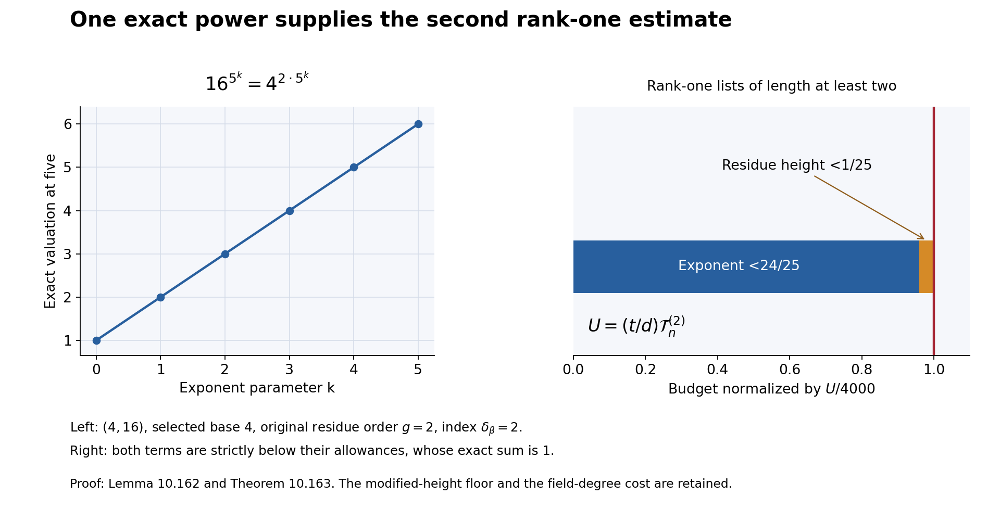

*Figure 10.46. Left: the exact rank-one identity for the indexed
list \(4,16\) at five gives valuation \(1+k\), proved by the
power law. Right: for every list of length at least two, the exponent cost
and original residue-order height cost are strictly below \(24/25\) and \(1/25\),
respectively, after normalization by \(U/4000\). These exact
allowances sum to one. The second modified-height floor and the
degree term in the exponent bound are retained. Proof:
Lemma 10.162 and Theorem 10.163. Human source for the target:
Theorem 2 and equations (1.10), (1.25), (1.29)–(1.30) of Yu's
free 2013 paper, cited below.
[Reproducible figure and exact calculation](../figure_sources/yu_second_rank_one_budget.py).*

For \(K=\mathbb Q,p=5,(a_1,a_2)=(4,16)\), the selected
base is four, \(g=2\), and \(\delta_\beta=2\).
Here \(P=1\), \(\varkappa_2=25\), and
\(L_2^{(2)}=2/(25\ln5)\). The two actual heights exceed
this floor. With coefficients \((0,5^k)\), \(k\ge0\),
the exact reduction is \(\Xi=4^{2\cdot5^k}\), and the
proved valuation is \(1+k\). Theorem 10.163 uses the
length-two second constant and \((\ln4)(\ln16)\), while
preserving the original residue order two.

The numerical target is the rank-one refinement in Theorem 2 of
[Yu's free paper](https://archive.ymsc.tsinghua.edu.cn/pacm_download/117/6782-11511_2013_Article_106.pdf).
The proof here supplies this full rank-one application independently
of the omitted general second-constant proof. Rank at least two
and the general coefficient profile remain separate requirements.

## 54. Exercises with solutions

1. **Easy.** Explain exactly how nonunit bases can be reduced to unit bases. Give an example showing that the conclusion of Theorem 10.8 cannot be extended unchanged to nonunits.
2. **Medium.** Derive (10.34) from (10.22), including the maximum in \(H\).
3. **Medium.** Prove (10.36) using the residue order and the power laws. Explain where the assumption that \(p\) is odd enters.
4. **Medium.** For \(K=3,L=4,p=3,e=1,t=0,u=0\), find the lower bound supplied by (10.10). Find the valuation precision required in its hypothesis, and the exact excess in the row expansion when \(n\) ordinary rows are used.
5. **Easy.** Show that (10.6) is attained for \(K=2,L=4,R=3\). Identify the maximizing list of first coordinates.
6. **Medium.** A proposed assertion for every prime \(p\) and pair of coprime positive integers \(x,y\) bounds \(v_p(x^{p-1}-1)\) by \(283(p-1)\ln y\ln(xy)/(\ln p)^2+4\). Show why it is false as stated when \(y=1\), without using a logarithm estimate.
7. **Hard.** Adapt the determinant argument to the hypotheses of Theorem 10.11. Explain why its first-base precision, unit coefficient after removing the common p-part, and second-base condition at two are all recorded. Derive the power \(E^{-3}\) in its final bound.

8. **Medium.** Compute \(M_2(4,9)\) over \(\mathbb Q\), prove (10.48) in this example, and compute the residue index (10.49) at five.

9. **Hard.** Derive the constant 58 in (10.55) directly from (10.53), including the roles of the chosen height radius and the selected archimedean weight. For the rational bases 4,9, compute the full saturation index, its root-of-unity factor, and the diamond average in Figure 10.2.

10. **Medium.** Apply Theorem 10.21 to the rational unit 2 at three. Determine its residue order and exact valuation for every nonzero exponent with a nonzero power difference. Compare the bound with the normalization in a field of degree two having local degrees e=1, f=2.

11. **Medium.** At p=5 take \(L_1=5z_1+z_3\), \(L_2=5z_2+z_3\), \(L_3=-5z_1-5z_2-z_3+z_4\), and \(L=L_1+L_2+L_3=z_3+z_4\). Compute the matrix in Lemma 10.23 and all its two-column upper minors. Choose a minimum-valuation derivative basis. Explain the denominator introduced by the other natural basis.

12. **Hard.** Set \(r=2,S=T=90\), \(D_0=32,D_1=2,D_2=3\), and \(S_i=T_i=30\). Show that Theorem 10.25 implies that a polynomial of these bounds with all the stated jets zero at \((s,2^s,3^s)\), \(0\le s\le90\), is zero, for every nonzero rational vector \(\boldsymbol B\). Check the integer degree inequalities and both possible one-dimensional relation bounds.

13. **Medium.** In Theorem 10.27 take \(K=\mathbb Q,p=5,n=2\), bases \(2,3\), coefficients \(1,1\), and \(L_1=z_1+z_2\). Use \(\sigma=\ln6,H=10\ln5\). Compute the original saturated residue index, \(w_q,R_2,M_\gamma\), and verify the one-base height-product hypothesis without a numerical approximation. What valuation is being bounded?

14. **Hard.** For \(k=L=2\), compute the four shifted-power polynomials in Figure 10.4 and the determinant of their coefficients of \(X,X^2,X^3,X^4\). For \(k=\ell=2\), evaluate \(v(k)^m\Theta(1/3;k,\ell,m)\), \(0\le m\le4\), and check the exact q-power clearing bound with \(q=3,I=1\).

15. **Medium.** Use Theorem 10.32 over \(K=\mathbb Q\) with \(r=2,k=L=1,S=T=0\), \(\vartheta=(2,3)\), \(A_1=A_2=1\), \(D_1=Y_1\partial_{Y_1}-Y_2\partial_{Y_2}\), and exponents \((0,0),(1,0),(0,1)\). Compute \(N,M,\mathcal B\), exhibit a nonzero integral coefficient vector, and compare its exact projective height with (10.96). Form the ordinary polynomial \(P\) and identify which jets are imposed.

16. **Hard.** For the full node set with \(p=3,R=3,\mu=2,\theta=1\), what precision in (10.100) suffices for conclusion \(v_3(F(\rho x))\ge14\)? For \(p=2,q=3,R=3\), compute \(L_{-2}(0)\) in the q-deleted set and its valuation. Finally, why is the restriction \(x\in\mathbb Z_p\subset\mathbb Q_p\) essential to the full-set cardinal bound? Use \(p=2,R=1\) and an algebraic \(x\) with \(x^2=2\).

17. **Medium.** In Proposition 10.37 take \(p=3,q=2,I=0,k=L=2,\rho=3\), and a single nonzero coefficient \(c=1\) at \(\boldsymbol m=0,a=0,\ell=2\). At prepared index zero, compute \(\gamma,\Gamma\), and the polynomial \(F(Z)\). Check (10.107) for \(s=0,j=1\). If a torus factor with slope \(w\) is added, compare the sufficient slope hypothesis for \(w=9\) and \(w=3\).

18. **Hard.** At two, take the additive prepared polynomial \(f(y)=\Delta(y;2)=(y+1)(y+2)/2\), with \(I=0,k=2,L=1\) and no torus dependence. Show that its prepared values through order two at zero are integral, whereas its first ordinary divided jet has valuation \(-1\). Explain the exact role of \(C_0\). Next take full interpolation nodes with \(p=3,R=3,\mu=2,\theta=1\), and weighted jet precision \(\Lambda-jC\) with \(\Lambda=16,C=2\). Compare Theorems 10.34 and 10.39.

19. **Medium.** At \(p=3\), take \(q=2,k=L=1,I=0,J=1,c=1\), no torus dependence, and \(x=1/2\). Compute the prepared value \(\Delta(x;1)\), the clearing exponent in (10.115), and the bound (10.116) with \(X=1/2,T=0\). Distinguish the denominator cost at two from the valuation at three.

20. **Hard.** Let \(K=\mathbb Q,p=3,q=2,J=1,\vartheta=10\). Use the exponential and logarithm to choose a square root \(\eta\in\mathbb Q_3\) congruent to one. Determine the coefficient (10.117) for \(F=\mathbb Q(\eta)\). At \(s=1,x=1/2\), with \(k=L=1,I=0\), take exponents \(1,3\) and coefficients \(1,-1\). Factor the prepared value into its common local unit and a rational value, and compute its valuation. Compare the bounds from the root field and the common-factor rule, with \(X=1/2,T=0\).

21. **Medium.** Use \(I=0,k=2,L=1,X=2,r=2,\Omega_1=1,T=2\). Compute \(\mathcal P_{0,2}(Z)\), \(\mathcal B_0^*(2,2)\), and the earlier \(\mathcal B_0(2,2)\). At \(x=2,a=1,\ell=1,\omega_1=1\), show that the three additive bounds are attained.

22. **Hard.** In Corollary 10.45, take \(K=\mathbb Q,r=1,k=2,L=1,S=2,T=0\), \(\vartheta=2\), and \(\mathcal M=\{0,1,2\}\), so \(A=2\). Compute the separate-row bound (10.127) and the uniform averaged bound (10.128). Order the six columns by \((m,a)=(0,0),(0,1),(1,0),(1,1),(2,0),(2,1)\). Verify that \((2,-18,-57,36,1,0)\) is an integral kernel vector at all five nodes, and compute its two projective heights. Explain why the zero row at \(s=-2\) does not invalidate either bound.

23. **Medium.** In Theorem 10.47, take \(q=2,r=1,F=\mathbb Q,\vartheta=2,\eta=\sqrt2\). Show that at \(s=2\), the coefficients \(A_0=-2,A_1=1\) give a zero total sum whose separate coset coefficients are nonzero. Give a similar example with odd \(s\) in which the full-degree hypothesis fails. Finally, at \(p=7\), use the local square root \(\eta\equiv3\pmod7\) of two to show that finite valuation precision of a total sum need not transfer to its cosets.

24. **Hard.** Let \(q=2,p=3,r=2\), use one Euler argument \(\omega(\boldsymbol m)=m_1\), and retain \(m\equiv1\pmod2\), with \(m_*=1\). Compute the affine binomial change \(\Delta(2Z+1;t)\) through order two and its inverse. Verify the minimum-valuation identity on the new jet vector \((1,3,9)\). Explain why it preserves total order when combined with an unchanged additive index. Then apply Corollary 10.49 over \(K=\mathbb Q\) with \(\alpha_0=-1,\theta_1=2,\theta_2=3,P=3,d_1=1,d_2=0\): identify \(F\), the two phased roots and bases, their heights, and the root degree over \(F\).

25. **Hard.** Use the divided support in Figure 10.8. Compute \(a_0,H\), both subclasses and their phase factors after multiplication by \(\zeta^s\). If a coefficient of minimum valuation belongs to \(\lambda_0=(-1,0)\), state the retained phase congruence and normalized root-of-unity factor. Explain why the subclass is chosen independently of \(s\) and the derivative index. Compare the coprime case \(q=2,G_0=5,a_*=2\).

26. **Hard.** Over \(\mathbb Q_5\), apply the Newton construction to \(f(X)=X^2+1\), starting at \(x_0=2\). Compute \(x_1,x_2\), the three error valuations and the primitive fourth root \(\zeta\) modulo \(625\). Take \(K=\mathbb Q,\alpha_0=-1,q=2,\theta_1=2\), and \(g=2/\zeta\). Prove \(v_5(g-1)=1\). For the target \(\vartheta=3\), verify the choices \(t=0,j=3,P=125,d_1=-125\) in Lemma 10.53 and compute the exact valuation of \(\gamma_1-1\).

27. **Medium.** In Corollary 10.54, assume the other hypotheses and \(\mathcal A_{\mathrm{ph}}(4,4)=11\). Take \(p=3,q=2,R=4,T=5,\mu=2,k=L=2,\theta=3,C_0=0\). Compute the exact input node set, \(n,B,M_0,T'\), and the least \(U\) meeting the exact first budget. State the resulting zeros. Compare both lines of the alternative larger-scale budget; explain why its first line alone does not give the same zero conclusion.

28. **Hard.** In Figure 10.9, verify that the individual \(\gamma_i\) lie outside \(\mathbb Q\), whereas every normalized row entry is rational. Determine \(N,M_*,H_{\mathrm{ph}}\), and check the vector \((-b,C,-C,b)\) at all three nodes. Factor its torus polynomial, compute its two projective heights and its minimum 5-adic coefficient valuation, and compare its height with (10.152). Explain why the zero first row does not invalidate the bound.

29. **Hard.** Use the data of Figure 10.10. Compute the cancelled congruence and \(h_\Lambda\), prove the degrees and chosen completions of \(E\) and \(F\), and evaluate both 5-adic valuations of \(V\). For \(I=0,k=L=1,\lambda_0=0,c=(1,-1),s=1,x=1/2,\boldsymbol t=0\), compute every term in (10.156). Compare the support-field budget with the budget from the full root field, and explain why equal local degrees do not justify using the original global degree.

30. **Medium.** Verify the auxiliary-prime choices in Corollary 10.9 for \((a,p)=(8,3),(3,2),(25,2)\). Compute the exact original and transformed valuations, the rational heights and the cutoff \(H\). Derive the all-power bound when \(b=1\), retaining the same \(250000\ln(5a)\ln5\) coefficient. Explain why simply setting the second base to one would not prove this case.

31. **Hard.** Verify the two support heights in Figure 10.11 by clearing denominators in the monomial vectors and finding their primitive integer coordinates. Compute both signed heights of \(\{(0,0),(1,0),(0,1)\}\). Extract the even-even coset from the diamond at \(q=2\), use reference \((-2,0)\), and verify (10.162). At \(P=1,S=1,k=L=1,T=0\), compare the separate-row coefficient budgets for the seven-point diamond support using its exact height and its coordinate box. Explain how a shifted original-coordinate box is handled when its centre is outside the image of \(B\).

32. **Hard.** Verify the two initial kernels in Figure 10.12 and determine their exact row fields. Prove the discriminants \(5\) and \(24\) using the full integral bases of the two quadratic fields. Compute both projective coefficient heights, explain why their finite-place contributions vanish, and evaluate (10.171) with the actual row-field discriminant for each example. For \(t=\sqrt6\), compare the one-generator discriminant bound with the bound using only the maximum support height. Explain what happens to the row field when \(S=0\), and why \(N>M_*\) and the later analytic inequalities still need checking.

33. **Medium.** Verify every lattice and phase coordinate in Figure 10.13. Compute \(J,V/\Delta,g,H\), the guaranteed class size, and both sides of (10.180) at \(k=2,L=1\). At \(S=1,T=0\), compare the coefficient surplus certified by the exact class count with the coarser volume criterion. Then take \(T=1\) and one nonzero Euler direction: compute \(M_*\), and state precisely what the counting criterion does and does not prove. Explain why replacing the closed box by an open one would invalidate the integer-volume argument.

34. **Hard.** Use \(K=\mathbb Q,p=3,r=2\), \((\alpha_1,\alpha_2)=(2,5)\), and \(c_0=1.9,c_1=1.4494,c_3=1.3852,c_4=20.8\). Put \(a_0=2+\ln14\), \(a_1=4.79\), \(g_0=3(2a_0+a_1+\ln(2a_0+a_1))\), \(h=g_0\), and \(\tau=1/(4\cdot10^{26})\). Use \(\widehat\vartheta=3/2\) and \(\sigma_1=\ln2,\sigma_2=\ln5\). Prove that \(J=1,u=1,H=1\). Verify the floors in Figure 10.14 with rigorous bounds, construct a support of exactly \(\lfloor D_1D_2\rfloor+1\) points without listing it, and compute \(N,M_{\rm full},M_*\). Use the integral identity \(20N-57M_{\rm full}>0\) to verify the strict surplus. Identify the actual coefficient field and its discriminant cost.

35. **Hard.** First take \(K=\mathbb Q(\zeta_3,\sqrt2)\) and \(p=2\). Prove that \(d=4,e=2,f=2,u=1\), and verify equality in (10.192). Then return to all the rational parameters of Solution 34. Compute \(\Omega_1\), the actual clearing integer, both maximizing additive orders in (10.199) and (10.201), and the exact mean orders in (10.204). Reconstruct each signed component and net height bound in Figure 10.15, using (10.174) with the actual ratio \(M_* /(N-M_*)\). Include the row-scaling bounds of Corollary 10.80. Explain why the coefficient field and all zeros are preserved by the alternative global clearing.

36. **Medium.** Reconstruct every exact lower-bound path and final depth in Figure 10.16. Distinguish these lower bounds from the actual valuation path for \(\beta=1+\sqrt2\) in \(\mathbb Q_2(\sqrt2)\). Next let \(\pi^3=3\), \(L=\mathbb Q_3(\pi)\), and \(\beta=1+\pi\). Show that the bound (10.210) is attained at \(P=9\), and use the exponential coefficients to prove that the closed boundary radius \(3^{\vartheta}\) cannot replace \(3^\theta\) in Corollary 10.82. Describe the coherent principal square root of the phased coordinate for \(\alpha=-\beta,\zeta=-1\).

37. **Hard.** Reconstruct Figure 10.17 over \(K=\mathbb Q\) at \(p=5\). Prove that the q-primary saturation lattice of \(4,9\) has basis \(B=\tfrac12I\) and index \(J=4\), and identify the even phase class of its generators \(2,3\). Compute the exact prepared Euler range at reference \(0\), and again at reference \((8,0)\). Explain why the full box widths give a bound without a factor two, and why omitting \(J\) can even destroy integrality. Then return to Solution 34 and use (10.222)–(10.228) to certify the uniform initial height bound, retaining every field and scalar cost.

38. **Hard.** Reconstruct Figure 10.18 for \(K=\mathbb Q(\sqrt5)\), with original bases \(5,7\) and coefficients \(b_1=b_2=1\). Determine the full saturation lattice and its q-primary index at \(q=2\), verify \(B'=BU\), and compute both lists of generator heights. Identify the field and its discriminant. At \(p=3\), determine \(e,f,u,\nu,P\) and the phase classes. Use the constants of Solution 34, put \(g_0=3(2a_0+a_1+\ln(2a_0+a_1)+\ln2)\), \(h=g_0\), \(\sigma_1=\ln5,\sigma_2=\ln7\), and retain its \(\tau\). Certify the original \(g_{11},g_{12}\), a strict initial column surplus, and the full bound (10.235). Compare the generator field with the smallest field of the actual rows.

39. **Hard.** Reconstruct Figure 10.19 for the entire coefficient family (10.245). Obtain a rigorous common Euler-argument bound and a bound for \(v_3(b_2)\), then determine every \(R_j,T_j,\mu_j,n_j,B_j\). Certify both comparisons at all three integer steps, retaining the complete pointwise factorial and lcm costs. Explain how a ratio search bounds the enormous Euler binomial without constructing it, and why these integer comparisons do not establish the fractional descent.

40. **Hard.** Derive the five Hermite basis polynomials for \(R_0=0,R_1=1,\mu_0=3,\mu_1=1\), checking every divided jet. Reconstruct the nested weights, total multiplicity and both strict comparisons in Theorem 10.95. Explain why equality of the chosen completions does not remove the quartic arithmetic factor, and why evaluating the denominator cost only at the scalar-maximizing order need not bound the joint maximum.

41. **Hard.** Expand \(\binom{2n+a}{2}\) in the basis \(1,n,\binom n2\), and give the inverse expansion of \(\binom n2\) in the old argument. Explain the relevant integrality at three and two. Reconstruct all seventeen rows of the table in Theorem 10.98, retaining the odd-node loss, the true contracted Euler bound and both global field factors. Give the stage-one and stage-seventeen radii, orders and mixed multiplicities. Complete the polynomial contradiction.

42. **Hard.** Verify the smallest-rank rational constants in Theorem10.100 and prove that every displayed bound increases with its rank or subset-rank index. Explain why using \(a_*=7\) in every case would omit an original parameter case. Check the complete cancellation in the intermediate and final allocation ratios, retaining both factorials, all \(q^\nu\) and \(e\theta\) factors, and the real-to-integer floors. Explain how Corollary10.101 returns the new bases to the original field.

43. **Hard.** Derive (10.274) directly from (10.270) and the complete original parameter formulas. Identify where the old and new residue indices occur and why neither may be replaced by a fixed value. Prove the all-rank bound on \(t^jM_j\), including the field condition at two, and reconstruct the bound \(1/700\). Show that every independence and weighted-height condition in (10.277) survives composition with the integral vectors \(u_i\). Verify the rank-two example and explain why its actual minimum rank is two.

44. **Hard.** Check the four minima in (10.281) by exact rational arithmetic. Prove the bound (10.285) by adding its three separate contributions. Enumerate the full rank-two derivative simplex through order six and show that its 28 rows have mean additive and Euler order two even when the additive degree is two. Derive (10.290), and explain why zero rows may be retained in the integral kernel argument. Finally take \(k=4,L=1,p=3,u=2,s=0,I=J=0\) and the scalar column \(F_{0,1}(X)\). Compute its prepared value, the value \(W\) of (10.298), and their exact valuation difference. Explain the cancellation in (10.297) and why it does not remove the global degree \(d_F\).

45. **Hard.** Reproduce the certificate of Lemma 10.111 using only integer and rational arithmetic. Explain why checking \(\psi(n)>25n/26\) would be insufficient for the real-argument lower induction. Show that \(F\) has period 30030 and that its reflection sum is three. Derive \(C_r^{\sharp}\), and quantify the improvement over \(C_r\) at rank two.

46. **Hard.** Derive (10.309) directly from the positive geometric series, retaining a prescribed additive order. Reconstruct every scalar and bound in Figure 10.26 with exact rational arithmetic before taking logarithms. Show that its peak is at \(u=1\), and explain why the remainder in (10.310) has a separate additive term. Verify the seven rational products in its proof and the two sharp-regime gaps in Lemma 10.114.

**47 (additive divisibility and exact jet envelopes).** At \(p=3,k=4,L=2\), compute \(D_{\mathrm a},\ell_p,\chi_p\). With \(\beta=0,\vartheta=1,B=0,M=7\), evaluate the full integer minimum \(K_u(M,B)\) for \(0\le u\le8\), and compare it with the linear-loss bound from \(C_0\). Explain why no further lcm loss occurs after the breakpoint in the left panel of Figure 10.27. Next set \(\beta=3,B=1,M=5\), keeping the other data, and evaluate all nine envelopes again. Compare with the linear consequence of (10.318). Finally explain why a local q-unit in the jet proof does not allow deletion of \(\Xi_{I,J,u}\ln q\) or of the global field degree in the zero criterion.

48. **Hard.** Reconstruct the strict original integer-extension comparison (10.332) in every field case. Explain why rank eight supplies a uniform estimate for all larger ranks, whereas checking finitely many ranks alone would not. Calculate the exact uniform I.2 margin and its difference from \(1/200\). Prove why the first q-denominator indicator does not spoil the increase from step zero to step one. Finally explain why the continuous depth curve in Figure 10.28 does not assert existence of an auxiliary stage at every plotted integer depth.

49. **Hard.** Use the exact original floor data of Solution 39 to calculate all three nested multiplicities in (10.336) at output order \(O=993090\). Calculate \(N_*\) both by annulus counts and by the telescoping formula. Compare it with the last zero block alone, and explain why this comparison concerns interpolation precision rather than actual nonzero function valuations. Prove the uniform four-term lower bound in (10.342), including its radius-floor correction.
50. **Hard.** Follow the complete first contraction through (10.344)–(10.348). In the original rational example, verify \(R=1374\), \(M=178095\), \(B=7\), and the q-deleted cardinality. At fixed additive order zero and \(\beta=0\), compute the two separate Hermite input losses. Explain why the fractional step retains \(q^{h_\Lambda}\), whereas the contracted integer step uses the field \(K\), even though both selected local completions may already coincide.

51. **Hard.** In the small profile (10.355), list the nodes and their multiplicities, compute the four deleted-node residue counts modulo four, and derive the three cardinal-factor bounds from (10.354). Verify the total degree by both the annular and telescoping formulas. Explain why replacing the discrepancy two by one changes the proof.

52. **Continuous-depth comparisons and terminal closure (advanced).** Prove that a concave function on \([a,b]\) is bounded below by the lesser of its endpoint values. Explain why the positive coefficients of \(\tau_j\) in (10.367) are needed when replacing them by conservative endpoint bounds. Derive both geometric sums used in (10.373). Finally, explain why the phase induction needs a closure estimate on \([1,L_D+1]\), and compute the added clearing cost at its last endpoint.

53. **[Challenging: a complete original mixed profile.]** Take the illustrative rank-two III.2 parameters \(q=2,c=0.5267,S_I=100,T_I=1000\). Compute H, the full integer radii, all original derivative cutoffs, the fractional output cutoff O, the three multiplicities \(\mu_0,\mu_1,\mu_2\), and the deleted increment E. Count the interpolation degree by disjoint node types and verify (10.356). Explain why the terminal closure at \(J=L_D+1\) uses a clearing cost \(\ell(L_D+2)\), and why a local completion of degree one does not remove \(q^r\) from the fractional comparison.

54. **The geometric endpoint and the preserved rank allowance (intermediate).** (a) For arbitrary \(Q>1,D>0\), show that \(I^*=\lfloor3D/\ln Q\rfloor+1\) is the least integer for which \(Q^{I^*}>\exp(3D)\). Evaluate this integer when \(Q=9/8,D=64\ln(9/8)\), and explain why equality \(I^*=I_1\) is included in Theorem 10.141. These numbers test the stopping definition, rather than claim a complete choice of contradiction parameters. (b) Explain why the Laurent monomial shift in Proposition 10.31 preserves all ordinary hyperplane jets through the same total order. (c) If \(L_i'=\sum_ju_{ij}L_j\) and \(R_i=\sum_j|u_{ij}|\sigma_j\), prove the weighted-height condition in (10.277) for \(L_i'\). Then verify that the factor \(\Gamma_n^{r-m}M_r/M_m\) cancels the original rank allowance to give precisely \(\Psi_m\), including \(m=1\).

55. **The multiplicity endpoint and final support (intermediate).** (a) For \(a=3,c=269/500,\eta=1-c/a\), set \(T_1=a/(c\eta)\). Find the unique \(r_1\) of Lemma 10.142 and compute \(cT_\flat/a\). These scalar values illustrate the stopping definition, rather than a full choice of original contradiction parameters. (b) Show why replacing floor plus one by a ceiling in the definition of \(I_2\) fails at an integer quotient. (c) Verify the rational equality \(5220/(7\cdot9\cdot2^{13})=145/14336\), and explain why the strict coordinate bound in Proposition 10.143 leaves only the origin in the integral torus support. Explain why the resulting nonzero additive polynomial cannot have the stated number of integer roots.

56. **The retained terminal jets (advanced).** (a) Compute \(R_0,N_*\) for \(R_b=25\) and \(R_b=26\), and prove the two mass inequalities for every positive integer \(R_b\). (b) Explain why the outer cardinal factors lose at most \(B\), rather than zero, and why this is already charged in the \(M=2,E=0\) input bound. (c) Starting from \(1\le c\eta^rT_1/a\) and \(T_1<a/(cH)\), derive the upper input bound \(P_r\) and strict mass lower bound \(G_r\) in Theorem 10.144. Identify the term in \(C_r\) that retains the full torus and q-denominator cost. (d) Explain why the eight rank-eight endpoint rows cover every larger rank, and why a finite list of successful sampled ranks would not give that conclusion.

57. **Values without additional ordinary jets (advanced).** (a) Reconcile the zero-extra-jet convention with multiplicity \(M=1\) in Theorem 10.119. Explain why the cardinal and inverse-polynomial losses vanish, while the coefficient minimum \(\beta\) remains. (b) Derive \(c_1W_*\beta\le1/(c_3Y_-g_4)\) directly from the original formulas for \(S,T,W_*\) and \(ef\le d\). (c) For \(p=5,q=2,R=2,x=1/2\), compute all five \(L_s(x)\) and their valuations, and verify the exact root-polynomial calculation in Figure 10.36. These values illustrate full-node normal interpolation; they are not a complete choice of logarithmic contradiction parameters. (d) Explain why the local analytic conclusion of Proposition 10.145 alone does not prove the fractional zero, even if its value belongs to the selected completion.

58. **The successor integer block (advanced).** (a) Prove that the
    multiplicity-stop index is at least eight for odd p and at least six
    in V, using the explicit band bounds on H in Theorem10.146. Show why
    this implies \(Q^{I_1}>q\). (b) Take \(p=2,q=3,R=3\). Compute the
    four q-deleted cardinals at zero and their valuations; compare their
    actual loss with \(B=\lfloor\log_2(2R+1)\rfloor\). (c) Derive the
    bound on \(I_3\ln q\) in the theorem, retaining its floor-plus-one
    endpoint. Identify the denominator term that would be lost by using
    the old geometric range for J. (d) Explain why the theorem includes
    \(J=I_3\), and what must still be proved to construct that family.

**Exercise 59 (medium: the field of a prepared value).** Use the exact
phase data and principal roots of Theorem10.147. (a) Compute the
surviving component spans and exact degrees of \(U_1U_2\),
\(1+U_1\) and \(V=2-U_1-U_2\). (b) Prove the displayed minimal
polynomial of V and its norm. (c) Compute its four valuations above73
without decimal root approximations. Explain why a selected completion
equal to \(\mathbb Q_{73}\) does not identify those valuations.

**Exercise 60 (advanced: extra integer zeros at a fixed order).**
(a) For the illustrative floor data \(q=3,\theta=1,U=1001\),
\(\xi=24/25\), compute \(R_{\rm s},R_{\rm l}\) and their node
counts in Theorem10.149. Check \(qR_{\rm s}\le R_{\rm l}\) and
the strict normal-mass lower bounds. (b) Explain why all three stages
use the same selected order, while the two integer comparisons use
the original field and the fractional comparison retains \(q^r\).
Locate the term which is added outside that field factor.
(c) Prove that the two-step depth increments in Lemma10.148 give an
enclosure of every rank at least32. Why would a fixed value of
\(m_{32}\), or finite positive rank comparisons alone, not suffice?

61. **Hard: the explicit bound after a change of rank.** (a) Derive the exact expression for \(eU_r\) in Theorem 10.152 from (10.186), retaining \(\gamma\), \(q^\nu\), \(q^u\) and both maxima. Substitute the profile (10.277) and identify every factor that cancels. Prove the bound on the remaining rank ratio for every \(1\le r\le n\). (b) Explain why the actual rank-one residue order gives \(M_1>g/t\), and verify the two strict fractions \(1/400\) and \(1/4000\) in that proof. (c) In the III.2 row, compute \(L_2,G_2\), and show by rational arithmetic that its gap exceeds \(4059/10^6\). Explain why this rank-two calculation controls every rank, and why retaining the lower bound \(g_1>509/100\) matters.

62. **Hard: replacing the coefficient-height parameter.** (a) Prove \(n!\le\mathrm e\sqrt n(n/\mathrm e)^n\) from the concavity of the logarithm, without a Stirling formula. Use it to prove the infinite-rank part of Lemma 10.153. Explain what the exact finite certificate covers and what it cannot prove alone. (b) Verify both alternatives \(B/\ln B\le W_B\) and \(B/\ln B>W_B\) in Theorem 10.154, including the small remainder \((d/t)\ln2\), the coefficient renumbering and the singleton-height bound. (c) Over \(\mathbb Q\), take \(p=3,a_1=4,b_1=3^k\) with \(k\ge1\). Compute \(g,\delta,q^u,M_1,C_1^*,\Omega,H\), and the exact valuation. Derive the displayed bound with factor \(1/2100\). Verify the two rational fractions used in the general rank-one proof.

63. **Hard: eliminating a dependent base with its weights.** (a) For \((2,3,4)\subset\mathbb Q^*\) at five, compute the greedy basis, \(L_3,L_2\), the two modified height products and the residue index. Transfer coefficients \((1,1,2)\) through the exact circuit, and compute the valuation. Identify its coefficient-height branch. (b) In the general proof of Lemma 10.155 derive the normalized circuit envelope, first for terminal removal and then for both internal cases. Include the empty-list height bound and every degree power. (c) Derive the polynomial lower bound for \(\ln(J_n/(n+5))\), and explain how the fourteen rational endpoints combine with it. Verify the final absorption inequality of Theorem 10.156. (d) Explain why removing either the first discarded base or an initial root of unity preserves both the greedy basis and its residue index; state the direct bound when the original list has rank zero.

64. **Hard.** For the indexed list \((4,16)\) at five, with coefficients
\((0,5^k)\), compute the greedy rank-one basis, its original residue
index, the length-two floor and weighted product. Give an exact
one-base reduction and valuation. Then prove the cancellations in
Lemma 10.157, explain why the maximum in the definition of s in the
length-two scalar comparison is necessary, and verify the complete
infinite-rank estimate in Theorem 10.158. State where a torsion
complement changes the exponent budget.

65. **Medium.** For \(S=\{3,5,7\},p=3\), compute the common
factor, coprime exponents and exact valuation of
\(3^N25-3^N7\). Verify the residue index and constant displayed
in Theorem 10.159, and show why a bound without the common-factor
term would be false. For \(x=25,y=-7,p=2\), verify the field data,
sign coefficient, length-three floor and weighted product. Finally
prove the exact \(n=0\) clause and derive Corollary 10.160.

66. In Theorem 10.161, compute the exact III.1 budget by using
\(d_{\min}=2\), \(\rho=58\), \(c_{\min}^{(2)}=495\),
\(a^{(2)}=7\), and \(w_K/q^u\ge1\). Prove its strict
comparison with \(1/4000\). Then determine the parameters for
\(K=\mathbb Q,p=3,\beta=4,b=3^k\), \(k\ge1\), and verify
both the exact valuation and the displayed second-constant estimate.

67. For the rank-one list \((4,16)\) at five in \(\mathbb Q\),
find the second-constant height floor, the minimizing selected base,
and its original residue index. For coefficients \((0,5^k)\),
\(k\ge0\), prove the exact valuation. Then prove the all-length
inequality \(\alpha_n>3n/2\) from the two scalar facts
\(\alpha_2>3\) and \(F_{n+1}>3F_n\), and explain how the
strict exponent and residue-height budgets add to \(1/4000\).

**Solution 1.** Put \(q_i=v(\alpha_i)\). If \(b_1q_1\ne b_2q_2\), the ultrametric inequality gives the exact valuation \(\min(b_1q_1,b_2q_2)\), so no cancellation estimate is needed. If they are equal, choose \(\pi=p^{1/e}\) in an algebraic extension and set \(\epsilon_i=\alpha_i\pi^{-e q_i}\). The exponents \(e q_i\) are integers, the \(\epsilon_i\) are units, and

\[
\alpha_1^{b_1}-\alpha_2^{b_2}
=\pi^{e b_1q_1}(\epsilon_1^{b_1}-\epsilon_2^{b_2}).
\]

The valuation is \(b_1q_1\) plus the unit-difference valuation. The field degree, heights, and any dependence of the new bases must be checked anew. The linear offset cannot be discarded. For instance, \(3\) and \(6\) are multiplicatively independent but nonunits at three, and \(v_3(3^m-6^m)=m+v_3(1-2^m)\ge m\). A bound by a fixed multiple of \((1+\ln m)^2\) cannot hold. Thus unit normalization reduces the cancellation problem; it does not preserve the unadjusted bound.

**Solution 2.** Use rational heights \(h(a)=\ln a\), \(h(b)=\ln b\), and the choices \(\ln A_1=\ln(5a)\), \(\ln A_2=\ln(5b)\). Coprimality makes both exponents vanish in a multiplicative relation. Also

\[
\ln B'+\ln\ln p
\le\ln(p-1)+\ln(2/\ln5)+\ln\ln p
\le3\ln p.
\]

Hence the maximum is \(10\ln p\), not the smaller first term. Squaring it cancels two of the four denominator powers of \(\ln p\); \(2500\cdot100=250000\). This proves (10.34).

**Solution 3.** The residue field group has order \(p-1\), so the order \(q\) of \(a/b\) divides it. A nonmultiple of \(q\) gives valuation zero. For \(n=qm\), prime-to-p powers preserve the valuation of \((a/b)^q-1\), and each p-th power adds one because its initial valuation is an integer at least one. For odd \(p\), one is strictly greater than \(1/(p-1)\), so the boundary case does not occur. The same calculation for \(p-1=q((p-1)/q)\) has no p-part. Combine the two identities and Corollary 10.9. At \(p=2\), valuation one lies on the boundary; for example \(v_2(3^2-1)=3\), whereas \(v_2(3-1)+v_2(2)=2\).

**Solution 4.** Here \(N=12\), \(c_0=1\), and \(\sum_i k_i=12\). Formula (10.10) gives

\[
v_3(\Delta)\ge54-\frac{12\ln12}{\ln3}.
\]

Its hypothesis is \(v_3(\Lambda)\ge23/2\), equivalently at least twelve when the difference lies in \(\mathbb Q_3\). Before the common logarithmic loss, the contribution from \(n\) ordinary rows is at least

\[
(12-n)\frac{23}{2}+\frac{n(n-1)}2-12
=54+\frac{(12-n)^2}2.
\]

Thus its excess over the common minimum is exactly \((12-n)^2/2\). This is a lower bound for a summand's valuation, rather than an equality for that valuation.

**Solution 5.** Order the row labels as \(0,0,1,1,2,2,3,3\), and take \(r_i=0,0,0,0,2,2,2,2\). Then \(\sum_i r_i=8\), \(\sum_i l_ir_i=20\), and the center is \(12\). The error is eight, equal to \(NL(R-1)/8=8\). Reversing the chosen zero and two coordinates attains the negative error.

**Solution 6.** Take \(p=3\), \(x=3^{10}+1\), \(y=1\). The pair is coprime and \(p\nmid x\). Factor \(x^2-1=(x-1)(x+1)\). Its valuation is ten, because \(x-1=3^{10}\) and \(x+1\equiv2\pmod3\). The proposed right side is four, since \(\ln y=0\). This disproves the unrestricted statement. All the estimates used above have their hypotheses proved and stated separately.

**Solution 7.** Remove residue roots in the selected congruence class, and remove the common p-part of the coefficients by the deep-unit power law. The chosen base has \(v(\log\epsilon_1)\ge E\). The assumption \(p\nmid b_2'\) gives integral nodes \(r+(b_1'/b_2')s\); it cannot be dropped from this construction when the first base alone supplies \(E\). The second principal unit must already lie in the exponential domain because the exponent multiplier is now one. At odd primes its positive integer valuation does this automatically; at two the additional depth condition supplies it.

The pure minor of order \(n\) has the bound in the proof of (10.40), while complementary error rows cost at most \(E\sum k_i\). A difference precision \(E(N-1/2)\) and the identity (10.14) give \(ENK(L-1)/2-N\ln N/\ln p\). Compare this with the same centered polynomial height bound, now without any exponent multiplier. Use \(a_i=\ln A_i/(E\ln p)\), \(B=H_E/(E\ln p)\), and \(G=p-1\). The cardinalities and inequalities are exactly those checked in (10.40)–(10.42); the collision branch uses the residue order before applying \(X-1\) Liouville. The final budget is

\[
EzB^2
=E(p-1)\frac{\ln A_1\ln A_2}{E^2(\ln p)^2}
\frac{H_E^2}{E^2(\ln p)^2}
=\frac{p-1}{E^3(\ln p)^4}\ln A_1\ln A_2H_E^2.
\]

This accounts for every power of \(E\); replacing the established coefficient \(1300\) by \(88000\) gives the asserted weaker version.

**Solution 8.** If a rational \(\beta\) realizes \(\boldsymbol v\) in (10.44), valuation at two gives \(v_2(\beta)=2v_1\), and valuation at three gives \(v_3(\beta)=2v_2\). Hence both coordinates lie in \(\tfrac12\mathbb Z\). Conversely every such vector is realized by \(\beta=2^{2v_1}3^{2v_2}\), with a common denominator \(T\) in (10.44). Thus the stated saturated lattice and the bases \(2,3\) are exact. If \((-1)^{a_0}2^{a_1}3^{a_2}\) is a rational square, prime valuations make \(a_1,a_2\) even, and positivity makes \(a_0\) even. The three square classes are independent, so the proved Kummer degree lemma gives degree eight. At five, the residue of two has order four, since \(2^2\equiv-1\pmod5\). The residue group generated by \(-1,2,3\) is therefore the whole group of order four. Its index is one.

**Solution 9.** The choice \(H=\exp(n/(2d))\) cancels the \(2^n\) in the diamond volume and the \(H^{2d}=\mathrm e^n\) in the count. The mixed complex term contributes the additional factor \(\mathrm e^{-n/2}\le1/\sqrt{\mathrm e}<2/3\). Its two coefficients in (10.53) are less than 31 and 32, so their total is less than \(31(2/3)+32=158/3<58\). The real coefficient is less than 33. The selected archimedean weight is \(f\ell/d\); only \(\ell(d-f)/d\) remains for the other archimedean Hadamard factors. This exact division gives (10.50), before any numerical constant is chosen.

For rational 4,9, the valuations at two and three in (10.54) force \(2v_1,2v_2\) to be integers, for any realizing integer \(T\). Conversely \(\beta=2^{2v_1}3^{2v_2}\) realizes every half-integral vector. Hence \(M_{\mathbb Q}=\tfrac12\mathbb Z^2\), its index is four, and \(w_{\mathbb Q}=2\), since the only rational roots of unity are \(1,-1\). Thus the left side of (10.55) is eight. For \(H=\mathrm e\), (10.56) gives \(V=2/(\ln4\ln9)\) and average \(4V=8/(\ln4\ln9)\). The three points \((-1/2,0),(0,0),(1/2,0)\) lie in the open diamond, while the other points of its zero lattice coset lie outside. Their values are \(1/2,1,2\), and the six signed values are distinct and have multiplicative height at most two, which is less than \(\mathrm e\).

**Solution 10.** The residue of 2 at three is -1, of order two. An odd exponent gives valuation zero. For even b, factor through 2^2=4; since v_3(4-1)=1, the proved power law gives \(v_3(2^b-1)=1+v_3(b)\), also for negative b by unit inversion. The height is \(\ln2\), so (10.59) with \(d=e=f=1\) gives \(v_3(2^b-1)\le v_3(b)+4\ln2/\ln3\). In a field with \(d=2,e=1,f=2\), the ratio \(d/f\) is still one, the residue of the rational unit is still -1, and \(\operatorname{ord}_{\mathfrak p}=v_3\). The same expression therefore follows. A degree-only bound that discarded f would be larger, and a normalization omitting e in a ramified field would instead be incorrect.

**Solution 11.** Here \(b=(0,0,1,1)\), \(B=(1,1,1)\), and
\[
C=\begin{pmatrix}5&0&1\\0&5&1\\-5&-5&-2\end{pmatrix}.
\]
The upper minors for column pairs \((1,2),(1,3),(2,3)\) are \(25,5,-5\), with valuations \(2,1,1\). Choose columns \(1,3\). The derivations are \(\delta_1=5(E_1-E_3)\), \(\delta_2=5(E_2-E_3)\), \(\delta_3=E_1+E_2-2E_3\), and \(\delta_2=-\delta_1+5\delta_3\). Their coefficients are 5-adically integral. Choosing columns \(1,2\) would instead give \(\delta_3=(\delta_1+\delta_2)/5\). For example \(\delta_2^2=\delta_1^2-10\delta_1\delta_3+25\delta_3^2\), so the minimum-minor change preserves integrality for the second-order jets too. The rank and Cramer arguments prove the assertion at every order.

**Solution 12.** Both sums of allocations are \(90\), and \(D_0=T_2+2=32\) is largest. The \(m=0\) inequality is \(31^2=961>32\). The \(m=1\) inequality is \(31\binom{32}{2}=15376>2\cdot32\cdot3=192\). The last inequality is \(15376>6\cdot32\cdot2\cdot3=1152\). The bases \(2,3\) are independent by their prime valuations. If the polynomial were nonzero, the theorem would supply \(\nu=1\). Choose \(A_1=A_2=1\); then \(C_{2,1}=2\), and any nonzero integral relation vector has \(R_1\ge1\). Its first possible bound is \(31R_1\le6\), and its second is \(961R_1\le384\). Both contradict \(R_1\ge1\). Thus no nonzero polynomial can have the proposed jets.

**Solution 13.** Prime valuations show that the q-primary saturated lattice of \(2,3\) over \(\mathbb Q\) is \(\mathbb Z^2\): any realizing power forces both rational exponents to be integers. At five their residues, together with \(-1\), generate all four nonzero classes. Thus \(\delta(\boldsymbol\alpha)=1\), while \(w_q=2\), \(q=2\), \(e_{\mathfrak p}=f=d=1\). We have \(a=28/3\) and \(R_2=14\mathrm e(1+\varepsilon_2)\).

Here \(\gamma=6\) has residue order one, so \(\delta_\gamma=4\) and \(M_\gamma=\max\{5/(4(\ln5)^2),\mathrm e\}=\mathrm e\). Indeed \(\ln5>1\) since \(\mathrm e<3\), and \(\mathrm e>2\). Also \(M_2\ge\mathrm e^2/4\). Consequently
\[
R_2\frac{M_2}{M_\gamma}\ln2\ln3
\ge\frac72\mathrm e^2(1+\varepsilon_2)\ln2\ln3>7.
\]
The last inequality uses \(\mathrm e>2\), \(\ln2>1/2\) from its integral, and \(\ln3>1\). On the other hand \(\sigma=\ln6<2\), because the first four exponential terms give \(\mathrm e>8/3\), hence \(\mathrm e^2>6\). This proves (10.77). The height of the rational number 6 is exactly \(\ln6\). The chosen \(H\) exceeds all three required lower bounds. The valuation is \(v_5(6-1)=1\). Taking \(c=1790\) matches the rational unramified case of the free preparation; Theorem 10.27 supplies its fully proved numerical bound.

**Solution 14.** Put \(F_0=(X^2+3X+2)/2\), \(F_1=(X^2+5X+6)/2\). The four polynomials are \(F_0,F_1,F_0^2,F_1^2\), and their coefficient matrix is
\[
\begin{pmatrix}3/2&5/2&3&15\\1/2&1/2&13/4&37/4\\0&0&3/2&5/2\\0&0&1/4&1/4\end{pmatrix}.
\]
Its lower left block is zero; the diagonal block determinants are \(-1/2,-1/4\), giving \(1/8\). Thus the polynomials are independent, despite their common root \(-2\).

For the Taylor calculation, \(v(2)=2\). At \(z=1/3\), \(\Delta(z;2)=14/9\), \(\Delta'(z;2)=11/6\), and \(\Delta''(z;2)=1\). Expanding its square at that point gives the prepared coefficients
\[
\left(\frac{196}{81},\frac{308}{27},\frac{59}{3},\frac{44}{3},4\right).
\]
The exponent in (10.87) is \(\ell(kI+v_3(k!))=2(2+0)=4\). Multiplication by \(3^4\) gives the integers \(196,924,1593,1188,324\), as required. There is no denominator at five, so this clearing factor has no cost in the 5-adic valuation.

**Solution 15.** Here \(v(1)=1\), \(N=3\), \(M=1\), \(\Omega=1\), and \(\mathcal B=2\). The only equation is \(c_0+c_1+c_2=0\) at \((X,Y_1,Y_2)=(0,1,1)\). Take \(c=(-1,1,0)\). Then \(h_\infty(c)=0\) and \(h_2(c)=\frac12\log2\); the finite maximum norms are one. Formula (10.96) is \(h_2(c)\le\frac34\log3+\frac12\log2\), which holds strictly. Since \(\boldsymbol d=(1,1)\), the ordinary polynomial is \(P=Y_1Y_2(X+1)(Y_1-1)\). It is nonzero and vanishes at \((0,1,1)\). Only the order-zero value is imposed: the \(D_1\)-derivative there equals one, so no first-order vanishing is asserted. Every nonzero coefficient is a local unit at every prime, so the optional normalization changes nothing.

**Solution 16.** In the first case \(n=7,B=1,\kappa=0\). Theorem 10.34 gives \(v_3(F(\rho x))\ge\min\{14,\Lambda-1\}\), so \(\Lambda\ge15\) suffices. The larger logarithmic cost in Corollary 10.35 is sufficient but is not needed in this example.

The q-deleted set is \(\{-2,-1,1,2\}\), and
\[
L_{-2}(0)=\frac{(0+1)(0-1)(0-2)}{(-2+1)(-2-1)(-2-2)}=-\frac16.
\]
Its 2-adic valuation is \(-1\). Thus the deleted-node cardinal factors need not be integral, whereas the full-node factors are integral at every \(x\in\mathbb Z_p\). The bound \(-B=-2\) is valid here.

For the last case the full nodes are \(-1,0,1\), and \(L_1(X)=X(X+1)/2\). The equation \(x^2=2\) gives \(v_2(x)=1/2\); since \(v_2(x)>0\), the ultrametric inequality gives \(v_2(x+1)=0\). Therefore \(v_2(L_1(x))=-1/2\), although \(x\) is integral in its extension. It lies outside \(\mathbb Q_2\), whose nonzero valuations are integers. The residue-count proof of Theorem 10.34 applies to \(\mathbb Z_p\), and does not assert this cardinal integrality on the entire integral ball of \(\mathbb C_p\).

**Solution 17.** Here \(D=4,\delta=0\), \(\gamma=3^4(2!)^2=324\), and \(\Gamma=4\). The unscaled polynomial is \(f(y)=((y+1)(y+2)/2)^2\), so
\[
F(Z)=(Z+3)^2(Z+6)^2=Z^4+18Z^3+117Z^2+324Z+324.
\]
Its coefficients are 3-adically integral and its finite tail is zero, so it is normal. We have \(f_1(0)=3\) and \(F_1(0)=324\). Thus \(v_3(F_1(0))+1=5=\Gamma+v_3(f_1(0))\). The sufficient slope threshold is \(\theta+1/(p-1)=3/2\). It holds for \(w=9\), whose valuation is two, and fails for \(w=3\), whose valuation is one. Under scaling, the corresponding exponential is \(\exp(wZ/3)\); only the former meets the stated normal-series hypothesis.

**Solution 18.** Here \(v(2)=2\), and the prepared values at zero are
\[
f(0)=1,\qquad v(2)f_1(0)=2\cdot\frac32=3,
\qquad v(2)^2f_2(0)=4\cdot\frac12=2.
\]
Their 2-adic valuations are \(0,0,1\). Take \(P_0=0\) and \(\beta=0\); the additive part of Lemma 10.38 has \(C_0=v_2(v(2))=1\). It gives \(v_2(f_1(0))\ge-1\), with equality. Prepared integrality does not imply ordinary divided-jet integrality. For order two the bound \(-2\) is sufficient, while the actual valuation is \(-1\). This also illustrates why the lcm cost must be retained.

For the interpolation example \(n=7,B=1,\kappa=0\). Theorem 10.39 gives \(\min\{14,16-\max\{1,2\}\}=14\). If one first discards the difference between the two jet precisions, their common bound is only \(\Lambda-C=14\). Theorem 10.34 then gives \(\min\{14,14-1\}=13\). Retaining each jet's precision saves the extra unit.

**Solution 19.** The value is \(3/2\), with \(v_3(3/2)=1\). Here \(D=N=1\), \(v_2(1!)=v_2(v(1))=0\), and \(t_0=0\), so \(\Xi_{0,1,0}=1\). The clearing factor is two. The coefficient heights and torus term are zero, while \(\mathcal B_0(1/2,0)=5/2\). Thus (10.116) gives
\[
v_3(3/2)\le\frac{\ln(5/2)+\ln2}{\ln3}=\frac{\ln5}{\ln3}.
\]
This exceeds one, since \(5>3\). The denominator at two contributes to the global height budget, although it causes no loss in the local valuation at three.

**Solution 20.** Since \(v_3(10-1)=2>1/2\), the proved logarithm and exponential laws give
\(\eta=\exp(\tfrac12\log10)\in\mathbb Q_3\), \(\eta^2=10\), and \(v_3(\eta-1)=2\). The defining series have rational coefficients and converge in \(\mathbb Q_3\). The number ten is not a rational square, by its odd prime valuations, so \([F:\mathbb Q]=2\). The chosen completion is \(\mathbb Q_3\): the embedded field contains the dense subfield \(\mathbb Q\) and lies in \(\mathbb Q_3\). Hence \(e_F=f_F=1\), and (10.117) is two, whereas \(d/(ef)=1\) for \(K\).

Both exponents are congruent to \(m_*=1\) modulo two. Their differences give exponents \(0,1\) after division by two. The common-factor identity is
\[
V=\frac32(\eta-\eta^3)
=\eta\frac32(1-10)=-\eta\frac{27}{2},
\qquad V_0=-\frac{27}{2}\in\mathbb Q.
\]
The root is a local unit, so both values have 3-adic valuation three.

Here \(N=2\), \(h_\infty(c)=0\), \(h_2(c)=\tfrac12\ln2\), so the coefficient norm term is \(\ln2\). Also \(\mathcal B_0(1/2,0)=5/2\), \(\Xi=1\), \(h(10)=\ln10\), and the original exponent bound is \(A=3\). The root-field bound is therefore
\(2(\ln2+\ln5+3\ln10)/\ln3=8\ln10/\ln3\).
For the common-factor rule \(\widehat A=2\); it keeps the original field and gives
\((\ln2+\ln5+2\ln10)/\ln3=3\ln10/\ln3\).
Both bounds exceed the actual valuation three. The different local-degree coefficients are accounted for explicitly; membership in the same local field alone does not remove the global field-degree factor.

**Solution 21.** Here \(v(2)=2\), and
\[
\mathcal P_{0,2}(Z)=\frac{(4+2Z)(5+2Z)}2=10+9Z+2Z^2.
\]
Here \(E_h(1)=h+1\). The maximum over total order at most two is \(\mathcal B_0^*(2,2)=30\), attained at additive order zero and Euler order two. The other allocations give at most \(9\cdot2=18\) and \(2\). The old bound is
\(\mathcal B_0(2,2)=(7^2/2)3^2=441/2\).
At the specified row, the polynomial whose coefficients are the prepared additive derivatives is exactly the displayed polynomial. Thus the values for \(t_0=0,1,2\), with zero Euler order, are \(10,9,2\). The order-dependent bounds are attained.

**Solution 22.** Here \(D=2,N=6,J_0=1,M_*=5,H=2\ln2\), and the discriminant is one. The scalar majorants for \(|s|=0,1,2\) are \(3,6,10\), respectively. Since \(\sum_{s=-2}^2|s|=6\), (10.127) gives
\[
h_2(c)\le5\ln6+\ln3+2\ln10+24\ln2.
\]
The simpler (10.128), using \(\mathcal B_0^*(2,0)=10\), is
\(h_2(c)\le3\ln6+5\ln10+24\ln2\).
The first right side is smaller by \(\ln(1000/108)>0\). Using the maximum node size instead of its average would replace \(24\ln2\) by \(40\ln2\).

At the five nodes the row matrix is
\[
\begin{pmatrix}
0&0&0&0&0&0\\
0&1&0&1/2&0&1/4\\
1&3&1&3&1&3\\
3&6&6&12&12&24\\
6&10&24&40&96&160
\end{pmatrix}.
\]
Multiplication by the given vector gives zero in every row. Its coordinates have greatest common divisor one, so all finite maximum norms are one. Consequently
\(h_\infty(c)=\ln57\) and \(h_2(c)=\tfrac12\ln4874\), which satisfy both bounds. The first row is zero because the two shifted additive polynomials share the root \(-2\). The weighted Siegel lemma allows dependent and zero rows; \(M_*=5\) remains a valid upper bound for the number of equations.

**Solution 23.** At \(s=2\), the total sum is \(-2+\eta^2=0\). The coefficients in (10.131) are \(-2\) in the even class and \(1\) in the odd class; both are nonzero. Multiplication by the even node does not permute the residue classes. For failure of full degree take \(\vartheta=4,\eta=2,s=1\), with the same coefficients. Again the total sum is zero and the two coset coefficients are nonzero, while \([F(\eta):F]=1\).

At seven, \(\eta=3\exp(\tfrac12\log(2/9))\in\mathbb Q_7\): the argument \(2/9\) lies in \(1+7\mathbb Z_7\), so Proposition 9.4 proves convergence and \(\eta^2=2,\eta\equiv3\pmod7\). The sum \(\eta-3\) has valuation one. Indeed \((\eta-3)(\eta+3)=-7\), and \(\eta+3\equiv6\pmod7\) is a unit. Its even and odd coset terms \(-3,\eta\) both have valuation zero. The degree over \(\mathbb Q\) is two, but a finite precision statement for their sum does not imply that precision for each term.

**Solution 24.** The three changed binomials are
\[
1,\qquad 2\Delta(Z;1),\qquad
4\Delta(Z;2)-\Delta(Z;1).
\]
Thus, with rows and columns ordered by \(0,1,2\), the change and inverse are
\[
D=\begin{pmatrix}1&0&0\\0&2&0\\0&-1&4\end{pmatrix},
\qquad
D^{-1}=\begin{pmatrix}1&0&0\\0&1/2&0\\0&1/8&1/4\end{pmatrix}.
\]
Both are 3-adically integral. The vector \((1,3,9)\) becomes \((1,6,33)\); both have minimum valuation zero. In general p-integrality in both directions proves the equality for every vector, not just this example. Each row uses only indices no larger than its own, so keeping the additive index fixed preserves the total-order cutoff.

Here \(F=\mathbb Q(i)\). With \(\rho_1=\sqrt2,\rho_2=\sqrt3,\xi=i\), the phased roots are \(\eta_1=i\rho_1^3\) and \(\eta_2=\rho_2^3\), and their squares are \(\vartheta_1=-8,\vartheta_2=27\). Their heights are \(3\ln2,3\ln3\). The saturated Kummer theorem gives degree eight over \(\mathbb Q\), and Corollary 10.49 gives degree four over \(F\). Concretely \(\rho_1=(\eta_1/i)/2\) and \(\rho_2=\eta_2/3\), so the phased and unphased root fields over \(F\) coincide. The original two bases are local units at five or seven; at three the second one is not, so the local-unit version of Theorem 10.48 would require a different prime in this last example.

**Solution 25.** Here \(a_0=-1,H=3\), and the possible coordinate sums are \(-4,-1,2\). The two classes are
\[
\begin{aligned}
b=0:\ &(-2,1),(-1,0),(0,-1),(1,-2),\\
b=1:\ &(-2,-2),(0,2),(1,1),(2,0).
\end{aligned}
\]
For a point of sum \(u=-1+3b+6v\), multiplication of its original phase \(\zeta^{su}\) by \(\zeta^s\) gives \(i^{sb}(-1)^{sv}\). The red class has \(v=0\). In the blue class \(v=-1\) at \((-2,-2)\) and \(v=0\) at the other points. Thus the two grouped contributions are \(Z_0\) and \(i^sZ_1\), with the sign at the first blue point included in \(Z_1\).

The chosen minimum coefficient belongs to the red class, so \(\varepsilon'=-1\pmod6\). Centering at \(\lambda_0=(-1,0)\) makes every red exponent difference have coordinate sum zero; its normalized phase is exactly one. The minimum coefficient and its congruence class are fixed data of the coefficient vector. Extraction proves its zeros for every specified \(s,\boldsymbol t\), so no new choice is made at each node or order. In the coprime example, \(2^{-1}=3\pmod5\), and \(u\equiv-3\cdot2\equiv4\pmod5\). There is just one divided phase class and no second extraction.

**Solution 26.** Newton's formula gives
\[
x_1=2-\frac5{4}=\frac34,\qquad
x_2=\frac34-\frac{25/16}{3/2}=-\frac7{24}.
\]
The errors \(f(x_0),f(x_1),f(x_2)\) are \(5,25/16,625/576\), with valuations \(1,2,4\). The unique root \(\zeta\equiv2\pmod5\) therefore satisfies \(\zeta\equiv-7/24\equiv182\pmod{625}\). It has order four, since its square is \(-1\) and its reduction is neither \(1\) nor \(-1\). Here \(G=4,G_0=2,\zeta^2=\alpha_0=-1\).

The factorization \((2-\zeta)(2+\zeta)=5\) and the unit \(2+\zeta\equiv4\pmod5\) give \(v_5(2-\zeta)=1\). As \(\zeta\) is a unit, \(v_5(g-1)=1\). The least \(t\) with \(5^t>1/4\) is zero; with \(j=3\), the lower depth \(1+3=4\) is strictly greater than \(\vartheta+1/4=13/4\). Therefore \(P=5^3=125\), \(d_1=-125\), and \(\gamma_1=2^{125}\zeta^{-125}=g^{125}\). The exact p-power law, starting strictly above \(1/4\), gives \(v_5(\gamma_1-1)=1+3=4\), not merely its lower bound. The individual phase is algebraic outside \(\mathbb Q\); a support congruence modulo \(G_0=2\) makes its normalized powers rational, as Theorem 10.51 proves.

**Solution 27.** The input nodes are \(-3,-1,1,3\), so \(n=4=2(1-1/2)R\). Here \(B=\lfloor\log_3 8\rfloor=1\), \(M_0=1\), \(T'=4\), \(D=4\), and \(Lv_3(k!)=0\). The exact first budget is \(U+12\ge24+4=28\), hence \(U\ge16\). The exact output lower bound is \((8-4)3=12>11\). Therefore every integer \(-4\le x\le4\) has all prepared zeros through total order four, including the previously omitted \(-4,-2,0,2,4\).

For the larger scale, the first line is \(U+14\ge28\), requiring only \(U\ge14\). Its corresponding lower bound is \(12-4/2=10\), which does not exceed eleven. Thus the second line fails; this alternative pair does not certify the same zeros. These computations evaluate the stated conditional budgets, rather than construct their auxiliary coefficients.

**Solution 28.** Since \(P=125\) is odd, the two powers of \(\zeta\) are \(\pm\zeta\); neither nonzero rational multiple belongs to \(\mathbb Q\), because \(\zeta^2=-1\) has no rational root. Their product phase is \(\zeta^{-4P}=1\), giving \(\gamma_1\gamma_2=b=6^P\). On the support \((j,j)\), \(d\cdot(j,j)=-4Pj\) is divisible by \(G_0=2\), so (10.151) gives \(b^{sj}\) at every positive or negative integer node.

Here \(N=4,D=1,J_0=1,M_*=3\), and \(A_1=A_2=3\), so \(H_{\mathrm{ph}}=3P(\ln2+\ln3)=3\ln b\). The torus polynomial is
\[
A(Y)=-b+CY-CY^2+bY^3
=b(Y-b^{-1})(Y-1)(Y-b).
\]
It vanishes at \(b^{-1},1,b\). Consequently \(\Psi_0(s;0)=(s+1)A(b^s)\) is zero for \(s=-1,0,1\). At \(-1\) the additive factor alone already gives zero, and the vector supplies the additional torus zero. Directly the other two rows give \(-b+C-C+b=0\) and \(-b+Cb-Cb^2+b^4=0\).

Since \(C=b^2+b+1\equiv1\pmod b\), the integer coordinates have greatest common divisor one. Their heights are therefore
\[
h_\infty(c)=\ln C,\qquad
h_2(c)=\tfrac12\ln\bigl(2b^2+2C^2\bigr).
\]
Also \(b\equiv1\pmod5\), \(C\equiv3\pmod5\), so every coordinate is a 5-adic unit and the minimum valuation is zero. With \(k=L=1,T=0\), the scalar majorant is \(\mathcal H_0(|s|;0)=|s|+1\). The separate-row bound (10.152) is exactly
\[
\ln2+\sum_{s=-1}^1\bigl(\ln2+\ln(|s|+1)+6|s|\ln b\bigr)
=6\ln2+12\ln b.
\]
It bounds the displayed height: \(C\le3b^2\) and \(b\ge1\) give \(h_2(c)\le2\ln b+\tfrac12\ln20\le12\ln b+6\ln2\), since \(20<2^{12}\). The weighted Siegel proof permits zero and dependent rows. Counting the first row in \(M_*=3\) merely keeps a sufficient budget; it does not assert that the matrix has rank three.

**Solution 29.** Here \(g=\gcd(2,0)=2\), \(G_*=1,d_{*1}=0\), so the cancelled relation is \(w=0\). The two support vectors are \((0,0),(0,1)\) modulo two, and \(h_\Lambda=1\). Theorem 10.56 gives \(E=\mathbb Q(\eta)\), with \(\eta^2=6\), and degree two. A rational square has even prime valuations, whereas \(v_2(6)=1\), so \(\sqrt6\) is not rational. The square classes of \(-1,6\) are independent: a relation \((-1)^a6^b\) that is a rational square first forces \(b\) even by valuation at two, then \(a\) even by positivity. Thus the proved Kummer theorem gives \([F:\mathbb Q]=4\).

The simple residue root of \(X^2-6\) at \(1\) modulo five has unit derivative two, and the complete Newton proof in Lemma 10.53 supplies \(\eta\in\mathbb Q_5\), \(\eta\equiv1\pmod5\). That same proof gives \(i\in\mathbb Q_5\), \(i\equiv2\pmod5\). Hence the chosen closures of \(E,F\) are both \(\mathbb Q_5\); their absolute indices are \(e=f=1\). Their global degrees are still two and four.

The normalized torus terms are \(1,\eta\), and the prepared additive factor is \(\Delta(1/2;1)=3/2\). Hence \(V=\tfrac32(1-\eta)\). The identity
\((1-\eta)(1+\eta)=1-6=-5\) and the unit \(1+\eta\equiv2\pmod5\) give \(v_5(V)=1\). Under the other embedding \(\eta\mapsto-\eta\), the value is \(\tfrac32(1+\eta)\), a unit, with valuation zero. In particular a lower bound at one embedding cannot be counted twice.

Here \(\delta=0,N=2,A_1=1\),
\(h_\infty(c)=0,h_2(c)=\tfrac12\ln2\),
\(\mathcal H_0(1/2;0)=3/2\), and \(\Xi_{0,1,0}=1\).
The torus term is \(2PXh(6)=\ln6\). Therefore (10.156) is exactly
\[
v_5(V)\le \frac2{\ln5}
\left(\ln2+\ln(3/2)+\ln2+\ln6\right)
=\frac{2\ln36}{\ln5}.
\]
It bounds the exact valuation one, since \(36^2>5\). Applying the same row estimate over \(F\) would instead give \(4\ln36/\ln5\). The support field halves this sufficient budget. Its unchanged completion removes no further factor: \(V\notin\mathbb Q\), and the product formula still sums over a global field of degree two.

**Solution 30.** Choose the smallest admissible prime. For \(a=8,p=3\), two is dependent with eight and three is not a unit, so \(c=5\). The transformed difference is \(63/25\), and \(v_3(8^2-1)=v_3(63/25)=2\). The heights are \(\ln8,\ln5\), bounded by \(\ln40,\ln5\). For \(a=3,p=2\), two is excluded by \(p\) and three by dependence, so again \(c=5\). The difference is \(3/5-1/5=2/5\), with valuation one, equal to \(v_2(3-1)\). Here the heights are both \(\ln5\), bounded by \(\ln15,\ln5\). For \(a=25,p=2\), the smallest admissible prime is three. The difference is \(25/3-1/3=8\), with valuation three, equal to \(v_2(25-1)\). The heights are \(\ln25,\ln3\), bounded by \(\ln125,\ln5\).

For all these pairs, the proof gives \(\ln(B'\ln p)\le3\ln p\), so \(H=10\ln p\). For the all-power conclusion let \(q\mid p-1\) be the residue order of \(a\). If \(q\nmid n\), the valuation of \(a^n-1\) is zero. Otherwise the proved prime-to-p and deep p-power identities at odd \(p\) give
\[
v_p(a^n-1)
=v_p(a^{p-1}-1)+v_p(n)
\le250000\ln(5a)\ln5\,\frac p{(\ln p)^2}+v_p(n).
\]
The prime \(p\) is odd in this last assertion, exactly as in Corollary 10.10. A base equal to one would be multiplicatively dependent with every base; Theorem 10.8 requires independence. The two rational bases constructed here satisfy that requirement while preserving the original valuation.

**Solution 31.** Order the diamond monomials as
\(1/4,1/2,1,2,4,1/3,3\). Multiplication by \(12\) gives
\((3,6,12,24,48,4,36)\). Its coordinates have gcd one and maximum \(48\), so the projective height is \(\ln48\). For the box the smallest and largest monomials are \(1/12\) and \(12\). Multiplication by \(12\) gives integer coordinates of gcd one, since one coordinate is one, and maximum \(144\). Its height is \(\ln144\). Direct local maxima give the same products \(4\cdot4\cdot3=48\) and \(12\cdot4\cdot3=144\).

For the asymmetric three-point support the vectors \((1,2,3)\) and \((6,3,2)\) are primitive; their heights are \(\ln3\) and \(\ln6\). They show why a negative node needs the negative support.

The even-even diamond points are \((-2,0),(0,0),(2,0)\). Subtracting \((-2,0)\) and dividing by two gives \(M_1=\{(0,0),(1,0),(2,0)\}\). Its two heights are both \(\ln4\). It is contained in \(C/2+(1,0)\), and \(\ln4\le\tfrac12\ln48\) follows exactly from \(16\le48\). Translation of the envelope is harmless; it does not change its height.

Here \(N=7,J_T=1,M_*=3,\Delta_{\mathbb Q}=1\). The additive scalar majorants at \(s=-1,0,1\) are \(2,1,2\), while the exact signed torus costs are \(\ln48,0,\ln48\). Thus (10.164) gives
\[
h_2(c)\le\frac12\ln7+
\frac14\left(\frac32\ln7+2\ln2+2\ln48\right)
=\frac78\ln7+\frac12\ln96.
\]
The coordinate-box calculation replaces \(48\) by \(144\); it gives \(\tfrac78\ln7+\tfrac12\ln288\). The exact-support bound improves this coefficient budget by \(\tfrac12\ln3\). The mean-node bound (10.165) also uses \(\ln48\), but its uniform scalar majorant \(2\) loses a further \(\tfrac14\ln2\) relative to the separate-row bound. The actual row at \(s=-1\) is zero; allowing it the displayed factor is legitimate and does not assert that the row is nonzero.

Finally, for \(|(Bu)_j-z_j|\le D_j\), the local bound includes the linear term \(\sum_j z_j\ln|\alpha_j|_v\). It sums to zero by the product formula. No vector \(a\) with \(Ba=z\) is required.

**Solution 32.** Put \(C=t^2+t+1\). The vector \((-t,C,-C,t)\) has coordinate sum zero, and
\[
-t+Ct-Ct^2+t^4=0.
\]
Therefore it annihilates both nonzero rows in the figure, and also the zero row. Its torus polynomial is
\[
-t+CY-CY^2+tY^3=t(Y-t^{-1})(Y-1)(Y-t).
\]
For \(t=6\) all row entries are rational, so \(E_0=\mathbb Q\), even with ambient field \(\mathbb Q(\sqrt5)\). For \(t=\sqrt6\), the entry \(2t\) in the \(s=1\) row recovers \(t\); hence \(E_0=\mathbb Q(\sqrt6)\), of degree two because six is not a rational square.

Here are the integral-basis checks. For square-free \(m\), write an algebraic integer in \(\mathbb Q(\sqrt m)\) as \(\beta=x+y\sqrt m\). Its trace \(a=2x\) and norm are rational integers, by the earlier norm-and-trace proof. Thus \(m(2y)^2=a^2-4N(\beta)\) is an integer. If \(2y=c/b\) in lowest terms, this implies \(b^2\mid m\), so \(b=1\). Hence \(\beta=(a+c\sqrt m)/2\) with integers \(a,c\) and \(a^2-mc^2\equiv0\pmod4\). For \(m=5\) this is exactly \(a\equiv c\pmod2\); for \(m=6\) it forces both \(a,c\) even. Conversely \(u=(1+\sqrt5)/2\) and \(t=\sqrt6\) are integral, satisfying \(u^2-u-1=0\) and \(t^2-6=0\). Their integer spans are integral and include every possible \(\beta\). The full integral bases are consequently \((1,u)\) and \((1,t)\). Their trace matrices are
\[
\begin{pmatrix}2&1\\1&3\end{pmatrix},
\qquad
\begin{pmatrix}2&0\\0&12\end{pmatrix},
\]
of determinants \(5\) and \(24\).

In the rational kernel, \(43-7\cdot6=1\), so its integer coordinates have gcd one. Its maximum is \(43\) and its Euclidean norm is \(\sqrt{3770}\). Thus \(h_\infty(c)=\ln43\) and \(h_2(c)=\tfrac12\ln3770\).

In the second kernel \(C=7+t\), and the identity \(C-(1+t)t=1\) shows that the integral coordinates generate the unit ideal. At every finite place their maximum norm is therefore one. At the two real embeddings the maximum coordinates are \(7+t\) and \(7-t\): the latter exceeds \(t>0\), since \(49>24\). Their product is \(43\), giving \(h_\infty(c)=\tfrac12\ln43\). The squared Euclidean norms are \(122+28t\) and \(122-28t\); their product is \(10180\). With both the square root and field-degree normalization, \(h_2(c)=\tfrac14\ln10180\).

Both examples have \(N=4,J_T=1,M_*=3\). Their scalar majorants at \(-1,0,1\) are \(2,1,2\). For \(t=6\), the signed support heights are \(3\ln6\). Thus the bound retaining the actual discriminant in (10.171) is \(6\ln2+6\ln6=6\ln12\). An ambient-field application over \(\mathbb Q(\sqrt5)\) would add \(\tfrac14\ln5\).

For \(t=\sqrt6\), the monomial vector is \((1,t,6,6t)\); its signed support heights are both \(\tfrac32\ln6\). Equality of the two signs also follows from translating the inverse support by three. The corresponding actual-discriminant bound is
\[
h_2(c)\le6\ln2+3\ln6+\tfrac14\ln24.
\]
These inequalities exceed the exact heights just calculated: for the first, \(3770<12^{12}\); for the second, \(10180<2^{24}6^{12}\cdot24\).

The tower with the single generator \(z_1=t\) has \(e_1=2\) and \(h(t)=\tfrac12\ln6\), so (10.170) bounds its discriminant cost by \(\tfrac12\ln2+\tfrac12\ln6=\tfrac12\ln12\). It bounds the exact cost because \(24<12^2\). Using only the support maximum instead would give \(\tfrac12\ln2+\tfrac32\ln6\), a loss of \(\ln6\).

If \(S=0\), every torus factor is \(W_\lambda^0=1\), so every row entry is rational even in the second example; the exact row field is \(\mathbb Q\). In neither case does choosing a smaller row field change the number of required equations. The surplus \(N>M_*\) still supplies the kernel, and extending its zeros still requires all the stated analytic and strict arithmetic comparisons.

**Solution 33.** The basis matrix and its inverse are
\[
B=\begin{pmatrix}1&1/2\\0&1/2\end{pmatrix},\qquad
B^{-1}=\begin{pmatrix}1&-1\\0&2\end{pmatrix}.
\]
Thus \(B(\lambda_1,\lambda_2)=(\lambda_1+\lambda_2/2,\lambda_2/2)\), its covolume is \(1/2\), and the index over \(\mathbb Z^2\) is \(J=2\). Equivalently its nontrivial coset is represented by \((1/2,1/2)\), whose double is integral. The box has volume two and normalized volume four, so Theorem 10.66 supplies five points. The five displayed points are \((0,0),(1/2,1/2),(1,0),(3/2,1/2),(2,0)\), with exactly the stated integer basis coordinates.

Here \(g=\gcd(4,2,2)=2\) and \(H=2\). Their phases \(2(\lambda_1+\lambda_2)\pmod4\) are \(0,2,2,0,0\). The zero class retains \((0,0),(1,1),(2,0)\), of size three, equal to the guarantee \(\lceil5/2\rceil\). At \(kL=2\), (10.180) gives \(6\le N\le10\), and the actual chosen support has \(N=6\). Its strict volume bound is \(N>4\).

For \(S=1,T=0\), \(J_T=\overline J_T=1\) and \(M_*=3\). The actual class count therefore certifies \(N\ge2M_*\), so \(c_*=2\) can be used in (10.176). The sufficient volume criterion certifies \(c_*=4/3\), since \(4=(4/3)\overline M\); it does not certify \(c_*=2\). This is a limitation of that coarser bound, not a failure of the exact class count.

At \(T=1\), with one nonzero Euler direction, the representative indices are \((0,0),(1,0),(0,1)\), so \(J_T=3\) and \(M_*=9\). The six columns no longer satisfy \(N>M_*\). Thus this counting criterion does not supply the kernel for those requested jets. It makes no claim that an actual matrix of these rows has rank nine or that every kernel is impossible.

Finally an open interval of length one cannot contain two integers: their distance would be at least one, whereas any two points of that interval are at distance strictly less than one. Its volume nevertheless equals the covolume of \(\mathbb Z\). The closed-body limiting argument is therefore essential at integer normalized volume.

**Solution 34.** Prime valuations at two and five prove both independence and saturation: if a rational \(\beta\) has \(\beta^T=2^{Ta}5^{Tb}\) with \(Ta,Tb\) integers, then \(a=v_2(\beta)\) and \(b=v_5(\beta)\) are integers. Thus the full and q-primary lattices are \(\mathbb Z^2\), and \(J=1,\nu=0\). The only rational roots of unity are \(1,-1\), since a rational algebraic integer whose inverse is also integral is \(1\) or \(-1\); hence \(q^u=2\). At three, \(G=2,G_0=1,\delta=1,H=1\), regardless of the phase coefficients. Here \(e=f=d=1,P=3,c_2=7/4,\theta=(3/2)/(1+\tau)\), \(\rho=17\), \(A=g_1=4+\ln3\), and \(\gamma=1\). The specified \(g_0>39\) and \(h\ge3\ln3\), as the bounds below also verify.

For a positive \(z>1\), put \(v=(z-1)/(z+1)\). Integrating the geometric series for \(2/(1-v^2)\) gives
\[
\ln z=2\sum_{j=0}^{n-1}\frac{v^{2j+1}}{2j+1}+R_n,\qquad
0<R_n\le\frac{2v^{2n+1}}{(2n+1)(1-v^2)}.
\]
The remainder estimate follows by replacing every later denominator by \(2n+1\) and summing the remaining geometric powers. For an interval of positive \(z\)'s, the monotonicity of \(\ln z\) bounds it by applying these rational bounds at the two endpoints. Similarly the positive exponential series at two has
\[
0<\mathrm e^2-\sum_{j=0}^{64}\frac{2^j}{j!}
\le\frac{2^{65}}{65!}\frac1{1-2/66},
\]
because the ratio of each successive omitted term is at most \(2/66\). Using \(n=512\) in the logarithm bounds, exact rational interval operations in (10.185)–(10.186) give the following enclosures. Rounding each lower endpoint down and each upper endpoint up to a multiple of \(10^{-60}\) preserves the inequalities at every operation. The reproducible source of Figure 10.14 implements these rational operations and tails.

| Quantity | Lower bound | Upper bound |
| --- | ---: | ---: |
| \(g_0=h\) | 50.136076 | 50.136077 |
| \(S\) | 379.288456 | 379.288457 |
| \(\mathcal D\) | 715255.319062 | 715255.319063 |
| \(T\) | 1796752.997002 | 1796752.997003 |
| \(\widetilde D_0\) | 35298.572063 | 35298.572064 |
| \(D_1\) | 67804.431507 | 67804.431508 |
| \(D_2\) | 29201.779183 | 29201.779184 |
| \(D_1D_2\) | 1980010036.552128 | 1980010036.552129 |

Thus \(s_0=379,t_0=1796752,k=50,L=35299,m=\lfloor D_1D_2\rfloor=1980010036\). A concrete support of size \(m+1\) is
\[
\Lambda=\left\{\left(\left\lfloor\frac j{29202}\right\rfloor,\,
j-29202\left\lfloor\frac j{29202}\right\rfloor\right):0\le j\le m\right\}.
\]
The enclosing integer grid has \(67805\cdot29202\) points, at least \(m+1\), because each side count exceeds its corresponding real width. Integer division gives distinct points within \([0,D_1]\times[0,D_2]\). Every point has the same phase, since \(H=1\), and \((0,0)\) is a permissible reference.

Take the nonzero Euler direction \(Y_1\partial_{Y_1}-Y_2\partial_{Y_2}\); its exponent form \(\lambda_1-\lambda_2\) is nonzero on this support. The additive degree cap is \(kL=1764950<t_0\). Therefore the representative count from (10.126) is
\[
J_T=\binom{t_0+2}{2}-\binom{t_0-kL+1}{2}
=1613655870378.
\]
This subtraction counts the excluded indices with additive order at least \(kL+1\), after shifting that order down by \(kL+1\). The exact column and row counts are
\[
\begin{aligned}
N&=50\cdot35299\cdot1980010037=3494618714803150,\\
M_{\rm full}&=759\binom{1796754}{2}=1225148631539679,\\
M_*&=759J_T=1224764805616902,\\
20N-57M_{\rm full}&=58902298301297>0.
\end{aligned}
\]
Since \(c_{01}=1.9\cdot3/2=57/20\), the last integer identity verifies the stronger full-row surplus in (10.190). The representative rows have a still larger surplus. This is a count of equations, not a claim that these rows are linearly independent.

The saturation basis is the identity, so the normalized integer torus values are rational powers of the rational bases, with a possible rational sign. Lemma 10.63 therefore gives \(E_0=\mathbb Q,d_0=1\); its discriminant is one. Both the discriminant and the generator contribution vanish. The scalar row-height contribution in (10.191) remains and must be retained.

**Solution 35.** At two, \(F=\mathbb Q(\zeta_3)\) has unramified completion of degree two, since \(2\) has order two modulo three; use the prime-to-\(p\) proof cited in Lemma 10.73. Over this completion \(X^2-2\) is Eisenstein: two is still a uniformizer, its constant coefficient has valuation one, and its middle coefficient is zero. [Extensions of complete valued fields](../../NT-LOC/NT-LOC-04.html#5-root-valuations-in-the-coefficients), Corollary 5.2, gives a totally ramified quadratic extension. Thus the resulting completion has degree four, ramification index two and residue degree two. The global field is generated by two quadratics, so its degree is at most four; the local/global dimension argument of Lemma 10.73 forces it to be at least four. Hence \(d=4\). The field contains \(\zeta_3\), but cannot contain \(\zeta_9\), whose degree six would have to divide four. Therefore \(q^u=3,u=1\), and \(d/e=2=3^{u-1}(3-1)\).

For the rational example the support contains \((67804,0)\) and \((0,29201)\). Every coordinate is between the corresponding endpoints, so the Euler argument \(\lambda_1-\lambda_2\) has exact maximum absolute value \(\Omega_1=67804\). Thus \(m=67804\), \(R=379+2\cdot50=479\), \(D_{\mathrm a}=1764950\), and \(t_0=1796752\). Prime powers give
\[
\mathfrak v=\operatorname{lcm}(1,\ldots,50)
=3099044504245996706400,\qquad
3^{50}=717897987691852588770249.
\]
Indeed the prime-power factors are \(2^5,3^3,5^2,7^2,11,13,17,19,23,29,31,37,41,43,47\). Their product is the displayed integer. The prime list is checked by trial division by two, three, five and seven: every composite at most fifty has a prime divisor at most its square root, hence at most seven.

The separated and sharper maxima both occur at \(u=D_{\mathrm a}\). For the sharper one it suffices to check the last step, since its ratios decrease:

\[
\mathfrak v\cdot31803
>479\cdot1764950\cdot99607.
\]

This holds for both \(\mathfrak v\) and the larger \(3^{50}\). The remaining Euler order is \(31802\), and the sharper logarithm is
\[
\ln\mathcal H_{\rm fine}
=1764950\ln\mathfrak v-35299\ln(50!)
+\ln\binom{99606}{31802}.
\]
The factorial contribution is negative; omitting its sign would overstate this upper bound. The mean orders are obtained by summing \(J_u=t_0-u+1\):
\[
\overline u=\frac{820859713025}{1371417},
\qquad
\overline h=\frac{1643236524559}{2742834}.
\]
Use \(\sum_{u=0}^Uu=U(U+1)/2\) and \(\sum_{u=0}^Uu^2=U(U+1)(2U+1)/6\) in \(\sum u(t_0-u+1)\). The two polynomial sum identities follow by telescoping the consecutive squares and cubes, respectively.

Here \(E_0=\mathbb Q,d_0=1\), so the discriminant and field-generator terms vanish. The exact ratio is \(M_*/(N-M_*)\), with both integers from Solution 34, and \(Z=S\mathcal D\). Since \(\sigma_i=h(\alpha_i)\), \(PL_\alpha=\mathcal D/(c_1c_2)\). The mean torus contribution divided by \(Z\) is therefore exactly
\[
\frac{s_0(s_0+1)}{(2s_0+1)c_1c_2S}.
\]
Substitute the sharper logarithm above, or (10.205), into the weighted coefficient bound. The rational series and outward interval operations from Solution 34 give these net upper bounds:

| Scalar estimate | \(h_2(\boldsymbol c)/Z\) is at most |
| --- | ---: |
| Sharper peak, actual lcm | 0.269837353526 |
| Sharper peak, \(3^{50}\) | 0.288952296008 |
| Row mean, actual lcm | 0.172796821752 |
| Row mean, \(3^{50}\) | 0.179279284082 |
| Alternative global rows, peak | 0.128675661391 |
| Alternative global rows, mean | 0.124309602511 |

For the alternative peak, the exact integer rule (10.201) with clearing factor one gives \(\widehat u=3543\). Check its last increasing step and its next decreasing step with integer products. The alternative mean replaces \(A_{\rm mean}\) by \(A_{\rm mean}+35299\ln(50!)\), and removes \(\overline u\ln\mathfrak v\), exactly as (10.207) prescribes.

Large binomial logarithms need no approximation of their integer coefficients: for a positive integer \(n\), write \(n=2^b y\) with \(1\le y<2\), and use \(\ln n=b\ln2+\ln y\). The logarithm series in Solution 34 then has ratio at most \(1/3\), even for these enormous integers. The figure program uses this reduction and exact rational outward intervals, retaining each component. The separate logarithmic contribution is less than \(0.000000101556\).

Finally, multiplication of a row by \((50!)^{35299}/\mathfrak v^u\) is multiplication by a nonzero rational number. It changes neither its zero equations nor its rational coefficient field. Its normalized projective height is invariant by the product formula. These global row estimates therefore preserve all required zeros; later local prepared derivatives retain their own original clearing convention.

**Solution 36.** Iterating \(c\mapsto\min\{pc,c+1\}\) from \(1/e\) gives the following exact lower bounds. The inequalities (10.209) determine the power; the separate unramified clause determines \(\vartheta\) in the last row.

| \(p,e\) | \(P\) | Guaranteed valuation path | \(\vartheta\) | Final required depth |
| --- | ---: | --- | ---: | ---: |
| \(2,2\) | 8 | \(1/2\), \(1\), \(2\), \(3\) | 2 | 3 |
| \(2,3\) | 8 | \(1/3\), \(2/3\), \(4/3\), \(7/3\) | \(4/3\) | \(7/3\) |
| \(3,2\) | 3 | \(1/2\), \(3/2\) | \(3/4\) | \(5/4\) |
| \(3,3\) | 9 | \(1/3\), \(1\), \(2\) | \(3/2\) | 2 |
| \(7,2\) | 1 | \(1/2\) | \(1/4\) | \(5/12\) |
| \(5,1\) | 1 | 1 | \(3/4\) | 1 |

For the first actual example, \(X^2-2\) is Eisenstein, so the complete local-field proof linked in Solution 35 gives ramification index two. With \(\beta=1+\sqrt2\), the first difference is \(\beta^2-1=2(1+\sqrt2)\), of valuation one. The next factor is \(\beta^2+1=4+2\sqrt2=2\sqrt2(1+\sqrt2)\), of valuation \(3/2\). Consequently \(v_2(\beta^4-1)=5/2\). The last step is above the threshold one, so Lemma 9.5 gives \(v_2(\beta^8-1)=7/2\). The actual path is therefore \(1/2,1,5/2,7/2\). Its extra gain at the boundary is permitted by the lower-bound path, but is not asserted for all units.

For the second example \(X^3-3\) is Eisenstein, giving \(e=3\) and \(v_3(\pi)=1/3\). Direct expansion gives
\[
\beta^3-1=3(1+\pi+\pi^2),\qquad v_3(\beta^3-1)=1.
\]
The parenthesis is a unit since its residue is one. The next step is strictly above \(1/(3-1)=1/2\), hence \(v_3(\beta^9-1)=2\). Formula (10.209) gives \(\kappa=2,P=9,\vartheta=3/2\); thus the final depth \(\vartheta+1/2=2\) is attained.

Put \(\ell=\log(\beta^9)\); its valuation is two. At the indices \(n=3^j\), the exponential coefficient \(A_n=\ell^n/n!\) has
\[
v_3(A_n)=2n-\frac{n-1}{2}=\frac32n+\frac12.
\]
Thus \(v_3(A_n)-n\vartheta=1/2\) along infinitely many indices. These weighted coefficients do not tend to zero, so the series is not in \(\mathcal A_{3^{3/2}}\). At any \(z\in\mathbb C_3\) of valuation \(-3/2\), the terms of those indices still have valuation \(1/2\), and the series does not converge. Such a point exists, for example a square root of \(3^{-3}\). Every smaller radius with \(\theta<3/2\) instead has the positive linear decay (10.213).

Finally the residue field here is \(\mathbb F_3\). For \(\alpha=-\beta\) and \(\zeta=-1\), choose \(a=1\), so the phased coordinate is \(V=\alpha^9\zeta^{-9}=\beta^9\). Its principal square root is \(\eta=\exp(\ell/2)\in L\), of depth two. Fix \(\xi^2=-1\), and begin with any \(\rho_0^2=\alpha\). The ratio \(\eta/(\rho_0^9\xi^{-9})\) is \(1\) or \(-1\). Replacing \(\rho_0\) by its negative when the ratio is \(-1\) changes its ninth power by that sign and leaves its square unchanged. It therefore gives the exact choice \(\rho^9\xi^{-9}=\eta\) required in (10.217).

**Solution 37.** If a rational power combination of \(4,9\) has a rational root, its valuations at two and three show that both coordinates of the corresponding exponent vector are half-integers. Conversely every half-integer pair produces a rational number \(2^{2x}3^{2y}\). Thus the full saturation lattice, and hence its q-primary part at \(q=2\), is \((\tfrac12\mathbb Z)^2\). Its four cosets modulo \(\mathbb Z^2\) prove \(J=4\), with basis \(B=\tfrac12I\); the corresponding generators are \(2,3\).

The rational roots of unity are \(1,-1\), so \(q^u=2\). At five the residue group has order four. Choose the primitive residue lift \(\zeta\) with residue two, whose existence and primitivity are proved in Lemma 10.53. Then \(G_0=4/2=2\), and \(2,3\) have residues \(\zeta,\zeta^3\), respectively. With \(P=1\), their phase coefficients are \(-1,-3\); the zero phase class is therefore \(\lambda_1+\lambda_2\equiv0\pmod2\).

There are \(5\cdot4+4\cdot3=32\) such points in \(\{0,\ldots,8\}\times\{0,\ldots,6\}\). Their original coordinates are \((\lambda_1/2,\lambda_2/2)\), with full widths \(4,3\). For \((b_1,b_2)=(2,3)\) and the identity matrix \(A_0\), formula (10.219) gives
\[
\omega=4(3\mu_1-2\mu_2)=6\lambda_1-4\lambda_2.
\]
At reference zero its range is \([-24,48]\), and both extremes occur at allowed points, \((0,6)\) and \((8,0)\). Hence \(\Omega=48\). At reference \((8,0)\), subtract its value \(48\); the range becomes \([-72,0]\) and the exact maximum absolute value becomes \(72\). The direct full-width estimate is \(4(3\cdot4+2\cdot3)=72\). It covers every reference in the same box because each difference of two original coordinates is bounded by its full width. The weighted estimate in Lemma 10.84 also holds, using \(R_{\max}=3/\ln4+2/\ln9\) and \(\sum_iD_i\sigma_i=4\ln4+3\ln9\).

Omitting \(J\) would give \(3\mu_1-2\mu_2\). At the allowed point \((\lambda_1,\lambda_2)=(1,1)\), this is \(1/2\); its first rising binomial is \(3/2\), which is not an integer. Thus the original denominator clearing is part of the integral prepared system.

For the mean-order panel, put \(a=\overline u/t_0\). At \(r=2\), (10.204) gives \(\overline h/t_0=(1-a)/2\) and \(0\le a\le1/3\). The joint multiplier is \((1-a)/2+2a=(1+3a)/2\), between \(1/2\) and one. These are exactly the plotted lines; no numerical approximation of the means is used.

For the original rational parameters of Solution 34, \(d=e=f=1,\nu=0\), \(R_{\max}=1/\ln2+1/\ln5\), and
\[
W(1)=\frac{\ln6}{\ln2\,\ln3},\qquad
g_{91}=1+\frac{1+\ln W(1)}{g_0}.
\]
The condition \(h\ge\ln(R_{\max}/W(1))\) holds at the stated \(h=g_0\). Its exact outward logarithm intervals are given by the series proved in Solution 34. The coefficient field is \(\mathbb Q\), so the field-degree logarithm and generator/discriminant costs are zero. Keep \(c_{01}=57/20\), all \(g_2,g_5,g_8\), and the strict \(\theta\) from that solution. Substitution into (10.228) gives the following certified upper bounds.

| Quantity | Upper bound |
| --- | ---: |
| \(g_{91}\) | 1.037012532704 |
| \((E_{\rm mean}+\overline u\ln\mathfrak v)/(t_0h)\), actual lcm | 0.336168252156 |
| The same combined cost using \(3^{50}\) | 0.372348992541 |
| The coefficient height \(h_2(\boldsymbol c)/Z\) in (10.228) | 0.310817025826 |

For the two combined costs use the exact \(\overline u,\overline h\) from Solution 35 and \(E_{\rm mean}=\overline h\ln[\mathrm e(1+67804/\overline h)]\). For the last line, the exact expression enclosed is
\[
\frac{g_8}{2}+\frac{20}{37}
\left[\frac{g_8}{2}+\frac{1+1/g_5}{c_1c_4}
+\frac{g_{91}}{c_1c_3\theta}
+\frac{1+1/(2g_2)}{2c_1c_2}\right].
\]
The first logarithmic term is outside the row ratio; all other scalar and torus terms are inside it. The same rational outward interval rules apply to each positive logarithm and arithmetic operation, proving the displayed bounds.

**Solution 38.** Suppose a rational exponent vector belongs to the full saturation lattice. After taking a common positive integer power, its realizing element \(\beta\in K^\times\) has a rational power \(\beta^T=5^a7^b\). Conjugation gives \((\overline\beta/\beta)^T=1\). This quotient is a root of unity in the real quadratic field, hence is \(1\) or \(-1\). Writing \(\beta=x+y\sqrt5\) shows that \(\beta\) is either rational or a rational multiple of \(\sqrt5\).

In the rational case, the ordinary prime valuations at five and seven make both exponent coordinates integers. In the second case, dividing by \(\sqrt5\) makes the first coordinate an integer plus \(1/2\), and the second an integer. Conversely every such vector is realized by \((\sqrt5)^{2v_1}7^{v_2}\). Thus
\[
M=(\tfrac12\mathbb Z)\times\mathbb Z,\qquad
J=2,\qquad
B'=\begin{pmatrix}1/2&0\\0&1\end{pmatrix}.
\]
This is already q-primary. Direct multiplication gives
\[
\begin{pmatrix}1/2&5\\0&1\end{pmatrix}
\begin{pmatrix}1&-10\\0&1\end{pmatrix}
=B',\qquad
U^{-1}=\begin{pmatrix}1&10\\0&1\end{pmatrix}.
\]
The new generators are \(\theta'_1=\sqrt5\) and
\(\theta'_2=(\sqrt5)^{-10}(5^5\cdot7)=7\). Their heights are
\(\frac12\ln5,\ln7\); the old heights are
\(\frac12\ln5,5\ln5+\ln7\). For \(\lambda'= (a,b)\), the old label is \((a-10b,b)\), and both monomials are \((\sqrt5)^a7^b\). Both generator lists give \(E=K\). The integral-basis proof in Solution 32 gives \(\Delta_E=5\).

At three, \(X^2-5\) has irreducible separable reduction \(X^2+1\). The complete quadratic proof in [Cyclotomic, quadratic and Kummer extensions of local fields](../../NT-LOC/NT-LOC-12.html#3-quadratic-extensions-from-square-classes), Section 3, makes its completion unramified quadratic. Hence \(e=1,f=2,d=2\); both original bases are units. The only global roots of unity are \(1,-1\), so \(u=1,\nu=1\). The first admissible power is \(P=3\), since \(p-1=2\le2e\) and \(3(p-1)=6>2e\). Thus \(\vartheta=3/2\), with the strict \(\theta\) of Solution 34.

The residue field has order nine. Its element \(\overline{\sqrt5}\) has square \(-1\), so order four, whereas \(7\) has residue one. Choose the primitive residue lift \(\zeta\) of order eight from Lemma 10.53 with \(\overline{\sqrt5}=\overline\zeta^{\,2}\). Then \(G_0=8/2=4\); the centered generator phases can be taken to be \(d'=(-6,0)\). Consequently \(\delta=2,H=2\), and the two phase classes distinguish even and odd first coordinates. In the old basis the second phase is \(-60\); \(U^{\mathsf T}(-6,-60)=(-6,0)\). Thus both bases have exactly the same phase at corresponding labels. The blue and brown points in the figure display the two classes.

Apply the outward rational interval method proved in Solution 34 to the parameters specified in the exercise, with \(t=2\ln3,\rho=58,x=\ln2\), and \(\delta=2\). The basic linear-form matrix is the identity and \(R_{\max}=1/\ln5+1/\ln7<2\). Since \(dW(d)=2(\ln6)^3>2\), the height condition of Theorem 10.86 holds at positive \(h\). In the maximum defining \(\mathcal D\), the second member exceeds the first. The resulting integer data are

| Quantity | Exact value |
| --- | ---: |
| \(\lfloor S\rfloor,\lfloor T\rfloor\) | \(400,\ 36977365\) |
| \(k,L\) | \(52,\ 579557\) |
| \(\lfloor2D_1D_2\rfloor+1\) | \(597441303726\) |
| Selected points in either phase | \(298720651863\) |
| \(N\) | \(9002533531251763932\) |
| \(M_{\rm full}\) | \(547613916126766461\) |
| \(80N-171M_{\rm full}\) | \(626560702842464049729\) |

Here is an explicit selection without listing the points. The integer-coordinate grid has \(1201952\) first-coordinate choices and \(497060\) second-coordinate choices. Take its first \(597441303726\) points, ordering the first coordinate fastest. For each full row, exactly half the first coordinates are even; the remaining initial segment also has even length. Each phase therefore contains the stated number of points. Their original coordinates lie in the box of widths \(D_1,D_2\). Since \(c_{01}=1.9\cdot9/8=171/80\), the last line proves \(N>c_{01}M_{\rm full}\), with all floors retained.

The same outward interval arithmetic gives

| Quantity | Certified upper bound |
| --- | ---: |
| \(g_{11}\) | \(2975665.522410184771\) |
| \(g_{12}=g_1/(2g_7)+1/g_{11}\) | \(0.000001658758\) |
| \(g_{91}\) | \(1.052658564765\) |
| Generator-field cost \(\ln5/(4Z)\) | \(0.000000000069\) |
| Explicit tower bound \(\ln10/(2Z)\) | \(0.000000000196\) |
| Centered bound \((\frac12\ln2+\ln7)/Z\) | \(0.000000000390\) |
| Full \(h_2(c)/Z\) bound (10.235) | \(0.510159606689\) |

For a lower bound on \(g_{11}\), the same calculation gives \(2975665.522410184770\). Also
\[
5891891927.130371871238\le Z\le
5891891927.130371871239.
\]
The explicit tower first adjoins \(\sqrt5\), of degree two and height \(\frac12\ln5\); the generator \(7\) has degree increment one. Equation (8.33) therefore gives \(\frac12\ln2+\frac12\ln5=\frac12\ln10\) as its discriminant bound. The centered maximum bound in (10.236) is \(\frac12\ln2+\ln7\). Both are larger than the exact cost \(\frac14\ln5\). The interval programme enclosed in the figure source uses only the rational positive series and geometric tail bounds of Solution 34, and verifies both instances of (10.232), the strict integer surplus, and every term in the last line.

Finally, within one phase, \(\lambda_1-\lambda_{01}\) is even. Since \(P=3\), each normalized torus monomial has a rational power of \(5\), a rational power of \(7\), and a rational sign. Every initial row is therefore rational, and its smallest field is \(E_0=\mathbb Q\), of discriminant one. The construction over the generator field \(E\) is valid and satisfies the stated uniform bound; applying Theorem 10.63 over \(E_0\) improves its field cost to zero. The generator field and the actual row field are distinct objects.

**Solution 39.** Start with the real parameters and exact integer support of Solution 34, without replacing \(S,T\) by their floors inside the parameter formulas. Here \(\eta=1231/1500\), and the certified floor data are

| \(j\) | \(R_j=\lfloor2^jS\rfloor\) | \(T_j=\lfloor\eta^jT\rfloor\) |
| --- | ---: | ---: |
| 0 | 379 | 1796752 |
| 1 | 758 | 1474535 |
| 2 | 1517 | 1210101 |
| 3 | 3034 | 993090 |

For the three extensions, \(\mu_j=T_j-T_{j+1}+1\) is \(322218,264435,217012\), and \(n_j=2R_j+1\) is \(759,1517,3035\). These choices use all available input derivative orders. Integer prime powers give \(B_j=6,6,7\). The actual \(v_3(\mathfrak v)=3\), and
\[
v_3(50!)=\lfloor50/3\rfloor+\lfloor50/9\rfloor+\lfloor50/27\rfloor=22.
\]

For every allowed pair \(b_1,b_2\), (10.245) bounds \(|b_2|\) by \((\ln2)W\exp(h)\). Taking logarithms, dividing by \(\ln3\), and applying the outward rational intervals of Solution 34 bounds the integer \(v_3(b_2)\) by46. Thus \(C_0\le46\) and \(M_0=46\) is valid in every step.

The full-width Euler bound is the same one for the whole permitted family:
\[
\Omega\le
\left\lceil\frac{\mathcal D}{c_1c_2P}W\exp(h)\right\rceil
\le1313846807806555244846459051.
\]
The figure programme encloses \(\exp(h)\) without a floating-point exponential. Beginning with term one, successively multiply by the outward interval for \(h\) and divide by \(j\), through \(j=512\). If the next term is \(a_{513}\), the remaining positive terms are at most \(a_{513}/(1-h/514)\), since every following ratio is at most \(h/514<1\). Combine this with the rational logarithm intervals from Solution 34, and round the upper endpoint of the Euler bound up to an integer.

Use the proved \(\mathfrak v<3^{50}\) for each individual scalar, with no averaging of its additive order. At step \(j+1\), put
\[
R=R_{j+1}+99,\quad m=\Omega,\quad
D_{\mathrm a}=1764950,\quad T'=T_{j+1}.
\]
The exact binary search (10.242), using the larger multiplier \(3^{50}\), gives maximizing additive orders \(621676,384993,211681\). The respective remaining Euler orders are \(852859,825108,781409\). All steps before these indices are increasing; the next step is decreasing. These tests involve only integer products, not factorials of the enormous Euler argument.

To bound the logarithm at that maximizing index, use
\[
\begin{aligned}
\ln\binom{D_{\mathrm a}}u
&\le D_{\mathrm a}\ln D_{\mathrm a}
-u\ln u-(D_{\mathrm a}-u)\ln(D_{\mathrm a}-u),\\
\ln\binom{m+H}H
&\le H\left[1+\ln(1+m/H)\right]\qquad(H>0).
\end{aligned}
\]
The first follows from the \(u\)-th term of the binomial expansion of
\((t+(1-t))^{D_{\mathrm a}}=1\), taking \(t=u/D_{\mathrm a}\); endpoint binomials equal one. For the second, the numerator product is at most \((m+H)^H\), and the integral proof in Lemma 10.76 gives \(H!\ge(H/\mathrm e)^H\). At \(H=0\), its logarithm is zero. The exact maximum of the factorial expression has been located first; bounding its logarithm at that index therefore bounds the whole maximum.

Retain the negative term \(-L\ln(50!)\). The upper bounds on \(\ln\mathcal H_0^{\rm fine}/Z\), in step order, are
\[
0.295755251977,\qquad0.251149033062,\qquad0.215672455561.
\]
For all three steps, the coefficient/logarithmic contribution is
\[
\frac{h_2(c)/Z+g_8/2}{\ln3}
\le0.282940661808.
\]
The normalized arithmetic bound at step \(j+1\) is
\[
\frac1{\ln3}\left[
\frac{h_2(c)}Z+\frac{g_8}{2}
+\frac{\ln\mathcal H_0^{\rm fine}(R_{j+1},T_{j+1})}Z
+\frac{R_{j+1}}{c_1c_2S}\right].
\]
There is no q-denominator at these integer arguments. The full-width torus terms, after division by \(\ln3\), have upper bounds \(0.717181076407,1.435308301992,2.870616603983\). Their sum with the coefficient and scalar terms gives exactly the arithmetic bounds in Theorem 10.93.

For the input precision, the common available lower bound is
\[
\frac{U+G_0}{Z}\ge7.294535093395.
\]
The three required upper bounds are \(1.406870557237,2.262855922296,3.678486939799\), respectively. Thus the sufficient inequality (10.113) holds at every step, including the full derivative loss \(M_0=46\). The analytic gains are computed from
\[
\frac{(n_j\mu_j-D_{\mathrm a})\theta-22L}{Z}.
\]
The gaps over the arithmetic upper bounds exceed, in step order,
\[
0.070283757014,\qquad0.258541995694,\qquad0.279197996096.
\]
These certified positive gaps prove the three zero-forcing comparisons; no numerical estimate of an actual valuation was substituted.

Finally, at a first fractional argument, the scalar has the clearing cost (10.243), and its normalized torus value may belong to a larger global field. Both enter (10.244). Equality of the chosen completions does not remove that global degree, as shown in Theorems 10.42 and 10.56. The present comparisons use \(I=J=0,F=\mathbb Q\), so they prove the specified integer block. They do not verify these additional fractional costs or the subsequent support extraction and multiplicity contradiction.

**Solution 40.** The three nodes are \(-1,0,1\) with respective multiplicities \(1,3,1\), giving total degree five. The middle cardinal polynomial is \(L_0(X)=1-X^2\); its inverse through degree two at zero is \(1+X^2\). Thus its three basis polynomials are
\[
H_{0,0}=1-X^4,\qquad H_{0,1}=X-X^3,\qquad H_{0,2}=X^2-X^4.
\]
Each has the required one middle divided jet, with the other two equal to zero, and all vanish at the two end nodes. At the end nodes no inverse coefficient beyond degree zero is needed. Their cardinal polynomials are
\[
H_{-1,0}=(X^4-X^3)/2,\qquad H_{1,0}=(X^4+X^3)/2.
\]
They vanish to order three at zero, take value one at their own end node and zero at the other. All five degrees are at most four, so these jet checks and uniqueness prove the full interpolation formula.

For the original parameter family, subtract \(T'=993090\) from each available order and add one. This gives \(803663,481446,217012,1\). Cap the first multiplicity at \(780000\), leaving the other three unchanged. The integer node counts in the successive rings are \(759,758,1518,3034\). Therefore
\[
N_*=759\cdot780000+758\cdot481446+
1518\cdot217012+3034=1286383318.
\]
The same interval program of Solutions 34 and 39 gives the following outward bounds.

| Quantity divided by \(Z\) | Relevant certified bound |
| --- | ---: |
| Available input \(U+G_0\) | at least 7.294535093395 |
| Required input \(N_*\theta+780000\cdot46\) | at most 7.244899709935 |
| Analytic excess \(N_*\theta-G_0\) | at least 7.100020502185 |
| Arithmetic excess over the quartic field | at most 4.522335429896 |

The first comparison has margin greater than \(0.049635383461Z\), and the second has margin greater than \(2.577685072290Z\). No earlier zeros or their extra inner derivatives have been discarded.

The bounds on \(\eta^{-3}S\) lie strictly between \(686\) and \(687\), so \(\lfloor\eta^{-3}S\rfloor=686\) and every target argument has absolute value at most \(687\). With \(R=786\) and the common \(\Omega\) of Theorem 10.93, the exact consecutive-ratio search gives additive order \(470396\) and Euler order \(522694\). Use the entropy bounds of Solution 39 at this maximizing index and retain \(-35299\ln(50!)\). This gives the scalar-logarithm upper bound \(0.208379911543Z\).

For the denominator, (10.243) here is
\[
\Xi_{0,1,u}=\max\{0,3424003-6u\},
\]
because \(v_2(50!)=47\) and \(v_2(\mathfrak v)=5\). Its supremum is \(3424003\), contributing at most \(0.008748404912Z\) to the logarithmic bracket. A scalar-maximizing index does not necessarily maximize the sum of its scalar logarithm and this decreasing, piecewise linear denominator term. The common supremum bounds every order and avoids that unsupported inference.

The remaining bracket terms have these upper bounds.

| Term | Upper bound |
| --- | ---: |
| Coefficient height and \(\tfrac12\ln N\) | \(0.310842088027Z\) |
| Full-width torus height | \(0.714102914710Z\) |

Multiply their sum with the scalar and denominator terms by \(4/\ln3\), using the unrounded rational enclosures. This gives the stated arithmetic upper bound. The global quartic field is proved in Theorem 10.95 even though its selected completion is \(\mathbb Q_3\). The product formula sums over the global field; its degree cannot be replaced by the degree of that one completion. The result proves the exact first fractional range (10.250). Proposition 10.97 and Theorem 10.98 supply the subsequent contractions and comparisons.

**Solution 41.** Direct expansion gives
\[
\binom{2n+a}{2}=4\binom n2+(2a+1)n+\binom a2.
\]
Writing \(z=2n+a\), the inverse is
\[
n=\frac{z-a}{2},\qquad
\binom n2=\frac14\binom z2-\frac{2a+1}{8}z+\frac{a(a+2)}8.
\]
All denominators are powers of two, hence units at three. The inverse is not in general integral at two; at \(a=0\) its linear coefficient is \(-1/8\). In higher degree the finite-difference proof of Lemma 10.30 supplies the same triangular filtration. Polynomial coefficients are retained as a subvector, so this inverse change does not enlarge their projective height.

For the numerical table, use the exact rational interval algebra of Solution 34 with \(B_{\rm arith}=10^{60}\). This precision parameter is distinct from the separation integer \(B\) in the interpolation lemmas. Multiplication and division round outwards. For logarithms reduce an argument by exact powers of two to the interval \([1,2]\), put \(y=(x-1)/(x+1)\), and use the positive series
\[
\ln x=2\sum_{j=0}^{511}\frac{y^{2j+1}}{2j+1}
+\mathcal R,\qquad
0\le\mathcal R\le\frac{2y^{1025}}{1025(1-y^2)}.
\]
The same formula bounds \(\ln2\); integer powers restore the original logarithm. These remainder bounds and the earlier exact bounds for \(\exp(h)\) make all parameter floors decisive. Use \(k=50,L=35299\), \(v_3(50!)=22\), \(v_2(50!)=47\), and the proved bound \(\mathfrak v<3^{50}\).

For each of \(I=1,\ldots,17\), calculate (10.255) from the unfloored original \(S,T\), then form the three input and analytic bounds (10.256)–(10.258). The mixed multiplicities satisfy all stated order inequalities at each stage. For each respective arithmetic output set \(r=X/2^I+99\), \(D=1764950\), \(\Omega=\lfloor\Omega_0/2^I\rfloor\), and \(V=3^{50}\).

If \(f(u)\) is the summand in the maximum (10.259), its exact ratio is
\[
\frac{f(u+1)}{f(u)}
=\frac{(D-u)V(O-u)}{r(u+1)(\Omega+O-u)}.
\]
This decreases in \(u\): both \((D-u)/(u+1)\) and \((O-u)/(\Omega+O-u)\) decrease, with the second constant when \(\Omega=0\). Comparing the numerator and denominator as rational integers locates the maximum by binary search, including endpoints. At its order \(u\), put \(H=O-u\), and use the proved binomial entropy bounds of Solution 39:
\[
\begin{aligned}
\ln f(u)\le{}&(D-u)\ln r-L\ln(50!)
+D\ln D-u\ln u-(D-u)\ln(D-u)\\
&+50u\ln3+H\bigl(1+\ln(1+\Omega/H)\bigr).
\end{aligned}
\]
Take \(0\ln0=0\) and the last term zero for \(H=0\). Retain the negative factorial term. Insert this upper bound, the coefficient bracket bound \(0.310842088027Z\), the complete common denominator \(((I+J)D+47L)\ln2\), and the full torus term into (10.260). Use factor one for both integer outputs and four for the fractional output.

The following endpoint data make the calculation directly checkable.

| Quantity | Stage 1 | Stage 17 |
| --- | ---: | ---: |
| \(A_I\) | 1374 | 18092274 |
| \(R_I\) | 2744 | 36184546 |
| \(X_I\) | 1242 | 16366762 |
| \(O_0,O_1\) | 993090, 814996 | 75, 61 |
| \(O_2,O_3\) | 668840, 548894 | 50, 41 |
| \(\mu_0,\mu_1,\mu_2\) | 431116, 266102, 119946 | 32, 20, 9 |
| Mixed \(N_*\) | 1286895674 | 1266459164 |
| Mixed separation \(B\) | 7 | 16 |

At stage one the respective scalar maximizing orders are \(517016,343527,372590\); at stage seventeen they are \(61,50,41\). The stage-one common denominator exponents are \(3424003,3424003,5188953\); the stage-seventeen ones are \(31663203,31663203,33428153\).

| Comparison at stage 1 | Required input / \(Z\), upper | Analytic gain / \(Z\), lower | Arithmetic cost / \(Z\), upper |
| --- | ---: | ---: | ---: |
| Odd-to-full closure | 1.387797139482 | 1.340382458724 | 1.100243509064 |
| Full integer extension | 2.246326479139 | 2.208922606590 | 1.727090951833 |
| Mixed fractional step | 7.192833169904 | 7.102853409486 | 3.989657490226 |

Use the unrounded interval endpoints when subtracting, then round the resulting gap down. At each stage, taking the maximum of the three required-input upper bounds and the minimum of the three gap lower bounds produces exactly the seventeen-row table in Theorem 10.98. Its largest required input is \(7.192833169904\), below the available lower bound \(7.294535093395\); the smallest zero-forcing gap is at least \(0.240138949661\). Thus every comparison passes with a strict margin. The [reproducible figure program](../figure_sources/first_contraction_budget.py) implements these rational interval operations and prints all fifty-one comparisons.

Finally the original widths are below \(67805,29202\). Dividing by \(2^{17}\) puts both below one; since they are integer widths, both are zero. The retained coefficient vector is nonzero and gives the nonzero degree-at-most-\(1764950\) polynomial (10.262). The stage-seventeen full closure gives \(36184549\) distinct integer roots. The elementary polynomial root bound contradicts this. No restriction to a single coefficient pair was made: all coefficient-height, Euler and precision estimates used the whole family (10.245).

**Solution 42.** The unramified case \(p\ge5,e=1\) has \(a_*=7/2\) in (10.184). It must be retained in a uniform argument. With this weaker value, the common lower bound for \(g_5\) at rank two is
\[
\frac{893}{7250}\,3\left(\frac72\right)^2
=\frac{131271}{29000}>4.
\]
Dividing that bound by \(r\), its consecutive ratio is
\((7/2)r(r+2)/(r+1)^2\ge28/9>1\).
Thus \(g_5>2r\) at every rank \(r\ge2\), and
\(1+g_5^{-1}<5/4\).
For \(g_4/[r(r+1)]\), the rank-two lower bound is
\[
\frac{57}{116}\frac{(7/2)^2}{2}
=\frac{2793}{928}>1.
\]
The consecutive ratio of \((7/2)^r/r\) is
\((7/2)r/(r+1)\ge7/3>1\).
This gives \(1+\epsilon<\exp(1/2)<2\).

The coarse degree-dominance comparison is
\[
\frac{135143424}{6699000}>20,
\]
and the additive degree/output-order comparison follows from
\[
\frac{47\cdot49\cdot39\cdot32768}
{10000\cdot21\cdot44}>4.
\]
The complete singleton height bound from Theorem10.18 gives
\(d\sigma_i>1/(87d^2)\).
The stopping exponential contributes \(\mathrm e^8(r+1)^2d^2\); its \(d^2\) cancels that denominator before any constant is discarded. The remaining \(\exp A/[A(A+39)]\) increases for \(A\ge5\).

For the intermediate allocation, let
\(\lambda=1+g_5^{-1}\), \(E=(q\eta^{r+1})^I\), and use the upper additive degree
\[
D_+=\lambda\frac{S\mathcal D}{c_1c_4d(A+x)}.
\]
The unrounded lower numerator is
\[
\frac{2\overline S}{3r}
\frac{(\overline T/(r+1))^{m+1}}{(m+1)!}.
\]
Divide by \((m+1)!D_+\prod_{j\in J}\mathsf D_j\).
Inserting \(\overline S,\overline T,\mathsf D_j\) and cancelling produces
\[
\frac{2B_0}{r}\,
\frac{\prod_{j\in J}\sigma_j}{((m+1)!)^2}
\left(\frac{\eta c_2qPrd}{2e\theta t}\frac E{q^\nu}\right)^m.
\]
One factorial comes from the binomial lower bound, and the other from the multiplicity theorem; neither may be removed.
Every \(m\)-element subfamily satisfies its own height-product bound.
After that bound is inserted, the stopping inequality and the proved elementary exponential bounds give
\[
\frac{72}{725}\frac{(2048/3)^m}{(m+1)^3}.
\]
At \(m=1\) this equals \(147456/17400>8\).
Its consecutive ratio is larger than
\((2048/3)(2/3)^3>1\), so the comparison holds for every \(m\ge1\).

For the final allocation use the lower numerator
\[
\frac{2\overline S}{3r}
\frac{(\overline T/(r+1))^r}{r!}.
\]
Divide by \((r+1)!D_+\prod_{j=1}^r\mathsf D_j\), and substitute the full expression for \(\mathcal D\).
The exact cancellation, before lower bounds on the stopping exponential, is
\[
\frac{2q\eta^r q^{\nu+u}}{\gamma}\,
\frac{q^{rI-r\nu}\eta^{(r-1)(r+1)I}}
{3r(r+1)!\lambda(1+\epsilon)(2+g_2^{-1})c_0
[2(r+1)]^r t^rM\ell_d}.
\]
The factor \(r!\) cancels against the one in \(\mathcal D\).
The factor \((r+1)!\) remains.
Use \(q^{rI}\eta^{(r-1)(r+1)I}>E^r\),
\(E>\exp(3(A+x))\), and \(q^{\nu+u}/\gamma\ge1\) before dropping any saturation factor.
The resulting rank-dependent lower bound is
\[
\frac{8(192/125)^r16^{2r-1}}{135r(r+1)^2}.
\]
At rank two this is
\[
\frac{8\cdot192^2\cdot4096}{125^2\cdot135\cdot2\cdot9}>31.
\]
Its consecutive ratio is at least
\((192/125)256(3/8)>1\).
These are analytical bounds for all ranks, rather than an inference from a finite rank check.

The floor allocations are formed from the real \(\overline S,\overline T\).
Their sums are integers at most those real quantities and thus at most their floors.
Also \(\lfloor y\rfloor+1>y\), including when \(y\) is an integer.
This explains the strict inequalities used in every numerator.

Finally the multiplicity theorem supplies integral \(u_i\), not an asserted integral basis of the whole relation lattice.
They are rationally independent, span \(\boldsymbol B\), and give
\(\beta_i=\prod_j\alpha_j^{u_{ij}}\in K\).
Each is a unit at the chosen prime, and the height power and product laws give \(h(\beta_i)\le R_i\).
A relation among the \(\beta_i\) would be a relation among the original independent \(\alpha_j\); therefore the new bases are independent.
Clearing denominators in the rational-span relation and killing the original finite root-of-unity phase proves (10.271).
The arithmetic field of a fractional zero used earlier in the descent remains a separate quantity; it is not changed by this return of the new bases to \(K\).

**Solution 43.** At two the reduction of \(\zeta_3\) has order three, so \(f\) is even and at least two. Hence \(t>1\) in every case. For any \(j\ge1\), the first member of \(t^jM_j\) is \(p^f/\delta\le p^ft\). The second is bounded by \(p^ft\) because \(\ln(t/j)\le t/j-1\). This applies to the actual order at rank one as well as to the saturated residue index at larger ranks.

Write \(D_+=\lambda S\mathcal D/(c_1c_4d(A+x))\).
The lower denominator in the bound (10.270) is

\[
\frac{2\overline S}{3r}\frac{(\overline T/(r+1))^m}{m!}.
\]

Before substituting \(\mathcal D\), the resulting upper bound for the new weight product is

\[
\frac{3r}{2q}(m+1)!m!\lambda
\frac{\mathcal D}{c_1c_4d(A+x)}
\left(\frac{2e\theta t}{c_2qPd}\right)^m
q^{m\nu}\frac{\eta^{(r+1)I-m}}{E^m}.
\]

Substitute
\(\mathcal D/(c_1c_4d(A+x))
=(\gamma/q^{\nu+u})(1+\epsilon)(2+g_2^{-1})c_0
[H_*r(r+1)d]^rM_r\ell_d\prod_j\sigma_j/r!\).
Division by \(\Gamma_n^{r-m}(M_r/M_m)\prod_j\sigma_j\) cancels all \(H_*\), \(d\), and old \(M_r\) factors, giving (10.274). The new \(M_m\) remains, so its actual residue index is still present before the uniform bound is applied. The two factorials arise separately from the multiplicity output and the binomial lower bound.

The factorial integral gives \(r^r/r!<\mathrm e^r\), while \(n\ge r\), \(\gamma\le q^\nu\), and \(q^u\ge1\). The geometric stop contributes
\(\exp(-3(m+1)A-(2m+3)x)\).
Combining these with \(t^mM_m\le\exp(A)A\), \(C<45/2\), and \(2\mathrm e/\eta<25/3\) gives (10.275).
At \(A\ge4+\ln((r+1)d)\), its exponential factor is decreasing.
Use \(4+\ln((r+1)d)\le5(r+1)d\), \(\ell_d\le d\), and

\[
\frac{r(m+1)!m!}{(r+1)^{2m+1}}
<m+1\le2^m.
\]

For the strict inequality, first maximize \(r/(r+1)^{2m+1}\) over \(r\ge m+1\), then use \((m+1)!m!\le(m+1)^{2m+1}\).
Finally \(\mathrm e>2\) gives the exact envelope
\((675/2048)(25/6144)^m\).
Its largest value is \(5625/4194304\), at \(m=1\), and
\(5625\cdot700=3937500<4194304\).

For the composed forms, independence modulo \(z_0\) follows from independence of both the original projected rows and the integral vectors \(u_i\).
Rational span gives the original form representation.
Coefficientwise triangle inequalities bound every new weighted row by \(R_i\); integer products preserve the original field and chosen-prime units.
The old product bound and the new one multiply with exact cancellation of \(M_r\), leaving \(\Psi_m\) with the new residue index. Since \(m<r\), this contradicts the original minimum rank.

In the example \(\Gamma_2<3\cdot7\cdot(101/100)\cdot3<64\).
The two parts of \(M_2\) are less than \(3\) and \(9(11/10)/4<3\), respectively.
Every \(M_1\) is greater than \(2\), even when a torsion factor changes its actual residue order.
Also \(h(2)h(5)<(7/10)2=7/5\). Thus the rank-one profile allows a weight less than
\(64(3/2)(7/5)=672/5\).
The Euclidean calculation \(103-101=2\), with 101 odd, gives \(\gcd(101,103)=1\).
Any proportional integral row is consequently a nonzero integer multiple of \((101,103)\).
Its required weight exceeds \(511/3\), and \(511\cdot5>672\cdot3\).
No rank-one representation is admissible; the standard two rows have exactly the permitted product, so the minimum rank is two.

**Solution 44.** The minima, in the order in (10.281), are
\(20838501411/25000000\) in III.2, \(1273657/6250\) in III.1, \(42419/40\) in V, and \(14271/10000\) in V. They exceed respectively \(800,202,1000,7/5\). These are obtained by multiplying the exact terminating decimals in each of the seven rows and comparing their rational numerators after clearing denominators.

The three contributions in Lemma 10.105 are, with common denominator \(7(r+1)^2b_r\), less than \(10\), \((3r+2)(r+1)\), and \(5(3r+1)\). Their sum is \(3r^2+20r+17=(r+1)^2[3+14/(r+1)]\). At rank two the result is \(667/151200<1/225\); the residual factor \(3+14/(r+1)\) decreases, giving the complete all-rank bound with \(14^{2-r}\).

For the simplex, at additive order \(u=0,\ldots,6\), there are \(7-u\) choices of Euler order \(h_{\mathrm E}=0,\ldots,6-u\). Their total is \(7+6+\cdots+1=28\). The sum of the additive orders is \(0\cdot7+1\cdot6+2\cdot5+3\cdot4+4\cdot3+5\cdot2+6=56\), so their mean is two. Swapping the additive and Euler coordinates gives the same mean for the Euler order. The ten rows with \(u>2\) are zero when the additive degree is two, but retaining their equations imposes no new restriction. Assigning positive upper bounds to their zero entries still supplies legitimate row majorants, and Theorem 10.71 already supplies a strict column surplus for the full 28-row pattern.

Subtracting (10.289) from one over the common denominator \(120(r+1)^2\) gives \(108(r+1)-85(r-1)=23r+193\). Thus (10.290) holds for every rank, not just the plotted ranks.

For the scalar calculation,

\[
F_{0,1}(X)=\frac{X^4+10X^3+35X^2+50X+24}{24},
\qquad \mathfrak v=12,
\qquad \mathfrak v^2\frac{F_{0,1}''(0)}{2!}=210.
\]

The factor \(24/12^2\) in (10.298) gives \(W=35\). Hence \(v_3(V)=1\), \(v_3(W)=0\), and \(Lv_3(4!)-uv_3(12)=1-2=-1\), exactly the stated valuation difference. For any permitted \(\theta\), \(G_u=2\theta-1\), so \(v_3(V)+G_u=2\theta=v_3(W)+2\theta\). The cancellation arises from multiplying the whole value by one rational scalar. This leaves its number field unchanged. The product formula still sums all embeddings and places of that global field, so the factor \(d_F/(e_Ff_F\ln p)\) remains.

**Solution 45.** The linked certificate starts from the fifteen displayed weights and the interval lists. Its exact rational check gives \(\sum v_r/r=0\). Each denominator divides 30030, so increasing an integer argument by 30030 changes \(F\) by \(30030\sum v_r/r=0\). At the reflected argument \(30030-1-n\), each pair of floors sums to \(30030/r-1\). Summing gives \(-\sum v_r=3\), not one. The coefficient sum is \(-3\); the mean value of \(F\) on a period is therefore \(3/2\).

For logarithms, the sixteen down-rounded terms of (10.304) give a lower endpoint; add seventeen units of \(1/10^{12}\) for an upper endpoint. Normalize each prime by its largest power of two and add the corresponding enclosure of \(\ln2\). The sieve and the assignments at every prime power produce cumulative \(L_n,U_n\). Direct integer checks give the four strictly positive minima in Lemma 10.111. The lower check uses \(26L_n>25Q(n+1)\): for \(x\) just below \(n+1\), \(\psi(x)=\psi(n)\), and a comparison only with \(25n/26\) would not imply \(\psi(x)>25x/26\). The two rational recurrence margins are respectively \(6731/26000000\) and \(11523/26000000\). They prove both induction inequalities for every later real interval.

The new mean coefficient is
\((r-1+107/103)/(r+1)+17(r-1)/[24(r+1)^2]\), which is \(C_r^{\sharp}\). At rank two it is \(16871/22248\), while \(C_2=841/1080\). Their difference is \(21/1030\); it is an absolute improvement in the coefficient of \(TH_1\), with the same full row set and coefficient field.

**Solution 46.** Multiplying \(m+1\) positive geometric series gives coefficient \(\binom{m+h}{h}\) at \(z^h\). Its single contribution is no larger than the full sum. If \(v(k)z\le1\), multiplication by \(v(k)^uz^{u+h}\) cannot increase this inequality. This proves (10.309) after setting \(z=\exp(-a)\), without using an average derivative order.

In the figure, \(v(4)=12\), \(z=1/13\), and the exact scalar at order \(u\) is
\(12^u\binom8u15^{8-u}\binom{27-u}{10-u}/24^2\).
The consecutive ratio is
\(12(8-u)(10-u)/[15(u+1)(27-u)]\).
At zero its numerator is 960 and denominator 405, so the scalar increases. At one its numerator is 756 and denominator 780, so it decreases; both component ratios decrease thereafter. The maximum is therefore at one and equals \(88976443359375\).

The fixed-allocation upper bound before taking logarithms is
\(\binom8u15^{8-u}13^{10}(13/12)^{18}/24^2\).
The uniform bound replaces its first two factors by \(16^8\), and is
\(15502932802662396215269535105521/3570467226624\).
These formulas determine the entire left panel. The right-panel coefficient is
\((1000/999)(3/8)(r-1)/[15(r+1)^2 2^I]\).
Its maximum over real \(r\ge2\) occurs at three, because the difference from \(1/8\) is \((r-3)^2/[8(r+1)^2]\). The maximum at depth zero is \(25/7992<1/300\), and each further depth halves it in this illustration.

The additive term comes from the \(r-1\) geometric factors in \(m_I+1=\sum\Omega_j+r-1\). It remains even when their integer arguments are zero; an estimate only for \(\sum\Omega_j\) would omit it. The seven products follow by multiplying the displayed \(c_1,c_3,q\), \(c_2=7/4\) or \(13/9\), and the justified minimum \(P\). Their smallest is \(18772369/1250000>15\). Finally the exact differences are \(4/103-125/3228=37/332484\) and \(4/103-1/27=5/2781\), which prove the two caps used in Lemma 10.114.

**Solution 47.** We have \(D_{\mathrm a}=8\), \(\mathfrak v=12\), \(\ell_p=1\), and \(\chi_p=2v_3(24)=2\). In the first instance \(\vartheta-\beta+B=1\), so the Euler-order minimum in (10.319) is at zero. The remaining expression is \(\max\{-a,u-2\}\), for \(0\le a\le\min\{6,8-u\}\). For \(u=0,1\), the allowed range reaches the breakpoint \(2-u\). For \(u\ge2\), the constant \(u-2\) dominates already at zero. Thus the nine envelopes are

\[
(K_0,\ldots,K_8)=(-2,-1,0,1,2,3,4,5,6).
\]

Here \(C_0=1\); with \(B=0,M=7\), the older contribution is \(-(M-1)C_0=-6\) at every order. The new finite bound improves it by \(u+4\). The left breakpoint occurs because \(\gamma_{u+a}\) acquires one unit of valuation for each further additive derivative. This exactly compensates that derivative's lcm factor. A higher Euler derivative still has its separate slope cost.

For the second instance, \(\vartheta-\beta+B=-1\). Formula (10.319), with \(H=\min\{4,8-u\}\), becomes

\[
K_u(5,1)=\min_{0\le a\le H}
\{\max\{-a,u-2\}+2a-4\}.
\]

Both affine pieces strictly increase with \(a\), so zero gives its minimum. Therefore

\[
(K_0,\ldots,K_8)=(-4,-4,-4,-3,-2,-1,0,1,2).
\]

The interpolation contribution excluding \(U-\beta+G_u\) and the separate deleted-node cost is \(-(M-1)B+K_u=-4+K_u\). The original common loss gives \(-4\max\{1,3\}=-12\). The sharpened linear loss gives \(C_{\mathrm{sharp}}=2\), hence \(-8\). The first three new contributions equal \(-8\); the later ones are strictly larger. No minimum here is being asserted to equal an actual function's valuation.

The q-powers used in differentiation have p-adic valuation zero because \(p\ne q\). Their rational denominators contribute at primes above q in the global product formula; their clearing factor therefore stays in (10.312). Likewise lying in an old local completion does not change the degree of the actual number field containing the algebraic value. Both costs remain in \(\mathcal A_u(x)\), and both strict numerical comparisons in Corollary 10.120 remain necessary.

**Solution 48.** All the input data are rational after Lemmas 10.121–10.123: the lower depths include the factor \(1+10^{-6}\), not a rounded decimal. For each of the eight field rows and each \(r=2,\ldots,7\), substitute the original case constants, its actual \(c_5\) band, and \(C_r^{\sharp}\) into (10.331)–(10.332) at \(j=0\). These 48 differences give the first column of Lemma 10.125. Each larger rank uses the last \(c_5\) band; the inequalities \(C_r^{\sharp}<1\), \(\eta\le1\), decreasing \(\epsilon_r,\bar g_{12}\), increasing \(b_r,S_-\), and \(\bar g_9=107/103\) give the second column from eight rational substitutions at rank eight. These monotonic inequalities supply the missing universal quantifier.

For I.2 the uniform data are

\[
\begin{aligned}
c_1&=7247/5000,&c_3&=3463/2500,&c_4&=104/5,\\
C&=57/20,&Y_-&=1500000/1000001,&c_2&=7/4,&c_5&=14/25.
\end{aligned}
\]

At rank eight, \(b_8=54212659200/29\), \(\epsilon_8=1189/3415397529600\), \(S_-=53856576/6875\), and \(\bar g_{12}=0\). Set \(C_r^{\sharp}=\eta=1\) only in the arithmetic upper bound, keeping \(c_5=14/25\) in the gain. Direct substitution gives

\[
\begin{aligned}
\mathcal L_{\mathrm{I.2},\ge8}(0)
&=\frac{46304258427679214506849307}
{8985131362373607395136000000},\\
\mathcal L_{\mathrm{I.2},\ge8}(0)-\frac1{200}
&=\frac{1378601615811177531169307}
{8985131362373607395136000000}>0.
\end{aligned}
\]

Thus the smallest uniform margin exceeds \(1/200\) strictly, although the lower-bound marker in the figure is exactly \(5/1000\). The [exact rational program](../figure_sources/integer_comparison_bounds.py) lists all 56 enclosing differences without floating-point decisions.

Write \(a=\bar\lambda\ell_q/(5c_4)\). The increasing continuous difference in Lemma 10.124 excludes the indicator cost. On \([0,1]\), its increase exceeds \(2(7/500)-1/125>1/125\) at odd primes, and \(3/20-3/50>3/100\) in V. These bounds exceed \(a/(q-1)\), so subtraction of that full indicator still leaves a strict increase. On every later integer step the indicator is constant. This explains why it cannot simply be omitted at the first step.

Finally Figure 10.28 displays the geometric restriction \(I\ln Q\le3D\), under which the convex function \(a_0Q^{-I}+b_0I\) is bounded by its endpoint chord. Actual stages must additionally satisfy \(c_5T_{I+1}/(r+1)\ge1\), and a contracted stage must obtain its input zeros through fractional interpolation and coset extraction. A valid inequality at a candidate depth is different from existence of that stage. Corollary 10.127 provides the complete initial integer block without needing such later stages.

**Solution 49.** With the original floors of Solution 39, the output order is \(O=993090\). Thus

\[
(\mu_0,\mu_1,\mu_2)=(803663,481446,217012).
\]

The symmetric node counts in the three annuli are \(759,758,1518\). Therefore

\[
\begin{aligned}
N_*&=759(803663)+758(481446)+1518(217012)\\
&=1304340501\\
&=3035(217012)+759(322217)+1517(264434).
\end{aligned}
\]

The last block alone contributes \(3035(217012)=658631420\). The added inner derivatives nearly double that degree. These are exact cardinal degrees in the normal quotient, which then supplies \(N_*\theta\); no actual nonzero auxiliary valuation is inferred from the diagram.

For \(r\ge8\), reverse the geometric sum:
\(q^{-r}\sum_{j=0}^r(q\eta)^j=\eta^r\sum_{k=0}^r(q\eta)^{-k}\).
Its first four reversed terms are at least \(\eta^r\sum_{k=0}^3q^{-k}\). Integration gives \(-\ln(1-c/(r+1))\le c/(r+1-c)\), hence \(\eta^r>\exp(-c)>1/E_+(c)\). For the radius correction, \(1-H<1\) and every \(\eta^j-H<1\); consequently \(F_r\le q(r+1)(2r+1)/(q^rS_-(r))\). Divide \(S_-\) by \((r+1)^2\). Its remaining factor is nondecreasing in each original case, while \((2r+1)/((r+1)q^r)\) decreases. Its maximum at rank eight is exactly \(153q/(q^8S_-(8))\). Combining the two estimates proves (10.342) for every larger rank.

**Solution 50.** The original certified first-stage radius has \(\lfloor S_1\rfloor=686\), so \(R=2(686+1)=1374\). The floor \(\lfloor T_1\rfloor=993090\) alone gives
\(178094<cT_1/3<178095\), since \(c=269/500\). Thus \(M=178095\). The earlier exact intervals also give \(\lfloor\eta T_1\rfloor=814996\), and
\(814996+M-1=993090\), verifying the required ordinary jets.

Because \(R\) is even, its q-deleted nodes are precisely its 1374 odd integers. Their total cardinal degree is
\(N_*=1374(178095)=244702530\). At three,
\(3^7=2187<2R=2748<6561=3^8\), so \(B=7\).
At additive order zero with \(\beta=0\), the jet minimum \(K_0(M,B)\) is zero: every allowed positive additive increment contributes at least \(a(B-\ell_p)\ge0\), where \(\ell_p=3\), and the remaining Euler contribution is nonnegative. The zero increment attains zero. The normal interpolation entry consequently has the two losses

\[
MB=1246665,\qquad (M-1)B=1246658,
\]

whose sum is \(2493323\). The first is the deleted-node cardinal cost; the second comes from the inverse coefficients paired with the jets. They have separate origins and both occur in (10.320).

Before extraction, Theorem 10.56 gives the actual normalized support field of degree \(q^{h_\Lambda}\) over \(K\). Its unchanged selected completion does not alter that global factor, which belongs in (10.340). After extraction, (10.141) and the phase congruence write each new integer torus term as a product of integral powers of the original \(\theta_i^P\) and \(\alpha_0\); hence the value belongs to \(K\). This algebraic identity justifies the return to degree \(d\) in (10.346). A statement about a selected local completion would not justify it. The separate q-denominator and normal-term bounds continue to apply in that original field.

**Solution 51.** The deleted inner nodes are
\(-8,-7,-5,-4,-2,-1,1,2,4,5,7,8\), each of multiplicity five. The other inner nodes are \(-9,-6,-3,0,3,6,9\), each of multiplicity three. The outer nodes are the nine positive integers 10–18 and their negatives, each of multiplicity one. The annular degree is \(12(5)+7(3)+18=99\). The telescoping degree is \((2\cdot18+1)(1)+(2\cdot9+1)(3-1)+12(5-3)=99\).

Modulo four the deleted counts are \(4,3,2,3\), in classes \(0,1,2,3\). For example, the class zero has \(-8,-4,4,8\), while the class two has only \(-2,2\). Also \(2^5=32\le36<64=2^6\), so \(B=5\), and \(M=5,E=2\). Formula (10.354) gives \(-5(5-5+2)=-10\), \(-5(5-3+2)=-20\), and \(-5(5-1+2)=-30\). Each Taylor-inverse coefficient of degree a has the separate bound \(-5a\). The combined Hermite bound at \(C=0\) is consequently \(\Lambda-EB-(M-1)B=\Lambda-30\).

If a deleted increment contains the cardinal node, residue-count discrepancy two permits a loss of one after omitting that node; if it does not contain the node, the loss can be two. A claim of discrepancy one would replace these bounds by zero and one, respectively, and would discard the \(EB\) cost. The displayed counts disprove that claim. No change to the degree count or the Taylor-inverse loss justifies discarding the deleted cost.

**Solution 52.** Write \(x=(1-t)a+tb\), \(0\le t\le1\). Concavity gives \(f(x)\ge(1-t)f(a)+tf(b)\ge\min\{f(a),f(b)\}\). For a twice differentiable function, \(f''\le0\) gives this concavity by subtracting the affine chord and observing that an interior negative minimum would contradict the decreasing derivative; alternatively integrate its decreasing derivative on the two sides. Each \(\tau_j\) is a constant minus a positive sum of convex exponential-plus-affine functions. The mass is a positive affine combination of these cutoffs. Thus subtracting the convex arithmetic envelope gives the required concave gap. At higher ranks the last-block mass has the same property, because its coefficient of \(\tau_r\) is positive.

Replacing a cutoff by a lower bound decreases its mass contribution only when that coefficient is nonnegative. In (10.367), the coefficients for j=2 and j at least three are positive because \(2(q^2-q)-2(q+1)/S_->0\) and \(2(q^j-q^{j-1})-2/S_->0\). The first coefficient has no subtracted floor term. This justifies the direction of every finite endpoint substitution.

For \(z=1/q\), the finite geometric sum has remainder tending to zero, so \(\sum_{j\ge1}q^{-j-1}=z^2/(1-z)=1/[q(q-1)]\). Write \(j=\sum_{k=1}^j1\); all terms are nonnegative, and grouping them gives \(\sum_{j\ge1}jz^{j+1}=z^2/(1-z)^2=1/(q-1)^2\). At q=3 these are \(1/6,1/4\). Summing the defining \(\Delta_j\) with these upper bounds gives (10.373), including its separate \((r-1)Q^{-I}\) torus cost.

Fractional zeros are produced only at \(I<I_0\), so \(I\le I^*-1\le L_D\). Their phase passage constructs the successor J=I+1, which can equal \(I^*=\lfloor L_D\rfloor+1>L_D\). Its deleted zeros still need full closure at order \(\lfloor\eta T_J\rfloor\). The late endpoint arithmetic cost is bounded by the former late \(B_0\) bound plus one extra \(\ell_-\), or \(\ell_+\) in the uniform rank range, because \(\ell(L_D+1)=\ell L_D+\ell\). Its torus term remains less than \(1/1000\), since \(Q^{-(L_D+1)}<\exp(-3D)\). Its input loss uses only \(cT_J/a\ge1\), giving \(3c/(ac_3Y_-)\). Formula (10.369) therefore supplies the actual final full block, without extending the fractional comparison beyond its proved interval.

**Solution 53.** We have \(\eta=24733/30000\) and
\(H=15129702640837/27000000000000\). The full radii are
\(R_1=2(\lfloor100\rfloor+1)=202\) and \(R_2=\lfloor4\cdot100\rfloor=400\).
The full derivative cutoffs are 824 and 679, the deleted cutoff is 1000, and
\(O=\lfloor1000H\rfloor=560\). Hence
\(\mu_0=441,\mu_1=265,\mu_2=120,E=176\).

There are 202 deleted inner nodes, 203 inner multiples of 2, and 396 nodes in the outer annulus. Their respective multiplicities are 441, 265, 120. Thus
\[
N=202\cdot441+203\cdot265+396\cdot120=190397.
\]
Equivalently, (10.356) gives
\(801\cdot120+405(265-120)+202\cdot176=190397\).
Every output of total order at most 560 has all these additional ordinary jets, including at each input cutoff: its largest resulting orders are 1000, 824, 679, respectively. The fractional numerator radius is
\(2(\lfloor100/H\rfloor+1)=358\).

Integer clearing at depth J costs at most \(\ell(J+1)\). Substitution of \(J=L_D+1\) therefore gives \(\ell L_D+2\ell\); keeping only one residual \(\ell\) would omit the extra terminal step. Finally Theorem 10.56 bounds the global degree by \(dq^{h_\Lambda}\), while local degrees describe only the selected completion. Local degree one does not bound \(h_\Lambda\) by zero. The proved comparison uses \(h_\Lambda\le r\) and retains the normalization \(c_1W_*/q^r\) throughout.

**Solution 54.** (a) Taking logarithms, the required strict inequality is \(I>3D/\ln Q\). The least integer with this property is its floor plus one. For the displayed values the quotient equals 192, so \(I^*=193\): integer 192 gives equality and does not suffice. If \(I^*=I_1\), the minimum defining \(I_0\) is still \(I^*\). Corollary 10.140 includes its terminal stage, so the same zeros and the same strict geometric inequality apply.

(b) Write \(P=Y^{\boldsymbol d}Q\). The torus Euler operator \(D_j\) acts on the factor \(Y^{\boldsymbol d}\) by the scalar \(c_j=\sum_iC_{ij}d_i\). Thus (10.93) replaces each \(D_j\) acting on \(Q\) by \(D_j+c_j\). Expanding a product produces jets of no greater total order, with diagonal coefficient one. Replacing \(c_j\) by \(-c_j\) gives the inverse change. The additive derivative commutes with this multiplication. At the evaluation point all torus coordinates are nonzero, so both multiplication by \(Y^{\boldsymbol d}\) and its inverse are defined. Consequently both sets of jets vanish together through the identical cutoff.

(c) Let \(a_{jk}\) be the coefficient of \(z_k\) in \(L_j\). By the triangle inequality and the old weighted-height condition,

\[
\sum_{k=1}^n\left|\sum_{j=1}^ru_{ij}a_{jk}\right|h(a_k)
\le\sum_{j=1}^r|u_{ij}|\sum_{k=1}^n|a_{jk}|h(a_k)
\le\sum_{j=1}^r|u_{ij}|\sigma_j=R_i.
\]

Theorem 10.102 and (10.277) now bound the new weight product strictly by

\[
\frac1{700}\,
\Gamma_n^{r-m}\frac{M_r}{M_m}
\Gamma_n^{n-r}\frac{M_n}{M_r}\prod_kh(a_k)
=\frac1{700}\Psi_m\prod_kh(a_k).
\]

Every \(M_j\) is positive, so the cancellation is legitimate. At rank one \(M_1\) uses the actual rank-one residue order specified in (10.272); keeping that factor in both expressions gives the same cancellation. Independence of the new forms and representation of the same nonzero linear form follow from Corollary 10.103. Thus this is a smaller admissible representation, which contradicts the least-rank choice.

**Solution 55.** (a) Here \(\eta=1231/1500\). The value of \(c\eta^jT_1/a\) is \(\eta^{j-1}\): it is greater than one at \(j=0\), equals one at \(j=1\), and is less than one from \(j=2\) onward. Thus \(r_1=1\) and \(cT_\flat/a=\eta=1231/1500\). This includes the lower endpoint in Lemma 10.142.

(b) If \((3D-I_1\ln Q)/\ln q=m\) is an integer, its ceiling is \(m\). That choice gives \(Q^{I_1}q^m=\exp(3D)\), whereas floor plus one gives \(m+1\) and the required strict inequality. The latter also covers nonintegral quotients.

(c) Since \(5220=36\cdot145\), \(9\cdot2^{13}/36=2048\), and \(7\cdot2048=14336\), the fractions agree. The sharper coordinate bound is \(|m_j|<145/28672<1\) for integers \(m_j\). Every coordinate is therefore zero. Proposition 10.31 preserves a nonzero polynomial, and the shifted-power independence of Lemma 10.29 preserves nonzeroness after this support collapse. Its degree is at most \(D_{\rm a}=kL\), while it has \(2R+1>(171/58)D_{\rm a}>D_{\rm a}\) distinct roots. Repeated division by \(X-s\) at distinct roots makes their product divide the polynomial; its degree would be at least their number. This is impossible.

**Solution 56.** (a) At \(R_b=25\), \(R_0=24\) and \(N_*=100\). At \(R_b=26\), \(R_0=24\) and \(N_*=102\). Generally \(24R_b/25-1<R_0\le24R_b/25\). Substitution into \(N_*=2R_b+2R_0+2\) gives \((98/25)R_b<N_*\le(98/25)R_b+2\). The strict lower bound therefore includes both integral and nonintegral floor arguments.

(b) For an outer node, its multiplicity is one while the maximum multiplicity is two. The cardinal estimate proved in Lemma 10.94 is \(-(M-\mu(s))B=-B\). For an inner node that part is zero, but the first-jet Taylor inverse can still cost \(B\). Theorem 10.119 charges the combined loss with \((M-1)B=B\). Both intervals are full, so its separate q-deleted term is \(EB=0\).

(c) Put \(z=c\eta^rT_1/a\ge1\). Multiply the mass upper bound by \(z\), use \(R_b\le q^rS_1\), and substitute \(c_1W_*S_1T_1\theta=qa\). Dividing by \(q^a\) gives the first two terms of \(P_r\). The coefficient bound contributes \(c_1/(7ab_rq^a)\). Since \(M-1=1\le z\), the separation and retained-jet bound contributes at most \(c\eta^r/(c_3Y_-aq^a)\), the last term. For the lower bound use \(R_b>q^rS_1-1\) and then \(a/T_1>cH\); this gives exactly \(G_r\). The term \(1/c_2\) in \(C_r\) is the full normalized \(q^a/c_2\) cost. It must be retained along with the separate linear depth-indicator term.

(d) In each rank band at least eight, \(c\) is fixed. The proof gives increasing \(H,S_-,b_r\), decreasing \(\eta^r,\epsilon_r,\bar g_{12}\), the uniform \(C_r^\sharp<1\) and \(\bar g_9=107/103\), and decreasing \(r/q^{r+1}\). These enclose every rank by the displayed endpoint formulas at eight. Exact rational substitution then checks those enclosing formulas. Successful evaluations at finitely many ranks alone would leave all other ranks unproved; it is the analytic enclosure that covers them.

**Solution 57.** (a) The only required divided jet at each node is order zero, which is the prepared value of the target selected order. Thus each node has multiplicity one. Since \(M-\mu(s)=0\), the full-interval cardinal is integral, and the inverse Taylor polynomial has degree \(M-1=0\). Both of those losses are zero, and \(E=0\) because no node is deleted. The normal baseline still contains \(U-\beta\); removing the jet losses does not remove that coefficient cost.

(b) Use \(\beta\ln p\le h\le H_1\) and \(W_*=et/(S\mathcal D)\). Substituting \(S=c_3qa dH_1/t\) and \(\mathcal D=c_1\theta etT/(qa)\) gives \(c_1W_*\beta\le f/(c_3d\theta T)\). The inequality \(ef\le d\) bounds this by \(1/(c_3e\theta T)=1/(c_3YT)\). Finally \(Y\ge Y_-\) and \(T\ge g_4\) give the claimed bound. All these are the original simultaneous field parameters.

(c) Direct substitution into \(L_s(x)=\prod_{t\ne s}(x-t)/(s-t)\), in node order \(-2,-1,0,1,2\), gives \(3/128,-5/32,45/64,15/32,-5/128\). Their sum is one, and their 5-adic valuations are \(0,1,1,1,1\). For \(W(Z)=\prod_{s=-2}^2(Z-5s)\), the value is \(W(5/2)=5^5(45/32)=140625/32\). Since \(140625=9\cdot5^6\) and the denominator is prime to five, its valuation is six, at least the normal root-polynomial bound \(N\theta=5\).

(d) The inequality concerns one selected analytic valuation. A zero criterion must compare it with an arithmetic upper bound for the actual algebraic value, including the full global degree, local degrees, scalar denominators and coefficient data. Membership in a selected completion neither supplies that bound nor implies equal valuations at other primes. Those are separate mathematical assertions which require their own proofs.

**Solution 58.** (a) At odd p,
\(cTH^8/a>(4500/29)(11/20)^8>1\), so the last index with
\(cTH^I/a\ge1\) is at least eight. Also \(Q>11/10\), and
\((11/10)^8>2\). In V,
\(cTH^6/a>(6750/29)(5/12)^6>1\), so \(I_1\ge6\); here
\(Q>5/4\), and \((5/4)^6>3\). These are exact rational comparisons,
including the original three c bands.

(b) The nodes in increasing order are \(-2,-1,1,2\).
Substitution in \(L_s(0)=\prod_{t\ne s}(-t)/(s-t)\) gives
\(-1/6,2/3,2/3,-1/6\), whose sum is one. Their 2-adic valuations
are \(-1,1,1,-1\). Thus a deleted cardinal can have a negative valuation.
The uniform B is two, whereas the actual largest loss here is one. With
\(W(Z)=\prod_s(Z-2s)\), \(W(0)=64\), whose valuation six exceeds
the normal bound \(4\theta=4\) at \(\theta=1\). This is the exact
illustration in Figure10.37, rather than a full logarithmic-contradiction
parameter choice. There is one value condition per node, and no further
ordinary jet.

(c) The floor plus one gives
\(I_2\ln q\le3D-I_1\ln Q+\ln q\). Add \(I_1\ln q\), and use
\(I_1\le3D/\ln Q\), to get
\(I_3\ln q\le3D\ln q/\ln Q+\ln q\).
In particular the extra \(\ln q\) endpoint remains. The complete
denominator is \(D_{\rm a}[J+1/(q-1)]\); J can exceed the earlier
geometric range. Keeping only that old range would discard part of the
depth cost. Its correct normal upper bound contributes
\(\bar\lambda[3\ell_q/\mathcal L(Q)+(1+1/(q-1))\ell_q/5]/c_4\).

(d) The scalar, denominator and torus estimates use the proved larger
interval \(I_1+1\le J\le I_3\), and both strict comparisons include
its endpoint. Thus every missing integer zero follows for an admissible
stage-\(I_3\) family with the prescribed q-deleted zeros. Existence of
such a family requires the original fractional zero at each preceding
depth and its phase extraction. A local analytic valuation by itself
does not prove that fractional zero or give its valuations at other
primes. Theorem10.149 supplies the fractional zeros, and Corollary10.150 combines
the actual phase construction with the integer closure.

**Solution 59.** (a) The supports are respectively \(\{(1,1)\}\),
\(\{(0,0),(1,0)\}\) and
\(\{(0,0),(1,0),(0,1)\}\) in \(\mathbb F_2^2\).
Their span dimensions are one, one and two. Theorem10.147 gives degrees
two, two and four. The constant term does not change a span.

(b) Put \(W=U_1+U_2\). Then
\(W^2=221+2U_1U_2\) and \((U_1U_2)^2=10878\), so
\((W^2-221)^2=43512\). Since \(W=2-V\), expansion gives
the polynomial in Theorem10.147. It has degree four, already proved to
be the degree of V, so it is its minimal polynomial. Its constant term
is the product of the four sign conjugates and is \(3577=49\cdot73\).

(c) Both bases are congruent to one modulo73. Lesson9's exponential
root law gives their roots congruent to one. Modulo \(73^2\), their
values are \(U_1\equiv2702\) and \(U_2\equiv74\): squaring gives
74 and147 respectively, and each representative is congruent to one
modulo73. Uniqueness at this precision follows by subtracting squares;
the sum of two roots congruent to one is a unit at73. Thus
\(V\equiv2-2702-74=-2774=-38\cdot73\pmod{73^2}\), of exact
valuation one. In the other three sign embeddings its residues are
respectively2,2 and4, hence its valuations are zero. All four
completions are \(\mathbb Q_{73}\), since both signs of both roots
lie in that field. Their embeddings of the global value are nevertheless
different. The sum of the four valuations is one, as also follows from
the norm; replacing it by four times the selected valuation would be
incorrect. This example asserts no prescribed interval of auxiliary
integer zeros.

**Solution 60.** (a) Here \(\xi U=24024/25\). The radii are
\(R_{\rm s}=\lfloor7983/50\rfloor=159\),
\(R_{\rm l}=\lfloor23999/50\rfloor=479\), with node counts319
and959. We have \(3R_{\rm s}=477\le479\). Their normal masses are
respectively319 and959; they exceed
\(\xi U/3-2=7958/25\) and
\(\xi U-2=23974/25\). They are also at most \(\xi U/3\) and
\(\xi U\). These data check the floor mechanism, not a complete
original logarithmic-contradiction parameter choice.

(b) Full-node interpolation with multiplicity one requires only the
prepared zero at the target order itself. Its inverse Taylor polynomial
has degree zero, so no additional ordinary jet is consumed. Both
integer values lie in K by the retained phase. At a fractional node,
the value lies in the support field of Theorem10.56, whose selected
completion has the same e,f but whose global degree can be \(q^r\).
Theorem10.147 can improve the factor for a particular value, but
Theorem10.149 keeps its full valid upper factor. The normal addition
\(G_u\) is bounded by \(\Gamma\) and is added after that
product-formula arithmetic bracket. Multiplying \(\Gamma\) again
by \(q^r\) would charge a different quantity.

(c) From the definition of \(m_r\), multiply
\(cL_rH_r^{m_r}/(r+1)\ge1\) by
\(a_*^2(13/2)^2H_{32}^{d_0}>1\). Increasing H and the exact
two-rank ratio give
\(cL_{r+2}H_{r+2}^{m_r+d_0}/(r+3)>1\), hence
\(m_{r+2}\ge m_r+d_0\). Increasing Q then gives
\(\mu_{r+2}\le\mu_rq^2/Q_r^{d_0}<\mu_r\).
Thus even ranks are bounded by32 and odd ranks by33; the remaining
cost terms decrease on those same sequences. Keeping \(m_{32}\)
fixed would instead leave a growing numerator \(q^r\), so would not
be the proved enclosure. A finite list without the recurrence would
leave all later ranks unchecked. The coefficient, denominator and
phase hypotheses are still needed to construct each actual successor;
Corollary10.150 supplies that induction from144,149,51 and146.

**Solution 61.** (a) Multiplication of \(U_r=q^{r+1}S\mathcal D/(et)\) by \(e\), followed by substitution for \(S\), gives the prefactor \(c_3q^{r+2}(r+1)d(\mathsf h+x)/t^2\). The formula for \(\mathcal D\) then gives \(F_0(qH_*)^r r^r(r+1)^{r+1}d^{r+2}\ell_d M_r A_r\mathsf h/(r!q^ut^2)\) times the weight product, because \(\gamma(\mathsf h+x)(A_r+x)/q^\nu=\mathsf hA_r\). The profile multiplies this by \((\mathrm eH_*(n+1)d)^{n-r}M_n/M_r\) and by the original height product. Thus \(M_r\) disappears, the powers of \(H_*\) become \(H_*^n\), and the powers of \(d\) become \(d^{n+2}\). Dividing by the rank-n expression leaves exactly \((\mathrm e/q)^{n-r}(r^r/r!)/(n^n/n!)\) times \(((r+1)/(n+1))^{r+1}\). Consecutive ratios of \(k^k/k!\) are at least two, and \(\mathrm e<2q\); all three factors together are at most one. This algebraic rank-ratio estimate includes rank one, although its actual valuation estimate is established separately.

(b) The rank-one definition is \(\delta=(p^f-1)/g\), so the first entry of its maximum is \(p^fg/((p^f-1)t)>g/t\). The rank-one power identity kills precisely the q-primary torsion; its nonzero exponent numerator divides every original coefficient. The height lower bound makes the stated target greater than \(800d\mathsf h/t\), so its summand \(2d\mathsf h/t\) is less than one four-hundredth of the target. After inserting the profile in its other summand and using \(eq^u\le2d\), the ratio is less than \(8/(c\mathfrak a(n+1)^3d\ell_d)\). At the universal minima this is at most \(8/37800<1/4000\), since \(32000<37800\). The two terms sum to less than \(11/4000\) of the target, hence prove the strict bound with ample room.

(c) The exact III.2 values are \(L_2=1599907960287/85000000\) and \(G_2=1467/25\). Put \(\Delta_2=3/(2L_2)\) and multiply \((1+10^{-26})(1+\Delta_2)^2(2+1/G_2)\) by \(2.6\cdot1.432\cdot3.26\cdot18.2757\cdot4\). Subtracting from 1790 gives a positive rational greater than \(4059/10^6\), as multiplication of its positive denominators verifies. The exact calculation file preserves that fraction. The ratio of successive \(F_r\) is greater than four, so \(\Delta_{r+1}<\Delta_r/14\); \(G_r\) increases and \(\Delta_2<1\). Hence the enclosing coefficient decreases for every later rank, as proved in Lemma 10.151. The stronger lower bound for \(g_1\) belongs to the actual III.2 parameter formula; discarding it needlessly enlarges the endpoint in the case with the smallest gap.

**Solution 62.** (a) On \([j,j+1]\), the chord of the concave logarithm lies below its graph. Sum the chord integrals from 1 to n: their value is \(\ln(n!)-\tfrac12\ln n\), whereas the integral of the logarithm is \(n\ln n-n+1\). Exponentiation proves the asserted factorial bound. Also \((n+2)\ln(1+1/n)>1\) and \((n-1)\ln(1-1/n)>-1\), so the product of their two exponentials exceeds one. In the lower bound for \(W_B\), these facts leave \(W_B/(d\exp(a_0n))>(7899c/(7900\rho\mathrm e))A_n\). For \(n\ge512\), \(\exp6<513\) makes \(A_n>10\). The seven exact exponential upper intervals now establish its strict comparison with \(\exp a_1\). The 3570 finite checks cover all seven rows and all integer ranks 2–511. The analytic argument, rather than a finite extrapolation, supplies every remaining rank.

(b) Put \(\mathcal T=C_1^*\Omega H\). In the first branch, multiplication of the definition of \(W_B\) by \(nd\ln B/t\) bounds \((d/t)nB\max h(a_j)\) by \((7899/7900)\mathcal T\), using \(\ln B\le H\). The strict lower target bound makes the remaining \((d/t)\ln2\) less than \(\mathcal T/7900\). Their sum is strictly below the target. In the other branch, \(B>W_B\ln W_B\) gives \(\ln B>\ln W_B+\ln\ln W_B\); Lemma 10.153 therefore bounds \(G_1(n,d)\) by \((n+1)\ln B\). Choose the last coefficient to have minimum p-adic valuation, as required by Theorem 10.152. The singleton height bound yields \(R_{\max}/(dW(d))\le\rho\mathrm e d^2B\). Since \(\ln\rho+1<6<n\ln B-2\ln d\), this logarithmic entry is also less than \((n+1)\ln B\). Finally \(\ln B_\dagger\le\ln B\) and \((n+1)t\le(n+1)H\). The complete maximum \(\mathsf h\), with the new coefficient ordering, is thus at most \((n+1)H\).

(c) The raw residue of four at three is one, so \(g=1\), \(\delta=2\). The rational q-primary roots are \(\{1,-1\}\), giving \(q^u=2\). In \(M_1\) the entries are \(3/(2\ln3)\) and \(\mathrm e\ln3\); the latter is larger. We have \(\Omega=\ln4\), \(H=k\ln3\), and

\[
C_1^*=\frac{4\cdot636\cdot14\,\mathrm e(4+\ln2)}{\ln3}.
\]

Thus \(C_1^*\Omega H/2100\) is exactly the right side of the worked example. The deep-unit power law gives \(v_3(4^{3^k}-1)=1+k\). Its bound exceeds \(128k>1+k\). In the general rank-one proof the logarithmic term is less than \(\mathcal T/2688\), and the residue term is less than \(\mathcal T/10000\). Their exact sum is \(793/1680000\), and \(793\cdot2100=1665300<1680000\); hence the sum is less than \(1/2100\). The raw residue index two in this example belongs to the rank-one theorem; replacing it by the saturated-basis residue index would change the parameter being proved.

**Solution 63.** (a) The prime-valuation vectors are \((1,0),(0,1),(2,0)\). Thus the selected basis is \((2,3)\), and at five its saturated residue group, including \(-1\), has order four, so \(\delta_\beta=1\). The III.2 value is \(\varkappa=12\). Since \(\ln5<2\), \(L_3=3/(12\cdot8)=1/32\) and \(L_2=2/(12\cdot7)=1/42\). Every actual height exceeds both floors. Consequently \(\Omega_3=(\ln2)(\ln3)(\ln4)\) and \(\Omega'=(\ln2)(\ln3)\). The relation \(4\cdot2^{-2}=1\) has coefficient at four equal to one. Its transfer gives \(b'_1=1-2(-2)=5\), \(b'_2=1\), and \(\Xi=2^5\cdot3=96\). Since \(95=5\cdot19\), its valuation is one. Here B=3 and \(B/\ln B<3<8<\mathcal W_3\), so the local-height branch applies.

(b) Write j=r-v+1, s=n-r-1. The circuit bound and height-product bound give the exact envelope for \(K/\Omega_n\) displayed in the proof. At x=n, normalize by \(B dH_n(a_x)/8\). The two appearances of \(h(a_x)/H_n(a_x)\) are at most one. Insert \(L_n^{-s}\), the second entry of the maximum in \(C_n\), and \(B>\mathcal W_n\ln B\). The degree identity \(r+3+s=n+2\) cancels all powers of d. The remaining rank expression is the terminal normalized envelope. If the largest-height base is selected and x<n, cancel its height and use the bound at length j-1; the envelope gains \(1/\mathrm e\). At j=1 that height product is empty, and the root count of Theorem 10.17 supplies its bound. If the largest-height base is unselected, cancel its modified height, use s-1 floors, and gain \(1/(\mathfrak a\mathrm e)\). In all cases the exponential base is less than \((1+5/n)/2\), its power is at most n-2, and the result is strictly below \(107648/132237<1\).

(c) At n at least sixteen put y=1/n. The lower quadratic bounds for \(\ln(1+y)\), \(-\ln(1-y)\), \(\ln(1+4y)\), and the upper cubic bound for \(\ln(1+5y)\), after multiplication by their positive coefficients, sum to \(1+(5/2)y-(119/3)y^2+(125/3)y^3\). Since \(5/2-119/(3\cdot16)=1/48\), this exceeds \(1+y/48\). The fourteen exact checks at 2–15 give \(J_n/(n+5)>11/4>\mathrm e\), completing every integer n. For the final absorption, \(\mathfrak a/\varkappa\ge13/17\), \(\mathrm e>8/3\), \(\varkappa\ge9\) and n+5 at least seven give \(104/51-1/672>2\). This is the inequality after subtracting the full additive coefficient-growth term \(z/(4\mathrm e X_n)\); it is the required parameter comparison, not a test at one rank.

(d) The first discarded base is in the span of earlier retained bases, so removing it changes no later span or greedy rank choice. An initial root has zero rank and is discarded for the same reason. The ordered retained bases therefore remain identical, even as the complementary height floor changes; their actual residue index is unchanged. If a power of \(\Xi\ne1\) becomes one, the torsion part of Theorem 10.21 bounds its valuation by \((d/t)\ln2\). The same direct bound applies when the full original list has rank zero.

**Solution 64.** Prime valuations show the list has rank one and first
non-torsion base four. Its residue has order two at five, so the raw
index is \((5-1)/2=2\). Here \(\varkappa=12\),
\(X_2=2\), \(L_2=1/42\), and both heights exceed the floor.
Thus \(\Omega_2=(\ln4)(\ln16)\). The relation
\(16\cdot4^{-2}=1\) gives P=1 and
\(M=2\cdot5^k\). Since \(v_5(16-1)=1\), Lemma 9.5 gives
\(v_5(16^{5^k}-1)=1+k\).

For \(U\), the powers of d cancel as
\(d^{n+2}d^{-2}d^{-(n-1)}d^{-1}=1\). The first factor is in
\(C_n\), the second is the singleton height bound, the third is
the complementary floors, and the fourth comes from \(U=t\mathcal
T_n/d\). The factor \(\ell_d\) cancels between the constant and
height bound. The second maximum entry and the height bound leave
\(\mathrm e^{n-1}\), while the root factor becomes \(w_K/q^u\).
This gives \(F_nA_nHR\). For the residue-height contribution,
the first maximum entry contributes a strict factor g, and
\(t^2\le A_nH\), \(eq^u\le2d\) give exactly
\(E_n/(d\ell_dR)\).

At two, \(E_2=14\varkappa/(81c\mathfrak a^2)\).
The seven last-column bounds use the actual degree restrictions;
for example I.2 gives \(1/40068<1/40000\), and
II gives \(1/63630<1/40000\). All factors of the original residue
order were retained. At every \(n\ge6\), the other power exceeds
one, the logarithmic power exceeds \(\mathrm e\), and
\((n+1)/(n+6)\ge7/12\), giving \(1456/459>3\).
This proves the claim for infinitely many ranks, rather than
extrapolating the four finite checks.

The maximum in s is needed because \(D_0\ge1\). In I.2 the
unmodified coefficient \(2\rho\mathrm e/(7\varkappa)=17\mathrm
e/63\) is less than one, so it cannot by itself give the asserted
bound on \(D_0\). Taking its maximum with one keeps the logarithmic
comparison valid in every case.

For the logarithmic comparisons, the positive exponential series
through degree five is \(163/60>27/10\). To upper-bound a positive
exponential at x, sum through degree 32 and bound the tail by its
first term divided by \(1-x/34\). Lower bounds need only the
positive partial sum. The [exact calculation](../figure_sources/yu_rank_one_refinement_enclosures.py)
checks \(\exp(8/5)<5\), \(\exp(7/10)>2\),
\(\exp3>18\), \(\exp4>45\), \(\exp(21/10)>8\),
\(\exp(14/5)>16\), \(\exp(5/3)>319/63\), and
\(\exp5>58\), with strictly positive rational differences.
This supplies all numerical logarithmic comparisons used in the proof.

In the infinite range \(n\ge3\), the coefficient of \(\ln d\)
in \(\alpha_nA_nH\) is larger than \(9n/8\). The remaining
comparison at H=1 has difference at least
\(181n/90-5\ge31/30>0\); its derivative with respect to H is
positive. Hence it holds for every H at least one. Finally,
\(\ln R\le R-1\) and \(\alpha_nA_nH>2\) absorb the full
product of modified heights. With no torsion bases, P is just the
product of the exact relation coefficients. A torsion complement
adds \(w_K\), but removes at least one non-torsion coefficient
factor. Its orders all divide \(w_K\), so the resulting power
eliminates every torsion base simultaneously. The torsion case
\(\Xi^P=1\) is handled by Theorem 10.21 and Lemma 10.155.

**Solution 65.** Coprimality of 25 and seven gives
\(g_0=3^N\); the coprime exponents at five and seven are
\((2,-1)\). Their difference is 18, so the valuations are two for
the coprime parts and N+2 for the original integers. At three the
residue of five is minus one and seven is one; the group including
minus one has order two, so its index is one. For m=n=2 the
rank factor in \(C_2\) is
\(2^2\cdot3^4/(2!\cdot2)=81\), and the remaining field
factors are exactly those in the displayed constant. The common
factor cannot be omitted: N+2 grows linearly in N, whereas the
remaining height parameter grows only like \(\ln N\).
For example \(\ln N/N\to0\) follows by integrating
\(1/x\le1/\sqrt x\) for \(x\ge1\).

At two, the residue polynomial \(X^2+X+1\) is irreducible over
\(\mathbb F_2\), so degree two forces \(e=1,f=2\).
The primitive cube root's residue generates all three units in the
residue field. Thus the rank-two saturated index is one, even though
both rational odd prime bases reduce to one. The sign base has
coefficient one, the others have coefficients two and minus one, and
the list length is three. Since \(2\ln2<3\),
\(L_3=3/[34(3+5)2]=3/544\). The sign has height zero, so its
modified height is this floor. Multiplication by \(\ln5\ln7\)
gives the weighted product. The actual difference is 32, of valuation
five.

If n=0, the coprime magnitudes are powers of p. If one has positive
p-valuation, the other has zero valuation, so their signed difference
is a unit. If both have zero valuation, both magnitudes are one;
distinctness makes their signs opposite and their difference is
\(\pm2\). This proves the stated exact alternatives, including
the two-adic torsion case.
Finally apply the decreasing function \(z\mapsto p^{-z}\) to
the strict excess-valuation bound. Its value at
\(K\max\{\ln B_M,t\}\) is
\(\min\{B_M^{-K\ln p},p^{-Kt}\}\), proving the corollary.

**Solution 66.** In III.1 the strict lower bound for \(U_2/H\)
is
\(8\cdot495\cdot7\cdot(27/10)\cdot(16/3)/58
=199584/29\). With \(\mu=23/16\), the logarithm share
is \(667/3193344\), and the original residue-order height
share is less than \(1/37422\). Their sum is
\(2257/9580032\). Exact subtraction gives
\(1/4000-2257/9580032=17251/1197504000>0\).
The factor \((p-1)/(p-2)>1\) increases the actual constant,
so this covers all primes in III.1.

For the rational example, \(d=e=f=1\), \(t=\ln3\),
\(q^u=2\), \(g=1\), \(\delta_\beta=2\),
\(c^{(2)}=648\), \(a^{(2)}=7\), and \(h(4)=\ln4\).
Since \(\ln3<11/10\), \(A_1=4+\ln2\).
Take \(B=3^k\), so \(H=k\ln3\). The maximum selects
\(\mathrm e(\ln3)^2\), because \(\ln3>1\) and
\(\mathrm e>8/3\). Substitution cancels all three factors
of \(\ln3\), giving the displayed coefficient of
\(k\ln4\). Lemma 9.5 gives \(v_3(4^{3^k}-1)=k+1\).
The bound exceeds \(126k\), and \(k+1\le2k<126k\)
for every \(k\ge1\), verifying its strict inequality.

**Solution 67.** Here \(d=e=f=1\), \(t=\ln5\),
\(P=1\), \(\varkappa_2=25\), and \(X_2=2\),
since \(1<\ln5<2\). Thus \(L_2^{(2)}=2/(25\ln5)\).
Both \(\ln4\) and \(\ln16\) exceed this floor.
The selected base is four, with residue order two and index
\((5-1)/2=2\). The exact relation is \(16=4^2\), giving
\(\Xi=4^{2\cdot5^k}\); Lemma 9.5 proves its valuation
\(1+k\). The minimizing weighted product is
\((\ln4)(\ln16)\).

The constant factor defining \(\alpha_n\) is independent of n,
so \(\alpha_n>3\cdot3^{n-2}\).
Induction proves \(2\cdot3^{n-2}\ge n\): equality holds at
two, and \(3n\ge n+1\) propagates the assertion.
Hence \(\alpha_n>3n/2\) for every \(n\ge2\).
Theorem 10.163 bounds \(\ln(2|M|)/U\) strictly by
\(1/4000-1/100000=3/12500\), and Lemma 10.162 bounds
\(2eg h(\beta)/U\) strictly by \(1/100000\).
Their sum is strictly below \(1/4000\). Multiplication by
\(dU/t=\mathcal T_n^{(2)}\) gives the asserted valuation
bound. The original residue order and the second height floor
have both remained in the proof.

## References

- Yann Bugeaud and Michel Laurent, *Minoration effective de la distance p-adique entre puissances de nombres algébriques*, Journal of Number Theory 61 (1996), 311–342. [Author-hosted full text](https://irma.math.unistra.fr/~bugeaud/travaux/logpadicdef.ps).
- Tomohiro Yamada, *A note on the paper by Bugeaud and Laurent “Minoration effective de la distance p-adique entre puissances de nombres algébriques”*, arXiv:math/0607072, version 3 (2007). [Free full text](https://arxiv.org/pdf/math/0607072).
- Yann Bugeaud, *Linear forms in p-adic logarithms and the Diophantine equation \((x^n-1)/(x-1)=y^q\)*, Mathematical Proceedings of the Cambridge Philosophical Society 127 (1999), 373–381. [Author-hosted full text](https://irma.math.unistra.fr/~bugeaud/travaux/shopuissdef.ps).
- Kunrui Yu, *p-adic logarithmic forms and a problem of Erdős*, Acta Mathematica 211 (2013), 315–382. [Free university-hosted full text](https://archive.ymsc.tsinghua.edu.cn/pacm_download/117/6782-11511_2013_Article_106.pdf).

- Thomas Loher and David Masser, *Uniformly counting points of bounded height*, Acta Arithmetica 111 (2004), 277–297. [Free publisher full text](https://www.impan.pl/shop/en/publication/transaction/download/product/82907).

- Kunrui Yu, *Linear forms in p-adic logarithms II*, Compositio Mathematica 74 (1990), 15–113. [Free Numdam full text](https://www.numdam.org/item/CM_1990__74_1_15_0.pdf).

- N. Costa Pereira, *Elementary estimates for the Chebyshev function \(\psi(x)\) and for the Möbius function \(M(x)\)*, Acta Arithmetica 52 (1989), 307–337. [Free publisher full text](https://www.impan.pl/shop/en/publication/transaction/download/product/106154).
