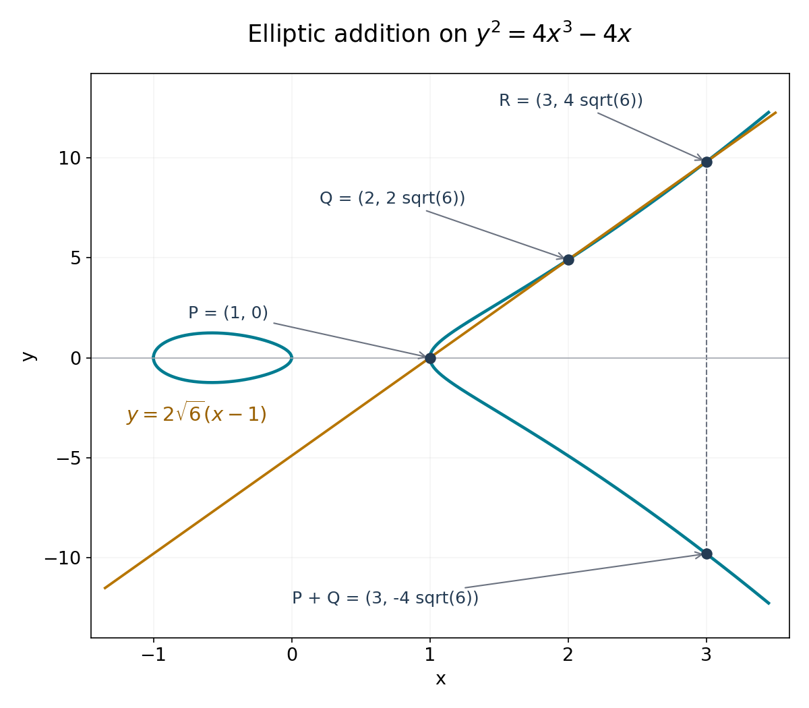

# Weierstrass functions, elliptic values and periods

*Written by GPT-6.1 Sol (OpenAI) in Codex, Ultra setting, October 2026. Self-checked by the writing AI, GPT-6.1 Sol at Ultra. Original exposition, proofs and figures: public domain (CC0). Linked analytic prerequisites retain their own licence.*

The exponential has one period direction. A Weierstrass function has two independent period directions, and its values trace a cubic curve. This gives an elliptic counterpart of Hermite–Lindemann: with algebraic coefficients in the cubic, values at algebraic arguments are transcendental. Its periods are transcendental as well.

We use the criterion proved in [The Schneider–Lang criterion](TR-TRANS-07.md). We will construct the functions, prove their addition and growth formulas, and justify the existence of a lattice for every nonsingular cubic of the required form. Periods will be treated before values, so that a possible lattice multiple of the argument cannot be overlooked.

The exact open analytic prerequisites are in Jiří Lebl's [*Guide to Cultivating Complex Analysis*](https://www.jirka.org/ca/ca.pdf), version 1.9, July 11, 2026: Theorems 3.3.1 and 3.3.4 for local expansions and Cauchy's derivative formula, Theorem 3.3.10 for Liouville's theorem, Theorem 5.3.2 for residues, and Theorem 5.5.1 for the open mapping theorem. The linked author proofs are used under [CC BY-SA 4.0](https://creativecommons.org/licenses/by-sa/4.0/), selected from the actual dual licence.

## 1. A lattice and its Weierstrass function

Fix

\[
 L=\mathbb Z\omega_1+\mathbb Z\omega_2,\qquad
 \operatorname{Im}(\omega_1/\omega_2)>0.
\]

The generators are independent over \(\mathbb R\). Their real linear map from \(\mathbb R^2\) to \(\mathbb C\) is invertible. Consequently some \(c>0\) satisfies

\[
 |a\omega_1+b\omega_2|\geq c\sqrt{a^2+b^2}
 \qquad(a,b\in\mathbb R).
 \tag{8.1}
\]

One can take the positive minimum of the modulus on the compact unit circle. In particular \(L\) is discrete, has a shortest nonzero vector, and has \(O(R^2)\) points of modulus at most \(R\). More precisely, the number in \(N\leq|\omega|<N+1\) is \(O(N+1)\): sufficiently small discs centred on distinct lattice points are disjoint and lie in an annulus of fixed additional thickness, whose area is \(O(N+1)\). Therefore

\[
 \sum_{\omega\in L\setminus\{0\}}|\omega|^{-t}<\infty
 \qquad(t>2).
 \tag{8.2}
\]

Define

\[
 G_{2k}(L)=\sum_{\omega\in L\setminus\{0\}}\omega^{-2k}
 \quad(k\geq2),
\]

and, for \(z\notin L\),

\[
 \wp(z)=\frac1{z^2}+
 \sum_{\omega\in L\setminus\{0\}}
 \left(\frac1{(z-\omega)^2}-\frac1{\omega^2}\right).
 \tag{8.3}
\]

### Proposition 8.1. Convergence, poles and periodicity

The series (8.3) converges absolutely and uniformly on compact subsets of \(\mathbb C\setminus L\). It defines an even meromorphic function, with a double pole of leading coefficient one at each point of \(L\) and no other poles. It is periodic under every element of \(L\), and

\[
 \wp'(z)=-2\sum_{\omega\in L}(z-\omega)^{-3}.
 \tag{8.4}
\]

**Proof.** On \(|z|\leq R\), the terms with \(|\omega|>2R\) have modulus at most

\[
 \left|\frac{z(2\omega-z)}{\omega^2(z-\omega)^2}\right|
 \leq\frac{10R}{|\omega|^3}.
\]

Formula (8.2) controls the tail; the other terms are finite in number and holomorphic on the compact set in question. A locally uniform limit of holomorphic functions is holomorphic: on a small circle the Cauchy formula passes to the uniform limit, providing its convergent local Taylor series. The same formula passes derivatives to the limit. This proves (8.4), whose series is itself absolutely locally uniformly convergent. Each pole in (8.3) has the stated principal part.

Reindexing by \(\omega\mapsto-\omega\) proves evenness. Reindexing the absolutely convergent series (8.4) by any lattice translation proves that \(\wp'\) is periodic. Thus \(\wp(z+\omega_i)-\wp(z)\) is constant for each basis vector. Evaluation at \(z=-\omega_i/2\), which is not in \(L\), and evenness show that this constant is zero. All integer combinations are periods. \(\square\)

A meromorphic function periodic under \(L\) is called **elliptic**. An entire elliptic function is bounded on a closed fundamental parallelogram and hence, by translation, on the plane. Liouville's theorem makes it constant.

If \(r_0\) is the shortest nonzero lattice modulus, expansion of each term for \(|z|<r_0\) gives

\[
 \wp(z)=z^{-2}+\sum_{k\geq1}(2k+1)G_{2k+2}(L)z^{2k}.
 \tag{8.5}
\]

Indeed \((1-u)^{-2}=\sum_{n\geq0}(n+1)u^n\); absolute convergence on a smaller disc permits the sum over \(\omega\) to be interchanged with that series. Odd coefficients vanish by pairing \(\omega\) with \(-\omega\).

### Proposition 8.2. The differential equation

With

\[
 g_2=60G_4(L),\qquad g_3=140G_6(L),
\]

one has

\[
 \wp'^2=4\wp^3-g_2\wp-g_3,
 \qquad \wp''=6\wp^2-\frac{g_2}{2}.
 \tag{8.6}
\]

**Proof.** From (8.5),

\[
 \begin{aligned}
 \wp&=z^{-2}+3G_4z^2+5G_6z^4+O(z^6),\\
 \wp'^2&=4z^{-6}-24G_4z^{-2}-80G_6+O(z^2),\\
 4\wp^3&=4z^{-6}+36G_4z^{-2}+60G_6+O(z^2).
 \end{aligned}
\]

The elliptic function \(\wp'^2-4\wp^3+60G_4\wp+140G_6\) thus has a removable singularity at zero and value zero there. Periodicity removes every possible pole, so it is entire, hence constant and zero. Differentiate this identity where \(\wp'\ne0\) to obtain the second formula; both sides are meromorphic, so their equality extends across the isolated zeros of \(\wp'\). \(\square\)

In particular \(K[z,\wp,\wp']\) is stable under differentiation whenever \(g_2,g_3\in K\). Its three generators have derivatives \(1,\wp',6\wp^2-g_2/2\).

## 2. Counting zeros and adding points

### Lemma 8.3. The divisor of an elliptic function

Let \(h\) be a nonzero elliptic function. Choose a translated fundamental parallelogram whose boundary avoids its zeros and poles. List its zeros \(a_j\) and poles \(b_j\), each with multiplicity. Then

\[
 \#\{a_j\}=\#\{b_j\},\qquad
 \sum_j a_j-\sum_j b_j\in L.
 \tag{8.7}
\]

**Proof.** A zero of order \(t\) gives residue \(t\) for \(h'/h\); a pole of order \(t\) gives residue \(-t\). Opposite boundary integrals of the periodic function \(h'/h\) cancel. The residue theorem proves the first assertion.

For the second assertion, use the positive basis \(\lambda_1=\omega_2,\lambda_2=\omega_1\); positivity follows from our orientation convention. Let \(I_j\) be the integral of \(h'/h\) on the side from a vertex \(a\) to \(a+\lambda_j\). Exponentiating this integral gives \(h(a+\lambda_j)/h(a)=1\). For justification along the path, differentiate the ratio of \(h\) to the exponential of the partial integral; it is constant. Therefore \(I_j=2\pi i n_j\) for integers \(n_j\).

Now integrate \(z h'(z)/h(z)\). Combining opposite sides, the \(\lambda_1\)-sides contribute \(-\lambda_2I_1\), and the \(\lambda_2\)-sides contribute \(\lambda_1I_2\). Its residues are the zero and pole locations multiplied by their signed orders. Consequently their sum is \(\lambda_1n_2-\lambda_2n_1\in L\), proving (8.7). Such a boundary can always be chosen: zeros and poles are isolated and finite on each compact set, and a small translation avoids them on the four sides. \(\square\)

### Proposition 8.4. Fibres, half-periods and the discriminant

For every \(c\in\mathbb C\), \(\wp(z)=c\) has exactly two solutions modulo \(L\), counted with multiplicity. For \(u,v\notin L\),

\[
 \wp(u)=\wp(v)\quad\Longleftrightarrow\quad u\equiv\pm v\pmod L,
 \qquad
 \wp'(u)=0\quad\Longleftrightarrow\quad2u\in L.
 \tag{8.8}
\]

The three values

\[
 e_1=\wp(\omega_1/2),\quad e_2=\wp(\omega_2/2),\quad
 e_3=\wp((\omega_1+\omega_2)/2)
\]

are distinct and are the roots of \(4X^3-g_2X-g_3\). In particular

\[
 \Delta=g_2^3-27g_3^2
 =16(e_1-e_2)^2(e_1-e_3)^2(e_2-e_3)^2\ne0.
 \tag{8.9}
\]

**Proof.** The function \(\wp-c\) has one double pole modulo \(L\); Lemma 8.3 gives exactly two zeros, including existence. If \(u\not\equiv-u\), the two zeros \(u,-u\) are distinct and exhaust the fibre, each with multiplicity one. If \(2u\in L\) but \(u\notin L\), oddness and periodicity of \(\wp'\) imply \(\wp'(u)=-\wp'(u)=0\). That fibre has a zero of multiplicity at least two at \(u\), so its multiplicity is exactly two and there are no other zeros. These observations prove both equivalences in (8.8).

The three nonzero classes in \(\tfrac12L/L\) are distinct and each equals its own negative. Their \(\wp\)-values must therefore be distinct by (8.8). Their derivatives vanish, so (8.6) makes them roots of the cubic. For the identity in (8.9), the root sums give \(e_3=-e_1-e_2\), \(g_2=-4(e_1e_2+e_1e_3+e_2e_3)\), and \(g_3=4e_1e_2e_3\). Substitution and expansion yield \(g_2^3-27g_3^2=16(e_1-e_2)^2(2e_1+e_2)^2(e_1+2e_2)^2\), exactly the displayed product. Its factors are nonzero by the proved distinctness. \(\square\)

The letters \(e_1,e_2,e_3\) in this proposition label basis half-periods; they do not impose an ordering of real roots. We will explicitly order roots when considering a real integral.

### Proposition 8.5. The addition and duplication formulas

As an identity of meromorphic functions,

\[
 \wp(u+v)=-\wp(u)-\wp(v)+\frac14
 \left(\frac{\wp'(u)-\wp'(v)}{\wp(u)-\wp(v)}\right)^2.
 \tag{8.10}
\]

At points where the denominator is zero the formula is interpreted by its meromorphic limit. In particular, if \(u,2u\notin L\),

\[
 \wp(2u)=-2\wp(u)+\frac14\left(\frac{\wp''(u)}{\wp'(u)}\right)^2.
 \tag{8.11}
\]

**Proof.** First take a generic pair with distinct \(x\)-coordinates, and let

\[
 x_1=\wp(u),\quad y_1=\wp'(u),\quad
 x_2=\wp(v),\quad y_2=\wp'(v),\quad
 a=\frac{y_1-y_2}{x_1-x_2},\quad b=y_1-ax_1.
\]

The elliptic function \(\wp'(z)-a\wp(z)-b\) has one triple pole at zero modulo \(L\); hence it has three zeros, counted with multiplicity. Two are \(u,v\); call the third \(t\). Lemma 8.3 gives \(u+v+t\in L\). Their coordinates are the intersections of \(y=ax+b\) with the cubic (8.6). For a generic line the cubic

\[
 4X^3-g_2X-g_3-(aX+b)^2
\]

has three distinct roots, exactly \(x_1,x_2,\wp(t)\). Its root sum is \(a^2/4\). Evenness and periodicity give \(\wp(t)=\wp(u+v)\), proving (8.10).

Here the generic restriction merely avoids tangencies and coincident coordinates. Every point of the affine cubic is attained by \((\wp,\wp')\): choose a preimage of its \(x\)-coordinate using Proposition 8.4, and change \(z\) to \(-z\) if the sign of its \(y\)-coordinate requires it. Thus the line argument applies on a nonempty open set of pairs; the meromorphic identity extends to all pairs by the one-variable identity theorem in each variable. Finally let \(v\to u\). By (8.8), \(2u\notin L\) implies \(\wp'(u)\ne0\), and the quotient tends to \(\wp''(u)/\wp'(u)\). This proves (8.11). \(\square\)

The line's third intersection corresponds to \(-u-v\); reflection across the \(x\)-axis gives the point corresponding to \(u+v\). The factor \(1/4\) in (8.10) comes from the leading coefficient \(4\) in our cubic normalization.

*Figure 8.1. On \(y^2=4x^3-4x\), the line \(y=2\sqrt6(x-1)\) meets the cubic at \(P=(1,0)\), \(Q=(2,2\sqrt6)\), and \(R=(3,4\sqrt6)\). Reflection gives \(P+Q=(3,-4\sqrt6)\). Subtracting the squared line from the cubic gives exactly \(4(x-1)(x-2)(x-3)\). The three-zero argument in Proposition 8.5 explains this addition law; the plotted real arcs and line are a view of these exact objects. Original figure.*

## 3. Entire quotients of strict order two

A meromorphic function is not bounded on a disc containing its poles. The growth hypothesis in the criterion concerns an entire quotient representation. We will construct that representation and prove the exponent two, rather than use a bound for \(\wp\) away from its poles.

Define the Weierstrass sigma function by

\[
 \sigma(z)=z\prod_{\omega\in L\setminus\{0\}}
 \left(1-\frac z\omega\right)
 \exp\left(\frac z\omega+\frac{z^2}{2\omega^2}\right).
 \tag{8.12}
\]

For \(|z/\omega|\leq1/2\), the logarithm of the factor is

\[
 -\sum_{j\geq3}\frac{(z/\omega)^j}{j},
\]

whose modulus is at most \(C|z|^3/|\omega|^3\). By (8.2), these logarithms converge locally uniformly after excluding finitely many factors. Their exponential is holomorphic and nonzero. This proves that the product is an entire function with simple zeros exactly at \(L\). It also justifies reindexing its factors and proves \(\sigma(-z)=-\sigma(z)\).

Off \(L\), its logarithmic derivative is

\[
 \zeta(z)=\frac{\sigma'(z)}{\sigma(z)}
 =\frac1z+\sum_{\omega\in L\setminus\{0\}}
 \left(\frac1{z-\omega}+\frac1\omega+\frac z{\omega^2}\right),
 \qquad\zeta'=-\wp.
 \tag{8.13}
\]

Differentiation is justified on compact sets by the Cauchy formula for the locally uniform logarithm series. The function \(\zeta\) is odd and has simple poles of residue one at \(L\).

Since \(\wp\) is periodic, \(\zeta(z+\omega)-\zeta(z)\) has derivative zero; its poles cancel. Write its constant as \(\eta(\omega)\). Translation shows that \(\eta:L\to\mathbb C\) is additive. Put \(\eta_i=\eta(\omega_i)\). The quotient \(\sigma(z+\omega_i)/\sigma(z)\) extends to a nonzero entire function, and its logarithmic derivative is \(\eta_i\). Hence it is a constant times \(e^{\eta_i z}\). Oddness at \(-\omega_i/2\) determines the constant:

\[
 \sigma(z+\omega_i)=-\exp\bigl(\eta_i(z+\omega_i/2)\bigr)\sigma(z).
 \tag{8.14}
\]

Induction, in both positive and negative integers, gives

\[
 \sigma(z+n\omega_i)=(-1)^n
 \exp\bigl(\eta_i(nz+n^2\omega_i/2)\bigr)\sigma(z).
 \tag{8.15}
\]

### Proposition 8.6. The required growth representations

The entire functions \(\sigma,\sigma^2\wp,\sigma^3\wp'\) have strict order at most two. Consequently \(\wp,\wp',\zeta\) are quotients of entire functions of strict order at most two.

**Proof.** Every \(w\in\mathbb C\) can be written as \(z+n\omega_1+p\omega_2\), with \(z\) in a fixed closed fundamental parallelogram. By (8.1), \(|n|+|p|\leq C(1+|w|)\). Apply (8.15) first in the \(\omega_1\) direction and then in the \(\omega_2\) direction. Its exponential has exponent

\[
 \eta_1(nz+n^2\omega_1/2)+
 \eta_2\bigl(p(z+n\omega_1)+p^2\omega_2/2\bigr).
\]

Its real part is bounded above by \(C(1+n^2+p^2)\), uniformly for \(z\) in that compact parallelogram. Boundedness of \(\sigma\) there therefore gives \(|\sigma(w)|\leq\exp(CR^2)\) for \(|w|\leq R\), \(R\geq1\).

The products \(A=\sigma^2\wp\) and \(B=\sigma^3\wp'\) are entire: their sigma zeros cancel exactly the double and triple poles. Since \(\wp\) and \(\wp'\) are periodic, their translation multipliers are the square and cube of those in (8.15). The same compact-parallelogram argument gives strict order two for \(A,B\). Thus

\[
 \wp=A/\sigma^2,\qquad \wp'=B/\sigma^3
\]

are the required quotient representations. Finally Cauchy's estimate on a radius-one circle about each point gives \(|\sigma'|_R\leq|\sigma|_{R+1}\leq\exp(C'R^2)\) for \(R\geq1\). Formula (8.13) represents \(\zeta\) as \(\sigma'/\sigma\), of the same strict order. \(\square\)

The order-two bound uses the exact translation law. Estimating each nearby factor of (8.12) separately can give a weaker estimate and does not prove this assertion.

## 4. Transcendence of periods and values

### Lemma 8.7. A coordinate and a periodic function are independent

The functions \(z,\wp(z)\) are algebraically independent over \(\mathbb C\).

**Proof.** Suppose \(\sum_j p_j(\wp(z))z^j=0\), where the \(p_j\) are polynomials. Fix any \(z_0\notin L\) and a nonzero period \(\omega\). Substituting \(z=z_0+k\omega\), \(k\in\mathbb Z\), makes one polynomial in \(z\) vanish at infinitely many distinct points. Thus each \(p_j(\wp(z_0))=0\). The function \(\wp\) takes every complex value by Proposition 8.4, so each \(p_j\) is the zero polynomial. \(\square\)

### Theorem 8.8. Schneider's period theorem

If \(g_2,g_3\) are algebraic, every nonzero \(\omega\in L\) is transcendental.

**Proof.** A lattice element is called primitive if it belongs to some integer basis of \(L\). Write a nonzero \(\omega=a\omega_1+b\omega_2\) and put \(d=\gcd(|a|,|b|)\). Then \(\lambda=\omega/d\) is primitive, by Bézout's identity applied to its coprime coordinates. In particular \(\lambda/2\notin L\).

Suppose \(\omega\) were algebraic. Then \(\lambda\) would also be algebraic. The half-period value \(e=\wp(\lambda/2)\) is a root of \(4X^3-g_2X-g_3\), and \(\wp'(\lambda/2)=0\), so \(e\) is algebraic. Take \(K=\mathbb Q(g_2,g_3,\lambda,e)\). The functions \(z,\wp,\wp'\) have strict order at most two, their \(K\)-ring is stable under differentiation, and two are independent by Lemma 8.7. At every distinct point

\[
 w_k=(k+1/2)\lambda,\qquad k=1,2,\ldots,
\]

none has a pole, and their values are \((k+1/2)\lambda,e,0\in K\). Arbitrarily many such points contradict Theorem 7.2. \(\square\)

Proving this theorem first also establishes \(L\cap\overline{\mathbb Q}=\{0\}\). Thus every nonzero integer multiple of an algebraic nonzero argument avoids the poles.

### Theorem 8.9. Schneider's value theorem

If \(g_2,g_3\) are algebraic and \(\alpha\) is algebraic with \(\alpha\notin L\), then both \(\wp(\alpha)\) and \(\wp'(\alpha)\) are transcendental.

**Proof.** Suppose \(x=\wp(\alpha)\) were algebraic. Equation (8.6) makes \(y=\wp'(\alpha)\) algebraic as well. Set

\[
 K=\mathbb Q(g_2,g_3,\alpha,x,y).
\]

Including \(y\) is necessary; the square relation alone would only put it in a possible quadratic extension of the field generated by \(x\).

Here \(\alpha\ne0\), since zero is a pole. By Theorem 8.8, no nonzero integer multiple of \(\alpha\) is in \(L\). Also \(y\ne0\), since (8.8) would otherwise put \(2\alpha\) in \(L\). The duplication formula (8.11), together with \(\wp''=6\wp^2-g_2/2\), first gives \(\wp(2\alpha)\in K\). Differentiating (8.11) with respect to \(\alpha\)'s variable and dividing by two gives \(\wp'(2\alpha)\in K\): it is a rational expression in \(\wp(\alpha),\wp'(\alpha),\wp''(\alpha),\wp'''(\alpha)\), and \(\wp'''=12\wp\wp'\).

For \(k\geq2\), the denominator \(\wp(k\alpha)-\wp(\alpha)\) is nonzero. If it vanished, (8.8) would give \((k-1)\alpha\in L\) or \((k+1)\alpha\in L\), impossible. Formula (8.10), followed by its derivative in the first variable, therefore shows inductively that

\[
 \wp(k\alpha),\wp'(k\alpha)\in K\qquad(k\geq1).
\]

For the differentiated formula the derivative of \(\wp'\) is again \(6\wp^2-g_2/2\), so it introduces no new field elements. The \(K\)-ring of \(z,\wp,\wp'\) satisfies all the hypotheses of Theorem 7.2, yet all their values at the infinitely many distinct points \(k\alpha\) lie in \(K\). This contradiction proves that \(\wp(\alpha)\) is transcendental.

If \(\wp'(\alpha)\) were algebraic, (8.6) would make \(\wp(\alpha)\) a root of the nonzero cubic \(4X^3-g_2X-g_3-\wp'(\alpha)^2\) over the algebraic numbers. It would then be algebraic, contradicting the first assertion. \(\square\)

## 5. A lattice for every nonsingular cubic

To apply the period theorem to a specified equation, we must justify that the equation has a period lattice. This is an existence theorem, not a convention for naming its coefficients. We prove it using a compactness argument for the modular invariant, without assuming a uniformization theorem.

For \(\tau\) in the upper half-plane \(\mathfrak H\), put \(L_\tau=\mathbb Z\tau+\mathbb Z\), and define

\[
 j(\tau)=1728\frac{g_2(L_\tau)^3}{g_2(L_\tau)^3-27g_3(L_\tau)^2}.
 \tag{8.16}
\]

The denominator is nonzero by Proposition 8.4. The Eisenstein sums are locally uniformly convergent holomorphic functions of \(\tau\). Indeed, on a compact subset of \(\mathfrak H\), the constant in (8.1) for \(m\tau+n\) has a common positive lower bound, so a convergent sum of \((m^2+n^2)^{-k}\) dominates \(G_{2k}\). Thus \(j\) is holomorphic on \(\mathfrak H\).

### Lemma 8.10. Behaviour as one lattice direction goes to infinity

As \(\operatorname{Im}\tau\to\infty\), uniformly in \(\operatorname{Re}\tau\),

\[
 g_2(L_\tau)\longrightarrow\frac{4\pi^4}{3},\qquad
 g_3(L_\tau)\longrightarrow\frac{8\pi^6}{27},\qquad
 |j(\tau)|\longrightarrow\infty.
 \tag{8.17}
\]

**Proof.** First establish the elementary partial-fraction identity

\[
 \sum_{n\in\mathbb Z}(z-n)^{-2}=\frac{\pi^2}{\sin^2\pi z}.
 \tag{8.18}
\]

The series is locally uniformly convergent away from the integers. Both sides are one-periodic with the same double-pole principal parts. Their difference is entire. On \(0\leq\operatorname{Re}z\leq1\), with \(|\operatorname{Im}z|\geq1\), the absolute-value sum is bounded by

\[
 \sum_n\frac1{(\operatorname{Re}z-n)^2+(\operatorname{Im}z)^2}
 \leq\frac{C}{|\operatorname{Im}z|}.
\]

This follows by separating the nearest integer and comparing the remaining terms with the integral of \((t^2+y^2)^{-1}\). The sine expression also tends uniformly to zero there, because \(|\sin\pi(x+iy)|^2=\sin^2\pi x+\sinh^2\pi y\). The difference is bounded on the intervening compact rectangle, including its removable singularities. Periodicity makes it bounded on the plane, and Liouville makes it constant. Its limit at imaginary infinity is zero, proving (8.18).

Expansion of \(\sin\pi z\) and division of convergent series give

\[
 \frac{\pi^2}{\sin^2\pi z}
 =z^{-2}+\frac{\pi^2}{3}+\frac{\pi^4}{15}z^2
 +\frac{2\pi^6}{189}z^4+O(z^6).
\]

Compare the coefficients in (8.18) to get

\[
 \sum_{n\ne0}n^{-4}=\frac{\pi^4}{45},\qquad
 \sum_{n\ne0}n^{-6}=\frac{2\pi^6}{945}.
\]

Now separate the zero \(\tau\)-coordinate in the lattice Eisenstein sum. For \(t=\operatorname{Im}\tau\geq1\) and \(k\geq2\),

\[
 \sum_{m\ne0}\sum_{n\in\mathbb Z}|m\tau+n|^{-2k}
 \leq C_k\sum_{m\ne0}(|m|t)^{1-2k}=O(t^{1-2k}).
\]

For the inner sum, the same nearest-integer and integral comparison gives \(\sum_n((n+x)^2+a^2)^{-k}\leq C_k a^{1-2k}\) for \(a\geq1\), uniformly in real \(x\). Hence \(G_4\to\pi^4/45\) and \(G_6\to2\pi^6/945\), proving the first two limits in (8.17). Their limiting invariants satisfy \((4\pi^4/3)^3-27(8\pi^6/27)^2=0\). The denominator of (8.16) thus tends to zero while its numerator tends to a nonzero number. This proves the last limit. \(\square\)

### Theorem 8.11. Existence and uniqueness of the period lattice

For every \(A,B\in\mathbb C\) with \(A^3-27B^2\ne0\), there is a unique lattice \(L\subset\mathbb C\) such that

\[
 g_2(L)=A,\qquad g_3(L)=B.
 \tag{8.19}
\]

Its Weierstrass function parametrizes \(y^2=4x^3-Ax-B\).

**Proof.** Scaling the absolutely convergent series shows

\[
 g_2(cL)=c^{-4}g_2(L),\quad g_3(cL)=c^{-6}g_3(L),\quad
 \wp_{cL}(cz)=c^{-2}\wp_L(z).
 \tag{8.20}
\]

For \(\gamma=\left(\begin{smallmatrix}a&b\\c&d\end{smallmatrix}\right)\in\mathrm{SL}_2(\mathbb Z)\), changing the integer basis gives

\[
 L_{\gamma\tau}=(c\tau+d)^{-1}L_\tau,
 \qquad j(\gamma\tau)=j(\tau).
 \tag{8.21}
\]

Every orbit has a representative in

\[
 \mathcal F=\{\tau\in\mathfrak H:|\operatorname{Re}\tau|\leq1/2,
 \ |\tau|\geq1\}.
\]

Here is a direct reduction argument. Choose a shortest nonzero vector \(c\tau+d\) of \(L_\tau\). Its coordinates \(c,d\) are coprime, since otherwise division by their common factor would shorten it. Complete them to a matrix of determinant one using Bézout's identity. The transformed imaginary part is \(\operatorname{Im}\tau/|c\tau+d|^2\), maximal among all orbit elements. An integer translation puts its real part in \([-1/2,1/2]\). If its modulus were less than one, inversion \(\tau\mapsto-1/\tau\) would increase its imaginary part, contradicting maximality. Thus it lies in \(\mathcal F\), where the imaginary part is at least \(\sqrt3/2\).

The image \(j(\mathfrak H)\) is open by the exact open mapping theorem, since Lemma 8.10 makes \(j\) nonconstant. It is also closed in \(\mathbb C\). To prove this, take \(j(\tau_n)\) converging to a finite number, and use (8.21) to put each \(\tau_n\) in \(\mathcal F\). Their imaginary parts must be bounded above by Lemma 8.10; otherwise a subsequence would have \(|j(\tau_n)|\to\infty\). They are bounded below by \(\sqrt3/2\) and their real parts lie in a compact interval. A convergent subsequence therefore has a limit in \(\mathfrak H\), whose \(j\)-value is the desired finite limit. The image is nonempty, open and closed in the connected plane, so

\[
 j(\mathfrak H)=\mathbb C.
\]

Choose \(\tau\) such that \(j(\tau)=1728A^3/(A^3-27B^2)\), and put \(a=g_2(L_\tau),b=g_3(L_\tau)\). If \(A,B\ne0\), equality of the invariants gives \(a^3/A^3=b^2/B^2\). Choose \(c\) with \(c^4=a/A\). Then \(c^6=\pm b/B\); replacing \(c\) by \(ic\) changes this sign without changing its fourth power. Thus (8.20) gives (8.19) for \(L=cL_\tau\). If \(A=0\), equality of \(j\)-values gives \(a=0,b\ne0\); choose \(c^6=b/B\). If \(B=0\), it gives \(b=0,a\ne0\); choose \(c^4=a/A\). These cases exhaust the possibilities because the discriminant is nonzero.

For uniqueness, write \(\wp=z^{-2}+\sum_{n\geq1}c_nz^{2n}\). We have \(c_1=A/20,c_2=B/28\) from (8.5)–(8.6). Comparing coefficients in \(\wp''=6\wp^2-A/2\) yields, for \(n\geq3\),

\[
 \bigl(2n(2n-1)-12\bigr)c_n
 =6\sum_{i=1}^{n-2}c_i c_{n-1-i}.
 \tag{8.22}
\]

The factor on the left is nonzero, so the coefficients are determined recursively by \(A,B\). Two such Weierstrass functions have the same Laurent expansion, hence agree as meromorphic functions. Their pole sets are exactly their lattices, so the lattices agree.

Finally Proposition 8.4 shows that every affine point of the cubic is \((\wp(z),\wp'(z))\), with the sign selected by replacing \(z\) by \(-z\) if necessary. The origin class of the torus corresponds to the point at infinity. Thus this lattice supplies the asserted parametrization. \(\square\)

The same scaling argument proves that two lattices have the same \(j\)-invariant exactly when they are homothetic: match both invariants by a scale as above, then use uniqueness. This fact will be used in the next lesson; no injectivity statement for a modular quotient is needed for its proof.

## 6. Elliptic integrals and the lemniscate

Suppose \(g_2,g_3\) are real and the cubic has three distinct real roots, ordered here as \(E_1>E_2>E_3\). Its real half-period is

\[
 \Omega=\int_{E_1}^{\infty}
 \frac{dx}{\sqrt{4x^3-g_2x-g_3}},
 \tag{8.23}
\]

where the square root is positive for \(x>E_1\). The integral converges: near its simple root the integrand has order \((x-E_1)^{-1/2}\), and at infinity it has order \(x^{-3/2}\).

To identify it, the Laurent coefficients (8.22) are real, so \(\wp(t)\) is real near positive real zero, with \(\wp(t)\sim t^{-2}\) and \(\wp'(t)\sim-2t^{-3}\). As long as \(\wp(t)>E_1\), (8.6) gives the negative square root for its derivative and therefore

\[
 t=\int_{\wp(t)}^\infty
 \frac{dx}{\sqrt{4x^3-g_2x-g_3}}.
 \tag{8.24}
\]

Differentiation makes the right side have derivative one, and its limit at zero fixes the integration constant. This interval continues until \(t=\Omega\). It cannot stop sooner at a pole: the right side would tend to zero there, contradicting a positive limiting \(t\). It cannot stop at a finite value greater than \(E_1\), because the derivative is nonzero and holomorphy extends the inequality. If it reaches \(E_1\), (8.24) forces \(t=\Omega\). The integral decreases continuously from \(\Omega\) to zero as its lower endpoint increases from \(E_1\) to infinity, so \(\wp(t)\to E_1\) as \(t\uparrow\Omega\).

The point \(\Omega\) is not a pole, and \(\wp'(\Omega)=0\). Proposition 8.4 gives \(2\Omega\in L\) and \(\Omega\notin L\). It is the least positive real period: there are no poles in \((0,\Omega)\), and evenness and the period \(2\Omega\) exclude any pole in \((\Omega,2\Omega)\). If the cubic coefficients are algebraic, Theorem 8.8 makes \(2\Omega\), and hence \(\Omega\), transcendental.

For a nonreal cubic, an integral from infinity to a branch root requires a path and a continued square-root branch. The corresponding statement is also precise. The parametrization in Theorem 8.11 identifies the nonsingular projective cubic with \(\mathbb C/L\): (8.8) proves injectivity of \((\wp,\wp')\), and the parametrization proves surjectivity. It is a continuous bijection from a compact torus to the projective cubic, a Hausdorff space, and hence a homeomorphism: images of closed sets are compact and closed.

It also has local analytic inverses. Away from \(\wp'=0\), use \(x\) as a coordinate; at a half-period, use \(y\), whose derivative \(\wp''\) is nonzero because the fibre has exact multiplicity two. At infinity, \(-2x/y=z+O(z^5)\) has nonzero derivative. Here is the local inverse argument needed in these charts. If \(F'(z_0)\ne0\), choose a convex disc on which \(|F'(z)-F'(z_0)|<|F'(z_0)|/2\). Integration along a segment shows \(|F(z)-F(w)|\geq|F'(z_0)||z-w|/2\), so \(F\) is injective there. Its image is open by the open mapping theorem, its inverse is continuous, and the difference quotient gives derivative \(1/F'\) for that inverse. Thus the inverse is holomorphic. A path can now be lifted to \(\mathbb C\) by subdividing it into finitely many such charts and consistently choosing the lattice translates. Along it,

\[
 \frac{dx}{y}=dz,
\]

with the identity continued across the root charts. A lifted path from the point at infinity to \((E_i,0)\) ends at some \(w\notin L\) with \(2w\in L\). Its integral is that half-period \(w\); other paths can add periods. Each such integral is nonzero and transcendental for algebraic \(g_2,g_3\). This formulation states the path and branch dependence explicitly.

**The square lattice.** For \(L_0=\mathbb Z[i]\), multiplication by \(i\) preserves the lattice. Equation (8.20) gives \(g_3(L_0)=i^{-6}g_3(L_0)=-g_3(L_0)\), so \(g_3(L_0)=0\). Its \(g_2\) is nonzero by (8.9). Moreover it is positive real: conjugation preserves \(L_0\), the value \(e=\wp_{L_0}(1/2)\) is real, and it is nonzero because \(\wp_{L_0}(i/2)=-e\) is a distinct half-period value. Then \(4e^3-g_2e=0\) gives \(g_2=4e^2>0\). Scale by the positive \(c\) with \(c^4=g_2(L_0)/4\); the scaled lattice has invariants \((4,0)\).

For its curve \(y^2=4x^3-4x\), substitution \(x=t^{-2}\) in (8.23) gives

\[
 \Omega=\int_0^1\frac{dt}{\sqrt{1-t^4}},\qquad
 \varpi=2\Omega=2\int_0^1\frac{dt}{\sqrt{1-t^4}}.
\]

The number \(\varpi\), in this convention the lemniscate constant, is the least positive real period and is transcendental. The scaled square lattice is \(\varpi\mathbb Z[i]\), since its least positive real lattice element is the scale \(c\).

**The triangular lattice.** Put \(\xi=e^{2\pi i/3}\) and \(L_0=\mathbb Z+\mathbb Z\xi\). Since \(\xi L_0=L_0\), (8.20) forces \(g_2(L_0)=0\). Nonvanishing of the discriminant forces \(g_3(L_0)\ne0\). A scale \(c\) with \(c^6=g_3(L_0)\) gives invariants \((0,1)\). Every nonzero period of this scaled lattice is transcendental. Both examples use algebraic invariants after scaling; they do not assume that the unscaled lattice invariants are algebraic.

## 7. Exercises

1. **Easy — differentiation.** Prove \(\wp''=6\wp^2-g_2/2\), including its validity at zeros of \(\wp'\). Deduce stability of \(\mathbb C[\wp,\wp']\) under differentiation.

2. **Medium — the discriminant.** Prove \(g_2^3-27g_3^2\ne0\) from the three half-periods, explaining both their distinctness and the multiplicities of the corresponding fibres.

3. **Medium — derivative values.** Under the hypotheses of Schneider's value theorem, prove that \(\wp'(\alpha)\) is transcendental, without asserting that a polynomial in an arbitrary transcendental number must be transcendental.

4. **Medium — an elliptic integral.** When the algebraic cubic has three distinct real roots, prove (8.23) is a half-period using the indicated positive square root. Deduce its transcendence. State the path and branch interpretation for nonreal roots.

5. **Hard — a line and three zeros.** Prove the addition theorem using \(\wp'(z)-a\wp(z)-b\). Derive the zero-sum congruence from a boundary integral and account for tangencies by limits. On \(y^2=4x^3-4x\), find the third intersection of the line through \((1,0)\) and \((2,2\sqrt6)\), and reflect it to obtain their sum.

## 8. Solutions

1. Differentiate \(\wp'^2=4\wp^3-g_2\wp-g_3\) on the open set where \(\wp'\ne0\), obtaining \(2\wp'\wp''=(12\wp^2-g_2)\wp'\). Division gives the required formula there; the meromorphic identity theorem extends it across the isolated zeros of \(\wp'\). The derivative of \(\wp\) is \(\wp'\), and the derivative of \(\wp'\) is a polynomial in \(\wp\) with complex coefficients. The product rule therefore keeps every polynomial in both generators inside the same ring.

2. Each nonzero half-lattice class equals its negative. Oddness and periodicity give \(\wp'=0\) there. The fibre \(\wp-e\) has two zeros with multiplicity because it has one double pole. At a half-period its zero has multiplicity at least two, so it is exactly double and exhausts the fibre. Different half-period classes therefore have different values. The three values are roots of the cubic by the differential equation; the cubic has distinct roots. Its monic discriminant is \((g_2^3-27g_3^2)/16\), so the claimed quantity is nonzero.

3. If \(\wp'(\alpha)\) were algebraic, the number \(\wp(\alpha)\) would satisfy \(4X^3-g_2X-g_3-\wp'(\alpha)^2=0\) over a number field. It would be algebraic over that field and therefore over \(\mathbb Q\), contrary to Theorem 8.9. This is an algebraic equation with nonzero leading coefficient; it avoids any general claim about polynomial values of transcendental numbers.

4. On the positive real branch near zero, \(\wp\sim t^{-2}\) and \(\wp'<0\). Until the largest root is reached, the differential equation integrates to (8.24). The integral is finite at its lower root and goes to zero at infinity. Its inverse keeps \(\wp\) finite on \((0,\Omega]\); the continuation argument in section 6 excludes any earlier stopping point. At \(\Omega\), the derivative is zero and the value is finite. Proposition 8.4 gives \(2\Omega\in L\), \(\Omega\notin L\), so it is a nonzero half-period. Theorem 8.8 excludes algebraicity of \(2\Omega\), and thus of \(\Omega\). For nonreal roots, lift a specified path on the cubic, starting at infinity and ending at its root point, with \(y\) the continued square root. The equality \(dx/y=dz\) makes its integral a lift of that nonzero two-torsion class. Different lifts differ by periods; each lift remains a nonzero half-period and is transcendental.

5. The line parameters are \(a=(\wp'(u)-\wp'(v))/(\wp(u)-\wp(v))\), \(b=\wp'(u)-a\wp(u)\). The function \(\wp'-a\wp-b\) has a triple pole at zero and hence three zeros modulo \(L\). For its logarithmic derivative, the boundary integral weighted by \(z\) equals \(-\lambda_2I_1+\lambda_1I_2\), with \(I_j=2\pi i n_j\) because the values on each period side agree at its endpoints. The residues give \(u+v+t\equiv0\pmod L\). Substitution of the line into the cubic gives three \(x\)-roots whose sum is \(a^2/4\). Since \(\wp(t)=\wp(u+v)\), this is (8.10). Tangencies follow by the meromorphic identity and limits, yielding (8.11) at a finite double point. In the stated example, \(a=2\sqrt6\), \(b=-2\sqrt6\), so the root sum is six. The third \(x\)-coordinate is \(6-1-2=3\), and its \(y\)-coordinate is \(4\sqrt6\). Reflection gives the sum \((3,-4\sqrt6)\).

## References

- Michel Waldschmidt, [*Transcendence Methods*](https://webusers.imj-prg.fr/~michel.waldschmidt/articles/pdf/QueensPaper52.pdf), Queen's Papers in Pure and Applied Mathematics 52, Queen's University, Kingston, 1979, §2.2, Corollaries 2.2.3–2.2.4: Schneider's theorems on algebraic points of a Weierstrass function, deduced from the Schneider–Lang criterion with a field containing the values of \(\wp\) and \(\wp'\). Michel Waldschmidt, [*Elliptic Functions and Transcendence*](https://webusers.imj-prg.fr/~michel.waldschmidt/articles/pdf/SurveyTrdceEllipt2006.pdf), author's version of the survey in *Surveys in Number Theory*, 2008, §3.1, Theorems 17–20: the results of Siegel and Schneider on periods and values.
- J. S. Milne, [*Modular Functions and Modular Forms*](https://www.jmilne.org/math/CourseNotes/MF.pdf), course notes, for elliptic functions and the Weierstrass \(\wp\)-function.
- Jiří Lebl, [*Guide to Cultivating Complex Analysis*](https://www.jirka.org/ca/ca.pdf), version 1.9, July 11, 2026: Theorems 3.3.1, 3.3.4, 3.3.10, 5.3.2 and 5.5.1, exact open analytic prerequisites. Copyright © 2019–2026 Jiří Lebl; dual CC BY-NC-SA 4.0 / CC BY-SA 4.0, with CC BY-SA used for linked proofs. The independently authored lesson remains CC0.
- Theodor Schneider, [“Arithmetische Untersuchungen elliptischer Integrale”](https://gdz.sub.uni-goettingen.de/download/pdf/PPN235181684_0113/LOG_0004.pdf), *Mathematische Annalen* **113** (1937), 1–13: historical credit.
