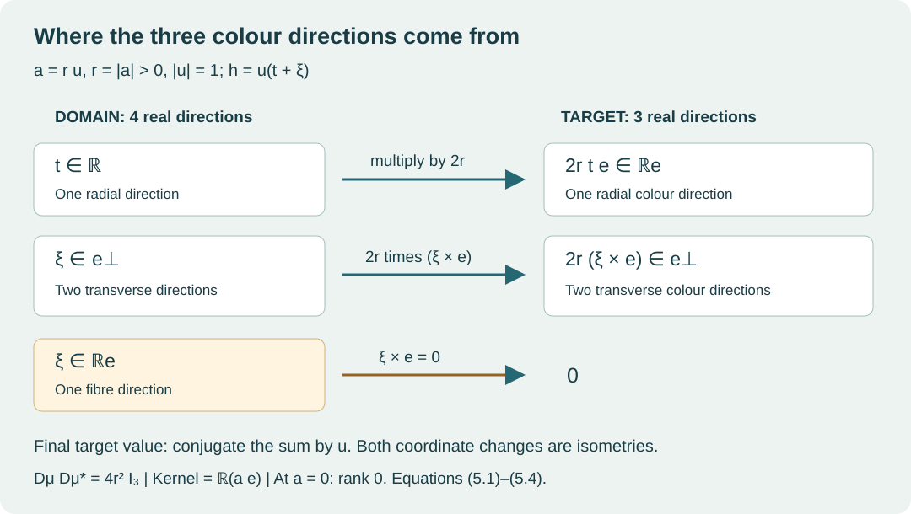

# Quaternionic colour maps

Lesson 1 · Geometry and states in Yang–Mills theory

A gauge potential has spatial components and colour components. A construction
that supplies only one colour direction cannot produce a nonzero commutator
between its spatial components. This lesson proves that obstruction for the
exact 24-dimensional representation used in this course, and constructs the
quadratic maps that overcome it.

We use real coordinates, complex \(2\times2\) matrices, and the derivative of a
polynomial map. The quaternionic algebra, group actions, equivariance arguments
and rank calculations needed below are developed explicitly.

## 1. The algebra and its matrix realization

Write a quaternion as

\[
 a=a_0+a_1\mathbf i+a_2\mathbf j+a_3\mathbf k,
 \qquad a_0,a_1,a_2,a_3\in\mathbb R.
 \tag{1.1}
\]

The bold symbols are quaternionic units. The symbol \(i_{\mathbb C}\) below is
the complex scalar. Introduce the four matrices

\[
 I=\begin{pmatrix}1&0\\0&1\end{pmatrix},\quad
 Q_1=\begin{pmatrix}0&-i_{\mathbb C}\\-i_{\mathbb C}&0\end{pmatrix},\quad
 Q_2=\begin{pmatrix}0&-1\\1&0\end{pmatrix},\quad
 Q_3=\begin{pmatrix}-i_{\mathbb C}&0\\0&i_{\mathbb C}\end{pmatrix}.
 \tag{1.2}
\]

Their multiplication table is

\[
\begin{array}{c|rrr}
 &Q_1&Q_2&Q_3\\\hline
 Q_1&-I&Q_3&-Q_2\\
 Q_2&-Q_3&-I&Q_1\\
 Q_3&Q_2&-Q_1&-I
\end{array}.
\tag{1.3}
\]

For example, multiplication of the off-diagonal entries in \(Q_1Q_2\)
gives \(-i_{\mathbb C},i_{\mathbb C}\) on the diagonal and zero elsewhere,
so \(Q_1Q_2=Q_3\). Each remaining entry follows by the same row-by-column
rule. The four matrices are linearly independent over the reals: the two
diagonal entries determine the coefficients of \(I,Q_3\), and the two
off-diagonal entries determine those of \(Q_1,Q_2\). Their real span is closed
under multiplication by the displayed table. Transport matrix multiplication
to \(\mathbb R^4\) by

\[
 \Psi(a)=a_0I+a_1Q_1+a_2Q_2+a_3Q_3
 =\begin{pmatrix}
 a_0-i_{\mathbb C}a_3&-a_2-i_{\mathbb C}a_1\\
 a_2-i_{\mathbb C}a_1&a_0+i_{\mathbb C}a_3
 \end{pmatrix}.
 \tag{1.4}
\]

This defines the algebra \(\mathbb H\), including its associativity: both
\(\Psi((ab)c)\) and \(\Psi(a(bc))\) equal the associative matrix product
\(\Psi(a)\Psi(b)\Psi(c)\), and \(\Psi\) is injective. The identity is \(1\).
In particular, \(\mathbf i\mathbf j=\mathbf k\),
\(\mathbf j\mathbf i=-\mathbf k\), and each unit has square \(-1\).

Define conjugation and the Euclidean norm by

\[
 \bar a=a_0-a_1\mathbf i-a_2\mathbf j-a_3\mathbf k,
 \qquad |a|^2=a_0^2+a_1^2+a_2^2+a_3^2.
 \tag{1.5}
\]

The matrices \(Q_b\) satisfy \(Q_b^*=-Q_b\), where \(*\) is conjugate
transpose. Thus \(\Psi(\bar a)=\Psi(a)^*\) and
\(\overline{ab}=\bar b\bar a\). Multiplying (1.4) by its conjugate transpose
gives \(|a|^2I\); equivalently

\[
 a\bar a=\bar a a=|a|^2,\qquad
 |ab|^2=|a|^2|b|^2,\qquad
 a^{-1}=\frac{\bar a}{|a|^2}\quad(a\ne0).
 \tag{1.6}
\]

For the middle equality, use
\((ab)\overline{ab}=a(b\bar b)\bar a=|b|^2|a|^2\).
These formulas prove that every nonzero quaternion is invertible.

The imaginary subspace consists of the quaternions with \(a_0=0\).
For \(v=v_1\mathbf i+v_2\mathbf j+v_3\mathbf k\) and
\(w=w_1\mathbf i+w_2\mathbf j+w_3\mathbf k\), set

\[
\begin{split}
 v\cdot w&=v_1w_1+v_2w_2+v_3w_3,\\
 v\times w&=(v_2w_3-v_3w_2)\mathbf i
 +(v_3w_1-v_1w_3)\mathbf j
 +(v_1w_2-v_2w_1)\mathbf k.
\end{split}
\tag{1.7}
\]

Expanding all nine products with (1.3) gives

\[
 vw=-v\cdot w+v\times w,\qquad [v,w]:=vw-wv=2v\times w.
 \tag{1.8}
\]

The cross-product coordinates also give
\(v\cdot(v\times w)=w\cdot(v\times w)=0\) and
\(|v\times w|^2=|v|^2|w|^2-(v\cdot w)^2\): expand the three squares
in (1.7), collect \(v_b^2w_c^2\), and retain the three mixed terms
\(-2v_bv_cw_bw_c\). We will use these identities with their stated Euclidean
metric.

## 2. Colour generators, metrics and the group action

Define

\[
 T_b=\frac12Q_b=-\frac{i_{\mathbb C}}2\sigma_b,\qquad
 \varphi(v)=2v_1T_1+2v_2T_2+2v_3T_3,
 \tag{2.1}
\]

where the last equality defines the Pauli matrices \(\sigma_b\) in the order
of (1.2). The target is \(\mathfrak{su}(2)\), the real space of trace-zero
anti-Hermitian \(2\times2\) complex matrices. Every such matrix has exactly
the form \(v_1Q_1+v_2Q_2+v_3Q_3\), so \(\varphi\) is a real-linear bijection.
The multiplication table gives

\[
 [T_1,T_2]=T_3,\quad [T_2,T_3]=T_1,\quad[T_3,T_1]=T_2,
 \qquad \varphi([v,w])=[\varphi(v),\varphi(w)].
 \tag{2.2}
\]

Indeed, \(\varphi\) is the restriction of the multiplicative map \(\Psi\), so
it preserves the difference of the two products defining the bracket. With
the matrix metric used in this course, the full comparison is

\[
 \langle X,Y\rangle_{\rm mat}=-2\operatorname{tr}(XY),\qquad
 \langle\varphi(v),\varphi(w)\rangle_{\rm mat}=4(v\cdot w).
 \tag{2.3}
\]

To check the factor, (1.3) gives
\(\operatorname{tr}(Q_bQ_c)=-2\delta_{bc}\); substitute (2.1) into the
trace. In particular the map preserves the bracket and multiplies the squared
norm by \(4\). Neither factor \(2\) in (2.1) is to be removed.

The group

\[
 \operatorname{Sp}(1)=\{u\in\mathbb H:|u|=1\}
 \tag{2.4}
\]

acts on \(\mathbb H\) by left multiplication \(a\mapsto ua\), and on
\(\operatorname{Im}\mathbb H\) by \(v\mapsto u v\bar u\). The norm and
inverse formulas prove that (2.4) is a group. Conjugation preserves the
imaginary subspace because
\(\overline{u v\bar u}=u\bar v\bar u=-u v\bar u\), and it preserves the
norm by (1.6). It preserves the inner product by applying the norm identity
to \(v+w\) and subtracting the two individual squared norms.

We need the following specific actions. Multiplication with (1.3) gives

\[
\begin{array}{c|rrr}
 u&u\mathbf i\bar u&u\mathbf j\bar u&u\mathbf k\bar u\\\hline
 \mathbf i&\mathbf i&-\mathbf j&-\mathbf k\\
 \mathbf j&-\mathbf i&\mathbf j&-\mathbf k\\
 \mathbf k&-\mathbf i&-\mathbf j&\mathbf k\\
 (1+\mathbf k)/\sqrt2&\mathbf j&-\mathbf i&\mathbf k\\
 (1+\mathbf i)/\sqrt2&\mathbf i&\mathbf k&-\mathbf j
\end{array}.
\tag{2.5}
\]

For the fourth row, for example, retain both factors \(1/\sqrt2\) and
expand \((1+\mathbf k)\mathbf i(1-\mathbf k)/2=\mathbf j\).
The norms of the displayed group elements are exactly one. The element
\(-1\) acts as minus the identity on \(\mathbb H\) by left multiplication,
but as the identity on the imaginary subspace by conjugation.

## 3. Why the linear construction has only one colour direction

Keep the full real representation

\[
 W=\mathbb R^5_{\rm triv}\oplus\operatorname{Im}\mathbb H_{\rm Ad}
 \oplus\mathbb H_{q,1}\oplus\mathbb H_{q,2}
 \oplus\mathbb H_{p,1}\oplus\mathbb H_{p,2}.
 \tag{3.1}
\]

The four labelled quaternionic summands all carry left multiplication. The
subscripts retain their places in the programme's triality splitting; the
algebraic argument here uses the explicit actions in (3.1). Write an element
as \((z,v;\alpha,\beta;\gamma,\delta)\). Its real dimension is
\(5+3+4+4+4+4=24\).

A map between two representations is **equivariant** if applying a group
element before the map gives the same value as applying that element after
the map, with the respective actions on its domain and target.

**Theorem 3.1.** Every equivariant real-linear map
\(L:W\to\operatorname{Im}\mathbb H_{\rm Ad}\) has the form

\[
 L(z,v;\alpha,\beta;\gamma,\delta)=c v,\qquad c\in\mathbb R.
 \tag{3.2}
\]

**Proof.** On a trivial summand the image must be fixed under conjugation by
both \(\mathbf i\) and \(\mathbf j\). The first two rows of (2.5) show that
their common fixed subspace is zero. On any quaternionic summand, equivariance
under \(-1\) gives \(L(-a)=L(a)\). Real linearity also gives \(L(-a)=-L(a)\),
so this restriction vanishes.

It remains to determine an endomorphism \(B\) of the imaginary subspace
commuting with conjugation. It must preserve the fixed line of each of
\(\mathbf i,\mathbf j,\mathbf k\), so \(B\) is diagonal in that ordered basis,
say with diagonal entries \(c_1,c_2,c_3\). Commutation with the fourth row of
(2.5), applied to \(\mathbf i\), gives \(c_1=c_2\). The fifth row, applied
to \(\mathbf j\), gives \(c_2=c_3\). Thus \(B=cI\). Conversely each map
(3.2) commutes with the stated actions. This proves the classification. \(\square\)

The same argument works with values in
\(\operatorname{Im}\mathbb H\otimes V\), where \(V\) is any real vector
space with trivial group action and the tensor product is algebraic. Every
element of this target is uniquely
\(\mathbf i\otimes w_1+\mathbf j\otimes w_2+\mathbf k\otimes w_3\).
The fixed-subspace argument eliminates all mixed colour coefficients, and
the last two rows of (2.5) make the three remaining coefficients equal.
Consequently every equivariant linear map to this target is

\[
 L(z,v;\alpha,\beta;\gamma,\delta)=v\otimes w
 \quad\hbox{for one fixed }w\in V.
 \tag{3.3}
\]

If \(V\) is a space of real spatial one-forms and
\(w=\sum_{b=1}^3w_b(x)\,dx^b\), then \(A_b(x)=v w_b(x)\), and

\[
 [A_b(x),A_c(x)]=w_b(x)w_c(x)[v,v]=0.
 \tag{3.4}
\]

This statement concerns the commutator term. The derivative term
\(v(\partial_bw_c-\partial_cw_b)\) in the curvature can still be nonzero.
The theorem identifies exactly which part of non-Abelian curvature the
linear construction cannot supply.

## 4. A quadratic map with three-dimensional image

For any fixed unit imaginary quaternion \(e\), define

\[
 \mu_e:\mathbb H\longrightarrow\operatorname{Im}\mathbb H,\qquad
 \mu_e(a)=a e\bar a.
 \tag{4.1}
\]

Here \(e^2=-1\) follows from (1.8). This includes each of the three original
choices \(e=\mathbf i,\mathbf j,\mathbf k\).

**Theorem 4.1.** The map (4.1) is quadratic and equivariant for left
multiplication on its domain and conjugation on its target. It satisfies

\[
 \mu_e(ua)=u\mu_e(a)\bar u,\qquad
 |\mu_e(a)|=|a|^2,\qquad
 \mu_e^{-1}(0)=\{0\}.
 \tag{4.2}
\]

It is onto. For \(a\ne0\), its complete fibre through \(a\) is

\[
 \mu_e^{-1}(\mu_e(a))
 =\{a(\cos\theta+e\sin\theta):\theta\in\mathbb R\}.
 \tag{4.3}
\]

**Proof.** Conjugation of \(a e\bar a\) gives its negative, so its value is
imaginary. The two occurrences of the coordinates of \(a\) make the map
quadratic. Associativity and (1.6) give all three identities (4.2).

To prove surjectivity, let \(y\ne0\) be the specified target, put
\(s=|y|>0\) and \(f=y/s\), and retain these factors in the construction.
If \(f\ne-e\), set

\[
 q=\frac{1-fe}{\sqrt{2(1+e\cdot f)}},\qquad a=\sqrt{s}\,q.
 \tag{4.4}
\]

The denominator is positive: \(e,f\) are unit vectors and
\(|e+f|^2=2(1+e\cdot f)>0\). Also

\[
 (1-fe)(1-ef)=2-fe-ef=2(1+e\cdot f),\qquad
 (1-fe)e=e+f=f(1-fe).
 \tag{4.5}
\]

Thus \(q\bar q=1\), \(qe=fq\), and \(q e\bar q=f\), proving
\(\mu_e(a)=s f=y\). When \(f=-e\), choose a unit imaginary \(q\) perpendicular
to \(e\). Such a vector is obtained by choosing a coordinate vector not
parallel to \(e\), subtracting its component along \(e\), and dividing by the
nonzero length of the result. Then \(qe=-eq\) by (1.8), hence
\(q e\bar q=-e\), and \(a=\sqrt{s}q\) again works. The target zero has
the preimage zero.

For the fibre, suppose \(\mu_e(b)=\mu_e(a)\) with \(a\ne0\). By (4.2),
\(|a|=|b|\); write \(b=a z\) using the exact inverse in (1.6). It follows
that \(|z|=1\) and \(z e\bar z=e\), equivalently \(ze=ez\). Write
\(z=t+\xi\) with \(\xi\) imaginary. Equation (1.8) gives
\(ze-ez=2\xi\times e\), which vanishes exactly when \(\xi\) is a real
multiple of \(e\), by the squared cross-product identity after (1.8).
Therefore \(z=t+u e\) with \(t^2+u^2=1\), giving (4.3). Conversely every
such \(z\) commutes with \(e\), has unit norm and leaves (4.1) unchanged.
\(\square\)

## 5. Every derivative factor and its rank

The derivative at \(a\), in the direction \(h\), is

\[
 D\mu_e(a)h=h e\bar a+a e\bar h.
 \tag{5.1}
\]

Indeed, expansion at \(a+\varepsilon h\) gives the constant term (4.1),
the coefficient (5.1) of \(\varepsilon\), and the quadratic remainder
\(\varepsilon^2h e\bar h\). At \(a=0\) the derivative is zero.

**Theorem 5.1.** For the original Euclidean metrics on the four-dimensional
domain and three-dimensional target,

\[
 D\mu_e(a)D\mu_e(a)^*=4|a|^2I_3,\qquad
 \det\bigl(D\mu_e(a)D\mu_e(a)^*\bigr)=64|a|^6.
 \tag{5.2}
\]

For \(a\ne0\) its rank is three and its kernel is \(\mathbb R(ae)\).
Its rank is zero at \(a=0\).

**Proof.** For the calculation at \(a\ne0\), keep \(r=|a|>0\) and write
\(a=ru\), with \(|u|=1\). Every tangent vector is uniquely
\(h=u(t+\xi)\), where \(t\in\mathbb R\) and \(\xi\in\operatorname{Im}\mathbb H\).
Left multiplication by \(u\), and conjugation by \(u\), are isometries by
(1.6) and the inner-product argument following (2.4). Substitution into
(5.1), retaining \(r\), gives

\[
 D\mu_e(ru)\bigl(u(t+\xi)\bigr)
 =r u(2te+\xi e-e\xi)\bar u
 =2r u(te+\xi\times e)\bar u.
 \tag{5.3}
\]

Let \(F(t,\xi)=te+\xi\times e\). Its adjoint is

\[
 F^*y=(e\cdot y,e\times y),\qquad
 FF^*y=(e\cdot y)e+(e\times y)\times e=y.
 \tag{5.4}
\]

The adjoint formula follows from
\((\xi\times e)\cdot y=\xi\cdot(e\times y)\), obtained by expanding (1.7).
The last equality follows by expanding the three coordinates:
\((e\times y)\times e=|e|^2y-(e\cdot y)e\), with \(|e|=1\).
Equation (5.3) is the product of isometries, the factor \(2r\), and \(F\).
Consequently its product with its adjoint is \(4r^2I_3\), proving (5.2),
including the determinant \((4r^2)^3\).

The two summands \(te\) and \(\xi\times e\) are perpendicular. Thus
\(F(t,\xi)=0\) forces \(t=0\) and \(\xi\times e=0\), equivalently
\(\xi\in\mathbb R e\). Its kernel in the original tangent coordinates is
\(\mathbb R(ue)=\mathbb R(ae)\). Formula (5.4) shows that \(F\) is onto,
so (5.3) has rank three. The derivative and both sides of (5.2) vanish
at \(a=0\). \(\square\)

*Figure 1. Exact orthogonal decompositions in the coordinates of (5.3), for
\(a=ru\ne0\). The domain coordinate changes are isometries; the factor \(2r\)
is retained. The target is subsequently conjugated by \(u\). This is a diagram
of the linear map, not a drawing of a four-dimensional surface. At \(a=0\)
the entire derivative vanishes. Proof: (5.1)–(5.4).*

For a direct coordinate check, the original choice \(e=\mathbf i\) gives

\[
\begin{split}
 \mu_{\mathbf i}(a)
 ={}&(a_0^2+a_1^2-a_2^2-a_3^2)\mathbf i\\
 &+2(a_1a_2+a_0a_3)\mathbf j
 +2(a_1a_3-a_0a_2)\mathbf k,\\
 D\mu_{\mathbf i}(a)
 ={}&2\begin{pmatrix}
 a_0&a_1&-a_2&-a_3\\
 a_3&a_2&a_1&a_0\\
 -a_2&a_3&-a_0&a_1
 \end{pmatrix}.
\end{split}
\tag{5.5}
\]

The rows inside the last matrix have squared length \(|a|^2\) and pairwise
dot products zero. This independently displays every factor in (5.2).

## 6. Applying three maps without discarding domain coordinates

Define on the complete representation (3.1)

\[
 Q(z,v;\alpha,\beta;\gamma,\delta)
 =\bigl(\mu_{\mathbf i}(\alpha),\mu_{\mathbf j}(\beta),
                  \mu_{\mathbf k}(\gamma)\bigr)
 \in(\operatorname{Im}\mathbb H)^3.
 \tag{6.1}
\]

**Theorem 6.1.** The map \(Q\) is a smooth equivariant quadratic map onto
the stated nine-dimensional target. Its zero set is exactly

\[
 \mathbb R^5_{\rm triv}\oplus\operatorname{Im}\mathbb H_{\rm Ad}
 \oplus0_{q,1}\oplus0_{q,2}\oplus0_{p,1}\oplus\mathbb H_{p,2},
 \tag{6.2}
\]

a real 12-dimensional linear subspace. At a point where exactly \(m\) of
\(\alpha,\beta,\gamma\) are nonzero, its derivative has rank \(3m\).

**Proof.** Each component has the asserted polynomial degree and equivariance
by Theorem 4.1; together they give (6.1). For any prescribed triple in the
target, choose preimages independently by (4.4) and its exceptional case;
the unused \(z,v,\delta\) remain arbitrary. This proves surjectivity.
The norm identity (4.2) makes all three components zero exactly when
\(\alpha=\beta=\gamma=0\), proving (6.2), of dimension \(5+3+4=12\).
The derivative has three separate blocks from (5.1) and zero on those 12
unused directions. Each nonzero selected coordinate contributes a rank-three
block into its own target factor; each zero coordinate contributes zero.
The ranks add because the three target factors intersect only in zero.
\(\square\)

At \(\alpha=\beta=\gamma=1\), the output is
\((\mathbf i,\mathbf j,\mathbf k)\). Its three directions have the
nonzero brackets in (1.8). The next lesson pairs these exact colour values
with three explicitly supported divergence-free spatial one-forms. That step
constructs a spatial profile; evolution and physical quantum states require
the further maps developed later in the course.

## 7. Exercises with complete solutions

### Exercise 1. The factor in the matrix metric

For \(v=\mathbf i+2\mathbf j-\mathbf k\), compute \(\varphi(v)\), its
squared matrix norm, and \(\varphi([v,\mathbf i])\).

**Solution.** Equations (1.4) and (2.1) give

\[
 \varphi(v)=\begin{pmatrix}i_{\mathbb C}&-2-i_{\mathbb C}\\
                    2-i_{\mathbb C}&-i_{\mathbb C}\end{pmatrix},\qquad
 |\varphi(v)|_{\rm mat}^2=4(1+4+1)=24.
\]

Expanding the bracket gives
\([v,\mathbf i]=-4\mathbf k-2\mathbf j\), hence
\(\varphi([v,\mathbf i])=-8T_3-4T_2\). The Lie bracket calculation retains
the same factor \(2\) as the metric calculation.

### Exercise 2. A fibre and its tangent direction

Take \(a=1+\mathbf j\) and \(e=\mathbf i\). Compute \(\mu_e(a)\), list its
entire fibre, and find the kernel of its derivative at this point.

**Solution.** Substitution in (5.5) gives \(\mu_e(a)=-2\mathbf k\).
The fibre is
\((1+\mathbf j)(\cos\theta+\mathbf i\sin\theta)\), with all real
\(\theta\), by (4.3). Its tangent at \(\theta=0\) is
\((1+\mathbf j)\mathbf i=\mathbf i-\mathbf k\), and Theorem 5.1 says
that the complete derivative kernel is \(\mathbb R(\mathbf i-\mathbf k)\).
Its Gram matrix is \(4|1+\mathbf j|^2I_3=8I_3\), so its determinant is
\(8^3=512\).

### Exercise 3. The exceptional target direction

Construct all preimages of \(-9\mathbf i\) under \(\mu_{\mathbf i}\).

**Solution.** Here \(s=9\) and \(f=-\mathbf i\), so the denominator in
(4.4) is zero and that expression is not applicable. Choose \(q=\mathbf j\).
Then \(q\mathbf i\bar q=-\mathbf i\), and \(a=3\mathbf j\) has the
required image. All preimages are
\(3\mathbf j(\cos\theta+\mathbf i\sin\theta)\). Their norm is exactly
\(3\), which also follows from (4.2); no preimage was lost in the exceptional
case.

### Exercise 4. The rank strata in the original 24-dimensional domain

Determine the rank and kernel dimension of \(DQ\) at
\((z,v;1,0;2\mathbf k,\delta)\), without setting \(z,v,\delta\) to zero.

**Solution.** Exactly two selected coordinates are nonzero, so the rank is
\(6\) and the kernel dimension is \(24-6=18\). More explicitly, all 12
\(z,v,\delta\) directions lie in the kernel, as do all four directions in
the zero \(\beta\) coordinate. The \(\alpha\) block contributes the line
\(\mathbb R\mathbf i\), and the \(\gamma\) block for \(e=\mathbf k\)
contributes \(\mathbb R((2\mathbf k)\mathbf k)=\mathbb R(-2)\).
These independent contributions have dimensions \(12+4+1+1=18\).

### Exercise 5. The three-colour core and its static source

On a spatial region where the three components are constant, take
\(C_1=\mathbf i,C_2=\mathbf j,C_3=\mathbf k\). Define
\(F_{bc}=[C_b,C_c]\) and the Euclidean spatial source
\(S_c=\sum_{b=1}^3[C_b,F_{bc}]\). Compute all cyclic curvature components
and \(S\). Compare with a profile having \(C_b=v w_b\) for real constants
\(w_b\).

**Solution.** Equation (1.8) gives
\(F_{12}=2\mathbf k,F_{23}=2\mathbf i,F_{31}=2\mathbf j\).
For \(c=1\), the \(b=1\) term is zero, while

\[
 [\mathbf j,[\mathbf j,\mathbf i]]
   =[\mathbf j,-2\mathbf k]=-4\mathbf i,\qquad
 [\mathbf k,[\mathbf k,\mathbf i]]
   =[\mathbf k,2\mathbf j]=-4\mathbf i.
\]

Thus \(S_1=-8\mathbf i\); the same expansion in cyclic order yields
\(S_2=-8\mathbf j,S_3=-8\mathbf k\). The matrix curvature values are
\(4T_3,4T_1,4T_2\), and the matrix source values are
\(-16T_1,-16T_2,-16T_3\). With the programme's physical matrix-source convention
\(J_c=\varphi(S_c)/g^2\), the complete source is
\((-16T_1/g^2,-16T_2/g^2,-16T_3/g^2)\). For a one-colour
constant profile, all brackets vanish by (3.4), so these curvature and source
terms vanish. The three-colour static core has nonzero curvature and nonzero
source; a source-free evolution cannot be inferred from this calculation alone.

## 8. Reading and continuation

The course uses the retained triality-to-profile representation and map from
[the programme's corrected bridge, §§4–7](https://github.com/KokunoYumeto/yang-mills-interacting-workbench/blob/7d5681ed53835433a5fb72d880b6292832f2efbf/yang-mills/continuations/20260930-s6-ns-moment-map-bridge/PROOF.md).
Its [classical Cauchy continuation, CE28–CE34a](https://github.com/KokunoYumeto/yang-mills-interacting-workbench/blob/7d5681ed53835433a5fb72d880b6292832f2efbf/yang-mills/continuations/20260930-s6-ns-moment-map-bridge/COMPACT_SUPPORT_CAUCHY_EVOLUTION.md)
develops the later parameter and fibre comparisons. All algebraic statements
used in this lesson have their proofs above; these links identify the wider
programme constructions to which they will be applied.

The next unit constructs the spatial curls and their complete curvature and
source formulas. The bundle and period geometry, classical Cauchy evolution,
holonomies, finite-lattice kernels and continuum research then build on the
maps established here.

Mathematical text and figure: CC0 1.0.
