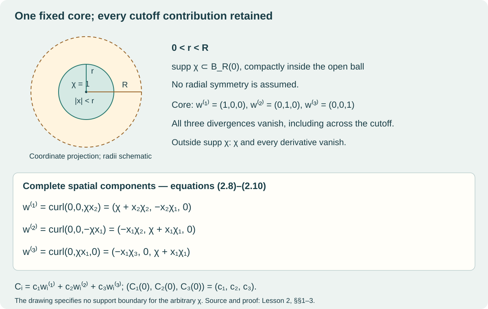

# Compact-support profiles, curvature and source

Lesson 2 · Geometry and states in Yang–Mills theory

The three quaternionic colour maps from Lesson 1 now become coefficients of
spatial fields. We will construct those fields, calculate their curvature and
source throughout the cutoff region, and find their complete energy. The
calculation will also tell us what the static source prescribes as an initial
acceleration.

On a narrow screen, wide equations and diagrams can be scrolled horizontally.

The starting algebra is [Lesson 1](../quaternionic-colour-maps.html).
We use its bracket \([v,w]=vw-wv=2v\times w\) on
\(\operatorname{Im}\mathbb H\), its Euclidean inner product, and its exact
matrix map

\[
 \varphi(\mathbf i)=2T_1,\qquad
 \varphi(\mathbf j)=2T_2,\qquad
 \varphi(\mathbf k)=2T_3,\qquad T_a=-i_{\mathbb C}\sigma_a/2.
 \tag{2.1}
\]

In particular,

\[
 \varphi([v,w])=[\varphi(v),\varphi(w)],\qquad
 |\varphi(v)|_{\mathrm{mat}}^2
 :=-2\operatorname{tr}(\varphi(v)^2)=4|v|^2.
 \tag{2.2}
\]

The factor \(4\) will remain in the energy calculation. Spatial differentiation
uses ordinary smooth real functions, the product rule, the chain rule and
integration by parts. All constructions specific to this lesson are proved
below. No evolution or quantum-state theorem is needed for these calculations.

## 1. A cutoff with its support specified

Fix two real numbers \(0<r<R\). Write
\(B_r(0)=\{x\in\mathbb R^3:|x|<r\}\), with the Euclidean metric and the
orientation \(dx_1\wedge dx_2\wedge dx_3\). Choose

\[
 \chi\in C_c^\infty(\mathbb R^3),\qquad
 \chi=1\text{ on }B_r(0),\qquad
 \operatorname{supp}\chi\subset B_R(0).
 \tag{2.3}
\]

Here support is the closure of the set on which the function is nonzero.
The subscript \(c\) says that this closed set is compact. We impose no radial
symmetry or parity condition on the chosen \(\chi\).

There really are functions satisfying (2.3). The following example proves
existence without changing the general choice used later. Set

\[
 \eta(u)=
 \begin{cases}e^{-1/u},&u>0,\\0,&u\le0,\end{cases}
 \qquad \rho=(r+R)/2,
 \tag{2.4}
\]

and define

\[
 \chi_{\mathrm{ex}}(x)=
 \frac{\eta(\rho^2-|x|^2)}
 {\eta(\rho^2-|x|^2)+\eta(|x|^2-r^2)}.
 \tag{2.5}
\]

For \(u>0\), each derivative of \(\eta\) is a polynomial in \(1/u\) times
\(e^{-1/u}\). This follows by induction using the product and chain rules.
For every nonnegative integer \(N\),
\(u^{-N}e^{-1/u}\to0\) as \(u\downarrow0\): put \(v=1/u\) and use
\(e^v\ge v^{N+1}/(N+1)!\). Thus the right-hand limits of every derivative
are zero, matching the derivatives on \(u<0\). This proves smoothness of
\(\eta\) across zero.

The denominator in (2.5) is positive everywhere. If \(|x|^2\le r^2\), its
first term is positive. If \(|x|^2\ge\rho^2\), its second term is positive.
Between these values both terms are positive. Consequently (2.5) is smooth,
equals one for \(|x|\le r\), and vanishes for \(|x|\ge\rho\). Its support
lies in \(\overline{B_\rho(0)}\subset B_R(0)\), as required. Using
\(\rho<R\) keeps the support strictly inside the original open ball.

For the rest of the lesson retain the arbitrary \(\chi\) in (2.3). We use

\[
 \chi_i=\partial_i\chi,\quad
 \chi_{ij}=\partial_i\partial_j\chi,\quad
 \chi_{ijk}=\partial_i\partial_j\partial_k\chi.
 \tag{2.6}
\]

These derivatives commute because \(\chi\) is smooth. One direct reason is
that the integral of \(\partial_i\partial_j\chi\) over a coordinate rectangle,
computed by two applications of the fundamental theorem of calculus, is the
same four-corner difference as the integral of \(\partial_j\partial_i\chi\).
Divide by the area and shrink the rectangle; continuity gives equality at
its centre. Repeat for higher derivatives.

## 2. Three curls and every coordinate

For a vector field \(v=(v_1,v_2,v_3)\), use

\[
 \nabla\times v=
 (\partial_2v_3-\partial_3v_2,\
  \partial_3v_1-\partial_1v_3,\
  \partial_1v_2-\partial_2v_1).
 \tag{2.7}
\]

Define the original three fields by

\[
 \begin{aligned}
 w^{(1)}&=\nabla\times(0,0,\chi x_2),\\
 w^{(2)}&=\nabla\times(0,0,-\chi x_1),\\
 w^{(3)}&=\nabla\times(0,\chi x_1,0).
 \end{aligned}
 \tag{2.8}
\]

The product rule gives all nine components:

\[
 \begin{aligned}
 w^{(1)}&=(\chi+x_2\chi_2,\ -x_2\chi_1,\ 0),\\
 w^{(2)}&=(-x_1\chi_2,\ \chi+x_1\chi_1,\ 0),\\
 w^{(3)}&=(-x_1\chi_3,\ 0,\ \chi+x_1\chi_1).
 \end{aligned}
 \tag{2.9}
\]

Every term is smooth. Outside \(\operatorname{supp}\chi\), the function
\(\chi\) vanishes on a neighbourhood, so every derivative there vanishes.
It follows that
\(\operatorname{supp}w^{(a)}\subset\operatorname{supp}\chi\).
Differentiating (2.9) gives the divergence identities with their cancelling
terms visible:

\[
 \begin{aligned}
 \sum_i\partial_iw_i^{(1)}
  &=\chi_1+x_2\chi_{12}-\chi_1-x_2\chi_{21}+0=0,\\
 \sum_i\partial_iw_i^{(2)}
  &=-\chi_2-x_1\chi_{12}+\chi_2+x_1\chi_{21}+0=0,\\
 \sum_i\partial_iw_i^{(3)}
  &=-\chi_3-x_1\chi_{13}+0+\chi_3+x_1\chi_{31}=0.
 \end{aligned}
 \tag{2.10}
\]

On \(B_r(0)\), all derivatives of \(\chi\) vanish. Thus

\[
 w^{(1)}=(1,0,0),\qquad
 w^{(2)}=(0,1,0),\qquad
 w^{(3)}=(0,0,1)\qquad (|x|<r).
 \tag{2.11}
\]

This also proves linear independence. If
\(\sum_a t_aw^{(a)}=0\) as a field, evaluate at \(x=0\); its three
components are \(t_1,t_2,t_3\), hence all vanish.

The Euclidean metric identifies \(w^{(a)}\) with
\(\sum_iw_i^{(a)}dx_i\). This is the stated vector-to-one-form map;
it does not change the components.

*The drawing uses a coordinate projection of the balls. The formulas, rather
than the drawn lengths, specify the radii and support. The core values are
(2.11); every cutoff contribution is retained in (2.9).*

## 3. The complete 24-dimensional input reaches spatial fields

Use the same ordered real representation as Lesson 1:

\[
 W=\mathbb R^5_{\mathrm{triv}}
 \oplus\operatorname{Im}\mathbb H_{\mathrm{Ad}}
 \oplus\mathbb H_{q,1}\oplus\mathbb H_{q,2}
 \oplus\mathbb H_{p,1}\oplus\mathbb H_{p,2}.
 \tag{2.12}
\]

An input is \((z,v;\alpha,\beta;\gamma,\delta)\), of real dimension
\(5+3+4+4+4+4=24\). Put

\[
 c_1=\alpha\mathbf i\bar\alpha,\qquad
 c_2=\beta\mathbf j\bar\beta,\qquad
 c_3=\gamma\mathbf k\bar\gamma,
 \qquad C_i(x)=\sum_{a=1}^3c_aw_i^{(a)}(x).
 \tag{2.13}
\]

The letters \(c_a\) are colour coefficients; the index \(i\) labels a spatial
component. Each \(c_a\) is constant as a function of \(x\). In particular,

\[
 \begin{aligned}
 C_1&=c_1(\chi+x_2\chi_2)+c_2(-x_1\chi_2)+c_3(-x_1\chi_3),\\
 C_2&=c_1(-x_2\chi_1)+c_2(\chi+x_1\chi_1)+c_3\,0,\\
 C_3&=c_1\,0+c_2\,0+c_3(\chi+x_1\chi_1).
 \end{aligned}
 \tag{2.14}
\]

Let \(\mathcal V_{\mathrm{div},R}\) be the real vector space of smooth,
compactly supported, divergence-free vector fields with support in
\(\overline{B_R(0)}\). We have constructed a map

\[
 \mathcal M:W\longrightarrow
 \operatorname{Im}\mathbb H\otimes\mathcal V_{\mathrm{div},R},\qquad
 \mathcal M(z,v;\alpha,\beta;\gamma,\delta)
 =\sum_a c_a\otimes w^{(a)}.
 \tag{2.15}
\]

**Theorem 3.1.** The map (2.15) is smooth, quadratic and equivariant. Its image
is the full nine-dimensional space

\[
 \left\{\sum_{a=1}^3c_a\otimes w^{(a)}:
                  (c_1,c_2,c_3)\in(\operatorname{Im}\mathbb H)^3\right\}.
 \tag{2.16}
\]

Its zero set is exactly

\[
 \mathbb R^5_{\mathrm{triv}}\oplus\operatorname{Im}\mathbb H_{\mathrm{Ad}}
 \oplus0_{q,1}\oplus0_{q,2}\oplus0_{p,1}\oplus\mathbb H_{p,2}.
 \tag{2.17}
\]

This subspace has real dimension \(12\). If exactly \(m\) of
\(\alpha,\beta,\gamma\) are nonzero, the derivative has rank \(3m\) and
kernel dimension \(24-3m\).

**Proof.** Define a real-linear map
\(L(c_1,c_2,c_3)=\sum_a c_a\otimes w^{(a)}\). Evaluation at the origin,
taking the three spatial components, is an explicit left inverse:

\[
 (C_1(0),C_2(0),C_3(0))=(c_1,c_2,c_3).
 \tag{2.18}
\]

Thus \(L\) is injective. The map \(\mathcal M\) is exactly \(LQ\), where
\(Q\) is the onto quadratic map of Lesson 1, Theorem 6.1. Its image is
therefore (2.16), and injectivity of \(L\) gives
\(\ker D\mathcal M=\ker DQ\) at every original input.
The zero set and all four ranks now follow from that theorem, including the
twelve \(z,v,\delta\) directions which remain in the domain.

For completeness, the group action fixes \(z\), conjugates \(v\), and
left-multiplies each of \(\alpha,\beta,\gamma,\delta\) by the same unit
quaternion \(u\). Since
\((u\alpha)e\overline{u\alpha}=u(\alpha e\bar\alpha)\bar u\),
each \(c_a\), and hence every \(C_i(x)\), is conjugated by \(u\).
This is the required equivariance. The target coefficients are smooth
quadratic polynomials in the input, proving smoothness and degree. \(\square\)

This lesson proves the map in the original fibre coordinates. Its constant
colour-change identity is exactly what the next bundle lesson will use to
glue the local formulas. No global colour frame has been chosen here.

## 4. Curvature throughout the cutoff region

The quaternionic spatial curvature and its matrix counterpart are

\[
 \mathcal F_{ij}
 =\partial_iC_j-\partial_jC_i+[C_i,C_j],
 \qquad F_{ij}=\varphi(\mathcal F_{ij}).
 \tag{2.19}
\]

For each \(i<j\) and \(a<b\), define

\[
 H^a_{ij}=\partial_iw_j^{(a)}-\partial_jw_i^{(a)},\qquad
 W^{ab}_{ij}=w_i^{(a)}w_j^{(b)}-w_i^{(b)}w_j^{(a)}.
 \tag{2.20}
\]

When needed with other index orders, retain
\(H^a_{ji}=-H^a_{ij}\), \(W^{ab}_{ji}=-W^{ab}_{ij}\), and the zero
diagonal values. Then the exact curvature is

\[
 \mathcal F_{ij}
 =\sum_{a=1}^3 c_aH^a_{ij}
       +\sum_{1\le a<b\le3}[c_a,c_b]W^{ab}_{ij}.
 \tag{2.21}
\]

To prove this, expand \([C_i,C_j]\) as the ordered double sum
\(\sum_{a,b}[c_a,c_b]w_i^{(a)}w_j^{(b)}\).
The \(a=b\) terms are zero. Pairing its \((a,b)\) and \((b,a)\) terms gives
precisely the two products in (2.20). The derivative part follows directly
from (2.13).

All nine derivative coefficients are as follows:

\[
 \begin{array}{c|ccc}
 &H^1&H^2&H^3\\ \hline
 12&-2\chi_2-x_2(\chi_{11}+\chi_{22})
    &2\chi_1+x_1(\chi_{11}+\chi_{22})&x_1\chi_{23}\\
 13&-\chi_3-x_2\chi_{23}&x_1\chi_{23}
    &2\chi_1+x_1(\chi_{11}+\chi_{33})\\
 23&x_2\chi_{13}&-\chi_3-x_1\chi_{13}
    &\chi_2+x_1\chi_{12}.
 \end{array}
 \tag{2.22}
\]

For example, its first entry follows from

\[
 \partial_1(-x_2\chi_1)-\partial_2(\chi+x_2\chi_2)
 =-x_2\chi_{11}-2\chi_2-x_2\chi_{22}.
\]

Applying the same two derivatives in (2.20) gives each other entry.

Here are all nine minors as their original two products, including zeros:

\[
 \begin{aligned}
 W^{12}_{12}
  &=(\chi+x_2\chi_2)(\chi+x_1\chi_1)
                      -(-x_1\chi_2)(-x_2\chi_1),\\
 W^{13}_{12}
  &=(\chi+x_2\chi_2)\,0-(-x_1\chi_3)(-x_2\chi_1),\\
 W^{23}_{12}
  &=(-x_1\chi_2)\,0-(-x_1\chi_3)(\chi+x_1\chi_1).
 \end{aligned}
 \tag{2.23}
\]

\[
 \begin{aligned}
 W^{12}_{13}
  &=(\chi+x_2\chi_2)\,0-(-x_1\chi_2)\,0,\\
 W^{13}_{13}
  &=(\chi+x_2\chi_2)(\chi+x_1\chi_1)-(-x_1\chi_3)\,0,\\
 W^{23}_{13}
  &=(-x_1\chi_2)(\chi+x_1\chi_1)-(-x_1\chi_3)\,0.
 \end{aligned}
 \tag{2.24}
\]

\[
 \begin{aligned}
 W^{12}_{23}
  &=(-x_2\chi_1)\,0-(\chi+x_1\chi_1)\,0,\\
 W^{13}_{23}
  &=(-x_2\chi_1)(\chi+x_1\chi_1)-0\,0,\\
 W^{23}_{23}
  &=(\chi+x_1\chi_1)(\chi+x_1\chi_1)-0\,0.
 \end{aligned}
 \tag{2.25}
\]

Equations (2.21)–(2.25) give every curvature component for every original
input. Derivative curvature in the cutoff region remains present even when
all three colour coefficients commute.

## 5. The full static source

For a quaternion-valued function \(V\), set

\[
 D_iV=\partial_iV+[C_i,V],\qquad
 S_j=\sum_{i=1}^3D_i\mathcal F_{ij}.
 \tag{2.26}
\]

The four complete groups of terms obtained from (2.21) are

\[
 \begin{aligned}
 S_j={}&
 \sum_a c_a\sum_i\partial_iH^a_{ij}\\
 &+\sum_{a<b}[c_a,c_b]\sum_i\partial_iW^{ab}_{ij}\\
 &+\sum_{d,a}[c_d,c_a]\sum_iw_i^{(d)}H^a_{ij}\\
 &+\sum_{\substack{d\\a<b}}[c_d,[c_a,c_b]]
                                      \sum_iw_i^{(d)}W^{ab}_{ij}.
 \end{aligned}
 \tag{2.27}
\]

The sums \(a,d,i\) each range from \(1\) to \(3\); \(a<b\) ranges over
\((1,2),(1,3),(2,3)\). No derivative acts on a \(c_a\).
In particular the derivative of each minor means all four product-rule terms:

\[
 \begin{aligned}
 \partial_iW^{ab}_{ij}
 ={}&(\partial_iw_i^{(a)})w_j^{(b)}
      +w_i^{(a)}(\partial_iw_j^{(b)})\\
    &-(\partial_iw_i^{(b)})w_j^{(a)}
      -w_i^{(b)}(\partial_iw_j^{(a)}).
 \end{aligned}
 \tag{2.28}
\]

The first line of (2.27) also has an exact useful comparison:

\[
 \sum_i\partial_iH^a_{ij}
 =\sum_i\partial_i^2w_j^{(a)}
       -\partial_j\left(\sum_i\partial_iw_i^{(a)}\right)
 =\Delta w_j^{(a)}-\partial_j0.
 \tag{2.29}
\]

Here (2.10) proves the displayed zero. Every Laplacian component can be read
without differentiating a hidden abbreviation:

\[
 \begin{aligned}
 \Delta w^{(1)}
 &=\bigl(\Delta\chi+2\chi_{22}+x_2\partial_2\Delta\chi,\
          -2\chi_{12}-x_2\partial_1\Delta\chi,\ 0\bigr),\\
 \Delta w^{(2)}
 &=\bigl(-2\chi_{12}-x_1\partial_2\Delta\chi,\
          \Delta\chi+2\chi_{11}+x_1\partial_1\Delta\chi,\ 0\bigr),\\
 \Delta w^{(3)}
 &=\bigl(-2\chi_{13}-x_1\partial_3\Delta\chi,\ 0,\
          \Delta\chi+2\chi_{11}+x_1\partial_1\Delta\chi\bigr),
 \quad \Delta\chi=\chi_{11}+\chi_{22}+\chi_{33}.
 \end{aligned}
 \tag{2.30}
\]

For instance,
\(\Delta(x_k f)=x_k\Delta f+2\partial_kf\), since the second derivative
of \(x_k\) is zero. Applying this identity to each product in (2.9) proves
(2.30), including every third derivative within \(\partial_i\Delta\chi\).
All expressions in (2.27) are smooth and supported in
\(\operatorname{supp}\chi\).

To compare the source with spacetime notation, use \(s=ct\), \(c>0\), and
the metric \(\operatorname{diag}(-1,1,1,1)\) in the coordinates
\((s,x_1,x_2,x_3)\). For the time-independent potential with \(C_0=0\),
\(\mathcal F_{0j}=0\). Its full physical matrix source, in the convention
\(D^\mu F_{\mu\nu}=g^2J_\nu\), is

\[
 J_0=0,\qquad J_j=\frac1{g^2}\varphi(S_j),\qquad g>0.
 \tag{2.31}
\]

This keeps the coupling in the source itself.

## 6. Why the source is covariantly conserved

The source (2.26) satisfies

\[
 \sum_jD_jS_j=0.
 \tag{2.32}
\]

We prove this identity rather than infer it from the ordinary divergence of
\(C\). Expanding two covariant derivatives on any smooth \(V\) gives

\[
 (D_iD_j-D_jD_i)V=[\mathcal F_{ij},V].
 \tag{2.33}
\]

Indeed the mixed ordinary derivatives cancel, the derivatives of \(V\)
in the cross terms cancel, and the remaining terms are
\([\partial_iC_j-\partial_jC_i,V]
 +[C_i,[C_j,V]]-[C_j,[C_i,V]]\).
Expanding the last two commutators in the associative quaternion algebra
leaves \([[C_i,C_j],V]\), proving (2.33).

Now exchange the two indices in the full ordered sum:

\[
 \begin{aligned}
 2\sum_jD_jS_j
 &=\sum_{i,j}(D_jD_i-D_iD_j)\mathcal F_{ij}\\
 &=\sum_{i,j}[\mathcal F_{ji},\mathcal F_{ij}]=0.
 \end{aligned}
 \tag{2.34}
\]

The last equality holds term by term because
\(\mathcal F_{ji}=-\mathcal F_{ij}\). In ordinary derivatives (2.32) reads

\[
 \sum_j\partial_jS_j+\sum_j[C_j,S_j]=0.
 \tag{2.35}
\]

It includes the second sum. It does not say that either sum separately
vanishes, nor that \(S\) is zero.

## 7. Energy with all cutoff coefficients

At zero electric field, the physical energy of the profile is

\[
 \mathscr E_g
 =\frac1{2g^2}\int_{\mathbb R^3}
          \sum_{i<j}|\varphi(\mathcal F_{ij})|_{\mathrm{mat}}^2\,d^3x
 =\frac2{g^2}\int_{\mathbb R^3}
          \sum_{i<j}|\mathcal F_{ij}|^2\,d^3x.
 \tag{2.36}
\]

The second equality is exactly (2.2). The integrals are finite because all
curvature components are smooth with compact support. Define the original
cutoff coefficients, with each indicated index range retained:

\[
 \begin{aligned}
 I_{ab}
 &=\int_{\mathbb R^3}\sum_{i<j}H^a_{ij}H^b_{ij}\,d^3x
                                           &&(1\le a,b\le3),\\
 J_{a,bc}
 &=\int_{\mathbb R^3}\sum_{i<j}H^a_{ij}W^{bc}_{ij}\,d^3x
                                           &&(1\le a\le3,\ b<c),\\
 K_{ab,cd}
 &=\int_{\mathbb R^3}\sum_{i<j}W^{ab}_{ij}W^{cd}_{ij}\,d^3x
                                           &&(a<b,\ c<d).
 \end{aligned}
 \tag{2.37}
\]

The symbol \(J_{a,bc}\) denotes an energy coefficient in this display; the
spacetime source has one index \(J_\nu\), as in (2.31).
Squaring (2.21), using the real quaternionic inner product, gives

\[
 \begin{aligned}
 \mathscr E_g
 =\frac2{g^2}\bigg[
 &\sum_{a,b}\langle c_a,c_b\rangle I_{ab}\\
 &+2\sum_{a,\ b<c}\langle c_a,[c_b,c_c]\rangle J_{a,bc}\\
 &+\sum_{a<b,\ c<d}
       \langle[c_a,c_b],[c_c,c_d]\rangle K_{ab,cd}
 \bigg].
 \end{aligned}
 \tag{2.38}
\]

This is an equality, not a core approximation. Its three lines have degrees
four, six and eight in the original selected quaternionic coordinates,
because each \(c_a\) is quadratic. We have not assumed any symmetry of
\(\chi\), and every mixed \(J_{a,bc}\) term remains. Although a mixed term
can have either sign, the complete expression is nonnegative by (2.36).

**Theorem 7.1.** On the full input (2.12), \(\mathscr E_g=0\) exactly on
the twelve-dimensional subspace (2.17).

**Proof.** If \(\alpha=\beta=\gamma=0\), then every \(C_i\) and every
\(\mathcal F_{ij}\) is zero, so the energy is zero.
Conversely, (2.36) is the integral of a continuous nonnegative function.
If its integral is zero and its value were positive at some point,
continuity would give a ball of positive integral. Therefore
\(\mathcal F_{ij}=0\) everywhere.

We now prove the needed implication from flatness to vanishing in the
original gauge. For any smooth compactly supported quaternionic field \(C\)
with \(\sum_i\partial_iC_i=0\) and \(\mathcal F_{ij}=0\), form

\[
 T_{ij}=\langle C_i,C_j\rangle
       -\frac12\delta_{ij}\sum_k|C_k|^2.
 \tag{2.39}
\]

Differentiation, including the derivative of its second term, gives

\[
 \begin{aligned}
 \sum_i\partial_iT_{ij}
 &=\left\langle\sum_i\partial_iC_i,C_j\right\rangle
     +\sum_i\langle C_i,\partial_iC_j\rangle
     -\sum_k\langle C_k,\partial_jC_k\rangle\\
 &=\sum_i\langle C_i,\partial_iC_j-\partial_jC_i\rangle\\
 &=-\sum_i\langle C_i,[C_i,C_j]\rangle=0.
 \end{aligned}
 \tag{2.40}
\]

The last inner products are zero since \([C_i,C_j]=2C_i\times C_j\)
is perpendicular to \(C_i\).
Let \(V_i=\sum_jx_jT_{ij}\). This is a smooth compactly supported
ordinary vector field, and

\[
 \sum_i\partial_iV_i
 =\sum_iT_{ii}+\sum_jx_j\sum_i\partial_iT_{ij}
 =-\frac12\sum_i|C_i|^2.
 \tag{2.41}
\]

Integrate on a box containing the support in its interior. The fundamental
theorem of calculus in each coordinate makes the integral of
\(\partial_iV_i\) equal to its two boundary-face integrals; both are zero.
Thus (2.41) has integral zero, forcing \(C=0\) everywhere by the same
nonnegativity argument. Finally, (2.18) gives \(c_1=c_2=c_3=0\), and
\(|a e\bar a|=|a|^2\) for each unit \(e\) gives
\(\alpha=\beta=\gamma=0\). The coordinates \(z,v,\delta\) remain
unrestricted. \(\square\)

The argument includes nonzero commuting colours. Their constant core can be
flat while their cutoff region still has positive energy.

## 8. The three-colour core and its complete source

Choose \(\alpha=\beta=\gamma=1\), keeping \(z,v,\delta\) arbitrary.
Then \(c_1=\mathbf i,c_2=\mathbf j,c_3=\mathbf k\). On the original
ball \(B_r(0)\), (2.11) makes \(C_i=c_i\). Consequently all derivative
terms vanish there and

\[
 \mathcal F_{12}=2\mathbf k,\quad
 \mathcal F_{23}=2\mathbf i,\quad
 \mathcal F_{31}=2\mathbf j,\qquad
 (F_{12},F_{23},F_{31})=(4T_3,4T_1,4T_2).
 \tag{2.42}
\]

The matrix magnetic density, before the energy factor \(1/(2g^2)\), is

\[
 \sum_{i<j}|F_{ij}|_{\mathrm{mat}}^2
 =16+16+16=48.
 \tag{2.43}
\]

For example,
\(-2\operatorname{tr}((4T_3)^2)=16\), since
\(-2\operatorname{tr}(T_3^2)=1\). The same computation gives the other
two terms. Hence the core supplies the precise lower bound

\[
 \mathscr E_g
 \ge\frac{48}{2g^2}\operatorname{vol}(B_r(0))
 =\frac{32\pi r^3}{g^2}.
 \tag{2.44}
\]

The annulus contribution is still in (2.38). It has not been replaced by this
lower bound.

The three source components in the core are

\[
 \begin{aligned}
 S_1&=[\mathbf i,0]+[\mathbf j,-2\mathbf k]
                           +[\mathbf k,2\mathbf j]=-8\mathbf i,\\
 S_2&=[\mathbf i,2\mathbf k]+[\mathbf j,0]
                           +[\mathbf k,-2\mathbf i]=-8\mathbf j,\\
 S_3&=[\mathbf i,-2\mathbf j]+[\mathbf j,2\mathbf i]
                           +[\mathbf k,0]=-8\mathbf k.
 \end{aligned}
 \tag{2.45}
\]

Thus (2.31) becomes

\[
 J_0=0,\qquad
 (J_1,J_2,J_3)=-\frac{16}{g^2}(T_1,T_2,T_3).
 \tag{2.46}
\]

These are nonzero sources. Covariant conservation (2.32) is consistent
with them: each core term \([C_i,S_i]=[e_i,-8e_i]\) is zero. The full
cutoff calculation, including its spatial derivatives, remains (2.27).

## 9. Using the source as an initial acceleration

Here is a concrete next step based on the source we just calculated. Let
\(A_0=0\) and allow the quaternionic spatial potential to depend on
\(s=ct\). With the same Lorentz metric as before,
\(\mathcal F_{0j}=\partial_sA_j\) and
\(D^0\mathcal F_{0j}=-\partial_s^2A_j\). The source-free equations in
this gauge therefore read

\[
 \sum_iD_i^A\partial_sA_i=0,\qquad
 \partial_s^2A_j=\sum_iD_i^A\mathcal F_{ij}(A),
 \qquad D_i^A=\partial_i+[A_i,\,\cdot\,].
 \tag{2.47}
\]

The first is Gauss's equation; it is the \(\nu=0\) component after
\(\mathcal F_{i0}=-\partial_sA_i\). At data
\(A(0,x)=C(x)\), \(\partial_sA(0,x)=0\), that equation is satisfied,
and the second prescribes

\[
 \partial_s^2A_j(0,x)=S_j(x),
 \qquad \partial_t^2A_j(0,x)=c^2S_j(x).
 \tag{2.48}
\]

We can implement this initial acceleration as an explicit smooth path:

\[
 A_i(s,x)=C_i(x)+\frac{s^2}{2}S_i(x),\qquad A_0=0.
 \tag{2.49}
\]

It has the original compact spatial support and finite energy at every
fixed \(s\): its electric field is \(sS\), and its curvature is a finite
sum of smooth compactly supported terms. It satisfies Gauss's equation
for every real \(s\), because

\[
 \sum_iD_i^A(sS_i)
 =s\sum_iD_iS_i+\frac{s^3}{2}\sum_i[S_i,S_i]=0.
 \tag{2.50}
\]

The first zero is (2.32); the second consists of zero commutators. To find
what remains of the evolution equation, keep the complete tensors

\[
 \begin{aligned}
 B_{ij}&=D_iS_j-D_jS_i,& C_{ij}&=[S_i,S_j],\\
 L_j&=\sum_i\bigl(D_iB_{ij}+[S_i,\mathcal F_{ij}]\bigr),\\
 Q_j&=\sum_i\bigl(D_iC_{ij}+[S_i,B_{ij}]\bigr),\\
 N_j&=\sum_i[S_i,C_{ij}].
 \end{aligned}
 \tag{2.51}
\]

The original \(C_i\) is the potential; \(C_{ij}\) in this equation is the
two-index tensor explicitly defined on its first line. Every \(D_i\) in
(2.51) is formed from the original \(C\).
The residual of the full source-free equation along (2.49) is exactly

\[
 D_A^\mu\mathcal F_{\mu j}(A)
 =\frac{s^2}{2}L_j+\frac{s^4}{4}Q_j+\frac{s^6}{8}N_j.
 \tag{2.52}
\]

To check all powers, first put \(\tau=s^2/2\). Expansion of the curvature
and its spatial divergence gives

\[
 \begin{aligned}
 \mathcal F_{ij}(C+\tau S)
   &=\mathcal F_{ij}+\tau B_{ij}+\tau^2C_{ij},\\
 \sum_iD_i^{C+\tau S}\mathcal F_{ij}(C+\tau S)
   &=S_j+\tau L_j+\tau^2Q_j+\tau^3N_j.
 \end{aligned}
 \tag{2.53}
\]

The temporal term is \(-\partial_s^2A_j=-S_j\). Adding it cancels the
displayed constant term and leaves every term in (2.52).
This computes what the first correction achieves and what it leaves.
Exercise 7 evaluates the residual on the core, where it is explicitly
nonzero for small nonzero \(s\). A later lesson constructs the actual
source-free classical evolution with the original cutoff region retained.

## 10. Exercises with complete solutions

### Exercise 1. Check a derivative across the cutoff

Use the third field in (2.9) to compute \(H^3_{23}\) and
\(\sum_i\partial_iw_i^{(3)}\). Identify every product-rule contribution.

**Solution.** Its second component is zero and its third is
\(\chi+x_1\chi_1\). Thus

\[
 H^3_{23}
 =\partial_2(\chi+x_1\chi_1)-\partial_3(0)
 =\chi_2+x_1\chi_{21}-0.
\]

Since \(\chi_{21}=\chi_{12}\), this is (2.22). Its divergence is

\[
 \partial_1(-x_1\chi_3)+\partial_2(0)
       +\partial_3(\chi+x_1\chi_1)
 =-\chi_3-x_1\chi_{13}+0+\chi_3+x_1\chi_{31}=0.
\]

The undifferentiated \(\chi_3\) terms are needed for the cancellation.

### Exercise 2. A commuting field with positive energy

Take \(c_1=v\ne0\), \(c_2=c_3=0\), where
\(v\in\operatorname{Im}\mathbb H\). Calculate its curvature and source.
Prove that its energy is positive even though its core curvature is zero.

**Solution.** All commutator terms vanish, but the derivative terms give

\[
 \mathcal F_{ij}=vH^1_{ij},\qquad
 S_j=v\Delta w_j^{(1)},\qquad
 \mathscr E_g=\frac{2|v|^2}{g^2}
                      \int\sum_{i<j}(H^1_{ij})^2\,d^3x.
\]

For any real smooth compactly supported vector field \(w\), expanding the
square and integrating the cross term by parts twice yields

\[
 \begin{aligned}
 \int\sum_{i<j}(\partial_iw_j-\partial_jw_i)^2
 &=\int\sum_{i,j}(\partial_iw_j)^2
                      -\int\sum_{i,j}\partial_iw_j\,\partial_jw_i\\
 &=\int\sum_{i,j}(\partial_iw_j)^2
                      -\int\left(\sum_i\partial_iw_i\right)^2.
 \end{aligned}
\]

For \(w=w^{(1)}\), the last term is zero. If the first were zero, all
first derivatives would vanish everywhere; integrating along line segments
would make \(w^{(1)}\) constant. Compact support would force that constant
to be zero, contradicting \(w^{(1)}=(1,0,0)\) on \(B_r\).
Therefore the energy is positive. On the core every \(H^1_{ij}\) is zero,
so the required energy is supplied outside the core.

### Exercise 3. Retain the unused directions

At \((z,v;0,1;2\mathbf i,\delta)\), find the rank and kernel dimension
of \(D\mathcal M\), without setting any unused coordinate to zero.

**Solution.** Exactly \(\beta,\gamma\) are nonzero, so the rank is
\(3+3=6\). The kernel includes all \(5+3+4=12\) directions of
\(z,v,\delta\), all four \(\alpha\) directions, and one direction in each
of the two nonzero quaternionic slots. The latter lines are
\(\mathbb R(\beta\mathbf j)=\mathbb R\mathbf j\) and
\(\mathbb R(\gamma\mathbf k)=\mathbb R(-2\mathbf j)\), in their distinct
domain slots. Thus the kernel dimension is \(12+4+1+1=18\).
Their image slots are independent by the evaluation map (2.18).

### Exercise 4. Recover the coefficients and an exact norm bound

For a field in (2.16), recover its three coefficients and prove

\[
 \int_{\mathbb R^3}\sum_i|C_i(x)|^2\,d^3x
 \ge\frac{4\pi r^3}{3}\sum_a|c_a|^2.
\]

**Solution.** Equation (2.18) recovers each coefficient separately. On
\(B_r\), the integrand is exactly \(\sum_a|c_a|^2\). The integral
outside the ball is nonnegative, giving the stated constant.
The exact full expression, retaining that exterior contribution, is

\[
 \int\sum_i|C_i|^2
 =\sum_{a,b}\langle c_a,c_b\rangle
                    \int\sum_iw_i^{(a)}w_i^{(b)}.
\]

All nine entries of this spatial Gram matrix remain; the bound does not
replace the matrix by a scalar.

### Exercise 5. Keep both physical factors

For the equal-colour core, find the matrix magnetic density, the core
energy contribution and the physical matrix source. Which of these includes
the factor \(1/g^2\)?

**Solution.** The three matrix curvatures in (2.42) have squared norms
\(16,16,16\), so the magnetic density is \(48\).
The energy definition includes \(1/(2g^2)\), giving core density \(24/g^2\)
and integral \(32\pi r^3/g^2\). The full energy also includes the cutoff
region. The source definition is \(D^\mu F_{\mu\nu}=g^2J_\nu\);
since \(\varphi(S_j)=-16T_j\), it gives
\(J_j=-16T_j/g^2\), with \(J_0=0\). Both energy and physical source
retain their stated coupling factors; the curvature density itself does not
contain the coupling.

### Exercise 6. Scale the actual quaternionic input

Multiply the three selected coordinates \(\alpha,\beta,\gamma\) by a real
number \(h\), leaving \(z,v,\delta\) untouched. Give the complete scaled
curvature, energy and source degrees.

**Solution.** Conjugation is real-linear, so each coefficient becomes
\(h^2c_a\). Hence

\[
 \mathcal F_{ij}^{(h)}
 =h^2\sum_a c_aH^a_{ij}
       +h^4\sum_{a<b}[c_a,c_b]W^{ab}_{ij},
\]

and

\[
 \begin{aligned}
 \mathscr E_g^{(h)}=\frac2{g^2}\bigg[
 &h^4\sum_{a,b}\langle c_a,c_b\rangle I_{ab}\\
 &+2h^6\sum_{a,\ b<c}\langle c_a,[c_b,c_c]\rangle J_{a,bc}\\
 &+h^8\sum_{a<b,\ c<d}
      \langle[c_a,c_b],[c_c,c_d]\rangle K_{ab,cd}\bigg].
 \end{aligned}
\]

In (2.27), the first line acquires \(h^2\), the second and third each
acquire \(h^4\), and the fourth acquires \(h^6\). These statements include
\(h=0\), negative \(h\), all rank strata, and the unchanged twelve unused
coordinates. This is input scaling; no spatial dilation or change of coupling
has been made.

### Exercise 7. Compute the first correction's entire core residual

Evaluate (2.49) and (2.52) at the equal-colour core. Give every coefficient
of its spatial residual and identify the times at which its spatial
curvature vanishes.

**Solution.** Write \((e_1,e_2,e_3)=(\mathbf i,\mathbf j,\mathbf k)\).
Since \(S_j=-8e_j\), the path is

\[
 A_j=(1-4s^2)e_j,\qquad
 \partial_sA_j=-8se_j,\qquad
 \partial_s^2A_j=-8e_j.
\]

For \(f(s)=1-4s^2\), its spatial divergence of curvature is
\(-8f^3e_j\). This follows by factoring the three powers of \(f\) from
\(\sum_i[f e_i,[f e_i,f e_j]]\) and using (2.45). The full residual is

\[
 -\partial_s^2A_j+\sum_iD_i^A\mathcal F_{ij}(A)
 =8\bigl(1-(1-4s^2)^3\bigr)e_j
 =(96s^2-384s^4+512s^6)e_j.
\]

Equivalently, the exact tensors of (2.51) give

\[
 B_{ij}=-16[e_i,e_j],\quad C_{ij}=64[e_i,e_j],\quad
 (L_j,Q_j,N_j)=(192e_j,-1536e_j,4096e_j).
\]

For example \(L_j=(-16-8)\sum_i[e_i,[e_i,e_j]]=192e_j\);
\(Q_j=(64+128)\sum_i[e_i,[e_i,e_j]]=-1536e_j\);
and \(N_j=-512\sum_i[e_i,[e_i,e_j]]=4096e_j\).
Multiplication by \(s^2/2,s^4/4,s^6/8\) reproduces every term above.
The path satisfies Gauss's equation for every \(s\), but this nonzero
residual prevents it from being the source-free evolution.

Its spatial curvature is \(f^2[e_i,e_j]\), so it vanishes at
\(s=\pm1/2\). The electric curvature \(\partial_sA_j=-8se_j\) is
nonzero at those times. Neither these magnetic zeros nor the electric terms
are omitted from the statement.

## 11. Sources and the next maps

The exact spatial fields and domain labels come from the programme's
[corrected bridge, §§7–9](https://github.com/KokunoYumeto/yang-mills-interacting-workbench/blob/c1f29f3e6dfeb20e4be5254ea4fac7578255eacc/yang-mills/continuations/20260930-s6-ns-moment-map-bridge/PROOF.md).
The complete energy polynomial and zero-energy argument are received from the
[Cauchy continuation, CE18–CE23 and Proposition 4.1](https://github.com/KokunoYumeto/yang-mills-interacting-workbench/blob/c1f29f3e6dfeb20e4be5254ea4fac7578255eacc/yang-mills/continuations/20260930-s6-ns-moment-map-bridge/COMPACT_SUPPORT_CAUCHY_EVOLUTION.md).
The initial-acceleration and correction calculations are received from the
[higher-carrier continuation, HC14–HC20](https://github.com/KokunoYumeto/yang-mills-interacting-workbench/blob/c1f29f3e6dfeb20e4be5254ea4fac7578255eacc/yang-mills/continuations/20260930-s6-ns-moment-map-bridge/HIGHER_CARRIER_AND_EVOLUTION.md).
The proofs and teaching exposition needed here have been written out in this
lesson; these citations identify the earlier programme results.

The originating \(S^6\) construction was circulated by Levent Alpöge and
produced with Claude. The
[programme attribution record](https://github.com/KokunoYumeto/yang-mills-interacting-workbench/blob/c1f29f3e6dfeb20e4be5254ea4fac7578255eacc/ATTRIBUTION.md#the-s6-construction-and-the-period-dependent-magnetic-branch)
records that source and its role. The spatial and source calculations taught
here are later programme derivations. This lesson does not attribute them to
the originating geometric manuscript.

The next lesson uses the proved colour-change identity to construct the
associated-bundle map and its higher carrier. Later lessons keep the full
cutoff fields when constructing actual classical evolution and holonomies,
then apply physical gauge projection and the finite-lattice Hamiltonian.
The programme's continuum gapless-state construction remains an active
research target.

Mathematical text, exercises, solutions and original figure: CC0 1.0.
