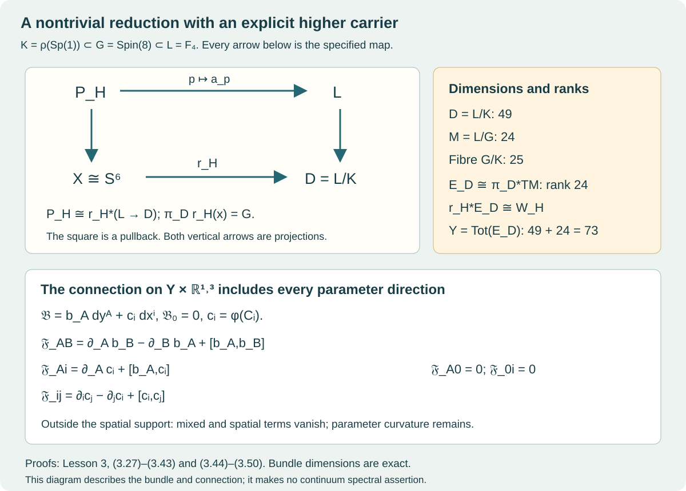

# Bundle descent and the higher carrier

Lesson 3 · Geometry and states in Yang–Mills theory

The colour map of Lesson 1 and the compactly supported fields of Lesson 2
were written in a chosen quaternionic frame. We now follow them through a
change of frame, construct their global bundles, and place those bundles
over the higher carrier \(F_4/\rho(\operatorname{Sp}(1))\). The final
construction is a connection on the parameter space times spacetime.
Its parameter curvature and mixed curvature are calculated explicitly.

Use [Lesson 1](../quaternionic-colour-maps.html) for quaternion multiplication,
the matrix map \(\varphi\), and the complete quadratic-map fibres and ranks.
Use [Lesson 2](../compact-support-profiles.html) for the exact three spatial
curls and their complete curvature, source and energy formulas.

Two earlier geometric results enter here as exact programme providers.
Their content and use are specified so that the dependency can be followed.
First, the retained source constructs the based space \(X\cong S^6\),
its specified map \(H=p_3q_2:X\to S^4\), and a based diffeomorphism
\(d:S^6\to X\), and proves

\[
 [Hd]=\eta_4\eta_5\ne0,\qquad
 \pi_6(S^4)\cong\mathbb Z/2.
 \tag{3.1}
\]

The complete provider is the [retained source, theorem ret:main and its
proof](https://github.com/KokunoYumeto/yang-mills-interacting-workbench/blob/f2f7adf7ab7d08963333f2595237f91f20b53f66/yang-mills/continuations/20260930-s6-ns-moment-map-bridge/sources/higher_rung/s6_higher_rung_24d_preprint.tex#L4618).
Second, its [ordered-frame stabilizer and tangent
construction](https://github.com/KokunoYumeto/yang-mills-interacting-workbench/blob/f2f7adf7ab7d08963333f2595237f91f20b53f66/yang-mills/continuations/20260930-s6-ns-moment-map-bridge/sources/higher_rung/s6_higher_rung_24d_preprint.tex#L2402)
identifies the compact group \(G=\operatorname{Spin}(8)\) as the stabilizer
of an ordered Jordan frame in \(L=F_4\), with dimensions \(28\) and \(52\).
The tangent formulas used below are proved at the same provider's
labels att:eq:D-table through att:eq:bundle-comparison, beginning at
[its explicit tangent construction](https://github.com/KokunoYumeto/yang-mills-interacting-workbench/blob/f2f7adf7ab7d08963333f2595237f91f20b53f66/yang-mills/continuations/20260930-s6-ns-moment-map-bridge/sources/higher_rung/s6_higher_rung_24d_preprint.tex#L2593).
We prove the receiving bundle maps and calculations in this lesson.
The original source map and its period data stay fixed.

## 1. A transition function that can be checked directly

Write \(\operatorname{Sp}(1)=\{u\in\mathbb H:|u|=1\}\), acting on the
right of \(\mathbb H^2\). Quaternionic projective space
\(\mathbb H\mathbb P^1\) consists of its one-dimensional right subspaces.
The map

\[
 S^7\longrightarrow\mathbb H\mathbb P^1,\qquad
 (v_0,v_1)\longmapsto[v_0:v_1],\qquad
 |v_0|^2+|v_1|^2=1
 \tag{3.2}
\]

has a free right \(\operatorname{Sp}(1)\) action. Two unit vectors spanning
the same right line differ by exactly one unit quaternion: the scalar
relating them has norm one, and any nonzero coordinate determines it.

On the two affine charts put \(z=v_1v_0^{-1}\) and \(w=v_0v_1^{-1}\).
These coordinates are unchanged by simultaneous right multiplication.
Their sections and overlap relation are

\[
 \begin{gathered}
 s_0(z)=\frac{(1,z)}{\sqrt{1+|z|^2}},\qquad
 s_\infty(w)=\frac{(w,1)}{\sqrt{1+|w|^2}},\\
 w=z^{-1},\qquad
 s_\infty(z^{-1})=s_0(z)g(z),\qquad
 g(z)=\frac{\bar z}{|z|}\quad(z\ne0).
 \end{gathered}\tag{3.3}
\]

Indeed the right side has coordinates
\((\bar z/|z|,|z|)/\sqrt{1+|z|^2}\).
Substituting \(z^{-1}=\bar z/|z|^2\) into the left side gives exactly
these two coordinates. The order of multiplication and the conjugation
are part of this transition function.

The fixed identification \(\chi:S^4\to\mathbb H\mathbb P^1\) sends
\(z\) to \([1:z]\) and the basepoint at infinity to \([0:1]\).
For the original open four-cell of the source its coordinate is

\[
 z=-\cot(\pi r/\epsilon)
   -\cot(\phi/2)\mathbf i
   -\cot(\pi u_1)\mathbf j
   -\cot(\pi u_2)\mathbf k.
 \tag{3.4}
\]

Here \(r,\phi,u_1,u_2\) are precisely the source's cusp coordinates,
with \(0<r<\epsilon\), \(0<\phi<2\pi\), \(0<u_1,u_2<1\).
The \(r\) in this one formula is the cusp coordinate; the fixed spatial
core radius \(r\) in Lesson 2 is a different datum. Formula (3.4)
preserves all four original coordinate factors and their order.

Define the pullback by an actual set and action:

\[
 P_H=\{(x,v)\in X\times S^7:\pi(v)=\chi(H(x))\},\qquad
 (x,v)u=(x,vu),\qquad P_H\longrightarrow X.
 \tag{3.5}
\]

Composing the sections (3.3) with \(\chi H\) gives local trivializations,
so this is a right principal \(\operatorname{Sp}(1)\) bundle. The
transition on their overlap is exactly \(g(z)\), evaluated at (3.4).

A principal bundle is trivial precisely when it has a continuous global
section. A section \(s(x)\) gives the isomorphism
\((x,u)\mapsto s(x)u\); uniqueness of \(u\) in a principal fibre gives
its inverse in each trivialization. The converse takes \(u=1\) in a
trivialization.

This proves directly that the present bundle is nontrivial. A section of
\(P_H\), composed with \(d\), would lift \(\chi Hd:S^6\to\mathbb H\mathbb P^1\)
to \(S^7\). Every map \(S^6\to S^7\) is null-homotopic: cellular
approximation into the zero-cell of the usual \(0,7\) cell structure gives
this elementary sphere fact. Its composite with \(\pi\) would then be
null-homotopic, contradicting (3.1).

For later use fix the clutching convention
\(\sigma_-=\sigma_+g_{+-}\) on the oriented equator of
\(S^6=D^6_+\cup D^6_-\). The exact sequence of (3.2) contains

\[
 0=\pi_6(S^7)\longrightarrow\pi_6(\mathbb H\mathbb P^1)
 \xrightarrow{\partial}\pi_5(\operatorname{Sp}(1))
 \longrightarrow\pi_5(S^7)=0.
 \tag{3.6}
\]

Both outer vanishings follow from the same cell argument. Its boundary
is the equatorial transition just defined, obtained by lifting over the
two disks. Thus \(\partial\) is an isomorphism and the clutching map of
\(P_H\) is nonzero of order two. This uses the exact topological input
(3.1), not an assumption about a chosen trivialization.

## 2. How coordinates produce an associated bundle

For a left representation \(R\) of \(\operatorname{Sp}(1)\) on a real
vector space \(V\), define

\[
 P_H\times_RV=(P_H\times V)/{\sim},\qquad
 [pu,v]=[p,R(u)v].
 \tag{3.7}
\]

Equivalently \((p,v)\sim(pu,R(u)^{-1}v)\).
If \(s_b=s_au_{ab}\) are two local sections, the same bundle vector has
coordinates related by

\[
 [s_a,v_a]=[s_b,v_b],\qquad
 v_b=R(u_{ab})^{-1}v_a .
 \tag{3.8}
\]

This follows by inserting \(s_b=s_au_{ab}\) in (3.7) and using the
uniqueness of the coordinate in the \(s_a\) trivialization.

An equivariant map \(f:V\to V'\), including a nonlinear map, descends by
\([p,v]\mapsto[p,f(v)]\). The only equality to check is

\[
 [pu,f(v)]=[p,R'(u)f(v)]
          =[p,f(R(u)v)].
 \tag{3.9}
\]

It is exactly equivariance, and proves independence of representatives.
In a local trivialization the descended map is
\((x,v)\mapsto(x,f(v))\), which also proves its smoothness whenever
the bundles and \(f\) are smooth.

For the adjoint action, \(R(u)v=uv\bar u\) on
\(\operatorname{Im}\mathbb H\), write
\(\mathcal A_H=P_H\times_{\operatorname{Ad}}\operatorname{Im}\mathbb H\).
The quaternion norm, orientation and bracket descend. For example

\[
 [uvu^{-1},uwu^{-1}]=u[v,w]u^{-1},\qquad
 |uvu^{-1}|=|v|,\qquad [v,w]=2v\times w.
 \tag{3.10}
\]

Associativity proves the bracket identity. Conjugation is orthogonal;
its determinant is one because it depends continuously on connected
\(\operatorname{Sp}(1)\) and is one at \(u=1\).

This three-plane bundle is nontrivial and has no continuous nowhere-zero
section. Here are the steps. Conjugation is the two-sheeted covering
\(\operatorname{Sp}(1)\to SO(3)\): its kernel is \(\{1,-1\}\), and
\(u=\cos\alpha+n\sin\alpha\) acts as

\[
 v_\parallel+v_\perp\longmapsto
 v_\parallel+\cos(2\alpha)v_\perp+
                   \sin(2\alpha)(n\times v_\perp).
 \tag{3.11}
\]

Multiplication with \(n^2=-1\) proves this formula. Every element of
\(SO(3)\) fixes an axis and rotates the perpendicular plane, so the map
is onto. Its differential at the identity is the invertible map
\(n\mapsto(v\mapsto2n\times v)\); translation gives a local
diffeomorphism everywhere. The two-element kernel gives the claimed
covering. Coverings identify \(\pi_5\), since based sphere maps and
their homotopies lift uniquely. The nonzero clutching class (3.6)
therefore stays nonzero in \(SO(3)\).

A nowhere-zero section \(a\) would split
\(\mathcal A_H\cong\underline{\mathbb R}\oplus\mathcal B\), where
\(\mathcal B=a^\perp\) is oriented using the positive first vector \(a\).
The exact map is \((t,b)\mapsto ta+b\), with inverse
\(v\mapsto(\langle v,a\rangle/|a|^2,\,
v-\langle v,a\rangle a/|a|^2)\). The denominator is nowhere zero;
these formulas prove the continuous fibrewise isomorphism without
altering the original section. Such a two-plane bundle on \(S^6\)
has transition \(S^5\to SO(2)=S^1\). The transition lifts to
\(\mathbb R\), since \(S^5\) is simply connected, and the lift contracts
linearly to a constant. The transition is null-homotopic, so
\(\mathcal B\) is trivial. This would trivialize \(\mathcal A_H\),
contradicting its nonzero clutching class.

## 3. The three original eight-dimensional sectors

The subgroup used in the construction has a precise triality marking.
In \(\mathbb O=\mathbb H\oplus\mathbb H\ell\), use

\[
 (a,b)(c,d)=(ac-\bar d b,\; da+b\bar c),\qquad
 K_{\mathbb O}(a,b)=(\bar a,-b).
 \tag{3.12}
\]

The related-triple model of \(G\) in the ordered-frame provider is

\[
 \{(T_1,T_2,T_3)\in SO(\mathbb O)^3:
 (T_1x)(T_2y)=K_{\mathbb O}T_3K_{\mathbb O}(xy)\}.
 \tag{3.13}
\]

Define the following three real linear actions:

\[
 B_u(a,b)=(ua\bar u,b),\qquad
 A_u(a,b)=(ua,b\bar u),\qquad
 D_u(a,b)=(a\bar u,b\bar u).
 \tag{3.14}
\]

They are orthogonal, orientation preserving, and satisfy
\(B_uB_v=B_{uv}\), \(A_uA_v=A_{uv}\), \(D_uD_v=D_{uv}\).
For the right-multiplication slots, the order is
\((b\bar v)\bar u=b\overline{uv}\), which is essential.
Their determinant is positive by connectedness and the value at the identity.

Expanding (3.12) gives

\[
 \begin{aligned}
 (B_ux)(A_uy)
 &=(ua\bar u,b)(uc,d\bar u)\\
 &=\bigl(uac-u\bar d b,\;
                 da\bar u+b\bar c\bar u\bigr)
   =A_u(xy).
 \end{aligned}\tag{3.15}
\]

Also \(K_{\mathbb O}D_uK_{\mathbb O}=A_u\). Hence

\[
 \rho:\operatorname{Sp}(1)\longrightarrow G,\qquad
 u\longmapsto(B_u,A_u,D_u)
 \tag{3.16}
\]

is a homomorphism into the marked group (3.13).
It is injective, since \(A_u(1,0)=(u,0)\).
Write \(K=\rho(\operatorname{Sp}(1))\); it is a closed compact
three-dimensional subgroup of \(G\).

For the original Albert matrix

\[
 J(\lambda;p,q,r)=
 \begin{pmatrix}
 \lambda_1&p&q\\
 \bar p&\lambda_2&r\\
 \bar q&\bar r&\lambda_3
 \end{pmatrix},
 \qquad(q_1,q_2,q_3)=(r,\bar q,p),
 \tag{3.17}
\]

the cyclic coordinates transform by \((B_u,A_u,D_u)\).
Thus the original upper entries transform as

\[
 (r,q,p)\longmapsto(B_ur,D_uq,D_up).
 \tag{3.18}
\]

For \(q\), this uses \(K_{\mathbb O}A_uK_{\mathbb O}=D_u\);
there is no interchange of the \(q\) and \(p\) labels.

Let \(\mathcal L_q,\mathcal L_p\) denote the labelled quaternionic
left-line bundles after the coordinate map
\((a,b)\mapsto(\bar a,\bar b)\) in each of the last two sectors.
This map sends \((a\bar u,b\bar u)\) to
\((u\bar a,u\bar b)\), so its two target coordinates are left lines.
The full associated bundle is

\[
 \begin{aligned}
 \mathcal W_H
 &=\mathcal W_r\oplus\mathcal W_q\oplus\mathcal W_p\\
 &\cong(\underline{\mathbb R}^{\,5}\oplus\mathcal A_H)
    \oplus(\mathcal L_{q,1}\oplus\mathcal L_{q,2})
    \oplus(\mathcal L_{p,1}\oplus\mathcal L_{p,2}).
 \end{aligned}\tag{3.19}
\]

The five trivial directions in the first sector are the real part of
\(a\) and all four coordinates of \(b\). Their imaginary first part
has the adjoint action. The three sectors each have dimension eight,
and every coordinate remains in (3.19).

Write a fibre coordinate as
\((z,v;\alpha,\beta;\gamma,\delta)\), where \(z\in\mathbb R^5\),
\(v\in\operatorname{Im}\mathbb H\), and the four Greek coordinates
are the ordered left-line coordinates. For the three fixed spatial
curls \(w^{(a)}\) of Lesson 2 define

\[
 \begin{aligned}
 \mathcal M_H:\mathcal W_H
 &\longrightarrow
       \mathcal A_H\otimes\underline{\mathcal V_{\mathrm{div},R}},\\
 (z,v;\alpha,\beta;\gamma,\delta)
 &\longmapsto
 (\alpha\mathbf i\bar\alpha)w^{(1)}
 +(\beta\mathbf j\bar\beta)w^{(2)}
 +(\gamma\mathbf k\bar\gamma)w^{(3)}.
 \end{aligned}\tag{3.20}
\]

Here \(\mathcal V_{\mathrm{div},R}\) is the real vector space of smooth
divergence-free fields supported compactly in the original open ball
\(B_R(0)\). The image lies in its fixed three-dimensional span of
the displayed curls; dependence on fibre variables is polynomial.

The identity
\((ua)e\overline{ua}=u(ae\bar a)\bar u\) and (3.9) prove global descent.
The core values \(w^{(a)}_i=\delta_{ai}\) prove that these three
profiles are linearly independent. Consequently the exact zero subbundle
has \(\alpha=\beta=\gamma=0\), with the remaining
\(5+3+4=12\) dimensions intact. The vertical derivative rank is

\[
 \operatorname{rank}D_{\mathrm{vert}}\mathcal M_H
 =3\bigl(\mathbf1_{\alpha\ne0}
           +\mathbf1_{\beta\ne0}+\mathbf1_{\gamma\ne0}\bigr).
 \tag{3.21}
\]

This follows from the full derivative calculation of Lesson 1, Theorem 6.1,
and independence of the three profile slots. It is independent of the
chosen local frame, since both coordinate changes are invertible.

## 4. What the larger structure group retains

Extend the actual principal bundle using the marked \(\rho\):

\[
 Q_H=P_H\times_\rho G,\qquad [pu,a]=[p,\rho(u)a].
 \tag{3.22}
\]

This \(G\) bundle is trivial. We include the clutching calculation,
because the simultaneous nontriviality of \(P_H\) is useful.
Let \(g:S^5\to\operatorname{Sp}(1)\) represent the nonzero order-two
class (3.6). On the third eight-dimensional sector the transition is
\(D_g\). Coordinatewise quaternion conjugation sends it to
\(\operatorname{diag}(L_g,L_g)\) on \(\mathbb H^2\).
For

\[
 R_\theta=
 \begin{pmatrix}\cos\theta&-\sin\theta\\
                 \sin\theta& \cos\theta\end{pmatrix},
 \qquad0\le\theta\le\pi/2,
 \tag{3.23}
\]

conjugation by \(R_\theta\) moves
\(\operatorname{diag}(L_g,I)\) to \(\operatorname{diag}(I,L_g)\).
This is a based homotopy of maps into \(SO(8)\).

For based sphere maps into a topological group, pointwise multiplication
represents the homotopy-group sum. To see the equality, represent a sphere
map on a cube with its boundary fixed at the identity. Concatenation in
one coordinate and pointwise multiplication have the same unit and satisfy
the interchange law. Applying that law to pairs with one entry equal to
the unit identifies the two induced operations. Therefore

\[
 [\operatorname{diag}(L_g,L_g)]
 =2[\operatorname{diag}(L_g,I)]
 =\iota_*(2[g])=0,\qquad \iota(u)=\operatorname{diag}(L_u,I).
 \tag{3.24}
\]

Conjugating back gives \([D_g]=0\). The third projection of the fixed
triality group \(G\) is a double covering \(G\to SO(8)\), as specified
in the ordered-frame provider. It induces an isomorphism on \(\pi_5\)
by unique lifting. Thus \([\rho g]=0\).
A null-homotopic transition extends over one disk; changing its local
frame by that extension gives a global trivialization of (3.22).

In particular all three rank-eight bundles in (3.19) are trivial as
unrestricted real bundles: they are associated to the trivial \(G\)
bundle. Their specified adjoint subbundle \(\mathcal A_H\) remains
nontrivial, as proved in §2. The extension has an exact map of reductions
that will retain this information.

Choose a principal trivialization \(\tau:Q_H\to X\times G\) and write

\[
 \tau([p,1])=(x,a_p),\qquad
 a_{pu}=a_p\rho(u),\qquad f_H(x)=a_pK\in G/K.
 \tag{3.25}
\]

The second equality follows from principal equivariance and (3.22),
so \(f_H\) is independent of \(p\). The map

\[
 P_H\longrightarrow f_H^*(G\to G/K),\qquad
 p\longmapsto(x,a_p)
 \tag{3.26}
\]

is an isomorphism, identifying the structure groups by \(\rho\).
For a target element \((x,a)\), take any \(p\in(P_H)_x\).
The coset equality gives \(a=a_p\rho(u)\) for a unique \(u\);
the inverse is \(pu\). If \(p\) is replaced by \(pv\), the new scalar
is \(v^{-1}u\), and the same \(pu\) results. These formulas also prove
continuity in local sections.

Changing \(\tau\) by left multiplication with \(b(x)\in G\) changes
\(f_H(x)\) to \(b(x)f_H(x)\). The chosen reduction, its change under
trivialization, and its pullback are now all explicit.

## 5. The 49-dimensional carrier and its fibres

Define

\[
 D=L/K,\qquad M=L/G,\qquad
 \pi_D:D\to M,\quad\ell K\mapsto\ell G,\qquad
 j:G/K\to D,\quad aK\mapsto aK.
 \tag{3.27}
\]

A local section \(\sigma:U\to L\) of \(L\to M\) gives inverse maps

\[
 \begin{aligned}
 U\times G/K&\longrightarrow\pi_D^{-1}(U),
      &(y,aK)&\longmapsto\sigma(y)aK,\\
 \pi_D^{-1}(U)&\longrightarrow U\times G/K,
      &\ell K&\longmapsto
       (\ell G,\sigma(\ell G)^{-1}\ell K).
 \end{aligned}\tag{3.28}
\]

If \(\sigma'=\sigma h\), the fibre coordinate changes to \(h^{-1}aK\).
These mutually inverse formulas prove that \(\pi_D\) is a smooth bundle
with fibre \(G/K\). Its dimensions are

\[
 \dim D=52-3=49,\qquad
 \dim M=52-28=24,\qquad
 \dim(G/K)=28-3=25.
 \tag{3.29}
\]

For completeness, the local sections used here follow from the inverse
function theorem for a closed Lie subgroup. Choose a vector-space complement
\(\mathfrak m\) to \(\mathfrak g\) in \(\mathfrak l\).
The differential of \((X,g)\mapsto\exp(X)g\) at \((0,1)\) is
\((X,Z)\mapsto X+Z\), an isomorphism. Its local product chart gives a
section of \(L/G\) near \(G\), and left translations give the remaining
sections. The same argument applies to \(K\).

Set \(r_H=jf_H\). It satisfies

\[
 \pi_Dr_H(x)=G,\qquad
 r_H^*(L\to D)\cong P_H,\qquad
 p\longmapsto(x,a_p).
 \tag{3.30}
\]

The inverse is the same as (3.26), now with \(a\in L\): the condition
\(aK=a_pK\) forces \(a=a_p\rho(u)\). Thus the whole reduction sits
over one fibre of \(\pi_D\), with its nontrivial clutching retained.

Both \(f_H\) and \(r_H\) are non-null-homotopic. Pullbacks of a principal
bundle along homotopic maps are isomorphic; applying this to a contraction
would make either pullback trivial, contrary to (3.5)–(3.6).
In the smooth case, this pullback fact can be proved by taking a connection
on the bundle over \(X\times[0,1]\) and lifting each path \((x,t)\)
in the interval direction. Existence and uniqueness of the compact-group
ordinary differential equation give a fibrewise equivariant endpoint
isomorphism and its reverse. Local connections are patched with a partition
of unity; the affine connection transformation law makes the patching valid.
For continuous maps, approximation by smooth maps and homotopies gives the
same conclusion, as detailed next.

The original \(H\) may have merely continuous seams. We retain it and use a
smooth model of its very same topological bundle. Approximate a clutching
map \(S^5\to S^3\subset\mathbb R^4\) by a smooth map within distance
\(1/2\), then divide by its length. The straight interpolation with the
original map never has length below \(1/2\); radial projection gives a
homotopy. Such an approximation can be made by smoothing coordinate
functions in a finite atlas and patching with a smooth partition of unity.
Clutching along that homotopy gives an isomorphic endpoint bundle.
For the extended null-homotopy in \(G\), first fix a collar where the
boundary map is constant in the collar direction, smooth the interior
matrix entries relative to that collar, and project a sufficiently close
approximation through a tubular neighbourhood onto the compact embedded
group. This retains the boundary and gives a smooth trivialization of
\(Q_H\). The resulting \(r_H\) is smooth. These steps identify a smooth
model of the original bundle; they assert no new differentiability of
the literal cusp formula.

## 6. The rank-24 bundle and the exact tangent comparison

Let \(W\) be the full ordered real representation in (3.18), and define

\[
 E_D=L\times_KW,\qquad
 \mathcal A_D=L\times_K\operatorname{Im}\mathbb H .
 \tag{3.31}
\]

Here a \(k\in K\) acts through its unique preimage under \(\rho\).
Pullback along (3.30) gives

\[
 \mathcal W_H\longrightarrow r_H^*E_D,\quad
 [p,w]\longmapsto(x,[a_p,w]),
 \qquad r_H^*\mathcal A_D\cong\mathcal A_H.
 \tag{3.32}
\]

Replacing \(p\) by \(pu\) changes \(a_p\) to \(a_p\rho(u)\), exactly
the associated-bundle relation. The inverse comes from (3.30), so these
are actual bundle isomorphisms.

Keep distinct real \(\lambda_1,\lambda_2,\lambda_3\), with
\(\lambda_1+\lambda_2+\lambda_3=0\), and put

\[
 d_\lambda=\lambda_1e_1+\lambda_2e_2+\lambda_3e_3,\qquad
 \Delta_1=\lambda_2-\lambda_3,\quad
 \Delta_2=\lambda_3-\lambda_1,\quad
 \Delta_3=\lambda_1-\lambda_2.
 \tag{3.33}
\]

The ordered-frame provider gives
\(\Xi_\lambda:M\to Ld_\lambda\), \(\ell G\mapsto\ell d_\lambda\).
Its inverse recovers the ordered frame by the Jordan polynomials

\[
 p_i(z)=\frac{(z-\lambda_jI)\circ(z-\lambda_kI)}
                   {(\lambda_i-\lambda_j)(\lambda_i-\lambda_k)},
 \quad\{i,j,k\}=\{1,2,3\}.
 \tag{3.34}
\]

Evaluation on the diagonal \(d_\lambda\) gives \(e_i\). Applying a
Jordan automorphism gives \(\ell e_i\), proving both the inverse
formula and the precise ordered stabilizer. The denominators are nonzero.

Write \(J_0(r,q,p)=J(0;p,q,r)\), with the upper entries exactly as in
(3.17). Define

\[
 \Psi:E_D\longrightarrow\pi_D^*TM,\qquad
 [\ell,w]\longmapsto
 \left(\ell K,\,(d\Xi_\lambda)_{\ell G}^{-1}
                          \bigl(\ell J_0(w)\bigr)\right).
 \tag{3.35}
\]

This formula is well defined because \(J_0(kw)=kJ_0(w)\).
The tangent calculation in the stated provider proves that the
off-diagonal Albert matrices exhaust the orbit tangent space.
More explicitly, in its cyclic \(i,j,k\) convention,
\(D_i(a)=4[L_{E_i(a)},L_{e_j}]\) has

\[
 D_i(a)e_i=0,\qquad D_i(a)e_j=E_i(a),\qquad
 D_i(a)e_k=-E_i(a),\qquad
 D_i(a)d_\lambda=\Delta_iE_i(a).
 \tag{3.36}
\]

The first three identities follow from the Peirce multiplication:
the commutator on \(e_j\) is \(E_i(a)/4\), and on \(e_k\) its negative.
The sum with the three \(\lambda\) coefficients gives the fourth.
Every \(\Delta_i\ne0\), so (3.35) is invertible in each fibre.
Local trivializations show that both it and its inverse are smooth.

In the frame tangent coordinate \(K_i(a)\) of the provider,

\[
 d\Xi_\lambda K_i(a)=\Delta_iE_i(a),\qquad
 (d\Xi_\lambda)^{-1}E_i(a)=K_i(a/\Delta_i).
 \tag{3.37}
\]

If \(h\) is the original octonion inner product and \(G_\lambda\)
the pulled-back Albert trace metric, then

\[
 G_\lambda(K_i(a),K_i(b))=2\Delta_i^2h(a,b),\qquad
 G_\lambda(K_i(a/\Delta_i),K_i(b/\Delta_i))=2h(a,b).
 \tag{3.38}
\]

Indeed each off-diagonal entry and its conjugate contribute \(h(a,b)\)
to the trace, and the tangent differential contributes the two
\(\Delta_i\) factors. The inverse coordinate keeps their signs.

The total tangent bundle of \(D\) has the exact sequence

\[
 0\longrightarrow L\times_K(\mathfrak g/\mathfrak k)
 \longrightarrow TD
 \xrightarrow{d\pi_D}\pi_D^*TM\longrightarrow0.
 \tag{3.39}
\]

At the identity coset this is the quotient sequence
\(0\to\mathfrak g/\mathfrak k\to\mathfrak l/\mathfrak k
\to\mathfrak l/\mathfrak g\to0\); left translation gives every other
fibre and proves exactness. Its ranks are \(25,49,24\).
Thus (3.35) specifies exactly how the rank-24 carrier occurs in the
49-dimensional space.

The extended principal bundle also has a useful explicit map:

\[
 L\times_KG\longrightarrow\pi_D^*(L\to M),\qquad
 [\ell,a]\longmapsto(\ell K,\ell a).
 \tag{3.40}
\]

The relation \([\ell k,a]=[\ell,ka]\) leaves the answer fixed.
Given \((d,b)\) in the target, choose \(\ell K=d\). Then
\(\ell^{-1}b\in G\), and the inverse is
\([\ell,\ell^{-1}b]\), independent of that choice. Pullback by \(r_H\)
recovers exactly \(Q_H\) with its specified reduction.

## 7. Transporting every colour input to the higher carrier

Apply the polynomial (3.20), with the same \(w^{(a)}\), in each
associated fibre of \(E_D\). Equivariance and (3.9) give

\[
 \mathcal M_D:E_D\longrightarrow
     \mathcal A_D\otimes\underline{\mathcal V_{\mathrm{div},R}},
 \qquad r_H^*\mathcal M_D=\mathcal M_H
 \tag{3.41}
\]

under (3.32). To check the equality, represent an input by \([p,w]\);
both routes give \((x,[a_p,\mathcal M(w)])\).
This proves the commuting pullback square, with every labelled fibre
coordinate and spatial profile unchanged. The zero rank and derivative
ranks remain exactly (3.21).

The total space \(Y=\operatorname{Tot}(E_D)\), with projection \(p_Y:Y\to D\),
provides all inputs together. It has dimension \(49+24=73\).
The pullback bundle \(p_Y^*E_D\) has the section

\[
 \mathbf v:Y\to p_Y^*E_D,\qquad
 v\longmapsto(v,v).
 \tag{3.42}
\]

In local coordinates \((d,w)\) this section has fibre value \(w\),
so it is smooth and its definition is independent of a local frame.
Applying (3.41) gives the adjoint-valued spatial form

\[
 C_i(y,x)=
   \mu_{\mathbf i}(\alpha(y))w_i^{(1)}(x)
  +\mu_{\mathbf j}(\beta(y))w_i^{(2)}(x)
  +\mu_{\mathbf k}(\gamma(y))w_i^{(3)}(x).
 \tag{3.43}
\]

This form lives on \(Y\times\mathbb R^3\) with values in the pullback
of \(\mathcal A_D\). It includes the zero subbundle and every rank
stratum. No global choice of a top-rank input over \(D\) has been made.

The diagram records (3.27), (3.30), (3.32), (3.39) and (3.41)–(3.43).
Arrows denote the specified maps. The labelled ranks distinguish the
carrier, vertical tangent space and total parameter space.

## 8. A connection that includes parameter directions

Use the original faithful action of \(L\) on the real Albert algebra \(J\).
The bilinear form on its Lie algebra is

\[
 \mathfrak b(U,V)=-\operatorname{Tr}_J(UV).
 \tag{3.44}
\]

It is positive definite: the action preserves the Albert trace metric,
so \(U\) is skew-adjoint and
\(-\operatorname{Tr}_J(U^2)=\operatorname{Tr}_J(U^*U)>0\)
for \(U\ne0\). Faithfulness rules out a nonzero acting derivation with
zero matrix. Cyclicity of the trace proves invariance under conjugation.
No scale factor is inserted into (3.44).

Let \(\mathfrak n=\mathfrak k^{\perp_{\mathfrak b}}\) and split the
left Maurer–Cartan form:

\[
 \alpha_L=\ell^{-1}d\ell=\omega+\theta,\qquad
 \omega=\operatorname{pr}_{\mathfrak k}\alpha_L,\qquad
 \theta=\operatorname{pr}_{\mathfrak n}\alpha_L .
 \tag{3.45}
\]

Invariance of \(\mathfrak b\) shows that \(\mathfrak n\) is
\(\operatorname{Ad}(K)\)-invariant. Explicitly, for \(Z,V\in\mathfrak k\)
and \(W\in\mathfrak n\),
\(\mathfrak b([Z,W],V)=-\mathfrak b(W,[Z,V])=0\).
Thus \([\mathfrak k,\mathfrak n]\subset\mathfrak n\), and the two
projections commute with \(\operatorname{Ad}(K)\).

A principal connection is a Lie-algebra-valued one-form returning \(Z\)
on the vertical fundamental vector \(\frac{d}{dt}|_0\ell\exp(tZ)\),
and satisfying \(R_k^*\omega=\operatorname{Ad}_{k^{-1}}\omega\).
Formula (3.45) has both properties: the Maurer–Cartan form returns \(Z\)
on that vector and transforms by the stated conjugation. Projection
preserves these identities. Hence \(\omega\) is a connection on \(L\to D\).

For Lie-algebra-valued one-forms use

\[
 [\xi\wedge\zeta](U,V)
   =[\xi(U),\zeta(V)]-[\xi(V),\zeta(U)].
 \tag{3.46}
\]

In particular \([\xi\wedge\xi](U,V)=2[\xi(U),\xi(V)]\).
Differentiating the matrix identity \(\ell^{-1}\ell=I\) gives
\(d\alpha_L+\tfrac12[\alpha_L\wedge\alpha_L]=0\).
Project to \(\mathfrak k\). The two mixed terms lie in \(\mathfrak n\);
the pure \(\omega\) term stays in \(\mathfrak k\).
The complete curvature is therefore

\[
 \Omega=d\omega+\tfrac12[\omega\wedge\omega]
       =-\tfrac12\operatorname{pr}_{\mathfrak k}
                              [\theta\wedge\theta].
 \tag{3.47}
\]

This calculation does not set the parameter curvature to zero.

Pull this connection back to \(Y\), identify \(\mathfrak k\) with
\(\operatorname{Im}\mathbb H\) by \((d\rho)^{-1}\), and apply the
matrix map of Lesson 1, \(\varphi(\mathbf i,\mathbf j,\mathbf k)
=2(T_1,T_2,T_3)\). In a parameter chart \(y^A\), call its local
form \(b_A\,dy^A\). The group map \(U:\operatorname{Sp}(1)\to SU(2)\)
is the full quaternionic matrix map of Lesson 1, whose differential
is \(\varphi\). Set \(c_i=\varphi(C_i)\).

On the pulled-back principal bundle over
\(Y\times\mathbb R^{1,3}\), with \(s=x^0=ct\), define

\[
 \mathbb B=b_A\,dy^A+c_i\,dx^i,\qquad
 \mathbb B_0=0.
 \tag{3.48}
\]

Repeated parameter indices in this section run from 1 to 73; spatial
indices run from 1 to 3. A change of local principal section by \(u(y)\)
has matrix \(U(y)\) and gives

\[
 b'_A=U^{-1}b_AU+U^{-1}\partial_AU,\qquad
 c'_i=U^{-1}c_iU,\qquad
 \mathbb B'=U^{-1}\mathbb BU+U^{-1}dU.
 \tag{3.49}
\]

The second formula follows from (3.8) and the equivariance of the
moment map. Since \(u\) depends only on \(y\), its spatial and time
derivatives are zero; the first two formulas consequently sum to the
last one. This is the full connection transformation law, so (3.48)
defines a global connection.

Expanding \(d\mathbb B+\tfrac12[\mathbb B\wedge\mathbb B]\) in every
type of coordinate pair yields

\[
 \begin{aligned}
 \mathbb F_{AB}&=\partial_A b_B-\partial_B b_A+[b_A,b_B],\\
 \mathbb F_{Ai}&=\partial_A c_i+[b_A,c_i],\\
 \mathbb F_{ij}&=\partial_i c_j-\partial_j c_i+[c_i,c_j],\\
 \mathbb F_{A0}&=0,\qquad \mathbb F_{0i}=0 .
 \end{aligned}\tag{3.50}
\]

There is no \(-\partial_i b_A\) contribution because \(b_A\) is
independent of \(x\), and no time term because both \(b_A\) and the
initial profile \(c_i\) are independent of \(s\).
The initial temporal-gauge field is the restriction along
\(x\mapsto(y_0,x)\); pulling back kills every \(dy^A\).
The remaining \(\mathbb F_{ij}\) and its static source are precisely
those of Lesson 2, with all cutoff terms.

On the complement of \(\operatorname{supp}\chi\), each \(w_i^{(a)}\)
and its spatial derivatives vanish. Formula (3.43) then gives
\(c_i=0\) and \(\partial_Ac_i=0\), so
\(\mathbb F_{Ai}=\mathbb F_{ij}=0\) there.
The base term \(\mathbb F_{AB}\) persists as the pullback of (3.47).
The bundle construction supplies no spacetime field equation in the
73 parameter directions. It does supply all derivatives and curvature
components needed to study the parameter-dependent family.

## 9. Exercises with complete solutions

### Exercise 1. The noncommuting Hopf transition

Take \(z=2\mathbf j\). Compute \(w\), \(g(z)\), and both sides of (3.3).

**Solution.** Since \(\mathbf j^2=-1\), \(w=-\mathbf j/2\) and
\(g(z)=-\mathbf j\). The product

\[
 s_0(2\mathbf j)(-\mathbf j)
 =\frac{(-\mathbf j,2)}{\sqrt5}
 =\frac{(-\mathbf j/2,1)}{\sqrt{1+1/4}}
 =s_\infty(-\mathbf j/2)
\]

checks the original right action and both denominators.

### Exercise 2. A local colour change

Let \(u=\mathbf j\) and \(\alpha_a=1\). Find \(\alpha_b\) under
(3.8) for a left line, then compare the colour values for
\(\mu_{\mathbf i}\).

**Solution.** The new coordinate is
\(\alpha_b=u^{-1}\alpha_a=-\mathbf j\).
Then

\[
 \mu_{\mathbf i}(\alpha_b)
   =(-\mathbf j)\mathbf i\mathbf j=-\mathbf i
   =u^{-1}\mu_{\mathbf i}(\alpha_a)u.
\]

This is exactly the adjoint transition of the target. Replacing the
right-hand \(u\) by \(u^{-1}\) would give the wrong sign in this example.

### Exercise 3. Where an order-two transition goes

Verify the endpoint conjugation in (3.23) for an arbitrary real matrix
\(A\) acting on \(\mathbb H\), and use it to justify (3.24).

**Solution.** At \(\theta=\pi/2\),

\[
 \begin{pmatrix}0&-I\\I&0\end{pmatrix}
 \begin{pmatrix}A&0\\0&I\end{pmatrix}
 \begin{pmatrix}0&I\\-I&0\end{pmatrix}
 =\begin{pmatrix}I&0\\0&A\end{pmatrix}.
\]

The intermediate conjugates remain orthogonal when \(A=L_g\).
The pointwise product of the two endpoint block maps is
\(\operatorname{diag}(L_g,L_g)\).
They have the same homotopy class, so this product has twice that class.
Functoriality sends \(2[g]=0\) to zero, giving exactly (3.24).

### Exercise 4. Inverting the pullback map

In (3.30) let a target element be \((x,a_p\rho(u))\).
Replace the chosen \(p\) by \(pv\). Show that the inverse point in
\(P_H\) is unchanged.

**Solution.** The new representative satisfies
\(a_{pv}=a_p\rho(v)\). Its multiplier is
\(\rho(v)^{-1}\rho(u)=\rho(v^{-1}u)\).
The resulting point is
\((pv)(v^{-1}u)=pu\), by associativity of the right action.
This is the required representative independence of the inverse,
not merely equality of its image in a quotient.

### Exercise 5. Spectral signs and metric factors

Take \((\lambda_1,\lambda_2,\lambda_3)=(1,3,-4)\).
For a unit octonion coordinate \(a\), compute all \(\Delta_i\),
the squared lengths of \(K_i(a)\), and the inverse tangent coordinates
of \(E_i(a)\).

**Solution.** Their sum is zero and they are distinct. Formula (3.33)
gives \((\Delta_1,\Delta_2,\Delta_3)=(7,-5,-2)\).
The squared lengths in (3.38) are
\((98,50,8)\).
The inverse tangent coordinates are
\(K_1(a/7)\), \(K_2(-a/5)\), and \(K_3(-a/2)\).
Each has squared length \(2\). The negative coordinates are required
by the differential; the positive metric alone cannot recover them.

### Exercise 6. All strata on the parameter space

At a point with \((z,v;\alpha,\beta;\gamma,\delta)
=(z,v;1,0;2\mathbf k,\delta)\), calculate the vertical rank and
kernel dimension of (3.41), retaining \(z,v,\delta\).
Does this give a global top-rank section?

**Solution.** Two selected quaternionic coordinates are nonzero, so
the vertical rank is six and the kernel dimension is \(24-6=18\).
The directions \(z,v,\delta\) contribute 12, the zero \(\beta\) slot
contributes four, and the two nonzero slots each contribute the
one-dimensional kernel from Lesson 1. A point in the total space
does not choose a vector over every base point. Formula (3.42)
instead provides a section of the pullback over the total space;
its base and domain are exactly the displayed \(Y\).

### Exercise 7. A mixed curvature term cannot be dropped

Within a left-line fibre vary \(\alpha(q)=1+q\mathbf j\) at \(q=0\),
keep \(\beta,\gamma\) fixed, and use the first profile.
At a point where the pulled-back base connection has no \(dq\) component,
compute \(\mathbb F_{qi}\) contributed by this variation.

**Solution.** Differentiating the full product gives

\[
 \left.\frac{d}{dq}\right|_0
 (1+q\mathbf j)\mathbf i(1-q\mathbf j)
 =\mathbf j\mathbf i-\mathbf i\mathbf j=-2\mathbf k .
\]

The connection is pulled back from \(D\), so in bundle coordinates it
has no component in a vertical fibre direction \(q\).
Consequently (3.50) gives
\(\mathbb F_{qi}=\varphi(-2\mathbf k)w_i^{(1)}
=-4T_3w_i^{(1)}\).
On the spatial core, its \(i=1\) value is \(-4T_3\);
the \(i=2,3\) values are zero. Outside the fixed support all three vanish.

### Exercise 8. Restriction and the parameter curvature

Determine the curvature on the zero section of \(E_D\), and compare it
with the restriction to spacetime at a fixed zero input.

**Solution.** On the zero section all selected quaternionic coordinates
are zero. Formula (3.20) and its first derivative both vanish there,
since each term is quadratic. Hence \(\mathbb F_{Ai}\) and
\(\mathbb F_{ij}\) vanish at that input, while
\(\mathbb F_{AB}\) is the pullback of (3.47).
Restricting further to fixed \(y\) kills the \(dy^A\) components,
leaving the zero spacetime connection and zero spacetime curvature.
The two pullbacks have different domains and the formulas specify
exactly which two-forms each retains.

## 10. Proof routes and the next lesson

The bundle construction receives the exact source map (3.1), the marked
ordered-frame group, and the tangent provider identified at the beginning.
It proves the principal pullback, associated-bundle descent, trivial
extension with retained reduction, higher-carrier pullbacks, full profile
map, canonical connection and every curvature component used here.
The [research continuation, HC1–HC13](https://github.com/KokunoYumeto/yang-mills-interacting-workbench/blob/f2f7adf7ab7d08963333f2595237f91f20b53f66/yang-mills/continuations/20260930-s6-ns-moment-map-bridge/HIGHER_CARRIER_AND_EVOLUTION.md)
is the original receiving calculation for these maps.

The originating \(S^6\) construction was circulated by Levent Alpöge and
produced with Claude. The retained higher-rung file is a later programme
proof snapshot, with the distinct roles recorded in the
[source provenance](https://github.com/KokunoYumeto/yang-mills-interacting-workbench/blob/f2f7adf7ab7d08963333f2595237f91f20b53f66/yang-mills/continuations/20260930-s6-ns-moment-map-bridge/SOURCE_PROVENANCE.md).
Its group conventions are compared there with Ichiro Yokota's
*Exceptional Lie groups*. This lesson independently develops the
receiving bundle and connection exposition; it does not relabel the
earlier source's authorship or claim an independent audit of its entire
compact-complex construction.

The next lesson takes the exact compact-support initial field on each
spacetime fibre into the classical Cauchy evolution and proves how the
finite propagation statement applies. The full quantum spectral and
continuum construction remains the research programme.

Mathematical text, exercises, solutions and diagram: CC0 1.0.
