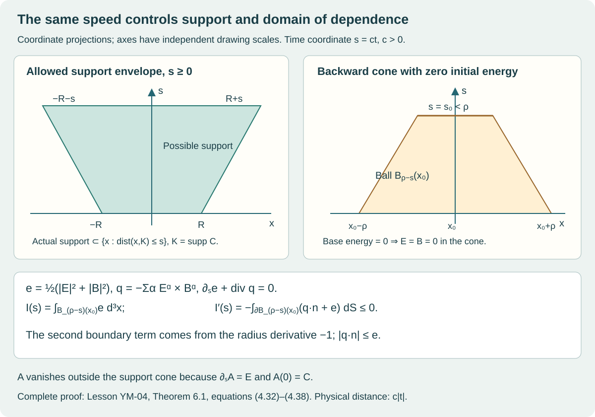

# Local smooth Cauchy evolution and finite propagation

Lesson YM-04 · Geometry and states in Yang–Mills theory

We now evolve the complete compactly supported connection constructed in
[Lesson 2](../compact-support-profiles.html). We construct a smooth solution
on an explicit time interval, prove uniqueness and a continuation criterion,
and prove preservation of the curvature relation and Gauss constraint.
The solution has conserved physical energy and the exact domain of
dependence dictated by the speed \(c\).

This is the first part of the Cauchy sequence. The second part retains the
full global-existence teaching task. The estimates proved here do not bound
the controlling Sobolev norm for all time. The research application of
Sung-Jin Oh's global theorem remains recorded in the
[complete classical programme proof, §§2–4](https://github.com/KokunoYumeto/yang-mills-interacting-workbench/blob/485b61423c1f4e1805deb453c1b6b342b27842b6/yang-mills/continuations/20260930-s6-ns-moment-map-bridge/COMPACT_SUPPORT_CAUCHY_EVOLUTION.md#2-the-established-global-input-and-its-exact-application).
That application is not a substitute for the planned complete analytical
teaching treatment.

The prerequisites are multivariable differentiation, integration by parts,
Lebesgue integration with its convergence and Fubini theorems, and
Cauchy–Schwarz. We prove the particular Fourier, Sobolev, contraction and
integral inequalities used below. The exact quaternionic bracket and matrix
metric come from [Lesson 1, §§1–2](../quaternionic-colour-maps.html).
The exposition and proofs in this lesson are independently written.

## 1. The original initial data and every convention

Write \(\mathfrak q=\operatorname{Im}\mathbb H\) in the fixed ordered basis
\((e_1,e_2,e_3)=(i,j,k)\). Its inner product is the Euclidean dot product.
Lesson 1 proves

\[
 [u,v]=2u\times v,\qquad
 |[u,v]|\leq2|u||v|,\qquad
 \langle[u,v],w\rangle=\langle u,[v,w]\rangle.
 \tag{4.1}
\]

Let \(0<r<R\), and keep the actual
\(\chi\in C^\infty_c(B_R(0))\) with \(\chi=1\) on \(B_r(0)\).
There is no assumption that \(\chi\) is radial. Subscripts on \(\chi\)
denote derivatives in the stated Cartesian coordinates. For the original
parameter \(v=(\zeta;\alpha,\beta;\gamma,\delta)\), put

\[
 c_1=\alpha i\bar\alpha,\quad
 c_2=\beta j\bar\beta,\quad c_3=\gamma k\bar\gamma,
 \qquad C_i=\sum_{a=1}^3c_a w_i^{(a)},
 \tag{4.2}
\]

where

\[
 \begin{aligned}
 w^{(1)}&=(\chi+x_2\chi_2,-x_2\chi_1,0),\\
 w^{(2)}&=(-x_1\chi_2,\chi+x_1\chi_1,0),\\
 w^{(3)}&=(-x_1\chi_3,0,\chi+x_1\chi_1).
 \end{aligned}\tag{4.3}
\]

All the unused parameter coordinates remain part of the parameter space;
they are not identified with one another. Lesson 2 proves
\(\sum_i\partial_iC_i=0\), \(C_i=c_i\) on \(B_r\), and compact support.

The time coordinate is \(s=ct\), with \(c>0\) retained. The spacetime metric
in \((s,x_1,x_2,x_3)\) is \(\operatorname{diag}(-1,1,1,1)\). Work in temporal
gauge \(A_0=0\), and set

\[
 \begin{gathered}
 D_iX=\partial_iX+[A_i,X],\qquad
 F_{ij}=\partial_iA_j-\partial_jA_i+[A_i,A_j],\\
 E_i=F_{0i}=\partial_sA_i,\qquad
 (\operatorname{curl}_AX)_i=\sum_{j,k=1}^3\epsilon_{ijk}D_jX_k,\\
 B_i=\frac12\sum_{j,k=1}^3\epsilon_{ijk}F_{jk}.
 \end{gathered}\tag{4.4}
\]

Here \(\epsilon_{123}=1\), it changes sign under an interchange, and is zero
when indices repeat. Thus \(B=(F_{23},F_{31},F_{12})\).
The initial triple to be constructed is

\[
 A(0)=C,\qquad E(0)=0,\qquad
 B_i(0)=\sum_{j,k}\epsilon_{ijk}\partial_jC_k+
             \frac12\sum_{j,k}\epsilon_{ijk}[C_j,C_k].
 \tag{4.5}
\]

We first treat \(A,E,B\) as independent unknowns in the system

\[
 \partial_sA=E,\qquad
 \partial_sE=-\operatorname{curl}_AB,\qquad
 \partial_sB=\operatorname{curl}_AE.
 \tag{4.6}
\]

After constructing its solution, we prove that its \(B\) is exactly the
curvature in (4.4) and that \(\sum_iD_iE_i=0\). This proves that the
constructed connection solves \(D^\mu F_{\mu\nu}=0\).

## 2. The Fourier and Sobolev estimates used in the construction

The following norms are auxiliary analytical norms on the original
components. They do not rescale \(A,E,B\), the bracket, time, or energy.
For a Schwartz function \(f:\mathbb R^3\to\mathbb C\), use

\[
 \widehat f(\xi)=(2\pi)^{-3/2}
     \int_{\mathbb R^3}e^{-ix\cdot\xi}f(x)\,d^3x,\qquad
 w_q(\xi)=(1+|\xi|^2)^{q/2},\qquad
 \|f\|_{H^q}=\|w_q\widehat f\|_{L^2}.
 \tag{4.7}
\]

A Schwartz function is smooth and every product of a polynomial with any
of its derivatives is bounded. The \(H^q\) space is the completion in
(4.7), for an integer \(q\geq0\).

### Lemma 2.1. Fourier inversion, isometry and completeness

Fourier transformation extends to a unitary map on \(L^2(\mathbb R^3)\).
On Schwartz functions its inverse has \(e^{+ix\cdot\xi}\) in (4.7), with the
same factor. The completed \(H^q\) is exactly the space of \(L^2\) functions
whose transform satisfies \(w_q\widehat f\in L^2\). Moreover
\(\widehat{\partial_j f}=i\xi_j\widehat f\).

**Proof.** We give the approximation steps as well as the constants.
The elementary Gaussian integral is
\(\int_{\mathbb R}e^{-u^2}\,du=\sqrt\pi\): square it, use polar coordinates
in \(\mathbb R^2\), and integrate \(2\pi r e^{-r^2}\).
For \(\varepsilon>0\), differentiation under the integral and integration
by parts show that
\(I(z)=\int e^{-\varepsilon\xi^2}e^{iz\xi}\,d\xi\)
satisfies \(I'(z)=-zI(z)/(2\varepsilon)\), with
\(I(0)=\sqrt{\pi/\varepsilon}\). Solving this scalar equation by multiplying
by \(e^{z^2/(4\varepsilon)}\), and taking the three coordinate products,
gives

\[
 (2\pi)^{-3}\int e^{-\varepsilon|\xi|^2}e^{iz\cdot\xi}\,d^3\xi
 =k_\varepsilon(z),\qquad
 k_\varepsilon(z)=(4\pi\varepsilon)^{-3/2}
                    e^{-|z|^2/(4\varepsilon)},\quad
 \int k_\varepsilon=1.
 \tag{4.8}
\]

For an integrable kernel \(k\), weighted Cauchy–Schwarz gives

\[
 |(k*f)(x)|^2\leq
 \|k\|_1\int |k(y)||f(x-y)|^2\,d^3y,\qquad
 \|k*f\|_2\leq\|k\|_1\|f\|_2.
 \tag{4.9}
\]

Integrating the first inequality proves the second. For a Schwartz
function, translations are continuous in \(L^2\), by dominated convergence
on a large ball and its uniformly decaying complement. Therefore
\(k_\varepsilon*f\to f\) in \(L^2\): express the difference as the integral
of \(f(\,\cdot-y)-f\), use continuity for \(|y|\leq\delta\), and use
\(2\|f\|_2\) and the Gaussian tail for \(|y|>\delta\). The same argument
gives uniform convergence for bounded uniformly continuous \(f\).

Differentiation in \(\xi\), followed by integration by parts in \(x\),
shows that the Fourier transform of a Schwartz function is Schwartz:
each \(\xi\)-polynomial times each transform derivative is the transform
of a finite sum of derivatives of \(x\)-polynomial multiples of \(f\).
These functions are integrable, which bounds all those transforms.
All boundary integrals vanish by their decay.
Fubini and (4.8) now give

\[
 \int e^{-\varepsilon|\xi|^2}\widehat f(\xi)
                  \overline{\widehat g(\xi)}\,d^3\xi
 =\int f(x)\overline{(k_\varepsilon*g)(x)}\,d^3x.
 \tag{4.10}
\]

Both sides converge, respectively by dominated convergence and the
\(L^2\) approximation just proved. Thus
\(\langle\widehat f,\widehat g\rangle=\langle f,g\rangle\).
Applying the inverse integral to \(e^{-\varepsilon|\xi|^2}\widehat f\)
gives \(k_\varepsilon*f\). Since \(\widehat f\in L^1\), its inverse
integrals converge uniformly as \(\varepsilon\downarrow0\). Hence the
inverse formula holds pointwise. The argument with the signs interchanged
proves the converse inverse formula.

Schwartz functions are dense in \(L^2\): first truncate a function in space
and value; approximate the resulting bounded, bounded-support function
by simple functions and their finite rectangle approximations in measure;
approximate each rectangle indicator by products of smooth cutoffs with
transition strips of arbitrarily small volume. Boundedness makes each
measure error an \(L^2\) error. Thus the isometry extends from this dense
space to \(L^2\). Its range is closed, and contains all Schwartz functions
by inversion, so it is onto.

Finally smooth compactly supported functions are dense in the weighted
space \(\{h:w_qh\in L^2\}\): truncate in \(\xi\) first, then smooth on a
slightly larger compact set, where the weight is bounded above and below.
Their inverse transforms are Schwartz. This identifies the completion in
(4.7) with that weighted \(L^2\) space and proves completeness.
Integration by parts gives the derivative formula; its extension in the
sense of distributions follows by testing against Schwartz functions.
\(\square\)

### Lemma 2.2. Exact product and pointwise estimates

Put

\[
 d=(2\pi)^{-3/2},\qquad
 K_q=2^{q-1}d\pi\quad(q\geq2).
 \tag{4.11}
\]

For \(f,g\in H^q\),

\[
 \begin{aligned}
 \|f\|_\infty&\leq d\pi\|f\|_{H^2},\\
 \|fg\|_{H^q}
 &\leq K_q\bigl(\|f\|_{H^q}\|g\|_{H^2}
                    +\|f\|_{H^2}\|g\|_{H^q}\bigr).
 \end{aligned}\tag{4.12}
\]

For each multi-index \(\alpha\) of length \(k\) and integer \(q>k+3/2\),

\[
 \|\partial^\alpha f\|_\infty
 \leq d\left(\int_{\mathbb R^3}
                \frac{|\xi|^{2k}}{(1+|\xi|^2)^q}\,d^3\xi\right)^{1/2}
                 \|f\|_{H^q}.
 \tag{4.13}
\]

All these derivatives have continuous representatives.

**Proof.** Spherical coordinates and \(r=\tan\theta\) give

\[
 \int_{\mathbb R^3}(1+|\xi|^2)^{-2}\,d^3\xi
 =4\pi\int_0^\infty\frac{r^2}{(1+r^2)^2}\,dr
 =4\pi\int_0^{\pi/2}\sin^2\theta\,d\theta=\pi^2.
 \tag{4.14}
\]

Consequently \(\|\widehat f\|_1\leq\pi\|f\|_{H^2}\).
Fourier inversion and dominated convergence prove the first estimate
and continuity. They also prove (4.13); its displayed integral is finite
at zero and at infinity under the stated strict inequality.

The triangle inequality in \(\mathbb R^4\), followed by convexity of the
\(q\)-th power, gives

\[
 \sqrt{1+|\eta+\zeta|^2}
 \leq\sqrt{1+|\eta|^2}+\sqrt{1+|\zeta|^2},
 \qquad
 w_q(\eta+\zeta)\leq2^{q-1}\bigl(w_q(\eta)+w_q(\zeta)\bigr).
 \tag{4.15}
\]

For Schwartz functions, Fubini and inversion give
\(\widehat{fg}=d(\widehat f*\widehat g)\). Use (4.15), then (4.9),
with one factor in \(L^2\) and the other in \(L^1\), to obtain

\[
 \|fg\|_{H^q}\leq
 2^{q-1}d\bigl(\|w_q\widehat f\|_2\|\widehat g\|_1+
                    \|\widehat f\|_1\|w_q\widehat g\|_2\bigr).
 \tag{4.16}
\]

Equation (4.14) proves (4.12). Approximate \(f,g\) in \(H^q\) by Schwartz
functions. The bound makes their products Cauchy in \(H^q\); the pointwise
bound gives uniform convergence of each factor, and hence identifies the
limit with the actual product. The derivative conclusions follow by the
same approximation, preserving the distributional derivatives.
\(\square\)

## 3. The full first-order system as an integral equation

There are twenty-seven real scalar components in \(U=(A,E,B)\). Define

\[
 \|U\|_{X_q}^2=
 \sum_{i=1}^3\sum_{\alpha=1}^3
 \bigl(\|A_i^\alpha\|_{H^q}^2+
       \|E_i^\alpha\|_{H^q}^2+
       \|B_i^\alpha\|_{H^q}^2\bigr).
 \tag{4.17}
\]

This is a complete Hilbert space by Lemma 2.1. Let

\[
 \begin{aligned}
 {\cal L}(A,E,B)&=(0,-\operatorname{curl}B,\operatorname{curl}E),\\
 {\cal S}(A,E,B)&=(E,0,0),\\
 {\cal Q}(U,V)_A&=0,\\
 {\cal Q}(U,V)_{E,i}^{\alpha}
 &=-2\sum_{j,k,\beta,\gamma}
             \epsilon_{ijk}\epsilon_{\alpha\beta\gamma}
                         A_j^\beta(U)B_k^\gamma(V),\\
 {\cal Q}(U,V)_{B,i}^{\alpha}
 &= 2\sum_{j,k,\beta,\gamma}
             \epsilon_{ijk}\epsilon_{\alpha\beta\gamma}
                         A_j^\beta(U)E_k^\gamma(V).
 \end{aligned}\tag{4.18}
\]

Thus every non-Abelian summand of (4.6) is retained, and
\(\partial_sU={\cal L}U+{\cal S}U+{\cal Q}(U,U)\).

### Lemma 3.1. The free evolution and nonlinear bounds

The operator \({\cal L}\) has a strongly continuous unitary group \(T(s)\)
on every \(X_q\), given explicitly on Fourier transforms by

\[
 \widehat{T(s)U}(\xi)=\exp\bigl(sM(\xi)\bigr)\widehat U(\xi),\quad
 C(\xi)z=i\,\xi\times z,\quad
 M(\xi)=
 \begin{pmatrix}0&0&0\\0&0&-C(\xi)\\0&C(\xi)&0\end{pmatrix}.
 \tag{4.19}
\]

Each block acts on the spatial indices and is repeated for every colour.
It preserves real fields. Moreover \(\|{\cal S}U\|_{X_q}\leq\|U\|_{X_q}\)
and

\[
 \|{\cal Q}(U,V)\|_{X_q}
 \leq144K_q\bigl(\|U\|_{X_q}\|V\|_{X_2}
                         +\|U\|_{X_2}\|V\|_{X_q}\bigr).
 \tag{4.20}
\]

In particular, with \(C_2=288K_2\) and
\(N(U)={\cal S}U+{\cal Q}(U,U)\),

\[
 \begin{aligned}
 \|N(U)\|_{X_2}&\leq\|U\|_{X_2}+C_2\|U\|_{X_2}^2,\\
 \|N(U)-N(V)\|_{X_2}
 &\leq[1+C_2(\|U\|_{X_2}+\|V\|_{X_2})]\|U-V\|_{X_2}.
 \end{aligned}\tag{4.21}
\]

**Proof.** The real matrix \(z\mapsto\xi\times z\) is skew symmetric,
so \(C(\xi)^*=C(\xi)\) and \(M(\xi)^*=-M(\xi)\).
Differentiating
\(e^{sM^*}e^{sM}\) gives zero, and its value at zero is the identity.
This proves the norm preservation in each Fourier fibre and, by (4.17),
in \(X_q\). The exponential series gives the group law.
Dominated convergence, with the fibre bound \(2|\widehat U|\), proves
strong continuity. Also \(M(-\xi)=\overline{M(\xi)}\), so the conjugate
symmetry of the transform of a real field is preserved.
Since \(|\xi\times z|\leq|\xi||z|\), \({\cal L}\) maps \(X_q\) continuously
to \(X_{q-1}\). The difference quotient of (4.19), dominated there by
a constant times \(|\xi||\widehat U|\), proves
\(\partial_sT(s)U={\cal L}T(s)U\) in \(X_{q-1}\).

For each of the nine \(E\) components and nine \(B\) components in
(4.18), exactly four choices of \((j,k,\beta,\gamma)\) survive.
There are therefore seventy-two signed scalar products, each with
coefficient of absolute value two. Bound the \(X_q\) norm by the sum of
the component norms and apply (4.12) to each product. Every individual
component norm is at most its full \(X_q\) or \(X_2\) norm. This proves
(4.20), with \(72\cdot2=144\). It is an upper bound on the complete
expression, without deleting any summand from (4.18).
Set \(q=2\) for the first nonlinear bound. For the second, use the exact
bilinear identity

\[
 {\cal Q}(U,U)-{\cal Q}(V,V)
 ={\cal Q}(U-V,U)+{\cal Q}(V,U-V).
 \tag{4.22}
\]

This proves (4.21). \(\square\)

## 4. Constructing the solution, its uniqueness and its lifespan

### Theorem 4.1. Local smooth solution for the original data

Let \(U_0\) be exactly (4.5), with (4.2)–(4.3). Put

\[
 R_0=2\max\{1,\|U_0\|_{X_2}\},\qquad
 \tau=\frac{1}{4(1+2C_2R_0)}.
 \tag{4.23}
\]

There is a unique solution of the integral form (4.24) of (4.6) in
\(C([-\tau,\tau];X_2)\).
It satisfies \(\sup_{|s|\leq\tau}\|U(s)\|_{X_2}\leq R_0\).
It belongs to \(C([-\tau,\tau];X_q)\) for every integer \(q\geq2\),
and is smooth in \((s,x)\) on the interior. All its derivatives extend
continuously to the two endpoints of this interval. Its maximal smooth
interval \((s_-,s_+)\) contains \([-\tau,\tau]\).
If either finite endpoint is approached while \(\|U(s)\|_{X_2}\) remains
bounded, the solution extends across that endpoint.

**Proof.** Smooth compact support makes every component of \(U_0\)
Schwartz, including all derivative and bracket terms of (4.5).
On the closed ball of radius \(R_0\) in
\(C([-\tau,\tau];X_2)\), define

\[
 (\Phi U)(s)=T(s)U_0+
       \int_0^sT(s-\sigma)N(U(\sigma))\,d\sigma.
 \tag{4.24}
\]

The integral is the limit of Riemann sums in the complete space \(X_2\);
the integrand is continuous by (4.21) and strong continuity of \(T\).
For negative \(s\), it has its usual signed orientation.
Equations (4.21) and (4.23) imply

\[
 \|\Phi U\|_{C X_2}\leq R_0/2+
            \tau R_0(1+C_2R_0)\leq3R_0/4,\qquad
 \|\Phi U-\Phi V\|_{C X_2}\leq\tfrac14\|U-V\|_{C X_2}.
 \tag{4.25}
\]

Starting with \(U^{(0)}(s)=T(s)U_0\), iterate
\(U^{(n+1)}=\Phi U^{(n)}\).
The successive differences are bounded by \(4^{-n}\) times the first
difference. Their geometric sum converges uniformly in \(X_2\).
The limit stays in the ball, and continuity of \(\Phi\) makes it a fixed
point. Two fixed points in the ball have a difference bounded by one
quarter of itself, hence are equal. This proves existence without
assuming a contraction theorem.

Uniqueness is not restricted to that ball. On any compact common
time interval, two continuous \(X_2\) solutions have a finite bound
on their norms. Equation (4.22), on an interval starting at any common
initial time, bounds their difference by
\(L\) times the integral of its norm, for a finite \(L\).
If a nonnegative continuous function obeys
\(h(t)\leq a+L\int_0^t h(\sigma)\,d\sigma\), put
\(H(t)=a+L\int_0^t h\). Then \(H'\leq LH\), so
\((e^{-Lt}H)'\leq0\), and \(h(t)\leq ae^{Lt}\).
For \(a=0\) this proves equality, and reversing time gives the same
conclusion to the left. The same proof gives continuous dependence on
the initial data on any common interval with bounded \(X_2\) norms:

\[
 \|U(s)-V(s)\|_{X_2}
 \leq \|U(0)-V(0)\|_{X_2}
       \exp\!\left(\int_{\min(0,s)}^{\max(0,s)}
       [1+C_2(\|U(\sigma)\|_{X_2}+\|V(\sigma)\|_{X_2})]\,d\sigma\right).
 \tag{4.26}
\]

For the displayed variable coefficient version, multiply \(H\) by the
exponential of the negative integral of that coefficient; the identical
derivative argument applies.

For each fixed integer \(q\geq2\), (4.20) and
\(\|U\|_{X_2}\leq\|U\|_{X_q}\) give the same construction in \(X_q\)
on an initially possibly shorter interval. Uniqueness identifies it
with the \(X_2\) solution. The full tame estimate, used before replacing
the lower norm, gives

\[
 \|U(s)\|_{X_q}\leq\|U_0\|_{X_q}
  +\left|\int_0^s
      [1+288K_q\|U(\sigma)\|_{X_2}]\|U(\sigma)\|_{X_q}\,d\sigma\right|
 \leq\|U_0\|_{X_q}e^{(1+288K_qR_0)|s|}.
 \tag{4.27}
\]

The last integral is written with its orientation removed; its integrand
is nonnegative. If an \(X_q\) solution ended at \(b<\tau\), this estimate
would bound its \(X_q\) norm up to \(b\). In (4.24), write the integral as
\(T(s)\int_0^sT(-\sigma)N(U(\sigma))\,d\sigma\).
Its integrand has bounded \(X_q\) norm by (4.20), so that integral is
Cauchy as \(s\uparrow b\). Strong continuity of \(T\) gives an \(X_q\)
limit for \(U(s)\). Restarting the local construction from this limit
extends across \(b\), a contradiction. The same argument applies to
negative time and the endpoints \(\pm\tau\). Thus every \(X_q\) solution
exists on the same interval, with (4.27).

Differentiate (4.24) in \(X_{q-1}\) using Lemma 3.1 and the continuous
integrand. This gives (4.6) as a differential equation.
Repeatedly differentiating its polynomial right side gives all time
derivatives, because arbitrarily many spatial derivatives are available.
Equation (4.13) then gives joint continuous derivatives in \((s,x)\).
For example, continuity in time in \(X_q\), followed by (4.13), is
uniform continuity of each lower spatial derivative as time varies;
the differentiated equation gives the corresponding time continuity.
This establishes the claimed smoothness and endpoint regularity.

Take the union of all intervals of smooth continuation. Uniqueness
identifies solutions on every overlap, producing a single maximal
interval. On a finite interval with bounded \(X_2\) norm, the
variable-coefficient version of (4.27) bounds every \(X_q\) norm.
The preceding Cauchy-limit and restart argument extends each regularity,
and uniqueness identifies all these extensions. Hence a finite maximal
endpoint requires an unbounded \(X_2\) norm. \(\square\)

The estimate (4.27) applies to the actual solution. It does not assert
that its controlling \(X_2\) norm is bounded on every finite interval.
That remaining global estimate is part of the next Cauchy lesson.

### Corollary 4.2. The full local data space

For every real \(U_0\in X_2\), equations (4.23)–(4.25) construct a unique
solution of (4.24) in \(C([-\tau,\tau];X_2)\). It lies in
\(C^1([-\tau,\tau];X_1)\) and solves (4.6) in \(X_1\).
Its dependence on the data obeys (4.26). For every integer \(q\geq2\)
for which \(U_0\in X_q\), it lies in \(C([-\tau,\tau];X_q)\) and obeys
(4.27). Its maximal \(X_2\) interval has the same finite-endpoint
continuation criterion. This concerns the full first-order system;
the curvature and Gauss constraints for the original data are proved
separately in §5.

**Proof.** The contraction proof through (4.26) uses only the finite
\(X_2\) norm and the reality of the initial components. It therefore
applies to every stated \(U_0\), without a support or constraint
assumption. Lemma 3.1 maps \({\cal L}:X_2\to X_1\), and
\(N(U)\) is continuous into \(X_2\). Differentiating (4.24) in \(X_1\)
gives \(U'={\cal L}U+N(U)\), continuously in \(X_1\).
For any specified \(q\), the \(X_q\) construction and its
endpoint-limit argument in the proof of Theorem 4.1 use only
\(U_0\in X_q\) and the already constructed \(X_2\) solution.
They give (4.27) on the entire same interval. At a finite maximal
\(X_2\) endpoint with bounded \(X_2\) norm, (4.21) bounds the integrand
in the factored Duhamel formula. That integral has an \(X_2\) endpoint
limit, and the local construction restarts there. This proves the
continuation statement directly at \(X_2\) regularity. \(\square\)

## 5. The constraints hold for the constructed solution

### Theorem 5.1. Curvature, Gauss law and the full field equation

For the solution of Theorem 4.1, throughout its maximal smooth interval,

\[
 B_i=\frac12\sum_{j,k}\epsilon_{ijk}F_{jk},\qquad
 \sum_iD_iE_i=0,\qquad \sum_iD_iB_i=0,\qquad D^\mu F_{\mu\nu}=0.
 \tag{4.28}
\]

**Proof.** Define the curvature expression
\(\widetilde B_i=\sum\epsilon_{ijk}\partial_jA_k+
\frac12\sum\epsilon_{ijk}[A_j,A_k]\). By \(\partial_sA=E\),

\[
 \begin{aligned}
 \partial_s\widetilde B_i
 &=\sum_{j,k}\epsilon_{ijk}\partial_jE_k
   +\frac12\sum_{j,k}\epsilon_{ijk}
                  ([E_j,A_k]+[A_j,E_k])\\
 &=\sum_{j,k}\epsilon_{ijk}(\partial_jE_k+[A_j,E_k])
   =(\operatorname{curl}_AE)_i=\partial_sB_i.
 \end{aligned}\tag{4.29}
\]

In the first bracket sum interchange \(j,k\) and use antisymmetry of the
bracket; its contribution then equals the second sum.
The initial values agree by (4.5), so \(B=\widetilde B\).

For completeness, direct expansion gives
\([D_i,D_j]X=[F_{ij},X]\): the second derivatives commute, the terms
linear in \(\partial X\) cancel, the derivatives of \(A\) give
\([\partial_iA_j-\partial_jA_i,X]\), and the two nested brackets give
\([[A_i,A_j],X]\) by Jacobi. Also
\(\partial_s(D_iX)=D_i\partial_sX+[E_i,X]\).
Consequently \(G=\sum_iD_iE_i\) satisfies

\[
 \begin{aligned}
 \partial_sG
 &=-\sum_{i,j,k}\epsilon_{ijk}D_iD_jB_k+\sum_i[E_i,E_i]\\
 &=-\frac12\sum_{i,j,k}\epsilon_{ijk}[F_{ij},B_k]
   =-\sum_{k=1}^3[B_k,B_k]=0.
 \end{aligned}\tag{4.30}
\]

Here \(F_{ij}=\sum_\ell\epsilon_{ij\ell}B_\ell\) and
\(\sum_{i,j}\epsilon_{ijk}\epsilon_{ij\ell}=2\delta_{k\ell}\).
The initial electric field is zero, so \(G(0)=0\).

The spatial Bianchi identity is
\(D_1F_{23}+D_2F_{31}+D_3F_{12}=0\).
To see every cancellation, expand each \(F\).
The six second derivatives cancel in commuting pairs.
The derivatives of a bracket expand into
\([\partial_iA_j,A_k]+[A_j,\partial_iA_k]\);
these six terms cancel the six terms
\([A_i,\partial_jA_k-\partial_kA_j]\) from the covariant derivatives
after cyclic relabelling. The remaining three terms are
\([A_1,[A_2,A_3]]+[A_2,[A_3,A_1]]+[A_3,[A_1,A_2]]=0\)
by Jacobi. This is precisely \(\sum_iD_iB_i=0\).

Finally \(D^0=-\partial_s\), \(D^j=D_j\),
\(F_{i0}=-E_i\) and \(F_{ji}=-\sum_k\epsilon_{ijk}B_k\). Thus

\[
 D^\mu F_{\mu0}=-G=0,\qquad
 D^\mu F_{\mu i}=-\partial_sE_i-
                          (\operatorname{curl}_AB)_i=0.
 \tag{4.31}
\]

All assertions hold on each continuation interval and hence on their
union. \(\square\)

## 6. Energy, boundary flux and the speed of propagation

Write \(|E|^2=\sum_i|E_i|^2\), and likewise for other vector fields. Define

\[
 e=\frac12(|E|^2+|B|^2),\qquad
 q_j=-\sum_{i,k}\epsilon_{jik}\langle E_i,B_k\rangle.
 \tag{4.32}
\]

### Theorem 6.1. Local conservation, full energy and support

For the constructed solution,

\[
 \partial_se+\sum_j\partial_jq_j=0,\qquad
 |q\cdot n|\leq e\quad\text{for every unit spatial vector }n.
 \tag{4.33}
\]

Its integral \(\int_{\mathbb R^3}e(s,x)\,d^3x\) is independent of \(s\).
For the actual closed set \(K=\operatorname{supp}C\),

\[
 \operatorname{supp}(A,E,B)(s)
 \subseteq\{x:\operatorname{dist}(x,K)\leq |s|\}
 \subseteq\overline B_{R+|s|}(0).
 \tag{4.34}
\]

In the original time \(t\), the distance in this statement is \(c|t|\).

**Proof.** Differentiate (4.32) and use (4.6).
The ordinary derivative terms equal

\[
 -\sum_{i,j,k}\epsilon_{ijk}
          \langle E_i,\partial_jB_k\rangle
 +\sum_{i,j,k}\epsilon_{ijk}
          \langle B_i,\partial_jE_k\rangle
 =-\sum_j\partial_jq_j.
 \tag{4.35}
\]

In the second sum interchange \(i,k\) to check this sign.
The connection terms cancel:
\(-\epsilon_{ijk}\langle E_i,[A_j,B_k]\rangle\) becomes
\(+\epsilon_{ijk}\langle[A_j,E_i],B_k\rangle\)
by skew adjointness of \([A_j,\cdot]\), while the other sum becomes its
negative after interchanging \(i,k\).
This proves the conservation law. For the flux, decompose by colour:
\(q=-\sum_\alpha E^\alpha\times B^\alpha\).
Therefore

\[
 |q\cdot n|\leq\sum_\alpha|E^\alpha||B^\alpha|
 \leq |E||B|\leq\tfrac12(|E|^2+|B|^2)=e.
 \tag{4.36}
\]

To justify conservation on the whole space before using support, take a
smooth cutoff \(\eta_N(x)=\eta(x/N)\), with \(0\leq\eta\leq1\),
\(\eta=1\) on \(B_1\), \(\eta=0\) outside \(B_2\), and
\(\|\nabla\eta_N\|_\infty\leq\|\nabla\eta\|_\infty/N\).
Integrating (4.33) from \(s_1\) to \(s_2\) gives exactly

\[
 \int\eta_N e(s_2)-\int\eta_N e(s_1)
 =\int_{s_1}^{s_2}\int\nabla\eta_N\cdot q\,d^3x\,ds.
 \tag{4.37}
\]

The absolute value of the right side is at most
\(\|\nabla\eta\|_\infty N^{-1}\int_{s_1}^{s_2}\int e\).
This is finite because the solution is continuous in \(X_2\), which
includes its \(L^2\) norms. It tends to zero as \(N\to\infty\).
Dominated convergence on the left proves conservation.

Fix \(s_0>0\) in the smooth interval and \(x_0\) with
\(\operatorname{dist}(x_0,K)>s_0\). Choose
\(s_0<\rho<\operatorname{dist}(x_0,K)\).
For \(0\leq s\leq s_0\), put
\(I(s)=\int_{B_{\rho-s}(x_0)}e(s,x)\,d^3x\).
Differentiation in polar coordinates, followed by the divergence
theorem, yields the complete moving-boundary formula

\[
 I'(s)=-\int_{\partial B_{\rho-s}(x_0)}
                       (q\cdot n+e)\,dS\leq0.
 \tag{4.38}
\]

Every component of \(C\) and all its derivatives vanish off \(K\).
Hence (4.5) makes \(I(0)=0\). Nonnegativity gives \(I(s)=0\);
smoothness then makes \(E=B=0\) throughout these balls.
The same construction at any point with
\(\operatorname{dist}(x,K)>s\) proves \(E=B=0\) outside the claimed set.
At such a point \(x\), the vertical segment from \(0\) to \(s\) also
satisfies \(\operatorname{dist}(x,K)>\sigma\).
Since \(C(x)=0\) and \(\partial_\sigma A=E=0\) on that segment,
\(A(s,x)=0\). Replacing \(s\) by \(-s\) changes the flux sign; the bound
\(|q\cdot n|\leq e\) gives the same argument to the past.
Finally \(s=ct\) proves the physical speed statement. \(\square\)

The figure is a coordinate projection. The support inclusion is (4.34);
the shrinking spherical boundary and both of its terms are (4.38).
Its straight slopes describe \(s\), with \(s=ct\) retained when converting
to physical time.

The matrix map from Lesson 1 is
\(\varphi(e_\alpha)=2T_\alpha\), \(T_\alpha=-i\sigma_\alpha/2\), with
\(\langle X,Y\rangle_{\rm mat}=-2\operatorname{tr}(XY)\).
Thus \(|\varphi(u)|_{\rm mat}^2=4|u|^2\), and the conserved physical
energy, for the original \(g>0\), is

\[
 {\mathscr E}
 =\frac1{2g^2}\int_{\mathbb R^3}
       \left(\sum_i|\varphi(E_i)|_{\rm mat}^2+
             \sum_{i<j}|\varphi(F_{ij})|_{\rm mat}^2\right)d^3x
 =\frac4{g^2}\int_{\mathbb R^3}e\,d^3x.
 \tag{4.39}
\]

To retain the entire cutoff contribution, define

\[
 \begin{gathered}
 H^a_{ij}=\partial_iw_j^{(a)}-\partial_jw_i^{(a)},\qquad
 W^{ab}_{ij}=w_i^{(a)}w_j^{(b)}-w_i^{(b)}w_j^{(a)},\\
 I_{ab}=\int\sum_{i<j}H^a_{ij}H^b_{ij},\qquad
 J_{a,bc}=\int\sum_{i<j}H^a_{ij}W^{bc}_{ij}\quad(b<c),\\
 K_{ab,cd}=\int\sum_{i<j}W^{ab}_{ij}W^{cd}_{ij}
                       \quad(a<b,\ c<d).
 \end{gathered}\tag{4.40}
\]

Every integral here is over \(\mathbb R^3\) with \(d^3x\).
Inserting (4.2) into the curvature gives exactly
\(F_{ij}(C)=\sum_a c_aH^a_{ij}+\sum_{a<b}[c_a,c_b]W^{ab}_{ij}\).
Expanding its squared norm in (4.39) at \(s=0\), when \(E=0\), proves

\[
 {\mathscr E}=\frac2{g^2}\left[
 \sum_{a,b}\langle c_a,c_b\rangle I_{ab}
 +2\sum_{a,\ b<c}\langle c_a,[c_b,c_c]\rangle J_{a,bc}
 +\sum_{a<b,\ c<d}\langle[c_a,c_b],[c_c,c_d]\rangle K_{ab,cd}
 \right].
 \tag{4.41}
\]

The quantities \(K_{ab,cd}\) are integral coefficients, distinct from the
support set \(K\). All three sums, the mixed term, and \(1/g^2\) remain.
Lesson 2 supplies the complete derivative table and original cutoff
formulas used in (4.40).

## 7. Exact domain of dependence, including a nonzero comparison field

### Theorem 7.1. Equality propagates through a characteristic cone

Let \(U=(A,E,B)\) and \(U'=(A',E',B')\) be smooth solutions of (4.6)
on a neighborhood of the closed cone
\(0\leq s\leq s_0<\rho\), \(|x-x_0|\leq\rho-s\).
If their initial triples agree on \(B_\rho(x_0)\), they agree throughout
the interior of the cone. Only smoothness on this compact cone is needed;
the second solution need not have finite total energy.

**Proof.** Set \(a=A-A'\), \(e_1=E-E'\), \(b_1=B-B'\). Direct subtraction,
keeping the first solution's \(E,B\), gives

\[
 \begin{aligned}
 \partial_sa&=e_1,\\
 \partial_s(e_1)_i
  &=-(\operatorname{curl}_{A'}b_1)_i
           -\sum_{j,k}\epsilon_{ijk}[a_j,B_k],\\
 \partial_s(b_1)_i
  &=(\operatorname{curl}_{A'}e_1)_i
           +\sum_{j,k}\epsilon_{ijk}[a_j,E_k].
 \end{aligned}\tag{4.42}
\]

Define

\[
 h=\tfrac12(|a|^2+|e_1|^2+|b_1|^2),\qquad
 q^{\rm diff}_j=-\sum_{i,k}\epsilon_{jik}
                              \langle(e_1)_i,(b_1)_k\rangle.
 \tag{4.43}
\]

The \(A'\) terms cancel exactly as in (4.35).
There are six nonzero spatial alternating triples. By (4.1), the
remaining \(B\) sum has absolute value at most
\(12|e_1||a||B|\leq12|B|h\).
The \(E\) sum is bounded by \(12|E|h\), and
\(|\langle a,e_1\rangle|\leq h\).
The proof of (4.36) also gives \(|q^{\rm diff}\cdot n|\leq h\).
Consequently

\[
 \partial_sh+\operatorname{div}q^{\rm diff}
       \leq[1+12(|E|+|B|)]h,\qquad |q^{\rm diff}\cdot n|\leq h.
 \tag{4.44}
\]

The coefficient has a finite upper bound \(L\) on the compact cone.
For \(J(s)=\int_{B_{\rho-s}(x_0)}h\), the complete moving-boundary
calculation gives
\(J'(s)\leq LJ(s)-\int_{\partial B_{\rho-s}}(q^{\rm diff}\cdot n+h)
\leq LJ(s)\).
Since \(J(0)=0\), the integrating-factor argument in §4 gives \(J=0\).
Smoothness makes all three differences zero pointwise in the interior.
The past cone follows by reversing time. \(\square\)

### Corollary 7.2. The original homogeneous core is retained

There is a global smooth spatially constant solution \(A_i(s,x)=V_i(s)\)
with \(V_i(0)=c_i\), \(V_i'(0)=0\). It solves

\[
 V_i''=\sum_{j=1}^3[V_j,[V_j,V_i]],\qquad
 {\cal H}(s)=\frac12\sum_i|V_i'|^2+
             \frac12\sum_{i<j}|[V_i,V_j]|^2={\cal H}(0).
 \tag{4.45}
\]

The compact-support solution equals this actual homogeneous solution
wherever \(|x|+|s|<r\), within its smooth interval.

**Proof.** The finite-dimensional integral equation for \((V,V')\) has
a local solution by the same geometric iteration as §4: its polynomial
right side is bounded and Lipschitz on each closed ball. To check its
sign and conserved quantity, put
\(P(V)=\frac12\sum_{i<j}|[V_i,V_j]|^2\).
For a variation \(h_i\), invariance in (4.1) gives

\[
 \frac{\partial P}{\partial V_i}
       =-\sum_j[V_j,[V_j,V_i]].
 \tag{4.46}
\]

Indeed each term containing \(V_i\) contributes
\(\langle[V_i,V_j],[h_i,V_j]\rangle
=-\langle[V_j,[V_j,V_i]],h_i\rangle\);
the terms with the opposite ordering give the identical expression.
Thus \(V''=-\nabla P\), and differentiation gives
\({\cal H}'=\sum_i\langle V_i',V_i''+\partial P/\partial V_i\rangle=0\).
Nonnegativity of \(P\) yields

\[
 |V'(s)|\leq\sqrt{2{\cal H}(0)},\qquad
 |V(s)|\leq|V(0)|+|s|\sqrt{2{\cal H}(0)}.
 \tag{4.47}
\]

Here the norms sum all three colour vectors in Euclidean square norm.
They preclude escape from every bounded phase-space ball in finite time.
The integral equation then has an endpoint limit and a local restart,
which proves global existence.

Set \(E_i=V_i'\), \(B_i=\frac12\sum\epsilon_{ijk}[V_j,V_k]\).
Differentiation proves the third equation in (4.6); contraction of the
two alternating symbols shows that the second is exactly (4.45).
The first holds by definition. Its initial triple equals (4.5) on
\(B_r\), since all derivatives of \(C_i=c_i\) vanish there.
Apply Theorem 7.1 in each smaller closed cone inside
\(|x|+|s|<r\), giving equality on that open diamond.
All derivatives agree there because both fields are smooth.
\(\square\)

For the original equal-colour input \(c_i=e_i\), the invariant ansatz is
\(V_i=f(s)e_i\), where

\[
 f''+8f^3=0,\quad f(0)=1,\quad f'(0)=0,\quad
 f'^2+4f^4=4.
 \tag{4.48}
\]

Each \(j\ne i\) contributes \(-4f^3e_i\) to (4.45), and \(j=i\)
contributes zero, proving the coefficient eight. Multiplication by
\(2f'\) proves the last identity. In the core, the matrix curvatures are

\[
 F^{\rm mat}_{0i}=2f'T_i,\qquad
 (F^{\rm mat}_{12},F^{\rm mat}_{23},F^{\rm mat}_{31})
                 =4f^2(T_3,T_1,T_2).
 \tag{4.49}
\]

The following fixed-component gauge-invariant quantity therefore obeys

\[
 \begin{aligned}
 {\cal I}
 &=|[F^{\rm mat}_{12},F^{\rm mat}_{23}]|_{\rm mat}^2+
   |[F^{\rm mat}_{01},F^{\rm mat}_{02}]|_{\rm mat}^2\\
 &=256f^8+16(f')^4
 =256\bigl((f^4)^2+(1-f^4)^2\bigr)\geq128.
 \end{aligned}\tag{4.50}
\]

The first commutator is \(16f^4T_2\), the second \(4(f')^2T_3\),
and \(|T_i|_{\rm mat}=1\). The lower bound is the identity
\(z^2+(1-z)^2=2(z-\frac12)^2+\frac12\), with \(z=f^4\).
Conjugation preserves the trace metric, so the conclusion is gauge
invariant. Its specified spacetime components are retained; no
Lorentz-scalar assertion is being made.

## 8. Exercises with complete solutions

### Exercise 1. The sign of the free generator

For one colour, show directly that the Fourier block in (4.19) is skew
Hermitian. Determine whether the two signs in (4.6) can both be positive
while retaining this free unitary evolution.

**Solution.** If \(Jz=\xi\times z\), then \(J^*=-J\), since its real
matrix is skew symmetric. Thus \((iJ)^*=(-i)(-J)=iJ=C\).
The adjoint of \(\left(\begin{smallmatrix}0&-C\\C&0\end{smallmatrix}\right)\)
is \(\left(\begin{smallmatrix}0&C\\-C&0\end{smallmatrix}\right)\),
its negative. With both signs positive the block would instead be
\(\left(\begin{smallmatrix}0&C\\C&0\end{smallmatrix}\right)\), which is
Hermitian. For \(\xi\ne0\), it has nonzero real eigenvalues on transverse
components, so its real-time exponential is not unitary. The opposite
curl signs are required by the retained metric and energy law.

### Exercise 2. A quantitative first approximation

Let \(U^{(0)}=T(s)U_0\) and iterate (4.24). Bound the error after \(n\)
iterations on the explicit interval (4.23).

**Solution.** Write \(D=\|U^{(1)}-U^{(0)}\|_{C X_2}\).
By (4.25),
\(\|U^{(k+1)}-U^{(k)}\|_{C X_2}\leq4^{-k}D\).
Taking the convergent sum from \(k=n\) to infinity gives
\(\|U-U^{(n)}\|_{C X_2}\leq\frac43\,4^{-n}D\).
Since \(\|U^{(0)}\|_{C X_2}=\|U_0\|_{X_2}\leq R_0/2\),
(4.21) gives
\(D\leq\tau(R_0/2+C_2R_0^2/4)\).
These are bounds for the original twenty-seven components, including
the original curvature term in \(U_0\).

### Exercise 3. What a curvature defect does

Consider (4.6) with arbitrary smooth initial \(B_0\). Define
\(Z_i=B_i-\frac12\sum\epsilon_{ijk}F_{jk}(A)\).
Find its evolution and the exact Gauss derivative.

**Solution.** The calculation (4.29) does not use the initial data, so
\(\partial_sZ_i=0\) and \(Z_i(s,x)=Z_i(0,x)\).
Write \(\widetilde B=B-Z\), the actual curvature vector.
The first two lines of (4.30) still hold. Contracting \(F_{ij}
=\sum_\ell\epsilon_{ij\ell}\widetilde B_\ell\) gives
\(\partial_sG=-\sum_k[\widetilde B_k,B_k]
=\sum_k[Z_k,B_k]\).
Thus an arbitrary initial curvature defect is stationary in temporal
gauge but can drive a Gauss defect. In the actual construction \(Z=0\),
which proves why (4.5), rather than an independently chosen \(B_0\),
is needed.

### Exercise 4. A general moving radius

Replace the radius \(\rho-s\) in the cone calculation by a differentiable
positive function \(a(s)\). Derive its exact energy derivative and the
condition guaranteeing that the boundary contribution is nonpositive.

**Solution.** Polar-coordinate differentiation gives

\[
 \frac{d}{ds}\int_{B_{a(s)}(x_0)}e
 =-\int_{\partial B_{a(s)}(x_0)}q\cdot n
       +a'(s)\int_{\partial B_{a(s)}(x_0)}e.
\]

Since \(-q\cdot n\leq e\), this is at most
\((1+a'(s))\int_{\partial B_{a(s)}}e\).
Hence \(a'(s)\leq-1\) suffices. For the sharp characteristic cone,
\(a'=-1\), the exact expression is
\(-\int(q\cdot n+e)\). Returning to \(t\), the equation is
\(\partial_te+c\,\operatorname{div}q=0\), and a physical radius must
satisfy \(da/dt\leq-c\). Both factors of \(c\) have been retained.

### Exercise 5. Why the potential term does not bound the connection

Give a nonzero homogeneous triple with zero potential \(P\) in (4.46).
Show explicitly why the global homogeneous argument still works.

**Solution.** Take \(V_i=b_i e_1\), for arbitrary real \(b_i\), not all
zero. All brackets vanish, so \(P=0\), while \(|V|\) can be arbitrarily
large. Thus the potential is not coercive in \(V\).
The conserved total energy does bound \(|V'|\) by
\(\sqrt{2{\cal H}(0)}\). Integrating this velocity from the fixed initial
point gives (4.47), which bounds \(V\) on every finite time interval.
The finite-dimensional polynomial equation then restarts at its endpoint.
No nonexistent lower bound \(P\geq a|V|^4\), \(a>0\), is required.

### Exercise 6. The metric and time factors

Express the electric part of (4.39) in terms of
\(\partial_tA_i\), keeping \(c\), \(g\) and \(\varphi\).

**Solution.** Since \(s=ct\),
\(E_i=\partial_sA_i=c^{-1}\partial_tA_i\).
Consequently the electric contribution is

\[
 \frac1{2g^2c^2}\int\sum_i
       |\varphi(\partial_tA_i)|_{\rm mat}^2\,d^3x
 =\frac2{g^2c^2}\int\sum_i|\partial_tA_i|^2\,d^3x.
\]

The spatial magnetic part of (4.39) is unchanged. The factor four from
the matrix metric and the factor \(c^{-2}\) from time conversion have
different origins and both remain present.

### Exercise 7. Equality for noncompact comparison data

Why may the homogeneous solution be used in Theorem 7.1 even though a
nonzero constant magnetic field has infinite energy on \(\mathbb R^3\)?

**Solution.** The theorem integrates \(h\) only over the bounded balls
\(B_{\rho-s}(x_0)\). On the compact cone, the smooth fields and the
coefficient \(1+12(|E|+|B|)\) are bounded. Thus every integral in (4.44)
is finite, and the integrating factor proves the local equality.
The argument never integrates the homogeneous energy over
\(\mathbb R^3\). The conclusion is equality on the open domain of
dependence, which is exactly the claim in Corollary 7.2.

### Exercise 8. A non-Abelian core at zero magnetic amplitude

At a time with \(f=0\) in (4.48), evaluate the two summands of
\({\cal I}\). At a time with \(f'=0\), do the same.

**Solution.** If \(f=0\), (4.48) gives \(f'^2=4\).
The magnetic commutator term \(256f^8\) is zero, and the electric
term \(16(f')^4=16\cdot16=256\).
If \(f'=0\), then \(f^4=1\), so the magnetic term is \(256\) and the
electric term is zero. In both cases \({\cal I}=256\).
At intervening values it is at least \(128\) by (4.50).
This proves noncommuting curvature components throughout the original
core diamond, within the constructed smooth solution's interval.

## 9. Proof routes and the next Cauchy part

The exact profile and metric inputs are the earlier YM-01 and YM-02
lessons. Sections 2–4 above supply the complete local analytical
construction used here. Sections 5–7 give the complete receiving
constraint, flux, support and comparison arguments. Their programme
counterparts, including the global theorem application and its distinct
scope, are
[CE4–CE17 and CE18–CE23](https://github.com/KokunoYumeto/yang-mills-interacting-workbench/blob/485b61423c1f4e1805deb453c1b6b342b27842b6/yang-mills/continuations/20260930-s6-ns-moment-map-bridge/COMPACT_SUPPORT_CAUCHY_EVOLUTION.md).

Sung-Jin Oh's original works *Finite energy global well-posedness of the
Yang–Mills equations on \(\mathbb R^{1+3}\): An approach using the
Yang–Mills heat flow* and *Gauge choice for the Yang–Mills equations
using the Yang–Mills heat flow and local well-posedness in \(H^1\)* are
credited in that programme source with their exact author-source
versions. No part of their global analytical proof is claimed to have
been replaced by the local construction above.

The next Cauchy part must carry the global continuation argument at its
full scope. Conservation of (4.39) controls the curvature and electric
\(L^2\) norms. The continuation criterion here controls the larger
\(X_2\) norm, which includes the connection and spatial derivatives.
The course retains the task of proving the estimates and gauge
constructions that connect these quantities. The interacting quantum
state, reconstruction and no-gap research endpoint also remain active.
