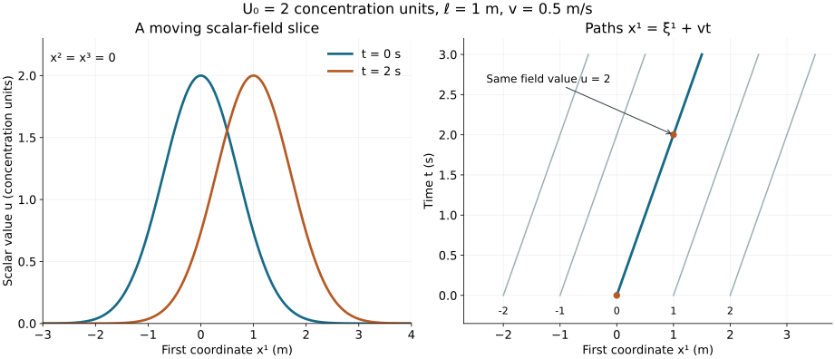

# Fields, coordinates and physical quantities

Lesson YM-F01 · Geometry and states in Yang–Mills theory

A temperature map assigns a temperature to each place. A wind map assigns
both a speed and a direction. If either map changes, time becomes one of
its inputs. These are examples of fields.

The first task in reading a field theory is to identify its fields: what
their inputs are, what kind of values they take, and what those values
mean. The next task is to distinguish the field from the equation it is
supposed to satisfy. We will do both with explicit examples.

By the end of this lesson you will be able to specify a scalar or vector
field, keep track of its units, differentiate it, change its Cartesian
coordinates, and solve a first evolution equation from its initial data.
The final example also gives a precise instance of propagation and a local
conservation law.

## 1. Preparation and notation

We use real numbers, arithmetic with triples, and elementary one-variable
calculus: derivatives of polynomials, exponentials, sine and cosine,
the one-variable chain rule, and substitution in definite integrals.
In particular, we use the product rule and the fundamental
theorem of calculus: if \(f\) has a continuous derivative on an interval,
then

\[
 f(b)-f(a)=\int_a^b f'(s)\,ds.
 \tag{F1.1}
\]

We will derive the multivariable differentiation and transport formulas
used below. You do not need prior knowledge of gauge theory, bundles,
Hilbert spaces or quantum mechanics.

Write a point of Cartesian space as

\[
 x=(x^1,x^2,x^3)\in\mathbb R^3.
 \tag{F1.2}
\]

The superscripts label the three coordinates; they are not powers.
We write \(x^1x^1=(x^1)^2\) when a square is intended. A spacetime point
in this lesson is a pair \((t,x)\). We keep time and the three spatial
coordinates separate. This notation does not yet choose a spacetime
metric or make any claim about relativistic dynamics.

Let \(I\) be an open interval of time and let \(\Omega\) be an open subset
of \(\mathbb R^3\). A real scalar field is a function

\[
 u:I\times\Omega\longrightarrow\mathbb R.
 \tag{F1.3}
\]

A spatial vector field in these Cartesian coordinates is a function

\[
 V:I\times\Omega\longrightarrow\mathbb R^3,\qquad
 V(t,x)=\bigl(V^1(t,x),V^2(t,x),V^3(t,x)\bigr).
 \tag{F1.4}
\]

For physical quantities, the real numbers in these formulas are numerical
values in specified units. A temperature and a mass density can both be
represented by real-valued functions, but they are different physical
quantities. Their units and meanings belong to the specification.

Not every triple in a field theory is a spatial vector. Three chemical
concentrations, for example, form three scalar fields. A spatial rotation
rotates the components of a velocity vector; it does not turn one chemical
species into another. We will make this distinction concrete in Section 5.

## 2. Reading a field at a point

Choose constants \(\omega\) and \(v\), each independent of \(t\) and \(x\).
The field

\[
 V(t,x)=(-\omega x^2,\ \omega x^1,\ 0)
 \tag{F1.5}
\]

assigns a vector to every point. It is independent of time, so it is
stationary. It varies with position when \(\omega\ne0\); when
\(\omega=0\), it is the zero field. For any \(r>0\),

\[
 V(t,(r,0,0))=(0,\omega r,0),\qquad
 V(t,(0,r,0))=(-\omega r,0,0),\qquad
 V(t,(0,0,r))=(0,0,0).
 \tag{F1.6}
\]

These values describe rotation around the third coordinate axis when
\(V\) is interpreted as a velocity field.

That interpretation can be checked using a path. Fix \(r>0\) and
\(z_0\in\mathbb R\), and define

\[
 x(t)=\bigl(r\cos(\omega t),\ r\sin(\omega t),\ z_0\bigr).
 \tag{F1.7}
\]

Differentiation gives

\[
 \frac{dx}{dt}
 =\bigl(-\omega r\sin(\omega t),\
         \omega r\cos(\omega t),\ 0\bigr)
 =V(t,x(t)).
 \tag{F1.8}
\]

Thus this path is a trajectory of the velocity field; it travels around
a circle when \(\omega\ne0\) and stays at one point when \(\omega=0\).
The field is the
rule assigning velocities everywhere; the trajectory is one path that
follows that rule.

Here is a scalar field that can change with time, defined on all of
\(\mathbb R\times\mathbb R^3\). Choose \(U_0>0\), \(\ell>0\) and
\(v\in\mathbb R\), and set

\[
 u(t,x)=U_0
 \exp\!\left[
   -\frac{(x^1-vt)^2+(x^2)^2+(x^3)^2}{\ell^2}
 \right].
 \tag{F1.9}
\]

Its maximum value is \(U_0\), attained exactly at \((vt,0,0)\), because
the sum of the three squares is nonnegative and vanishes exactly there.
The field is positive at every point. It becomes small far from its
centre, but its support is all of space. Decay and compact support are
different properties.

*Figure 1. The scalar-field slice \(x^2=x^3=0\) from (F1.9), with
\(U_0=2\) concentration units, \(\ell=1\) metre and \(v=0.5\) metres
per second, at \(t=0\) and \(t=2\) seconds. The second panel shows
sample paths \(x^1=\xi^1+vt\), with \(x^2=x^3=0\). Each curve is a one-dimensional slice
or a spacetime path, not a picture of all three spatial coordinates.
Sections 4 and 6 prove the stated transport law. The figure source
retains the numerical values and units.*

## 3. Units are part of the formula

Let \(\mathsf L\) denote the dimension of length and \(\mathsf T\) the
dimension of time. Let \(\mathsf U\) denote the dimension of the scalar
quantity \(u\); its physical interpretation can be chosen separately.
For (F1.9) to be meaningful, the dimensions are

\[
 [x^i]=\mathsf L,\quad [t]=\mathsf T,\quad
 [v]=\mathsf L\mathsf T^{-1},\quad
 [\ell]=\mathsf L,\quad [U_0]=[u]=\mathsf U.
 \tag{F1.10}
\]

The two terms in \(x^1-vt\) then have the same dimension. Its square and
the other two squares have dimension \(\mathsf L^2\). Division by
\(\ell^2\) makes the exponent dimensionless, as required by the
exponential function.

Likewise, the argument \(\omega t\) of the sine and cosine in (F1.7)
must be dimensionless. Consequently

\[
 [\omega]=\mathsf T^{-1},\qquad [V^i]=\mathsf L\mathsf T^{-1}.
 \tag{F1.11}
\]

Changing the length unit from metres to centimetres changes numerical
values, not the physical quantity. For example,
\(0.5\) metres per second is \(50\) centimetres per second. In (F1.9)
the numerical values of \(x^1,x^2,x^3,\ell\) and \(v\) must all change
consistently. Changing only \(\ell\) would define a different profile.

A derivative is a limit of a quotient. Its dimension therefore includes
the dimension of the variable in the denominator:

\[
 [\partial_tu]=\mathsf U\mathsf T^{-1},\qquad
 [\partial_i u]=\mathsf U\mathsf L^{-1},\qquad
 [v\partial_1u]=\mathsf U\mathsf T^{-1}.
 \tag{F1.12}
\]

The last two time-rate dimensions match, so an equation such as
\(\partial_tu+v\partial_1u=0\) is dimensionally consistent. Dimensional
consistency is a necessary check; it does not establish an equation.
We will verify this particular equation by differentiation.

For comparison, \(\partial_tu+\partial_1u=0\), as written in independently
specified time and length units, adds unlike quantities. A coefficient
with the dimension of speed is missing. We do not conceal it by setting
a speed equal to the number one.

## 4. Differentiating a field

Write \(e_1=(1,0,0)\), \(e_2=(0,1,0)\), and \(e_3=(0,0,1)\). A spatial
partial derivative changes one coordinate while holding the others and
time fixed:

\[
 \partial_i u(t,x)=
 \lim_{h\to0}\frac{u(t,x+he_i)-u(t,x)}{h},\qquad
 \partial_tu(t,x)=
 \lim_{h\to0}\frac{u(t+h,x)-u(t,x)}{h}.
 \tag{F1.13}
\]

The increments in the two limits have different units. The open-domain
assumption ensures that sufficiently small increments remain in the
domain. The notation \(C^1\) means that these first partial derivatives
exist and are continuous.

The spatial gradient is the vector of spatial derivatives in the
specified Cartesian coordinates:

\[
 \nabla u=(\partial_1u,\partial_2u,\partial_3u).
 \tag{F1.14}
\]

To differentiate a vector field, differentiate each component. The
matrix of its spatial derivatives has entries

\[
 (D_xV)^i{}_j=\partial_jV^i.
 \tag{F1.15}
\]

The output component is indexed by \(i\); the differentiated input
coordinate is indexed by \(j\). For the rotating field (F1.5),

\[
 D_xV=
 \begin{pmatrix}
  0&-\omega&0\\
  \omega&0&0\\
  0&0&0
 \end{pmatrix},
 \qquad \partial_tV=(0,0,0).
 \tag{F1.16}
\]

### Proposition 4.1. The derivative seen along a path

Let \(u\in C^1(I\times\Omega)\), and let \(x:I\to\Omega\) be a
\(C^1\) path. Then

\[
 \frac{d}{dt}u(t,x(t))
 =\partial_tu(t,x(t))
  +\sum_{i=1}^{3}\frac{dx^i}{dt}(t)\,
      \partial_i u(t,x(t)).
 \tag{F1.17}
\]

**Proof.** We first justify the linear approximation needed in this
formula. Set \(y=(t,x^1,x^2,x^3)\) and
\(h=(h^0,h^1,h^2,h^3)\). For sufficiently small \(h\), all coordinate
segments below lie in the domain. Change one coordinate at a time.
The fundamental theorem of calculus gives the exact identity

\[
 u(y+h)-u(y)
 =\sum_{\mu=0}^{3}h^\mu
   \int_0^1
   \partial_\mu u\!\left(
      y+\sum_{\nu<\mu}h^\nu e_\nu+s h^\mu e_\mu
   \right)\,ds,
 \qquad \partial_0=\partial_t.
 \tag{F1.18}
\]

Here the \(e_\mu\) are the four coordinate basis vectors, and the empty
sum is zero. Continuity of the four derivatives shows that each
integrand approaches \(\partial_\mu u(y)\), uniformly for
\(0\le s\le1\), as \(h\to0\). Subtracting
\(\sum_\mu h^\mu\partial_\mu u(y)\), the absolute remainder is at
most
\(\sum_\mu|h^\mu|\) times a quantity tending to zero.
Thus the remainder divided by \(\sum_\mu|h^\mu|\) tends to zero.
This assertion concerns coordinate numbers in fixed units.

Now take the increments

\[
 h^0=\delta,\qquad
 h^i=x^i(t+\delta)-x^i(t)
     =\delta\,\frac{dx^i}{dt}(t)+o(\delta).
 \tag{F1.19}
\]

Here \(o(\delta)/\delta\to0\). The sum of the absolute increments is
bounded by a constant times \(|\delta|\) near zero, so the preceding
remainder divided by \(\delta\) tends to zero. Divide (F1.18) by
\(\delta\), let \(\delta\to0\), and obtain (F1.17). \(\square\)

At a fixed point, the path has zero velocity and (F1.17) becomes
\(\partial_tu\). A moving observer has the additional three spatial
terms. These derivatives answer different questions.

### Worked example: the moving profile

For (F1.9), the one-variable exponential rule and its polynomial
argument give

\[
 \begin{aligned}
 \partial_tu&=\frac{2v(x^1-vt)}{\ell^2}\,u,\\
 \partial_1u&=-\frac{2(x^1-vt)}{\ell^2}\,u,\\
 \partial_2u&=-\frac{2x^2}{\ell^2}\,u,\qquad
 \partial_3u=-\frac{2x^3}{\ell^2}\,u.
 \end{aligned}
 \tag{F1.20}
\]

Every parameter in the original field is retained in these expressions.
Adding the first line to \(v\) times the second proves

\[
 \partial_tu+v\partial_1u=0.
 \tag{F1.21}
\]

On the path \(x(t)=(\xi^1+vt,\xi^2,\xi^3)\), Proposition 4.1 says
that the derivative of \(u(t,x(t))\) is zero. Direct substitution also
gives its value:

\[
 u(t,\xi^1+vt,\xi^2,\xi^3)
 =U_0\exp\!\left[
   -\frac{(\xi^1)^2+(\xi^2)^2+(\xi^3)^2}{\ell^2}
 \right].
 \tag{F1.22}
\]

The field generally changes at a fixed spatial point while remaining
constant along these moving paths.
When \(v=0\), the entire profile is stationary.

## 5. A coordinate change changes the description

Consider a new Cartesian coordinate system given by

\[
 x'^1=-x^2,\qquad x'^2=x^1,\qquad x'^3=x^3.
 \tag{F1.23}
\]

The inverse relations are
\(x^1=x'^2,\ x^2=-x'^1,\ x^3=x'^3\). This is a rotation of the
coordinate values by a right angle in the first two coordinates.
Time is unchanged.

A scalar assigns the same value to the same point in either coordinate
system. Its new coordinate function is therefore

\[
 u'(t,x')=u(t,x'^2,-x'^1,x'^3).
 \tag{F1.24}
\]

For a spatial vector, the components change too:

\[
 \begin{aligned}
 V'^1(t,x')&=-V^2(t,x'^2,-x'^1,x'^3),\\
 V'^2(t,x')&= V^1(t,x'^2,-x'^1,x'^3),\\
 V'^3(t,x')&= V^3(t,x'^2,-x'^1,x'^3).
 \end{aligned}
 \tag{F1.25}
\]

One way to establish this law is to use a vector tangent to a path.
Differentiate all three equations in (F1.23). If \(dx^i/dt=V^i\),
the resulting derivatives of \(x'^i\) are exactly (F1.25).
Because the coordinate change is linear, the same component rule
applies to every vector.

For example, a spatially constant velocity \((V_0,0,0)\) has new
components \((0,V_0,0)\). Its squared speed is unchanged:
\(V_0^2+0+0=0+V_0^2+0\). More generally, (F1.25) gives the identity

\[
 (V'^1)^2+(V'^2)^2+(V'^3)^2
 =(V^1)^2+(V^2)^2+(V^3)^2
 \tag{F1.26}
\]

when the two sides are evaluated at the corresponding coordinates.

Applying (F1.17), or the coordinate difference quotients directly, to
(F1.24) yields

\[
 \partial'_1u'=-\partial_2u,\qquad
 \partial'_2u'=\partial_1u,\qquad
 \partial'_3u'=\partial_3u.
 \tag{F1.27}
\]

Thus the gradient transforms by the same component rule as a spatial
vector under this Cartesian rotation. For a general coordinate change,
one must distinguish differentials, metrics and gradients; that
geometrical development comes later.

If \(c_1,c_2,c_3\) are three scalar concentrations, each instead follows
(F1.24) separately. There is no minus sign or interchange of the
species labels:

\[
 c'_a(t,x')=c_a(t,x'^2,-x'^1,x'^3),\qquad a=1,2,3.
 \tag{F1.28}
\]

This is why the number of components does not determine their meaning.
The transformation rule is part of the field's definition.

## 6. An evolution equation and its initial data

An equation imposes a relation on a field and its derivatives. An
initial condition specifies the field at a chosen starting time.
They are separate pieces of information.

For example, fixing \(v\in\mathbb R\), the transport problem is

\[
 \partial_tu+v\partial_1u=0
       \quad\hbox{on }\mathbb R\times\mathbb R^3,
 \qquad
 u(0,x)=f(x).
 \tag{F1.29}
\]

The function \(f:\mathbb R^3\to\mathbb R\) is prescribed. We can solve
the entire problem, including uniqueness, using the path derivative
already proved.

### Theorem 6.1. The complete \(C^1\) transport solution

For each \(f\in C^1(\mathbb R^3)\), the unique \(C^1\) solution of
(F1.29) is

\[
 u(t,x^1,x^2,x^3)
 =f(x^1-vt,x^2,x^3).
 \tag{F1.30}
\]

**Proof.** This formula defines a \(C^1\) function for every real
time. Differentiation gives
\(\partial_tu=-v(\partial_1 f)(x^1-vt,x^2,x^3)\) and
\(\partial_1u=(\partial_1 f)(x^1-vt,x^2,x^3)\); their stated sum
vanishes. At \(t=0\) the formula equals \(f(x)\). Thus a solution
exists.

For uniqueness, let \(w\) be any \(C^1\) solution, and fix
\((t,x)\). Follow the path, parametrized by \(s\),

\[
 \gamma(s)=\bigl(x^1-vt+vs,\ x^2,\ x^3\bigr).
 \tag{F1.31}
\]

For each \(s\), Proposition 4.1 and the equation for \(w\) give

\[
 \frac{d}{ds}w(s,\gamma(s))
 =(\partial_tw+v\partial_1w)(s,\gamma(s))=0.
 \tag{F1.32}
\]

Integrating from \(s=0\) to \(s=t\), with the same identity valid for
negative \(t\), gives

\[
 w(t,x)=w(0,x^1-vt,x^2,x^3)=f(x^1-vt,x^2,x^3).
\]

This is (F1.30). \(\square\)

The value at \((t,x)\) is determined by the single initial point
\((x^1-vt,x^2,x^3)\). No other initial point enters this formula.
That is the domain-of-dependence statement for this equation.
Other evolution equations have different domains of dependence.
We have not derived a universal propagation speed for physical fields.

The moving profile (F1.9) is exactly this solution with

\[
 f(x)=U_0\exp\!\left[
   -\frac{(x^1)^2+(x^2)^2+(x^3)^2}{\ell^2}
 \right].
 \tag{F1.33}
\]

It is one choice of initial data, not the only possible solution.

### Corollary 6.2. Support and dependence on initial data

Define the support of a continuous function as the closure of the
set where it is nonzero. Then the solution in (F1.30) satisfies

\[
 \operatorname{supp}u(t,\cdot)
 =\{\,y+(vt,0,0):y\in\operatorname{supp}f\,\}.
 \tag{F1.34}
\]

For two bounded initial functions \(f_1,f_2\) of class \(C^1\),
their solutions satisfy the exact equality

\[
 \sup_{x\in\mathbb R^3}|u_1(t,x)-u_2(t,x)|
 =\sup_{y\in\mathbb R^3}|f_1(y)-f_2(y)|.
 \tag{F1.35}
\]

**Proof.** The map \(x\mapsto x-(vt,0,0)\) is a bijection with a
continuous inverse. Formula (F1.30) identifies the nonzero set with
the translated nonzero set of \(f\); the bijection takes closures
to closures, proving (F1.34). For (F1.35), substitute
\(y=x-(vt,0,0)\). As \(x\) ranges over all of \(\mathbb R^3\), so
does \(y\); hence the two suprema are taken over the same set of
values. \(\square\)

Existence, uniqueness and continuous dependence are the three features
usually meant by well-posedness once the function spaces and time
interval have been specified. Here existence and uniqueness hold in
\(C^1\). For bounded \(C^1\) data, the solution at each time depends
continuously on the data in the supremum norm, with the exact estimate
(F1.35), uniformly over all real times. Later equations require
substantially more analysis.

## 7. A conservation law keeps its boundary flux

For a real \(C^1\) solution of (F1.29), define

\[
 \rho(t,x)=\frac{u(t,x)^2}{2},\qquad
 J(t,x)=\left(\frac{v\,u(t,x)^2}{2},0,0\right).
 \tag{F1.36}
\]

These are a mathematical density and its flux for this transport
equation. Calling them the physical energy of another theory would
require that theory's action and physical interpretation, which have
not been specified here.

The product rule and (F1.29) prove

\[
 \partial_t\rho+\partial_1J^1+\partial_2J^2+\partial_3J^3
 =u(\partial_tu+v\partial_1u)=0.
 \tag{F1.37}
\]

The divergence of \(J\) is the sum of its three indicated spatial
derivatives. No spatial coordinate is omitted from this definition;
the last two components happen to vanish in this example.

Let

\[
 B=[a_1,b_1]\times[a_2,b_2]\times[a_3,b_3],
 \qquad a_i<b_i,
 \qquad
 Q_B(t)=\int_{a_3}^{b_3}\int_{a_2}^{b_2}
                 \int_{a_1}^{b_1}\rho(t,x)\,dx^1\,dx^2\,dx^3.
 \tag{F1.38}
\]

### Proposition 7.1. The exact flux through a fixed box

For the density in (F1.36),

\[
 \begin{aligned}
 \frac{dQ_B}{dt}
 &=-\int_{a_3}^{b_3}\int_{a_2}^{b_2}
      \bigl[J^1(t,b_1,x^2,x^3)
            -J^1(t,a_1,x^2,x^3)\bigr]\,dx^2\,dx^3\\
 &\quad-\int_{a_3}^{b_3}\int_{a_1}^{b_1}
      \bigl[J^2(t,x^1,b_2,x^3)
            -J^2(t,x^1,a_2,x^3)\bigr]\,dx^1\,dx^3\\
 &\quad-\int_{a_2}^{b_2}\int_{a_1}^{b_1}
      \bigl[J^3(t,x^1,x^2,b_3)
            -J^3(t,x^1,x^2,a_3)\bigr]\,dx^1\,dx^2\\
 &=-\frac v2\int_{a_3}^{b_3}\int_{a_2}^{b_2}
      \bigl[u(t,b_1,x^2,x^3)^2
            -u(t,a_1,x^2,x^3)^2\bigr]\,dx^2\,dx^3.
 \end{aligned}
 \tag{F1.39}
\]

**Proof.** On a compact time interval and the compact box, \(\partial_t\rho\)
is continuous and uniformly continuous. Apply (F1.1) to the time
difference quotient of \(\rho\). Its difference from
\(\partial_t\rho(t,x)\) tends to zero uniformly in \(x\). The integral
of that difference is bounded by the box volume times this uniform
bound. We may therefore differentiate \(Q_B\) under its integral.

Substitute (F1.37). For each \(\partial_iJ^i\), integrate first in
the \(i\)-th coordinate and apply (F1.1). This gives the three
face-pair integrals in (F1.39). The signs record outgoing minus
incoming flux for each coordinate direction. Finally substitute
\(J^1=vu^2/2\), \(J^2=0\) and \(J^3=0\). The second and third
face-pair terms are zero for that stated reason. \(\square\)

The order of integration used here is valid for a continuous function
on a finite box. To see why, choose a fine rectangular grid. Uniform
continuity makes the variation of the integrand on each small box
less than a number \(\varepsilon\) that tends to zero with the grid
size. Every order of iterated integration differs from the same
finite sum of sampled values times small-box volumes by at most
\(\varepsilon\) times the large-box volume. Letting the grid size
tend to zero shows that all orders have the same value.

A local conservation equation does not say that the amount inside
every fixed box is constant. Material can cross its boundary.
The boundary term in (F1.39) is part of the result.

For a continuous nonnegative function, its whole-space integral can be
defined as the limit of its integrals over expanding cubes
\([-R,R]^3\) as \(R\to\infty\). These integrals increase with \(R\);
the limit may be infinite. When the whole-space integral of \(f^2\)
is finite, the amount over the whole space is constant:

\[
 \int_{\mathbb R^3}\frac{u(t,x)^2}{2}\,d^3x
 =\int_{\mathbb R^3}\frac{f(y)^2}{2}\,d^3y.
 \tag{F1.40}
\]

To prove this, first integrate over the finite cube \([-R,R]^3\).
Substitute \(y^1=x^1-vt,\ y^2=x^2,\ y^3=x^3\). Each
one-dimensional substitution has derivative one. The transformed
domain is
\([-R-vt,R-vt]\times[-R,R]\times[-R,R]\), and the integrand is
exactly \(f(y)^2/2\). If \(a=|vt|\) and \(R>a\), this domain
contains \([-R+a,R-a]^3\) and is contained in
\([-R-a,R+a]^3\). Nonnegativity therefore bounds its integral
between the integrals over those two cubes. Both bounds tend to
the same whole-space integral as \(R\to\infty\). Taking the
limit proves (F1.40); the assumed integrability makes it finite.

For example, compactly supported continuous \(f\) is bounded on its
compact support and vanishes outside a finite box, so \(f^2\) is
integrable. Formula (F1.40) therefore applies to such initial data.

## 8. Exercises with complete solutions

Try each exercise before reading its solution. The exercises use only
the definitions and arguments in this lesson.

### Exercise 1. A field, a path and an equation

Let \(a,b,c\in\mathbb R\) and \(\omega\in\mathbb R\). Verify that

\[
 x(t)=
 \bigl(a\cos(\omega t)-b\sin(\omega t),\
       a\sin(\omega t)+b\cos(\omega t),\ c\bigr)
 \tag{F1.41}
\]

follows the field (F1.5) and starts at \((a,b,c)\). Show that its
distance from the third axis is constant.

**Solution.** At zero time, cosine is one and sine is zero. Differentiation
gives

\[
 \dot x^1=-\omega(a\sin(\omega t)+b\cos(\omega t))=-\omega x^2,
 \quad
 \dot x^2=\omega(a\cos(\omega t)-b\sin(\omega t))=\omega x^1,
 \quad \dot x^3=0.
\]

These are the three components of \(V(t,x(t))\). Expanding both
squares gives

\[
 (x^1(t))^2+(x^2(t))^2
 =a^2(\cos^2(\omega t)+\sin^2(\omega t))
 +b^2(\sin^2(\omega t)+\cos^2(\omega t))
 -2ab\sin(\omega t)\cos(\omega t)
 +2ab\sin(\omega t)\cos(\omega t)=a^2+b^2.
\]

The distance from the axis is consequently \(\sqrt{a^2+b^2}\).

### Exercise 2. Restore the units

Suppose a field is written as \(u=U_0 e^{-q}\). Find the dimensional
defects in the proposed expression
\(q=((x^1-t)^2+(x^2)^2+(x^3)^2)/\ell\), and give a dimensionally
consistent expression using a speed \(v\) and a length \(\ell>0\).

**Solution.** Length and time cannot be subtracted as \(x^1-t\).
Replace \(t\) there by \(vt\), whose dimension is length. The numerator
then has dimension length squared. Dividing by \(\ell\) leaves a
length, whereas the exponential needs a dimensionless argument.
The expression

\[
 q=\frac{(x^1-vt)^2+(x^2)^2+(x^3)^2}{\ell^2}
\]

has the required dimension. This repairs the units; the equation
the field satisfies still needs to be checked, as in Section 4.

### Exercise 3. What does a moving observer measure?

For (F1.9), take a path \(x(t)=(wt,0,0)\), where \(w\) is another
constant speed. Calculate the measured value and its derivative.
For which \(w\) is this value constant for all \(t\)?

**Solution.** Substitution gives

\[
 u(t,wt,0,0)=U_0e^{-(w-v)^2t^2/\ell^2},\qquad
 \frac d{dt}u(t,wt,0,0)
 =-\frac{2(w-v)^2t}{\ell^2}\,
        U_0e^{-(w-v)^2t^2/\ell^2}.
\]

If \(w=v\), the value is \(U_0\) at every time. If \(w\ne v\), the
value at \(t=0\) is \(U_0\), whereas its value at any nonzero time
is strictly smaller. Thus it is constant exactly when \(w=v\).
Proposition 4.1 gives the same derivative as
\(\partial_tu+w\partial_1u\).

### Exercise 4. Rotate coordinates without changing the scalar

Let \(u(t,x)=A_0+\alpha x^1+2\alpha x^2\), where
\([A_0]=\mathsf U\) and \([\alpha]=\mathsf U\mathsf L^{-1}\).
Find \(u'\) under (F1.23) and verify the gradient transformation.

**Solution.** The inverse coordinate formulas give

\[
 u'(t,x')=A_0+\alpha x'^2-2\alpha x'^1.
\]

The original gradient is \((\alpha,2\alpha,0)\); the new gradient
is \((-2\alpha,\alpha,0)\), precisely the transformation in
(F1.27). At any pair of corresponding points, substitution gives
the same scalar value. The field's coordinate formula has changed;
its value at a specified point has not.

### Exercise 5. Which equation does the translated field satisfy?

Let \(f\in C^1(\mathbb R^3)\) and let \(a=(a^1,a^2,a^3)\) be a
constant velocity. Define
\(u(t,x)=f(x^1-a^1t,x^2-a^2t,x^3-a^3t)\).
Write its equation and prove uniqueness with its initial data.

**Solution.** Componentwise differentiation gives

\[
 \partial_tu=-\sum_{i=1}^3 a^i(\partial_i f)(x-at),
 \qquad
 \partial_i u=(\partial_i f)(x-at).
\]

Consequently \(\partial_tu+\sum_{i=1}^3a^i\partial_i u=0\),
and \(u(0,x)=f(x)\). For any other \(C^1\) solution \(w\), the
path \(s\mapsto x-at+as\) has derivative \(a\). Proposition 4.1
shows that \(w(s,x-at+as)\) has zero derivative. Integrating
from zero to \(t\) gives \(w(t,x)=f(x-at)\), establishing
uniqueness. No component of \(a\) was omitted.

### Exercise 6. The support moves; it need not spread

Suppose \(f\in C^1(\mathbb R^3)\) has support contained in
\([a_1,b_1]\times[a_2,b_2]\times[a_3,b_3]\). Give the corresponding
support containment at time \(t\) for (F1.29). Does the Gaussian
in (F1.33) satisfy this hypothesis for any finite box?

**Solution.** Formula (F1.34) gives

\[
 \operatorname{supp}u(t,\cdot)
 \subseteq[a_1+vt,b_1+vt]\times[a_2,b_2]\times[a_3,b_3].
\]

This is a translated box. The theorem gives equality with the
translated actual support, not necessarily with the whole box:
\(f\) may vanish on part of it. The Gaussian is strictly positive
at every point, so its support is \(\mathbb R^3\). It cannot fit
inside any finite box.

### Exercise 7. A local conservation law with nonzero boundary flux

Take \(f(x)=\alpha x^1\), with \(\alpha\ne0\), and \(v>0\), so that
\(u(t,x)=\alpha(x^1-vt)\). For the fixed box
\([0,L]\times[0,B]\times[0,C]\), where \(L,B,C>0\), calculate
\(Q_B(t)\) directly and verify (F1.39). The symbol \(Q_B\) denotes
the box integral; the length \(B\) is its second side length.

**Solution.** Direct integration yields

\[
 Q_B(t)=\frac{\alpha^2BC}{2}
 \left(\frac{L^3}{3}-vtL^2+v^2t^2L\right),
 \qquad
 \frac{dQ_B}{dt}=\frac{\alpha^2BC}{2}
                 \left(-vL^2+2v^2tL\right).
\]

The boundary formula gives

\[
 -\frac{vBC}{2}
 \left[\alpha^2(L-vt)^2-\alpha^2(-vt)^2\right]
 =\frac{\alpha^2BC}{2}(-vL^2+2v^2tL),
\]

which is the same derivative. The four faces normal to the
second and third coordinate directions contribute zero because
\(J^2=J^3=0\). This initial field is not square-integrable over
all of space, so (F1.40) does not assert a finite conserved
whole-space quantity for it. Indeed, on the box
\([1,2]\times[-R,R]\times[-R,R]\), its initial square is at
least \(\alpha^2\), and the integral is at least
\(4\alpha^2R^2\), which tends to infinity.

### Exercise 8. An equation alone does not choose its solution

Exhibit two different \(C^1\) solutions of
\(\partial_tu+v\partial_1u=0\). Explain how Theorem 6.1 is
consistent with their coexistence.

**Solution.** The fields \(u_1(t,x)=0\) and \(u_2(t,x)=U_0\),
with \(U_0\ne0\), both have zero time and spatial derivatives.
They satisfy the equation but have different initial data,
respectively zero and \(U_0\). The uniqueness statement fixes
both the equation and the initial function \(f\); it does not
say that an equation without specified data has only one
solution.

## 9. The next step

We now have a working language for fields, coordinate descriptions,
derivatives, equations, initial conditions and boundary flux. The
[next lesson](../electromagnetism-gauge-freedom.html) introduces electric and magnetic fields and their
potentials. It will calculate exactly how different potentials can
describe the same electromagnetic fields.

This lesson is independently written elementary exposition. Its
derivations use the stated one-variable calculus preparation,
not a special research construction. The transport equation is an
explicit teaching example; it is not asserted to be a Yang–Mills
equation or a quantum field theory.

The [general course plan](../curriculum.html) gives the later
progression. The precise proof and authorship record is in
the course provenance.
